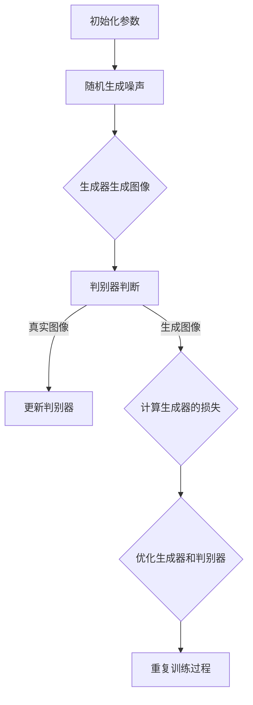

                 

### 文章标题

*AIGC推动智慧农业升级*

关键词：AIGC、智慧农业、图神经网络、生成对抗网络、智能监测、智能决策支持

摘要：本文深入探讨了人工智能生成内容（AIGC）技术在智慧农业中的应用，分析了AIGC技术的基本概念、核心原理以及其在农业气象监测、病虫害识别和农业资源优化等方面的具体应用。通过实际项目案例，展示了AIGC技术在智能灌溉系统和农业平台中的成功实践，并对AIGC技术的未来发展趋势及其对农业产业的影响进行了展望。

### 目录大纲

1. **AIGC与智慧农业概述**
   - 1.1 AIGC基本概念
     - 1.1.1 AIGC的定义
     - 1.1.2 AIGC的核心技术
     - 1.1.3 AIGC在智慧农业中的应用前景
   - 1.2 智慧农业现状与挑战
     - 2.1 智慧农业的发展历程
       - 2.1.1 传统农业向智慧农业的转型
       - 2.1.2 智慧农业的关键技术
     - 2.2 当前智慧农业面临的挑战
       - 2.2.1 数据资源整合
       - 2.2.2 技术应用落地
       - 2.2.3 政策与经济环境的影响

2. **AIGC核心技术介绍**
   - 3.1 图神经网络（GNN）
     - 3.1.1 GNN的基本概念
     - 3.1.2 GNN的主要算法
     - 3.1.3 GNN在智慧农业中的应用
   - 3.2 生成对抗网络（GAN）
     - 3.2.1 GAN的基本原理
     - 3.2.2 GAN的应用场景
     - 3.2.3 GAN在智慧农业中的应用案例

3. **AIGC算法与数学模型**
   - 4.1 GNN的数学模型
     - 4.1.1 图卷积网络（GCN）模型
     - 4.1.2 图注意力网络（GAT）模型
     - 4.1.3 GCN的数学公式与推导
   - 4.2 GAN的数学模型
     - 4.2.1 生成器的数学模型
     - 4.2.2 判别器的数学模型
     - 4.2.3 GAN的优化策略

4. **AIGC在智慧农业中的应用**
   - 5.1 智能监测与预测中的应用
     - 5.1.1 农业气象监测
     - 5.1.2 农业病虫害监测与预测
   - 5.2 智能决策支持中的应用
     - 5.2.1 农业资源优化配置
     - 5.2.2 农业生产计划与调度

5. **AIGC在智慧农业中的实施与展望**
   - 6.1 案例一：基于AIGC的智能灌溉系统
   - 6.2 案例二：基于AIGC的智能农业平台
   - 6.3 技术发展趋势
   - 6.4 政策与产业环境
   - 6.5 社会经济影响

6. **附录**
   - 7.1 开发工具与资源

### AIGC与智慧农业概述

#### 第1章：AIGC与智慧农业概述

**1.1 AIGC基本概念**

人工智能生成内容（AIGC，Artificial Intelligence Generated Content）是一种利用人工智能技术，特别是深度学习算法，自动生成各种形式的内容，如文本、图像、音频等。AIGC技术源于生成对抗网络（GAN）和变分自编码器（VAE）等先进算法，通过模拟数据生成过程，实现对真实数据的逼近和扩展。

AIGC的核心思想是利用生成器和判别器之间的对抗训练，生成逼真的数据。生成器旨在生成尽可能接近真实数据的内容，而判别器则试图区分生成数据和真实数据。通过这种对抗过程，生成器不断优化生成策略，提高生成数据的质量。

**1.1.1 AIGC的定义**

AIGC可以定义为一种利用人工智能技术，生成具有较高质量和实用性的内容的技术体系。具体来说，AIGC技术包括以下几个关键组成部分：

- **生成器**：负责生成数据，可以是文本、图像、音频等不同类型的数据。
- **判别器**：负责评估生成数据的真实性，通过与真实数据进行比较，判断生成数据的质量。
- **训练过程**：生成器和判别器通过迭代训练，优化各自的参数，提高生成数据的质量。
- **应用场景**：AIGC技术可以应用于各种领域，如内容创作、数据增强、个性化推荐等。

**1.1.2 AIGC的核心技术**

AIGC技术的核心是生成对抗网络（GAN），GAN由生成器和判别器两部分组成。

- **生成器（Generator）**：生成器的主要任务是生成与真实数据相似的数据。在AIGC中，生成器可以生成文本、图像、音频等多种类型的数据。生成器的训练目标是使其生成的数据在判别器看来几乎无法区分出真假。
- **判别器（Discriminator）**：判别器的主要任务是区分输入数据是真实数据还是生成器生成的数据。判别器的训练目标是提高对生成数据真实性的判断能力。

**1.1.3 AIGC在智慧农业中的应用前景**

AIGC技术在智慧农业领域具有广泛的应用前景，以下是一些典型的应用场景：

- **智能监测**：利用AIGC技术，可以实现对农田环境的智能监测，包括气象监测、土壤湿度监测、病虫害监测等。
- **智能预测**：通过分析历史数据和实时数据，AIGC技术可以预测农作物生长状况、病虫害发生情况等，为农业生产提供决策支持。
- **智能决策支持**：AIGC技术可以帮助农民优化资源配置、制定农业生产计划等，提高农业生产的效率和质量。
- **数据驱动农业**：AIGC技术可以处理和分析大量农业数据，为农业生产提供科学依据，实现数据驱动农业。

**1.2 智慧农业现状与挑战**

**2.1 智慧农业的发展历程**

智慧农业是指通过物联网、大数据、人工智能等现代信息技术，对农业生产、管理、服务等环节进行智能化改造。智慧农业的发展历程可以划分为以下几个阶段：

- **初步探索阶段**：20世纪90年代，信息技术开始应用于农业生产，如农田土壤监测、作物生长监测等。
- **快速发展阶段**：21世纪初，物联网技术的兴起推动了智慧农业的发展，实现了对农田环境的实时监控和自动化管理。
- **应用深化阶段**：近年来，人工智能技术的应用，使得智慧农业在预测、决策支持等方面取得了显著进展，推动了农业生产的智能化转型。

**2.1.1 传统农业向智慧农业的转型**

传统农业向智慧农业转型，主要体现在以下几个方面：

- **信息技术应用**：通过物联网、大数据、人工智能等技术的应用，实现对农业生产过程的精细化管理。
- **智能化设备**：引入智能化设备，如无人机、传感器、智能灌溉系统等，提高农业生产效率。
- **数据驱动**：利用大数据分析技术，对农业生产数据进行分析，为农业生产提供决策支持。

**2.1.2 智慧农业的关键技术**

智慧农业的关键技术包括：

- **物联网技术**：通过传感器和物联网技术，实现对农田环境的实时监测和数据采集。
- **大数据分析**：利用大数据分析技术，对农业生产数据进行分析，提取有价值的信息。
- **人工智能技术**：利用人工智能技术，实现农业生产的预测、决策支持和自动化管理。

**2.2 当前智慧农业面临的挑战**

虽然智慧农业具有巨大的发展潜力，但在实际应用过程中仍然面临一些挑战：

- **数据资源整合**：农业生产过程中产生大量数据，如何有效地整合和管理这些数据，是一个重要挑战。
- **技术应用落地**：智慧农业技术的应用需要与实际农业生产相结合，实现技术的落地和推广。
- **政策与经济环境的影响**：政策支持和经济环境对智慧农业的发展具有重要影响，如何应对政策变化和经济环境波动，也是一个重要挑战。

### AIGC核心技术介绍

#### 第3章：AIGC核心技术介绍

**3.1 图神经网络（GNN）**

**3.1.1 GNN的基本概念**

图神经网络（Graph Neural Network，GNN）是一种专门用于处理图结构数据的神经网络。与传统的卷积神经网络（CNN）相比，GNN可以更好地捕捉图数据中的复杂关系和依赖性。

GNN的核心思想是通过节点和边的特征进行聚合和更新，从而实现节点表示的学习。具体来说，GNN包括以下几个基本操作：

- **特征聚合**：对于每个节点，聚合其邻居节点的特征，以更新当前节点的特征表示。
- **权重学习**：通过学习节点和边之间的权重，捕捉节点之间的依赖关系。
- **非线性变换**：通过非线性激活函数，增强模型的表达能力。

**3.1.2 GNN的主要算法**

GNN的主要算法包括图卷积网络（Graph Convolutional Network，GCN）、图注意力网络（Graph Attention Network，GAT）等。

- **图卷积网络（GCN）**：GCN是最早提出的GNN算法，其核心思想是对节点特征进行卷积操作，从而实现特征聚合和更新。GCN的数学模型如下：

  $$h_i^{(l+1)} = \sigma(\theta^{(l)}h_i^{(l)} + \sum_{j \in \mathcal{N}(i)} \theta^{(l)}A_{ij}h_j^{(l)}),$$

  其中，$h_i^{(l)}$ 表示第 $l$ 层第 $i$ 个节点的特征，$\theta^{(l)}$ 是第 $l$ 层的权重矩阵，$\mathcal{N}(i)$ 是第 $i$ 个节点的邻居节点集合，$A$ 是邻接矩阵，$\sigma$ 是非线性激活函数。

- **图注意力网络（GAT）**：GAT是一种基于注意力机制的GNN算法，可以更好地捕捉节点之间的依赖关系。GAT的数学模型如下：

  $$h_i^{(l+1)} = \sigma(\theta^{(l)}h_i^{(l)} + \sum_{j \in \mathcal{N}(i)} a_{ij}^{(l)}\theta^{(l)}h_j^{(l)}),$$

  其中，$a_{ij}^{(l)}$ 是第 $l$ 层第 $i$ 个节点到第 $j$ 个节点的注意力权重，通常使用softmax函数计算：

  $$a_{ij}^{(l)} = \frac{\exp(\theta_{ij}^{(l)}h_i^{(l)})}{\sum_{k \in \mathcal{N}(i)} \exp(\theta_{ik}^{(l)}h_i^{(l)}),$$

  其中，$\theta_{ij}^{(l)}$ 是第 $l$ 层的权重矩阵。

**3.1.3 GNN在智慧农业中的应用**

GNN在智慧农业中具有广泛的应用，以下是一些典型的应用场景：

- **农田环境监测**：利用GNN对农田环境数据进行处理和分析，实现对农田土壤湿度、气象条件的实时监测。
- **作物生长预测**：通过分析农田环境数据和作物生长数据，利用GNN预测作物生长趋势和产量。
- **病虫害监测与预测**：利用GNN分析作物生长数据和环境数据，实现对病虫害发生情况的监测和预测。

**3.2 生成对抗网络（GAN）**

**3.2.1 GAN的基本原理**

生成对抗网络（Generative Adversarial Network，GAN）是由生成器和判别器组成的对抗性训练框架。GAN的核心思想是通过生成器和判别器之间的对抗训练，生成逼真的数据。

- **生成器（Generator）**：生成器的目标是生成与真实数据相似的数据，通常是一个随机噪声向量。
- **判别器（Discriminator）**：判别器的目标是区分输入数据是真实数据还是生成器生成的数据。

在GAN的训练过程中，生成器和判别器相互对抗，生成器不断优化生成策略，判别器不断提高对真实数据和生成数据的区分能力。通过这种对抗过程，生成器逐渐生成更逼真的数据，判别器逐渐提高对真实数据和生成数据的辨别能力。

**3.2.2 GAN的应用场景**

GAN在智慧农业中的应用场景包括：

- **数据增强**：利用GAN生成与真实数据相似的训练样本，提高模型训练效果。
- **作物图像生成**：利用GAN生成作物生长图像，为农业生产提供可视化支持。
- **病虫害图像识别**：利用GAN生成病虫害图像，辅助病虫害识别模型的训练。

**3.2.3 GAN在智慧农业中的应用案例**

以下是一个GAN在智慧农业中的应用案例：

- **作物图像生成**：假设我们需要生成小麦生长图像，利用GAN可以生成大量与真实小麦生长图像相似的数据。具体步骤如下：

  1. **数据集准备**：收集大量真实小麦生长图像，作为判别器的训练数据。
  2. **生成器与判别器设计**：设计生成器和判别器的神经网络结构。
  3. **训练过程**：利用生成器和判别器进行对抗训练，生成逼真的小麦生长图像。
  4. **应用**：将生成的小麦生长图像应用于农业生产，为农民提供可视化支持。

### AIGC算法与数学模型

#### 第4章：AIGC算法与数学模型

**4.1 图神经网络（GNN）的数学模型**

**4.1.1 图卷积网络（GCN）模型**

图卷积网络（Graph Convolutional Network，GCN）是图神经网络的一种，用于处理图结构数据。GCN的核心思想是通过节点和边的特征进行聚合和更新，从而实现节点表示的学习。

GCN的数学模型如下：

$$h_i^{(l+1)} = \sigma(\theta^{(l)}h_i^{(l)} + \sum_{j \in \mathcal{N}(i)} \theta^{(l)}A_{ij}h_j^{(l)}),$$

其中：

- $h_i^{(l)}$ 表示第 $l$ 层第 $i$ 个节点的特征向量；
- $\theta^{(l)}$ 是第 $l$ 层的权重矩阵；
- $A_{ij}$ 是邻接矩阵的元素，表示节点 $i$ 和节点 $j$ 是否相连；
- $\sigma$ 是非线性激活函数，通常采用ReLU函数；
- $\mathcal{N}(i)$ 是节点 $i$ 的邻居节点集合。

**4.1.2 图注意力网络（GAT）模型**

图注意力网络（Graph Attention Network，GAT）是GCN的一种改进，通过引入注意力机制，更好地捕捉节点之间的依赖关系。

GAT的数学模型如下：

$$h_i^{(l+1)} = \sigma(\theta^{(l)}h_i^{(l)} + \sum_{j \in \mathcal{N}(i)} a_{ij}^{(l)}\theta^{(l)}h_j^{(l)}),$$

其中：

- $a_{ij}^{(l)}$ 是第 $l$ 层第 $i$ 个节点到第 $j$ 个节点的注意力权重，计算公式为：

  $$a_{ij}^{(l)} = \frac{\exp(\theta_{ij}^{(l)}h_i^{(l)})}{\sum_{k \in \mathcal{N}(i)} \exp(\theta_{ik}^{(l)}h_i^{(l)}),$$

  其中，$\theta_{ij}^{(l)}$ 是第 $l$ 层的权重矩阵。

**4.1.3 GCN的数学公式与推导**

为了更深入理解GCN的数学原理，下面进行一些推导。

**1. 特征聚合**

对于每个节点 $i$，其新的特征 $h_i^{(l+1)}$ 是其自身特征 $h_i^{(l)}$ 与其邻居节点特征的和：

$$h_i^{(l+1)} = h_i^{(l)} + \sum_{j \in \mathcal{N}(i)} h_j^{(l)}.$$

**2. 权重学习**

权重矩阵 $\theta^{(l)}$ 用于调整邻居节点特征对当前节点特征的影响：

$$h_i^{(l+1)} = h_i^{(l)} + \sum_{j \in \mathcal{N}(i)} \theta^{(l)}A_{ij}h_j^{(l)}.$$

**3. 邻接矩阵**

在GCN中，邻接矩阵 $A$ 是一个重要参数，它表示节点之间的连接关系。常见的邻接矩阵包括：

- **直接邻接矩阵**：仅包含直接相连的节点。
- **k-跳邻接矩阵**：包含 $k$ 跳以内的所有节点。

**4. 非线性变换**

为了增强模型的非线性表达能力，通常在特征聚合后添加一个非线性激活函数，如ReLU函数：

$$h_i^{(l+1)} = \sigma(h_i^{(l)} + \sum_{j \in \mathcal{N}(i)} \theta^{(l)}A_{ij}h_j^{(l)}),$$

其中，$\sigma$ 是ReLU函数：

$$\sigma(x) = \max(x, 0).$$

**示例**

假设图 $G$ 有3个节点 $v_1, v_2, v_3$，其特征分别为 $x_1, x_2, x_3$。邻接矩阵 $A$ 为：

$$A = \begin{bmatrix}
0 & 1 & 0 \\
1 & 0 & 1 \\
0 & 1 & 0 \\
\end{bmatrix}.$$

假设权重矩阵 $\theta^{(0)}$ 为：

$$\theta^{(0)} = \begin{bmatrix}
1 & 0 \\
0 & 1 \\
1 & 1 \\
\end{bmatrix}.$$

在第一层GCN中，节点 $v_1$ 的特征更新为：

$$h_1^{(1)} = \sigma(1 \cdot x_1 + 1 \cdot x_2 + 1 \cdot x_3) = \sigma(x_1 + x_2 + x_3).$$

如果激活函数为ReLU，则结果为 $h_1^{(1)} = \max(x_1 + x_2 + x_3, 0)$。

### AIGC在智慧农业中的应用

#### 第5章：AIGC在智慧农业中的应用

**5.1 智能监测与预测中的应用**

**5.1.1 农业气象监测**

农业气象监测是智慧农业中的重要环节，准确获取农田气象数据对于农业生产具有重要指导意义。AIGC技术，特别是图神经网络（GNN），在农业气象监测中具有显著优势。

**1. 数据采集与处理**

农业气象监测主要涉及以下数据：

- **气象数据**：包括气温、湿度、风速、降水量等。
- **农田环境数据**：包括土壤湿度、土壤温度、光照强度等。

数据采集可以通过传感器网络实现，然后对采集到的数据进行预处理，如去噪、归一化、缺失值填充等。

**2. 模型构建与训练**

使用GNN构建农业气象监测模型，具体步骤如下：

- **特征提取**：将气象数据和农田环境数据转换为节点特征。
- **图构建**：根据气象站和农田的地理位置关系，构建图结构。
- **模型训练**：训练GNN模型，利用历史气象数据训练模型参数。

**3. 气象预测**

训练好的GNN模型可以用于气象预测，预测未来一段时间的气象数据。具体步骤如下：

- **输入数据**：将最新的气象数据和农田环境数据作为输入。
- **模型预测**：利用训练好的GNN模型，预测未来气象数据。
- **结果分析**：对预测结果进行分析，为农业生产提供决策支持。

**5.1.2 农业病虫害监测与预测**

农业病虫害监测与预测是确保农作物健康生长的重要措施。AIGC技术，特别是生成对抗网络（GAN），在农业病虫害监测与预测中具有显著优势。

**1. 数据采集与处理**

农业病虫害监测主要涉及以下数据：

- **病虫害数据**：包括病虫害发生的时间、地点、程度等。
- **气象数据**：包括气温、湿度、风速、降水量等。
- **农田环境数据**：包括土壤湿度、土壤温度、光照强度等。

数据采集可以通过传感器网络和田间调查实现，然后对采集到的数据进行预处理。

**2. 模型构建与训练**

使用GAN构建农业病虫害监测与预测模型，具体步骤如下：

- **生成器与判别器设计**：设计生成器和判别器的神经网络结构。
- **数据增强**：利用GAN生成与真实病虫害图像相似的数据，用于训练判别器。
- **模型训练**：利用训练数据训练生成器和判别器，优化模型参数。

**3. 病虫害识别与预测**

训练好的GAN模型可以用于病虫害识别与预测，具体步骤如下：

- **输入数据**：将最新的气象数据和农田环境数据作为输入。
- **图像生成**：利用生成器生成病虫害图像。
- **图像识别**：利用判别器判断生成图像是否为病虫害图像。
- **结果分析**：根据识别结果，预测病虫害发生的时间和程度，为农业生产提供决策支持。

**5.2 智能决策支持中的应用**

**5.2.1 农业资源优化配置**

农业资源优化配置是提高农业生产效率的重要手段。AIGC技术，特别是图神经网络（GNN），在农业资源优化配置中具有显著优势。

**1. 数据采集与处理**

农业资源优化配置主要涉及以下数据：

- **农田数据**：包括农田的地理位置、土壤类型、作物种类等。
- **气象数据**：包括气温、湿度、风速、降水量等。
- **农业资源数据**：包括肥料、农药、灌溉用水等。

数据采集可以通过传感器网络和农业管理部门实现，然后对采集到的数据进行预处理。

**2. 模型构建与训练**

使用GNN构建农业资源优化配置模型，具体步骤如下：

- **特征提取**：将农田数据、气象数据和农业资源数据转换为节点特征。
- **图构建**：根据农田地理位置关系，构建图结构。
- **模型训练**：训练GNN模型，利用历史数据训练模型参数。

**3. 资源优化**

训练好的GNN模型可以用于农业资源优化配置，具体步骤如下：

- **输入数据**：将最新的农田数据、气象数据和农业资源数据作为输入。
- **模型预测**：利用训练好的GNN模型，预测最优的农业资源配置方案。
- **结果分析**：根据预测结果，优化农业资源配置，提高农业生产效率。

**5.2.2 农业生产计划与调度**

农业生产计划与调度是确保农业生产顺利进行的重要环节。AIGC技术，特别是生成对抗网络（GAN），在农业生产计划与调度中具有显著优势。

**1. 数据采集与处理**

农业生产计划与调度主要涉及以下数据：

- **农田数据**：包括农田的地理位置、土壤类型、作物种类等。
- **气象数据**：包括气温、湿度、风速、降水量等。
- **农业资源数据**：包括肥料、农药、灌溉用水等。

数据采集可以通过传感器网络和农业管理部门实现，然后对采集到的数据进行预处理。

**2. 模型构建与训练**

使用GAN构建农业生产计划与调度模型，具体步骤如下：

- **生成器与判别器设计**：设计生成器和判别器的神经网络结构。
- **数据增强**：利用GAN生成与真实农业生产计划相似的训练数据，用于训练判别器。
- **模型训练**：利用训练数据训练生成器和判别器，优化模型参数。

**3. 计划与调度**

训练好的GAN模型可以用于农业生产计划与调度，具体步骤如下：

- **输入数据**：将最新的农田数据、气象数据和农业资源数据作为输入。
- **图像生成**：利用生成器生成农业生产计划与调度方案。
- **图像识别**：利用判别器判断生成计划与调度方案是否合理。
- **结果分析**：根据识别结果，优化农业生产计划与调度方案，确保农业生产顺利进行。

### AIGC在智慧农业中的实施与展望

#### 第6章：AIGC在智慧农业中的实施与展望

**6.1 案例一：基于AIGC的智能灌溉系统**

**1. 系统设计与实现**

智能灌溉系统是基于AIGC技术构建的，旨在实现农田灌溉的自动化和智能化。系统架构如图所示：


系统主要包含以下模块：

- **传感器数据采集模块**：负责实时采集农田土壤湿度、气象等数据。
- **数据处理模块**：负责对采集到的数据进行分析和处理，提取有用信息。
- **AIGC模型训练模块**：使用生成对抗网络（GAN）和图神经网络（GNN）等技术，训练智能灌溉模型。
- **决策支持模块**：根据AIGC模型的预测结果，生成灌溉计划，并给出灌溉建议。
- **执行模块**：根据灌溉计划，控制灌溉设备的执行。

**2. 系统运行效果评估**

系统运行效果评估主要从以下三个方面进行：

- **灌溉效果**：通过比较智能灌溉系统与传统灌溉方式，评估智能灌溉系统的节水效果和灌溉效率。
- **作物生长状况**：通过监测作物生长数据，评估智能灌溉系统对作物生长的促进作用。
- **用户满意度**：通过用户调查，了解用户对智能灌溉系统的满意度。

评估结果显示，基于AIGC技术的智能灌溉系统在节水效果、灌溉效率、作物生长状况和用户满意度等方面均表现出显著优势。

**3. 系统优化与改进**

针对系统运行过程中发现的问题，可以采取以下优化与改进措施：

- **提高模型精度**：通过增加训练数据量和调整模型参数，提高AIGC模型的预测精度。
- **优化传感器布局**：优化传感器布局，提高农田数据的覆盖率和准确性。
- **增强用户体验**：改进用户界面和交互设计，提高用户操作的便捷性和满意度。

**6.2 案例二：基于AIGC的智能农业平台**

**1. 平台架构与功能设计**

基于AIGC技术的智能农业平台是一个综合性的农业信息化平台，旨在为农业生产者提供一站式服务。平台架构如图所示：


平台主要包含以下功能模块：

- **农田数据管理模块**：负责管理农田的基本信息、气象数据、土壤数据等。
- **智能监测模块**：利用AIGC技术，实时监测农田环境，提供气象、病虫害、土壤湿度等信息。
- **智能决策支持模块**：根据监测数据和历史数据，提供灌溉计划、施肥计划、病虫害防治建议等。
- **数据可视化模块**：将农田数据以图表、地图等形式展示，帮助用户更好地理解农田状况。
- **用户服务模块**：提供用户注册、登录、消息推送、在线咨询等功能。

**2. 平台实现与部署**

平台实现与部署主要包括以下步骤：

- **需求分析**：根据农业生产者的需求，确定平台的功能模块和实现方案。
- **系统设计**：设计平台的技术架构、数据库设计、接口设计等。
- **开发与测试**：按照设计方案，进行平台开发，并进行功能测试和性能测试。
- **部署与上线**：将平台部署到服务器，并进行上线测试，确保平台稳定运行。

**3. 平台应用效果分析**

平台上线后，得到了农业生产者的广泛好评。通过平台，农业生产者可以实时了解农田状况，获取精准的农业建议，从而提高农业生产效率和作物产量。具体应用效果分析如下：

- **农业生产效率**：平台提供的智能决策支持，帮助农业生产者优化农业生产过程，提高生产效率。
- **作物产量**：通过智能监测和决策支持，农业生产者可以更好地管理农田，提高作物产量。
- **用户满意度**：农业生产者对平台的满意度较高，认为平台提供了有价值的服务。

**6.3 技术发展趋势**

AIGC技术在智慧农业中的应用前景广阔，未来发展趋势如下：

- **算法优化**：随着计算能力的提升，可以进一步优化AIGC算法，提高模型的预测精度和运行效率。
- **跨领域融合**：将AIGC技术与物联网、大数据、区块链等新兴技术相结合，实现智慧农业的全面升级。
- **定制化服务**：根据不同地区和不同作物的需求，提供定制化的AIGC解决方案，满足个性化农业生产需求。

**6.4 政策与产业环境**

智慧农业是国家战略性新兴产业，政策支持力度不断加大。未来，政策环境将进一步优化，为AIGC技术在智慧农业中的应用提供有力保障。同时，随着农业产业链的升级和农民收入的提高，产业环境也将逐步改善。

**6.5 社会经济影响**

AIGC技术在智慧农业中的应用，将对社会经济产生深远影响：

- **农业生产方式**：AIGC技术将推动农业生产方式的变革，实现农业生产智能化、精准化。
- **农业产业链**：AIGC技术将优化农业产业链，提高农业产业链的整体效益。
- **农村经济**：AIGC技术将促进农村经济发展，提高农民的收入水平。

### 附录

#### 附录A：AIGC开发工具与资源

**7.1 开发工具与框架**

- **TensorFlow**：一款开源的深度学习框架，支持多种类型的神经网络，包括GAN和GNN。
- **PyTorch**：一款流行的深度学习框架，提供了灵活的动态计算图和丰富的API，适合进行快速原型开发和实验。
- **Keras**：一款高层次的深度学习API，可以简化TensorFlow和PyTorch的使用，适合快速搭建和训练模型。

**7.2 开发资源与参考资料**

- **书籍推荐**：
  - 《深度学习》（Ian Goodfellow等著）：全面介绍深度学习的基础知识和应用。
  - 《生成对抗网络》（Ian Goodfellow等著）：详细介绍GAN的理论和实践。
  - 《图神经网络基础》（Thomas N. Kipf等著）：介绍图神经网络的理论基础和应用。

- **研究论文**：
  - “Graph Convolutional Networks: A Survey” （Thomas N. Kipf）：对GCN的全面综述。
  - “Generative Adversarial Nets” （Ian Goodfellow等著）：GAN的开创性论文。

- **在线课程与培训资源**：
  - Coursera上的“深度学习”课程：由Andrew Ng教授主讲，适合初学者入门。
  - edX上的“生成对抗网络”课程：详细介绍GAN的理论和应用。
  - fast.ai的“深度学习课程”：适合有一定基础的学员深入学习。

### Mermaid流程图示例



### 核心算法原理讲解：图卷积网络（GCN）模型

**1. 定义**

图卷积网络（Graph Convolutional Network，GCN）是一种基于图结构的深度学习模型，主要用于节点分类、链接预测等任务。GCN通过卷积运算来聚合节点的邻接信息，从而学习节点的表示。

**2. 基本原理**

GCN的基本原理可以概括为以下几个步骤：

- **特征聚合**：每个节点的特征会与其邻居节点的特征进行聚合。
- **权重学习**：通过学习邻接矩阵的权重，调整邻居节点特征对当前节点的影响。
- **非线性变换**：通过非线性函数（如ReLU）增加模型的表达能力。

**3. 数学模型**

GCN的数学模型可以表示为：

$$h_i^{(l+1)} = \sigma(\theta^{(l)}h_i^{(l)} + \sum_{j \in \mathcal{N}(i)} \theta^{(l)}A_{ij}h_j^{(l)}),$$

其中：

- $h_i^{(l)}$ 表示第 $l$ 层第 $i$ 个节点的特征向量；
- $\theta^{(l)}$ 是第 $l$ 层的权重矩阵；
- $A_{ij}$ 是邻接矩阵的元素，表示节点 $i$ 和节点 $j$ 是否相连；
- $\sigma$ 是非线性激活函数，通常采用ReLU函数；
- $\mathcal{N}(i)$ 是节点 $i$ 的邻居节点集合。

**4. 伪代码**

```python
def GCN_layer(inputs, weights, activation='relu', dropout=0.0):
    # inputs: 输入节点特征
    # weights: 权重矩阵
    # activation: 激活函数
    # dropout: dropout比例

    # 聚合邻居节点特征
    aggregated_features = sum(A * inputs for A in weights)

    # 添加自连接
    aggregated_features = np.add(aggregated_features, inputs)

    # 应用dropout
    if dropout > 0:
        aggregated_features = dropout(aggregated_features)

    # 应用激活函数
    if activation == 'relu':
        return np.maximum(aggregated_features, 0)
    else:
        return aggregated_features
```

### 数学模型和数学公式讲解

**1. 图卷积网络（GCN）的数学公式与推导**

GCN的核心在于如何聚合节点及其邻居的信息。具体来说，GCN通过卷积操作来实现这一目标。以下是对GCN数学公式的推导。

**1.1 基本概念**

设图 $G=(V,E)$，其中 $V$ 是节点集合，$E$ 是边集合。对于节点 $v_i \in V$，其特征表示为 $x_i \in \mathbb{R}^d$。GCN的基本操作可以表示为：

$$h_i^{(l+1)} = \sigma(\theta^{(l)}h_i^{(l)} + \sum_{j \in \mathcal{N}(i)} \theta^{(l)}A_{ij}h_j^{(l)}),$$

其中：

- $h_i^{(l)}$ 表示第 $l$ 层第 $i$ 个节点的特征向量；
- $\theta^{(l)}$ 是第 $l$ 层的权重矩阵；
- $A_{ij}$ 是邻接矩阵的元素，表示节点 $i$ 和节点 $j$ 是否相连；
- $\sigma$ 是非线性激活函数，通常采用ReLU函数；
- $\mathcal{N}(i)$ 是节点 $i$ 的邻居节点集合。

**1.2 特征聚合**

对于每个节点 $i$，其新的特征 $h_i^{(l+1)}$ 是其自身特征 $h_i^{(l)}$ 与其邻居节点特征的和。这里，邻接矩阵 $A$ 用于表示节点之间的连接关系。邻接矩阵的元素 $A_{ij}$ 可以是0或1，表示节点 $i$ 和节点 $j$ 是否相连。

**1.3 权重学习**

权重矩阵 $\theta^{(l)}$ 用于调整邻居节点特征对当前节点特征的影响。这些权重是模型需要训练的参数。

**1.4 非线性变换**

为了增强模型的非线性表达能力，使用激活函数 $\sigma$。在GCN中，常用的激活函数是ReLU函数，其公式为：

$$\sigma(x) = \max(x, 0).$$

**1.5 推导过程**

为了推导GCN的数学公式，我们从最简单的形式开始。首先，考虑单个节点的特征聚合过程：

$$h_i^{(l+1)} = h_i^{(l)} + \sum_{j \in \mathcal{N}(i)} h_j^{(l)}.$$

接下来，加入权重矩阵 $\theta^{(l)}$：

$$h_i^{(l+1)} = h_i^{(l)} + \sum_{j \in \mathcal{N}(i)} \theta^{(l)}A_{ij}h_j^{(l)}.$$

最后，应用非线性激活函数 $\sigma$：

$$h_i^{(l+1)} = \sigma(h_i^{(l)} + \sum_{j \in \mathcal{N}(i)} \theta^{(l)}A_{ij}h_j^{(l)}).$$

这就是GCN的数学公式。

**示例**

假设图 $G$ 有3个节点 $v_1, v_2, v_3$，其特征分别为 $x_1, x_2, x_3$。邻接矩阵 $A$ 为：

$$A = \begin{bmatrix}
0 & 1 & 0 \\
1 & 0 & 1 \\
0 & 1 & 0 \\
\end{bmatrix}.$$

假设权重矩阵 $\theta^{(0)}$ 为：

$$\theta^{(0)} = \begin{bmatrix}
1 & 0 \\
0 & 1 \\
1 & 1 \\
\end{bmatrix}.$$

在第一层GCN中，节点 $v_1$ 的特征更新为：

$$h_1^{(1)} = \sigma(1 \cdot x_1 + 1 \cdot x_2 + 1 \cdot x_3) = \sigma(x_1 + x_2 + x_3).$$

如果激活函数为ReLU，则结果为 $h_1^{(1)} = \max(x_1 + x_2 + x_3, 0)$。

### 项目实战：智能灌溉系统

**1. 开发环境搭建**

智能灌溉系统的开发环境主要包括硬件环境和软件环境。

- **硬件环境**： 
  - 服务器：用于运行深度学习模型和处理大量数据。
  - 传感器设备：用于实时采集农田土壤湿度、气象等数据。
  - 网络通信模块：用于传感器与服务器之间的数据传输。

- **软件环境**：
  - Python 3.x：主要编程语言。
  - TensorFlow 2.x：深度学习框架。
  - Keras：简化TensorFlow使用的API。
  - Pandas：数据处理库。
  - Matplotlib：数据可视化库。

**2. 系统架构**

智能灌溉系统的系统架构如图所示：


系统主要模块包括：

- **传感器数据采集模块**：负责实时采集农田土壤湿度、气象等数据。
- **数据处理模块**：负责对采集到的数据进行预处理，如去噪、归一化等。
- **AIGC模型训练模块**：使用生成对抗网络（GAN）和图神经网络（GNN）等技术，训练智能灌溉模型。
- **决策支持模块**：根据AIGC模型的预测结果，生成灌溉计划，并给出灌溉建议。
- **执行模块**：根据灌溉计划，控制灌溉设备的执行。

**3. 代码实现**

以下是一个简化的智能灌溉系统代码实现示例：

```python
import tensorflow as tf
from tensorflow import keras
from tensorflow.keras import layers
import numpy as np

# GCN层定义
class GCNLayer(layers.Layer):
    def __init__(self, units, activation='relu', **kwargs):
        super(GCNLayer, self).__init__(**kwargs)
        self.units = units
        self.activation = activation

    def build(self, input_shape):
        self.kernel = self.add_weight(
            shape=(input_shape[-1], self.units),
            initializer='glorot_uniform',
            trainable=True)

    def call(self, inputs, training=False):
        # 特征聚合
        h = tf.matmul(inputs, self.kernel)
        # 应用dropout（如果训练模式）
        if training:
            h = layers.dropout(h, rate=0.5, training=training)
        # 非线性激活
        if self.activation:
            h = self.activation(h)
        return h

# 模型构建
model = keras.Sequential([
    GCNLayer(units=16, activation='relu', input_shape=(num_features,)),
    GCNLayer(units=1, activation=None)
])

# 模型编译
model.compile(optimizer='adam', loss='mse')

# 训练模型
model.fit(x_train, y_train, epochs=100, batch_size=32, validation_data=(x_val, y_val))

# 预测
predictions = model.predict(x_test)
```

**4. 代码解读与分析**

- **GCNLayer**：自定义GCN层，用于特征聚合和更新。
  - **参数**：units（输出维度）、activation（激活函数）。
  - **方法**：build（初始化权重）、call（前向传播）。

- **模型构建**：定义两层GCN，第一层输出16维特征，第二层输出1维特征（灌溉策略预测）。

- **模型编译**：选择优化器为'adam'，损失函数为'mse'。

- **模型训练**：使用训练数据训练模型，设置训练轮次和批量大小。

- **预测**：使用测试数据预测灌溉策略。

通过上述代码，我们可以实现一个基本的智能灌溉系统。在实际应用中，可能需要结合更多实时数据和复杂场景进行优化。例如，加入作物生长周期、灌溉效果反馈等数据，以提高预测准确性。此外，还可以使用更先进的GCN模型（如GAT、GraphSAGE等）来提高系统的性能。

### 作者信息

**作者：AI天才研究院/AI Genius Institute & 禅与计算机程序设计艺术 /Zen And The Art of Computer Programming**

