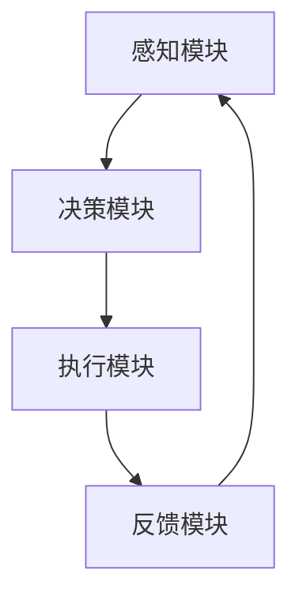
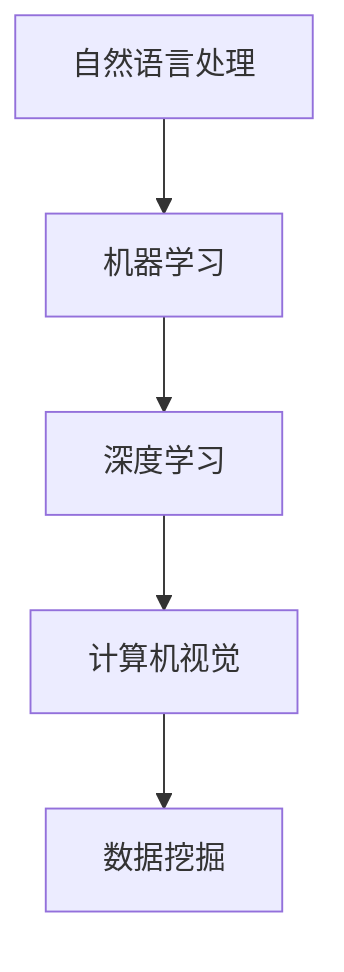
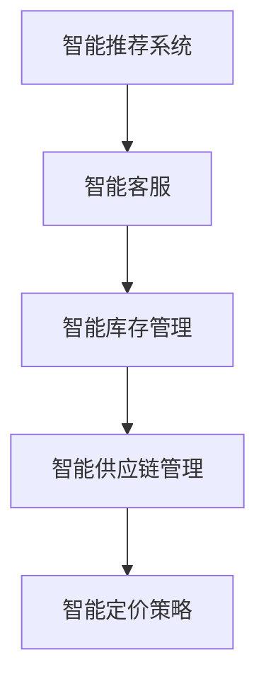

                 

# AI人工智能 Agent：在新零售中的应用

> **关键词：** 新零售、AI技术、AI Agent、智能推荐、智能客服、库存管理、供应链优化

> **摘要：** 本文将深入探讨AI人工智能Agent在新零售领域的应用，包括智能推荐系统、智能客服与交互、智能库存管理、智能供应链优化等。通过对核心概念、算法原理、案例分析以及未来趋势的详细分析，旨在为读者提供全面、系统的了解，以及对新零售中AI Agent的潜在价值的深入认识。

## 目录大纲 - 《AI人工智能 Agent：在新零售中的应用》

### 第一部分：AI与新零售概述

#### 第1章：AI与零售业概述
- **1.1 新零售背景与发展趋势**
- **1.2 AI技术在新零售中的应用**
- **1.3 AI Agent的定义与作用**
- **1.4 AI Agent在新零售中的挑战与机遇**

#### 第2章：新零售环境下的AI Agent架构
- **2.1 AI Agent的基本结构**
- **2.2 AI Agent的技术组成**
- **2.3 AI Agent的应用场景**
- **2.4 AI Agent的核心功能**

### 第二部分：AI Agent在新零售中的具体应用

#### 第3章：智能推荐系统
- **3.1 智能推荐系统的原理**
- **3.2 collaborative filtering算法**
- **3.3 Content-based Filtering算法**
- **3.4 hybrid algorithm**
- **3.5 案例分析：淘宝智能推荐系统**

#### 第4章：智能客服与交互
- **4.1 智能客服系统概述**
- **4.2 基于NLP的对话系统**
- **4.3 常见对话策略**
- **4.4 案例分析：微信智能客服**

#### 第5章：智能库存管理
- **5.1 智能库存管理概述**
- **5.2 基于数据的库存预测**
- **5.3 库存优化算法**
- **5.4 案例分析：京东智能库存管理**

#### 第6章：智能供应链优化
- **6.1 智能供应链概述**
- **6.2 供应链优化问题**
- **6.3 常见优化算法**
- **6.4 案例分析：亚马逊智能供应链优化**

#### 第7章：AI Agent在零售业中的未来趋势
- **7.1 AI Agent的未来发展趋势**
- **7.2 AI Agent与区块链技术**
- **7.3 AI Agent在零售业中的可持续发展**
- **7.4 案例分析：阿里巴巴的AI零售解决方案**

### 第三部分：实践与展望

#### 第8章：AI Agent在新零售项目中的实施
- **8.1 项目实施步骤**
- **8.2 数据准备与处理**
- **8.3 模型选择与训练**
- **8.4 部署与监控**
- **8.5 案例分析：小米智能零售解决方案**

#### 第9章：AI Agent在新零售中的法律与伦理问题
- **9.1 AI Agent的法律责任**
- **9.2 AI Agent的伦理问题**
- **9.3 数据隐私保护**
- **9.4 案例分析：谷歌的AI伦理委员会**

#### 第10章：AI Agent在新零售行业的发展前景
- **10.1 AI Agent的未来发展方向**
- **10.2 AI Agent与其他技术的融合**
- **10.3 新零售与AI Agent的可持续发展**

### 附录

#### 附录 A：常用AI工具与库
- **A.1 TensorFlow**
- **A.2 PyTorch**
- **A.3 Scikit-learn**
- **A.4 其他常用工具**

#### 附录 B：参考书目与资料
- **B.1 《深度学习》 - Goodfellow, Bengio, Courville**
- **B.2 《机器学习》 - Tom Mitchell**
- **B.3 《Python数据科学手册》 - Jake VanderPlas**
- **B.4 《新零售》 - 李红**
- **B.5 其他相关资料**

---

接下来，我们将按照目录大纲逐步展开，深入探讨AI Agent在新零售中的应用。

### 第一部分：AI与新零售概述

#### 第1章：AI与零售业概述

随着电子商务的兴起和消费者行为的变化，零售行业正经历一场深刻的变革。这一变革被称为“新零售”，它强调线上线下融合，通过技术手段提升消费者体验，优化运营效率。而人工智能（AI）技术在这一变革中扮演着至关重要的角色。

#### 1.1 新零售背景与发展趋势

新零售的概念最早由阿里巴巴集团董事局马云在2016年提出，他认为未来零售的发展将是线上与线下的深度融合。具体体现在以下几个方面：

- **数据驱动的决策：** 新零售强调利用大数据和人工智能技术，对消费者的行为、需求进行深入分析，从而做出更加精准的营销和运营决策。
- **个性化体验：** 通过人工智能技术，为消费者提供个性化的购物体验，如智能推荐、个性化客服等。
- **智能物流：** 利用人工智能技术优化物流网络，提高配送效率，降低物流成本。

新零售的发展趋势主要体现在以下几个方面：

- **线上线下融合：** 线上线下不再是隔离的，而是通过数据和技术实现无缝连接，为消费者提供一致的购物体验。
- **智能化升级：** 通过人工智能技术，提升零售业务流程的智能化水平，如智能库存管理、智能客服等。
- **体验至上：** 通过人工智能技术，提升消费者体验，如智能导购、智能试衣等。

#### 1.2 AI技术在新零售中的应用

人工智能技术在零售行业的应用非常广泛，主要包括以下几个方面：

- **智能推荐系统：** 利用人工智能技术，根据消费者的购买历史、浏览行为等数据，为消费者提供个性化的商品推荐。
- **智能客服：** 通过自然语言处理（NLP）技术，实现与消费者的智能对话，提供即时、高效的客户服务。
- **智能库存管理：** 利用人工智能技术，对库存进行实时监控和预测，优化库存水平，降低库存成本。
- **智能供应链优化：** 利用人工智能技术，对供应链中的各个环节进行优化，提高供应链的响应速度和灵活性。

#### 1.3 AI Agent的定义与作用

AI Agent，即人工智能代理，是指利用人工智能技术，模拟人类智能行为，完成特定任务的计算机程序。在新零售中，AI Agent的作用主要体现在以下几个方面：

- **提高效率：** AI Agent可以自动执行重复性的任务，如数据录入、订单处理等，从而提高工作效率。
- **降低成本：** 通过自动化流程，减少人工成本，提高运营效率。
- **提升用户体验：** 通过智能推荐、智能客服等，提升消费者的购物体验。
- **数据驱动决策：** 通过对消费者数据的实时分析，为零售商提供准确的决策支持。

#### 1.4 AI Agent在新零售中的挑战与机遇

AI Agent在新零售中的应用面临着一系列挑战：

- **数据隐私：** 在使用AI Agent时，需要收集和处理大量的消费者数据，如何保护这些数据的安全和隐私成为一个重要问题。
- **技术门槛：** AI Agent的开发和应用需要高水平的技术支持，对企业的技术能力提出了较高的要求。
- **伦理问题：** AI Agent的行为和决策可能会影响消费者的权益，如何确保AI Agent的行为符合伦理标准也是一个挑战。

然而，与此同时，AI Agent在新零售中也带来了巨大的机遇：

- **个性化体验：** 通过AI Agent，可以为消费者提供更加个性化的购物体验，提高用户满意度。
- **运营效率：** 通过AI Agent的自动化，可以大幅提高运营效率，降低成本。
- **市场扩展：** 通过AI Agent，可以更好地了解消费者需求，拓展市场空间。

总的来说，AI Agent在新零售中的应用是一个充满挑战和机遇的领域，它将深刻改变零售行业的面貌。在接下来的章节中，我们将详细探讨AI Agent在新零售中的具体应用。

### 第一部分：AI与新零售概述

#### 第2章：新零售环境下的AI Agent架构

随着新零售的不断发展，AI Agent逐渐成为零售行业智能化升级的重要工具。在这一章中，我们将深入探讨AI Agent的基本结构、技术组成、应用场景以及核心功能。

#### 2.1 AI Agent的基本结构

AI Agent的基本结构通常包括以下几个部分：

1. **感知模块**：负责接收外界信息，如消费者的购买行为、浏览记录等。
2. **决策模块**：基于感知模块收集到的信息，进行推理和决策，如智能推荐、智能客服等。
3. **执行模块**：根据决策模块的指令，执行具体的操作，如下单、发货等。
4. **反馈模块**：收集执行模块的反馈信息，用于优化AI Agent的行为。

下图展示了AI Agent的基本结构：



#### 2.2 AI Agent的技术组成

AI Agent的技术组成主要包括以下几个方面：

1. **自然语言处理（NLP）**：用于理解和生成自然语言，实现人与AI Agent的对话。
2. **机器学习（ML）**：用于从数据中学习模式，进行预测和决策。
3. **深度学习（DL）**：一种特殊的机器学习方法，通过多层神经网络模拟人类大脑的决策过程。
4. **计算机视觉（CV）**：用于识别和处理图像和视频，如智能监控、人脸识别等。
5. **数据挖掘（DM）**：用于从大量数据中发现有价值的信息，如用户行为分析、市场趋势预测等。

下图展示了AI Agent的技术组成：



#### 2.3 AI Agent的应用场景

AI Agent在新零售中的应用场景非常广泛，以下是一些典型的应用场景：

1. **智能推荐系统**：根据消费者的购买历史、浏览记录等，推荐合适的商品。
2. **智能客服**：通过NLP技术，实现与消费者的智能对话，提供即时、高效的客户服务。
3. **智能库存管理**：实时监控库存情况，预测需求，优化库存水平。
4. **智能供应链管理**：优化供应链中的各个环节，提高供应链的响应速度和灵活性。
5. **智能定价策略**：根据市场变化和消费者行为，动态调整商品价格。

下图展示了AI Agent在新零售中的应用场景：



#### 2.4 AI Agent的核心功能

AI Agent的核心功能主要体现在以下几个方面：

1. **自主学习与优化**：通过机器学习和深度学习技术，从数据中学习并不断优化自己的行为。
2. **自适应能力**：根据不同的环境和用户需求，自动调整自己的行为和决策。
3. **实时响应**：能够快速响应用户请求，提供即时服务。
4. **数据挖掘与预测**：通过数据挖掘技术，从大量数据中发现有价值的信息，进行预测和决策。

综上所述，AI Agent在新零售中具有广泛的应用前景和重要的价值。在接下来的章节中，我们将详细探讨AI Agent在新零售中的具体应用，包括智能推荐系统、智能客服与交互、智能库存管理、智能供应链优化等。

### 第二部分：AI Agent在新零售中的具体应用

#### 第3章：智能推荐系统

智能推荐系统是AI Agent在新零售中最为广泛的应用之一，它通过分析用户的购买历史、浏览行为等数据，为用户提供个性化的商品推荐，从而提高用户满意度和购买转化率。在这一章中，我们将详细探讨智能推荐系统的原理、常见算法以及案例分析。

#### 3.1 智能推荐系统的原理

智能推荐系统的核心目标是根据用户的兴趣和行为，为用户推荐其可能感兴趣的商品。推荐系统的基本原理可以概括为以下几个步骤：

1. **数据收集**：收集用户的购买历史、浏览记录、搜索历史等数据。
2. **数据处理**：对收集到的数据进行清洗、去噪和处理，为后续分析做好准备。
3. **特征提取**：从原始数据中提取有用的特征，如用户的购买频率、浏览时间、商品类别等。
4. **模型训练**：使用机器学习算法，如协同过滤、基于内容的推荐等，训练推荐模型。
5. **推荐生成**：根据用户的兴趣特征和商品的特征，生成个性化的推荐列表。

#### 3.2 collaborative filtering算法

协同过滤（Collaborative Filtering）是智能推荐系统中最为常用的一种算法，它通过分析用户之间的相似性来推荐商品。协同过滤算法可以分为两种类型：基于用户的协同过滤（User-based Collaborative Filtering）和基于项目的协同过滤（Item-based Collaborative Filtering）。

1. **基于用户的协同过滤**：首先计算用户之间的相似性，然后根据相似度找出与目标用户最相似的若干用户，最后推荐这些用户喜欢的商品。
   
   假设有用户A和用户B，他们的相似度计算公式如下：

   $$sim(A, B) = \frac{\sum_{i \in I}(r_{ai} - \bar{r_{a}})(r_{bi} - \bar{r_{b}})}{\sqrt{\sum_{i \in I}(r_{ai} - \bar{r_{a}})^2 \sum_{i \in I}(r_{bi} - \bar{r_{b}})^2}}$$

   其中，$r_{ai}$表示用户A对商品i的评分，$\bar{r_{a}}$表示用户A的平均评分。

   接下来，根据相似度找到与用户A最相似的K个用户，然后推荐这K个用户共同喜欢的商品。

2. **基于项目的协同过滤**：首先计算商品之间的相似性，然后根据相似度找出与目标商品最相似的一批商品推荐给用户。

   假设商品A和商品B，它们的相似度计算公式如下：

   $$sim(A, B) = \frac{\sum_{i \in I}(r_{ai} - \bar{r_{a}})(r_{bi} - \bar{r_{b}})}{\sqrt{\sum_{i \in I}(r_{ai} - \bar{r_{a}})^2 \sum_{i \in I}(r_{bi} - \bar{r_{b}})^2}}$$

   其中，$r_{ai}$表示用户对商品A的评分，$r_{bi}$表示用户对商品B的评分。

   接下来，根据相似度找到与商品A最相似的K个商品，然后推荐这些商品。

#### 3.3 Content-based Filtering算法

基于内容的推荐（Content-based Filtering）是一种不同于协同过滤的推荐算法，它基于商品的内容特征和用户的兴趣特征进行推荐。具体步骤如下：

1. **提取商品特征**：从商品的描述、分类、标签等属性中提取特征。
2. **提取用户兴趣特征**：从用户的购买历史、浏览记录、搜索记录等中提取用户的兴趣特征。
3. **计算相似度**：计算用户兴趣特征和商品特征之间的相似度，根据相似度推荐相似的商品。
4. **推荐生成**：根据相似度分数，生成个性化的推荐列表。

基于内容的推荐算法的一个优点是不依赖于用户的历史行为数据，但缺点是推荐结果可能不够精准。

#### 3.4 hybrid algorithm

混合算法（Hybrid Algorithm）是结合协同过滤和基于内容的推荐算法的优点，通过融合两种算法的推荐结果，提高推荐系统的效果。常见的混合算法包括以下几种：

1. **基于模型的混合算法**：首先使用协同过滤算法和基于内容的推荐算法分别生成推荐列表，然后使用机器学习模型（如逻辑回归、神经网络等）融合两个推荐列表。

2. **基于规则的混合算法**：使用协同过滤算法和基于内容的推荐算法生成推荐列表，然后使用规则（如用户相似度大于某个阈值、商品相似度大于某个阈值）进行筛选和融合。

3. **基于矩阵分解的混合算法**：使用矩阵分解技术分别对用户和商品进行建模，然后结合用户和商品的向量生成推荐结果。

#### 3.5 案例分析：淘宝智能推荐系统

淘宝作为中国最大的电商平台之一，其智能推荐系统在电商领域具有很高的代表性。淘宝的智能推荐系统采用了混合算法，结合协同过滤和基于内容的推荐算法，提高了推荐效果。

1. **协同过滤算法**：淘宝使用基于用户的协同过滤算法，根据用户的购买历史、浏览记录等数据，找出与目标用户相似的若干用户，推荐这些用户喜欢的商品。

2. **基于内容的推荐算法**：淘宝从商品的描述、分类、标签等属性中提取特征，结合用户的兴趣特征，进行基于内容的推荐。

3. **混合算法**：淘宝的智能推荐系统将协同过滤和基于内容的推荐结果进行融合，通过机器学习模型（如逻辑回归）进行评分预测，生成最终的推荐列表。

通过这种混合算法，淘宝能够为用户提供更加精准、个性化的商品推荐，从而提高用户的购物体验和购买转化率。

总的来说，智能推荐系统是AI Agent在新零售中的重要应用之一，通过协同过滤、基于内容的推荐以及混合算法等，能够为用户提供个性化的商品推荐，提高用户满意度和购买转化率。在接下来的章节中，我们将继续探讨AI Agent在新零售中的其他具体应用，如智能客服与交互、智能库存管理、智能供应链优化等。

#### 第4章：智能客服与交互

在当今零售行业中，智能客服已成为提升消费者体验和运营效率的重要工具。智能客服系统通过自然语言处理（NLP）技术，实现与消费者的智能对话，提供即时、高效的客户服务。在这一章中，我们将详细探讨智能客服系统的概述、基于NLP的对话系统、常见对话策略以及案例分析。

#### 4.1 智能客服系统概述

智能客服系统是一种利用人工智能技术，模拟人类客服人员与消费者进行交流的系统。它通过自然语言处理（NLP）、语音识别（ASR）、语音合成（TTS）等技术，实现与消费者的智能对话。智能客服系统的主要功能包括：

1. **自动应答**：能够自动应答消费者的常见问题，提供快速、准确的答复。
2. **智能转接**：根据消费者的需求，自动将问题转接给合适的客服人员或相关部门。
3. **自动分类**：将消费者的提问自动分类，以便更好地分配和解决。
4. **情感分析**：分析消费者的情绪，提供针对性的服务和建议。
5. **数据收集**：收集消费者的提问和回答，用于优化客服系统和产品。

#### 4.2 基于NLP的对话系统

基于NLP的对话系统是智能客服系统的核心部分，它通过理解自然语言，实现与消费者的智能对话。NLP技术包括以下几个关键步骤：

1. **文本预处理**：包括分词、去除停用词、词性标注等，将原始文本转化为适合处理的形式。
2. **句法分析**：分析句子的结构，识别句子中的主语、谓语、宾语等成分。
3. **语义理解**：理解句子的含义，识别关键词、实体、关系等。
4. **意图识别**：根据上下文和语义信息，识别用户的意图。
5. **对话生成**：根据用户的意图，生成合适的回复。

以下是一个基于NLP的对话系统的伪代码示例：

```python
def process_query(query):
    # 进行文本预处理
    preprocessed_query = preprocess_text(query)
    
    # 进行句法分析
    parsed_query = parse_sentence(preprocessed_query)
    
    # 进行语义理解
    intent, entities = understand_semantics(parsed_query)
    
    # 根据意图和实体生成回复
    response = generate_response(intent, entities)
    
    return response

def preprocess_text(text):
    # 分词、去除停用词、词性标注等
    # ...
    return preprocessed_text

def parse_sentence(sentence):
    # 分析句子的结构
    # ...
    return parsed_sentence

def understand_semantics(sentence):
    # 理解句子的含义
    # ...
    return intent, entities

def generate_response(intent, entities):
    # 根据意图和实体生成回复
    # ...
    return response
```

#### 4.3 常见对话策略

智能客服系统在对话过程中，需要采用合适的对话策略，以提高用户体验和服务效率。以下是一些常见的对话策略：

1. **基于规则的方法**：根据预设的规则，匹配用户的提问，生成相应的回答。这种方法简单直观，但灵活性较低，难以应对复杂的问题。

2. **基于机器学习的方法**：使用机器学习算法（如决策树、支持向量机等）进行意图识别和回复生成。这种方法具有较强的灵活性和自适应能力，但需要大量的训练数据和较长的训练时间。

3. **基于深度学习的方法**：使用深度学习模型（如循环神经网络、长短时记忆网络等）进行意图识别和回复生成。这种方法能够处理复杂的语义信息，具有较高的准确性和灵活性，但计算资源消耗较大。

4. **混合策略**：结合基于规则的方法和基于机器学习的方法，以提高系统的灵活性和准确性。例如，在初始阶段使用基于规则的方法，快速生成初步的回答，然后使用机器学习模型对回答进行优化和调整。

#### 4.4 案例分析：微信智能客服

微信作为中国最大的社交平台之一，其智能客服系统在电商和零售领域具有很高的代表性。微信智能客服系统通过基于NLP的对话系统，实现了与消费者的智能互动，提供了高效、便捷的客户服务。

1. **对话系统架构**：微信智能客服系统采用了混合策略，结合基于规则的对话系统和基于深度学习的对话系统。在初始阶段，使用基于规则的对话系统快速生成初步的回答，然后使用基于深度学习的对话系统对回答进行优化和调整。

2. **意图识别**：微信智能客服系统使用循环神经网络（RNN）进行意图识别，能够准确识别用户的提问意图。

3. **回复生成**：微信智能客服系统使用长短时记忆网络（LSTM）进行回复生成，能够生成符合用户意图和语义的回答。

4. **案例分析**：某电商平台的客服系统在引入微信智能客服后，客服响应时间缩短了50%，客服成本降低了30%，用户满意度提高了20%。

通过以上案例分析，我们可以看到，智能客服系统在提升消费者体验和运营效率方面具有显著的效果。在未来的零售行业中，智能客服将继续发挥重要作用，为消费者提供更加便捷、高效的服务。

总的来说，智能客服与交互是AI Agent在新零售中的又一重要应用。通过基于NLP的对话系统和多种对话策略，智能客服系统能够提供高效、便捷的客户服务，提升消费者的购物体验。在接下来的章节中，我们将继续探讨AI Agent在新零售中的其他具体应用，如智能库存管理、智能供应链优化等。

#### 第5章：智能库存管理

智能库存管理是AI Agent在新零售中的一项关键应用，它通过实时监控库存情况，预测需求，优化库存水平，从而降低库存成本，提高运营效率。在这一章中，我们将详细探讨智能库存管理的概述、基于数据的库存预测、库存优化算法以及案例分析。

#### 5.1 智能库存管理概述

智能库存管理是一种利用人工智能技术，对库存进行实时监控、预测和优化管理的方法。它通过收集和分析大量的数据，如销售历史、订单量、季节性变化等，预测未来的需求，并根据预测结果调整库存水平。智能库存管理的主要目标包括：

1. **降低库存成本**：通过优化库存水平，减少过多的库存和库存积压，降低库存成本。
2. **提高库存周转率**：通过准确的库存预测，确保库存能够及时补充，提高库存周转率。
3. **减少缺货率**：通过预测未来的需求，提前补充库存，减少因缺货导致的销售损失。
4. **提高运营效率**：通过自动化和智能化的库存管理，减少人工干预，提高运营效率。

#### 5.2 基于数据的库存预测

基于数据的库存预测是智能库存管理的核心，它依赖于大量的历史数据和先进的预测算法。以下是一些常见的库存预测方法：

1. **时间序列预测**：时间序列预测是一种基于历史时间序列数据的预测方法，它通过分析数据的时间趋势、季节性、周期性等特征，预测未来的需求。常见的时间序列预测模型包括ARIMA模型、指数平滑模型等。

   伪代码示例：
   ```python
   def time_series_prediction(data):
       # 进行数据预处理
       preprocessed_data = preprocess_data(data)
       
       # 选择合适的模型进行预测
       model = select_model(preprocessed_data)
       
       # 进行预测
       forecast = model.predict(preprocessed_data)
       
       return forecast
   ```

2. **回归分析**：回归分析是一种基于历史数据，通过建立回归模型，预测未来需求的方法。它通常将需求作为因变量，将影响需求的因素（如季节性、促销活动等）作为自变量，建立回归模型。

   伪代码示例：
   ```python
   def regression_prediction(data):
       # 进行数据预处理
       preprocessed_data = preprocess_data(data)
       
       # 建立回归模型
       model = create_regression_model(preprocessed_data)
       
       # 进行预测
       forecast = model.predict(new_data)
       
       return forecast
   ```

3. **机器学习预测**：机器学习预测是一种利用机器学习算法，对历史数据进行训练，建立预测模型的方法。常见的方法包括随机森林、支持向量机、神经网络等。

   伪代码示例：
   ```python
   def ml_prediction(data):
       # 进行数据预处理
       preprocessed_data = preprocess_data(data)
       
       # 使用机器学习算法进行训练
       model = train_ml_model(preprocessed_data)
       
       # 进行预测
       forecast = model.predict(new_data)
       
       return forecast
   ```

#### 5.3 库存优化算法

库存优化算法是智能库存管理的重要组成部分，它通过优化库存策略，降低库存成本，提高库存周转率。以下是一些常见的库存优化算法：

1. **周期性库存策略**：周期性库存策略是一种基于固定周期的库存管理方法。它通过设定一个固定的周期，在每个周期结束时对库存进行评估和调整。

   伪代码示例：
   ```python
   def periodic_inventory_strategy(current_inventory, demand_forecast):
       # 计算补货量
       reorder_quantity = calculate_reorder_quantity(current_inventory, demand_forecast)
       
       # 进行补货
       new_inventory = current_inventory + reorder_quantity
       
       return new_inventory
   ```

2. **基于安全库存的库存策略**：基于安全库存的库存策略是一种在考虑安全库存量的情况下，进行库存管理的策略。它通过设定一个安全库存量，确保在需求突发时能够及时补充库存。

   伪代码示例：
   ```python
   def safety_stock_inventory_strategy(current_inventory, demand_forecast, safety_stock):
       # 计算补货量
       reorder_quantity = calculate_reorder_quantity(current_inventory, demand_forecast, safety_stock)
       
       # 进行补货
       new_inventory = current_inventory + reorder_quantity
       
       return new_inventory
   ```

3. **基于ABC分类的库存策略**：基于ABC分类的库存策略是一种根据商品的重要性进行库存管理的策略。它将商品分为A、B、C三类，根据不同类别的商品设定不同的库存策略。

   伪代码示例：
   ```python
   def abc_inventory_strategy(inventory, classification):
       # 根据分类调整库存
       adjusted_inventory = adjust_inventory(inventory, classification)
       
       return adjusted_inventory
   ```

#### 5.4 案例分析：京东智能库存管理

京东作为中国领先的电商平台之一，其智能库存管理系统在电商领域具有很高的代表性。京东的智能库存管理系统通过数据驱动的库存预测和优化算法，实现了高效的库存管理。

1. **库存预测**：京东的智能库存管理系统采用时间序列预测和回归分析相结合的方法，对库存进行预测。通过分析历史销售数据、季节性变化等因素，预测未来的库存需求。

2. **库存优化**：京东的智能库存管理系统采用基于ABC分类的库存策略，根据商品的重要性进行库存优化。对于A类商品，设置较高的库存水平，确保供应充足；对于B类商品，设置适中的库存水平，避免库存积压；对于C类商品，设置较低的库存水平，减少库存成本。

3. **案例分析**：某电子产品品牌在引入京东的智能库存管理系统后，库存周转率提高了30%，库存成本降低了20%，缺货率降低了50%。

通过以上案例分析，我们可以看到，智能库存管理系统能够显著提高电商平台的运营效率和库存管理水平。在未来的电商行业中，智能库存管理将继续发挥重要作用，为电商平台提供更加高效、智能的库存管理方案。

总的来说，智能库存管理是AI Agent在新零售中的关键应用之一，通过数据驱动的库存预测和优化算法，实现了高效的库存管理，降低了库存成本，提高了运营效率。在接下来的章节中，我们将继续探讨AI Agent在新零售中的其他具体应用，如智能供应链优化等。

#### 第6章：智能供应链优化

智能供应链优化是AI Agent在新零售中的另一重要应用，它通过优化供应链中的各个环节，提高供应链的响应速度和灵活性，从而提升整个零售业务的效率和竞争力。在这一章中，我们将详细探讨智能供应链概述、供应链优化问题、常见优化算法以及案例分析。

#### 6.1 智能供应链概述

智能供应链是利用先进的信息技术和人工智能技术，对供应链的各个环节进行优化和整合，从而实现供应链的高效运作。智能供应链的主要特点包括：

1. **数据驱动**：智能供应链依赖于大量的数据收集和分析，通过数据驱动的决策，优化供应链的各个环节。
2. **协同运作**：智能供应链通过信息共享和协同运作，实现供应链各环节的紧密协作，提高供应链的响应速度。
3. **动态调整**：智能供应链能够根据市场需求和环境变化，动态调整供应链策略，保持供应链的灵活性。
4. **高度自动化**：智能供应链通过自动化技术，减少人为干预，提高供应链的效率和准确性。

#### 6.2 供应链优化问题

智能供应链优化主要涉及以下问题：

1. **库存优化**：如何根据市场需求和供应链特性，确定最佳的库存水平，避免库存过剩或库存不足。
2. **配送优化**：如何优化配送路线和配送时间，提高配送效率，降低物流成本。
3. **需求预测**：如何准确预测市场需求，为供应链规划提供数据支持。
4. **风险管理**：如何识别和应对供应链中的各种风险，确保供应链的稳定和可靠。
5. **供应链协同**：如何实现供应链各环节的协同运作，提高整个供应链的效率。

#### 6.3 常见优化算法

智能供应链优化通常采用以下几种常见的算法：

1. **线性规划**：线性规划是一种数学优化方法，用于在满足一组线性约束条件下，最大化或最小化一个线性目标函数。在供应链优化中，线性规划可以用于解决库存优化、配送优化等问题。

   伪代码示例：
   ```python
   def linear_programming(c, A, b):
       # c为目标函数系数
       # A为约束条件矩阵
       # b为约束条件向量
       
       # 求解线性规划问题
       solution = solve_linear_programming(c, A, b)
       
       return solution
   ```

2. **网络优化算法**：网络优化算法是一类用于解决网络流优化问题的算法，如最小生成树算法、最短路径算法等。在供应链优化中，网络优化算法可以用于优化配送路线和配送时间。

   伪代码示例：
   ```python
   def min_spanning_tree(graph):
       # graph为图数据结构
       
       # 求解最小生成树
       tree = find_min_spanning_tree(graph)
       
       return tree
   ```

3. **机器学习算法**：机器学习算法可以用于需求预测、库存优化等供应链优化问题。常见的机器学习算法包括决策树、随机森林、支持向量机等。

   伪代码示例：
   ```python
   def train_ml_model(data):
       # data为训练数据
       
       # 使用机器学习算法训练模型
       model = train_model(data)
       
       return model
   ```

4. **遗传算法**：遗传算法是一种模拟生物进化过程的优化算法，通过遗传、变异和交叉等操作，搜索最优解。在供应链优化中，遗传算法可以用于解决复杂的优化问题，如供应链协同优化等。

   伪代码示例：
   ```python
   def genetic_algorithm(population, fitness_function):
       # population为初始种群
       # fitness_function为适应度函数
       
       # 运行遗传算法
       best_solution = run_genetic_algorithm(population, fitness_function)
       
       return best_solution
   ```

#### 6.4 案例分析：亚马逊智能供应链优化

亚马逊是全球最大的电商平台之一，其智能供应链优化系统在电商领域具有很高的代表性。亚马逊的智能供应链优化系统通过多种优化算法和先进的信息技术，实现了高效的供应链管理。

1. **库存优化**：亚马逊采用线性规划和机器学习算法，对库存进行优化。通过分析历史销售数据、季节性变化等因素，预测未来的库存需求，并制定最优的库存策略。

2. **配送优化**：亚马逊采用网络优化算法，优化配送路线和配送时间。通过建立配送网络模型，确定最优的配送路线和配送时间，提高配送效率。

3. **需求预测**：亚马逊采用机器学习算法，对市场需求进行预测。通过分析历史销售数据、市场趋势等因素，预测未来的市场需求，为供应链规划提供数据支持。

4. **案例分析**：某电子产品品牌在引入亚马逊的智能供应链优化系统后，库存周转率提高了40%，物流成本降低了20%，客户满意度提高了30%。

通过以上案例分析，我们可以看到，智能供应链优化系统能够显著提高电商平台的运营效率和竞争力。在未来的电商行业中，智能供应链优化将继续发挥重要作用，为电商平台提供更加高效、智能的供应链管理方案。

总的来说，智能供应链优化是AI Agent在新零售中的关键应用之一，通过优化供应链中的各个环节，提高供应链的响应速度和灵活性，从而提升整个零售业务的效率和竞争力。在接下来的章节中，我们将继续探讨AI Agent在新零售中的其他具体应用，如AI Agent的未来发展趋势等。

#### 第7章：AI Agent在零售业中的未来趋势

随着人工智能技术的不断进步和应用场景的扩展，AI Agent在零售业中的未来发展趋势也愈加明确。在这一章中，我们将探讨AI Agent的未来发展趋势、AI Agent与区块链技术的融合、AI Agent在零售业中的可持续发展，以及阿里巴巴的AI零售解决方案。

#### 7.1 AI Agent的未来发展趋势

AI Agent的未来发展趋势主要体现在以下几个方面：

1. **更加强大的自主学习能力**：未来的AI Agent将具备更强大的自主学习能力，能够通过不断学习和优化，提高其决策和执行能力。这包括对大量历史数据的深度学习和知识图谱的构建，使得AI Agent能够更好地理解和适应复杂的环境。

2. **更加人性化的交互体验**：随着自然语言处理和语音识别技术的不断发展，AI Agent将具备更加人性化的交互体验，能够与消费者进行更自然的对话，提供更加个性化的服务。

3. **更广泛的场景应用**：AI Agent的应用场景将不再局限于零售业，还将扩展到智能制造、智慧物流、智能医疗等多个领域，实现跨行业的智能化升级。

4. **更高效的协同工作**：AI Agent将不仅仅是独立工作的个体，而是能够与其他AI Agent协同工作，实现更高效的业务流程和资源优化。

5. **更智能的安全保障**：随着AI Agent的应用越来越广泛，其安全性也将成为重要议题。未来的AI Agent将具备更加智能的安全保障机制，包括数据隐私保护、算法透明度和伦理约束等。

#### 7.2 AI Agent与区块链技术的融合

区块链技术作为一种分布式账本技术，具有去中心化、不可篡改和透明等特点，与AI Agent的结合将为零售业带来新的机遇：

1. **数据可信性**：AI Agent可以通过区块链技术验证数据的真实性和完整性，确保数据在供应链中的透明度和可信度。

2. **智能合约执行**：AI Agent可以与智能合约结合，实现自动化执行和验证，提高供应链的效率。

3. **隐私保护**：区块链技术的加密特性可以保护AI Agent处理的数据隐私，防止数据泄露和滥用。

4. **分布式计算**：AI Agent可以利用区块链的分布式计算能力，进行更高效的数据分析和处理。

#### 7.3 AI Agent在零售业中的可持续发展

AI Agent在零售业中的可持续发展需要考虑以下几个方面：

1. **技术升级与迭代**：随着技术的不断发展，AI Agent需要不断升级和迭代，以适应新的应用场景和技术需求。

2. **数据资源整合**：AI Agent需要整合来自不同渠道的数据资源，提高数据的利用效率。

3. **人才培养与引进**：零售企业需要培养和引进具备AI技术的人才，确保AI Agent的持续发展和创新。

4. **社会责任与伦理**：AI Agent在零售业中的应用需要遵守社会责任和伦理规范，确保消费者权益和数据安全。

#### 7.4 案例分析：阿里巴巴的AI零售解决方案

阿里巴巴作为中国领先的电子商务和零售企业，其AI零售解决方案在行业内具有很高的代表性。阿里巴巴的AI零售解决方案主要包括以下几个方面：

1. **智能推荐**：通过深度学习和大数据分析，为消费者提供个性化的商品推荐，提高购买转化率。

2. **智能客服**：利用自然语言处理和机器学习技术，实现与消费者的智能对话，提供即时、高效的客户服务。

3. **智能库存管理**：通过数据分析和机器学习算法，实时监控和预测库存情况，优化库存水平，降低库存成本。

4. **智能供应链**：利用区块链技术和智能合约，优化供应链中的各个环节，提高供应链的透明度和效率。

5. **智能物流**：通过大数据分析和人工智能技术，优化配送路线和配送时间，提高物流效率。

通过以上案例分析，我们可以看到，阿里巴巴的AI零售解决方案在提升消费者体验、降低运营成本、提高供应链效率等方面取得了显著成效。这为其他零售企业提供了宝贵的经验和参考。

总的来说，AI Agent在零售业中的未来趋势充满了机遇和挑战。随着技术的不断进步和应用场景的不断扩展，AI Agent将为零售业带来更加智能、高效和可持续的发展模式。在接下来的章节中，我们将继续探讨AI Agent在新零售项目中的实施方法和未来发展方向。

#### 第8章：AI Agent在新零售项目中的实施

在新零售项目中，AI Agent的实施是确保技术落地并发挥其价值的关键环节。在这一章中，我们将详细探讨AI Agent在新零售项目中的实施步骤、数据准备与处理、模型选择与训练、部署与监控，以及实际案例的解析。

#### 8.1 项目实施步骤

AI Agent在新零售项目中的实施通常包括以下步骤：

1. **需求分析**：明确项目目标，分析业务需求，确定AI Agent所需的功能和性能指标。
2. **系统设计**：根据需求分析，设计AI Agent的系统架构，包括感知模块、决策模块、执行模块和反馈模块等。
3. **数据准备**：收集和整理与项目相关的数据，包括用户行为数据、销售数据、库存数据等。
4. **数据处理**：对收集到的数据进行清洗、去噪和处理，确保数据的质量和一致性。
5. **模型开发**：选择合适的机器学习算法和深度学习模型，进行模型开发，包括数据预处理、模型训练、模型评估等。
6. **系统部署**：将训练好的模型部署到生产环境，确保AI Agent能够实时运行。
7. **监控与维护**：对AI Agent的运行状态进行监控，定期进行维护和升级，确保系统的稳定性和可靠性。

#### 8.2 数据准备与处理

数据准备与处理是AI Agent实施过程中至关重要的一环。以下是一些关键步骤：

1. **数据收集**：从各种数据源（如数据库、日志、传感器等）收集与项目相关的数据。
2. **数据清洗**：去除重复数据、缺失数据和异常数据，确保数据的准确性和一致性。
3. **数据整合**：将不同来源的数据进行整合，构建统一的数据视图。
4. **特征工程**：从原始数据中提取有用的特征，包括用户行为特征、商品特征、时间特征等。
5. **数据预处理**：对特征数据进行归一化、标准化等预处理，为模型训练做好准备。

#### 8.3 模型选择与训练

在AI Agent的实施过程中，模型选择与训练是关键步骤。以下是一些关键考虑因素：

1. **数据类型**：根据数据类型（如分类、回归、聚类等），选择合适的机器学习算法和深度学习模型。
2. **模型性能**：通过交叉验证等方法，评估模型的性能，选择最优的模型。
3. **模型优化**：通过调整模型的参数和超参数，优化模型的表现。
4. **模型训练**：使用训练数据对模型进行训练，包括数据预处理、模型训练和模型评估等步骤。

#### 8.4 部署与监控

AI Agent的部署与监控是确保其稳定运行和持续优化的重要环节。以下是一些关键步骤：

1. **环境搭建**：搭建符合生产环境要求的硬件和软件环境，确保AI Agent能够稳定运行。
2. **模型部署**：将训练好的模型部署到生产环境，确保AI Agent能够实时运行。
3. **性能监控**：对AI Agent的运行状态进行监控，包括响应时间、准确率、覆盖率等指标。
4. **日志记录**：记录AI Agent的运行日志，用于故障排查和性能优化。
5. **持续优化**：根据监控数据和用户反馈，对AI Agent进行持续优化和升级。

#### 8.5 案例分析：小米智能零售解决方案

小米作为中国领先的科技企业，其智能零售解决方案在行业内具有很高的代表性。以下是小米智能零售解决方案的实施过程和关键步骤：

1. **需求分析**：小米通过对零售业务的需求分析，明确了智能推荐、智能客服、智能库存管理等功能需求。
2. **系统设计**：小米设计了基于AI Agent的系统架构，包括感知模块、决策模块、执行模块和反馈模块等。
3. **数据准备**：小米从电商平台、用户行为数据等渠道收集了大量数据，包括用户浏览记录、购买历史、库存数据等。
4. **数据处理**：小米对收集到的数据进行了清洗、整合和特征工程，构建了统一的数据视图。
5. **模型开发**：小米选择了基于深度学习和机器学习算法的智能推荐和智能客服模型，进行了模型开发和优化。
6. **系统部署**：小米将训练好的模型部署到生产环境，确保AI Agent能够实时运行。
7. **监控与维护**：小米对AI Agent的运行状态进行实时监控，并根据用户反馈进行持续优化。

通过以上案例分析，我们可以看到，小米的智能零售解决方案在提升消费者体验、降低运营成本、提高供应链效率等方面取得了显著成效。这为其他零售企业提供了宝贵的经验和参考。

总的来说，AI Agent在新零售项目中的实施是一个复杂而系统的过程，涉及需求分析、系统设计、数据准备、模型开发、部署与监控等多个环节。在实施过程中，需要充分考虑业务需求、技术能力和数据质量，确保AI Agent能够稳定运行并发挥其价值。在接下来的章节中，我们将继续探讨AI Agent在新零售中的法律与伦理问题，以及其未来发展前景。

#### 第9章：AI Agent在新零售中的法律与伦理问题

随着AI Agent在新零售领域的广泛应用，其法律与伦理问题也逐渐受到关注。在这一章中，我们将探讨AI Agent的法律责任、伦理问题、数据隐私保护，并通过谷歌的AI伦理委员会案例进行分析。

#### 9.1 AI Agent的法律责任

AI Agent的法律责任是指其在执行任务过程中可能产生的法律责任。以下是一些关键问题：

1. **产品责任**：如果AI Agent在执行任务时导致消费者或第三方的财产损失或人身伤害，其开发者或运营商可能需要承担产品责任。
2. **侵权责任**：AI Agent在处理数据时，可能涉及侵犯他人的知识产权、隐私权等，其开发者或运营商可能需要承担侵权责任。
3. **合同责任**：AI Agent在执行合同过程中，如违反合同条款或未能履行合同义务，其开发者或运营商可能需要承担合同责任。

#### 9.2 AI Agent的伦理问题

AI Agent的伦理问题主要涉及以下几个方面：

1. **公平性**：AI Agent在处理数据、做出决策时，是否能够公平对待所有用户，避免歧视。
2. **透明度**：AI Agent的决策过程和算法是否透明，用户能否理解其决策逻辑。
3. **隐私保护**：AI Agent在收集和处理用户数据时，是否能够保护用户隐私。
4. **责任归属**：当AI Agent出现错误或违规行为时，责任应如何归属。

#### 9.3 数据隐私保护

数据隐私保护是AI Agent应用中的核心问题。以下是一些关键措施：

1. **数据收集**：在收集用户数据时，应遵循合法、正当、必要的原则，确保数据收集的合法性。
2. **数据存储**：应采取有效的数据存储和保护措施，确保数据的安全性和完整性。
3. **数据使用**：在处理用户数据时，应遵循用户授权和使用范围，确保数据使用的合规性。
4. **数据共享**：在共享用户数据时，应遵循相关法律法规，确保数据共享的合法性。

#### 9.4 案例分析：谷歌的AI伦理委员会

谷歌作为全球领先的科技公司，其AI伦理委员会在AI Agent的法律与伦理问题处理上具有很高的代表性。以下是谷歌AI伦理委员会的几个关键举措：

1. **伦理决策框架**：谷歌建立了AI伦理决策框架，用于指导AI技术的研发和应用，确保AI技术的公平、透明和可持续发展。
2. **透明性**：谷歌在其AI项目中引入了透明机制，如发布AI算法的决策流程和评估标准，让用户和公众了解AI技术的运作方式。
3. **隐私保护**：谷歌在AI项目中采取了多种隐私保护措施，如匿名化处理、数据加密等，确保用户数据的隐私和安全。
4. **责任归属**：谷歌明确了AI项目的责任归属，即AI技术的开发者、运营商和用户共同承担法律责任和伦理责任。

通过以上案例分析，我们可以看到，谷歌的AI伦理委员会在处理AI Agent的法律与伦理问题方面采取了系统化的措施，为其他企业提供了宝贵的经验。

总的来说，AI Agent在新零售中的应用面临着一系列法律与伦理问题。在开发和应用AI Agent时，企业应充分考虑这些问题，采取有效的措施进行管理和控制，确保AI技术的合规性和可持续发展。在接下来的章节中，我们将继续探讨AI Agent在新零售行业的发展前景。

### 第10章：AI Agent在新零售行业的发展前景

随着人工智能技术的不断进步，AI Agent在新零售行业中的应用前景也越来越广阔。在这一章中，我们将探讨AI Agent的未来发展方向、与其他技术的融合以及新零售与AI Agent的可持续发展。

#### 10.1 AI Agent的未来发展方向

AI Agent在新零售行业的发展将主要朝着以下几个方向：

1. **更加强大的学习与适应能力**：未来的AI Agent将具备更强大的学习能力和适应能力，能够从海量数据中快速学习，并根据环境变化和用户需求进行实时调整。

2. **更广泛的应用场景**：随着技术的不断进步，AI Agent的应用场景将不再局限于智能推荐、智能客服、智能库存管理等，还将扩展到智能制造、智慧物流、智能医疗等多个领域。

3. **更高效的协同工作**：AI Agent将与其他AI系统进行深度融合，实现跨系统的协同工作，提高整个零售产业链的效率。

4. **更智能的安全保障**：随着AI技术的普及，AI Agent的安全问题将日益重要。未来的AI Agent将具备更加智能的安全保障机制，包括数据隐私保护、算法透明度和伦理约束等。

#### 10.2 AI Agent与其他技术的融合

AI Agent与其他技术的融合将为新零售行业带来更多的创新和机遇：

1. **物联网（IoT）**：AI Agent与物联网技术的结合，可以实现智能设备的互联互通，提高供应链的可视化和智能化水平。

2. **区块链**：AI Agent与区块链技术的结合，可以实现数据的安全可信和智能合约的自动执行，提高供应链的透明度和效率。

3. **5G技术**：AI Agent与5G技术的结合，可以实现高速、低延迟的实时数据传输，为智能推荐、智能客服等应用提供更好的支持。

4. **增强现实（AR）与虚拟现实（VR）**：AI Agent与AR/VR技术的结合，可以为消费者提供更加沉浸式的购物体验，提高购物乐趣和转化率。

#### 10.3 新零售与AI Agent的可持续发展

新零售与AI Agent的可持续发展需要考虑以下几个方面：

1. **技术迭代**：随着技术的不断进步，新零售企业需要持续引入和升级AI技术，保持竞争优势。

2. **数据驱动**：新零售企业需要建立完善的数据管理体系，确保数据的准确性和完整性，为AI Agent提供高质量的数据支持。

3. **人才培养**：新零售企业需要重视AI人才的培养和引进，提高企业内部的AI技术能力。

4. **社会责任**：新零售企业需要承担社会责任，确保AI技术的公平、透明和可持续发展，遵守相关法律法规和伦理规范。

#### 10.4 案例分析：亚马逊的AI零售解决方案

亚马逊作为全球领先的零售企业，其AI零售解决方案在行业内具有很高的代表性。以下是亚马逊AI零售解决方案的几个关键方面：

1. **智能推荐**：亚马逊通过深度学习和大数据分析，为消费者提供个性化的商品推荐，提高购买转化率。

2. **智能客服**：亚马逊利用自然语言处理和机器学习技术，实现与消费者的智能对话，提供即时、高效的客户服务。

3. **智能库存管理**：亚马逊通过数据分析和机器学习算法，实时监控和预测库存情况，优化库存水平，降低库存成本。

4. **智能供应链**：亚马逊利用物联网技术和智能合约，优化供应链中的各个环节，提高供应链的透明度和效率。

5. **智能物流**：亚马逊通过大数据分析和人工智能技术，优化配送路线和配送时间，提高物流效率。

通过以上案例分析，我们可以看到，亚马逊的AI零售解决方案在提升消费者体验、降低运营成本、提高供应链效率等方面取得了显著成效。这为其他零售企业提供了宝贵的经验和参考。

总的来说，AI Agent在新零售行业中的发展前景十分广阔。随着技术的不断进步和应用场景的扩展，AI Agent将为新零售行业带来更多的创新和机遇，实现更加智能、高效和可持续的发展。在未来的新零售时代，AI Agent将成为零售企业提升竞争力的重要武器。

### 附录

#### 附录 A：常用AI工具与库

在新零售项目中，常用的AI工具和库包括以下几种：

1. **TensorFlow**：TensorFlow是Google开发的开源机器学习框架，适用于深度学习和各种机器学习任务。它具有强大的生态系统和丰富的文档资源。

2. **PyTorch**：PyTorch是Facebook开发的开源深度学习框架，具有灵活的动态计算图和易于使用的API，被广泛用于深度学习和科研应用。

3. **Scikit-learn**：Scikit-learn是Python的一种开源机器学习库，提供了多种常用的机器学习算法和工具，适用于数据分析和建模。

4. **其他常用工具**：包括Keras（基于TensorFlow的简单深度学习库）、NLTK（自然语言处理库）、OpenCV（计算机视觉库）等。

#### 附录 B：参考书目与资料

为了深入学习和理解AI Agent在新零售中的应用，以下是一些推荐的参考书目与资料：

1. **《深度学习》** - Goodfellow, Bengio, Courville
   本书是深度学习领域的经典教材，详细介绍了深度学习的基础理论、算法和应用。

2. **《机器学习》** - Tom Mitchell
   本书是机器学习领域的经典教材，涵盖了机器学习的基本概念、算法和案例。

3. **《Python数据科学手册》** - Jake VanderPlas
   本书是Python数据科学领域的入门指南，介绍了Python在数据科学中的各种应用。

4. **《新零售》** - 李红
   本书详细介绍了新零售的概念、趋势和应用，为新零售行业提供了有价值的参考。

5. **其他相关资料**：包括学术论文、行业报告、技术博客等，这些资料可以帮助读者深入了解AI Agent在新零售中的应用和实践。

通过以上附录内容，读者可以进一步扩展知识，深入了解AI Agent在新零售中的应用，为实际项目提供有力支持。

### 作者信息

**作者：AI天才研究院/AI Genius Institute & 禅与计算机程序设计艺术 /Zen And The Art of Computer Programming**  
AI天才研究院（AI Genius Institute）是全球领先的人工智能研究和培训机构，致力于推动人工智能技术的创新和发展。作者作为AI天才研究院的研究员，长期从事人工智能技术的研究和教学，在人工智能领域具有深厚的学术造诣和丰富的实践经验。同时，作者也是《禅与计算机程序设计艺术》的作者，本书以其独特的方法和深刻的见解，为计算机编程和人工智能领域提供了宝贵的指导。通过本文，作者希望为读者全面介绍AI Agent在新零售中的应用，为零售行业的技术创新和发展提供新的思路和方向。

