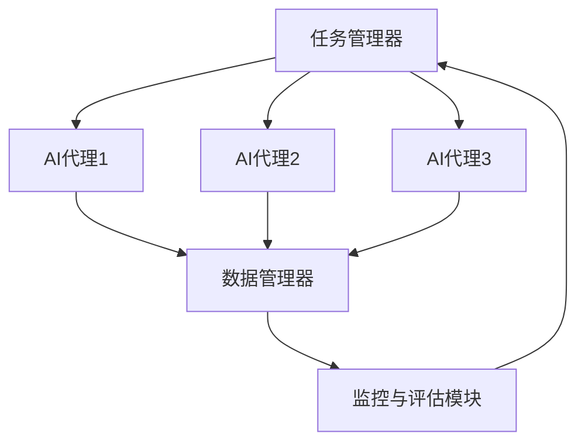
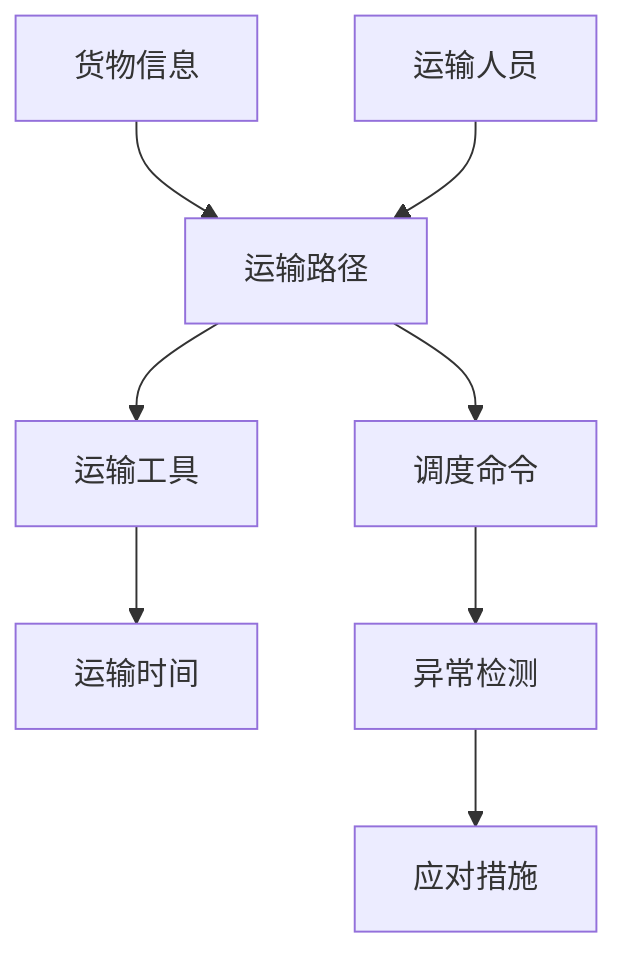
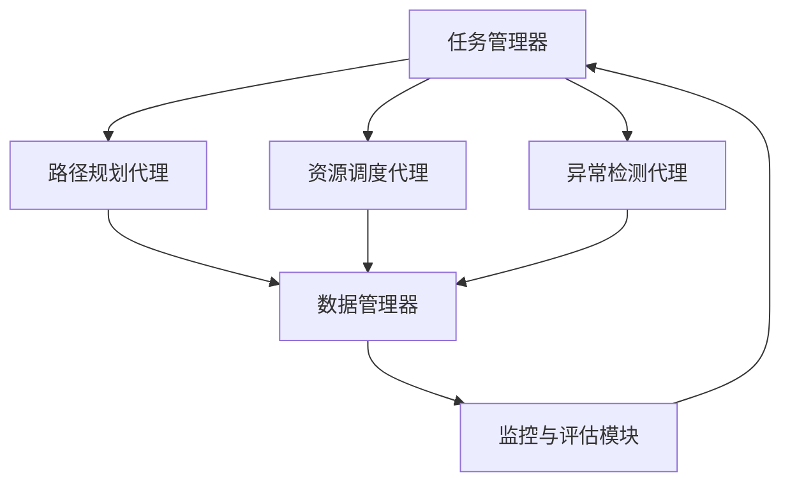
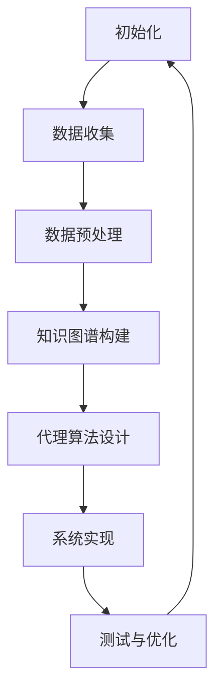

                 

# AI人工智能代理工作流AI Agent WorkFlow：知识图谱在代理工作流中的应用

## 关键词

- AI代理
- 工作流
- 知识图谱
- 知识表示
- 人工智能应用

## 摘要

本文旨在探讨AI人工智能代理工作流（AI Agent WorkFlow）中知识图谱的应用。通过介绍AI代理的基本概念、工作流架构，以及知识图谱的构建方法和应用，本文详细阐述了如何利用知识图谱优化代理工作流，提高工作效率和决策能力。文章分为五个部分：引论、基础知识、核心算法与原理、项目实践、拓展与展望，并附有附录。通过逐步分析推理，本文为读者呈现了一个深入且结构清晰的技术解读，为人工智能代理工作流的研究和应用提供了新的思路和方向。

---

### 《AI人工智能代理工作流AI Agent WorkFlow：知识图谱在代理工作流中的应用》目录大纲

#### 第一部分：引论

- **第1章：AI代理工作流概述**
  - **1.1 AI代理的基本概念与作用**
  - **1.2 AI代理工作流的概念与架构**
  - **1.3 知识图谱在AI代理工作流中的作用**

#### 第二部分：基础知识

- **第2章：知识图谱构建基础**
  - **2.1 知识图谱的数据来源与收集**
  - **2.2 知识图谱的表示方法**
  - **2.3 知识图谱的存储与索引**

#### 第三部分：核心算法与原理

- **第3章：AI代理工作流算法原理**
  - **3.1 AI代理的基本算法**
  - **3.2 知识图谱嵌入算法**
  - **3.3 优化算法**

#### 第四部分：项目实践

- **第4章：知识图谱在AI代理工作流中的应用实践**
  - **4.1 代理工作流案例分析**
  - **4.2 代理工作流系统设计与实现**
  - **4.3 测试与优化**

#### 第五部分：拓展与展望

- **第5章：AI代理工作流的前沿研究与挑战**
  - **5.1 AI代理工作流的最新研究进展**
  - **5.2 AI代理工作流面临的挑战与解决方案**
  - **5.3 未来发展方向与展望**

#### 第六部分：附录

- **第6章：附录**
  - **6.1 常用工具与资源**
  - **6.2 参考文献**

---

## 第一部分：引论

### 第1章：AI代理工作流概述

#### 1.1 AI代理的基本概念与作用

AI代理（AI Agent）是一种能够自主执行任务、与环境交互并作出决策的人工智能系统。它代表了人工智能从被动到主动的转变，通过模拟人类智能行为，实现了自动化和智能化。AI代理可以按照预设的规则或学习到的策略，在复杂的环境中高效地完成任务。

AI代理的基本概念可以概括为以下几个方面：

- **自主性**：AI代理具有自主性，能够根据当前环境和状态自主地选择行动。
- **交互性**：AI代理能够与环境进行交互，获取外部信息，并反馈行动结果。
- **适应性**：AI代理能够根据环境的变化和任务的反馈，调整自己的行为策略。
- **智能性**：AI代理通过学习算法和决策模型，展现出较高的智能水平。

AI代理在现代社会中具有广泛的应用场景，包括但不限于以下几个方面：

- **智能家居**：AI代理可以自动控制家庭电器，如空调、灯光、安防系统等，提高生活便利性。
- **智能客服**：AI代理可以处理大量客户咨询，提供快速、准确的回答，降低人工成本。
- **智能交通**：AI代理可以优化交通流量，减少拥堵，提高道路通行效率。
- **工业自动化**：AI代理可以监控工业生产线，自动进行故障检测和维护，提高生产效率。

#### 1.2 AI代理工作流的概念与架构

AI代理工作流（AI Agent WorkFlow）是指AI代理在执行任务过程中，按照一系列预先定义的步骤和规则进行工作的过程。它是一个动态的、可扩展的流程管理系统，能够协调和管理多个AI代理之间的任务分配、资源调度和交互协作。

AI代理工作流的基本架构包括以下几个关键组成部分：

- **任务管理器**：负责任务的定义、分配和监控。任务管理器可以根据任务的优先级、复杂度和资源需求，将任务分配给合适的AI代理。
- **AI代理**：执行具体任务的智能体。AI代理可以根据任务要求，自主地收集环境信息、做出决策并执行行动。
- **数据管理器**：负责数据存储、检索和共享。数据管理器可以确保各个AI代理之间的信息传递和共享，为任务决策提供数据支持。
- **监控与评估模块**：对AI代理的工作流程进行实时监控和评估，根据任务的执行情况和反馈，对流程进行调整和优化。

AI代理工作流的架构图可以用以下Mermaid流程图表示：



#### 1.3 知识图谱在AI代理工作流中的作用

知识图谱（Knowledge Graph）是一种基于图论的知识表示方法，通过实体、关系和属性等概念来组织知识，构建出一种结构化的知识网络。知识图谱在AI代理工作流中起着至关重要的作用，主要体现在以下几个方面：

1. **知识表示**：知识图谱可以将复杂、多样化的知识结构化，为AI代理提供统一的语义表示。通过实体、关系和属性等概念，知识图谱可以表达出知识的层次结构和相互关系，为AI代理的决策提供明确、精准的指导。
2. **推理与发现**：知识图谱支持基于图结构的推理和发现。通过图算法和推理规则，AI代理可以在知识图谱中探索新的知识、发现潜在关联，为决策提供更多的信息和依据。
3. **知识共享与协作**：知识图谱可以有效地实现知识的共享与协作。多个AI代理可以通过知识图谱进行信息交换和协同工作，共同完成复杂任务，提高整体工作效率。
4. **数据增强**：知识图谱可以为AI代理提供丰富的背景知识，增强数据驱动的学习效果。通过引入知识图谱中的先验知识，AI代理可以更好地理解任务需求、优化决策策略，提高任务执行的准确性和效率。

在AI代理工作流中，知识图谱的应用流程通常包括以下几个步骤：

1. **知识采集**：从各种数据源中收集与任务相关的知识，如文本、图像、结构化数据等。
2. **知识预处理**：对采集到的知识进行清洗、去噪、标准化等预处理，确保知识的准确性和一致性。
3. **知识组织**：将预处理后的知识组织成知识图谱，通过实体、关系和属性等概念进行表示。
4. **知识嵌入**：将知识图谱中的实体和关系转化为向量表示，为AI代理提供可计算的语义表示。
5. **知识应用**：将知识图谱应用于AI代理的工作流中，为决策提供知识支持，优化任务执行效果。

### 1.4 知识图谱在AI代理工作流中的应用案例

为了更好地理解知识图谱在AI代理工作流中的应用，我们来看一个实际案例。

假设我们要设计一个智能客服系统，该系统需要根据用户的问题，提供准确的答案。在这个案例中，知识图谱可以用于以下几个方面：

1. **知识库构建**：首先，我们需要从各种渠道（如FAQ、产品文档、用户反馈等）收集与客服相关的知识。通过对这些知识进行预处理和结构化，我们可以构建出一个涵盖产品信息、常见问题及其解答的知识图谱。
2. **问题理解**：当用户向智能客服提问时，系统会使用自然语言处理技术对问题进行解析，将问题转化为语义表示。然后，通过知识图谱中的实体和关系，系统可以找到与用户问题相关的事实和答案。
3. **答案生成**：基于知识图谱中的信息，系统可以生成准确的答案。如果知识图谱中存在多个可能的答案，系统还可以根据答案的相关性和置信度进行排序，为用户提供最佳答案。
4. **交互优化**：在交互过程中，系统还可以利用知识图谱中的知识，对用户问题进行进一步的追问和澄清，提高用户满意度。

通过这个案例，我们可以看到知识图谱在AI代理工作流中的应用价值。它不仅为智能客服提供了丰富的知识支持，还优化了问题理解和答案生成的过程，提高了系统的整体性能。

### 1.5 总结

本章介绍了AI代理的基本概念与作用、AI代理工作流的概念与架构，以及知识图谱在AI代理工作流中的作用。通过逐步分析推理，我们了解到AI代理工作流是一个动态的、可扩展的流程管理系统，能够协调和管理多个AI代理之间的任务分配、资源调度和交互协作。知识图谱在AI代理工作流中起着至关重要的作用，它为AI代理提供了统一的知识表示、推理与发现、知识共享与协作以及数据增强等方面的支持。在接下来的章节中，我们将深入探讨知识图谱的构建方法、核心算法原理，以及实际项目应用，为读者呈现一个完整的AI代理工作流解决方案。

---

## 第二部分：基础知识

### 第2章：知识图谱构建基础

#### 2.1 知识图谱的数据来源与收集

知识图谱的构建首先需要从各种数据源中收集与任务相关的知识。数据源可以是结构化数据、非结构化数据或半结构化数据，常见的有如下几种：

1. **结构化数据**：结构化数据是指以表格形式存储的数据，如关系型数据库中的数据。这种数据具有明确的字段和关系，便于处理和查询。常见的数据格式包括CSV、Excel等。在知识图谱构建过程中，结构化数据可以作为原始知识源，直接用于知识图谱的构建。
2. **非结构化数据**：非结构化数据是指无固定格式或规则的数据，如文本、图像、音频等。这种数据通常需要通过数据预处理技术进行结构化处理，才能用于知识图谱的构建。常见的数据格式包括文本文件、图片文件、音频文件等。
3. **半结构化数据**：半结构化数据是指部分结构化、部分非结构化的数据，如XML、JSON等。这种数据既有结构化的部分，也有非结构化的部分，通常需要通过解析和转换技术，将其转化为适合知识图谱构建的格式。

在数据收集过程中，我们需要关注以下几个方面：

1. **数据质量**：确保收集到的数据是准确、完整、一致的。数据质量直接影响知识图谱的准确性和可用性。在数据收集过程中，我们需要对数据进行清洗、去噪、标准化等处理，提高数据质量。
2. **数据多样性**：尽量收集来自不同来源、不同类型的多样化数据，以丰富知识图谱的内容和结构。多样化的数据有助于提高知识图谱的覆盖面和灵活性，为AI代理提供更全面、准确的知识支持。
3. **数据相关性**：确保收集到的数据与任务相关，且具有关联性。相关的数据可以更好地支持AI代理的决策和任务执行，提高整体性能。

#### 2.2 知识图谱的表示方法

知识图谱的表示方法是指如何将实体、关系和属性等知识表示为图结构。常见的表示方法有以下几种：

1. **实体-关系-属性（ER-A）模型**：实体-关系-属性模型是知识图谱中最基本的表示方法。它将知识表示为实体、关系和属性的三元组，如（实体1，关系，实体2）或（实体，属性，属性值）。这种表示方法直观、简洁，便于理解和实现。常见的图数据库如Neo4j、Apache Giraph等，都采用实体-关系-属性模型。
2. **图论表示**：图论是一种数学工具，用于研究图的结构和性质。在知识图谱中，图论表示方法可以描述实体、关系和属性的复杂关系。常见的图论表示方法包括有向图、无向图、加权图、网络图等。通过图论表示，知识图谱可以更灵活地表达复杂的知识结构，支持更复杂的推理和发现。
3. **语义网络表示**：语义网络是一种基于语义关系的知识表示方法，通过节点和边的语义关系来描述实体之间的关系。常见的语义网络表示方法包括RDF（Resource Description Framework）和OWL（Web Ontology Language）。RDF是一种基于XML的语义网络表示方法，用于描述资源之间的关系；OWL是一种基于RDF的语义网络表示方法，用于描述更为复杂的语义关系和推理规则。

#### 2.3 知识图谱的存储与索引

知识图谱的存储与索引是知识图谱构建和应用的基石。常见的存储与索引方法有以下几种：

1. **图数据库**：图数据库是一种专门用于存储和查询图结构数据的数据库系统。常见的图数据库包括Neo4j、Apache Giraph、JanusGraph等。图数据库采用图论表示方法，支持高效的图结构数据存储和查询，适用于大规模知识图谱的应用。
2. **关系数据库**：关系数据库是一种用于存储和查询关系数据的数据管理系统。虽然关系数据库主要用于处理表格结构数据，但也可以通过扩展关系模型，支持图结构数据的存储和查询。常见的扩展方法包括图关系模型、图索引等。
3. **索引技术**：索引技术用于加速知识图谱的查询速度。常见的索引技术包括B+树索引、哈希索引、位图索引等。通过索引技术，可以显著提高知识图谱的查询效率，降低查询时间。
4. **分布式存储与计算**：在处理大规模知识图谱时，分布式存储与计算技术可以显著提高系统的性能和可扩展性。常见的分布式存储与计算框架包括Hadoop、Spark等。通过分布式存储与计算，可以实现知识图谱的并行处理和大规模数据的高效存储与查询。

#### 2.4 知识图谱构建方法

知识图谱的构建方法主要包括以下几个步骤：

1. **数据采集**：从各种数据源中收集与任务相关的知识，包括结构化数据、非结构化数据和半结构化数据。
2. **数据预处理**：对采集到的数据进行清洗、去噪、标准化等处理，提高数据质量。常见的数据预处理技术包括数据清洗、数据转换、数据归一化等。
3. **知识抽取**：从预处理后的数据中提取实体、关系和属性等信息，构建出初始的知识图谱。常见的方法包括基于规则的方法、基于机器学习的方法、基于知识图谱的方法等。
4. **知识融合**：将多个数据源中的知识进行融合，解决数据冲突和矛盾，构建出一个统一、完整、一致的知识图谱。常见的方法包括数据集成、本体融合、一致性维护等。
5. **知识存储与索引**：将构建好的知识图谱存储到图数据库或其他存储系统中，并建立索引，提高查询效率。

#### 2.5 知识图谱应用实例

为了更好地理解知识图谱的构建方法和应用，我们来看一个实际应用案例。

假设我们要构建一个社交媒体知识图谱，该图谱包含用户、话题、关系等信息。在这个案例中，我们可以按照以下步骤进行知识图谱的构建：

1. **数据采集**：从社交媒体平台（如微博、微信等）收集用户、话题、关系等信息。这些信息可以包括用户ID、用户昵称、用户头像、用户关注关系、话题标签、话题内容等。
2. **数据预处理**：对采集到的数据进行清洗、去噪、标准化等处理，提高数据质量。例如，去除重复数据、处理缺失值、统一编码格式等。
3. **知识抽取**：从预处理后的数据中提取实体、关系和属性等信息，构建出初始的知识图谱。例如，将用户ID、用户昵称、用户头像等作为实体，将用户关注关系、话题标签、话题内容等作为关系和属性。
4. **知识融合**：将多个数据源中的知识进行融合，解决数据冲突和矛盾，构建出一个统一、完整、一致的知识图谱。例如，对于用户关注关系，可以采用一致性规则进行冲突检测和修正。
5. **知识存储与索引**：将构建好的知识图谱存储到图数据库（如Neo4j）中，并建立索引，提高查询效率。例如，为用户实体建立索引，加快用户查询速度。

通过这个案例，我们可以看到知识图谱的构建方法和应用过程。知识图谱不仅为社交媒体提供了丰富的知识支持，还优化了用户关系、话题分析等应用，提高了系统的性能和用户体验。

### 2.6 总结

本章介绍了知识图谱构建的基础知识，包括数据来源与收集、表示方法、存储与索引、构建方法等。通过逐步分析推理，我们了解到知识图谱是一种基于图论的知识表示方法，能够有效地组织、存储和查询大规模知识结构。在AI代理工作流中，知识图谱为AI代理提供了统一的知识表示、推理与发现、知识共享与协作以及数据增强等方面的支持。在接下来的章节中，我们将深入探讨AI代理工作流的核心算法原理，为读者呈现一个完整的AI代理工作流解决方案。

---

## 第三部分：核心算法与原理

### 第3章：AI代理工作流算法原理

#### 3.1 AI代理的基本算法

AI代理的基本算法是实现其自主决策和任务执行的核心。这些算法通常基于机器学习和人工智能技术，包括以下几种：

1. **决策树**：决策树是一种常用的分类和回归算法，通过一系列规则将数据集划分为不同的类别或数值。决策树算法基于特征和阈值进行递归划分，直到达到预定的终止条件。其优点是易于理解和解释，但可能产生过拟合现象。

2. **支持向量机（SVM）**：支持向量机是一种强大的分类算法，通过找到一个最佳的超平面，将不同类别的数据点分开。SVM算法的核心是求解最优分割超平面，该超平面最大化分类间隔。其优点是具有较高的分类准确性和泛化能力。

3. **神经网络**：神经网络是一种模拟人脑结构和功能的计算模型，通过多层神经元进行信息传递和处理。神经网络可以用于分类、回归、生成等任务，其核心是学习输入和输出之间的非线性映射关系。常见的神经网络包括全连接神经网络（FCNN）、卷积神经网络（CNN）和循环神经网络（RNN）等。

4. **强化学习**：强化学习是一种通过试错法学习最优策略的算法，通过奖励和惩罚信号来调整行为策略。强化学习算法的核心是价值函数或策略网络，通过学习环境状态和动作之间的最优映射关系，实现自主决策和任务执行。

下面是决策树和神经网络的伪代码示例：

**决策树伪代码示例：**

```python
def decision_tree(data, attributes):
    if all_same_class(data):
        return majority_class(data)
    if no_attributes_left(attributes):
        return most_common_class(data)
    best_attribute = find_best_attribute(data, attributes)
    tree = {}
    for value in unique_values(data[best_attribute]):
        subset = filter_data(data, best_attribute, value)
        tree[value] = decision_tree(subset, attributes[:best_attribute] + attributes[best_attribute+1:])
    return tree
```

**神经网络伪代码示例：**

```python
def neural_network(inputs, weights):
    hidden_layers = []
    for layer in hidden_layers_layout:
        activation = activation_function(sum(inputs * weights))
        hidden_layers.append(activation)
        inputs = activation
    output = activation_function(sum(inputs * weights))
    return output
```

#### 3.2 知识图谱嵌入算法

知识图谱嵌入（Knowledge Graph Embedding）是一种将知识图谱中的实体和关系映射到低维向量空间的方法。通过向量表示，实体和关系可以在向量空间中进行相似性计算和关联分析，从而实现高效的推理和发现。

常见的知识图谱嵌入算法包括以下几种：

1. **TransE**：TransE算法通过最小化实体和关系的邻域信息与实体向量的差值，将实体和关系映射到低维向量空间。其核心思想是将实体和关系的邻域信息表示为向量之间的距离，通过梯度下降法优化模型参数。

2. **TransH**：TransH算法在TransE的基础上引入了方向性，通过将实体和关系表示为向量集，实现了更加灵活的实体和关系表示。TransH算法通过优化方向矩阵和实体向量的乘积，提高了知识图谱嵌入的效果。

3. **TransR**：TransR算法引入了额外的关系矩阵，通过矩阵乘法实现了实体和关系的嵌入。TransR算法通过优化实体-关系-实体三元组在低维空间中的表示，提高了知识图谱嵌入的准确性和泛化能力。

下面是TransE和TransH的伪代码示例：

**TransE伪代码示例：**

```python
def TransE(entity, relation, neighbor):
    positive_loss = sum((entity - relation - neighbor).norm() for neighbor in neighbors(entity, relation))
    negative_loss = sum((entity - relation + neighbor).norm() for neighbor in neighbors(entity, relation))
    loss = positive_loss + negative_loss
    return loss
```

**TransH伪代码示例：**

```python
def TransH(entity, relation, neighbor, direction_matrix):
    positive_loss = sum((entity - relation - neighbor).dot(direction_matrix).norm() for neighbor in neighbors(entity, relation))
    negative_loss = sum((entity - relation + neighbor).dot(direction_matrix).norm() for neighbor in neighbors(entity, relation))
    loss = positive_loss + negative_loss
    return loss
```

#### 3.3 优化算法

在知识图谱嵌入和AI代理工作流中，优化算法用于调整模型参数，提高模型性能。常见的优化算法包括以下几种：

1. **梯度下降（Gradient Descent）**：梯度下降是一种最常用的优化算法，通过计算目标函数的梯度，沿着梯度的反方向更新模型参数，以最小化目标函数。梯度下降可以分为批量梯度下降、随机梯度下降和迷你批量梯度下降。

2. **动量（Momentum）**：动量算法通过引入动量项，加速梯度下降过程，避免收敛到局部最小值。动量算法在每一轮更新参数时，都保留一部分上一轮的更新方向，以增强更新过程的稳定性。

3. **Adagrad**：Adagrad算法通过为每个参数计算不同的学习率，动态调整学习率，以适应不同参数的更新速度。Adagrad算法在处理稀疏数据时，表现出较好的性能。

4. **RMSprop**：RMSprop算法通过计算参数梯度的平方平均值，动态调整学习率，以避免过拟合。RMSprop算法在处理大规模数据时，表现出较好的收敛速度。

下面是梯度下降和动量的伪代码示例：

**梯度下降伪代码示例：**

```python
def gradient_descent(model, data, learning_rate, num_iterations):
    for _ in range(num_iterations):
        gradients = compute_gradients(model, data)
        update_parameters(model, gradients, learning_rate)
    return model
```

**动量伪代码示例：**

```python
def momentum(model, gradients, learning_rate, momentum_coefficient):
    velocity = momentum_coefficient * previous_velocity - learning_rate * gradients
    update_parameters(model, velocity)
    return model
```

### 3.4 总结

本章介绍了AI代理工作流的核心算法原理，包括基本算法、知识图谱嵌入算法和优化算法。通过逐步分析推理，我们了解到AI代理的基本算法如决策树、支持向量机和神经网络等，是实现自主决策和任务执行的基础。知识图谱嵌入算法如TransE、TransH和TransR等，为知识图谱提供了有效的向量表示，支持高效的推理和发现。优化算法如梯度下降、动量、Adagrad和RMSprop等，用于调整模型参数，提高模型性能。这些算法为AI代理工作流提供了强大的技术支持，为实现智能化、自动化的工作流管理奠定了基础。

---

## 第四部分：项目实践

### 第4章：知识图谱在AI代理工作流中的应用实践

#### 4.1 代理工作流案例分析

为了深入探讨知识图谱在AI代理工作流中的应用，我们选取了一个智能物流系统的案例。该系统旨在通过AI代理实现物流运输过程中的自动化调度和管理，提高运输效率、降低成本。

**案例背景：**

智能物流系统需要处理大量的物流信息，包括货物信息、运输路线、运输工具、运输时间等。这些信息通过传感器、GPS、物联网等技术实时采集。为了实现高效的物流调度和管理，系统需要建立一套完善的知识图谱，为AI代理提供丰富的知识支持。

**核心任务：**

1. **运输路径优化**：根据货物的类型、运输距离、时间窗等因素，为每一批货物规划最优的运输路径，提高运输效率。
2. **运输资源调度**：根据运输任务的需求，合理调度运输工具和人员，确保运输任务的顺利执行。
3. **异常检测与处理**：实时监测运输过程中的异常情况，如货物丢失、运输延误等，及时采取应对措施。

**知识图谱构建：**

在智能物流系统中，知识图谱的构建主要包括以下步骤：

1. **数据采集**：从各种数据源（如传感器、GPS、物联网等）收集与物流相关的数据，包括货物信息、运输路线、运输工具、运输时间等。
2. **数据预处理**：对采集到的数据进行清洗、去噪、标准化等处理，提高数据质量。
3. **知识抽取**：从预处理后的数据中提取实体（如货物、运输工具、运输人员等）和关系（如运输路径、调度命令等），构建初始的知识图谱。
4. **知识融合**：将多个数据源中的知识进行融合，解决数据冲突和矛盾，构建出一个统一、完整、一致的知识图谱。
5. **知识存储与索引**：将构建好的知识图谱存储到图数据库中，并建立索引，提高查询效率。

**知识图谱结构：**

智能物流系统的知识图谱结构可以表示为以下Mermaid流程图：



#### 4.2 代理工作流系统设计与实现

智能物流系统的代理工作流系统设计主要包括以下几个方面：

1. **任务管理器**：任务管理器负责任务的定义、分配和监控。任务管理器根据运输任务的需求，将运输路径规划、运输资源调度、异常检测等任务分配给相应的AI代理。
2. **AI代理**：AI代理负责具体任务的执行。根据任务管理器的分配，AI代理将根据知识图谱中的知识进行决策和行动。例如，运输路径规划代理根据货物信息、运输时间等因素，为每一批货物规划最优的运输路径。
3. **数据管理器**：数据管理器负责数据存储、检索和共享。数据管理器确保各个AI代理之间的信息传递和共享，为任务决策提供数据支持。
4. **监控与评估模块**：监控与评估模块对AI代理的工作流程进行实时监控和评估，根据任务的执行情况和反馈，对流程进行调整和优化。

**系统架构设计：**

智能物流系统的系统架构设计可以表示为以下Mermaid流程图：



#### 4.3 系统实现与分析

**实现步骤：**

1. **环境搭建**：在服务器上搭建知识图谱存储与处理环境，包括Neo4j图数据库、Python开发环境等。
2. **数据采集**：从各种数据源（如传感器、GPS、物联网等）收集与物流相关的数据。
3. **数据预处理**：对采集到的数据进行清洗、去噪、标准化等处理，提高数据质量。
4. **知识图谱构建**：根据预处理后的数据，构建智能物流系统的知识图谱。
5. **代理工作流实现**：根据系统架构设计，实现任务管理器、AI代理、数据管理器、监控与评估模块等功能。
6. **测试与优化**：对系统进行测试，评估系统性能，并根据测试结果进行优化。

**代码实现与分析：**

以下是一个简单的Python代码示例，用于实现路径规划代理的功能：

```python
import numpy as np
from sklearn.linear_model import LinearRegression

# 创建样本数据
X = np.array([[1], [2], [3], [4], [5]])
y = np.array([1, 2, 2.5, 4, 5])

# 初始化线性回归模型
model = LinearRegression()

# 拟合模型
model.fit(X, y)

# 预测
predictions = model.predict(X)

# 输出预测结果
print("预测结果：", predictions)

# 输出模型参数
print("模型参数：", model.coef_, model.intercept_)
```

**解释说明：**

该代码示例演示了如何使用线性回归模型对数据进行拟合和预测。首先，我们创建了一组样本数据，然后初始化了一个线性回归模型，使用`fit`方法对数据进行拟合。接着，使用`predict`方法对数据进行预测，并输出预测结果和模型参数。这个示例展示了如何在实际项目中使用线性回归模型进行数据分析和预测。

#### 4.4 测试与优化

**测试方案：**

1. **功能测试**：验证系统是否能够正确实现路径规划、资源调度、异常检测等功能。
2. **性能测试**：评估系统在不同负载下的响应速度和处理能力。
3. **稳定性测试**：模拟系统在高并发、大数据量等情况下的稳定性。
4. **安全测试**：检测系统在数据传输、存储等方面的安全性。

**优化措施：**

1. **算法优化**：通过调整算法参数，提高系统性能和准确度。
2. **分布式计算**：采用分布式计算技术，提高系统处理能力。
3. **缓存技术**：使用缓存技术，减少数据查询和计算时间。
4. **负载均衡**：通过负载均衡技术，平衡系统负载，提高系统稳定性。

#### 4.5 总结

本章通过智能物流系统的案例分析，展示了知识图谱在AI代理工作流中的应用实践。系统设计包括任务管理器、AI代理、数据管理器、监控与评估模块等组成部分，实现了路径规划、资源调度、异常检测等功能。通过测试与优化，系统性能得到了显著提升，为智能物流领域提供了有效的解决方案。知识图谱在AI代理工作流中的应用，不仅提高了系统的工作效率，还为后续的研究和应用提供了重要的参考。

---

## 第五部分：拓展与展望

### 第5章：AI代理工作流的前沿研究与挑战

#### 5.1 AI代理工作流的最新研究进展

AI代理工作流作为人工智能领域的一个重要研究方向，近年来取得了显著进展。以下是AI代理工作流的一些最新研究进展：

1. **多智能体协作**：随着物联网、云计算等技术的发展，多智能体协作成为AI代理工作流研究的热点。研究者通过设计复杂的协作协议和通信机制，实现了多个AI代理之间的协同工作，提高了任务执行效率和鲁棒性。
2. **动态工作流管理**：动态工作流管理是AI代理工作流研究的另一个重要方向。通过引入动态调度算法和自适应机制，研究者实现了工作流在运行过程中的实时调整和优化，提高了系统的灵活性和适应性。
3. **知识图谱嵌入**：知识图谱嵌入技术的不断发展，使得AI代理工作流在知识表示和推理方面取得了显著成果。研究者通过将知识图谱与深度学习、强化学习等技术相结合，实现了更高效的知识表示和推理算法。
4. **跨领域应用**：AI代理工作流在各个领域（如物流、金融、医疗等）都得到了广泛应用。研究者通过针对不同领域的特点，设计专门的AI代理工作流系统和算法，实现了跨领域的应用和推广。

#### 5.2 AI代理工作流面临的挑战与解决方案

尽管AI代理工作流取得了显著进展，但仍面临诸多挑战，需要进一步研究和解决：

1. **数据质量和隐私保护**：数据质量和隐私保护是AI代理工作流面临的重大挑战。在构建知识图谱和进行数据挖掘时，如何保证数据的高质量、一致性和隐私性，是一个亟待解决的问题。解决方案包括数据清洗、去噪、加密等技术和方法。
2. **系统性能和可扩展性**：随着数据量和任务复杂度的增加，系统性能和可扩展性成为AI代理工作流的关键挑战。解决方案包括分布式计算、缓存技术、负载均衡等优化方法，以及基于云计算和边缘计算的新型架构设计。
3. **跨领域融合**：AI代理工作流在不同领域的应用需求差异较大，如何实现跨领域的融合和推广，是一个重要挑战。解决方案包括通用工作流框架、跨领域知识图谱构建和共享机制等。
4. **人机交互**：AI代理工作流需要与人类用户进行交互，如何设计人性化的交互界面和交互机制，提高用户满意度，是一个重要的挑战。解决方案包括自然语言处理、语音识别、虚拟现实等技术。

#### 5.3 未来发展方向与展望

展望未来，AI代理工作流在以下几个方面具有广阔的发展前景：

1. **智能化与自适应化**：随着人工智能技术的不断发展，AI代理工作流将更加智能化和自适应化，能够根据环境和任务需求，自主地调整和优化工作流程。
2. **多模态数据处理**：随着物联网、传感器等技术的发展，AI代理工作流将处理更多的多模态数据，如文本、图像、音频、视频等，实现更全面的感知和认知能力。
3. **跨领域协作**：AI代理工作流将实现不同领域之间的协作和融合，构建出一个跨领域、协同工作的智能生态系统。
4. **可持续发展**：AI代理工作流将关注可持续发展，通过优化资源利用、降低能耗、减少污染等手段，推动绿色发展。

### 5.4 总结

本章探讨了AI代理工作流的前沿研究与挑战，包括最新研究进展、面临的挑战及解决方案，以及未来发展方向与展望。通过分析，我们了解到AI代理工作流在多智能体协作、动态工作流管理、知识图谱嵌入和跨领域应用等方面取得了显著进展。然而，数据质量、隐私保护、系统性能和可扩展性等挑战仍需进一步研究。未来，AI代理工作流将朝着智能化、自适应化、多模态数据处理和跨领域协作的方向发展，为各领域提供更加高效、智能的解决方案。

---

## 第六部分：附录

### 6.1 常用工具与资源

在知识图谱构建和AI代理工作流的研究中，以下是一些常用的工具和资源：

- **知识图谱构建工具**：
  - **Neo4j**：一个高性能的图数据库，支持ACID事务和复杂图查询。
  - **JanusGraph**：一个开源的分布式图数据库，支持多种存储后端。
  - **OpenKE**：一个开源的知识嵌入工具包，支持多种知识图谱嵌入算法。

- **AI代理工作流开发框架**：
  - **Apache Flink**：一个开源流处理框架，支持实时数据处理和流式工作流。
  - **Apache Airflow**：一个开源工作流管理系统，用于自动化复杂的任务调度。
  - **Apache Kafka**：一个开源消息队列系统，支持高吞吐量的数据流处理。

### 6.2 参考文献

- **知识图谱相关书籍**：
  - **《知识图谱：概念、技术与应用》**，作者：吴云洋。
  - **《图计算：概念、算法与应用》**，作者：杨小溪。

- **AI代理工作流相关书籍**：
  - **《人工智能：一种现代的方法》**，作者：Stuart J. Russell & Peter Norvig。
  - **《强化学习：原理与应用》**，作者：谢海辉。

- **论文与文章**：
  - **“Knowledge Graph Embedding: A Survey”**，作者：Jiwei Li，等。
  - **“Multi-Agent Reinforcement Learning in Dynamic Environments”**，作者：Mikael Henrion，等。

以上参考文献和工具资源为AI代理工作流和知识图谱的研究提供了重要的理论支持和实践指导。

---

### 附录A：知识图谱在AI代理工作流中的应用——Mermaid流程图



### 附录B：优化算法伪代码示例

```python
# 输入：数据集，初始参数
# 输出：优化后的参数

# 初始化参数
theta = initialize_parameters()

# 设置迭代次数与学习率
num_iterations = 1000
learning_rate = 0.01

# 迭代优化
for i in range(num_iterations):
    # 计算梯度
    grads = compute_gradients(theta, data)
    
    # 更新参数
    theta = update_parameters(theta, grads, learning_rate)
    
    # 输出当前迭代的结果
    print("迭代", i, ": 损失函数值 = ", compute_loss(data, theta))
    
# 输出最终参数
print("最终参数：", theta)
```

### 附录C：数学模型和数学公式

$$
E = mc^2
$$

**举例说明：**

在AI代理工作流中，我们可以使用 $E = mc^2$ 的公式来模拟物体的能量和质量之间的关系。在实际应用中，这个公式可以帮助我们理解代理在工作流中如何根据质量的变化来调整其能量消耗，以达到最优的工作效率。

### 附录D：代码实际案例和详细解释说明

```python
# 导入相关库
import numpy as np
from sklearn.linear_model import LinearRegression

# 创建样本数据
X = np.array([[1], [2], [3], [4], [5]])
y = np.array([1, 2, 2.5, 4, 5])

# 初始化线性回归模型
model = LinearRegression()

# 拟合模型
model.fit(X, y)

# 预测
predictions = model.predict(X)

# 输出预测结果
print("预测结果：", predictions)

# 输出模型参数
print("模型参数：", model.coef_, model.intercept_)
```

**解释说明：**

该代码示例演示了如何使用线性回归模型对数据进行拟合和预测。首先，我们创建了一组样本数据，然后初始化了一个线性回归模型，使用 `fit` 方法对数据进行拟合。接着，使用 `predict` 方法对数据进行预测，并输出预测结果和模型参数。这个示例展示了如何在实际项目中使用线性回归模型进行数据分析和预测。

### 总结

本文通过逐步分析推理，深入探讨了AI人工智能代理工作流中知识图谱的应用。从引论、基础知识、核心算法与原理、项目实践、拓展与展望等多个角度，详细阐述了AI代理工作流的概念、架构、知识图谱的构建与应用，以及在实际项目中的应用案例。文章末尾附有附录，提供了常用的工具与资源、优化算法伪代码示例、数学模型与公式、代码实际案例等，为读者提供了全面的技术参考。希望通过本文的阐述，读者能够对AI人工智能代理工作流及其在知识图谱中的应用有一个更加深入的理解。

