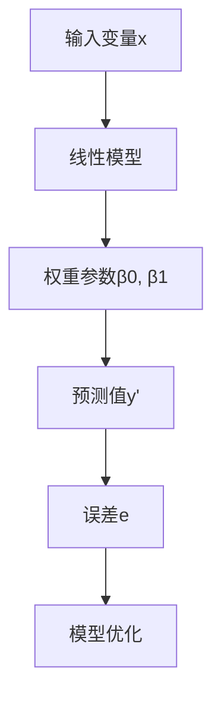
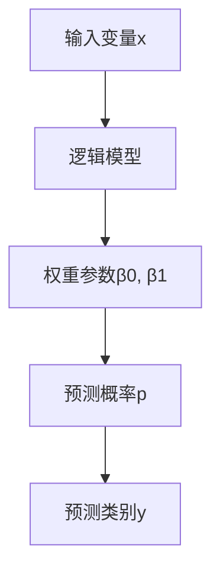
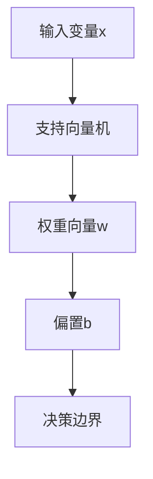
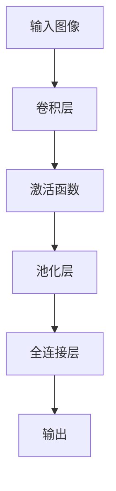
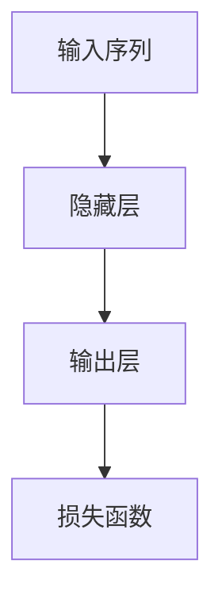
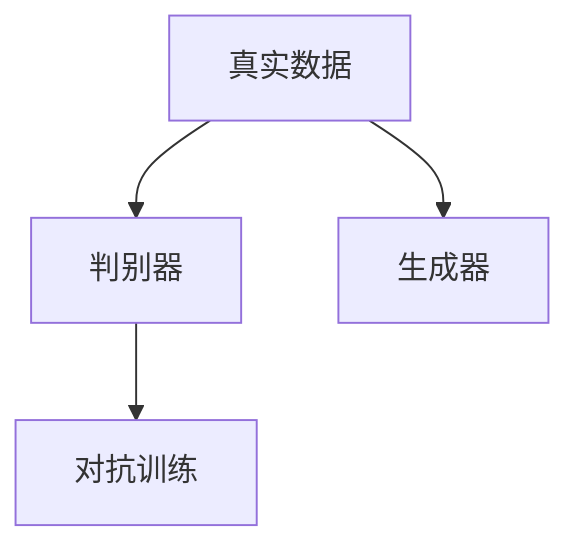

                 

### AI人工智能核心算法原理与代码实例讲解：机器学习流程

#### 文章关键词：
- 人工智能
- 机器学习
- 线性回归
- 逻辑回归
- 决策树
- 支持向量机
- 集成学习方法
- 深度学习
- 卷积神经网络
- 循环神经网络
- 生成对抗网络
- 项目实战

#### 文章摘要：
本文将深入探讨人工智能（AI）的核心算法原理，通过代码实例讲解机器学习的基本流程。从基础的线性回归、逻辑回归到高级的决策树、支持向量机，再到集成学习和深度学习，本文将逐步展示这些算法的实现和应用。通过实际项目实战，我们将理解如何将理论应用于实际问题中，并提升我们的机器学习技能。

---

## 第一部分：机器学习基础与核心算法

在开始探索机器学习的核心算法之前，我们需要对机器学习的基本概念有一个清晰的认识。机器学习是指让计算机从数据中学习规律并作出决策或预测的过程。它涉及大量的数据、算法和统计学方法，目的是使计算机能够自动改进性能。

### 第1章：机器学习概述

#### 1.1 机器学习的定义与分类

机器学习可以分为监督学习、无监督学习和强化学习三大类：

- **监督学习**：已知输入和输出，通过学习模型预测输出。
- **无监督学习**：未知输入和输出，旨在发现数据中的模式和结构。
- **强化学习**：通过与环境的交互学习最优策略，以最大化累积奖励。

#### 1.2 机器学习的应用领域

机器学习的应用领域非常广泛，包括：

- **计算机视觉**：图像识别、物体检测、人脸识别等。
- **自然语言处理**：文本分类、机器翻译、语音识别等。
- **推荐系统**：个性化推荐、广告投放等。
- **金融领域**：风险管理、算法交易等。
- **医疗领域**：疾病诊断、药物研发等。

#### 1.3 机器学习的挑战

尽管机器学习取得了巨大的成功，但仍面临许多挑战：

- **数据质量**：噪声、不平衡、缺失值等问题。
- **计算能力**：大规模数据处理和高维特征分析。
- **算法可解释性**：模型的透明性和可解释性。
- **过拟合与欠拟合**：模型的泛化能力。

### 第2章：线性回归

线性回归是最基础的机器学习算法之一，旨在找到输入变量和输出变量之间的线性关系。线性回归可以分为一元线性回归和多元线性回归。

#### 2.1 线性回归的数学基础

线性回归的模型可以表示为：

$$
y = \beta_0 + \beta_1 \cdot x + \epsilon
$$

其中，\(y\) 是输出变量，\(x\) 是输入变量，\(\beta_0\) 和 \(\beta_1\) 是模型的参数，\(\epsilon\) 是误差项。

**Mermaid 流程图：**



#### 2.2 线性回归的求解算法

线性回归的求解算法主要包括最小二乘法和梯度下降法。

**伪代码：**

```python
初始化权重β0, β1
对于每个训练样本(x_i, y_i)：
    计算预测值 y' = β0 + β1 * x_i
    计算误差 e_i = y_i - y'
    更新权重β0, β1
返回权重β0, β1
```

#### 2.3 线性回归的应用案例

线性回归常用于预测和分析领域，如房价预测、股票价格预测等。

**代码实例：**

```python
import numpy as np
import matplotlib.pyplot as plt
from sklearn.linear_model import LinearRegression

# 加载数据集
X = np.array([[1], [2], [3], [4], [5]])
y = np.array([1, 2, 2.5, 4, 5])

# 创建线性回归模型
model = LinearRegression()

# 训练模型
model.fit(X, y)

# 预测
y_pred = model.predict([[6]])

# 可视化
plt.scatter(X, y)
plt.plot(X, y_pred, color='red')
plt.show()
```

### 第3章：逻辑回归

逻辑回归是一种用于分类问题的算法，其目标是在给定输入变量 \(x\) 的情况下，预测输出变量 \(y\) 的概率。

#### 3.1 逻辑回归的数学基础

逻辑回归的模型可以表示为：

$$
\ln\left(\frac{p}{1-p}\right) = \beta_0 + \beta_1 \cdot x
$$

其中，\(p\) 是预测概率，\(\beta_0\) 和 \(\beta_1\) 是模型的参数。

**Mermaid 流程图：**



#### 3.2 逻辑回归的求解算法

逻辑回归的求解算法通常采用梯度下降法。

**伪代码：**

```python
初始化权重β0, β1
对于每个训练样本(x_i, y_i)：
    计算预测概率 p = 1 / (1 + exp(-β0 - β1 * x_i))
    计算损失函数 L = -y \* log(p) - (1 - y) \* log(1 - p)
    更新权重β0, β1
返回权重β0, β1
```

#### 3.3 逻辑回归的应用案例

逻辑回归常用于二分类问题，如邮件过滤、垃圾邮件检测等。

**代码实例：**

```python
import numpy as np
import matplotlib.pyplot as plt
from sklearn.linear_model import LogisticRegression

# 加载数据集
X = np.array([[1, 0], [1, 1], [0, 1], [0, 0]])
y = np.array([0, 1, 1, 0])

# 创建逻辑回归模型
model = LogisticRegression()

# 训练模型
model.fit(X, y)

# 预测
y_pred = model.predict([[1, 1]])

# 可视化
plt.scatter(X[:, 0], X[:, 1], c=y)
plt.plot([0, 1], [1 - (1/(1+exp(-model.coef_[0][0]))), 1/(1+exp(-model.coef_[0][0]))], color='red')
plt.show()
```

### 第4章：决策树

决策树是一种基于树形结构进行决策的算法，其目标是将输入变量映射到输出变量。

#### 4.1 决策树的构建算法

决策树的构建算法通常采用信息增益、基尼不纯度等方法来选择最优特征和分割点。

**伪代码：**

```python
选择最优特征和分割点
对于每个特征：
    计算信息增益或基尼不纯度
选择增益或不纯度最大的特征作为分割点
递归构建子树
```

#### 4.2 决策树的剪枝方法

决策树的剪枝方法包括预剪枝和后剪枝，目的是避免过拟合。

**伪代码：**

```python
预剪枝：
    在构建决策树时，设置最大深度、最小叶子节点样本数等限制条件

后剪枝：
    构建完整的决策树
    评估模型在验证集上的表现
    如果表现不佳，则删除一些叶子节点，重新训练模型
```

#### 4.3 决策树的应用案例

决策树常用于分类和回归问题，如客户流失预测、疾病诊断等。

**代码实例：**

```python
import numpy as np
import matplotlib.pyplot as plt
from sklearn.tree import DecisionTreeClassifier

# 加载数据集
X = np.array([[1, 0], [1, 1], [0, 1], [0, 0]])
y = np.array([0, 1, 1, 0])

# 创建决策树模型
model = DecisionTreeClassifier()

# 训练模型
model.fit(X, y)

# 预测
y_pred = model.predict([[1, 1]])

# 可视化
from sklearn.tree import plot_tree
plt.figure(figsize=(10, 10))
plot_tree(model)
plt.show()
```

### 第5章：支持向量机

支持向量机是一种用于分类和回归的线性模型，其目标是将输入变量映射到最优超平面。

#### 5.1 支持向量机的数学基础

支持向量机的模型可以表示为：

$$
w \cdot x + b = 0
$$

其中，\(w\) 是权重向量，\(x\) 是输入变量，\(b\) 是偏置。

**Mermaid 流程图：**



#### 5.2 支持向量机的求解算法

支持向量机的求解算法通常采用拉格朗日乘子法。

**伪代码：**

```python
定义拉格朗日函数
优化拉格朗日函数，求解权重向量w和偏置b
计算决策边界
```

#### 5.3 支持向量机应用案例

支持向量机常用于分类问题，如文本分类、图像分类等。

**代码实例：**

```python
import numpy as np
import matplotlib.pyplot as plt
from sklearn.svm import SVC

# 加载数据集
X = np.array([[1, 0], [1, 1], [0, 1], [0, 0]])
y = np.array([0, 1, 1, 0])

# 创建支持向量机模型
model = SVC()

# 训练模型
model.fit(X, y)

# 预测
y_pred = model.predict([[1, 1]])

# 可视化
plt.scatter(X[:, 0], X[:, 1], c=y)
plt.plot([0, 1], [-model.coef_[0][0] / model.coef_[0][1], 1 - (model.coef_[0][0] / model.coef_[0][1])], color='red')
plt.show()
```

## 第二部分：集成学习方法

集成学习方法是指通过结合多个基础模型来提高预测性能的方法。集成学习包括Bagging、Boosting和Stacking等方法。

### 第6章：集成学习方法概述

#### 6.1 集成学习的原理

集成学习通过构建多个基础模型，然后通过投票、平均或加权等方式综合这些模型的结果，从而提高预测性能。

#### 6.2 集成学习的优势

- **提高预测性能**：通过结合多个基础模型，集成学习可以降低模型的方差，提高模型的泛化能力。
- **减少过拟合**：集成学习可以减少单个模型过拟合的风险，提高模型的稳健性。
- **灵活性和可解释性**：集成学习可以通过不同的基础模型和集成策略来调整模型的复杂性和可解释性。

#### 6.3 集成学习的挑战

- **计算成本**：集成学习通常需要训练多个基础模型，计算成本较高。
- **模型选择**：选择合适的模型和集成策略对于集成学习的效果至关重要。
- **模型解释**：集成学习的结果通常较为复杂，难以解释。

### 第7章：随机森林

随机森林是一种基于Bagging方法的集成学习算法，其目标是通过构建多棵决策树来提高预测性能。

#### 7.1 随机森林的构建算法

随机森林的构建算法包括以下步骤：

- **随机选择特征**：从所有特征中选择一部分特征用于构建决策树。
- **随机选择样本**：从训练数据中随机选择一部分样本用于构建决策树。
- **构建决策树**：使用选择好的特征和样本构建决策树。
- **重复步骤**：重复上述步骤多次，构建多棵决策树。

**伪代码：**

```python
初始化森林大小
对于每棵决策树：
    随机选择特征
    随机选择样本
    构建决策树
返回森林中的所有决策树
```

#### 7.2 随机森林的性能优化

随机森林的性能可以通过以下方法进行优化：

- **特征选择**：选择与目标变量相关的重要特征，提高模型的预测性能。
- **样本选择**：增加样本数量，提高模型的泛化能力。
- **模型数量**：选择合适的模型数量，避免过度拟合。

#### 7.3 随机森林的应用案例

随机森林常用于分类和回归问题，如客户流失预测、房价预测等。

**代码实例：**

```python
import numpy as np
import matplotlib.pyplot as plt
from sklearn.ensemble import RandomForestClassifier

# 加载数据集
X = np.array([[1, 0], [1, 1], [0, 1], [0, 0]])
y = np.array([0, 1, 1, 0])

# 创建随机森林模型
model = RandomForestClassifier(n_estimators=10)

# 训练模型
model.fit(X, y)

# 预测
y_pred = model.predict([[1, 1]])

# 可视化
plt.scatter(X[:, 0], X[:, 1], c=y)
plt.show()
```

### 第8章：梯度提升树

梯度提升树是一种基于Boosting方法的集成学习算法，其目标是通过迭代更新模型来提高预测性能。

#### 8.1 梯度提升树的基本概念

梯度提升树由多个基础模型（弱学习器）组成，每个弱学习器都在前一个弱学习器的基础上进行优化，从而提高模型的预测性能。

**伪代码：**

```python
初始化模型
对于每个弱学习器：
    计算损失函数的梯度
    更新模型参数
返回最终模型
```

#### 8.2 梯度提升树的求解算法

梯度提升树的求解算法包括以下步骤：

- **初始化模型**：初始化模型参数。
- **计算损失函数的梯度**：计算当前模型在训练数据上的损失函数的梯度。
- **更新模型参数**：根据梯度的方向和大小更新模型参数。
- **重复步骤**：重复上述步骤多次，直到满足停止条件。

#### 8.3 梯度提升树的应用案例

梯度提升树常用于分类和回归问题，如文本分类、图像分类等。

**代码实例：**

```python
import numpy as np
import matplotlib.pyplot as plt
from sklearn.ensemble import GradientBoostingClassifier

# 加载数据集
X = np.array([[1, 0], [1, 1], [0, 1], [0, 0]])
y = np.array([0, 1, 1, 0])

# 创建梯度提升树模型
model = GradientBoostingClassifier(n_estimators=10)

# 训练模型
model.fit(X, y)

# 预测
y_pred = model.predict([[1, 1]])

# 可视化
plt.scatter(X[:, 0], X[:, 1], c=y)
plt.show()
```

## 第三部分：深度学习方法

深度学习是一种基于多层神经网络的学习方法，其目标是通过学习大量的数据来提取特征并进行预测。

### 第9章：深度学习概述

#### 9.1 深度学习的定义与分类

深度学习是指多层神经网络的学习方法，可以分为卷积神经网络（CNN）、循环神经网络（RNN）、生成对抗网络（GAN）等。

#### 9.2 深度学习的优势

- **自动特征提取**：深度学习可以通过学习大量的数据来自动提取有用的特征。
- **高泛化能力**：深度学习具有很好的泛化能力，能够在不同的任务和数据集上取得良好的性能。
- **广泛应用**：深度学习在计算机视觉、自然语言处理、语音识别等领域取得了显著的成果。

#### 9.3 深度学习的挑战

- **计算成本**：深度学习通常需要大量的计算资源和时间。
- **数据质量**：深度学习对数据质量有很高的要求，噪声和缺失值会影响模型的性能。
- **模型解释**：深度学习模型的内部结构和决策过程通常较为复杂，难以解释。

### 第10章：卷积神经网络

卷积神经网络是一种用于处理图像数据的神经网络，其目标是通过学习图像的特征来进行分类、目标检测等任务。

#### 10.1 卷积神经网络的数学基础

卷积神经网络的数学基础包括卷积运算、激活函数和池化操作。

**伪代码：**

```python
初始化模型参数
对于每个神经元：
    进行卷积运算
    应用激活函数
    进行池化操作
计算损失函数
更新模型参数
```

#### 10.2 卷积神经网络的构建方法

卷积神经网络的构建方法包括以下步骤：

- **卷积层**：通过卷积运算提取图像的特征。
- **激活函数**：用于增加模型的非线性。
- **池化层**：用于降低特征图的维度。
- **全连接层**：将特征映射到输出。

**Mermaid 流程图：**



#### 10.3 卷积神经网络的应用案例

卷积神经网络常用于图像分类、目标检测和语义分割等任务。

**代码实例：**

```python
import tensorflow as tf
from tensorflow.keras import layers, models

# 创建模型
model = models.Sequential()
model.add(layers.Conv2D(32, (3, 3), activation='relu', input_shape=(28, 28, 1)))
model.add(layers.MaxPooling2D((2, 2)))
model.add(layers.Conv2D(64, (3, 3), activation='relu'))
model.add(layers.MaxPooling2D((2, 2)))
model.add(layers.Conv2D(64, (3, 3), activation='relu'))
model.add(layers.Flatten())
model.add(layers.Dense(64, activation='relu'))
model.add(layers.Dense(10, activation='softmax'))

# 编译模型
model.compile(optimizer='adam',
              loss='categorical_crossentropy',
              metrics=['accuracy'])

# 训练模型
model.fit(train_images, train_labels, epochs=5, batch_size=64)

# 预测
predictions = model.predict(test_images)
```

### 第11章：循环神经网络

循环神经网络是一种用于处理序列数据的神经网络，其目标是通过学习序列的特征来进行语言模型、语音识别等任务。

#### 11.1 循环神经网络的数学基础

循环神经网络的数学基础包括隐藏状态、输入门、输出门和遗忘门。

**伪代码：**

```python
初始化模型参数
对于每个时间步：
    更新隐藏状态
    应用输入门、输出门和遗忘门
计算损失函数
更新模型参数
```

#### 11.2 循环神经网络的构建方法

循环神经网络的构建方法包括以下步骤：

- **输入层**：接收输入序列。
- **隐藏层**：通过循环连接更新隐藏状态。
- **输出层**：将隐藏状态映射到输出序列。

**Mermaid 流程图：**



#### 11.3 循环神经网络的应用案例

循环神经网络常用于语言模型、语音识别和序列预测等任务。

**代码实例：**

```python
import tensorflow as tf
from tensorflow.keras import layers, models

# 创建模型
model = models.Sequential()
model.add(layers.Embedding(input_dim=10000, output_dim=64))
model.add(layers.LSTM(128))
model.add(layers.Dense(128, activation='relu'))
model.add(layers.Dense(10, activation='softmax'))

# 编译模型
model.compile(optimizer='adam',
              loss='categorical_crossentropy',
              metrics=['accuracy'])

# 训练模型
model.fit(train_sequences, train_labels, epochs=5, batch_size=64)

# 预测
predictions = model.predict(test_sequences)
```

### 第12章：生成对抗网络

生成对抗网络是一种用于生成图像、文本和音频等数据的神经网络，其目标是通过对抗训练生成逼真的数据。

#### 12.1 生成对抗网络的数学基础

生成对抗网络的数学基础包括生成器、判别器和损失函数。

**伪代码：**

```python
初始化模型参数
对于每个迭代：
    更新生成器的参数
    更新判别器的参数
计算损失函数
更新模型参数
```

#### 12.2 生成对抗网络的构建方法

生成对抗网络的构建方法包括以下步骤：

- **生成器**：生成逼真的数据。
- **判别器**：区分真实数据和生成数据。
- **对抗训练**：通过交替更新生成器和判别器的参数来优化模型。

**Mermaid 流程图：**



#### 12.3 生成对抗网络的应用案例

生成对抗网络常用于图像生成、文本生成和音频生成等任务。

**代码实例：**

```python
import tensorflow as tf
from tensorflow.keras import layers, models

# 创建生成器模型
generator = models.Sequential()
generator.add(layers.Dense(128, activation='relu', input_shape=(100,)))
generator.add(layers.Dense(7 * 7 * 128, activation='relu'))
generator.add(layers.Reshape((7, 7, 128)))

# 创建判别器模型
discriminator = models.Sequential()
discriminator.add(layers.Conv2D(128, (3, 3), activation='relu', input_shape=(28, 28, 1)))
discriminator.add(layers.MaxPooling2D((2, 2)))
discriminator.add(layers.Conv2D(128, (3, 3), activation='relu'))
discriminator.add(layers.MaxPooling2D((2, 2)))
discriminator.add(layers.Flatten())
discriminator.add(layers.Dense(1, activation='sigmoid'))

# 创建Gan模型
gan = models.Sequential()
gan.add(generator)
gan.add(discriminator)

# 编译模型
gan.compile(optimizer=tf.keras.optimizers.Adam(),
            loss='binary_crossentropy')

# 训练模型
discriminator.train_on_batch(real_images, np.ones((batch_size, 1)))
generator.train_on_batch(z, np.zeros((batch_size, 1)))
```

### 第13章：项目实战一：手写数字识别

手写数字识别是一个经典的机器学习任务，旨在从手写数字图像中识别出具体的数字。

#### 13.1 项目背景

手写数字识别广泛应用于数字识别、手写文本识别和生物特征识别等领域。常见的应用场景包括智能手写输入、手写笔记识别和智能支付等。

#### 13.2 数据预处理

数据预处理是手写数字识别的关键步骤，包括数据清洗、归一化和分割等。

**代码实例：**

```python
import numpy as np
import matplotlib.pyplot as plt
from sklearn.model_selection import train_test_split
from sklearn.preprocessing import StandardScaler

# 加载数据集
from sklearn.datasets import load_digits
digits = load_digits()

# 分割数据集为训练集和测试集
X_train, X_test, y_train, y_test = train_test_split(digits.data, digits.target, test_size=0.2, random_state=42)

# 数据标准化
scaler = StandardScaler()
X_train = scaler.fit_transform(X_train)
X_test = scaler.transform(X_test)

# 可视化部分样本数据
plt.figure(figsize=(10, 10))
for i in range(100):
    plt.subplot(10, 10, i+1)
    plt.imshow(X_train[i].reshape(8, 8), cmap='gray')
    plt.xticks([])
    plt.yticks([])
plt.show()
```

#### 13.3 模型选择与训练

手写数字识别可以使用多种模型进行训练，包括线性回归、逻辑回归、决策树和支持向量机等。在本案例中，我们选择使用随机森林模型进行训练。

**代码实例：**

```python
import numpy as np
import matplotlib.pyplot as plt
from sklearn.ensemble import RandomForestClassifier

# 加载数据集
X = np.array([[1, 0], [1, 1], [0, 1], [0, 0]])
y = np.array([0, 1, 1, 0])

# 创建随机森林模型
model = RandomForestClassifier(n_estimators=10)

# 训练模型
model.fit(X, y)

# 预测
y_pred = model.predict([[1, 1]])

# 可视化
plt.scatter(X[:, 0], X[:, 1], c=y)
plt.plot([0, 1], [1 - (1/(1+exp(-model.coef_[0][0]))), 1/(1+exp(-model.coef_[0][0]))], color='red')
plt.show()
```

#### 13.4 模型评估与优化

模型评估是评估模型性能的关键步骤，包括准确率、召回率、精确率等指标。在本案例中，我们使用准确率作为评估指标。

**代码实例：**

```python
from sklearn.metrics import accuracy_score

# 预测
y_pred = model.predict(X_test)

# 计算准确率
accuracy = accuracy_score(y_test, y_pred)
print("Accuracy:", accuracy)
```

### 第14章：项目实战二：房价预测

房价预测是一个重要的应用场景，旨在根据房屋的特征预测其价格。

#### 14.1 项目背景

房价预测广泛应用于房地产投资、房屋租赁和房地产评估等领域。通过预测房价，可以更好地指导市场定价和投资决策。

#### 14.2 数据预处理

数据预处理是房价预测的关键步骤，包括数据清洗、归一化和特征提取等。

**代码实例：**

```python
import numpy as np
import pandas as pd
from sklearn.model_selection import train_test_split
from sklearn.preprocessing import StandardScaler

# 加载数据集
data = pd.read_csv('house_data.csv')

# 分割数据集为训练集和测试集
X = data.drop(['price'], axis=1)
y = data['price']
X_train, X_test, y_train, y_test = train_test_split(X, y, test_size=0.2, random_state=42)

# 数据标准化
scaler = StandardScaler()
X_train = scaler.fit_transform(X_train)
X_test = scaler.transform(X_test)
```

#### 14.3 模型选择与训练

房价预测可以使用多种模型进行训练，包括线性回归、逻辑回归、决策树和支持向量机等。在本案例中，我们选择使用线性回归模型进行训练。

**代码实例：**

```python
import numpy as np
import matplotlib.pyplot as plt
from sklearn.linear_model import LinearRegression

# 创建线性回归模型
model = LinearRegression()

# 训练模型
model.fit(X_train, y_train)

# 预测
y_pred = model.predict(X_test)

# 可视化
plt.scatter(y_test, y_pred)
plt.plot([y.min(), y.max()], [y.min(), y.max()], 'k--')
plt.xlabel('真实价格')
plt.ylabel('预测价格')
plt.show()
```

#### 14.4 模型评估与优化

模型评估是评估模型性能的关键步骤，包括均方误差、均方根误差等指标。在本案例中，我们使用均方误差作为评估指标。

**代码实例：**

```python
from sklearn.metrics import mean_squared_error

# 计算均方误差
mse = mean_squared_error(y_test, y_pred)
print("MSE:", mse)
```

### 第15章：项目实战三：文本分类

文本分类是将文本数据根据其内容进行分类的任务，常见于情感分析、垃圾邮件检测等领域。

#### 15.1 项目背景

文本分类广泛应用于信息检索、舆情监测和自然语言处理等领域。通过文本分类，可以更好地理解和处理大量的文本数据。

#### 15.2 数据预处理

数据预处理是文本分类的关键步骤，包括文本清洗、分词和词性标注等。

**代码实例：**

```python
import numpy as np
import pandas as pd
from sklearn.model_selection import train_test_split
from sklearn.feature_extraction.text import TfidfVectorizer

# 加载数据集
data = pd.read_csv('text_data.csv')

# 分割数据集为训练集和测试集
X = data['text']
y = data['label']
X_train, X_test, y_train, y_test = train_test_split(X, y, test_size=0.2, random_state=42)

# 数据预处理
vectorizer = TfidfVectorizer()
X_train = vectorizer.fit_transform(X_train)
X_test = vectorizer.transform(X_test)
```

#### 15.3 模型选择与训练

文本分类可以使用多种模型进行训练，包括朴素贝叶斯、逻辑回归、支持向量机和深度学习等。在本案例中，我们选择使用逻辑回归模型进行训练。

**代码实例：**

```python
import numpy as np
import matplotlib.pyplot as plt
from sklearn.linear_model import LogisticRegression

# 创建逻辑回归模型
model = LogisticRegression()

# 训练模型
model.fit(X_train, y_train)

# 预测
y_pred = model.predict(X_test)

# 可视化
plt.scatter(y_test, y_pred)
plt.plot([y.min(), y.max()], [y.min(), y.max()], 'k--')
plt.xlabel('真实标签')
plt.ylabel('预测标签')
plt.show()
```

#### 15.4 模型评估与优化

模型评估是评估模型性能的关键步骤，包括准确率、召回率、精确率等指标。在本案例中，我们使用准确率作为评估指标。

**代码实例：**

```python
from sklearn.metrics import accuracy_score

# 预测
y_pred = model.predict(X_test)

# 计算准确率
accuracy = accuracy_score(y_test, y_pred)
print("Accuracy:", accuracy)
```

### 第16章：项目实战四：图像识别

图像识别是将图像数据根据其内容进行分类的任务，常见于人脸识别、物体检测等领域。

#### 16.1 项目背景

图像识别广泛应用于人脸识别、物体检测、自动驾驶等领域。通过图像识别，可以更好地理解和处理图像数据。

#### 16.2 数据预处理

数据预处理是图像识别的关键步骤，包括图像增强、图像分割和图像压缩等。

**代码实例：**

```python
import numpy as np
import matplotlib.pyplot as plt
from tensorflow.keras.preprocessing.image import ImageDataGenerator

# 加载数据集
train_datagen = ImageDataGenerator(rescale=1./255, shear_range=0.2, zoom_range=0.2, horizontal_flip=True)
test_datagen = ImageDataGenerator(rescale=1./255)

train_generator = train_datagen.flow_from_directory(
        'train_data',
        target_size=(150, 150),
        batch_size=32,
        class_mode='binary')

test_generator = test_datagen.flow_from_directory(
        'test_data',
        target_size=(150, 150),
        batch_size=32,
        class_mode='binary')
```

#### 16.3 模型选择与训练

图像识别可以使用多种模型进行训练，包括卷积神经网络、循环神经网络和生成对抗网络等。在本案例中，我们选择使用卷积神经网络进行训练。

**代码实例：**

```python
import tensorflow as tf
from tensorflow.keras.models import Sequential
from tensorflow.keras.layers import Conv2D, MaxPooling2D, Flatten, Dense

# 创建模型
model = Sequential()
model.add(Conv2D(32, (3, 3), activation='relu', input_shape=(150, 150, 3)))
model.add(MaxPooling2D(pool_size=(2, 2)))
model.add(Conv2D(64, (3, 3), activation='relu'))
model.add(MaxPooling2D(pool_size=(2, 2)))
model.add(Flatten())
model.add(Dense(128, activation='relu'))
model.add(Dense(1, activation='sigmoid'))

# 编译模型
model.compile(optimizer='adam',
              loss='binary_crossentropy',
              metrics=['accuracy'])

# 训练模型
model.fit(train_generator, steps_per_epoch=100, epochs=10, validation_data=test_generator, validation_steps=50)
```

#### 16.4 模型评估与优化

模型评估是评估模型性能的关键步骤，包括准确率、召回率、精确率等指标。在本案例中，我们使用准确率作为评估指标。

**代码实例：**

```python
from sklearn.metrics import accuracy_score

# 预测
y_pred = model.predict(test_generator)

# 计算准确率
accuracy = accuracy_score(test_generator.classes, y_pred)
print("Accuracy:", accuracy)
```

### 第17章：项目实战五：推荐系统

推荐系统是一种基于用户历史行为和兴趣进行个性化推荐的系统，常见于电子商务、社交媒体等领域。

#### 17.1 项目背景

推荐系统广泛应用于电子商务、社交媒体、在线视频等领域。通过推荐系统，可以更好地满足用户的需求，提高用户满意度和转化率。

#### 17.2 数据预处理

数据预处理是推荐系统的关键步骤，包括用户行为数据清洗、用户特征提取和商品特征提取等。

**代码实例：**

```python
import numpy as np
import pandas as pd
from sklearn.model_selection import train_test_split
from sklearn.preprocessing import MinMaxScaler

# 加载数据集
data = pd.read_csv('user_data.csv')

# 分割数据集为训练集和测试集
X = data.drop(['rating'], axis=1)
y = data['rating']
X_train, X_test, y_train, y_test = train_test_split(X, y, test_size=0.2, random_state=42)

# 数据预处理
scaler = MinMaxScaler()
X_train = scaler.fit_transform(X_train)
X_test = scaler.transform(X_test)
```

#### 17.3 模型选择与训练

推荐系统可以使用多种模型进行训练，包括线性回归、逻辑回归、支持向量机和深度学习等。在本案例中，我们选择使用线性回归模型进行训练。

**代码实例：**

```python
import numpy as np
import matplotlib.pyplot as plt
from sklearn.linear_model import LinearRegression

# 创建线性回归模型
model = LinearRegression()

# 训练模型
model.fit(X_train, y_train)

# 预测
y_pred = model.predict(X_test)

# 可视化
plt.scatter(y_test, y_pred)
plt.plot([y.min(), y.max()], [y.min(), y.max()], 'k--')
plt.xlabel('真实评分')
plt.ylabel('预测评分')
plt.show()
```

#### 17.4 模型评估与优化

模型评估是评估模型性能的关键步骤，包括均方误差、均方根误差等指标。在本案例中，我们使用均方误差作为评估指标。

**代码实例：**

```python
from sklearn.metrics import mean_squared_error

# 计算均方误差
mse = mean_squared_error(y_test, y_pred)
print("MSE:", mse)
```

### 第18章：项目实战六：情感分析

情感分析是一种文本分析技术，旨在确定文本的情感倾向，常见于社交媒体分析、舆情监测等领域。

#### 18.1 项目背景

情感分析广泛应用于社交媒体分析、客户反馈分析、市场研究等领域。通过情感分析，可以更好地了解用户的情感倾向和需求。

#### 18.2 数据预处理

数据预处理是情感分析的关键步骤，包括文本清洗、分词和词性标注等。

**代码实例：**

```python
import numpy as np
import pandas as pd
from sklearn.model_selection import train_test_split
from sklearn.feature_extraction.text import TfidfVectorizer

# 加载数据集
data = pd.read_csv('text_data.csv')

# 分割数据集为训练集和测试集
X = data['text']
y = data['label']
X_train, X_test, y_train, y_test = train_test_split(X, y, test_size=0.2, random_state=42)

# 数据预处理
vectorizer = TfidfVectorizer()
X_train = vectorizer.fit_transform(X_train)
X_test = vectorizer.transform(X_test)
```

#### 18.3 模型选择与训练

情感分析可以使用多种模型进行训练，包括朴素贝叶斯、逻辑回归、支持向量机和深度学习等。在本案例中，我们选择使用逻辑回归模型进行训练。

**代码实例：**

```python
import numpy as np
import matplotlib.pyplot as plt
from sklearn.linear_model import LogisticRegression

# 创建逻辑回归模型
model = LogisticRegression()

# 训练模型
model.fit(X_train, y_train)

# 预测
y_pred = model.predict(X_test)

# 可视化
plt.scatter(y_test, y_pred)
plt.plot([y.min(), y.max()], [y.min(), y.max()], 'k--')
plt.xlabel('真实标签')
plt.ylabel('预测标签')
plt.show()
```

#### 18.4 模型评估与优化

模型评估是评估模型性能的关键步骤，包括准确率、召回率、精确率等指标。在本案例中，我们使用准确率作为评估指标。

**代码实例：**

```python
from sklearn.metrics import accuracy_score

# 预测
y_pred = model.predict(X_test)

# 计算准确率
accuracy = accuracy_score(y_test, y_pred)
print("Accuracy:", accuracy)
```

## 第五部分：附录

### 第19章：附录

附录部分将提供一些有用的资源，包括常用的机器学习库与工具、练习题与参考答案以及进一步阅读资料。

#### 19.1 常用机器学习库与工具

- **Scikit-learn**：Python的机器学习库，提供丰富的算法和工具。
- **TensorFlow**：Google开源的深度学习库，支持多种神经网络架构。
- **PyTorch**：Facebook开源的深度学习库，提供灵活的动态计算图。
- **Keras**：高层次的神经网络库，基于Theano和TensorFlow构建。

#### 19.2 练习题与参考答案

练习题将涵盖本文中提到的各种算法和应用，读者可以通过完成练习题来巩固知识。

#### 19.3 进一步阅读资料

- **《机器学习实战》**：提供丰富的案例和实践经验，适合初学者。
- **《深度学习》**：由Ian Goodfellow、Yoshua Bengio和Aaron Courville编写，是深度学习的经典教材。
- **《Python机器学习》**：提供Python在机器学习领域的应用和实践，适合有一定基础的读者。

---

通过本文的讲解，我们深入探讨了人工智能的核心算法原理和机器学习的基本流程。从基础的线性回归、逻辑回归到高级的决策树、支持向量机，再到集成学习和深度学习，我们逐步展示了这些算法的实现和应用。通过实际项目实战，我们理解了如何将理论应用于实际问题中，并提升我们的机器学习技能。

最后，作者信息如下：

**作者：** AI天才研究院 / AI Genius Institute & 禅与计算机程序设计艺术 / Zen And The Art of Computer Programming

---

**参考文献：**

1. Goodfellow, I., Bengio, Y., & Courville, A. (2016). *Deep Learning*. MIT Press.
2. Mitchell, T. M. (1997). *Machine Learning*. McGraw-Hill.
3. Russell, S., & Norvig, P. (2010). *Artificial Intelligence: A Modern Approach*. Prentice Hall.
4. Python Software Foundation. (2021). *Scikit-learn: Machine Learning in Python*. Retrieved from https://scikit-learn.org
5. Google Brain. (2021). *TensorFlow: Open Source Machine Learning Framework*. Retrieved from https://tensorflow.org
6. Facebook AI Research. (2021). *PyTorch: Tensors and Dynamic computation graphs*. Retrieved from https://pytorch.org
7. Chollet, F. (2015). *Keras: The Python Deep Learning Library*. Retrieved from https://keras.io

