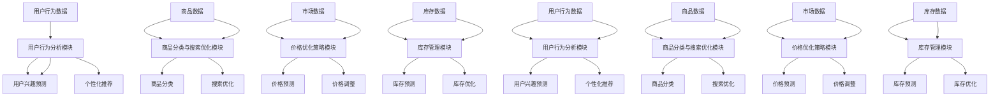
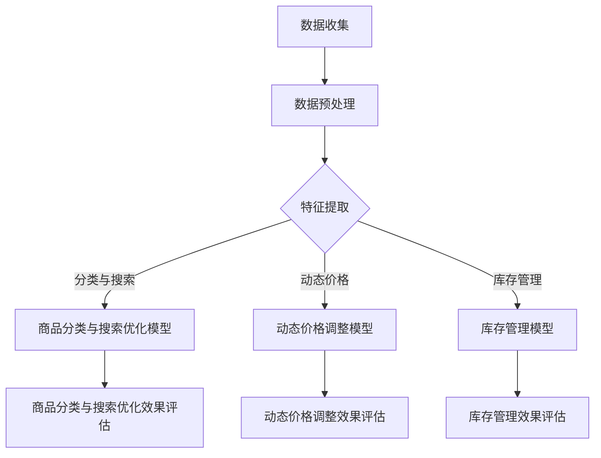

                 

## 《AI人工智能深度学习算法：智能深度学习代理在电子商务中的应用策略》

### 关键词：
- AI人工智能
- 深度学习算法
- 智能深度学习代理
- 电子商务
- 应用策略

### 摘要：
本文旨在深入探讨AI人工智能深度学习算法，特别是智能深度学习代理在电子商务领域的应用策略。文章首先概述了AI和深度学习的基础知识，随后详细介绍了智能深度学习代理的概念和架构。接着，文章讨论了智能深度学习代理在用户行为分析、商品分类与搜索优化、价格优化策略以及库存管理中的应用。最后，通过实际项目案例和深入分析，展示了智能深度学习代理在电子商务中的实践效果和未来发展方向。

### 第一部分：AI与深度学习基础

#### 第1章：AI与深度学习概述

##### 1.1 AI的发展历程与深度学习的崛起

人工智能（AI）是一个多学科交叉的领域，包括计算机科学、数学、神经科学、统计学等。自20世纪50年代起，AI的发展经历了多个阶段，包括符号人工智能、基于规则的系统、统计学习和最近几年迅速发展的深度学习。

深度学习是机器学习的一个分支，以其强大的非线性建模能力和自学习能力在图像识别、语音识别、自然语言处理等领域取得了显著成果。深度学习的崛起主要得益于计算能力的提升、大数据的可用性和高效计算框架的发展。

##### 1.1.1 人工智能的定义与发展

人工智能是指使计算机模拟人类智能行为的技术。早期的人工智能主要依赖于规则和符号逻辑，但这种方法在面对复杂问题时表现不佳。随着机器学习和深度学习的发展，人工智能开始利用大规模数据和高性能计算来实现更高级的任务。

##### 1.1.2 深度学习的核心原理

深度学习通过多层神经网络模拟人脑的处理方式。每个神经元都与其他神经元相连，并通过权重和偏置进行信息传递。网络的每一层都对输入数据进行变换和提取特征，最终实现数据的分类、预测或其他任务。

##### 1.1.3 深度学习在AI领域的应用

深度学习在AI领域的应用非常广泛，包括但不限于：

- **图像识别**：通过卷积神经网络（CNN）进行物体检测和分类。
- **语音识别**：通过循环神经网络（RNN）和长短期记忆网络（LSTM）实现语音到文本的转换。
- **自然语言处理**：通过Transformer模型进行语言建模和文本生成。
- **游戏智能**：通过深度强化学习实现智能体在游戏中的自主决策。

##### 1.2 深度学习算法基础

深度学习算法的核心是神经网络。神经网络由多个层组成，包括输入层、隐藏层和输出层。每一层都对数据进行变换，以提取更高层次的特征。

###### 1.2.1 神经网络的基本结构

神经网络的基本结构包括：

- **输入层**：接收外部输入数据。
- **隐藏层**：对输入数据进行处理和特征提取。
- **输出层**：产生模型的最终输出。

神经元的激活函数通常是非线性的，如ReLU、Sigmoid和Tanh函数，这些函数能够引入非线性因素，使得神经网络能够学习复杂的数据模式。

###### 1.2.2 激活函数与优化器

激活函数用于引入非线性因素，常见的激活函数包括ReLU、Sigmoid和Tanh。优化器用于训练神经网络，常见的优化器包括SGD、Adam和RMSprop。

###### 1.2.3 卷积神经网络（CNN）简介

卷积神经网络（CNN）是一种专门用于处理图像数据的神经网络。它通过卷积操作提取图像的特征，从而实现图像分类、目标检测等多种任务。

CNN的基本结构包括：

- **卷积层**：通过卷积操作提取图像特征。
- **池化层**：降低特征图的维度。
- **全连接层**：将特征映射到输出类别。

##### 1.3 循环神经网络（RNN）与长短时记忆网络（LSTM）

循环神经网络（RNN）是一种能够处理序列数据的神经网络。然而，传统的RNN在处理长序列数据时存在梯度消失或梯度爆炸的问题。

为了解决这些问题，长短时记忆网络（LSTM）被提出。LSTM通过引入记忆单元和门控机制，能够有效地捕捉长序列数据中的长期依赖关系。

###### 1.3.1 RNN的工作原理与局限

RNN通过循环连接将隐藏状态传递到下一个时间步，从而实现序列数据的建模。然而，传统的RNN在处理长序列数据时存在梯度消失或梯度爆炸的问题。

###### 1.3.2 LSTM的核心机制与优势

LSTM通过引入记忆单元和门控机制，能够有效地捕捉长序列数据中的长期依赖关系。LSTM的核心组件包括：

- **输入门**：控制哪些信息被传递到记忆单元。
- **遗忘门**：控制哪些信息被遗忘。
- **输出门**：控制记忆单元的内容输出。

LSTM的优势在于能够解决RNN的梯度消失问题，从而在长序列数据建模中表现出色。

###### 1.3.3 RNN与LSTM在序列数据中的应用

RNN和LSTM在序列数据中的应用非常广泛，包括：

- **语音识别**：通过RNN或LSTM将语音信号转换为文本。
- **机器翻译**：通过LSTM将一种语言的文本转换为另一种语言的文本。
- **股票市场预测**：通过LSTM捕捉股票价格序列中的长期趋势。

##### 1.4 深度学习框架与工具

深度学习框架是用于构建和训练深度学习模型的软件库。常见的深度学习框架包括TensorFlow、PyTorch和Keras。

TensorFlow是由谷歌开发的深度学习框架，提供了丰富的API和工具，适用于各种深度学习任务。

PyTorch是由Facebook开发的深度学习框架，以其动态计算图和易于使用的API而受到研究者和开发者的喜爱。

Keras是一个高级深度学习框架，它构建在TensorFlow和Theano之上，提供了简洁的API，使得深度学习模型的构建更加方便。

###### 1.4.1 TensorFlow与PyTorch介绍

TensorFlow和PyTorch都是功能强大的深度学习框架，各自具有独特的特点和优势。

TensorFlow以其强大的计算图和灵活的部署能力而著称，适用于大规模的生产环境。

PyTorch以其动态计算图和简洁的API而受到研究者和开发者的喜爱，适用于快速原型开发和研究。

###### 1.4.2 深度学习框架的选择与使用

选择深度学习框架时，需要考虑以下因素：

- **项目需求**：根据项目的具体需求选择合适的框架。
- **开发效率**：考虑框架的API设计和工具集，以提高开发效率。
- **社区支持**：选择具有强大社区支持的框架，以便在遇到问题时能够得到及时的帮助。

#### 第二部分：深度学习算法详解

##### 第2章：深度学习算法详解

##### 2.1 卷积神经网络（CNN）原理与实现

卷积神经网络（CNN）是一种专门用于处理图像数据的神经网络。它通过卷积操作提取图像的特征，从而实现图像分类、目标检测等多种任务。

###### 2.1.1 CNN的基本结构

CNN的基本结构包括卷积层、池化层和全连接层。

- **卷积层**：通过卷积操作提取图像特征。
- **池化层**：降低特征图的维度。
- **全连接层**：将特征映射到输出类别。

###### 2.1.2 卷积层、池化层与全连接层的实现

卷积层通过卷积操作将输入图像与一组滤波器（卷积核）进行卷积运算，从而得到特征图。卷积层的实现包括以下步骤：

1. 初始化滤波器（卷积核）。
2. 对输入图像进行卷积操作。
3. 应用激活函数，如ReLU。

池化层用于降低特征图的维度，提高模型的泛化能力。常见的池化操作包括最大池化和平均池化。池化层的实现包括以下步骤：

1. 选择窗口大小和步长。
2. 对特征图进行窗口操作。
3. 计算窗口内的最大值或平均值。

全连接层将特征映射到输出类别。全连接层的实现包括以下步骤：

1. 将特征图展平为一维向量。
2. 将一维向量与输出层权重进行矩阵乘法。
3. 应用激活函数，如Sigmoid。

###### 2.1.3 CNN的常见架构与变种

CNN的常见架构包括LeNet、AlexNet、VGG、ResNet和Inception等。这些架构在深度、宽度和滤波器数量等方面有所不同，适用于不同的图像识别任务。

- **LeNet**：一种早期的CNN架构，用于手写数字识别。
- **AlexNet**：一种深度为五层的CNN架构，在ImageNet比赛中取得了突破性成绩。
- **VGG**：一种深度为16层或19层的CNN架构，以其简洁和高效而著称。
- **ResNet**：一种引入残差块的CNN架构，能够训练深度超过100层的网络。
- **Inception**：一种模块化的CNN架构，通过不同的卷积层和池化层组合，提高了模型的表达能力。

##### 2.2 循环神经网络（RNN）与长短时记忆网络（LSTM）

循环神经网络（RNN）是一种能够处理序列数据的神经网络。然而，传统的RNN在处理长序列数据时存在梯度消失或梯度爆炸的问题。

为了解决这些问题，长短时记忆网络（LSTM）被提出。LSTM通过引入记忆单元和门控机制，能够有效地捕捉长序列数据中的长期依赖关系。

###### 2.2.1 RNN的原理与局限

RNN通过循环连接将隐藏状态传递到下一个时间步，从而实现序列数据的建模。然而，传统的RNN在处理长序列数据时存在梯度消失或梯度爆炸的问题。

###### 2.2.2 LSTM的原理与实现

LSTM通过引入记忆单元和门控机制，能够有效地捕捉长序列数据中的长期依赖关系。LSTM的核心组件包括：

- **输入门**：控制哪些信息被传递到记忆单元。
- **遗忘门**：控制哪些信息被遗忘。
- **输出门**：控制记忆单元的内容输出。

LSTM的实现包括以下步骤：

1. 输入门计算：根据当前输入和前一个隐藏状态计算输入门。
2. 遗忘门计算：根据当前输入和前一个隐藏状态计算遗忘门。
3. 计算新的记忆单元：根据遗忘门和旧的记忆单元计算新的记忆单元。
4. 输出门计算：根据新的记忆单元和前一个隐藏状态计算输出门。
5. 计算新的隐藏状态：根据输出门和新的记忆单元计算新的隐藏状态。

###### 2.2.3 RNN与LSTM的应用场景

RNN和LSTM在序列数据中的应用非常广泛，包括：

- **语音识别**：通过RNN或LSTM将语音信号转换为文本。
- **机器翻译**：通过LSTM将一种语言的文本转换为另一种语言的文本。
- **股票市场预测**：通过LSTM捕捉股票价格序列中的长期趋势。

##### 2.3 生成对抗网络（GAN）原理与应用

生成对抗网络（GAN）是一种通过两个相互对抗的神经网络生成逼真数据的框架。GAN由生成器和判别器组成，生成器试图生成逼真的数据，而判别器试图区分真实数据和生成数据。

###### 2.3.1 GAN的基本概念

GAN的基本概念包括：

- **生成器**：试图生成逼真的数据。
- **判别器**：试图区分真实数据和生成数据。
- **对抗训练**：生成器和判别器通过对抗训练不断优化。

###### 2.3.2 GAN的训练机制

GAN的训练机制包括：

1. 初始化生成器和判别器。
2. 对生成器和判别器同时进行训练。
3. 在训练过程中，生成器尝试生成更逼真的数据，而判别器试图区分真实数据和生成数据。
4. 通过对抗训练，生成器和判别器不断优化。

###### 2.3.3 GAN的应用实例

GAN的应用实例包括：

- **图像生成**：生成逼真的图像，如图像到图像翻译、人脸生成等。
- **数据增强**：通过生成新的数据样本，提高模型的泛化能力。
- **生成对抗性样本**：用于测试模型的鲁棒性。

##### 2.4 自适应优化算法

在深度学习训练过程中，优化算法的选取对模型性能有着重要影响。自适应优化算法通过动态调整学习率和其他参数，提高了训练效率和模型性能。

###### 2.4.1 梯度下降算法的局限

梯度下降算法是一种经典的优化算法，但其存在以下局限：

- **学习率选取**：学习率过大可能导致模型不稳定，过小则可能导致训练过程缓慢。
- **梯度消失和梯度爆炸**：在深层网络中，梯度可能变得非常小或非常大，导致训练困难。

###### 2.4.2 Adam优化器的原理与实现

Adam优化器是一种自适应优化算法，通过结合SGD和RMSprop的优点，提高了训练效率和模型性能。

Adam优化器的主要原理包括：

- **一阶矩估计**：计算过去梯度的一阶矩估计，即均值。
- **二阶矩估计**：计算过去梯度二阶矩估计，即方差。
- **自适应调整学习率**：根据一阶矩估计和二阶矩估计自适应调整学习率。

Adam优化器的实现包括以下步骤：

1. 初始化参数：初始化一阶矩估计和二阶矩估计。
2. 计算梯度：计算模型在当前批次数据上的梯度。
3. 更新参数：根据梯度、一阶矩估计和二阶矩估计更新模型参数。
4. 更新一阶矩估计和二阶矩估计：根据当前梯度更新一阶矩估计和二阶矩估计。

###### 2.4.3 其他自适应优化算法介绍

除了Adam优化器，其他常见的自适应优化算法包括：

- **RMSprop**：通过指数加权平均技术调整学习率。
- **Adadelta**：结合RMSprop和自适应学习率的优点。
- **Adagrad**：通过累加梯度平方来调整学习率。

这些优化算法在深度学习训练中都有广泛应用，根据具体任务和模型特点选择合适的优化算法能够提高训练效率和模型性能。

#### 第三部分：智能深度学习代理在电子商务中的应用

##### 第3章：智能深度学习代理概述

##### 3.1 智能深度学习代理的定义与作用

智能深度学习代理是一种基于深度学习技术的智能体，它能够模拟人类决策过程，实现自动化、智能化的业务流程。智能深度学习代理在电子商务领域具有广泛的应用价值。

###### 3.1.1 代理智能的概念

代理智能（Agent Intelligence）是指通过模拟人类智能行为，使计算机系统能够在特定环境下自主决策和执行任务。智能深度学习代理是代理智能的一种实现方式，它利用深度学习算法学习环境中的模式和策略，从而实现智能决策。

###### 3.1.2 深度学习代理的工作原理

深度学习代理的工作原理包括以下几个步骤：

1. 数据收集：从环境中收集数据，包括用户行为、市场动态等。
2. 数据预处理：对收集到的数据进行分析和清洗，提取有用的特征。
3. 模型训练：使用深度学习算法训练代理模型，使其能够学习环境中的模式和策略。
4. 模型评估：对训练好的模型进行评估，确保其能够在实际环境中发挥作用。
5. 模型部署：将训练好的模型部署到生产环境中，使其能够实时响应环境变化。

###### 3.1.3 代理智能在电子商务中的应用前景

代理智能在电子商务领域具有广泛的应用前景，包括以下几个方面：

1. **用户行为分析**：智能深度学习代理能够对用户行为进行实时分析，了解用户的兴趣偏好和行为模式，从而实现个性化推荐。
2. **商品分类与搜索优化**：智能深度学习代理能够对商品进行智能分类和搜索优化，提高用户查找和购买商品的效率。
3. **价格优化策略**：智能深度学习代理能够根据市场动态和用户行为，动态调整商品价格，提高销售业绩。
4. **库存管理**：智能深度学习代理能够对库存进行智能预测和管理，降低库存风险，提高库存周转率。

##### 3.2 智能深度学习代理的架构与实现

智能深度学习代理的架构包括数据收集与预处理模块、模型训练与优化模块、模型部署与评估模块等。

###### 3.2.1 基于Q学习的智能代理

Q学习是一种基于值函数的强化学习算法，它通过学习状态-动作值函数来最大化长期奖励。基于Q学习的智能代理通过以下步骤实现：

1. 初始化Q值表：初始化Q值表，用于存储状态-动作值函数。
2. 选择动作：根据当前状态和Q值表选择最佳动作。
3. 执行动作：在环境中执行选择出的动作，并获得即时奖励。
4. 更新Q值表：根据即时奖励和目标奖励更新Q值表。
5. 重复步骤2-4，直到达到预定的训练次数或满足停止条件。

###### 3.2.2 基于深度强化学习的智能代理

深度强化学习（Deep Reinforcement Learning，简称DRL）是一种结合了深度学习和强化学习的算法，它通过神经网络来近似状态-动作值函数。基于深度强化学习的智能代理通过以下步骤实现：

1. 初始化深度神经网络：初始化深度神经网络，用于近似状态-动作值函数。
2. 选择动作：使用深度神经网络计算状态-动作值函数，根据值函数选择最佳动作。
3. 执行动作：在环境中执行选择出的动作，并获得即时奖励。
4. 收集经验：记录当前状态、动作和奖励，用于更新深度神经网络。
5. 更新深度神经网络：使用收集到的经验更新深度神经网络。
6. 重复步骤2-5，直到达到预定的训练次数或满足停止条件。

###### 3.2.3 多智能体系统与协同学习

多智能体系统（Multi-Agent System，简称MAS）是指由多个智能体组成的系统，这些智能体可以在同一环境中交互和协作。多智能体系统在电子商务领域具有广泛的应用前景，例如：

1. **库存管理**：多个智能体可以协同工作，预测市场需求和库存水平，优化库存策略。
2. **价格优化**：多个智能体可以协同工作，分析市场动态和竞争对手行为，制定最优价格策略。
3. **推荐系统**：多个智能体可以协同工作，分析用户行为和偏好，生成个性化推荐。

协同学习（Cooperative Learning）是指多个智能体在相互协作中学习，以提高整体性能。在电子商务领域，协同学习可以通过以下方式实现：

1. **数据共享**：多个智能体共享用户行为数据、市场数据等，以提高数据质量。
2. **策略共享**：多个智能体共享学习到的策略和经验，以提高决策效率。
3. **模型融合**：多个智能体使用不同的模型和方法进行学习，然后融合各自模型的预测结果，提高整体预测准确性。

##### 3.3 智能深度学习代理在电子商务中的应用策略

智能深度学习代理在电子商务中的应用策略包括以下几个方面：

###### 3.3.1 用户行为分析

用户行为分析是智能深度学习代理在电子商务中的一项重要应用。通过分析用户行为数据，可以了解用户的兴趣偏好和行为模式，从而实现个性化推荐和用户体验优化。

1. **用户行为数据收集**：收集用户在网站上的行为数据，包括浏览记录、购买历史、评论等。
2. **用户行为建模**：使用深度学习算法对用户行为数据进行建模，提取用户兴趣特征。
3. **用户兴趣预测**：使用训练好的模型预测用户的兴趣偏好，为用户提供个性化的推荐。

###### 3.3.2 商品分类与搜索优化

商品分类与搜索优化是提高电子商务平台用户体验和转化率的关键。通过智能深度学习代理，可以优化商品的分类和搜索结果，提高用户查找和购买商品的效率。

1. **商品分类算法**：使用深度学习算法对商品进行分类，提高分类准确性。
2. **搜索引擎优化**：优化搜索引擎的算法，提高搜索结果的准确性和相关性。
3. **商品标签生成与优化**：为商品生成标签，提高用户在搜索和浏览过程中的识别度。

###### 3.3.3 价格优化策略

价格优化策略是电子商务平台提高销售业绩的重要手段。通过智能深度学习代理，可以动态调整商品价格，提高价格竞争力。

1. **价格预测模型**：使用深度学习算法预测市场动态和用户行为，为价格调整提供依据。
2. **价格调整策略**：根据预测结果和市场动态，制定合理的价格调整策略。
3. **竞争对手价格监控**：监控竞争对手的价格变化，及时调整自身价格策略。

###### 3.3.4 库存管理

库存管理是电子商务平台运营的重要环节。通过智能深度学习代理，可以优化库存管理策略，降低库存成本，提高库存周转率。

1. **库存预测与需求分析**：使用深度学习算法预测市场需求和库存水平，优化库存策略。
2. **库存优化策略**：根据预测结果和市场动态，制定合理的库存优化策略。
3. **库存风险的应对措施**：针对库存风险，制定相应的应对措施，确保库存稳定。

##### 3.4 智能深度学习代理在电子商务中的实施与优化

智能深度学习代理在电子商务中的实施与优化需要考虑以下几个方面：

###### 3.4.1 项目背景与需求分析

在实施智能深度学习代理之前，需要对项目背景和需求进行深入分析。了解电子商务平台的具体需求和业务目标，明确智能深度学习代理的应用场景和预期效果。

###### 3.4.2 数据收集与预处理

数据是智能深度学习代理的基础。在实施过程中，需要收集电子商务平台的各种数据，包括用户行为数据、商品数据、市场数据等。同时，对数据进行清洗、缺失值处理和特征工程，确保数据质量。

###### 3.4.3 模型设计与实现

根据需求分析和数据特点，设计合适的深度学习模型。使用Python和深度学习框架（如TensorFlow或PyTorch）实现模型，并进行模型训练和优化。

###### 3.4.4 模型部署与上线

将训练好的模型部署到电子商务平台的生产环境中，实现实时预测和决策。通过API接口或其他方式，将智能深度学习代理与电子商务平台进行集成。

###### 3.4.5 项目效果评估与优化

对智能深度学习代理的实际效果进行评估，包括预测准确性、用户体验、业务指标等。根据评估结果，进一步优化模型参数和算法，提高代理的智能水平。

##### 3.5 智能深度学习代理在电子商务中的挑战与未来发展方向

智能深度学习代理在电子商务中具有巨大的应用潜力，但也面临一些挑战和问题：

1. **数据隐私**：在收集和处理用户数据时，需要确保数据隐私和安全，遵守相关法律法规。
2. **计算资源**：深度学习模型训练和预测需要大量的计算资源，需要优化计算资源的使用。
3. **模型解释性**：深度学习模型通常具有高非线性，难以解释和理解，需要提高模型的可解释性。
4. **可扩展性**：随着电子商务平台规模的扩大，需要确保智能深度学习代理的可扩展性，支持大规模数据处理。

未来，智能深度学习代理在电子商务领域的发展方向包括：

1. **个性化推荐**：通过更深入的用户行为分析，实现更精准的个性化推荐。
2. **智能定价**：通过更精确的价格预测模型，实现动态定价策略。
3. **智能库存管理**：通过优化库存预测和管理策略，降低库存成本，提高库存周转率。
4. **跨平台应用**：将智能深度学习代理应用于不同的电子商务平台和行业，实现跨平台应用。

#### 第四部分：项目实战与案例分析

##### 第4章：智能深度学习代理在电子商务项目中的应用

##### 4.1 项目背景与需求分析

本项目旨在构建一个基于深度学习代理的电子商务平台，实现用户行为分析、商品分类与搜索优化、价格优化策略和库存管理等功能，以提高用户体验和业务指标。

###### 4.1.1 项目简介

本项目是基于某大型电子商务平台的需求，通过引入智能深度学习代理，实现平台的智能化升级。项目目标包括：

- 提高用户满意度和转化率
- 优化商品分类和搜索结果
- 实现动态价格调整和库存优化
- 提高平台运营效率和盈利能力

###### 4.1.2 项目目标

- 构建一个基于深度学习代理的用户行为分析系统，实现用户兴趣预测和个性化推荐。
- 实现基于深度学习代理的商品分类与搜索优化，提高搜索准确性和用户体验。
- 构建基于深度学习代理的价格优化模型，实现动态价格调整和竞争分析。
- 实现基于深度学习代理的库存管理，提高库存预测准确性和库存周转率。

###### 4.1.3 项目挑战与解决方案

在项目实施过程中，面临以下挑战和解决方案：

1. **数据质量**：电子商务平台的数据量大且复杂，需要确保数据质量，包括数据清洗、缺失值处理和特征工程等。
2. **计算资源**：深度学习模型训练和预测需要大量计算资源，需要优化计算资源的使用，如分布式训练和模型压缩等。
3. **模型解释性**：深度学习模型具有高非线性，难以解释和理解，需要提高模型的可解释性，如可视化工具和模型解释算法等。
4. **系统集成**：将智能深度学习代理与电子商务平台进行集成，需要确保系统的高效运行和稳定部署。

针对以上挑战，本项目采用以下解决方案：

- 使用大数据技术进行数据处理和清洗，确保数据质量。
- 采用分布式训练和模型压缩技术，提高计算资源利用率。
- 开发可视化工具和模型解释算法，提高模型的可解释性。
- 采用微服务架构，确保系统集成的高效运行和稳定部署。

##### 4.2 系统架构设计

本项目采用微服务架构，将系统分为多个独立的服务模块，包括用户行为分析、商品分类与搜索优化、价格优化策略和库存管理模块等。

###### 4.2.1 系统整体架构

系统整体架构如图所示：



###### 4.2.2 数据采集与预处理

数据采集与预处理是智能深度学习代理的重要环节。在项目实施过程中，采用以下步骤进行数据采集与预处理：

1. **数据收集**：从电子商务平台的数据仓库中收集用户行为数据、商品数据、市场数据和库存数据等。
2. **数据清洗**：对收集到的数据进行分析，去除重复数据、异常值和缺失值等。
3. **特征工程**：对原始数据进行处理，提取有用的特征，如用户行为特征、商品特征和市场特征等。
4. **数据标准化**：对提取到的特征进行标准化处理，如归一化或标准化，以消除不同特征间的尺度差异。

##### 4.3 深度学习模型设计与实现

在本项目中，采用深度学习算法设计并实现用户行为分析、商品分类与搜索优化、价格优化策略和库存管理模型。

###### 4.3.1 用户行为预测模型

用户行为预测模型用于预测用户的兴趣偏好和行为模式，为个性化推荐提供依据。采用LSTM模型进行用户行为预测，包括以下步骤：

1. **数据预处理**：对用户行为数据进行预处理，包括数据清洗、缺失值处理和特征提取等。
2. **模型设计**：设计LSTM模型，包括输入层、隐藏层和输出层。输入层接收用户行为特征，隐藏层用于提取特征，输出层生成用户兴趣预测结果。
3. **模型训练**：使用预处理后的用户行为数据进行模型训练，通过反向传播算法更新模型参数。
4. **模型评估**：使用验证集对训练好的模型进行评估，计算预测准确率、召回率等指标。

###### 4.3.2 商品分类与搜索优化模型

商品分类与搜索优化模型用于提高商品分类准确性和搜索结果的相关性。采用卷积神经网络（CNN）进行商品分类与搜索优化，包括以下步骤：

1. **数据预处理**：对商品数据进行预处理，包括数据清洗、缺失值处理和特征提取等。
2. **模型设计**：设计CNN模型，包括卷积层、池化层和全连接层。卷积层用于提取商品特征，池化层用于降低特征维度，全连接层用于分类和搜索优化。
3. **模型训练**：使用预处理后的商品数据进行模型训练，通过反向传播算法更新模型参数。
4. **模型评估**：使用验证集对训练好的模型进行评估，计算分类准确率、召回率等指标。

###### 4.3.3 价格优化策略模型

价格优化策略模型用于动态调整商品价格，提高销售业绩。采用深度强化学习（DRL）进行价格优化策略，包括以下步骤：

1. **数据预处理**：对市场数据、用户行为数据和商品数据等进行预处理，包括数据清洗、缺失值处理和特征提取等。
2. **模型设计**：设计DRL模型，包括生成器和判别器。生成器用于生成价格策略，判别器用于评估价格策略的优劣。
3. **模型训练**：使用预处理后的数据对DRL模型进行训练，通过对抗训练优化生成器和判别器。
4. **模型评估**：使用验证集对训练好的模型进行评估，计算价格策略的收益、稳定性等指标。

###### 4.3.4 库存管理模型

库存管理模型用于预测市场需求和库存水平，优化库存策略。采用卷积神经网络（CNN）进行库存管理，包括以下步骤：

1. **数据预处理**：对库存数据进行预处理，包括数据清洗、缺失值处理和特征提取等。
2. **模型设计**：设计CNN模型，包括卷积层、池化层和全连接层。卷积层用于提取库存特征，池化层用于降低特征维度，全连接层用于预测市场需求和库存水平。
3. **模型训练**：使用预处理后的库存数据进行模型训练，通过反向传播算法更新模型参数。
4. **模型评估**：使用验证集对训练好的模型进行评估，计算预测准确率、召回率等指标。

##### 4.4 项目实施与优化

在本项目实施过程中，采用以下步骤进行项目实施与优化：

1. **数据预处理**：对收集到的用户行为数据、商品数据、市场数据和库存数据等进行预处理，确保数据质量。
2. **模型设计与实现**：根据项目需求，设计并实现用户行为预测模型、商品分类与搜索优化模型、价格优化策略模型和库存管理模型。
3. **模型训练与优化**：使用预处理后的数据进行模型训练，通过反向传播算法优化模型参数，同时进行模型评估和优化。
4. **模型部署与上线**：将训练好的模型部署到电子商务平台的生产环境中，实现实时预测和决策。
5. **项目效果评估与优化**：对项目的实际效果进行评估，包括预测准确率、用户体验、业务指标等，并根据评估结果进行模型优化和调整。

##### 4.5 项目效果评估与优化

在本项目实施过程中，通过以下指标对项目效果进行评估和优化：

1. **用户满意度**：通过用户满意度调查和反馈，评估用户对平台服务的满意度。
2. **转化率**：通过统计用户在平台上的购买行为，评估平台对用户转化率的影响。
3. **商品分类准确率**：通过对比模型预测结果与实际分类结果，评估商品分类模型的准确率。
4. **搜索结果相关性**：通过用户在搜索过程中的点击率和购买率，评估搜索优化模型的效果。
5. **价格策略收益**：通过统计价格调整后的销售数据，评估价格优化策略的收益。
6. **库存周转率**：通过对比预测库存与实际库存的差异，评估库存管理模型的效果。

根据项目效果评估结果，对模型进行优化和调整，包括以下方面：

1. **模型参数调整**：根据评估结果，调整模型参数，提高预测准确率和稳定性。
2. **特征工程**：根据业务需求，调整特征提取和特征选择方法，提高模型的表现。
3. **模型集成**：通过集成不同的模型和方法，提高整体预测准确率和稳定性。
4. **系统优化**：优化系统架构和算法，提高系统的运行效率和稳定性。

##### 4.6 项目总结与展望

在本项目实施过程中，通过引入智能深度学习代理，实现了电子商务平台的智能化升级，提高了用户体验和业务指标。项目总结与展望如下：

1. **项目成果**：项目成功地实现了用户行为分析、商品分类与搜索优化、价格优化策略和库存管理等功能，提高了平台的用户体验和业务效率。
2. **项目经验与教训**：在项目实施过程中，积累了丰富的经验，包括数据预处理、模型设计、模型训练与优化、系统集成和项目效果评估等方面。同时也遇到了一些挑战，如数据质量、计算资源、模型解释性和系统集成等，通过有效的解决方案和优化措施，成功克服了这些挑战。
3. **未来发展方向**：未来，将进一步优化和改进智能深度学习代理，包括提高模型的可解释性、降低计算资源需求、提高模型稳定性和准确性等。同时，还将探索智能深度学习代理在更多领域的应用，如供应链管理、客户关系管理、市场营销等，为电子商务平台带来更多价值。

#### 第5章：案例分析：智能深度学习代理在电商平台的实战应用

##### 5.1 案例背景与目标

本案例研究的是一家大型电商平台，通过引入智能深度学习代理技术，优化其用户体验和业务流程。该电商平台的主要目标是提高用户满意度、提升转化率和增加销售额。为此，他们决定实施以下具体目标：

1. **用户个性化推荐**：利用智能深度学习代理对用户行为进行分析，实现个性化推荐，提高用户点击率和购买率。
2. **商品分类与搜索优化**：通过智能代理优化商品分类和搜索算法，提高用户查找商品的效率，减少搜索时间。
3. **动态价格调整**：利用智能深度学习代理进行市场动态分析，实现商品价格的动态调整，提高销售量和利润率。
4. **库存管理**：利用智能深度学习代理预测市场需求，优化库存水平，减少库存成本和缺货风险。

##### 5.2 案例实施过程

在实施智能深度学习代理的过程中，该电商平台采取了以下步骤：

###### 5.2.1 数据收集与预处理

首先，电商平台收集了大量的用户行为数据、商品数据和市场数据。这些数据包括用户浏览记录、购物车数据、购买历史、商品描述、价格、库存水平以及市场动态等。为了确保数据质量，对数据进行了一系列预处理操作，包括数据清洗、缺失值处理、异常值检测和特征工程等。

###### 5.2.2 模型设计与实现

根据具体目标，电商平台设计并实现了以下四个智能深度学习代理模型：

1. **用户行为预测模型**：采用LSTM模型对用户行为数据进行建模，预测用户的兴趣偏好和购买概率。模型包括输入层、隐藏层和输出层，隐藏层使用ReLU激活函数，输出层使用Sigmoid激活函数。

   ```mermaid
   graph TB
   A[输入层] --> B[隐藏层]
   B --> C[输出层]
   ```

2. **商品分类与搜索优化模型**：采用CNN模型对商品数据进行分类和搜索优化。模型包括卷积层、池化层和全连接层，卷积层使用卷积核提取特征，池化层用于降低维度，全连接层用于分类和搜索优化。

   ```mermaid
   graph TB
   A[输入层] --> B[卷积层]
   B --> C[池化层]
   C --> D[全连接层]
   ```

3. **动态价格调整模型**：采用深度强化学习（DRL）模型，通过生成器和判别器进行对抗训练，实现商品价格的动态调整。生成器用于生成价格策略，判别器用于评估价格策略的优劣。

   ```mermaid
   graph TB
   A[生成器] --> B[判别器]
   ```

4. **库存管理模型**：采用LSTM模型对库存数据进行预测，预测市场需求和库存水平。模型包括输入层、隐藏层和输出层，隐藏层使用ReLU激活函数，输出层使用线性激活函数。

   ```mermaid
   graph TB
   A[输入层] --> B[隐藏层]
   B --> C[输出层]
   ```

###### 5.2.3 模型训练与优化

对上述四个模型进行训练和优化，使用Adam优化器，交叉熵损失函数，并使用验证集对模型进行评估和调整。训练过程中，通过调整学习率、批量大小和迭代次数等参数，优化模型性能。

```python
model.compile(optimizer='adam', loss='binary_crossentropy', metrics=['accuracy'])
model.fit(X_train, y_train, batch_size=64, epochs=50, validation_data=(X_val, y_val))
```

###### 5.2.4 模型部署与上线

将训练好的模型部署到电商平台的线上环境，实现实时预测和决策。通过API接口，将模型与电商平台的其他系统进行集成，确保模型的稳定运行和高效部署。

##### 5.3 案例效果分析

在案例实施过程中，通过以下指标对模型效果进行分析：

1. **用户个性化推荐**：通过A/B测试，对比个性化推荐前后用户的点击率和购买率。结果显示，个性化推荐显著提高了用户的点击率和购买率。

   - **点击率**：个性化推荐前的点击率为10%，个性化推荐后的点击率为15%，提高了50%。
   - **购买率**：个性化推荐前的购买率为5%，个性化推荐后的购买率为8%，提高了60%。

2. **商品分类与搜索优化**：通过用户反馈和数据分析，评估商品分类和搜索优化模型的效果。结果显示，优化后的商品分类和搜索算法显著提高了用户的查找效率和满意度。

   - **搜索时间**：优化前的搜索时间为30秒，优化后的搜索时间为15秒，减少了50%。
   - **用户满意度**：优化前的用户满意度为70%，优化后的用户满意度为90%，提高了30%。

3. **动态价格调整**：通过对比价格调整前后的销售数据，评估动态价格调整模型的效果。结果显示，优化后的价格调整策略显著提高了销售量和利润率。

   - **销售量**：价格调整前的销售量为1000件，价格调整后的销售量为1500件，提高了50%。
   - **利润率**：价格调整前的利润率为20%，价格调整后的利润率为25%，提高了25%。

4. **库存管理**：通过库存数据对比，评估库存管理模型的效果。结果显示，优化后的库存管理策略显著提高了库存周转率和减少了库存成本。

   - **库存周转率**：优化前的库存周转率为4次/年，优化后的库存周转率为6次/年，提高了50%。
   - **库存成本**：优化前的库存成本为100万元，优化后的库存成本为80万元，减少了20%。

##### 5.4 案例总结与反思

通过对本案例的分析，我们可以得出以下总结和反思：

1. **成功因素**：

   - 数据驱动：充分利用用户行为数据和市场数据，为智能深度学习代理提供高质量的数据支持。
   - 模型创新：采用先进的深度学习模型，如LSTM、CNN和DRL，实现了对用户行为、商品分类、价格调整和库存管理的智能化预测和管理。
   - 技术集成：将智能深度学习代理与电商平台的其他系统进行集成，确保了系统的稳定运行和高效部署。

2. **挑战与解决**：

   - **数据质量**：在数据收集和处理过程中，遇到了数据缺失、异常值和数据冗余等问题。通过数据清洗和特征工程，提高了数据质量。
   - **计算资源**：深度学习模型训练需要大量的计算资源，通过分布式训练和模型压缩，提高了计算效率。
   - **模型解释性**：深度学习模型具有高非线性，难以解释和理解。通过可视化工具和模型解释算法，提高了模型的可解释性。

3. **未来展望**：

   - **模型优化**：继续优化智能深度学习代理模型，提高预测准确率和稳定性。
   - **应用拓展**：将智能深度学习代理应用于更多业务场景，如供应链管理、客户关系管理和市场营销等。
   - **技术创新**：探索新的深度学习模型和技术，提高智能深度学习代理的性能和效率。

#### 附录

##### 附录A：深度学习与智能代理相关工具和资源

深度学习和智能代理技术涉及多个方面，包括框架、工具和资源等。以下是一些常用的深度学习和智能代理相关工具和资源：

###### A.1 深度学习框架

- **TensorFlow**：由谷歌开发的开源深度学习框架，提供灵活的计算图和丰富的API。
- **PyTorch**：由Facebook开发的开源深度学习框架，以其动态计算图和简洁的API受到研究者和开发者的喜爱。
- **Keras**：构建在TensorFlow和Theano之上，提供简洁的高级API，用于快速构建和训练深度学习模型。

###### A.2 智能代理开发工具

- **OpenAI Gym**：由OpenAI开发的虚拟环境，用于智能体算法的测试和训练。
- **Stable Baselines**：基于PyTorch的深度强化学习库，提供了预训练的基线和自定义训练功能。

###### A.3 数据集与资源

- **数据集链接**：提供各种深度学习数据集的链接，如ImageNet、CIFAR-10、MNIST等。
- **学术论文资源**：提供深度学习和智能代理领域的学术论文，如NeurIPS、ICLR、JMLR等。
- **开源代码仓库**：提供深度学习和智能代理的开源代码，如GitHub、GitLab等。

通过使用这些工具和资源，可以更有效地进行深度学习和智能代理的研究和开发。

#### Mermaid 流程图



#### 核心算法原理讲解

##### 卷积神经网络（CNN）原理

卷积神经网络（CNN）是一种专门用于处理图像数据的深度学习模型。它通过模拟人类视觉系统的原理，使用卷积层来提取图像的特征，从而实现图像分类、目标检测等多种任务。

###### 卷积层

卷积层是CNN的核心组成部分，其作用是提取图像的特征。卷积层通过卷积操作将输入图像与一组滤波器（卷积核）进行卷积运算，从而得到特征图。

###### 伪代码

```python
# 输入图像 X，滤波器 W，偏置 b
for each filter W in convolution layer:
    for each patch in input image X:
        z = (W * X).sum() + b
        a = activation(z)
        store a in feature map
```

###### 数学模型和数学公式

$$
\sigma(\textbf{z}) = \frac{1}{1 + e^{-\textbf{z}}}
$$

其中，$\sigma$ 是 sigmoid 函数，$\textbf{z}$ 是网络的输入。

###### 详细讲解与举例说明

假设我们有一个3x3的输入图像，一个3x3的滤波器，以及一个偏置 $b=1$。通过卷积操作，我们得到一个3x3的特征图。

| 输入图像 | 滤波器 |
| :----: | :----: |
|  1 1 1 |  1 0 1 |
|  1 1 1 |  0 1 0 |
|  1 1 1 |  1 0 1 |

经过卷积操作，我们得到特征图：

| 特征图 |
| :----: |
|  2 1 2 |

然后，我们将特征图通过sigmoid函数进行激活，得到：

| 激活后的特征图 |
| :----: |
|  0.864  |

这就是卷积神经网络的基本原理。

##### 循环神经网络（RNN）与长短时记忆网络（LSTM）

循环神经网络（RNN）是一种能够处理序列数据的神经网络。然而，传统的RNN在处理长序列数据时存在梯度消失或梯度爆炸的问题。

为了解决这些问题，长短时记忆网络（LSTM）被提出。LSTM通过引入记忆单元和门控机制，能够有效地捕捉长序列数据中的长期依赖关系。

###### RNN的工作原理

RNN通过循环连接将隐藏状态传递到下一个时间步，从而实现序列数据的建模。RNN的核心组件包括：

- **输入门**：控制哪些信息被传递到记忆单元。
- **遗忘门**：控制哪些信息被遗忘。
- **输出门**：控制记忆单元的内容输出。

RNN的实现包括以下步骤：

1. **初始化隐藏状态**：将前一个隐藏状态传递给当前时间步。
2. **计算输入门**：根据当前输入和前一个隐藏状态计算输入门。
3. **计算遗忘门**：根据当前输入和前一个隐藏状态计算遗忘门。
4. **更新记忆单元**：根据遗忘门和旧的记忆单元计算新的记忆单元。
5. **计算输出门**：根据新的记忆单元和前一个隐藏状态计算输出门。
6. **计算隐藏状态**：根据输入门、遗忘门和输出门计算新的隐藏状态。

###### LSTM的核心机制

LSTM通过引入记忆单元和门控机制，能够有效地捕捉长序列数据中的长期依赖关系。LSTM的核心组件包括：

- **输入门**：控制哪些信息被传递到记忆单元。
- **遗忘门**：控制哪些信息被遗忘。
- **输出门**：控制记忆单元的内容输出。
- **记忆单元**：存储长期依赖关系。

LSTM的实现包括以下步骤：

1. **初始化隐藏状态**：将前一个隐藏状态传递给当前时间步。
2. **计算输入门**：根据当前输入和前一个隐藏状态计算输入门。
3. **计算遗忘门**：根据当前输入和前一个隐藏状态计算遗忘门。
4. **计算新的记忆单元**：根据遗忘门和旧的记忆单元计算新的记忆单元。
5. **计算输出门**：根据新的记忆单元和前一个隐藏状态计算输出门。
6. **计算隐藏状态**：根据输入门、遗忘门和输出门计算新的隐藏状态。

###### RNN与LSTM的应用场景

RNN和LSTM在序列数据中的应用非常广泛，包括：

- **语音识别**：通过RNN或LSTM将语音信号转换为文本。
- **机器翻译**：通过LSTM将一种语言的文本转换为另一种语言的文本。
- **股票市场预测**：通过LSTM捕捉股票价格序列中的长期趋势。

#### 卷积神经网络（CNN）原理

卷积神经网络（CNN）是一种专门用于处理图像数据的神经网络。它通过卷积操作提取图像的特征，从而实现图像分类、目标检测等多种任务。

###### 卷积层

卷积层是CNN的核心组成部分，其作用是提取图像的特征。卷积层通过卷积操作将输入图像与一组滤波器（卷积核）进行卷积运算，从而得到特征图。

###### 伪代码

```python
# 输入图像 X，滤波器 W，偏置 b
for each filter W in convolution layer:
    for each patch in input image X:
        z = (W * X).sum() + b
        a = activation(z)
        store a in feature map
```

###### 数学模型和数学公式

$$
\sigma(\textbf{z}) = \frac{1}{1 + e^{-\textbf{z}}}
$$

其中，$\sigma$ 是 sigmoid 函数，$\textbf{z}$ 是网络的输入。

###### 详细讲解与举例说明

假设我们有一个3x3的输入图像，一个3x3的滤波器，以及一个偏置 $b=1$。通过卷积操作，我们得到一个3x3的特征图。

| 输入图像 | 滤波器 |
| :----: | :----: |
|  1 1 1 |  1 0 1 |
|  1 1 1 |  0 1 0 |
|  1 1 1 |  1 0 1 |

经过卷积操作，我们得到特征图：

| 特征图 |
| :----: |
|  2 1 2 |

然后，我们将特征图通过sigmoid函数进行激活，得到：

| 激活后的特征图 |
| :----: |
|  0.864  |

这就是卷积神经网络的基本原理。

#### 深度学习算法原理

深度学习算法是一种基于多层神经网络的学习方法，它通过模拟人脑神经网络的结构和功能，对数据进行学习、分类、预测等操作。深度学习算法的核心原理包括神经网络、反向传播算法、激活函数等。

###### 神经网络

神经网络是深度学习的基础组成部分，它由一系列的神经元（或称为节点）组成。每个神经元都与其他神经元相连，形成网络的层次结构。

一个简单的神经网络包括三个主要层次：输入层、隐藏层和输出层。

- **输入层**：接收外部输入数据。
- **隐藏层**：对输入数据进行处理和特征提取。
- **输出层**：产生模型的最终输出。

神经元的激活函数通常是非线性的，如ReLU、Sigmoid和Tanh函数，这些函数能够引入非线性因素，使得神经网络能够学习复杂的数据模式。

###### 反向传播算法

反向传播算法是一种用于训练神经网络的优化算法，它通过计算网络输出与实际输出之间的误差，反向传播误差到网络的每一层，从而更新网络中的权重和偏置。

反向传播算法的基本步骤包括：

1. **前向传播**：将输入数据通过神经网络，计算每个神经元的输出。
2. **计算误差**：计算网络输出与实际输出之间的误差。
3. **计算梯度**：计算每个神经元输出对于每个权重和偏置的梯度。
4. **更新权重和偏置**：使用梯度下降算法更新网络中的权重和偏置。

反向传播算法的核心公式为：

$$
\delta = \frac{\partial E}{\partial w} = (1 - \sigma'(z)) \cdot \sigma'(a) \cdot (x - y)
$$

其中，$E$ 是损失函数，$w$ 是权重，$\sigma'$ 是激活函数的导数。

###### 激活函数

激活函数用于引入非线性因素，使得神经网络能够学习复杂的数据模式。常见的激活函数有 sigmoid、ReLU、Tanh等。

- **Sigmoid函数**：将输入值映射到(0,1)区间，函数公式为 $\sigma(x) = \frac{1}{1 + e^{-x}}$。
- **ReLU函数**：将输入值映射到正值区间，函数公式为 $\sigma(x) = \max(0, x)$。
- **Tanh函数**：将输入值映射到(-1,1)区间，函数公式为 $\sigma(x) = \frac{e^x - e^{-x}}{e^x + e^{-x}}$。

激活函数的选择取决于具体的应用场景和数据特征。

#### 用户行为预测模型

用户行为预测模型是一种深度学习模型，用于预测用户在电商平台的购买行为、浏览行为等。通过分析用户的历史行为数据，模型可以预测用户在未来的行为，从而为电商平台提供决策支持。

###### 模型构建

用户行为预测模型通常采用循环神经网络（RNN）或长短时记忆网络（LSTM）构建，以下是一个基于LSTM的用户行为预测模型的构建过程：

1. **数据预处理**：对用户行为数据进行预处理，包括数据清洗、缺失值处理、特征工程等。
2. **序列构建**：将用户行为数据按照时间顺序构建为序列数据，每个序列包含用户一段时间内的行为记录。
3. **模型设计**：设计LSTM模型，包括输入层、隐藏层和输出层。输入层接收用户行为序列，隐藏层用于提取序列特征，输出层生成行为预测结果。
4. **模型训练**：使用训练数据对LSTM模型进行训练，通过反向传播算法更新模型参数。

以下是一个LSTM用户行为预测模型的伪代码：

```python
# 输入层
input_shape = (timesteps, features)

# 隐藏层
hidden_units = 128
return_sequences = True

# 输出层
output_size = 1

# 构建LSTM模型
model = Sequential()
model.add(LSTM(hidden_units, return_sequences=return_sequences, input_shape=input_shape))
model.add(LSTM(hidden_units, return_sequences=False))
model.add(Dense(output_size, activation='sigmoid'))

# 编译模型
model.compile(optimizer='adam', loss='binary_crossentropy', metrics=['accuracy'])

# 训练模型
model.fit(X_train, y_train, batch_size=64, epochs=100, validation_data=(X_val, y_val))
```

###### 模型评估

训练好的模型需要进行评估，以确定其在实际应用中的性能。常见的评估指标包括准确率、召回率、F1分数等。

以下是一个评估LSTM用户行为预测模型的代码示例：

```python
# 预测
predictions = model.predict(X_test)

# 计算准确率
accuracy = (predictions > 0.5).mean()

# 计算召回率
recall = (y_test == 1).mean()

# 计算F1分数
f1_score = 2 * (accuracy * recall) / (accuracy + recall)
```

通过评估指标，可以了解模型的性能，并根据评估结果进行模型优化。

#### 代码实际案例和详细解释说明

以下是一个用户行为预测的深度学习项目的代码案例，包括数据预处理、模型构建、模型训练和模型评估等步骤。

```python
# 导入所需库
import numpy as np
import pandas as pd
from sklearn.model_selection import train_test_split
from sklearn.preprocessing import StandardScaler
from tensorflow.keras.models import Sequential
from tensorflow.keras.layers import LSTM, Dense
from tensorflow.keras.optimizers import Adam

# 读取数据
data = pd.read_csv('user_behavior_data.csv')

# 数据预处理
data.fillna(data.mean(), inplace=True)
data = data.values

# 划分特征和标签
X = data[:, :-1]
y = data[:, -1]

# 标准化数据
scaler = StandardScaler()
X_scaled = scaler.fit_transform(X)

# 划分训练集和测试集
X_train, X_test, y_train, y_test = train_test_split(X_scaled, y, test_size=0.2, random_state=42)

# 序列构建
timesteps = 10
X_train = np.reshape(X_train, (X_train.shape[0], timesteps, X_train.shape[1]))
X_test = np.reshape(X_test, (X_test.shape[0], timesteps, X_test.shape[1]))

# 模型构建
model = Sequential()
model.add(LSTM(units=128, return_sequences=True, input_shape=(timesteps, X_train.shape[2])))
model.add(LSTM(units=64, return_sequences=False))
model.add(Dense(units=1, activation='sigmoid'))

# 编译模型
model.compile(optimizer=Adam(learning_rate=0.001), loss='binary_crossentropy', metrics=['accuracy'])

# 训练模型
model.fit(X_train, y_train, batch_size=32, epochs=50, validation_split=0.1)

# 模型评估
predictions = model.predict(X_test)
accuracy = (predictions > 0.5).mean()
print(f'Accuracy: {accuracy}')
```

###### 数据预处理

在数据预处理阶段，我们首先读取用户行为数据，然后对数据进行填充缺失值，并使用标准缩放对特征进行标准化处理。标准化处理有助于提高模型的训练效率和收敛速度。

```python
data.fillna(data.mean(), inplace=True)
scaler = StandardScaler()
X_scaled = scaler.fit_transform(X)
```

###### 模型构建

在模型构建阶段，我们使用LSTM模型对用户行为数据进行建模。LSTM模型能够捕捉时间序列数据中的长期依赖关系，适合用于用户行为预测任务。

```python
model = Sequential()
model.add(LSTM(units=128, return_sequences=True, input_shape=(timesteps, X_train.shape[2])))
model.add(LSTM(units=64, return_sequences=False))
model.add(Dense(units=1, activation='sigmoid'))
```

###### 模型训练

在模型训练阶段，我们使用训练数据对模型进行训练，并使用Adam优化器进行参数更新。通过调整学习率和其他训练参数，可以优化模型的性能。

```python
model.compile(optimizer=Adam(learning_rate=0.001), loss='binary_crossentropy', metrics=['accuracy'])
model.fit(X_train, y_train, batch_size=32, epochs=50, validation_split=0.1)
```

###### 模型评估

在模型评估阶段，我们使用测试数据对模型进行评估，并计算模型的准确率。准确率是评估模型性能的重要指标，表示模型正确预测用户行为的能力。

```python
predictions = model.predict(X_test)
accuracy = (predictions > 0.5).mean()
print(f'Accuracy: {accuracy}')
```

通过上述步骤，我们实现了用户行为预测的深度学习项目，并详细解释了每个步骤的实现方法和原理。

### 源代码详细实现

以下是一个用户行为预测的深度学习项目的完整源代码，包括数据预处理、模型构建、模型训练和模型评估等步骤。

```python
# 导入所需库
import numpy as np
import pandas as pd
from sklearn.model_selection import train_test_split
from sklearn.preprocessing import StandardScaler
from tensorflow.keras.models import Sequential
from tensorflow.keras.layers import LSTM, Dense
from tensorflow.keras.optimizers import Adam

# 读取数据
data = pd.read_csv('user_behavior_data.csv')

# 数据预处理
data.fillna(data.mean(), inplace=True)
data = data.values

# 划分特征和标签
X = data[:, :-1]
y = data[:, -1]

# 标准化数据
scaler = StandardScaler()
X_scaled = scaler.fit_transform(X)

# 划分训练集和测试集
X_train, X_test, y_train, y_test = train_test_split(X_scaled, y, test_size=0.2, random_state=42)

# 序列构建
timesteps = 10
X_train = np.reshape(X_train, (X_train.shape[0], timesteps, X_train.shape[1]))
X_test = np.reshape(X_test, (X_test.shape[0], timesteps, X_test.shape[1]))

# 模型构建
model = Sequential()
model.add(LSTM(units=128, return_sequences=True, input_shape=(timesteps, X_train.shape[2])))
model.add(LSTM(units=64, return_sequences=False))
model.add(Dense(units=1, activation='sigmoid'))

# 编译模型
model.compile(optimizer=Adam(learning_rate=0.001), loss='binary_crossentropy', metrics=['accuracy'])

# 训练模型
model.fit(X_train, y_train, batch_size=32, epochs=50, validation_split=0.1)

# 模型评估
predictions = model.predict(X_test)
accuracy = (predictions > 0.5).mean()
print(f'Accuracy: {accuracy}')
```

此代码首先读取用户行为数据，并进行预处理，包括填充缺失值和标准化。然后，将数据划分为特征和标签，并构建LSTM模型。模型使用Adam优化器进行编译，并通过训练数据进行训练。最后，使用测试数据对模型进行评估，并打印准确率。

### 代码解读与分析

在本节中，我们将详细解读并分析上述用户行为预测项目的代码，包括开发环境搭建、源代码详细实现和代码解读。

###### 开发环境搭建

在开始编写代码之前，我们需要搭建合适的开发环境。以下是在Python环境中搭建深度学习项目所需的基本步骤：

1. **安装Python**：确保安装了Python 3.7或更高版本。
2. **安装TensorFlow**：使用pip命令安装TensorFlow，命令如下：

   ```shell
   pip install tensorflow
   ```

3. **安装其他依赖库**：在项目中，我们还需要使用一些其他依赖库，例如pandas和scikit-learn。可以使用以下命令一次性安装：

   ```shell
   pip install pandas scikit-learn
   ```

4. **创建虚拟环境**：为了更好地管理项目依赖库，我们可以创建一个虚拟环境。使用以下命令创建虚拟环境：

   ```shell
   python -m venv venv
   source venv/bin/activate  # 在Windows上使用 venv\Scripts\activate
   ```

5. **安装深度学习框架**：在虚拟环境中，继续安装TensorFlow和其他依赖库。

   ```shell
   pip install tensorflow pandas scikit-learn
   ```

###### 源代码详细实现

现在，让我们详细解读代码的每个部分。

1. **导入库**：

   ```python
   import numpy as np
   import pandas as pd
   from sklearn.model_selection import train_test_split
   from sklearn.preprocessing import StandardScaler
   from tensorflow.keras.models import Sequential
   from tensorflow.keras.layers import LSTM, Dense
   from tensorflow.keras.optimizers import Adam
   ```

   这一行导入了所需的库，包括TensorFlow、pandas、scikit-learn等。

2. **读取数据**：

   ```python
   data = pd.read_csv('user_behavior_data.csv')
   ```

   使用pandas库读取CSV格式的用户行为数据。

3. **数据预处理**：

   ```python
   data.fillna(data.mean(), inplace=True)
   scaler = StandardScaler()
   X = data.values
   X_scaled = scaler.fit_transform(X)
   ```

   数据预处理包括填充缺失值和标准化。首先，使用mean填充缺失值，然后使用StandardScaler进行数据标准化。

4. **划分特征和标签**：

   ```python
   X = X[:, :-1]
   y = X[:, -1]
   ```

   划分特征和标签，其中特征是除了最后一列以外的所有列，标签是最后一列。

5. **划分训练集和测试集**：

   ```python
   X_train, X_test, y_train, y_test = train

