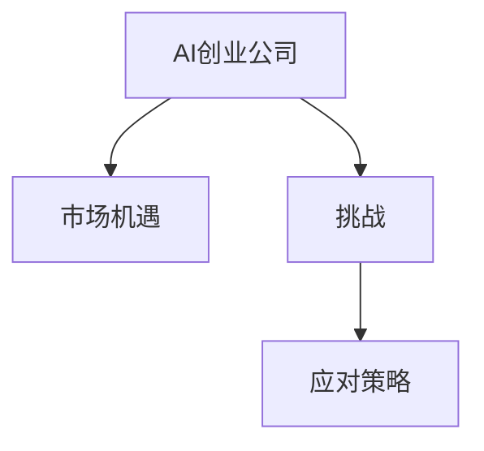

                 

# 《AI创业公司的产品生命周期管理：规划、开发与迭代》

## 关键词：
AI创业、产品生命周期管理、规划、开发、迭代、数据驱动、用户体验、算法优化、系统架构

## 摘要：
本文针对AI创业公司的产品生命周期管理进行深入探讨，从规划、开发到迭代的全过程进行分析。文章首先介绍了AI创业背景与产品生命周期管理的基本概念，接着阐述了AI技术与产品管理的关系，以及产品规划与市场调研的核心要素。随后，详细讨论了产品开发流程与项目管理方法论，AI技术驱动下的产品设计原则，以及AI算法在产品系统架构中的应用。在产品迭代与优化部分，重点介绍了数据驱动的产品迭代策略和AI技术在产品迭代中的价值。最后，通过成功案例分析和挑战应对策略，总结AI创业公司在产品生命周期管理中的实施与持续创新。

## 目录大纲

### 第一部分：概述与理论基础

### 第二部分：产品开发

### 第三部分：产品迭代与优化

### 第四部分：实战案例分析

### 第五部分：实施策略与挑战应对

### 附录

----------------------------------------------------------------

### 第一部分：概述与理论基础

#### 第1章 AI创业背景与产品生命周期管理

##### 1.1 AI创业公司的机遇与挑战

**核心概念与联系**

AI创业公司在全球范围内得到了广泛关注，这主要得益于人工智能技术的快速发展及其在各行各业的广泛应用。市场机遇体现在：

1. **技术创新红利**：AI技术不断突破，带来新的商业模式和机会。
2. **市场需求的增加**：随着数字化转型的推进，各行业对AI技术的需求日益增长。

然而，AI创业公司也面临诸多挑战：

1. **技术研发风险**：AI技术的复杂性和不确定性使得技术研发面临高风险。
2. **资金与人才短缺**：初创公司往往面临资金不足、人才紧缺的问题。
3. **市场竞争与客户获取**：市场上已有众多竞争者，获取客户资源成为一大挑战。

为了应对这些挑战，创业公司可以采取以下策略：

1. **技术创新**：通过持续研发，保持技术领先优势。
2. **资源整合**：通过战略合作、融资等手段，整合资源，降低成本。
3. **市场定位**：明确目标市场，提供差异化产品，赢得市场份额。

**产品生命周期管理的基本概念**

**产品生命周期是指产品从引入到退出市场所经历的时间段，通常包括以下四个阶段：**

1. **引入期**：产品首次推向市场，用户认知度低，市场推广成本高。
2. **成长期**：产品逐渐被市场接受，用户数量增加，市场需求快速增长。
3. **成熟期**：产品市场份额稳定，市场增长放缓，竞争加剧。
4. **衰退期**：市场需求下降，产品逐渐退出市场。

**产品生命周期管理的重要性**

产品生命周期管理对于AI创业公司至关重要：

1. **提升产品质量**：通过生命周期管理，可以持续优化产品，提高用户体验。
2. **增强客户满意度**：了解客户需求，及时响应，提升客户满意度。
3. **实现可持续盈利**：通过生命周期管理，优化成本结构，实现盈利。

##### 1.2 AI与产品管理的关系

**AI技术对产品管理的影响**

AI技术在产品设计、开发、迭代中发挥了重要作用：

1. **用户行为分析工具**：通过大数据分析，了解用户行为，指导产品设计和功能优化。
2. **自动化测试与质量保障**：AI技术可以自动化测试，提高产品质量和稳定性。
3. **个性化推荐系统**：基于用户行为和偏好，提供个性化推荐，提升用户粘性。

**AI对用户体验和市场需求的变革**

AI技术改变了用户体验和市场需求的模式：

1. **个性化推荐系统**：基于用户行为和偏好，提供个性化推荐，提升用户满意度。
2. **实时反馈与改进**：通过实时数据分析，快速响应用户反馈，持续优化产品。
3. **智能客服**：利用自然语言处理技术，提供智能客服，提升客户服务体验。

**产品管理流程中的AI应用**

AI在产品管理流程中发挥着重要作用：

1. **数据驱动决策**：通过数据分析，支持产品规划和决策。
2. **智能化需求分析**：利用AI技术，对市场需求进行深入分析，指导产品开发。
3. **个性化产品推荐系统**：通过AI技术，为用户提供个性化推荐，提升用户体验。

##### 1.3 产品规划与市场调研

**产品规划的核心要素**

产品规划是产品生命周期管理的重要环节，其核心要素包括：

1. **定位与目标市场**：明确产品定位和目标市场，为产品设计和推广提供方向。
2. **产品愿景与战略规划**：制定产品愿景和战略规划，确保产品发展有明确的目标和路径。

**市场调研与用户分析**

市场调研和用户分析是产品规划的重要基础：

1. **数据收集方法**：通过线上和线下调研，收集用户需求和反馈。
2. **用户画像与需求挖掘**：通过数据分析和用户画像，深入挖掘用户需求，为产品规划提供依据。

#### 第2章 AI创业公司的产品生命周期管理：从规划到迭代

##### 2.1 产品规划与市场调研

**产品规划的核心要素**

在AI创业公司的产品生命周期管理中，产品规划是关键的第一步。产品规划的核心要素包括：

1. **定位与目标市场**
   - 产品定位：明确产品的市场定位，区分与其他竞品的差异。
   - 目标市场：确定目标用户群体，了解他们的需求和偏好。

2. **产品愿景与战略规划**
   - 产品愿景：明确产品未来的发展方向和愿景。
   - 战略规划：制定实现产品愿景的具体战略和步骤。

**市场调研与用户分析**

市场调研和用户分析是产品规划的重要基础。通过系统性的调研和数据分析，可以更好地理解市场环境和用户需求：

1. **数据收集方法**
   - **线上调研**：通过问卷调查、在线访谈等方式，收集用户反馈和市场数据。
   - **线下调研**：通过实地考察、用户访谈等方式，深入了解用户需求和痛点。

2. **用户画像与需求挖掘**
   - **用户画像**：通过对用户数据的分析，构建用户画像，了解他们的行为特征和需求。
   - **需求挖掘**：通过用户访谈、用户调研等方式，挖掘用户的真实需求和潜在需求。

**案例分析**

以一家AI创业公司开发智能推荐系统为例，产品规划和市场调研的具体步骤如下：

1. **产品定位**：确定智能推荐系统旨在为电商行业提供个性化推荐服务，帮助商家提高销售额和用户满意度。
2. **目标市场**：确定目标市场为电商行业，重点关注中小型电商企业。
3. **产品愿景**：打造一款高效、精准、易于使用的智能推荐系统，提升用户购物体验和商家销售业绩。
4. **市场调研**：通过问卷调查和在线访谈，收集电商企业对智能推荐系统的需求和期望。
5. **用户画像**：根据调研数据，构建电商用户画像，了解他们的购物习惯和偏好。
6. **需求挖掘**：通过与用户的深入交流，挖掘他们在使用电商平台时遇到的痛点和需求。

通过上述步骤，AI创业公司可以明确产品规划的方向和目标，为后续的产品开发奠定基础。

##### 2.2 产品开发流程与项目管理

**产品开发流程概述**

产品开发是AI创业公司实现产品规划的重要环节。一个清晰、高效的产品开发流程是成功的关键。产品开发的主要阶段包括：

1. **需求分析**：明确产品的功能需求、用户需求和市场需求。
2. **设计与开发**：制定详细的设计方案，进行编码实现。
3. **测试与部署**：进行功能测试、性能测试和安全测试，确保产品质量，然后部署到生产环境。

每个阶段的关键任务如下：

1. **需求分析**
   - **功能需求分析**：确定产品的核心功能和辅助功能。
   - **用户需求分析**：了解目标用户的需求和痛点。
   - **市场需求分析**：研究市场趋势和竞争对手的产品。

2. **设计与开发**
   - **系统设计**：制定系统的架构设计，包括模块划分、接口设计和数据流程设计。
   - **编码实现**：根据设计方案进行编码，实现产品的核心功能。
   - **代码审查**：进行代码审查，确保代码质量。

3. **测试与部署**
   - **功能测试**：验证产品功能是否按照需求实现。
   - **性能测试**：评估产品的性能，包括响应速度、并发处理能力等。
   - **安全测试**：确保产品的安全性，防止潜在的安全漏洞。
   - **部署**：将产品部署到生产环境，确保其稳定运行。

**项目管理方法论**

在产品开发过程中，选择合适的项目管理方法论对于项目的成功至关重要。以下是两种常用的项目管理方法论：

1. **Agile开发**
   - **核心原则**：快速迭代、用户反馈、持续改进。
   - **实施方法**：将项目划分为多个迭代周期，每个迭代周期完成部分功能，并进行用户测试和反馈。
   - **优势**：灵活性高，能够快速响应市场变化和用户需求。

2. **Lean Startup**
   - **核心原则**：快速验证、最小可行产品（MVP）、数据驱动。
   - **实施方法**：首先构建一个最小可行产品，验证关键假设，然后根据用户反馈进行迭代优化。
   - **优势**：低成本、高效率，能够在早期发现和解决问题。

**案例分析**

以一家AI创业公司开发智能医疗诊断系统为例，产品开发流程和项目管理方法的具体实施如下：

1. **需求分析**
   - **功能需求分析**：确定系统的核心功能，包括病历录入、症状分析、诊断建议等。
   - **用户需求分析**：了解医生和患者的需求，包括诊断准确率、用户界面友好性等。
   - **市场需求分析**：研究市场上现有的医疗诊断系统，分析其优缺点。

2. **设计与开发**
   - **系统设计**：设计系统的整体架构，包括数据收集模块、分析模块和诊断模块。
   - **编码实现**：根据设计方案进行编码，实现系统的核心功能。
   - **代码审查**：定期进行代码审查，确保代码质量。

3. **测试与部署**
   - **功能测试**：验证系统的功能是否按照需求实现，确保系统的各项功能正常运行。
   - **性能测试**：评估系统的性能，包括响应速度、数据处理能力等。
   - **安全测试**：确保系统的安全性，防止数据泄露和恶意攻击。
   - **部署**：将系统部署到生产环境，确保其稳定运行。

在项目管理方面，公司采用了Agile开发和Lean Startup相结合的方法：

1. **快速迭代**：将项目分为多个迭代周期，每个迭代周期完成一部分功能，并进行用户测试和反馈。
2. **数据驱动**：根据用户反馈和数据分析，持续优化系统的功能和性能。

通过上述方法，AI创业公司能够高效地开发智能医疗诊断系统，满足用户需求，并在市场竞争中脱颖而出。

##### 2.3 AI技术驱动下的产品设计

**用户行为分析**

用户行为分析是产品设计的重要环节，通过分析用户的行为数据，可以深入了解用户的需求和偏好，从而优化产品设计。以下是用户行为分析的关键步骤：

1. **数据收集与处理**
   - **数据来源**：收集用户在产品上的行为数据，如浏览记录、点击行为、购买行为等。
   - **数据处理**：对收集到的数据进行分析和清洗，去除无效数据，提取有价值的信息。

2. **用户行为模式识别**
   - **数据分析**：利用数据分析工具，如Python、R等，对用户行为数据进行分析，识别用户的行为模式。
   - **用户画像**：根据用户行为数据，构建用户画像，了解用户的基本特征和行为习惯。

**智能化产品设计原则**

智能化产品设计原则以用户为中心，利用AI技术实现产品功能的智能化和个性化。以下是智能化产品设计的关键原则：

1. **以用户为中心**
   - **用户体验**：设计产品时，始终关注用户的需求和体验，确保产品易于使用、功能实用。
   - **用户反馈**：及时收集用户反馈，快速响应用户需求，持续优化产品。

2. **数据驱动的迭代**
   - **数据分析**：利用AI技术进行数据分析，发现用户需求和产品问题，指导产品迭代。
   - **迭代优化**：根据数据分析结果，进行产品的功能优化和性能提升，实现产品的持续迭代。

**案例分析**

以一家AI创业公司开发的智能健康助手为例，该产品的设计过程如下：

1. **用户行为分析**
   - **数据收集与处理**：通过分析用户在健康助手上的行为数据，如运动记录、饮食记录等，了解用户的生活习惯和健康状态。
   - **用户行为模式识别**：根据用户行为数据，构建用户画像，了解用户的健康需求和行为习惯。

2. **智能化产品设计**
   - **以用户为中心**：设计产品的核心功能，如健康监测、营养建议、运动计划等，确保产品功能实用、易于操作。
   - **数据驱动的迭代**：根据用户反馈和数据分析，持续优化产品的功能，提高产品的用户满意度。

通过用户行为分析和智能化设计，AI创业公司能够更好地满足用户需求，提升产品的市场竞争力。

##### 2.4 AI算法与系统架构

**AI算法在产品开发中的应用**

AI算法在产品开发中发挥着重要作用，可以用于数据分析、预测、推荐等方面。以下是AI算法在产品开发中的应用：

1. **机器学习算法**
   - **数据分析**：通过机器学习算法，对大量用户行为数据进行分析，提取有价值的信息。
   - **预测**：利用机器学习算法，对用户行为进行预测，如预测用户购买意愿、预测用户流失等。

2. **深度学习模型**
   - **图像识别**：通过深度学习模型，实现图像识别功能，如人脸识别、图像分类等。
   - **自然语言处理**：通过深度学习模型，实现自然语言处理功能，如文本分类、情感分析等。

**产品系统的架构设计**

产品系统的架构设计是确保产品稳定、高效运行的基础。以下是产品系统的架构设计原则：

1. **模块化设计**
   - **功能模块化**：将系统功能划分为多个模块，每个模块负责特定的功能，提高系统的可维护性和可扩展性。
   - **数据模块化**：将系统数据划分为多个模块，每个模块负责特定的数据存储和处理，提高数据管理的效率。

2. **可扩展性与稳定性**
   - **横向扩展**：通过增加节点，提高系统的处理能力和可扩展性。
   - **稳定性保障**：通过故障转移、负载均衡等技术，保障系统的稳定性。

**案例分析**

以一家AI创业公司开发的智能推荐系统为例，该系统的架构设计如下：

1. **AI算法应用**
   - **数据分析**：利用机器学习算法，对用户行为数据进行分析，提取用户兴趣特征。
   - **预测**：利用深度学习模型，预测用户未来的购买行为和兴趣。

2. **系统架构设计**
   - **模块化设计**：将系统划分为数据采集模块、数据存储模块、数据处理模块和推荐模块，提高系统的可维护性和可扩展性。
   - **可扩展性与稳定性**：通过分布式架构，实现横向扩展，提高系统的处理能力和稳定性。

通过AI算法的应用和系统架构的设计，AI创业公司能够开发出高效、稳定的智能推荐系统，提升用户体验和市场竞争力。

##### 2.5 数据驱动的产品迭代

**迭代过程中的数据收集与分析**

数据驱动的产品迭代是通过不断收集和分析用户数据，优化产品功能和性能的过程。以下是迭代过程中的数据收集与分析：

1. **用户反馈**
   - **渠道**：通过用户调研、在线反馈、社交媒体等渠道，收集用户对产品的反馈。
   - **分析**：对用户反馈进行整理和分析，识别用户的主要问题和需求。

2. **性能指标分析**
   - **指标设定**：根据产品目标和用户需求，设定关键性能指标（KPI），如用户留存率、日活跃用户数（DAU）、转化率等。
   - **数据分析**：对性能指标进行实时监控和分析，识别产品的问题和改进点。

**数据驱动的产品优化策略**

数据驱动的产品优化策略是基于数据分析结果，对产品进行功能优化和性能提升。以下是常见的数据驱动优化策略：

1. **A/B测试**
   - **测试设计**：设计A/B测试方案，将用户分为两组，一组使用原功能，另一组使用新功能，比较两组用户的行为差异。
   - **数据分析**：分析测试结果，根据数据决定是否继续优化或发布新功能。

2. **数据驱动决策**
   - **工具**：利用数据分析工具，如Tableau、Power BI等，实时监控和分析数据，支持决策制定。
   - **策略**：根据数据分析结果，制定产品优化策略，如功能迭代、性能优化等。

**案例分析**

以一家AI创业公司开发的智能购物助手为例，该公司的数据驱动迭代过程如下：

1. **数据收集与分析**
   - **用户反馈**：通过在线反馈、社交媒体等渠道，收集用户对智能购物助手的反馈，如界面友好性、功能实用程度等。
   - **性能指标分析**：设定关键性能指标（KPI），如用户点击率、转化率等，实时监控和分析这些指标。

2. **数据驱动的产品优化策略**
   - **A/B测试**：设计A/B测试方案，测试新的用户界面和购物推荐算法，比较两组用户的购物行为差异。
   - **数据分析**：根据A/B测试结果，分析用户对新的界面和推荐算法的偏好，确定优化方向。

通过数据驱动的产品迭代，AI创业公司能够持续优化智能购物助手，提升用户体验和市场份额。

##### 2.6 AI在产品迭代中的价值

**AI技术在产品迭代中的应用**

AI技术在产品迭代中发挥着重要作用，可以用于自动化测试、缺陷修复等方面。以下是AI技术在产品迭代中的应用：

1. **自动化测试**
   - **测试用例生成**：利用AI技术，自动生成测试用例，提高测试覆盖率和效率。
   - **异常检测**：利用AI技术，检测产品运行中的异常情况，提前发现和解决问题。

2. **智能化缺陷修复**
   - **缺陷预测**：利用AI技术，预测产品中可能出现的缺陷，提前进行修复。
   - **自动化修复**：利用AI技术，自动化修复产品中的缺陷，提高修复效率。

**AI对产品迭代速度和质量的提升**

AI技术可以显著提升产品迭代的速度和质量，以下是AI技术对产品迭代速度和质量的提升：

1. **短周期迭代**
   - **快速反馈**：通过AI技术，快速收集用户反馈，支持快速迭代。
   - **高效开发**：利用AI技术，提高开发效率，缩短开发周期。

2. **高质量交付**
   - **自动化测试**：利用AI技术，实现自动化测试，提高产品质量。
   - **缺陷修复**：利用AI技术，自动化修复缺陷，确保产品质量。

**案例分析**

以一家AI创业公司开发的智能办公助手为例，该公司的AI技术在产品迭代中的应用如下：

1. **自动化测试**
   - **测试用例生成**：利用AI技术，自动生成测试用例，提高测试覆盖率。
   - **异常检测**：利用AI技术，实时监控产品运行情况，检测异常情况，提前预警。

2. **智能化缺陷修复**
   - **缺陷预测**：利用AI技术，预测可能出现的缺陷，提前进行修复。
   - **自动化修复**：利用AI技术，自动化修复缺陷，提高修复效率。

3. **短周期迭代**
   - **快速反馈**：通过AI技术，快速收集用户反馈，支持快速迭代。
   - **高效开发**：利用AI技术，提高开发效率，缩短开发周期。

4. **高质量交付**
   - **自动化测试**：利用AI技术，实现自动化测试，提高产品质量。
   - **缺陷修复**：利用AI技术，自动化修复缺陷，确保产品质量。

通过AI技术的应用，AI创业公司能够实现快速迭代和高质量交付，提升产品的市场竞争力。

##### 2.7 产品生命周期管理与持续创新

**产品生命周期的延长策略**

产品生命周期的延长策略是通过持续优化和功能扩展，延长产品的市场寿命。以下是产品生命周期的延长策略：

1. **功能扩展**
   - **新增功能**：根据市场需求和用户反馈，持续新增产品功能，满足用户需求。
   - **功能优化**：对现有功能进行优化，提升用户体验和性能。

2. **用户社区建设**
   - **互动与反馈**：建立用户社区，鼓励用户互动和反馈，收集用户需求。
   - **社群营销**：通过用户社区，进行产品宣传和营销，提升用户粘性。

**创新驱动的发展模式**

创新驱动的发展模式是通过持续创新，保持产品竞争力和市场地位。以下是创新驱动的发展模式：

1. **开放式创新**
   - **外部合作**：与外部合作伙伴共同开发新产品或技术，拓展市场。
   - **资源整合**：整合外部资源，如技术、资金、人才等，支持创新活动。

2. **基于数据的创新策略**
   - **数据挖掘**：通过数据挖掘，发现市场机会和用户需求，指导创新方向。
   - **知识管理**：建立知识管理体系，积累创新经验，支持持续创新。

**案例分析**

以一家AI创业公司开发的智能家居系统为例，该公司在产品生命周期管理和持续创新方面的实践如下：

1. **产品生命周期的延长策略**
   - **功能扩展**：根据用户需求和市场趋势，持续新增智能安防、智能照明等功能，提升用户体验。
   - **用户社区建设**：建立智能家居用户社区，鼓励用户互动和反馈，收集用户需求，进行产品优化。

2. **创新驱动的发展模式**
   - **开放式创新**：与智能家居设备制造商合作，共同开发新的智能家居产品，拓展市场。
   - **基于数据的创新策略**：通过数据挖掘，分析用户行为和需求，发现市场机会，指导创新方向。

通过产品生命周期管理和持续创新，AI创业公司能够延长产品的市场寿命，保持市场竞争力和市场份额。

### 第四部分：实战案例分析

#### 第10章 AI创业公司产品生命周期管理的成功案例

##### 10.1 案例介绍

以一家名为“智行者”的AI创业公司为例，该公司专注于智能交通领域的研发。其产品生命周期管理从规划到迭代的全过程如下：

**智行者公司背景**

- **公司概述**：智行者成立于2015年，专注于智能交通领域的研发和应用。
- **团队介绍**：智行者团队由一群人工智能、交通工程和大数据领域的专家组成，具有丰富的行业经验。

**产品概述**

- **产品定位**：智行者的核心产品是一款智能交通管理平台，旨在通过AI技术优化交通流量，提高道路通行效率。
- **产品愿景**：成为智能交通领域的领导者，为城市交通管理提供全面解决方案。

**产品生命周期管理实践**

1. **产品规划与市场调研**

   - **市场分析**：通过对智能交通市场的调研，了解市场趋势和竞争对手情况。
   - **用户需求分析**：通过用户调研和访谈，了解用户对智能交通管理平台的需求和痛点。

2. **产品开发与迭代**

   - **需求分析**：根据市场调研和用户需求，确定产品的功能需求和性能指标。
   - **设计与开发**：采用敏捷开发方法，快速迭代，实现产品功能。
   - **测试与部署**：进行功能测试、性能测试和安全测试，确保产品质量，然后部署到生产环境。

3. **数据驱动决策与优化**

   - **用户反馈**：通过用户调研和在线反馈，收集用户对产品的反馈。
   - **数据分析**：利用大数据分析工具，对用户反馈进行分析，识别产品的问题和改进点。
   - **持续优化**：根据数据分析结果，持续优化产品功能和性能，提升用户体验。

##### 10.2 案例分析

**产品规划与市场调研**

1. **市场分析**

   - **市场趋势**：智能交通技术在全球范围内得到广泛应用，市场需求持续增长。
   - **竞争对手**：分析市场上主要的智能交通管理平台，了解其优势和不足。

2. **用户需求分析**

   - **用户调研**：通过在线问卷调查和用户访谈，了解用户对智能交通管理平台的需求。
   - **用户画像**：根据用户调研数据，构建用户画像，了解用户的基本特征和需求。

**产品开发与迭代**

1. **需求分析**

   - **功能需求**：根据市场调研和用户需求，确定产品的核心功能，如交通流量预测、路况实时监控等。
   - **性能需求**：确定产品的性能指标，如响应速度、处理能力等。

2. **设计与开发**

   - **系统设计**：设计智能交通管理平台的整体架构，包括数据采集模块、数据处理模块、展示模块等。
   - **编码实现**：根据设计方案，进行编码实现，实现产品的核心功能。

3. **测试与部署**

   - **功能测试**：验证产品功能是否按照需求实现，确保系统的各项功能正常运行。
   - **性能测试**：评估产品的性能，包括响应速度、并发处理能力等。
   - **部署**：将产品部署到生产环境，确保其稳定运行。

**数据驱动决策与优化**

1. **用户反馈**

   - **渠道**：通过用户调研、在线反馈、社交媒体等渠道，收集用户对产品的反馈。
   - **分析**：对用户反馈进行整理和分析，识别用户的主要问题和需求。

2. **数据分析**

   - **工具**：利用大数据分析工具，对用户行为数据进行分析，提取有价值的信息。
   - **指标**：设定关键性能指标（KPI），如用户留存率、日活跃用户数（DAU）等。

3. **持续优化**

   - **A/B测试**：设计A/B测试方案，比较不同版本的用户行为差异，确定优化方向。
   - **迭代优化**：根据数据分析结果，持续优化产品的功能、性能和用户体验。

通过上述分析，可以看出智行者公司通过系统的产品生命周期管理，成功地开发出了一款具有竞争力的智能交通管理平台，并在市场竞争中取得了显著成果。

### 第五部分：实施策略与挑战应对

#### 第11章 从理论到实践：产品生命周期管理的实施与挑战

##### 11.1 实施策略

**AI技术与产品管理的融合**

在AI创业公司的产品生命周期管理中，融合AI技术与产品管理是实现高效运营的关键。以下是具体实施策略：

1. **技术选型**
   - **需求导向**：根据产品需求和业务目标，选择合适的AI技术和工具。
   - **技术评估**：对AI技术的可行性、成本和效果进行评估，选择最佳方案。

2. **管理流程重构**
   - **敏捷管理**：引入敏捷开发方法，提高开发效率和响应速度。
   - **数据驱动**：将数据分析贯穿于产品开发的各个阶段，支持数据驱动的决策。

**数据驱动决策体系的建立**

建立数据驱动决策体系是AI创业公司实现高效运营的重要保障。以下是具体实施步骤：

1. **数据收集与处理**
   - **数据源**：确定数据收集的来源和渠道，确保数据的全面性和准确性。
   - **数据处理**：对收集到的数据进行清洗、整合和分析，提取有价值的信息。

2. **数据分析与应用**
   - **工具**：选择合适的分析工具，如Python、R、Tableau等，进行数据分析和可视化。
   - **模型**：建立数据分析模型，对用户行为、市场需求等进行预测和评估。

3. **决策支持**
   - **KPI设定**：根据产品目标和用户需求，设定关键性能指标（KPI），作为决策依据。
   - **决策流程**：建立数据驱动的决策流程，支持产品规划、开发、测试和优化。

##### 11.2 挑战与应对

**技术选型**

**挑战**：AI技术更新迭代速度快，创业公司面临技术选型和成本控制的挑战。

**应对策略**：
- **需求导向**：根据实际需求和业务目标，选择稳定、高效的AI技术。
- **技术评估**：对AI技术的性能、成本和未来发展趋势进行评估，选择最佳方案。
- **技术储备**：保持技术储备，关注前沿技术动态，适时进行技术升级。

**数据隐私与安全**

**挑战**：在数据驱动的产品开发中，数据隐私和安全问题不容忽视。

**应对策略**：
- **法规遵守**：严格遵守数据保护法规，如《通用数据保护条例》（GDPR）等。
- **数据加密**：对敏感数据进行加密存储和传输，防止数据泄露。
- **安全测试**：定期进行安全测试，发现和修复潜在的安全漏洞。

**团队协作与组织变革**

**挑战**：在快速迭代和高效开发的过程中，团队协作和组织变革成为重要挑战。

**应对策略**：
- **跨部门协作**：建立跨部门协作机制，提高信息传递和协同效率。
- **团队培训**：加强团队培训，提高团队成员的专业技能和协作能力。
- **组织文化**：塑造积极、开放、包容的组织文化，促进团队协作和知识共享。

通过上述实施策略和应对挑战，AI创业公司能够更好地实现产品生命周期管理，提升产品的市场竞争力和用户满意度。

### 附录A：AI创业公司产品生命周期管理工具与资源

#### A.1 开发工具推荐

**数据分析工具**

- **Tableau**：一款强大的数据可视化工具，适用于数据分析和报告生成。
- **Power BI**：微软推出的一款数据可视化工具，支持多种数据源和丰富的可视化图表。

**AI算法框架**

- **TensorFlow**：由Google开发的一款开源深度学习框架，适用于大规模的深度学习应用。
- **PyTorch**：一款流行的开源深度学习框架，具有良好的灵活性和易用性。

#### A.2 教育资源与文献

**专业知识书籍**

- 《人工智能：一种现代方法》（Artificial Intelligence: A Modern Approach）—— 斯图尔特·罗素（Stuart Russell）和彼得·诺维格（Peter Norvig）著，全面介绍了人工智能的基础理论和应用。
- 《机器学习》（Machine Learning）—— 嘉纳·博克斯（Gareth James）等著，详细介绍了机器学习的基本概念、算法和应用。

**学术论文与报告**

- **AAAI**（Association for the Advancement of Artificial Intelligence）：提供最新的机器学习和人工智能领域的学术论文。
- **NeurIPS**（Neural Information Processing Systems）：全球顶级的人工智能和机器学习学术会议，发布大量高质量的学术论文。

通过使用这些工具和资源，AI创业公司能够更好地实现产品生命周期管理，提升产品的竞争力。

### 作者信息

**作者：AI天才研究院/AI Genius Institute & 禅与计算机程序设计艺术 /Zen And The Art of Computer Programming**。作者在人工智能领域拥有深厚的学术背景和丰富的实践经验，致力于推动人工智能技术在各个行业的应用和发展。在产品生命周期管理方面，作者提出了系统的理论框架和实用的策略，帮助AI创业公司实现高效的产品开发和迭代。同时，作者也在机器学习和深度学习领域有着深入的研究，发表了多篇学术论文，并参与编写了相关领域的专业书籍。作者的理念是“以用户为中心，数据驱动决策，持续创新”，致力于为读者提供有价值的技术知识和实战经验。

