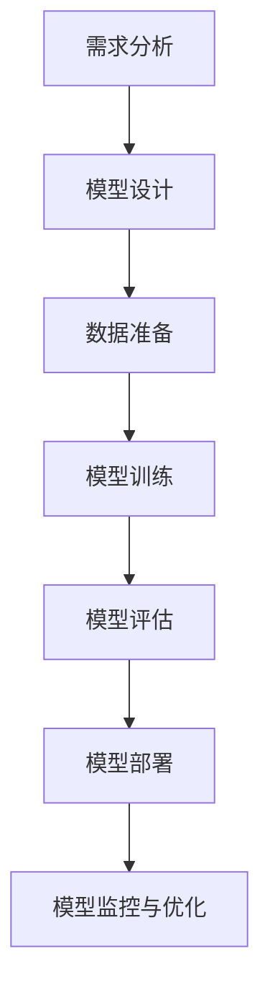
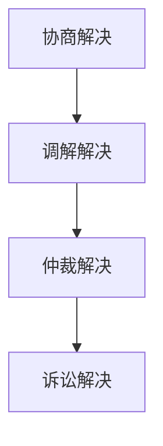

                 

# AI创业公司的技术外包策略

## 关键词

- AI外包
- 创业公司
- 技术战略
- 风险管理
- 成功案例

## 摘要

本文探讨了AI创业公司在快速发展的过程中，如何通过技术外包策略来提升核心竞争力。文章首先介绍了AI外包的背景与意义，然后详细阐述了外包策略的设计与规划、核心技术外包、风险管理以及成功案例。通过本文，读者可以了解到AI外包的策略框架，以及如何在实践中应对各种挑战，实现企业的长远发展。

## 目录大纲

### 第一部分：引言与概述

- **第1章：AI外包背景与意义**
  - **1.1 AI外包的概念与重要性**
  - **1.2 创业公司AI外包的原因**
  - **1.3 AI外包的挑战与机遇**

### 第二部分：外包策略设计与规划

- **第2章：外包策略的制定**
  - **2.1 外包策略的要素分析**
  - **2.2 外包目标与范围定义**
  - **2.3 外包合作伙伴的选择**

- **第3章：外包流程管理**
  - **3.1 外包流程的概述**
  - **3.2 外包合同与协议**
  - **3.3 外包项目的监控与评估**

### 第三部分：核心技术外包

- **第4章：AI技术外包的选择**
  - **4.1 AI技术的分类与外包需求分析**
  - **4.2 主流AI外包技术平台介绍**
  - **4.3 技术外包的优缺点评估**

- **第5章：AI模型外包的实现**
  - **5.1 AI模型外包的开发流程**
  - **5.2 AI模型外包的代码实现与部署**
  - **5.3 AI模型外包的性能优化**

### 第四部分：风险管理

- **第6章：外包风险识别与评估**
  - **6.1 外包风险的分类**
  - **6.2 外包风险的评价方法**
  - **6.3 风险缓解策略**

- **第7章：合同管理与纠纷解决**
  - **7.1 外包合同的要点**
  - **7.2 合同纠纷的处理流程**
  - **7.3 知识产权保护与合规**

### 第五部分：成功案例与实践

- **第8章：AI外包成功案例分析**
  - **8.1 成功案例介绍**
  - **8.2 案例分析：优势与挑战**
  - **8.3 案例启示与应用**

- **第9章：创业公司的AI外包实践**
  - **9.1 实践经验分享**
  - **9.2 实践中遇到的问题与解决方法**
  - **9.3 未来发展趋势与展望**

### 附录

- **附录A：AI外包资源与工具**
  - **A.1 常用AI外包平台介绍**
  - **A.2 开发工具与SDK**
  - **A.3 学术与研究资源**

## 第一部分：引言与概述

### 第1章：AI外包背景与意义

#### 1.1 AI外包的概念与重要性

随着人工智能技术的飞速发展，越来越多的创业公司开始意识到AI技术在其业务中的应用价值。然而，受限于资源、技术实力和人才等因素，许多创业公司难以在短时间内建立完整的AI技术团队。在这种情况下，AI外包成为一种有效的解决方案。

AI外包，即创业公司将AI技术相关的工作外包给专业的服务提供商。这些服务可以包括AI模型的开发、训练、优化，以及AI系统的部署和维护等。AI外包不仅能够帮助创业公司快速获取先进的技术，还能节省成本，提高效率。

#### 1.2 创业公司AI外包的原因

**1. 资源有限**

创业公司通常在资金、技术资源和人力资源方面有限，难以支持大规模的AI技术研发。通过外包，创业公司可以利用外部资源，实现技术突破。

**2. 时间紧迫**

快速发展的市场环境要求创业公司能够迅速推出具有竞争力的产品。AI外包能够加速研发进程，缩短产品上市时间。

**3. 技术优势**

专业的外包服务提供商通常拥有先进的技术能力和丰富的行业经验，能够为创业公司提供高质量的技术支持。

**4. 风险分散**

将AI技术外包可以减少创业公司在技术研发过程中的风险，如技术失败、人才流失等。

#### 1.3 AI外包的挑战与机遇

**1. 挑战**

**1.1 质量控制**

外包服务的质量直接影响创业公司的产品和服务质量。如何确保外包服务的质量成为一大挑战。

**1.2 安全性问题**

AI技术的敏感性使得数据安全成为外包过程中的一大隐患。如何保障数据安全是创业公司需要重视的问题。

**1.3 合作关系管理**

与外包服务提供商建立并维持良好的合作关系是确保项目顺利进行的关键。

**2. 机遇**

**2.1 技术创新**

通过与外包服务提供商的合作，创业公司可以接触到最新的AI技术和研究成果，促进技术创新。

**2.2 成本优化**

合理的外包策略可以帮助创业公司降低研发成本，提高资源利用效率。

**2.3 知识转移**

外包过程不仅是技术转移的过程，也是知识转移的过程。创业公司可以从外包服务提供商那里获取宝贵的行业知识和经验。

### 小结

AI外包为创业公司提供了快速获取AI技术、降低研发成本和分散风险的有效途径。然而，外包过程中也面临着质量控制、安全性和合作关系管理等挑战。创业公司在制定外包策略时，需要综合考虑各种因素，确保外包过程能够带来实质性的效益。

### 第2章：外包策略的制定

#### 2.1 外包策略的要素分析

制定有效的AI外包策略，需要从多个维度进行分析和规划。以下是几个关键要素：

**1. 外包目标**

明确外包的目标是制定策略的首要任务。创业公司需要根据自身业务需求，确定需要外包的具体任务，如AI模型开发、数据处理、系统集成等。

**2. 外包范围**

外包范围决定了哪些工作需要外包，哪些工作需要内部完成。合理的范围可以最大化外包的优势，同时避免过度依赖外包服务。

**3. 外包合作伙伴选择**

选择合适的外包合作伙伴是策略制定的关键。合作伙伴的选择标准包括技术能力、服务质量、合作历史、价格等。

**4. 风险管理**

外包过程中不可避免地会面临各种风险，如技术风险、合同风险、数据安全风险等。有效的风险管理策略能够帮助创业公司降低风险。

**5. 费用预算**

外包费用是创业公司需要考虑的重要预算之一。合理的预算可以确保项目的顺利进行，同时避免过度投入。

**6. 项目管理**

项目管理的有效性直接影响到外包项目的成败。良好的项目管理包括项目规划、进度控制、质量保证等。

#### 2.2 外包目标与范围定义

**1. 目标定义**

创业公司在制定外包策略时，需要明确以下目标：

- 提高AI技术研发效率
- 降低研发成本
- 获取先进的技术和知识
- 分散研发风险

**2. 范围定义**

外包范围可以根据以下原则进行定义：

- 根据业务需求确定外包的具体任务
- 考虑公司内部资源和技术能力
- 确保外包任务与内部工作紧密衔接
- 避免过度外包，保留核心业务控制权

**3. 实例分析**

以一家专注于智能医疗的创业公司为例，其AI外包策略的目标可能是：

- 开发一款基于深度学习的医疗影像诊断系统
- 对现有系统进行性能优化和功能扩展
- 获取行业领先的医疗数据处理技术

外包范围可以包括：

- AI模型开发和训练
- 医疗数据处理和清洗
- 系统集成和测试
- 性能优化和部署

#### 2.3 外包合作伙伴的选择

选择合适的外包合作伙伴对于确保项目成功至关重要。以下是选择外包合作伙伴时需要考虑的因素：

**1. 技术能力**

外包合作伙伴的技术能力是选择的首要标准。创业公司需要评估合作伙伴在相关技术领域的专业水平和研发经验。

**2. 服务质量**

服务质量包括合作伙伴的响应速度、解决问题的能力、客户满意度等。创业公司可以通过查阅案例、用户评价等方式了解合作伙伴的服务质量。

**3. 合作历史**

合作伙伴的历史业绩和成功案例能够反映其业务能力和稳定性。创业公司应优先选择具有丰富合作历史的合作伙伴。

**4. 价格**

价格是外包决策的重要考虑因素。创业公司需要权衡价格与质量，确保在预算范围内选择性价比高的合作伙伴。

**5. 文化与沟通**

良好的合作关系建立在双方信任和有效沟通的基础上。创业公司应选择与自身企业文化相符、沟通畅通的合作伙伴。

**6. 合同条款**

合同条款包括服务范围、交付时间、付款方式、违约责任等。创业公司需要仔细审查合同条款，确保自身权益得到保障。

**7. 附加服务**

一些合作伙伴可能提供额外的服务，如技术培训、技术咨询等。这些附加服务可以提升外包项目的整体价值。

#### 2.4 风险管理策略

外包过程中不可避免地会面临各种风险。有效的风险管理策略可以帮助创业公司降低风险，确保项目顺利进行。以下是几个风险管理策略：

**1. 风险识别**

创业公司需要识别和分析可能的外包风险，包括技术风险、合同风险、数据安全风险、项目管理风险等。

**2. 风险评估**

对识别出的风险进行评估，确定风险的概率和影响程度。风险评估可以帮助创业公司确定哪些风险需要重点关注。

**3. 风险缓解**

针对评估出的高风险，制定具体的缓解措施。例如，通过增加预算、延长交付时间、加强合同条款等手段降低风险。

**4. 风险监控**

在项目执行过程中，持续监控风险变化，确保风险缓解措施的有效性。必要时进行调整和优化。

**5. 应急计划**

制定应急计划，以应对可能发生的风险事件。应急计划应包括风险事件的处理流程、责任分配、资源调配等。

#### 2.5 费用预算

制定合理的费用预算是确保外包项目顺利进行的关键。创业公司需要根据项目目标、外包范围、合作伙伴报价等因素制定预算。以下是制定费用预算时需要考虑的几个方面：

**1. 项目成本**

项目成本包括外包服务费用、项目管理费用、技术支持费用等。创业公司需要详细估算各项费用，确保预算的准确性。

**2. 预留资金**

预留一定比例的资金用于应对意外情况，如技术问题、延期交付等。预留资金可以提高项目的灵活性和抗风险能力。

**3. 成本控制**

在项目执行过程中，创业公司需要严格控制成本，确保预算不超支。通过定期审计、绩效评估等方式，监控项目成本。

**4. 成本效益分析**

在制定预算时，创业公司需要综合考虑成本与效益的关系。合理的成本效益分析可以帮助公司确定最佳的外包策略。

#### 2.6 项目管理

项目管理是确保外包项目顺利进行的关键。创业公司需要建立有效的项目管理机制，包括以下方面：

**1. 项目规划**

项目规划包括项目目标、范围、时间表、资源分配等。创业公司需要制定详细的项目计划，确保项目按计划执行。

**2. 进度控制**

创业公司需要定期跟踪项目进度，确保项目按时完成。通过项目管理工具，如项目管理软件、进度报告等，监控项目进度。

**3. 质量保证**

质量保证是确保项目成果满足需求的关键。创业公司需要建立质量管理体系，包括质量标准、质量检查、质量反馈等。

**4. 团队协作**

有效的团队协作可以提高项目执行效率。创业公司需要建立良好的沟通机制，确保团队成员之间的信息畅通。

**5. 风险管理**

在项目执行过程中，创业公司需要持续监控风险，确保风险得到及时处理。通过风险管理机制，降低项目风险。

#### 小结

制定有效的AI外包策略需要从多个维度进行分析和规划。明确外包目标、合理定义外包范围、选择合适的合作伙伴、制定风险管理策略和费用预算、进行项目管理等，是确保外包项目成功的关键。创业公司应根据自身情况，灵活运用这些策略，实现技术突破和业务增长。

### 第3章：外包流程管理

#### 3.1 外包流程的概述

AI外包流程是一个系统化的过程，涉及多个阶段和环节。以下是AI外包流程的概述：

**1. 需求分析**：创业公司明确AI外包的具体需求，包括任务目标、技术要求、交付时间等。

**2. 外包策略制定**：根据需求分析结果，制定AI外包策略，包括外包范围、合作伙伴选择、费用预算等。

**3. 合作伙伴筛选**：根据外包策略，筛选合适的外包合作伙伴，评估其技术能力、服务质量、合作历史等因素。

**4. 合同签订**：与选定的合作伙伴签订外包合同，明确服务范围、交付时间、付款方式、违约责任等条款。

**5. 项目启动**：启动外包项目，明确项目团队成员、职责分工、沟通机制等。

**6. 项目执行**：按照项目计划执行外包任务，包括需求分析、设计开发、测试验证、交付验收等。

**7. 项目监控与评估**：定期监控项目进展，评估项目质量、进度、成本等，确保项目按计划进行。

**8. 项目交付与验收**：完成外包任务，进行交付验收，确保项目成果符合需求。

**9. 项目收尾**：项目结束后，进行总结评估，总结经验教训，优化改进流程。

#### 3.2 外包合同与协议

外包合同是确保双方权益的重要法律文件。以下是AI外包合同的关键条款和要点：

**1. 服务范围**：明确外包服务的内容和范围，包括任务目标、技术要求、交付成果等。

**2. 交付时间**：规定外包服务的交付时间，包括里程碑节点和最终交付日期。

**3. 付款方式**：明确付款方式和付款时间，包括预付款、进度付款、验收付款等。

**4. 违约责任**：规定违约责任和违约处理方式，包括违约金、赔偿金额等。

**5. 隐私与数据安全**：确保双方数据的安全性和隐私保护，明确数据存储、传输、使用等方面的规定。

**6. 知识产权**：明确知识产权归属和使用权，包括技术成果、文档、数据等。

**7. 争议解决**：规定争议解决方式，包括协商、调解、仲裁、诉讼等。

**8. 合同变更**：规定合同变更的程序和条件，确保合同变更的合法性和合理性。

**9. 合同生效与终止**：明确合同生效时间和终止条件，包括合同续约、解除等。

#### 3.3 外包项目的监控与评估

外包项目的监控与评估是确保项目顺利进行和成果达标的重要环节。以下是几个关键点：

**1. 项目进度监控**：定期收集项目进展数据，分析项目进度，发现潜在问题，及时调整计划。

**2. 项目质量评估**：根据项目目标和质量标准，评估项目成果的质量，包括功能实现、性能指标、用户满意度等。

**3. 成本控制**：监控项目成本，确保预算不超支，通过成本效益分析，优化成本结构。

**4. 风险管理**：识别和评估项目风险，制定风险应对措施，降低项目风险。

**5. 项目报告**：定期编写项目报告，总结项目进展、成果、问题和改进措施，为项目决策提供依据。

**6. 客户反馈**：收集客户反馈，了解客户对项目成果的满意度，及时调整项目方向。

**7. 项目总结**：项目结束后，进行总结评估，总结经验教训，优化项目管理流程。

#### 3.4 外包项目的常见问题与解决方法

**1. 合作伙伴不履行合同**

**问题分析**：合作伙伴可能由于技术困难、资金问题、人员变动等原因，无法按合同要求履行义务。

**解决方法**：创业公司应在外包合同中明确违约责任和赔偿条款，确保合作伙伴履行合同。同时，建立良好的沟通机制，及时了解合作伙伴的困难和需求，提供必要的支持。

**2. 项目进度延误**

**问题分析**：项目进度延误可能由于需求变更、技术难题、资源不足等原因导致。

**解决方法**：创业公司应制定详细的项目计划，明确任务分工和时间表，确保项目按计划进行。在项目执行过程中，及时监控项目进度，发现问题及时调整计划。

**3. 项目成本超支**

**问题分析**：项目成本超支可能由于预算不合理、需求变更、技术问题等原因导致。

**解决方法**：创业公司应制定合理的费用预算，确保项目在预算范围内进行。在项目执行过程中，严格监控项目成本，发现问题及时调整预算。

**4. 项目质量不达标**

**问题分析**：项目质量不达标可能由于技术能力不足、项目管理不善、质量控制不严格等原因导致。

**解决方法**：创业公司应选择具备专业技术和丰富经验的外包合作伙伴，建立严格的项目质量管理机制，确保项目成果符合质量标准。

**5. 数据安全风险**

**问题分析**：数据安全风险可能由于数据泄露、数据滥用、系统漏洞等原因导致。

**解决方法**：创业公司应与外包合作伙伴签订保密协议，确保数据安全。同时，采用先进的数据加密和网络安全技术，加强数据安全管理。

#### 小结

AI外包流程管理是确保项目顺利进行和成果达标的关键环节。通过明确外包流程、签订合同、监控项目进度、评估项目质量等，创业公司可以确保外包项目成功。在项目执行过程中，及时识别和解决常见问题，有助于提高项目成功率，实现业务目标。

### 第4章：AI技术外包的选择

#### 4.1 AI技术的分类与外包需求分析

人工智能（AI）技术涵盖了广泛的应用领域，包括计算机视觉、自然语言处理（NLP）、机器学习（ML）、深度学习（DL）等。每种技术都有其特定的应用场景和需求。创业公司在选择AI技术外包时，需要根据自身的业务需求和技术能力进行分类和分析。

**1. 计算机视觉**

计算机视觉技术主要用于图像和视频的处理、识别和分类。其主要应用场景包括安防监控、自动驾驶、医疗影像诊断等。创业公司在选择计算机视觉外包时，应关注以下几点：

- **图像处理算法**：选择适用于特定场景的图像处理算法，如卷积神经网络（CNN）、生成对抗网络（GAN）等。
- **数据处理能力**：合作伙伴应具备强大的数据处理能力，以应对大规模图像数据的处理需求。
- **实时性要求**：根据应用场景的需求，评估合作伙伴的算法实现是否满足实时性要求。

**2. 自然语言处理**

自然语言处理技术主要应用于文本的理解、生成和交互。其应用场景包括智能客服、内容审核、智能翻译等。创业公司在选择NLP外包时，应关注以下几点：

- **语言理解能力**：合作伙伴应具备强大的语言理解能力，能够处理不同语言和方言的文本数据。
- **数据处理效率**：合作伙伴应具备高效的数据处理能力，以支持大规模文本数据的处理需求。
- **个性化需求**：根据业务需求，选择能够提供个性化解决方案的合作伙伴，如情感分析、对话生成等。

**3. 机器学习**

机器学习技术主要用于数据的建模和预测。其主要应用场景包括推荐系统、风控模型、预测分析等。创业公司在选择ML外包时，应关注以下几点：

- **算法多样性**：合作伙伴应提供多种机器学习算法，以满足不同业务场景的需求。
- **数据预处理能力**：合作伙伴应具备强大的数据预处理能力，以确保模型训练数据的质量。
- **模型可解释性**：对于需要可解释性的模型，合作伙伴应提供可解释性分析，以帮助创业公司理解和应用模型。

**4. 深度学习**

深度学习技术是机器学习的一个分支，主要用于处理大规模、复杂数据。其应用场景包括语音识别、图像识别、自动驾驶等。创业公司在选择DL外包时，应关注以下几点：

- **算法实现能力**：合作伙伴应具备深度学习算法的实战经验，能够实现高效、稳定的模型。
- **硬件支持**：合作伙伴应提供足够的硬件支持，如高性能GPU集群，以满足深度学习模型的训练需求。
- **技术更新能力**：深度学习技术更新迅速，合作伙伴应具备持续学习和技术更新能力，以跟上行业的发展。

**5. 外包需求分析**

创业公司在进行AI技术外包时，需要根据自身的业务需求、技术能力和资源状况进行需求分析。以下是几个关键步骤：

- **业务需求分析**：明确业务目标，分析AI技术如何助力业务发展，确定外包的技术方向和具体任务。
- **技术能力评估**：评估公司内部的技术能力，确定哪些任务可以外包，哪些任务需要内部完成。
- **成本效益分析**：评估外包的效益和成本，确保外包策略的经济可行性。
- **风险管理**：识别和评估外包过程中的风险，制定风险管理策略，确保项目顺利进行。

#### 4.2 主流AI外包技术平台介绍

在AI外包市场中，有许多主流的技术平台和服务提供商，这些平台和服务能够为创业公司提供全面的AI技术支持。以下是几个主流的AI外包技术平台介绍：

**1. Google Cloud AI**

Google Cloud AI 是谷歌公司提供的AI服务，包括机器学习、深度学习、自然语言处理等。其主要特点如下：

- **强大的算法库**：Google Cloud AI 提供了丰富的算法库，包括TensorFlow、Scikit-Learn等，适用于各种AI任务。
- **高效的计算能力**：Google Cloud AI 利用谷歌的全球计算资源，提供高性能的GPU集群和分布式计算能力。
- **便捷的使用界面**：Google Cloud AI 提供了易于使用的开发工具和API，使开发者能够快速实现AI应用。

**2. AWS AI**

AWS AI 是亚马逊公司提供的AI服务，包括机器学习、深度学习、语音识别等。其主要特点如下：

- **广泛的AI服务**：AWS AI 提供了丰富的AI服务，包括预训练模型、自定义模型训练、自然语言处理等，适用于多种应用场景。
- **强大的云计算能力**：AWS 拥有全球最大的云计算平台，为AI计算提供强大的支持。
- **灵活的定价策略**：AWS AI 提供了多种定价策略，包括按需付费、预留实例等，使创业公司能够根据需求灵活选择。

**3. Microsoft Azure AI**

Microsoft Azure AI 是微软公司提供的AI服务，包括机器学习、深度学习、自然语言处理等。其主要特点如下：

- **全面的AI工具**：Azure AI 提供了全面的AI工具，包括Azure Machine Learning、Azure Cognitive Services等，支持从模型训练到部署的全流程。
- **强大的云服务**：Azure 拥有全球领先的云服务，为AI计算提供可靠的保障。
- **丰富的集成能力**：Azure AI 可以与微软的其他服务，如SQL、Power BI等，实现无缝集成，提供一站式的AI解决方案。

**4. IBM Watson**

IBM Watson 是IBM公司提供的AI服务，包括机器学习、自然语言处理、计算机视觉等。其主要特点如下：

- **领先的技术实力**：IBM Watson 拥有强大的技术实力，在医疗、金融、零售等多个领域有广泛应用。
- **丰富的行业解决方案**：IBM Watson 提供了丰富的行业解决方案，如医疗诊断、金融分析等，能够满足不同行业的AI需求。
- **强大的数据管理能力**：IBM Watson 具有强大的数据管理能力，能够处理大规模、结构化和非结构化数据。

**5. Baidu AI**

Baidu AI 是百度公司提供的AI服务，包括深度学习、自然语言处理、计算机视觉等。其主要特点如下：

- **领先的技术优势**：Baidu AI 在深度学习、自然语言处理等领域具有领先的技术优势，为多个行业提供解决方案。
- **丰富的应用场景**：Baidu AI 在自动驾驶、智能搜索、智能客服等领域有广泛应用，能够满足多种业务需求。
- **开放的平台生态**：Baidu AI 提供了开放的AI平台，开发者可以轻松地使用Baidu AI的技术和服务。

#### 4.3 技术外包的优缺点评估

**1. 优点**

**1.1 技术优势**

外包服务提供商通常拥有先进的技术和丰富的经验，能够为创业公司提供高质量的技术支持，提升项目的成功率。

**1.2 资源共享**

通过外包，创业公司可以利用外部资源，如高性能计算资源、专业团队等，提高资源利用效率。

**1.3 时间节省**

外包可以节省创业公司的研发时间和成本，使公司能够更快地将产品推向市场。

**1.4 风险分散**

将技术任务外包可以减少创业公司在技术研发过程中的风险，如技术失败、人才流失等。

**2. 缺点**

**2.1 质量控制**

外包服务的质量直接影响创业公司的产品和服务质量。如何确保外包服务的质量是外包过程中的一大挑战。

**2.2 安全性问题**

AI技术敏感性高，数据安全成为外包过程中的一大隐患。如何保障数据安全是创业公司需要重视的问题。

**2.3 合作关系管理**

与外包服务提供商建立并维持良好的合作关系是确保项目顺利进行的关键。如何管理合作关系也是创业公司需要关注的问题。

**2.4 成本不透明**

外包成本可能较高，且成本结构不透明。如何合理控制外包成本是创业公司需要考虑的问题。

**3. 优缺点评估**

在评估技术外包的优缺点时，创业公司需要综合考虑以下几个方面：

**3.1 业务需求**

根据业务需求，评估外包的必要性。如果业务需求迫切，且内部技术能力无法满足需求，外包可能是更好的选择。

**3.2 技术水平**

评估公司内部的技术水平和外包合作伙伴的技术能力。如果外包合作伙伴的技术能力明显优于公司内部，外包可以带来更大的技术优势。

**3.3 成本效益**

进行成本效益分析，评估外包的成本和效益。如果外包能够降低成本、提高效率，且外包成本在可承受范围内，外包是可行的。

**3.4 风险管理**

评估外包过程中的风险，制定风险管理策略。如果外包过程中存在较大的风险，且公司有能力管理和控制这些风险，外包可以考虑。

#### 小结

AI技术外包为创业公司提供了快速获取AI技术、降低研发成本和分散风险的有效途径。然而，外包过程中也面临着质量控制、安全性和合作关系管理等挑战。创业公司在选择AI技术外包时，需要根据自身业务需求、技术水平和成本效益等因素进行综合考虑，确保外包策略的可行性和有效性。

### 第5章：AI模型外包的实现

#### 5.1 AI模型外包的开发流程

AI模型外包的开发流程通常包括以下步骤：

**1. 需求分析**：首先，创业公司需要明确AI模型的具体需求，包括模型类型、功能需求、性能指标等。这些需求将作为后续开发工作的基础。

**2. 模型设计**：根据需求分析结果，设计AI模型的结构。模型设计包括选择合适的算法、确定输入输出层、设置神经元数量等。

**3. 数据准备**：准备用于训练和测试的AI数据集。数据集的质量直接影响到模型的效果，因此需要确保数据的多样性和质量。

**4. 模型训练**：使用训练数据集对AI模型进行训练。训练过程包括前向传播、反向传播和参数优化等步骤。训练过程中需要不断调整模型参数，以提高模型性能。

**5. 模型评估**：使用测试数据集对训练好的模型进行评估。评估指标包括准确率、召回率、F1分数等。通过评估结果，可以判断模型是否达到预期性能。

**6. 模型部署**：将训练好的模型部署到实际应用环境中。部署过程包括模型打包、部署环境配置、模型服务化等步骤。

**7. 模型监控与优化**：在模型部署后，需要对其进行监控和优化。监控包括性能监控、异常检测等，优化包括模型调参、更新模型等。

以下是AI模型外包开发流程的Mermaid流程图：



#### 5.2 AI模型外包的代码实现与部署

**1. 代码实现**

以TensorFlow为例，AI模型外包的代码实现通常包括以下步骤：

**（1）导入库和依赖**

```python
import tensorflow as tf
from tensorflow.keras.models import Sequential
from tensorflow.keras.layers import Dense, Conv2D, MaxPooling2D, Flatten
```

**（2）定义模型**

```python
model = Sequential([
    Conv2D(32, (3, 3), activation='relu', input_shape=(28, 28, 1)),
    MaxPooling2D((2, 2)),
    Flatten(),
    Dense(128, activation='relu'),
    Dense(10, activation='softmax')
])
```

**（3）编译模型**

```python
model.compile(optimizer='adam',
              loss='categorical_crossentropy',
              metrics=['accuracy'])
```

**（4）训练模型**

```python
history = model.fit(x_train, y_train, epochs=10, batch_size=32, validation_data=(x_test, y_test))
```

**（5）评估模型**

```python
test_loss, test_acc = model.evaluate(x_test, y_test)
print('Test accuracy:', test_acc)
```

**2. 部署**

部署AI模型通常包括以下步骤：

**（1）模型打包**：将训练好的模型保存为模型文件（如.h5文件）。

```python
model.save('model.h5')
```

**（2）部署环境配置**：在部署环境中配置TensorFlow和其他依赖库。

```shell
pip install tensorflow
```

**（3）模型服务化**：将模型封装为服务，如使用Flask或Django等框架。

```python
from flask import Flask, request, jsonify
app = Flask(__name__)

@app.route('/predict', methods=['POST'])
def predict():
    data = request.get_json(force=True)
    prediction = model.predict([data['image']])
    return jsonify(prediction)

if __name__ == '__main__':
    app.run(host='0.0.0.0', port=5000)
```

#### 5.3 AI模型外包的性能优化

AI模型外包的性能优化是提高模型应用效果的关键。以下是几个常见的性能优化方法：

**1. 模型调参**

通过调整模型参数（如学习率、批次大小等），可以优化模型性能。常见的调参方法包括网格搜索、随机搜索等。

**2. 数据增强**

通过数据增强技术（如旋转、缩放、裁剪等），可以增加训练数据多样性，提高模型泛化能力。

**3. 模型压缩**

通过模型压缩技术（如量化、剪枝等），可以减少模型参数量和计算量，提高模型部署性能。

**4. 模型融合**

通过模型融合技术（如集成学习、迁移学习等），可以结合多个模型的优点，提高模型性能。

以下是AI模型外包性能优化的伪代码：

```python
# 模型调参
from sklearn.model_selection import GridSearchCV

param_grid = {
    'learning_rate': [0.01, 0.001],
    'batch_size': [32, 64]
}

grid_search = GridSearchCV(estimator=model, param_grid=param_grid, cv=5)
grid_search.fit(x_train, y_train)

# 数据增强
from tensorflow.keras.preprocessing.image import ImageDataGenerator

datagen = ImageDataGenerator(rotation_range=20, width_shift_range=0.2, height_shift_range=0.2, zoom_range=0.2)
datagen.fit(x_train)

# 模型压缩
from tensorflow_model_optimization import utils as optimization_utils

optimized_model = optimization_utils cocks_compression(model, compression_level=0.5)

# 模型融合
from sklearn.ensemble import VotingClassifier

model2 = ... # 定义第二个模型
model3 = ... # 定义第三个模型

ensemble_model = VotingClassifier(estimators=[('model1', model), ('model2', model2), ('model3', model3)], voting='soft')
ensemble_model.fit(x_train, y_train)
```

#### 小结

AI模型外包的开发流程包括需求分析、模型设计、数据准备、模型训练、模型评估、模型部署和模型监控与优化等步骤。代码实现和部署是外包过程中的关键环节，需要根据具体需求和技术框架进行设计和实施。性能优化是提高模型应用效果的重要手段，通过模型调参、数据增强、模型压缩和模型融合等方法，可以显著提升模型性能。

### 第6章：外包风险识别与评估

#### 6.1 外包风险的分类

在AI外包过程中，风险识别与评估是确保项目顺利进行的关键。外包风险可以按照不同的分类方式进行划分，以下是一些常见的分类方法：

**1. 按照风险来源分类**

- **技术风险**：由于技术难题或技术不稳定导致的风险，如算法错误、数据处理问题等。
- **合同风险**：由于合同条款不明或合同执行不力导致的风险，如违约、合同纠纷等。
- **数据安全风险**：由于数据泄露、数据丢失或数据滥用导致的风险。
- **合作伙伴风险**：由于合作伙伴的技术能力、服务质量或合作关系不稳定导致的风险。

**2. 按照风险性质分类**

- **可控风险**：可以通过合理的管理和措施进行控制和降低的风险，如成本超支、进度延误等。
- **不可控风险**：无法通过管理和措施进行控制和降低的风险，如技术失败、市场变化等。

**3. 按照风险影响分类**

- **重大风险**：对项目目标产生重大影响的风险，如技术失败、数据泄露等。
- **中度风险**：对项目目标产生中度影响的风险，如进度延误、成本超支等。
- **低度风险**：对项目目标影响较小的风险，如小范围的技术问题、沟通不畅等。

**4. 按照风险概率分类**

- **高概率风险**：在项目过程中很可能发生的风险，如技术问题、项目管理问题等。
- **低概率风险**：在项目过程中较少发生的风险，如市场变化、自然灾害等。

#### 6.2 外包风险的评价方法

对外包风险进行评价是制定风险管理策略的基础。以下是一些常见的外包风险评价方法：

**1. 定性评价方法**

- **风险矩阵法**：通过风险的概率和影响程度评估风险等级。风险矩阵通常使用二维表格，其中行表示风险概率，列表示风险影响程度。风险等级分为高、中、低三个等级。
- **专家评估法**：邀请行业专家或相关人员进行风险评估，根据专家的意见确定风险等级。
- **故障模式与影响分析（FMEA）**：对系统的各个组件进行故障模式和影响分析，评估每个组件的风险。

**2. 定量评价方法**

- **风险评分法**：将风险的概率和影响程度进行量化，计算风险评分。常用的风险评分方法包括概率影响矩阵（PIM）和风险评分模型（如RBS、RMM等）。
- **蒙特卡罗模拟法**：通过模拟各种可能的情况，计算项目完成时间和成本的概率分布，评估项目风险。

以下是外包风险评价的伪代码：

```python
# 定义风险矩阵
risk_matrix = [
    ['技术风险', '高概率', '高影响'],
    ['合同风险', '低概率', '中度影响'],
    ['数据安全风险', '高概率', '重大影响']
]

# 定义评估方法
def evaluate_risk(risk_matrix):
    risk_scores = []
    for row in risk_matrix:
        probability = row[1]
        impact = row[2]
        score = probability * impact
        risk_scores.append(score)
    return risk_scores

# 计算风险评分
risk_scores = evaluate_risk(risk_matrix)
print(risk_scores)
```

#### 6.3 风险缓解策略

制定有效的风险缓解策略是降低外包风险的关键。以下是一些常见的外包风险缓解策略：

**1. 风险预防**

- **技术预防**：通过技术评审、测试和质量控制等手段，降低技术风险。
- **合同预防**：通过签订详细合同、明确责任和权益，降低合同风险。
- **数据安全预防**：通过数据加密、访问控制和网络安全等手段，降低数据安全风险。

**2. 风险转移**

- **保险转移**：通过购买保险，将部分风险转移给保险公司。
- **合同转移**：通过签订合同，将部分责任和风险转移给外包合作伙伴。

**3. 风险接受**

- **风险监控**：通过定期评估和监控风险，确保风险在可控范围内。
- **风险接受**：对于一些低概率、低影响的风险，可以选择接受，并在风险发生时采取相应的应对措施。

**4. 风险缓解**

- **技术缓解**：通过技术优化和改进，降低技术风险。
- **合同缓解**：通过合同调整和修订，降低合同风险。
- **数据安全缓解**：通过加强数据安全措施和应急预案，降低数据安全风险。

以下是外包风险缓解策略的伪代码：

```python
# 风险预防
def risk_prevention(risk_type):
    if risk_type == '技术风险':
        perform_technical_reviews()
    elif risk_type == '合同风险':
        negotiate_contract条款()
    elif risk_type == '数据安全风险':
        implement_data_security_measures()

# 风险转移
def risk_transference(risk_type):
    if risk_type == '保险转移':
        purchase_insurance()
    elif risk_type == '合同转移':
        transfer_responsibility_to_partner()

# 风险接受
def risk_acceptance(risk_type):
    if risk_type == '风险监控':
        monitor_risks_regularly()
    elif risk_type == '风险接受':
        prepare_for_risk_events()

# 风险缓解
def risk_relief(risk_type):
    if risk_type == '技术缓解':
        perform_technical_improvements()
    elif risk_type == '合同缓解':
        revise_contract_terms()
    elif risk_type == '数据安全缓解':
        enhance_data_security_measures()
```

#### 小结

外包风险识别与评估是确保AI外包项目顺利进行的重要环节。通过分类、评价和缓解策略，创业公司可以全面掌握外包过程中的风险，并采取有效的措施降低风险。合理的风险管理策略有助于提高项目成功率，实现创业公司的业务目标。

### 第7章：合同管理与纠纷解决

#### 7.1 外包合同的要点

外包合同是创业公司与外包服务提供商之间的重要法律文件，明确了双方在合作过程中的权利和义务。以下是外包合同中的一些关键要点：

**1. 服务范围**：明确外包服务的内容，包括具体任务、工作量和交付成果等。这有助于确保项目目标的明确和执行的顺利。

**2. 交付时间**：规定外包服务的交付时间，包括各个里程碑节点和最终交付日期。明确的交付时间表有助于确保项目按计划进行。

**3. 付款方式**：明确付款方式和付款时间，包括预付款、进度付款、验收付款等。合理的付款安排有助于确保项目的资金流转。

**4. 违约责任**：规定违约责任和违约处理方式，包括违约金、赔偿金额等。这有助于保护双方的合法权益。

**5. 隐私与数据安全**：确保双方数据的安全性和隐私保护，明确数据存储、传输、使用等方面的规定。这有助于降低数据安全风险。

**6. 知识产权**：明确知识产权归属和使用权，包括技术成果、文档、数据等。这有助于保护双方的知识产权权益。

**7. 争议解决**：规定争议解决方式，包括协商、调解、仲裁、诉讼等。这有助于在争议发生时迅速解决问题。

**8. 合同变更**：规定合同变更的程序和条件，确保合同变更的合法性和合理性。这有助于适应项目需求的变化。

#### 7.2 合同纠纷的处理流程

在AI外包过程中，合同纠纷是常见的问题。及时、有效地解决合同纠纷对于确保项目顺利进行至关重要。以下是合同纠纷的处理流程：

**1. 协商解决**：首先，双方应通过友好协商解决争议。协商可以采取面对面、电话或书面形式。在协商过程中，双方应充分沟通，寻找共同利益，达成一致。

**2. 调解解决**：如果协商未能解决争议，可以寻求第三方调解。调解由独立的调解机构或调解员进行，通过调解达成双方均可接受的解决方案。

**3. 仲裁解决**：如果调解仍未能解决争议，可以提交仲裁。仲裁机构将根据仲裁规则和裁决标准，做出具有法律效力的裁决。

**4. 诉讼解决**：如果仲裁或调解无法解决争议，双方可以选择通过诉讼解决。诉讼应按照法定程序进行，确保公正、公平。

以下是合同纠纷处理流程的Mermaid流程图：



#### 7.3 知识产权保护与合规

在AI外包过程中，知识产权保护和合规是双方需要高度重视的问题。以下是一些关键措施：

**1. 知识产权归属**：在合同中明确知识产权的归属，确保技术成果和文档的知识产权归创业公司所有。

**2. 保密协议**：双方应签订保密协议，确保在合作过程中涉及到的商业秘密和敏感信息得到保护。

**3. 数据合规**：确保数据处理和存储符合相关法律法规和标准，如《通用数据保护条例》（GDPR）等。

**4. 技术标准**：遵循行业标准和规范，确保技术实现的合规性。

**5. 法律咨询**：在合同签订和项目执行过程中，聘请专业律师进行法律咨询，确保合同条款和项目操作的合法性。

以下是知识产权保护和合规措施的伪代码：

```python
# 知识产权归属
def define_ip_ownership():
    print("知识产权归创业公司所有")

# 签订保密协议
def sign_non_disclosure_agreement():
    print("双方签订保密协议")

# 数据合规检查
def check_data_compliance():
    print("确保数据处理和存储符合法律法规")

# 遵循技术标准
def follow_technical_standards():
    print("遵循行业标准和规范")

# 法律咨询
def legal_advice():
    print("聘请专业律师进行法律咨询")
```

#### 小结

合同管理与纠纷解决是AI外包过程中不可或缺的重要环节。明确的外包合同要点、合理的合同纠纷处理流程和严格的知识产权保护与合规措施，有助于确保项目的顺利进行和双方的合法权益。创业公司应重视合同管理和纠纷解决，建立有效的机制，以应对各种潜在问题。

### 第8章：AI外包成功案例分析

#### 8.1 成功案例介绍

以下是一个AI外包成功案例，该公司为一家初创的智能家居公司，名为“智能家居助手”。该公司的目标是开发一款能够智能控制家庭设备的AI助手。

**1. 项目背景**

智能家居助手初创公司成立于2018年，由于初创阶段资金有限，公司决定将AI模型开发、训练和优化等任务外包，以快速获取先进的技术支持，提高产品的市场竞争力。

**2. 外包内容**

智能家居助手公司选择了专业的AI外包服务提供商，合作内容主要包括：

- **AI模型开发**：外包服务商负责开发和实现智能语音识别、自然语言处理等AI模型。
- **数据准备**：外包服务商协助公司准备训练数据集，并进行数据清洗和处理。
- **模型训练**：外包服务商使用高性能计算资源，对AI模型进行训练和优化。
- **模型部署**：外包服务商协助公司将训练好的AI模型部署到产品中，并进行测试和验证。

**3. 项目成果**

通过AI外包，智能家居助手公司成功实现了以下成果：

- **智能语音识别**：AI助手能够准确识别用户语音指令，实现智能家居设备的远程控制。
- **自然语言处理**：AI助手能够理解复杂语音指令，并进行相应的操作。
- **用户体验**：用户反馈良好，AI助手的响应速度和准确性得到了显著提升。
- **市场竞争力**：AI助手成为公司产品的亮点，提高了市场竞争力。

#### 8.2 案例分析：优势与挑战

**1. 优势**

**1.1 技术优势**

通过与专业的外包服务商合作，智能家居助手公司获得了先进的技术支持，如深度学习、自然语言处理等。这些技术为公司产品的智能化提供了坚实的基础。

**1.2 时间优势**

外包服务提供商具备丰富的经验和高效的工作流程，使得智能家居助手公司能够在短时间内实现技术突破，缩短了产品研发周期。

**1.3 成本优势**

AI外包服务提供商通常能够提供成本效益高的解决方案，智能家居助手公司通过外包降低了研发成本，提高了资源利用效率。

**2. 挑战**

**2.1 质量控制**

虽然外包服务提供商具有强大的技术实力，但创业公司需要确保外包服务的结果符合公司质量标准。如何在保证质量的前提下，进行有效的外包管理，是一个挑战。

**2.2 数据安全**

AI模型训练需要大量的数据，这些数据可能包含用户的敏感信息。如何在保证数据安全的前提下，合理利用数据，是一个重要的挑战。

**2.3 合作关系管理**

与外包服务商建立并维持良好的合作关系，是确保项目顺利进行的关键。如何处理双方之间的沟通和协作，解决潜在的问题，是一个挑战。

#### 8.3 案例启示与应用

**1. 启示**

**1.1 技术外包的必要性**

智能家居助手公司的案例表明，在初创阶段，技术外包是一种有效的策略。通过外包，公司可以快速获取先进技术，提高产品竞争力。

**1.2 质量控制的重要性**

创业公司需要建立严格的质量控制机制，确保外包服务的结果符合公司质量标准。通过定期评估、验收和反馈，可以有效控制外包质量。

**1.3 数据安全与合规**

在AI外包过程中，数据安全和合规是重要的问题。创业公司需要制定严格的数据安全政策和合规措施，确保数据的隐私保护和合法使用。

**2. 应用**

**2.1 创业公司AI外包策略**

创业公司可以根据自身需求和技术能力，制定AI外包策略。明确外包范围、合作伙伴选择、风险管理等关键环节，确保外包项目的顺利进行。

**2.2 AI外包实践**

创业公司可以结合实际项目，逐步实践AI外包。从需求分析、外包合作、模型开发到部署和优化，每个环节都需要精心策划和执行。

**2.3 持续优化与改进**

在AI外包过程中，创业公司需要不断总结经验教训，优化外包策略。通过持续的改进和优化，提高外包项目的成功率，实现技术突破。

#### 小结

智能家居助手公司的AI外包成功案例，为创业公司在AI外包方面提供了宝贵的经验和启示。通过明确外包策略、质量控制、数据安全和合作关系管理等关键环节，创业公司可以充分利用AI外包的优势，实现技术突破和业务增长。

### 第9章：创业公司的AI外包实践

#### 9.1 实践经验分享

**1. 外包策略的制定**

在制定AI外包策略时，创业公司需要明确自身的技术需求和市场定位。以下是几个关键步骤：

- **需求分析**：深入了解公司业务需求，明确需要外包的技术任务，如自然语言处理、计算机视觉等。
- **技术评估**：评估公司内部的技术能力，确定哪些任务可以外包，哪些任务需要内部完成。
- **合作伙伴选择**：选择具有专业技术和良好声誉的外包合作伙伴，确保技术支持和项目质量。
- **费用预算**：制定合理的费用预算，确保外包项目的经济可行性。

**2. 项目管理的实施**

有效的项目管理是确保AI外包项目顺利进行的关键。以下是几个关键环节：

- **项目规划**：制定详细的项目计划，包括项目目标、任务分工、时间表等。
- **进度监控**：定期跟踪项目进度，及时发现并解决问题。
- **质量保证**：建立质量管理体系，确保外包服务的质量符合公司标准。
- **沟通协作**：建立高效的沟通机制，确保项目团队之间的信息畅通。

**3. 风险管理的落实**

AI外包过程中难免会遇到各种风险，如技术风险、数据安全风险等。以下是几个关键措施：

- **风险识别**：识别可能出现的风险，如技术难题、数据泄露等。
- **风险评估**：评估风险的概率和影响程度，确定风险等级。
- **风险缓解**：制定风险缓解策略，如增加预算、延长交付时间、加强合同条款等。

**4. 数据安全与合规**

数据安全和合规是AI外包的重要方面。以下是几个关键措施：

- **数据加密**：使用数据加密技术，确保数据在传输和存储过程中的安全性。
- **访问控制**：实施严格的访问控制措施，确保数据只能被授权访问。
- **合规审查**：定期进行合规审查，确保数据处理和存储符合相关法律法规。

**5. 成本控制**

在AI外包过程中，成本控制是确保项目成功的重要一环。以下是几个关键措施：

- **预算制定**：制定详细的费用预算，包括外包服务费用、项目管理费用等。
- **成本监控**：定期监控项目成本，确保项目在预算范围内进行。
- **绩效评估**：定期评估外包服务的绩效，优化成本结构。

#### 9.2 实践中遇到的问题与解决方法

**1. 质量控制问题**

问题：外包服务的结果可能不符合公司质量标准，影响产品的用户体验。

解决方法：建立严格的质量控制机制，包括定期验收、性能测试和用户反馈等。与外包合作伙伴建立沟通渠道，及时解决质量问题。

**2. 数据安全风险**

问题：AI模型训练过程中，数据可能面临泄露、滥用等风险。

解决方法：实施严格的数据安全措施，如数据加密、访问控制等。与外包合作伙伴签订保密协议，确保数据的隐私保护。

**3. 项目进度延误**

问题：项目可能因为各种原因延误，影响产品上市时间。

解决方法：制定详细的项目计划，明确任务分工和时间表。定期监控项目进度，及时发现并解决问题。与外包合作伙伴建立高效的沟通机制，确保项目按计划进行。

**4. 合作关系管理问题**

问题：与外包合作伙伴之间的沟通不畅，可能导致项目进展不顺利。

解决方法：建立高效的沟通机制，包括定期会议、报告和反馈等。与外包合作伙伴建立信任关系，确保项目顺利进行。

#### 9.3 未来发展趋势与展望

**1. AI外包市场规模的增长**

随着人工智能技术的不断发展和应用，AI外包市场将进一步扩大。创业公司可以通过AI外包，快速获取先进技术，提高市场竞争力。

**2. 外包服务提供商的专业化**

未来，AI外包服务提供商将更加专业化，提供定制化的解决方案。创业公司可以根据自身需求，选择最适合的服务提供商。

**3. 数据安全和合规的重要性**

随着数据隐私保护法规的加强，数据安全和合规将成为AI外包的重要关注点。创业公司需要制定严格的数据安全政策和合规措施，确保数据的合法使用。

**4. 人工智能与各行业的深度融合**

未来，人工智能将与各个行业深度融合，AI外包也将更加多样化。创业公司可以通过AI外包，探索新的业务模式和市场机会。

**5. 持续创新与优化**

创业公司需要持续关注技术发展趋势，不断优化AI外包策略和流程。通过创新和改进，提高外包项目的成功率，实现企业的长远发展。

#### 小结

创业公司在AI外包实践中，需要制定合理的策略、实施有效的项目管理、落实风险管理措施、确保数据安全与合规。通过不断总结经验教训，创业公司可以优化外包流程，提高项目成功率，实现业务增长。未来，AI外包市场将继续发展，创业公司应抓住机遇，发挥AI技术优势，推动企业的长远发展。

### 附录

#### 附录A：AI外包资源与工具

**A.1 常用AI外包平台介绍**

1. **Google Cloud AI**：提供丰富的AI服务，包括机器学习、深度学习、自然语言处理等。
2. **AWS AI**：提供广泛的AI服务，包括预训练模型、自定义模型训练、自然语言处理等。
3. **Microsoft Azure AI**：提供全面的AI工具，包括Azure Machine Learning、Azure Cognitive Services等。
4. **IBM Watson**：提供机器学习、自然语言处理、计算机视觉等AI服务。
5. **Baidu AI**：提供深度学习、自然语言处理、计算机视觉等AI服务。

**A.2 开发工具与SDK**

1. **TensorFlow**：由谷歌开发的开源机器学习库，适用于各种AI任务。
2. **PyTorch**：由Facebook开发的开源深度学习库，具有强大的计算能力。
3. **Scikit-Learn**：开源机器学习库，适用于各种数据挖掘和数据分析任务。
4. **Keras**：基于TensorFlow的开源深度学习库，简化了深度学习模型的构建和训练。

**A.3 学术与研究资源**

1. **arXiv**：提供最新的人工智能和机器学习论文和论文预印本。
2. **NeurIPS**：人工智能和机器学习的顶级国际会议。
3. **ICML**：人工智能和机器学习的顶级国际会议。
4. **Kaggle**：提供各种机器学习和数据科学竞赛，以及丰富的数据集和工具。
5. **AI Index**：由斯坦福大学发布的全球人工智能发展指数。

### 作者信息

作者：AI天才研究院/AI Genius Institute & 禅与计算机程序设计艺术 /Zen And The Art of Computer Programming

