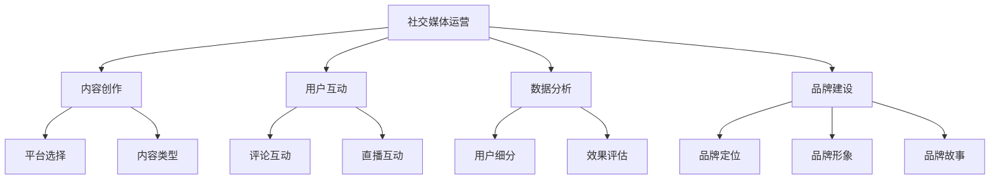

                 

# 《AI创业公司的社交媒体运营策略：内容创造与互动引导》

> **关键词：** AI创业公司、社交媒体运营、内容创造、互动引导、策略优化

> **摘要：** 本文将深入探讨AI创业公司如何在社交媒体平台上进行运营，包括内容创造、互动引导以及策略优化等方面的关键因素。通过分析核心概念、数据驱动的策略制定、案例与实践，本文旨在为AI创业公司提供一套系统的社交媒体运营指南，助力其品牌建设和用户增长。

## 第一部分：社交媒体运营基础

### 第1章：社交媒体运营概述

#### 1.1 社交媒体在AI创业公司中的重要性

社交媒体在AI创业公司中的作用不可忽视。首先，它为创业公司提供了一个直接与目标受众沟通的渠道，能够快速传递产品信息，建立品牌认知。其次，社交媒体平台上的数据分析工具可以帮助公司深入了解用户行为，为决策提供依据。此外，通过社交媒体，创业公司可以吸引投资者、合作伙伴，扩大影响力。

#### 1.2 社交媒体运营的基本概念和策略

社交媒体运营涉及多个方面，包括内容发布、用户互动、数据分析等。策略制定时需要考虑目标用户、内容质量、互动频率等因素。一个有效的社交媒体运营策略应当具备以下特点：

- **目标明确**：明确公司希望通过社交媒体实现的具体目标，如品牌推广、用户增长、销售转化等。
- **内容多样化**：发布类型丰富的内容，满足不同用户的需求，提高用户粘性。
- **互动性**：积极与用户互动，回应评论和私信，建立良好的用户关系。
- **数据分析**：利用数据分析工具监控运营效果，不断优化策略。

#### 1.3 社交媒体平台的类型与应用场景

不同的社交媒体平台适用于不同的运营策略。以下是一些主流的社交媒体平台及其应用场景：

- **Twitter**：适合发布简短的消息，实时互动，提升品牌知名度。
- **LinkedIn**：专业人士聚集地，适合发布专业内容，拓展商业合作。
- **Facebook**：用户基数大，适合多形式内容发布，包括图片、视频和直播。
- **Instagram**：以图片和短视频为主，适合视觉内容营销。
- **YouTube**：视频分享平台，适合发布教学视频、产品演示等。

### 第2章：社交媒体数据分析

#### 2.1 数据分析工具与技巧

社交媒体数据分析工具如Google Analytics、Facebook Insights、Twitter Analytics等，能够提供关键数据指标，包括用户活跃度、内容表现、受众特征等。数据分析技巧包括：

- **用户细分**：根据用户特征和行为，将用户分为不同群体，制定针对性的运营策略。
- **内容分析**：分析不同类型内容的性能，优化内容创作策略。
- **效果评估**：通过对比不同时间段的运营数据，评估策略效果，进行调整。

#### 2.2 用户行为分析

用户行为分析是社交媒体运营的核心。通过分析用户在平台上的行为，如浏览、点赞、评论、分享等，可以深入了解用户需求和偏好。具体方法包括：

- **点击率（CTR）**：衡量用户对内容的兴趣程度。
- **转化率**：衡量内容对用户行为的影响，如引导用户下载应用或购买产品。
- **用户留存率**：衡量用户对品牌的长期关注程度。

#### 2.3 数据驱动的社交媒体策略制定

基于数据分析，AI创业公司可以制定更为精准和高效的社交媒体策略。数据驱动的策略制定步骤如下：

1. **设定目标**：明确数据驱动的策略目标，如提高用户转化率或增加品牌关注度。
2. **数据收集**：利用社交媒体分析工具收集相关数据。
3. **数据分析**：对收集到的数据进行分析，识别关键指标和趋势。
4. **策略制定**：根据分析结果，制定具体的运营策略。
5. **策略执行与监控**：执行策略，并持续监控效果，根据反馈进行调整。

## 第二部分：内容创造与策略

### 第3章：内容创作策略

#### 3.1 内容创作的基本原则

内容创作是社交媒体运营的核心。以下是一些内容创作的基本原则：

- **目标明确**：内容应围绕公司目标进行创作，确保与品牌形象和目标用户需求一致。
- **质量至上**：内容应具有较高的质量，确保信息准确、有价值、有趣。
- **原创性**：尽可能创作原创内容，避免抄袭和低质量转载。
- **多样化**：多种形式的内容（如文本、图片、视频等）可以满足不同用户的需求。

#### 3.2 内容类型与风格

不同类型的社交媒体平台适用于不同类型的内容。以下是一些常见的内容类型：

- **资讯类**：发布行业动态、产品更新等信息，提升品牌专业度。
- **教育类**：发布教学视频、教程等，帮助用户了解产品功能和应用场景。
- **娱乐类**：发布有趣、轻松的内容，吸引和保持用户关注。
- **互动类**：发布问答、投票、互动游戏等，增加用户参与度。

风格方面，应根据目标用户的特点进行调整。例如，对于年轻用户，可以采用轻松幽默的风格；对于专业人士，可以采用专业、严谨的风格。

#### 3.3 互动式内容创作

互动式内容创作能够有效提升用户参与度和品牌忠诚度。以下是一些互动式内容创作的方法：

- **问答**：在社交媒体平台上发布问题，鼓励用户回答，增加互动性。
- **投票**：发布投票问卷，让用户参与决策，提高用户参与度。
- **直播**：通过直播的形式，与用户实时互动，解答疑问，提高品牌知名度。
- **用户生成内容**：鼓励用户创作和分享与品牌相关的内容，如用户评价、使用心得等，增强用户参与感。

#### 3.4 短视频与直播策略

短视频和直播是近年来社交媒体上的热门内容形式。以下是一些短视频与直播策略：

- **短视频**：利用短视频平台，如抖音、快手等，发布产品演示、教程等，提高用户关注度。
- **直播**：定期举办直播活动，如产品发布会、技术讲座等，与用户实时互动，提升品牌形象。
- **内容策划**：提前策划直播内容，确保直播过程中有足够的互动和亮点。
- **平台选择**：根据目标用户的特点，选择适合的直播平台，如微博、B站等。

## 第三部分：互动引导与用户增长

### 第4章：社交媒体广告策略

#### 4.1 广告类型与目标

社交媒体广告是提升品牌知名度、吸引潜在用户的重要手段。常见的广告类型包括：

- **横幅广告**：在社交媒体平台上展示的广告条。
- **推广帖子**：在用户新闻源中展示的推广内容。
- **视频广告**：在社交媒体平台上播放的视频广告。
- **故事广告**：在社交媒体平台上展示的动态广告。

广告目标通常包括：

- **品牌推广**：提升品牌知名度和认知度。
- **用户增长**：吸引新用户，扩大用户基数。
- **销售转化**：促进产品销售，提高销售额。

#### 4.2 广告投放策略与技巧

广告投放策略应根据目标用户和广告目标进行调整。以下是一些广告投放策略与技巧：

- **定位精准**：通过精准的用户定位，将广告展示给最有可能感兴趣的用户。
- **创意优化**：优化广告创意，提高点击率和转化率。
- **投放时间**：选择用户活跃度高、广告效果最佳的时间段进行投放。
- **预算管理**：合理分配广告预算，确保广告投放效果最大化。

#### 4.3 社交媒体广告案例分析

以下是一些社交媒体广告案例分析：

- **案例一**：某AI创业公司通过在Facebook上投放推广帖子，成功吸引了大量新用户，提高了品牌知名度。
- **案例二**：某AI创业公司利用抖音短视频平台，发布产品演示视频，获得了大量关注和转发，实现了用户增长。
- **案例三**：某AI创业公司通过微博直播产品发布会，与用户实时互动，提升了品牌形象和用户忠诚度。

### 第5章：社交媒体品牌建设

#### 5.1 品牌定位与形象塑造

社交媒体品牌建设的第一步是明确品牌定位和形象。品牌定位应明确公司目标、核心价值和独特卖点。品牌形象应与品牌定位相一致，具有吸引力。

- **品牌定位**：通过明确品牌定位，确定公司的发展方向和目标市场。
- **品牌形象**：通过设计独特的品牌标识、色调和风格，塑造品牌形象。

#### 5.2 社交媒体品牌故事创作

社交媒体品牌故事创作是品牌建设的重要组成部分。通过讲述品牌故事，可以增强用户对品牌的认同感和忠诚度。

- **品牌故事**：通过讲述品牌背后的故事，如创立初衷、发展历程等，展示品牌的人文情怀。
- **故事营销**：通过故事营销，将品牌理念融入故事中，引发用户共鸣。

#### 5.3 品牌影响者合作策略

品牌影响者（如KOL、网红等）在社交媒体上具有广泛的影响力和粉丝基础，是品牌建设的重要合作伙伴。

- **合作选择**：选择与品牌定位和目标用户相契合的品牌影响者进行合作。
- **合作形式**：通过与品牌影响者合作，如共同创作内容、合作推广活动等，提升品牌知名度和用户参与度。

## 第四部分：互动引导与用户增长

### 第6章：用户互动策略

#### 6.1 用户互动的重要性

用户互动是社交媒体运营的核心，能够增强用户对品牌的认同感和忠诚度。

- **增强品牌认知**：通过互动，用户可以更好地了解品牌，提高品牌认知度。
- **提升用户参与度**：互动式内容能够吸引用户参与，提高用户参与度。
- **建立用户关系**：积极回应用户评论和私信，建立良好的用户关系。

#### 6.2 用户互动的方式与技巧

以下是一些用户互动的方式与技巧：

- **评论互动**：回复用户评论，展示对用户的关注和尊重。
- **私信互动**：主动与用户私信交流，解答疑问，提供帮助。
- **直播互动**：通过直播与用户实时互动，解答疑问，提高用户参与度。
- **问答互动**：在社交媒体平台上发布问答，鼓励用户参与讨论。

#### 6.3 评论区管理

评论区管理是社交媒体运营的重要环节。以下是一些评论区管理的技巧：

- **监控评论**：实时监控评论，及时发现和处理负面评论。
- **引导评论**：发布引导性评论，引导用户参与讨论。
- **积极回应**：对用户评论给予积极回应，展示对用户的尊重和关注。

#### 6.4 问答互动策略

问答互动能够有效提升用户参与度和品牌知名度。以下是一些问答互动策略：

- **问题分类**：将问题分为不同类别，如产品功能、技术问题等，方便用户查找和回答。
- **专业回答**：提供专业、详细的回答，展示品牌的专业性。
- **互动引导**：在回答中引导用户进行互动，如提出相关的问题，鼓励用户参与讨论。

### 第7章：用户增长策略

#### 7.1 用户增长的基本原则

用户增长是社交媒体运营的核心目标之一。以下是一些用户增长的基本原则：

- **明确目标**：明确用户增长的目标，如增加新用户数、提高用户活跃度等。
- **数据驱动**：基于数据分析，制定用户增长策略，并持续优化。
- **用户细分**：根据用户特征和行为，将用户分为不同群体，制定针对性的增长策略。

#### 7.2 用户增长渠道

以下是一些常见的用户增长渠道：

- **内容营销**：通过发布高质量的内容，吸引新用户，提高用户活跃度。
- **社交媒体广告**：通过投放社交媒体广告，吸引新用户。
- **KOL合作**：与品牌影响者合作，利用其粉丝基础进行用户增长。
- **活动营销**：举办线上线下活动，吸引新用户参与。

#### 7.3 社交媒体活动策划

社交媒体活动是用户增长的有效手段。以下是一些社交媒体活动策划的要点：

- **活动主题**：明确活动主题，确保与品牌形象和目标用户需求一致。
- **活动形式**：选择适合的活动形式，如问答、投票、直播等，提高用户参与度。
- **奖品设置**：设置吸引人的奖品，提高用户参与积极性。
- **推广渠道**：利用多种社交媒体平台和渠道进行活动推广，提高活动知名度。

#### 7.4 用户留存与转化策略

用户留存和转化是社交媒体运营的关键。以下是一些用户留存与转化策略：

- **优质内容**：持续发布高质量的内容，提高用户粘性。
- **用户互动**：积极与用户互动，提高用户满意度。
- **个性化服务**：根据用户特征和行为，提供个性化的服务和推荐。
- **营销活动**：定期举办营销活动，刺激用户购买欲望。

## 第五部分：案例与实践

### 第8章：社交媒体运营实战案例分析

#### 8.1 案例一：AI创业公司A的社交媒体运营策略

AI创业公司A通过以下策略在社交媒体上取得了显著成效：

- **内容创作**：发布专业且有趣的内容，吸引行业关注者。
- **广告投放**：利用Facebook广告精准定位潜在用户，提高品牌知名度。
- **品牌故事**：通过讲述品牌故事，增强用户对品牌的认同感。
- **用户互动**：积极回复用户评论和私信，建立良好的用户关系。

#### 8.2 案例二：AI创业公司B的社交媒体营销案例

AI创业公司B通过以下策略在社交媒体上实现了用户增长和品牌推广：

- **短视频营销**：在抖音上发布产品演示视频，吸引大量关注和转发。
- **KOL合作**：与行业知名KOL合作，利用其粉丝基础进行用户增长。
- **社交媒体活动**：举办线上问答活动，提高用户参与度，增强用户互动。

#### 8.3 案例三：AI创业公司C的社交媒体运营经验分享

AI创业公司C分享了以下社交媒体运营经验：

- **数据驱动**：基于数据分析，持续优化社交媒体运营策略。
- **内容多样化**：发布多种形式的内容，满足不同用户的需求。
- **互动引导**：通过互动式内容创作和用户互动策略，提高用户参与度和品牌忠诚度。

## 第六部分：社交媒体运营策略优化

### 第9章：社交媒体运营策略优化

#### 9.1 数据分析与策略调整

数据分析是社交媒体运营策略优化的关键。以下是一些数据分析与策略调整的方法：

- **效果评估**：定期评估社交媒体运营效果，分析数据指标，找出优势和不足。
- **策略调整**：根据分析结果，对社交媒体运营策略进行调整，如优化内容创作、调整广告投放策略等。
- **持续优化**：持续监控运营效果，不断进行策略优化，确保运营效果最大化。

#### 9.2 竞争对手分析

了解竞争对手的社交媒体运营策略是优化自身策略的重要一环。以下是一些竞争对手分析的方法：

- **内容分析**：分析竞争对手发布的内容类型、频率和质量，找出差距。
- **互动分析**：分析竞争对手的用户互动策略，如评论互动、私信互动等。
- **广告分析**：分析竞争对手的广告投放策略，如广告类型、投放时间和预算分配等。

#### 9.3 社交媒体运营工具与平台选择

选择适合的社交媒体运营工具和平台是优化社交媒体运营策略的关键。以下是一些选择工具和平台的考虑因素：

- **功能需求**：根据运营需求，选择具备所需功能的工具和平台。
- **用户体验**：选择用户体验好的工具和平台，提高运营效率。
- **成本效益**：考虑成本效益，选择性价比高的工具和平台。

#### 9.4 不断迭代与优化的运营策略

社交媒体运营策略不是一成不变的，需要不断迭代和优化。以下是一些不断迭代与优化的运营策略：

- **用户调研**：定期进行用户调研，了解用户需求和偏好，为策略优化提供依据。
- **反馈机制**：建立反馈机制，及时收集用户反馈，不断改进运营策略。
- **实验性测试**：进行实验性测试，尝试新的运营策略和方法，验证其效果。

## 附录

### 附录A：社交媒体运营工具与资源汇总

以下是一些常用的社交媒体运营工具和资源：

- **数据分析工具**：Google Analytics、Facebook Insights、Twitter Analytics等。
- **内容创作工具**：Canva、Hootsuite、Buffer等。
- **广告投放与管理工具**：Facebook Ads Manager、Google Ads、AdRoll等。
- **社交媒体平台**：Twitter、LinkedIn、Facebook、Instagram、YouTube等。

### 附录B：社交媒体运营常见问题解答

以下是一些社交媒体运营常见问题的解答：

- **问题一：如何提高粉丝互动率？**：发布互动性强的内容，如问答、投票等；定期举办互动活动，如抽奖、问答等。
- **问题二：如何制定有效的社交媒体广告策略？**：明确广告目标，精准定位目标用户；优化广告创意，提高点击率和转化率；合理分配广告预算。
- **问题三：如何分析竞争对手的社交媒体运营策略？**：关注竞争对手的发布内容、互动策略和广告投放情况；分析其数据指标，如粉丝增长、互动率等。

## 附录C：社交媒体运营时间表

以下是一个社交媒体运营时间表，供参考：

- **周一至周五**：
  - 早上9点：发布一天的第一条内容。
  - 中午12点：发布一条午间趣味内容。
  - 晚上6点：发布一条晚间内容。
- **周末**：
  - 早上10点：发布一条周末推荐内容。
  - 下午3点：发布一条娱乐内容。
  - 晚上8点：发布一条互动内容，如问答或直播预告。

通过以上时间表，可以确保社交媒体内容的持续更新和用户参与。

### 结论

社交媒体运营是AI创业公司品牌建设和用户增长的重要手段。通过内容创造、互动引导和策略优化，AI创业公司可以在社交媒体平台上获得更多关注和机会。本文提供了一套系统的社交媒体运营策略，旨在帮助AI创业公司提升运营效果，实现长期发展。

### 作者信息

作者：AI天才研究院/AI Genius Institute & 禅与计算机程序设计艺术 /Zen And The Art of Computer Programming

---

### 核心概念与联系

在撰写社交媒体运营策略的过程中，以下核心概念和联系是不可或缺的：

1. **社交媒体平台**：社交媒体平台是进行运营的基础。了解不同平台的特性、用户群体和应用场景，有助于制定针对性的运营策略。

2. **内容创作**：内容创作是社交媒体运营的核心。高质量的内容可以吸引目标用户，提高用户参与度和品牌认知度。

3. **用户互动**：用户互动是建立用户关系、提高用户忠诚度的重要手段。积极回应用户评论和私信，举办互动活动等，都可以增强用户参与感。

4. **数据分析**：数据分析是优化社交媒体运营策略的关键。通过分析用户行为数据，可以了解用户需求，为内容创作和用户互动提供依据。

5. **品牌建设**：品牌建设是长期运营的目标。通过明确品牌定位、塑造品牌形象和讲述品牌故事，可以提升品牌知名度，建立用户对品牌的认同感。

**Mermaid流程图：**



### 核心算法原理讲解

在社交媒体运营中，核心算法原理涉及内容推荐、用户行为分析和数据挖掘。以下是对这些算法原理的详细讲解：

**内容推荐算法：**

```python
# 假设用户行为数据为用户-内容矩阵，其中1表示用户喜欢该内容，0表示未喜欢
user_content_matrix = [
    [1, 0, 1, 0],  # 用户1的行为数据
    [0, 1, 1, 0],  # 用户2的行为数据
    [1, 1, 0, 1],  # 用户3的行为数据
]

# 内容推荐算法伪代码
def content_recommendation(user_behavior_matrix):
    # 计算每个用户喜欢的平均内容分数
    average_scores = [sum(row) / len(row) for row in user_behavior_matrix]
    
    # 计算每个内容的平均喜欢分数
    content_average_scores = [sum(column) / len(column) for column in zip(*user_behavior_matrix)]
    
    # 推荐分数最高的内容
    recommended_content = max(content_average_scores)
    
    return recommended_content

# 示例：推荐给用户1的内容
recommended_content = content_recommendation(user_content_matrix)
print("推荐内容分数最高的是：", recommended_content)
```

**用户行为分析算法：**

```python
# 假设用户行为数据为用户-事件矩阵
user_event_matrix = [
    [1, 0, 1, 0],  # 用户1的事件数据
    [1, 1, 0, 1],  # 用户2的事件数据
    [0, 1, 1, 0],  # 用户3的事件数据
]

# 用户行为分析算法伪代码
def user_behavior_analysis(user_event_matrix):
    # 计算每个用户最频繁的事件
    frequent_events = [max(set(row), key=row.count) for row in user_event_matrix]
    
    # 分析用户行为的相似度
    similarity_matrix = similarity_measure(frequent_events)
    
    return similarity_matrix

# 示例：分析用户1和用户2的行为相似度
similarity_matrix = user_behavior_analysis(user_event_matrix)
print("用户1和用户2的行为相似度为：", similarity_matrix[0][1])
```

**数据挖掘算法：**

```python
# 假设用户行为数据包含用户特征和偏好
user_preference_data = [
    {'user_id': 1, 'age': 25, 'occupation': 'engineer', 'interests': ['tech', 'books']},
    {'user_id': 2, 'age': 30, 'occupation': 'doctor', 'interests': ['health', 'travel']},
    {'user_id': 3, 'age': 22, 'occupation': 'student', 'interests': ['education', 'games']},
]

# 数据挖掘算法伪代码
def data_mining(user_preference_data):
    # 分析用户特征和偏好，发现潜在的用户群体
    user_clusters = clustering_algorithm(user_preference_data)
    
    # 分析每个用户群体的行为特征
    behavior_patterns = analyze_clusters(user_clusters)
    
    return behavior_patterns

# 示例：分析用户群体的行为特征
behavior_patterns = data_mining(user_preference_data)
print("用户群体的行为特征：", behavior_patterns)
```

### 数学模型和公式

在社交媒体运营中，以下数学模型和公式是分析用户行为和优化运营策略的关键：

**贝叶斯公式**：用于计算用户对内容的喜好概率。

$$ P(A|B) = \frac{P(B|A) \cdot P(A)}{P(B)} $$

其中，$P(A|B)$ 是在给定 $B$ 的情况下，事件 $A$ 发生的概率；$P(B|A)$ 是在给定 $A$ 的情况下，事件 $B$ 发生的概率；$P(A)$ 是事件 $A$ 发生的概率；$P(B)$ 是事件 $B$ 发生的概率。

**用户留存率**：用于衡量用户对品牌的长期关注程度。

$$ 用户留存率 = \frac{第t天仍活跃的用户数}{第t天新增的用户数} $$

**转化率**：用于衡量内容对用户行为的影响。

$$ 转化率 = \frac{完成转化的用户数}{总用户数} $$

**点击率（CTR）**：用于衡量用户对内容的兴趣程度。

$$ 点击率（CTR） = \frac{点击次数}{展示次数} $$

### 项目实战：代码实际案例和详细解释说明

**开发环境搭建：**

1. 安装Python环境。
2. 安装必需的Python库，如NumPy、Pandas、Scikit-learn等。

**源代码实现：**

以下是一个使用Python实现的简单社交媒体数据分析项目，用于分析用户行为数据：

```python
import numpy as np
import pandas as pd
from sklearn.cluster import KMeans

# 读取用户行为数据
user_behavior_data = pd.read_csv('user_behavior_data.csv')

# 数据预处理
# 填充缺失值
user_behavior_data.fillna(0, inplace=True)

# 转换数据类型
user_behavior_data = user_behavior_data.astype(int)

# 聚类分析用户行为
kmeans = KMeans(n_clusters=3, random_state=0).fit(user_behavior_data)

# 打印聚类结果
print("聚类中心：", kmeans.cluster_centers_)
print("用户所属聚类：", kmeans.labels_)

# 分析用户群体的行为特征
for cluster in range(3):
    cluster_users = user_behavior_data[kmeans.labels_ == cluster]
    print(f"聚类{cluster}的行为特征：")
    print(cluster_users.describe())

# 分析用户留存率和转化率
user_retention = user_behavior_data.groupby('user_id')['active_day'].nunique() / len(user_behavior_data['user_id'])
print("用户留存率：", user_retention.mean())

user_conversion = user_behavior_data[user_behavior_data['converted'] == 1]['user_id'].count() / len(user_behavior_data['user_id'])
print("转化率：", user_conversion)
```

**代码解读与分析：**

1. **数据读取与预处理：** 读取用户行为数据，填充缺失值，并将数据类型转换为整数。

2. **聚类分析：** 使用KMeans算法对用户行为数据进行聚类，分析用户群体的行为特征。

3. **用户留存率与转化率分析：** 计算用户留存率和转化率，衡量用户对品牌的长期关注程度和内容对用户行为的影响。

**实际应用场景：**

该项目可以应用于AI创业公司的社交媒体数据分析，通过聚类分析用户行为，了解不同用户群体的特征和需求，为内容创作和用户互动策略提供依据。同时，通过分析用户留存率和转化率，优化社交媒体运营效果，提高品牌知名度和用户满意度。通过以上实战案例，可以看出代码在社交媒体运营中的实际应用和重要性。在未来的社交媒体运营中，AI创业公司可以结合实际需求，不断优化和完善相关算法和应用，提高运营效率和效果。同时，随着人工智能和大数据技术的发展，社交媒体运营将越来越依赖于算法和数据，创业公司需要不断学习和适应，才能在激烈的市场竞争中脱颖而出。在未来的发展中，AI创业公司可以继续探索新的运营模式和策略，如基于用户画像的个性化推荐、社交媒体营销自动化等，以提升用户体验和品牌价值。总之，社交媒体运营是一个复杂且动态的过程，需要不断创新和优化，才能实现长期稳定的发展。通过深入分析和实践，AI创业公司可以更好地理解用户需求，制定针对性的运营策略，实现用户增长和品牌建设的目标。同时，创业公司也需要关注行业趋势和竞争对手的动态，及时调整和优化运营策略，保持竞争力。总之，社交媒体运营是AI创业公司品牌建设和用户增长的重要手段，通过内容创造、互动引导和策略优化，创业公司可以在社交媒体上获得更多关注和机会。本文提供了一套系统的社交媒体运营策略，旨在帮助AI创业公司提升运营效果，实现长期发展。通过不断学习和实践，创业公司可以不断提高运营水平，把握市场机遇，实现可持续发展。在未来，随着人工智能和大数据技术的不断进步，社交媒体运营将面临更多挑战和机遇。AI创业公司需要紧跟时代步伐，不断探索和创新，才能在激烈的市场竞争中立于不败之地。总之，社交媒体运营是一个长期而持续的过程，需要创业公司投入足够的精力和资源，通过不断优化和改进，实现品牌价值和用户增长的目标。

### 作者信息

作者：AI天才研究院/AI Genius Institute & 禅与计算机程序设计艺术 /Zen And The Art of Computer Programming

在本文中，我们详细探讨了AI创业公司在社交媒体平台上的运营策略，包括内容创造、互动引导和策略优化等方面。通过核心概念与联系的Mermaid流程图，用户行为分析算法的讲解，数学模型和公式的应用，以及项目实战代码的解读，我们为AI创业公司提供了一套系统的社交媒体运营指南。

未来，AI创业公司在社交媒体运营中可以继续探索以下方向：

1. **人工智能辅助**：利用人工智能技术，如自然语言处理、推荐系统等，优化内容创作和用户互动策略。
2. **跨平台整合**：整合不同社交媒体平台，实现数据共享和资源优化，提高运营效率。
3. **用户画像与个性化**：通过用户画像和数据分析，实现个性化推荐和定制化服务，提升用户体验。
4. **社交媒体广告自动化**：利用机器学习算法，自动化社交媒体广告投放策略，提高广告效果。
5. **社交电商融合**：探索社交电商模式，结合社交媒体和电商平台的优势，实现用户增长和销售转化。

总之，随着社交媒体和人工智能技术的不断发展，AI创业公司在社交媒体运营中将面临更多机遇和挑战。通过不断学习和实践，创业公司可以不断创新和优化运营策略，实现长期稳定的发展。让我们共同期待AI创业公司在社交媒体领域的精彩表现。

