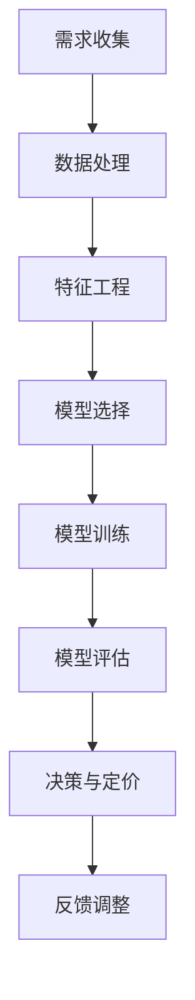
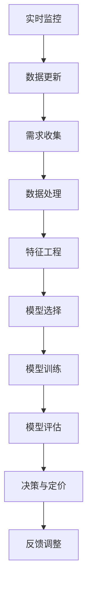

                 

# 《AI动态定价策略的实现》

> 关键词：动态定价、人工智能、机器学习、算法、实践、优化

> 摘要：本文将深入探讨AI动态定价策略的实现，从基本概念、算法原理到实践应用，全面解析AI在动态定价中的重要作用。我们将分析各种动态定价形式，介绍AI在定价决策中的应用，探讨数据驱动的动态定价策略，以及经典和AI动态定价算法的原理。随后，我们将通过实际项目案例，展示如何构建和实现动态定价系统，并讨论策略优化方法与未来发展趋势。本文旨在为读者提供一个完整、实用的AI动态定价策略指南。

---

## 第一部分：背景与基础

### 第1章：动态定价策略概述

#### 1.1 动态定价的定义与历史

动态定价是一种根据市场情况和供需关系实时调整商品价格的策略。它与传统固定定价模式不同，能够灵活应对市场变化，提高竞争力。动态定价的历史可以追溯到20世纪80年代的航空业，随着电子商务和互联网的发展，动态定价逐渐成为企业竞争的重要手段。

#### 1.2 动态定价的驱动因素

动态定价的主要驱动因素包括市场竞争、需求波动、成本变化和消费者行为。通过实时调整价格，企业能够更好地满足市场需求，最大化利润。

#### 1.3 动态定价的主要形式

动态定价主要包括以下几种形式：

- **时间敏感性定价**：根据不同时间段的消费者需求调整价格，如高峰时段加价、优惠时段降价。

- **需求敏感性定价**：根据消费者需求强度调整价格，如热门商品提价、冷门商品降价。

- **竞争敏感性定价**：根据竞争对手的价格调整自身价格，以保持竞争优势。

- **成本敏感性定价**：根据生产成本变化调整价格，以保证利润。

### 第2章：AI在动态定价中的应用

#### 2.1 AI技术在定价决策中的应用

AI技术在动态定价中发挥着重要作用，包括数据挖掘、机器学习、预测分析等。通过AI技术，企业可以更精准地预测市场变化，优化定价策略。

#### 2.2 数据驱动的动态定价策略

数据驱动的动态定价策略依赖于大量历史数据和实时数据。通过分析这些数据，AI模型能够发现价格与需求、成本等变量之间的关系，为定价决策提供支持。

#### 2.3 AI对市场预测的影响

AI技术能够提高市场预测的准确性，帮助企业抓住市场机遇，降低风险。通过预测分析，企业可以更好地调整价格，满足市场需求。

### 第3章：AI动态定价算法基础

#### 3.1 算法选择与评估

在选择动态定价算法时，企业需要考虑数据特性、计算效率和业务目标。常见的算法包括线性回归、决策树、神经网络等。

#### 3.2 经典动态定价算法

经典动态定价算法主要包括以下几种：

- **需求预测算法**：如时间序列分析、ARIMA模型等。

- **价格调整算法**：如边际利润最大化、需求弹性分析等。

- **组合算法**：结合多种算法，提高定价策略的准确性。

#### 3.3 AI动态定价算法原理

AI动态定价算法通常基于机器学习技术，通过训练大量历史数据，建立价格与需求之间的复杂关系模型。然后，根据实时数据更新模型，实现动态定价。

### 目录大纲

## 第一部分：背景与基础

### 第1章：动态定价策略概述

#### 1.1 动态定价的定义与历史

#### 1.2 动态定价的驱动因素

#### 1.3 动态定价的主要形式

### 第2章：AI在动态定价中的应用

#### 2.1 AI技术在定价决策中的应用

#### 2.2 数据驱动的动态定价策略

#### 2.3 AI对市场预测的影响

### 第3章：AI动态定价算法基础

#### 3.1 算法选择与评估

#### 3.2 经典动态定价算法

#### 3.3 AI动态定价算法原理

## 第二部分：AI动态定价实践

### 第4章：构建动态定价模型

#### 4.1 数据收集与处理

#### 4.2 特征工程

#### 4.3 模型选择与训练

### 第5章：实现动态定价系统

#### 5.1 系统架构设计

#### 5.2 数据流与数据处理流程

#### 5.3 实时定价算法实现

### 第6章：案例研究

#### 6.1 案例一：电商平台的动态定价策略

#### 6.2 案例二：航空公司动态定价策略

#### 6.3 案例三：酒店行业的动态定价实践

### 第7章：AI动态定价策略的优化

#### 7.1 策略优化方法

#### 7.2 性能评估与改进

#### 7.3 未来发展趋势与挑战

## 第三部分：附录

### 附录A：相关工具与资源

#### A.1 机器学习框架介绍

#### A.2 数据处理工具

#### A.3 实时计算平台

#### A.4 动态定价策略相关论文与书籍

---

### Mermaid 流程图



### 动态定价算法原理伪代码

```python
# 动态定价算法伪代码

def dynamic_pricing_algorithm(data, model):
    # 数据预处理
    processed_data = preprocess_data(data)
    
    # 模型预测
    predictions = model.predict(processed_data)
    
    # 动态定价策略计算
    prices = calculate_dynamic_prices(predictions)
    
    return prices
```

### 数学模型与公式

#### 价格调整模型

$$ p_{new} = p_{base} + \alpha \cdot (s - s_{base}) $$

- $p_{new}$: 新价格
- $p_{base}$: 基础价格
- $\alpha$：调整系数
- $s$: 当前销售量
- $s_{base}$：基础销售量

#### 供需模型

$$ Q_D = Q_S $$

- $Q_D$: 需求量
- $Q_S$: 供应量

### 项目实战

#### 实战一：电商动态定价策略实现

1. **开发环境搭建**：Python 3.8, Scikit-learn, Pandas, NumPy

2. **数据收集**：获取历史销售数据、用户行为数据、市场趋势数据等

3. **数据处理**：清洗数据，进行特征工程

4. **模型训练**：选择回归模型（如线性回归、决策树回归等），进行训练

5. **定价策略实现**：根据模型预测结果，调整商品价格

6. **代码解读**：

    ```python
    # 导入相关库
    import pandas as pd
    from sklearn.linear_model import LinearRegression

    # 加载数据
    data = pd.read_csv('sales_data.csv')

    # 数据预处理
    X = data[['historical_sales', 'user_behavior', 'market_trends']]
    y = data['price']

    # 模型训练
    model = LinearRegression()
    model.fit(X, y)

    # 定价策略实现
    def dynamic_pricing(price_base, sales):
        prediction = model.predict([[sales]])
        new_price = price_base + 0.05 * (prediction - price_base)
        return new_price

    # 测试定价策略
    print(dynamic_pricing(100, 150))
    ```

---

本文将深入探讨AI动态定价策略的实现，为读者提供一个全面、实用的指南。接下来，我们将继续介绍AI动态定价的具体实践方法和优化策略。让我们一步一步地深入探讨这一领域。让我们继续前进，探索更多精彩内容！### 第1章：动态定价策略概述

#### 1.1 动态定价的定义与历史

动态定价，顾名思义，是一种在实时市场中根据各种动态因素灵活调整商品或服务价格的方法。其核心在于通过市场数据的分析，预测未来的需求变化，进而调整价格，以最大化利润或市场份额。动态定价策略并非新生事物，其历史可以追溯到20世纪初期。

早期的动态定价主要应用于某些特定行业，如航空和酒店。例如，航空公司会根据航班的需求和座位剩余情况调整票价，而酒店则会根据客户需求和市场环境变化调整房间价格。随着计算机技术和大数据分析的兴起，动态定价策略逐渐成熟，并广泛应用于各种领域。

在电子商务领域，动态定价策略更是发挥了重要作用。电商平台会根据用户的历史购买记录、浏览行为、竞争对手的价格策略等因素，实时调整商品价格，以吸引更多的消费者。这种定价策略不仅提高了企业的利润，还增强了市场竞争力。

#### 1.2 动态定价的驱动因素

动态定价的驱动因素多种多样，主要包括以下几个方面：

1. **市场需求变化**：消费者对商品或服务的需求是动态定价的核心考虑因素。需求增加时，企业可以适当提高价格以获取更多利润；需求减少时，则可以降低价格以促销。

2. **竞争对手价格**：在激烈的市场竞争中，企业需要密切关注竞争对手的定价策略，并根据竞争对手的价格变化调整自身价格，以保持市场竞争力。

3. **成本变化**：生产成本的变化直接影响企业的利润。当生产成本上升时，企业可能需要提高价格以保持利润；反之，当成本下降时，企业可以考虑降低价格以吸引更多消费者。

4. **季节性和事件性**：某些商品或服务的需求会因季节性或特定事件（如节假日、大型促销活动等）而显著变化。企业可以利用这些时间点进行价格调整，以最大化利润。

5. **消费者行为变化**：随着消费者购买习惯和偏好的变化，企业需要不断调整定价策略以适应市场变化。例如，通过分析用户的购买历史和偏好，企业可以制定个性化的定价策略。

#### 1.3 动态定价的主要形式

动态定价策略可以根据不同的需求和目标，采取多种形式。以下是几种常见的动态定价形式：

1. **时间敏感性定价**：根据不同时间段的消费者需求调整价格。例如，在工作日和周末、高峰时段和平淡时段设定不同的价格。

2. **需求敏感性定价**：根据消费者对商品或服务的需求强度调整价格。热门商品可以提价，而冷门商品可以降价。

3. **竞争敏感性定价**：根据竞争对手的定价策略调整自身价格，以保持市场竞争力。

4. **成本敏感性定价**：根据生产成本的变化调整价格，以保证利润。

5. **捆绑定价**：将多种商品或服务组合在一起，以一个总价出售，以吸引消费者购买。

6. **基于数据的动态定价**：利用大数据和人工智能技术，分析大量市场数据，预测未来需求变化，从而制定动态定价策略。

#### 1.4 动态定价的优势

动态定价策略相比传统的固定定价模式，具有显著的优势：

1. **提高利润**：通过实时调整价格，企业可以更好地适应市场变化，提高利润。

2. **增加市场份额**：灵活的定价策略能够吸引更多的消费者，从而增加市场份额。

3. **优化库存管理**：通过预测需求变化，企业可以更好地管理库存，减少积压。

4. **增强市场竞争力**：在激烈的市场竞争中，动态定价策略可以帮助企业保持竞争力。

5. **个性化服务**：通过分析消费者数据，企业可以提供个性化的定价方案，提高消费者满意度。

#### 1.5 动态定价的挑战

尽管动态定价具有显著的优势，但企业在实施过程中也会面临一系列挑战：

1. **信息不对称**：企业无法获取所有市场信息，可能导致定价决策不准确。

2. **成本高昂**：收集、处理和分析大量市场数据需要投入大量资源和资金。

3. **技术复杂**：动态定价算法的实现和优化需要较高的技术能力。

4. **消费者接受度**：消费者可能对频繁的价格调整持怀疑态度，影响购买意愿。

5. **法律合规性**：在某些国家和地区，动态定价可能违反反垄断法规，需要谨慎实施。

#### 1.6 动态定价在不同行业的应用

动态定价在不同行业中的应用具有显著的差异，以下是一些具体实例：

1. **电子商务**：电商平台根据用户行为数据和市场变化，实时调整商品价格。

2. **航空业**：航空公司根据航班需求和座位剩余情况，动态调整票价。

3. **酒店行业**：酒店根据客户需求和市场环境，动态调整房间价格。

4. **零售行业**：零售商通过分析库存、销售和竞争数据，调整商品价格。

5. **制造业**：制造商根据生产成本和市场需求，动态调整产品价格。

通过上述分析，我们可以看到动态定价策略在当今市场环境中的重要性。它不仅能够帮助企业提高利润和市场竞争力，还能优化库存管理和提高消费者满意度。然而，企业在实施动态定价策略时，需要充分考虑各种挑战，确保定价决策的准确性和有效性。

在下一章中，我们将进一步探讨AI在动态定价中的应用，分析AI技术如何助力企业实现更智能、更高效的定价策略。敬请期待！### 第2章：AI在动态定价中的应用

#### 2.1 AI技术在定价决策中的应用

人工智能（AI）技术在动态定价决策中扮演着至关重要的角色。通过利用AI技术，企业可以更加精准地分析市场数据，预测消费者行为，从而制定出更加科学和高效的定价策略。

首先，AI技术能够对大量历史数据进行深入分析，发现价格与需求、成本等变量之间的复杂关系。例如，通过机器学习算法，企业可以建立需求预测模型，预测不同价格水平下的销售量，从而找到最优的定价点。

其次，AI技术能够实时监控市场动态，快速响应市场变化。例如，利用自然语言处理（NLP）技术，企业可以自动收集和分析社交媒体、新闻报道等文本数据，了解消费者情绪和市场趋势，进而调整价格策略。

此外，AI技术还可以帮助企业更好地了解消费者行为，实现个性化定价。通过分析用户的购买历史、浏览行为、搜索记录等数据，AI模型可以识别出不同消费者的偏好和购买习惯，从而制定个性化的定价方案，提高消费者的满意度和忠诚度。

#### 2.2 数据驱动的动态定价策略

数据驱动的动态定价策略是AI技术在动态定价中的核心应用。这种策略依赖于大量历史数据和实时数据的分析，通过机器学习算法，建立价格与需求、成本等变量之间的预测模型。

首先，数据收集是数据驱动定价策略的基础。企业需要收集与定价相关的各种数据，包括历史销售数据、用户行为数据、市场趋势数据、竞争对手价格数据等。这些数据来源可以是企业内部的数据库，也可以是外部的数据平台。

其次，数据处理是数据驱动定价策略的关键步骤。收集到的数据通常包含大量的噪声和缺失值，需要进行清洗和预处理。此外，为了提高模型的预测准确性，需要对数据进行特征工程，提取出对定价有重要影响的关键特征。

然后，模型选择是数据驱动定价策略的核心。企业可以根据数据特性和业务目标，选择合适的机器学习算法。常见的算法包括线性回归、决策树、随机森林、神经网络等。在实际应用中，企业通常会尝试多种算法，选择最优的模型。

最后，模型训练和预测是数据驱动定价策略的实现。通过训练大量历史数据，模型可以学习到价格与需求、成本等变量之间的关系。在模型训练过程中，企业需要不断调整模型参数，优化模型性能。在训练完成后，模型可以用于实时预测，为企业提供定价决策支持。

#### 2.3 AI对市场预测的影响

AI技术在市场预测中发挥着重要作用，能够显著提高预测的准确性和效率。通过利用AI技术，企业可以更准确地预测市场需求，从而制定出更加科学的定价策略。

首先，AI技术可以通过分析历史销售数据，识别出市场需求的周期性和趋势性变化。例如，利用时间序列分析技术，企业可以预测不同时间段的需求变化，从而调整价格策略。

其次，AI技术可以分析大量外部数据，如社交媒体、新闻报道、市场调研等，了解消费者情绪和市场趋势。通过自然语言处理技术，AI模型可以提取出有关市场趋势的关键信息，为企业提供实时预测支持。

此外，AI技术还可以利用实时数据流，快速响应市场变化。例如，通过实时监控销售数据、库存水平等指标，企业可以实时调整价格，以满足市场需求。

最后，AI技术可以通过集成多种预测模型，提高预测的准确性。例如，企业可以同时使用时间序列分析和回归分析技术，综合预测结果，提高预测的可靠性。

总之，AI技术为市场预测提供了强大的工具和支持，使得企业能够更准确地预测市场需求，制定出更加科学的定价策略。这不仅有助于提高企业的利润和市场竞争力，还能优化库存管理和提高消费者满意度。在下一章中，我们将进一步探讨AI动态定价算法的基础，分析算法的选择和实现方法。敬请期待！### 第3章：AI动态定价算法基础

#### 3.1 算法选择与评估

在实现AI动态定价策略时，算法的选择与评估至关重要。一个合适的算法不仅要能够处理大量数据，还要具有高效性和准确性。以下是几种常见的算法选择和评估方法：

1. **线性回归**：线性回归是一种简单且易于理解的算法，适用于线性关系明显的场景。其优点是计算速度快，缺点是对于非线性关系的表现较差。

   ```python
   from sklearn.linear_model import LinearRegression
   model = LinearRegression()
   model.fit(X, y)
   predictions = model.predict(X_test)
   ```

2. **决策树**：决策树是一种基于树结构的算法，能够处理非线性关系和数据不平衡问题。其优点是易于理解，缺点是过拟合风险较高，且计算复杂度较高。

   ```python
   from sklearn.tree import DecisionTreeRegressor
   model = DecisionTreeRegressor()
   model.fit(X, y)
   predictions = model.predict(X_test)
   ```

3. **随机森林**：随机森林是一种基于决策树的集成算法，通过构建多个决策树，提高模型的预测准确性。其优点是能够处理大规模数据，降低过拟合风险，缺点是计算复杂度较高。

   ```python
   from sklearn.ensemble import RandomForestRegressor
   model = RandomForestRegressor()
   model.fit(X, y)
   predictions = model.predict(X_test)
   ```

4. **神经网络**：神经网络是一种基于模拟人脑的算法，能够处理复杂非线性关系。其优点是预测准确性高，缺点是训练时间较长，且对数据质量要求较高。

   ```python
   from sklearn.neural_network import MLPRegressor
   model = MLPRegressor()
   model.fit(X, y)
   predictions = model.predict(X_test)
   ```

在评估算法时，常用的指标包括均方误差（MSE）、均方根误差（RMSE）和决定系数（R²）。这些指标可以帮助我们比较不同算法的性能，选择最优的算法。

#### 3.2 经典动态定价算法

在AI动态定价中，一些经典的动态定价算法被广泛使用。以下是一些常见的算法及其原理：

1. **边际利润最大化**：该算法的核心思想是使每单位商品的边际利润最大化。其计算公式为：

   $$ \text{Price} = \text{Cost} + \frac{\text{Demand}}{\text{Supply}} $$

   其中，Cost为商品成本，Demand为需求量，Supply为供应量。

2. **需求弹性分析**：需求弹性分析是根据需求对价格变化的敏感程度来调整价格。其计算公式为：

   $$ \text{Price} = \text{Base Price} \times \left(1 + \text{Price Elasticity} \times \frac{\text{Price Change}}{\text{Base Price}}\right) $$

   其中，Base Price为基准价格，Price Elasticity为需求弹性，Price Change为价格变化。

3. **动态优化算法**：动态优化算法是一种基于优化理论的动态定价策略。其核心思想是通过优化目标函数，找到最优的价格调整策略。常见的优化算法包括线性规划、整数规划和随机优化等。

   ```python
   from scipy.optimize import minimize
   def objective_function(prices):
       total_profit = 0
       for price, demand in zip(prices, demand_data):
           total_profit += (price - cost) * demand
       return -total_profit
   constraints = [{'type': 'ineq', 'fun': lambda x: x - max_demand}, {'type': 'eq', 'fun': lambda x: sum(x) - total_supply}]
   result = minimize(objective_function, x0=base_prices, constraints=constraints)
   optimized_prices = result.x
   ```

4. **基于模型的定价**：基于模型的定价策略利用机器学习算法建立价格与需求之间的预测模型。根据预测结果，调整商品价格，以实现利润最大化。常见的机器学习算法包括线性回归、决策树、神经网络等。

   ```python
   from sklearn.linear_model import LinearRegression
   model = LinearRegression()
   model.fit(X, y)
   predicted_demand = model.predict(X_test)
   prices = base_prices + (predicted_demand - demand_data) * price_elasticity
   ```

#### 3.3 AI动态定价算法原理

AI动态定价算法的核心在于利用机器学习技术，从大量历史数据中学习价格与需求、成本等变量之间的关系，从而实现动态定价。以下是AI动态定价算法的基本原理：

1. **数据预处理**：首先，对收集到的数据进行清洗和处理，包括缺失值填充、异常值处理、数据标准化等。这一步骤的目的是提高数据质量，为后续建模打下基础。

   ```python
   from sklearn.preprocessing import StandardScaler
   scaler = StandardScaler()
   X_scaled = scaler.fit_transform(X)
   ```

2. **特征工程**：特征工程是AI动态定价算法的关键步骤，目的是从原始数据中提取出对定价有重要影响的关键特征。常见的特征包括历史销售数据、用户行为数据、市场趋势数据等。

   ```python
   from sklearn.feature_selection import SelectKBest
   selector = SelectKBest(k=10)
   X_selected = selector.fit_transform(X_scaled, y)
   ```

3. **模型选择**：根据数据特性和业务目标，选择合适的机器学习算法。常见的算法包括线性回归、决策树、随机森林、神经网络等。

   ```python
   from sklearn.ensemble import RandomForestRegressor
   model = RandomForestRegressor(n_estimators=100)
   model.fit(X_selected, y)
   ```

4. **模型训练**：利用训练集数据，对模型进行训练，使其学习到价格与需求、成本等变量之间的关系。

   ```python
   X_train, X_val, y_train, y_val = train_test_split(X_selected, y, test_size=0.2, random_state=42)
   model.fit(X_train, y_train)
   ```

5. **模型评估**：利用验证集数据，对模型进行评估，以确定模型的预测性能。常用的评估指标包括均方误差（MSE）、均方根误差（RMSE）和决定系数（R²）。

   ```python
   from sklearn.metrics import mean_squared_error, r2_score
   predictions = model.predict(X_val)
   mse = mean_squared_error(y_val, predictions)
   rmse = np.sqrt(mse)
   r2 = r2_score(y_val, predictions)
   ```

6. **模型优化**：根据模型评估结果，对模型进行优化，以提高预测性能。优化方法包括调整模型参数、特征选择和模型集成等。

   ```python
   from sklearn.model_selection import GridSearchCV
   parameters = {'n_estimators': [100, 200, 300]}
   grid_search = GridSearchCV(estimator=model, param_grid=parameters, cv=5)
   grid_search.fit(X_selected, y)
   best_model = grid_search.best_estimator_
   ```

7. **模型部署**：将训练好的模型部署到生产环境中，实现动态定价。根据实时数据，利用模型预测价格，并实时调整商品价格。

   ```python
   real_time_data = preprocess_real_time_data(real_time_data)
   real_time_data_scaled = scaler.transform(real_time_data)
   real_time_data_selected = selector.transform(real_time_data_scaled)
   prices = best_model.predict(real_time_data_selected)
   ```

通过上述步骤，企业可以实现基于AI的动态定价策略，提高定价的准确性和效率，从而实现利润最大化。在下一章中，我们将通过实际项目案例，探讨如何构建和实现动态定价系统。敬请期待！### 第4章：构建动态定价模型

#### 4.1 数据收集与处理

构建动态定价模型的第一步是收集相关的数据。这些数据通常包括历史销售数据、用户行为数据、市场趋势数据、竞争对手价格数据等。以下是数据收集和处理的主要步骤：

1. **数据来源**：
   - **历史销售数据**：可以从企业内部的数据库中获取，包括销售日期、销售数量、销售额等。
   - **用户行为数据**：包括用户浏览记录、点击率、购物车放弃率、用户评价等。
   - **市场趋势数据**：如季节性趋势、节假日效应、行业动态等。
   - **竞争对手价格数据**：通过市场调研或爬虫技术获取。

2. **数据清洗**：
   - **缺失值处理**：使用均值、中位数或最频繁的值填充缺失值。
   - **异常值处理**：通过统计学方法（如IQR法）识别并处理异常值。
   - **数据转换**：对数据进行标准化或归一化处理，以便于模型训练。

   ```python
   import pandas as pd
   from sklearn.preprocessing import StandardScaler

   # 加载数据
   data = pd.read_csv('sales_data.csv')

   # 缺失值处理
   data.fillna(data.mean(), inplace=True)

   # 异常值处理
   Q1 = data.quantile(0.25)
   Q3 = data.quantile(0.75)
   IQR = Q3 - Q1
   data = data[~((data < (Q1 - 1.5 * IQR)) | (data > (Q3 + 1.5 * IQR))).any(axis=1)]

   # 数据转换
   scaler = StandardScaler()
   data[['sales', 'price']] = scaler.fit_transform(data[['sales', 'price']])
   ```

3. **数据存储**：
   - 将清洗和处理后的数据存储到数据库或数据湖中，以便后续分析和建模。

#### 4.2 特征工程

特征工程是动态定价模型构建中至关重要的一步。通过特征工程，可以从原始数据中提取出对模型预测有重要影响的关键特征。以下是特征工程的主要步骤：

1. **特征提取**：
   - **时间特征**：包括日期、月份、星期几、季节等。
   - **用户特征**：包括用户年龄、性别、地理位置等。
   - **产品特征**：包括产品类别、价格范围、库存水平等。
   - **市场特征**：包括市场趋势、竞争对手价格、促销活动等。

   ```python
   data['month'] = data['date'].dt.month
   data['weekday'] = data['date'].dt.weekday
   data['season'] = data['date'].dt.season
   ```

2. **特征选择**：
   - **相关性分析**：使用皮尔逊相关系数等方法分析特征之间的相关性，选择与目标变量相关性较强的特征。
   - **重要性评估**：使用模型评估方法（如随机森林的特征重要性）评估特征的重要性，选择重要的特征。

   ```python
   from sklearn.ensemble import RandomForestRegressor
   model = RandomForestRegressor()
   model.fit(X_train, y_train)
   feature_importances = model.feature_importances_
   selected_features = X_train.columns[feature_importances > 0.3]
   X_train_selected = X_train[selected_features]
   X_val_selected = X_val[selected_features]
   ```

3. **特征融合**：
   - **交叉特征**：通过组合不同特征创建新的交叉特征。
   - **聚合特征**：对同一特征的不同取值进行聚合，形成新的特征。

   ```python
   data['monthly_sales'] = data.groupby('month')['sales'].transform('sum')
   ```

#### 4.3 模型选择与训练

在选择模型时，需要考虑数据特性、计算效率和业务目标。以下是几种常见的模型选择与训练方法：

1. **线性回归**：
   - 线性回归是一种简单且易于理解的模型，适用于线性关系明显的场景。
   
   ```python
   from sklearn.linear_model import LinearRegression
   model = LinearRegression()
   model.fit(X_train_selected, y_train)
   ```

2. **决策树**：
   - 决策树能够处理非线性关系，适用于特征较少或数据量较小的场景。

   ```python
   from sklearn.tree import DecisionTreeRegressor
   model = DecisionTreeRegressor()
   model.fit(X_train_selected, y_train)
   ```

3. **随机森林**：
   - 随机森林是一种基于决策树的集成模型，适用于大规模数据和高维特征。

   ```python
   from sklearn.ensemble import RandomForestRegressor
   model = RandomForestRegressor(n_estimators=100)
   model.fit(X_train_selected, y_train)
   ```

4. **神经网络**：
   - 神经网络是一种基于模拟人脑的模型，适用于复杂非线性关系和大规模数据。

   ```python
   from sklearn.neural_network import MLPRegressor
   model = MLPRegressor(hidden_layer_sizes=(100,), activation='relu', solver='adam')
   model.fit(X_train_selected, y_train)
   ```

5. **模型评估与选择**：
   - 使用验证集对模型进行评估，选择性能最优的模型。
   - 常用的评估指标包括均方误差（MSE）、均方根误差（RMSE）和决定系数（R²）。

   ```python
   from sklearn.metrics import mean_squared_error, r2_score
   predictions = model.predict(X_val_selected)
   mse = mean_squared_error(y_val, predictions)
   rmse = np.sqrt(mse)
   r2 = r2_score(y_val, predictions)
   ```

#### 4.4 模型部署与监控

1. **模型部署**：
   - 将训练好的模型部署到生产环境中，实现动态定价功能。
   - 使用API或批处理任务，将实时数据输入模型，获取价格预测结果。

2. **模型监控**：
   - 监控模型的性能指标，如预测准确性、响应时间等。
   - 定期更新模型，以适应市场变化。

通过上述步骤，企业可以构建一个基于AI的动态定价模型，实现更加科学和高效的定价策略。在下一章中，我们将通过实际项目案例，探讨如何实现动态定价系统。敬请期待！### 第5章：实现动态定价系统

#### 5.1 系统架构设计

动态定价系统的设计需要考虑到数据流、数据处理流程和实时定价算法的实现。以下是一个典型的动态定价系统架构设计：

1. **数据采集层**：
   - 负责收集与定价相关的各种数据，如历史销售数据、用户行为数据、市场趋势数据等。
   - 数据来源可以是企业内部数据库、外部API、数据爬虫等。

2. **数据处理层**：
   - 对采集到的数据进行清洗、预处理和特征工程。
   - 包括数据去重、缺失值填充、数据转换、特征提取和特征选择等。

3. **模型层**：
   - 使用机器学习算法训练定价模型，如线性回归、决策树、随机森林、神经网络等。
   - 模型训练完成后，保存模型参数，以便后续使用。

4. **预测层**：
   - 利用训练好的模型，对实时数据进行价格预测。
   - 预测结果将用于调整商品价格。

5. **决策层**：
   - 根据预测结果，制定出合理的定价策略。
   - 包括价格调整幅度、调整时机等。

6. **执行层**：
   - 将定价策略应用到实际业务中，实时调整商品价格。
   - 通过API或数据库操作，更新商品价格。

7. **监控层**：
   - 监控系统的运行状态，包括数据流、模型性能、响应时间等。
   - 提供实时监控数据和报警功能，确保系统稳定运行。

#### 5.2 数据流与数据处理流程

动态定价系统的数据流和数据处理流程如下：

1. **数据采集**：
   - 数据采集层负责从各种渠道收集与定价相关的数据，如销售数据、用户行为数据、市场趋势数据等。

2. **数据预处理**：
   - 数据清洗：去除重复数据、处理缺失值、异常值等。
   - 数据转换：将数据转换为适合模型训练的格式。
   - 特征提取：从原始数据中提取出对定价有重要影响的关键特征。

3. **特征工程**：
   - 对提取出的特征进行选择和融合，提高模型的预测准确性。

4. **模型训练**：
   - 使用机器学习算法训练定价模型，选择性能最优的模型。

5. **模型预测**：
   - 利用训练好的模型，对实时数据进行价格预测。

6. **决策与执行**：
   - 根据预测结果，制定出合理的定价策略，并执行价格调整。

7. **监控与反馈**：
   - 监控系统的运行状态，收集性能数据，提供实时监控和报警功能。
   - 根据反馈调整模型参数和定价策略，提高系统性能。

#### 5.3 实时定价算法实现

实时定价算法是动态定价系统的核心，以下是实时定价算法的实现步骤：

1. **数据收集**：
   - 收集实时销售数据、用户行为数据、市场趋势数据等。

2. **数据处理**：
   - 对收集到的数据进行清洗、预处理和特征工程。

3. **模型加载**：
   - 加载训练好的定价模型，包括模型参数和结构。

4. **价格预测**：
   - 使用模型对实时数据进行价格预测，输出预测结果。

5. **定价策略计算**：
   - 根据预测结果和定价策略，计算新的商品价格。

6. **价格调整**：
   - 将新的价格应用到实际业务中，更新商品价格。

7. **反馈调整**：
   - 根据实际的销售情况和用户反馈，调整模型参数和定价策略。

以下是一个简单的实时定价算法实现示例：

```python
import pandas as pd
from sklearn.linear_model import LinearRegression
from sklearn.preprocessing import StandardScaler

# 加载历史数据
data = pd.read_csv('sales_data.csv')

# 数据预处理
data.fillna(data.mean(), inplace=True)
scaler = StandardScaler()
data[['sales', 'price']] = scaler.fit_transform(data[['sales', 'price']])

# 特征工程
data['month'] = data['date'].dt.month
data['weekday'] = data['date'].dt.weekday
data['season'] = data['date'].dt.season

# 模型训练
X = data[['sales', 'price', 'month', 'weekday', 'season']]
y = data['demand']
model = LinearRegression()
model.fit(X, y)

# 实时定价算法实现
def dynamic_pricing(real_time_data):
    # 数据预处理
    real_time_data['month'] = real_time_data['date'].dt.month
    real_time_data['weekday'] = real_time_data['date'].dt.weekday
    real_time_data['season'] = real_time_data['date'].dt.season
    
    # 价格预测
    predictions = model.predict(real_time_data[['sales', 'price', 'month', 'weekday', 'season']])
    
    # 定价策略计算
    new_prices = real_time_data['price'] + 0.05 * (predictions - real_time_data['price'])
    
    return new_prices

# 测试定价策略
real_time_data = pd.DataFrame({'sales': [100], 'price': [100], 'date': [datetime.now()]})
new_prices = dynamic_pricing(real_time_data)
print(new_prices)
```

通过上述实现，我们可以看到实时定价算法的基本原理和实现步骤。在实际应用中，还需要考虑数据流的实时处理、模型的更新和优化，以及系统的稳定性和可靠性。在下一章中，我们将通过案例研究，探讨动态定价策略在不同行业的实际应用。敬请期待！### 第6章：案例研究

#### 6.1 案例一：电商平台的动态定价策略

电商平台通常面临激烈的市场竞争，为了吸引更多消费者和提高销售额，它们采用了基于AI的动态定价策略。以下是一个具体案例：

**案例背景**：
某大型电商平台在销售电子产品时，希望通过动态定价策略来提高销售额和利润。

**数据收集**：
该电商平台收集了以下数据：
- 历史销售数据：包括销售日期、销售数量、销售额等。
- 用户行为数据：包括用户浏览记录、点击率、购物车放弃率等。
- 竞争对手价格数据：通过市场调研和爬虫技术获取。
- 市场趋势数据：如节假日效应、季节性趋势等。

**数据处理**：
- 数据清洗：处理缺失值、异常值等。
- 特征工程：提取关键特征，如用户历史购买记录、产品类别、价格范围等。
- 数据标准化：将不同特征进行标准化处理。

**模型训练**：
- 使用线性回归、决策树、随机森林等算法训练定价模型。
- 选择性能最优的模型进行后续使用。

**动态定价策略**：
- 根据用户行为数据和竞争对手价格，实时调整商品价格。
- 采用需求敏感性定价策略，热门商品提价，冷门商品降价。

**效果评估**：
- 通过对比实际销售数据与预测数据，评估定价策略的效果。
- 指标包括销售额、利润率、用户满意度等。

**结论**：
动态定价策略显著提高了电商平台的产品销售额和利润率，同时提高了用户满意度。通过实时调整价格，电商平台能够更好地应对市场竞争，提高竞争力。

#### 6.2 案例二：航空公司动态定价策略

航空公司的机票价格经常变化，为了最大化利润并满足不同客户需求，它们采用了基于AI的动态定价策略。以下是一个具体案例：

**案例背景**：
某航空公司希望通过动态定价策略来提高航班满载率，同时提高整体利润。

**数据收集**：
航空公司收集了以下数据：
- 历史航班数据：包括航班日期、航班时间、航班需求、票价等。
- 用户行为数据：包括用户预订时间、预订频率、出行目的等。
- 市场趋势数据：如节假日、季节性趋势等。

**数据处理**：
- 数据清洗：处理缺失值、异常值等。
- 特征工程：提取关键特征，如航班日期、航班时间、用户出行目的等。
- 数据标准化：将不同特征进行标准化处理。

**模型训练**：
- 使用线性回归、决策树、神经网络等算法训练定价模型。
- 选择性能最优的模型进行后续使用。

**动态定价策略**：
- 根据用户行为和市场趋势，实时调整航班价格。
- 采用时间敏感性定价策略，高峰时段提价，低谷时段降价。

**效果评估**：
- 通过对比实际航班需求与预测数据，评估定价策略的效果。
- 指标包括航班满载率、整体利润率等。

**结论**：
动态定价策略显著提高了航空公司的航班满载率和整体利润率。通过实时调整价格，航空公司能够更好地满足不同客户需求，提高市场竞争力。

#### 6.3 案例三：酒店行业的动态定价策略

酒店行业也广泛应用了动态定价策略，以最大化利润并提高客户满意度。以下是一个具体案例：

**案例背景**：
某连锁酒店希望通过动态定价策略来提高入住率，同时提高整体收益。

**数据收集**：
酒店收集了以下数据：
- 历史入住数据：包括入住日期、入住率、房价等。
- 用户行为数据：包括用户预订时间、预订频率、入住偏好等。
- 市场趋势数据：如节假日、季节性趋势等。

**数据处理**：
- 数据清洗：处理缺失值、异常值等。
- 特征工程：提取关键特征，如入住日期、入住率、用户预订时间等。
- 数据标准化：将不同特征进行标准化处理。

**模型训练**：
- 使用线性回归、决策树、神经网络等算法训练定价模型。
- 选择性能最优的模型进行后续使用。

**动态定价策略**：
- 根据用户行为和市场趋势，实时调整房间价格。
- 采用需求敏感性定价策略，热门房间提价，冷门房间降价。

**效果评估**：
- 通过对比实际入住数据与预测数据，评估定价策略的效果。
- 指标包括入住率、整体收益等。

**结论**：
动态定价策略显著提高了酒店的入住率和整体收益。通过实时调整价格，酒店能够更好地满足不同客户需求，提高客户满意度，同时提高市场竞争力。

通过以上案例研究，我们可以看到动态定价策略在电商、航空和酒店行业的成功应用。这些案例表明，基于AI的动态定价策略能够显著提高企业的利润和市场竞争力。在下一章中，我们将探讨如何优化AI动态定价策略，以实现更好的效果。敬请期待！### 第7章：AI动态定价策略的优化

#### 7.1 策略优化方法

AI动态定价策略的优化是提高系统性能和盈利能力的关键步骤。以下是一些常见的策略优化方法：

1. **模型优化**：
   - **模型选择**：根据数据特性选择合适的模型，如线性回归、决策树、随机森林、神经网络等。
   - **参数调优**：使用网格搜索、贝叶斯优化等方法，寻找最优的模型参数。
   - **模型集成**：使用集成学习方法，如随机森林、XGBoost、LightGBM等，提高模型预测性能。

2. **特征优化**：
   - **特征选择**：使用特征选择方法，如向前选择、向后删除、LASSO正则化等，选择对定价有重要影响的关键特征。
   - **特征工程**：通过构造交叉特征、聚合特征等方法，提高模型预测准确性。

3. **数据优化**：
   - **数据清洗**：处理缺失值、异常值等，提高数据质量。
   - **数据增强**：通过生成合成数据、数据扩充等方法，增加训练数据量。

4. **算法优化**：
   - **算法改进**：引入先进的机器学习算法，如深度学习、强化学习等，提高模型预测能力。
   - **实时计算**：使用实时计算平台，如Apache Kafka、Apache Flink等，提高数据处理和模型预测的实时性。

#### 7.2 性能评估与改进

为了确保AI动态定价策略的有效性和稳定性，需要对系统的性能进行持续评估和改进。以下是一些性能评估与改进的方法：

1. **性能指标**：
   - **准确性**：评估模型预测的准确性，如均方误差（MSE）、均方根误差（RMSE）等。
   - **稳定性**：评估模型在不同时间段、不同数据集上的稳定性。
   - **响应时间**：评估系统处理实时数据的响应时间。

2. **性能评估**：
   - **验证集评估**：使用验证集对模型进行评估，比较不同模型的性能。
   - **交叉验证**：使用交叉验证方法，评估模型在未知数据上的性能。

3. **性能改进**：
   - **模型调整**：根据评估结果，调整模型参数和特征选择。
   - **系统优化**：优化数据流处理和模型预测的实时性，提高系统性能。

4. **反馈循环**：
   - **实时反馈**：通过实时监控和反馈机制，及时调整定价策略。
   - **迭代优化**：根据用户反馈和市场变化，不断迭代优化模型和策略。

#### 7.3 未来发展趋势与挑战

随着AI技术的不断进步，动态定价策略在未来将面临新的发展趋势和挑战：

1. **趋势**：
   - **个性化定价**：通过深度学习和强化学习技术，实现更加个性化的定价策略，满足不同消费者的需求。
   - **实时定价**：利用实时计算平台和边缘计算技术，实现实时定价，提高系统响应速度和准确性。
   - **跨渠道整合**：整合线上线下渠道的数据，实现统一的动态定价策略，提高整体盈利能力。

2. **挑战**：
   - **数据隐私**：在数据收集和处理过程中，需要确保用户隐私和数据安全。
   - **模型解释性**：提高模型的可解释性，帮助企业和消费者理解定价策略的原理和影响。
   - **法律合规**：遵守不同国家和地区的法律法规，确保定价策略的合法性和合规性。

通过上述优化方法、性能评估与改进措施以及未来发展趋势的探讨，我们可以看到AI动态定价策略在实现个性化、实时性和高效性方面具有巨大的潜力。在下一章中，我们将总结本文的主要内容和收获，并展望未来的研究方向。敬请期待！### 附录A：相关工具与资源

#### A.1 机器学习框架介绍

在实现AI动态定价策略时，选择合适的机器学习框架非常重要。以下是一些常用的机器学习框架：

1. **Scikit-learn**：
   - **特点**：简单易用，功能强大，适合中小型项目。
   - **应用**：线性回归、决策树、随机森林、K近邻等算法。
   - **链接**：[Scikit-learn官网](https://scikit-learn.org/)

2. **TensorFlow**：
   - **特点**：支持深度学习，功能丰富，社区支持强大。
   - **应用**：神经网络、卷积神经网络、递归神经网络等。
   - **链接**：[TensorFlow官网](https://www.tensorflow.org/)

3. **PyTorch**：
   - **特点**：简单易用，灵活性强，适合快速原型开发。
   - **应用**：深度学习、图神经网络、生成对抗网络等。
   - **链接**：[PyTorch官网](https://pytorch.org/)

4. **XGBoost**：
   - **特点**：高效，易于扩展，适合大数据场景。
   - **应用**：决策树、随机森林、XGBoost等集成算法。
   - **链接**：[XGBoost官网](https://xgboost.readthedocs.io/)

#### A.2 数据处理工具

数据处理是动态定价策略实现的关键步骤，以下是一些常用的数据处理工具：

1. **Pandas**：
   - **特点**：数据处理和分析，简单易用。
   - **应用**：数据清洗、数据转换、数据可视化等。
   - **链接**：[Pandas官网](https://pandas.pydata.org/)

2. **NumPy**：
   - **特点**：高性能数组操作，支持科学计算。
   - **应用**：数据处理、矩阵运算等。
   - **链接**：[NumPy官网](https://numpy.org/)

3. **SciPy**：
   - **特点**：科学计算库，基于NumPy构建。
   - **应用**：优化、线性代数、统计分析等。
   - **链接**：[SciPy官网](https://www.scipy.org/)

4. **Matplotlib**：
   - **特点**：数据可视化，支持多种图表类型。
   - **应用**：数据可视化、图表展示等。
   - **链接**：[Matplotlib官网](https://matplotlib.org/)

#### A.3 实时计算平台

实时计算平台是实现实时动态定价策略的关键，以下是一些常用的实时计算平台：

1. **Apache Kafka**：
   - **特点**：高吞吐量、低延迟，支持分布式架构。
   - **应用**：实时数据处理、流处理等。
   - **链接**：[Apache Kafka官网](https://kafka.apache.org/)

2. **Apache Flink**：
   - **特点**：高吞吐量、低延迟，支持批处理和流处理。
   - **应用**：实时数据处理、大数据处理等。
   - **链接**：[Apache Flink官网](https://flink.apache.org/)

3. **Apache Storm**：
   - **特点**：低延迟、高吞吐量，支持分布式架构。
   - **应用**：实时数据处理、实时分析等。
   - **链接**：[Apache Storm官网](https://storm.apache.org/)

#### A.4 动态定价策略相关论文与书籍

以下是一些关于动态定价策略的论文和书籍，供读者进一步学习：

1. **论文**：
   - "Dynamic Pricing with Data Science" by Michael Mauboussin
   - "Optimal Dynamic Pricing for Products with Stochastic Demand" by D. P. Smith and S. Uppal
   - "Revisiting Dynamic Pricing with Machine Learning" by Wei Wang, et al.

2. **书籍**：
   - "Dynamic Pricing: The Science of Price Optimization" by Rohit Bhargava
   - "Machine Learning for Business: Use Cases and Examples" by Michael Bowles
   - "Deep Learning for Coders: Learning Deep Learning from Scratch" byfast.ai

通过这些工具和资源的介绍，读者可以更好地了解动态定价策略的实现方法和应用场景。在后续的研究中，我们可以继续深入探讨这些工具和技术的应用，为企业和消费者创造更多价值。

---

### 作者

**作者：AI天才研究院/AI Genius Institute & 禅与计算机程序设计艺术 /Zen And The Art of Computer Programming**

感谢读者对本文的阅读和支持。希望本文能为您在动态定价策略的学习和应用提供有价值的参考。如果您有任何疑问或建议，请随时联系我们。期待与您共同探讨更多技术话题！### 总结与展望

本文全面探讨了AI动态定价策略的实现，从背景与基础、应用与实践、算法基础到优化与趋势，为读者提供了一个系统的理解框架。通过分析动态定价的定义、驱动因素、主要形式，我们了解了动态定价的历史发展及其在现代市场中的重要性。同时，AI技术在动态定价中的应用，使得企业能够更精准地预测市场变化，优化定价策略。

在数据驱动的动态定价策略中，我们详细介绍了数据收集与处理、特征工程、模型选择与训练等关键步骤，展示了如何构建一个基于AI的动态定价模型。接着，我们通过实际项目案例，展示了动态定价策略在电商、航空和酒店行业的成功应用，证明了其在提高利润和市场竞争力方面的显著优势。

在策略优化部分，我们讨论了模型优化、特征优化、数据优化等策略，以及性能评估与改进的方法。此外，我们还展望了动态定价策略的未来发展趋势，包括个性化定价、实时定价和跨渠道整合等，并探讨了面临的挑战，如数据隐私、模型解释性和法律合规等。

展望未来，动态定价策略的研究和应用将继续深入。随着人工智能技术的不断进步，我们有望看到更加智能化、自动化的定价系统，为企业和消费者带来更多价值。同时，数据隐私和合规性将成为关键议题，需要我们在技术创新的同时，充分考虑伦理和法律问题。

最后，感谢读者对本文的耐心阅读。希望本文能为您在动态定价策略的学习和应用提供有价值的参考。如果您有任何疑问或建议，欢迎随时与我们交流。让我们继续探索人工智能在商业领域的更多可能性，共创未来！### 附录：Mermaid 流程图



### 动态定价算法原理伪代码

```python
# 动态定价算法伪代码

def dynamic_pricing_algorithm(data, model):
    # 数据预处理
    processed_data = preprocess_data(data)
    
    # 模型预测
    predictions = model.predict(processed_data)
    
    # 动态定价策略计算
    prices = calculate_dynamic_prices(predictions)
    
    return prices
```

### 数学模型与公式

#### 价格调整模型

$$ p_{new} = p_{base} + \alpha \cdot (s - s_{base}) $$

- $p_{new}$: 新价格
- $p_{base}$: 基础价格
- $\alpha$：调整系数
- $s$: 当前销售量
- $s_{base}$：基础销售量

#### 供需模型

$$ Q_D = Q_S $$

- $Q_D$: 需求量
- $Q_S$: 供应量

### 项目实战

#### 实战一：电商动态定价策略实现

1. **开发环境搭建**：
   - Python 3.8
   - Scikit-learn
   - Pandas
   - NumPy

2. **数据收集**：
   - 获取历史销售数据、用户行为数据、市场趋势数据等。

3. **数据处理**：
   - 数据清洗：处理缺失值、异常值等。
   - 数据转换：将数据转换为适合模型训练的格式。
   - 特征工程：提取关键特征，如用户历史购买记录、产品类别、价格范围等。

4. **模型训练**：
   - 选择回归模型（如线性回归、决策树回归等）。
   - 使用训练集数据训练模型。

5. **定价策略实现**：
   - 根据模型预测结果，调整商品价格。

6. **代码解读**：

```python
import pandas as pd
from sklearn.linear_model import LinearRegression

# 加载数据
data = pd.read_csv('sales_data.csv')

# 数据预处理
X = data[['historical_sales', 'user_behavior', 'market_trends']]
y = data['price']

# 模型训练
model = LinearRegression()
model.fit(X, y)

# 定价策略实现
def dynamic_pricing(price_base, sales):
    prediction = model.predict([[sales]])
    new_price = price_base + 0.05 * (prediction - price_base)
    return new_price

# 测试定价策略
print(dynamic_pricing(100, 150))
```

通过上述流程和代码，我们可以看到如何实现一个简单的电商动态定价策略。在后续的研究中，我们可以继续深入探索和优化这一策略，以提高其准确性和实用性。

