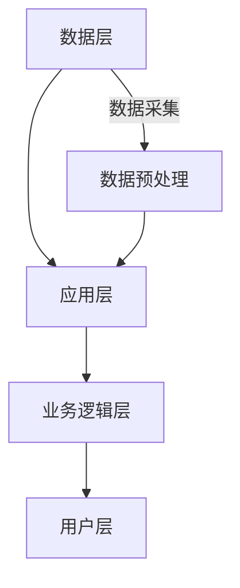

                 

# 《AI在知识管理系统中的应用》

## 摘要

知识管理系统（Knowledge Management System，简称KMS）是企业信息化的核心组成部分，旨在通过有效的知识管理和利用，提升企业的创新能力和竞争力。近年来，人工智能（Artificial Intelligence，简称AI）技术的迅猛发展为知识管理系统带来了新的机遇和挑战。本文将深入探讨AI在知识管理系统中的应用，首先介绍知识管理的基本概念和发展历程，接着阐述人工智能的基本原理和应用领域，随后详细分析AI在知识挖掘、知识表示、知识推理等核心环节中的应用原理和实现方法。最后，通过实际案例展示AI在知识管理系统中的成功应用，并探讨其未来发展趋势和面临的伦理问题。

## 目录大纲

### 第一部分：引言与背景

1. **知识管理概述**
   - 1.1 知识管理的概念
   - 1.2 知识管理的历史与发展
   - 1.3 知识管理的重要性

2. **人工智能概述**
   - 2.1 人工智能的基本概念
   - 2.2 人工智能的发展历程
   - 2.3 人工智能的应用领域

### 第二部分：AI在知识管理中的应用原理

3. **知识挖掘与AI**
   - 3.1 数据挖掘基础
   - 3.2 知识图谱与AI
   - 3.3 机器学习在知识挖掘中的应用

4. **知识表示与AI**
   - 4.1 知识表示方法
   - 4.2 自然语言处理与AI
   - 4.3 知识图谱的构建与应用

5. **知识推理与AI**
   - 5.1 知识推理基础
   - 5.2 对话系统与AI
   - 5.3 智能推荐系统与AI

### 第三部分：AI在知识管理系统中的实践

6. **知识管理系统设计与实现**
   - 6.1 知识管理系统的设计原则
   - 6.2 知识管理系统的架构
   - 6.3 知识管理系统的实现步骤

7. **AI在知识管理中的案例分析**
   - 7.1 案例一：企业知识管理系统的建设
   - 7.2 案例二：智能客服系统的开发
   - 7.3 案例三：教育资源管理系统的应用

### 第四部分：AI在知识管理中的挑战与展望

8. **AI在知识管理中的挑战**
   - 8.1 数据质量与隐私问题
   - 8.2 算法公平性与透明性

9. **AI在知识管理中的未来发展趋势**
   - 9.1 知识管理技术的发展趋势
   - 9.2 AI技术在知识管理中的应用前景

10. **AI在知识管理中的伦理问题**
    - 10.1 伦理问题概述
    - 10.2 伦理问题的解决方法

### 附录

11. **常用AI工具与框架介绍**
    - 11.1 常见机器学习框架
    - 11.2 自然语言处理工具
    - 11.3 数据可视化工具

## 第一部分：引言与背景

### 1.1 知识管理的概念

知识管理是一种通过系统的策略和工具，对组织内部和外部的知识进行采集、存储、组织、共享、使用和创新的过程。其核心目标是提高组织知识的有效利用，从而提升组织的竞争力、创新能力和工作效率。

知识管理涉及多个关键要素，主要包括：

- **知识的采集**：通过多种渠道获取外部和内部的知识资源，如文献、报告、经验、教训等。

- **知识的存储**：将获取到的知识进行结构化存储，以便于后续的检索和使用。常见的知识存储方式包括数据库、知识库、文档管理系统等。

- **知识的组织**：对存储的知识进行分类、标签化、关联等处理，使其更加有序和易于访问。

- **知识的共享**：通过内部网络、会议、培训等多种方式，促进知识的传播和共享，使知识在组织内得到充分利用。

- **知识的应用**：将知识应用于实际工作中，解决实际问题，提高工作效率和决策质量。

- **知识的创新**：通过不断的知识积累和创新，促进组织的持续发展和竞争力提升。

### 1.2 知识管理的历史与发展

知识管理作为企业管理的重要领域，其发展历程可以追溯到20世纪80年代。以下是其主要发展阶段：

- **早期阶段**（1980s - 1990s）：知识管理概念开始提出，主要关注知识共享和文档管理。代表性的实践是文献管理和专家系统的应用。

- **知识管理1.0阶段**（1990s - 2000s）：知识管理开始系统化，知识库、知识地图等工具逐渐普及，知识管理理念深入人心。企业开始重视知识资产的保护和利用。

- **知识管理2.0阶段**（2000s - 2010s）：随着互联网和社交媒体的兴起，知识管理进入了协同时代。企业内部的知识共享和协作变得更加便捷，知识社区、社交媒体平台等成为知识管理的重要工具。

- **知识管理3.0阶段**（2010s - 今）：大数据、云计算和人工智能等技术的快速发展，为知识管理带来了新的机遇和挑战。智能化的知识挖掘、知识表示和知识推理成为知识管理的核心方向。

### 1.3 知识管理的重要性

知识管理在企业管理中具有重要作用，主要体现在以下几个方面：

- **提升企业竞争力**：知识管理有助于企业积累和利用知识资产，提高创新能力和市场竞争力。

- **提高工作效率**：通过知识共享和协作，企业员工可以更快地获取所需信息，提高工作效率。

- **优化决策过程**：基于丰富的知识资源，企业决策者可以做出更加科学和合理的决策。

- **培养企业文化**：知识管理有助于形成企业内部的知识共享和协作文化，促进企业的持续发展。

- **适应快速变化的市场环境**：在当今快速变化的市场环境中，知识管理可以帮助企业及时调整战略，应对市场变化。

### 第二部分：人工智能概述

#### 2.1 人工智能的基本概念

人工智能（Artificial Intelligence，简称AI）是指通过计算机程序模拟人类智能行为的技术和理论。它涉及到多个学科，包括计算机科学、心理学、认知科学、神经科学等。人工智能的主要目标是实现机器的智能，使其能够完成人类智能任务，如视觉识别、语音识别、自然语言处理、决策推理等。

人工智能的关键特征包括：

- **自主学习**：人工智能系统能够通过学习从数据中提取知识和规律，不断优化自身性能。

- **自适应能力**：人工智能系统能够根据环境和任务的变化，自适应调整策略和行为。

- **自动化能力**：人工智能系统能够自动化执行复杂任务，提高工作效率。

- **智能决策**：人工智能系统能够通过数据分析，做出智能化的决策。

#### 2.2 人工智能的发展历程

人工智能的发展历程可以分为以下几个阶段：

- **早期探索阶段**（1950s - 1960s）：人工智能概念首次提出，早期的人工智能系统主要基于逻辑推理和符号计算。

- **应用探索阶段**（1970s - 1980s）：人工智能开始在工业、医疗、金融等领域得到应用，如专家系统、机器视觉等。

- **低谷阶段**（1990s）：由于算法、计算资源和数据集的限制，人工智能发展进入低谷。

- **复兴阶段**（2000s - 今）：随着大数据、云计算和深度学习等技术的发展，人工智能再次迎来爆发式增长。

#### 2.3 人工智能的应用领域

人工智能在各个领域都有广泛应用，主要包括：

- **工业领域**：如智能制造、工业自动化、工业物联网等，提高生产效率和产品质量。

- **医疗领域**：如医学影像分析、疾病预测、个性化医疗等，提高诊断和治疗效果。

- **金融领域**：如风险控制、量化交易、智能投顾等，提高金融服务的效率和准确性。

- **交通领域**：如自动驾驶、智能交通管理、无人机配送等，提高交通安全和效率。

- **服务业**：如智能客服、智能推荐、虚拟助手等，提升客户体验和服务质量。

- **教育领域**：如智能教学系统、在线教育平台等，提供个性化的学习体验。

- **安全领域**：如网络安全、智能监控等，提高安全防护能力。

- **科研领域**：如生物信息学、气象预测等，推动科学研究的发展。

#### 2.4 人工智能的发展趋势

未来，人工智能将呈现以下发展趋势：

- **技术融合**：人工智能与其他技术（如5G、云计算、大数据等）的深度融合，推动各行业的创新和变革。

- **智能化升级**：人工智能系统将更加智能化，具备更强的自主学习、自适应和自动化能力。

- **应用广泛化**：人工智能将在更多领域得到应用，如农业、能源、环境等。

- **伦理和社会问题**：随着人工智能技术的发展，伦理和社会问题将日益突出，需要制定相应的规范和标准。

### 第三部分：AI在知识管理中的应用原理

#### 3.1 数据挖掘基础

数据挖掘（Data Mining）是指从大量数据中提取有价值信息和知识的过程。它涉及到统计学、机器学习、数据库等多个领域。数据挖掘的主要任务包括：

- **分类**：将数据划分为不同的类别或组别。

- **聚类**：将相似的数据分组，形成簇。

- **关联规则挖掘**：发现数据之间的关联关系。

- **异常检测**：识别数据中的异常或异常模式。

- **预测分析**：基于历史数据预测未来的趋势或行为。

数据挖掘的基本流程包括：

1. **数据预处理**：清洗、集成、转换和归一化等操作，为数据挖掘做准备。

2. **特征选择**：从大量特征中筛选出对挖掘任务最重要的特征。

3. **模型选择**：选择合适的算法和模型进行挖掘。

4. **模型评估**：评估挖掘结果的质量和准确性。

5. **结果可视化**：将挖掘结果以可视化的形式展示，帮助用户理解和分析。

#### 3.2 知识图谱与AI

知识图谱（Knowledge Graph）是一种结构化的语义网络，用于表示实体及其之间的关系。它将数据、知识和智能融合在一起，为人工智能提供了丰富的语义信息。

知识图谱的构建主要包括以下几个步骤：

1. **实体识别**：从数据源中识别出关键实体，如人物、地点、组织等。

2. **关系抽取**：确定实体之间的关联关系，如“属于”、“位于”、“工作于”等。

3. **实体链接**：将同一实体的不同表达形式进行统一，如将“张三”和“Zhang San”链接到同一实体。

4. **知识存储**：将构建好的知识图谱存储到数据库或图数据库中，以便于查询和更新。

知识图谱在AI应用中具有重要作用，如：

- **自然语言处理**：通过知识图谱，可以更好地理解和处理自然语言。

- **智能问答**：基于知识图谱，可以快速回答用户的问题。

- **推荐系统**：通过知识图谱，可以更好地发现实体之间的关联关系，提高推荐效果。

- **智能搜索**：通过知识图谱，可以提供更精确、更智能的搜索结果。

#### 3.3 机器学习在知识挖掘中的应用

机器学习（Machine Learning）是一种通过算法和模型自动从数据中学习和提取知识的方法。它在知识挖掘中发挥着重要作用，如：

- **特征提取**：通过机器学习算法，可以从原始数据中提取出对挖掘任务最有价值的特征。

- **分类和聚类**：使用机器学习算法，可以将数据划分为不同的类别或簇。

- **关联规则挖掘**：通过机器学习算法，可以发现数据之间的关联关系。

- **预测分析**：利用机器学习算法，可以预测未来的趋势或行为。

常见的机器学习算法包括：

- **监督学习算法**：如线性回归、逻辑回归、支持向量机等。

- **无监督学习算法**：如K均值聚类、主成分分析等。

- **半监督学习算法**：如图卷积网络、图嵌入等。

机器学习在知识挖掘中的应用案例包括：

- **文本挖掘**：通过机器学习算法，可以从大量文本数据中提取出关键词、主题和情感。

- **图像挖掘**：利用机器学习算法，可以从图像数据中识别出目标对象和特征。

- **音频挖掘**：通过机器学习算法，可以从音频数据中提取出声音特征和模式。

#### 3.4 知识表示与自然语言处理

知识表示（Knowledge Representation）是将知识以计算机可以理解的方式表达和存储的方法。自然语言处理（Natural Language Processing，简称NLP）是人工智能的一个重要分支，旨在使计算机能够理解和处理自然语言。

知识表示与NLP的关系如下：

- **知识表示**：将自然语言中的知识以结构化的形式表示，如词汇、句法、语义等。

- **自然语言处理**：使用知识表示的方法，对自然语言文本进行处理和分析，如分词、词性标注、语义分析等。

知识表示在NLP中的应用包括：

- **词向量表示**：将单词表示为高维向量，如Word2Vec、GloVe等。

- **句法表示**：将句子表示为结构化形式，如语法树、依存关系图等。

- **语义表示**：将语义信息表示为计算机可以处理的形式，如知识图谱、语义网络等。

自然语言处理的关键技术包括：

- **分词**：将文本分割成单词或短语。

- **词性标注**：为每个单词标注词性，如名词、动词、形容词等。

- **命名实体识别**：识别文本中的命名实体，如人名、地名、组织名等。

- **语义分析**：对文本进行语义理解，如情感分析、文本分类、问答系统等。

#### 3.5 知识图谱的构建与应用

知识图谱（Knowledge Graph）是一种结构化的语义网络，用于表示实体及其之间的关系。它将数据、知识和智能融合在一起，为人工智能提供了丰富的语义信息。

知识图谱的构建主要包括以下几个步骤：

1. **实体识别**：从数据源中识别出关键实体，如人物、地点、组织等。

2. **关系抽取**：确定实体之间的关联关系，如“属于”、“位于”、“工作于”等。

3. **实体链接**：将同一实体的不同表达形式进行统一，如将“张三”和“Zhang San”链接到同一实体。

4. **知识存储**：将构建好的知识图谱存储到数据库或图数据库中，以便于查询和更新。

知识图谱在AI应用中具有重要作用，如：

- **自然语言处理**：通过知识图谱，可以更好地理解和处理自然语言。

- **智能问答**：基于知识图谱，可以快速回答用户的问题。

- **推荐系统**：通过知识图谱，可以更好地发现实体之间的关联关系，提高推荐效果。

- **智能搜索**：通过知识图谱，可以提供更精确、更智能的搜索结果。

知识图谱的构建方法包括：

- **基于规则的方法**：使用专家知识，手动构建知识图谱。

- **基于统计的方法**：使用机器学习算法，从大量数据中自动提取知识。

- **基于图神经网络的方法**：使用图神经网络，对知识图谱进行建模和优化。

知识图谱的应用领域包括：

- **搜索引擎**：如百度、谷歌等，通过知识图谱提供更智能、更个性化的搜索结果。

- **推荐系统**：如电商、社交媒体等，通过知识图谱发现用户和商品之间的关联关系，提高推荐效果。

- **智能客服**：如在线客服、智能语音助手等，通过知识图谱提供更准确、更快速的回答。

#### 3.6 知识推理与AI

知识推理（Knowledge Reasoning）是人工智能的一个重要分支，旨在使计算机能够基于已有的知识进行推理和推断，从而发现新的知识和规律。

知识推理的基本原理如下：

1. **知识表示**：将知识以计算机可以理解的形式表示，如规则、框架、语义网络等。

2. **推理机制**：定义推理机制，如演绎推理、归纳推理、类比推理等。

3. **推理过程**：根据已有知识和推理机制，进行推理和推断，生成新的知识。

知识推理在AI中的应用包括：

- **智能问答**：基于知识图谱和推理机制，快速回答用户的问题。

- **智能推荐**：基于用户和商品的知识关系，进行推理和推荐。

- **智能监控**：基于异常检测和推理机制，识别异常事件。

- **智能决策**：基于多目标决策和推理机制，选择最优策略。

常见的知识推理算法包括：

- **基于规则的推理算法**：如生产式规则、模糊规则等。

- **基于模型的推理算法**：如推理网络、规划算法等。

- **基于数据的推理算法**：如聚类、分类、关联规则等。

### 第四部分：AI在知识管理系统中的实践

#### 4.1 知识管理系统的设计原则

知识管理系统（Knowledge Management System，简称KMS）是支持知识管理和共享的信息系统。其设计原则包括：

1. **用户中心原则**：以用户需求为导向，确保知识系统能够满足用户的知识获取、共享和利用需求。

2. **灵活性原则**：知识管理系统应具备良好的灵活性，能够适应企业不同发展阶段和业务需求的变化。

3. **整合性原则**：知识管理系统应与企业其他信息系统（如ERP、CRM等）进行整合，实现数据的无缝连接和共享。

4. **开放性原则**：知识管理系统应具备开放性，支持与外部系统的接口和集成，便于知识的流动和共享。

5. **安全性原则**：知识管理系统应确保知识的保密性、完整性和可用性，防止知识泄露、篡改和丢失。

6. **可扩展性原则**：知识管理系统应具备良好的可扩展性，能够支持知识的积累和系统功能的扩展。

7. **智能化原则**：利用人工智能技术，提高知识管理系统的智能化水平，如知识挖掘、推荐系统、智能问答等。

#### 4.2 知识管理系统的架构

知识管理系统的架构可以分为以下几个层次：

1. **数据层**：包括知识存储、数据采集和数据预处理等模块。知识存储主要使用数据库或图数据库，数据采集包括内部数据和外部数据，数据预处理包括数据清洗、转换和集成等。

2. **应用层**：包括知识管理的主要功能模块，如知识获取、知识共享、知识应用、知识创新等。这些模块通过业务逻辑层进行协调和集成。

3. **业务逻辑层**：包括业务规则、流程管理和权限管理等模块。业务规则定义知识管理的业务逻辑，流程管理支持知识管理流程的自动化执行，权限管理确保知识的安全和共享。

4. **用户层**：包括用户界面和用户交互模块，提供用户对知识系统的访问和操作。

知识管理系统架构示例（使用Mermaid流程图表示）：

#### 4.3 知识管理系统的实现步骤

知识管理系统的实现可以分为以下几个步骤：

1. **需求分析**：与业务部门沟通，了解企业的知识管理需求和目标，明确系统的功能和性能要求。

2. **系统设计**：根据需求分析，设计系统的架构、模块划分和接口规范。

3. **数据采集与预处理**：构建数据采集和处理流程，确保数据的完整性、准确性和一致性。

4. **知识存储与管理**：选择合适的数据库或图数据库，实现知识的存储、管理和检索。

5. **应用开发**：根据系统设计，开发知识管理系统的功能模块，如知识获取、知识共享、知识应用、知识创新等。

6. **系统集成**：将知识管理系统与企业其他信息系统（如ERP、CRM等）进行集成，实现数据的无缝连接和共享。

7. **测试与部署**：进行系统测试，确保系统的功能、性能和安全性符合要求，然后进行系统部署。

8. **培训与维护**：对用户进行系统培训，确保用户能够熟练使用系统。同时，定期进行系统维护和升级，确保系统的稳定运行。

### 第五部分：AI在知识管理系统中的案例分析

#### 5.1 案例一：企业知识管理系统的建设

**背景**：某大型企业为了提升知识管理水平，决定建设一套企业知识管理系统。

**系统设计**：

1. **需求分析**：通过调研和访谈，了解企业的知识管理需求和目标，明确系统的功能模块和性能要求。

2. **架构设计**：采用B/S架构，将系统分为数据层、应用层、业务逻辑层和用户层。

3. **功能模块**：包括知识获取、知识共享、知识应用、知识创新等模块。

4. **数据采集与预处理**：使用ETL工具，从内部系统和外部数据源采集数据，进行数据清洗、转换和集成。

5. **知识存储与管理**：采用关系数据库存储结构化数据，采用图数据库存储知识图谱。

6. **业务逻辑层**：定义业务规则和流程管理，确保知识管理的规范和效率。

7. **用户层**：设计友好的用户界面，提供用户对知识系统的访问和操作。

**实施效果**：

1. **知识获取**：通过数据采集和预处理，企业能够快速获取和整合内部外部数据，提高知识获取效率。

2. **知识共享**：通过知识共享模块，员工可以方便地获取和分享知识，促进知识流动和协作。

3. **知识应用**：通过知识应用模块，企业能够将知识应用于实际工作中，提高工作效率和决策质量。

4. **知识创新**：通过知识创新模块，企业能够不断积累和更新知识，推动组织创新和发展。

#### 5.2 案例二：智能客服系统的开发

**背景**：某电商企业为了提升客户服务质量，决定开发一套智能客服系统。

**系统设计**：

1. **需求分析**：通过调研和访谈，了解客户服务需求和期望，明确系统的功能模块和性能要求。

2. **架构设计**：采用B/S架构，将系统分为数据层、应用层、业务逻辑层和用户层。

3. **功能模块**：包括智能问答、知识库管理、客服机器人、人工客服等模块。

4. **数据采集与预处理**：使用自然语言处理技术，从历史客服数据和用户反馈中提取有价值的信息。

5. **知识存储与管理**：采用图数据库存储知识图谱，实现知识的存储、管理和检索。

6. **业务逻辑层**：定义业务规则和流程管理，确保客服服务的规范和效率。

7. **用户层**：设计友好的用户界面，提供用户对智能客服系统的访问和操作。

**实施效果**：

1. **智能问答**：通过自然语言处理技术，智能客服系统能够快速理解和回答用户的问题，提高客户满意度。

2. **知识库管理**：通过知识库管理模块，企业能够方便地管理客户服务知识，提高客服效率和知识利用率。

3. **客服机器人**：通过客服机器人模块，企业能够在短时间内处理大量客户咨询，减轻人工客服的工作压力。

4. **人工客服**：结合人工客服模块，智能客服系统在处理复杂问题时，能够快速转接给人工客服，提供高质量的客户服务。

#### 5.3 案例三：教育资源管理系统的应用

**背景**：某教育机构为了提升教育资源管理和服务水平，决定开发一套教育资源管理系统。

**系统设计**：

1. **需求分析**：通过调研和访谈，了解教育资源管理和服务的需求和目标，明确系统的功能模块和性能要求。

2. **架构设计**：采用B/S架构，将系统分为数据层、应用层、业务逻辑层和用户层。

3. **功能模块**：包括课程管理、教材管理、学生管理、教师管理、在线教学、作业管理、成绩管理等模块。

4. **数据采集与预处理**：使用自然语言处理技术，从教学文档、学生反馈等数据中提取有价值的信息。

5. **知识存储与管理**：采用图数据库存储知识图谱，实现知识的存储、管理和检索。

6. **业务逻辑层**：定义业务规则和流程管理，确保教育资源管理的规范和效率。

7. **用户层**：设计友好的用户界面，提供用户对教育资源管理系统的访问和操作。

**实施效果**：

1. **课程管理**：通过课程管理模块，教育机构能够方便地管理课程信息，提供个性化的课程推荐。

2. **教材管理**：通过教材管理模块，教育机构能够方便地管理教材信息，实现教材的在线共享和下载。

3. **学生管理**：通过学生管理模块，教育机构能够方便地管理学生信息，实现学生成绩和学业的跟踪。

4. **教师管理**：通过教师管理模块，教育机构能够方便地管理教师信息，实现教师教学和科研的跟踪。

5. **在线教学**：通过在线教学模块，教育机构能够提供在线课程、直播教学等功能，提高教学效果。

6. **作业管理**：通过作业管理模块，教育机构能够方便地布置和批改作业，提高作业管理效率。

7. **成绩管理**：通过成绩管理模块，教育机构能够方便地管理学生成绩，实现成绩的实时查询和统计分析。

### 第六部分：AI在知识管理中的挑战与展望

#### 6.1 AI在知识管理中的挑战

尽管AI在知识管理中具有巨大潜力，但在实际应用中仍面临以下挑战：

1. **数据质量与隐私问题**：知识管理依赖于大量的数据，但数据质量直接影响知识挖掘和推理的效果。此外，数据隐私和安全问题也是一大挑战。

2. **算法公平性与透明性**：AI算法的决策过程可能存在偏见和不可解释性，这引发了算法公平性和透明性的质疑。

3. **知识表示和融合**：知识表示和融合是知识管理的关键问题，但现有方法在处理复杂、异构数据时仍存在困难。

4. **系统集成与兼容**：知识管理系统需要与企业其他信息系统进行集成，但不同系统之间的数据格式、接口标准可能不一致。

5. **人才短缺**：AI和知识管理领域的专业人才短缺，限制了知识管理系统的开发和推广。

#### 6.2 AI在知识管理中的未来发展趋势

未来，AI在知识管理中将继续发展，主要趋势包括：

1. **智能化水平提升**：随着AI技术的进步，知识管理系统的智能化水平将不断提高，如自动化的知识挖掘、知识表示和推理。

2. **多模态数据的处理**：AI将能够更好地处理多模态数据（如文本、图像、语音等），实现更全面的知识表示和融合。

3. **自适应与个性化**：知识管理系统将更加自适应和个性化，根据用户需求和企业特点，提供定制化的知识服务。

4. **系统集成与开放**：知识管理系统将更加注重与企业其他信息系统的集成与兼容，实现数据的无缝连接和共享。

5. **伦理和法规合规**：随着AI在知识管理中的应用日益广泛，伦理和法规合规问题将受到更多关注，相关规范和标准将逐步完善。

#### 6.3 AI在知识管理中的伦理问题

AI在知识管理中可能引发的伦理问题主要包括：

1. **数据隐私**：数据采集和处理过程中，如何保护用户的隐私和数据安全。

2. **算法偏见**：算法可能存在偏见，导致不公平的决策和结果。

3. **数据垄断**：数据资源的垄断可能导致市场垄断和权力滥用。

4. **职业替代**：AI可能替代某些工作岗位，引发就业和社会问题。

为解决上述伦理问题，可以采取以下措施：

1. **数据隐私保护**：采用数据加密、匿名化等技术，保护用户隐私。

2. **算法透明性和可解释性**：提高算法的透明性和可解释性，使其决策过程更加公平和可接受。

3. **公平竞争**：制定相关法规和政策，防止数据垄断和市场垄断。

4. **职业培训和转型**：加强对AI和相关技术的培训，帮助劳动者适应新的工作环境。

### 附录：常用AI工具与框架介绍

#### 7.1 常见机器学习框架

以下是一些常用的机器学习框架：

- **TensorFlow**：由谷歌开发的开源机器学习框架，支持深度学习和传统机器学习算法。

- **PyTorch**：由Facebook开发的开源机器学习框架，具有灵活的动态计算图，适合深度学习和研究。

- **Scikit-learn**：是一个开源的Python机器学习库，提供了广泛的算法和工具，适合数据分析和建模。

#### 7.2 自然语言处理工具

以下是一些常用的自然语言处理工具：

- **NLTK**：是一个开源的Python自然语言处理库，提供了丰富的文本处理工具，如分词、词性标注、句法分析等。

- **spaCy**：是一个开源的Python自然语言处理库，具有高效的性能和强大的功能，适用于各种NLP任务。

- **gensim**：是一个开源的Python库，用于主题建模和文本相似度分析，适用于大规模文本数据。

#### 7.3 数据可视化工具

以下是一些常用的数据可视化工具：

- **Matplotlib**：是一个开源的Python可视化库，提供了丰富的图表类型和自定义选项，适用于各种数据可视化需求。

- **Seaborn**：是一个基于Matplotlib的Python可视化库，提供了更高级的图表和统计图形，适用于探索性数据分析。

- **Plotly**：是一个开源的Python可视化库，提供了交互式图表和高级功能，适用于复杂的数据可视化需求。

