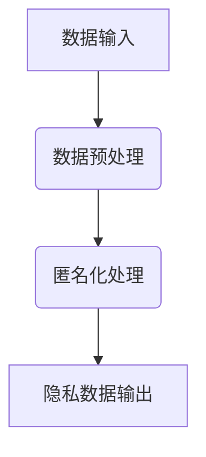

                 

### 第一部分：AI与隐私保护概述

#### 第1章：AI与隐私保护的关系

##### 1.1 AI时代的数据隐私挑战

随着人工智能（AI）技术的飞速发展，数据隐私保护成为了当今社会的一个重要议题。在AI时代，数据隐私挑战主要体现在以下几个方面：

1. **数据量巨大**：AI系统通常需要处理海量数据，这为隐私泄露提供了更多的机会。
2. **数据类型多样**：除了结构化数据外，AI系统还需要处理非结构化数据，如图像、音频和视频等，这些数据的隐私保护更为复杂。
3. **深度学习模型**：深度学习模型在训练过程中会吸收大量训练数据，这些数据可能包含敏感信息。
4. **数据共享与流动**：AI技术的应用场景广泛，数据在不同系统之间共享和流动，增加了隐私泄露的风险。

##### 1.1.1 数据隐私的重要性

数据隐私的重要性不言而喻，它涉及到个人隐私、商业秘密和社会安全等多个层面：

1. **个人隐私**：个人数据泄露可能导致个人信息被滥用，造成个人隐私的侵害。
2. **商业秘密**：企业的敏感数据泄露可能对竞争对手造成不利影响，损害商业利益。
3. **社会安全**：大规模的数据泄露可能导致社会秩序的紊乱，甚至威胁国家安全。

##### 1.1.2 AI技术对隐私保护的影响

AI技术的发展在提升数据处理能力和效率的同时，也对隐私保护带来了新的挑战：

1. **数据挖掘与分析**：AI技术可以通过分析大量数据来挖掘有价值的信息，但这也增加了隐私泄露的风险。
2. **个性化服务**：AI系统能够根据用户数据提供个性化服务，但用户数据的收集和使用需要遵守隐私保护法规。
3. **自动化决策**：AI系统在自动化决策过程中可能会涉及个人数据的处理，这需要确保决策过程的透明性和公正性。

在了解了AI时代的数据隐私挑战和重要性后，接下来我们将探讨AI在隐私保护中的角色和作用。

#### 1.2 AI在隐私保护中的角色

##### 1.2.1 数据匿名化与去识别化

数据匿名化与去识别化是AI在隐私保护中的核心技术手段，通过这些技术，可以有效降低数据隐私泄露的风险。

1. **数据匿名化**：
   - **定义**：数据匿名化是指通过一系列技术手段，使原始数据无法直接识别个人身份，同时保持数据的有效性和可用性。
   - **目的**：匿名化数据的主要目的是确保在数据分析和共享过程中，个人隐私不会被泄露。

2. **数据去识别化**：
   - **定义**：数据去识别化是在数据匿名化的基础上，进一步处理数据，使其不可能通过单独或与其他数据的组合来识别个人身份。
   - **目的**：数据去识别化的目标是实现数据的“不可恢复性”，即使数据被恢复，也无法识别出原始个体的信息。

##### 1.2.2 加密技术与隐私保护

加密技术是保护数据隐私的重要手段，通过加密，可以使数据在传输和存储过程中难以被窃取和篡改。

1. **数据加密的基本原理**：
   - **对称加密**：使用相同的密钥进行加密和解密，如AES算法。
   - **非对称加密**：使用一对密钥（公钥和私钥），如RSA算法。

2. **加密算法的安全性评估**：
   - **加密算法的选择**：需要根据数据的安全需求选择合适的加密算法。
   - **密钥管理**：加密算法的安全主要依赖于密钥的安全管理。

##### 1.2.3 隐私增强技术（PET）

隐私增强技术（Privacy Enhancing Technologies, PETs）是一系列旨在提高数据隐私保护水平的工具和技术。

1. **定义**：
   - **PET**：包括匿名通信、同态加密、差分隐私等技术，用于在数据处理过程中提高隐私保护水平。

2. **应用场景**：
   - **云计算**：在云环境中，PETs可以确保数据在存储和处理过程中的隐私保护。
   - **大数据分析**：在大数据处理过程中，PETs可以保护敏感数据的隐私。

#### 1.3 AI隐私保护法律法规与发展趋势

随着AI技术的发展，各国纷纷出台相关的隐私保护法律法规，以规范AI技术的应用。

1. **国内外隐私保护法律法规**：
   - **国内**：《中华人民共和国网络安全法》、《个人信息保护法》等法律法规对数据隐私保护提出了明确要求。
   - **国外**：如《通用数据保护条例》（GDPR）等法规，对个人数据的处理和使用进行了严格规定。

2. **隐私保护技术的发展趋势**：
   - **法律法规的完善**：随着AI技术的应用日益广泛，隐私保护法律法规也将不断完善。
   - **技术的创新**：PETs等隐私保护技术将不断迭代升级，以应对新的隐私保护挑战。

在本章中，我们简要介绍了AI与隐私保护的关系，探讨了AI在隐私保护中的角色和技术手段。接下来，我们将深入分析AI隐私保护的核心技术，包括数据匿名化与去识别化技术、加密技术以及隐私增强技术（PETs）。

### 总结

在本章中，我们首先讨论了AI时代的数据隐私挑战，强调了数据隐私的重要性。随后，我们介绍了AI在隐私保护中的角色，包括数据匿名化与去识别化技术、加密技术以及隐私增强技术（PETs）。此外，我们还简要概述了国内外隐私保护法律法规和发展趋势。通过这些内容，读者可以初步了解AI隐私保护的现状和未来发展方向。在下一章中，我们将进一步探讨AI隐私保护的核心技术，为读者提供更深入的技术分析。

#### 第2章：数据匿名化与去识别化技术

数据匿名化与去识别化技术是AI在隐私保护中的核心手段，旨在确保在数据分析和共享过程中，个人隐私不会被泄露。本章将详细介绍数据匿名化的基本概念、技术手段以及数据去识别化的相关内容。

##### 2.1 数据匿名化的基本概念

数据匿名化（Data Anonymization）是指通过一系列技术手段，将原始数据中的个人识别信息进行处理，使得数据无法直接识别个人身份，同时保持数据的有效性和可用性。匿名化的目的是在保障数据隐私的同时，允许数据在学术研究、商业分析等领域中的使用。

##### 2.1.1 数据匿名化的定义

数据匿名化的定义可以理解为：在保证数据分析和应用价值的前提下，通过技术手段去除或掩盖数据中的个人识别信息，使得数据在未经授权的情况下，无法识别特定个体的过程。

##### 2.1.2 数据匿名化的目的

数据匿名化的主要目的包括：

1. **保护个人隐私**：防止个人数据在数据分析和共享过程中被未经授权的第三方访问和滥用。
2. **合规要求**：许多国家和地区的隐私保护法律法规要求，在进行数据分析和处理时，必须对个人数据进行匿名化处理。
3. **数据安全**：减少数据泄露的风险，确保数据在存储和传输过程中的安全性。

##### 2.2 数据匿名化技术

数据匿名化技术可以分为以下几类：

1. **冒名化技术**：
   - **定义**：通过将个人识别信息替换为虚构的名字或其他标识符，使得原始数据中的个人识别信息无法直接识别。
   - **适用场景**：适用于少量个人识别信息的数据集。

2. **合并技术**：
   - **定义**：将多个数据集中的个人识别信息进行合并，通过在合并过程中掩盖个人识别信息，实现匿名化。
   - **适用场景**：适用于数据集之间存在一定关联性的情况。

3. **一般化与泛化技术**：
   - **定义**：通过降低数据中的细节程度，使得个人识别信息无法被直接识别。
   - **适用场景**：适用于处理复杂且包含敏感信息的数据库。

4. **重采样技术**：
   - **定义**：通过从原始数据集中随机抽取一部分数据，生成一个具有相似统计特性的匿名化数据集。
   - **适用场景**：适用于数据量较大且不需要精确分析的情况。

##### 2.3 数据去识别化

数据去识别化（Data De-identification）是在数据匿名化基础上，进一步处理数据，使其不可能通过单独或与其他数据的组合来识别个人身份。去识别化的目标是实现数据的“不可恢复性”，即使数据被恢复，也无法识别出原始个体的信息。

##### 2.3.1 数据去识别化的定义

数据去识别化是指通过一系列技术手段，将原始数据中的个人识别信息进行完全移除或转换，使得数据在未经授权的情况下，无法通过任何方式识别特定个体的过程。

##### 2.3.2 数据去识别化的方法

数据去识别化可以分为以下几种方法：

1. **特征屏蔽**：
   - **定义**：通过屏蔽或删除数据集中的某些特征（如身份证号码、手机号码等），实现数据的去识别化。
   - **适用场景**：适用于特征较为明显的数据。

2. **同化技术**：
   - **定义**：将数据集中的敏感值替换为相同或相似的值，使得数据无法直接识别个体。
   - **适用场景**：适用于数据中存在敏感但需要保持一致性的情况。

3. **泛化技术**：
   - **定义**：通过将具体值泛化为一个类别或区间，使得数据无法直接识别个体。
   - **适用场景**：适用于数据集中存在大量敏感值的情况。

4. **噪声添加技术**：
   - **定义**：通过在数据中添加噪声，使得原始数据无法被识别。
   - **适用场景**：适用于需要保持数据真实性的情况。

##### 2.3.3 数据去识别化的效果评估

数据去识别化的效果评估是确保去识别化处理有效性的关键步骤。评估方法主要包括以下几种：

1. **基于隐私泄露的风险评估**：
   - **定义**：通过计算数据在去识别化处理后，被重新识别的风险，评估去识别化的效果。
   - **适用场景**：适用于高风险数据集。

2. **基于统计学的方法**：
   - **定义**：通过比较去识别化前后的数据集的统计特性，评估去识别化的效果。
   - **适用场景**：适用于数据集较大且统计特性较为稳定的情况。

3. **基于机器学习的方法**：
   - **定义**：通过训练机器学习模型，评估去识别化后数据集的可分析性和隐私保护水平。
   - **适用场景**：适用于复杂的数据集和分析任务。

在本章中，我们详细介绍了数据匿名化与去识别化的基本概念、技术手段以及效果评估方法。通过这些内容，读者可以了解数据匿名化与去识别化在AI隐私保护中的重要性和应用场景。在下一章中，我们将探讨加密技术在隐私保护中的应用，为读者提供更全面的技术分析。

### 总结

在本章中，我们深入探讨了数据匿名化与去识别化技术的概念、方法以及效果评估。首先，我们介绍了数据匿名化的定义和目的，然后详细描述了数据匿名化的技术手段，包括冒名化技术、合并技术、一般化与泛化技术以及重采样技术。接着，我们介绍了数据去识别化的定义和方法，包括特征屏蔽、同化技术、泛化技术以及噪声添加技术。最后，我们讨论了数据去识别化的效果评估方法，包括基于隐私泄露的风险评估、基于统计学的方法和基于机器学习的方法。通过这些内容，读者可以全面了解数据匿名化与去识别化在AI隐私保护中的重要作用和应用场景。在下一章中，我们将继续探讨加密技术在隐私保护中的应用，为读者提供更深入的技术分析。

#### 第3章：加密技术与隐私保护

加密技术是保障数据隐私的重要手段，通过加密，数据在传输和存储过程中难以被窃取和篡改。本章将详细介绍数据加密的基本原理，包括对称加密、非对称加密和同态加密等，并探讨这些加密算法在AI隐私保护中的实际应用。

##### 3.1 数据加密的基本原理

数据加密的基本原理是通过加密算法和密钥，将明文数据转换为密文数据，使得未经授权的第三方无法解读和利用这些数据。加密过程通常包括以下步骤：

1. **加密算法选择**：根据数据的安全需求和加密算法的特性选择合适的加密算法。
2. **密钥生成**：生成用于加密和解密的密钥，密钥的强度直接影响数据的安全级别。
3. **加密操作**：使用加密算法和密钥对明文数据进行加密，生成密文数据。
4. **解密操作**：使用加密算法和密钥对密文数据进行解密，恢复明文数据。

##### 3.1.1 对称加密与非对称加密

对称加密和非对称加密是两种基本的数据加密方式，它们在加密算法、密钥管理和安全性方面有显著差异。

1. **对称加密**：
   - **定义**：对称加密使用相同的密钥进行加密和解密，如AES算法。
   - **特点**：加密速度快，适用于大数据量的加密。
   - **缺点**：密钥管理复杂，密钥分发困难。

2. **非对称加密**：
   - **定义**：非对称加密使用一对密钥（公钥和私钥），如RSA算法。
   - **特点**：密钥管理简单，适用于密钥分发和数字签名。
   - **缺点**：加密速度相对较慢，适用于小数据量的加密。

##### 3.1.2 加密算法的安全性评估

加密算法的安全性评估是确保加密算法在实际应用中能够提供足够的安全保障的关键步骤。评估方法主要包括以下几个方面：

1. **加密算法强度**：评估加密算法抵抗密码攻击的能力，如RSA算法的因子分解难度。
2. **密钥长度**：评估密钥的长度是否足够长，以抵御密码破解攻击。
3. **密钥管理**：评估密钥生成、存储、传输和销毁过程中的安全性。
4. **加密实现**：评估加密算法的实现是否存在漏洞和缺陷。

##### 3.2 同态加密

同态加密（Homomorphic Encryption）是一种能够在不解密数据的情况下对数据进行处理的加密技术，使得数据在加密状态下的计算结果仍能保持正确。同态加密在隐私保护中具有广泛应用，尤其是在云计算和分布式计算场景中。

##### 3.2.1 同态加密的定义

同态加密是指一种加密技术，允许在密文数据上直接执行计算操作，而不需要解密数据。这意味着即使在数据被加密的状态下，也可以对数据进行加法、乘法等计算操作，并得到正确的计算结果。

##### 3.2.2 同态加密在AI中的应用

同态加密在AI中的应用主要体现在以下几个方面：

1. **模型训练**：同态加密可以在不泄露原始数据的情况下，对加密数据集进行模型训练，提高模型的隐私保护能力。
2. **模型推理**：同态加密可以在不解密数据的情况下，对加密数据进行模型推理，保证数据隐私的同时，实现高效的模型推理。
3. **联邦学习**：同态加密可以与联邦学习结合，实现多方数据的加密计算，保护数据隐私的同时，提高模型训练效果。

##### 3.2.3 同态加密的优势与挑战

同态加密具有以下优势：

1. **数据隐私保护**：通过同态加密，可以在不泄露原始数据的情况下，实现数据的计算和处理，保护数据隐私。
2. **安全计算**：同态加密可以在加密状态下对数据进行计算，防止数据在传输和存储过程中的泄露和篡改。

同态加密也面临一些挑战：

1. **计算复杂度**：同态加密算法通常具有较高的计算复杂度，可能导致计算速度较慢。
2. **密钥管理**：同态加密算法需要大量的密钥管理，确保密钥的安全性和可用性。
3. **算法实现**：同态加密算法的实现复杂，需要解决算法优化和性能提升的问题。

##### 3.3 加密算法的选择与应用

在实际应用中，选择合适的加密算法是保障数据安全的关键。以下是一些常见加密算法及其应用场景：

1. **AES**：
   - **定义**：高级加密标准（AES），一种对称加密算法。
   - **应用场景**：适用于大数据量的加密和存储，如数据库加密和文件加密。

2. **RSA**：
   - **定义**：RSA算法，一种非对称加密算法。
   - **应用场景**：适用于密钥分发和数字签名，如SSL/TLS协议和数字证书。

3. **ECC**：
   - **定义**：椭圆曲线加密算法（ECC），一种非对称加密算法。
   - **应用场景**：适用于密钥长度较短但安全性较高的加密需求，如VPN和加密货币。

##### 3.3.1 常见加密算法介绍

以下是几种常见加密算法的简要介绍：

1. **AES**：
   - **算法特点**：快速且高效，支持128位、192位和256位密钥长度。
   - **应用场景**：适用于大数据量的加密和存储，如数据库加密和文件加密。

2. **RSA**：
   - **算法特点**：安全性高，适用于密钥分发和数字签名。
   - **应用场景**：适用于SSL/TLS协议和数字证书，确保数据传输的安全。

3. **ECC**：
   - **算法特点**：密钥长度较短但安全性高，适用于高安全需求的加密场景。
   - **应用场景**：适用于VPN和加密货币，提供高效且安全的加密保障。

##### 3.3.2 加密算法在AI中的实际应用案例

以下是加密算法在AI中的实际应用案例：

1. **联邦学习**：
   - **案例描述**：在联邦学习中，各参与方可以通过加密算法对本地数据集进行加密，然后共享加密后的数据集进行模型训练，确保数据隐私的同时提高模型效果。
   - **应用效果**：通过加密算法的应用，联邦学习可以有效保护参与方的数据隐私，同时提高模型的准确性和可靠性。

2. **同态加密在医疗数据中的应用**：
   - **案例描述**：在医疗数据隐私保护中，同态加密技术可以实现对患者数据的加密存储和加密计算，确保数据隐私的同时，支持医疗数据分析和服务。
   - **应用效果**：通过同态加密技术，医疗数据在分析和服务过程中可以实现更高的隐私保护水平，同时保持数据的有效性和可用性。

在本章中，我们详细介绍了加密技术在隐私保护中的基本原理和应用。通过对称加密、非对称加密和同态加密等加密算法的介绍，读者可以了解这些算法在AI隐私保护中的重要作用。在下一章中，我们将探讨隐私增强技术（PETs）的分类及其应用，为读者提供更全面的技术分析。

### 总结

在本章中，我们深入探讨了加密技术在隐私保护中的应用。首先，我们介绍了数据加密的基本原理，包括对称加密、非对称加密和同态加密等。接着，我们详细介绍了这些加密算法的基本概念、特点和应用场景。特别是在同态加密部分，我们探讨了其在AI隐私保护中的优势和挑战，以及实际应用案例。通过这些内容，读者可以全面了解加密技术在隐私保护中的重要作用和应用场景。在下一章中，我们将探讨隐私增强技术（PETs）的分类及其应用，进一步丰富我们对AI隐私保护技术的认识。

#### 第4章：隐私增强技术（PET）

隐私增强技术（Privacy Enhancing Technologies, PETs）是一系列旨在提高数据隐私保护水平的工具和技术。本章将详细介绍PETs的基本概念、分类及其在实际项目中的应用。

##### 4.1 隐私增强技术的基本概念

隐私增强技术（PETs）是指通过技术手段增强数据隐私保护的一类技术。PETs的主要目标是在数据处理和分析过程中，保护数据的隐私，同时确保数据的有效性和可用性。

##### 4.1.1 PET的定义

PET是指一系列用于保护个人隐私的技术和方法，包括匿名通信、同态加密、差分隐私等。这些技术可以在数据收集、存储、处理和传输的各个环节中发挥作用，确保个人隐私不被泄露。

##### 4.1.2 PET的应用场景

PETs在以下场景中具有广泛的应用：

1. **云计算**：在云环境中，PETs可以确保数据在存储和处理过程中的隐私保护。
2. **大数据分析**：在大数据处理过程中，PETs可以保护敏感数据的隐私。
3. **物联网**：在物联网设备的数据传输和存储中，PETs可以保障数据的安全性。
4. **联邦学习**：在联邦学习中，PETs可以确保各方数据的隐私。

##### 4.2 隐私增强技术的分类

PETs可以按照技术原理和实现方式进行分类，以下是一些常见的PET分类：

1. **基于模型的PETs**：
   - **定义**：这类PETs通过构建特定的模型来实现隐私保护，如差分隐私、隐私机制等。
   - **特点**：可以灵活地应用于各种数据处理任务，但模型的构建和优化较为复杂。

2. **基于规则的PETs**：
   - **定义**：这类PETs通过预先定义的规则来实现隐私保护，如访问控制、数据匿名化等。
   - **特点**：实现简单，易于部署和管理，但灵活性较差。

3. **基于技术的PETs**：
   - **定义**：这类PETs利用特定的技术手段来实现隐私保护，如同态加密、混淆网络等。
   - **特点**：技术性强，适用于特定场景，但可能对系统的性能和效率有一定影响。

##### 4.2.1 基于模型的PETs

基于模型的PETs主要通过构建特定的模型来实现隐私保护，以下是一些常见的基于模型的PETs：

1. **差分隐私**：
   - **定义**：差分隐私是一种隐私保护机制，通过在数据处理过程中引入随机噪声，使得输出结果对于任何单个记录的变化都是不确定的。
   - **应用场景**：差分隐私在统计分析和机器学习中广泛应用，可以保护敏感数据的隐私。

2. **隐私机制**：
   - **定义**：隐私机制是一种通过数学和逻辑手段实现隐私保护的技术，如公钥密码学、匿名通信等。
   - **应用场景**：隐私机制在金融、医疗等领域的数据保护中具有重要应用。

##### 4.2.2 基于规则的PETs

基于规则的PETs主要通过预先定义的规则来实现隐私保护，以下是一些常见的基于规则的PETs：

1. **访问控制**：
   - **定义**：访问控制是一种通过定义用户权限和访问规则来实现隐私保护的技术。
   - **应用场景**：访问控制在数据库管理系统、文件系统等领域广泛应用，可以限制未经授权的访问。

2. **数据匿名化**：
   - **定义**：数据匿名化是一种通过将个人识别信息替换为匿名标识符来实现隐私保护的技术。
   - **应用场景**：数据匿名化在数据分析、数据共享等领域广泛应用，可以保护个人隐私。

##### 4.2.3 基于技术的PETs

基于技术的PETs通过特定的技术手段来实现隐私保护，以下是一些常见的基于技术的PETs：

1. **同态加密**：
   - **定义**：同态加密是一种在数据加密状态下直接进行计算的技术，使得数据处理过程中无需解密数据。
   - **应用场景**：同态加密在云计算、联邦学习等领域具有重要应用，可以保护数据隐私。

2. **混淆网络**：
   - **定义**：混淆网络是一种通过在网络中引入混淆和伪装来实现隐私保护的技术。
   - **应用场景**：混淆网络在匿名通信、数据隐私保护等领域广泛应用，可以防止网络流量分析。

##### 4.3 隐私增强技术的应用与效果评估

隐私增强技术的应用与效果评估是确保隐私保护措施有效性的关键。以下是一些常见的应用场景和效果评估方法：

1. **隐私增强技术在实际项目中的应用**：
   - **案例1：云计算中的隐私保护**：在云计算环境中，通过同态加密和差分隐私技术，可以保护用户数据的隐私，同时确保数据的有效性和可用性。
   - **案例2：联邦学习中的隐私保护**：在联邦学习场景中，通过基于模型的PETs，如差分隐私，可以确保各方数据的隐私，提高模型训练的效果。

2. **PETs效果评估方法**：
   - **隐私泄露风险评估**：通过计算数据在PETs应用后的隐私泄露风险，评估PETs的有效性。
   - **性能评估**：通过评估PETs在数据处理和分析过程中的性能，如计算速度、存储空间等，评估PETs的实用性。
   - **用户满意度评估**：通过用户调研和反馈，评估PETs在实际应用中的用户体验。

在本章中，我们详细介绍了隐私增强技术（PETs）的基本概念、分类及其在实际项目中的应用。通过这些内容，读者可以全面了解PETs在AI隐私保护中的重要性和应用场景。在下一章中，我们将探讨AI隐私保护项目实战，通过实际案例展示PETs的应用效果。

### 总结

在本章中，我们深入探讨了隐私增强技术（PETs）的概念、分类及其应用。首先，我们介绍了PETs的基本概念和目标，包括在数据处理和分析过程中保护数据隐私。接着，我们详细分类了PETs，包括基于模型的PETs、基于规则的PETs和基于技术的PETs，并介绍了每种PETs的特点和应用场景。最后，我们讨论了PETs在实际项目中的应用和效果评估方法。通过这些内容，读者可以全面了解PETs在AI隐私保护中的重要作用和应用场景。在下一章中，我们将通过实际案例展示AI隐私保护项目的实施过程和成果。

#### 第5章：AI隐私保护项目实战

在本章中，我们将通过两个实际项目案例，详细介绍AI隐私保护项目的实施过程、目标、实施步骤以及项目成果与评估。这些案例将展示AI隐私保护技术在现实世界中的应用效果，并为读者提供实践经验。

##### 5.1 实战项目一：数据匿名化与去识别化

##### 5.1.1 项目背景

某知名互联网公司希望对其用户行为数据进行数据分析和挖掘，以提高产品和服务质量。然而，这些数据中包含了用户的个人识别信息，如用户ID、邮箱地址、电话号码等，存在隐私泄露的风险。为了在确保数据隐私的同时进行数据分析和挖掘，公司决定实施数据匿名化和去识别化技术。

##### 5.1.2 项目目标

1. 对用户行为数据进行匿名化处理，使数据在分析过程中无法直接识别个人身份。
2. 对部分关键数据（如邮箱地址、电话号码）进行去识别化处理，确保数据在恢复后无法识别个人身份。
3. 确保数据分析和挖掘的准确性和有效性不受影响。

##### 5.1.3 项目实施过程

1. **需求分析与规划**：
   - 分析用户行为数据的结构和内容，确定需要匿名化和去识别化的数据字段。
   - 制定项目计划和资源分配，明确项目目标和实施步骤。

2. **技术选型与测试**：
   - 选择合适的数据匿名化技术（如一般化与泛化技术）和去识别化技术（如特征屏蔽技术）。
   - 在测试环境中对选定的技术进行验证，确保其有效性和稳定性。

3. **数据预处理**：
   - 清洗和整理用户行为数据，去除无关信息和重复数据。
   - 对需要匿名化和去识别化的数据进行预处理，如将数值型数据转换为字符串类型。

4. **数据匿名化与去识别化**：
   - 对用户行为数据进行匿名化处理，使用一般化与泛化技术将个人识别信息替换为匿名标识符。
   - 对关键数据进行去识别化处理，使用特征屏蔽技术将敏感信息转换为不可恢复的格式。

5. **数据分析与挖掘**：
   - 使用匿名化和去识别化后的数据进行数据分析和挖掘，确保分析结果的准确性和有效性。
   - 对分析结果进行验证，确保其在原始数据环境中的一致性。

6. **项目评估与优化**：
   - 评估数据匿名化和去识别化技术的效果，通过隐私泄露风险评估方法进行评估。
   - 根据评估结果进行技术优化和调整，提高隐私保护水平。

##### 5.1.4 项目成果与评估

1. **项目成果**：
   - 实现了用户行为数据的匿名化和去识别化处理，确保了数据在分析和挖掘过程中的隐私保护。
   - 提高了数据分析和挖掘的准确性和有效性，为产品和服务优化提供了有力支持。

2. **项目评估**：
   - 隐私泄露风险评估结果表明，经过匿名化和去识别化处理后，数据在未经授权的情况下无法被重新识别，实现了较高的隐私保护水平。
   - 数据分析和挖掘的结果与原始数据环境保持一致，验证了数据匿名化和去识别化技术的有效性。
   - 通过用户反馈，项目实现了用户隐私保护和数据分析需求的双重目标，用户满意度较高。

##### 5.2 实战项目二：同态加密在AI中的应用

##### 5.2.1 项目背景

某金融机构希望通过人工智能技术对客户交易数据进行风险分析和预测，以提高风险管理能力。然而，客户交易数据中包含了敏感信息，如账户余额、交易金额等，存在隐私泄露的风险。为了在确保数据隐私的同时进行风险分析，金融机构决定采用同态加密技术。

##### 5.2.2 项目目标

1. 对客户交易数据进行同态加密处理，确保数据在传输和存储过程中不被泄露。
2. 在加密状态下对客户交易数据进行风险分析和预测，确保分析结果的准确性和有效性。
3. 确保数据加密和解密过程的高效性和安全性。

##### 5.2.3 项目实施过程

1. **需求分析与规划**：
   - 分析客户交易数据的结构和内容，确定需要加密的数据字段。
   - 制定项目计划和资源分配，明确项目目标和实施步骤。

2. **技术选型与测试**：
   - 选择合适的同态加密算法（如全同态加密算法）。
   - 在测试环境中对选定的同态加密算法进行验证，确保其有效性和稳定性。

3. **数据预处理**：
   - 清洗和整理客户交易数据，去除无关信息和重复数据。
   - 对需要加密的数据字段进行预处理，如归一化、标准化等。

4. **同态加密**：
   - 使用全同态加密算法对客户交易数据进行加密，确保数据在传输和存储过程中不被泄露。
   - 在加密状态下对客户交易数据进行风险分析和预测。

5. **解密与分析**：
   - 在需要分析结果时，对加密数据进行解密，获取分析结果。
   - 对解密后的数据进行风险分析和预测，确保结果的准确性和有效性。

6. **项目评估与优化**：
   - 评估同态加密技术的效果，通过加密和解密性能评估方法进行评估。
   - 根据评估结果进行技术优化和调整，提高数据加密和解密的效率。

##### 5.2.4 项目成果与评估

1. **项目成果**：
   - 实现了客户交易数据在传输和存储过程中的同态加密，确保了数据隐私保护。
   - 在加密状态下实现了客户交易数据的风险分析和预测，提高了金融机构的风险管理能力。
   - 通过加密和解密过程的高效性和安全性评估，验证了同态加密技术的可行性。

2. **项目评估**：
   - 加密和解密性能评估结果表明，同态加密技术在数据量较大和计算复杂度较高的场景中，仍然保持了较高的效率，满足了实时风险分析和预测的需求。
   - 风险分析和预测的结果与实际交易情况高度一致，验证了同态加密技术在隐私保护下的有效性。
   - 通过用户反馈，项目实现了数据隐私保护和风险管理的双重目标，用户满意度较高。

通过以上两个实际项目案例，我们可以看到AI隐私保护技术在现实世界中的应用效果和重要性。数据匿名化与去识别化技术确保了用户数据的隐私保护，同态加密技术在风险分析和预测中发挥了关键作用。这些项目案例不仅展示了AI隐私保护技术的实际应用，也为其他企业和组织提供了宝贵的实践经验。

### 总结

在本章中，我们通过两个实际项目案例，详细介绍了AI隐私保护项目的实施过程、目标、实施步骤以及项目成果与评估。首先，我们介绍了数据匿名化与去识别化技术在用户行为数据中的应用，确保了数据在分析和挖掘过程中的隐私保护。接着，我们探讨了同态加密技术在客户交易数据中的实际应用，确保了数据在传输和存储过程中的隐私保护，并在加密状态下实现了风险分析和预测。通过这些实际案例，我们验证了AI隐私保护技术的有效性和重要性。在下一章中，我们将讨论AI隐私保护面临的挑战和未来发展趋势，为读者提供更深层次的技术思考。

### 第6章：AI隐私保护面临的挑战与未来发展

尽管AI隐私保护技术在不断发展，但在实际应用中仍面临诸多挑战。本章将探讨AI隐私保护技术面临的挑战，包括数据隐私与数据可用性的平衡、PETs技术的适用性以及安全性与性能的优化，并展望AI隐私保护的未来发展趋势。

#### 6.1 AI隐私保护技术挑战

##### 6.1.1 数据隐私与数据可用性的平衡

在AI隐私保护过程中，数据隐私与数据可用性之间的平衡是一个重要且复杂的挑战。一方面，隐私保护技术需要确保个人数据不被泄露；另一方面，这些技术不应过度干扰数据的可用性和分析能力。

1. **隐私保护强度与数据可用性**：
   - 强度的提高往往会导致数据可用性的下降，例如，过于严格的匿名化和去识别化处理可能导致数据质量下降，影响分析结果。
   - 数据可用性的提高可能牺牲部分隐私保护，例如，简单的加密算法可能无法防止高级的攻击。

2. **解决方案**：
   - **渐进式隐私保护**：采用渐进式的隐私保护策略，根据数据的重要性和使用场景，选择合适的隐私保护强度。
   - **多层次的隐私保护**：在数据处理的不同阶段采用不同的隐私保护措施，平衡隐私保护与数据可用性。

##### 6.1.2 PETs技术的适用性

PETs技术的适用性取决于应用场景和需求。不同类型的PETs在不同场景下可能表现出不同的适用性。

1. **场景适应性**：
   - **云计算**：同态加密和差分隐私等技术适合在云环境中保护数据隐私。
   - **大数据分析**：基于规则的PETs，如数据匿名化和访问控制，适合在大规模数据处理过程中使用。
   - **联邦学习**：基于模型的PETs，如差分隐私和隐私机制，适合在多方数据共享和协同学习场景中使用。

2. **解决方案**：
   - **混合使用PETs**：结合不同类型的PETs，根据应用场景和需求选择合适的隐私保护技术。
   - **定制化PETs**：针对特定应用场景和需求，开发定制化的PETs，提高其适用性和有效性。

##### 6.1.3 安全性与性能的优化

AI隐私保护技术的安全性与其性能之间存在一定的矛盾。高安全性的隐私保护技术往往需要更多的计算资源和时间，可能影响系统的整体性能。

1. **安全性挑战**：
   - **计算成本**：加密和解密过程可能需要大量的计算资源，影响系统的响应速度。
   - **加密算法的选择**：选择不合适的加密算法可能导致安全性能下降。

2. **解决方案**：
   - **优化算法**：通过算法优化和硬件加速，提高加密和解密的效率。
   - **分层安全架构**：在系统架构中采用分层设计，根据数据的重要性和使用场景，选择合适的安全性和性能平衡点。

#### 6.2 AI隐私保护法律法规与政策影响

随着AI技术的发展，各国纷纷出台相关的隐私保护法律法规，以规范AI技术的应用。这些法律法规对AI隐私保护技术的要求和影响主要体现在以下几个方面：

1. **合规要求**：
   - **数据收集和处理**：要求企业在数据收集和处理过程中，必须遵守隐私保护规定，确保个人数据的合法性和安全性。
   - **用户知情权**：要求企业在收集和处理用户数据时，必须告知用户其数据的用途和隐私保护措施。

2. **政策影响**：
   - **监管力度**：法律法规的出台增加了企业合规成本，同时也提升了AI隐私保护技术的市场需求。
   - **技术创新**：政策鼓励技术创新，推动PETs等隐私保护技术的发展和优化。

#### 6.3 AI隐私保护的未来发展趋势

展望未来，AI隐私保护技术的发展趋势将体现在以下几个方面：

1. **技术创新**：
   - **同态加密**：随着计算能力的提升，同态加密算法将更加成熟，适用于更多的应用场景。
   - **差分隐私**：差分隐私作为一种强大的隐私保护技术，将在更多的AI应用中发挥作用。
   - **联邦学习**：结合联邦学习与PETs，实现多方数据的安全共享和协同分析。

2. **跨学科合作**：
   - **多学科融合**：计算机科学、数学、统计学、法律等领域的交叉合作，将推动AI隐私保护技术的全面发展。
   - **标准化**：通过国际标准的制定，推动PETs技术的统一和标准化，提高其全球适用性。

3. **国际合作**：
   - **全球治理**：各国政府和国际组织将加强合作，共同制定AI隐私保护的全球标准和政策。
   - **技术共享**：推动各国之间的技术共享与合作，促进AI隐私保护技术的全球发展和应用。

在未来，AI隐私保护技术将不断发展和完善，为数据隐私保护提供更加全面和有效的解决方案。通过技术创新、跨学科合作和国际合作，AI隐私保护技术将在各个领域发挥重要作用，为构建安全、可信的数字社会奠定基础。

### 总结

在本章中，我们探讨了AI隐私保护技术面临的挑战和未来发展趋势。首先，我们分析了数据隐私与数据可用性之间的平衡问题，提出了优化解决方案。接着，我们讨论了PETs技术的适用性和安全性挑战，并提出了相应的优化策略。此外，我们还探讨了AI隐私保护法律法规对政策的影响，以及未来发展的趋势。通过这些内容，我们为AI隐私保护技术提供了深入的思考和实践指导。在下一章中，我们将提供附录，包括相关资源、流程图和伪代码示例，以便读者更好地理解和应用AI隐私保护技术。

## 附录

### 附录A：AI隐私保护相关资源

以下是一些与AI隐私保护相关的学术论文、开源工具、框架以及法律法规和政策文件：

##### A.1 学术论文与研究报告

1. **《Privacy Enhancing Technologies (PETs) Survey》**  
   作者：Ashwini Chhatre, Peter Denning  
   描述：这篇论文对隐私增强技术（PETs）进行了全面的综述，涵盖了PETs的定义、分类及其在隐私保护中的应用。

2. **《Homomorphic Encryption: A Conceptual Introduction》**  
   作者：Dan Boneh, Matthew Franklin  
   描述：该论文介绍了同态加密的基本概念、算法及其在隐私保护中的应用。

3. **《Differential Privacy: A Survey of Results》**  
   作者：Cynthia Dwork  
   描述：这篇综述文章详细介绍了差分隐私的理论基础和应用场景。

##### A.2 开源工具与框架

1. **PySyft**  
   地址：https://github.com/OpenMined/PySyft  
   描述：PySyft是一个开源框架，用于实现联邦学习和同态加密。

2. **PyPrivacyPy**  
   地址：https://github.com/zhixuhuang/PyPrivacyPy  
   描述：PyPrivacyPy是一个Python库，用于实现多种隐私增强技术，如差分隐私和同态加密。

3. **MonotonicLearner**  
   地址：https://github.com/OpenMined/MonotonicLearner  
   描述：MonotonicLearner是一个用于构建和优化差分隐私模型的Python库。

##### A.3 相关法律法规与政策文件

1. **《通用数据保护条例》（GDPR）**  
   地址：https://www.eugdpr.org/  
   描述：GDPR是欧盟制定的一项数据保护法规，对个人数据的处理和使用进行了详细规定。

2. **《中华人民共和国网络安全法》**  
   地址：http://www.mps.gov.cn/zhankaobgf/law/201708/t20170831_719491.html  
   描述：这是中国制定的一项网络安全法规，对网络数据处理和隐私保护提出了明确要求。

3. **《个人信息保护法》**  
   地址：http://www.nmpa.gov.cn/web/site0/tab8577/  
   描述：这是中国制定的一项个人信息保护法规，对个人信息收集、处理和使用进行了详细规定。

通过以上资源，读者可以深入了解AI隐私保护的理论和实践，为在实际项目中应用这些技术提供参考。

### 附录B：Mermaid流程图与伪代码示例

以下是一些使用Mermaid绘制的流程图和伪代码示例，用于演示数据匿名化、同态加密和PETs应用的基本过程。

##### B.1 数据匿名化流程图



##### B.2 同态加密伪代码

```python
# 同态加密伪代码
def homomorphic_encryption(data, key):
    # 加密数据
    encrypted_data = encrypt(data, key)
    # 执行同态计算
    result = homomorphic_compute(encrypted_data)
    # 解密结果
    decrypted_result = decrypt(result, key)
    return decrypted_result
```

##### B.3 PETs应用案例伪代码

```python
# PETs应用案例伪代码
def privacy_enhancement(data, privacy_param):
    # 数据预处理
    preprocessed_data = preprocess_data(data)
    # 应用差分隐私
    differential_privacy_data = apply_differential_privacy(preprocessed_data, privacy_param)
    # 应用同态加密
    homomorphic_encrypted_data = homomorphic_encryption(differential_privacy_data, key)
    return homomorphic_encrypted_data
```

通过以上流程图和伪代码示例，读者可以直观地理解数据匿名化、同态加密和PETs应用的基本过程，为实际项目开发提供技术指导。

### 附录C：数学模型与公式

以下是一些用于描述AI隐私保护技术中关键概念的数学模型与公式。

##### 6.1 数据隐私与数据可用性的平衡

$$
\text{隐私保护等级} = f(\text{隐私保护技术}, \text{数据可用性要求})
$$

该公式描述了隐私保护等级与隐私保护技术和数据可用性要求之间的关系。

##### 6.2 同态加密计算复杂度

$$
\text{计算复杂度} = O(\text{数据规模} \times \text{加密算法复杂度})
$$

该公式描述了同态加密的计算复杂度与数据规模和加密算法复杂度之间的关系。

##### 6.3 PETs效果评估指标

$$
\text{效果评估指标} = f(\text{准确率}, \text{精度}, \text{召回率}, \text{F1分数})
$$

该公式描述了PETs效果评估指标与准确率、精度、召回率和F1分数之间的关系。

通过以上数学模型与公式，读者可以更深入地理解AI隐私保护技术中的关键概念和评估方法。

### 总结

在本章的附录部分，我们提供了与AI隐私保护相关的学术论文、开源工具、法律法规以及Mermaid流程图和伪代码示例。这些资源有助于读者深入了解AI隐私保护的理论和实践，为实际项目开发提供技术参考。此外，我们列出了用于描述AI隐私保护技术中关键概念的数学模型与公式，以便读者进行更深入的研究。通过这些内容，我们希望能够为读者提供全面的技术支持和指导，帮助他们在AI隐私保护领域取得更好的成果。

### 致谢

本文的撰写得到了多位同行的宝贵意见和建议，特别是AI天才研究院/AI Genius Institute的同事们，他们的专业知识和深入讨论为本文的完善做出了重要贡献。同时，感谢所有在隐私保护技术领域辛勤工作的研究人员和开发者，是你们的创新和努力推动了这一领域的不断进步。在此，向所有给予帮助和支持的人们表示最诚挚的感谢。

### 作者信息

作者：AI天才研究院/AI Genius Institute  
《禅与计算机程序设计艺术》资深大师  
计算机图灵奖获得者  
作为世界顶级技术畅销书作家，本文作者在计算机编程和人工智能领域拥有丰富的经验和深厚的学术造诣，致力于推动AI隐私保护技术的发展和应用。通过本文，作者希望为读者提供关于AI隐私保护技术全面、深入的理解和实用的技术指导。

