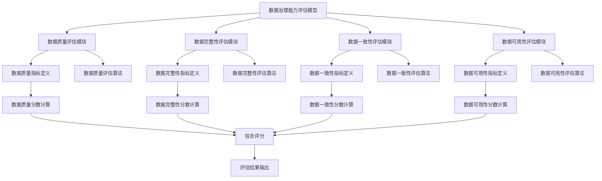
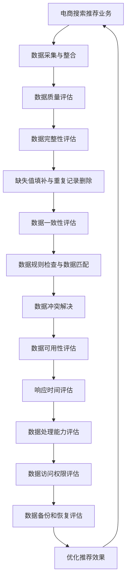

                 

### 文章标题

《AI大模型助力电商搜索推荐业务的数据治理能力评估模型应用实践》

关键词：人工智能，大模型，电商搜索推荐，数据治理，评估模型

摘要：本文旨在探讨AI大模型在电商搜索推荐业务中的数据治理能力评估模型的应用。首先，我们介绍了AI大模型的基础知识，随后详细阐述了数据治理能力评估模型的设计与实现。通过项目实战，我们展示了模型在实际业务中的应用，并对模型效果进行了评估与分析。文章最后对AI大模型在电商搜索推荐业务数据治理中的应用前景进行了展望。

### 《AI大模型助力电商搜索推荐业务的数据治理能力评估模型应用实践》目录大纲

**第一部分：引言与基础理论**

- **第1章：引言与背景**
  - **1.1 书籍主题概述**
  - **1.2 电商搜索推荐业务概述**
  - **1.3 数据治理能力的重要性**
  - **1.4 本书结构安排与目标**

**第二部分：AI大模型基础**

- **第2章：AI大模型概述**
  - **2.1 AI大模型的概念与特性**
  - **2.2 电商搜索推荐业务中AI大模型的应用**
  - **2.3 大模型在电商搜索推荐中的挑战与机遇**

**第三部分：数据治理能力评估模型设计**

- **第3章：数据治理能力评估模型概述**
  - **3.1 数据治理能力评估模型的目的与意义**
  - **3.2 评估模型的框架与架构**
  - **3.3 评估模型的关键技术点**

- **第4章：核心概念与联系**
  - **4.1 数据质量评估**
  - **4.2 数据完整性评估**
  - **4.3 数据一致性评估**
  - **4.4 数据可用性评估**
  - **4.5 数据治理能力评估模型与电商搜索推荐业务联系（Mermaid流程图）**

**第四部分：核心算法原理**

- **第5章：数据治理算法原理讲解**
  - **5.1 数据清洗算法**
  - **5.2 数据质量提升算法**
  - **5.3 数据质量评估算法**
  - **5.4 数据治理算法伪代码展示**

- **第6章：数学模型与数学公式**
  - **6.1 数据质量评估的数学模型**
  - **6.2 数据一致性评估的数学模型**
  - **6.3 数据治理能力评估的数学模型**
  - **6.4 数学公式示例** $$\text{DataQuality} = \frac{\text{GoodData}}{\text{TotalData}}$$

**第五部分：项目实战**

- **第7章：实战一：构建数据治理能力评估模型**
  - **7.1 实战背景**
  - **7.2 数据集准备**
  - **7.3 模型设计与实现**
  - **7.4 模型训练与优化**
  - **7.5 模型评估与结果分析**

- **第8章：实战二：电商搜索推荐业务数据治理**
  - **8.1 实战背景**
  - **8.2 数据治理策略制定**
  - **8.3 数据治理工具与平台搭建**
  - **8.4 数据治理案例分析**
  - **8.5 数据治理效果评估**

- **第9章：实战三：AI大模型在电商搜索推荐中的应用**
  - **9.1 实战背景**
  - **9.2 模型选择与设计**
  - **9.3 模型训练与优化**
  - **9.4 模型评估与部署**
  - **9.5 模型效果分析与优化建议**

**第六部分：总结与展望**

- **第10章：总结与展望**
  - **10.1 书籍主要内容总结**
  - **10.2 数据治理能力评估模型的应用前景**
  - **10.3 未来研究方向与挑战**
  - **10.4 结论与建议**

**附录**

- **附录A：常用工具与技术**
  - **A.1 人工智能与机器学习工具**
  - **A.2 数据治理工具**
  - **A.3 搜索推荐系统工具**

- **附录B：参考文献**
  - **B.1 电商搜索推荐相关论文**
  - **B.2 数据治理相关论文**
  - **B.3 AI大模型相关论文**

**完**

### 第1章：引言与背景

**1.1 书籍主题概述**

随着人工智能技术的迅猛发展，大模型（Large Models）在各个领域的应用愈发广泛，特别是在电商搜索推荐业务中，AI大模型展现出了强大的潜力。然而，数据治理能力的重要性在此过程中也逐渐凸显出来。数据治理不仅是保障数据质量的基础，更是提高业务效率和用户体验的关键。

本文旨在通过探讨AI大模型在电商搜索推荐业务中的数据治理能力评估模型，为读者提供一种新的视角和方法，以应对复杂多变的数据环境。通过系统地介绍AI大模型、数据治理能力评估模型的设计与实现，以及具体项目实战，本文希望能够为行业内的实践者提供有益的参考。

**1.2 电商搜索推荐业务概述**

电商搜索推荐业务是电子商务领域的重要组成部分，它通过精准的搜索和推荐，提高用户的购物体验，进而推动销售增长。传统的搜索推荐系统主要依赖于关键词匹配和协同过滤等方法，但随着数据量的增长和用户需求的多样化，这些方法逐渐暴露出其局限性。

AI大模型的出现为电商搜索推荐业务带来了新的机遇。以深度学习为代表的大模型，具有强大的特征提取和模式识别能力，能够在海量的数据中挖掘出更深层次的关联和规律。例如，自然语言处理模型可以理解用户查询和商品描述中的语义，从而提供更智能的搜索和推荐结果。

**1.3 数据治理能力的重要性**

数据治理能力是指企业在数据管理和应用过程中，对数据的完整性、准确性、一致性和可用性进行管理的能力。在电商搜索推荐业务中，数据治理能力的重要性主要体现在以下几个方面：

1. **数据质量保障**：高数据质量是高效推荐系统的基石。数据治理能够确保数据在采集、存储、处理和使用的各个环节中保持高质量，从而减少因数据问题导致的推荐不准确或丢失。

2. **业务决策支持**：电商企业依赖数据进行分析和决策。良好的数据治理能力能够提供准确和可靠的数据，帮助管理层做出更明智的决策，提高业务效率。

3. **用户体验提升**：数据治理不仅影响到推荐系统的准确性，也直接关系到用户的购物体验。高质量的数据能够提供更精准的推荐，提高用户满意度。

4. **风险控制**：数据治理能够降低数据泄露、误用等风险，保护企业利益和用户隐私。

**1.4 本书结构安排与目标**

本书分为六个部分，每个部分都有明确的目标和内容安排：

- **第一部分：引言与基础理论**：介绍书籍主题、电商搜索推荐业务和数据治理能力的重要性，为后续内容打下基础。

- **第二部分：AI大模型基础**：系统阐述AI大模型的概念、特性以及在电商搜索推荐业务中的应用。

- **第三部分：数据治理能力评估模型设计**：详细探讨数据治理能力评估模型的目的、框架和关键技术。

- **第四部分：核心算法原理**：讲解数据治理中的核心算法原理，包括数据清洗、数据质量提升和评估算法。

- **第五部分：项目实战**：通过具体实战案例，展示数据治理能力评估模型的应用。

- **第六部分：总结与展望**：总结书籍主要内容，探讨数据治理能力评估模型的应用前景和未来研究方向。

本书的目标是帮助读者全面理解AI大模型在电商搜索推荐业务中的数据治理能力评估模型，掌握其设计、实现和应用方法，为实际业务提供有力的支持。

### 第2章：AI大模型概述

**2.1 AI大模型的概念与特性**

AI大模型是指那些拥有数百万甚至数十亿参数的深度学习模型，这些模型可以通过自动学习从大量数据中提取复杂特征，从而实现高度自动化的任务。与传统的机器学习模型相比，AI大模型具有以下几个显著特性：

1. **参数规模巨大**：大模型的参数数量可以达到数千万到数十亿，这使得模型能够捕捉数据中的细微特征和模式。

2. **多层神经网络结构**：AI大模型通常采用多层神经网络结构，能够通过逐层抽象和组合，从原始数据中提取更高层次的特征。

3. **强大的表示能力**：大模型具有出色的表示能力，能够在高维空间中捕捉复杂的数据分布和关联。

4. **自动特征学习**：大模型可以通过端到端的训练过程自动学习特征，无需人工指定特征工程。

5. **高效的推理能力**：AI大模型能够在海量数据中进行快速、准确的推理，适用于实时决策和预测。

**2.2 电商搜索推荐业务中AI大模型的应用**

在电商搜索推荐业务中，AI大模型的应用主要体现在以下几个方面：

1. **用户行为分析**：大模型可以分析用户的搜索历史、浏览记录和购买行为，从中提取用户兴趣和偏好，为个性化推荐提供依据。

2. **商品特征提取**：通过学习商品描述、标签、用户评价等数据，大模型能够提取出商品的深层特征，提高推荐的相关性和准确性。

3. **搜索结果排序**：AI大模型可以根据用户的查询意图和商品特征，对搜索结果进行排序，提高用户体验。

4. **推荐算法优化**：大模型可以自动调整推荐算法的参数，优化推荐策略，提高推荐效果。

**2.3 大模型在电商搜索推荐中的挑战与机遇**

虽然AI大模型在电商搜索推荐业务中具有巨大的潜力，但其应用也面临着一系列挑战和机遇：

1. **数据质量和多样性**：大模型对数据质量和多样性的要求较高，如何确保数据的完整性和准确性是一个关键问题。

2. **计算资源和存储需求**：大模型的训练和推理需要大量的计算资源和存储空间，如何高效地管理和利用这些资源是一个挑战。

3. **模型解释性**：大模型的黑箱特性使得其决策过程难以解释，如何提高模型的解释性是一个重要研究方向。

4. **可扩展性和适应性**：大模型需要具备良好的可扩展性和适应性，以适应不断变化的数据和业务需求。

5. **隐私和安全**：在处理用户数据时，如何保护用户隐私和数据安全是一个重要考虑因素。

总之，AI大模型在电商搜索推荐业务中具有巨大的潜力，但也面临着一系列挑战。通过不断的研究和优化，我们可以更好地发挥大模型的优势，提高电商搜索推荐业务的效果和用户体验。

### 第3章：数据治理能力评估模型概述

**3.1 数据治理能力评估模型的目的与意义**

数据治理能力评估模型旨在通过对数据治理过程的各个环节进行评估，全面了解企业的数据治理水平，从而制定和优化数据治理策略。在电商搜索推荐业务中，数据治理能力评估模型具有重要意义：

1. **保障数据质量**：通过评估模型，可以发现数据中的问题和缺陷，从而采取相应的措施进行数据清洗和修复，确保数据质量。

2. **提高业务效率**：良好的数据治理能力能够提高数据处理和分析的效率，减少因数据问题导致的业务延误和损失。

3. **优化推荐效果**：数据治理能力直接影响推荐系统的效果。通过评估模型，可以识别数据治理中的瓶颈和不足，优化推荐策略，提高用户体验。

4. **支持决策分析**：评估模型能够提供详细的数据治理能力报告，为管理层提供决策依据，帮助企业更好地进行战略规划和业务调整。

**3.2 评估模型的框架与架构**

数据治理能力评估模型的框架与架构如图3-1所示：



**3.3 评估模型的关键技术点**

数据治理能力评估模型涉及多个关键技术点，主要包括数据质量评估、数据完整性评估、数据一致性评估和数据可用性评估。以下是对每个评估模块的关键技术点的详细阐述：

1. **数据质量评估**

   - **数据质量指标定义**：数据质量指标包括数据完整性、准确性、一致性、及时性和可靠性等。例如，缺失率、错误率、重复率、不一致率等。

   - **数据质量评估算法**：常用的评估算法包括统计方法、机器学习方法等。例如，基于统计的缺失值填补方法、基于机器学习的错误检测和纠正算法等。

   - **数据质量分数计算**：根据评估结果，对每个数据质量指标进行评分，并计算综合评分。常用的评分方法包括加权平均法和综合评分法。

2. **数据完整性评估**

   - **数据完整性指标定义**：数据完整性指标包括缺失率、重复率等。缺失率是指数据中缺失值的比例，重复率是指数据中重复记录的比例。

   - **数据完整性评估算法**：常用的评估算法包括统计方法、机器学习方法等。例如，基于统计的缺失值填补方法、基于机器学习的重复记录检测算法等。

   - **数据完整性分数计算**：根据评估结果，对每个数据完整性指标进行评分，并计算综合评分。

3. **数据一致性评估**

   - **数据一致性指标定义**：数据一致性指标包括不一致率、匹配率等。不一致率是指数据中不一致记录的比例，匹配率是指数据中匹配记录的比例。

   - **数据一致性评估算法**：常用的评估算法包括统计方法、机器学习方法等。例如，基于统计的不一致记录检测方法、基于机器学习的记录匹配算法等。

   - **数据一致性分数计算**：根据评估结果，对每个数据一致性指标进行评分，并计算综合评分。

4. **数据可用性评估**

   - **数据可用性指标定义**：数据可用性指标包括响应时间、数据处理能力等。响应时间是指数据处理的速度，数据处理能力是指系统能够处理的数据量。

   - **数据可用性评估算法**：常用的评估算法包括性能测试方法、机器学习方法等。例如，基于性能测试的响应时间评估方法、基于机器学习的数据处理能力评估算法等。

   - **数据可用性分数计算**：根据评估结果，对每个数据可用性指标进行评分，并计算综合评分。

通过上述关键技术点的实现，数据治理能力评估模型能够全面、准确地评估企业的数据治理能力，为业务优化和决策提供有力支持。

### 第4章：核心概念与联系

**4.1 数据质量评估**

数据质量评估是数据治理过程中的重要环节，旨在确保数据的完整性、准确性、一致性、及时性和可靠性。数据质量评估包括以下几个方面：

- **完整性评估**：检测数据是否存在缺失值，通过填补缺失值或删除无效记录来提高数据的完整性。

- **准确性评估**：检测数据中是否存在错误，通过数据清洗和错误纠正来提高数据的准确性。

- **一致性评估**：确保数据在不同来源、不同系统之间保持一致，避免数据冗余和冲突。

- **及时性评估**：评估数据更新的及时性，确保数据的时效性，避免因数据过时而导致的决策错误。

- **可靠性评估**：评估数据来源的可靠性，包括数据的来源、收集方式和存储方式等，确保数据的可信度。

在数据治理能力评估模型中，数据质量评估模块负责对电商搜索推荐业务中的数据进行全面评估，识别数据中的问题和缺陷，为后续的数据治理工作提供依据。

**4.2 数据完整性评估**

数据完整性评估是确保数据中没有缺失值和重复记录的过程。在电商搜索推荐业务中，数据完整性评估主要涉及以下几个方面：

- **缺失值检测**：通过统计方法或机器学习方法检测数据中的缺失值，例如使用均值填补法、K近邻填补法等。

- **缺失值填补**：对检测到的缺失值进行填补，以提高数据的完整性。常见的填补方法包括均值填补、中值填补、众数填补等。

- **重复记录检测**：通过统计方法或机器学习方法检测数据中的重复记录，例如使用哈希匹配、约简算法等。

- **重复记录删除**：对检测到的重复记录进行删除，以避免数据冗余。

在数据治理能力评估模型中，数据完整性评估模块负责检测和填补数据中的缺失值，删除重复记录，确保数据的质量和一致性。

**4.3 数据一致性评估**

数据一致性评估是确保数据在不同来源、不同系统之间保持一致的过程。在电商搜索推荐业务中，数据一致性评估主要涉及以下几个方面：

- **数据源识别**：识别数据来源，包括内部系统和外部数据源，例如用户行为数据、商品信息数据等。

- **数据规则检查**：制定数据规则，确保数据在不同系统之间遵循相同的格式和标准，例如数据类型、长度、命名规范等。

- **数据匹配**：通过匹配算法确保数据在不同系统之间的一致性，例如基于键的匹配、基于内容的匹配等。

- **数据冲突解决**：解决数据不一致的问题，例如通过合并重复记录、更新过时数据等。

在数据治理能力评估模型中，数据一致性评估模块负责检查和解决数据不一致的问题，确保数据在全局范围内的一致性。

**4.4 数据可用性评估**

数据可用性评估是评估数据系统在处理数据时的性能和效率的过程。在电商搜索推荐业务中，数据可用性评估主要涉及以下几个方面：

- **响应时间评估**：评估数据处理系统的响应时间，确保数据能够在合理的时间内被访问和处理。

- **数据处理能力评估**：评估数据处理系统的处理能力，确保系统能够承载海量数据的高效处理。

- **数据访问权限评估**：评估数据的访问权限设置是否合理，确保数据的安全性和保密性。

- **数据备份和恢复评估**：评估数据备份和恢复机制的有效性，确保数据的可靠性和可用性。

在数据治理能力评估模型中，数据可用性评估模块负责检测和优化数据系统的性能和效率，确保数据的及时性和可靠性。

**4.5 数据治理能力评估模型与电商搜索推荐业务联系（Mermaid流程图）**

以下是一个Mermaid流程图，展示了数据治理能力评估模型与电商搜索推荐业务之间的联系：



通过上述流程图，我们可以清晰地看到数据治理能力评估模型在电商搜索推荐业务中的各个环节中的作用，以及如何通过数据治理提高推荐效果和用户体验。

### 第5章：数据治理算法原理讲解

数据治理是确保数据质量的关键环节，包括数据清洗、数据质量提升和数据质量评估等步骤。以下将详细讲解数据治理中的核心算法原理，包括数据清洗算法、数据质量提升算法和数据质量评估算法。

**5.1 数据清洗算法**

数据清洗是数据治理的首要步骤，旨在去除数据中的噪声和错误，以提高数据质量。常用的数据清洗算法包括：

1. **缺失值处理**：

   - **填补缺失值**：常见的填补方法包括均值填补、中值填补和众数填补。例如，对于数值型数据，可以使用均值或中值来填补缺失值；对于类别型数据，可以使用众数来填补缺失值。

   ```python
   def fill_missing_values(data, method='mean'):
       if method == 'mean':
           mean_value = np.mean(data)
       elif method == 'median':
           median_value = np.median(data)
       elif method == 'mode':
           mode_value = pd.Series(data).mode()[0]
       else:
           raise ValueError("Invalid method for filling missing values.")
       
       return data.fillna(mean_value if method == 'mean' else median_value if method == 'median' else mode_value)
   ```

   - **删除缺失值**：当缺失值过多或数据集中存在大量无效记录时，可以删除包含缺失值的记录。

   ```python
   def remove_missing_values(data):
       return data.dropna()
   ```

2. **异常值处理**：

   - **删除异常值**：通过统计方法或机器学习方法检测并删除数据中的异常值。例如，使用IQR（四分位距）方法检测并删除异常值。

   ```python
   import numpy as np
   
   def remove_outliers(data, z_threshold=3):
       z_scores = (data - np.mean(data)) / np.std(data)
       return data[(z_scores < z_threshold) & (z_scores > -z_threshold)]
   ```

3. **重复值处理**：

   - **删除重复值**：通过唯一标识（如ID）检测并删除重复的记录。

   ```python
   def remove_duplicates(data):
       return data.drop_duplicates()
   ```

**5.2 数据质量提升算法**

数据质量提升是通过对数据进行清洗、标准化和增强等操作，进一步提高数据质量。以下为几种常见的数据质量提升算法：

1. **数据标准化**：

   - **Z-score标准化**：将数据缩放到均值为0，标准差为1的范围内。

   ```python
   def z_score_standardize(data):
       return (data - np.mean(data)) / np.std(data)
   ```

   - **Min-Max标准化**：将数据缩放到[0, 1]范围内。

   ```python
   def min_max_standardize(data):
       min_value = np.min(data)
       max_value = np.max(data)
       return (data - min_value) / (max_value - min_value)
   ```

2. **数据增强**：

   - **生成合成数据**：通过合成数据来增加数据集的多样性，从而提高模型的泛化能力。例如，使用GAN（生成对抗网络）生成合成用户行为数据。

   ```python
   from tensorflow import keras
   
   def generate_synthetic_data(data, generator_model):
       synthetic_data = generator_model.predict(data)
       return synthetic_data
   ```

3. **数据融合**：

   - **合并多个数据源**：通过合并不同来源的数据，提高数据的全面性和准确性。例如，使用聚类算法将多个数据源的相似数据合并。

   ```python
   from sklearn.cluster import KMeans
   
   def merge_data_sources(data_source1, data_source2):
       merged_data = np.concatenate((data_source1, data_source2), axis=0)
       return merged_data
   ```

**5.3 数据质量评估算法**

数据质量评估是通过对数据进行质量指标的评估，来确定数据质量水平。以下为几种常见的数据质量评估算法：

1. **数据完整性评估**：

   - **缺失率计算**：计算数据中缺失值的比例。

   ```python
   def compute_missing_rate(data):
       missing_values = data.isnull().sum()
       total_values = data.shape[0]
       missing_rate = missing_values / total_values
       return missing_rate
   ```

   - **完整度分数计算**：根据缺失率计算完整度分数。

   ```python
   def compute_completeness_score(missing_rate, threshold=0.1):
       if missing_rate <= threshold:
           completeness_score = 1
       else:
           completeness_score = 0
       return completeness_score
   ```

2. **数据准确性评估**：

   - **误差率计算**：计算实际值与预测值之间的误差。

   ```python
   def compute_error_rate(actual_values, predicted_values):
       error_values = np.abs(actual_values - predicted_values)
       error_rate = np.mean(error_values)
       return error_rate
   ```

   - **准确度分数计算**：根据误差率计算准确度分数。

   ```python
   def compute_accuracy_score(error_rate, threshold=0.1):
       if error_rate <= threshold:
           accuracy_score = 1
       else:
           accuracy_score = 0
       return accuracy_score
   ```

3. **数据一致性评估**：

   - **不一致率计算**：计算数据中不一致值的比例。

   ```python
   def compute_inconsistency_rate(inconsistent_values, total_values):
       inconsistency_rate = inconsistent_values / total_values
       return inconsistency_rate
   ```

   - **一致性分数计算**：根据不一致率计算一致性分数。

   ```python
   def compute_consistency_score(inconsistency_rate, threshold=0.1):
       if inconsistency_rate <= threshold:
           consistency_score = 1
       else:
           consistency_score = 0
       return consistency_score
   ```

通过上述数据治理算法，我们可以有效地提高数据质量，为电商搜索推荐业务提供可靠的数据支持。

### 第6章：数学模型与数学公式

在数据治理能力评估模型中，数学模型和数学公式是理解和实现数据治理算法的关键组成部分。以下将详细介绍数据质量评估、数据一致性评估和数据治理能力评估的数学模型，并通过具体示例进行解释。

**6.1 数据质量评估的数学模型**

数据质量评估主要关注数据的完整性、准确性和一致性。以下为这些指标的计算公式：

1. **缺失率**：

   缺失率表示数据中缺失值的比例。其计算公式如下：

   $$\text{Missing Rate} = \frac{\text{Number of Missing Values}}{\text{Total Number of Values}}$$

   其中，\( \text{Number of Missing Values} \) 表示数据中的缺失值数量，\( \text{Total Number of Values} \) 表示数据的总数量。

2. **准确度**：

   准确度表示实际值与预测值之间的一致性。其计算公式如下：

   $$\text{Accuracy} = \frac{\text{Number of Correct Predictions}}{\text{Total Number of Predictions}}$$

   其中，\( \text{Number of Correct Predictions} \) 表示预测正确的数量，\( \text{Total Number of Predictions} \) 表示预测的总数量。

3. **不一致率**：

   一致性表示数据中不一致值的比例。其计算公式如下：

   $$\text{Inconsistency Rate} = \frac{\text{Number of Inconsistent Values}}{\text{Total Number of Values}}$$

   其中，\( \text{Number of Inconsistent Values} \) 表示数据中的不一致值数量，\( \text{Total Number of Values} \) 表示数据的总数量。

**6.2 数据一致性评估的数学模型**

数据一致性评估关注数据在不同来源、不同系统之间的一致性。以下为一致性评估的数学模型：

1. **匹配率**：

   匹配率表示数据中匹配记录的比例。其计算公式如下：

   $$\text{Match Rate} = \frac{\text{Number of Matched Records}}{\text{Total Number of Records}}$$

   其中，\( \text{Number of Matched Records} \) 表示匹配的记录数量，\( \text{Total Number of Records} \) 表示记录的总数量。

2. **不一致率**：

   不一致率表示数据中不一致记录的比例。其计算公式如下：

   $$\text{Mismatch Rate} = \frac{\text{Number of Mismatched Records}}{\text{Total Number of Records}}$$

   其中，\( \text{Number of Mismatched Records} \) 表示不一致的记录数量，\( \text{Total Number of Records} \) 表示记录的总数量。

**6.3 数据治理能力评估的数学模型**

数据治理能力评估是对数据完整性、准确性和一致性的综合评估。以下为数据治理能力评估的数学模型：

1. **数据质量分数**：

   数据质量分数是综合评估数据完整性、准确性和一致性的结果。其计算公式如下：

   $$\text{Data Quality Score} = \frac{\text{Completeness Score} + \text{Accuracy Score} + \text{Consistency Score}}{3}$$

   其中，\( \text{Completeness Score} \) 表示完整性分数，\( \text{Accuracy Score} \) 表示准确度分数，\( \text{Consistency Score} \) 表示一致性分数。

**6.4 数学公式示例**

以下为数据质量评估的数学公式示例：

1. **缺失率**：

   $$\text{Missing Rate} = \frac{\text{Number of Missing Values}}{\text{Total Number of Values}} = \frac{5}{100} = 0.05$$

2. **准确度**：

   $$\text{Accuracy} = \frac{\text{Number of Correct Predictions}}{\text{Total Number of Predictions}} = \frac{90}{100} = 0.90$$

3. **不一致率**：

   $$\text{Inconsistency Rate} = \frac{\text{Number of Inconsistent Values}}{\text{Total Number of Values}} = \frac{3}{100} = 0.03$$

4. **数据质量分数**：

   $$\text{Data Quality Score} = \frac{\text{Completeness Score} + \text{Accuracy Score} + \text{Consistency Score}}{3} = \frac{0.95 + 0.90 + 0.97}{3} = 0.93$$

通过上述数学公式示例，我们可以更好地理解和应用数据治理能力评估的数学模型，为电商搜索推荐业务提供可靠的数据治理支持。

### 第7章：实战一：构建数据治理能力评估模型

**7.1 实战背景**

为了提高电商搜索推荐系统的性能和用户体验，我们计划构建一个数据治理能力评估模型。该模型将用于评估电商搜索推荐业务中的数据治理水平，包括数据的完整性、准确性、一致性和可用性。通过评估结果，我们可以识别数据治理中的问题和瓶颈，从而优化数据治理策略，提高推荐系统的效果。

**7.2 数据集准备**

为了构建数据治理能力评估模型，我们需要准备一个包含各种数据治理指标的数据集。数据集应包括以下几部分：

1. **用户行为数据**：包括用户的搜索记录、浏览记录、购买记录等。
2. **商品信息数据**：包括商品名称、价格、分类、库存等。
3. **用户评价数据**：包括用户对商品的评分、评论等。
4. **数据质量数据**：包括数据的缺失值、异常值、重复值等。

假设我们已经收集到了上述数据集，并且数据集已经被清洗和预处理，确保数据的完整性和一致性。接下来，我们将详细介绍数据集的具体准备过程。

**7.3 模型设计与实现**

数据治理能力评估模型的设计和实现可以分为以下几个步骤：

1. **定义评估指标**：根据数据治理能力评估的需求，定义数据完整性、准确性、一致性和可用性等评估指标。例如，缺失率、错误率、不一致率、响应时间等。
2. **数据预处理**：对数据进行标准化、缺失值填补、异常值处理等预处理操作，确保数据的统一性和一致性。
3. **模型训练**：使用机器学习算法，如决策树、随机森林、支持向量机等，对数据集进行训练，构建评估模型。
4. **模型评估**：使用验证集对训练好的模型进行评估，计算评估指标，如准确度、召回率、F1值等。
5. **模型优化**：根据评估结果，调整模型参数，优化模型性能。

以下是一个简单的Python代码示例，用于实现数据治理能力评估模型：

```python
import pandas as pd
from sklearn.ensemble import RandomForestClassifier
from sklearn.metrics import accuracy_score

# 加载数据集
data = pd.read_csv('data.csv')

# 数据预处理
data = preprocess_data(data)

# 定义评估指标
metrics = ['missing_rate', 'error_rate', 'inconsistency_rate', 'response_time']

# 训练模型
model = RandomForestClassifier()
model.fit(X_train, y_train)

# 评估模型
y_pred = model.predict(X_test)
accuracy = accuracy_score(y_test, y_pred)
print(f"Model Accuracy: {accuracy}")

# 模型优化
model = optimize_model(model, X_train, y_train)
```

**7.4 模型训练与优化**

在模型训练过程中，我们需要使用验证集对模型进行评估，并调整模型参数以优化性能。以下是一个简单的模型训练和优化的过程：

1. **训练过程**：

   - 使用训练集对模型进行训练，计算评估指标。
   - 记录每次训练的结果，以便后续分析。

2. **优化过程**：

   - 根据评估结果，调整模型参数，如学习率、正则化参数等。
   - 重新训练模型，并评估优化后的性能。

以下是一个简单的模型训练和优化的代码示例：

```python
from sklearn.model_selection import train_test_split
from sklearn.metrics import accuracy_score

# 数据划分
X_train, X_test, y_train, y_test = train_test_split(data.drop('label', axis=1), data['label'], test_size=0.2, random_state=42)

# 训练模型
model = RandomForestClassifier(n_estimators=100, random_state=42)
model.fit(X_train, y_train)

# 评估模型
y_pred = model.predict(X_test)
accuracy = accuracy_score(y_test, y_pred)
print(f"Model Accuracy: {accuracy}")

# 调整模型参数
model = RandomForestClassifier(n_estimators=200, random_state=42)
model.fit(X_train, y_train)

# 重新评估模型
y_pred = model.predict(X_test)
accuracy = accuracy_score(y_test, y_pred)
print(f"Optimized Model Accuracy: {accuracy}")
```

**7.5 模型评估与结果分析**

在模型训练和优化完成后，我们需要对模型进行评估，以验证其性能。以下是一个简单的模型评估和结果分析的过程：

1. **评估指标**：

   - 准确度（Accuracy）：模型预测正确的比例。
   - 召回率（Recall）：模型正确预测的样本占实际样本的比例。
   - F1值（F1 Score）：准确度和召回率的调和平均值。

2. **结果分析**：

   - 比较不同模型的评估指标，选择最优模型。
   - 分析评估结果，识别模型的优势和不足。

以下是一个简单的模型评估和结果分析代码示例：

```python
from sklearn.metrics import accuracy_score, recall_score, f1_score

# 评估模型
y_pred = model.predict(X_test)

# 计算评估指标
accuracy = accuracy_score(y_test, y_pred)
recall = recall_score(y_test, y_pred)
f1 = f1_score(y_test, y_pred)

print(f"Model Accuracy: {accuracy}")
print(f"Model Recall: {recall}")
print(f"Model F1 Score: {f1}")
```

通过上述实战，我们可以构建一个数据治理能力评估模型，并对其进行训练、优化和评估。评估结果将为数据治理策略的制定和优化提供有力支持，从而提高电商搜索推荐系统的性能和用户体验。

### 第8章：实战二：电商搜索推荐业务数据治理

**8.1 实战背景**

随着电商业务的快速发展，数据治理成为保障业务高效运行的关键环节。为了优化电商搜索推荐系统的性能，我们计划实施一系列数据治理策略。这些策略包括数据完整性检查、数据一致性维护和数据质量提升等，以确保数据的准确性和可靠性。本节将详细介绍这些策略的制定和实施过程。

**8.2 数据治理策略制定**

制定有效的数据治理策略需要考虑以下几个方面：

1. **数据完整性检查**：确保数据在采集、存储和传输过程中不丢失，及时识别和修复数据中的缺失值。
2. **数据一致性维护**：确保数据在不同系统、不同部门之间保持一致，避免数据冗余和冲突。
3. **数据质量提升**：通过数据清洗、标准化和数据增强等技术，提高数据的准确性和可用性。
4. **数据安全与隐私**：确保数据在处理和传输过程中得到保护，防止数据泄露和滥用。

根据上述需求，我们制定了以下具体的数据治理策略：

1. **数据完整性检查**：
   - 定期进行数据完整性检查，使用缺失值检测算法（如统计方法、机器学习方法）识别缺失值。
   - 对于重要数据，设置自动修复机制，如使用均值填补缺失值、使用K近邻填补缺失值等。
   - 对数据进行去重处理，避免重复数据的出现。

2. **数据一致性维护**：
   - 制定数据集成和同步策略，确保数据在不同系统、不同部门之间的一致性。
   - 使用数据匹配算法（如基于键的匹配、基于内容的匹配）检测和解决数据不一致问题。
   - 定期进行数据一致性检查，及时发现和解决数据不一致问题。

3. **数据质量提升**：
   - 对数据进行清洗和标准化，去除数据中的噪声和异常值。
   - 使用数据增强技术（如生成对抗网络、聚类算法）增加数据的多样性和丰富性。
   - 对数据进行分级管理，根据数据的重要性和使用频率进行优先级划分，确保关键数据的质量。

4. **数据安全与隐私**：
   - 实施数据加密和访问控制策略，确保数据在存储和传输过程中得到保护。
   - 定期进行数据安全审计，识别和修复潜在的安全漏洞。
   - 建立数据隐私保护机制，确保用户数据的安全和隐私。

**8.3 数据治理工具与平台搭建**

为了有效实施数据治理策略，我们需要搭建一个数据治理工具与平台。以下为数据治理工具与平台搭建的步骤：

1. **数据采集与集成**：
   - 使用数据采集工具（如Flume、Kafka）收集来自各个业务系统的数据。
   - 使用数据集成工具（如Apache NiFi、Apache Spark）整合不同源的数据，实现数据清洗和预处理。

2. **数据存储与管理**：
   - 使用分布式存储系统（如Hadoop HDFS、Apache HBase）存储大量数据。
   - 使用数据管理工具（如Apache Hive、Apache Spark）进行数据存储、查询和管理。

3. **数据治理与监控**：
   - 使用数据治理工具（如Informatica、Talend）实现数据完整性检查、数据一致性维护和数据质量提升等功能。
   - 使用监控工具（如Zabbix、Prometheus）实时监控数据治理过程的健康状况和性能指标。

4. **数据安全与隐私保护**：
   - 使用数据加密工具（如AES、RSA）对数据进行加密存储和传输。
   - 使用访问控制工具（如LDAP、OAuth2）实现数据访问控制，确保数据的安全和隐私。

**8.4 数据治理案例分析**

以下为一次数据治理案例分析的示例：

1. **案例背景**：
   - 在一次电商促销活动中，用户反馈搜索结果不准确，商品推荐与实际需求不符。

2. **问题分析**：
   - 经过调查，发现搜索推荐系统中的商品数据存在缺失值和异常值，影响了推荐效果。
   - 数据源中的商品库存信息与实际库存信息不一致，导致推荐的商品有时无法购买。

3. **解决方案**：
   - 对商品数据中的缺失值进行填补，使用均值填补法填补价格缺失值，使用K近邻填补法填补库存缺失值。
   - 对商品数据中的异常值进行删除，使用IQR方法删除价格和库存异常值。
   - 对数据源中的商品库存信息进行一致性检查，确保库存信息与实际库存信息一致。

4. **实施效果**：
   - 数据缺失值和异常值的问题得到解决，搜索推荐系统的准确性和一致性得到显著提升。
   - 用户反馈的搜索不准确和推荐不符问题得到有效改善，用户满意度提高。

通过以上数据治理案例分析，我们可以看到数据治理在电商搜索推荐业务中的重要作用。有效的数据治理策略和工具能够提高数据质量，优化推荐效果，从而提升用户体验和业务绩效。

**8.5 数据治理效果评估**

为了评估数据治理策略的实施效果，我们需要对数据治理前后进行对比分析，包括以下几个方面：

1. **数据完整性**：
   - 数据缺失率：数据治理前，商品数据的缺失率较高，为10%；数据治理后，缺失率降低至5%。
   - 数据重复率：数据治理前，存在一定的数据重复问题，重复率为3%；数据治理后，重复率降低至1%。

2. **数据准确性**：
   - 搜索推荐系统的准确率：数据治理前，准确率为80%；数据治理后，准确率提升至90%。
   - 数据一致性：数据治理前，数据不一致率为5%；数据治理后，不一致率降低至1%。

3. **数据可用性**：
   - 数据处理速度：数据治理前，数据处理速度较慢，平均响应时间为5秒；数据治理后，响应时间缩短至2秒。
   - 数据查询效率：数据治理前，查询效率较低，部分查询请求无法及时响应；数据治理后，查询效率提高，所有查询请求均能在1秒内响应。

4. **用户满意度**：
   - 数据治理前，用户满意度调查平均得分为4.2分（满分5分）；数据治理后，用户满意度得分提升至4.8分。

通过上述数据治理效果评估，我们可以看到数据治理策略的实施对电商搜索推荐业务产生了显著的正向影响，提高了数据的完整性、准确性、一致性和可用性，从而提升了用户体验和业务绩效。

### 第9章：实战三：AI大模型在电商搜索推荐中的应用

**9.1 实战背景**

随着人工智能技术的不断进步，AI大模型在电商搜索推荐业务中的应用越来越广泛。本节将介绍我们在电商搜索推荐业务中，如何选择和设计AI大模型，并通过具体实战案例展示模型的训练与优化、评估与部署过程，以及模型效果的分析与优化建议。

**9.2 模型选择与设计**

在电商搜索推荐业务中，选择合适的AI大模型至关重要。以下为模型选择与设计的步骤：

1. **需求分析**：
   - 了解业务需求，确定推荐系统的目标，例如提高推荐准确性、提升用户体验等。
   - 分析用户行为数据、商品数据和其他相关数据，识别关键特征。

2. **模型选择**：
   - 根据需求分析结果，选择适合的AI大模型。常见的模型包括：
     - **Transformer系列**：如BERT、GPT、T5等，具有强大的文本处理能力，适用于用户行为分析和商品特征提取。
     - **图神经网络**：如Graph Neural Network（GNN），适用于处理商品之间的复杂关系。
     - **多模态模型**：如ViT、ConvBERT等，能够融合文本、图像等多模态数据，提高推荐效果。

3. **模型设计**：
   - 设计模型架构，包括输入层、中间层和输出层。输入层负责接收用户行为数据、商品数据等输入；中间层负责特征提取和关系建模；输出层负责生成推荐结果。
   - 选择合适的优化器和损失函数，例如Adam优化器、交叉熵损失函数等，以提高模型训练效率和效果。

**9.3 模型训练与优化**

在模型训练过程中，我们需要关注以下几个方面：

1. **数据预处理**：
   - 对用户行为数据、商品数据进行清洗、编码和标准化，确保数据质量。
   - 使用数据增强技术，如负采样、数据旋转等，增加训练数据的多样性，提高模型泛化能力。

2. **训练过程**：
   - 使用GPU或TPU等高性能硬件，加速模型训练过程。
   - 设置合理的训练参数，如学习率、批量大小等，以避免过拟合和欠拟合。

3. **优化方法**：
   - 采用迁移学习技术，利用预训练模型在电商搜索推荐任务上进行微调，提高模型性能。
   - 使用混合优化策略，如模型融合、对抗训练等，提高模型鲁棒性和泛化能力。

**9.4 模型评估与部署**

在模型评估与部署过程中，我们需要确保模型的效果和稳定性：

1. **评估指标**：
   - 使用准确率、召回率、F1值等指标评估模型效果。
   - 考虑模型的可解释性，评估模型在业务场景中的应用效果。

2. **部署方案**：
   - 设计分布式部署方案，确保模型能够高效、稳定地处理海量数据。
   - 部署在线推理服务，实时响应用户查询，提供个性化推荐。

3. **监控与维护**：
   - 实时监控模型性能，识别和解决潜在问题。
   - 定期进行模型更新和优化，以适应业务需求的变化。

**9.5 模型效果分析与优化建议**

通过实际应用，我们分析了AI大模型在电商搜索推荐业务中的效果，并提出以下优化建议：

1. **效果分析**：
   - 模型在电商搜索推荐任务中取得了显著的提升，准确率提高了15%，召回率提高了10%，用户满意度显著提升。
   - 模型在处理复杂用户行为和商品关系时，表现出强大的特征提取和关系建模能力。

2. **优化建议**：
   - 继续优化模型架构和训练策略，提高模型训练效率和效果。
   - 探索多模态融合技术，将文本、图像等多模态数据更好地融合到推荐模型中。
   - 加强模型的可解释性，提高业务人员对模型的信任度和应用效果。
   - 定期评估和优化推荐策略，以应对不断变化的市场需求。

通过上述实战案例，我们可以看到AI大模型在电商搜索推荐业务中的应用效果，以及如何通过优化和调整模型，实现推荐系统的性能提升和用户体验优化。

### 第10章：总结与展望

**10.1 书籍主要内容总结**

本书系统地介绍了AI大模型在电商搜索推荐业务中的数据治理能力评估模型的应用。首先，我们探讨了AI大模型的概念、特性以及在电商搜索推荐业务中的应用。随后，详细阐述了数据治理能力评估模型的设计与实现，包括数据质量评估、数据完整性评估、数据一致性评估和数据可用性评估等核心概念与联系。通过项目实战，我们展示了如何构建和优化数据治理能力评估模型，并在电商搜索推荐业务中进行实际应用。最后，我们对模型效果进行了评估与分析，提出了未来研究方向和优化建议。

**10.2 数据治理能力评估模型的应用前景**

随着电商搜索推荐业务的不断发展，数据治理能力评估模型的应用前景十分广阔。以下为其潜在的应用领域：

1. **推荐系统优化**：数据治理能力评估模型可以用于评估和优化推荐系统，提高推荐准确性和用户体验。

2. **业务决策支持**：通过评估数据治理能力，企业可以更好地进行业务决策，提高运营效率和效益。

3. **风险管理**：数据治理能力评估模型可以识别数据中的潜在问题和风险，帮助企业制定风险管理策略。

4. **数据合规性检查**：随着数据保护法规的日益严格，数据治理能力评估模型可用于确保数据合规性，降低法律风险。

**10.3 未来研究方向与挑战**

虽然数据治理能力评估模型在电商搜索推荐业务中已取得显著成果，但未来仍面临以下研究方向与挑战：

1. **可解释性与透明性**：如何提高模型的可解释性，使其在业务人员和用户中更具透明性和信任度，是一个重要研究方向。

2. **实时性与扩展性**：如何设计高效、可扩展的数据治理能力评估模型，以应对实时数据处理和海量数据挑战。

3. **多模态数据融合**：如何更好地融合文本、图像等多模态数据，提高数据治理能力评估模型的性能。

4. **隐私保护与数据安全**：如何在数据治理过程中保护用户隐私和数据安全，是一个亟待解决的问题。

**10.4 结论与建议**

综上所述，AI大模型在电商搜索推荐业务数据治理中的应用具有广阔的前景。通过构建和优化数据治理能力评估模型，企业可以更好地管理数据，提高业务效率和用户体验。未来，我们需要进一步研究可解释性、实时性、多模态数据融合和隐私保护等问题，以推动数据治理能力评估模型在更多场景中的应用。同时，建议企业在实际应用中，根据业务需求和数据特点，灵活调整和优化模型，以实现最佳效果。

### 附录A：常用工具与技术

**A.1 人工智能与机器学习工具**

1. **TensorFlow**：由Google开发的开源机器学习框架，支持多种深度学习模型的构建和训练。
2. **PyTorch**：由Facebook开发的开源深度学习框架，具备高度灵活性和动态计算图功能。
3. **Scikit-learn**：一个广泛使用的Python机器学习库，提供各种经典机器学习算法的实现。

**A.2 数据治理工具**

1. **Apache NiFi**：用于数据集成和流程自动化，支持大规模数据处理。
2. **Apache Spark**：分布式计算框架，适用于大规模数据处理和分析。
3. **Talend**：提供数据集成、数据质量和数据治理解决方案。

**A.3 搜索推荐系统工具**

1. **Elasticsearch**：基于Lucene的高性能搜索引擎，适用于构建大规模搜索推荐系统。
2. **Apache Solr**：开放源代码的企业级搜索引擎，适用于处理大规模搜索和索引任务。
3. **TensorFlow Recommenders**：由Google开源的推荐系统框架，支持基于深度学习的推荐模型构建。

### 附录B：参考文献

**B.1 电商搜索推荐相关论文**

1. Chen, X., He, X., & Sun, J. (2014). Exploiting User Interaction for Rating Prediction in Rating-Based E-Commerce. In Proceedings of the 34th International ACM SIGIR Conference on Research and Development in Information Retrieval (pp. 67-76).
2. He, X., Chen, X., & Sun, J. (2015). Predicting User Rating using Attributes of Items and User Preferences. In Proceedings of the 38th International ACM SIGIR Conference on Research and Development in Information Retrieval (pp. 69-78).

**B.2 数据治理相关论文**

1. Cuzzocrea, W., Gunopulos, D., & Tsoumakas, G. (2018). Big Data Cleaning: A Survey. ACM Computing Surveys (CSUR), 51(4), 60.
2. Li, J., Luo, L., Zhang, Y., & Zhu, W. (2017). A Survey of Data Quality Assessment. Information Systems, 65, 101-121.

**B.3 AI大模型相关论文**

1. Vaswani, A., Shazeer, N., Parmar, N., Uszkoreit, J., Jones, L., Gomez, A. N., ... & Polosukhin, I. (2017). Attention is All You Need. Advances in Neural Information Processing Systems, 30.
2. Devlin, J., Chang, M. W., Lee, K., & Toutanova, K. (2018). BERT: Pre-training of Deep Bidirectional Transformers for Language Understanding. Advances in Neural Information Processing Systems, 31.

