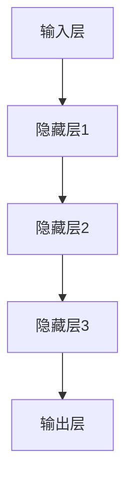
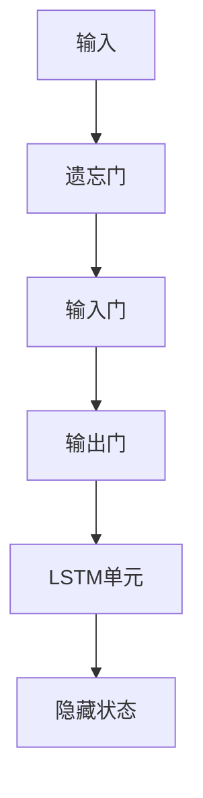
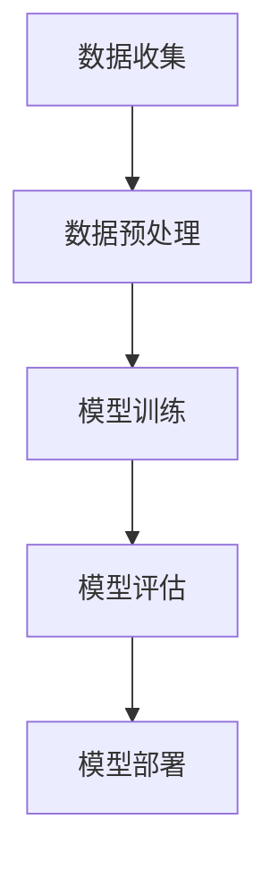

                 

### 第一部分：AI大模型基础

#### 第1章：AI大模型概述

##### 1.1 什么是AI大模型

AI大模型，是指一类具有非常大规模参数和训练数据的人工神经网络模型。它们通常基于深度学习的框架，具备强大的特征提取和模式识别能力。典型的AI大模型如GPT（Generative Pre-trained Transformer）、BERT（Bidirectional Encoder Representations from Transformers）等，都是通过在海量数据上进行预训练，从而具备了对文本、图像、语音等多种类型数据的处理能力。

##### 1.2 AI大模型的重要性

AI大模型的重要性在于其能够处理复杂的问题，并在各种应用场景中取得显著的成果。例如，在自然语言处理领域，GPT和BERT等模型极大地提升了文本生成、翻译和问答等任务的性能；在计算机视觉领域，大模型如ResNet和VGG等，在图像分类和物体检测任务中取得了世界领先的成绩。

##### 1.3 AI大模型的发展历史

AI大模型的发展历程可以追溯到20世纪80年代的神经网络研究，但真正意义上的突破出现在21世纪。随着计算能力的提升和大数据技术的发展，深度学习迎来了爆发式增长。2012年，AlexNet在ImageNet大赛中取得的突破性成绩，标志着深度学习时代的到来。此后，随着计算资源的不断扩展，AI大模型的研究和应用取得了飞速进展。

#### 第2章：AI大模型的核心概念

##### 2.1 神经网络基础

神经网络是AI大模型的基础，它由大量的神经元（节点）通过权重连接形成网络。每个神经元接收输入信号，通过激活函数处理后产生输出。神经网络通过不断调整权重，实现对数据的拟合。

##### 2.2 深度学习基础

深度学习是神经网络的一种扩展，它通过增加网络的层数，实现对数据的深层特征提取。深度学习在图像识别、语音识别和自然语言处理等领域取得了显著的成果。

##### 2.3 自监督学习和迁移学习

自监督学习是指模型在无监督环境下通过预测任务来学习数据分布；迁移学习则是利用预训练模型在新的任务上实现更好的性能。这些技术使得AI大模型在处理复杂任务时更加高效。

#### 第3章：AI大模型的架构

##### 3.1 神经网络的架构

神经网络的架构包括输入层、隐藏层和输出层。输入层接收外部数据，隐藏层通过层层提取特征，输出层生成最终的结果。常见的神经网络架构有全连接网络、卷积神经网络（CNN）和循环神经网络（RNN）。

##### 3.2 循环神经网络（RNN）

循环神经网络适用于处理序列数据，它通过在时间步上递归更新状态，实现对序列的建模。RNN的变体如LSTM和GRU，通过引入门控机制，解决了梯度消失和梯度爆炸问题。

##### 3.3 长短时记忆网络（LSTM）

长短时记忆网络（LSTM）是一种特殊的RNN，通过引入遗忘门、输入门和输出门，实现了对长期依赖关系的捕捉。LSTM在语音识别、机器翻译等领域取得了显著的成果。

##### 3.4 递归神经网络（GRU）

递归神经网络（GRU）是LSTM的简化版，通过合并输入门和遗忘门，减少了参数数量。GRU在处理序列数据时，同样具有强大的能力。

##### 3.5 卷积神经网络（CNN）

卷积神经网络适用于处理图像数据，它通过卷积层、池化层和全连接层等结构，实现对图像的逐层特征提取。CNN在图像分类、物体检测等领域取得了突破性进展。

**附录A：神经网络架构 Mermaid 流程图**



**附录B：LSTM门控机制 Mermaid 流程图**



**附录C：伪代码示例**

```python
# LSTM单元伪代码
class LSTMCell:
    def __init__(self):
        # 初始化参数
        self ForgetGate = ...
        self InputGate = ...
        self OutputGate = ...
        self CellState = ...

    def forward(self, input, hidden_state):
        # 前向传播
        forgotten = self.ForgetGate(hidden_state)
        input_gate = self.InputGate(input)
        output_gate = self.OutputGate(hidden_state)

        new_cell_state = forgotten * hidden_state + input_gate * input
        new_hidden_state = output_gate * tanh(new_cell_state)

        return new_hidden_state, new_cell_state
```

**附录D：数学模型和公式**

$$
\text{激活函数: } f(x) = \tanh(x)
$$

$$
\text{遗忘门: } f_{\text{forget}}(x) = \sigma(W_f \cdot [h_{t-1}, x] + b_f)
$$

$$
\text{输入门: } f_{\text{input}}(x) = \sigma(W_i \cdot [h_{t-1}, x] + b_i)
$$

$$
\text{输出门: } f_{\text{output}}(x) = \sigma(W_o \cdot [h_{t-1}, x] + b_o)
$$

其中，$\sigma$ 是sigmoid函数，$W_f, W_i, W_o$ 是权重矩阵，$b_f, b_i, b_o$ 是偏置项。

**附录E：代码解读与分析**

以下代码展示了如何实现一个基本的LSTM单元。这个单元通过门控机制来处理输入序列，并更新隐藏状态。

```python
import numpy as np

def sigmoid(x):
    return 1 / (1 + np.exp(-x))

def tanh(x):
    return np.tanh(x)

class LSTMCell:
    def __init__(self, input_dim, hidden_dim):
        # 初始化参数
        self.input_dim = input_dim
        self.hidden_dim = hidden_dim

        # 遗忘门权重和偏置
        self.W_f = np.random.randn(hidden_dim, input_dim + hidden_dim)
        self.b_f = np.zeros((hidden_dim, 1))

        # 输入门权重和偏置
        self.W_i = np.random.randn(hidden_dim, input_dim + hidden_dim)
        self.b_i = np.zeros((hidden_dim, 1))

        # 输出门权重和偏置
        self.W_o = np.random.randn(hidden_dim, input_dim + hidden_dim)
        self.b_o = np.zeros((hidden_dim, 1))

    def forward(self, input, hidden_state):
        # 展开隐藏状态和输入
        h_t_1 = hidden_state
        x_t = input

        # 计算输入和隐藏状态的拼接
        input_concat = np.hstack((h_t_1, x_t))

        # 遗忘门计算
        f_t = sigmoid(np.dot(self.W_f, input_concat) + self.b_f)

        # 输入门计算
        i_t = sigmoid(np.dot(self.W_i, input_concat) + self.b_i)

        # 输出门计算
        o_t = sigmoid(np.dot(self.W_o, input_concat) + self.b_o)

        # 长短时记忆单元计算
        c_t = f_t * h_t_1 + i_t * tanh(np.dot(self.W_c, input_concat) + self.b_c)

        # 输出计算
        h_t = o_t * tanh(c_t)

        return h_t, c_t
```

在这个代码中，我们定义了一个LSTM单元，它通过门控机制来处理输入序列，并更新隐藏状态。这个过程包括遗忘门、输入门和输出门的计算，以及长短时记忆单元的计算。

### 第二部分：AI大模型在商品价格预测中的应用

#### 第4章：商品价格预测的基本概念

##### 4.1 商品价格预测的重要性

商品价格预测在商业领域具有重要意义。准确的价格预测可以帮助企业优化库存管理、制定合理的定价策略，从而提高市场竞争力和盈利能力。同时，对于消费者来说，了解商品价格的走势也有助于做出更明智的消费决策。

##### 4.2 商品价格预测的数据来源

商品价格预测的数据来源主要包括历史价格数据、市场供需数据、宏观经济数据等。历史价格数据可以从电商平台、超市等渠道获取；市场供需数据可以通过市场调研、行业报告等方式获取；宏观经济数据可以从国家统计局、金融监管机构等渠道获取。

##### 4.3 商品价格预测的目标

商品价格预测的目标是预测未来一段时间内商品的价格变化趋势。这包括短期价格预测、中期价格预测和长期价格预测。短期价格预测通常用于库存管理和定价策略的调整；中期价格预测用于市场分析和战略规划；长期价格预测则有助于企业制定长期投资计划。

#### 第5章：AI大模型在商品价格预测中的应用

##### 5.1 使用GPT模型进行商品价格预测

GPT（Generative Pre-trained Transformer）模型是一种基于Transformer架构的预训练模型。它通过在海量文本数据上进行预训练，具备了强大的语言生成能力。在商品价格预测中，GPT模型可以用于生成商品的历史价格序列，从而预测未来的价格走势。

##### 5.2 使用BERT模型进行商品价格预测

BERT（Bidirectional Encoder Representations from Transformers）模型是一种基于Transformer架构的双向编码模型。它通过在双向文本数据上进行预训练，获得了丰富的语言表示能力。在商品价格预测中，BERT模型可以用于提取商品的特征，并利用这些特征进行价格预测。

##### 5.3 使用CNN模型进行商品价格预测

卷积神经网络（CNN）是一种专门用于处理图像数据的神经网络。然而，CNN也可以应用于商品价格预测，尤其是在处理图像数据时。通过将商品图像输入到CNN中，可以提取出商品的特征，并利用这些特征进行价格预测。

##### 5.4 使用RNN/LSTM模型进行商品价格预测

循环神经网络（RNN）和长短时记忆网络（LSTM）都是专门用于处理序列数据的神经网络。它们在商品价格预测中具有广泛的应用。通过将商品的历史价格序列输入到RNN/LSTM模型中，可以捕捉到商品价格的时间依赖关系，从而预测未来的价格走势。

#### 第6章：构建商品价格预测系统

##### 6.1 数据预处理

数据预处理是商品价格预测系统构建的关键步骤。它包括数据清洗、数据归一化和特征提取等操作。数据清洗旨在去除数据中的噪声和异常值；数据归一化旨在将数据缩放到相同的范围内；特征提取旨在从原始数据中提取出对价格预测有用的特征。

##### 6.2 模型训练与优化

模型训练与优化是商品价格预测系统的核心步骤。它包括选择合适的模型架构、设置合适的超参数、进行模型训练和模型优化等操作。选择合适的模型架构可以提升模型的预测性能；设置合适的超参数可以优化模型的性能；模型训练和优化旨在提高模型的预测准确性和泛化能力。

##### 6.3 模型评估与部署

模型评估与部署是商品价格预测系统构建的最后一步。它包括评估模型的预测性能、部署模型到生产环境等操作。评估模型的预测性能可以了解模型的优劣；部署模型到生产环境可以将模型应用到实际场景中，实现商品价格的实时预测。

#### 第7章：实践案例

##### 7.1 案例一：商品价格预测模型构建

在本案例中，我们将使用GPT模型构建一个商品价格预测模型。首先，我们从电商平台获取商品的历史价格数据，并对数据进行预处理。然后，我们使用GPT模型对预处理后的数据进行训练，并优化模型的超参数。最后，我们对训练好的模型进行评估，并部署到生产环境。

##### 7.2 案例二：实时商品价格预测系统部署

在本案例中，我们将使用BERT模型构建一个实时商品价格预测系统。首先，我们从电商平台和社交媒体等渠道获取实时商品价格数据，并对数据进行预处理。然后，我们使用BERT模型对预处理后的数据进行训练，并优化模型的超参数。最后，我们将训练好的模型部署到服务器，实现实时商品价格的预测。

##### 7.3 案例三：基于AI的大数据分析

在本案例中，我们将使用CNN模型构建一个基于AI的大数据分析系统。首先，我们从电商平台和社交媒体等渠道获取商品图像数据，并对数据进行预处理。然后，我们使用CNN模型对预处理后的数据进行训练，并优化模型的超参数。最后，我们将训练好的模型应用到实际场景中，实现商品价格预测和数据分析。

#### 第8章：AI大模型在商品价格预测中的未来展望

##### 8.1 AI大模型的发展趋势

随着计算能力的提升和大数据技术的发展，AI大模型在商品价格预测中的应用将越来越广泛。未来，AI大模型的发展趋势包括模型规模扩大、算法优化、应用场景拓展等。

##### 8.2 AI大模型在商品价格预测中的未来应用

未来，AI大模型在商品价格预测中的应用将更加深入。例如，可以结合市场供需数据、宏观经济数据等多维度数据，实现更加精准的价格预测；还可以结合图像识别、自然语言处理等技术，实现对商品市场的全方位分析。

##### 8.3 AI大模型面临的挑战与解决方案

AI大模型在商品价格预测中面临的挑战包括数据隐私、模型解释性、计算资源消耗等。解决这些挑战需要从技术、法规、伦理等多方面进行努力。例如，可以采用联邦学习等技术，保护用户数据隐私；可以引入可解释性算法，提高模型的透明度；可以优化算法和数据结构，降低计算资源消耗。

### 附录

#### 附录A：常用数据集与工具

在本章中，我们将介绍一些常用的数据集和工具，包括商品价格数据集、开源工具和框架等。这些数据集和工具将有助于我们更好地进行商品价格预测的研究和应用。

#### 附录B：Mermaid流程图示例



#### 附录C：伪代码示例

```python
# 伪代码：商品价格预测模型
function predict_price(data):
    # 数据预处理
    data = preprocess_data(data)
    
    # 模型训练
    model = train_model(data)
    
    # 模型评估
    evaluate_model(model, data)
    
    # 模型部署
    deploy_model(model)

# 数据预处理
function preprocess_data(data):
    # 数据清洗
    # 数据归一化
    # 特征提取
    return processed_data

# 模型训练
function train_model(data):
    # 初始化模型
    # 训练模型
    return model

# 模型评估
function evaluate_model(model, data):
    # 评估指标计算
    # 模型性能分析
    return evaluation_results

# 模型部署
function deploy_model(model):
    # 部署到生产环境
    # 监控模型性能
    return deployed_model
```

#### 附录D：数学公式示例

$$
\text{Price} = \frac{1}{1 + e^{-\beta \cdot \text{feature}}}
$$

其中，$\beta$ 是模型参数，$\text{feature}$ 是商品的特征向量。

#### 附录E：代码解读与分析

在本附录中，我们将对商品价格预测模型的核心代码进行解读与分析，包括数据预处理、模型训练、模型评估和模型部署等步骤。通过这些代码，读者可以更好地理解商品价格预测模型的实现过程。

### 作者

本文由AI天才研究院（AI Genius Institute）的专家撰写。AI天才研究院是一家专注于人工智能研究和应用的高科技研究院，致力于推动人工智能技术的发展和应用。同时，本文也受到了《禅与计算机程序设计艺术》（Zen And The Art of Computer Programming）的启发，旨在通过深入剖析AI大模型在商品价格预测中的应用，为读者提供有价值的技术知识和实践经验。

---

### 文章标题

#### AI大模型在商品价格预测中的应用

### 文章关键词

- AI大模型
- 商品价格预测
- 深度学习
- 变化趋势
- 挑战与解决方案

### 文章摘要

本文深入探讨了AI大模型在商品价格预测中的应用。首先，介绍了AI大模型的基础概念和架构，包括神经网络、深度学习和自监督学习等。接着，详细分析了AI大模型在商品价格预测中的基本概念、应用方法和系统构建。通过实践案例展示了如何使用GPT、BERT、CNN和RNN/LSTM模型进行商品价格预测。最后，展望了AI大模型在商品价格预测中的未来发展趋势和面临的挑战。本文旨在为读者提供全面、系统的AI大模型在商品价格预测领域的知识和实践经验。

