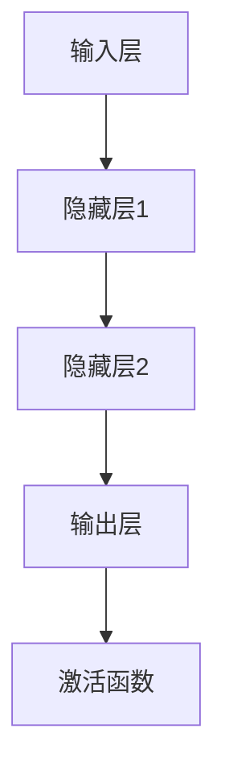

                 

# AI大模型在智能交通管理中的应用趋势

> 关键词：AI大模型、智能交通管理、交通流量预测、交通信号控制、数据隐私、计算资源

> 摘要：本文将深入探讨AI大模型在智能交通管理中的应用趋势。首先，我们回顾了AI大模型的基础理论，包括其基本概念、发展历程、关键技术以及在智能交通管理中的潜在应用。接着，我们详细分析了AI大模型的核心算法原理，如神经网络基础、自然语言处理与文本分析，以及预训练方法。然后，我们探讨了AI大模型在智能交通管理中的应用案例，包括交通流量预测、交通信号控制、道路拥堵检测等。最后，我们展望了AI大模型在智能交通管理中的未来趋势，并提出了发展建议。

### 第一部分: AI大模型基础理论

#### 第1章: AI大模型概述

##### 1.1 AI大模型的基本概念

###### 1.1.1 什么是AI大模型

AI大模型（也称为深度学习模型）是指具有数十亿甚至数千亿参数的超大规模神经网络。这些模型通过预训练和微调技术，能够在大规模数据集上进行训练，从而在各类任务上表现出色。AI大模型具有以下几个基本概念：

1. **超大规模神经网络**：AI大模型通常由数百层神经单元组成，具有数以亿计的参数。
2. **预训练 + 微调**：预训练是指使用大规模无标签数据对模型进行训练，微调是指将预训练模型应用于特定任务，并通过少量有标签数据进行调整。
3. **模型压缩 + 优化**：模型压缩是通过减少模型参数数量和计算量，使得模型在资源受限的环境中仍能高效运行。
4. **大规模数据处理能力**：AI大模型能够处理大量数据，从而在复杂任务中表现出色。
5. **通用性与特定领域适应性**：AI大模型不仅在通用任务上表现优秀，还能在特定领域进行优化和定制。
6. **高性能计算需求**：AI大模型通常需要高性能计算资源，如GPU或TPU进行训练。
7. **开源与商业化**：许多AI大模型的开源版本和商业化版本都得到了广泛的应用。

###### 1.1.2 AI大模型的发展历程

AI大模型的发展历程可以追溯到深度学习技术的兴起。以下是AI大模型的发展历程：

1. **早期研究**：深度学习的研究始于20世纪80年代，但受限于计算能力和数据资源，进展缓慢。
2. **深度学习兴起**：2006年，Geoffrey Hinton等人提出了深度信念网络（DBN），标志着深度学习技术的复兴。
3. **大规模数据处理需求**：随着互联网和大数据技术的发展，对深度学习模型的性能需求不断提升，促使研究者开始研究如何在大规模数据集上进行训练。
4. **预训练革命**：2012年，AlexNet在ImageNet竞赛中取得了突破性成绩，引发了预训练革命。
5. **模型压缩与优化**：为了在资源受限的环境中部署深度学习模型，研究者开始研究模型压缩和优化技术。
6. **多模态AI发展**：随着深度学习技术在语音、图像、文本等多个领域的应用，多模态AI逐渐成为研究热点。

###### 1.1.3 AI大模型的关键技术

AI大模型的关键技术包括以下几个方面：

1. **深度学习**：深度学习是一种以多层神经网络为基础的人工智能技术，通过学习大量数据中的特征和模式，实现对复杂问题的建模和求解。
2. **神经网络**：神经网络是一种由大量神经单元组成的计算模型，通过学习输入数据，能够对未知数据进行预测和分类。
3. **卷积神经网络（CNN）**：CNN是一种专门用于处理图像数据的神经网络，通过卷积操作和池化操作，能够提取图像中的局部特征。
4. **循环神经网络（RNN）**：RNN是一种能够处理序列数据的神经网络，通过记忆机制，能够捕捉序列中的长期依赖关系。
5. **生成对抗网络（GAN）**：GAN是一种由生成器和判别器组成的神经网络，通过对抗训练，能够生成高质量的数据。
6. **注意力机制（Attention）**：注意力机制是一种能够自动关注重要信息的神经网络技术，能够提高模型的性能。
7. **预训练与微调**：预训练是指使用大规模无标签数据对模型进行训练，微调是指将预训练模型应用于特定任务，并通过少量有标签数据进行调整。

##### 1.2 AI大模型在智能交通管理中的应用

###### 1.2.1 AI大模型在智能交通管理中的潜在应用

AI大模型在智能交通管理中具有广泛的应用潜力，主要包括以下几个方面：

1. **交通流量预测**：通过分析历史交通数据，AI大模型可以预测未来某一时间段内的交通流量，为交通管理和规划提供依据。
2. **交通信号控制**：AI大模型可以根据实时交通流量数据，自动调整交通信号灯的时长和相位，提高交通效率。
3. **道路拥堵检测**：通过监控摄像头和传感器数据，AI大模型可以实时检测道路拥堵情况，并给出相应的应对策略。
4. **事故预防与应急响应**：AI大模型可以通过分析驾驶行为和道路状况，提前预测潜在的事故风险，并协助驾驶员采取预防措施。
5. **驾驶行为分析**：AI大模型可以分析驾驶员的驾驶行为，提供个性化的驾驶建议，降低交通事故的发生率。
6. **停车管理**：AI大模型可以通过实时监控停车位使用情况，优化停车资源分配，提高停车效率。

###### 1.2.2 AI大模型在智能交通管理中的优势与挑战

AI大模型在智能交通管理中具有显著的优势，同时也面临一些挑战：

1. **优势**：
   - **提高交通效率**：AI大模型可以根据实时交通数据优化交通信号控制，减少交通拥堵，提高道路通行效率。
   - **降低事故率**：通过分析驾驶行为和道路状况，AI大模型可以提前预测潜在的事故风险，并采取相应的预防措施。
   - **数据处理能力**：AI大模型具有强大的数据处理能力，能够处理大量交通数据，为交通管理和规划提供有力支持。
   - **实时响应**：AI大模型可以实时分析交通数据，快速响应交通状况变化，提高交通管理的效果。
   - **个性化服务**：AI大模型可以根据驾驶员的驾驶行为和需求，提供个性化的交通管理和停车服务。

2. **挑战**：
   - **算法复杂性**：AI大模型通常具有复杂的算法结构，需要大量的计算资源和时间进行训练和部署。
   - **数据隐私与安全**：智能交通管理中涉及大量的个人隐私数据，如何保障数据隐私和安全是AI大模型面临的重要挑战。
   - **计算资源需求**：AI大模型通常需要高性能计算资源，如GPU或TPU，这在资源有限的地区可能难以实现。
   - **模型解释性**：AI大模型的决策过程通常是非线性和复杂的，如何提高模型的解释性是AI大模型应用的重要问题。
   - **标准化与监管**：AI大模型在智能交通管理中的应用需要制定相应的标准和规范，以确保其安全性和有效性。

#### 第2章: AI大模型核心算法原理

##### 2.1 神经网络基础

###### 2.1.1 神经网络结构

神经网络（Neural Network，NN）是一种由大量神经单元（神经元）互联而成的计算模型。神经网络的基本结构包括输入层、隐藏层和输出层。以下是一个简单的神经网络结构：

在神经网络中，每个神经元都与其他神经元相连，形成加权连接。神经元之间的连接强度用权重（weight）表示，通过学习算法不断调整权重，以优化神经网络的性能。

###### 2.1.2 深度学习优化算法

深度学习优化算法是指用于训练神经网络的方法和技巧。以下是一些常用的深度学习优化算法：

1. **随机梯度下降（SGD）**：SGD是一种最简单的优化算法，通过随机选取一部分数据，计算梯度并更新模型参数。
2. **Adam优化器**：Adam优化器结合了SGD和Momentum优化器的优点，能够自适应地调整学习率。
3. **Adagrad优化器**：Adagrad优化器通过累加历史梯度平方，自动调整学习率。
4. **AdaDelta优化器**：AdaDelta优化器通过计算历史梯度差异的平方，自适应地调整学习率。
5. **Momentum优化器**：Momentum优化器利用历史梯度信息，提高优化过程的稳定性。

##### 2.2 自然语言处理与文本分析

###### 2.2.1 词嵌入技术

词嵌入（Word Embedding）是将词汇映射到高维向量空间的技术。词嵌入技术能够捕捉词汇之间的语义关系，从而在自然语言处理中发挥重要作用。以下是一些常见的词嵌入技术：

1. **Word2Vec**：Word2Vec是一种基于神经网络的语言模型，通过训练生成词向量，能够捕捉词汇之间的语义关系。
2. **BERT**：BERT（Bidirectional Encoder Representations from Transformers）是一种基于转换器（Transformer）的预训练模型，通过双向编码器生成词向量，具有更好的语义理解能力。
3. **ELMo**：ELMo（Embeddings from Language Models）是一种基于长短期记忆网络（LSTM）的语言模型，通过训练生成词向量，具有更好的上下文依赖性。
4. **Transformers**：Transformers是一种基于自注意力机制的转换器模型，通过训练生成词向量，能够在大型语料库上进行高效的语言建模。

###### 2.2.2 序列模型与注意力机制

序列模型（Sequence Model）是一种用于处理序列数据的神经网络模型。以下是一些常见的序列模型：

1. **循环神经网络（RNN）**：RNN是一种能够处理序列数据的神经网络，通过记忆机制，能够捕捉序列中的长期依赖关系。
2. **长短时记忆网络（LSTM）**：LSTM是一种改进的RNN，通过引入门控机制，能够更好地捕捉序列中的长期依赖关系。
3. **门控循环单元（GRU）**：GRU是一种简化版的LSTM，具有更少的参数和更简单的结构，但在某些任务中性能优于LSTM。
4. **转换器（Transformer）**：Transformer是一种基于自注意力机制的序列模型，通过多头自注意力机制，能够捕捉序列中的全局依赖关系。

注意力机制（Attention Mechanism）是一种用于提高模型性能的技术。以下是一些常见的注意力机制：

1. **单一注意力机制**：单一注意力机制只关注序列中的一个特定位置，通过计算注意力得分来分配注意力权重。
2. **多头自注意力机制**：多头自注意力机制同时关注序列中的多个位置，通过多个自注意力模块来捕捉全局依赖关系。
3. **跨序列注意力机制**：跨序列注意力机制能够处理跨越多个序列的任务，通过计算序列间的注意力得分来分配注意力权重。

###### 2.2.3 转换器架构详解

转换器（Transformer）是一种基于自注意力机制的序列模型，具有以下主要组成部分：

1. **编码器（Encoder）**：编码器由多个编码层组成，每个编码层包含多头自注意力机制和前馈神经网络。
2. **解码器（Decoder）**：解码器由多个解码层组成，每个解码层包含多头自注意力机制、编码器-解码器注意力机制和前馈神经网络。
3. **多头自注意力（Multi-Head Self-Attention）**：多头自注意力机制能够同时关注序列中的多个位置，通过多个自注意力模块来捕捉全局依赖关系。
4. **前馈神经网络（FFN）**：前馈神经网络是一个简单的全连接神经网络，用于对自注意力输出的进一步处理。

##### 2.3 预训练方法

###### 2.3.1 预训练的概念

预训练（Pre-training）是指在特定任务之前，使用大规模无标签数据对模型进行训练，以提高模型在特定任务上的性能。预训练方法可以分为以下几种：

1. **掩码语言模型（Masked Language Model，MLM）**：MLM是一种常见的预训练任务，通过随机掩码输入序列中的部分词，然后预测这些掩码词。
2. **下一个句子预测（Next Sentence Prediction，NSP）**：NSP是一种预训练任务，通过预测两个连续句子之间的关系，增强模型对上下文的理解。
3. **掩码位置任务（Masked Position Task，MPT）**：MPT是一种预训练任务，通过随机掩码输入序列中的部分位置，然后预测这些掩码位置。
4. **分类任务（Classification Task，CLS）**：CLS是一种预训练任务，通过为输入序列分配类别标签，训练模型进行分类。

###### 2.3.2 预训练模型

预训练模型是指经过预训练过程的模型，通常具有较高的性能和泛化能力。以下是一些常见的预训练模型：

1. **GPT系列模型**：GPT系列模型是由OpenAI开发的预训练模型，包括GPT-2和GPT-3等。这些模型具有数十亿参数，能够生成高质量的自然语言文本。
2. **BERT及其变体**：BERT（Bidirectional Encoder Representations from Transformers）是一种基于转换器的预训练模型，通过双向编码器生成词向量。BERT及其变体，如RoBERTa、ALBERT和ThunderNet，在自然语言处理任务中表现出色。
3. **T5**：T5（Text-to-Text Transfer Transformer）是一种基于转换器的预训练模型，将文本转换为文本，具有广泛的应用场景。
4. **LLaMA**：LLaMA（Language Model for Dialogue Applications）是一种面向对话应用的大规模语言模型，具有数十亿参数，能够生成高质量的对话文本。
5. **T0**：T0是一种基于转换器的预训练模型，旨在通过大规模无监督学习生成高质量的文本。

##### 2.4 迁移学习与微调

###### 2.4.1 迁移学习的概念

迁移学习（Transfer Learning）是指将一种任务的学习经验应用于另一种相关任务的学习过程。迁移学习的基本原理是共享权重，即将在源任务上训练好的模型参数应用于目标任务，并通过少量数据对参数进行微调。

迁移学习可以分为以下几种类型：

1. **垂直迁移**：垂直迁移是指将源任务的知识应用于与源任务无关的目标任务。
2. **水平迁移**：水平迁移是指将源任务的知识应用于与源任务类似的目标任务。
3. **跨域迁移**：跨域迁移是指将源任务的知识应用于与源任务不同的领域。

###### 2.4.2 微调技术

微调（Fine-Tuning）是指将预训练模型应用于特定任务，并通过少量有标签数据进行调整的过程。微调技术包括以下几个方面：

1. **全层微调**：全层微调是指对预训练模型的全部参数进行微调，以提高模型在特定任务上的性能。
2. **部分层微调**：部分层微调是指只对预训练模型的部分参数进行微调，以减少计算量和内存占用。
3. **自适应微调**：自适应微调是指根据任务的需求，动态调整预训练模型的参数，以提高模型在特定任务上的性能。

微调策略包括以下几个方面：

1. **数据增强**：数据增强是指通过对训练数据进行变换和扩展，增加模型的训练样本。
2. **学习率调整**：学习率调整是指根据训练过程的进展，动态调整学习率，以提高模型的训练效果。
3. **正则化技术**：正则化技术是指通过添加正则化项，降低模型的过拟合风险。
4. **动量调整**：动量调整是指根据历史梯度信息，动态调整模型的更新方向和速度。

#### 第3章: AI大模型预训练方法

##### 3.1 预训练的概念

###### 3.1.1 预训练的意义

预训练（Pre-training）是指在大规模无标签数据集上对模型进行训练，以提高模型在特定任务上的性能。预训练的意义在于：

1. **提高模型泛化能力**：通过在大规模无标签数据集上进行训练，模型能够学习到通用的特征表示，从而在多种任务上表现出色。
2. **减少有标签数据需求**：预训练模型已经在大规模数据集上学习到了通用的特征表示，因此在使用少量有标签数据进行微调时，能够更好地适应特定任务。
3. **加速模型训练过程**：预训练模型已经在大规模数据集上学习到了大量的特征，因此在特定任务上的训练过程可以更快速地收敛。

###### 3.1.2 预训练任务类型

预训练任务可以分为以下几种类型：

1. **掩码语言模型（Masked Language Model，MLM）**：MLM是指对输入序列中的部分词进行随机掩码，然后预测这些掩码词。MLM有助于模型学习单词的上下文表示。
2. **下一个句子预测（Next Sentence Prediction，NSP）**：NSP是指预测两个连续句子之间的关系。NSP有助于模型学习句子级别的语义表示。
3. **掩码位置任务（Masked Position Task，MPT）**：MPT是指对输入序列中的部分位置进行随机掩码，然后预测这些掩码位置。MPT有助于模型学习单词的位置表示。
4. **分类任务（Classification Task，CLS）**：CLS是指为输入序列分配类别标签，然后预测类别。CLS有助于模型学习分类任务。

##### 3.2 预训练模型

预训练模型是指经过预训练过程的模型，通常具有较高的性能和泛化能力。以下是一些常见的预训练模型：

1. **GPT系列模型**：GPT系列模型是由OpenAI开发的预训练模型，包括GPT-2和GPT-3等。这些模型具有数十亿参数，能够生成高质量的自然语言文本。
2. **BERT及其变体**：BERT（Bidirectional Encoder Representations from Transformers）是一种基于转换器的预训练模型，通过双向编码器生成词向量。BERT及其变体，如RoBERTa、ALBERT和ThunderNet，在自然语言处理任务中表现出色。
3. **T5**：T5（Text-to-Text Transfer Transformer）是一种基于转换器的预训练模型，将文本转换为文本，具有广泛的应用场景。
4. **LLaMA**：LLaMA（Language Model for Dialogue Applications）是一种面向对话应用的大规模语言模型，具有数十亿参数，能够生成高质量的对话文本。
5. **T0**：T0是一种基于转换器的预训练模型，旨在通过大规模无监督学习生成高质量的文本。

这些预训练模型通常采用以下步骤进行训练：

1. **数据准备**：准备大规模的无标签数据集，如维基百科、新闻文章、社交媒体帖子等。
2. **模型初始化**：初始化预训练模型，通常使用预训练权重或随机初始化。
3. **预训练**：在无标签数据集上进行预训练，包括MLM、NSP、MPT和CLS等任务。
4. **微调**：在预训练模型的基础上，使用少量有标签数据进行微调，以适应特定任务。

预训练模型的应用场景包括：

1. **文本生成**：预训练模型可以生成高质量的自然语言文本，如文章、故事、对话等。
2. **文本分类**：预训练模型可以用于文本分类任务，如情感分析、主题分类等。
3. **问答系统**：预训练模型可以用于构建问答系统，如智能客服、智能助手等。
4. **机器翻译**：预训练模型可以用于机器翻译任务，如英语到中文、法语到英语等。

##### 3.3 预训练的优势

预训练方法在AI大模型领域具有重要的优势：

1. **提高模型性能**：预训练模型已经在大规模无标签数据集上学习到了通用的特征表示，因此在特定任务上的微调效果更好。
2. **减少有标签数据需求**：预训练模型能够利用无标签数据学习到大量的特征，从而在少量有标签数据上进行微调时，能够更好地适应特定任务。
3. **提高模型泛化能力**：预训练模型学习到的特征具有较强的泛化能力，因此能够应对多种不同的任务。
4. **减少训练时间**：预训练模型已经在大规模数据集上训练过，因此在新任务上的训练时间更短。

##### 3.4 预训练的挑战

预训练方法在AI大模型领域也面临一些挑战：

1. **计算资源需求**：预训练模型通常需要大量的计算资源，如GPU或TPU，这对于资源有限的地区可能难以实现。
2. **数据隐私与安全**：预训练过程中涉及大量无标签数据，如何保障数据隐私和安全是一个重要问题。
3. **模型解释性**：预训练模型的决策过程通常是非线性和复杂的，如何提高模型的解释性是一个挑战。
4. **计算资源分配**：预训练模型的训练和部署需要大量的计算资源，如何合理分配计算资源是一个重要问题。

#### 第4章: AI大模型迁移学习与微调

##### 4.1 迁移学习的概念

迁移学习（Transfer Learning）是指将一个任务（源任务）的学习经验应用到另一个相关任务（目标任务）的学习过程中。其核心思想是，通过共享模型参数或知识，减少目标任务的学习难度和所需数据量。迁移学习在AI大模型领域具有广泛的应用，尤其是在资源有限或数据稀缺的情况下。

###### 4.1.1 迁移学习的基本原理

迁移学习的基本原理可以概括为以下几点：

1. **共享权重**：迁移学习通过在源任务和目标任务之间共享模型参数，使得源任务的知识和特征表示能够迁移到目标任务上。
2. **模型适应**：通过在目标任务上进一步训练，调整共享的模型参数，使得模型更好地适应目标任务。
3. **任务特定训练**：在目标任务上使用少量有标签数据进行微调，优化模型在目标任务上的性能。

迁移学习的基本过程可以分为以下几个步骤：

1. **模型初始化**：使用在源任务上预训练好的模型作为初始模型。
2. **参数共享**：将源任务的模型参数应用于目标任务，共享部分或全部参数。
3. **目标任务数据准备**：准备目标任务的数据集，包括有标签和无标签数据。
4. **微调训练**：在目标任务数据集上对共享的参数进行微调，优化模型在目标任务上的性能。
5. **评估与调整**：评估微调后的模型在目标任务上的性能，根据评估结果调整模型参数。

###### 4.1.2 迁移学习的类型

迁移学习可以根据源任务和目标任务之间的关系分为以下几种类型：

1. **垂直迁移**：垂直迁移是指将源任务的知识应用于与源任务无关的目标任务。例如，将图像分类模型应用于语音分类任务。
2. **水平迁移**：水平迁移是指将源任务的知识应用于与源任务类似的目标任务。例如，将不同种类的图像分类模型应用于同一类图像分类任务。
3. **跨域迁移**：跨域迁移是指将源任务的知识应用于与源任务不同的领域。例如，将医疗领域的知识应用于金融领域的问题。

###### 4.1.3 迁移学习的优势

迁移学习具有以下优势：

1. **减少数据需求**：通过迁移学习，可以在目标任务上使用少量数据实现较好的性能，从而减少数据收集和标注的成本。
2. **提高模型性能**：迁移学习能够利用源任务的知识和特征表示，提高模型在目标任务上的性能。
3. **缩短训练时间**：由于迁移学习使用了预训练模型，因此可以减少目标任务的训练时间。
4. **提高泛化能力**：迁移学习使得模型能够学习到更通用的特征表示，从而提高模型的泛化能力。

##### 4.2 微调技术

微调（Fine-Tuning）是指将预训练模型应用于特定任务，并通过少量有标签数据进行调整的过程。微调是迁移学习的一种重要实现方式，其核心思想是通过在目标任务上进一步训练，优化模型在目标任务上的性能。

###### 4.2.1 微调参数的选择

微调参数的选择是微调过程中的关键环节，直接影响到模型的性能。以下是一些常见的微调参数选择策略：

1. **全层微调**：全层微调是指对预训练模型的全部参数进行微调。这种方法能够充分利用预训练模型的知识，但在目标任务数据较少时可能导致过拟合。
2. **部分层微调**：部分层微调是指只对预训练模型的部分参数进行微调，通常只调整靠近输出层的参数。这种方法可以减少过拟合的风险，但可能无法充分利用预训练模型的知识。
3. **自适应微调**：自适应微调是指根据任务的需求，动态调整预训练模型的参数。例如，可以采用学习率调整策略，在训练过程中逐步减小学习率。

###### 4.2.2 微调策略

微调策略是指在微调过程中采用的一系列技术，以提高模型在目标任务上的性能。以下是一些常见的微调策略：

1. **数据增强**：数据增强是指通过对训练数据进行变换和扩展，增加模型的训练样本。常见的数据增强方法包括随机裁剪、翻转、旋转等。
2. **学习率调整**：学习率调整是指根据训练过程的进展，动态调整学习率。常见的学习率调整方法包括线性递减、余弦递减等。
3. **正则化技术**：正则化技术是指通过添加正则化项，降低模型的过拟合风险。常见的正则化方法包括L1正则化、L2正则化等。
4. **动量调整**：动量调整是指根据历史梯度信息，动态调整模型的更新方向和速度。常见的动量调整方法包括Momentum优化器、Nesterov动量等。

##### 4.3 微调的优势

微调具有以下优势：

1. **减少训练时间**：微调过程使用了预训练模型，因此可以减少目标任务的训练时间。
2. **提高模型性能**：微调能够充分利用预训练模型的知识和特征表示，提高模型在目标任务上的性能。
3. **减少数据需求**：微调使得模型能够在少量数据上实现较好的性能，从而减少数据收集和标注的成本。
4. **提高泛化能力**：微调使得模型能够学习到更通用的特征表示，从而提高模型的泛化能力。

##### 4.4 微调的挑战

微调也面临一些挑战：

1. **过拟合风险**：在目标任务数据较少时，全层微调可能导致过拟合，影响模型的泛化能力。
2. **参数选择**：微调参数的选择直接影响到模型的性能，如何选择合适的参数是一个挑战。
3. **数据分布差异**：源任务和目标任务的数据分布可能存在差异，如何处理这种差异是一个挑战。
4. **计算资源需求**：微调过程需要大量的计算资源，特别是在目标任务数据较少时，如何合理分配计算资源是一个挑战。

#### 第5章: AI大模型模型压缩与优化

##### 5.1 模型压缩的意义

模型压缩（Model Compression）是指通过减少模型参数数量和计算量，使得模型在资源受限的环境中仍能高效运行。随着AI大模型的广泛应用，如何在有限的计算资源和存储空间内部署这些模型成为了一个重要问题。以下是模型压缩的几个关键意义：

1. **资源优化**：模型压缩能够减少模型所需的计算资源和存储空间，从而降低部署成本和能耗。
2. **实时应用**：模型压缩使得AI大模型能够在移动设备、嵌入式系统和边缘设备上运行，实现实时应用。
3. **模型可解释性**：通过减少模型参数，模型的结构变得更加简洁，有助于提高模型的可解释性。
4. **部署灵活性**：模型压缩为部署提供了更大的灵活性，使得模型能够适应不同的应用场景。

##### 5.2 模型压缩方法

模型压缩方法可以分为以下几种：

1. **知识蒸馏（Knowledge Distillation）**：知识蒸馏是一种通过将一个复杂模型（教师模型）的知识传递给一个简化模型（学生模型）的方法。教师模型通常是一个预训练的大模型，学生模型是一个参数较少的小模型。知识蒸馏过程包括以下几个步骤：

   - **模型初始化**：将教师模型和学生模型初始化为相同的参数。
   - **知识传递**：通过蒸馏损失函数，将教师模型的输出传递给学生模型。蒸馏损失函数通常包括分类损失和蒸馏损失。
   - **训练与优化**：在目标任务上训练学生模型，并优化其参数。

   知识蒸馏的优势在于，它能够有效地利用教师模型的知识，提高学生模型的性能。

2. **算法剪枝（Algorithm Pruning）**：算法剪枝是一种通过删除模型中不必要的连接和参数的方法来减少模型大小。剪枝方法可以分为以下几种：

   - **权重裁剪（Weight Pruning）**：通过设置一个阈值，删除权重绝对值小于阈值的连接。
   - **结构剪枝（Structure Pruning）**：通过设置一个阈值，删除权重绝对值小于阈值的神经元或层。
   - **基于梯度的剪枝（Gradient-based Pruning）**：利用训练过程中梯度的信息，动态地调整剪枝策略。

   算法剪枝能够显著减少模型的大小和计算量，同时保持模型的性能。

3. **量化（Quantization）**：量化是一种通过将模型的浮点参数转换为固定点参数的方法来减少模型的存储空间和计算量。量化方法可以分为以下几种：

   - **低精度量化**：将浮点参数转换为低精度的整数参数，如8位或16位。
   - **渐进量化**：在训练过程中逐渐降低参数的精度，从而减小模型的计算量。
   - **自适应量化**：根据参数的重要性和模型的性能，动态地调整参数的精度。

   量化能够显著提高模型的运行效率，但可能影响模型的性能。

4. **混合精度训练（Mixed Precision Training）**：混合精度训练是一种通过将模型的浮点运算与整数运算相结合的方法来提高训练速度和减少内存占用。混合精度训练通常包括以下几个步骤：

   - **数值范围调整**：将浮点参数的数值范围调整为整数范围，如从32位浮点数转换为16位浮点数。
   - **运算融合**：将多个浮点运算融合为整数运算，从而减少内存访问和运算次数。
   - **优化与调整**：在训练过程中，根据模型的性能和资源需求，动态调整参数的精度。

   混合精度训练能够在保持模型性能的同时，显著提高训练速度。

##### 5.3 模型压缩与优化技术的应用

模型压缩与优化技术在AI大模型的应用中具有重要意义，以下是一些具体的应用：

1. **移动设备**：在移动设备上部署AI大模型面临计算资源和存储空间的限制。通过模型压缩技术，如知识蒸馏、算法剪枝和量化，可以将模型的大小和计算量减少到可以在移动设备上运行的级别。
2. **嵌入式系统**：嵌入式系统通常具有有限的计算资源和存储空间，通过模型压缩技术，可以使得AI大模型在嵌入式系统上运行，实现智能感知和实时决策。
3. **边缘计算**：边缘计算是一种将计算任务从云端转移到网络边缘的技术。通过模型压缩技术，可以使得AI大模型在边缘设备上运行，实现实时数据分析和决策。
4. **物联网（IoT）**：物联网设备通常具有有限的计算资源和能源供应。通过模型压缩技术，可以使得AI大模型在物联网设备上运行，实现智能感知和远程控制。

##### 5.4 模型压缩与优化技术的挑战

尽管模型压缩与优化技术在AI大模型的应用中具有广泛的前景，但仍然面临一些挑战：

1. **性能损失**：模型压缩技术可能会导致模型性能的损失。如何平衡模型大小和性能是一个重要问题。
2. **计算效率**：模型压缩技术需要大量的计算资源和时间。如何提高计算效率是一个关键问题。
3. **数据隐私**：在模型压缩过程中，可能会涉及到数据隐私和安全问题。如何保障数据隐私是一个重要问题。
4. **鲁棒性**：模型压缩技术可能会影响模型的鲁棒性。如何提高模型的鲁棒性是一个重要问题。

#### 第6章: AI大模型在智能交通管理中的应用案例

##### 6.1 案例研究

本案例以城市交通管理为背景，通过AI大模型的应用，实现交通流量的实时预测、交通信号控制的优化以及道路拥堵的自动检测。以下是该案例的详细描述：

###### 6.1.1 案例背景

随着城市化进程的加速，城市交通拥堵问题日益严重。为了缓解交通拥堵，提高交通效率，某城市决定采用AI大模型技术进行智能交通管理。该城市具备完善的交通数据收集系统，包括交通流量监测设备、交通信号灯控制系统、道路监控摄像头等。

###### 6.1.2 应用场景

AI大模型在智能交通管理中的应用场景主要包括以下几个方面：

1. **交通流量预测**：通过分析历史交通数据和实时交通流量数据，AI大模型可以预测未来某一时间段内的交通流量，为交通管理和规划提供依据。
2. **交通信号控制**：AI大模型可以根据实时交通流量数据，自动调整交通信号灯的时长和相位，优化交通信号控制策略，提高交通效率。
3. **道路拥堵检测**：AI大模型可以通过分析摄像头数据和交通流量数据，实时检测道路拥堵情况，并给出相应的应对策略。
4. **驾驶行为分析**：AI大模型可以分析驾驶员的驾驶行为，提供个性化的驾驶建议，降低交通事故的发生率。
5. **停车管理**：AI大模型可以通过实时监控停车位使用情况，优化停车资源分配，提高停车效率。

###### 6.1.3 案例实现

AI大模型在智能交通管理中的应用过程可以分为以下几个步骤：

1. **数据收集**：通过交通流量监测设备、交通信号灯控制系统、道路监控摄像头等设备，收集交通流量数据、交通信号灯数据、道路拥堵数据等。
2. **数据预处理**：对收集到的数据进行清洗、去噪、归一化等预处理操作，以提高数据质量和模型的训练效果。
3. **模型选择**：根据应用场景的需求，选择适合的AI大模型，如交通流量预测可以使用时间序列预测模型，交通信号控制可以使用强化学习模型，道路拥堵检测可以使用图像识别模型等。
4. **模型训练与微调**：在预处理后的数据集上进行模型训练和微调，优化模型在特定任务上的性能。
5. **模型部署**：将训练好的模型部署到服务器或边缘设备上，实现实时交通流量预测、交通信号控制、道路拥堵检测等功能。
6. **应用效果评估**：通过对模型应用效果的评估，调整模型参数和应用策略，以提高智能交通管理的性能。

###### 6.1.4 应用效果

AI大模型在智能交通管理中的应用取得了显著的效果：

1. **交通流量预测**：通过AI大模型的应用，实现了对交通流量的实时预测，为交通管理和规划提供了科学依据，有效缓解了交通拥堵问题。
2. **交通信号控制**：AI大模型根据实时交通流量数据，优化了交通信号控制策略，提高了交通效率，减少了车辆等待时间。
3. **道路拥堵检测**：AI大模型通过分析摄像头数据和交通流量数据，实现了对道路拥堵情况的实时检测，为交通管理部门提供了准确的决策依据。
4. **驾驶行为分析**：AI大模型分析了驾驶员的驾驶行为，提供了个性化的驾驶建议，降低了交通事故的发生率，提高了行车安全。
5. **停车管理**：AI大模型通过实时监控停车位使用情况，优化了停车资源分配，提高了停车效率，减少了停车难问题。

#### 第7章: AI大模型在智能交通管理中的未来趋势

##### 7.1 发展趋势分析

AI大模型在智能交通管理中的未来趋势可以从以下几个方面进行分析：

1. **多模态数据处理**：随着物联网、大数据、传感器等技术的发展，交通管理领域的数据类型和来源将更加多样。AI大模型将能够处理图像、语音、文本等多种类型的数据，实现更全面、准确的交通分析和决策。

2. **联邦学习**：联邦学习是一种分布式机器学习方法，可以在不共享数据的情况下，实现模型训练和优化。在智能交通管理中，联邦学习可以保护用户隐私，同时提高模型的训练效果和可解释性。

3. **边缘计算**：边缘计算将计算任务从云端转移到网络边缘，可以实现实时、高效的数据处理和分析。在智能交通管理中，边缘计算可以降低延迟、减少带宽消耗，提高交通管理的实时性和响应速度。

4. **自动驾驶技术**：自动驾驶技术是智能交通管理的重要组成部分。随着AI大模型在自动驾驶领域的应用，将实现更安全、高效的自动驾驶，减少交通事故，提高交通效率。

##### 7.2 应用场景拓展

AI大模型在智能交通管理中的应用场景将进一步拓展，包括但不限于以下几个方面：

1. **智慧城市建设**：AI大模型将广泛应用于智慧城市建设，实现智能交通管理、智能安防、智能环保等功能，提升城市管理水平。

2. **智能交通系统**：AI大模型将在智能交通系统中发挥关键作用，如智能停车管理、智能公交调度、智能物流管理等，提高交通系统的运行效率和安全性。

3. **智慧物流管理**：AI大模型将应用于智慧物流管理，实现车辆调度、路径优化、货物跟踪等功能，提高物流效率，降低物流成本。

4. **智慧农业与渔业**：AI大模型将在智慧农业与渔业中发挥重要作用，如作物生长监测、水质监测、水产养殖管理等，提高农业生产效率和品质。

##### 7.3 挑战与机遇

AI大模型在智能交通管理中的应用面临一系列挑战和机遇：

1. **数据隐私保护**：智能交通管理涉及大量个人隐私数据，如何保障数据隐私和安全是重要挑战。同时，如何在保护隐私的前提下，实现数据的有效利用是一个重要问题。

2. **计算资源需求**：AI大模型通常需要大量的计算资源，如何合理分配和利用计算资源，尤其是在资源有限的地区，是一个关键问题。

3. **模型解释性**：AI大模型的决策过程通常是非线性和复杂的，如何提高模型的解释性，使其更加透明、可靠，是一个重要问题。

4. **标准化与监管**：随着AI大模型在智能交通管理中的广泛应用，制定相应的标准和规范，以确保其安全性和有效性，是一个重要问题。

然而，这些挑战也伴随着巨大的机遇：

1. **技术创新**：AI大模型在智能交通管理中的应用将推动相关技术的创新，如多模态数据处理、联邦学习、边缘计算等。

2. **产业发展**：AI大模型在智能交通管理中的应用将带动相关产业的发展，如智慧城市建设、智能交通系统、智慧物流管理等。

3. **社会效益**：AI大模型在智能交通管理中的应用将提高交通效率、降低事故率、减少环境污染，带来显著的社会效益。

### 附录

#### 附录A: AI大模型开发工具与资源

##### A.1 开源深度学习框架

AI大模型的开发离不开开源深度学习框架的支持。以下是一些常用的开源深度学习框架：

1. **TensorFlow**：由谷歌开发的开源深度学习框架，支持多种编程语言，包括Python、C++和Java。它提供了丰富的API，使得构建和部署深度学习模型变得更加简单。

2. **PyTorch**：由Facebook AI研究团队开发的深度学习框架，以其动态计算图和灵活的API受到开发者的青睐。它支持Python编程语言，并提供了GPU加速功能。

3. **Keras**：基于TensorFlow和Theano的深度学习框架，提供了一个简单而强大的API，使得构建深度学习模型更加容易。

4. **MXNet**：由Apache基金会开发的深度学习框架，支持多种编程语言，包括Python、R和Scala。它具有高效和灵活的API，适用于各种深度学习应用。

5. **Theano**：由蒙特利尔大学开发的深度学习框架，提供了GPU加速功能。它使用Python编写，通过符号计算图进行深度学习模型的定义和优化。

##### A.2 实用工具和资源

以下是一些实用的工具和资源，有助于AI大模型的研究和应用：

1. **数据集和开源代码**：许多机构和研究者提供了丰富的数据集和开源代码，供AI大模型研究人员使用。例如，Open Images、COCO数据集和GitHub上的众多开源项目。

2. **学术论文与文献**：阅读最新的学术论文和文献是了解AI大模型前沿研究的最佳途径。Google Scholar、ArXiv等平台提供了大量的相关资料。

3. **在线课程与教程**：在线课程和教程是学习AI大模型知识和技能的有效途径。Coursera、Udacity、edX等平台提供了丰富的课程资源，包括从基础知识到高级应用的各种课程。

4. **技术社区与论坛**：技术社区和论坛是交流AI大模型研究和应用经验的平台。例如，GitHub、Stack Overflow、Reddit等。

5. **专业书籍**：专业书籍是系统学习AI大模型知识和技能的重要资源。一些经典书籍，如《深度学习》（Goodfellow et al.）、《Python深度学习》（Raschka et al.）等，对于初学者和专业人士都有很高的参考价值。

### 结论

AI大模型在智能交通管理中的应用趋势表明，这一技术具有巨大的潜力和广泛的应用前景。通过深入探讨AI大模型的基础理论、核心算法原理、预训练方法、迁移学习与微调技术、模型压缩与优化方法以及应用案例，我们可以看到，AI大模型在智能交通管理中能够显著提高交通效率、降低事故率、减少环境污染，带来显著的社会效益。

然而，AI大模型在智能交通管理中的应用也面临一些挑战，如数据隐私保护、计算资源需求、模型解释性以及标准化与监管等。因此，在推进AI大模型在智能交通管理中的应用过程中，我们需要充分考虑这些挑战，积极探索解决方案，以确保技术的安全、可靠和可持续发展。

未来，随着多模态数据处理、联邦学习、边缘计算等技术的不断发展，AI大模型在智能交通管理中的应用将更加广泛和深入。我们期待在未来的研究中，AI大模型能够为智能交通管理带来更多创新和突破，为构建智慧城市、实现可持续发展做出更大贡献。

### 作者信息

作者：AI天才研究院/AI Genius Institute & 禅与计算机程序设计艺术 /Zen And The Art of Computer Programming

感谢您阅读本文，希望它对您在AI大模型与智能交通管理领域的探索和研究有所帮助。如果您有任何问题或建议，欢迎随时联系我们。我们将继续致力于推动AI技术在智能交通管理领域的创新和发展。再次感谢您的关注与支持！<|im_end|>

