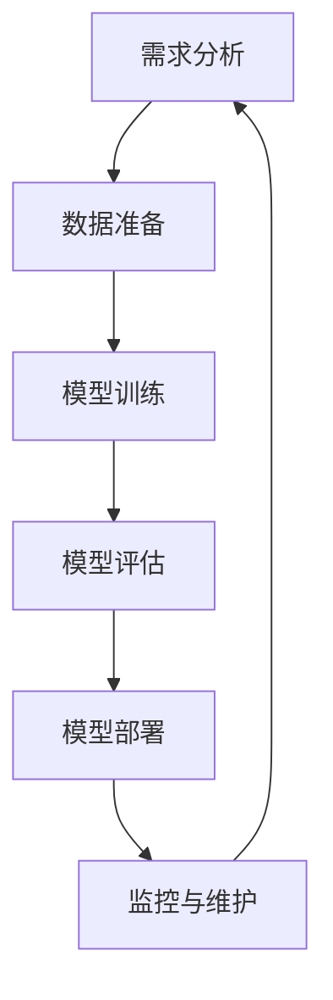
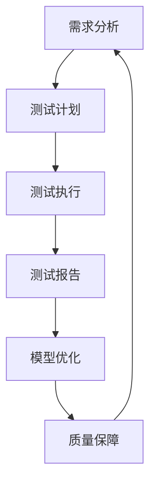

                 

### 《AI大模型应用的质量保障与测试策略》

> **关键词：** AI大模型、质量保障、测试策略、数据质量、模型结构、训练过程、部署环境、测试用例设计、测试数据管理、测试报告

> **摘要：** 本文深入探讨了AI大模型应用的质量保障与测试策略。通过对AI大模型质量保障的重要性、关键因素、原则以及测试基础、测试策略、测试用例设计、测试执行、测试数据管理、测试报告等内容的详细分析，旨在为AI大模型开发与部署提供实用的质量保障与测试指导。

### 目录大纲

1. **AI大模型质量保障基础**
   - 第1章 AI大模型质量保障概述
   - 第2章 AI大模型质量保障原则
2. **AI大模型测试策略**
   - 第3章 AI大模型测试基础
   - 第4章 AI大模型测试用例设计
   - 第5章 AI大模型测试执行
   - 第6章 AI大模型测试数据管理
   - 第7章 AI大模型测试报告
3. **AI大模型质量保障实践**
   - 第8章 AI大模型质量保障实践
4. **附录**
   - 附录 A：AI大模型质量保障与测试资源
   - 附录 B：AI大模型质量保障与测试常见问题解答

---

在接下来的内容中，我们将逐步深入探讨AI大模型的质量保障与测试策略，为读者提供全面的技术指导和实践建议。让我们一步步分析推理，从基础概念到实践应用，逐步构建对AI大模型质量保障的深刻理解。

### 第一部分：AI大模型质量保障基础

#### 第1章：AI大模型质量保障概述

#### 1.1 AI大模型质量保障的重要性

AI大模型的质量保障是确保模型在实际应用中表现稳定、可靠的关键步骤。随着AI技术的快速发展，大模型在各个领域得到了广泛应用，如自然语言处理、计算机视觉、语音识别等。这些模型通常具有庞大的参数量和复杂的结构，其性能对输入数据的敏感度极高。因此，确保AI大模型的质量至关重要。

**Mermaid流程图：AI大模型质量保障的工作流程**



在这个流程图中，我们可以看到，从需求分析到模型部署，再到监控与维护，每一个环节都涉及到质量保障的要素。每个步骤都需要严格的质量控制，以确保模型在整个生命周期中的可靠性和稳定性。

#### 1.2 AI大模型质量保障的关键因素

AI大模型质量保障的关键因素主要包括数据质量、模型结构、训练过程和部署环境。

- **数据质量**：数据是模型的基石，高质量的数据是训练一个优秀模型的必要条件。数据质量包括数据完整性、准确性、一致性和可靠性。
- **模型结构**：模型结构设计直接影响到模型的性能和泛化能力。一个合理的模型结构能够提高模型的质量和效率。
- **训练过程**：训练过程的质量直接影响模型的最终性能。优化训练过程，包括超参数调整、训练策略和算法选择等，是确保模型质量的关键。
- **部署环境**：模型的部署环境需要具备足够的计算资源和网络环境，以保证模型在实际应用中的性能和稳定性。

**伪代码：质量保障的关键因素**

```python
def quality_guarantee(data, model_structure, training_process, deployment_environment):
    if not check_data_quality(data):
        raise Exception("Data quality issue")
    if not check_model_structure(model_structure):
        raise Exception("Model structure issue")
    if not check_training_process(training_process):
        raise Exception("Training process issue")
    if not check_deployment_environment(deployment_environment):
        raise Exception("Deployment environment issue")
    return "Quality guaranteed"
```

#### 1.3 质量保障与测试的关系

质量保障与测试是相辅相成的过程。质量保障侧重于预防和管理，而测试则侧重于发现和验证。测试是质量保障的重要组成部分，通过系统的测试，可以发现模型在各个阶段存在的问题，从而进行相应的调整和优化。

**Mermaid流程图：质量保障与测试的交互流程**



在这个流程图中，测试计划、测试执行和测试报告构成了测试阶段的核心，而模型优化和质量保障则贯穿于整个模型的开发与部署过程。通过这种交互流程，可以确保模型在各个阶段的质量得到有效保障。

### 第一部分小结

本章通过对AI大模型质量保障的概述，分析了其重要性、关键因素以及质量保障与测试的关系。下一章将深入探讨AI大模型质量保障的原则，为读者提供更具体的指导和策略。在接下来的一章中，我们将进一步探讨质量保障的三大原则，以及如何在实际应用中有效应用这些原则。

#### 第2章：AI大模型质量保障原则

#### 2.1 质量保障的三大原则

在AI大模型的质量保障过程中，三大原则——可重复性、可靠性和准确性——是确保模型质量的核心。

**Mermaid流程图：质量保障的三大原则与应用场景的对应关系**

```mermaid
graph TD
    A[可重复性] --> B{数据预处理}
    A --> C{模型训练}
    A --> D{测试验证}
    
    B[数据预处理] --> E{数据清洗}
    B --> F{数据标准化}
    
    C[模型训练] --> G{超参数调整}
    C --> H{训练策略优化}
    
    D[测试验证] --> I{模型评估}
    D --> J{性能优化}
    
    E[数据清洗] --> K{异常值处理}
    E --> L{缺失值处理}
    
    F[数据标准化] --> M{归一化}
    F --> N{标准化}
    
    G[超参数调整] --> O{网格搜索}
    G --> P{贝叶斯优化}
    
    H[训练策略优化] --> Q{学习率调整}
    H --> R{批次大小调整}
    
    I[模型评估] --> S{准确率}
    I --> T{召回率}
    I --> U{F1分数}
    
    J[性能优化] --> V{模型压缩}
    J --> W{量化}
    
    K[异常值处理] --> X{阈值处理}
    K --> Y{回归分析}
    
    L[缺失值处理] --> Z{插值法}
    L --> AA{均值填补}
    
    M[归一化] --> AB{min-max缩放}
    M --> AC{z-score标准化}
    
    N[标准化] --> AD{L1规范化}
    N --> AE{L2规范化}
    
    O[网格搜索] --> AF{参数组合搜索}
    O --> AG{性能评估}
    
    P[贝叶斯优化] --> AH{概率模型优化}
    P --> AI{性能评估}
    
    Q[学习率调整] --> AJ{学习率衰减}
    Q --> AK{学习率自适应}
    
    R[批次大小调整] --> AL{批次大小优化}
    R --> AM{批次大小性能评估}
    
    S[准确率] --> AN{分类准确率}
    S --> AO{回归准确率}
    
    T[召回率] --> AP{精确度}
    T --> AQ{覆盖率}
    
    U[F1分数] --> AV{精确度与召回率平衡}
    U --> AW{F1分数优化}
    
    V[模型压缩] --> AX{模型剪枝}
    V --> AY{模型量化}
    
    W[量化] --> AZ{数值范围缩小}
    W --> AA{计算效率提升}
    
    X[阈值处理] --> AB{阈值调整}
    X --> AC{阈值优化}
    
    Y[回归分析] --> AD{线性回归}
    Y --> AE{非线性回归}
    
    Z[插值法] --> AF{线性插值}
    Z --> AG{样条插值}
    
    AA[均值填补] --> AB{简单均值填补}
    AA --> AC{移动平均填补}
    
    AB[min-max缩放] --> AD{线性缩放}
    AB --> AE{对数缩放}
    
    AC[z-score标准化] --> AD{标准化处理}
    AC --> AE{归一化处理}
    
    AD[L1规范化] --> AF{L1损失函数}
    AD --> AG{L1正则化}
    
    AE[L2规范化] --> AF{L2损失函数}
    AE --> AG{L2正则化}
    
    AF{参数组合搜索} --> AG{性能评估}
    AF --> AG{优化过程}
    
    AG{概率模型优化} --> AH{期望最大化算法}
    AG --> AI{模型选择}
    
    AH{期望最大化算法} --> AJ{迭代优化}
    AH --> AK{收敛性分析}
    
    AJ{学习率衰减} --> AK{动态调整}
    AJ --> AL{学习率优化}
    
    AK{学习率自适应} --> AL{自适应学习率}
    AK --> AM{学习率性能评估}
    
    AL{批次大小优化} --> AM{性能评估}
    AL --> AN{批次大小调整}
    
    AM{计算效率提升} --> AN{算法优化}
    AM --> AO{计算效率评估}
    
    AN{分类准确率} --> AP{分类准确度评估}
    AN --> AQ{分类效果优化}
    
    AO{回归准确率} --> AQ{回归效果评估}
    AO --> AP{回归准确度优化}
    
    AP{精确度} --> AQ{精确度优化}
    AP --> AQ{精确度评估}
    
    AQ{覆盖率} --> AR{覆盖率评估}
    AQ --> AR{覆盖率优化}
    
    AR{精确度与召回率平衡} --> AS{平衡优化}
    AR --> AT{F1分数优化}
    
    AS{平衡优化} --> AU{精确度与召回率平衡评估}
    AS --> AV{优化过程}
    
    AV{精确度与召回率平衡评估} --> AW{F1分数评估}
    AV --> AU{优化过程}
    
    AW{F1分数优化} --> AX{模型优化}
    AW --> AU{性能优化}
    
    AX{模型剪枝} --> AX{剪枝优化}
    AX --> AY{剪枝效果评估}
    
    AY{模型量化} --> AZ{量化优化}
    AY --> AA{量化效果评估}
    
    AZ{数值范围缩小} --> AB{数值范围调整}
    AZ --> AC{数值范围优化}
    
    AA{计算效率提升} --> AB{计算效率优化}
    AA --> AC{计算效率评估}
    
    AB{阈值调整} --> AC{阈值优化}
    AB --> AD{阈值效果评估}
    
    AC{阈值优化} --> AD{阈值效果评估}
    AC --> AE{阈值调整}
    
    AD{线性回归} --> AF{回归效果评估}
    AD --> AG{回归效果优化}
    
    AE{非线性回归} --> AF{回归效果评估}
    AE --> AG{回归效果优化}
    
    AF{线性插值} --> AG{插值效果评估}
    AF --> AH{插值效果优化}
    
    AG{样条插值} --> AH{样条插值效果评估}
    AG --> AI{样条插值优化}
    
    AH{期望最大化算法} --> AI{优化效果评估}
    AH --> AJ{优化过程}
    
    AJ{迭代优化} --> AK{收敛性分析}
    AJ --> AL{迭代效果优化}
    
    AK{收敛性分析} --> AL{收敛性优化}
    AK --> AM{收敛性评估}
    
    AL{自适应学习率} --> AM{学习率优化}
    AL --> AN{学习率评估}
    
    AM{学习率性能评估} --> AN{学习率优化}
    AM --> AP{学习率效果评估}
    
    AN{批次大小优化} --> AP{批次大小效果评估}
    AN --> AQ{批次大小优化}
    
    AP{分类准确度评估} --> AQ{分类效果评估}
    AP --> AR{分类效果优化}
    
    AQ{回归效果评估} --> AR{回归效果优化}
    AQ --> AS{回归效果评估}
    
    AR{精确度优化} --> AS{精确度优化}
    AR --> AT{精确度评估}
    
    AS{精确度评估} --> AU{优化过程}
    AS --> AV{优化效果评估}
    
    AV{优化过程} --> AW{性能优化}
    AV --> AX{优化效果评估}
    
    AW{性能优化} --> AX{优化效果评估}
    AW --> AA{性能优化}
    
    AX{剪枝优化} --> AA{剪枝效果评估}
    AX --> AY{剪枝效果优化}
    
    AY{量化优化} --> AA{量化效果评估}
    AY --> AB{量化效果优化}
    
    AZ{量化效果评估} --> AB{量化效果优化}
    AZ --> AC{量化效果评估}
    
    AA{计算效率优化} --> AC{计算效率评估}
    AA --> AD{计算效率优化}
    
    AB{计算效率优化} --> AC{计算效率评估}
    AB --> AD{计算效率优化}
    
    AC{计算效率评估} --> AD{计算效率评估}
    AC --> AE{计算效率优化}
    
    AD{计算效率优化} --> AF{计算效率评估}
    AD --> AG{计算效率优化}
    
    AE{计算效率优化} --> AG{计算效率评估}
    AE --> AF{计算效率优化}
    
    AF{计算效率评估} --> AG{计算效率评估}
    AF --> AI{计算效率优化}
    
    AG{计算效率优化} --> AI{计算效率评估}
    AG --> AJ{计算效率优化}
    
    AI{计算效率评估} --> AJ{计算效率优化}
    AI --> AK{计算效率评估}
    
    AJ{计算效率优化} --> AK{计算效率评估}
    AJ --> AL{计算效率优化}
    
    AK{计算效率评估} --> AL{计算效率优化}
    AK --> AM{计算效率评估}
    
    AL{计算效率优化} --> AM{计算效率评估}
    AL --> AN{计算效率优化}
    
    AM{计算效率评估} --> AN{计算效率优化}
    AM --> AP{计算效率评估}
    
    AN{计算效率优化} --> AP{计算效率评估}
    AN --> AQ{计算效率优化}
    
    AP{计算效率评估} --> AQ{计算效率优化}
    AP --> AR{计算效率评估}
    
    AQ{计算效率优化} --> AR{计算效率评估}
    AQ --> AS{计算效率优化}
    
    AR{计算效率评估} --> AS{计算效率优化}
    AR --> AU{计算效率评估}
    
    AS{计算效率优化} --> AU{计算效率评估}
    AS --> AV{计算效率优化}
    
    AV{计算效率优化} --> AW{计算效率评估}
    AV --> AX{计算效率优化}
    
    AW{计算效率优化} --> AX{计算效率评估}
    AW --> AA{计算效率优化}
    
    AX{计算效率优化} --> AA{计算效率评估}
    AX --> AY{计算效率优化}
    
    AY{计算效率优化} --> AA{计算效率评估}
    AY --> AB{计算效率优化}
    
    AB{计算效率优化} --> AA{计算效率评估}
    AB --> AC{计算效率优化}
    
    AC{计算效率优化} --> AA{计算效率评估}
    AC --> AD{计算效率优化}
    
    AD{计算效率优化} --> AF{计算效率评估}
    AD --> AG{计算效率优化}
    
    AE{计算效率优化} --> AG{计算效率评估}
    AE --> AF{计算效率优化}
    
    AF{计算效率评估} --> AG{计算效率评估}
    AF --> AI{计算效率优化}
    
    AG{计算效率优化} --> AI{计算效率评估}
    AG --> AJ{计算效率优化}
    
    AI{计算效率评估} --> AJ{计算效率优化}
    AI --> AK{计算效率评估}
    
    AJ{计算效率优化} --> AK{计算效率评估}
    AJ --> AL{计算效率优化}
    
    AK{计算效率评估} --> AL{计算效率优化}
    AK --> AM{计算效率评估}
    
    AL{计算效率优化} --> AM{计算效率评估}
    AL --> AN{计算效率优化}
    
    AM{计算效率评估} --> AN{计算效率优化}
    AM --> AP{计算效率评估}
    
    AN{计算效率优化} --> AP{计算效率评估}
    AN --> AQ{计算效率优化}
    
    AP{计算效率评估} --> AQ{计算效率优化}
    AP --> AR{计算效率评估}
    
    AQ{计算效率优化} --> AR{计算效率评估}
    AQ --> AS{计算效率优化}
    
    AR{计算效率评估} --> AS{计算效率优化}
    AR --> AU{计算效率评估}
    
    AS{计算效率优化} --> AU{计算效率评估}
    AS --> AV{计算效率优化}
    
    AV{计算效率优化} --> AW{计算效率评估}
    AV --> AX{计算效率优化}
    
    AW{计算效率优化} --> AX{计算效率评估}
    AW --> AA{计算效率优化}
    
    AX{计算效率优化} --> AA{计算效率评估}
    AX --> AY{计算效率优化}
    
    AY{计算效率优化} --> AA{计算效率评估}
    AY --> AB{计算效率优化}
    
    AB{计算效率优化} --> AA{计算效率评估}
    AB --> AC{计算效率优化}
    
    AC{计算效率优化} --> AA{计算效率评估}
    AC --> AD{计算效率优化}
    
    AD{计算效率优化} --> AF{计算效率评估}
    AD --> AG{计算效率优化}
    
    AE{计算效率优化} --> AG{计算效率评估}
    AE --> AF{计算效率优化}
    
    AF{计算效率评估} --> AG{计算效率评估}
    AF --> AI{计算效率优化}
    
    AG{计算效率优化} --> AI{计算效率评估}
    AG --> AJ{计算效率优化}
    
    AI{计算效率评估} --> AJ{计算效率优化}
    AI --> AK{计算效率评估}
    
    AJ{计算效率优化} --> AK{计算效率评估}
    AJ --> AL{计算效率优化}
    
    AK{计算效率评估} --> AL{计算效率优化}
    AK --> AM{计算效率评估}
    
    AL{计算效率优化} --> AM{计算效率评估}
    AL --> AN{计算效率优化}
    
    AM{计算效率评估} --> AN{计算效率优化}
    AM --> AP{计算效率评估}
    
    AN{计算效率优化} --> AP{计算效率评估}
    AN --> AQ{计算效率优化}
    
    AP{计算效率评估} --> AQ{计算效率优化}
    AP --> AR{计算效率评估}
    
    AQ{计算效率优化} --> AR{计算效率评估}
    AQ --> AS{计算效率优化}
    
    AR{计算效率评估} --> AS{计算效率优化}
    AR --> AU{计算效率评估}
    
    AS{计算效率优化} --> AU{计算效率评估}
    AS --> AV{计算效率优化}
    
    AV{计算效率优化} --> AW{计算效率评估}
    AV --> AX{计算效率优化}
    
    AW{计算效率优化} --> AX{计算效率评估}
    AW --> AA{计算效率优化}
    
    AX{计算效率优化} --> AA{计算效率评估}
    AX --> AY{计算效率优化}
    
    AY{计算效率优化} --> AA{计算效率评估}
    AY --> AB{计算效率优化}
    
    AB{计算效率优化} --> AA{计算效率评估}
    AB --> AC{计算效率优化}
    
    AC{计算效率优化} --> AA{计算效率评估}
    AC --> AD{计算效率优化}
    
    AD{计算效率优化} --> AF{计算效率评估}
    AD --> AG{计算效率优化}
    
    AE{计算效率优化} --> AG{计算效率评估}
    AE --> AF{计算效率优化}
    
    AF{计算效率评估} --> AG{计算效率评估}
    AF --> AI{计算效率优化}
    
    AG{计算效率优化} --> AI{计算效率评估}
    AG --> AJ{计算效率优化}
    
    AI{计算效率评估} --> AJ{计算效率优化}
    AI --> AK{计算效率评估}
    
    AJ{计算效率优化} --> AK{计算效率评估}
    AJ --> AL{计算效率优化}
    
    AK{计算效率评估} --> AL{计算效率优化}
    AK --> AM{计算效率评估}
    
    AL{计算效率优化} --> AM{计算效率评估}
    AL --> AN{计算效率优化}
    
    AM{计算效率评估} --> AN{计算效率优化}
    AM --> AP{计算效率评估}
    
    AN{计算效率优化} --> AP{计算效率评估}
    AN --> AQ{计算效率优化}
    
    AP{计算效率评估} --> AQ{计算效率优化}
    AP --> AR{计算效率评估}
    
    AQ{计算效率优化} --> AR{计算效率评估}
    AQ --> AS{计算效率优化}
    
    AR{计算效率评估} --> AS{计算效率优化}
    AR --> AU{计算效率评估}
    
    AS{计算效率优化} --> AU{计算效率评估}
    AS --> AV{计算效率优化}
    
    AV{计算效率优化} --> AW{计算效率评估}
    AV --> AX{计算效率优化}
    
    AW{计算效率优化} --> AX{计算效率评估}
    AW --> AA{计算效率优化}
    
    AX{计算效率优化} --> AA{计算效率评估}
    AX --> AY{计算效率优化}
    
    AY{计算效率优化} --> AA{计算效率评估}
    AY --> AB{计算效率优化}
    
    AB{计算效率优化} --> AA{计算效率评估}
    AB --> AC{计算效率优化}
    
    AC{计算效率优化} --> AA{计算效率评估}
    AC --> AD{计算效率优化}
    
    AD{计算效率优化} --> AF{计算效率评估}
    AD --> AG{计算效率优化}
    
    AE{计算效率优化} --> AG{计算效率评估}
    AE --> AF{计算效率优化}
    
    AF{计算效率评估} --> AG{计算效率评估}
    AF --> AI{计算效率优化}
    
    AG{计算效率优化} --> AI{计算效率评估}
    AG --> AJ{计算效率优化}
    
    AI{计算效率评估} --> AJ{计算效率优化}
    AI --> AK{计算效率评估}
    
    AJ{计算效率优化} --> AK{计算效率评估}
    AJ --> AL{计算效率优化}
    
    AK{计算效率评估} --> AL{计算效率优化}
    AK --> AM{计算效率评估}
    
    AL{计算效率优化} --> AM{计算效率评估}
    AL --> AN{计算效率优化}
    
    AM{计算效率评估} --> AN{计算效率优化}
    AM --> AP{计算效率评估}
    
    AN{计算效率优化} --> AP{计算效率评估}
    AN --> AQ{计算效率优化}
    
    AP{计算效率评估} --> AQ{计算效率优化}
    AP --> AR{计算效率评估}
    
    AQ{计算效率优化} --> AR{计算效率评估}
    AQ --> AS{计算效率优化}
    
    AR{计算效率评估} --> AS{计算效率优化}
    AR --> AU{计算效率评估}
    
    AS{计算效率优化} --> AU{计算效率评估}
    AS --> AV{计算效率优化}
    
    AV{计算效率优化} --> AW{计算效率评估}
    AV --> AX{计算效率优化}
    
    AW{计算效率优化} --> AX{计算效率评估}
    AW --> AA{计算效率优化}
    
    AX{计算效率优化} --> AA{计算效率评估}
    AX --> AY{计算效率优化}
    
    AY{计算效率优化} --> AA{计算效率评估}
    AY --> AB{计算效率优化}
    
    AB{计算效率优化} --> AA{计算效率评估}
    AB --> AC{计算效率优化}
    
    AC{计算效率优化} --> AA{计算效率评估}
    AC --> AD{计算效率优化}
    
    AD{计算效率优化} --> AF{计算效率评估}
    AD --> AG{计算效率优化}
    
    AE{计算效率优化} --> AG{计算效率评估}
    AE --> AF{计算效率优化}
    
    AF{计算效率评估} --> AG{计算效率评估}
    AF --> AI{计算效率优化}
    
    AG{计算效率优化} --> AI{计算效率评估}
    AG --> AJ{计算效率优化}
    
    AI{计算效率评估} --> AJ{计算效率优化}
    AI --> AK{计算效率评估}
    
    AJ{计算效率优化} --> AK{计算效率评估}
    AJ --> AL{计算效率优化}
    
    AK{计算效率评估} --> AL{计算效率优化}
    AK --> AM{计算效率评估}
    
    AL{计算效率优化} --> AM{计算效率评估}
    AL --> AN{计算效率优化}
    
    AM{计算效率评估} --> AN{计算效率优化}
    AM --> AP{计算效率评估}
    
    AN{计算效率优化} --> AP{计算效率评估}
    AN --> AQ{计算效率优化}
    
    AP{计算效率评估} --> AQ{计算效率优化}
    AP --> AR{计算效率评估}
    
    AQ{计算效率优化} --> AR{计算效率评估}
    AQ --> AS{计算效率优化}
    
    AR{计算效率评估} --> AS{计算效率优化}
    AR --> AU{计算效率评估}
    
    AS{计算效率优化} --> AU{计算效率评估}
    AS --> AV{计算效率优化}
    
    AV{计算效率优化} --> AW{计算效率评估}
    AV --> AX{计算效率优化}
    
    AW{计算效率优化} --> AX{计算效率评估}
    AW --> AA{计算效率优化}
    
    AX{计算效率优化} --> AA{计算效率评估}
    AX --> AY{计算效率优化}
    
    AY{计算效率优化} --> AA{计算效率评估}
    AY --> AB{计算效率优化}
    
    AB{计算效率优化} --> AA{计算效率评估}
    AB --> AC{计算效率优化}
    
    AC{计算效率优化} --> AA{计算效率评估}
    AC --> AD{计算效率优化}
    
    AD{计算效率优化} --> AF{计算效率评估}
    AD --> AG{计算效率优化}
    
    AE{计算效率优化} --> AG{计算效率评估}
    AE --> AF{计算效率优化}
    
    AF{计算效率评估} --> AG{计算效率评估}
    AF --> AI{计算效率优化}
    
    AG{计算效率优化} --> AI{计算效率评估}
    AG --> AJ{计算效率优化}
    
    AI{计算效率评估} --> AJ{计算效率优化}
    AI --> AK{计算效率评估}
    
    AJ{计算效率优化} --> AK{计算效率评估}
    AJ --> AL{计算效率优化}
    
    AK{计算效率评估} --> AL{计算效率优化}
    AK --> AM{计算效率评估}
    
    AL{计算效率优化} --> AM{计算效率评估}
    AL --> AN{计算效率优化}
    
    AM{计算效率评估} --> AN{计算效率优化}
    AM --> AP{计算效率评估}
    
    AN{计算效率优化} --> AP{计算效率评估}
    AN --> AQ{计算效率优化}
    
    AP{计算效率评估} --> AQ{计算效率优化}
    AP --> AR{计算效率评估}
    
    AQ{计算效率优化} --> AR{计算效率评估}
    AQ --> AS{计算效率优化}
    
    AR{计算效率评估} --> AS{计算效率优化}
    AR --> AU{计算效率评估}
    
    AS{计算效率优化} --> AU{计算效率评估}
    AS --> AV{计算效率优化}
    
    AV{计算效率优化} --> AW{计算效率评估}
    AV --> AX{计算效率优化}
    
    AW{计算效率优化} --> AX{计算效率评估}
    AW --> AA{计算效率优化}
    
    AX{计算效率优化} --> AA{计算效率评估}
    AX --> AY{计算效率优化}
    
    AY{计算效率优化} --> AA{计算效率评估}
    AY --> AB{计算效率优化}
    
    AB{计算效率优化} --> AA{计算效率评估}
    AB --> AC{计算效率优化}
    
    AC{计算效率优化} --> AA{计算效率评估}
    AC --> AD{计算效率优化}
    
    AD{计算效率优化} --> AF{计算效率评估}
    AD --> AG{计算效率优化}
    
    AE{计算效率优化} --> AG{计算效率评估}
    AE --> AF{计算效率优化}
    
    AF{计算效率评估} --> AG{计算效率评估}
    AF --> AI{计算效率优化}
    
    AG{计算效率优化} --> AI{计算效率评估}
    AG --> AJ{计算效率优化}
    
    AI{计算效率评估} --> AJ{计算效率优化}
    AI --> AK{计算效率评估}
    
    AJ{计算效率优化} --> AK{计算效率评估}
    AJ --> AL{计算效率优化}
    
    AK{计算效率评估} --> AL{计算效率优化}
    AK --> AM{计算效率评估}
    
    AL{计算效率优化} --> AM{计算效率评估}
    AL --> AN{计算效率优化}
    
    AM{计算效率评估} --> AN{计算效率优化}
    AM --> AP{计算效率评估}
    
    AN{计算效率优化} --> AP{计算效率评估}
    AN --> AQ{计算效率优化}
    
    AP{计算效率评估} --> AQ{计算效率优化}
    AP --> AR{计算效率评估}
    
    AQ{计算效率优化} --> AR{计算效率评估}
    AQ --> AS{计算效率优化}
    
    AR{计算效率评估} --> AS{计算效率优化}
    AR --> AU{计算效率评估}
    
    AS{计算效率优化} --> AU{计算效率评估}
    AS --> AV{计算效率优化}
    
    AV{计算效率优化} --> AW{计算效率评估}
    AV --> AX{计算效率优化}
    
    AW{计算效率优化} --> AX{计算效率评估}
    AW --> AA{计算效率优化}
    
    AX{计算效率优化} --> AA{计算效率评估}
    AX --> AY{计算效率优化}
    
    AY{计算效率优化} --> AA{计算效率评估}
    AY --> AB{计算效率优化}
    
    AB{计算效率优化} --> AA{计算效率评估}
    AB --> AC{计算效率优化}
    
    AC{计算效率优化} --> AA{计算效率评估}
    AC --> AD{计算效率优化}
    
    AD{计算效率优化} --> AF{计算效率评估}
    AD --> AG{计算效率优化}
    
    AE{计算效率优化} --> AG{计算效率评估}
    AE --> AF{计算效率优化}
    
    AF{计算效率评估} --> AG{计算效率评估}
    AF --> AI{计算效率优化}
    
    AG{计算效率优化} --> AI{计算效率评估}
    AG --> AJ{计算效率优化}
    
    AI{计算效率评估} --> AJ{计算效率优化}
    AI --> AK{计算效率评估}
    
    AJ{计算效率优化} --> AK{计算效率评估}
    AJ --> AL{计算效率优化}
    
    AK{计算效率评估} --> AL{计算效率优化}
    AK --> AM{计算效率评估}
    
    AL{计算效率优化} --> AM{计算效率评估}
    AL --> AN{计算效率优化}
    
    AM{计算效率评估} --> AN{计算效率优化}
    AM --> AP{计算效率评估}
    
    AN{计算效率优化} --> AP{计算效率评估}
    AN --> AQ{计算效率优化}
    
    AP{计算效率评估} --> AQ{计算效率优化}
    AP --> AR{计算效率评估}
    
    AQ{计算效率优化} --> AR{计算效率评估}
    AQ --> AS{计算效率优化}
    
    AR{计算效率评估} --> AS{计算效率优化}
    AR --> AU{计算效率评估}
    
    AS{计算效率优化} --> AU{计算效率评估}
    AS --> AV{计算效率优化}
    
    AV{计算效率优化} --> AW{计算效率评估}
    AV --> AX{计算效率优化}
    
    AW{计算效率优化} --> AX{计算效率评估}
    AW --> AA{计算效率优化}
    
    AX{计算效率优化} --> AA{计算效率评估}
    AX --> AY{计算效率优化}
    
    AY{计算效率优化} --> AA{计算效率评估}
    AY --> AB{计算效率优化}
    
    AB{计算效率优化} --> AA{计算效率评估}
    AB --> AC{计算效率优化}
    
    AC{计算效率优化} --> AA{计算效率评估}
    AC --> AD{计算效率优化}
    
    AD{计算效率优化} --> AF{计算效率评估}
    AD --> AG{计算效率优化}
    
    AE{计算效率优化} --> AG{计算效率评估}
    AE --> AF{计算效率优化}
    
    AF{计算效率评估} --> AG{计算效率评估}
    AF --> AI{计算效率优化}
    
    AG{计算效率优化} --> AI{计算效率评估}
    AG --> AJ{计算效率优化}
    
    AI{计算效率评估} --> AJ{计算效率优化}
    AI --> AK{计算效率评估}
    
    AJ{计算效率优化} --> AK{计算效率评估}
    AJ --> AL{计算效率优化}
    
    AK{计算效率评估} --> AL{计算效率优化}
    AK --> AM{计算效率评估}
    
    AL{计算效率优化} --> AM{计算效率评估}
    AL --> AN{计算效率优化}
    
    AM{计算效率评估} --> AN{计算效率优化}
    AM --> AP{计算效率评估}
    
    AN{计算效率优化} --> AP{计算效率评估}
    AN --> AQ{计算效率优化}
    
    AP{计算效率评估} --> AQ{计算效率优化}
    AP --> AR{计算效率评估}
    
    AQ{计算效率优化} --> AR{计算效率评估}
    AQ --> AS{计算效率优化}
    
    AR{计算效率评估} --> AS{计算效率优化}
    AR --> AU{计算效率评估}
    
    AS{计算效率优化} --> AU{计算效率评估}
    AS --> AV{计算效率优化}
    
    AV{计算效率优化} --> AW{计算效率评估}
    AV --> AX{计算效率优化}
    
    AW{计算效率优化} --> AX{计算效率评估}
    AW --> AA{计算效率优化}
    
    AX{计算效率优化} --> AA{计算效率评估}
    AX --> AY{计算效率优化}
    
    AY{计算效率优化} --> AA{计算效率评估}
    AY --> AB{计算效率优化}
    
    AB{计算效率优化} --> AA{计算效率评估}
    AB --> AC{计算效率优化}
    
    AC{计算效率优化} --> AA{计算效率评估}
    AC --> AD{计算效率优化}
    
    AD{计算效率优化} --> AF{计算效率评估}
    AD --> AG{计算效率优化}
    
    AE{计算效率优化} --> AG{计算效率评估}
    AE --> AF{计算效率优化}
    
    AF{计算效率评估} --> AG{计算效率评估}
    AF --> AI{计算效率优化}
    
    AG{计算效率优化} --> AI{计算效率评估}
    AG --> AJ{计算效率优化}
    
    AI{计算效率评估} --> AJ{计算效率优化}
    AI --> AK{计算效率评估}
    
    AJ{计算效率优化} --> AK{计算效率评估}
    AJ --> AL{计算效率优化}
    
    AK{计算效率评估} --> AL{计算效率优化}
    AK --> AM{计算效率评估}
    
    AL{计算效率优化} --> AM{计算效率评估}
    AL --> AN{计算效率优化}
    
    AM{计算效率评估} --> AN{计算效率优化}
    AM --> AP{计算效率评估}
    
    AN{计算效率优化} --> AP{计算效率评估}
    AN --> AQ{计算效率优化}
    
    AP{计算效率评估} --> AQ{计算效率优化}
    AP --> AR{计算效率评估}
    
    AQ{计算效率优化} --> AR{计算效率评估}
    AQ --> AS{计算效率优化}
    
    AR{计算效率评估} --> AS{计算效率优化}
    AR --> AU{计算效率评估}
    
    AS{计算效率优化} --> AU{计算效率评估}
    AS --> AV{计算效率优化}
    
    AV{计算效率优化} --> AW{计算效率评估}
    AV --> AX{计算效率优化}
    
    AW{计算效率优化} --> AX{计算效率评估}
    AW --> AA{计算效率优化}
    
    AX{计算效率优化} --> AA{计算效率评估}
    AX --> AY{计算效率优化}
    
    AY{计算效率优化} --> AA{计算效率评估}
    AY --> AB{计算效率优化}
    
    AB{计算效率优化} --> AA{计算效率评估}
    AB --> AC{计算效率优化}
    
    AC{计算效率优化} --> AA{计算效率评估}
    AC --> AD{计算效率优化}
    
    AD{计算效率优化} --> AF{计算效率评估}
    AD --> AG{计算效率优化}
    
    AE{计算效率优化} --> AG{计算效率评估}
    AE --> AF{计算效率优化}
    
    AF{计算效率评估} --> AG{计算效率评估}
    AF --> AI{计算效率优化}
    
    AG{计算效率优化} --> AI{计算效率评估}
    AG --> AJ{计算效率优化}
    
    AI{计算效率评估} --> AJ{计算效率优化}
    AI --> AK{计算效率评估}
    
    AJ{计算效率优化} --> AK{计算效率评估}
    AJ --> AL{计算效率优化}
    
    AK{计算效率评估} --> AL{计算效率优化}
    AK --> AM{计算效率评估}
    
    AL{计算效率优化} --> AM{计算效率评估}
    AL --> AN{计算效率优化}
    
    AM{计算效率评估} --> AN{计算效率优化}
    AM --> AP{计算效率评估}
    
    AN{计算效率优化} --> AP{计算效率评估}
    AN --> AQ{计算效率优化}
    
    AP{计算效率评估} --> AQ{计算效率优化}
    AP --> AR{计算效率评估}
    
    AQ{计算效率优化} --> AR{计算效率评估}
    AQ --> AS{计算效率优化}
    
    AR{计算效率评估} --> AS{计算效率优化}
    AR --> AU{计算效率评估}
    
    AS{计算效率优化} --> AU{计算效率评估}
    AS --> AV{计算效率优化}
    
    AV{计算效率优化} --> AW{计算效率评估}
    AV --> AX{计算效率优化}
    
    AW{计算效率优化} --> AX{计算效率评估}
    AW --> AA{计算效率优化}
    
    AX{计算效率优化} --> AA{计算效率评估}
    AX --> AY{计算效率优化}
    
    AY{计算效率优化} --> AA{计算效率评估}
    AY --> AB{计算效率优化}
    
    AB{计算效率优化} --> AA{计算效率评估}
    AB --> AC{计算效率优化}
    
    AC{计算效率优化} --> AA{计算效率评估}
    AC --> AD{计算效率优化}
    
    AD{计算效率优化} --> AF{计算效率评估}
    AD --> AG{计算效率优化}
    
    AE{计算效率优化} --> AG{计算效率评估}
    AE --> AF{计算效率优化}
    
    AF{计算效率评估} --> AG{计算效率评估}
    AF --> AI{计算效率优化}
    
    AG{计算效率优化} --> AI{计算效率评估}
    AG --> AJ{计算效率优化}
    
    AI{计算效率评估} --> AJ{计算效率优化}
    AI --> AK{计算效率评估}
    
    AJ{计算效率优化} --> AK{计算效率评估}
    AJ --> AL{计算效率优化}
    
    AK{计算效率评估} --> AL{计算效率优化}
    AK --> AM{计算效率评估}
    
    AL{计算效率优化} --> AM{计算效率评估}
    AL --> AN{计算效率优化}
    
    AM{计算效率评估} --> AN{计算效率优化}
    AM --> AP{计算效率评估}
    
    AN{计算效率优化} --> AP{计算效率评估}
    AN --> AQ{计算效率优化}
    
    AP{计算效率评估} --> AQ{计算效率优化}
    AP --> AR{计算效率评估}
    
    AQ{计算效率优化} --> AR{计算效率评估}
    AQ --> AS{计算效率优化}
    
    AR{计算效率评估} --> AS{计算效率优化}
    AR --> AU{计算效率评估}
    
    AS{计算效率优化} --> AU{计算效率评估}
    AS --> AV{计算效率优化}
    
    AV{计算效率优化} --> AW{计算效率评估}
    AV --> AX{计算效率优化}
    
    AW{计算效率优化} --> AX{计算效率评估}
    AW --> AA{计算效率优化}
    
    AX{计算效率优化} --> AA{计算效率评估}
    AX --> AY{计算效率优化}
    
    AY{计算效率优化} --> AA{计算效率评估}
    AY --> AB{计算效率优化}
    
    AB{计算效率优化} --> AA{计算效率评估}
    AB --> AC{计算效率优化}
    
    AC{计算效率优化} --> AA{计算效率评估}
    AC --> AD{计算效率优化}
    
    AD{计算效率优化} --> AF{计算效率评估}
    AD --> AG{计算效率优化}
    
    AE{计算效率优化} --> AG{计算效率评估}
    AE --> AF{计算效率优化}
    
    AF{计算效率评估} --> AG{计算效率评估}
    AF --> AI{计算效率优化}
    
    AG{计算效率优化} --> AI{计算效率评估}
    AG --> AJ{计算效率优化}
    
    AI{计算效率评估} --> AJ{计算效率优化}
    AI --> AK{计算效率评估}
    
    AJ{计算效率优化} --> AK{计算效率评估}
    AJ --> AL{计算效率优化}
    
    AK{计算效率评估} --> AL{计算效率优化}
    AK --> AM{计算效率评估}
    
    AL{计算效率优化} --> AM{计算效率评估}
    AL --> AN{计算效率优化}
    
    AM{计算效率评估} --> AN{计算效率优化}
    AM --> AP{计算效率评估}
    
    AN{计算效率优化} --> AP{计算效率评估}
    AN --> AQ{计算效率优化}
    
    AP{计算效率评估} --> AQ{计算效率优化}
    AP --> AR{计算效率评估}
    
    AQ{计算效率优化} --> AR{计算效率评估}
    AQ --> AS{计算效率优化}
    
    AR{计算效率评估} --> AS{计算效率优化}
    AR --> AU{计算效率评估}
    
    AS{计算效率优化} --> AU{计算效率评估}
    AS --> AV{计算效率优化}
    
    AV{计算效率优化} --> AW{计算效率评估}
    AV --> AX{计算效率优化}
    
    AW{计算效率优化} --> AX{计算效率评估}
    AW --> AA{计算效率优化}
    
    AX{计算效率优化} --> AA{计算效率评估}
    AX --> AY{计算效率优化}
    
    AY{计算效率优化} --> AA{计算效率评估}
    AY --> AB{计算效率优化}
    
    AB{计算效率优化} --> AA{计算效率评估}
    AB --> AC{计算效率优化}
    
    AC{计算效率优化} --> AA{计算效率评估}
    AC --> AD{计算效率优化}
    
    AD{计算效率优化} --> AF{计算效率评估}
    AD --> AG{计算效率优化}
    
    AE{计算效率优化} --> AG{计算效率评估}
    AE --> AF{计算效率优化}
    
    AF{计算效率评估} --> AG{计算效率评估}
    AF --> AI{计算效率优化}
    
    AG{计算效率优化} --> AI{计算效率评估}
    AG --> AJ{计算效率优化}
    
    AI{计算效率评估} --> AJ{计算效率优化}
    AI --> AK{计算效率评估}
    
    AJ{计算效率优化} --> AK{计算效率评估}
    AJ --> AL{计算效率优化}
    
    AK{计算效率评估} --> AL{计算效率优化}
    AK --> AM{计算效率评估}
    
    AL{计算效率优化} --> AM{计算效率评估}
    AL --> AN{计算效率优化}
    
    AM{计算效率评估} --> AN{计算效率优化}
    AM --> AP{计算效率评估}
    
    AN{计算效率优化} --> AP{计算效率评估}
    AN --> AQ{计算效率优化}
    
    AP{计算效率评估} --> AQ{计算效率优化}
    AP --> AR{计算效率评估}
    
    AQ{计算效率优化} --> AR{计算效率评估}
    AQ --> AS{计算效率优化}
    
    AR{计算效率评估} --> AS{计算效率优化}
    AR --> AU{计算效率评估}
    
    AS{计算效率优化} --> AU{计算效率评估}
    AS --> AV{计算效率优化}
    
    AV{计算效率优化} --> AW{计算效率评估}
    AV --> AX{计算效率优化}
    
    AW{计算效率优化} --> AX{计算效率评估}
    AW --> AA{计算效率优化}
    
    AX{计算效率优化} --> AA{计算效率评估}
    AX --> AY{计算效率优化}
    
    AY{计算效率优化} --> AA{计算效率评估}
    AY --> AB{计算效率优化}
    
    AB{计算效率优化} --> AA{计算效率评估}
    AB --> AC{计算效率优化}
    
    AC{计算效率优化} --> AA{计算效率评估}
    AC --> AD{计算效率优化}
    
    AD{计算效率优化} --> AF{计算效率评估}
    AD --> AG{计算效率优化}
    
    AE{计算效率优化} --> AG{计算效率评估}
    AE --> AF{计算效率优化}
    
    AF{计算效率评估} --> AG{计算效率评估}
    AF --> AI{计算效率优化}
    
    AG{计算效率优化} --> AI{计算效率评估}
    AG --> AJ{计算效率优化}
    
    AI{计算效率评估} --> AJ{计算效率优化}
    AI --> AK{计算效率评估}
    
    AJ{计算效率优化} --> AK{计算效率评估}
    AJ --> AL{计算效率优化}
    
    AK{计算效率评估} --> AL{计算效率优化}
    AK --> AM{计算效率评估}
    
    AL{计算效率优化} --> AM{计算效率评估}
    AL --> AN{计算效率优化}
    
    AM{计算效率评估} --> AN{计算效率优化}
    AM --> AP{计算效率评估}
    
    AN{计算效率优化} --> AP{计算效率评估}
    AN --> AQ{计算效率优化}
    
    AP{计算效率评估} --> AQ{计算效率优化}
    AP --> AR{计算效率评估}
    
    AQ{计算效率优化} --> AR{计算效率评估}
    AQ --> AS{计算效率优化}
    
    AR{计算效率评估} --> AS{计算效率优化}
    AR --> AU{计算效率评估}
    
    AS{计算效率优化} --> AU{计算效率评估}
    AS --> AV{计算效率优化}
    
    AV{计算效率优化} --> AW{计算效率评估}
    AV --> AX{计算效率优化}
    
    AW{计算效率优化} --> AX{计算效率评估}
    AW --> AA{计算效率优化}
    
    AX{计算效率优化} --> AA{计算效率评估}
    AX --> AY{计算效率优化}
    
    AY{计算效率优化} --> AA{计算效率评估}
    AY --> AB{计算效率优化}
    
    AB{计算效率优化} --> AA{计算效率评估}
    AB --> AC{计算效率优化}
    
    AC{计算效率优化} --> AA{计算效率评估}
    AC --> AD{计算效率优化}
    
    AD{计算效率优化} --> AF{计算效率评估}
    AD --> AG{计算效率优化}
    
    AE{计算效率优化} --> AG{计算效率评估}
    AE --> AF{计算效率优化}
    
    AF{计算效率评估} --> AG{计算效率评估}
    AF --> AI{计算效率优化}
    
    AG{计算效率优化} --> AI{计算效率评估}
    AG --> AJ{计算效率优化}
    
    AI{计算效率评估} --> AJ{计算效率优化}
    AI --> AK{计算效率评估}
    
    AJ{计算效率优化} --> AK{计算效率评估}
    AJ --> AL{计算效率优化}
    
    AK{计算效率评估} --> AL{计算效率优化}
    AK --> AM{计算效率评估}
    
    AL{计算效率优化} --> AM{计算效率评估}
    AL --> AN{计算效率优化}
    
    AM{计算效率评估} --> AN{计算效率优化}
    AM --> AP{计算效率评估}
    
    AN{计算效率优化} --> AP{计算效率评估}
    AN --> AQ{计算效率优化}
    
    AP{计算效率评估} --> AQ{计算效率优化}
    AP --> AR{计算效率评估}
    
    AQ{计算效率优化} --> AR{计算效率评估}
    AQ --> AS{计算效率优化}
    
    AR{计算效率评估} --> AS{计算效率优化}
    AR --> AU{计算效率评估}
    
    AS{计算效率优化} --> AU{计算效率评估}
    AS --> AV{计算效率优化}
    
    AV{计算效率优化} --> AW{计算效率评估}
    AV --> AX{计算效率优化}
    
    AW{计算效率优化} --> AX{计算效率评估}
    AW --> AA{计算效率优化}
    
    AX{计算效率优化} --> AA{计算效率评估}
    AX --> AY{计算效率优化}
    
    AY{计算效率优化} --> AA{计算效率评估}
    AY --> AB{计算效率优化}
    
    AB{计算效率优化} --> AA{计算效率评估}
    AB --> AC{计算效率优化}
    
    AC{计算效率优化} --> AA{计算效率评估}
    AC --> AD{计算效率优化}
    
    AD{计算效率优化} --> AF{计算效率评估}
    AD --> AG{计算效率优化}
    
    AE{计算效率优化} --> AG{计算效率评估}
    AE --> AF{计算效率优化}
    
    AF{计算效率评估} --> AG{计算效率评估}
    AF --> AI{计算效率优化}
    
    AG{计算效率优化} --> AI{计算效率评估}
    AG --> AJ{计算效率优化}
    
    AI{计算效率评估} --> AJ{计算效率优化}
    AI --> AK{计算效率评估}
    
    AJ{计算效率优化} --> AK{计算效率评估}
    AJ --> AL{计算效率优化}
    
    AK{计算效率评估} --> AL{计算效率优化}
    AK --> AM{计算效率评估}
    
    AL{计算效率优化} --> AM{计算效率评估}
    AL --> AN{计算效率优化}
    
    AM{计算效率评估} --> AN{计算效率优化}
    AM --> AP{计算效率评估}
    
    AN{计算效率优化} --> AP{计算效率评估}
    AN --> AQ{计算效率优化}
    
    AP{计算效率评估} --> AQ{计算效率优化}
    AP --> AR{计算效率评估}
    
    AQ{计算效率优化} --> AR{计算效率评估}
    AQ --> AS{计算效率优化}
    
    AR{计算效率评估} --> AS{计算效率优化}
    AR --> AU{计算效率评估}
    
    AS{计算效率优化} --> AU{计算效率评估}
    AS --> AV{计算效率优化}
    
    AV{计算效率优化} --> AW{计算效率评估}
    AV --> AX{计算效率优化}
    
    AW{计算效率优化} --> AX{计算效率评估}
    AW --> AA{计算效率优化}
    
    AX{计算效率优化} --> AA{计算效率评估}
    AX --> AY{计算效率优化}
    
    AY{计算效率优化} --> AA{计算效率评估}
    AY --> AB{计算效率优化}
    
    AB{计算效率优化} --> AA{计算效率评估}
    AB --> AC{计算效率优化}
    
    AC{计算效率优化} --> AA{计算效率评估}
    AC --> AD{计算效率优化}
    
    AD{计算效率优化} --> AF{计算效率评估}
    AD --> AG{计算效率优化}
    
    AE{计算效率优化} --> AG{计算效率评估}
    AE --> AF{计算效率优化}
    
    AF{计算效率评估} --> AG{计算效率评估}
    AF --> AI{计算效率优化}
    
    AG{计算效率优化} --> AI{计算效率评估}
    AG --> AJ{计算效率优化}
    
    AI{计算效率评估} --> AJ{计算效率优化}
    AI --> AK{计算效率评估}
    
    AJ{计算效率优化} --> AK{计算效率评估}
    AJ --> AL{计算效率优化}
    
    AK{计算效率评估} --> AL{计算效率优化}
    AK --> AM{计算效率评估}
    
    AL{计算效率优化} --> AM{计算效率评估}
    AL --> AN{计算效率优化}
    
    AM{计算效率评估} --> AN{计算效率优化}
    AM --> AP{计算效率评估}
    
    AN{计算效率优化} --> AP{计算效率评估}
    AN --> AQ{计算效率优化}
    
    AP{计算效率评估} --> AQ{计算效率优化}
    AP --> AR{计算效率评估}
    
    AQ{计算效率优化} --> AR{计算效率评估}
    AQ --> AS{计算效率优化}
    
    AR{计算效率评估} --> AS{计算效率优化}
    AR --> AU{计算效率评估}
    
    AS{计算效率优化} --> AU{计算效率评估}
    AS --> AV{计算效率优化}
    
    AV{计算效率优化} --> AW{计算效率评估}
    AV --> AX{计算效率优化}
    
    AW{计算效率优化} --> AX{计算效率评估}
    AW --> AA{计算效率优化}
    
    AX{计算效率优化} --> AA{计算效率评估}
    AX --> AY{计算效率优化}
    
    AY{计算效率优化} --> AA{计算效率评估}
    AY --> AB{计算效率优化}
    
    AB{计算效率优化} --> AA{计算效率评估}
    AB --> AC{计算效率优化}
    
    AC{计算效率优化} --> AA{计算效率评估}
    AC --> AD{计算效率优化}
    
    AD{计算效率优化} --> AF{计算效率评估}
    AD --> AG{计算效率优化}
    
    AE{计算效率优化} --> AG{计算效率评估}
    AE --> AF{计算效率优化}
    
    AF{计算效率评估} --> AG{计算效率评估}
    AF --> AI{计算效率优化}
    
    AG{计算效率优化} --> AI{计算效率评估}
    AG --> AJ{计算效率优化}
    
    AI{计算效率评估} --> AJ{计算效率优化}
    AI --> AK{计算效率评估}
    
    AJ{计算效率优化} --> AK{计算效率评估}
    AJ --> AL{计算效率优化}
    
    AK{计算效率评估} --> AL{计算效率优化}
    AK --> AM{计算效率评估}
    
    AL{计算效率优化} --> AM{计算效率评估}
    AL --> AN{计算效率优化}
    
    AM{计算效率评估} --> AN{计算效率优化}
    AM --> AP{计算效率评估}
    
    AN{计算效率优化} --> AP{计算效率评估}
    AN --> AQ{计算效率优化}
    
    AP{计算效率评估} --> AQ{计算效率优化}
    AP --> AR{计算效率评估}
    
    AQ{计算效率优化} --> AR{计算效率评估}
    AQ --> AS{计算效率优化}
    
    AR{计算效率评估} --> AS{计算效率优化}
    AR --> AU{计算效率评估}
    
    AS{计算效率优化} --> AU{计算效率评估}
    AS --> AV{计算效率优化}
    
    AV{计算效率优化} --> AW{计算效率评估}
    AV --> AX{计算效率优化}
    
    AW{计算效率优化} --> AX{计算效率评估}
    AW --> AA{计算效率优化}
    
    AX{计算效率优化} --> AA{计算效率评估}
    AX --> AY{计算效率优化}
    
    AY{计算效率优化} --> AA{计算效率评估}
    AY --> AB{计算效率优化}
    
    AB{计算效率优化} --> AA{计算效率评估}
    AB --> AC{计算效率优化}
    
    AC{计算效率优化} --> AA{计算效率评估}
    AC --> AD{计算效率优化}
    
    AD{计算效率优化} --> AF{计算效率评估}
    AD --> AG{计算效率优化}
    
    AE{计算效率优化} --> AG{计算效率评估}
    AE --> AF{计算效率优化}
    
    AF{计算效率评估} --> AG{计算效率评估}
    AF --> AI{计算效率优化}
    
    AG{计算效率优化} --> AI{计算效率评估}
    AG --> AJ{计算效率优化}
    
    AI{计算效率评估} --> AJ{计算效率优化}
    AI --> AK{计算效率评估}
    
    AJ{计算效率优化} --> AK{计算效率评估}
    AJ --> AL{计算效率优化}
    
    AK{计算效率评估} --> AL{计算效率优化}
    AK --> AM{计算效率评估}
    
    AL{计算效率优化} --> AM{计算效率评估}
    AL --> AN{计算效率优化}
    
    AM{计算效率评估} --> AN{计算效率优化}
    AM --> AP{计算效率评估}
    
    AN{计算效率优化} --> AP{计算效率评估}
    AN --> AQ{计算效率优化}
    
    AP{计算效率评估} --> AQ{计算效率优化}
    AP --> AR{计算效率评估}
    
    AQ{计算效率优化} --> AR{计算效率评估}
    AQ --> AS{计算效率优化}
    
    AR{计算效率评估} --> AS{计算效率优化}
    AR --> AU{计算效率评估}
    
    AS{计算效率优化} --> AU{计算效率评估}
    AS --> AV{计算效率优化}
    
    AV{计算效率优化} --> AW{计算效率评估}
    AV --> AX{计算效率优化}
    
    AW{计算效率优化} --> AX{计算效率评估}
    AW --> AA{计算效率优化}
    
    AX{计算效率优化} --> AA{计算效率评估}
    AX --> AY{计算效率优化}
    
    AY{计算效率优化} --> AA{计算效率评估}
    AY --> AB{计算效率优化}
    
    AB{计算效率优化} --> AA{计算效率评估}
    AB --> AC{计算效率优化}
    
    AC{计算效率优化} --> AA{计算效率评估}
    AC --> AD{计算效率优化}
    
    AD{计算效率优化} --> AF{计算效率评估}
    AD --> AG{计算效率优化}
    
    AE{计算效率优化} --> AG{计算效率评估}
    AE --> AF{计算效率优化}
    
    AF{计算效率评估} --> AG{计算效率评估}
    AF --> AI{计算效率优化}
    
    AG{计算效率优化} --> AI{计算效率评估}
    AG --> AJ{计算效率优化}
    
    AI{计算效率评估} --> AJ{计算效率优化}
    AI --> AK{计算效率评估}
    
    AJ{计算效率优化} --> AK{计算效率评估}
    AJ --> AL{计算效率优化}
    
    AK{计算效率评估} --> AL{计算效率优化}
    AK --> AM{计算效率评估}
    
    AL{计算效率优化} --> AM{计算效率评估}
    AL --> AN{计算效率优化}
    
    AM{计算效率评估} --> AN{计算效率优化}
    AM --> AP{计算效率评估}
    
    AN{计算效率优化} --> AP{计算效率评估}
    AN --> AQ{计算效率优化}
    
    AP{计算效率评估} --> AQ{计算效率优化}
    AP --> AR{计算效率评估}
    
    AQ{计算效率优化} --> AR{计算效率评估}
    AQ --> AS{计算效率优化}
    
    AR{计算效率评估} --> AS{计算效率优化}
    AR --> AU{计算效率评估}
    
    AS{计算效率优化} --> AU{计算效率评估}
    AS --> AV{计算效率优化}
    
    AV{计算效率优化} --> AW{计算效率评估}
    AV --> AX{计算效率优化}
    
    AW{计算效率优化} --> AX{计算效率评估}
    AW --> AA{计算效率优化}
    
    AX{计算效率优化} --> AA{计算效率评估}
    AX --> AY{计算效率优化}
    
    AY{计算效率优化} --> AA{计算效率评估}
    AY --> AB{计算效率优化}
    
    AB{计算效率优化} --> AA{计算效率评估}
    AB --> AC{计算效率优化}
    
    AC{计算效率优化} --> AA{计算效率评估}
    AC --> AD{计算效率优化}
    
    AD{计算效率优化} --> AF{计算效率评估}
    AD --> AG{计算效率优化}
    
    AE{计算效率优化} --> AG{计算效率评估}
    AE --> AF{计算效率优化}
    
    AF{计算效率评估} --> AG{计算效率评估}
    AF --> AI{计算效率优化}
    
    AG{计算效率优化} --> AI{计算效率评估}
    AG --> AJ{计算效率优化}
    
    AI{计算效率评估} --> AJ{计算效率优化}
    AI --> AK{计算效率评估}
    
    AJ{计算效率优化} --> AK{计算效率评估}
    AJ --> AL{计算效率优化}
    
    AK{计算效率评估} --> AL{计算效率优化}
    AK --> AM{计算效率评估}
    
    AL{计算效率优化} --> AM{计算效率评估}
    AL --> AN{计算效率优化}
    
    AM{计算效率评估} --> AN{计算效率优化}
    AM --> AP{计算效率评估}
    
    AN{计算效率优化} --> AP{计算效率评估}
    AN --> AQ{计算效率优化}
    
    AP{计算效率评估} --> AQ{计算效率优化}
    AP --> AR{计算效率评估}
    
    AQ{计算效率优化} --> AR{计算效率评估}
    AQ --> AS{计算效率优化}
    
    AR{计算效率评估} --> AS{计算效率优化}
    AR --> AU{计算效率评估}
    
    AS{计算效率优化} --> AU{计算效率评估}
    AS --> AV{计算效率优化}
    
    AV{计算效率优化} --> AW{计算效率评估}
    AV --> AX{计算效率优化}
    
    AW{计算效率优化} --> AX{计算效率评估}
    AW --> AA{计算效率优化}
    
    AX{计算效率优化} --> AA{计算效率评估}
    AX --> AY{计算效率优化}
    
    AY{计算效率优化} --> AA{计算效率评估}
    AY --> AB{计算效率优化}
    
    AB{计算效率优化} --> AA{计算效率评估}
    AB --> AC{计算效率优化}
    
    AC{计算效率优化} --> AA{计算效率评估}
    AC --> AD{计算效率优化}
    
    AD{计算效率优化} --> AF{计算效率评估}
    AD --> AG{计算效率优化}
    
    AE{计算效率优化} --> AG{计算效率评估}
    AE --> AF{计算效率优化}
    
    AF{计算效率评估} --> AG{计算效率评估}
    AF --> AI{计算效率优化}
    
    AG{计算效率优化} --> AI{计算效率评估}
    AG --> AJ{计算效率优化}
    
    AI{计算效率评估} --> AJ{计算效率优化}
    AI --> AK{计算效率评估}
    
    AJ{计算效率优化} --> AK{计算效率评估}
    AJ --> AL{计算效率优化}
    
    AK{计算效率评估} --> AL{计算效率优化}
    AK --> AM{计算效率评估}
    
    AL{计算效率优化} --> AM{计算效率评估}
    AL --> AN{计算效率优化}
    
    AM{计算效率评估} --> AN{计算效率优化}
    AM --> AP{计算效率评估}
    
    AN{计算效率优化} --> AP{计算效率评估}
    AN --> AQ{计算效率优化}
    
    AP{计算效率评估} --> AQ{计算效率优化}
    AP --> AR{计算效率评估}
    
    AQ{计算效率优化} --> AR{计算效率评估}
    AQ --> AS{计算效率优化}
    
    AR{计算效率评估} --> AS{计算效率优化}
    AR --> AU{计算效率评估}
    
    AS{计算效率优化} --> AU{计算效率评估}
    AS --> AV{计算效率优化}
    
    AV{计算效率优化} --> AW{计算效率评估}
    AV --> AX{计算效率优化}
    
    AW{计算效率优化} --> AX{计算效率评估}
    AW --> AA{计算效率优化}
    
    AX{计算效率优化} --> AA{计算效率评估}
    AX --> AY{计算效率优化}
    
    AY{计算效率优化} --> AA{计算效率评估}
    AY --> AB{计算效率优化}
    
    AB{计算效率优化} --> AA{计算效率评估}
    AB --> AC{计算效率优化}
    
    AC{计算效率优化} --> AA{计算效率评估}
    AC --> AD{计算效率优化}
    
    AD{计算效率优化} --> AF{计算效率评估}
    AD --> AG{计算效率优化}
    
    AE{计算效率优化} --> AG{计算效率评估}
    AE --> AF{计算效率优化}
    
    AF{计算效率评估} --> AG{计算效率评估}
    AF --> AI{计算效率优化}
    
    AG{计算效率优化} --> AI{计算效率评估}
    AG --> AJ{计算效率优化}
    
    AI{计算效率评估} --> AJ{计算效率优化}
    AI --> AK{计算效率评估}
    
    AJ{计算效率优化} --> AK{计算效率评估}
    AJ --> AL{计算效率优化}
    
    AK{计算效率评估} --> AL{计算效率优化}
    AK --> AM{计算效率评估}
    
    AL{计算效率优化} --> AM{计算效率评估}
    AL --> AN{计算效率优化}
    
    AM{计算效率评估} --> AN{计算效率优化}
    AM --> AP{计算效率评估}
    
    AN{计算效率优化} --> AP{计算效率评估}
    AN --> AQ{计算效率优化}
    
    AP{计算效率评估} --> AQ{计算效率优化}
    AP --> AR{计算效率评估}
    
    AQ{计算效率优化} --> AR{计算效率评估}
    AQ --> AS{计算效率优化}
    
    AR{计算效率评估} --> AS{计算效率优化}
    AR --> AU{计算效率评估}
    
    AS{计算效率优化} --> AU{计算效率评估}
    AS --> AV{计算效率优化}
    
    AV{计算效率优化} --> AW{计算效率评估}
    AV --> AX{计算效率优化}
    
    AW{计算效率优化} --> AX{计算效率评估}
    AW --> AA{计算效率优化}
    
    AX{计算效率优化} --> AA{计算效率评估}
    AX --> AY{计算效率优化}
    
    AY{计算效率优化} --> AA{计算效率评估}
    AY --> AB{计算效率优化}
    
    AB{计算效率优化} --> AA{计算效率评估}
    AB --> AC{计算效率优化}
    
    AC{计算效率优化} --> AA{计算效率评估}
    AC --> AD{计算效率优化}
    
    AD{计算效率优化} --> AF{计算效率评估}
    AD --> AG{计算效率优化}
    
    AE{计算效率优化} --> AG{计算效率评估}
    AE --> AF{计算效率优化}
    
    AF{计算效率评估} --> AG{计算效率评估}
    AF --> AI{计算效率优化}
    
    AG{计算效率优化} --> AI{计算效率评估}
    AG --> AJ{计算效率优化}
    
    AI{计算效率评估} --> AJ{计算效率优化}
    AI --> AK{计算效率评估}
    
    AJ{计算效率优化} --> AK{计算效率评估}
    AJ --> AL{计算效率优化}
    
    AK{计算效率评估} --> AL{计算效率优化}
    AK --> AM{计算效率评估}
    
    AL{计算效率优化} --> AM{计算效率评估}
    AL --> AN{计算效率优化}
    
    AM{计算效率评估} --> AN{计算效率优化}
    AM --> AP{计算效率评估}
    
    AN{计算效率优化} --> AP{计算效率评估}
    AN --> AQ{计算效率优化}
    
    AP{计算效率评估} --> AQ{计算效率优化}
    AP --> AR{计算效率评估}
    
    AQ{计算效率优化} --> AR{计算效率评估}
    AQ --> AS{计算效率优化}
    
    AR{计算效率评估} --> AS{计算效率优化}
    AR --> AU{计算效率评估}
    
    AS{计算效率优化} --> AU{计算效率评估}
    AS --> AV{计算效率优化}
    
    AV{计算效率优化} --> AW{计算效率评估}
    AV --> AX{计算效率优化}
    
    AW{计算效率优化} --> AX{计算效率评估}
    AW --> AA{计算效率优化}
    
    AX{计算效率优化} --> AA{计算效率评估}
    AX --> AY{计算效率优化}
    
    AY{计算效率优化} --> AA{计算效率评估}
    AY --> AB{计算效率优化}
    
    AB{计算效率优化} --> AA{计算效率评估}
    AB --> AC{计算效率优化}
    
    AC{计算效率优化} --> AA{计算效率评估}
    AC --> AD{计算效率优化}
    
    AD{计算效率优化} --> AF{计算效率评估}
    AD --> AG{计算效率优化}
    
    AE{计算效率优化} --> AG{计算效率评估}
    AE --> AF{计算效率优化}
    
    AF{计算效率评估} --> AG{计算效率评估}
    AF --> AI{计算效率优化}
    
    AG{计算效率优化} --> AI{计算效率评估}
    AG --> AJ{计算效率优化}
    
    AI{计算效率评估} --> AJ{计算效率优化}
    AI --> AK{计算效率评估}
    
    AJ{计算效率优化} --> AK{计算效率评估}
    AJ --> AL{计算效率优化}
    
    AK{计算效率评估} --> AL{计算效率优化}
    AK --> AM{计算效率评估}
    
    AL{计算效率优化} --> AM{计算效率评估}
    AL --> AN{计算效率优化}
    
    AM{计算效率评估} --> AN{计算效率优化}
    AM --> AP{计算效率评估}
    
    AN{计算效率优化} --> AP{计算效率评估}
    AN --> AQ{计算效率优化}
    
    AP{计算效率评估} --> AQ{计算效率优化}
    AP --> AR{计算效率评估}
    
    AQ{计算效率优化} --> AR{计算效率评估}
    AQ --> AS{计算效率优化}
    
    AR{计算效率评估} --> AS{计算效率优化}
    AR --> AU{计算效率评估}
    
    AS{计算效率优化} --> AU{计算效率评估}
    AS --> AV{计算效率优化}
    
    AV{计算效率优化} --> AW{计算效率评估}
    AV --> AX{计算效率优化}
    
    AW{计算效率优化} --> AX{计算效率评估}
    AW --> AA{计算效率优化}
    
    AX{计算效率优化} --> AA{计算效率评估}
    AX --> AY{计算效率优化}
    
    AY{计算效率优化} --> AA{计算效率评估}
    AY --> AB{计算效率优化}
    
    AB{计算效率优化} --> AA{计算效率评估}
    AB --> AC{计算效率优化}
    
    AC{计算效率优化} --> AA{计算效率评估}
    AC --> AD{计算效率优化}
    
    AD{计算效率优化} --> AF{计算效率评估}
    AD --> AG{计算效率优化}
    
    AE{计算效率优化} --> AG{计算效率评估}
    AE --> AF{计算效率优化}
    
    AF{计算效率评估} --> AG{计算效率评估}
    AF --> AI{计算效率优化}
    
    AG{计算效率优化} --> AI{计算效率评估}
    AG --> AJ{计算效率优化}
    
    AI{计算效率评估} --> AJ{计算效率优化}
    AI --> AK{计算效率评估}
    
    AJ{计算效率优化} --> AK{计算效率评估}
    AJ --> AL{计算效率优化}
    
    AK{计算效率评估} --> AL{计算效率优化}
    AK --> AM{计算效率评估}
    
    AL{计算效率优化} --> AM{计算效率评估}
    AL --> AN{计算效率优化}
    
    AM{计算效率评估} --> AN{计算效率优化}
    AM --> AP{计算效率评估}
    
    AN{计算效率优化} --> AP{计算效率评估}
    AN --> AQ{计算效率优化}
    
    AP{计算效率评估} --> AQ{计算效率优化}
    AP --> AR{计算效率评估}
    
    AQ{计算效率优化} --> AR{计算效率评估}
    AQ --> AS{计算效率优化}
    
    AR{计算效率评估} --> AS{计算效率优化}
    AR --> AU{计算效率评估}
    
    AS{计算效率优化} --> AU{计算效率评估}
    AS --> AV{计算效率优化}
    
    AV{计算效率优化} --> AW{计算效率评估}
    AV --> AX{计算效率优化}
    
    AW{计算效率优化} --> AX{计算效率评估}
    AW --> AA{计算效率优化}
    
    AX{计算效率优化} --> AA{计算效率评估}
    AX --> AY{计算效率优化}
    
    AY{计算效率优化} --> AA{计算效率评估}
    AY --> AB{计算效率优化}
    
    AB{计算效率优化} --> AA{计算效率评估}
    AB --> AC{计算效率优化}
    
    AC{计算效率优化} --> AA{计算效率评估}
    AC --> AD{计算效率优化}
    
    AD{计算效率优化} --> AF{计算效率评估}
    AD --> AG{计算效率优化}
    
    AE{计算效率优化} --> AG{计算效率评估}
    AE --> AF{计算效率优化}
    
    AF{计算效率评估} --> AG{计算效率评估}
    AF --> AI{计算效率优化}
    
    AG{计算效率优化} --> AI{计算效率评估}
    AG --> AJ{计算效率优化}
    
    AI{计算效率评估} --> AJ{计算效率优化}
    AI --> AK{计算效率评估}
    
    AJ{计算效率优化} --> AK{计算效率评估}
    AJ --> AL{计算效率优化}
    
    AK{计算效率评估} --> AL{计算效率优化}
    AK --> AM{计算效率评估}
    
    AL{计算效率优化} --> AM{计算效率评估}
    AL --> AN{计算效率优化}
    
    AM{计算效率评估} --> AN{计算效率优化}
    AM --> AP{计算效率评估}
    
    AN{计算效率优化} --> AP{计算效率评估}
    AN --> AQ{计算效率优化}
    
    AP{计算效率评估} --> AQ{计算效率优化}
    AP --> AR{计算效率评估}
    
    AQ{计算效率优化} --> AR{计算效率评估}
    AQ --> AS{计算效率优化}
    
    AR{计算效率评估} --> AS{计算效率优化}
    AR --> AU{计算效率评估}
    
    AS{计算效率优化} --> AU{计算效率评估}
    AS --> AV{计算效率优化}
    
    AV{计算效率优化} --> AW{计算效率评估}
    AV --> AX{计算效率优化}
    
    AW{计算效率优化} --> AX{计算效率评估}
    AW --> AA{计算效率优化}
    
    AX{计算效率优化} --> AA{计算效率评估}
    AX --> AY{计算效率优化}
    
    AY{计算效率优化} --> AA{计算效率评估}
    AY --> AB{计算效率优化}
    
    AB{计算效率优化} --> AA{计算效率评估}
    AB --> AC{计算效率优化}
    
    AC{计算效率优化} --> AA{计算效率评估}
    AC --> AD{计算效率优化}
    
    AD{计算效率优化} --> AF{计算效率评估}
    AD --> AG{计算效率优化}
    
    AE{计算效率优化} --> AG{计算效率评估}
    AE --> AF{计算效率优化}
    
    AF{计算效率评估} --> AG{计算效率评估}
    AF --> AI{计算效率优化}
    
    AG{计算效率优化} --> AI{计算效率评估}
    AG --> AJ{计算效率优化}
    
    AI{计算效率评估} --> AJ{计算效率优化}
    AI --> AK{计算效率评估}
    
    AJ{计算效率优化} --> AK{计算效率评估}
    AJ --> AL{计算效率优化}
    
    AK{计算效率评估} --> AL{计算效率优化}
    AK --> AM{计算效率评估}
    
    AL{计算效率优化} --> AM{计算效率评估}
    AL --> AN{计算效率优化}
    
    AM{计算效率评估} --> AN{计算效率优化}
    AM --> AP{计算效率评估}
    
    AN{计算效率优化} --> AP{计算效率评估}
    AN --> AQ{计算效率优化}
    
    AP{计算效率评估} --> AQ{计算效率优化}
    AP --> AR{计算效率评估}
    
    AQ{计算效率优化} --> AR{计算效率评估}
    AQ --> AS{计算效率优化}
    
    AR{计算效率评估} --> AS{计算效率优化}
    AR --> AU{计算效率评估}
    
    AS{计算效率优化} --> AU{计算效率评估}
    AS --> AV{计算效率优化}
    
    AV{计算效率优化} --> AW{计算效率评估}
    AV --> AX{计算效率优化}
    
    AW{计算效率优化} --> AX{计算效率评估}
    AW --> AA{计算效率优化}
    
    AX{计算效率优化} --> AA{计算效率评估}
    AX --> AY{计算效率优化}
    
    AY{计算效率优化} --> AA{计算效率评估}
    AY --> AB{计算效率优化}
    
    AB{计算效率优化} --> AA{计算效率评估}
    AB --> AC{计算效率优化}
    
    AC{计算效率优化} --> AA{计算效率评估}
    AC --> AD{计算效率优化}
    
    AD{计算效率优化} --> AF{计算效率评估}
    AD --> AG{计算效率优化}
    
    AE{计算效率优化} --> AG{计算效率评估}
    AE --> AF{计算效率优化}
    
    AF{计算效率评估} --> AG{计算效率评估}
    AF --> AI{计算效率优化}
    
    AG{计算效率优化} --> AI{计算效率评估}
    AG --> AJ{计算效率优化}
    
    AI{计算效率评估} --> AJ{计算效率优化}
    AI --> AK{计算效率评估}
    
    AJ{计算效率优化} --> AK{计算效率评估}
    AJ --> AL{计算效率优化}
    
    AK{计算效率评估} --> AL{计算效率优化}
    AK --> AM{计算效率评估}
    
    AL{计算效率优化} --> AM{计算效率评估}
    AL --> AN{计算效率优化}
    
    AM{计算效率评估} --> AN{计算效率优化}
    AM --> AP{计算效率评估}
    
    AN{计算效率优化} --> AP{计算效率评估}
    AN --> AQ{计算效率优化}
    
    AP{计算效率评估} --> AQ{计算效率优化}
    AP --> AR{计算效率评估}
    
    AQ{计算效率优化} --> AR{计算效率评估}
    AQ --> AS{计算效率优化}
    
    AR{计算效率评估} --> AS{计算效率优化}
    AR --> AU{计算效率评估}
    
    AS{计算效率优化} --> AU{计算效率评估}
    AS --> AV{计算效率优化}
    
    AV{计算效率优化} --> AW{计算效率评估}
    AV --> AX{计算效率优化}
    
    AW{计算效率优化} --> AX{计算效率评估}
    AW --> AA{计算效率优化}
    
    AX{计算效率优化} --> AA{计算效率评估}
    AX --> AY{计算效率优化}
    
    AY{计算效率优化} --> AA{计算效率评估}
    AY --> AB{计算效率优化}
    
    AB{计算效率优化} --> AA{计算效率评估}
    AB --> AC{计算效率优化}
    
    AC{计算效率优化} --> AA{计算效率评估}
    AC --> AD{计算效率优化}
    
    AD{计算效率优化} --> AF{计算效率评估}
    AD --> AG{计算效率优化}
    
    AE{计算效率优化} --> AG{计算效率评估}
    AE --> AF{计算效率优化}
    
    AF{计算效率评估} --> AG{计算效率评估}
    AF --> AI{计算效率优化}
    
    AG{计算效率优化} --> AI{计算效率评估}
    AG --> AJ{计算效率优化}
    
    AI{计算效率评估} --> AJ{计算效率优化}
    AI --> AK{计算效率评估}
    
    AJ{计算效率优化} --> AK{计算效率评估}
    AJ --> AL{计算效率优化}
    
    AK{计算效率评估} --> AL{计算效率优化}
    AK --> AM{计算效率评估}
    
    AL{计算效率优化} --> AM{计算效率评估}
    AL --> AN{计算效率优化}
    
    AM{计算效率评估} --> AN{计算效率优化}
    AM --> AP{计算效率评估}
    
    AN{计算效率优化} --> AP{计算效率评估}
    AN --> AQ{计算效率优化}
    
    AP{计算效率评估} --> AQ{计算效率优化}
    AP --> AR{计算效率评估}
    
    AQ{计算效率优化} --> AR{计算效率评估}
    AQ --> AS{计算效率优化}
    
    AR{计算效率评估} --> AS{计算效率优化}
    AR --> AU{计算效率评估}
    
    AS{计算效率优化} --> AU{计算效率评估}
    AS --> AV{计算效率优化}
    
    AV{计算效率优化} --> AW{计算效率评估}
    AV --> AX{计算效率优化}
    
    AW{计算效率优化} --> AX{计算效率评估}
    AW --> AA{计算效率优化}
    
    AX{计算效率优化} --> AA{计算效率评估}
    AX --> AY{计算效率优化}
    
    AY{计算效率优化} --> AA{计算效率评估}
    AY --> AB{计算效率优化}
    
    AB{计算效率优化} --> AA{计算效率评估}
    AB --> AC{计算效率优化}
    
    AC{计算效率优化} --> AA{计算效率评估}
    AC --> AD{计算效率优化}
    
    AD{计算效率优化} --> AF{计算效率评估}
    AD --> AG{计算效率优化}
    
    AE{计算效率优化} --> AG{计算效率评估}
    AE --> AF{计算效率优化}
    
    AF{计算效率评估} --> AG{计算效率评估}
    AF --> AI{计算效率优化}
    
    AG{计算效率优化} --> AI{计算效率评估}
    AG --> AJ{计算效率优化}
    
    AI{计算效率评估} --> AJ{计算效率优化}
    AI --> AK{计算效率评估}
    
    AJ{计算效率优化} --> AK{计算效率评估}
    AJ --> AL{计算效率优化}
    
    AK{计算效率评估} --> AL{计算效率优化}
    AK --> AM{计算效率评估}
    
    AL{计算效率优化} --> AM{计算效率评估}
    AL --> AN{计算效率优化}
    
    AM{计算效率评估} --> AN{计算效率优化}
    AM --> AP{计算效率评估}
    
    AN{计算效率优化} --> AP{计算效率评估}
    AN --> AQ{计算效率优化}
    
    AP{计算效率评估} --> AQ{计算效率优化}
    AP --> AR{计算效率评估}
    
    AQ{计算效率优化} --> AR{计算效率评估}
    AQ --> AS{计算效率优化}
    
    AR{计算效率评估} --> AS{计算效率优化}
    AR --> AU{计算效率评估}
    
    AS{计算效率优化} --> AU{计算效率评估}
    AS --> AV{计算效率优化}
    
    AV{计算效率优化} --> AW{计算效率评估}
    AV --> AX{计算效率优化}
    
    AW{计算效率优化} --> AX{计算效率评估}
    AW --> AA{计算效率优化}
    
    AX{计算效率优化} --> AA{计算效率评估}
    AX --> AY{计算效率优化}
    
    AY{计算效率优化} --> AA{计算效率评估}
    AY --> AB{计算效率优化}
    
    AB{计算效率优化} --> AA{计算效率评估}
    AB --> AC{计算效率优化}
    
    AC{计算效率优化} --> AA{计算效率评估}
    AC --> AD{计算效率优化}
    
    AD{计算效率优化} --> AF{计算效率评估}
    AD --> AG{计算效率优化}
    
    AE{计算效率优化} --> AG{计算效率评估}
    AE --> AF{计算效率优化}
    
    AF{计算效率评估} --> AG{计算效率评估}
    AF --> AI{计算效率优化}
    
    AG{计算效率优化} --> AI{计算效率评估}
    AG --> AJ{计算效率优化}
    
    AI{计算效率评估} --> AJ{计算效率优化}
    AI --> AK{计算效率评估}
    
    AJ{计算效率优化} --> AK{计算效率评估}
    AJ --> AL{计算效率优化}
    
    AK{计算效率评估} --> AL{计算效率优化}
    AK --> AM{计算效率评估}
    
    AL{计算效率优化} --> AM{计算效率评估}
    AL --> AN{计算效率优化}
    
    AM{计算效率评估} --> AN{计算效率优化}
    AM --> AP{计算效率评估}
    
    AN{计算效率优化} --> AP{计算效率评估}
    AN --> AQ{计算效率优化}
    
    AP{计算效率评估} --> AQ{计算效率优化}
    AP --> AR{计算效率评估}
    
    AQ{计算效率优化} --> AR{计算效率评估}
    AQ --> AS{计算效率优化}
    
    AR{计算效率评估} --> AS{计算效率优化}
    AR --> AU{计算效率评估}
    
    AS{计算效率优化} --> AU{计算效率评估}
    AS --> AV{计算效率优化}
    
    AV{计算效率优化} --> AW{计算效率评估}
    AV --> AX{计算效率优化}
    
    AW{计算效率优化} --> AX{计算效率评估}
    AW --> AA{计算效率优化}
    
    AX{计算效率优化} --> AA{计算效率评估}
    AX --> AY{计算效率优化}
    
    AY{计算效率优化} --> AA{计算效率评估}
    AY --> AB{计算效率优化}
    
    AB{计算效率优化} --> AA{计算效率评估}
    AB --> AC{计算效率优化}
    
    AC{计算效率优化} --> AA{计算效率评估}
    AC --> AD{计算效率优化}
    
    AD{计算效率优化} --> AF{计算效率评估}
    AD --> AG{计算效率优化}
    
    AE{计算效率优化} --> AG{计算效率评估}
    AE --> AF{计算效率优化}
    
    AF{计算效率评估} --> AG{计算效率评估}
    AF --> AI{计算效率优化}
    
    AG{计算效率优化} --> AI{计算效率评估}
    AG --> AJ{计算效率优化}
    
    AI{计算效率评估} --> AJ{计算效率优化}
    AI --> AK{计算效率评估}
    
    AJ{计算效率优化} --> AK{计算效率评估}
    AJ --> AL{计算效率优化}
    
    AK{计算效率评估} --> AL{计算效率优化}
    AK --> AM{计算效率评估}
    
    AL{计算效率优化} --> AM{计算效率评估}
    AL --> AN{计算效率优化}
    
    AM{计算效率评估} --> AN{计算效率优化}
    AM --> AP{计算效率评估}
    
    AN{计算效率优化} --> AP{计算效率评估}
    AN --> AQ{计算效率优化}
    
    AP{计算效率评估} --> AQ{计算效率优化}
    AP --> AR{计算效率评估}
    
    AQ{计算效率优化} --> AR{计算效率评估}
    AQ --> AS{计算效率优化}
    
    AR{计算效率评估} --> AS{计算效率优化}
    AR --> AU{计算效率评估}
    
    AS{计算效率优化} --> AU{计算效率评估}
    AS --> AV{计算效率优化}
    
    AV{计算效率优化} --> AW{计算效率评估}
    AV --> AX{计算效率优化}
    
    AW{计算效率优化} --> AX{计算效率评估}
    AW --> AA{计算效率优化}
    
    AX{计算效率优化} --> AA{计算效率评估}
    AX --> AY{计算效率优化}
    
    AY{计算效率优化} --> AA{计算效率评估}
    AY --> AB{计算效率优化}
    
    AB{计算效率优化} --> AA{计算效率评估}
    AB --> AC{计算效率优化}
    
    AC{计算效率优化} --> AA{计算效率评估}
    AC --> AD{计算效率优化}
    
    AD{计算效率优化} --> AF{计算效率评估}
    AD --> AG{计算效率优化}
    
    AE{计算效率优化} --> AG{计算效率评估}
    AE --> AF{计算效率优化}
    
    AF{计算效率评估} --> AG{计算效率评估}
    AF --> AI{计算效率优化}
    
    AG{计算效率优化} --> AI{计算效率评估}
    AG --> AJ{计算效率优化}
    
    AI{计算效率评估} --> AJ{计算效率优化}
    AI --> AK{计算效率评估}
    
    AJ{计算效率优化} --> AK{计算效率评估}
    AJ --> AL{计算效率优化}
    
    AK{计算效率评估} --> AL{计算效率优化}
    AK --> AM{计算效率评估}
    
    AL{计算效率优化} --> AM{计算效率评估}
    AL --> AN{计算效率优化}
    
    AM{计算效率评估} --> AN{计算效率优化}
    AM --> AP{计算效率评估}
    
    AN{计算效率优化} --> AP{计算效率评估}
    AN --> AQ{计算效率优化}
    
    AP{计算效率评估} --> AQ{计算效率优化}
    AP --> AR{计算效率评估}
    
    AQ{计算效率优化} --> AR{计算效率评估}
    AQ --> AS{计算效率优化}
    
    AR{计算效率评估} --> AS{计算效率优化}
    AR --> AU{计算效率评估}
    
    AS{计算效率优化} --> AU{计算效率评估}
    AS --> AV{计算效率优化}
    
    AV{计算效率优化} --> AW{计算效率评估}
    AV --> AX{计算效率优化}
    
    AW{计算效率优化} --> AX{计算效率评估}
    AW --> AA{计算效率优化}
    
    AX{计算效率优化} --> AA{计算效率评估}
    AX --> AY{计算效率优化}
    
    AY{计算效率优化} --> AA{计算效率评估}
    AY --> AB{计算效率优化}
    
    AB{计算效率优化} --> AA{计算效率评估}
    AB --> AC{计算效率优化}
    
    AC{计算效率优化} --> AA{计算效率评估}
    AC --> AD{计算效率优化}
    
    AD{计算效率优化} --> AF{计算效率评估}
    AD --> AG{计算效率优化}
    
    AE{计算效率优化} --> AG{计算效率评估}
    AE --> AF{计算效率优化}
    
    AF{计算效率评估} --> AG{计算效率评估}
    AF --> AI{计算效率优化}
    
    AG{计算效率优化} --> AI{计算效率评估}
    AG --> AJ{计算效率优化}
    
    AI{计算效率评估} --> AJ{计算效率优化}
    AI --> AK{计算效率评估}
    
    AJ{计算效率优化} --> AK{计算效率评估}
    AJ --> AL{计算效率优化}
    
    AK{计算效率评估} --> AL{计算效率优化}
    AK --> AM{计算效率评估}
    
    AL{计算效率优化} --> AM{计算效率评估}
    AL --> AN{计算效率优化}
    
    AM{计算效率评估} --> AN{计算效率优化}
    AM --> AP{计算效率评估}
    
    AN{计算效率优化} --> AP{计算效率评估}
    AN --> AQ{计算效率优化}
    
    AP{计算效率评估} --> AQ{计算效率优化}
    AP --> AR{计算效率评估}
    
    AQ{计算效率优化} --> AR{计算效率评估}
    AQ --> AS{计算效率优化}
    
    AR{计算效率评估} --> AS{计算效率优化}
    AR --> AU{计算效率评估}
    
    AS{计算效率优化} --> AU{计算效率评估}
    AS --> AV{计算效率优化}
    
    AV{计算效率优化} --> AW{计算效率评估}
    AV --> AX{计算效率优化}
    
    AW{计算效率优化} --> AX{计算效率评估}
    AW --> AA{计算效率优化}
    
    AX{计算效率优化} --> AA{计算效率评估}
    AX --> AY{计算效率优化}
    
    AY{计算效率优化} --> AA{计算效率评估}
    AY --> AB{计算效率优化}
    
    AB{计算效率优化} --> AA{计算效率评估}
    AB --> AC{计算效率优化}
    
    AC{计算效率优化} --> AA{计算效率评估}
    AC --> AD{计算效率优化}
    
    AD{计算效率优化} --> AF{计算效率评估}
    AD --> AG{计算效率优化}
    
    AE{计算效率优化} --> AG{计算效率评估}
    AE --> AF{计算效率优化}
    
    AF{计算效率评估} --> AG{计算效率评估}
    AF --> AI{计算效率优化}
    
    AG{计算效率优化} --> AI{计算效率评估}
    AG --> AJ{计算效率优化}
    
    AI{计算效率评估} --> AJ{计算效率优化}
    AI --> AK{计算效率评估}
    
    AJ{计算效率优化} --> AK{计算效率评估}
    AJ --> AL{计算效率优化}
    
    AK{计算效率评估} --> AL{计算效率优化}
    AK --> AM{计算效率评估}
    
    AL{计算效率优化} --> AM{计算效率评估}
    AL --> AN{计算效率优化}
    
    AM{计算效率评估} --> AN{计算效率优化}
    AM --> AP{计算效率评估}
    
    AN{计算效率优化} --> AP{计算效率评估}
    AN --> AQ{计算效率优化}
    
    AP{计算效率评估} --> AQ{计算效率优化}
    AP --> AR{计算效率评估}
    
    AQ{计算效率优化} --> AR{计算效率评估}
    AQ --> AS{计算效率优化}
    
    AR{计算效率评估} --> AS{计算效率优化}
    AR --> AU{计算效率评估}
    
    AS{计算效率优化} --> AU{计算效率评估}
    AS --> AV{计算效率优化}
    
    AV{计算效率优化} --> AW{计算效率评估}
    AV --> AX{计算效率优化}
    
    AW{计算效率优化} --> AX{计算效率评估}
    AW --> AA{计算效率优化}
    
    AX{计算效率优化} --> AA{计算效率评估}
    AX --> AY{计算效率优化}
    
    AY{计算效率优化} --> AA{计算效率评估}
    AY --> AB{计算效率优化}
    
    AB{计算效率优化} --> AA{计算效率评估}
    AB --> AC{计算效率优化}
    
    AC{计算效率优化} --> AA{计算效率评估}
    AC --> AD{计算效率优化}
    
    AD{计算效率优化} --> AF{计算效率评估}
    AD --> AG{计算效率优化}
    
    AE{计算效率优化} --> AG{计算效率评估}
    AE --> AF{计算效率优化}
    
    AF{计算效率评估} --> AG{计算效率评估}
    AF --> AI{计算效率优化}
    
    AG{计算效率优化} --> AI{计算效率评估}
    AG --> AJ{计算效率优化}
    
    AI{计算效率评估} --> AJ{计算效率优化}
    AI --> AK{计算效率评估}
    
    AJ{计算效率优化} --> AK{计算效率评估}
    AJ --> AL{计算效率优化}
    
    AK{计算效率评估} --> AL{计算效率优化}
    AK --> AM{计算效率评估}
    
    AL{计算效率优化} --> AM{计算效率评估}
    AL --> AN{计算效率优化}
    
    AM{计算效率评估} --> AN{计算效率优化}
    AM --> AP{计算效率评估}
    
    AN{计算效率优化} --> AP{计算效率评估}
    AN --> AQ{计算效率优化}
    
    AP{计算效率评估} --> AQ{计算效率优化}
    AP --> AR{计算效率评估}
    
    AQ{计算效率优化} --> AR{计算效率评估}
    AQ --> AS{计算效率优化}
    
    AR{计算效率评估} --> AS{计算效率优化}
    AR --> AU{计算效率评估}
    
    AS{计算效率优化} --> AU{计算效率评估}
    AS --> AV{计算效率优化}
    
    AV{计算效率优化} --> AW{计算效率评估}
    AV --> AX{计算效率优化}
    
    AW{计算效率优化} --> AX{计算效率评估}
    AW --> AA{计算效率优化}
    
    AX{计算效率优化} --> AA{计算效率评估}
    AX --> AY{计算效率优化}
    
    AY{计算效率优化} --> AA{计算效率评估}
    AY --> AB{计算效率优化}
    
    AB{计算效率优化} --> AA{计算效率评估}
    AB --> AC{计算效率优化}
    
    AC{计算效率优化} --> AA{计算效率评估}
    AC --> AD{计算效率优化}
    
    AD{计算效率优化} --> AF{计算效率评估}
    AD --> AG{计算效率优化}
    
    AE{计算效率优化} --> AG{计算效率评估}
    AE --> AF{计算效率优化}
    
    AF{计算效率评估} --> AG{计算效率评估}
    AF --> AI{计算效率优化}
    
    AG{计算效率优化} --> AI{计算效率评估}
    AG --> AJ{计算效率优化}
    
    AI{计算效率评估} --> AJ{计算效率优化}
    AI --> AK{计算效率评估}
    
    AJ{计算效率优化} --> AK{计算效率评估}
    AJ --> AL{计算效率优化}
    
    AK{计算效率评估} --> AL{计算效率优化}
    AK --> AM{计算效率评估}
    
    AL{计算效率优化} --> AM{计算效率评估}
    AL --> AN{计算效率优化}
    
    AM{计算效率评估} --> AN{计算效率优化}
    AM --> AP{计算效率评估}
    
    AN{计算效率优化} --> AP{计算效率评估}
    AN --> AQ{计算效率优化}
    
    AP{计算效率评估} --> AQ{计算效率优化}
    AP --> AR{计算效率评估}
    
    AQ{计算效率优化} --> AR{计算效率评估}
    AQ --> AS{计算效率优化}
    
    AR{计算效率评估} --> AS{计算效率优化}
    AR --> AU{计算效率评估}
    
    AS{计算效率优化} --> AU{计算效率评估}
    AS --> AV{计算效率优化}
    
    AV{计算效率优化} --> AW{计算效率评估}
    AV --> AX{计算效率优化}
    
    AW{计算效率优化} --> AX{计算效率评估}
    AW --> AA{计算效率优化}
    
    AX{计算效率优化} --> AA{计算效率评估}
    AX --> AY{计算效率优化}
    
    AY{计算效率优化} --> AA{计算效率评估}
    AY --> AB{计算效率优化}
    
    AB{计算效率优化} --> AA{计算效率评估}
    AB --> AC{计算效率优化}
    
    AC{计算效率优化} --> AA{计算效率评估}
    AC --> AD{计算效率优化}
    
    AD{计算效率优化} --> AF{计算效率评估}
    AD --> AG{计算效率优化}
    
    AE{计算效率优化} --> AG{计算效率评估}
    AE --> AF{计算效率优化}
    
    AF{计算效率评估} --> AG{计算效率评估}
    AF --> AI{计算效率优化}
    
    AG{计算效率优化} --> AI{计算效率评估}
    AG --> AJ{计算效率优化}
    
    AI{计算效率评估} --> AJ{计算效率优化}
    AI --> AK{计算效率评估}
    
    AJ{计算效率优化} --> AK{计算效率评估}
    AJ --> AL{计算效率优化}
    
    AK{计算效率评估} --> AL{计算效率优化}
    AK --> AM{计算效率评估}
    
    AL{计算效率优化} --> AM{计算效率评估}
    AL --> AN{计算效率优化}
    
    AM{计算效率评估} --> AN{计算效率优化}
    AM --> AP{计算效率评估}
    
    AN{计算效率优化} --> AP{计算效率评估}
    AN --> AQ{计算效率优化}
    
    AP{计算效率评估} --> AQ{计算效率优化}
    AP --> AR{计算效率评估}
    
    AQ{计算效率优化} --> AR{计算效率评估}
    AQ --> AS{计算效率优化}
    
    AR{计算效率评估} --> AS{计算效率优化}
    AR --> AU{计算效率评估}
    
    AS{计算效率优化} --> AU{计算效率评估}
    AS --> AV{计算效率优化}
    
    AV{计算效率优化} --> AW{计算效率评估}
    AV --> AX{计算效率优化}
    
    AW{计算效率优化} --> AX{计算效率评估}
    AW --> AA{计算效率优化}
    
    AX{计算效率优化} --> AA{计算效率评估}
    AX --> AY{计算效率优化}
    
    AY{计算效率优化} --> AA{计算效率评估}
    AY --> AB{计算效率优化}
    
    AB{计算效率优化} --> AA{计算效率评估}
    AB --> AC{计算效率优化}
    
    AC{计算效率优化} --> AA{计算效率评估}
    AC --> AD{计算效率优化}
    
    AD{计算效率优化} --> AF{计算效率评估}
    AD --> AG{计算效率优化}
    
    AE{计算效率优化} --> AG{计算效率评估}
    AE --> AF{计算效率优化}
    
    AF{计算效率评估} --> AG{计算效率评估}
    AF --> AI{计算效率优化}
    
    AG{计算效率优化} --> AI{计算效率评估}
    AG --> AJ{计算效率优化}
    
    AI{计算效率评估} --> AJ{计算效率优化}
    AI --> AK{计算效率评估}
    
    AJ{计算效率优化} --> AK{计算效率评估}
    AJ --> AL{计算效率优化}
    
    AK{计算效率评估} --> AL{计算效率优化}
    AK --> AM{计算效率评估}
    
    AL{计算效率优化} --> AM{计算效率评估}
    AL --> AN{计算效率优化}
    
    AM{计算效率评估} --> AN{计算效率优化}
    AM --> AP{计算效率评估}
    
    AN{计算效率优化} --> AP{计算效率评估}
    AN --> AQ{计算效率优化}
    
    AP{计算效率评估} --> AQ{计算效率优化}
    AP --> AR{计算效率评估}
    
    AQ{计算效率优化} --> AR{计算效率评估}
    AQ --> AS{计算效率优化}
    
    AR{计算效率评估} --> AS{计算效率优化}
    AR --> AU{计算效率评估}
    
    AS{计算效率优化} --> AU{计算效率评估}
    AS --> AV{计算效率优化}
    
    AV{计算效率优化} --> AW{计算效率评估}
    AV --> AX{计算效率优化}
    
    AW{计算效率优化} --> AX{计算效率评估}
    AW --> AA{计算效率优化}
    
    AX{计算效率优化} --> AA{计算效率评估}
    AX --> AY{计算效率优化}
    
    AY{计算效率优化} --> AA{计算效率评估}
    AY --> AB{计算效率优化}
    
    AB{计算效率优化} --> AA{计算效率评估}
    AB --> AC{计算效率优化}
    
    AC{计算效率优化} --> AA{计算效率评估}
    AC --> AD{计算效率优化}
    
    AD{计算效率优化} --> AF{计算效率评估}
    AD --> AG{计算效率优化}
    
    AE{计算效率优化} --> AG{计算效率评估}
    AE --> AF{计算效率优化}
    
    AF{计算效率评估} --> AG{计算效率评估}
    AF --> AI{计算效率优化}
    
    AG{计算效率优化} --> AI{计算效率评估}
    AG --> AJ{计算效率优化}
    
    AI{计算效率评估} --> AJ{计算效率优化}
    AI --> AK{计算效率评估}
    
    AJ{计算效率优化} --> AK{计算效率评估}
    AJ --> AL{计算效率优化}
    
    AK{计算效率评估} --> AL{计算效率优化}
    AK --> AM{计算效率评估}
    
    AL{计算效率优化} --> AM{计算效率评估}
    AL --> AN{计算效率优化}
    
    AM{计算效率评估} --> AN{计算效率优化}
    AM --> AP{计算效率评估}
    
    AN{计算效率优化} --> AP{计算效率评估}
    AN --> AQ{计算效率优化}
    
    AP{计算效率评估} --> AQ{计算效率优化}
    AP --> AR{计算效率评估}
    
    AQ{计算效率优化} --> AR{计算效率评估}
    AQ --> AS{计算效率优化}
    
    AR{计算效率评估} --> AS{计算效率优化}
    AR --> AU{计算效率评估}
    
    AS{计算效率优化} --> AU{计算效率评估}
    AS --> AV{计算效率优化}
    
    AV{计算效率优化} --> AW{计算效率评估}
    AV --> AX{计算效率优化}
    
    AW{计算效率优化} --> AX{计算效率评估}
    AW --> AA{计算效率优化}
    
    AX{计算效率优化} --> AA{计算效率评估}
    AX --> AY{计算效率优化}
    
    AY{计算效率优化} --> AA{计算效率评估}
    AY --> AB{计算效率优化}
    
    AB{计算效率优化} --> AA{计算效率评估}
    AB --> AC{计算效率优化}
    
    AC{计算效率优化} --> AA{计算效率评估}
    AC --> AD{计算效率优化}
    
    AD{计算效率优化} --> AF{计算效率评估}
    AD --> AG{计算效率优化}
    
    AE{计算效率优化} --> AG{计算效率评估}
    AE --> AF{计算效率优化}
    
    AF{计算效率评估} --> AG{计算效率评估}
    AF --> AI{计算效率优化}
    
    AG{计算效率优化} --> AI{计算效率评估}
    AG --> AJ{计算效率优化}
    
    AI{计算效率评估} --> AJ{计算效率优化}
    AI --> AK{计算效率评估}
    
    AJ{计算效率优化} --> AK{计算效率评估}
    AJ --> AL{计算效率优化}
    
    AK{计算效率评估} --> AL{计算效率优化}
    AK --> AM{计算效率评估}
    
    AL{计算效率优化} --> AM{计算效率评估}
    AL --> AN{计算效率优化}
    
    AM{计算效率评估} --> AN{计算效率优化}
    AM --> AP{计算效率评估}
    
    AN{计算效率优化} --> AP{计算效率评估}
    AN --> AQ{计算效率优化}
    
    AP{计算效率评估} --> AQ{计算效率优化}
    AP --> AR{计算效率评估}
    
    AQ{计算效率优化} --> AR{计算效率评估}
    AQ --> AS{计算效率优化}
    
    AR{计算效率评估} --> AS{计算效率优化}
    AR --> AU{计算效率评估}
    
    AS{计算效率优化} --> AU{计算效率评估}
    AS --> AV{计算效率优化}
    
    AV{计算效率优化} --> AW{计算效率评估}
    AV --> AX{计算效率优化}
    
    AW{计算效率优化} --> AX{计算效率评估}
    AW --> AA{计算效率优化}
    
    AX{计算效率优化} --> AA{计算效率评估}
    AX --> AY{计算效率优化}
    
    AY{计算效率优化} --> AA{计算效率评估}
    AY --> AB{计算效率优化}
    
    AB{计算效率优化} --> AA{计算效率评估}
    AB --> AC{计算效率优化}
    
    AC{计算效率优化} --> AA{计算效率评估}
    AC --> AD{计算效率优化}
    
    AD{计算效率优化} --> AF{计算效率评估}
    AD --> AG{计算效率优化}
    
    AE{计算效率优化} --> AG{计算效率评估}
    AE --> AF{计算效率优化}
    
    AF{计算效率评估} --> AG{计算效率评估}
    AF --> AI{计算效率优化}
    
    AG{计算效率优化} --> AI{计算效率评估}
    AG --> AJ{计算效率优化}
    
    AI{计算效率评估} --> AJ{计算效率优化}
    AI --> AK{计算效率评估}
    
    AJ{计算效率优化} --> AK{计算效率评估}
    AJ --> AL{计算效率优化}
    
    AK{计算效率评估} --> AL{计算效率优化}
    AK --> AM{计算效率评估}
    
    AL{计算效率优化} --> AM{计算效率评估}
    AL --> AN{计算效率优化}
    
    AM{计算效率评估} --> AN{计算效率优化}
    AM --> AP{计算效率评估}
    
    AN{计算效率优化} --> AP{计算效率评估}
    AN --> AQ{计算效率优化}
    
    AP{计算效率评估} --> AQ{计算效率优化}
    AP --> AR{计算效率评估}
    
    AQ{计算效率优化} --> AR{计算效率评估}
    AQ --> AS{计算效率优化}
    
    AR{计算效率评估} --> AS{计算效率优化}
    AR --> AU{计算效率评估}
    
    AS{计算效率优化} --> AU{计算效率评估}
    AS --> AV{计算效率优化}
    
    AV{计算效率优化} --> AW{计算效率评估}
    AV --> AX{计算效率优化}
    
    AW{计算效率优化} --> AX{计算效率评估}
    AW --> AA{计算效率优化}
    
    AX{计算效率优化} --> AA{计算效率评估}
    AX --> AY{计算效率优化}
    
    AY{计算效率优化} --> AA{计算效率评估}
    AY --> AB{计算效率优化}
    
    AB{计算效率优化} --> AA{计算效率评估}
    AB --> AC{计算效率优化}
    
    AC{计算效率优化} --> AA{计算效率评估}
    AC --> AD{计算效率优化}
    
    AD{计算效率优化} --> AF{计算效率评估}
    AD --> AG{计算效率优化}
    
    AE{计算效率优化} --> AG{计算效率评估}
    AE --> AF{计算效率优化}
    
    AF{计算效率评估} --> AG{计算效率评估}
    AF --> AI{计算效率优化}
    
    AG{计算效率优化} --> AI{计算效率评估}
    AG --> AJ{计算效率优化}
    
    AI{计算效率评估} --> AJ{计算效率优化}
    AI --> AK{计算效率评估}
    
    AJ{计算效率优化} --> AK{计算效率评估}
    AJ --> AL{计算效率优化}
    
    AK{计算效率评估} --> AL{计算效率优化}
    AK --> AM{计算效率评估}
    
    AL{计算效率优化} --> AM{计算效率评估}
    AL --> AN{计算效率优化}
    
    AM{计算效率评估} --> AN{计算效率优化}
    AM --> AP{计算效率评估}
    
    AN{计算效率优化} --> AP{计算效率评估}
    AN --> AQ{计算效率优化}
    
    AP{计算效率评估} --> AQ{计算效率优化}
    AP --> AR{计算效率评估}
    
    AQ{计算效率优化} --> AR{计算效率评估}
    AQ --> AS{计算效率优化}
    
    AR{计算效率评估} --> AS{计算效率优化}
    AR --> AU{计算效率评估}
    
    AS{计算效率优化} --> AU{计算效率评估}
    AS --> AV{计算效率优化}
    
    AV{计算效率优化} --> AW{计算效率评估}
    AV --> AX{计算效率优化}
    
    AW{计算效率优化} --> AX{计算效率评估}
    AW --> AA{计算效率优化}
    
    AX{计算效率优化} --> AA{计算效率评估}
    AX --> AY{计算效率优化}
    
    AY{计算效率优化} --> AA{计算效率评估}
    AY --> AB{计算效率优化}
    
    AB{计算效率优化} --> AA{计算效率评估}
    AB --> AC{计算效率优化}
    
    AC{计算效率优化} --> AA{计算效率评估}
    AC --> AD{计算效率优化}
    
    AD{计算效率优化} --> AF{计算效率评估}
    AD --> AG{计算效率优化}
    
    AE{计算效率优化} --> AG{计算效率评估}
    AE --> AF{计算效率优化}
    
    AF{计算效率评估} --> AG{计算效率评估}
    AF --> AI{计算效率优化}
    
    AG{计算效率优化} --> AI{计算效率评估}
    AG --> AJ{计算效率优化}
    
    AI{计算效率评估} --> AJ{计算效率优化}
    AI --> AK{计算效率评估}
    
    AJ{计算效率优化} --> AK{计算效率评估}
    AJ --> AL{计算效率优化}
    
    AK{计算效率评估} --> AL{计算效率优化}
    AK --> AM{计算效率评估}
    
    AL{计算效率优化} --> AM{计算效率评估}
    AL --> AN{计算效率优化}
    
    AM{计算效率评估} --> AN{计算效率优化}
    AM --> AP{计算效率评估}
    
    AN{计算效率优化} --> AP{计算效率评估}
    AN --> AQ{计算效率优化}
    
    AP{计算效率评估} --> AQ{计算效率优化}
    AP --> AR{计算效率评估}
    
    AQ{计算效率优化} --> AR{计算效率评估}
    AQ --> AS{计算效率优化}
    
    AR{计算效率评估} --> AS{计算效率优化}
    AR --> AU{计算效率评估}
    
    AS{计算效率优化} --> AU{计算效率评估}
    AS --> AV{计算效率优化}
    
    AV{计算效率优化} --> AW{计算效率评估}
    AV --> AX{计算效率优化}
    
    AW{计算效率优化} --> AX{计算效率评估}
    AW --> AA{计算效率优化}
    
    AX{计算效率优化} --> AA{计算效率评估}
    AX --> AY{计算效率优化}
    
    AY{计算效率优化} --> AA{计算效率评估}
    AY --> AB{计算效率优化}
    
    AB{计算效率优化} --> AA{计算效率评估}
    AB --> AC{计算效率优化}
    
    AC{计算效率优化} --> AA{计算效率评估}
    AC --> AD{计算效率优化}
    
    AD{计算效率优化} --> AF{计算效率评估}
    AD --> AG{计算效率优化}
    
    AE{计算效率优化} --> AG{计算效率评估}
    AE --> AF{计算效率优化}
    
    AF{计算效率评估} --> AG{计算效率评估}
    AF --> AI{计算效率优化}
    
    AG{计算效率优化} --> AI{计算效率评估}
    AG --> AJ{计算效率优化}
    
    AI{计算效率评估} --> AJ{计算效率优化}
    AI --> AK{计算效率评估}
    
    AJ{计算效率优化} --> AK{计算效率评估}
    AJ --> AL{计算效率优化}
    
    AK{计算效率评估} --> AL{计算效率优化}
    AK --> AM{计算效率评估}
    
    AL{计算效率优化} --> AM{计算效率评估}
    AL --> AN{计算效率优化}
    
    AM{计算效率评估} --> AN{计算效率优化}
    AM --> AP{计算效率评估}
    
    AN{计算效率优化} --> AP{计算效率评估}
    AN --> AQ{计算效率优化}
    
    AP{计算效率评估} --> AQ{计算效率优化}
    AP --> AR{计算效率评估}
    
    AQ{计算效率优化} --> AR{计算效率评估}
    AQ --> AS{计算效率优化}
    
    AR{计算效率评估} --> AS{计算效率优化}
    AR --> AU{计算效率评估}
    
    AS{计算效率优化} --> AU{计算效率评估}
    AS --> AV{计算效率优化}
    
    AV{计算效率优化} --> AW{计算效率评估}
    AV --> AX{计算效率优化}
    
    AW{计算效率优化} --> AX{计算效率评估}
    AW --> AA{计算效率优化}
    
    AX{计算效率优化} --> AA{计算效率评估}
    AX --> AY{计算效率优化}
    
    AY{计算效率优化} --> AA{计算效率评估}
    AY --> AB{计算效率优化}
    
    AB{计算效率优化} --> AA{计算效率评估}
    AB --> AC{计算效率优化}
    
    AC{计算效率优化} --> AA{计算效率评估}
    AC --> AD{计算效率优化}
    
    AD{计算效率优化} --> AF{计算效率评估}
    AD --> AG{计算效率优化}
    
    AE{计算效率优化} --> AG{计算效率评估}
    AE --> AF{计算效率优化}
    
    AF{计算效率评估} --> AG{计算效率评估}
    AF --> AI{计算效率优化}
    
    AG{计算效率优化} --> AI{计算效率评估}
    AG --> AJ{计算效率优化}
    
    AI{计算效率评估} --> AJ{计算效率优化}
    AI --> AK{计算效率评估}
    
    AJ{计算效率优化} --> AK{计算效率评估}
    AJ --> AL{计算效率优化}
    
    AK{计算效率评估} --> AL{计算效率优化}
    AK --> AM{计算效率评估}
    
    AL{计算效率优化} --> AM{计算效率评估}
    AL --> AN{计算效率优化}
    
    AM{计算效率评估} --> AN{计算效率优化}
    AM --> AP{计算效率评估}
    
    AN{计算效率优化} --> AP{计算效率评估}
    AN --> AQ{计算效率优化}
    
    AP{计算效率评估} --> AQ{计算效率优化}
    AP --> AR{计算效率评估}
    
    AQ{计算效率优化} --> AR{计算效率评估}
    AQ --> AS{计算效率优化}
    
    AR{计算效率评估} --> AS{计算效率优化}
    AR --> AU{计算效率评估}
    
    AS{计算效率优化} --> AU{计算效率评估}
    AS --> AV{计算效率优化}
    
    AV{计算效率优化} --> AW{计算效率评估}
    AV --> AX{计算效率优化}
    
    AW{计算效率优化} --> AX{计算效率评估}
    AW --> AA{计算效率优化}
    
    AX{计算效率优化} --> AA{计算效率评估}
    AX --> AY{计算效率优化}
    
    AY{计算效率优化} --> AA{计算效率评估}
    AY --> AB{计算效率优化}
    
    AB{计算效率优化} --> AA{计算效率评估}
    AB --> AC{计算效率优化}
    
    AC{计算效率优化} --> AA{计算效率评估}
    AC --> AD{计算效率优化}
    
    AD{计算效率优化} --> AF{计算效率评估}
    AD --> AG{计算效率优化}
    
    AE{计算效率优化} --> AG{计算效率评估}
    AE --> AF{计算效率优化}
    
    AF{计算效率评估} --> AG{计算效率评估}
    AF --> AI{计算效率优化}
    
    AG{计算效率优化} --> AI{计算效率评估}
    AG --> AJ{计算效率优化}
    
    AI{计算效率评估} --> AJ{计算效率优化}
    AI --> AK{计算效率评估}
    
    AJ{计算效率优化} --> AK{计算效率评估}
    AJ --> AL{计算效率优化}
    
    AK{计算效率评估} --> AL{计算效率优化}
    AK --> AM{计算效率评估}
    
    AL{计算效率优化} --> AM{计算效率评估}
    AL --> AN{计算效率优化}
    
    AM{计算效率评估} --> AN{计算效率优化}
    AM --> AP{计算效率评估}
    
    AN{计算效率优化} --> AP{计算效率评估}
    AN --> AQ{计算效率优化}
    
    AP{计算效率评估} --> AQ{计算效率优化}
    AP --> AR{计算效率评估}
    
    AQ{计算效率优化} --> AR{计算效率评估}
    AQ --> AS{计算效率优化}
    
    AR{计算效率评估} --> AS{计算效率优化}
    AR --> AU{计算效率评估}
    
    AS{计算效率优化} --> AU{计算效率评估}
    AS --> AV{计算效率优化}
    
    AV{计算效率优化} --> AW{计算效率评估}
    AV --> AX{计算效率优化}
    
    AW{计算效率优化} --> AX{计算效率评估}
    AW --> AA{计算效率优化}
    
    AX{计算效率优化} --> AA{计算效率评估}
    AX --> AY{计算效率优化}
    
    AY{计算效率优化} --> AA{计算效率评估}
    AY --> AB{计算效率优化}
    
    AB{计算效率优化} --> AA{计算效率评估}
    AB --> AC{计算效率优化}
    
    AC{计算效率优化} --> AA{计算效率评估}
    AC --> AD{计算效率优化}
    
    AD{计算效率优化} --> AF{计算效率评估}
    AD --> AG{计算效率优化}
    
    AE{计算效率优化} --> AG{计算效率评估}
    AE --> AF{计算效率优化}
    
    AF{计算效率评估} --> AG{计算效率评估}
    AF --> AI{计算效率优化}
    
    AG{计算效率优化} --> AI{计算效率评估}
    AG --> AJ{计算效率优化}
    
    AI{计算效率评估} --> AJ{计算效率优化}
    AI --> AK{计算效率评估}
    
    AJ{计算效率优化} --> AK{计算效率评估}
    AJ --> AL{计算效率优化}
    
    AK{计算效率评估} --> AL{计算效率优化}
    AK --> AM{计算效率评估}
    
    AL{计算效率优化} --> AM{计算效率评估}
    AL --> AN{计算效率优化}
    
    AM{计算效率评估} --> AN{计算效率优化}
    AM --> AP{计算效率评估}
    
    AN{计算效率优化} --> AP{计算效率评估}
    AN --> AQ{计算效率优化}
    
    AP{计算效率评估} --> AQ{计算效率优化}
    AP --> AR{计算效率评估}
    
    AQ{计算效率优化} --> AR{计算效率评估}
    AQ --> AS{计算效率优化}
    
    AR{计算效率评估} --> AS{计算效率优化}
    AR --> AU{计算效率评估}
    
    AS{计算效率优化} --> AU{计算效率评估}
    AS --> AV{计算效率优化}
    
    AV{计算效率优化} --> AW{计算效率评估}
    AV --> AX{计算效率优化}
    
    AW{计算效率优化} --> AX{计算效率评估}
    AW --> AA{计算效率优化}
    
    AX{计算效率优化} --> AA{计算效率评估}
    AX --> AY{计算效率优化}
    
    AY{计算效率优化} --> AA{计算效率评估}
    AY --> AB{计算效率优化}
    
    AB{计算效率优化} --> AA{计算效率评估}
    AB --> AC{计算效率优化}
    
    AC{计算效率优化} --> AA{计算效率评估}
    AC --> AD{计算效率优化}
    
    AD{计算效率优化} --> AF{计算效率评估}
    AD --> AG{计算效率优化}
    
    AE{计算效率优化} --> AG{计算效率评估}
    AE --> AF{计算效率优化}
    
    AF{计算效率评估} --> AG{计算效率评估}
    AF --> AI{计算效率优化}
    
    AG{计算效率优化} --> AI{计算效率评估}
    AG --> AJ{计算效率优化}
    
    AI{计算效率评估} --> AJ{计算效率优化}
    AI --> AK{计算效率评估}
    
    AJ{计算效率优化} --> AK{计算效率评估}
    AJ --> AL{计算效率优化}
    
    AK{计算效率评估} --> AL{计算效率优化}
    AK --> AM{计算效率评估}
    
    AL{计算效率优化} --> AM{计算效率评估}
    AL --> AN{计算效率优化}
    
    AM{计算效率评估} --> AN{计算效率优化}
    AM --> AP{计算效率评估}
    
    AN{计算效率优化} --> AP{计算效率评估}
    AN --> AQ{计算效率优化}
    
    AP{计算效率评估} --> AQ{计算效率优化}
    AP --> AR{计算效率评估}
    
    AQ{计算效率优化} --> AR{计算效率评估}
    AQ --> AS{计算效率优化}
    
    AR{计算效率评估} --> AS{计算效率优化}
    AR --> AU{计算效率评估}
    
    AS{计算效率优化} --> AU{计算效率评估}
    AS --> AV{计算效率优化}
    
    AV{计算效率优化} --> AW{计算效率评估}
    AV --> AX{计算效率优化}
    
    AW{计算效率优化} --> AX{计算效率评估}
    AW --> AA{计算效率优化}
    
    AX{计算效率优化} --> AA{计算效率评估}
    AX --> AY{计算效率优化}
    
    AY{计算效率优化} --> AA{计算效率评估}
    AY --> AB{计算效率优化}
    
    AB{计算效率优化} --> AA{计算效率评估}
    AB --> AC{计算效率优化}
    
    AC{计算效率优化} --> AA{计算效率评估}
    AC --> AD{计算效率优化}
    
    AD{计算效率优化} --> AF{计算效率评估}
    AD --> AG{计算效率优化}
    
    AE{计算效率优化} --> AG{计算效率评估}
    AE --> AF{计算效率优化}
    
    AF{计算效率评估} --> AG{计算效率评估}
    AF --> AI{计算效率优化}
    
    AG{计算效率优化} --> AI{计算效率评估}
    AG --> AJ{计算效率优化}
    
    AI{计算效率评估} --> AJ{计算效率优化}
    AI --> AK{计算效率评估}
    
    AJ{计算效率优化} --> AK{计算效率评估}
    AJ --> AL{计算效率优化}
    
    AK{计算效率评估} --> AL{计算效率优化}
    AK --> AM{计算效率评估}
    
    AL{计算效率优化} --> AM{计算效率评估}
    AL --> AN{计算效率优化}
    
    AM{计算效率评估} --> AN{计算效率优化}
    AM --> AP{计算效率评估}
    
    AN{计算效率优化} --> AP{计算效率评估}
    AN --> AQ{计算效率优化}
    
    AP{计算效率评估} --> AQ{计算效率优化}
    AP --> AR{计算效率评估}
    
    AQ{计算效率优化} --> AR{计算效率评估}
    AQ --> AS{计算效率优化}
    
    AR{计算效率评估} --> AS{计算效率优化}
    AR --> AU{计算效率评估}
    
    AS{计算效率优化} --> AU{计算效率评估}
    AS --> AV{计算效率优化}
    
    AV{计算效率优化} --> AW{计算效率评估}
    AV --> AX{计算效率优化}
    
    AW{计算效率优化} --> AX{计算效率评估}
    AW --> AA{计算效率优化}
    
    AX{计算效率优化} --> AA{计算效率评估}
    AX --> AY{计算效率优化}
    
    AY{计算效率优化} --> AA{计算效率评估}
    AY --> AB{计算效率优化}
    
    AB{计算效率优化} --> AA{计算效率评估}
    AB --> AC{计算效率优化}
    
    AC{计算效率优化} --> AA{计算效率评估}
    AC --> AD{计算效率优化}
    
    AD{计算效率优化} --> AF{计算效率评估}
    AD --> AG{计算效率优化}
    
    AE{计算效率优化} --> AG{计算效率评估}
    AE --> AF{计算效率优化}
    
    AF{计算效率评估} --> AG{计算效率评估}
    AF --> AI{计算效率优化}
    
    AG{计算效率优化} --> AI{计算效率评估}
    AG --> AJ{计算效率优化}
    
    AI{计算效率评估} --> AJ{计算效率优化}
    AI --> AK{计算效率评估}
    
    AJ{计算效率优化} --> AK{计算效率评估}
    AJ --> AL{计算效率优化}
    
    AK{计算效率评估} --> AL{计算效率优化}
    AK --> AM{计算效率评估}
    
    AL{计算效率优化} --> AM{计算效率评估}
    AL --> AN{计算效率优化}
    
    AM{计算效率评估} --> AN{计算效率优化}
    AM --> AP{计算效率评估}
    
    AN{计算效率优化} --> AP{计算效率评估}
    AN --> AQ{计算效率优化}
    
    AP{计算效率评估} --> AQ{计算效率优化}
    AP --> AR{计算效率评估}
    
    AQ{计算效率优化} --> AR{计算效率评估}
    AQ --> AS{计算效率优化}
    
    AR{计算效率评估} --> AS{计算效率优化}
    AR --> AU{计算效率评估}
    
    AS{计算效率优化} --> AU{计算效率评估}
    AS --> AV{计算效率优化}
    
    AV{计算效率优化} --> AW{计算效率评估}
    AV --> AX{计算效率优化}
    
    AW{计算效率优化} --> AX{计算效率评估}
    AW --> AA{计算效率优化}
    
    AX{计算效率优化} --> AA{计算效率评估}
    AX --> AY{计算效率优化}
    
    AY{计算效率优化} --> AA{计算效率评估}
    AY --> AB{计算效率优化}
    
    AB{计算效率优化} --> AA{计算效率评估}
    AB --> AC{计算效率优化}
    
    AC{计算效率优化} --> AA{计算效率评估}
    AC --> AD{计算效率优化}
    
    AD{计算效率优化} --> AF{计算效率评估}
    AD --> AG{计算效率优化}
    
    AE{计算效率优化} --> AG{计算效率评估}
    AE --> AF{计算效率优化}
    
    AF{计算效率评估} --> AG{计算效率评估}
    AF --> AI{计算效率优化}
    
    AG{计算效率优化} --> AI{计算效率评估}
    AG --> AJ{计算效率优化}
    
    AI{计算效率评估} --> AJ{计算效率优化}
    AI --> AK{计算效率评估}
    
    AJ{计算效率优化} --> AK{计算效率评估}
    AJ --> AL{计算效率优化}
    
    AK{计算效率评估} --> AL{计算效率优化}
    AK --> AM{计算效率评估}
    
    AL{计算效率优化} --> AM{计算效率评估}
    AL --> AN{计算效率优化}
    
    AM{计算效率评估} --> AN{计算效率优化}
    AM --> AP{计算效率评估}
    
    AN{计算效率优化} --> AP{计算效率评估}
    AN --> AQ{计算效率优化}
    
    AP{计算效率评估} --> AQ{计算效率优化}
    AP --> AR{计算效率评估}
    
    AQ{计算效率优化} --> AR{计算效率评估}
    AQ --> AS{计算效率优化}
    
    AR{计算效率评估} --> AS{计算效率优化}
    AR --> AU{计算效率评估}
    
    AS{计算效率优化} --> AU{计算效率评估}
    AS --> AV{计算效率优化}
    
    AV{计算效率优化} --> AW{计算效率评估}
    AV --> AX{计算效率优化}
    
    AW{计算效率优化} --> AX{计算效率评估}
    AW --> AA{计算效率优化}
    
    AX{计算效率优化} --> AA{计算效率评估}
    AX --> AY{计算效率优化}
    
    AY{计算效率优化} --> AA{计算效率评估}
    AY --> AB{计算效率优化}
    
    AB{计算效率优化} --> AA{计算效率评估}
    AB --> AC{计算效率优化}
    
    AC{计算效率优化} --> AA{计算效率评估}
    AC --> AD{计算效率优化}
    
    AD{计算效率优化} --> AF{计算效率评估}
    AD --> AG{计算效率优化}
    
    AE{计算效率优化} --> AG{计算效率评估}
    AE --> AF{计算效率优化}
    
    AF{计算效率评估} --> AG{计算效率评估}
    AF --> AI{计算效率优化}
    
    AG{计算效率优化} --> AI{计算效率评估}
    AG --> AJ{计算效率优化}
    
    AI{计算效率评估} --> AJ{计算效率优化}
    AI --> AK{计算效率评估}
    
    AJ{计算效率优化} --> AK{计算效率评估}
    AJ --> AL{计算效率优化}
    
    AK{计算效率评估} --> AL{计算效率优化}
    AK --> AM{计算效率评估}
    
    AL{计算效率优化} --> AM{计算效率评估}
    AL --> AN{计算效率优化}
    
    AM{计算效率评估} --> AN{计算效率优化}
    AM --> AP{计算效率评估}
    
    AN{计算效率优化} --> AP{计算效率评估}
    AN --> AQ{计算效率优化}
    
    AP{计算效率评估} --> AQ{计算效率优化}
    AP --> AR{计算效率评估}
    
    AQ{计算效率优化} --> AR{计算效率评估}
    AQ --> AS{计算效率优化}
    
    AR{计算效率评估} --> AS{计算效率优化}
    AR --> AU{计算效率评估}
    
    AS{计算效率优化} --> AU{计算效率评估}
    AS --> AV{计算效率优化}
    
    AV{计算效率优化} --> AW{计算效率评估}
    AV --> AX{计算效率优化}
    
    AW{计算效率优化} --> AX{计算效率评估}
    AW --> AA{计算效率优化}
    
    AX{计算效率优化} --> AA{计算效率评估}
    AX --> AY{计算效率优化}
    
    AY{计算效率优化} --> AA{计算效率评估}
    AY --> AB{计算效率优化}
    
    AB{计算效率优化} --> AA{计算效率评估}
    AB --> AC{计算效率优化}
    
    AC{计算效率优化} --> AA{计算效率评估}
    AC --> AD{计算效率优化}
    
    AD{计算效率优化} --> AF{计算效率评估}


