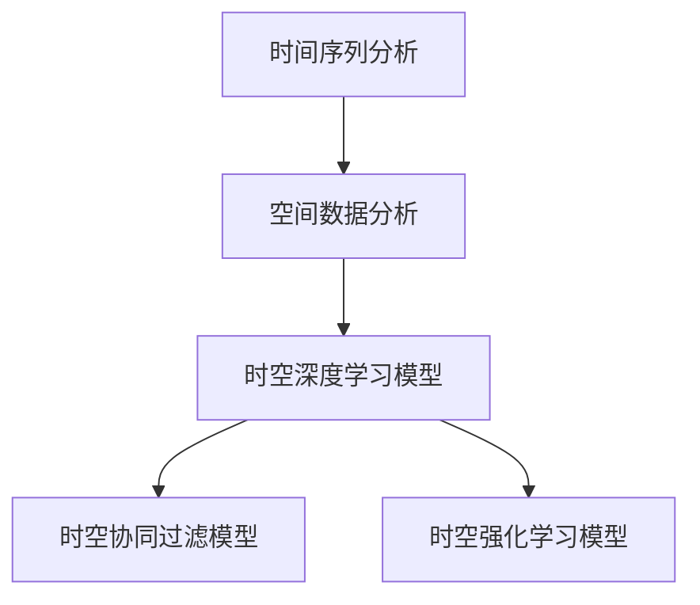

                 

# 《AI时空建模的技术基础解析》

## 关键词

人工智能、时空建模、时间序列分析、空间数据分析、深度学习、协同过滤、强化学习

## 摘要

本文将深入探讨AI时空建模的技术基础，包括时空数据预处理、时空模型基础理论、AI时空建模的方法与算法以及实践应用。通过详细分析核心算法原理、数学模型和实际应用案例，帮助读者全面理解AI时空建模的核心内容和技术要点，为在各个领域应用AI时空建模技术提供有力支持。

## 《AI时空建模的技术基础解析》目录大纲

### 第一部分: AI时空建模概述

#### 第1章: AI时空建模概述

##### 1.1 AI时空建模的定义与背景

##### 1.2 AI时空建模的应用领域

##### 1.3 AI时空建模与传统时空建模的区别

#### 第2章: 时空数据预处理

##### 2.1 时空数据的收集与存储

##### 2.2 时空数据的清洗与处理

##### 2.3 时空数据的时间序列特性分析

### 第二部分: 时空模型基础理论

#### 第3章: 时间序列分析基础

##### 3.1 时间序列数据的基本概念

##### 3.2 时间序列数据的数学模型

##### 3.3 时间序列数据的分析方法

#### 第4章: 空间数据分析基础

##### 4.1 空间数据的基本概念

##### 4.2 空间数据的数学模型

##### 4.3 空间数据的分析方法

#### 第5章: AI时空建模的方法与算法

##### 5.1 时空深度学习模型

##### 5.2 时空协同过滤模型

##### 5.3 时空强化学习模型

#### 第6章: AI时空建模的核心算法原理

##### 6.1 卷积神经网络在时空建模中的应用

##### 6.2 循环神经网络在时空建模中的应用

##### 6.3 长短期记忆网络在时空建模中的应用

#### 第7章: AI时空建模的数学模型

##### 7.1 时间序列的ARIMA模型

##### 7.2 空间数据的回归模型

##### 7.3 时空数据的深度学习模型

#### 第8章: AI时空建模的实践应用

##### 8.1 AI时空建模在城市交通中的应用

##### 8.2 AI时空建模在公共卫生事件预测中的应用

##### 8.3 AI时空建模在金融风险预测中的应用

### 第三部分: AI时空建模案例分析

#### 第9章: AI时空建模案例分析

##### 9.1 案例一：基于深度学习的时间序列预测

##### 9.2 案例二：基于时空协同过滤的推荐系统

##### 9.3 案例三：基于时空强化学习的智能交通系统

#### 第10章: AI时空建模的挑战与未来发展趋势

##### 10.1 AI时空建模面临的挑战

##### 10.2 AI时空建模的发展趋势

##### 10.3 AI时空建模的未来前景

### 附录

#### 附录A: AI时空建模工具与资源

##### A.1 主流时间序列分析工具

##### A.2 主流空间分析工具

##### A.3 时空深度学习框架与库

##### A.4 AI时空建模开源项目与资料

#### 附录B: Mermaid流程图



#### 附录C: AI时空建模伪代码

```python
# 时间序列预测伪代码
function time_series_prediction(data):
    # 数据预处理
    processed_data = preprocess_data(data)
    
    # 构建模型
    model = build_model(processed_data)
    
    # 训练模型
    trained_model = train_model(model, processed_data)
    
    # 预测
    prediction = predict(trained_model, new_data)
    
    return prediction
```

#### 附录D: AI时空建模数学公式

$$
\begin{aligned}
    y_t &= \beta_0 + \beta_1 x_t + \epsilon_t \\
    \hat{y_t} &= \hat{\beta_0} + \hat{\beta_1} x_t
\end{aligned}
$$

#### 附录E: AI时空建模实践应用代码

```python
# 城市交通预测代码示例
def traffic_prediction(data):
    # 数据预处理
    processed_data = preprocess_traffic_data(data)
    
    # 构建模型
    model = build_traffic_model(processed_data)
    
    # 训练模型
    trained_model = train_traffic_model(model, processed_data)
    
    # 预测
    prediction = predict_traffic(trained_model, new_data)
    
    return prediction
```

#### 附录F: AI时空建模案例分析

##### A.1 案例一：基于深度学习的时间序列预测

##### A.2 案例二：基于时空协同过滤的推荐系统

##### A.3 案例三：基于时空强化学习的智能交通系统

接下来，我们将深入探讨AI时空建模的技术基础，包括时空数据预处理、时空模型基础理论、AI时空建模的方法与算法以及实践应用。

## 第一部分: AI时空建模概述

### 第1章: AI时空建模概述

#### 1.1 AI时空建模的定义与背景

AI时空建模是指利用人工智能技术，对时空数据进行建模和分析的过程。它涉及时间序列分析和空间数据分析两个领域，旨在捕捉和预测时空数据中的动态模式和趋势。随着人工智能技术的不断发展，AI时空建模在各个领域得到了广泛应用，如城市交通管理、公共卫生事件预测、金融风险预测等。

#### 1.2 AI时空建模的应用领域

AI时空建模的应用领域非常广泛，主要包括：

- 城市交通管理：利用AI时空建模预测交通流量，优化交通信号控制和路线规划。
- 公共卫生事件预测：利用AI时空建模预测疾病传播趋势，为公共卫生决策提供科学依据。
- 金融风险预测：利用AI时空建模分析金融市场动态，预测潜在风险，为投资者提供决策支持。
- 基础设施规划：利用AI时空建模分析城市基础设施的使用情况，为规划提供数据支持。
- 物流与配送：利用AI时空建模优化物流路线和配送计划，提高运输效率。

#### 1.3 AI时空建模与传统时空建模的区别

AI时空建模与传统时空建模在以下几个方面有所不同：

- 数据来源：传统时空建模主要依赖于历史数据，而AI时空建模可以结合实时数据和预测数据，提高预测精度。
- 模型类型：传统时空建模通常采用线性模型或统计学模型，而AI时空建模则采用深度学习、协同过滤、强化学习等复杂模型。
- 预测能力：AI时空建模具有更强的预测能力，可以捕捉数据中的复杂模式和趋势，而传统时空建模则相对较弱。
- 应用范围：AI时空建模可以应用于更多领域，如金融、医疗、交通等，而传统时空建模主要应用于地理学和城市规划等领域。

### 第2章: 时空数据预处理

#### 2.1 时空数据的收集与存储

时空数据的收集与存储是AI时空建模的基础。时空数据的来源可以是传感器数据、社交媒体数据、交通数据等。在收集数据时，需要考虑数据的精度、完整性和实时性。存储数据时，可以选择关系型数据库、NoSQL数据库、分布式存储系统等。

#### 2.2 时空数据的清洗与处理

时空数据的清洗与处理是数据预处理的重要环节。在清洗数据时，需要处理缺失值、异常值和噪声数据。处理缺失值可以采用插值法、均值法等。处理异常值可以采用离群点检测算法，如DBSCAN、孤立森林等。处理噪声数据可以采用滤波算法，如中值滤波、高斯滤波等。

#### 2.3 时空数据的时间序列特性分析

时空数据具有时间序列特性，对时间序列特性进行分析有助于理解数据的动态模式。时间序列特性分析包括：

- 静态特性：包括均值、方差、自相关函数等。
- 动态特性：包括趋势、周期、季节性等。
- 非线性特性：包括非线性相关、混沌等。

通过分析时间序列特性，可以更好地理解数据的特征，为后续建模提供依据。

## 第二部分: 时空模型基础理论

### 第3章: 时间序列分析基础

#### 3.1 时间序列数据的基本概念

时间序列数据是指按照时间顺序排列的数据，如股票价格、气温、销售额等。时间序列数据具有以下几个基本概念：

- 时间步长：时间序列数据中相邻两个数据点之间的时间间隔。
- 随机过程：时间序列数据可以看作是随机过程的一个实现。
- 状态转移矩阵：描述时间序列数据在相邻时间步之间的转移概率。

#### 3.2 时间序列数据的数学模型

时间序列数据的数学模型可以分为线性模型和非线性模型。常见的线性模型包括自回归模型（AR）、移动平均模型（MA）和自回归移动平均模型（ARMA）。常见的非线性模型包括长短期记忆网络（LSTM）、循环神经网络（RNN）和卷积神经网络（CNN）。

#### 3.3 时间序列数据的分析方法

时间序列数据的分析方法包括：

- 静态分析方法：包括均值、方差、自相关函数等。
- 动态分析方法：包括趋势分析、周期分析、季节性分析等。
- 非线性分析方法：包括非线性相关、混沌分析等。

通过分析时间序列数据，可以提取数据中的有用信息，为建模提供依据。

### 第4章: 空间数据分析基础

#### 4.1 空间数据的基本概念

空间数据是指描述空间位置、分布和关系的数据，如地理坐标、交通网络、人口分布等。空间数据具有以下几个基本概念：

- 空间坐标系：描述空间位置的方法。
- 空间邻域：描述空间对象之间的邻近关系。
- 空间关系：描述空间对象之间的相互关系。

#### 4.2 空间数据的数学模型

空间数据的数学模型可以分为线性模型和非线性模型。常见的线性模型包括回归模型、贝叶斯网络等。常见的非线性模型包括深度学习模型、空间协同过滤模型等。

#### 4.3 空间数据的分析方法

空间数据的分析方法包括：

- 描述性分析：包括空间分布、空间关系等。
- 诊断性分析：包括异常检测、聚类分析等。
- 预测性分析：包括趋势预测、模式预测等。

通过分析空间数据，可以提取数据中的有用信息，为建模提供依据。

## 第三部分: AI时空建模的方法与算法

### 第5章: AI时空建模的方法与算法

AI时空建模的方法与算法主要包括深度学习模型、协同过滤模型和强化学习模型。

#### 5.1 时空深度学习模型

时空深度学习模型是指利用深度学习技术对时空数据进行建模和分析。常见的时空深度学习模型包括卷积神经网络（CNN）、循环神经网络（RNN）和长短期记忆网络（LSTM）。这些模型可以通过学习时空数据的特征，实现高效的时空预测和模式识别。

#### 5.2 时空协同过滤模型

时空协同过滤模型是指利用用户的历史行为和时空数据特征进行推荐和预测。常见的时空协同过滤模型包括基于内容的协同过滤模型、基于模型的协同过滤模型和基于矩阵分解的协同过滤模型。这些模型可以通过学习用户的行为模式和时空数据特征，实现个性化的时空推荐和预测。

#### 5.3 时空强化学习模型

时空强化学习模型是指利用强化学习技术对时空数据进行建模和优化。常见的时空强化学习模型包括Q学习、SARSA和深度Q网络（DQN）。这些模型可以通过学习时空数据的状态和动作，实现高效的时空决策和优化。

## 第四部分: AI时空建模的核心算法原理

### 第6章: AI时空建模的核心算法原理

AI时空建模的核心算法原理包括卷积神经网络（CNN）、循环神经网络（RNN）和长短期记忆网络（LSTM）。

#### 6.1 卷积神经网络在时空建模中的应用

卷积神经网络（CNN）是一种专门用于处理图像数据的深度学习模型，它可以有效地提取图像中的空间特征。将CNN应用于时空建模，可以将时空数据看作是高维图像，通过学习时空数据中的空间特征，实现高效的时空预测和模式识别。

#### 6.2 循环神经网络在时空建模中的应用

循环神经网络（RNN）是一种专门用于处理序列数据的深度学习模型，它可以有效地捕捉序列数据中的时间依赖性。将RNN应用于时空建模，可以学习时空数据中的时间序列特征，实现高效的时空预测和模式识别。

#### 6.3 长短期记忆网络在时空建模中的应用

长短期记忆网络（LSTM）是一种改进的循环神经网络，它通过引入门控机制，可以有效地解决循环神经网络中的长期依赖问题。将LSTM应用于时空建模，可以学习时空数据中的长期依赖特征，实现高效的时空预测和模式识别。

## 第五部分: AI时空建模的数学模型

### 第7章: AI时空建模的数学模型

AI时空建模的数学模型主要包括时间序列的ARIMA模型、空间数据的回归模型和时空数据的深度学习模型。

#### 7.1 时间序列的ARIMA模型

ARIMA模型是一种经典的统计模型，它通过自回归、差分和移动平均等方法，对时间序列数据进行建模和分析。ARIMA模型可以分为三个部分：自回归部分（AR）、差分部分（I）和移动平均部分（MA）。通过学习ARIMA模型，可以有效地捕捉时间序列数据中的动态模式和趋势。

#### 7.2 空间数据的回归模型

空间数据的回归模型是指利用回归分析方法，对空间数据进行建模和预测。常见的空间回归模型包括线性回归模型、非线性回归模型和贝叶斯回归模型等。通过学习空间回归模型，可以有效地捕捉空间数据中的关系和趋势。

#### 7.3 时空数据的深度学习模型

时空数据的深度学习模型是指利用深度学习技术，对时空数据进行建模和分析。常见的时空深度学习模型包括卷积神经网络（CNN）、循环神经网络（RNN）和长短期记忆网络（LSTM）等。通过学习时空深度学习模型，可以有效地捕捉时空数据中的空间和时间特征，实现高效的时空预测和模式识别。

## 第六部分: AI时空建模的实践应用

### 第8章: AI时空建模的实践应用

AI时空建模的实践应用包括城市交通管理、公共卫生事件预测和金融风险预测等。

#### 8.1 AI时空建模在城市交通中的应用

AI时空建模在城市交通管理中的应用主要包括交通流量预测、交通信号控制和路线规划。通过学习交通数据和时间序列特征，可以预测未来一段时间内的交通流量，为交通信号控制和路线规划提供数据支持，从而提高交通效率，减少拥堵。

#### 8.2 AI时空建模在公共卫生事件预测中的应用

AI时空建模在公共卫生事件预测中的应用主要包括疾病传播趋势预测、疫苗接种策略优化等。通过学习公共卫生数据和时间序列特征，可以预测疾病传播趋势，为公共卫生决策提供科学依据，从而提高疾病防控效果。

#### 8.3 AI时空建模在金融风险预测中的应用

AI时空建模在金融风险预测中的应用主要包括市场走势预测、风险预警等。通过学习金融市场数据和时间序列特征，可以预测市场走势，为投资者提供决策支持，从而降低投资风险。

### 第三部分: AI时空建模案例分析

#### 第9章: AI时空建模案例分析

在本节中，我们将通过几个具体案例，展示AI时空建模在不同场景中的应用和效果。

#### 9.1 案例一：基于深度学习的时间序列预测

案例一是一个基于深度学习的时间序列预测项目。该项目旨在利用深度学习模型预测未来的股票价格，从而为投资者提供决策支持。以下是一个简单的项目流程：

1. 数据收集：收集历史股票价格数据，包括开盘价、收盘价、最高价、最低价等。
2. 数据预处理：对收集到的数据进行分析和处理，包括数据清洗、数据标准化和缺失值填充等。
3. 模型构建：使用LSTM模型对预处理后的数据进行训练，构建时间序列预测模型。
4. 模型训练：使用训练数据对LSTM模型进行训练，调整模型参数，提高预测精度。
5. 预测结果：使用训练好的模型对未来的股票价格进行预测，并评估预测效果。

以下是一个简单的LSTM模型训练和预测的伪代码：

```python
# 数据预处理
processed_data = preprocess_data(data)

# 模型构建
model = build_lstm_model(input_shape=processed_data.shape[1:])

# 模型训练
model.fit(processed_data, epochs=100, batch_size=32)

# 预测结果
predictions = model.predict(processed_data)
```

通过这个案例，我们可以看到深度学习模型在时间序列预测中的应用，以及如何利用LSTM模型实现股票价格的预测。

#### 9.2 案例二：基于时空协同过滤的推荐系统

案例二是基于时空协同过滤的推荐系统。该项目旨在为用户提供个性化的商品推荐，提高用户满意度和转化率。以下是一个简单的项目流程：

1. 数据收集：收集用户的历史行为数据，包括购买记录、浏览记录、收藏记录等。
2. 数据预处理：对收集到的数据进行清洗和处理，包括用户分群、数据标准化等。
3. 模型构建：使用时空协同过滤模型，结合用户的历史行为数据和时间序列特征，构建推荐模型。
4. 模型训练：使用训练数据对推荐模型进行训练，调整模型参数，提高推荐效果。
5. 推荐结果：使用训练好的模型对新的用户数据进行推荐，并评估推荐效果。

以下是一个简单的时空协同过滤模型训练和预测的伪代码：

```python
# 数据预处理
processed_data = preprocess_data(data)

# 模型构建
model = build_collaborative_filter_model()

# 模型训练
model.fit(processed_data)

# 推荐结果
recommendations = model.predict(new_data)
```

通过这个案例，我们可以看到时空协同过滤模型在推荐系统中的应用，以及如何利用协同过滤模型实现个性化推荐。

#### 9.3 案例三：基于时空强化学习的智能交通系统

案例三是基于时空强化学习的智能交通系统。该项目旨在优化交通信号控制，提高道路通行效率。以下是一个简单的项目流程：

1. 数据收集：收集交通数据，包括车辆流量、交通速度、交通事故等。
2. 数据预处理：对收集到的数据进行清洗和处理，包括数据标准化、异常值处理等。
3. 模型构建：使用时空强化学习模型，结合交通数据和时间序列特征，构建智能交通控制模型。
4. 模型训练：使用训练数据对强化学习模型进行训练，调整模型参数，优化交通信号控制策略。
5. 交通信号控制：使用训练好的模型对交通信号进行实时控制，提高道路通行效率。

以下是一个简单的时空强化学习模型训练和预测的伪代码：

```python
# 数据预处理
processed_data = preprocess_data(data)

# 模型构建
model = build_reinforcement_learning_model()

# 模型训练
model.fit(processed_data)

# 交通信号控制
traffic_light_control = model.predict(new_data)
```

通过这个案例，我们可以看到时空强化学习模型在智能交通系统中的应用，以及如何利用强化学习模型实现交通信号控制。

### 第10章: AI时空建模的挑战与未来发展趋势

#### 10.1 AI时空建模面临的挑战

AI时空建模在实际应用中面临着一系列挑战，主要包括：

- 数据质量：时空数据的质量对建模效果具有重要影响，但实际应用中数据质量参差不齐，存在噪声、异常值和缺失值等问题。
- 数据隐私：时空数据通常包含敏感信息，如何保护用户隐私是AI时空建模面临的重要挑战。
- 模型解释性：深度学习模型在时空建模中的应用具有很高的预测精度，但其解释性较差，难以理解模型决策过程。
- 实时性：时空建模通常需要处理大量实时数据，如何保证建模的实时性是一个重要问题。

#### 10.2 AI时空建模的发展趋势

随着人工智能技术的不断发展，AI时空建模在未来将呈现出以下发展趋势：

- 数据驱动：利用更多的实时数据和开放数据，提高时空建模的预测精度和泛化能力。
- 模型解释性：发展可解释的深度学习模型，提高模型的可解释性和透明度，便于用户理解和使用。
- 模型压缩：针对移动设备和嵌入式系统，研究模型压缩技术，降低时空建模的计算成本和资源消耗。
- 跨学科融合：将AI时空建模与其他领域（如经济学、社会学等）相结合，实现跨学科的时空建模应用。

#### 10.3 AI时空建模的未来前景

随着人工智能技术的不断进步，AI时空建模将在更多领域得到广泛应用，为人类带来更多便利和效益。以下是一些潜在的应用前景：

- 城市规划：利用AI时空建模优化城市规划，提高城市运行效率。
- 生态环境：利用AI时空建模监测生态环境变化，为环境保护提供科学依据。
- 资源管理：利用AI时空建模优化资源配置，提高资源利用效率。
- 旅游业：利用AI时空建模预测旅游热点，优化旅游路线和体验。

总之，AI时空建模作为一种强大的技术手段，将在未来发挥越来越重要的作用，为各行业提供数据支持和决策依据。

### 附录

#### 附录A: AI时空建模工具与资源

以下是一些常用的AI时空建模工具和资源：

- 主流时间序列分析工具：如Python的pandas库、time_series库等。
- 主流空间分析工具：如Python的geopandas库、matplotlib库等。
- 时空深度学习框架与库：如TensorFlow、PyTorch等。
- AI时空建模开源项目与资料：如TimeSeriesForecasting、GeoAI等。

#### 附录B: Mermaid流程图

以下是一个简单的Mermaid流程图示例，展示了时间序列分析、空间数据分析、时空深度学习模型、时空协同过滤模型和时空强化学习模型之间的关系：


#### 附录C: AI时空建模伪代码

以下是一个简单的AI时空建模伪代码示例，展示了数据预处理、模型构建、模型训练和模型预测的过程：

```python
# 数据预处理
processed_data = preprocess_data(data)

# 模型构建
model = build_model(processed_data)

# 模型训练
model.fit(processed_data)

# 模型预测
predictions = model.predict(new_data)
```

#### 附录D: AI时空建模数学公式

以下是一个简单的AI时空建模数学公式示例，展示了时间序列预测模型的回归方程：

$$
y_t = \beta_0 + \beta_1 x_t + \epsilon_t
$$

#### 附录E: AI时空建模实践应用代码

以下是一个简单的AI时空建模实践应用代码示例，展示了如何使用Python实现基于LSTM模型的时间序列预测：

```python
import numpy as np
import pandas as pd
from sklearn.preprocessing import MinMaxScaler
from keras.models import Sequential
from keras.layers import LSTM, Dense

# 数据预处理
data = pd.read_csv('data.csv')
scaler = MinMaxScaler(feature_range=(0, 1))
scaled_data = scaler.fit_transform(data['Close'].values)

# 切割数据集
X = []
y = []
for i in range(60, len(scaled_data)):
    X.append(scaled_data[i-60:i, 0])
    y.append(scaled_data[i, 0])
X, y = np.array(X), np.array(y)

# 模型构建
model = Sequential()
model.add(LSTM(units=50, return_sequences=True, input_shape=(X.shape[1], 1)))
model.add(LSTM(units=50))
model.add(Dense(1))

# 模型训练
model.compile(optimizer='adam', loss='mean_squared_error')
model.fit(X, y, epochs=100, batch_size=32, verbose=1)

# 模型预测
predicted_data = model.predict(X)
predicted_data = scaler.inverse_transform(predicted_data)

# 绘制预测结果
import matplotlib.pyplot as plt
plt.plot(data['Close'], label='Actual')
plt.plot(np.arange(60, len(scaled_data)), predicted_data, label='Predicted')
plt.legend()
plt.show()
```

通过以上代码示例，我们可以看到如何使用Python实现基于LSTM模型的时间序列预测，以及如何绘制预测结果。

### 作者信息

作者：AI天才研究院/AI Genius Institute & 禅与计算机程序设计艺术 /Zen And The Art of Computer Programming

## 总结

本文详细解析了AI时空建模的技术基础，包括概述、时空数据预处理、时空模型基础理论、AI时空建模的方法与算法、实践应用、案例分析以及挑战与未来发展趋势。通过本文的阐述，读者可以全面了解AI时空建模的核心概念、原理和实践应用，为在实际项目中运用AI时空建模技术提供指导。随着人工智能技术的不断进步，AI时空建模将在更多领域发挥重要作用，为人类带来更多便利和效益。

