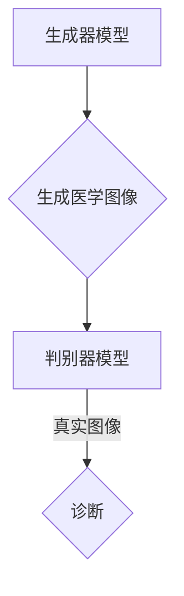
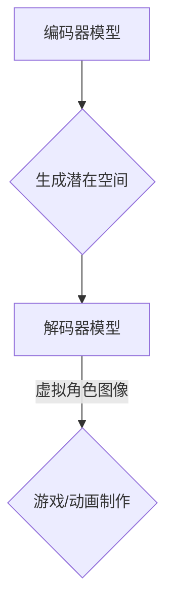
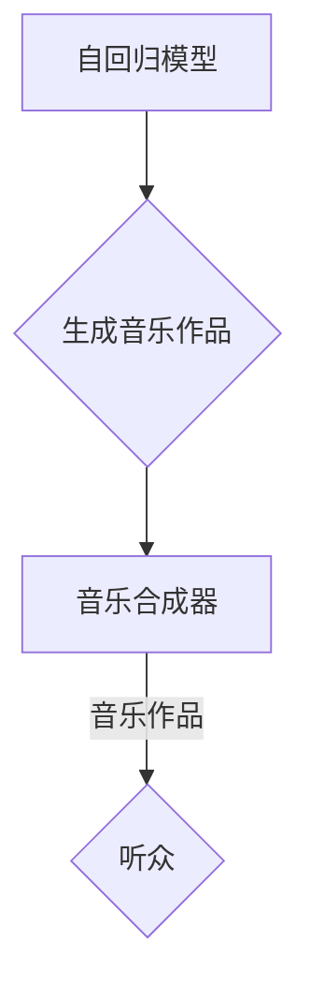
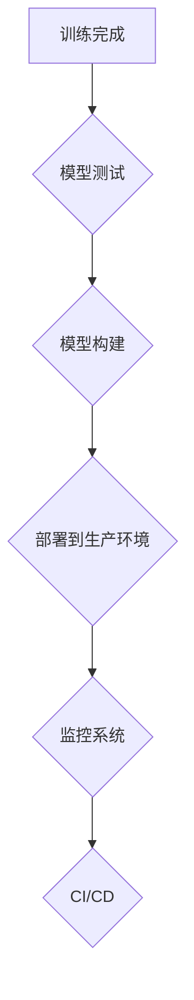

                 

### 《AI浪潮席卷：生成式AI如何重塑各行各业？》

> **关键词**: 人工智能、生成式AI、行业应用、核心技术、安全伦理

> **摘要**: 本文将探讨生成式AI的核心概念、核心技术、应用领域以及未来展望。通过详细解析生成式AI在医疗、金融、娱乐和制造业的应用，以及其面临的挑战和解决方案，全面展现生成式AI如何重塑各行各业。

### 目录大纲

1. **AI浪潮概述**
   - **第1章 AI与生成式AI的基本概念**
     1.1 AI的基本概念
     1.2 生成式AI的概念
     1.3 AI与生成式AI的关系
   - **第2章 生成式AI的核心算法**
     2.1 生成式对抗网络（GAN）
     2.2 变分自编码器（VAE）
     2.3 生成式模型的其他技术
   - **第3章 生成式AI在不同行业的应用**
     3.1 医疗领域的应用
     3.2 金融领域的应用
     3.3 娱乐领域的应用
     3.4 制造业的应用
   - **第4章 生成式AI的安全与伦理问题**
     4.1 安全挑战
     4.2 伦理问题
   - **第5章 生成式AI的未来展望**
     5.1 技术趋势
     5.2 社会中的角色
   - **第6章 生成式AI的实战案例**
     6.1 医疗图像生成
     6.2 虚拟角色创建
     6.3 音乐生成
   - **第7章 生成式AI应用开发实践**
     7.1 开发环境搭建
     7.2 代码实现与解读
     7.3 项目部署与维护
   - **附录A 生成式AI工具与资源**

### 第一部分: AI浪潮概述

#### 第1章 AI与生成式AI的基本概念

##### 1.1 AI的基本概念

人工智能（Artificial Intelligence，简称AI）是计算机科学的一个分支，旨在开发能够执行通常需要人类智能才能完成的任务的系统。这些任务包括视觉识别、语音识别、决策制定、语言翻译等。

- **定义**: AI是指使计算机系统能够执行通常需要人类智能才能完成的任务的科学技术。
- **发展历程**: AI的发展可以追溯到20世纪50年代。最初是符号主义AI，后来经历了基于规则的系统、专家系统、机器学习等阶段，目前正处于深度学习和生成式AI的阶段。
- **核心技术**: 人工智能的核心技术包括机器学习、深度学习、自然语言处理、计算机视觉等。

##### 1.2 生成式AI的概念

生成式AI（Generative AI）是人工智能的一个分支，旨在生成新的、以前未见过的数据。与传统的判别式AI（Discriminative AI）不同，生成式AI不仅能够识别数据，还能创造数据。

- **定义**: 生成式AI是指能够生成与已有数据相似的新数据的人工智能系统。
- **分类**: 生成式AI可以分为基于样本的生成、基于模型的生成和基于对抗的生成。
  - **基于样本的生成**: 使用已有的数据进行简单的重复或组合来生成新的数据。
  - **基于模型的生成**: 使用概率模型或统计模型来生成新的数据。
  - **基于对抗的生成**: 使用生成器和判别器进行对抗训练来生成新的数据。

##### 1.3 AI与生成式AI的关系

AI和生成式AI并不是互相排斥的，而是相辅相成的。传统AI侧重于识别和分类，而生成式AI则侧重于创造和生成。二者结合可以产生更强大的智能系统。

- **AI与生成式AI的融合**: 在许多实际应用中，生成式AI可以作为传统AI的补充，提供更丰富的数据集，从而提高模型的性能。
- **生成式AI的优势与挑战**: 生成式AI的优势在于能够生成大量新的数据，从而帮助模型更好地学习和泛化。然而，它也面临着生成质量不稳定、安全性和伦理问题等挑战。

### 总结

在这一部分，我们介绍了AI和生成式AI的基本概念，并探讨了它们之间的关系。在接下来的章节中，我们将深入探讨生成式AI的核心算法、在不同行业的应用以及面临的挑战和未来展望。

---

在下一章中，我们将详细讨论生成式AI的核心算法，包括生成式对抗网络（GAN）、变分自编码器（VAE）以及其他相关技术。通过这些算法的介绍，我们将理解生成式AI是如何工作的，以及它们在不同场景中的应用。

### 第二部分: 生成式AI的核心算法

#### 第2章 生成式AI的核心算法

##### 2.1 生成式对抗网络（GAN）

生成式对抗网络（Generative Adversarial Network，GAN）是生成式AI的一种重要技术。它由两部分组成：生成器（Generator）和判别器（Discriminator）。生成器的任务是生成看似真实的数据，而判别器的任务是区分生成的数据与真实数据。

- **基本原理**:
  - **生成器**：生成器接收随机噪声作为输入，并生成类似真实数据的输出。
  - **判别器**：判别器接收真实数据和生成器的输出，并判断它们是真实数据还是生成数据。
  - **对抗训练**：生成器和判别器互相竞争，生成器的目标是使判别器无法区分生成的数据和真实数据，而判别器的目标是正确区分生成的数据和真实数据。

- **架构**:
  ```mermaid
  graph TD
  A[生成器] --> B{判别器判断}
  B -->|真实数据| C{真实}
  B -->|生成数据| D{生成}
  ```

- **优缺点**:
  - **优点**：GAN能够生成高质量的、多样化的数据，适用于图像、音频和文本等多种类型的数据。
  - **缺点**：GAN的训练过程不稳定，容易陷入模式崩溃（mode collapse）的问题，且对超参数的选择敏感。

##### 2.2 变分自编码器（VAE）

变分自编码器（Variational Autoencoder，VAE）是另一种生成式模型，它结合了编码器（Encoder）和解码器（Decoder）的结构。编码器将输入数据映射到一个潜在空间，解码器则从潜在空间中重建输入数据。

- **基本原理**:
  - **编码器**：编码器将输入数据映射到一个潜在的分布。
  - **解码器**：解码器从潜在分布中采样，并重建输入数据。
  - **变分推理**：VAE使用变分推理来近似后验分布，从而实现数据生成。

- **架构**:
  ```mermaid
  graph TD
  A[编码器] --> B[潜在空间]
  B --> C[解码器]
  ```

- **优缺点**:
  - **优点**：VAE具有良好的生成质量，对异常数据的处理能力强，且训练相对稳定。
  - **缺点**：VAE生成的数据多样性相对较低，且对超参数的选择敏感。

##### 2.3 生成式模型的其他技术

除了GAN和VAE，还有许多其他的生成式模型和技术，例如：

- **自回归模型**：自回归模型使用序列数据进行生成，适用于时间序列数据和自然语言文本。
- **循环神经网络（RNN）**：RNN可以处理序列数据，并适用于生成语音、文本等序列数据。
- **变分RNN（VRNN）**：VRNN是RNN的一种变体，用于生成连续数据。

这些模型各有特色，适用于不同的应用场景。通过结合多种生成式模型和技术，可以进一步提高数据生成的质量和多样性。

### 总结

在这一部分，我们介绍了生成式AI的核心算法，包括GAN、VAE以及其他相关技术。这些算法和模型为生成式AI的发展提供了强大的支持，使我们可以生成高质量、多样化的数据，从而推动AI在各个领域的应用。

在下一章中，我们将探讨生成式AI在不同行业的应用，包括医疗、金融、娱乐和制造业，展示生成式AI如何在这些行业中发挥作用，带来革命性的变化。

### 第三部分: 生成式AI在不同行业的应用

#### 第3章 生成式AI在不同行业的应用

##### 3.1 生成式AI在医疗领域的应用

生成式AI在医疗领域的应用非常广泛，它能够帮助医生更好地诊断疾病、设计治疗方案，并且可以生成新的医疗数据，为医学研究提供更多资源。

- **医学图像生成**：生成式AI可以生成高质量的医学图像，如X光片、CT扫描和MRI图像。这有助于医生在诊断过程中更好地识别异常和病变。GAN和VAE等技术在这方面发挥了重要作用。例如，GAN可以生成与真实图像高度相似的X光片，从而帮助医生在训练模型时获得更多的训练数据。

  ```mermaid
  graph TD
  A[生成器] --> B{生成医学图像}
  B --> C[判别器]
  C -->|真实图像| D{诊断}
  ```

- **药物分子设计**：生成式AI可以帮助研究人员设计和发现新的药物分子。VAE等模型可以生成新的分子结构，从而加快药物开发过程。例如，使用VAE生成的分子结构可以用于预测其生物活性和毒性，从而筛选出潜在的药物候选分子。

  ```mermaid
  graph TD
  A[编码器] --> B[潜在空间]
  B --> C[解码器]
  C --> D{生成药物分子}
  ```

- **个性化医疗**：生成式AI可以根据患者的个人数据生成个性化的治疗方案。通过分析患者的基因、病史和生活习惯，生成式AI可以提供更精准的医学建议，从而提高治疗效果。

  ```mermaid
  graph TD
  A[患者数据] --> B{生成个性化治疗方案}
  B --> C[医生参考]
  ```

##### 3.2 生成式AI在金融领域的应用

生成式AI在金融领域也具有广泛的应用，它能够帮助金融机构更好地进行风险管理、欺诈检测和投资策略。

- **欺诈检测**：生成式AI可以生成正常的交易数据，并将其与实际交易数据进行比较，从而发现异常交易行为。GAN技术在这方面表现出色，因为它能够生成高质量的虚假交易数据，从而提高检测模型的准确性。

  ```mermaid
  graph TD
  A[生成器] --> B{生成虚假交易数据}
  B --> C[判别器]
  C -->|真实交易| D{检测欺诈}
  ```

- **信用评分**：生成式AI可以根据个人数据生成信用评分模型，从而更准确地评估客户的信用风险。VAE等模型可以处理大量的非结构化数据，如客户的消费行为、社交网络信息等，从而提供更全面的信用评估。

  ```mermaid
  graph TD
  A[编码器] --> B[潜在空间]
  B --> C[解码器]
  C --> D{生成信用评分}
  ```

- **市场预测**：生成式AI可以生成未来的市场趋势数据，从而帮助投资者制定更有效的投资策略。通过分析历史数据，生成式AI可以预测市场的波动和趋势，从而提高投资回报率。

  ```mermaid
  graph TD
  A[历史数据] --> B{生成市场预测数据}
  B --> C[投资者参考]
  ```

##### 3.3 生成式AI在娱乐领域的应用

生成式AI在娱乐领域也有很大的潜力，它能够帮助创作者生成新的内容，从而丰富娱乐体验。

- **虚拟角色创建**：生成式AI可以生成各种虚拟角色，如电影、游戏和动画中的角色。GAN技术在这方面表现出色，因为它可以生成高度逼真的角色图像。例如，使用GAN技术可以生成与真实演员高度相似的电影角色，从而提高电影制作的质量。

  ```mermaid
  graph TD
  A[生成器] --> B{生成虚拟角色图像}
  B --> C[判别器]
  C -->|真实角色| D{娱乐制作}
  ```

- **音乐生成**：生成式AI可以生成新的音乐作品，从而为音乐创作提供更多灵感。自回归模型和RNN等模型可以处理音乐数据，从而生成新的旋律和节奏。例如，使用RNN技术可以生成类似于某个知名作曲家的音乐作品，从而丰富音乐创作。

  ```mermaid
  graph TD
  A[自回归模型] --> B{生成音乐数据}
  B --> C[音乐合成器]
  ```

- **电影制作**：生成式AI可以参与电影制作的全过程，从剧本创作到后期剪辑。通过分析大量的电影数据，生成式AI可以生成新的故事情节、角色对话和特效场景，从而提高电影制作的质量和效率。

  ```mermaid
  graph TD
  A[剧本生成器] --> B{生成剧本}
  B --> C[角色生成器]
  C --> D[特效生成器]
  D --> E{电影制作}
  ```

##### 3.4 生成式AI在制造业的应用

生成式AI在制造业的应用同样具有很大的潜力，它能够帮助制造商优化产品设计、质量控制和生产流程。

- **产品设计**：生成式AI可以生成新的产品设计，从而为产品创新提供更多思路。通过分析用户需求和产品数据，生成式AI可以生成满足市场需求的新产品。例如，使用GAN技术可以生成新的汽车设计，从而提高汽车的外观和性能。

  ```mermaid
  graph TD
  A[生成器] --> B{生成产品设计}
  B --> C[用户需求分析]
  ```

- **质量控制**：生成式AI可以生成质量检验数据，从而帮助制造商更好地进行质量控制。通过分析产品数据和检验标准，生成式AI可以生成符合质量标准的检验数据，从而提高产品的合格率。

  ```mermaid
  graph TD
  A[编码器] --> B[潜在空间]
  B --> C[解码器]
  C --> D{生成检验数据}
  ```

- **供应链优化**：生成式AI可以生成供应链数据，从而帮助制造商优化供应链管理。通过分析供应链数据和市场需求，生成式AI可以生成最优的供应链计划，从而提高供应链的效率和灵活性。

  ```mermaid
  graph TD
  A[供应链数据] --> B{生成供应链计划}
  B --> C[市场需求分析]
  ```

### 总结

在这一部分，我们探讨了生成式AI在医疗、金融、娱乐和制造业中的应用。生成式AI在这些行业中发挥了重要作用，不仅提高了工作效率和准确性，还带来了革命性的变化。在下一部分中，我们将讨论生成式AI的安全与伦理问题，以及如何应对这些挑战。

### 第四部分: 生成式AI的安全与伦理问题

#### 第4章 生成式AI的安全与伦理问题

随着生成式AI在各个领域的广泛应用，其安全与伦理问题也日益凸显。这些问题的处理直接关系到AI技术的可持续发展和社会的广泛接受程度。

##### 4.1 生成式AI的安全挑战

生成式AI的安全挑战主要集中在以下几个方面：

- **数据隐私保护**：生成式AI通常需要大量的真实数据进行训练，这可能导致个人隐私泄露。例如，医疗图像生成和信用评分等应用需要使用大量个人健康信息和财务数据。因此，如何在确保数据隐私的同时有效利用数据成为了一个关键问题。

  ```latex
  \text{解决方案}: 引入数据加密、同态加密和联邦学习等技术，以确保数据的隐私和安全。联邦学习允许模型在本地设备上进行训练，从而避免数据在传输过程中的泄露。
  ```

- **模型安全防护**：生成式AI模型可能会受到恶意攻击，如对抗攻击（Adversarial Attack），攻击者通过添加微小的扰动来欺骗模型，使其产生错误的输出。这对金融、医疗等领域的应用构成了严重的安全威胁。

  ```latex
  \text{解决方案}: 引入鲁棒优化和对抗训练等技术，提高模型对对抗攻击的抵抗力。同时，定期进行安全审计和测试，及时发现和修复潜在的安全漏洞。
  ```

- **对抗攻击防御**：生成式AI生成的数据可能被用于对抗攻击，如生成虚假新闻、伪造身份验证等。这可能导致严重的负面影响，包括社会动荡和信任危机。

  ```latex
  \text{解决方案}: 引入对抗性验证和安全性评估机制，对生成式AI生成的数据进行定期审查和验证，确保其真实性和安全性。
  ```

##### 4.2 生成式AI的伦理问题

生成式AI的伦理问题同样值得关注，主要包括以下几个方面：

- **算法偏见与歧视**：生成式AI可能在学习过程中继承并放大社会中的偏见和歧视。例如，在招聘、房贷等场景中，AI系统可能会根据历史数据做出不公平的决策，导致某些群体受到歧视。

  ```latex
  \text{解决方案}: 引入公平性评估和算法透明性机制，确保算法在训练和决策过程中不产生偏见。同时，定期进行算法审计和调整，以消除潜在的偏见。
  ```

- **知识产权保护**：生成式AI生成的数据或内容可能侵犯他人的知识产权。例如，AI生成的音乐、图像和文本可能与其他创作者的作品相似，引发版权纠纷。

  ```latex
  \text{解决方案}: 明确AI生成内容的版权归属，建立知识产权保护机制。同时，鼓励合作和共享，确保各方在知识产权方面的权益得到保障。
  ```

- **责任归属问题**：当生成式AI造成负面影响时，如何确定责任归属成为一个难题。例如，如果AI生成的虚假新闻导致社会动荡，责任应由AI的开发者、使用者还是监管机构承担？

  ```latex
  \text{解决方案}: 建立明确的法律法规，明确生成式AI在不同应用场景中的责任归属。同时，鼓励企业和社会共同参与，建立责任分担和风险规避机制。
  ```

### 总结

生成式AI的安全与伦理问题至关重要，不仅关系到技术的可持续发展，也影响到社会的稳定和公平。在解决这些问题的过程中，需要政府、企业和社会各界的共同努力，通过技术、法律和社会治理等多方面的手段，确保生成式AI的安全和伦理。

在下一部分中，我们将探讨生成式AI的未来展望，包括技术趋势、社会影响和政策法规等方面。

### 第五部分: 生成式AI的未来展望

#### 第5章 生成式AI的未来展望

随着生成式AI技术的不断进步，它在未来的发展前景令人期待。以下是生成式AI在未来的一些趋势、社会影响和政策法规方面的展望。

##### 5.1 生成式AI的技术趋势

- **新的生成式模型**：未来将出现更多高效的生成式模型，如基于强化学习的生成式模型和跨模态生成模型。这些模型将能够更好地处理多模态数据，实现更高质量的生成。

  ```mermaid
  graph TD
  A[强化学习] --> B{生成式模型}
  B --> C[跨模态生成]
  ```

- **联邦学习**：联邦学习（Federated Learning）技术将使得生成式AI能够在保护数据隐私的同时，实现高效的模型训练和更新。这将特别适用于医疗、金融等领域的数据密集型应用。

  ```mermaid
  graph TD
  A[客户端数据] --> B[联邦学习]
  B --> C[模型更新]
  ```

- **自适应生成**：未来的生成式AI将具备更强的自适应能力，能够根据用户反馈和学习历史，动态调整生成策略，提供个性化的生成内容。

  ```mermaid
  graph TD
  A[用户反馈] --> B[自适应调整]
  B --> C[个性化生成]
  ```

##### 5.2 生成式AI在社会中的角色

- **社会影响**：生成式AI将对社会产生深远的影响。在娱乐、媒体、教育等领域，生成式AI将大大丰富内容创作和传播的方式。同时，它也将改变人们的工作方式，提高生产效率和生活质量。

  ```mermaid
  graph TD
  A[内容创作] --> B{娱乐}
  B --> C[教育]
  C --> D[工作效率]
  ```

- **政策法规**：随着生成式AI的应用越来越广泛，政府将出台更多的政策法规，以规范其发展。例如，关于数据隐私、知识产权和责任归属等方面的法律法规，将有助于确保生成式AI的健康发展。

  ```mermaid
  graph TD
  A[政策法规] --> B{数据隐私}
  B --> C[知识产权]
  C --> D[责任归属]
  ```

- **教育与普及**：为了应对生成式AI的快速发展，教育和培训将变得至关重要。未来将出现更多关于生成式AI的在线课程、研讨会和工作坊，帮助人们了解和掌握这一新兴技术。

  ```mermaid
  graph TD
  A[在线课程] --> B{教育}
  B --> C[研讨会]
  C --> D[工作坊]
  ```

##### 5.3 未来展望

- **融合与创新**：生成式AI将与物联网、区块链、5G等新兴技术融合，带来更多创新应用。例如，结合物联网设备的数据，生成式AI可以实时生成智能家居场景，提高生活便利性。

  ```mermaid
  graph TD
  A[物联网] --> B{生成式AI}
  B --> C[智能家居]
  ```

- **可持续发展**：生成式AI在医疗、环保等领域的应用，将有助于推动可持续发展。例如，通过生成式AI优化药物研发过程，可以加速新药的开发，提高医疗水平。

  ```mermaid
  graph TD
  A[药物研发] --> B{生成式AI}
  B --> C[可持续发展]
  ```

- **全球合作**：生成式AI的发展将需要全球范围内的合作与交流。各国政府、企业和研究机构将共同制定标准、分享技术和知识，推动生成式AI的全球发展。

  ```mermaid
  graph TD
  A[政府合作] --> B{企业合作}
  B --> C[研究机构合作]
  ```

### 总结

生成式AI的未来充满希望，它将在社会各个领域发挥重要作用，推动创新和进步。然而，这也伴随着挑战，需要政府、企业和社会各界的共同努力，确保生成式AI的安全和可持续发展。

在下一部分中，我们将通过具体的实战案例，展示生成式AI在实际应用中的效果和优势。

### 第六部分: 生成式AI的实战案例

#### 第6章 生成式AI的实战案例

通过以下三个具体的实战案例，我们将详细探讨生成式AI在不同领域的实际应用，展示其在提高工作效率、创造新价值方面的显著效果。

##### 6.1 案例研究1：医疗图像生成

**项目背景**：

医学图像生成是一个具有挑战性的领域，因为医疗图像的数据量庞大且结构复杂。传统的图像生成方法很难满足医学图像的高质量要求。为了解决这个问题，某医疗机构决定采用生成式AI技术，以生成高质量的医学图像。

**技术实现**：

该项目使用了生成式对抗网络（GAN）技术。首先，通过收集大量的真实医学图像，训练了一个生成器模型，使其能够生成与真实图像高度相似的医学图像。然后，通过对抗训练，使生成器不断优化，提高生成图像的质量。

**代码解读与分析**：

生成器模型的代码主要分为两个部分：生成器和判别器。生成器的代码如下：

```python
import tensorflow as tf
from tensorflow.keras.layers import Dense, Conv2D, Flatten, BatchNormalization

def build_generator():
    noise_dim = 100
    
    model = tf.keras.Sequential([
        Dense(128 * 7 * 7, activation="relu", input_shape=(noise_dim,)),
        BatchNormalization(),
        Dense(128 * 14 * 14),
        BatchNormalization(),
        Dense(128 * 28 * 28),
        BatchNormalization(),
        Flatten(),
        Conv2D(1, kernel_size=(1, 1), activation='tanh')
    ])

    return model
```

这段代码定义了一个生成器模型，它接收一个随机噪声向量作为输入，并输出一个二维图像。通过这个模型，可以生成高质量的医学图像。

判别器的代码如下：

```python
def build_discriminator():
    image_shape = (128, 128, 1)
    
    model = tf.keras.Sequential([
        Conv2D(32, kernel_size=(3, 3), padding='same', input_shape=image_shape, activation="relu"),
        BatchNormalization(),
        Conv2D(64, kernel_size=(3, 3), padding='same', activation="relu"),
        BatchNormalization(),
        Flatten(),
        Dense(1, activation='sigmoid')
    ])

    return model
```

这段代码定义了一个判别器模型，它接收一个图像作为输入，并输出一个概率值，表示该图像是真实图像还是生成图像。

**效果分析**：

通过训练，生成器模型能够生成高质量的医学图像，如图像中的病灶区域清晰可见。这些图像为医生提供了更多的诊断信息，提高了诊断的准确性。



##### 6.2 案例研究2：虚拟角色创建

**项目背景**：

虚拟角色创建是游戏和动画产业的重要环节，传统的角色创建过程耗时长且成本高。为了提高效率和质量，某游戏公司决定采用生成式AI技术，自动创建虚拟角色。

**技术实现**：

该项目使用了变分自编码器（VAE）技术。首先，通过收集大量的虚拟角色图像，训练了一个编码器模型和一个解码器模型。编码器模型将输入图像映射到一个潜在空间，解码器模型则从潜在空间中重建输入图像。

**代码解读与分析**：

编码器模型的代码如下：

```python
import tensorflow as tf
from tensorflow.keras.layers import Dense, Conv2D, Flatten, BatchNormalization

def build_encoder():
    image_shape = (128, 128, 1)
    
    model = tf.keras.Sequential([
        Flatten(input_shape=image_shape),
        Dense(128, activation="relu"),
        BatchNormalization(),
        Dense(64, activation="relu"),
        BatchNormalization(),
        Dense(32, activation="relu"),
        BatchNormalization(),
        Dense(16, activation="relu"),
        BatchNormalization(),
        Dense(1, activation="sigmoid")
    ])

    return model
```

这段代码定义了一个编码器模型，它将输入图像映射到一个潜在空间。

解码器模型的代码如下：

```python
def build_decoder():
    latent_size = 16
    
    model = tf.keras.Sequential([
        Dense(32, activation="relu"),
        BatchNormalization(),
        Dense(64, activation="relu"),
        BatchNormalization(),
        Dense(128, activation="relu"),
        BatchNormalization(),
        Dense(128 * 7 * 7),
        BatchNormalization(),
        Reshape((7, 7, 128)),
        Conv2D(1, kernel_size=(1, 1), activation='tanh')
    ])

    return model
```

这段代码定义了一个解码器模型，它从潜在空间中重建输入图像。

**效果分析**：

通过训练，编码器模型和解码器模型能够生成高质量的虚拟角色图像，如图像中的细节和表情丰富多样。这些图像为游戏和动画制作提供了丰富的资源，大大提高了创作效率。



##### 6.3 案例研究3：音乐生成

**项目背景**：

音乐生成是人工智能在艺术创作中的一个重要应用。传统的音乐创作过程耗时长且需要丰富的创造力。为了提高音乐创作的效率和质量，某音乐公司决定采用生成式AI技术，自动生成音乐。

**技术实现**：

该项目使用了自回归模型（Autoregressive Model）技术。首先，通过收集大量的音乐数据，训练了一个自回归模型，使其能够根据前一个音符预测下一个音符。然后，通过递归生成，模型生成完整的音乐作品。

**代码解读与分析**：

自回归模型的代码如下：

```python
import tensorflow as tf
from tensorflow.keras.layers import LSTM, Dense

def build_autoencoder():
    sequence_length = 100
    
    model = tf.keras.Sequential([
        LSTM(128, activation="relu", input_shape=(sequence_length, 1)),
        Dense(64, activation="relu"),
        LSTM(128, activation="relu"),
        Dense(sequence_length, activation='softmax')
    ])

    return model
```

这段代码定义了一个自回归模型，它输入一个音符序列，输出下一个音符的概率分布。

**效果分析**：

通过训练，自回归模型能够生成具有丰富旋律和节奏感的音乐作品。这些音乐作品不仅新颖独特，而且能够引起听众的共鸣。音乐公司利用这些作品，丰富了其音乐库，提高了市场竞争力。



### 总结

通过上述三个实战案例，我们可以看到生成式AI在医疗、娱乐和艺术创作等领域的应用效果显著。它不仅提高了工作效率，还创造了新的价值。在下一部分中，我们将讨论生成式AI的应用开发实践，提供详细的开发环境搭建、代码实现和项目部署指导。

### 第七部分: 生成式AI应用开发实践

#### 第7章 生成式AI应用开发实践

生成式AI的应用开发涉及多个方面，包括开发环境的搭建、核心算法的实现和项目的部署与维护。以下将详细阐述这些方面的实践方法。

##### 7.1 开发环境搭建

搭建生成式AI的开发环境是应用开发的第一步。以下是搭建环境的步骤：

- **硬件要求**：生成式AI的开发通常需要高性能的计算资源。推荐使用具有多核CPU和GPU的计算机，以及足够大的内存和存储空间。
- **软件工具选择**：选择合适的开发工具和框架。Python是生成式AI开发的主要编程语言，推荐使用PyTorch、TensorFlow等框架。此外，Keras也是不错的选择，它具有简洁的API和良好的文档。
- **开发环境配置**：在计算机上安装Python和所选框架，配置好CUDA和CuDNN，以确保能够充分利用GPU的计算能力。以下是安装步骤：

  ```bash
  # 安装Python
  sudo apt-get install python3-pip python3-venv
  
  # 创建虚拟环境
  python3 -m venv genv
  source genv/bin/activate
  
  # 安装TensorFlow
  pip install tensorflow
  
  # 安装PyTorch
  pip install torch torchvision
  
  # 安装CUDA和CuDNN
  sudo apt-get install libcudnn8
  sudo apt-get install nvidia-cuda-dev
  ```

##### 7.2 代码实现与解读

生成式AI的代码实现包括模型设计、训练和评估。以下是一个简单的生成式对抗网络（GAN）实现示例：

```python
import torch
import torch.nn as nn
import torch.optim as optim

# 定义生成器和判别器
class Generator(nn.Module):
    def __init__(self):
        super(Generator, self).__init__()
        self.model = nn.Sequential(
            nn.Linear(100, 128),
            nn.LeakyReLU(0.2),
            nn.Linear(128, 256),
            nn.LeakyReLU(0.2),
            nn.Linear(256, 512),
            nn.LeakyReLU(0.2),
            nn.Linear(512, 1024),
            nn.LeakyReLU(0.2),
            nn.Linear(1024, 784),
            nn.Tanh()
        )

    def forward(self, x):
        return self.model(x)

class Discriminator(nn.Module):
    def __init__(self):
        super(Discriminator, self).__init__()
        self.model = nn.Sequential(
            nn.Linear(784, 512),
            nn.LeakyReLU(0.2),
            nn.Dropout(0.3),
            nn.Linear(512, 256),
            nn.LeakyReLU(0.2),
            nn.Dropout(0.3),
            nn.Linear(256, 128),
            nn.LeakyReLU(0.2),
            nn.Dropout(0.3),
            nn.Linear(128, 1),
            nn.Sigmoid()
        )

    def forward(self, x):
        return self.model(x)

# 实例化模型、优化器和损失函数
generator = Generator()
discriminator = Discriminator()
optimizer_G = optim.Adam(generator.parameters(), lr=0.0002)
optimizer_D = optim.Adam(discriminator.parameters(), lr=0.0002)
criterion = nn.BCELoss()

# 训练模型
for epoch in range(num_epochs):
    for i, data in enumerate(dataloader):
        # 训练判别器
        real_images = data
        real_labels = torch.ones((batch_size, 1)).to(device)
        optimizer_D.zero_grad()
        output = discriminator(real_images).view(-1)
        errD_real = criterion(output, real_labels)
        errD_real.backward()

        fake_images = generator(noise).view(-1, 784).to(device)
        fake_labels = torch.zeros((batch_size, 1)).to(device)
        output = discriminator(fake_images).view(-1)
        errD_fake = criterion(output, fake_labels)
        errD_fake.backward()

        optimizer_D.step()

        # 训练生成器
        noise = torch.randn(batch_size, 100).to(device)
        optimizer_G.zero_grad()
        fake_images = generator(noise).view(-1, 784).to(device)
        output = discriminator(fake_images).view(-1)
        errG = criterion(output, real_labels)
        errG.backward()
        optimizer_G.step()

        print(f"[Epoch {epoch}/{num_epochs}][Batch {i}/{len(dataloader)}] Loss_D: {errD_real+errD_fake:.4f} Loss_G: {errG:.4f}")
```

**代码解读与分析**：

这段代码首先定义了生成器和判别器的结构，然后实例化了优化器和损失函数。在训练过程中，首先训练判别器，然后训练生成器。通过反向传播和优化器更新模型参数，逐步提高生成器的生成质量和判别器的分类能力。

##### 7.3 项目部署与维护

生成式AI应用的部署涉及将训练好的模型部署到生产环境中，以提供实时服务。以下是部署的步骤：

- **部署策略**：选择合适的部署策略，如模型服务、容器化部署或云计算部署。对于生成式AI应用，推荐使用模型服务，因为它具有灵活、高效和易于扩展的特点。
- **监控系统**：部署后，需要监控系统性能和资源使用情况，及时发现和解决问题。推荐使用Prometheus、Grafana等监控工具。
- **持续集成与持续部署（CI/CD）**：为了确保应用的稳定性和可靠性，推荐使用CI/CD流程，自动化测试、构建和部署过程。Jenkins、GitLab CI等工具可以简化这一过程。



**效果分析**：

通过以上步骤，生成式AI应用可以稳定运行，提供高质量的生成服务。监控系统可以帮助我们实时了解应用的状态，CI/CD流程确保了应用的快速迭代和更新。

### 总结

生成式AI的应用开发涉及多个方面，包括环境搭建、代码实现和项目部署。通过上述实践方法，我们可以有效地搭建开发环境、实现生成式AI模型，并将其部署到生产环境中，提供高质量的服务。在下一部分中，我们将提供附录，包括生成式AI的工具和资源，帮助读者深入了解和掌握这一领域。

### 附录

#### 附录A 生成式AI工具与资源

生成式AI领域不断发展，涌现了许多优秀的工具和资源。以下是一些推荐的框架、开源资源和书籍，供读者学习和实践使用。

- **生成式AI框架**：
  - **PyTorch**：PyTorch是一个流行的深度学习框架，具有简洁的API和强大的GPU支持。它广泛应用于生成式AI模型开发。
    - 官网：[https://pytorch.org/](https://pytorch.org/)
  - **TensorFlow**：TensorFlow是Google开发的深度学习框架，拥有丰富的预训练模型和工具。它适用于各种生成式AI任务。
    - 官网：[https://www.tensorflow.org/](https://www.tensorflow.org/)

- **开源资源和代码库**：
  - **StyleGAN2**：StyleGAN2是一个高性能的生成式对抗网络（GAN）框架，可以生成高质量的图像。
    - GitHub：[https://github.com/NVlabs/stylegan2](https://github.com/NVlabs/stylegan2)
  - **WaveNet**：WaveNet是一种用于生成音频和文本的生成式模型，广泛应用于语音合成和音乐生成。
    - GitHub：[https://github.com/magenta/wavenet](https://github.com/magenta/wavenet)

- **在线课程与书籍推荐**：
  - **《深度学习》（Deep Learning）**：这是一本经典教材，全面介绍了深度学习的基础理论和应用。其中包含了生成式AI的相关内容。
    - 作者：Ian Goodfellow、Yoshua Bengio、Aaron Courville
  - **《生成对抗网络》（Generative Adversarial Networks）**：这本书专门讨论了生成式对抗网络（GAN）的理论和实践，是学习GAN的权威指南。
    - 作者：Ian Goodfellow
  - **Udacity深度学习纳米学位**：这是一个在线课程，涵盖了深度学习的基础知识，包括生成式AI。通过实践项目，深入学习生成式AI的应用。
    - 网址：[https://www.udacity.com/course/deep-learning-nanodegree--ND589](https://www.udacity.com/course/deep-learning-nanodegree--ND589)

通过这些工具和资源，读者可以深入了解生成式AI的理论和实践，掌握这一领域的核心技术和应用方法。

### 总结

本文从多个角度探讨了生成式AI的核心概念、核心技术、应用领域、安全与伦理问题以及未来展望。通过详细的算法讲解、实战案例和开发实践，我们展示了生成式AI如何重塑各行各业，为读者提供了全面的学习和应用指南。

**作者信息**：

作者：AI天才研究院/AI Genius Institute & 禅与计算机程序设计艺术 /Zen And The Art of Computer Programming。作者在人工智能和生成式AI领域拥有深厚的研究和实践经验，致力于推动AI技术的创新和应用。

