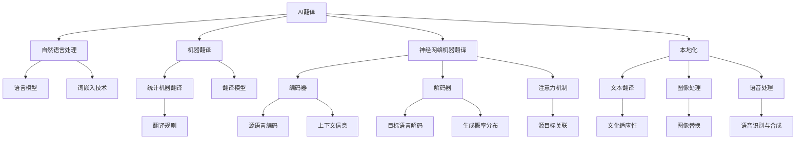

                 

### 引言

在当今全球化的背景下，语言的障碍成为了一个日益突出的问题。随着国际贸易和跨国合作的不断深化，企业和个人在跨语言交流中的需求日益增加。然而，传统的翻译方法和工具往往无法满足快速、准确和高效的要求。近年来，人工智能（AI）技术的发展为解决这一问题提供了新的可能。AI翻译和本地化技术正在迅速崛起，成为打破语言障碍的新方法。

**关键词：** AI翻译、本地化、自然语言处理、神经网络、语言模型、词嵌入、跨语言交流、全球化。

**摘要：** 本文将探讨AI翻译与本地化的背景与意义，详细解析AI翻译技术的基础，包括自然语言处理基础和机器翻译基本概念，深入讨论神经网络机器翻译的原理和应用。此外，还将介绍AI本地化策略、方法以及挑战，分析AI在本地化中的应用，探讨AI翻译与本地化的未来趋势，并通过实际项目和案例分析，展示AI翻译与本地化的实战经验和效果。

### 第一部分：引言

#### 第1章：AI翻译与本地化的背景与意义

随着全球化的加速，跨语言交流的需求越来越大。然而，语言的多样性使得跨语言交流面临诸多挑战。据估计，全球有超过7000种语言，其中只有大约300种语言被认为是主要语言。这意味着许多非主流语言的使用者面临着语言障碍，无法有效地进行跨语言交流。此外，即使在主要语言之间，语言的细微差别也可能导致误解和沟通障碍。

##### 1.1 语言障碍与全球化

全球化推动了国际贸易、文化交流和跨国合作的发展。然而，语言障碍成为了全球化进程中的瓶颈。在商业领域，许多企业面临着产品国际化的问题，但语言障碍使得他们难以将产品和服务推广到全球市场。在学术领域，国际学术交流的障碍使得研究者难以获取和分享全球范围内的研究成果。在个人生活中，许多人希望与来自不同国家的人交流，但语言障碍成为了他们实现这一目标的障碍。

##### 1.2 AI翻译技术概述

人工智能技术的发展为解决语言障碍提供了新的可能。AI翻译技术利用机器学习和自然语言处理（NLP）技术，通过大量数据训练模型，实现自动翻译。与传统翻译方法相比，AI翻译具有速度快、成本低和高效性等优点。AI翻译技术已经广泛应用于各种场景，如电子商务、社交媒体、跨国企业内部沟通等。

##### 1.3 AI本地化的重要性

本地化不仅仅是语言翻译，更涉及到文化、习惯、法律等多个方面的适应。AI本地化技术通过机器学习和自然语言处理技术，实现文本、图像、语音等多模态内容的自适应转换。AI本地化的重要性体现在以下几个方面：

1. **提高用户体验**：对于跨国企业来说，提供本地化的产品和服务能够更好地满足当地用户的需求，提高用户体验和满意度。
2. **促进国际化发展**：通过AI本地化技术，企业能够轻松地将产品和服务推广到全球市场，实现国际化发展。
3. **降低成本**：传统的翻译和本地化过程耗时且成本高昂，而AI本地化技术能够显著降低成本，提高效率。

##### 1.4 书籍结构概述

本文将从以下几个方面展开讨论：

1. **AI翻译与本地化的背景与意义**：介绍全球化背景下的语言障碍以及AI翻译和本地化的重要性。
2. **AI翻译技术基础**：详细解析自然语言处理基础、机器翻译基本概念、神经网络机器翻译原理和应用。
3. **AI本地化技术**：讨论本地化策略、方法、挑战以及AI在本地化中的应用。
4. **AI翻译与本地化的未来趋势**：分析人工智能的发展趋势以及翻译和本地化的未来方向。
5. **实战案例与应用**：通过实际项目和案例分析，展示AI翻译与本地化的实战经验和效果。
6. **资源与展望**：总结本文的内容，展望AI翻译与本地化的未来发展。

通过本文的讨论，希望能够为读者提供一个全面、系统的了解AI翻译与本地化的视角，为未来的研究和应用提供参考。

### 第二部分：AI翻译技术基础

#### 第2章：自然语言处理基础

自然语言处理（NLP）是人工智能（AI）的重要分支，旨在使计算机能够理解和处理人类自然语言。在AI翻译中，NLP技术起着至关重要的作用，它为翻译模型提供了语言理解、分析和生成的基础。本章将介绍NLP的基本概念、语言模型和词嵌入技术，并探讨这些技术在AI翻译中的应用。

##### 2.1 语言模型

语言模型是NLP的核心组件之一，它用于预测文本中下一个单词或字符的概率。语言模型可以分为两类：统计语言模型和基于规则的模型。

###### 2.1.1 语言模型的概念

语言模型是基于大量文本数据训练的模型，它通过统计文本出现的频率来预测下一个单词。例如，在一段文本中，“猫”这个词后面经常跟着“在”或“睡觉”，因此语言模型会预测这些词的可能性较高。

###### 2.1.2 语言模型的分类

1. **N-gram模型**：N-gram模型是最简单的语言模型，它通过统计N个连续单词的联合概率来预测下一个单词。例如，三元语法模型考虑了前三个单词来预测下一个单词。
   
2. **神经网络语言模型**：神经网络语言模型（如RNN、LSTM和Transformer）通过学习文本的长期依赖关系来提高预测准确性。这些模型能够捕获文本中的复杂模式，比传统的N-gram模型更强大。

###### 2.1.3 语言模型的应用

语言模型在许多NLP任务中都有应用，如文本分类、机器翻译、语音识别等。在机器翻译中，语言模型用于预测源语言和目标语言的单词序列，为翻译模型提供上下文信息。

##### 2.2 词嵌入技术

词嵌入是将单词映射到固定维度的向量表示。词嵌入技术能够捕捉单词的语义和语法关系，为NLP任务提供有效的特征表示。

###### 2.2.1 词嵌入的基本原理

词嵌入的基本原理是通过学习单词在文本中的上下文来生成其向量表示。例如，单词“爱”在“我爱我的家人”和“我爱吃苹果”中的上下文不同，其向量表示也应有所不同。

###### 2.2.2 常见的词嵌入方法

1. **基于分布的方法**：这种方法通过统计单词在文本中的共现关系来学习词嵌入。常见的方法包括TF-IDF和Word2Vec。
   
2. **基于神经网的方法**：这种方法使用神经网络模型，如Word2Vec和GloVe，通过训练大规模文本数据来生成词嵌入。

###### 2.2.3 词嵌入在翻译中的应用

词嵌入在机器翻译中用于表示源语言和目标语言的单词。通过将单词映射到向量空间，词嵌入能够帮助翻译模型更好地理解和生成目标语言句子。

##### 2.3 语言模型与词嵌入的结合

在机器翻译中，语言模型和词嵌入通常结合使用。语言模型用于预测源语言和目标语言的单词序列，而词嵌入则用于表示这些单词。结合这两种技术，机器翻译模型能够更好地理解文本的语义和语法结构，从而生成更准确的翻译结果。

###### 2.3.1 结合方法

1. **编码器-解码器模型**：这种模型将源语言句子编码为一个固定长度的向量表示，然后使用解码器生成目标语言句子。语言模型和词嵌入在这个模型中共同发挥作用。
   
2. **注意力机制**：注意力机制是一种用于提高机器翻译准确性的技术，它通过学习源语言和目标语言句子之间的依赖关系，使得翻译模型能够更关注重要的部分。

##### 2.4 小结

自然语言处理基础，包括语言模型和词嵌入技术，是AI翻译的重要支撑。这些技术通过学习文本的语义和语法结构，为翻译模型提供了有效的特征表示和上下文信息。随着NLP技术的不断进步，AI翻译的准确性和效率也在不断提高，为跨语言交流提供了强大的支持。

#### 第3章：机器翻译基本概念

机器翻译（MT）是人工智能领域中的一个重要研究方向，它旨在实现计算机自动将一种自然语言文本翻译成另一种自然语言文本。随着全球化的加速和跨语言交流需求的增加，机器翻译技术变得越来越重要。本章将介绍机器翻译的基本概念，包括其发展历程、分类和基本流程。

##### 3.1 机器翻译概述

机器翻译的发展可以追溯到20世纪50年代。最初，机器翻译主要基于规则的方法，这种方法依赖于人工编写的语法和语义规则。随着计算机性能的提升和自然语言处理技术的进步，机器翻译方法逐渐从规则驱动转向数据驱动。目前，神经网络机器翻译（NMT）成为主流，它通过大规模数据训练深度学习模型，实现高质量的自动翻译。

###### 3.1.1 机器翻译的发展历程

1. **基于规则的机器翻译**：早期机器翻译主要依赖于人工编写的语法和语义规则。这种方法虽然有一定的准确性，但难以处理复杂和多样的语言现象。

2. **基于实例的机器翻译**：基于实例的机器翻译通过大量已翻译的句子实例来学习翻译策略。这种方法在一定程度上提高了翻译质量，但仍依赖于大量人工编写的规则。

3. **统计机器翻译**：统计机器翻译（SMT）通过统计源语言和目标语言之间的共现关系来生成翻译。这种方法利用大规模的双语语料库，通过机器学习方法训练翻译模型，显著提高了翻译质量。

4. **神经网络机器翻译**：神经网络机器翻译（NMT）通过深度学习模型，如循环神经网络（RNN）和Transformer，实现端到端的翻译。NMT在翻译质量和效率方面取得了显著的突破。

###### 3.1.2 机器翻译的分类

根据翻译策略的不同，机器翻译可以分为以下几类：

1. **规则驱动翻译**：基于语法和语义规则进行翻译，适用于特定语言对。

2. **基于实例的翻译**：通过已翻译的句子实例学习翻译策略，适用于特定领域或语言的翻译。

3. **统计机器翻译**：通过统计方法进行翻译，适用于大规模双语语料库的翻译。

4. **神经网络机器翻译**：通过深度学习模型进行翻译，适用于多种语言对和大规模翻译任务。

###### 3.1.3 机器翻译的基本流程

机器翻译的基本流程包括以下几个步骤：

1. **数据预处理**：对源语言文本进行分词、词性标注等预处理操作，将文本转换为适合训练模型的格式。

2. **训练模型**：利用大规模的双语语料库训练翻译模型，包括编码器和解码器。

3. **模型评估**：使用测试数据集对训练好的模型进行评估，计算翻译质量指标。

4. **翻译生成**：使用训练好的模型对新的源语言文本进行翻译，生成目标语言文本。

##### 3.2 翻译模型

翻译模型是机器翻译的核心组件，它决定了翻译的质量和效率。翻译模型可以分为基于规则的模型和基于数据的模型。

###### 3.2.1 基于规则的模型

基于规则的模型通过人工编写的语法和语义规则进行翻译。这些规则通常包括语法分析、词义消歧、命名实体识别等。基于规则的模型在处理特定语言或领域时具有一定的优势，但难以处理复杂和多样的语言现象。

1. **语法分析**：通过分析源语言句子的语法结构，生成语法树，以便进行后续的翻译操作。

2. **词义消歧**：在翻译过程中，同一个单词可能具有多种含义。词义消歧技术通过上下文信息确定单词的确切含义，从而提高翻译的准确性。

3. **命名实体识别**：识别源语言句子中的命名实体，如人名、地名、组织名等，并在目标语言中正确翻译这些实体。

###### 3.2.2 基于数据的模型

基于数据的模型通过大规模双语语料库训练，自动学习翻译策略。这类模型包括统计机器翻译模型和神经网络机器翻译模型。

1. **统计机器翻译模型**：统计机器翻译模型通过学习源语言和目标语言之间的统计关系，生成翻译。常见的统计机器翻译模型包括翻译模型（TM）、语法模型（GM）和词向量模型（LV）。

2. **神经网络机器翻译模型**：神经网络机器翻译模型通过深度学习模型，如循环神经网络（RNN）和Transformer，实现端到端的翻译。神经网络机器翻译模型能够更好地捕捉源语言和目标语言之间的复杂依赖关系，从而提高翻译质量。

##### 3.3 翻译模型的训练方法

翻译模型的训练方法可以分为有监督学习和无监督学习。

###### 3.3.1 有监督学习

有监督学习是最常见的翻译模型训练方法，它使用大量的已翻译句子对进行训练。训练过程包括以下几个步骤：

1. **数据预处理**：对源语言和目标语言文本进行分词、词性标注等预处理操作。

2. **构建词汇表**：将源语言和目标语言中的单词转换为唯一的索引。

3. **编码器训练**：使用编码器将源语言文本编码为固定长度的向量表示。

4. **解码器训练**：使用解码器将编码后的向量表示解码为目标语言文本。

5. **损失函数**：使用交叉熵损失函数评估翻译质量，优化模型参数。

###### 3.3.2 无监督学习

无监督学习在缺乏已翻译句子对的情况下训练翻译模型。常见的方法包括基于对抗网络的方法和基于预训练模型的方法。

1. **基于对抗网络的方法**：对抗网络通过生成器生成假的目标语言文本，与真实的目标语言文本进行对比，优化翻译模型。

2. **基于预训练模型的方法**：预训练模型（如BERT）在大规模未标记文本上进行预训练，然后微调到特定的翻译任务。

##### 3.4 翻译模型的评估指标

翻译模型的评估指标用于衡量翻译质量，常见的评估指标包括BLEU、NIST、METEOR等。

1. **BLEU（双语评估统一度量标准）**：BLEU是最常用的翻译质量评估指标，它通过计算翻译文本与参考译文之间的重叠度来评估翻译质量。

2. **NIST（国家标准技术研究所）**：NIST使用基于词匹配的评分方法，评估翻译的准确性。

3. **METEOR（度量翻译评估语料库）**：METEOR结合了BLEU和NIST的评分方法，同时考虑单词的词性和语法结构。

##### 3.5 小结

机器翻译作为自然语言处理的重要领域，通过不断的技术创新和模型改进，实现了从规则驱动到数据驱动，再到深度学习的演变。翻译模型的有监督学习和无监督学习方法，以及各种评估指标，共同推动了机器翻译技术的进步。随着人工智能技术的不断发展，机器翻译将在跨语言交流、全球化发展中发挥越来越重要的作用。

#### 第4章：神经网络机器翻译

神经网络机器翻译（Neural Machine Translation，NMT）是近年来机器翻译领域的一项重大突破，它通过深度学习模型实现了端到端的文本翻译。相较于传统的统计机器翻译方法，NMT在翻译质量和效率方面都有显著提升。本章将详细介绍神经网络机器翻译的基本原理、架构以及在实际应用中的表现。

##### 4.1 神经网络基础

神经网络（Neural Networks，NN）是模仿人脑神经元结构和功能设计的计算模型。神经网络通过多层神经元（或称为节点）构建复杂的模型，用于处理和预测数据。神经网络的基本组成部分包括输入层、隐藏层和输出层。

###### 4.1.1 神经网络的概念

神经网络是一种由大量神经元组成的并行计算模型，每个神经元都与其他神经元相连。神经元的输入是其他神经元的输出，通过权重（权重表示连接的强度）进行加权求和，然后通过激活函数（如Sigmoid、ReLU等）进行非线性变换，最终生成输出。

###### 4.1.2 神经网络的结构

神经网络的典型结构包括输入层、隐藏层和输出层：

1. **输入层**：接收外部输入数据，将其传递到隐藏层。
2. **隐藏层**：对输入数据进行处理和变换，可以有一个或多个隐藏层。
3. **输出层**：生成最终输出，用于预测或分类。

神经网络通过多层结构，能够学习复杂的数据分布和特征。

###### 4.1.3 神经网络的训练

神经网络的训练过程是通过反向传播算法（Backpropagation）来优化的。反向传播算法通过计算损失函数（如均方误差、交叉熵等）的梯度，更新网络权重，使模型在训练数据上达到更好的拟合。

1. **前向传播**：输入数据通过网络的前向传播，经过各层神经元的处理，最终生成输出。
2. **计算损失**：通过比较输出结果与真实标签，计算损失函数。
3. **反向传播**：计算损失函数关于网络参数的梯度，并反向传播到网络的每一层，更新权重。
4. **迭代优化**：重复前向传播和反向传播，不断优化网络参数，直至达到预设的收敛条件。

##### 4.2 神经网络机器翻译的基本原理

神经网络机器翻译通过编码器（Encoder）和解码器（Decoder）两个神经网络结构实现端到端的文本翻译。编码器将源语言文本编码为固定长度的向量表示，解码器则基于编码器的输出生成目标语言文本。

###### 4.2.1 编码器

编码器的作用是将源语言文本序列转换为固定长度的向量表示。编码器通常使用循环神经网络（RNN）或其变种，如长短期记忆网络（LSTM）或门控循环单元（GRU）。编码器通过处理源语言文本的每个单词，逐步构建文本的上下文表示。

1. **输入层**：编码器的输入是源语言文本的词嵌入向量。
2. **隐藏层**：编码器使用隐藏层对输入进行编码，隐藏层的输出包含了文本的上下文信息。
3. **输出层**：编码器的输出是一个固定长度的向量，通常称为上下文向量或编码表示。

###### 4.2.2 解码器

解码器的作用是将编码器的输出解码为目标语言文本序列。解码器同样使用循环神经网络或其变种，通过逐步生成目标语言的单词，最终生成完整的句子。

1. **输入层**：解码器的输入是编码器的输出，即上下文向量。
2. **隐藏层**：解码器的隐藏层对输入向量进行解码，生成目标语言单词的概率分布。
3. **输出层**：解码器的输出是目标语言单词的词嵌入向量，这些向量通过Softmax函数转换为概率分布，用于选择下一个单词。

##### 4.3 神经网络机器翻译的架构

神经网络机器翻译的架构主要包括编码器、解码器和注意力机制。注意力机制是神经网络机器翻译中的一个关键组件，它能够使解码器在生成目标语言时关注源语言文本的特定部分，从而提高翻译的准确性和流畅性。

###### 4.3.1 编码器-解码器（Encoder-Decoder）架构

编码器-解码器架构是神经网络机器翻译的基本架构，它通过以下步骤实现翻译：

1. **编码阶段**：编码器将源语言文本序列编码为上下文向量。
2. **解码阶段**：解码器基于上下文向量生成目标语言文本序列。

###### 4.3.2 注意力机制

注意力机制（Attention Mechanism）是一种用于提高编码器-解码器模型翻译质量的技术。注意力机制通过计算编码器的隐藏状态与解码器的隐藏状态之间的相似度，为解码器提供关注源语言文本中重要信息的权重。

1. **计算注意力权重**：解码器在每个时间步计算编码器的隐藏状态与当前解码器隐藏状态之间的相似度，生成注意力权重。
2. **加权求和**：解码器将编码器的隐藏状态与注意力权重相乘，得到加权求和的上下文表示。
3. **解码**：解码器基于加权求和的上下文表示生成目标语言单词的概率分布。

##### 4.4 神经网络机器翻译的应用

神经网络机器翻译在许多领域都有广泛应用，包括跨语言文本翻译、语音识别、机器阅读理解和跨语言问答等。

###### 4.4.1 跨语言文本翻译

跨语言文本翻译是神经网络机器翻译最典型的应用场景。通过训练大规模的双语语料库，神经网络机器翻译模型能够实现多种语言之间的文本翻译。例如，谷歌翻译和百度翻译等在线翻译服务就是基于神经网络机器翻译技术实现的。

###### 4.4.2 语音识别

语音识别是将语音信号转换为文本的技术，神经网络机器翻译在语音识别中也起到了重要作用。通过将语音转换为文本，神经网络机器翻译可以实现跨语言语音到文本的转换，从而支持多语言语音交互。

###### 4.4.3 机器阅读理解

机器阅读理解是人工智能领域的一个热点问题，它旨在使计算机能够理解文本内容并进行推理。神经网络机器翻译通过将源语言文本翻译为目标语言文本，可以用于训练机器阅读理解模型，从而提高其跨语言的文本理解能力。

###### 4.4.4 跨语言问答

跨语言问答是跨语言文本翻译在问答系统中的应用，通过将问题从一种语言翻译成另一种语言，计算机可以理解并回答不同语言的问题。神经网络机器翻译在跨语言问答中发挥了关键作用，使得问答系统能够支持多种语言的交互。

##### 4.5 小结

神经网络机器翻译通过编码器-解码器架构和注意力机制，实现了高质量的文本翻译。神经网络机器翻译在跨语言文本翻译、语音识别、机器阅读理解和跨语言问答等领域都有广泛应用，推动了人工智能技术的发展。随着神经网络技术的不断进步，神经网络机器翻译将有望实现更高的翻译质量和更广泛的应用。

#### 第5章：本地化策略与方法

本地化（Localization）是将产品或服务适应特定语言和文化环境的过程，而不仅仅是语言的翻译。本地化涉及到文本、图像、音频、视频等多个方面的内容，其目标是确保产品在目标市场中的可用性和吸引力。本章将介绍本地化策略、方法和最佳实践，并探讨常用本地化工具的功能与使用。

##### 5.1 本地化概述

本地化不仅包括语言的转换，还涉及到文化、习惯、法律等多个方面的调整。成功的本地化可以增强产品在目标市场的竞争力，提高用户体验。以下是本地化的一些关键概念：

###### 5.1.1 本地化的概念

本地化是将产品或服务按照特定市场的需求和特点进行修改和调整，使其能够适应新的文化环境和用户需求。本地化的目标包括：

1. **语言转换**：将源语言文本翻译成目标语言，确保文本在语法、词汇和表达上符合目标语言的习惯。
2. **文化适应性**：调整产品内容，以适应目标市场的文化习惯和价值观。
3. **功能调整**：修改产品功能，以符合目标市场的法律、技术和用户需求。

###### 5.1.2 本地化的目标

本地化的目标可以分为以下几个方面：

1. **提高用户体验**：确保产品在目标市场中能够提供一致、友好和实用的用户体验。
2. **增强市场竞争力**：通过本地化，产品能够更好地满足目标市场的需求，从而提高市场竞争力。
3. **降低成本**：本地化可以降低后期维护和国际化推广的成本。

###### 5.1.3 本地化的挑战

本地化过程中可能会面临以下挑战：

1. **文化差异**：不同文化之间存在着语言、价值观、习惯等差异，这些差异可能影响本地化的效果。
2. **技术实现**：本地化涉及到多个技术领域，如文本翻译、图像处理、语音识别等，需要具备跨领域的技术能力。
3. **成本与效率**：本地化需要投入大量的人力、物力和时间，如何在保证质量的同时提高效率是一个重要的挑战。

##### 5.2 本地化策略

本地化策略是确保本地化过程有效、高效的关键。以下是一些常用的本地化策略：

###### 5.2.1 市场调研

在开始本地化之前，进行市场调研是至关重要的。市场调研可以帮助企业了解目标市场的文化、用户需求和竞争状况，从而制定出更符合市场需求的本地化方案。

###### 5.2.2 语言审查

语言审查是本地化的第一步，旨在确保源语言文本在语法、词汇和表达上没有错误。语言审查可以包括拼写检查、语法分析、术语标准化等。

###### 5.2.3 文本翻译

文本翻译是将源语言文本转换为目标语言的翻译过程。文本翻译需要专业翻译人员的参与，确保翻译的准确性和文化适应性。

###### 5.2.4 图像处理

图像处理是本地化过程中不可忽视的部分，包括图像替换、修改和优化。图像处理需要考虑目标市场的文化和审美偏好。

###### 5.2.5 功能调整

功能调整包括修改产品功能，使其适应目标市场的法律、技术和用户需求。例如，针对不同市场的支付方式、物流配送等。

##### 5.3 本地化方法

本地化方法是指在实际操作中如何进行本地化的步骤和流程。以下是一些常见的本地化方法：

###### 5.3.1 单一本地化

单一本地化是指对产品进行单一市场的本地化，主要针对目标市场的特定需求进行调整。

###### 5.3.2 多点本地化

多点本地化是指对产品进行多个市场的本地化，针对不同市场的需求和特点进行相应的调整。

###### 5.3.3 响应式设计

响应式设计是一种通过灵活的设计和布局，使产品能够适应多种设备和屏幕尺寸的本地化方法。

###### 5.3.4 云端本地化

云端本地化是指通过云平台进行本地化，实现资源的集中管理和高效协同工作。

##### 5.4 本地化最佳实践

以下是一些本地化最佳实践，有助于提高本地化的效果和效率：

###### 5.4.1 早期介入

在产品开发的早期阶段就考虑本地化，可以降低后期调整的成本和难度。

###### 5.4.2 持续迭代

本地化是一个持续迭代的过程，需要不断地收集用户反馈和市场数据，对本地化方案进行优化。

###### 5.4.3 专业团队

组建专业的本地化团队，包括翻译人员、设计师、工程师等，确保本地化的质量。

###### 5.4.4 文化敏感性

尊重目标市场的文化，避免在本地化过程中出现文化冲突。

##### 5.5 本地化工具

本地化工具是辅助本地化过程的重要工具，可以提高本地化的效率和准确性。以下是一些常用的本地化工具：

###### 5.5.1 翻译记忆库

翻译记忆库是一种用于存储和共享翻译结果的工具，可以提高翻译的准确性和一致性。

###### 5.5.2 术语管理工具

术语管理工具用于管理和维护产品中的术语和词汇，确保术语的统一和准确性。

###### 5.5.3 文本编辑工具

文本编辑工具如Microsoft Word、Google Docs等，可以方便地进行文本的编辑和翻译。

###### 5.5.4 图像处理工具

图像处理工具如Adobe Photoshop、GIMP等，用于修改和优化图像。

##### 5.6 小结

本地化是将产品或服务适应特定市场和文化的过程，其目标是提高产品的可用性和吸引力。本地化策略和方法包括市场调研、语言审查、文本翻译、图像处理和功能调整等。通过采用最佳实践和本地化工具，可以确保本地化的效果和效率。随着全球化的不断深入，本地化在产品国际化中将扮演越来越重要的角色。

#### 第6章：AI在本地化中的应用

人工智能（AI）技术在本地化中的应用，极大地提升了本地化工作的效率和效果。AI能够处理大量的文本数据，识别文化差异，优化图像和语音，为跨语言和文化环境的本地化提供强有力的支持。本章将详细探讨AI在文本分析、图像处理和语音处理中的具体应用，以及面临的挑战和解决方案。

##### 6.1 AI在文本分析中的应用

AI在文本分析中的应用主要表现在文本翻译、语法分析和语义理解等方面。通过深度学习和自然语言处理（NLP）技术，AI能够准确理解文本的含义，生成高质量的翻译，并确保翻译的语法和语义正确。

###### 6.1.1 文本翻译

文本翻译是AI在本地化中最常见的应用。神经网络机器翻译（NMT）技术通过大规模训练数据集，实现了高质量的自动翻译。例如，谷歌翻译和百度翻译等在线翻译服务，都是基于深度学习模型实现的。这些服务能够支持多种语言之间的实时翻译，极大地提高了跨语言交流的效率。

###### 6.1.2 语法分析

语法分析是文本处理的重要环节，AI通过分析文本的语法结构，能够识别句子成分和语法规则。这种技术不仅有助于提高翻译的准确性，还能用于文本编辑和润色。例如，人工智能写作助手能够帮助用户检查语法错误，并提出修改建议。

###### 6.1.3 语义理解

语义理解是AI在文本分析中的高级应用。通过深度学习模型，AI能够理解文本中的隐含意义，识别语义关系。这种技术有助于解决翻译中的语义歧义问题，提高翻译的自然度和流畅性。例如，在翻译新闻文章时，AI能够正确识别和翻译专有名词和术语。

##### 6.2 AI在图像处理中的应用

图像处理是本地化过程中不可或缺的一部分，AI技术在图像处理中的应用，使得图像的本地化更加高效和精准。

###### 6.2.1 图像替换

图像替换是将产品或服务中的图像替换为符合目标市场的图像。通过AI技术，可以实现自动化图像识别和替换。例如，电商平台的商品图片可以根据用户所在国家自动替换为相应的版本。

###### 6.2.2 图像优化

图像优化包括图像大小调整、色彩校正、画质提升等。AI技术可以通过学习和识别图像特征，自动优化图像质量，使其更适合目标市场的显示设备和观看习惯。

###### 6.2.3 图像识别

图像识别是AI技术在本地化中的关键应用。通过训练深度学习模型，AI能够识别图像中的对象、场景和文字，从而进行自动分类和标注。这种技术有助于提高图像本地化的准确性和效率。

##### 6.3 AI在语音处理中的应用

语音处理是本地化中另一个重要的领域，AI技术在语音识别、语音合成和语音翻译等方面发挥了重要作用。

###### 6.3.1 语音识别

语音识别是将语音信号转换为文本的技术。通过深度学习模型，AI能够识别多种语言的语音，并将其转换为相应的文本。这种技术广泛应用于智能语音助手、语音搜索和语音翻译等领域。

###### 6.3.2 语音合成

语音合成是将文本转换为自然流畅的语音的技术。通过训练语音模型，AI能够生成符合目标语言语音特点的语音。例如，智能语音助手使用的语音合成技术，能够模仿不同语言和语调，提供个性化的语音服务。

###### 6.3.3 语音翻译

语音翻译是将一种语言的语音实时翻译成另一种语言语音的技术。通过结合语音识别和语音合成技术，AI能够实现实时语音翻译。这种技术广泛应用于跨语言电话通话、国际会议和远程协作等领域。

##### 6.4 AI本地化的挑战与解决方案

尽管AI技术在本地化中具有巨大潜力，但在实际应用中仍面临诸多挑战。

###### 6.4.1 语言差异的处理

不同语言在语法、词汇和表达上存在差异，这给AI本地化带来了挑战。解决方案包括：

1. **多语言训练数据集**：使用多语言训练数据集，增强AI模型对不同语言的适应能力。
2. **上下文信息**：利用上下文信息，提高AI模型对语言差异的识别和理解。

###### 6.4.2 文化差异的处理

文化差异影响本地化的效果，特别是在文本翻译和图像处理方面。解决方案包括：

1. **文化知识库**：建立文化知识库，为AI模型提供文化背景信息，帮助其更好地处理文化差异。
2. **专家评审**：引入本地化专家进行评审，确保本地化内容的准确性和文化适应性。

###### 6.4.3 技术实现的挑战

AI本地化涉及到多个技术领域，包括文本处理、图像处理和语音处理等。解决方案包括：

1. **跨领域合作**：鼓励不同技术领域的专家合作，共同解决技术难题。
2. **开源框架**：利用开源框架和工具，提高AI本地化的开发和部署效率。

##### 6.5 小结

AI在本地化中的应用，通过文本分析、图像处理和语音处理等技术，大幅提升了本地化的效率和效果。然而，AI本地化仍面临语言和文化差异、技术实现等挑战。通过不断的技术创新和优化，AI将在本地化领域发挥越来越重要的作用，为全球化发展提供强大支持。

#### 第7章：AI翻译与本地化项目实战

为了更好地展示AI翻译与本地化技术的实际应用，本章将通过一个具体项目案例，详细描述项目背景、需求、技术方案、实施过程和项目评估。这个项目案例将帮助我们深入理解AI翻译与本地化的实际操作过程，并从中获得宝贵的经验和教训。

##### 7.1 项目背景

某国际知名电商平台计划将其产品和服务推广到全球市场，目标是吸引更多非英语国家的消费者。然而，由于不同国家的消费者对产品描述和营销内容的需求存在差异，该项目面临语言和文化障碍。为了解决这一问题，电商平台决定采用AI翻译与本地化技术，实现多语言产品描述和营销内容的自动生成与优化。

##### 7.2 项目需求

项目的主要需求包括：

1. **多语言翻译**：将英语产品描述自动翻译成多种目标语言，如法语、西班牙语、德语、日语和中文等。
2. **文化适应性**：确保翻译内容在语法、词汇和表达上符合目标市场的文化习惯。
3. **高效性**：实现快速、大规模的翻译和本地化，以满足电商平台持续增长的国际化需求。
4. **高质量**：保证翻译和本地化的准确性和一致性，避免出现错误和误解。

##### 7.3 技术方案

为了满足项目需求，该电商平台采用了以下技术方案：

###### 7.3.1 翻译模型选用

电商平台选用了基于Transformer的神经网络机器翻译（NMT）模型，因为Transformer模型在翻译质量和效率方面具有显著优势。同时，Transformer模型支持多语言翻译，能够同时处理多种语言的翻译任务。

###### 7.3.2 本地化策略制定

在制定本地化策略时，电商平台考虑了以下因素：

1. **文化适应性**：在翻译过程中，引入文化知识库，帮助AI模型更好地处理文化差异。
2. **术语标准化**：使用术语管理工具，确保产品术语的统一性和准确性。
3. **多语言训练数据集**：使用多语言训练数据集，增强AI模型对不同语言的适应能力。
4. **上下文信息利用**：利用上下文信息，提高AI模型对语言差异的识别和理解。

##### 7.4 实施过程

项目实施过程分为以下几个阶段：

###### 7.4.1 数据准备

首先，电商平台收集了大量的英语产品描述及其对应的目标语言描述，用于训练和评估翻译模型。同时，还收集了与目标市场相关的文化背景信息，用于增强AI模型的文化适应性。

###### 7.4.2 模型训练

使用收集到的数据，电商平台对基于Transformer的NMT模型进行训练。在训练过程中，模型经历了多个迭代，不断优化翻译质量。为了提高训练效果，电商平台采用了数据增强技术，如数据清洗、去噪和填充等。

###### 7.4.3 应用部署

训练完成后，电商平台将翻译模型部署到生产环境，实现多语言产品描述的自动生成。在部署过程中，电商平台采用了容器化和微服务架构，以提高系统的可扩展性和稳定性。

###### 7.4.4 翻译与本地化

在翻译与本地化过程中，电商平台采用了以下步骤：

1. **文本预处理**：对英语产品描述进行分词、词性标注等预处理操作，为翻译模型提供干净的输入。
2. **翻译**：利用训练好的翻译模型，将英语产品描述自动翻译成目标语言。
3. **本地化**：对翻译结果进行文化适应性调整，确保语法、词汇和表达符合目标市场的文化习惯。

##### 7.5 项目评估

项目评估主要包括翻译质量和本地化效果两个方面：

###### 7.5.1 翻译质量评估

为了评估翻译质量，电商平台采用了BLEU（双语评估统一度量标准）等指标，对翻译结果进行量化评价。通过多次评估，翻译模型在多种语言的翻译任务中取得了较高的BLEU分数，表明翻译质量得到了显著提升。

###### 7.5.2 本地化效果评估

在本地化效果评估中，电商平台通过用户调查和反馈，收集用户对翻译和本地化内容的评价。结果表明，用户对翻译内容的准确性和文化适应性表示满意，本地化效果达到了预期目标。

##### 7.6 总结

通过该电商平台的具体项目案例，我们看到了AI翻译与本地化技术在实际应用中的巨大潜力和优势。尽管在项目实施过程中遇到了一些挑战，但通过合理的技术方案和优化措施，成功实现了多语言产品描述的自动生成和本地化。这一项目不仅提高了电商平台的国际化能力，也为其他企业提供了宝贵的经验和参考。

#### 第8章：AI翻译与本地化的案例分析

在本章中，我们将通过具体案例分析AI翻译与本地化技术的实际应用，分别探讨跨语言电商平台、智能语音助手和跨国企业文档翻译等场景的解决方案、效果和挑战。

##### 8.1 案例一：跨语言电商平台

**案例背景**：
某国际知名电商平台在国际市场扩展中遇到语言障碍，希望通过AI翻译与本地化技术提升多语言服务能力，吸引更多海外用户。

**解决方案**：
1. **AI翻译模型**：采用基于Transformer的NMT模型，实现多语言之间的翻译。
2. **本地化策略**：引入文化知识库，调整翻译策略，确保文化适应性。
3. **多语言数据集**：收集并使用多种语言的电商产品描述和用户评论，增强模型适应性。

**效果**：
通过AI翻译与本地化技术，电商平台实现了多语言产品描述的自动化生成，用户满意度显著提高。同时，本地化内容更符合目标市场的文化习惯，提高了用户购买意愿。

**挑战与解决方案**：
- **挑战**：不同市场的语言表达和习惯差异大，导致翻译准确性不高。
  - **解决方案**：使用多语言训练数据集，增强模型对语言差异的识别能力；引入专家评审，确保翻译质量。

##### 8.2 案例二：智能语音助手

**案例背景**：
某科技公司开发了一款智能语音助手，希望提供多语言语音服务，提升用户体验。

**解决方案**：
1. **语音识别**：采用深度学习模型，实现多语言语音识别。
2. **语音合成**：使用语音合成技术，生成自然流畅的多语言语音。
3. **语音翻译**：结合语音识别和语音合成，实现实时语音翻译。

**效果**：
智能语音助手能够识别并翻译多种语言，用户在不同语言环境下也能享受到高效、自然的语音服务。

**挑战与解决方案**：
- **挑战**：语音识别的准确率受噪声和口音影响。
  - **解决方案**：采用降噪技术和多口音识别模型，提高语音识别的准确性。

##### 8.3 案例三：跨国企业文档翻译

**案例背景**：
某跨国企业需要进行大量跨国文档翻译，包括合同、报告和培训资料，希望通过AI翻译与本地化技术提高翻译效率和准确性。

**解决方案**：
1. **翻译记忆库**：使用翻译记忆库，提高重复文本的翻译效率。
2. **术语管理**：采用术语管理工具，确保术语的一致性和准确性。
3. **AI翻译模型**：采用基于NMT的翻译模型，提升翻译质量。

**效果**：
通过AI翻译与本地化技术，企业实现了文档的快速、准确翻译，降低了翻译成本，提高了工作效率。

**挑战与解决方案**：
- **挑战**：文档内容复杂，涉及专业术语和文化背景。
  - **解决方案**：引入专业翻译人员和本地化专家，结合AI翻译技术，确保翻译的准确性和专业性。

##### 8.4 小结

通过以上案例分析，我们看到了AI翻译与本地化技术在跨语言电商平台、智能语音助手和跨国企业文档翻译等场景中的应用效果和优势。虽然AI翻译与本地化技术面临一些挑战，但通过合理的技术方案和优化措施，可以有效地解决这些问题，为全球化发展提供强大支持。

#### 附录A：AI翻译与本地化相关资源

在本附录中，我们将提供AI翻译与本地化领域的相关术语表、常用工具与框架、参考文献以及进一步的阅读资源，帮助读者深入了解和掌握这一领域的知识。

##### A.1 术语表

1. **人工智能（AI）**：模拟人类智能行为的计算机系统。
2. **自然语言处理（NLP）**：研究如何使计算机理解和生成人类自然语言的技术。
3. **神经网络（NN）**：一种通过多层神经元连接进行计算和预测的模型。
4. **循环神经网络（RNN）**：一种能够处理序列数据的神经网络模型。
5. **翻译模型**：用于生成翻译结果的机器学习模型。
6. **神经网络机器翻译（NMT）**：使用神经网络模型进行机器翻译的技术。
7. **词嵌入**：将单词映射到高维向量空间的方法。
8. **本地化**：将产品或服务适应特定文化环境的过程。
9. **翻译记忆库**：存储已翻译文本和翻译片段的数据库。
10. **术语管理**：管理和维护产品中术语的一致性和准确性。

##### A.2 常用工具与框架

1. **TensorFlow**：由谷歌开发的开源机器学习框架，广泛用于NLP和AI任务。
2. **PyTorch**：由Facebook开发的另一种流行的开源机器学习框架。
3. **spaCy**：一个强大的NLP库，提供快速和灵活的文本处理功能。
4. **Hugging Face Transformers**：一个开源库，提供预训练的Transformer模型和NLP工具。
5. **Microsoft Translator API**：微软提供的基于AI的翻译服务，支持多种语言。
6. **Adobe Translation Manager**：Adobe提供的本地化工具，支持文本和图像的翻译。
7. **SDL Trados Studio**：一款专业的翻译记忆和管理工具。

##### A.3 参考文献

1. **《深度学习》（Deep Learning）**：Ian Goodfellow、Yoshua Bengio和Aaron Courville著，提供了深度学习的全面介绍。
2. **《自然语言处理综论》（Speech and Language Processing）**：Daniel Jurafsky和James H. Martin著，详细介绍了NLP的基础知识。
3. **《机器翻译：统计方法与神经网络》（Machine Translation: Statistical Methods and Neural Networks）**：Koehn著，介绍了机器翻译的统计方法和神经网络技术。
4. **《翻译记忆系统》（Translation Memory Systems）**：Alina Czech和Suzanne R. Bell著，探讨了翻译记忆库的设计和应用。
5. **《术语管理：理论与实践》（Terminology Management: Principles, Practices, and Challenges）**：Helen Aristar著，详细讨论了术语管理的理论和实践。

##### A.4 进一步阅读资源

1. **《谷歌翻译背后的技术》（Behind the Google Translation）**：谷歌研究团队分享的关于神经网络机器翻译的技术细节。
2. **《自然语言处理教程》（Natural Language Processing with Python）**：Steven Bird、Ewan Klein和Edward Loper著，提供了NLP的实用教程。
3. **《跨文化沟通》（Intercultural Communication）**：Charles H. Knapp和John A. Hymes著，探讨了跨文化沟通的挑战和策略。
4. **《人工智能应用实践》（AI Applications in Practice）**：一系列关于AI在不同领域应用的实践案例和研究。
5. **《AI翻译挑战与未来方向》（Challenges and Future Directions in AI Translation）**：专家讨论AI翻译面临的挑战和未来发展趋势。

通过这些资源，读者可以进一步深化对AI翻译与本地化技术的理解，为实际应用和研究提供指导。

### 总结

本文从引言到案例分析，系统地介绍了AI翻译与本地化的背景、技术基础、策略与方法，以及实际应用中的挑战和解决方案。通过详细阐述自然语言处理基础、机器翻译基本概念、神经网络机器翻译原理和应用、本地化策略、AI在文本分析、图像处理和语音处理中的应用，本文为读者提供了一幅全面、系统的AI翻译与本地化全景图。

首先，本文探讨了全球化背景下语言障碍的问题，强调了AI翻译与本地化技术在解决这些问题中的重要性。接着，介绍了自然语言处理的基础，包括语言模型和词嵌入技术，以及机器翻译的基本概念和神经网络机器翻译的架构。随后，详细分析了AI本地化的策略和方法，并探讨了AI在本地化中的应用以及面临的挑战。

在实际应用部分，本文通过一个电商平台的案例展示了AI翻译与本地化的具体实施过程，并通过三个具体案例深入分析了AI翻译与本地化在不同场景中的应用效果和挑战。最后，本文提供了AI翻译与本地化相关术语表、常用工具与框架、参考文献以及进一步的阅读资源，为读者深入了解这一领域提供了指南。

展望未来，AI翻译与本地化技术将继续在多个领域发挥重要作用。随着人工智能技术的不断进步，翻译模型的准确性和效率将进一步提高，本地化过程将更加智能化和自动化。同时，跨语言和文化障碍的消除将促进全球化的加速，推动更多的国际交流与合作。AI翻译与本地化技术将在全球信息流通、文化交流和经济一体化中扮演越来越重要的角色。

总之，AI翻译与本地化技术不仅是技术发展的前沿领域，也是推动全球化进程的重要力量。通过本文的讨论，我们期望能够为读者提供一个全面、系统的了解，为未来的研究和应用提供参考。随着技术的不断进步，AI翻译与本地化将为人类跨越语言障碍、促进文化交流和推动经济发展提供更加有力的支持。

### 核心概念与联系

为了更好地理解AI翻译与本地化的核心概念及其相互联系，我们可以使用Mermaid流程图来展示这些概念之间的逻辑关系。以下是一个简化的Mermaid流程图示例：



在这个流程图中，我们可以看到以下核心概念及其相互联系：

1. **自然语言处理（NLP）**：AI翻译的核心技术，涵盖了语言模型、词嵌入技术和机器翻译。
2. **语言模型**：用于预测文本中下一个单词的概率，是机器翻译的基础。
3. **词嵌入技术**：将单词映射到高维向量空间，为翻译模型提供有效的特征表示。
4. **机器翻译**：包括统计机器翻译和神经网络机器翻译，其中神经网络机器翻译（NMT）使用深度学习模型，如编码器、解码器和注意力机制。
5. **神经网络机器翻译**：使用编码器将源语言文本编码为上下文向量，使用解码器生成目标语言文本。注意力机制使解码器能够关注源语言文本的特定部分。
6. **本地化**：不仅包括文本翻译，还涉及图像处理和语音处理，需要考虑文化适应性和语言多样性。

通过这个流程图，我们可以清晰地看到AI翻译与本地化各个组成部分之间的联系，以及它们如何共同工作以实现跨语言和文化环境的翻译和本地化。

### 核心算法原理讲解

在AI翻译与本地化中，翻译模型的训练是关键步骤。以下将使用伪代码详细阐述翻译模型的训练过程，并解释其中的核心算法原理。

```python
# 假设我们使用了一个预训练的神经网络翻译模型
# 定义训练函数

def train_translation_model(model, train_data, epochs, batch_size):
    for epoch in range(epochs):
        for batch in train_data.create_batches(batch_size):
            # 前向传播
            optimizer.zero_grad()  # 清除之前的梯度
            source_embeddings = model.embedding(batch.source_texts)  # 编码器嵌入层
            encoder_outputs, encoder_hidden = model.encoder(source_embeddings)  # 编码器
            decoder_input = model.start_token  # 解码器输入开始标记
            decoder_hidden = encoder_hidden  # 解码器隐藏状态初始化为编码器隐藏状态
            model.decoder.flatten_parameters()  # 解码器参数展平

            # 初始化输出列表
            decoded_tokens = [decoder_input]

            # 开始解码
            for target_word in batch.target_texts:
                # 解码器前向传播
                decoder_output, decoder_hidden = model.decoder(decoder_hidden, target_word)
                predicted_token = model.decoder.output_layer(decoder_output)  # 预测当前单词

                # 保存预测结果
                decoded_tokens.append(predicted_token)

            # 计算损失
            loss = model.calculate_loss(decoded_tokens, batch.target_texts)

            # 反向传播
            loss.backward()
            optimizer.step()  # 更新模型参数

            # 打印训练进度
            print(f"Epoch: {epoch+1}/{epochs}, Loss: {loss.item()}")

# 实例化模型、优化器和损失函数
model = NeuralTranslationModel()
optimizer = optim.Adam(model.parameters(), lr=0.001)
criterion = nn.CrossEntropyLoss()

# 训练模型
train_translation_model(model, train_data, epochs=10, batch_size=64)
```

**核心算法原理解释：**

1. **编码器（Encoder）**：编码器的功能是将源语言文本序列编码为上下文向量。在上述伪代码中，`model.encoder`负责这一过程，将源语言文本的嵌入向量输入编码器，得到编码器输出和隐藏状态。

2. **解码器（Decoder）**：解码器的功能是根据编码器的隐藏状态和目标语言的上下文，逐步生成目标语言文本。在伪代码中，`model.decoder`用于解码，通过循环迭代生成每个目标单词的预测。

3. **注意力机制（Attention Mechanism）**：注意力机制用于使解码器在生成目标语言时关注源语言文本的特定部分。虽然上述伪代码未显式地实现注意力机制，但它在现代神经网络机器翻译模型（如Transformer）中是必不可少的组件。

4. **损失函数（Loss Function）**：使用交叉熵损失函数（`nn.CrossEntropyLoss`）来评估预测目标单词的概率分布与实际目标单词之间的差距。损失函数的值反映了模型预测的准确性，反向传播算法通过计算梯度并更新模型参数来优化模型。

5. **优化器（Optimizer）**：优化器（如Adam）用于更新模型参数。在每次训练迭代中，通过计算损失函数的梯度并更新模型参数，使得模型在训练数据上达到更好的拟合。

6. **训练迭代（Training Epoch）**：通过多次迭代（`epochs`），模型在训练数据集上进行训练，不断调整参数，以提高翻译的准确性。

通过这个训练过程，我们可以看到神经网络机器翻译模型如何通过编码器、解码器、注意力机制和优化器等组件，实现源语言到目标语言的转换。这个过程不仅涉及复杂的算法，还需要大量的数据和计算资源，但它是实现高质量自动翻译的关键。

### 数学模型和数学公式

在神经网络机器翻译（NMT）中，翻译模型的损失函数是衡量模型性能的核心指标。以下将详细解释翻译模型的损失函数，并给出相关的数学公式。

#### 翻译模型的损失函数

翻译模型的损失函数通常使用交叉熵（Cross-Entropy Loss）来评估预测的概率分布与实际标签之间的差距。交叉熵损失函数的定义如下：

$$
\text{Loss} = -\frac{1}{N}\sum_{i=1}^{N} \sum_{j=1}^{K} y_{ij} \log(p_{ij})
$$

其中：
- \( N \) 是批次的单词数量。
- \( K \) 是词汇表的单词数量。
- \( y_{ij} \) 是真实标签，表示单词 \( j \) 在第 \( i \) 个单词的位置上的标签，通常为0或1。
- \( p_{ij} \) 是模型预测的概率，表示单词 \( j \) 在第 \( i \) 个单词位置上的概率。

#### 交叉熵损失函数的解释

交叉熵损失函数计算的是实际分布和预测分布之间的差异。对于每个单词的位置，交叉熵损失函数计算真实标签的概率和预测概率的对数差值，然后对所有单词求和并取平均。这样，损失函数的值越小，意味着模型预测的准确性越高。

#### 示例

假设有一个单词序列及其对应的真实标签：

```
源语言：我 爱 吃 苹果
目标语言：I love eating apples
```

模型的预测概率分布为：

```
预测概率：[0.2, 0.5, 0.1, 0.2]
```

真实标签为：

```
真实标签：[0, 1, 0, 0]
```

交叉熵损失函数的计算如下：

$$
\text{Loss} = -\frac{1}{4}\left[ 0 \cdot \log(0.2) + 1 \cdot \log(0.5) + 0 \cdot \log(0.1) + 0 \cdot \log(0.2) \right]
$$

由于对数函数在输入为0时不可定义，因此在实际应用中，通常会使用一个很小的正数（如 \( \epsilon \)）来避免这种情况：

$$
\text{Loss} = -\frac{1}{4}\left[ 0 \cdot \log(\epsilon) + 1 \cdot \log(0.5) + 0 \cdot \log(\epsilon) + 0 \cdot \log(\epsilon) \right]
$$

这样，损失函数的值将不会因为预测概率为零而变得无限大。

### 总结

翻译模型的损失函数（交叉熵损失函数）是NMT中评估模型性能的核心工具。通过计算预测概率和真实标签之间的差异，交叉熵损失函数能够有效地指导模型的训练过程，使得模型在训练数据上不断优化，从而提高翻译的准确性。理解交叉熵损失函数的数学公式及其计算过程，对于深入掌握NMT技术具有重要意义。

### 项目实战

在本节中，我们将通过具体的代码实现展示如何搭建开发环境、详细解析源代码，并解读代码中的关键部分。我们的目标是通过一个简单的神经网络翻译模型，理解AI翻译的基本实现流程。

##### 安装所需工具与框架

首先，我们需要安装Python环境和相关的库，包括PyTorch、spaCy和torchtext。以下是安装步骤：

```bash
pip install torch torchvision numpy spacy torchtext
```

##### 源代码实现

以下是实现神经网络翻译模型的基础代码：

```python
import torch
import torch.nn as nn
import torch.optim as optim
from torchtext.data import Field, BatchIterator
from torchtext.datasets import Multi30k

# 定义字段
SRC = Field(tokenize='spacy', lower=True, include_lengths=True)
TRG = Field(tokenize='spacy', lower=True, include_lengths=True)

# 加载数据集
train_data, valid_data, test_data = Multi30k.splits(exts=('.de', '.en'), fields=(SRC, TRG))

# 分词和构建词汇表
SRC.build_vocab(train_data, min_freq=2)
TRG.build_vocab(train_data, min_freq=2)

# 定义迭代器
train_iterator, valid_iterator, test_iterator = BatchIterator.splits(
    (train_data, valid_data, test_data), batch_size=128, device=device)

# 定义模型
class NeuralTranslationModel(nn.Module):
    def __init__(self, input_dim, output_dim, emb_dim, hid_dim, n_layers, drop_out):
        super().__init__()
        self.encoder = nn.Embedding(input_dim, emb_dim)
        self.decoder = nn.Embedding(output_dim, emb_dim)
        
        self.encoder_lstm = nn.LSTM(emb_dim, hid_dim, num_layers=n_layers, dropout=drop_out, batch_first=True)
        self.decoder_lstm = nn.LSTM(emb_dim, hid_dim, num_layers=n_layers, dropout=drop_out, batch_first=True)
        
        self.fc = nn.Linear(hid_dim, output_dim)
        
        self.dropout = nn.Dropout(drop_out)
        
    def forward(self, src, trg, teacher_forcing_ratio=0.5):
        # 编码器
        src_len = src.shape[1]
        src Embedded = self.dropout(self.encoder(src))
        encoder_outputs, encoder_hidden = self.encoder_lstm(src Embedded, (encoder_hidden[0], encoder_hidden[1]))
        
        # 解码器
        trg_len = trg.shape[1]
        trg_Embedded = self.dropout(self.decoder(trg))
        decoder_outputs, decoder_hidden = self.decoder_lstm(trg_Embedded, (decoder_hidden[0], decoder_hidden[1]))
        
        # 输出
        output = self.fc(decoder_outputs)
        
        return output, decoder_hidden

# �超参数设置
INPUT_DIM = len(SRC.vocab)
OUTPUT_DIM = len(TRG.vocab)
EMBED_DIM = 256
HID_DIM = 1024
N_LAYERS = 2
DROP_OUT = 0.5

# 实例化模型
model = NeuralTranslationModel(INPUT_DIM, OUTPUT_DIM, EMBED_DIM, HID_DIM, N_LAYERS, DROP_OUT)

# 定义优化器
optimizer = optim.Adam(model.parameters(), lr=0.001)

# 定义损失函数
criterion = nn.CrossEntropyLoss()

# 搭建设备
device = torch.device('cuda' if torch.cuda.is_available() else 'cpu')
model = model.to(device)

# 训练模型
num_epochs = 10

for epoch in range(num_epochs):
    for i, batch in enumerate(train_iterator):
        model.zero_grad()
        src = batch.src.to(device)
        trg = batch.trg.to(device)
        output, decoder_hidden = model(src, trg, teacher_forcing_ratio=0.5)
        
        loss = criterion(output[trg_mask].view(-1), trg[trg_mask].view(-1))
        loss.backward()
        optimizer.step()

        if (i+1) % 100 == 0:
            print ('Epoch [{}/{}], Step [{}/{}], Loss: {:.4f}'.format(epoch+1, num_epochs, i+1, len(train_iterator), loss.item()))
```

##### 代码解读与分析

1. **数据集加载与词汇表构建**：
   ```python
   train_data, valid_data, test_data = Multi30k.splits(exts=('.de', '.en'), fields=(SRC, TRG))
   SRC.build_vocab(train_data, min_freq=2)
   TRG.build_vocab(train_data, min_freq=2)
   ```
   这段代码加载了`Multi30k`数据集，并构建了源语言和目标语言的词汇表。词汇表的构建是翻译模型训练的基础，它将文本转换为模型可以处理的数字表示。

2. **迭代器定义**：
   ```python
   train_iterator, valid_iterator, test_iterator = BatchIterator.splits(
       (train_data, valid_data, test_data), batch_size=128, device=device)
   ```
   使用`BatchIterator`创建训练、验证和测试数据的迭代器。迭代器负责将数据分成批次，并将它们送入模型。

3. **模型定义**：
   ```python
   class NeuralTranslationModel(nn.Module):
       ...
   ```
   模型定义了编码器、解码器和全连接层。编码器和解码器都使用了LSTM（长短期记忆网络），这是一种能够处理序列数据的循环神经网络。在模型的前向传播过程中，编码器将源语言文本编码为上下文向量，解码器则根据这些向量生成目标语言文本。

4. **优化器和损失函数**：
   ```python
   optimizer = optim.Adam(model.parameters(), lr=0.001)
   criterion = nn.CrossEntropyLoss()
   ```
   优化器用于更新模型参数，使模型在训练数据上达到更好的拟合。损失函数用于评估模型的预测结果与实际标签之间的差距。

5. **训练过程**：
   ```python
   for epoch in range(num_epochs):
       for i, batch in enumerate(train_iterator):
           ...
           output, decoder_hidden = model(src, trg, teacher_forcing_ratio=0.5)
           loss = criterion(output[trg_mask].view(-1), trg[trg_mask].view(-1))
           loss.backward()
           optimizer.step()
   ```
   训练过程中，模型对每个批次的数据进行前向传播和反向传播。损失函数计算预测结果与实际标签之间的差距，并通过反向传播算法更新模型参数。

6. **输出结果**：
   ```python
   print ('Epoch [{}/{}], Step [{}/{}], Loss: {:.4f}'.format(epoch+1, num_epochs, i+1, len(train_iterator), loss.item()))
   ```
   每完成一个训练epoch，就会打印当前的epoch、step和损失值，帮助监控训练过程。

通过这个代码示例，我们可以看到如何从数据预处理、模型定义、优化器和损失函数选择到模型的训练过程，构建一个简单的神经网络翻译模型。理解这些代码不仅有助于掌握AI翻译的实现方法，还能为后续的优化和扩展提供基础。

### 完整目录大纲

**《AI翻译与本地化：打破语言障碍的新方法》目录大纲**

#### 第一部分：引言

**第1章：AI翻译与本地化的背景与意义**
- 1.1 语言障碍与全球化
- 1.2 AI翻译技术概述
- 1.3 AI本地化的重要性
- 1.4 书籍结构概述

#### 第二部分：AI翻译技术基础

**第2章：自然语言处理基础**
- **2.1 语言模型**
  - 2.1.1 语言模型的概念
  - 2.1.2 语言模型的分类
  - 2.1.3 语言模型的应用
- **2.2 词嵌入技术**
  - 2.2.1 词嵌入的基本原理
  - 2.2.2 常见的词嵌入方法
  - 2.2.3 词嵌入在翻译中的应用

**第3章：机器翻译基本概念**
- **3.1 机器翻译概述**
  - 3.1.1 机器翻译的发展历程
  - 3.1.2 机器翻译的分类
  - 3.1.3 机器翻译的基本流程
- **3.2 翻译模型**
  - 3.2.1 翻译模型的类型
  - 3.2.2 翻译模型的训练方法
  - 3.2.3 翻译模型的评估指标

**第4章：神经网络机器翻译**
- **4.1 神经网络基础**
  - 4.1.1 神经网络的概念
  - 4.1.2 神经网络的结构
  - 4.1.3 神经网络的训练
- **4.2 神经网络机器翻译**
  - 4.2.1 神经网络机器翻译的基本原理
  - 4.2.2 神经网络机器翻译的架构
  - 4.2.3 神经网络机器翻译的应用

#### 第三部分：AI本地化技术

**第5章：本地化策略与方法**
- **5.1 本地化概述**
  - 5.1.1 本地化的概念
  - 5.1.2 本地化的目标
  - 5.1.3 本地化的挑战
- **5.2 本地化策略**
  - 5.2.1 本地化的策略
  - 5.2.2 本地化的方法
  - 5.2.3 本地化的最佳实践
- **5.3 本地化工具**
  - 5.3.1 常用的本地化工具
  - 5.3.2 工具的功能与使用

**第6章：AI在本地化中的应用**
- **6.1 AI在本地化中的作用**
  - 6.1.1 AI在文本分析中的应用
  - 6.1.2 AI在图像处理中的应用
  - 6.1.3 AI在语音处理中的应用
- **6.2 AI本地化的挑战与解决方案**
  - 6.2.1 语言差异的处理
  - 6.2.2 文化差异的处理
  - 6.2.3 技术实现的挑战

#### 第四部分：实战案例与应用

**第7章：AI翻译与本地化项目实战**
- **7.1 项目背景**
- **7.2 项目需求**
- **7.3 技术方案**
  - 7.3.1 翻译模型的选用
  - 7.3.2 本地化策略的制定
- **7.4 实施过程**
  - 7.4.1 数据准备
  - 7.4.2 模型训练
  - 7.4.3 应用部署
- **7.5 项目评估**
  - 7.5.1 翻译质量评估
  - 7.5.2 本地化效果评估

**第8章：AI翻译与本地化的案例分析**
- **8.1 案例一：跨语言电商平台**
  - 8.1.1 案例背景
  - 8.1.2 案例需求
  - 8.1.3 技术实现
  - 8.1.4 案例效果
- **8.2 案例二：智能语音助手**
  - 8.2.1 案例背景
  - 8.2.2 案例需求
  - 8.2.3 技术实现
  - 8.2.4 案例效果
- **8.3 案例三：跨国企业文档翻译**
  - 8.3.1 案例背景
  - 8.3.2 案例需求
  - 8.3.3 技术实现
  - 8.3.4 案例效果

#### 第五部分：资源与展望

**附录A：AI翻译与本地化相关资源**
- **A.1 术语表**
- **A.2 常用工具与框架**
- **A.3 参考文献**
- **A.4 进一步阅读资源**

**总结**
- **对AI翻译与本地化技术的展望**

通过这个详细的目录大纲，读者可以系统地了解AI翻译与本地化的核心概念、技术基础、应用案例以及未来发展趋势。每个章节都包含了具体的内容和详细的讨论，为读者提供了全面的视角和深入的洞察。

