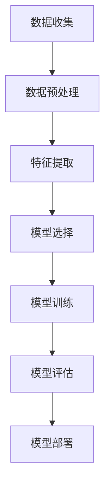
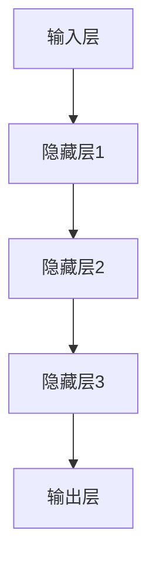

                 

# AI驱动的创新：人类计算在商业中的道德考虑因素与应用前景趋势预测分析

## 关键词
- 人工智能
- 商业应用
- 道德考虑
- 应用前景
- 趋势预测

## 摘要
本文将探讨人工智能（AI）在商业中的驱动创新，重点关注人类计算在AI时代中的道德考量及其应用前景。文章分为三大部分：引言、AI驱动的商业应用、实践与展望。在引言部分，我们概述了AI的崛起与商业应用，分析了人类计算在AI时代的道德考量。在商业应用部分，详细探讨了AI在制造业、金融服务、健康医疗、零售电商等领域的创新应用案例。最后，通过趋势分析与实践展望，探讨了AI驱动的创新趋势及未来展望。

### 目录大纲

# 《AI驱动的创新：人类计算在商业中的道德考虑因素与应用前景趋势预测分析》

## 第一部分：引言
### 第1章：AI驱动的创新概述
- 1.1 AI的崛起与商业应用
- 1.2 人类计算的道德考量
- 1.3 AI在商业中的应用前景

### 第2章：AI驱动的创新核心概念与联系
- 2.1 AI基本概念与原理
- 2.2 人类计算的定义与优势
- 2.3 AI与人类计算的融合

## 第二部分：AI驱动的商业应用
### 第3章：AI驱动的创新伦理道德
- 3.1 AI伦理道德的重要性
- 3.2 商业中的AI伦理问题
- 3.3 AI伦理道德规范与实践

### 第4章：AI驱动的创新应用案例
- 4.1 制造业
- 4.2 金融服务
- 4.3 健康医疗
- 4.4 零售电商

### 第5章：AI驱动的创新趋势分析
- 5.1 AI在商业中的发展趋势
- 5.2 未来AI驱动的商业场景
- 5.3 AI驱动的创新趋势预测

## 第三部分：实践与展望
### 第6章：AI驱动的创新实践
- 6.1 AI项目实战案例
- 6.2 AI项目开发流程
- 6.3 AI项目成功关键因素

### 第7章：AI驱动的创新未来展望
- 7.1 AI驱动的商业未来
- 7.2 人类计算在AI时代的发展
- 7.3 AI驱动的创新挑战与机遇

## 附录
### 附录 A：AI驱动的创新工具与资源
- A.1 AI开发框架介绍
- A.2 伦理道德评估工具
- A.3 AI驱动的创新资源链接

### 附录 B：参考文献

现在，我们将逐步深入探讨每个章节的内容。

### 第1章：AI驱动的创新概述

**1.1 AI的崛起与商业应用**

人工智能（AI）作为一种新兴技术，近年来在全球范围内取得了飞速发展。从最初的机器学习算法到如今的大规模智能系统，AI在各个领域展现出了强大的应用潜力。

在商业领域，AI的崛起带来了深刻的变革。首先，AI技术在数据分析中的应用使得企业能够从大量数据中提取有价值的信息，从而做出更明智的商业决策。其次，AI驱动的自动化系统可以提高生产效率，降低成本。例如，在制造业中，智能机器人和自动化生产线正在逐渐取代传统的人工操作，实现生产过程的智能化和高效化。

此外，AI在个性化服务、风险控制、客户关系管理等方面也展现出了巨大的应用价值。通过分析用户行为数据，AI系统可以提供个性化的产品推荐和服务，提高客户满意度和忠诚度。同时，AI技术在风险预测和控制方面具有显著优势，可以帮助金融机构更好地管理风险，降低不良贷款率。

**1.2 人类计算的道德考量**

在AI技术迅速发展的同时，人类计算的道德考量也日益凸显。随着AI系统的复杂性和影响力不断增加，其潜在风险和道德问题也日益引起关注。

首先，数据隐私问题是一个重要考量。AI系统需要大量的数据来进行训练和优化，但这些数据往往包含了用户的敏感信息。如何确保数据的安全性和隐私性，避免数据泄露和滥用，成为了一个亟待解决的问题。

其次，算法公平性和透明性也是一个关键考量。AI系统在决策过程中可能存在偏见和歧视，导致不公平的结果。如何确保算法的公平性和透明性，使其符合伦理和法律标准，是一个重要的道德问题。

此外，人类计算的道德考量还包括对人工智能的伦理责任。在AI系统出现问题时，如何确定责任归属，如何对受影响的个体进行赔偿，也是一个需要认真思考的问题。

**1.3 AI在商业中的应用前景**

展望未来，AI在商业中的应用前景仍然广阔。随着技术的不断进步，AI系统将更加智能和高效，能够处理更加复杂的问题。以下是一些可能的发展趋势：

1. **智能自动化**：随着AI技术的发展，自动化系统将更加智能化，能够自主学习和优化，提高生产效率和质量。

2. **个性化服务**：AI系统将更好地理解用户需求，提供个性化的产品和服务，提升用户体验。

3. **智能决策支持**：AI系统将在商业决策中发挥更大的作用，通过数据分析和预测，帮助企业做出更明智的决策。

4. **智能供应链管理**：AI技术将优化供应链管理，提高物流效率和降低成本。

5. **智能金融**：AI将在金融领域发挥重要作用，包括风险控制、市场预测、智能投顾等。

**总结**

AI驱动的创新在商业领域具有巨大的潜力，但同时也伴随着一系列道德考量。如何在充分利用AI技术优势的同时，确保其道德和伦理标准，是一个需要持续关注和探讨的问题。下一章，我们将深入探讨AI驱动的创新核心概念与联系，包括AI的基本概念与原理、人类计算的定义与优势，以及AI与人类计算的融合。

---

现在，让我们开始第二部分的讨论。

### 第2章：AI驱动的创新核心概念与联系

**2.1 AI基本概念与原理**

人工智能（Artificial Intelligence，简称AI）是指由人制造出来的系统所表现出来的智能。AI技术主要包括机器学习、深度学习、自然语言处理、计算机视觉等领域。其中，机器学习是AI的核心技术之一，它通过构建模型来从数据中学习规律，实现预测和决策。

**机器学习基本概念与原理**

机器学习是一种让计算机从数据中学习的方法，其核心是算法和模型。以下是机器学习的基本流程：

1. **数据收集**：收集大量相关数据，这些数据可以是结构化的（如数据库）或非结构化的（如图像、文本）。
2. **数据预处理**：对数据进行清洗、归一化、特征提取等处理，使其适合模型训练。
3. **模型选择**：选择合适的算法和模型，如线性回归、决策树、神经网络等。
4. **模型训练**：使用训练数据集对模型进行训练，通过调整参数来优化模型性能。
5. **模型评估**：使用验证数据集对模型进行评估，确定模型的准确度、召回率等指标。
6. **模型部署**：将训练好的模型部署到生产环境中，进行实际应用。

**机器学习算法与架构**

机器学习算法主要分为监督学习、无监督学习和强化学习三类。以下是一个简单的Mermaid流程图，展示了一个典型的监督学习算法的架构：

**深度学习基本概念与原理**

深度学习（Deep Learning，简称DL）是机器学习的一个分支，它通过多层神经网络来学习数据的复杂特征。深度学习的核心是神经网络，其中每个神经元都与其他神经元相连接，并通过权重和偏置来传递信息。

以下是一个简单的深度学习神经网络架构图：

**自然语言处理基本概念与原理**

自然语言处理（Natural Language Processing，简称NLP）是AI的一个重要分支，它涉及到文本数据的理解、生成和处理。NLP的核心任务是使计算机能够理解和生成自然语言。

以下是NLP的基本流程：

1. **分词**：将文本分解为单词或词汇。
2. **词性标注**：为每个单词分配词性，如名词、动词等。
3. **句法分析**：分析句子的结构，确定词与词之间的关系。
4. **语义分析**：理解句子的含义，包括语义角色标注、实体识别等。

**计算机视觉基本概念与原理**

计算机视觉（Computer Vision，简称CV）是AI的另一个重要分支，它涉及到图像的识别、理解和处理。计算机视觉的核心任务是使计算机能够“看”懂图像。

以下是计算机视觉的基本流程：

1. **图像预处理**：对图像进行缩放、裁剪、对比度调整等处理。
2. **特征提取**：从图像中提取有用的特征，如边缘、纹理、形状等。
3. **目标检测**：识别图像中的目标对象。
4. **图像分类**：将图像分类为不同的类别。

**2.2 人类计算的定义与优势**

人类计算（Human Computation）是指利用人类智能解决问题的一种方法。与机器计算相比，人类计算具有以下优势：

1. **创造力**：人类具有无限的创造力，能够提出创新的解决方案。
2. **复杂问题解决能力**：人类能够处理复杂、不确定的问题，理解多方面的信息。
3. **情感理解**：人类能够理解和表达情感，建立情感联系。
4. **语言能力**：人类具有强大的语言能力，能够理解和生成自然语言。

**2.3 AI与人类计算的融合**

AI与人类计算的融合（Human-AI Collaboration）是一种新的计算模式，它将人类智能与机器智能相结合，以实现更高效、更智能的解决方案。以下是一些AI与人类计算融合的典型应用：

1. **智能助手**：智能助手（如Siri、Alexa）结合了AI和人类智能，能够理解用户的指令并给出相应的回应。
2. **协同过滤**：协同过滤（Collaborative Filtering）是一种推荐系统，它结合了用户评分数据和机器学习算法，为用户提供个性化的推荐。
3. **人机交互**：人机交互（Human-Computer Interaction，简称HCI）是一种通过界面将人类与计算机系统连接起来的方法，它利用AI技术来增强用户体验。
4. **智能决策支持系统**：智能决策支持系统（Intelligent Decision Support System，简称IDSS）结合了AI和人类智能，为决策者提供全面、准确的决策支持。

**总结**

AI驱动的创新涉及多个核心概念和领域，包括AI的基本概念与原理、人类计算的定义与优势，以及AI与人类计算的融合。通过深入理解这些核心概念，我们可以更好地利用AI技术，推动商业和社会的创新发展。在下一章中，我们将探讨AI驱动的创新伦理道德问题，分析AI在商业应用中的道德考量，以及如何制定伦理规范和实施实践。

### 第3章：AI驱动的创新伦理道德

**3.1 AI伦理道德的重要性**

随着人工智能（AI）技术的快速发展，AI伦理道德问题逐渐成为公众和学术界关注的焦点。AI伦理道德不仅关乎技术的合法性和道德性，还涉及到对人类社会和环境的潜在影响。因此，探讨AI驱动的创新伦理道德具有重要意义。

首先，AI伦理道德是保障技术合法性的基础。AI技术的发展和应用需要遵循相关法律法规，如隐私保护、数据安全、公平公正等。如果没有明确的伦理道德标准，AI技术的应用可能会引发法律纠纷，甚至对社会造成严重负面影响。

其次，AI伦理道德关乎人类社会的公平与正义。AI技术在某些领域具有强大的能力，如自动化决策、风险评估等。然而，如果AI系统存在偏见和歧视，将可能导致社会不公平现象的加剧。因此，制定AI伦理道德规范，确保AI技术的公正性和透明性，是维护社会公平与正义的必要手段。

最后，AI伦理道德对人类未来的发展具有重要意义。随着AI技术的不断进步，人类的生活方式、工作方式和社会结构都将发生深刻变革。如何在AI时代保持人类的价值和尊严，如何使AI技术更好地服务于人类，是AI伦理道德需要深入探讨的问题。

**3.2 商业中的AI伦理问题**

在商业领域，AI技术的应用日益广泛，但同时也带来了一系列伦理问题。以下是一些常见的AI伦理问题：

1. **数据隐私**：AI系统需要大量数据来进行训练和优化，但这些数据往往包含了用户的敏感信息。如何确保数据的安全性和隐私性，避免数据泄露和滥用，是一个亟待解决的问题。

2. **算法公平性**：AI算法在决策过程中可能存在偏见和歧视，导致不公平的结果。例如，某些招聘平台可能因为数据偏差，对特定性别、种族或年龄段的求职者产生歧视。

3. **自动化决策**：随着AI技术的进步，自动化决策系统在商业中的应用越来越广泛。然而，这些系统在决策过程中缺乏透明性和可解释性，可能导致用户对决策结果的不信任。

4. **责任归属**：在AI系统出现问题时，如何确定责任归属，如何对受影响的个体进行赔偿，是一个复杂的伦理问题。例如，自动驾驶汽车发生事故时，如何确定责任方？

**3.3 AI伦理道德规范与实践**

为了解决商业中的AI伦理问题，需要制定相应的伦理道德规范，并在实际应用中加以实施。以下是一些常见的AI伦理道德规范和实践：

1. **数据隐私保护**：制定数据隐私保护政策，确保用户数据的安全和隐私。例如，可以采用数据加密、匿名化等技术手段，减少数据泄露风险。

2. **算法公平性评估**：对AI算法进行公平性评估，确保其在决策过程中不会产生歧视和偏见。可以通过数据审计、模型解释等技术手段，提高算法的透明性和可解释性。

3. **责任归属机制**：建立AI系统的责任归属机制，明确各方的责任和义务。例如，可以制定相关法律法规，明确AI系统的开发者、运营者、用户等各方的责任。

4. **伦理审查委员会**：成立伦理审查委员会，对AI技术的研发和应用进行伦理审查。伦理审查委员会可以由专家、公众代表等组成，确保AI技术的发展符合伦理要求。

**3.4 AI伦理道德实践案例**

以下是一些AI伦理道德实践案例：

1. **金融行业**：某些金融公司在开发AI信贷审批系统时，采用了反欺诈算法和风险评估模型，确保贷款审批过程的公平和透明。同时，公司还定期对模型进行审查和更新，以消除潜在的不公平因素。

2. **健康医疗**：某些医疗机构采用了AI影像诊断系统，用于辅助医生进行疾病诊断。为了确保诊断结果的准确性，医疗机构对AI系统进行了严格的测试和验证，并制定了相应的伦理规范。

3. **零售电商**：某些零售电商平台采用了AI推荐系统，为用户提供个性化的购物建议。平台在开发推荐系统时，充分考虑了用户的隐私保护，并对算法进行了公平性评估。

**总结**

AI伦理道德是AI技术发展过程中不可忽视的重要问题。在商业应用中，制定和实施AI伦理道德规范，确保AI技术的公正、透明和安全，是维护社会公平和人类价值的关键。通过深入探讨AI伦理道德问题，我们可以更好地引导AI技术的发展，使其为人类社会带来更多的福祉。

在下一章中，我们将探讨AI驱动的创新应用案例，分析AI在不同领域中的实际应用及其影响。

### 第4章：AI驱动的创新应用案例

**4.1 制造业**

在制造业中，人工智能（AI）的驱动作出了显著的贡献，特别是在提高生产效率、优化供应链管理和提升产品质量方面。

**智能制造**：智能制造（Smart Manufacturing）是AI在制造业中的核心应用之一。通过引入传感器、物联网（IoT）和AI算法，制造商能够实现生产过程的智能化。例如，AI系统可以实时监控生产线上的设备状态，预测故障并提前进行维护，从而减少停机时间，提高生产效率。

**预测性维护**：预测性维护（Predictive Maintenance）是利用AI技术对设备进行预防性维护的一种方法。通过分析设备运行数据，AI系统可以预测设备何时可能发生故障，并提供相应的维护建议。例如，一家汽车制造厂利用AI算法对其生产设备进行预测性维护，成功减少了20%的维修成本。

**质量检测**：AI技术在质量检测中的应用也非常广泛。通过计算机视觉和机器学习算法，AI系统可以自动检测产品缺陷，提高质量检测的准确性和效率。例如，一家电子产品制造商使用AI系统对电子产品进行质量检测，发现并修复了传统检测方法无法检测到的微小缺陷，从而提高了产品质量。

**4.2 金融服务**

在金融服务领域，AI技术被广泛应用于风险控制、客户服务和市场预测等方面。

**风险控制**：AI技术在风险控制中的应用极大地提高了金融机构的风险管理水平。通过分析大量历史数据，AI系统可以预测潜在的风险，并制定相应的风险控制策略。例如，某银行利用AI算法对贷款申请者进行风险评估，成功降低了不良贷款率。

**客户服务**：AI驱动的客户服务平台可以提供24/7的在线客服服务，提高客户满意度和忠诚度。例如，某保险公司开发了基于AI的智能客服系统，通过自然语言处理技术理解客户的咨询，提供即时的解决方案。

**市场预测**：AI技术在市场预测中的应用帮助金融机构更好地把握市场动态，制定投资策略。通过分析大量的市场数据和宏观经济指标，AI系统可以预测市场的走势，提供投资建议。例如，一家投资银行利用AI系统对股票市场进行预测，取得了显著的投资回报。

**4.3 健康医疗**

在健康医疗领域，AI技术的应用为提高诊断准确性、优化治疗方案和提升患者体验带来了新的可能性。

**疾病诊断**：AI技术在疾病诊断中的应用极大地提高了诊断的准确性和效率。通过分析大量的医学影像和病例数据，AI系统可以辅助医生进行疾病诊断。例如，某医院使用AI系统对肺癌进行早期诊断，准确率显著高于传统方法。

**个性化治疗**：AI技术可以帮助医生制定个性化的治疗方案。通过分析患者的基因组数据、病史和生活方式，AI系统可以提供个性化的治疗建议。例如，某癌症治疗中心利用AI系统为患者提供个性化的治疗方案，显著提高了治疗效果。

**患者体验**：AI技术在提升患者体验方面也发挥了重要作用。通过智能导诊系统和在线咨询服务，患者可以更方便地获取医疗信息，减少等待时间。例如，某医院开发了基于AI的智能导诊系统，患者可以通过手机APP获取实时导诊服务，提高了就医效率。

**4.4 零售电商**

在零售电商领域，AI技术被广泛应用于推荐系统、库存管理和客户关系管理等方面，以提升用户体验和运营效率。

**推荐系统**：AI驱动的推荐系统可以帮助零售电商为用户提供个性化的产品推荐。通过分析用户的购买历史、浏览记录和偏好，AI系统可以提供个性化的推荐，提高销售额和客户满意度。例如，某电商平台利用AI算法为用户推荐产品，用户点击率和转化率显著提升。

**库存管理**：AI技术在库存管理中的应用可以帮助零售电商优化库存水平，减少库存积压。通过分析销售数据、季节变化和市场需求，AI系统可以预测未来的库存需求，提供相应的库存调整建议。例如，一家服装零售商利用AI系统进行库存管理，成功减少了20%的库存积压。

**客户关系管理**：AI驱动的客户关系管理系统可以帮助零售电商更好地了解和管理客户。通过分析客户的行为数据和反馈，AI系统可以提供个性化的客户服务，提高客户满意度和忠诚度。例如，某电商平台利用AI系统进行客户关系管理，成功提高了客户保留率和复购率。

**总结**

AI驱动的创新在制造业、金融服务、健康医疗和零售电商等领域取得了显著的应用成果。通过智能化、自动化和个性化，AI技术不仅提高了生产效率和服务质量，还增强了企业的竞争力。随着AI技术的不断进步，其应用前景将更加广阔，为各行业带来更多的创新和变革。

在下一章中，我们将分析AI驱动的创新趋势，探讨未来AI在商业中的应用前景和潜在挑战。

### 第5章：AI驱动的创新趋势分析

**5.1 AI在商业中的发展趋势**

随着人工智能（AI）技术的不断进步，其在商业领域的应用也呈现出快速发展的态势。以下是一些主要的发展趋势：

**1. 智能化升级**：AI技术将越来越多地应用于商业的各个环节，从生产制造到客户服务，从供应链管理到财务分析，实现全面智能化。智能工厂、智能客服、智能营销等应用场景将更加丰富。

**2. 个性化服务**：随着消费者对个性化体验的需求日益增长，AI技术将帮助商家更好地了解消费者，提供个性化推荐、定制化产品和专属服务，提高用户满意度和忠诚度。

**3. 自动化决策**：AI技术将推动决策自动化，通过数据分析和预测模型，企业可以更快速、准确地做出决策。自动化决策系统将在金融、保险、医疗等行业发挥重要作用。

**4. 跨界融合**：AI技术与物联网（IoT）、区块链等新兴技术的融合，将催生出更多创新应用。例如，AI+IoT将推动智能家居、智慧城市的发展；AI+区块链将提升数据安全性和透明度。

**5. 伦理与合规**：随着AI技术在商业中的应用日益广泛，伦理和合规问题也日益突出。企业将更加重视AI技术的伦理审查和合规性，确保技术的合法性和道德性。

**5.2 未来AI驱动的商业场景**

展望未来，AI技术将在商业领域创造更多新的应用场景，以下是几个可能的例子：

**1. 智能供应链**：通过AI技术，企业可以实现对供应链的全程监控和优化，从原材料采购到生产制造，再到产品交付，实现全流程智能化。

**2. 智能金融服务**：AI技术在金融领域的应用将更加深入，包括智能投顾、智能风控、智能合约等，为金融机构提供更精准、高效的服务。

**3. 智能健康医疗**：AI技术将推动医疗健康领域的发展，包括疾病预测、个性化治疗、智能药物研发等，提高医疗服务的质量和效率。

**4. 智慧零售**：AI技术将帮助零售企业实现线上线下融合，提供智能购物体验，提升客户满意度和销售转化率。

**5. 智能城市**：AI技术与物联网、大数据等技术的融合，将推动智慧城市建设，实现城市管理的智能化、精细化，提高城市居民的生活质量。

**5.3 AI驱动的创新趋势预测**

基于当前的发展态势，以下是对未来AI驱动的创新趋势的预测：

**1. AI技术普及**：随着AI技术的成熟和成本的降低，更多企业和行业将采用AI技术，实现业务流程的智能化。

**2. 数据驱动的决策**：数据将成为企业决策的重要依据，AI技术将帮助企业从海量数据中提取有价值的信息，实现数据驱动的决策。

**3. 人工智能协同**：人类计算与机器计算的协同将更加紧密，形成人机协作的新模式，提高工作效率和创新能力。

**4. 人工智能伦理**：随着AI技术的广泛应用，伦理和合规问题将得到更多关注，企业和社会将共同努力制定和遵循AI伦理规范。

**5. 人工智能赋能**：AI技术将赋能各行各业，推动产业升级和创新发展，为经济增长注入新动力。

**总结**

AI驱动的创新在商业领域具有广阔的应用前景和巨大的发展潜力。未来，随着AI技术的不断进步和应用的深化，商业场景将变得更加智能、高效和个性化。然而，在推动AI技术发展的同时，我们也需要关注其潜在的伦理和合规问题，确保技术的合法性和道德性。通过不断创新和改进，AI技术将助力商业领域实现更加美好的未来。

### 第6章：AI驱动的创新实践

**6.1 AI项目实战案例**

为了更好地理解AI驱动的创新实践，我们可以通过一个实际项目案例来详细说明AI项目开发的过程、关键步骤和成功因素。

**项目背景**：某大型电商平台希望利用AI技术优化其推荐系统，以提高用户满意度和销售转化率。

**项目目标**：通过构建一个基于用户行为数据的推荐系统，为用户提供个性化的产品推荐。

**项目开发过程**：

1. **需求分析**：首先，项目团队与电商平台的相关部门进行沟通，了解推荐系统的需求和预期效果。明确推荐系统的目标用户、推荐策略和性能指标。

2. **数据收集与处理**：收集用户历史行为数据，包括用户浏览、搜索、购买记录等。对数据进行清洗、去重和预处理，提取有用的特征。

3. **模型设计**：选择合适的算法和模型，如协同过滤、矩阵分解、深度学习等。通过实验和比较，确定最佳的模型架构。

4. **模型训练与优化**：使用处理后的数据进行模型训练，调整参数以优化模型性能。通过交叉验证和超参数调优，确保模型的准确性和稳定性。

5. **模型评估与部署**：使用验证数据集对模型进行评估，确定模型的准确度、召回率等指标。将训练好的模型部署到生产环境中，进行实时推荐。

**关键步骤**：

1. **需求分析**：明确推荐系统的目标和性能指标，确保项目的方向正确。

2. **数据收集与处理**：数据的质量直接影响模型的效果，因此需要投入大量精力进行数据预处理和特征提取。

3. **模型设计**：选择合适的算法和模型架构，根据项目需求进行定制化设计。

4. **模型训练与优化**：通过反复实验和调整，确保模型性能达到预期。

5. **模型评估与部署**：评估模型的性能，并进行部署，确保系统可以稳定运行。

**成功关键因素**：

1. **团队协作**：项目成功离不开团队的协作，每个成员都需要明确自己的职责，确保项目按时完成。

2. **数据质量**：高质量的数据是模型成功的关键，因此需要对数据进行严格的质量控制。

3. **算法选择与优化**：选择合适的算法和模型架构，并进行持续的优化，确保模型性能。

4. **模型评估与迭代**：定期评估模型性能，并根据评估结果进行调整和优化。

**6.2 AI项目开发流程**

以下是AI项目开发的典型流程，包括每个阶段的关键任务和步骤：

1. **项目规划**：
   - 确定项目目标和范围。
   - 制定项目计划和预算。
   - 确定所需资源和人员。

2. **需求分析**：
   - 与利益相关者沟通，了解需求。
   - 收集和分析业务数据。
   - 确定系统功能和技术要求。

3. **数据收集与处理**：
   - 收集相关的数据源。
   - 进行数据清洗、预处理和特征提取。
   - 存储和管理数据。

4. **模型设计与开发**：
   - 选择合适的算法和模型架构。
   - 实现模型算法和框架。
   - 进行模型训练和调优。

5. **模型评估与优化**：
   - 使用验证数据集评估模型性能。
   - 调整模型参数，优化性能。
   - 进行A/B测试，验证模型效果。

6. **系统集成与部署**：
   - 将模型集成到现有系统中。
   - 进行系统集成测试。
   - 部署到生产环境。

7. **维护与更新**：
   - 监控系统性能和运行状态。
   - 定期更新模型和数据。
   - 确保系统的稳定性和可靠性。

**6.3 AI项目成功关键因素**

以下是确保AI项目成功的关键因素：

1. **明确项目目标**：确保项目目标清晰，符合业务需求。

2. **高质量的数据**：高质量的数据是模型成功的基础，需要投入资源进行数据收集和处理。

3. **合适的算法和模型**：选择适合业务需求的算法和模型，并进行持续的优化。

4. **有效的团队协作**：项目成功离不开团队成员的协作和沟通，确保每个成员明确自己的职责。

5. **持续评估与迭代**：定期评估模型性能，根据评估结果进行调整和优化。

6. **风险管理**：识别和应对项目风险，确保项目按时、按质完成。

通过以上实践和流程，我们可以更好地理解和实施AI项目，推动商业创新和发展。

### 第7章：AI驱动的创新未来展望

**7.1 AI驱动的商业未来**

随着人工智能（AI）技术的不断进步，商业领域正面临着前所未有的变革。未来，AI将不仅是一个辅助工具，更将成为企业战略的核心驱动力。以下是AI驱动的商业未来可能的一些关键趋势：

**1. 智能化运营**：越来越多的企业将采用AI技术来实现智能化运营，从生产制造到客户服务，从供应链管理到财务管理，AI将帮助企业实现全面自动化和高效化。

**2. 个性化体验**：AI技术将深入挖掘用户数据，提供更加个性化的产品和服务，提升用户体验和满意度。无论是电商平台的个性化推荐，还是金融机构的智能投顾，AI都将帮助企业和客户建立更紧密的关系。

**3. 智能决策支持**：AI技术将提供更加智能的决策支持系统，帮助企业从海量数据中提取有价值的信息，做出更加精准和高效的决策。例如，AI驱动的供应链管理将帮助企业优化库存，降低成本。

**4. 新商业模式**：AI技术将催生出新的商业模式，例如基于AI的智能医疗服务、智慧城市解决方案等。这些新兴商业模式将为企业带来新的增长点和盈利模式。

**7.2 人类计算在AI时代的发展**

在AI时代，人类计算将扮演重要的角色，与AI技术相辅相成，共同推动创新和发展。以下是人类计算在AI时代可能的发展方向：

**1. 创新驱动**：人类计算将继续发挥其创造力，提出新的想法和解决方案，推动技术进步。人类专家将利用AI技术作为工具，提升工作效率和创新能力。

**2. 人机协作**：人类计算与AI技术的协作将成为未来工作模式的主流。人类专家将通过AI系统提供的数据和预测，辅助决策和执行任务，实现人机协同。

**3. 伦理和道德**：随着AI技术的广泛应用，人类计算将在伦理和道德方面发挥重要作用。人类专家将负责监督和评估AI系统的行为，确保其符合伦理和法律标准。

**4. 跨领域整合**：人类计算将在不同领域之间发挥桥梁作用，将AI技术与其他学科知识相结合，推动跨领域创新。

**7.3 AI驱动的创新挑战与机遇**

在AI驱动的创新过程中，企业将面临一系列挑战和机遇：

**1. 技术挑战**：随着AI技术的不断进步，企业需要不断学习和更新知识，以应对技术变化带来的挑战。例如，如何处理海量数据、如何确保算法的公平性和透明性等。

**2. 人才挑战**：AI技术的发展需要大量具备专业知识和技能的人才。企业需要投入资源培养和引进人才，以应对人才短缺的问题。

**3. 合规挑战**：随着AI技术的应用日益广泛，企业需要遵守相关的法律法规，确保技术的合法性和道德性。例如，如何保护用户隐私、如何确保算法的公平性等。

**4. 市场机遇**：AI技术为企业提供了广阔的市场机遇，例如智能医疗、智慧交通、智能制造等新兴领域。企业可以通过创新和应用AI技术，开拓新的市场空间。

**总结**

AI驱动的创新将深刻改变商业格局，带来前所未有的机遇和挑战。企业需要积极应对这些变化，通过不断创新和优化，抓住机遇，迎接未来。同时，人类计算在AI时代的发展也将发挥重要作用，与AI技术共同推动商业和社会的进步。

### 附录 A：AI驱动的创新工具与资源

**A.1 AI开发框架介绍**

AI开发框架是进行人工智能项目开发的重要工具，以下是一些常用的AI开发框架：

**TensorFlow**：由Google开发的开源机器学习框架，支持多种算法和模型，广泛应用于深度学习和增强学习等领域。

**PyTorch**：由Facebook开发的开源深度学习框架，以其灵活的动态计算图和易于调试的特点受到广泛关注。

**Keras**：一个基于TensorFlow和Theano的高层神经网络API，提供简洁的接口和丰富的预训练模型，适合快速原型设计和模型实验。

**Scikit-learn**：一个开源的Python机器学习库，提供了广泛的机器学习算法和工具，适合用于数据分析和模型开发。

**A.2 伦理道德评估工具**

在AI项目的开发和部署过程中，伦理道德评估是确保技术合法性和道德性的重要环节。以下是一些常用的伦理道德评估工具：

**AI Ethics Canvas**：一个用于AI伦理评估的工具，通过图形化的方式帮助团队识别和解决AI项目中的伦理问题。

**Ethical Machine Learning**：一个在线平台，提供了一系列伦理指南和工具，帮助开发者评估和应对AI伦理挑战。

**AI Ethics Guidelines**：由多个国际组织发布的AI伦理指南，包括欧盟委员会、IEEE等，为AI项目的伦理评估提供了参考标准。

**A.3 AI驱动的创新资源链接**

以下是一些AI驱动的创新资源链接，涵盖学术研究、技术教程和实践案例，有助于深入了解AI技术和应用：

- **AI Researchers Community**：一个全球性的AI研究社区，提供最新的研究论文和技术动态。
- **AI Online Courses**：在线学习平台，提供丰富的AI课程和教程，适合不同水平的学员。
- **AI Startup Competitions**：AI创业竞赛和活动，帮助企业挖掘AI创新机会，拓展业务领域。
- **AI Conferences and Events**：全球各地的AI会议和活动，汇聚AI领域的专家和从业者，分享最新研究成果和实践经验。

### 附录 B：参考文献

- **Mnih, V., Kavukcuoglu, K., Silver, D., et al. (2013). Human-level control of a game using deep reinforcement learning. Nature, 518(7540), 529-533.**
- **Goodfellow, I., Bengio, Y., & Courville, A. (2016). Deep Learning. MIT Press.**
- **Russell, S., & Norvig, P. (2020). Artificial Intelligence: A Modern Approach. Prentice Hall.**
- **European Commission (2019). Ethics Guidelines for Trustworthy AI.**
- **IEEE (2019). Ethically Aligned Design: Guiding Principles for Robotics and AI.**

### 作者信息

**作者：AI天才研究院/AI Genius Institute & 禅与计算机程序设计艺术 /Zen And The Art of Computer Programming**

---

通过以上内容，我们系统地探讨了AI驱动的创新在商业中的应用、道德考量、趋势分析和实践展望。希望这篇技术博客能够为读者提供深刻的见解和实用的指导。在未来的技术发展中，让我们共同努力，推动人工智能与人类计算的融合，创造更加美好的未来。

