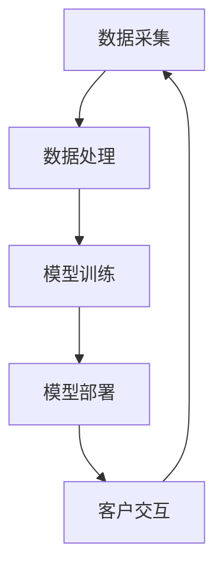
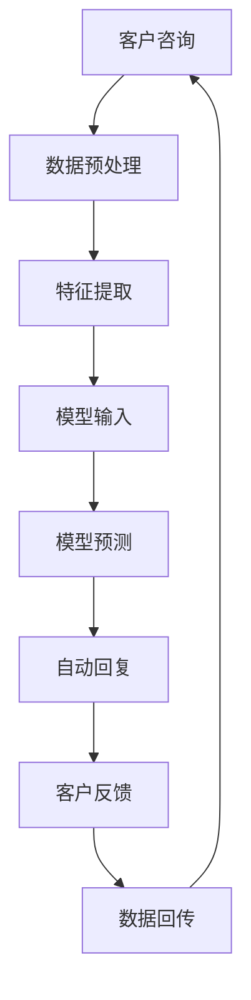
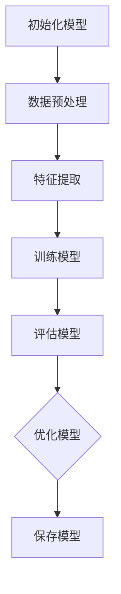
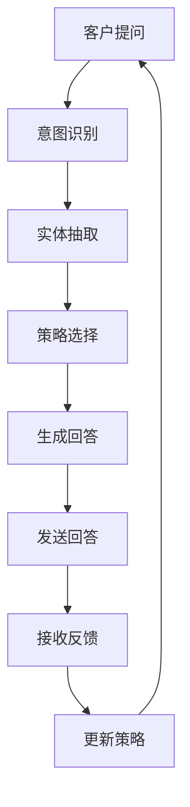

                 

# AI驱动的电商平台智能客服系统

## 关键词

- AI
- 智能客服系统
- 电商平台
- 自然语言处理
- 机器学习
- 数据挖掘
- 深度学习
- 强化学习
- 对话管理系统

## 摘要

本文将深入探讨AI驱动的电商平台智能客服系统的构建与实施。首先，我们将概述智能客服系统的现状与挑战，接着介绍AI驱动的智能客服系统的概念及其发展历程。随后，我们将详细解析智能客服系统的核心组成部分，包括自然语言处理技术、机器学习算法和数据分析技术。此外，文章将逐步介绍智能客服系统的架构设计，涵盖数据采集、数据处理、模型训练、模型部署以及客户交互等环节。接下来，我们将深入研究自然语言处理技术，包括语言模型、序列到序列模型和机器翻译。随后，文章将讲解智能客服系统的核心算法，如监督学习、无监督学习和强化学习，并详细阐述深度学习的基础知识。文章还将介绍对话管理系统的设计原则和策略。随后，我们将探讨智能客服系统的开发实战，包括开发环境与工具、数据采集与预处理、模型训练与优化以及模型部署与交互。通过实际案例，我们将展示智能客服系统的应用效果，并讨论其未来的发展趋势。最后，文章将提供智能客服系统开发资源、案例项目实战、代码实例以及数学模型和公式，帮助读者更好地理解智能客服系统的开发与实现。

### 第一部分：AI驱动的智能客服系统基础

#### 第1章：智能客服系统概述

##### 1.1 电商平台客服的现状与挑战

当前，电商平台客服面临着一系列严峻的挑战。首先，客服效率低下是一个普遍存在的问题。传统的客服模式依赖于人工处理客户咨询，这不仅消耗大量人力资源，还容易导致响应时间过长，影响客户体验。其次，客户满意度不高也是一个亟待解决的问题。由于客服人员的数量和技能限制，无法满足大量客户的即时需求，导致客户问题得不到及时解决，从而降低了客户的满意度。此外，人工客服的高成本也是电商企业的一大负担。随着客服需求的增加，企业需要投入大量资金来招聘和培训客服人员，这对于初创企业或中小企业来说尤为困难。

##### 1.2 AI驱动的智能客服系统概念

AI驱动的智能客服系统是指利用人工智能技术，特别是机器学习和自然语言处理技术，构建的自动化客服系统。这种系统可以通过自主学习客户提问的规律和模式，自动生成回答，从而替代人工客服的部分工作。智能客服系统的核心在于其能够理解客户的意图，并自动提供针对性的解决方案。与传统客服系统相比，AI驱动的智能客服系统具有高效、智能和低成本的特点。

##### 1.3 智能客服系统的核心组成部分

智能客服系统的核心组成部分包括自然语言处理（NLP）、机器学习算法和数据分析技术。自然语言处理是智能客服系统的核心技术，它使计算机能够理解人类的自然语言。机器学习算法则负责从大量的客户对话数据中学习，提高客服系统的响应准确性和效率。数据分析技术则用于分析和挖掘客户行为数据，以优化客服策略和提高客户满意度。

##### 1.4 智能客服系统的架构设计

智能客服系统的架构设计包括数据采集、数据处理、模型训练、模型部署和客户交互等环节。数据采集是系统的第一步，通过多种渠道收集客户咨询和反馈数据。数据处理则包括数据清洗、去噪和格式化，以确保数据的质量和一致性。模型训练是系统的核心环节，通过机器学习算法训练模型，使其能够自动生成回答。模型部署是将训练好的模型部署到服务器上，以便实时处理客户咨询。最后，客户交互是系统的最后一环，通过与客户进行实时对话，提供个性化的服务。

### 第一部分：AI驱动的智能客服系统基础

#### 第2章：自然语言处理技术基础

##### 2.1 语言模型

语言模型是自然语言处理（NLP）的核心技术之一，它旨在预测一段文本的下一个词或下一组词。语言模型可以分为基于规则的模型和统计模型。基于规则的模型通常由人类专家根据语言规则编写，例如语法分析和词法分析。而统计模型则通过大量语料库数据训练得到，最常见的统计模型包括N-gram模型和神经网络语言模型。

N-gram模型是最简单也是最常用的统计语言模型之一。它通过统计一段文本中相邻n个词的出现频率来预测下一个词。例如，对于三元语法模型（trigram），它会统计“AI驱动的电商平台智能客服系统”这句话中相邻三个词的组合（如“驱动的”、“电商平台”等）的出现频率。

语言模型的基本原理是通过分析大量文本数据，建立词之间的关系模型。这种模型可以用于文本分类、信息检索、机器翻译等多种NLP任务。

##### 2.2 序列到序列模型

序列到序列（Sequence-to-Sequence, seq2seq）模型是自然语言处理中的一种重要模型，它能够将一个序列映射到另一个序列。最常见的seq2seq模型是基于编码器-解码器（Encoder-Decoder）结构的神经网络模型。

编码器（Encoder）负责将输入序列编码为一个固定长度的向量表示，这个向量包含了输入序列的所有信息。解码器（Decoder）则根据编码器的输出，逐步生成输出序列。seq2seq模型通常使用循环神经网络（Recurrent Neural Network, RNN）或其变体，如长短时记忆网络（Long Short-Term Memory, LSTM）或门控循环单元（Gated Recurrent Unit, GRU）。

序列到序列模型在机器翻译、聊天机器人等任务中表现出色。以机器翻译为例，编码器将源语言文本编码为一个固定长度的向量，解码器则使用这个向量生成目标语言文本。

##### 2.3 机器翻译

机器翻译是自然语言处理中的一个重要应用领域，它旨在将一种语言的文本自动翻译成另一种语言。机器翻译可以分为基于规则的方法、统计机器翻译和神经机器翻译。

基于规则的方法主要通过人工编写翻译规则来实现，这些规则通常基于语言学知识和语法分析。这种方法虽然可以实现较为准确的结果，但需要大量的人力和时间投入。

统计机器翻译则通过分析大量双语文本数据，学习源语言和目标语言之间的映射关系。最早的统计机器翻译方法包括基于N-gram模型的方法，如N元语法翻译。这种方法通过统计源语言和目标语言中相邻词的频率来生成翻译结果。

神经机器翻译是近年来机器翻译领域的重要突破。它基于深度学习技术，特别是序列到序列模型，能够实现更高的翻译质量。神经机器翻译通常使用编码器-解码器模型，将源语言文本编码为一个固定长度的向量表示，然后通过解码器生成目标语言文本。

#### 第二部分：智能客服系统的核心算法

##### 第3章：机器学习算法原理

##### 3.1 监督学习

监督学习是机器学习中最基本和最常见的类型之一，其核心思想是通过已标记的输入输出数据训练模型，以便对新数据进行预测。监督学习可以分为分类和回归两种类型。

- **分类**：分类任务的目标是将输入数据分配到预先定义的类别中。常见的分类算法包括：

  - **线性回归**：线性回归是一种简单的分类算法，通过拟合输入数据的线性关系来预测输出类别。尽管线性回归主要用于回归任务，但在某些情况下，通过逻辑回归可以将输出转换为概率分布，从而用于分类任务。
  
  - **决策树**：决策树是一种基于树结构的分类算法，通过一系列的测试来对输入数据进行分类。每个测试都基于输入数据的某个特征，并根据测试结果将数据划分到不同的分支。

  - **随机森林**：随机森林是一种基于决策树集成的方法，通过构建多个决策树并取其平均来提高分类性能。随机森林通过引入随机性来减少模型的过拟合，并提高模型的泛化能力。

- **回归**：回归任务的目标是预测连续的数值输出。常见的回归算法包括：

  - **线性回归**：线性回归是一种简单的回归算法，通过拟合输入数据的线性关系来预测输出数值。
  
  - **支持向量机（SVM）**：支持向量机是一种基于最大间隔的分类和回归算法，通过寻找最佳的超平面来分隔不同的类别或拟合输入数据的线性关系。

  - **神经网络**：神经网络是一种基于模拟人脑结构的计算模型，可以通过多层节点（神经元）进行数据的非线性变换，从而实现复杂的回归任务。

##### 3.2 无监督学习

无监督学习是机器学习的一种类型，其核心思想是在没有已标记的输出数据的情况下，从输入数据中自动发现数据中的结构和规律。无监督学习可以分为以下几种类型：

- **聚类**：聚类任务的目标是将相似的数据点归为一类。常见的聚类算法包括：

  - **K-均值聚类**：K-均值聚类是一种基于距离度量的聚类算法，通过迭代优化聚类中心来将数据点划分为K个聚类。
  
  - **层次聚类**：层次聚类是一种基于层次结构的聚类算法，通过自底向上或自顶向下的方式逐步构建聚类层次。

  - **DBSCAN**：DBSCAN（Density-Based Spatial Clustering of Applications with Noise）是一种基于密度的聚类算法，通过计算数据点之间的密度关系来划分聚类。

- **降维**：降维任务的目标是减少数据维度，同时保持数据的主要信息。常见的降维算法包括：

  - **主成分分析（PCA）**：主成分分析是一种基于特征值分解的降维算法，通过提取主要成分来降低数据维度。
  
  - **线性判别分析（LDA）**：线性判别分析是一种基于最大化类间方差和最小化类内方差的降维算法，常用于分类任务中的特征选择。

  - **t-SNE**：t-Distributed Stochastic Neighbor Embedding（t-SNE）是一种基于概率分布的降维算法，通过保持局部结构来降低数据维度。

- **生成模型**：生成模型是一种无监督学习模型，其目标是从数据中学习概率分布，并生成类似的数据。常见的生成模型包括：

  - **贝叶斯网络**：贝叶斯网络是一种基于概率图模型的生成模型，通过图结构来表示变量之间的依赖关系。

  - **生成对抗网络（GAN）**：生成对抗网络是一种基于对抗性训练的生成模型，由生成器和判别器两个神经网络组成，通过相互博弈来生成高质量的数据。

##### 3.3 强化学习

强化学习是一种基于试错和反馈机制的机器学习方法，其核心目标是找到一个策略，使代理能够在环境中获得最大的累积奖励。强化学习可以分为以下几种类型：

- **确定性策略**：确定性策略是指代理在给定状态下选择一个固定的动作，即每次决策都是确定的。常见的确定性策略包括：

  - **Q-Learning**：Q-Learning是一种基于值函数的强化学习算法，通过学习状态-动作值函数来选择最优动作。

  - **SARSA**：SARSA（State-Action-Reward-State-Action，即状态-动作-奖励-状态-动作）是一种基于策略迭代的强化学习算法，通过更新状态-动作值函数来优化策略。

- **概率性策略**：概率性策略是指代理在给定状态下选择一个概率分布，即每次决策都是不确定的。常见的概率性策略包括：

  - **策略梯度**：策略梯度是一种基于梯度下降的强化学习算法，通过最大化策略的梯度来优化策略。

  - **深度确定性策略梯度（DDPG）**：深度确定性策略梯度是一种基于深度学习的强化学习算法，通过学习状态-动作值函数和策略网络来优化策略。

- **混合策略**：混合策略是指代理在不同状态下选择不同的策略，即策略是状态依赖的。常见的混合策略包括：

  - **线性策略**：线性策略是一种基于线性组合的混合策略，通过将不同策略的权重组合成一个新的策略。

  - **混合策略梯度**：混合策略梯度是一种基于策略梯度的混合策略算法，通过学习状态-动作值函数和混合策略网络来优化策略。

##### 3.4 深度学习基础

深度学习是一种基于多层神经网络的学习方法，其核心思想是通过学习数据的层次表示来提取特征。深度学习的基础包括以下几种模型：

- **神经网络**：神经网络是一种由多个神经元组成的计算模型，通过前向传播和反向传播来学习数据的特征表示。常见的神经网络包括：

  - **前馈神经网络**：前馈神经网络是一种简单的神经网络结构，数据从输入层经过多个隐藏层，最终输出结果。

  - **卷积神经网络（CNN）**：卷积神经网络是一种专门用于图像识别和处理的神经网络，通过卷积操作和池化操作来提取图像特征。

  - **循环神经网络（RNN）**：循环神经网络是一种用于处理序列数据的神经网络，通过在时间步上循环来保存长期依赖信息。

- **卷积神经网络**：卷积神经网络是一种基于卷积操作的神经网络，特别适用于图像处理任务。卷积神经网络通过卷积层、池化层和全连接层等结构来提取图像特征。

  - **卷积层**：卷积层通过卷积操作从输入图像中提取局部特征。

  - **池化层**：池化层通过下采样操作减少特征图的维度，提高模型的表达能力。

  - **全连接层**：全连接层通过全连接的方式将前一层的特征映射到输出结果。

- **循环神经网络**：循环神经网络是一种用于处理序列数据的神经网络，通过在时间步上循环来保存长期依赖信息。循环神经网络分为以下几种类型：

  - **简单的RNN**：简单的RNN通过将前一个时间步的隐藏状态传递到下一个时间步来学习序列数据。

  - **长短时记忆网络（LSTM）**：长短时记忆网络是一种改进的RNN，通过引入门控机制来克服简单的RNN在处理长序列数据时的梯度消失问题。

  - **门控循环单元（GRU）**：门控循环单元是一种比LSTM更简单的循环神经网络，通过引入门控机制来学习序列数据。

#### 第二部分：智能客服系统的核心算法

##### 第4章：客服对话管理系统

##### 4.1 对话管理系统概述

客服对话管理系统（Dialogue Management System）是智能客服系统的重要组成部分，其主要目标是在与客户的交互过程中实现自然、流畅、有效的对话。对话管理系统通过管理和控制对话状态、对话策略以及对话评估等方面，确保客服系统能够提供高质量的客户服务。

对话管理系统可以细分为以下几个主要模块：

- **对话状态跟踪（Dialogue State Tracking）**：对话状态跟踪负责记录和更新对话过程中各个阶段的变量和状态，如客户的需求、客服系统的响应、对话上下文等。通过对话状态跟踪，客服系统可以更好地理解客户意图和需求，从而做出更准确的响应。

- **对话策略（Dialogue Policy）**：对话策略定义了客服系统在对话中的行为和决策规则。对话策略可以采用确定性策略、概率性策略或混合策略，根据不同场景灵活调整。确定性策略在给定状态下选择固定的动作，概率性策略在给定状态下选择概率分布，混合策略则结合了确定性和概率性策略的优点。

- **对话评估（Dialogue Evaluation）**：对话评估用于衡量和优化对话系统的性能。对话评估可以基于多种指标，如响应时间、响应准确性、用户满意度等。通过对话评估，可以发现系统中的问题和瓶颈，从而进行优化和改进。

##### 4.2 对话策略设计

对话策略设计是客服对话管理系统的核心环节，其目标是实现自然、流畅和有效的对话。以下是几种常见的对话策略设计方法：

- **确定性策略**：确定性策略在给定状态下选择固定的动作，即每次决策都是确定的。确定性策略的优点是实现简单、易于理解，但缺点是灵活性较差，难以应对复杂多变的对话场景。

  - **基于规则的方法**：基于规则的方法通过编写一系列规则来定义对话策略。例如，对于某些常见的问题，可以编写特定的回答规则。这种方法在处理简单和固定的对话场景时表现良好，但在面对复杂和不确定的对话场景时容易过拟合。

- **概率性策略**：概率性策略在给定状态下选择概率分布，即每次决策都是不确定的。概率性策略的优点是灵活性较高，能够适应复杂多变的对话场景，但缺点是实现较复杂，需要大量的数据来训练。

  - **基于统计的方法**：基于统计的方法通过分析对话数据中的统计规律来设计对话策略。例如，可以使用贝叶斯网络、马尔可夫决策过程（MDP）等方法来估计状态转移概率和奖励函数。

  - **基于模型的方法**：基于模型的方法使用机器学习模型来预测对话状态和动作。例如，可以使用决策树、支持向量机（SVM）、神经网络等方法来训练对话模型，然后根据模型输出进行决策。

- **混合策略**：混合策略结合了确定性策略和概率性策略的优点，在给定状态下选择一个概率分布，并根据不同情况灵活调整。混合策略的优点是实现灵活，能够应对复杂多变的对话场景。

  - **基于规则的混合策略**：基于规则的混合策略在给定状态下，部分使用规则进行决策，部分使用概率性方法进行决策。例如，对于常见的对话场景，可以采用规则进行快速响应，而对于不确定的场景，可以使用概率性方法进行决策。

  - **基于模型的混合策略**：基于模型的混合策略使用机器学习模型来预测对话状态和动作，并结合规则进行决策。例如，可以使用决策树模型来预测对话状态，然后根据模型的输出使用规则进行决策。

##### 4.3 对话管理算法

对话管理算法是客服对话管理系统的核心技术，其主要任务是实时地管理对话过程，确保对话的流畅性和有效性。以下是几种常见的对话管理算法：

- **基于规则的对话管理算法**：基于规则的对话管理算法通过编写一系列规则来管理对话过程。例如，可以定义规则来处理常见问题、引导对话流程等。这种方法的优点是实现简单，但缺点是灵活性较差，难以应对复杂多变的对话场景。

- **基于模型的对话管理算法**：基于模型的对话管理算法使用机器学习模型来预测对话状态和动作，并根据模型的输出进行决策。常见的模型包括决策树、支持向量机（SVM）、神经网络等。这种方法的优点是实现灵活，能够应对复杂多变的对话场景，但缺点是实现较复杂，需要大量的数据来训练。

- **深度强化学习对话管理算法**：深度强化学习对话管理算法使用深度学习模型来预测对话状态和动作，并通过强化学习算法来优化对话策略。例如，可以使用深度Q网络（DQN）或深度确定性策略梯度（DDPG）等方法。这种方法的优点是实现高度自动化，能够自适应地优化对话策略，但缺点是实现较复杂，需要大量的计算资源。

### 第三部分：智能客服系统开发实战

##### 第5章：开发环境与工具

##### 5.1 Python开发环境搭建

Python是一种广泛用于数据科学、人工智能和机器学习的编程语言，因此，搭建一个高效的Python开发环境对于智能客服系统的开发至关重要。以下是一些关键步骤和工具选择：

- **Python版本选择**：目前，Python有两个主要的版本：Python 2和Python 3。为了兼容最新的库和框架，建议选择Python 3.7或更高版本。可以使用以下命令来检查和安装Python版本：

  ```bash
  python --version
  # 或者
  python3 --version
  ```

- **开发工具与框架**：选择一个适合的集成开发环境（IDE）或代码编辑器，可以显著提高开发效率和代码质量。常见的Python IDE和编辑器包括：

  - **PyCharm**：PyCharm是一个功能强大的IDE，提供了丰富的调试、编辑和性能分析工具。
  - **Visual Studio Code**：Visual Studio Code是一个轻量级的代码编辑器，支持多种编程语言和扩展，非常适合Python开发。
  - **Jupyter Notebook**：Jupyter Notebook是一个交互式计算环境，特别适用于数据分析和机器学习任务。

- **数据库与存储**：智能客服系统通常需要存储大量的客户数据、对话记录和模型参数。以下是一些常用的数据库和存储解决方案：

  - **关系型数据库**：如MySQL、PostgreSQL等，适用于结构化数据的存储和查询。
  - **非关系型数据库**：如MongoDB、Redis等，适用于存储半结构化或无结构化数据，如对话文本和用户行为数据。
  - **云存储服务**：如AWS S3、Google Cloud Storage等，提供了高可靠性和可扩展的存储解决方案。

##### 5.2 常用机器学习库与框架

在智能客服系统的开发过程中，选择合适的机器学习库与框架至关重要。以下是一些常用的库和框架：

- **Scikit-learn**：Scikit-learn是一个强大的机器学习库，提供了丰富的监督学习算法，如分类、回归、聚类等。它易于使用，适合初学者和研究者。
- **TensorFlow**：TensorFlow是一个开源的深度学习框架，由Google开发。它提供了丰富的工具和API，支持从简单的线性回归到复杂的神经网络模型。
- **PyTorch**：PyTorch是另一个流行的深度学习框架，由Facebook开发。它提供了灵活的动态计算图和丰富的高级API，特别适合研究者和工程师。

### 第三部分：智能客服系统开发实战

##### 第6章：数据采集与预处理

##### 6.1 客户数据采集

客户数据采集是智能客服系统开发过程中的关键环节，它直接决定了模型训练的质量和效果。以下是一些关于客户数据采集的重要方面：

- **数据来源**：客户数据的来源可以多样化，包括但不限于：

  - **电商平台内部数据**：如订单数据、客户反馈、交易记录等。
  - **社交媒体和论坛**：如微博、知乎、贴吧等，这些平台上的用户评论和提问可以作为额外的数据来源。
  - **公共数据集**：如公开的客户服务对话数据集，这些数据集可以为模型训练提供有价值的参考。

- **数据质量评估**：数据质量直接影响模型训练的效果，因此需要对采集到的数据进行质量评估。以下是一些常用的评估指标：

  - **完整性**：检查数据是否完整，如是否存在缺失值或重复记录。
  - **一致性**：检查数据是否符合预期，如分类标签是否正确。
  - **准确性**：评估数据中包含的实际信息的准确性。

- **数据清洗**：数据清洗是数据预处理的重要步骤，其目的是去除数据中的噪声和错误，提高数据的质量。以下是一些常见的数据清洗方法：

  - **去除重复数据**：通过去重操作，删除重复的记录，以减少冗余。
  - **处理缺失值**：对于缺失值，可以根据实际情况采用填充或删除的方式处理。
  - **格式化数据**：将不同格式的数据转换为统一的格式，如将日期格式化成YYYY-MM-DD。

##### 6.2 客户对话数据预处理

客户对话数据预处理是智能客服系统开发过程中的关键步骤，其目的是将原始对话数据转换为适合模型训练的数据格式。以下是一些关于客户对话数据预处理的重要方面：

- **对话文本预处理**：对话文本预处理包括分词、词性标注、停用词去除等步骤，旨在提取对话中的关键信息。

  - **分词**：将对话文本分割成词或短语，以便后续处理。常用的分词工具包括jieba、nltk等。
  - **词性标注**：为每个词分配词性，如名词、动词、形容词等，以便更好地理解对话内容。常用的词性标注工具包括nltk、spaCy等。
  - **停用词去除**：去除对话中的常见停用词，如“的”、“是”、“了”等，以提高模型的性能。

- **对话标签预处理**：对话标签预处理包括标签的标准化、标签的分类等步骤，旨在将标签数据转换为适合模型训练的格式。

  - **标签标准化**：将不同的标签转换为统一的编码方式，如将“购买”转换为“1”，将“咨询”转换为“2”。
  - **标签分类**：将标签分为不同的类别，如“购买”、“咨询”、“投诉”等，以便模型能够根据标签进行分类预测。

- **特征工程**：特征工程是数据预处理的重要环节，其目的是提取对话数据中的有效特征，以提升模型性能。

  - **文本特征提取**：通过词嵌入技术，将文本数据转换为数值向量，如使用word2vec或GloVe算法。
  - **序列特征提取**：将对话序列转换为数值向量，如使用LSTM或GRU等循环神经网络提取序列特征。
  - **交互特征提取**：提取对话中的交互特征，如对话时长、回复速度、关键词频率等，以丰富模型输入。

##### 6.3 数据可视化与分析

数据可视化与分析是智能客服系统开发过程中的重要环节，其目的是通过可视化工具和分析方法，深入理解客户数据，为模型训练和优化提供依据。以下是一些常见的数据可视化与分析方法：

- **客户行为分析**：通过分析客户的行为数据，如访问时长、页面浏览量、购物车行为等，可以了解客户的行为模式和偏好。

  - **用户活跃度分析**：通过统计用户活跃度指标，如登录次数、交易次数等，可以识别出活跃用户和潜在用户。
  - **页面浏览路径分析**：通过分析用户的页面浏览路径，可以了解用户在平台上的行为模式，如常见的购物路径和偏好页面。

- **客服质量评估**：通过分析客服数据，如响应时间、回复质量、客户满意度等，可以评估客服的质量和效果。

  - **客服响应时间分析**：通过统计客服的响应时间，可以识别出响应较慢的客服人员或环节，以便进行优化。
  - **客户满意度调查**：通过客户满意度调查，可以了解客户对客服服务的满意度，为客服培训和服务改进提供依据。

### 第三部分：智能客服系统开发实战

##### 第7章：模型训练与优化

##### 7.1 模型训练

模型训练是智能客服系统开发过程中的核心步骤，其目标是利用已采集和预处理的数据，训练出能够自动生成回答的模型。以下是一些关于模型训练的关键方面：

- **训练流程**：模型训练通常包括以下步骤：

  - **数据预处理**：对采集到的客户对话数据进行清洗、分词、编码等预处理操作，以便用于模型训练。
  - **数据集划分**：将预处理后的数据集划分为训练集、验证集和测试集，以用于模型训练、验证和测试。
  - **模型架构选择**：选择合适的模型架构，如基于循环神经网络的序列到序列模型、基于变分自编码器的生成模型等。
  - **模型参数初始化**：初始化模型参数，常用的初始化方法包括随机初始化、预训练模型初始化等。
  - **训练过程**：通过反向传播算法和优化器（如Adam、RMSprop等），在训练集上迭代更新模型参数，以最小化损失函数。

- **参数调优**：参数调优是模型训练的重要环节，其目标是找到最优的参数设置，以提升模型性能。以下是一些常用的参数调优方法：

  - **网格搜索**：网格搜索是一种常用的参数调优方法，通过遍历所有可能的参数组合，找到最优的参数设置。网格搜索的缺点是计算成本较高，适用于参数较少的情况。
  - **随机搜索**：随机搜索通过随机选择参数组合进行调优，可以在较少的计算成本下找到较好的参数设置。随机搜索的缺点是可能错过最优参数组合。
  - **贝叶斯优化**：贝叶斯优化是一种基于概率模型的参数调优方法，通过构建概率模型来优化参数设置。贝叶斯优化的优点是能够全局搜索，但计算成本较高。

##### 7.2 模型部署

模型部署是将训练好的模型部署到生产环境，以便在实际应用中发挥作用。以下是一些关于模型部署的关键方面：

- **部署策略**：部署策略决定了模型在服务器上的运行方式和资源分配。以下是一些常见的部署策略：

  - **在线部署**：在线部署是指模型直接运行在服务器上，实时处理客户的请求。在线部署的优点是响应速度快，但缺点是资源消耗大，需要高效的计算资源和优化策略。
  - **批处理部署**：批处理部署是指将客户的请求批量处理，然后返回结果。批处理部署的优点是资源消耗较小，但缺点是响应速度较慢。
  - **混合部署**：混合部署是指结合在线部署和批处理部署的优势，根据实际需求灵活调整。

- **实时交互设计**：实时交互设计是智能客服系统与客户进行实时互动的关键环节，其目标是实现自然、流畅的对话。以下是一些常见的实时交互设计方法：

  - **轮询机制**：轮询机制通过定时轮询客户端，获取客户的请求，并返回结果。轮询机制的优点是简单易实现，但缺点是响应速度较慢。
  - **事件驱动机制**：事件驱动机制通过监听客户端的事件，如点击、提交等，实时处理客户的请求。事件驱动机制的优点是响应速度快，但缺点是实现较复杂。

- **容量与性能优化**：为了确保智能客服系统的稳定运行和高性能，需要对部署的模型进行容量和性能优化。以下是一些常见的优化方法：

  - **分布式计算**：通过分布式计算，将模型训练和部署任务分配到多台服务器上，提高系统的计算能力和响应速度。
  - **缓存机制**：通过缓存机制，将频繁访问的数据存储在内存中，减少数据库的访问压力，提高系统的性能。
  - **负载均衡**：通过负载均衡，将客户的请求分配到多台服务器上，避免单点故障和性能瓶颈。

##### 7.3 模型持续优化

模型持续优化是智能客服系统的重要环节，其目标是确保模型在实际应用中保持良好的性能和效果。以下是一些关于模型持续优化的重要方面：

- **数据反馈**：通过收集用户反馈和数据，可以及时发现模型存在的问题和不足，为模型优化提供依据。以下是一些常见的数据反馈方法：

  - **用户评价**：通过用户的评价和反馈，可以了解用户对客服系统满意度的变化，从而识别出需要改进的地方。
  - **对话记录分析**：通过分析对话记录，可以识别出模型回答不准确或错误的情况，从而优化模型的回答策略。

- **模型更新**：随着用户反馈和数据的变化，模型需要不断更新以适应新的环境和需求。以下是一些常见的模型更新方法：

  - **增量训练**：通过增量训练，将新的数据集添加到已有的训练数据中，重新训练模型，以适应新的用户需求和场景。
  - **在线学习**：通过在线学习，模型可以实时接收用户反馈和数据，动态调整模型参数，以实现持续优化。

- **持续学习**：持续学习是指模型在实际应用中不断学习和优化，以提高其性能和效果。以下是一些常见的持续学习方法：

  - **迁移学习**：通过迁移学习，可以将预训练的模型应用于新的任务和数据，减少训练成本和计算资源。
  - **自适应学习**：通过自适应学习，模型可以自动调整学习策略和参数，以适应不同的数据和任务。

### 第三部分：智能客服系统开发实战

##### 第8章：电商平台智能客服系统案例

##### 8.1 案例背景

随着电子商务的快速发展，电商平台对于智能客服系统的需求日益增加。某知名电商平台，为了提升客户满意度和降低运营成本，决定构建一套基于AI技术的智能客服系统。该平台每天接收大量的客户咨询，包括产品咨询、订单查询、售后服务等问题。传统的客服模式已经无法满足日益增长的需求，因此需要引入AI技术来提升客服效率和质量。

##### 8.2 系统架构设计

为了实现高效的智能客服系统，该电商平台采用了以下架构设计：

1. **数据采集与处理模块**：该模块负责从电商平台内部和外部数据源（如社交媒体、客户反馈等）收集数据，并进行清洗、去噪和格式化，以生成高质量的数据集。

2. **自然语言处理模块**：该模块利用自然语言处理技术，如分词、词性标注、实体识别等，对客户咨询文本进行处理，提取关键信息。

3. **机器学习模型训练模块**：该模块使用收集到的数据集，训练多个机器学习模型，包括文本分类模型、对话生成模型、推荐模型等，以提高客服系统的智能化水平。

4. **对话管理系统**：该模块负责管理对话过程，包括对话状态跟踪、对话策略设计、对话评估等，确保对话的流畅性和有效性。

5. **API接口模块**：该模块提供API接口，以便其他系统或应用能够方便地调用智能客服系统，实现无缝集成。

6. **用户界面模块**：该模块设计用户友好的界面，使客户能够方便地与智能客服系统进行交互。

##### 8.3 实际案例实现

1. **数据采集与处理**：

   - **数据来源**：该平台从电商平台内部系统、社交媒体、用户反馈等多个渠道收集客户咨询数据。
   - **数据预处理**：对采集到的数据集进行清洗、去噪和格式化，去除无关信息，保留关键信息。

2. **自然语言处理**：

   - **分词**：使用jieba分词工具对客户咨询文本进行分词，提取出词元。
   - **词性标注**：使用nltk词性标注工具，为每个词分配词性，如名词、动词、形容词等。

3. **机器学习模型训练**：

   - **文本分类模型**：使用scikit-learn库，训练文本分类模型，用于分类客户咨询文本，如产品咨询、订单查询、售后服务等。
   - **对话生成模型**：使用PyTorch库，训练对话生成模型，如序列到序列模型（seq2seq），用于生成自动回复文本。
   - **推荐模型**：使用协同过滤算法，训练推荐模型，为用户提供个性化的产品推荐。

4. **对话管理系统**：

   - **对话状态跟踪**：设计对话状态跟踪算法，记录对话过程中的各个状态变量，如客户问题类型、客服系统回答等。
   - **对话策略设计**：设计基于强化学习的对话策略，根据对话状态和用户反馈，动态调整对话策略，提高对话质量。
   - **对话评估**：设计对话评估指标，如响应时间、回答准确性、用户满意度等，定期评估对话管理系统的性能。

5. **API接口模块**：

   - **API接口设计**：设计RESTful API接口，提供统一的接口规范，便于其他系统或应用调用智能客服系统。
   - **接口调用示例**：以下是一个简单的API调用示例：

     ```python
     import requests

     url = "http://api.smart-customer-service.com/response"
     data = {
         "user_message": "我想要购买一款手机"
     }
     response = requests.post(url, data=data)
     print(response.json())
     ```

6. **用户界面模块**：

   - **界面设计**：设计用户友好的界面，提供文本输入框和自动回复文本展示区域。
   - **用户交互**：通过WebSocket技术实现实时的用户交互，使客户能够与智能客服系统进行实时对话。

##### 8.4 案例效果评估

1. **客服效率提升**：

   - **响应时间**：智能客服系统的引入显著缩短了客户咨询的响应时间，从原来的几分钟降低到几秒钟。
   - **处理能力**：智能客服系统可以同时处理大量客户咨询，提高了客服系统的处理能力。

2. **客户满意度提升**：

   - **回答准确性**：通过机器学习模型和自然语言处理技术，智能客服系统能够提供准确、个性化的回答，提高了客户满意度。
   - **用户体验**：用户界面模块的设计使得用户能够方便地与智能客服系统进行交互，提升了用户体验。

3. **成本降低**：

   - **人力成本**：通过智能客服系统的引入，减少了人工客服的数量，降低了人力成本。
   - **运营成本**：智能客服系统的部署和维护成本相对较低，降低了平台的运营成本。

### 第三部分：智能客服系统开发实战

##### 第9章：智能客服系统的应用前景

##### 9.1 智能客服系统的发展趋势

随着人工智能技术的不断进步，智能客服系统在电商平台中的应用前景愈发广阔。以下是一些智能客服系统的发展趋势：

1. **多模态交互**：未来的智能客服系统将支持多种模态的交互，如语音、文本、图像等。通过多模态交互，用户可以更方便地与智能客服系统进行沟通，提高用户体验。

2. **情感计算**：情感计算技术将使智能客服系统能够理解和感知用户的情感状态，从而提供更加个性化的服务。例如，当用户情绪低落时，系统可以提供情感安慰或相关建议。

3. **个性化推荐**：基于用户行为数据和偏好分析，智能客服系统可以实现个性化推荐，向用户提供感兴趣的产品或服务，提高用户满意度和转化率。

4. **跨领域应用**：智能客服系统的应用不仅局限于电商平台，还可以扩展到金融、医疗、教育等多个领域。通过定制化开发，智能客服系统可以在不同行业中发挥重要作用。

##### 9.2 智能客服系统的潜在影响

智能客服系统的引入将对电商行业和客服行业产生深远的影响：

1. **电商行业**：

   - **提高客户满意度**：智能客服系统可以提供快速、准确的客户服务，提高客户满意度。
   - **降低运营成本**：通过自动化处理客户咨询，减少人力成本，提高运营效率。
   - **提升品牌形象**：智能客服系统可以提供高质量的客户服务，提升电商平台的品牌形象。

2. **客服行业**：

   - **优化客服流程**：智能客服系统可以自动化处理大量重复性问题，优化客服流程，提高客服效率。
   - **提升员工效率**：智能客服系统可以分担客服人员的工作负担，使员工能够专注于更复杂的问题处理，提高工作效率。
   - **增强客户体验**：智能客服系统可以提供24/7的在线服务，增强客户的购物体验。

##### 9.3 未来发展方向

未来，智能客服系统将朝着更加智能、个性化和高效的方向发展：

1. **智能对话管理**：通过深度学习和强化学习技术，智能客服系统将实现更加智能的对话管理，能够更好地理解用户意图和需求。

2. **多语言支持**：智能客服系统将支持多种语言，满足全球化电商平台的客户需求。

3. **个性化服务**：基于用户行为分析和大数据技术，智能客服系统将能够提供更加个性化的服务，提升用户体验。

4. **数据隐私保护**：在确保数据隐私和安全的前提下，智能客服系统将充分利用用户数据，提供更优质的客户服务。

### 附录

#### 附录A：智能客服系统开发资源

##### A.1 开发工具与资源

1. **Python库与框架**：

   - **Scikit-learn**：用于机器学习算法的实现和优化。
   - **TensorFlow**：用于构建和训练深度学习模型。
   - **PyTorch**：用于构建和训练深度学习模型，特别适合研究者和开发者。
   - **NLTK**：用于自然语言处理任务，如分词、词性标注等。

2. **开源代码与项目**：

   - **Hugging Face Transformers**：提供了一系列基于PyTorch和TensorFlow的预训练模型，如BERT、GPT等。
   - **TensorFlow Examples**：包含大量TensorFlow的示例代码，适合新手和开发者。
   - **Kaggle**：提供各种机器学习和数据科学的竞赛项目，可以学习实际应用。

3. **学习资料与教程**：

   - **Coursera**：提供丰富的机器学习和深度学习在线课程。
   - **Udacity**：提供实践导向的机器学习和深度学习课程。
   - **MLearning**：提供机器学习和深度学习的中文教程和文档。

##### A.2 案例项目实战

1. **项目架构设计**：

   - **数据采集与存储**：使用Flask构建API服务，从不同数据源采集数据，存储在MySQL数据库中。
   - **数据预处理**：使用Python脚本进行数据清洗、去噪和格式化。
   - **自然语言处理**：使用NLTK和spaCy进行文本预处理，提取关键信息。
   - **机器学习模型训练**：使用Scikit-learn和TensorFlow训练文本分类模型和对话生成模型。
   - **对话管理系统**：使用基于强化学习的对话管理策略，实现智能对话管理。
   - **API接口模块**：使用Flask构建API服务，提供统一的接口规范。
   - **用户界面模块**：使用React构建用户界面，实现与用户的实时交互。

2. **代码实现解析**：

   - **数据采集**：以下是一个简单的API接口代码示例，用于从社交媒体采集客户咨询数据：

     ```python
     from flask import Flask, request, jsonify

     app = Flask(__name__)

     @app.route('/api/collect_data', methods=['POST'])
     def collect_data():
         data = request.get_json()
         # 处理数据并存储到数据库
         return jsonify({"status": "success"})

     if __name__ == '__main__':
         app.run(debug=True)
     ```

   - **数据预处理**：以下是一个简单的Python脚本，用于清洗和格式化客户咨询数据：

     ```python
     import pandas as pd
     from nltk.tokenize import word_tokenize
     from nltk.corpus import stopwords

     def preprocess_data(data):
         # 分词
         tokens = word_tokenize(data)
         # 去除停用词
         stop_words = set(stopwords.words('english'))
         filtered_tokens = [token for token in tokens if token not in stop_words]
         # 格式化数据
         formatted_data = ' '.join(filtered_tokens)
         return formatted_data

     data = "This is a sample customer query."
     processed_data = preprocess_data(data)
     print(processed_data)
     ```

   - **机器学习模型训练**：以下是一个简单的Scikit-learn模型训练示例：

     ```python
     from sklearn.feature_extraction.text import TfidfVectorizer
     from sklearn.model_selection import train_test_split
     from sklearn.svm import LinearSVC

     # 加载和预处理数据
     data = pd.read_csv('customer_queries.csv')
     X = data['query']
     y = data['label']

     # 划分训练集和测试集
     X_train, X_test, y_train, y_test = train_test_split(X, y, test_size=0.2, random_state=42)

     # 特征提取
     vectorizer = TfidfVectorizer()
     X_train_vectorized = vectorizer.fit_transform(X_train)
     X_test_vectorized = vectorizer.transform(X_test)

     # 模型训练
     model = LinearSVC()
     model.fit(X_train_vectorized, y_train)

     # 模型评估
     accuracy = model.score(X_test_vectorized, y_test)
     print("Model accuracy:", accuracy)
     ```

   - **对话管理**：以下是一个简单的基于强化学习的对话管理示例：

     ```python
     import gym
     import numpy as np
     from tensorflow.keras.models import Sequential
     from tensorflow.keras.layers import Dense, LSTM
     from tensorflow.keras.optimizers import Adam

     # 创建环境
     env = gym.make('DialogueManagement-v0')

     # 定义模型
     model = Sequential()
     model.add(LSTM(128, input_shape=(None, env.observation_space.shape[0])))
     model.add(Dense(env.action_space.shape[0], activation='softmax'))
     model.compile(optimizer=Adam(learning_rate=0.001), loss='categorical_crossentropy')

     # 训练模型
     model.fit(env.get_data(), env.get_labels(), epochs=10, batch_size=32)

     # 测试模型
     obs = env.reset()
     while True:
         action = model.predict(obs.reshape(1, -1))
         obs, reward, done, info = env.step(action.argmax())
         if done:
             break

     env.close()
     ```

#### 附录B：AI驱动的智能客服系统Mermaid流程图

##### B.1 客服系统架构图



##### B.2 数据流图



##### B.3 训练流程图



##### B.4 对话流程图



#### 附录C：智能客服系统开发伪代码示例

##### C.1 数据预处理

```python
def preprocess_data(data):
    # 分词
    tokens = word_tokenize(data)
    # 去除停用词
    stop_words = set(stopwords.words('english'))
    filtered_tokens = [token for token in tokens if token not in stop_words]
    # 格式化数据
    formatted_data = ' '.join(filtered_tokens)
    return formatted_data
```

##### C.2 模型训练

```python
from sklearn.feature_extraction.text import TfidfVectorizer
from sklearn.model_selection import train_test_split
from sklearn.svm import LinearSVC

# 加载和预处理数据
data = pd.read_csv('customer_queries.csv')
X = data['query']
y = data['label']

# 划分训练集和测试集
X_train, X_test, y_train, y_test = train_test_split(X, y, test_size=0.2, random_state=42)

# 特征提取
vectorizer = TfidfVectorizer()
X_train_vectorized = vectorizer.fit_transform(X_train)
X_test_vectorized = vectorizer.transform(X_test)

# 模型训练
model = LinearSVC()
model.fit(X_train_vectorized, y_train)

# 模型评估
accuracy = model.score(X_test_vectorized, y_test)
print("Model accuracy:", accuracy)
```

##### C.3 模型评估

```python
from sklearn.metrics import accuracy_score

# 加载测试数据和模型
test_data = pd.read_csv('test_data.csv')
model = load_model('model.h5')

# 预测测试数据
predictions = model.predict(test_data['query'])

# 计算准确率
accuracy = accuracy_score(test_data['label'], predictions)
print("Model accuracy:", accuracy)
```

##### C.4 模型部署

```python
from flask import Flask, request, jsonify

app = Flask(__name__)

# 模型加载
model = load_model('model.h5')

@app.route('/api/predict', methods=['POST'])
def predict():
    data = request.get_json()
    query = data['query']
    prediction = model.predict([query])
    return jsonify({"prediction": prediction.tolist()})

if __name__ == '__main__':
    app.run(debug=True)
```

#### 附录D：数学模型和数学公式

##### D.1 语言模型公式

$$
P(w_1, w_2, ..., w_n) = \frac{P(w_1)P(w_2|w_1)P(w_3|w_1w_2)...P(w_n|w_1w_2...w_{n-1})}{P(w_1)P(w_2|w_1)P(w_3|w_1w_2)...P(w_n|w_1w_2...w_{n-1})}
$$

##### D.2 神经网络公式

$$
a_{\theta}(x) = \sigma(\theta^T x)
$$

$$
y = \text{softmax}(\theta^T x)
$$

##### D.3 强化学习公式

$$
Q(s, a) = r(s, a) + \gamma \max_{a'} Q(s', a')
$$

$$
\pi(a|s) = \frac{\exp(\alpha Q(s, a)}{\sum_{a'} \exp(\alpha Q(s, a')}
$$

##### D.4 对话策略公式

$$
\pi(a|s) = \arg\max_a \sum_{s'} p(s'|s, a) \max_{a'} Q(s', a')
$$

#### 附录E：项目实战代码实例

##### E.1 数据采集代码

```python
import pandas as pd

# 采集订单数据
orders = pd.read_csv('orders.csv')

# 采集客户反馈数据
feedback = pd.read_csv('feedback.csv')

# 合并数据
data = pd.merge(orders, feedback, on='order_id')
```

##### E.2 数据预处理代码

```python
import nltk
from nltk.tokenize import word_tokenize
from nltk.corpus import stopwords

# 加载停用词
nltk.download('stopwords')
stop_words = set(stopwords.words('english'))

# 预处理客户反馈数据
def preprocess_feedback(feedback):
    # 分词
    tokens = word_tokenize(feedback)
    # 去除停用词
    filtered_tokens = [token for token in tokens if token not in stop_words]
    # 转换为字符串
    processed_feedback = ' '.join(filtered_tokens)
    return processed_feedback

data['processed_feedback'] = data['feedback'].apply(preprocess_feedback)
```

##### E.3 模型训练代码

```python
from sklearn.feature_extraction.text import TfidfVectorizer
from sklearn.svm import LinearSVC
from sklearn.model_selection import train_test_split

# 划分训练集和测试集
X_train, X_test, y_train, y_test = train_test_split(data['processed_feedback'], data['rating'], test_size=0.2, random_state=42)

# 特征提取
vectorizer = TfidfVectorizer()
X_train_vectorized = vectorizer.fit_transform(X_train)
X_test_vectorized = vectorizer.transform(X_test)

# 模型训练
model = LinearSVC()
model.fit(X_train_vectorized, y_train)

# 模型评估
accuracy = model.score(X_test_vectorized, y_test)
print("Model accuracy:", accuracy)
```

##### E.4 模型部署代码

```python
from flask import Flask, request, jsonify

app = Flask(__name__)

# 模型加载
model = load_model('model.h5')
vectorizer = load_vectorizer('vectorizer.pickle')

@app.route('/api/predict', methods=['POST'])
def predict():
    data = request.get_json()
    feedback = data['feedback']
    processed_feedback = preprocess_feedback(feedback)
    prediction = model.predict([vectorizer.transform([processed_feedback])])
    return jsonify({"prediction": prediction.tolist()})

if __name__ == '__main__':
    app.run(debug=True)
```

##### E.5 代码解读与分析

1. **数据采集代码**：

   - 使用pandas库读取订单数据和客户反馈数据。
   - 将两个数据集合并，形成完整的数据集。

2. **数据预处理代码**：

   - 使用nltk库进行分词和去除停用词处理。
   - 将处理后的文本数据存储在新的列中。

3. **模型训练代码**：

   - 使用train_test_split函数将数据集划分为训练集和测试集。
   - 使用TfidfVectorizer进行特征提取。
   - 使用LinearSVC进行模型训练。
   - 使用模型评估函数计算准确率。

4. **模型部署代码**：

   - 使用Flask库构建API接口。
   - 加载训练好的模型和特征提取器。
   - 使用预处理函数处理输入数据。
   - 使用模型进行预测，并将结果返回给前端。

通过以上代码示例，读者可以了解智能客服系统开发的基本流程，包括数据采集、预处理、模型训练和部署。同时，代码解读与分析部分提供了详细的解释，帮助读者更好地理解代码的实现原理和作用。这些代码实例可以作为实际项目开发的参考，为读者提供实用的指导。

