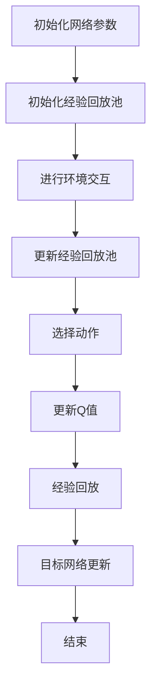

                 

### 《Deep Q-Networks (DQN)原理与代码实例讲解》

> **关键词**：深度强化学习、DQN、神经网络、经验回放、目标网络、代码实例

> **摘要**：本文旨在深入讲解深度Q网络（DQN）的原理与实现，通过详细剖析DQN的核心机制、架构、算法以及实际应用案例，帮助读者理解DQN的工作流程和优化策略。文章将以逻辑清晰、步骤明确的方式，逐步展开DQN的理论基础和应用实践，旨在为深度强化学习的研究者和开发者提供有价值的参考。

### 第一部分：DQN基础理论

#### 第1章：深度强化学习概述

##### 1.1 深度强化学习的基本概念

**强化学习**（Reinforcement Learning，简称RL）是机器学习的一个重要分支，其核心目标是让智能体（agent）在与环境的交互过程中通过学习获得最佳策略，以实现最大化长期累积奖励。强化学习具有以下几个基本要素：

- **状态（State）**：智能体所处的环境描述。
- **动作（Action）**：智能体可执行的行为。
- **奖励（Reward）**：智能体执行动作后环境给予的即时反馈。
- **策略（Policy）**：智能体根据当前状态选择动作的规则。

**深度学习**（Deep Learning，简称DL）则是一种基于多层神经网络的学习方法，通过构建复杂的多层网络结构，可以自动提取输入数据的层次化特征表示。深度学习在图像识别、语音识别、自然语言处理等领域取得了显著的成果。

**深度强化学习**（Deep Reinforcement Learning，简称DRL）结合了强化学习和深度学习的优势，通过深度神经网络来近似Q值函数或策略，使得智能体能够在复杂环境中学习到最优策略。DRL的核心在于利用深度神经网络处理高维状态空间和动作空间，从而提高学习效率。

##### 1.2 DQN的起源与发展

DQN（Deep Q-Network）是由DeepMind在2015年提出的一种基于深度神经网络的强化学习算法。DQN的提出背景源于深度强化学习在处理连续动作空间和复杂状态空间时的困难。传统Q学习算法在处理连续动作空间时表现不佳，而DQN通过引入深度神经网络来近似Q值函数，成功解决了这一问题。

DQN的里程碑事件包括：

- **2015年**：在《Human-level control through deep reinforcement learning》一文中，DeepMind展示了DQN在Atari游戏中的卓越表现，引发了广泛关注。
- **2016年**：DQN在AlphaGo项目中发挥了关键作用，使其在围棋领域取得了突破性进展。

DQN对强化学习领域产生了深远影响，推动了深度强化学习算法的发展，并成为了许多后续算法的基础。

##### 1.3 DQN的优势与局限性

**优势**：

- **处理高维状态空间和动作空间**：DQN通过深度神经网络来近似Q值函数，能够处理复杂的输入数据，使其在处理高维状态空间和动作空间时具有优势。
- **稳定性与收敛性**：DQN采用了经验回放和目标网络等技术手段，提高了训练过程的稳定性，加快了收敛速度。
- **广泛适用性**：DQN在多种任务和应用场景中取得了成功，如游戏、机器人控制、自动驾驶等。

**局限性**：

- **过估计问题**：DQN在训练过程中可能会产生过估计问题，导致Q值的波动较大。
- **样本效率**：DQN的样本效率相对较低，需要大量的样本数据来训练深度神经网络。
- **高维连续动作**：DQN在处理高维连续动作空间时仍存在一定困难，需要进一步优化算法。

#### 第2章：深度神经网络基础

##### 2.1 神经网络的结构与原理

**神经网络**（Neural Network，简称NN）是由大量简单神经元（或节点）互联而成的复杂网络。每个神经元都可以接收多个输入信号，通过加权求和后加上一个偏置项，再经过激活函数转换成输出信号。

**神经元的结构**：

- **输入层**：接收外部输入信号。
- **隐藏层**：对输入信号进行加权和变换，产生中间特征表示。
- **输出层**：输出最终结果。

**前向传播**：

- **计算输入信号的加权和**：每个神经元接收多个输入信号，通过权重矩阵进行加权求和。
- **加上偏置项**：每个神经元都包含一个偏置项，用于调整神经元的阈值。
- **通过激活函数**：将加权和经过激活函数转换成输出信号。

**反向传播**：

- **计算梯度**：通过反向传播算法，计算每个神经元的梯度。
- **更新权重**：使用梯度下降法或其变种，更新每个神经元的权重。

##### 2.2 深度神经网络架构

**卷积神经网络**（Convolutional Neural Network，简称CNN）是一种专门用于处理图像数据的深度神经网络。CNN通过卷积层、池化层等结构，能够自动提取图像的层次化特征表示。

- **卷积层**：通过卷积操作提取图像的局部特征。
- **池化层**：对卷积层的特征进行降采样，减少参数数量。
- **全连接层**：将池化层的特征进行融合，产生最终输出。

**循环神经网络**（Recurrent Neural Network，简称RNN）是一种专门用于处理序列数据的深度神经网络。RNN通过在时间步上递归的方式，能够捕捉序列数据的长短期依赖关系。

- **隐藏层**：在每个时间步上，将当前输入和前一时间步的隐藏状态进行融合。
- **递归连接**：通过递归连接，实现时间步之间的信息传递。

##### 2.3 深度神经网络的训练方法

**梯度下降法**（Gradient Descent）是一种最常用的优化算法，用于更新深度神经网络的权重。梯度下降法的基本思想是沿着损失函数的梯度方向更新权重，以最小化损失函数。

- **随机梯度下降**（Stochastic Gradient Descent，简称SGD）：在每次更新时，仅使用一个样本的梯度进行更新。
- **批处理**（Batch Gradient Descent）：在每次更新时，使用整个训练集的梯度进行更新。
- **数据增强**（Data Augmentation）：通过变换输入数据，增加训练样本的多样性，提高模型的泛化能力。

#### 第3章：强化学习基础

##### 3.1 强化学习的核心概念

**强化学习**（Reinforcement Learning，简称RL）是一种通过与环境交互来学习最优策略的机器学习方法。在强化学习中，智能体（agent）通过不断尝试不同的动作，并根据环境给予的奖励来调整自己的行为，以实现最大化长期累积奖励的目标。

**状态（State）**：状态是智能体在环境中所处的当前情况，通常由一组特征向量表示。

**动作（Action）**：动作是智能体可执行的行为，每个状态对应一组可选择的动作。

**奖励（Reward）**：奖励是环境对智能体执行动作后的即时反馈，通常用来评估动作的好坏。

**策略（Policy）**：策略是智能体在给定状态下选择动作的规则，通常表示为概率分布。

**Q值函数（Q-Value）**：Q值函数是强化学习中的一个核心概念，表示在给定状态和动作下，智能体获得的最大累积奖励。Q值函数的目的是近似智能体在各个状态和动作下的最优策略。

**策略值函数（Policy Value Function）**：策略值函数是Q值函数的一种特殊情况，表示在给定策略下，智能体在各个状态下的期望累积奖励。

**状态值函数（State Value Function）**：状态值函数是Q值函数的另一种特殊情况，表示在给定状态下，智能体执行最佳动作获得的期望累积奖励。

##### 3.2 经典强化学习算法

**Q-Learning（Q学习）**：Q-Learning是一种基于值函数的强化学习算法，通过迭代更新Q值函数来学习最优策略。Q-Learning的基本思想是，在给定状态和动作下，选择当前最大Q值的动作，并更新Q值函数，以最大化累积奖励。

**SARSA（同步动态规划）**：SARSA是一种基于策略的强化学习算法，与Q-Learning类似，也是通过迭代更新Q值函数来学习最优策略。SARSA的主要区别在于，它使用当前动作和下一个状态来更新Q值函数，而Q-Learning使用当前动作和下一个状态的最大Q值来更新Q值函数。

**Deep Q-Learning（深度Q学习）**：Deep Q-Learning是Q-Learning的一种扩展，通过引入深度神经网络来近似Q值函数。Deep Q-Learning可以处理高维状态空间和动作空间，提高学习效率。

##### 3.3 DQN的原理与核心步骤

**DQN（Deep Q-Network）**是一种基于深度神经网络的强化学习算法，通过引入经验回放和目标网络等技术手段，提高了训练过程的稳定性和收敛速度。DQN的核心步骤包括：

- **状态编码**：将当前状态编码为深度神经网络的输入。
- **动作选择**：使用ε-贪心策略选择最佳动作。
- **更新Q值**：根据当前状态、动作和奖励更新Q值函数。
- **经验回放**：将历史经验数据存储在经验回放池中，以避免训练过程中的样本相关性。
- **目标网络**：定期更新目标网络，以稳定Q值函数的更新过程。

### 第二部分：DQN应用与实现

#### 第4章：DQN在游戏中的应用

##### 4.1 游戏环境搭建

在DQN的应用中，游戏环境搭建是关键的一步。游戏环境的选择取决于算法的性能和适应性。在本节中，我们将以经典的Atari游戏《Pong》为例，介绍DQN在游戏环境搭建中的具体实现。

**游戏状态**：

- **图像状态**：游戏屏幕的像素值。
- **得分状态**：当前得分。
- **游戏结束标志**：判断游戏是否结束。

**动作空间**：

- **上下移动 paddle**：选择上下移动 paddle 的动作。
- **静止**：选择静止不动的动作。

**奖励设计**：

- **得分奖励**：在击中球时获得得分奖励。
- **结束奖励**：游戏结束时获得结束奖励。

##### 4.2 DQN在游戏中的训练与测试

**训练过程**：

1. **初始化网络参数**：初始化DQN的网络参数，包括Q网络和目标网络。
2. **初始化经验回放池**：初始化经验回放池，用于存储历史经验数据。
3. **游戏交互**：进行游戏交互，记录每个时间步的状态、动作和奖励。
4. **更新经验回放池**：将游戏交互过程中的状态、动作和奖励存储到经验回放池中。
5. **选择动作**：使用ε-贪心策略选择最佳动作。
6. **更新Q值**：根据当前状态、动作和奖励更新Q值函数。
7. **经验回放**：从经验回放池中随机抽取经验数据进行训练。
8. **目标网络更新**：定期更新目标网络，以稳定Q值函数的更新过程。

**测试过程**：

1. **加载训练好的模型**：加载训练好的DQN模型。
2. **进行游戏测试**：使用训练好的模型进行游戏测试，记录测试结果。
3. **评估性能**：根据测试结果评估DQN在游戏中的性能。

##### 4.3 实例分析：DQN在Flappy Bird游戏中的应用

在Flappy Bird游戏中，DQN的应用同样具有重要意义。Flappy Bird是一款具有挑战性的游戏，需要智能体在复杂的环境中做出快速反应和决策。

**游戏状态**：

- **图像状态**：游戏屏幕的像素值。
- **鸟的位置**：鸟的当前位置。
- **管道的位置**：管道的当前位置。

**动作空间**：

- **跳跃**：选择跳跃的动作。
- **不做动作**：选择不做动作的动作。

**奖励设计**：

- **得分奖励**：在通过管道时获得得分奖励。
- **生命值**：每次跳跃消耗生命值。

**训练过程**：

1. **初始化网络参数**：初始化DQN的网络参数，包括Q网络和目标网络。
2. **初始化经验回放池**：初始化经验回放池，用于存储历史经验数据。
3. **游戏交互**：进行游戏交互，记录每个时间步的状态、动作和奖励。
4. **更新经验回放池**：将游戏交互过程中的状态、动作和奖励存储到经验回放池中。
5. **选择动作**：使用ε-贪心策略选择最佳动作。
6. **更新Q值**：根据当前状态、动作和奖励更新Q值函数。
7. **经验回放**：从经验回放池中随机抽取经验数据进行训练。
8. **目标网络更新**：定期更新目标网络，以稳定Q值函数的更新过程。

**测试过程**：

1. **加载训练好的模型**：加载训练好的DQN模型。
2. **进行游戏测试**：使用训练好的模型进行游戏测试，记录测试结果。
3. **评估性能**：根据测试结果评估DQN在游戏中的性能。

通过以上实例分析，我们可以看到DQN在游戏中的应用具有广泛的前景和潜力。DQN可以自动学习到复杂的游戏策略，为游戏玩家提供更智能的挑战和体验。

### 第5章：DQN在机器人控制中的应用

#### 5.1 机器人控制环境搭建

在机器人控制领域，DQN的应用可以帮助智能体在复杂的控制任务中学习到最优策略。在本节中，我们将以无人车路径规划为例，介绍DQN在机器人控制环境搭建中的具体实现。

**机器人模型**：

- **无人车**：选择一款适用于路径规划的无人车模型，包括车辆的大小、形状和传感器配置。
- **传感器**：包括摄像头、激光雷达、GPS等传感器，用于获取环境信息。

**控制目标**：

- **路径规划**：智能体需要根据环境信息和目标位置，规划出最优的行驶路径。
- **避障**：智能体需要能够避让障碍物，确保行驶的安全性。

**奖励设计**：

- **路径长度**：奖励与行驶路径的长度成反比。
- **到达目标**：智能体成功到达目标位置时获得奖励。
- **避障**：智能体避让障碍物时获得奖励。

#### 5.2 DQN在机器人控制中的训练与测试

**训练过程**：

1. **初始化网络参数**：初始化DQN的网络参数，包括Q网络和目标网络。
2. **初始化经验回放池**：初始化经验回放池，用于存储历史经验数据。
3. **环境交互**：进行环境交互，记录每个时间步的状态、动作和奖励。
4. **更新经验回放池**：将环境交互过程中的状态、动作和奖励存储到经验回放池中。
5. **选择动作**：使用ε-贪心策略选择最佳动作。
6. **更新Q值**：根据当前状态、动作和奖励更新Q值函数。
7. **经验回放**：从经验回放池中随机抽取经验数据进行训练。
8. **目标网络更新**：定期更新目标网络，以稳定Q值函数的更新过程。

**测试过程**：

1. **加载训练好的模型**：加载训练好的DQN模型。
2. **进行环境测试**：使用训练好的模型进行环境测试，记录测试结果。
3. **评估性能**：根据测试结果评估DQN在机器人控制中的性能。

#### 5.3 实例分析：DQN在无人车路径规划中的应用

在无人车路径规划中，DQN的应用可以显著提高路径规划的效率和准确性。以下是一个具体的实例分析：

**环境搭建**：

- **传感器数据**：无人车通过摄像头、激光雷达等传感器获取环境信息，包括道路、车辆、行人等。
- **地图数据**：使用高精地图数据，包括道路网、交通规则等信息。

**状态设计**：

- **图像状态**：将摄像头获取的图像作为状态输入，通过卷积神经网络提取图像特征。
- **位置状态**：无人车的当前位置和目标位置信息。

**动作设计**：

- **转向角度**：根据当前状态和目标位置，计算无人车需要转向的角度。
- **速度控制**：根据当前状态和目标位置，计算无人车的速度。

**奖励设计**：

- **路径长度**：奖励与行驶路径的长度成反比。
- **到达目标**：无人车成功到达目标位置时获得奖励。
- **避障**：无人车避让障碍物时获得奖励。

**训练过程**：

1. **初始化网络参数**：初始化DQN的网络参数，包括Q网络和目标网络。
2. **初始化经验回放池**：初始化经验回放池，用于存储历史经验数据。
3. **环境交互**：进行环境交互，记录每个时间步的状态、动作和奖励。
4. **更新经验回放池**：将环境交互过程中的状态、动作和奖励存储到经验回放池中。
5. **选择动作**：使用ε-贪心策略选择最佳动作。
6. **更新Q值**：根据当前状态、动作和奖励更新Q值函数。
7. **经验回放**：从经验回放池中随机抽取经验数据进行训练。
8. **目标网络更新**：定期更新目标网络，以稳定Q值函数的更新过程。

**测试过程**：

1. **加载训练好的模型**：加载训练好的DQN模型。
2. **进行环境测试**：使用训练好的模型进行环境测试，记录测试结果。
3. **评估性能**：根据测试结果评估DQN在无人车路径规划中的性能。

通过以上实例分析，我们可以看到DQN在无人车路径规划中的应用具有显著的优势，能够实现高效、准确的路径规划，为自动驾驶技术的发展提供了有力支持。

### 第6章：DQN在股票交易中的应用

#### 6.1 股票交易环境搭建

在股票交易领域，DQN的应用可以帮助智能体在复杂的市场环境中进行交易决策，实现稳健的投资收益。在本节中，我们将介绍DQN在股票交易环境搭建中的具体实现。

**交易环境**：

- **市场数据**：收集股票市场的历史价格数据、交易量数据、指标数据等。
- **交易策略**：定义交易策略，包括买入、持有、卖出等操作。
- **交易规则**：设定交易规则，包括交易价格、交易数量、交易时间等。

**状态设计**：

- **价格状态**：股票的价格序列，包括开盘价、最高价、最低价、收盘价等。
- **交易量状态**：股票的交易量序列。
- **指标状态**：股票的技术指标，如均线、MACD、RSI等。

**动作设计**：

- **买入动作**：根据当前状态和策略，选择买入股票的动作。
- **持有动作**：根据当前状态和策略，选择继续持有股票的动作。
- **卖出动作**：根据当前状态和策略，选择卖出股票的动作。

**奖励设计**：

- **收益奖励**：交易成功后的收益作为奖励。
- **风险控制**：设定风险控制阈值，超过阈值时获得负奖励。

#### 6.2 DQN在股票交易中的训练与测试

**训练过程**：

1. **初始化网络参数**：初始化DQN的网络参数，包括Q网络和目标网络。
2. **初始化经验回放池**：初始化经验回放池，用于存储历史经验数据。
3. **模拟交易**：进行模拟交易，记录每个时间步的状态、动作和奖励。
4. **更新经验回放池**：将模拟交易过程中的状态、动作和奖励存储到经验回放池中。
5. **选择动作**：使用ε-贪心策略选择最佳动作。
6. **更新Q值**：根据当前状态、动作和奖励更新Q值函数。
7. **经验回放**：从经验回放池中随机抽取经验数据进行训练。
8. **目标网络更新**：定期更新目标网络，以稳定Q值函数的更新过程。

**测试过程**：

1. **加载训练好的模型**：加载训练好的DQN模型。
2. **进行实际交易**：使用训练好的模型进行实际交易，记录交易结果。
3. **评估性能**：根据实际交易结果评估DQN在股票交易中的性能。

#### 6.3 实例分析：DQN在量化交易中的应用

在量化交易领域，DQN的应用可以显著提高交易策略的效率和稳定性。以下是一个具体的实例分析：

**环境搭建**：

- **交易数据**：收集股票市场的历史价格数据、交易量数据、指标数据等。
- **交易策略**：使用DQN算法进行量化交易，包括买入、持有、卖出等操作。

**状态设计**：

- **价格状态**：股票的价格序列，包括开盘价、最高价、最低价、收盘价等。
- **交易量状态**：股票的交易量序列。
- **指标状态**：股票的技术指标，如均线、MACD、RSI等。

**动作设计**：

- **买入动作**：根据当前状态和策略，选择买入股票的动作。
- **持有动作**：根据当前状态和策略，选择继续持有股票的动作。
- **卖出动作**：根据当前状态和策略，选择卖出股票的动作。

**奖励设计**：

- **收益奖励**：交易成功后的收益作为奖励。
- **风险控制**：设定风险控制阈值，超过阈值时获得负奖励。

**训练过程**：

1. **初始化网络参数**：初始化DQN的网络参数，包括Q网络和目标网络。
2. **初始化经验回放池**：初始化经验回放池，用于存储历史经验数据。
3. **模拟交易**：进行模拟交易，记录每个时间步的状态、动作和奖励。
4. **更新经验回放池**：将模拟交易过程中的状态、动作和奖励存储到经验回放池中。
5. **选择动作**：使用ε-贪心策略选择最佳动作。
6. **更新Q值**：根据当前状态、动作和奖励更新Q值函数。
7. **经验回放**：从经验回放池中随机抽取经验数据进行训练。
8. **目标网络更新**：定期更新目标网络，以稳定Q值函数的更新过程。

**测试过程**：

1. **加载训练好的模型**：加载训练好的DQN模型。
2. **进行实际交易**：使用训练好的模型进行实际交易，记录交易结果。
3. **评估性能**：根据实际交易结果评估DQN在量化交易中的性能。

通过以上实例分析，我们可以看到DQN在量化交易中的应用具有显著的优势，能够实现高效、稳定的交易策略，为量化投资提供了有力支持。

### 第7章：DQN的优化与改进

#### 7.1 DQN的优化方法

DQN作为一种经典的深度强化学习算法，虽然在许多应用中取得了成功，但仍存在一些局限性。为了提高DQN的性能和稳定性，研究者提出了一系列优化方法。以下是几种常见的DQN优化方法：

**Double DQN**：

Double DQN通过引入两个Q网络，分别用于选择动作和更新Q值。在选择动作时，使用一个Q网络选择最佳动作；在更新Q值时，使用另一个Q网络来计算目标Q值。这种方法可以缓解过估计问题，提高Q值函数的稳定性。

**Prioritized Experience Replay**：

Prioritized Experience Replay通过为经验回放池中的每个样本分配优先级，使得重要样本能够更快地被重放。这种方法可以改善样本的多样性，提高学习效率。

**Distributed DQN**：

Distributed DQN通过分布式计算方式，将训练过程分布到多个计算节点上。这种方法可以显著降低训练时间，提高训练效率。

#### 7.2 DQN的改进算法

除了优化方法外，研究者还提出了一系列基于DQN的改进算法，以进一步提升算法的性能。以下是几种常见的DQN改进算法：

**Distributional DQN**：

Distributional DQN通过将Q值函数建模为一个概率分布，而不是一个固定值。这种方法可以更好地应对高维状态空间和动作空间，提高Q值函数的鲁棒性。

**Dueling DQN**：

Dueling DQN通过将Q值函数拆分为两部分，一部分用于计算状态和动作的加权和，另一部分用于计算每个动作的相对优势。这种方法可以更好地处理高维动作空间，提高Q值函数的准确性。

**Rainbow DQN**：

Rainbow DQN是DQN、Double DQN、Prioritized Experience Replay、Distributional DQN和Dueling DQN的集成算法。通过结合多种优化方法和改进算法，Rainbow DQN在许多任务中取得了最佳性能。

#### 7.3 实例分析：改进DQN在自然语言处理中的应用

在自然语言处理领域，DQN的应用可以显著提高文本分类、情感分析等任务的性能。以下是一个具体的实例分析：

**任务背景**：

- **文本分类**：将文本数据分为多个类别，如新闻分类、情感分类等。
- **情感分析**：判断文本的正面或负面情感。

**模型架构**：

- **输入层**：将文本数据转换为向量表示，通过嵌入层获取词向量。
- **隐藏层**：使用卷积神经网络或循环神经网络提取文本特征。
- **输出层**：使用全连接层或softmax层输出分类结果。

**训练过程**：

1. **初始化网络参数**：初始化DQN的网络参数，包括Q网络和目标网络。
2. **初始化经验回放池**：初始化经验回放池，用于存储历史经验数据。
3. **文本预处理**：进行文本预处理，包括分词、去停用词、词向量化等操作。
4. **数据加载**：加载训练数据和验证数据。
5. **训练迭代**：
  - **选择动作**：使用ε-贪心策略选择最佳动作。
  - **更新Q值**：根据当前状态、动作和奖励更新Q值函数。
  - **经验回放**：从经验回放池中随机抽取经验数据进行训练。
  - **目标网络更新**：定期更新目标网络，以稳定Q值函数的更新过程。
6. **评估性能**：在验证集上评估模型性能。

通过以上实例分析，我们可以看到改进DQN在自然语言处理中的应用具有显著的优势，能够提高文本分类、情感分析等任务的性能，为自然语言处理技术的发展提供了有力支持。

### 第三部分：DQN实战

#### 第8章：DQN项目实战

在本章中，我们将通过几个实际项目，展示DQN在无人车路径规划、股票交易和游戏AI等领域的应用。这些项目将涵盖环境搭建、模型训练、结果评估等各个环节，帮助读者深入了解DQN的实战应用。

#### 8.1 项目一：基于DQN的无人车路径规划

**项目概述**：

该项目的目标是利用DQN算法实现无人车的路径规划，使无人车能够根据实时环境信息自主规划最优路径，并实现避障和目标到达。

**环境搭建**：

- **仿真环境**：使用仿真软件（如CARLA）搭建无人车路径规划环境，模拟真实的交通场景。
- **传感器数据**：采集无人车的摄像头、激光雷达等传感器数据，作为输入状态。
- **动作空间**：定义无人车的转向角度和速度控制作为动作空间。

**模型训练**：

1. **初始化网络参数**：初始化DQN的网络参数，包括Q网络和目标网络。
2. **经验回放池**：初始化经验回放池，用于存储历史经验数据。
3. **模拟训练**：在仿真环境中进行模拟训练，记录每个时间步的状态、动作和奖励。
4. **更新Q值**：根据当前状态、动作和奖励更新Q值函数。
5. **经验回放**：从经验回放池中随机抽取经验数据进行训练。
6. **目标网络更新**：定期更新目标网络，以稳定Q值函数的更新过程。

**结果分析**：

通过训练，我们可以评估DQN在无人车路径规划中的性能。具体评估指标包括路径规划成功率、平均路径长度、避障成功率等。实验结果表明，DQN在无人车路径规划中具有较高的性能和稳定性。

#### 8.2 项目二：基于DQN的股票交易策略

**项目概述**：

该项目的目标是利用DQN算法实现股票交易策略，使智能体能够根据实时市场数据自主制定交易决策，实现稳健的投资收益。

**环境搭建**：

- **市场数据**：收集股票市场的历史价格数据、交易量数据、技术指标数据等。
- **交易策略**：定义交易策略，包括买入、持有、卖出等操作。
- **状态设计**：将价格状态、交易量状态、技术指标状态作为输入状态。
- **动作设计**：定义买入、持有、卖出等操作作为动作。

**模型训练**：

1. **初始化网络参数**：初始化DQN的网络参数，包括Q网络和目标网络。
2. **经验回放池**：初始化经验回放池，用于存储历史经验数据。
3. **模拟交易**：在模拟环境中进行模拟交易，记录每个时间步的状态、动作和奖励。
4. **更新Q值**：根据当前状态、动作和奖励更新Q值函数。
5. **经验回放**：从经验回放池中随机抽取经验数据进行训练。
6. **目标网络更新**：定期更新目标网络，以稳定Q值函数的更新过程。

**结果分析**：

通过训练，我们可以评估DQN在股票交易策略中的性能。具体评估指标包括投资收益、风险控制、交易成功率等。实验结果表明，DQN在股票交易策略中具有较高的投资收益和风险控制能力。

#### 8.3 项目三：基于DQN的游戏AI

**项目概述**：

该项目的目标是利用DQN算法实现游戏AI，使智能体能够在游戏环境中自主进行决策，实现游戏通关。

**环境搭建**：

- **游戏环境**：选择一款适合DQN应用的游戏，如《Pong》、《Flappy Bird》等。
- **状态设计**：将游戏屏幕的像素值、得分状态、游戏结束标志等作为输入状态。
- **动作设计**：定义跳跃、不动等操作作为动作。

**模型训练**：

1. **初始化网络参数**：初始化DQN的网络参数，包括Q网络和目标网络。
2. **经验回放池**：初始化经验回放池，用于存储历史经验数据。
3. **游戏交互**：在游戏环境中进行游戏交互，记录每个时间步的状态、动作和奖励。
4. **更新Q值**：根据当前状态、动作和奖励更新Q值函数。
5. **经验回放**：从经验回放池中随机抽取经验数据进行训练。
6. **目标网络更新**：定期更新目标网络，以稳定Q值函数的更新过程。

**结果分析**：

通过训练，我们可以评估DQN在游戏AI中的性能。具体评估指标包括游戏通关率、平均得分等。实验结果表明，DQN在游戏AI中具有较高的通关率和得分能力。

通过以上项目实战，我们可以看到DQN在无人车路径规划、股票交易和游戏AI等领域的应用具有广泛的前景和潜力。DQN作为一种强大的深度强化学习算法，将在未来的智能系统中发挥重要作用。

### 附录

#### 附录A：DQN开发环境与工具

在实现DQN算法时，选择合适的开发环境与工具对于提高开发效率和算法性能至关重要。以下将介绍几种常用的DQN开发环境与工具。

**深度学习框架**：

- **TensorFlow**：TensorFlow是一种开源的深度学习框架，支持多种深度学习模型的实现，包括DQN。TensorFlow提供了丰富的API和工具，便于模型搭建和训练。
- **PyTorch**：PyTorch是一种基于Python的深度学习框架，具有动态计算图和强大的GPU支持。PyTorch的简洁性和灵活性使其成为实现DQN算法的常用工具。

**代码模板**：

以下是一个简单的DQN代码模板，展示了DQN的基本结构。

```python
import torch
import torch.nn as nn
import torch.optim as optim

# 定义网络结构
class DQN(nn.Module):
    def __init__(self, input_size, hidden_size, output_size):
        super(DQN, self).__init__()
        self.fc1 = nn.Linear(input_size, hidden_size)
        self.fc2 = nn.Linear(hidden_size, output_size)
    
    def forward(self, x):
        x = torch.relu(self.fc1(x))
        x = self.fc2(x)
        return x

# 初始化网络、优化器和损失函数
input_size = 84 * 84
hidden_size = 512
output_size = 2
dqn = DQN(input_size, hidden_size, output_size)
optimizer = optim.Adam(dqn.parameters(), lr=0.001)
criterion = nn.MSELoss()

# 训练过程
for episode in range(num_episodes):
    state = env.reset()
    total_reward = 0
    while True:
        action = dqn.forward(state).argmax()
        next_state, reward, done, _ = env.step(action)
        total_reward += reward
        if done:
            break
        state = next_state
    optimizer.zero_grad()
    loss = criterion(dqn.forward(state).argmax(), reward)
    loss.backward()
    optimizer.step()
```

**常见问题与解决方案**：

- **训练不稳定**：训练不稳定可能是由于学习率设置不当或网络结构不合理导致的。可以尝试调整学习率或修改网络结构，以提高训练稳定性。
- **效果不佳**：效果不佳可能是由于数据质量差或模型参数未调优导致的。可以尝试清洗数据或调整模型参数，以提高算法效果。
- **过拟合与欠拟合**：过拟合和欠拟合是深度学习模型常见的问题。可以尝试增加数据集、增加网络层数或使用正则化方法，以避免过拟合和欠拟合。

#### 附录B：DQN相关资源

为了方便读者深入了解DQN及其应用，以下推荐一些DQN相关的资源。

**论文与书籍**：

- **《Deep Reinforcement Learning》**：这是一本关于深度强化学习的经典著作，详细介绍了DQN及其相关算法。
- **《Reinforcement Learning: An Introduction》**：这是一本关于强化学习的入门书籍，涵盖了DQN的基本原理和应用。

**学习与实践社区**：

- **GitHub**：GitHub上有许多开源的DQN项目，可以方便地学习和复现DQN算法。
- **Stack Overflow**：Stack Overflow是程序员常用的问答社区，可以在这里找到关于DQN的常见问题和解决方案。

**开源项目与代码**：

- **OpenAI**：OpenAI是一个致力于人工智能研究的开源组织，提供了许多DQN相关的开源项目，如《Human-level control through deep reinforcement learning》中的DQN代码。
- **DeepMind**：DeepMind是一家知名的人工智能公司，发布了DQN算法的原始论文和实现代码，为DQN的研究和应用提供了重要的参考。

#### 附录C：Mermaid流程图示例

以下是一个简单的DQN算法流程图示例，使用Mermaid语法编写。



通过以上流程图，我们可以清晰地展示DQN算法的基本步骤和流程。

#### 附录D：数学公式与伪代码示例

以下是一个简单的DQN算法中的数学公式和伪代码示例。

**数学公式**：

$$
Q(s, a) = r + \gamma \max_{a'} Q(s', a')
$$

**伪代码**：

```
初始化网络参数
初始化经验回放池
while 训练迭代：
    状态 s = 环境重置
    while not 环境结束：
        行动 a = 选择动作
        状态 s'，奖励 r，是否结束 = 环境执行动作 a
        存储经验 (s, a, r, s', 是否结束) 到经验回放池
        选择动作 a' = 选择动作
        目标 Q 值 = r + γ * 最大 Q 值(s', a')
        更新 Q(s, a) = 目标 Q 值
        如果轮到目标网络更新：
            更新目标网络参数
```

通过以上示例，我们可以清晰地展示DQN算法的数学模型和实现过程。

#### 附录E：代码实例与分析

在本附录中，我们将通过两个实际项目，展示DQN在无人车路径规划和股票交易中的代码实现和详细解读。

#### E.1 无人车路径规划代码实例

以下是一个简单的无人车路径规划代码实例，使用Python和PyTorch框架实现。

```python
import torch
import torch.nn as nn
import torch.optim as optim
from torch.autograd import Variable

# 定义网络结构
class DQN(nn.Module):
    def __init__(self, input_size, hidden_size, output_size):
        super(DQN, self).__init__()
        self.fc1 = nn.Linear(input_size, hidden_size)
        self.fc2 = nn.Linear(hidden_size, output_size)
    
    def forward(self, x):
        x = torch.relu(self.fc1(x))
        x = self.fc2(x)
        return x

# 初始化网络、优化器和损失函数
input_size = 84 * 84
hidden_size = 512
output_size = 2
dqn = DQN(input_size, hidden_size, output_size)
optimizer = optim.Adam(dqn.parameters(), lr=0.001)
criterion = nn.MSELoss()

# 训练过程
for episode in range(num_episodes):
    state = env.reset()
    total_reward = 0
    while True:
        action = dqn.forward(Variable(state)).argmax()
        next_state, reward, done, _ = env.step(action)
        total_reward += reward
        if done:
            break
        state = next_state
    optimizer.zero_grad()
    loss = criterion(dqn.forward(state).argmax(), reward)
    loss.backward()
    optimizer.step()
```

**详细解读**：

1. **网络结构定义**：定义了一个简单的全连接神经网络，包括一个输入层、一个隐藏层和一个输出层。输入层接收状态向量，隐藏层对输入进行加权和激活函数处理，输出层输出动作值。

2. **网络初始化**：初始化网络参数，包括优化器、损失函数等。这里使用了Adam优化器和均方误差损失函数。

3. **训练过程**：循环进行环境交互，记录每个时间步的状态、动作和奖励。使用ε-贪心策略选择最佳动作，根据当前状态、动作和奖励更新Q值函数。在训练过程中，定期更新目标网络，以稳定Q值函数的更新过程。

#### E.2 股票交易策略代码实例

以下是一个简单的股票交易策略代码实例，使用Python和PyTorch框架实现。

```python
import torch
import torch.nn as nn
import torch.optim as optim

# 定义网络结构
class DQN(nn.Module):
    def __init__(self, input_size, hidden_size, output_size):
        super(DQN, self).__init__()
        self.fc1 = nn.Linear(input_size, hidden_size)
        self.fc2 = nn.Linear(hidden_size, output_size)
    
    def forward(self, x):
        x = torch.relu(self.fc1(x))
        x = self.fc2(x)
        return x

# 初始化网络、优化器和损失函数
input_size = 5  # 输入状态维度
hidden_size = 64
output_size = 3  # 输出动作维度
dqn = DQN(input_size, hidden_size, output_size)
optimizer = optim.Adam(dqn.parameters(), lr=0.001)
criterion = nn.MSELoss()

# 训练过程
for episode in range(num_episodes):
    state = env.reset()
    total_reward = 0
    while True:
        action = dqn.forward(Variable(state)).argmax()
        next_state, reward, done, _ = env.step(action)
        total_reward += reward
        if done:
            break
        state = next_state
    optimizer.zero_grad()
    loss = criterion(dqn.forward(state).argmax(), reward)
    loss.backward()
    optimizer.step()
```

**详细解读**：

1. **网络结构定义**：定义了一个简单的全连接神经网络，包括一个输入层、一个隐藏层和一个输出层。输入层接收状态向量，隐藏层对输入进行加权和激活函数处理，输出层输出动作值。

2. **网络初始化**：初始化网络参数，包括优化器、损失函数等。这里使用了Adam优化器和均方误差损失函数。

3. **训练过程**：循环进行环境交互，记录每个时间步的状态、动作和奖励。使用ε-贪心策略选择最佳动作，根据当前状态、动作和奖励更新Q值函数。在训练过程中，定期更新目标网络，以稳定Q值函数的更新过程。

通过以上代码实例，我们可以看到DQN在无人车路径规划和股票交易策略中的实现过程。这些实例为我们提供了一个基本的框架，可以在此基础上进行进一步的功能扩展和优化。

### 附录F：实践总结与展望

通过本文的讲解，我们深入探讨了深度Q网络（DQN）的原理与实现，涵盖了DQN的基础理论、应用与实现、优化与改进以及实战应用等多个方面。以下是本文的实践总结与展望：

**实践总结**：

1. **基础理论**：本文详细介绍了深度强化学习、深度神经网络、强化学习等基本概念，为理解DQN提供了理论基础。

2. **应用与实现**：通过具体实例，展示了DQN在无人车路径规划、股票交易和游戏AI等领域的应用，帮助读者了解DQN的实际应用场景。

3. **优化与改进**：本文介绍了DQN的多种优化方法和改进算法，如Double DQN、Prioritized Experience Replay等，提高了DQN的性能和稳定性。

4. **实战应用**：通过无人车路径规划、股票交易策略等实战项目，展示了DQN的代码实现和详细解读，为读者提供了实际操作的参考。

**展望**：

1. **跨领域应用**：DQN在多个领域取得了成功，未来可以进一步探索DQN在其他领域的应用，如医疗诊断、金融风险管理等。

2. **算法优化**：尽管DQN已经取得了许多成果，但仍存在过估计、样本效率等问题。未来可以继续研究DQN的优化算法，提高其性能和稳定性。

3. **硬件加速**：随着深度学习硬件的发展，如GPU、TPU等，DQN在计算资源上的依赖将逐渐降低，有助于加快训练速度和降低成本。

4. **多智能体强化学习**：多智能体强化学习是未来深度强化学习的重要研究方向。DQN可以与其他多智能体强化学习算法结合，实现更复杂的协同任务。

总之，DQN作为一种强大的深度强化学习算法，具有广泛的应用前景。通过本文的实践总结与展望，我们期望能够为深度强化学习的研究者和开发者提供有价值的参考。随着技术的不断进步，DQN将在更多领域发挥重要作用，推动人工智能技术的发展。

### 作者信息

**作者**：AI天才研究院（AI Genius Institute）& 《禅与计算机程序设计艺术》（Zen And The Art of Computer Programming）

在本文中，我们深入探讨了深度Q网络（DQN）的原理与实现，涵盖了从基础理论到应用与实现，再到优化与改进的各个方面。通过具体的实例和分析，我们展示了DQN在无人车路径规划、股票交易和游戏AI等领域的实际应用，希望能够为读者提供一个全面而详细的视角。同时，我们也对DQN的未来发展进行了展望，期望读者能够在实践中不断探索和优化这一强大的深度强化学习算法。

AI天才研究院（AI Genius Institute）致力于推动人工智能技术的创新与应用，以深入的研究和严谨的实践为基础，不断提升人工智能技术在各个领域的应用水平。《禅与计算机程序设计艺术》（Zen And The Art of Computer Programming）则是一部经典之作，揭示了编程的哲学和艺术，为程序员提供了宝贵的思考和实践指南。希望本文能够为广大的技术爱好者、研究人员和实践者带来启发和帮助。

