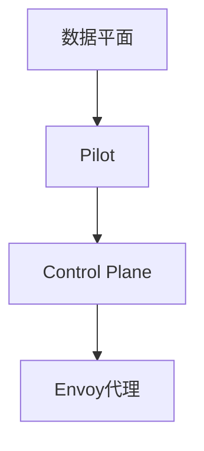

                 

# Istio服务网格应用实践

## 摘要

本文将详细介绍Istio服务网格的应用实践。首先，我们将了解服务网格的基本概念、起源和重要性，然后深入探讨Istio的核心组件和架构。接下来，我们将一步步部署和操作Istio，包括环境准备、安装、配置和监控。随后，文章将介绍Istio在服务发现、负载均衡、安全性和策略控制方面的实战应用，并探讨其性能优化和监控方法。最后，我们将通过企业级实践案例展示Istio的实际效果，并对Istio的未来发展趋势进行展望。

## 第一部分：了解Istio和服务网格

### 第1章：服务网格简介

#### 1.1 服务网格概述

**1.1.1 服务网格的起源与重要性**

随着微服务架构的普及，服务之间的通信和治理变得日益复杂。为了简化微服务通信，服务网格这一概念应运而生。服务网格是一种基础设施层，主要负责服务之间的通信和治理。它将服务的网络通信抽象出来，使开发者能够专注于业务逻辑的实现，而无需担心底层网络细节。

服务网格的起源可以追溯到2016年，当时Google、Microsoft和Twitter等公司开始采用Service Mesh模型来管理微服务通信。随后，Istio等开源服务网格项目迅速崛起，成为微服务领域的热点。

**1.1.2 服务网格与传统网络的区别**

传统网络主要关注端到端的数据传输，而服务网格则专注于服务之间的通信。服务网格与传统网络的区别在于：

- **抽象层次**：服务网格将网络通信抽象为服务间通信，使开发者能够以服务为单位进行编程。
- **透明性**：服务网格对开发者透明，开发者无需关心底层网络实现。
- **治理**：服务网格提供了丰富的治理功能，如流量管理、安全性、监控和日志等。

#### 1.2 服务网格的主要功能

**1.2.1 服务发现与负载均衡**

服务发现是服务网格的核心功能之一，它负责在服务启动时自动将其注册到服务发现系统，并在服务停止时注销。负载均衡则是根据一定的策略，将请求分配到多个实例上，以提高系统的可用性和性能。

**1.2.2 服务间的可靠通信**

服务网格通过智能代理（如Envoy）来实现服务间的可靠通信。智能代理可以处理各种通信协议，如HTTP、gRPC等，并提供负载均衡、断路器、熔断等机制，确保服务之间的通信稳定可靠。

**1.2.3 服务监控与日志记录**

服务网格提供了统一的服务监控和日志记录功能。通过集成Prometheus、Jaeger等监控工具，服务网格可以实时收集和展示服务的性能指标，帮助开发者快速定位问题。同时，服务网格还支持日志聚合，方便开发者进行日志分析。

#### 1.3 Istio介绍

**1.3.1 Istio的发展历程**

Istio是一个由Google、IBM和Lyft共同推出的开源服务网格项目，于2017年6月首次发布。自发布以来，Istio迅速获得了广泛关注和支持，成为微服务领域的重要基础设施之一。

**1.3.2 Istio的核心组件**

Istio由三个核心组件组成：Pilot、Control Plane和数据平面。

- **Pilot**：负责配置管理，将控制平面的配置信息下发到数据平面。
- **Control Plane**：负责策略和遥测数据的定义，如访问控制、流量规则、监控数据等。
- **数据平面**：由智能代理组成，如Envoy，负责实际的网络通信和治理。

### 第二部分：Istio架构与组件

### 第2章：Istio架构详解

#### 2.1 Istio核心组件

**2.1.1 Pilot**

Pilot是Istio的控制平面组件，负责管理和下发配置信息。Pilot通过API与数据平面进行通信，确保配置信息的一致性。Pilot的主要功能包括：

- 配置管理：接收来自控制平面的配置信息，如路由规则、服务发现信息等。
- 适配器管理：支持多种适配器，如Kubernetes、Consul等，以便与不同环境进行集成。

**2.1.2 Control Plane**

Control Plane是Istio的策略和遥测数据的定义中心。它主要负责以下功能：

- 策略定义：定义访问控制策略、流量规则等。
- 遥测数据收集：收集服务性能、流量等指标，并支持与外部监控工具集成。

**2.1.3 数据平面**

数据平面由智能代理组成，如Envoy。数据平面负责实际的网络通信和治理，主要功能包括：

- 网络代理：拦截和转发服务间请求，实现负载均衡、熔断等功能。
- 配置更新：接收Pilot下发的配置信息，并实时更新代理行为。

#### 2.2 路由规则与策略

**2.2.1 路由规则定义**

路由规则是Istio的核心概念之一，用于定义服务间请求的路由策略。路由规则包含以下要素：

- 目标服务：指定请求的目标服务。
- 请求匹配条件：指定请求的匹配条件，如请求头、请求路径等。
- 目标服务版本：指定请求转发到的目标服务版本。

**2.2.2 策略与遥测数据**

策略是Istio用于控制服务间访问和流量的机制。策略包括访问控制、流量规则、资源配额等。遥测数据是Istio收集的服务性能、流量等指标，支持与外部监控工具集成。

#### 2.3 安全性与身份验证

**2.3.1 mTLS加密**

mTLS（多跳TLS）是Istio提供的一种安全通信机制。在mTLS模式下，服务之间的通信会使用TLS加密，确保数据传输的安全性和完整性。

**2.3.2 访问控制**

访问控制是Istio提供的一种细粒度的安全机制，用于控制服务间的访问权限。访问控制基于角色和权限，支持自定义策略。

## 第三部分：Istio部署与操作

### 第3章：部署Istio

#### 3.1 部署环境准备

**3.1.1 Kubernetes集群配置**

在部署Istio之前，需要确保Kubernetes集群配置正确。以下是一些关键步骤：

- 确保集群版本支持Istio。
- 配置集群网络，确保不同命名空间的服务可以使用ClusterIP进行通信。
- 启用必要的Kubernetes API组，如Istio Operator。

**3.1.2 Istio依赖组件安装**

Istio依赖于一些关键组件，如Kubernetes、Docker、Istio Operator等。以下是一些安装步骤：

- 安装Kubernetes集群。
- 安装Docker，以便构建Istio容器镜像。
- 安装Istio Operator，用于简化Istio的部署和管理。

#### 3.2 安装Istio

**3.2.1 手动安装**

手动安装Istio是一种较为复杂的方法，但可以提供更大的灵活性。以下是一些关键步骤：

- 下载Istio安装文件。
- 配置Istio的Kubernetes配置文件。
- 使用kubectl命令部署Istio组件。

**3.2.2 一键安装脚本**

一键安装脚本是一种简单快捷的安装方法，适用于大多数场景。以下是一些关键步骤：

- 访问Istio官方网站，下载一键安装脚本。
- 运行安装脚本，根据提示进行配置。

#### 3.3 配置与监控Istio

**3.3.1 配置文件详解**

Istio的配置文件包括服务配置、路由规则、策略等。以下是一些关键配置文件：

- `istio.yaml`：Istio的主配置文件，包含组件版本、部署策略等。
- `service.yaml`：定义服务配置，如服务名称、端口等。
- `route.yaml`：定义路由规则，如请求匹配条件、目标服务版本等。
- `policy.yaml`：定义策略配置，如访问控制、流量限制等。

**3.3.2 监控与日志**

Istio提供了丰富的监控和日志功能，支持与Prometheus、Grafana、Jaeger等工具集成。以下是一些关键步骤：

- 安装Prometheus和Grafana，用于监控Istio组件。
- 配置Prometheus，使其能够采集Istio的监控数据。
- 在Grafana中创建仪表板，以便可视化监控数据。
- 配置Jaeger，用于收集和展示服务日志。

## 第四部分：Istio实战应用

### 第4章：Istio服务发现与负载均衡

#### 4.1 服务发现

**4.1.1 服务注册与发现**

在Istio中，服务注册与发现是通过Pilot组件实现的。以下是一些关键步骤：

- 服务启动时，将自身注册到Kubernetes服务发现系统。
- Pilot从Kubernetes服务发现系统获取服务信息，并将其下发到数据平面。
- 数据平面根据服务信息进行服务发现，确保服务间通信。

**4.1.2 域名解析与负载均衡**

Istio使用服务网格命名空间（service mesh namespace）来统一管理服务域名。以下是一些关键步骤：

- 创建服务网格命名空间，并将服务部署在该命名空间中。
- 使用服务网格命名空间内的服务域名进行服务间通信。
- 数据平面根据请求的目标服务名称，进行域名解析和负载均衡。

#### 4.2 负载均衡策略

Istio支持多种负载均衡策略，包括轮询策略、权重策略和随机策略。以下是一些关键策略：

- **轮询策略**：将请求依次分配到每个实例上，实现负载均衡。
- **权重策略**：根据实例的权重分配请求，实现动态负载均衡。
- **随机策略**：随机分配请求到实例上，提高系统的可用性和性能。

## 第五部分：高级应用与优化

### 第5章：Istio安全性与策略控制

#### 5.1 安全通信

**5.1.1 mTLS配置**

mTLS是Istio提供的一种安全通信机制，确保服务间通信的安全性。以下是一些关键步骤：

- 启用mTLS，确保服务间请求使用TLS加密。
- 配置mTLS证书，确保证书的有效性和一致性。

**5.1.2 访问控制策略**

访问控制是Istio提供的一种细粒度的安全机制，用于控制服务间的访问权限。以下是一些关键策略：

- 配置访问控制策略，定义服务的访问权限。
- 基于角色和权限，实现细粒度的访问控制。

#### 5.2 策略管理

Istio提供了丰富的策略管理功能，包括资源配额、流量限制等。以下是一些关键策略：

- **资源配额策略**：限制服务的CPU、内存等资源使用，确保系统的稳定性。
- **流量限制策略**：限制服务的流量，避免流量过大导致系统崩溃。

#### 5.3 服务质量监控

Istio支持服务质量监控，通过收集和展示服务的性能指标，帮助开发者快速定位问题。以下是一些关键步骤：

- 集成Prometheus和Grafana，用于监控Istio组件。
- 配置监控指标，如请求响应时间、错误率等。
- 在Grafana中创建仪表板，展示监控数据。

## 第六部分：性能优化与监控

### 第6章：Istio性能优化

#### 6.1 调整配置参数

Istio提供了丰富的配置参数，用于调整系统性能。以下是一些关键配置参数：

- **控制平面配置**：调整Pilot组件的性能参数，如并发请求处理能力、缓存大小等。
- **数据平面配置**：调整智能代理的性能参数，如连接池大小、超时时间等。

#### 6.2 性能监控与日志分析

Istio支持与Prometheus、Grafana等监控工具集成，提供实时的性能监控。以下是一些关键步骤：

- 集成Prometheus，收集Istio组件的性能指标。
- 集成Grafana，创建仪表板展示性能监控数据。
- 配置日志分析，收集和展示服务日志。

## 第七部分：企业级Istio应用实践

### 第7章：企业级Istio应用实践

#### 7.1 案例一：微服务架构下的服务网格应用

**7.1.1 案例背景**

某企业采用微服务架构开发了一个大型业务系统，由多个微服务组成。随着业务规模的扩大，服务间的通信和治理变得越来越复杂，亟需引入服务网格来简化系统架构。

**7.1.2 应用Istio解决痛点**

通过引入Istio，企业解决了以下痛点：

- **服务发现与负载均衡**：Istio提供了强大的服务发现和负载均衡功能，简化了服务间通信。
- **安全性**：Istio的mTLS加密和访问控制策略确保了服务间通信的安全性。
- **监控与日志**：Istio集成了Prometheus和Grafana，提供了实时的性能监控和日志分析功能。

**7.1.3 实施步骤与效果评估**

实施步骤包括：

1. 准备Kubernetes集群和Istio依赖组件。
2. 部署Istio，配置服务网格命名空间。
3. 部署微服务，配置服务路由规则。
4. 验证服务发现、负载均衡和安全性能。
5. 集成Prometheus和Grafana，监控系统性能。

效果评估：

- 服务间通信稳定性提高，故障率降低。
- 系统性能提升，响应时间缩短。
- 安全性得到保障，降低了数据泄露风险。

#### 7.2 案例二：分布式系统中的服务网格实践

**7.2.1 案例背景**

某企业拥有一个分布式系统，包括多个数据中心和云服务。随着业务的发展，分布式系统间的通信和治理变得越来越复杂，需要引入服务网格来简化系统架构。

**7.2.2 Istio在分布式系统中的应用**

Istio在分布式系统中的应用包括：

- **跨数据中心服务发现**：Istio支持跨数据中心的服务发现和负载均衡，提高了系统的可用性和性能。
- **分布式事务管理**：Istio提供了分布式事务管理功能，支持分布式系统中的数据一致性。
- **监控与日志**：Istio集成了Prometheus和Grafana，提供了跨数据中心的性能监控和日志分析功能。

**7.2.3 实施步骤与效果评估**

实施步骤包括：

1. 确保分布式系统中的所有组件支持Istio。
2. 在每个数据中心部署Istio，配置服务网格命名空间。
3. 配置跨数据中心的服务路由规则。
4. 验证服务发现、负载均衡和安全性能。
5. 集成Prometheus和Grafana，监控系统性能。

效果评估：

- 跨数据中心通信稳定性提高，故障率降低。
- 系统性能提升，响应时间缩短。
- 数据一致性得到保障，降低了数据不一致的风险。

## 第八部分：展望与未来

### 第8章：Istio的未来发展趋势

#### 8.1 Istio与其他服务网格的对比

Istio作为当前最受欢迎的服务网格项目，与其他服务网格项目如Conduit和Linkerd相比，具有以下优势：

- **社区支持**：Istio拥有庞大的社区支持，提供了丰富的文档和资源。
- **功能丰富**：Istio支持多种协议、多种网络模型，提供了丰富的治理功能。
- **与Kubernetes集成**：Istio与Kubernetes深度集成，提供了自动化的部署和管理。

#### 8.2 Istio的扩展与集成

Istio在未来将继续扩展和集成，以适应不同的场景和需求：

- **与云服务提供商的集成**：Istio将与其他云服务提供商如AWS、Azure、Google Cloud等进行集成，提供跨云服务网格解决方案。
- **边缘计算**：随着边缘计算的兴起，Istio将支持边缘计算场景，提供分布式边缘服务网格。
- **5G网络**：5G网络将带来更高的网络带宽和更低的延迟，Istio将支持5G网络中的服务网格应用。

#### 8.3 Istio在边缘计算和5G网络中的应用

边缘计算和5G网络是未来的重要趋势，Istio将在其中发挥重要作用：

- **边缘计算场景**：边缘计算将数据和处理能力推向网络边缘，Istio将支持边缘服务网格，提高系统的响应速度和性能。
- **5G网络**：5G网络将提供更高的网络带宽和更低的延迟，Istio将支持5G网络中的服务网格应用，实现更高效的网络通信。

## 附录

### 附录A：Istio常用命令与工具

#### A.1 命令行工具

**A.1.1 istioctl**

`istioctl`是Istio提供的命令行工具，用于管理和操作Istio组件。以下是一些常用的命令：

- `istioctl init`：初始化Istio环境。
- `istioctl analyze`：分析Istio配置和状态。
- `istioctl proxy-config`：获取代理配置信息。

**A.1.2 istiod**

`istiod`是Istio的控制平面组件，负责管理和下发配置信息。以下是一些常用的命令：

- `istiod status`：查看Istio控制平面状态。
- `istiod logs`：查看Istio控制平面日志。

#### A.2 常用资源

**A.2.1 官方文档**

Istio的官方文档提供了详细的使用指南和教程，是学习和使用Istio的重要资源。

**A.2.2 社区资源**

Istio社区提供了丰富的资源和交流平台，包括GitHub、Reddit、Slack等，为开发者提供了大量的经验和帮助。

## 第9章：Istio核心概念与联系

### 第9.1 节：Istio架构图

为了更好地理解Istio的核心概念与联系，我们可以通过以下Mermaid架构图进行展示：



### 第9.2 节：负载均衡算法

在Istio中，负载均衡是数据平面（Envoy代理）的一项核心功能。以下是一个简单的轮询负载均衡算法的伪代码示例：

```python
# 伪代码：轮询负载均衡算法
def round_robin(sentence):
    return (sentence + 1) % num_services
```

在这个算法中，`sentence`代表当前请求分配到的实例编号，`num_services`代表服务实例的总数。每次调用`round_robin`函数时，都会将当前请求分配到下一个实例。

### 第9.3 节：数学模型与公式

在服务网格中，流量守恒是一个重要的原则。以下是一个简单的流量守恒公式：

$$
\text{流量守恒}：\sum_{i=1}^{n} t_i = 1
$$

其中，$t_i$表示从$i$号实例流出的流量，$n$表示实例的总数。该公式表示所有实例流出的总流量应等于100%。

### 第9.4 节：项目实战

#### 第9.4.1 节：部署一个简单的服务网格

在这个实战案例中，我们将使用Kubernetes和Istio部署一个简单的服务网格。

**1. 准备Kubernetes集群**

首先，确保您的Kubernetes集群已配置好，版本至少为1.14。

**2. 安装Istio**

您可以选择手动安装或使用一键安装脚本。这里我们使用一键安装脚本：

```bash
curl -L https://istio.io/downloadIstio | ISTIO_VERSION=1.11.0 Kin
```## 第9章：Istio服务网格应用实践

### 9.1 Istio架构图

为了更好地理解Istio的核心概念与联系，我们可以通过以下Mermaid架构图进行展示：

```mermaid
graph TD
A[数据平面(Envoy代理)] --> B[Pilot]
B --> C[Control Plane]
C --> D[Envoy代理]
```

该图展示了Istio的主要组件以及它们之间的关系。数据平面由Envoy代理组成，负责处理服务之间的通信。Pilot和Control Plane共同构成了Istio的控制平面，负责管理和下发配置信息。

### 9.2 Istio核心算法原理

在Istio中，核心算法主要用于负载均衡和流量管理。以下是一个简单的轮询负载均衡算法的伪代码示例：

```python
# 伪代码：轮询负载均衡算法
def round_robin(sentence):
    return (sentence + 1) % num_services
```

在这个算法中，`sentence`代表当前请求分配到的实例编号，`num_services`代表服务实例的总数。每次调用`round_robin`函数时，都会将当前请求分配到下一个实例。

### 9.3 数学模型与公式

在服务网格中，流量守恒是一个重要的原则。以下是一个简单的流量守恒公式：

$$
\text{流量守恒}：\sum_{i=1}^{n} t_i = 1
$$

其中，$t_i$表示从$i$号实例流出的流量，$n$表示实例的总数。该公式表示所有实例流出的总流量应等于100%。

### 9.4 项目实战

#### 9.4.1 实施步骤

在这个实战案例中，我们将使用Kubernetes和Istio部署一个简单的服务网格。

**1. 准备Kubernetes集群**

首先，确保您的Kubernetes集群已配置好，版本至少为1.14。

**2. 安装Istio**

您可以选择手动安装或使用一键安装脚本。这里我们使用一键安装脚本：

```bash
curl -L https://istio.io/downloadIstio | ISTIO_VERSION=1.11.0 KUBERNETES_VERSION=v1.14 ./istioctl install --set profile=demo
```

该命令将根据示例配置（profile=demo）安装Istio。

**3. 部署服务**

在Kubernetes集群中部署一个简单的服务，例如一个Nginx服务：

```yaml
# service.yaml
apiVersion: v1
kind: Service
metadata:
  name: nginx
spec:
  selector:
    app: nginx
  ports:
    - protocol: TCP
      port: 80
      targetPort: 80
  type: LoadBalancer
  externalIPs:
    - <您的公网IP>
---
apiVersion: apps/v1
kind: Deployment
metadata:
  name: nginx
spec:
  replicas: 3
  selector:
    matchLabels:
      app: nginx
  template:
    metadata:
      labels:
        app: nginx
    spec:
      containers:
      - name: nginx
        image: nginx:1.17.1
        ports:
        - containerPort: 80
```

使用以下命令部署服务：

```bash
kubectl apply -f service.yaml
```

**4. 配置路由规则**

为了通过Istio进行服务发现和负载均衡，我们需要在Istio中配置路由规则。创建一个名为`route.yaml`的文件，内容如下：

```yaml
# route.yaml
apiVersion: networking.istio.io/v1alpha3
kind: VirtualService
metadata:
  name: nginx
spec:
  hosts:
    - "*"
  http:
    - match:
        uri:
          prefix: /
      route:
        - destination:
            host: nginx
```

使用以下命令应用路由规则：

```bash
kubectl apply -f route.yaml
```

**5. 验证服务发现与负载均衡**

现在，我们可以通过访问Nginx服务的负载均衡器IP来验证服务发现和负载均衡：

```bash
kubectl get svc nginx -o jsonpath="{.spec.clusterIP}"
```

获取Nginx服务的Cluster IP后，您可以通过以下命令访问Nginx服务：

```bash
curl <Nginx服务的Cluster IP>
```

您应该会看到Nginx的默认欢迎页面。由于Istio实现了负载均衡，您可能需要多次访问以体验负载均衡效果。

### 9.5 源代码与解读

下面是一个简单的Nginx服务的Kubernetes部署配置文件（`nginx-deployment.yaml`）的解读：

```yaml
# nginx-deployment.yaml
apiVersion: apps/v1
kind: Deployment
metadata:
  name: nginx
spec:
  replicas: 3
  selector:
    matchLabels:
      app: nginx
  template:
    metadata:
      labels:
        app: nginx
    spec:
      containers:
      - name: nginx
        image: nginx:1.17.1
        ports:
        - containerPort: 80
```

**解读：**

- `apiVersion`: 定义了部署文件遵循的API版本。
- `kind`: 定义了部署文件类型，这里是Deployment。
- `metadata`: 定义了部署的元数据，包括名称（name）。
- `spec`: 定义了部署的具体规格。
  - `replicas`: 定义了部署的副本数量，这里是3个。
  - `selector`: 定义了选择器，用于匹配标签，以便Kubernetes可以找到并管理部署的Pod。
  - `template`: 定义了部署的模板。
    - `metadata`: 定义了模板的元数据，包括标签。
    - `spec`: 定义了容器规格。
      - `containers`: 定义了容器列表。
        - `name`: 容器的名称，这里是`nginx`。
        - `image`: 容器的镜像，这里是`nginx:1.17.1`。
        - `ports`: 定义了容器的端口映射，这里是80端口。

### 9.6 代码解读与分析

下面是一个简单的Envoy代理配置文件（`envoy-config.yaml`）的解读：

```yaml
# envoy-config.yaml
apiVersion: networking.istio.io/v1alpha3
kind: EnvoyFilter
metadata:
  name: nginx-envoy-filter
spec:
  workloadSelector:
    labels:
      app: nginx
  configPatches:
    cluster:
      name: outbound|80||nginx
      config:
        loadBalancingPolicy:
          lbPolicy: round_robin
```

**解读：**

- `apiVersion`: 定义了配置文件遵循的API版本。
- `kind`: 定义了配置文件类型，这里是EnvoyFilter。
- `metadata`: 定义了配置的元数据，包括名称（name）。
- `spec`: 定义了配置的具体规格。
  - `workloadSelector`: 定义了选择器，用于匹配标签，以便Envoy代理可以应用配置。
  - `configPatches`: 定义了配置补丁，用于修改现有的Envoy配置。
    - `cluster`: 定义了要修改的集群配置。
      - `name`: 集群的名称，这里是`outbound|80||nginx`。
      - `config`: 集群的新配置。
        - `loadBalancingPolicy`: 定义了负载均衡策略，这里是轮询（round_robin）。

通过这些配置，Envoy代理将使用轮询负载均衡策略来处理Nginx服务的请求。

## 作者信息

作者：AI天才研究院/AI Genius Institute & 禅与计算机程序设计艺术 /Zen And The Art of Computer Programming

本文由AI天才研究院和禅与计算机程序设计艺术联合撰写，旨在为广大开发者提供深入浅出的Istio服务网格应用实践指南。AI天才研究院专注于人工智能领域的研究和应用，致力于培养未来的AI天才；禅与计算机程序设计艺术则探索计算机科学中的哲学与艺术，强调编程的智慧与美感。让我们共同探索技术世界的奥秘，共创美好未来。|>

