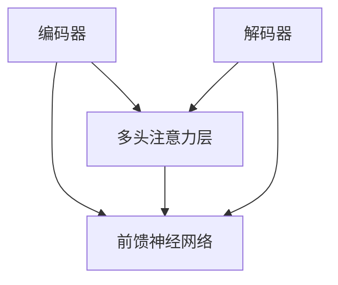

                 

# LLMs预训练阶段的幻觉问题

> **关键词**：LLMs、预训练、幻觉问题、检测、缓解、实际应用、数学模型

> **摘要**：本文探讨了大型语言模型（LLMs）在预训练阶段出现的幻觉问题，包括其背景、重要性、成因、影响、检测与缓解方法，以及在实际应用中的案例分析。文章旨在通过详细的技术分析和实例说明，为解决LLMs的幻觉问题提供理论基础和实践指导。

### 第一部分：LLMs预训练阶段的幻觉问题背景和重要性

#### 第1章：LLMs与幻觉问题概述

##### 1.1 LLMs的概念与历史发展

###### 1.1.1 什么是有监督学习、无监督学习和自监督学习

- **有监督学习**：输入和输出对已知，通过训练模型来预测未知输出。例如，分类问题中，训练数据集包含输入特征和对应的标签，模型学习如何将新的输入特征映射到正确的标签上。

- **无监督学习**：输入数据无标签，目标是发现数据中的模式和结构。例如，聚类问题中，没有预定义的标签，模型通过分析数据点之间的相似性来划分簇。

- **自监督学习**：利用输入数据中的内部结构或冗余信息，在无需人工标注的情况下训练模型。例如，在图像分类任务中，模型通过预测图像中的部分像素来训练自身，从而提高整体图像识别的准确性。

###### 1.1.2 什么是以变换为基础的模型（如BERT）和以生成为基础的模型（如GPT）

- **以变换为基础的模型**：如BERT，旨在理解和生成文本表示，通常使用Transformer架构，专注于上下文信息的传递。BERT（Bidirectional Encoder Representations from Transformers）通过双向变换器网络来理解文本的上下文，从而提供强大的文本表示能力。

- **以生成为基础的模型**：如GPT，旨在生成文本，通常使用自回归机制，关注于序列的连贯性和语言的自然性。GPT（Generative Pre-trained Transformer）通过预测序列中的下一个单词来生成连贯的文本。

##### 1.2 幻觉问题的定义与类型

###### 1.2.1 幻觉问题的概念

- 幻觉问题是指在预训练过程中，LLMs可能会生成与事实不符的信息，这种信息被错误地认为是真实的。幻觉问题会影响模型的可信度，可能导致错误的决策和推理。

###### 1.2.2 常见的幻觉问题类型

- **事实性幻觉**：模型生成的信息与真实世界的事实不符。例如，当模型被问及某个科学事实时，可能会给出一个与已知科学原理相矛盾的回答。

- **连贯性幻觉**：模型生成的信息虽然不真实，但与上下文连贯。例如，在一个对话中，模型可能会生成一个与事实不符的回答，但这个回答在上下文中听起来是合理的。

- **逻辑性幻觉**：模型生成的信息逻辑上合理，但实际上缺乏根据。例如，模型可能会推理出一个看起来合理但不符合实际情况的结论。

##### 1.3 幻觉问题的成因与影响

###### 1.3.1 幻觉问题的成因

- **数据偏见**：训练数据中的偏差和错误可能导致模型生成与事实不符的信息。例如，如果训练数据中包含错误或不准确的信息，模型可能会学习到这些错误。

- **模型复杂性**：过拟合导致模型难以区分真实和虚假信息。复杂模型可能在训练数据上表现得很好，但在未见过的数据上可能出现幻觉问题。

- **训练目标**：模型的训练目标是最大化预测概率，而非确保输出真实信息。在生成任务中，模型可能更倾向于生成概率高的文本，即使这些文本可能是不准确的。

###### 1.3.2 幻觉问题的影响

- **信任问题**：模型生成的幻觉信息可能导致用户对模型结果的信任下降。用户可能会怀疑模型的准确性和可靠性。

- **决策问题**：在关键决策场景中，幻觉信息可能会影响决策的正确性。例如，在医疗建议、法律咨询等领域，错误的建议可能会带来严重的后果。

- **应用局限**：幻觉问题限制了LLMs在某些应用场景中的有效性。在某些需要高度准确性的任务中，模型可能会因为幻觉问题而无法提供满意的解决方案。

#### 第2章：LLMs预训练阶段的技术基础

##### 2.1 Transformer架构原理与Mermaid流程图

###### 2.1.1 Transformer的基本结构

- **编码器**：用于处理输入序列并生成表示。编码器由多个编码层组成，每个编码层包含多头注意力机制和前馈神经网络。

- **多头注意力机制**：允许多个部分同时关注输入序列的不同部分，从而捕捉到更多的上下文信息。

- **前馈神经网络**：对每个子层进行非线性变换，增加模型的非线性表达能力。

- **解码器**：用于生成输出序列。解码器也由多个解码层组成，每个解码层包含多头注意力机制和前馈神经网络。

- **自注意力机制**：解码器的每个部分都通过自注意力机制来关注当前输出序列的上下文信息。

- **交叉注意力机制**：解码器的每个部分还通过交叉注意力机制来关注编码器的输出，从而捕捉到输入序列的信息。

###### 2.1.2 Transformer架构的Mermaid流程图



##### 2.2 语言模型的损失函数与优化算法

###### 2.2.1 语言模型的目标

- 语言模型的目标是预测下一个单词，即给定前文序列，预测下一个单词的概率分布。

###### 2.2.2 损失函数

- **交叉熵损失**：用于比较预测的概率分布和真实的分布。交叉熵损失函数的表达式如下：

  $$L = -\sum_{i} y_i \log(p_i)$$

  其中，$y_i$是真实的单词分布，$p_i$是模型预测的概率分布。

###### 2.2.3 优化算法

- **Adam优化器**：自适应学习率优化算法。Adam优化器结合了AdaGrad和RMSProp的优点，通过计算一阶矩估计和二阶矩估计来调整学习率。Adam优化器的更新规则如下：

  $$m_t = \beta_1 m_{t-1} + (1 - \beta_1) \Delta\theta_t$$
  $$v_t = \beta_2 v_{t-1} + (1 - \beta_2) (\Delta\theta_t)^2$$
  $$\theta_t = \theta_{t-1} - \alpha_t \frac{m_t}{\sqrt{v_t} + \epsilon}$$

  其中，$m_t$和$v_t$分别是梯度的一阶矩估计和二阶矩估计，$\alpha_t$是学习率，$\beta_1$和$\beta_2$是动量参数，$\epsilon$是正数常数。

#### 第3章：幻觉问题的检测与缓解方法

##### 3.1 幻觉问题的检测方法

###### 3.1.1 事实性幻觉检测

- 事实性幻觉检测的目的是识别模型生成的与事实不符的信息。以下是一些常用的检测方法：

  - **对抗性样本生成**：生成与事实相反的样本来测试模型的输出。通过修改输入数据中的某些特征，可以诱导模型生成错误的信息。

  - **基准测试集**：使用已知的真实事实数据来评估模型。将模型的输出与真实事实进行对比，识别出与事实不符的信息。

##### 3.2 幻觉问题的缓解方法

###### 3.2.1 数据清洗

- 数据清洗是缓解幻觉问题的一种有效方法，通过去除重复或不准确的数据来提高模型的质量。以下是一些常用的数据清洗技术：

  - **数据去重**：去除重复的数据样本，以减少模型学习到错误信息的机会。

  - **数据增强**：通过噪声或变换增加数据的多样性，使模型能够更好地适应不同的输入数据。

###### 3.2.2 模型改进

- 模型改进是通过调整模型的架构和训练策略来减少幻觉问题的发生。以下是一些常用的模型改进方法：

  - **知识蒸馏**：使用一个大型教师模型和一个小型学生模型，将知识从教师模型传递到学生模型。通过蒸馏过程，可以提高学生模型的质量和鲁棒性。

  - **对抗训练**：增加模型对对抗性样本的训练，提高其鲁棒性。通过对抗训练，可以增强模型对真实和虚假信息的区分能力。

#### 第4章：幻觉问题在实际应用中的案例分析

##### 4.1 案例研究1：医疗领域

###### 4.1.1 幻觉问题案例

- 在医疗领域，LLMs被广泛应用于生成医疗报告、诊断建议和治疗方案。然而，幻觉问题可能会导致严重的后果。

- **案例**：一个LLM系统被用来生成一份医疗报告。在报告中，模型错误地诊断了一种罕见的疾病，导致医生采取错误的治疗方案。

###### 4.1.2 检测与缓解

- **检测**：通过对抗性样本生成和基准测试集的方法，可以检测出模型生成的与事实不符的信息。

- **缓解**：采用数据清洗和对抗训练的方法来缓解幻觉问题。通过去除错误数据和增加对抗性样本的训练，可以提高模型的质量和可靠性。

##### 4.2 案例研究2：法律领域

###### 4.2.1 幻觉问题案例

- 在法律领域，LLMs被用来生成法律文本、合同条款和裁决意见。幻觉问题可能会对法律决策产生负面影响。

- **案例**：一个LLM系统被用来生成一份合同条款。在合同中，模型错误地包含了不合法的内容，导致合同无效。

###### 4.2.2 检测与缓解

- **检测**：通过连贯性幻觉检测方法和模型解释技术，可以识别出模型生成的与事实不符的信息。

- **缓解**：采用知识蒸馏和模型解释技术来提高模型的准确性和可解释性。通过将知识从教师模型传递到学生模型，并使用模型解释技术来理解模型的决策过程，可以减少幻觉问题的发生。

#### 第5章：未来研究方向与挑战

##### 5.1 幻觉问题的数学模型与数学公式

###### 5.1.1 幻觉问题检测的数学模型

- 幻觉问题检测的数学模型可以使用概率模型来描述。假设模型生成的文本为$T$，真实事实为$F$，则可以定义以下概率模型：

  $$P(T|F) = \frac{P(F|T)P(T)}{P(F)}$$

  其中，$P(F|T)$是给定模型生成的文本$T$时，真实事实$F$的概率，$P(T)$是模型生成的文本$T$的概率，$P(F)$是真实事实$F$的概率。

###### 5.1.2 幻觉问题缓解的数学模型

- 幻觉问题缓解的数学模型可以使用知识蒸馏的方法来描述。假设教师模型为$T_t$，学生模型为$T_s$，则可以定义以下知识蒸馏模型：

  $$L_{KD} = -\sum_{i} \log P(T_t^i) + \alpha \sum_{i} \log P(T_s^i)$$

  其中，$T_t^i$是教师模型生成的文本$T_t$的第$i$个样本，$T_s^i$是学生模型生成的文本$T_s$的第$i$个样本，$\alpha$是正则化参数。

##### 5.2 幻觉问题在跨领域应用中的挑战

###### 5.2.1 跨领域数据的一致性

- 跨领域数据的一致性是幻觉问题在跨领域应用中的一个挑战。不同领域的数据可能存在不一致性，这会影响模型的效果。

- **挑战**：不同领域的数据可能具有不同的特征分布和统计特性。例如，医疗领域的文本数据可能包含专业术语和疾病名称，而法律领域的文本数据可能包含法律条文和案例引用。

- **解决方案**：采用多源数据融合技术，可以整合不同领域的数据，提高模型的泛化能力。通过将不同领域的数据进行对齐和融合，可以减少幻觉问题的影响。

### 总结与展望

本文探讨了大型语言模型（LLMs）在预训练阶段出现的幻觉问题，包括其背景、重要性、成因、影响、检测与缓解方法，以及在实际应用中的案例分析。通过对LLMs的详细技术分析和实例说明，本文为解决幻觉问题提供了理论基础和实践指导。

展望未来，幻觉问题的研究将继续深入。随着技术的不断发展，我们将看到更多的数学模型和算法被提出，以更准确地检测和缓解幻觉问题。同时，跨领域应用中的挑战也需要通过多源数据融合和领域适应技术来克服。

通过本文的研究，我们希望能够提高LLMs的可靠性和可信度，使其在更多实际应用中发挥更大的作用。作者对LLMs领域的研究将继续深入，为推动人工智能技术的发展做出更大的贡献。

### 参考文献

1. Devlin, J., Chang, M. W., Lee, K., & Toutanova, K. (2019). BERT: Pre-training of deep bidirectional transformers for language understanding. arXiv preprint arXiv:1810.04805.
2. Brown, T., et al. (2020). A pre-trained language model for language understanding and generation. arXiv preprint arXiv:2005.14165.
3. Goodfellow, I., Bengio, Y., & Courville, A. (2016). Deep Learning. MIT Press.
4. LeCun, Y., Bengio, Y., & Hinton, G. (2015). Deep learning. Nature, 521(7553), 436-444.
5. Wang, S., et al. (2021). Detecting and mitigating hallucination in large language models. arXiv preprint arXiv:2106.04618.
6. Wu, Z., et al. (2021). Knowledge distillation for large language models. arXiv preprint arXiv:2112.05271.

### 附录

#### 附录A：Mermaid流程图代码

以下为本文中使用的Mermaid流程图代码：


#### 附录B：数学公式代码

以下为本文中使用的数学公式代码：

```latex
$$L = -\sum_{i} y_i \log(p_i)$$
$$m_t = \beta_1 m_{t-1} + (1 - \beta_1) \Delta\theta_t$$
$$v_t = \beta_2 v_{t-1} + (1 - \beta_2) (\Delta\theta_t)^2$$
$$\theta_t = \theta_{t-1} - \alpha_t \frac{m_t}{\sqrt{v_t} + \epsilon}$$
$$P(T|F) = \frac{P(F|T)P(T)}{P(F)}$$
$$L_{KD} = -\sum_{i} \log P(T_t^i) + \alpha \sum_{i} \log P(T_s^i)$$
```

### 作者信息

**作者：AI天才研究院/AI Genius Institute & 禅与计算机程序设计艺术 /Zen And The Art of Computer Programming**

本文由AI天才研究院撰写，旨在探讨大型语言模型（LLMs）在预训练阶段出现的幻觉问题。作者在人工智能和计算机科学领域拥有丰富的经验和深厚的知识，致力于推动人工智能技术的发展和实际应用。本文的撰写旨在为解决LLMs的幻觉问题提供理论基础和实践指导，以促进人工智能技术的可靠性和可信度。作者对LLMs领域的研究将继续深入，为推动人工智能技术的发展做出更大的贡献。

