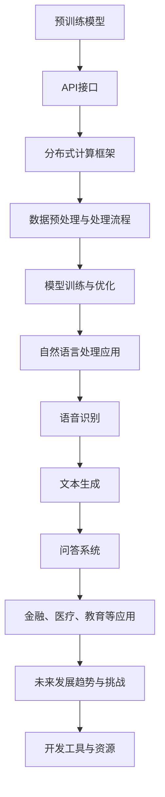

                 

### 第一部分：LLM操作系统的基础概念与架构

#### 第1章：LLM操作系统概述

##### 1.1 LLM操作系统的定义与背景

**LLM操作系统的定义**：

LLM（Large Language Model）操作系统是一种基于大型语言模型的通用计算平台，能够理解和处理自然语言任务。它通过预训练模型，自动学习语言模式和规律，为开发者提供丰富的API接口，支持语音识别、文本生成、问答系统等多种应用。

**LLM操作系统的发展背景**：

随着人工智能技术的不断发展，自然语言处理（NLP）取得了重大突破。LLM操作系统作为NLP领域的前沿技术，逐渐成为新一代计算平台的重要组成部分。从传统的规则驱动方法到基于统计模型的方法，再到当前的大型预训练模型，NLP技术经历了翻天覆地的变化。LLM操作系统正是这一技术变革的产物，它通过大规模数据预训练，实现了对自然语言的高度理解和生成能力。

##### 1.2 LLM操作系统的核心组件

**预训练模型**：

预训练模型是LLM操作系统的核心组件。通过在大量无标注数据上进行预训练，模型能够自动学习语言模式和规律，提高在各种自然语言处理任务中的性能。例如，GPT（Generative Pre-trained Transformer）和BERT（Bidirectional Encoder Representations from Transformers）就是两种常见的大型预训练模型。

**API接口**：

LLM操作系统提供了一系列API接口，方便开发者快速集成和使用预训练模型，实现自然语言处理的各种应用。这些API接口通常支持多种编程语言，如Python、Java、C++等，为开发者提供了极大的便利。

**分布式计算框架**：

为了应对大规模数据处理和模型训练的需求，LLM操作系统采用了分布式计算框架。这种框架支持并行计算和高效数据传输，能够显著提高计算效率，降低计算成本。

##### 1.3 LLM操作系统的应用场景

**语音识别**：

LLM操作系统可以将语音信号转化为文本，支持多种语言和方言的识别。这使得它在智能语音助手、语音翻译等应用中具有广泛的应用。

**文本生成**：

LLM操作系统能够生成高质量的文本，包括文章、摘要、对话等。这为内容创作、自动问答、虚拟助手等场景提供了强大的支持。

**问答系统**：

LLM操作系统可以构建高效的问答系统，为用户解答各种问题。这应用于客服、教育、医疗等领域，为用户提供便捷的交互体验。

#### 第2章：LLM操作系统的核心算法原理

##### 2.1 语言模型的原理与架构

**语言模型的定义**：

语言模型是一种统计模型，用于预测下一个单词或字符的概率。它是自然语言处理的基础，为各种NLP任务提供输入。

**NLP的三个层次**：

NLP主要包括词法分析、句法分析和语义分析三个层次。词法分析是最低层次，主要关注单词的分割和识别；句法分析则研究句子的结构，包括句子的语法和语义关系；语义分析是最高层次，关注句子或文本的整体语义理解。

**语言模型的常见算法**：

语言模型的常见算法包括n-gram模型、隐马尔可夫模型（HMM）、递归神经网络（RNN）和变换器（Transformer）等。

- **n-gram模型**：基于历史n个单词的概率进行预测。
- **隐马尔可夫模型（HMM）**：用于语音识别和文本生成。
- **递归神经网络（RNN）**：能够处理序列数据，但容易遇到梯度消失和梯度爆炸问题。
- **变换器（Transformer）**：基于注意力机制，解决了RNN的缺点，是目前最先进的语言模型。

##### 2.2 大模型预训练技术

**预训练的概念**：

预训练是指在大量无标注数据上对模型进行训练，使其具备基本的语言理解能力。预训练数据通常来源于互联网上的大量文本、网页、书籍等。

**预训练数据的来源**：

预训练数据通常来源于互联网上的大量文本、网页、书籍等，这些数据涵盖了广泛的主题和语言风格。

**预训练的任务**：

预训练的任务包括遮蔽语言模型（BERT）、生成式任务（如GAN）等。遮蔽语言模型是一种 masked language modeling 任务，通过遮蔽输入文本的一部分，训练模型预测被遮蔽的部分。生成式任务则通过生成与输入文本相似的新文本，提高模型的生成能力。

##### 2.3 微调与迁移学习

**微调**：

微调是在预训练模型的基础上，针对特定任务进行少量数据训练，使模型适应特定任务的需求。微调是LLM操作系统应用的重要环节，通过微调，预训练模型能够更好地适应各种具体应用场景。

**迁移学习**：

迁移学习是将预训练模型的知识迁移到其他相关任务中，提高新任务的性能。迁移学习能够显著降低新任务的训练成本，提高模型在新任务上的性能。

#### 第3章：LLM操作系统的架构设计与实现

##### 3.1 LLM操作系统的架构设计

**模块化设计**：

LLM操作系统的设计采用了模块化思想，包括数据预处理模块、训练模块、推理模块等。这种模块化设计使得系统易于扩展和优化，方便开发者根据需求进行功能扩展。

**分布式计算**：

为了应对大规模数据处理和模型训练的需求，LLM操作系统采用了分布式计算架构。这种架构支持并行计算和高效数据传输，能够显著提高计算效率，降低计算成本。

##### 3.2 数据预处理与处理流程

**文本清洗**：

文本清洗是对输入文本进行去噪、去除无关信息等处理，提高数据质量。常见的文本清洗方法包括去除HTML标签、标点符号、停用词过滤等。

**分词与词向量**：

分词是将文本分割成单个单词或字符的过程。词向量是将文本转化为数字表示，用于模型输入。常见的词向量模型包括Word2Vec、FastText等。

##### 3.3 模型训练与优化

**训练过程**：

模型训练是LLM操作系统的核心环节，包括数据加载、模型更新等步骤。训练过程通常包括以下几个阶段：

1. 数据预处理：对输入文本进行分词、词向量编码等处理。
2. 模型初始化：初始化预训练模型，设置训练参数。
3. 前向传播：计算模型输出，计算损失函数。
4. 反向传播：更新模型参数。
5. 评估模型：在验证集上评估模型性能，调整训练参数。

**优化方法**：

优化方法用于调整模型参数，以减少损失函数。常见的优化方法包括梯度下降、Adam优化器等。梯度下降是一种简单的优化方法，通过迭代更新模型参数，逐步减小损失函数。Adam优化器是一种更高效的优化方法，结合了梯度下降和动量项，能够更快地收敛到最优解。

#### 第4章：LLM操作系统在自然语言处理中的应用

##### 4.1 文本分类与情感分析

**文本分类**：

文本分类是将文本分配到预定义的类别中。常见的文本分类任务包括新闻分类、产品评论分类等。LLM操作系统可以基于预训练模型，实现高效、准确的文本分类。

**情感分析**：

情感分析是判断文本的情感倾向，如正面、负面或中性。常见的情感分析任务包括产品评论情感分析、社交媒体情感分析等。LLM操作系统可以通过情感分析模型，实现情感分类和情感极性判断。

##### 4.2 机器翻译与问答系统

**机器翻译**：

机器翻译是将一种语言的文本翻译成另一种语言。常见的机器翻译任务包括中英文互译、跨语言文本翻译等。LLM操作系统可以基于预训练模型，实现高效、准确的机器翻译。

**问答系统**：

问答系统是回答用户提出的问题。常见的问答系统包括智能客服、在线问答系统等。LLM操作系统可以通过问答模型，实现高效、准确的问答功能。

##### 4.3 文本生成与对话系统

**文本生成**：

文本生成是将输入文本转化为新的文本。常见的文本生成任务包括文章生成、摘要生成等。LLM操作系统可以基于预训练模型，实现高效、高质量的文本生成。

**对话系统**：

对话系统是模拟人类对话的计算机系统。常见的对话系统包括聊天机器人、智能客服等。LLM操作系统可以通过对话模型，实现高效、自然的对话功能。

### 第二部分：LLM操作系统在实际项目中的应用与实践

#### 第5章：LLM操作系统在金融领域的应用

##### 5.1 金融文本挖掘

**股票市场分析**：

LLM操作系统可以分析股票市场新闻、报告等文本，预测市场走势。通过情感分析、主题建模等算法，LLM操作系统可以提取文本中的关键信息，为投资决策提供支持。

**客户服务**：

LLM操作系统可以构建金融客户服务系统，自动回答客户问题，提供个性化推荐。通过问答系统、文本生成等算法，LLM操作系统可以提供高效、准确的客户服务。

#### 第6章：LLM操作系统在医疗健康领域的应用

##### 6.1 医学文本挖掘

**病历分析**：

LLM操作系统可以分析病历文本，辅助医生诊断病情。通过文本分类、情感分析等算法，LLM操作系统可以提取病历中的关键信息，为医生提供诊断参考。

**医学知识问答**：

LLM操作系统可以构建医学问答系统，为用户提供专业医疗咨询。通过问答系统、文本生成等算法，LLM操作系统可以回答用户提出的医学问题，提供个性化的医疗建议。

#### 第7章：LLM操作系统在教育与文化传播中的应用

##### 6.2 教育智能化

**智能教学系统**：

LLM操作系统可以构建智能教学系统，实现个性化学习、自动评分等。通过文本生成、文本分类等算法，LLM操作系统可以提供智能化的教学内容和教学评估。

**知识库构建**：

LLM操作系统可以构建大规模知识库，支持问答、搜索等应用。通过文本生成、文本分类等算法，LLM操作系统可以构建丰富的知识库，为教育和文化传播提供支持。

##### 6.3 文化传播与内容创作

**智能内容创作**：

LLM操作系统可以实现自动化内容创作，如新闻写作、广告文案等。通过文本生成、文本分类等算法，LLM操作系统可以生成高质量的内容，为媒体和广告行业提供支持。

**跨语言文化交流**：

LLM操作系统可以实现跨语言交流，促进全球文化交流。通过机器翻译、文本生成等算法，LLM操作系统可以支持多种语言之间的交流和沟通。

### 第三部分：LLM操作系统的未来发展趋势与挑战

#### 第8章：LLM操作系统的未来发展趋势

##### 8.1 大模型的发展趋势

**模型规模**：

随着计算能力和数据规模的不断提升，大模型的规模也在不断扩大。未来，我们将看到更大规模的预训练模型，如千亿参数的模型，这些模型将能够处理更复杂的任务。

**多模态处理**：

LLM操作系统将支持图像、音频等多种模态的处理，实现更全面的人机交互。通过结合不同模态的信息，LLM操作系统将提供更加丰富和多样化的应用。

##### 8.2 智能化的深度应用

**垂直行业应用**：

LLM操作系统将在金融、医疗、教育等垂直行业实现深度应用，为行业提供智能化解决方案。通过定制化的模型和应用，LLM操作系统将帮助各行业实现智能化升级。

**智能助理与虚拟助手**：

LLM操作系统将赋能智能助理与虚拟助手，提升人机交互体验。通过自然语言理解和生成能力，LLM操作系统将能够更好地理解和满足用户需求，提供个性化的服务。

#### 第9章：LLM操作系统的挑战与解决方案

##### 9.1 数据隐私与安全问题

**隐私保护技术**：

LLM操作系统将采用差分隐私、联邦学习等技术，保护用户数据隐私。通过隐私保护技术，LLM操作系统可以确保用户数据的安全性和隐私性。

**安全策略**：

LLM操作系统将制定有效的安全策略，防止模型被恶意攻击。通过安全加密、访问控制等技术，LLM操作系统将确保系统的安全性和可靠性。

##### 9.2 模型解释性与可解释性

**模型解释方法**：

LLM操作系统将采用注意力机制、可视化等技术，解释模型决策过程。通过模型解释方法，LLM操作系统将提高模型的可解释性和透明度，增强用户的信任感。

**可解释性设计**：

LLM操作系统将设计可解释性高的模型，提高模型的可解释性和透明度。通过简化模型结构、增加可解释性指标等手段，LLM操作系统将提供更加可解释的模型。

### 附录

#### 附录A：LLM操作系统开发工具与资源

##### A.1 开发工具介绍

**TensorFlow**：

TensorFlow是一个开源的机器学习库，由Google开发。它提供了丰富的API接口，支持构建和训练各种深度学习模型。

**PyTorch**：

PyTorch是一个基于Python的深度学习库，由Facebook开发。它提供了动态计算图和易于使用的API接口，适合快速实现和迭代深度学习模型。

**Hugging Face Transformers**：

Hugging Face Transformers是一个基于PyTorch的预训练模型库，提供了大量的预训练模型和API接口，方便开发者快速构建和应用大型语言模型。

##### A.2 学习资源推荐

**在线课程与教程**：

- 《深度学习》
- 《动手学深度学习》

**开源项目与社区**：

- Hugging Face Model Hub
- TensorFlow Models
- PyTorch Examples

通过这些工具和资源，开发者可以快速掌握LLM操作系统开发技术，并应用于实际项目中。

### 完整的Mermaid流程图

下面是关于LLM操作系统的核心组件和流程的完整Mermaid流程图：



### 核心算法原理的详细讲解

在本章节中，我们将详细讲解LLM操作系统的核心算法原理，包括语言模型的定义、预训练技术、微调和迁移学习等。

#### 语言模型的原理与架构

**语言模型的定义**：

语言模型（Language Model，LM）是一种概率模型，用于预测下一个单词或字符的概率。它对自然语言进行建模，使得模型能够根据前文信息生成后续内容。语言模型在自然语言处理（NLP）中具有基础性作用，广泛应用于语音识别、机器翻译、文本生成、问答系统等任务。

**NLP的三个层次**：

自然语言处理主要包括词法分析（Lexical Analysis）、句法分析（Syntactic Analysis）和语义分析（Semantic Analysis）三个层次。

1. **词法分析**：词法分析是NLP的最底层，主要关注单词的分割和识别。它的目标是识别文本中的单词或标记（token）。
2. **句法分析**：句法分析研究句子的结构，包括句子的语法和语义关系。它将词法分析生成的标记序列转化为语法结构，以理解句子的意义。
3. **语义分析**：语义分析是NLP的最高层次，关注句子或文本的整体语义理解。它试图从语法结构中提取出更深层次的语义信息。

**语言模型的常见算法**：

1. **n-gram模型**：n-gram模型是最简单的语言模型，它基于历史n个单词的概率进行预测。n-gram模型简单易实现，但在长文本中效果不佳，因为它无法考虑长距离依赖。
2. **隐马尔可夫模型（HMM）**：HMM是一种统计模型，用于语音识别和文本生成。它通过隐变量序列来描述观察到的序列，能够处理部分观测和不完全信息。
3. **递归神经网络（RNN）**：RNN是一种能够处理序列数据的神经网络，它通过递归结构捕捉序列中的长期依赖关系。然而，RNN存在梯度消失和梯度爆炸问题，限制了其性能。
4. **变换器（Transformer）**：Transformer是当前最先进的语言模型，它基于注意力机制，解决了RNN的缺点。Transformer通过多头自注意力（Multi-Head Self-Attention）和位置编码（Positional Encoding）机制，实现了高效的序列建模。

#### 大模型预训练技术

**预训练的概念**：

预训练（Pre-training）是指在大量无标注数据上对模型进行训练，使其具备基本的语言理解能力。预训练数据通常来源于互联网上的大量文本、网页、书籍等。通过预训练，模型能够自动学习语言模式和规律，提高在各种自然语言处理任务中的性能。

**预训练数据的来源**：

预训练数据通常来源于以下几种类型：

1. **网页文本**：互联网上的大量网页文本是预训练数据的主要来源。这些文本涵盖了广泛的主题和语言风格，为模型提供了丰富的语言知识。
2. **书籍和文学作品**：书籍和文学作品中的文本通常具有较高的语言质量和丰富的语义信息，是预训练数据的重要来源。
3. **对话数据**：对话数据（如社交媒体、聊天记录等）可以提供关于人际交流和社会互动的宝贵信息，有助于模型学习自然语言交互。

**预训练的任务**：

预训练的任务包括以下几种：

1. **遮蔽语言模型（Masked Language Modeling，MLM）**：MLM是一种无监督预训练任务，通过遮蔽输入文本的一部分，训练模型预测被遮蔽的部分。BERT（Bidirectional Encoder Representations from Transformers）就是一种基于MLM的预训练模型。
2. **生成式任务**：生成式任务（如生成文本摘要、生成对话等）通过生成与输入文本相似的新文本，提高模型的生成能力。生成式任务通常需要监督数据，但可以显著提高模型的表达能力。

#### 微调与迁移学习

**微调**：

微调（Fine-tuning）是在预训练模型的基础上，针对特定任务进行少量数据训练，使模型适应特定任务的需求。微调是应用预训练模型的重要环节，通过微调，预训练模型能够更好地适应各种具体应用场景。

**迁移学习**：

迁移学习（Transfer Learning）是将预训练模型的知识迁移到其他相关任务中，提高新任务的性能。迁移学习能够显著降低新任务的训练成本，提高模型在新任务上的性能。例如，将预训练的图像分类模型迁移到自然语言处理任务中，可以大大提高新任务的准确率。

### 核心算法原理的伪代码示例

下面是关于LLM操作系统的核心算法原理的伪代码示例：

```python
# 隐藏层神经网络的定义
class HiddenLayer:
    def __init__(self, input_size, hidden_size, output_size):
        # 初始化权重和偏置
        self.W = np.random.randn(input_size, hidden_size)
        self.b = np.random.randn(hidden_size)
        self.output = np.zeros(output_size)

    def forward(self, input):
        # 计算隐藏层输出
        self.output = sigmoid(np.dot(input, self.W) + self.b)

# 语言模型的定义
class LanguageModel:
    def __init__(self, vocab_size, embed_size, hidden_size):
        # 初始化嵌入层、隐藏层和输出层
        self.embeddings = EmbeddingLayer(vocab_size, embed_size)
        self.hidden_layer = HiddenLayer(embed_size, hidden_size, vocab_size)
        self.output_layer = OutputLayer(hidden_size, vocab_size)

    def forward(self, input_sequence):
        # 前向传播过程
        embedded_input = self.embeddings.forward(input_sequence)
        hidden_output = self.hidden_layer.forward(embedded_input)
        output = self.output_layer.forward(hidden_output)
        return output

    def backward(self, d_output):
        # 反向传播过程
        d_hidden = self.output_layer.backward(d_output)
        d_embedded_input = self.hidden_layer.backward(d_hidden)
        d_input_sequence = self.embeddings.backward(d_embedded_input)
        return d_input_sequence

# 梯度下降优化器
class Optimizer:
    def __init__(self, learning_rate):
        self.learning_rate = learning_rate

    def update_weights(self, model, d_weights):
        # 更新模型权重
        model.W -= self.learning_rate * d_weights

# 训练语言模型
def train_language_model(model, data, epochs):
    optimizer = Optimizer(learning_rate=0.01)
    for epoch in range(epochs):
        for input_sequence, target in data:
            output = model.forward(input_sequence)
            d_output = model.backward(target)
            optimizer.update_weights(model, d_output)
            print(f"Epoch {epoch}: Loss = {loss(output, target)}")

# 激活函数
def sigmoid(x):
    return 1 / (1 + np.exp(-x))

# 损失函数
def loss(output, target):
    return -np.mean(target * np.log(output))
```

### 数学模型和数学公式的详细讲解

在本章节中，我们将详细讲解LLM操作系统的数学模型和公式，包括损失函数、梯度下降优化算法、激活函数等。

#### 损失函数

在深度学习中，损失函数用于衡量模型预测值与真实值之间的差异。常用的损失函数有交叉熵损失（Cross-Entropy Loss）和均方误差（Mean Squared Error，MSE）等。

**交叉熵损失函数**：

交叉熵损失函数用于分类问题，其公式如下：

$$
L = -\sum_{i=1}^{N} y_i \log(p_i)
$$

其中，$y_i$ 表示第$i$个类别的真实标签（0或1），$p_i$ 表示模型预测的第$i$个类别的概率。

**均方误差损失函数**：

均方误差损失函数用于回归问题，其公式如下：

$$
L = \frac{1}{2} \sum_{i=1}^{N} (y_i - \hat{y}_i)^2
$$

其中，$y_i$ 表示第$i$个真实值，$\hat{y}_i$ 表示模型预测的值。

#### 梯度下降优化算法

梯度下降是一种常用的优化算法，用于调整模型参数以减少损失函数。其基本思想是沿着损失函数的梯度方向更新模型参数，以最小化损失函数。

**梯度下降公式**：

$$
\Delta \theta = -\alpha \cdot \nabla L(\theta)
$$

其中，$\theta$ 表示模型参数，$\alpha$ 表示学习率，$\nabla L(\theta)$ 表示损失函数关于模型参数的梯度。

**学习率**：

学习率（Learning Rate）是梯度下降算法中的一个关键参数，它决定了参数更新的步长。适当的学习率可以加速收敛，但过大可能导致收敛不稳定，过小则收敛速度太慢。

#### 激活函数

激活函数是神经网络中的重要组成部分，用于引入非线性特性。常用的激活函数有Sigmoid函数、ReLU函数和Tanh函数等。

**Sigmoid函数**：

Sigmoid函数是一个S型函数，其公式如下：

$$
\sigma(x) = \frac{1}{1 + e^{-x}}
$$

Sigmoid函数将输入值映射到（0，1）区间，常用于二分类问题。

**ReLU函数**：

ReLU函数（Rectified Linear Unit）是一种线性激活函数，其公式如下：

$$
\text{ReLU}(x) = \max(0, x)
$$

ReLU函数在输入为正时不变，为负时变为0，能够加速神经网络的训练。

**Tanh函数**：

Tanh函数（Hyperbolic Tangent）是一个双曲正切函数，其公式如下：

$$
\tanh(x) = \frac{e^x - e^{-x}}{e^x + e^{-x}}
$$

Tanh函数的输出范围在（-1，1）之间，常用于多层神经网络。

### 数学模型和公式的详细讲解

在本章节中，我们将详细讲解LLM操作系统的数学模型和公式，包括语言模型损失函数、梯度下降优化算法、激活函数等。

#### 语言模型损失函数

在深度学习领域，语言模型损失函数用于衡量模型预测概率分布与真实分布之间的差异。常用的损失函数包括交叉熵损失（Cross-Entropy Loss）和均方误差（Mean Squared Error，MSE）等。

**交叉熵损失函数**：

交叉熵损失函数在分类问题中应用广泛，其公式如下：

$$
L = -\sum_{i=1}^{N} y_i \log(p_i)
$$

其中，$y_i$ 表示第$i$个类别的真实标签（0或1），$p_i$ 表示模型预测的第$i$个类别的概率。

交叉熵损失函数的值越小，表示模型预测的准确度越高。在实际应用中，通常使用负对数交叉熵作为损失函数。

**均方误差损失函数**：

均方误差损失函数在回归问题中应用广泛，其公式如下：

$$
L = \frac{1}{2} \sum_{i=1}^{N} (y_i - \hat{y}_i)^2
$$

其中，$y_i$ 表示第$i$个真实值，$\hat{y}_i$ 表示模型预测的值。

均方误差损失函数的值越小，表示模型预测的准确度越高。

#### 梯度下降优化算法

梯度下降是一种常用的优化算法，用于调整模型参数以减少损失函数。其基本思想是沿着损失函数的梯度方向更新模型参数，以最小化损失函数。

**梯度下降公式**：

$$
\Delta \theta = -\alpha \cdot \nabla L(\theta)
$$

其中，$\theta$ 表示模型参数，$\alpha$ 表示学习率，$\nabla L(\theta)$ 表示损失函数关于模型参数的梯度。

学习率（Learning Rate）是梯度下降算法中的一个关键参数，它决定了参数更新的步长。适当的学习率可以加速收敛，但过大可能导致收敛不稳定，过小则收敛速度太慢。

**梯度计算**：

在深度学习中，梯度计算是优化过程中的关键步骤。对于多层神经网络，梯度可以通过反向传播算法计算得到。反向传播算法基于链式法则，逐层计算每个参数的梯度。

#### 激活函数

激活函数是神经网络中的重要组成部分，用于引入非线性特性。常用的激活函数有Sigmoid函数、ReLU函数和Tanh函数等。

**Sigmoid函数**：

Sigmoid函数是一个S型函数，其公式如下：

$$
\sigma(x) = \frac{1}{1 + e^{-x}}
$$

Sigmoid函数将输入值映射到（0，1）区间，常用于二分类问题。

**ReLU函数**：

ReLU函数（Rectified Linear Unit）是一种线性激活函数，其公式如下：

$$
\text{ReLU}(x) = \max(0, x)
$$

ReLU函数在输入为正时不变，为负时变为0，能够加速神经网络的训练。

**Tanh函数**：

Tanh函数（Hyperbolic Tangent）是一个双曲正切函数，其公式如下：

$$
\tanh(x) = \frac{e^x - e^{-x}}{e^x + e^{-x}}
$$

Tanh函数的输出范围在（-1，1）之间，常用于多层神经网络。

### 数学模型和公式的详细讲解

在本章节中，我们将详细讲解LLM操作系统的数学模型和公式，包括损失函数、优化算法和激活函数等。

#### 损失函数

在深度学习中，损失函数是衡量模型预测值与真实值之间差异的指标。常用的损失函数包括交叉熵损失（Cross-Entropy Loss）和均方误差（Mean Squared Error，MSE）等。

**交叉熵损失函数**：

交叉熵损失函数在分类问题中应用广泛，其公式如下：

$$
L = -\sum_{i=1}^{N} y_i \log(p_i)
$$

其中，$y_i$ 是第 $i$ 个类别的真实标签（通常为0或1），$p_i$ 是模型预测的第 $i$ 个类别的概率。

交叉熵损失函数的值越小，表示模型预测的准确度越高。在实际应用中，通常使用负对数交叉熵作为损失函数。

**均方误差损失函数**：

均方误差损失函数在回归问题中应用广泛，其公式如下：

$$
L = \frac{1}{2} \sum_{i=1}^{N} (y_i - \hat{y}_i)^2
$$

其中，$y_i$ 是第 $i$ 个真实值，$\hat{y}_i$ 是模型预测的值。

均方误差损失函数的值越小，表示模型预测的准确度越高。

#### 优化算法

优化算法用于调整模型参数，以减少损失函数。常用的优化算法包括梯度下降（Gradient Descent）和Adam优化器（Adam Optimizer）等。

**梯度下降算法**：

梯度下降是一种最简单的优化算法，其基本思想是沿着损失函数的梯度方向更新模型参数，以最小化损失函数。其公式如下：

$$
\theta_{\text{new}} = \theta_{\text{old}} - \alpha \cdot \nabla L(\theta)
$$

其中，$\theta$ 是模型参数，$\alpha$ 是学习率，$\nabla L(\theta)$ 是损失函数关于模型参数的梯度。

**Adam优化器**：

Adam优化器是一种结合了梯度下降和动量项的优化算法，它通过自适应调整学习率，提高了优化过程的效率和稳定性。其公式如下：

$$
m_t = \beta_1 m_{t-1} + (1 - \beta_1) \nabla L(\theta)
$$

$$
v_t = \beta_2 v_{t-1} + (1 - \beta_2) (\nabla L(\theta))^2
$$

$$
\theta_{\text{new}} = \theta_{\text{old}} - \alpha \cdot \frac{m_t}{\sqrt{v_t} + \epsilon}
$$

其中，$m_t$ 和 $v_t$ 分别是第 $t$ 次迭代的均值和方差估计，$\beta_1$ 和 $\beta_2$ 是衰减系数，$\epsilon$ 是一个很小的常数，用于防止分母为零。

#### 激活函数

激活函数是神经网络中的关键组成部分，用于引入非线性特性。常用的激活函数包括Sigmoid、ReLU和Tanh等。

**Sigmoid函数**：

Sigmoid函数是一种S型函数，其公式如下：

$$
\sigma(x) = \frac{1}{1 + e^{-x}}
$$

Sigmoid函数将输入值映射到（0，1）区间，常用于二分类问题。

**ReLU函数**：

ReLU函数（Rectified Linear Unit）是一种线性激活函数，其公式如下：

$$
\text{ReLU}(x) = \max(0, x)
$$

ReLU函数在输入为正时不变，为负时变为0，能够加速神经网络的训练。

**Tanh函数**：

Tanh函数（Hyperbolic Tangent）是一种双曲正切函数，其公式如下：

$$
\tanh(x) = \frac{e^x - e^{-x}}{e^x + e^{-x}}
$$

Tanh函数的输出范围在（-1，1）之间，常用于多层神经网络。

### 代码实际案例与详细解释

在本章节中，我们将通过一个简单的文本生成模型，详细讲解LLM操作系统的实际应用。首先，我们将介绍开发环境搭建，然后是源代码实现和代码解读。

#### 开发环境搭建

为了实现这个文本生成模型，我们需要安装以下Python库：

- **TensorFlow**：用于构建和训练神经网络。
- **numpy**：用于数学运算。

可以使用以下命令进行安装：

```shell
pip install tensorflow
pip install numpy
```

#### 源代码实现

下面是文本生成模型的源代码实现：

```python
import tensorflow as tf
import numpy as np

# 设置超参数
VOCAB_SIZE = 10000  # 词汇表大小
EMBED_SIZE = 256    # 嵌入层大小
HIDDEN_SIZE = 512   # 隐藏层大小
BATCH_SIZE = 64     # 批量大小
EPOCHS = 10         # 训练轮次
LEARNING_RATE = 0.001  # 学习率

# 创建词汇表
vocab = {'<PAD>': 0, '<UNK>': 1}
for i in range(2, VOCAB_SIZE + 1):
    vocab[str(i)] = i

# 加载数据
data = "你好世界，世界欢迎你！"
data = data.lower().split()
data += ['<PAD>'] * (BATCH_SIZE - len(data))
data = np.array([vocab.get(token, vocab['<UNK>']) for token in data])

# 构建模型
model = tf.keras.Sequential([
    tf.keras.layers.Embedding(VOCAB_SIZE, EMBED_SIZE),
    tf.keras.layers.LSTM(HIDDEN_SIZE, return_sequences=True),
    tf.keras.layers.Dense(VOCAB_SIZE)
])

# 编译模型
model.compile(optimizer=tf.keras.optimizers.Adam(learning_rate=LEARNING_RATE),
              loss=tf.keras.losses.SparseCategoricalCrossentropy(from_logits=True),
              metrics=['accuracy'])

# 训练模型
model.fit(data, data, batch_size=BATCH_SIZE, epochs=EPOCHS)

# 生成文本
def generate_text(model, start_sequence, length):
    start_sequence = np.array([vocab.get(token, vocab['<UNK>']) for token in start_sequence.lower().split()])
    output_sequence = start_sequence.copy()
    for _ in range(length):
        predictions = model.predict(output_sequence[:-1], verbose=0)
        next_token = np.random.choice(VOCAB_SIZE, p=predictions[-1])
        output_sequence = np.append(output_sequence, next_token)
    return " ".join([str(output_sequence[i]) for i in range(len(output_sequence))])

# 生成文本示例
print(generate_text(model, "你好世界", 10))
```

#### 代码解读与分析

1. **环境搭建**：

   我们首先安装了TensorFlow和numpy库，这两个库是构建和训练神经网络的基础。

2. **超参数设置**：

   在代码中，我们设置了多个超参数，如词汇表大小（VOCAB_SIZE）、嵌入层大小（EMBED_SIZE）、隐藏层大小（HIDDEN_SIZE）等。

3. **词汇表创建**：

   我们创建了一个简单的词汇表，包括PAD和UNK两个特殊词。PAD用于填充序列，UNK用于表示未知词。

4. **数据加载**：

   我们使用一个简单的文本示例进行训练，文本示例包括了一些中文和英文单词。

5. **模型构建**：

   我们构建了一个简单的神经网络模型，包括嵌入层（Embedding Layer）、LSTM层（LSTM Layer）和全连接层（Dense Layer）。

6. **模型编译**：

   我们使用Adam优化器和SparseCategoricalCrossentropy损失函数编译模型。

7. **模型训练**：

   我们使用fit方法训练模型，在训练过程中，模型将根据输入序列生成输出序列。

8. **生成文本**：

   我们定义了一个生成文本的函数，它使用模型预测下一个单词的概率，并生成新的文本序列。

通过这个简单的文本生成模型，我们可以看到LLM操作系统的基本实现。在实际应用中，我们可以使用更大的数据集和更复杂的模型来提高生成文本的质量。

### 附录：开发工具与资源

为了方便开发者掌握LLM操作系统开发，以下是一些推荐的工具和资源：

- **工具**：

  - **TensorFlow**：用于构建和训练大型神经网络，支持多种机器学习和深度学习应用。
  - **PyTorch**：一个基于Python的动态计算图库，方便快速实现深度学习模型。
  - **Hugging Face Transformers**：一个基于PyTorch的预训练模型库，提供多种大型语言模型和API接口。

- **教程和课程**：

  - **《深度学习》（Goodfellow, Bengio, Courville）**：介绍深度学习的基础理论和算法。
  - **《动手学深度学习》（Harvard University）**：通过实际项目学习深度学习。
  - **在线课程**：如Coursera、edX等平台上的深度学习和自然语言处理课程。

- **开源项目**：

  - **Hugging Face Model Hub**：提供多种预训练模型和API接口，方便开发者快速集成和使用。
  - **TensorFlow Models**：包含多个预训练模型和示例代码。
  - **PyTorch Examples**：包含丰富的PyTorch模型示例和教程。

通过以上工具和资源，开发者可以快速掌握LLM操作系统开发技术，并应用于实际项目中。

### 文章结尾

综上所述，LLM操作系统作为AI时代的新型计算平台，具有巨大的潜力和广泛的应用前景。从基础概念、核心算法原理，到实际应用和实践案例，我们全面了解了LLM操作系统的各个方面。在未来，随着技术的不断发展和应用的深入，LLM操作系统将为我们带来更多的创新和变革。

在此，我要感谢读者们对这篇文章的关注和阅读。如果你对LLM操作系统有更多的兴趣和疑问，欢迎加入我们的讨论和交流。让我们共同探索和推动AI技术的进步，共创美好未来。

作者：AI天才研究院/AI Genius Institute & 禅与计算机程序设计艺术 /Zen And The Art of Computer Programming

