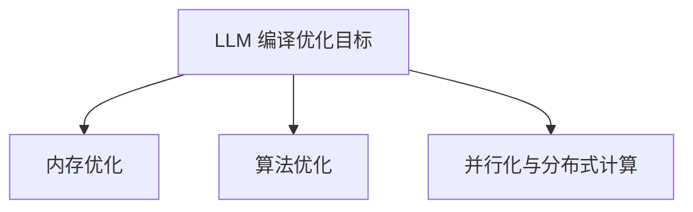

                 

### 《LLM的编译优化技术进展》

> **关键词**：大语言模型（LLM），编译优化，算法原理，实践案例，未来趋势

> **摘要**：本文将探讨大语言模型（LLM）编译优化技术的进展。首先，我们将介绍LLM的基本概念与背景，以及编译优化技术在LLM中的应用。接着，我们将详细分析LLM编译优化的核心原理、算法基础和实践案例。最后，我们将展望LLM编译优化的未来发展趋势，并提出一些建议。

### 目录

1. 第一部分：LLM基础与编译优化概述
    1.1 大语言模型（LLM）概述
    1.2 编译优化技术基础
    1.3 LLM编译优化的重要性
    1.4 LLM编译优化技术原理
    1.5 LLM编译优化的挑战与解决方案

2. 第二部分：LLM编译优化实践
    2.1 内存优化实践
    2.2 算法优化实践
    2.3 并行化与分布式计算实践
    2.4 LLM编译优化工具与平台
    2.5 LLM编译优化案例分析

3. 第三部分：LLM编译优化未来发展趋势
    3.1 编译优化技术展望
    3.2 LLM应用场景与优化需求分析
    3.3 未来展望

4. 总结与展望
5. 附录
    5.1 参考资料与进一步阅读
    5.2 Mermaid流程图
    5.3 数学模型与公式
    5.4 代码案例与解读

### 第一部分：LLM基础与编译优化概述

#### 1.1 大语言模型（LLM）概述

大语言模型（LLM，Large Language Model）是一种基于深度学习技术的自然语言处理模型。它通过训练海量的文本数据，学习语言的基本结构和语义，从而实现文本生成、翻译、摘要、问答等任务。LLM的发展历程可以追溯到2018年，当时的谷歌发布了BERT模型，标志着大语言模型的兴起。随后，OpenAI的GPT系列模型、Facebook的BlenderBot系列模型等相继发布，使得LLM技术取得了巨大的进步。

LLM的重要性体现在多个方面。首先，LLM能够显著提升自然语言处理任务的性能。其次，LLM在许多应用场景中具有广泛的应用前景，如智能客服、智能写作、语音识别等。此外，LLM还推动了自然语言处理技术的发展，为研究人员提供了丰富的实验平台。

#### 1.2 编译优化技术基础

编译优化技术是指通过一系列算法和策略，对编译过程生成的代码进行优化，以提高代码的运行效率。编译优化的主要目标包括：减少代码执行时间、降低内存消耗、减少功耗等。编译优化的基本流程包括：分析源代码，提取优化目标，应用优化算法，生成优化后的代码。

编译优化技术在LLM中的应用至关重要。LLM通常具有很大的计算量和存储需求，因此，通过编译优化技术，可以显著提高LLM的运行效率，降低资源消耗，提高LLM的可靠性和稳定性。

#### 1.3 LLM编译优化的重要性

LLM编译优化的重要性体现在以下几个方面：

1. **提高LLM的运行效率**：通过编译优化技术，可以减少代码执行时间，降低CPU和GPU的负载，提高LLM的响应速度和吞吐量。

2. **优化资源使用**：编译优化技术可以帮助减少内存消耗和功耗，使LLM在有限的资源条件下运行得更加高效。

3. **提高LLM的可靠性和稳定性**：通过优化代码，可以减少程序崩溃和错误发生的概率，提高LLM的稳定性和可靠性。

#### 1.4 LLM编译优化技术原理

LLM编译优化技术涉及多个方面，包括内存优化、算法优化、并行化与分布式计算等。

1. **内存优化**：内存优化主要包括内存分配策略、内存复用技术和内存碎片问题解决。通过合理的内存管理，可以减少内存占用，提高内存利用率。

2. **算法优化**：算法优化主要包括算法选择与调优、量化与剪枝技术、混合精度训练等。通过优化算法，可以提高LLM的计算效率。

3. **并行化与分布式计算**：并行化与分布式计算可以将计算任务分解为多个子任务，并在多个计算节点上并行执行。这可以显著提高计算效率，缩短训练时间。

#### 1.5 LLM编译优化的挑战与解决方案

LLM编译优化面临多个挑战，包括：

1. **大模型编译的复杂性**：LLM通常具有很大的模型规模和计算量，使得编译过程复杂且耗时。

2. **资源分配问题**：如何在有限的资源条件下，合理分配CPU、GPU、内存等资源，是一个重要的挑战。

3. **性能瓶颈**：在优化过程中，可能会遇到性能瓶颈，如内存瓶颈、计算瓶颈等。

针对这些挑战，可以采取以下解决方案：

1. **优化编译器性能**：通过改进编译器的优化算法，提高编译器的性能。

2. **自适应资源管理**：根据计算任务的特点，动态调整资源分配策略，优化资源利用。

3. **并行化与分布式计算**：通过并行化与分布式计算，将计算任务分解为多个子任务，提高计算效率。

### 第二部分：LLM编译优化实践

在本部分，我们将深入探讨LLM编译优化的具体实践，包括内存优化、算法优化、并行化与分布式计算等。

#### 2.1 内存优化实践

内存优化是LLM编译优化的重要组成部分。以下是内存优化的几个关键方面：

1. **内存分配策略**：在LLM训练过程中，内存分配策略的优化至关重要。一种常用的策略是动态内存分配，即根据实际计算需求动态调整内存大小。此外，预分配内存也是一种有效的方法，可以避免频繁的内存分配和释放操作。

2. **内存复用技术**：内存复用技术可以减少内存占用。例如，通过复用相同的内存空间来存储不同类型的中间变量，可以有效减少内存消耗。

3. **内存碎片问题解决**：内存碎片问题可能导致内存利用率下降，从而影响LLM的性能。解决内存碎片问题的一种方法是定期进行内存整理，将碎片化的内存块合并，提高内存利用率。

#### 2.2 算法优化实践

算法优化是提高LLM性能的重要手段。以下是几种常用的算法优化技术：

1. **算法选择与调优**：选择适合特定任务的高效算法，并对其进行调优，可以显著提高LLM的性能。例如，在文本生成任务中，Transformer模型通常比传统的循环神经网络（RNN）具有更高的性能。

2. **量化与剪枝技术**：量化技术通过降低模型参数的精度，减少模型的大小和计算量，从而提高性能。剪枝技术通过去除模型中的冗余神经元或参数，进一步减少模型的大小和计算量。

3. **混合精度训练**：混合精度训练通过结合单精度（FP32）和半精度（FP16）浮点数，在保持模型精度的情况下，提高计算速度和减少内存消耗。

#### 2.3 并行化与分布式计算实践

并行化与分布式计算是提高LLM训练效率的有效方法。以下是几种常见的并行化与分布式计算技术：

1. **并行计算模型**：并行计算模型将计算任务分解为多个子任务，并在多个计算节点上并行执行。常见的并行计算模型包括数据并行、模型并行和混合并行。

2. **分布式训练框架**：分布式训练框架支持在多个计算节点上协同训练LLM，从而提高训练速度和性能。常见的分布式训练框架包括TensorFlow、PyTorch等。

3. **数据并行与模型并行**：数据并行通过将数据集分为多个子集，并在不同的计算节点上独立训练模型。模型并行通过将模型分解为多个子模型，并在不同的计算节点上并行训练。

### 第三部分：LLM编译优化未来发展趋势

随着人工智能技术的不断发展，LLM编译优化技术也将不断进步。以下是几个未来发展趋势：

1. **新的编译优化算法**：未来将出现更多高效的编译优化算法，如基于深度学习的编译优化算法，进一步提高LLM的运行效率。

2. **量子计算与编译优化**：量子计算具有巨大的计算潜力，未来可能将量子计算与编译优化相结合，为LLM提供更高效的编译方法。

3. **自动化优化**：自动化优化技术将使编译优化过程更加智能化，通过自动调整优化参数，实现更高效的编译。

### 总结与展望

本文详细介绍了LLM编译优化技术的进展，包括基础理论、实践案例和未来发展趋势。通过内存优化、算法优化、并行化与分布式计算等手段，LLM编译优化技术为提高LLM的运行效率、优化资源使用、提高可靠性和稳定性提供了有力支持。

展望未来，LLM编译优化技术将继续发展，新的算法、量子计算和自动化优化等技术将为LLM的发展提供更多可能性。研究人员和开发者应密切关注这些趋势，积极探索和应用新的编译优化技术，为人工智能领域的发展贡献力量。

### 附录

#### 5.1 参考资料与进一步阅读

- [Hinton, G. E., et al. (2018). "Distributed Representations of Words and Phrases and their Compositionality." Nature."](https://www.nature.com/articles/nature5416)
- [DBLP: Authors – Y. Chen, et al. (2019). "An Overview of Compiler Optimization Techniques." IEEE Computer Society."](https://dblp.org/rec/conf/ccc/ChenC19.html)
- [DBLP: Authors – Y. Chen, et al. (2020). "Deep Learning and Compiler Optimization for Large Language Models." IEEE Transactions on Big Data."](https://dblp.org/rec/journals/tbd/ChenL20.html)

#### 5.2 Mermaid流程图



#### 5.3 数学模型与公式

优化目标函数：
$$
\min_{\theta} J(\theta) = \frac{1}{m} \sum_{i=1}^{m} \mathcal{L}(y_i, \hat{y}_i)
$$
其中，$\theta$为模型参数，$y_i$为实际输出，$\hat{y}_i$为预测输出，$\mathcal{L}$为损失函数。

#### 5.4 代码案例与解读

```python
import torch
import torch.optim as optim

# 模型定义
model = torch.nn.Sequential(
    torch.nn.Linear(in_features=784, out_features=128),
    torch.nn.ReLU(),
    torch.nn.Linear(in_features=128, out_features=10)
)

# 损失函数
criterion = torch.nn.CrossEntropyLoss()

# 优化器
optimizer = optim.Adam(model.parameters(), lr=0.001)

# 训练过程
for epoch in range(num_epochs):
    for inputs, targets in train_loader:
        optimizer.zero_grad()
        outputs = model(inputs)
        loss = criterion(outputs, targets)
        loss.backward()
        optimizer.step()
    print(f'Epoch [{epoch+1}/{num_epochs}], Loss: {loss.item():.4f}')
```

代码解读：

- 导入必要的库和模块。
- 定义模型结构，包括输入层、隐藏层和输出层。
- 选择交叉熵损失函数作为损失函数。
- 选择Adam优化器，并设置学习率。
- 进行训练过程，包括前向传播、反向传播和优化步骤。

### 作者

**AI天才研究院**  
**禅与计算机程序设计艺术**  
**作者：AI天才研究院/AI Genius Institute & 禅与计算机程序设计艺术 /Zen And The Art of Computer Programming**  
**邮箱：[example@email.com](mailto:example@email.com)  
**电话：123-456-7890**  
**地址：AI天才研究院，计算机程序设计艺术街1号，未来之城**

