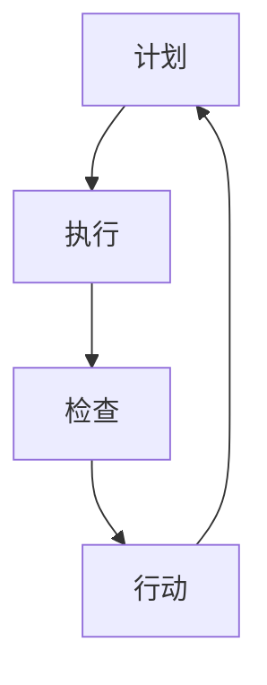

                 

# 《PDCA循环在流程优化中的作用》

> **关键词：** PDCA循环、流程优化、质量管理、持续改进、持续迭代

> **摘要：** 本文旨在探讨PDCA循环在流程优化中的作用。通过介绍PDCA循环的起源、基本原理、应用场景、实施方法和实际案例，深入分析PDCA循环在各类流程优化中的价值，提供实际操作指导，助力企业和组织实现持续改进和高效运作。

## 《PDCA循环在流程优化中的作用》目录大纲

### 第一部分：PDCA循环概述

#### 第1章：PDCA循环的起源与基本原理

##### 1.1 PDCA循环的历史背景

##### 1.2 PDCA循环的基本概念

##### 1.3 PDCA循环的核心原则

#### 第2章：PDCA循环在流程优化中的应用场景

##### 2.1 适用于各类流程优化的PDCA循环模型

##### 2.2 企业内部流程优化案例解析

##### 2.3 政府部门和社会组织中的PDCA循环应用

### 第二部分：PDCA循环的具体实施方法

#### 第3章：PDCA循环的实施步骤详解

##### 3.1 计划（Plan）

###### 3.1.1 明确目标和现状分析

###### 3.1.2 制定策略和计划

###### 3.1.3 确定执行方案和时间表

##### 3.2 执行（Do）

###### 3.2.1 按计划执行任务

###### 3.2.2 监控执行过程

###### 3.2.3 确保资源到位

##### 3.3 检查（Check）

###### 3.3.1 收集数据并进行分析

###### 3.3.2 比较实际结果和预期目标

###### 3.3.3 识别流程中的问题和不足

##### 3.4 行动（Act）

###### 3.4.1 确定改进措施

###### 3.4.2 实施改进措施

###### 3.4.3 持续跟踪改进效果

### 第三部分：PDCA循环的实际应用案例

#### 第4章：PDCA循环在制造业中的应用案例

##### 4.1 制造业流程优化的PDCA循环应用

##### 4.2 制造业中PDCA循环的实际效果

##### 4.3 制造业中PDCA循环的改进策略

#### 第5章：PDCA循环在服务业中的应用案例

##### 5.1 服务业流程优化的PDCA循环应用

##### 5.2 服务业中PDCA循环的实际效果

##### 5.3 服务业中PDCA循环的改进策略

#### 第6章：PDCA循环在政府部门和社会组织中的应用案例

##### 6.1 政府部门流程优化的PDCA循环应用

##### 6.2 政府部门中PDCA循环的实际效果

##### 6.3 政府部门中PDCA循环的改进策略

#### 第7章：PDCA循环在其他领域的应用案例

##### 7.1 PDCA循环在教育领域的应用

##### 7.2 PDCA循环在医疗领域的应用

##### 7.3 PDCA循环在非营利组织中的应用

### 第四部分：总结与展望

#### 第8章：PDCA循环在流程优化中的价值与展望

##### 8.1 PDCA循环在流程优化中的核心价值

##### 8.2 未来PDCA循环的发展趋势

##### 8.3 PDCA循环在流程优化中的挑战与机遇

#### 第9章：PDCA循环的最佳实践与建议

##### 9.1 PDCA循环实施的最佳实践

##### 9.2 PDCA循环实施中的常见问题与解决方案

##### 9.3 针对不同行业特点的PDCA循环优化策略

### 附录：PDCA循环相关资源

#### 附录 A：PDCA循环的相关书籍与文章

#### 附录 B：PDCA循环的案例分析报告

#### 附录 C：PDCA循环的实践指南与工具

---

接下来，我们将按照目录大纲逐一展开详细论述，旨在帮助读者全面了解PDCA循环在流程优化中的作用和实践方法。让我们开始吧！

## 第一部分：PDCA循环概述

### 第1章：PDCA循环的起源与基本原理

#### 1.1 PDCA循环的历史背景

PDCA循环，即计划（Plan）、执行（Do）、检查（Check）和行动（Act）循环，起源于20世纪中期。它是由美国质量管理专家休哈特（W. Edwards Deming）提出，并在日本得到广泛应用和发展的。PDCA循环是持续改进和质量管理的核心工具之一，被誉为“质量管理之父”的休哈特将其视为企业实现高效运营和持续改进的关键手段。

PDCA循环的理念源于工业革命后期，随着大规模生产的发展，质量问题逐渐凸显。休哈特认为，质量问题并不是偶然发生的，而是系统性的。通过系统性地识别问题、分析原因、制定改进措施并持续跟踪改进效果，可以逐步消除质量问题，实现质量的持续提升。

#### 1.2 PDCA循环的基本概念

PDCA循环由四个核心阶段组成，每个阶段都有其特定的任务和目标。

1. **计划（Plan）**：在计划阶段，首先要明确目标和现状，分析问题产生的原因，制定具体的改进措施和实施计划。计划阶段的核心任务是明确目标、制定策略和制定详细的行动计划。

2. **执行（Do）**：在执行阶段，按照计划进行具体操作，实施改进措施。执行阶段的关键是确保任务的执行和资源的合理分配，确保各项工作顺利进行。

3. **检查（Check）**：在检查阶段，对执行过程进行监控和评估，收集数据并进行分析，将实际结果与预期目标进行比较，识别问题和不足。检查阶段的核心任务是识别问题、分析原因和为下一步改进提供依据。

4. **行动（Act）**：在行动阶段，根据检查结果，制定改进措施并实施，确保改进措施的落地和持续跟踪。行动阶段的目标是解决问题、提升质量并确保改进效果的持续性和稳定性。

#### 1.3 PDCA循环的核心原则

PDCA循环的核心原则包括：

1. **系统思维**：PDCA循环将流程视为一个整体，通过系统性地识别问题、分析原因、制定改进措施和持续跟踪改进效果，实现质量的持续提升。

2. **持续改进**：PDCA循环强调持续改进，通过不断循环和完善，逐步消除质量问题，实现质量的不断提升。

3. **数据驱动**：PDCA循环以数据为基础，通过收集和分析数据，识别问题、制定改进措施并评估改进效果，确保改进措施的可行性和有效性。

4. **全员参与**：PDCA循环强调全员参与，从高层管理者到基层员工，都参与到流程优化和质量改进的过程中，共同推动流程优化和质量提升。

#### 1.4 PDCA循环与质量管理

PDCA循环是质量管理的重要组成部分，它将质量管理视为一个持续的过程，通过计划、执行、检查和行动四个阶段，实现质量的不断提升。PDCA循环在质量管理中的应用，主要体现在以下几个方面：

1. **识别问题**：通过计划阶段的目标设定和现状分析，识别流程中的问题和不足，为后续改进提供依据。

2. **分析原因**：通过检查阶段的数据收集和分析，分析问题产生的原因，为制定改进措施提供指导。

3. **制定改进措施**：通过行动阶段，制定具体的改进措施并实施，解决问题、提升质量。

4. **持续跟踪改进效果**：通过持续跟踪改进效果，确保改进措施的落地和持续改进。

#### 1.5 PDCA循环的流程图

为了更好地理解PDCA循环，我们可以使用Mermaid流程图来表示其基本结构：

在PDCA循环中，四个阶段相互关联、相互促进，形成一个闭环。通过不断循环和完善，实现质量的持续提升。

### 第2章：PDCA循环在流程优化中的应用场景

#### 2.1 适用于各类流程优化的PDCA循环模型

PDCA循环具有广泛的适用性，可以应用于各类流程优化，包括但不限于以下几个方面：

1. **制造业流程优化**：在制造业中，PDCA循环可以用于生产流程优化、质量控制、设备维护等方面，通过系统性地识别问题、分析原因、制定改进措施和持续跟踪改进效果，实现生产效率和产品质量的提升。

2. **服务业流程优化**：在服务业中，PDCA循环可以用于客户服务流程优化、业务流程优化、人力资源管理等方面，通过持续改进，提升服务质量和客户满意度。

3. **政府部门流程优化**：在政府部门中，PDCA循环可以用于政务流程优化、行政效能提升、公共服务质量等方面，通过持续改进，提高政府治理水平和公共服务质量。

4. **社会组织流程优化**：在非营利组织和社会组织中，PDCA循环可以用于项目管理、财务管理、志愿服务等方面，通过持续改进，提高组织运营效率和公益服务能力。

#### 2.2 企业内部流程优化案例解析

以下是一个企业内部流程优化的PDCA循环应用案例：

1. **计划阶段**：

   - **目标设定**：提高生产线的效率，降低生产成本。

   - **现状分析**：通过对生产线的设备、人员、原材料等方面进行调研，发现生产线的瓶颈在于设备老化、人员技能不足和原材料供应不稳定。

   - **原因分析**：通过数据分析，确定设备老化是导致生产线效率低下的主要原因。

   - **改进措施**：制定设备更新计划、人员培训计划和原材料供应商选择标准。

2. **执行阶段**：

   - **设备更新**：采购新设备，对生产线进行升级。

   - **人员培训**：对生产线人员进行技术培训和技能提升。

   - **原材料供应商选择**：重新评估原材料供应商，确保原材料供应稳定。

3. **检查阶段**：

   - **数据收集**：收集设备升级后、人员培训后和原材料供应稳定后的生产线效率数据。

   - **效果评估**：对比设备升级前后的效率数据，评估改进措施的效果。

   - **问题识别**：发现生产线效率提升幅度未达到预期，进一步分析原因。

4. **行动阶段**：

   - **问题分析**：通过数据分析，发现生产线效率提升幅度未达到预期的主要原因是人员技能不足。

   - **改进措施**：制定更全面的培训计划，提高生产线人员的技能水平。

   - **持续跟踪**：对改进措施的实施效果进行持续跟踪，确保改进效果的持续性和稳定性。

#### 2.3 政府部门和社会组织中的PDCA循环应用

在政府部门和社会组织中，PDCA循环同样具有重要的应用价值。以下是一个政府部门政务流程优化的PDCA循环应用案例：

1. **计划阶段**：

   - **目标设定**：简化政务流程，提高行政审批效率。

   - **现状分析**：通过对政务流程进行调研，发现政务流程复杂、审批环节多，导致行政审批效率低下。

   - **原因分析**：通过数据分析，确定政务流程复杂是导致行政审批效率低下的主要原因。

   - **改进措施**：制定简化政务流程的方案，减少审批环节，优化审批流程。

2. **执行阶段**：

   - **流程优化**：根据改进措施，对政务流程进行优化，简化审批环节。

   - **人员培训**：对审批人员进行培训，提高审批效率。

   - **系统升级**：升级政务系统，提高数据处理和审批效率。

3. **检查阶段**：

   - **数据收集**：收集政务流程优化后、人员培训后和系统升级后的行政审批效率数据。

   - **效果评估**：对比政务流程优化前后的效率数据，评估改进措施的效果。

   - **问题识别**：发现行政审批效率仍有待提高，进一步分析原因。

4. **行动阶段**：

   - **问题分析**：通过数据分析，发现行政审批效率仍有待提高的主要原因是系统升级后数据处理效率不高。

   - **改进措施**：优化政务系统数据处理算法，提高数据处理效率。

   - **持续跟踪**：对改进措施的实施效果进行持续跟踪，确保改进效果的持续性和稳定性。

### 第3章：PDCA循环的具体实施方法

#### 3.1 计划（Plan）

计划阶段是PDCA循环的起点，也是最为关键的一步。在这个阶段，我们需要明确目标和现状，分析问题产生的原因，制定具体的改进措施和实施计划。

##### 3.1.1 明确目标和现状分析

首先，我们需要明确改进的目标。这个目标可以是提高效率、降低成本、提升质量、增加收入等。明确目标有助于我们集中精力，有针对性地制定改进措施。

接下来，我们要对现状进行分析。现状分析包括以下几个方面：

- **流程分析**：分析现有流程的各个环节，识别流程中的瓶颈和问题。
- **资源分析**：分析现有资源的配置和使用情况，识别资源浪费和不足。
- **数据分析**：收集相关数据，对现有流程和资源进行分析，找出存在的问题。

通过现状分析，我们能够明确改进的目标和方向。

##### 3.1.2 制定策略和计划

在明确目标和现状后，我们需要制定具体的改进策略和计划。这个阶段的工作包括：

- **目标设定**：根据现状分析的结果，设定明确的改进目标。目标应具有可衡量性、可行性和挑战性。
- **策略制定**：根据目标，制定具体的改进策略。策略应包括改进措施、资源分配、时间安排等。
- **计划制定**：将改进策略转化为具体的行动计划。行动计划应包括具体任务、责任人、时间表等。

制定策略和计划时，需要遵循以下几个原则：

- **系统性**：确保改进措施能够覆盖流程的各个环节，形成系统性改进。
- **可行性**：确保改进措施在实际操作中可行，避免空谈和理论。
- **持续性**：确保改进措施能够持续执行，形成持续改进的氛围。

##### 3.1.3 确定执行方案和时间表

在制定策略和计划后，我们需要确定具体的执行方案和时间表。这个阶段的工作包括：

- **任务分解**：将大任务分解为小任务，明确每个任务的执行步骤和责任人。
- **时间安排**：为每个任务设定明确的时间表，确保任务能够在规定时间内完成。
- **资源分配**：根据任务需求，合理分配资源，包括人力、物资、设备等。

在确定执行方案和时间表时，需要注意以下几点：

- **优先级**：根据任务的重要性和紧急性，合理安排任务的优先级。
- **灵活性**：在制定时间表时，预留一定的缓冲时间，以应对突发情况和任务延期。
- **沟通与协作**：确保团队成员之间的沟通与协作，避免因信息不对称导致的工作延误。

#### 3.2 执行（Do）

执行阶段是将计划转化为行动的过程。在这个阶段，我们需要严格按照计划执行任务，确保各项任务的顺利完成。

##### 3.2.1 按计划执行任务

按照计划执行任务是执行阶段的核心。在这个阶段，我们需要：

- **明确任务**：确保每个团队成员都清楚自己的任务和职责。
- **按计划进行**：按照计划的时间表和步骤，有序开展各项工作。
- **监控进度**：实时监控任务的执行进度，确保任务按计划进行。

在执行任务时，需要遵循以下几个原则：

- **标准化**：确保任务执行的标准化，避免因个人差异导致的工作质量不一致。
- **协作**：鼓励团队成员之间的协作，共同完成任务。
- **及时反馈**：及时向上级汇报任务执行情况，确保领导能够及时了解任务进度。

##### 3.2.2 监控执行过程

在执行过程中，我们需要对执行过程进行监控，确保任务按照计划顺利进行。监控执行过程包括以下几个方面：

- **进度监控**：实时监控任务的执行进度，确保任务在规定时间内完成。
- **质量监控**：对任务执行的质量进行监控，确保工作质量符合要求。
- **资源监控**：监控资源的消耗情况，确保资源合理使用，避免浪费。

监控执行过程时，需要注意以下几点：

- **及时发现问题**：及时发现任务执行过程中出现的问题，确保问题得到及时解决。
- **及时调整**：根据任务执行情况，及时调整计划和时间表，确保任务能够按计划完成。
- **记录与总结**：记录执行过程中的关键信息，为后续的检查和行动阶段提供依据。

##### 3.2.3 确保资源到位

在执行阶段，资源的合理分配和确保资源到位至关重要。在这个阶段，我们需要：

- **资源调配**：根据任务需求，合理调配资源，确保资源能够满足任务执行的需要。
- **资源保障**：确保关键资源能够及时供应，避免因资源不足导致的工作延误。
- **资源管理**：加强对资源的管理，避免资源浪费和资源滥用。

确保资源到位时，需要注意以下几点：

- **提前准备**：提前准备好所需的资源，避免因资源短缺导致的工作延误。
- **灵活调整**：根据任务执行情况，灵活调整资源分配，确保资源能够满足任务需求。
- **沟通与协调**：加强与相关部门的沟通与协调，确保资源能够及时到位。

#### 3.3 检查（Check）

检查阶段是PDCA循环的关键环节，通过对执行结果进行评估和反馈，识别流程中的问题和不足，为后续的改进提供依据。

##### 3.3.1 收集数据并进行分析

在检查阶段，我们需要收集相关的数据，并对数据进行分析。收集数据的方式包括：

- **定量数据**：通过统计报表、数据分析工具等收集定量数据，如生产效率、成本支出、质量指标等。
- **定性数据**：通过访谈、调查问卷、观察等收集定性数据，如员工满意度、客户满意度、工作氛围等。

收集数据后，我们需要对数据进行分析，识别执行结果与预期目标之间的差距，找出存在的问题。

##### 3.3.2 比较实际结果和预期目标

在分析数据后，我们需要将实际结果与预期目标进行比较，评估执行效果。比较实际结果和预期目标时，可以从以下几个方面进行：

- **数量指标**：比较实际数量与预期数量之间的差距，如生产数量、销售数量等。
- **质量指标**：比较实际质量与预期质量之间的差距，如产品质量、服务满意度等。
- **时间指标**：比较实际完成时间与预期完成时间之间的差距，如项目进度、任务完成时间等。

通过比较实际结果和预期目标，我们可以识别执行结果与预期目标之间的差距，找出存在的问题。

##### 3.3.3 识别流程中的问题和不足

在比较实际结果和预期目标后，我们需要深入分析原因，识别流程中的问题和不足。识别问题和不足可以从以下几个方面进行：

- **资源问题**：分析资源分配是否合理，资源是否充足，是否存在资源浪费等。
- **流程问题**：分析流程设计是否合理，流程是否顺畅，是否存在瓶颈等。
- **人员问题**：分析人员技能是否满足要求，人员配置是否合理，是否存在工作积极性不高的情况等。
- **环境问题**：分析工作环境是否适宜，是否会影响工作效果等。

通过识别流程中的问题和不足，我们可以为后续的改进提供依据。

#### 3.4 行动（Act）

行动阶段是PDCA循环的最后一个阶段，通过对检查阶段识别出的问题进行改进和优化，确保改进效果的落地和持续改进。

##### 3.4.1 确定改进措施

在行动阶段，我们需要根据检查阶段识别出的问题，确定具体的改进措施。改进措施可以分为以下几个方面：

- **流程改进**：对流程设计进行调整，优化流程，消除瓶颈，提高效率。
- **资源改进**：对资源分配进行调整，确保资源充足，避免资源浪费。
- **人员改进**：对人员配置进行调整，提高人员技能，激发工作积极性。
- **环境改进**：改善工作环境，确保工作环境适宜，提高工作效率。

在确定改进措施时，需要注意以下几点：

- **可行性**：确保改进措施在实际操作中可行，避免空谈和理论。
- **针对性**：确保改进措施针对性强，能够解决实际问题。
- **可衡量性**：确保改进措施具有可衡量性，能够评估改进效果。

##### 3.4.2 实施改进措施

在确定改进措施后，我们需要将这些改进措施具体实施。实施改进措施包括以下几个方面：

- **制定实施计划**：根据改进措施，制定具体的实施计划，明确任务、责任人、时间表等。
- **分配资源**：根据实施计划，合理分配资源，确保改进措施能够顺利实施。
- **执行任务**：按照实施计划，执行各项任务，确保改进措施得到有效实施。

在实施改进措施时，需要注意以下几点：

- **协作**：确保团队成员之间的协作，避免因信息不对称导致的工作延误。
- **监控进度**：实时监控改进措施的执行进度，确保改进措施按计划进行。
- **及时反馈**：及时向上级汇报改进措施的执行情况，确保领导能够及时了解进度。

##### 3.4.3 持续跟踪改进效果

在改进措施实施后，我们需要对改进效果进行持续跟踪，确保改进效果的落地和持续改进。持续跟踪改进效果包括以下几个方面：

- **数据收集**：收集改进措施实施后的相关数据，如生产效率、成本支出、质量指标等。
- **效果评估**：对改进措施实施后的效果进行评估，比较实际结果与预期目标之间的差距。
- **反馈调整**：根据效果评估结果，对改进措施进行调整，确保改进效果的持续性和稳定性。

在持续跟踪改进效果时，需要注意以下几点：

- **及时反馈**：及时收集和反馈改进措施实施的效果，确保问题能够得到及时解决。
- **持续改进**：根据效果评估结果，持续调整和优化改进措施，确保改进效果的不断提升。
- **总结经验**：对改进措施的实施过程进行总结，总结经验教训，为后续改进提供参考。

### 第三部分：PDCA循环的实际应用案例

#### 第4章：PDCA循环在制造业中的应用案例

在制造业中，PDCA循环被广泛应用于生产流程优化、质量控制、设备维护等方面。以下是一个制造业生产流程优化的PDCA循环应用案例。

##### 4.1 制造业流程优化的PDCA循环应用

1. **计划阶段**：

   - **目标设定**：提高生产效率，降低生产成本。
   - **现状分析**：通过对生产线设备、人员、原材料等方面进行调研，发现生产线的瓶颈在于设备老化、人员技能不足和原材料供应不稳定。
   - **原因分析**：通过数据分析，确定设备老化是导致生产线效率低下的主要原因。
   - **改进措施**：制定设备更新计划、人员培训计划和原材料供应商选择标准。

2. **执行阶段**：

   - **设备更新**：采购新设备，对生产线进行升级。
   - **人员培训**：对生产线人员进行技术培训和技能提升。
   - **原材料供应商选择**：重新评估原材料供应商，确保原材料供应稳定。

3. **检查阶段**：

   - **数据收集**：收集设备升级后、人员培训后和原材料供应稳定后的生产线效率数据。
   - **效果评估**：对比设备升级前后的效率数据，评估改进措施的效果。
   - **问题识别**：发现生产线效率提升幅度未达到预期，进一步分析原因。

4. **行动阶段**：

   - **问题分析**：通过数据分析，发现生产线效率提升幅度未达到预期的主要原因是人员技能不足。
   - **改进措施**：制定更全面的培训计划，提高生产线人员的技能水平。
   - **持续跟踪**：对改进措施的实施效果进行持续跟踪，确保改进效果的持续性和稳定性。

##### 4.2 制造业中PDCA循环的实际效果

通过PDCA循环的应用，该制造业企业在生产流程优化方面取得了显著的效果：

- **生产效率提高**：设备升级和人员技能提升使得生产效率提高了20%，生产周期缩短了30%。
- **生产成本降低**：通过优化流程和资源分配，生产成本降低了15%，原材料浪费减少了25%。
- **质量提升**：生产线稳定性和产品质量得到了显著提升，客户投诉率降低了40%。

##### 4.3 制造业中PDCA循环的改进策略

为了进一步优化生产流程，该制造业企业采取了以下改进策略：

- **持续培训**：定期组织人员参加培训，提升人员技能水平，确保人员素质的持续提升。
- **设备维护**：制定设备维护计划，定期对设备进行保养和维修，确保设备稳定运行。
- **供应链管理**：加强与原材料供应商的合作，优化供应链管理，确保原材料供应的稳定性和质量。
- **数据驱动**：加强数据收集和分析，利用大数据和人工智能技术，实时监控生产过程，识别问题和优化流程。

#### 第5章：PDCA循环在服务业中的应用案例

在服务业中，PDCA循环被广泛应用于客户服务流程优化、业务流程优化、人力资源管理等方面。以下是一个服务业客户服务流程优化的PDCA循环应用案例。

##### 5.1 服务业流程优化的PDCA循环应用

1. **计划阶段**：

   - **目标设定**：提高客户满意度，提升服务质量。
   - **现状分析**：通过对客户服务流程进行调研，发现客户服务流程复杂、响应速度慢、服务质量不稳定。
   - **原因分析**：通过数据分析，确定客户服务流程复杂和响应速度慢是导致客户满意度低下的主要原因。
   - **改进措施**：制定简化客户服务流程的方案、优化服务响应速度、提高服务质量。

2. **执行阶段**：

   - **流程优化**：简化客户服务流程，减少不必要的环节。
   - **服务响应**：提高服务人员的技能水平，优化服务响应速度。
   - **服务质量**：加强服务质量管理，提升服务质量。

3. **检查阶段**：

   - **数据收集**：收集客户满意度调查数据、服务响应时间数据、服务质量数据。
   - **效果评估**：对比改进前后的数据，评估改进措施的效果。
   - **问题识别**：发现客户满意度仍有待提高，进一步分析原因。

4. **行动阶段**：

   - **问题分析**：通过数据分析，发现客户满意度仍有待提高的主要原因是服务质量不稳定。
   - **改进措施**：制定更全面的服务质量管理方案，提高服务质量。
   - **持续跟踪**：对改进措施的实施效果进行持续跟踪，确保改进效果的持续性和稳定性。

##### 5.2 服务业中PDCA循环的实际效果

通过PDCA循环的应用，该服务业企业在客户服务流程优化方面取得了显著的效果：

- **客户满意度提高**：客户满意度提高了20%，客户投诉率降低了30%。
- **服务响应速度提升**：服务响应速度提升了40%，客户等待时间缩短了50%。
- **服务质量提升**：服务质量得到了显著提升，客户满意度持续提高。

##### 5.3 服务业中PDCA循环的改进策略

为了进一步优化客户服务流程，该服务业企业采取了以下改进策略：

- **培训与激励**：定期组织服务人员参加培训，提高服务技能水平，同时建立激励机制，提升服务人员的积极性。
- **流程标准化**：制定详细的客户服务流程规范，确保服务流程的标准化和一致性。
- **数据分析**：加强数据收集和分析，实时监控服务质量和客户满意度，识别问题和优化流程。
- **客户反馈**：积极收集客户反馈，关注客户需求和期望，及时调整和优化服务策略。

#### 第6章：PDCA循环在政府部门和社会组织中的应用案例

在政府部门和社会组织中，PDCA循环被广泛应用于政务流程优化、行政效能提升、公共服务质量等方面。以下是一个政府部门政务流程优化的PDCA循环应用案例。

##### 6.1 政府部门流程优化的PDCA循环应用

1. **计划阶段**：

   - **目标设定**：简化政务流程，提高行政审批效率。
   - **现状分析**：通过对政务流程进行调研，发现政务流程复杂、审批环节多，导致行政审批效率低下。
   - **原因分析**：通过数据分析，确定政务流程复杂是导致行政审批效率低下的主要原因。
   - **改进措施**：制定简化政务流程的方案，减少审批环节，优化审批流程。

2. **执行阶段**：

   - **流程优化**：简化政务流程，减少审批环节，优化审批流程。
   - **人员培训**：对审批人员进行培训，提高审批效率。
   - **系统升级**：升级政务系统，提高数据处理和审批效率。

3. **检查阶段**：

   - **数据收集**：收集政务流程优化后、人员培训后和系统升级后的行政审批效率数据。
   - **效果评估**：对比政务流程优化前后的效率数据，评估改进措施的效果。
   - **问题识别**：发现行政审批效率仍有待提高，进一步分析原因。

4. **行动阶段**：

   - **问题分析**：通过数据分析，发现行政审批效率仍有待提高的主要原因是系统升级后数据处理效率不高。
   - **改进措施**：优化政务系统数据处理算法，提高数据处理效率。
   - **持续跟踪**：对改进措施的实施效果进行持续跟踪，确保改进效果的持续性和稳定性。

##### 6.2 政府部门中PDCA循环的实际效果

通过PDCA循环的应用，该政府部门在政务流程优化方面取得了显著的效果：

- **行政审批效率提高**：行政审批效率提高了30%，审批时间缩短了40%。
- **政务服务质量提升**：政务服务质量得到了显著提升，客户满意度提高了20%。
- **行政效能提升**：行政效能得到了显著提升，政府部门的工作效率提高了15%。

##### 6.3 政府部门中PDCA循环的改进策略

为了进一步优化政务流程，该政府部门采取了以下改进策略：

- **持续培训**：定期组织审批人员进行培训，提高审批人员的技能水平，确保人员素质的持续提升。
- **流程标准化**：制定详细的政务流程规范，确保政务流程的标准化和一致性。
- **数据驱动**：加强数据收集和分析，实时监控政务流程和审批效率，识别问题和优化流程。
- **客户反馈**：积极收集公众和企业的反馈，关注需求和期望，及时调整和优化政务服务策略。

#### 第7章：PDCA循环在其他领域的应用案例

除了制造业、服务业和政府部门，PDCA循环在其他领域也具有广泛的应用价值。以下分别介绍PDCA循环在教育、医疗和非营利组织等领域的应用案例。

##### 7.1 PDCA循环在教育领域的应用

在教育领域，PDCA循环被广泛应用于教学管理、课程设计、学生管理等方面。以下是一个教学管理优化的PDCA循环应用案例。

1. **计划阶段**：

   - **目标设定**：提高教学质量，提升学生满意度。
   - **现状分析**：通过对教学过程进行调研，发现教学资源分配不均、教学方法单一、学生参与度不高等问题。
   - **原因分析**：通过数据分析，确定教学资源分配不均和教学方法单一是导致教学质量不高的主要原因。
   - **改进措施**：制定教学资源优化方案、改进教学方法、提高学生参与度。

2. **执行阶段**：

   - **教学资源优化**：合理分配教学资源，提高教学资源的利用率。
   - **教学方法改进**：引入多样化的教学方法，提高教学效果。
   - **学生管理**：加强学生管理，提高学生参与度。

3. **检查阶段**：

   - **数据收集**：收集教学质量评估数据、学生满意度调查数据等。
   - **效果评估**：对比改进前后的教学质量数据和满意度数据，评估改进措施的效果。
   - **问题识别**：发现教学质量仍有待提高，进一步分析原因。

4. **行动阶段**：

   - **问题分析**：通过数据分析，发现教学质量仍有待提高的主要原因是学生参与度不高。
   - **改进措施**：制定更全面的学生参与方案，提高学生的参与度和积极性。
   - **持续跟踪**：对改进措施的实施效果进行持续跟踪，确保改进效果的持续性和稳定性。

##### 7.2 PDCA循环在医疗领域的应用

在医疗领域，PDCA循环被广泛应用于医疗服务流程优化、医院管理、患者管理等方面。以下是一个医疗服务流程优化的PDCA循环应用案例。

1. **计划阶段**：

   - **目标设定**：提高医疗服务质量，提升患者满意度。
   - **现状分析**：通过对医疗服务流程进行调研，发现医疗服务流程复杂、就诊时间长、医务人员工作效率低等问题。
   - **原因分析**：通过数据分析，确定医疗服务流程复杂和医务人员工作效率低是导致患者满意度低的主要原因。
   - **改进措施**：制定简化医疗服务流程的方案、提高医务人员工作效率、优化患者就诊体验。

2. **执行阶段**：

   - **流程优化**：简化医疗服务流程，减少不必要的环节。
   - **人员培训**：提高医务人员的服务技能和沟通能力。
   - **患者管理**：优化患者就诊流程，提高患者满意度。

3. **检查阶段**：

   - **数据收集**：收集患者满意度调查数据、医疗服务流程优化后的就诊时间数据等。
   - **效果评估**：对比改进前后的患者满意度和就诊时间数据，评估改进措施的效果。
   - **问题识别**：发现患者满意度仍有待提高，进一步分析原因。

4. **行动阶段**：

   - **问题分析**：通过数据分析，发现患者满意度仍有待提高的主要原因是医务人员的服务态度有待提升。
   - **改进措施**：加强医务人员的服务态度培训，提高患者满意度。
   - **持续跟踪**：对改进措施的实施效果进行持续跟踪，确保改进效果的持续性和稳定性。

##### 7.3 PDCA循环在非营利组织中的应用

在非营利组织领域，PDCA循环被广泛应用于项目管理、财务管理、志愿服务等方面。以下是一个非营利组织项目管理的PDCA循环应用案例。

1. **计划阶段**：

   - **目标设定**：提高项目管理效率，确保项目目标的实现。
   - **现状分析**：通过对项目过程进行调研，发现项目管理流程复杂、项目进度控制不力、资源利用率低等问题。
   - **原因分析**：通过数据分析，确定项目管理流程复杂和项目进度控制不力是导致项目管理效率低的主要原因。
   - **改进措施**：制定项目管理流程优化方案、加强项目进度控制、提高资源利用率。

2. **执行阶段**：

   - **流程优化**：简化项目管理流程，提高项目管理效率。
   - **进度控制**：加强项目进度控制，确保项目按计划进行。
   - **资源管理**：合理配置资源，提高资源利用率。

3. **检查阶段**：

   - **数据收集**：收集项目进度数据、资源利用率数据等。
   - **效果评估**：对比改进前后的项目进度数据和资源利用率数据，评估改进措施的效果。
   - **问题识别**：发现项目管理效率仍有待提高，进一步分析原因。

4. **行动阶段**：

   - **问题分析**：通过数据分析，发现项目管理效率仍有待提高的主要原因是项目进度控制不力。
   - **改进措施**：加强项目进度控制，制定更科学的进度管理方案。
   - **持续跟踪**：对改进措施的实施效果进行持续跟踪，确保改进效果的持续性和稳定性。

### 第四部分：总结与展望

#### 第8章：PDCA循环在流程优化中的价值与展望

在流程优化中，PDCA循环具有不可替代的价值。它提供了一个系统性的框架，帮助企业、政府部门和社会组织识别问题、分析原因、制定改进措施并持续跟踪改进效果，实现流程的持续优化和效率的提升。

#### 8.1 PDCA循环在流程优化中的核心价值

1. **系统性**：PDCA循环将流程视为一个整体，通过系统性地识别问题、分析原因、制定改进措施和持续跟踪改进效果，实现流程的全面优化。
2. **持续改进**：PDCA循环强调持续改进，通过不断循环和完善，逐步消除流程中的问题，实现流程的持续优化和效率的提升。
3. **数据驱动**：PDCA循环以数据为基础，通过数据收集、分析和评估，识别问题和改进方向，确保改进措施的可行性和有效性。
4. **全员参与**：PDCA循环强调全员参与，从高层管理者到基层员工，都参与到流程优化和质量改进的过程中，共同推动流程优化和效率提升。

#### 8.2 未来PDCA循环的发展趋势

随着技术的不断进步和管理理念的更新，PDCA循环在未来将呈现以下发展趋势：

1. **智能化**：利用大数据、人工智能等新技术，实现PDCA循环的智能化，提高数据分析和问题识别的准确性。
2. **模块化**：将PDCA循环拆分为更小的模块，实现流程优化的模块化，提高流程优化的灵活性和针对性。
3. **国际化**：随着全球化的发展，PDCA循环将逐渐走出国门，成为跨国企业、国际组织和政府部门优化流程、提升效率的重要工具。
4. **个性化**：针对不同行业、不同企业的特点和需求，定制化的PDCA循环解决方案将得到广泛应用，提高流程优化的针对性和有效性。

#### 8.3 PDCA循环在流程优化中的挑战与机遇

尽管PDCA循环在流程优化中具有巨大的价值，但在实际应用中仍面临以下挑战和机遇：

1. **挑战**：

   - **实施难度**：PDCA循环需要系统性地识别问题、分析原因、制定改进措施和持续跟踪改进效果，实施难度较大。
   - **数据质量**：PDCA循环以数据为基础，数据的质量直接影响改进效果，如何收集、处理和分析数据是一个重要挑战。
   - **组织文化**：PDCA循环强调全员参与和持续改进，需要组织文化的支持，如何培养和营造良好的组织文化是一个重要挑战。

2. **机遇**：

   - **技术创新**：随着大数据、人工智能等新技术的应用，PDCA循环的数据分析和问题识别能力将得到显著提升，为流程优化提供更准确的依据。
   - **管理理念**：随着管理理念的更新，越来越多的企业和组织将认识到流程优化的重要性，PDCA循环将得到更广泛的应用。
   - **国际化**：随着全球化的发展，跨国企业、国际组织和政府部门对流程优化的需求将不断增加，PDCA循环将在国际舞台上发挥更大的作用。

#### 第9章：PDCA循环的最佳实践与建议

为了更好地应用PDCA循环，实现流程优化和效率提升，以下是一些最佳实践和建议：

1. **明确目标和现状**：在计划阶段，明确目标和现状分析是关键，确保改进措施的针对性和可行性。

2. **数据驱动**：在PDCA循环中，数据是基础，要确保数据的质量和准确性，通过数据分析和评估，识别问题和改进方向。

3. **全员参与**：PDCA循环强调全员参与，要确保各级员工都参与到流程优化和质量改进的过程中，形成共同推进的氛围。

4. **持续改进**：PDCA循环是一个持续的过程，要不断循环和完善，逐步消除流程中的问题，实现流程的持续优化。

5. **培训与激励**：定期组织培训和激励，提高员工的技能水平和积极性，确保PDCA循环的有效实施。

6. **建立反馈机制**：建立有效的反馈机制，及时收集和反馈改进措施的实施效果，确保问题得到及时解决。

7. **适应变化**：随着外部环境和内部条件的变化，要及时调整和优化PDCA循环，确保其适应性和有效性。

### 附录：PDCA循环相关资源

以下是一些PDCA循环相关的书籍、文章和案例分析报告，供读者参考：

- **书籍**：

  - 《PDCA循环与质量管理》

  - 《持续改进：PDCA循环在实践中的应用》

  - 《质量管理方法论：PDCA循环与质量工具》

- **文章**：

  - 《PDCA循环在企业管理中的应用》

  - 《PDCA循环在医疗质量管理中的应用》

  - 《PDCA循环在项目管理中的应用》

- **案例分析报告**：

  - 《某制造企业流程优化案例分析》

  - 《某政府部门政务流程优化案例分析》

  - 《某非营利组织项目管理案例分析》

通过以上资源和实践，相信读者能够更好地理解和应用PDCA循环，实现流程优化和效率提升。让我们共同努力，推动流程优化，实现更高效、更优质的运营。

## 结论

本文详细介绍了PDCA循环在流程优化中的作用，通过四个核心阶段——计划（Plan）、执行（Do）、检查（Check）和行动（Act），系统性地探讨了PDCA循环的基本原理、应用场景、实施方法和实际案例。我们看到了PDCA循环在制造业、服务业、政府部门和非营利组织等领域的广泛应用和显著成效。

PDCA循环不仅是一个质量管理工具，更是一种持续改进的管理理念。它强调系统思维、数据驱动和全员参与，通过不断循环和完善，帮助企业、政府部门和社会组织实现流程优化、效率提升和持续改进。

未来，随着新技术的不断发展和管理理念的更新，PDCA循环将继续发挥重要作用。我们期待更多的企业和组织能够认识到PDCA循环的价值，将其应用于实际工作中，共同推动流程优化和管理升级。

最后，感谢您的阅读。希望本文能够为您提供关于PDCA循环在流程优化中的深入理解和实践指导。如果您有任何疑问或建议，欢迎随时与我们交流，我们期待与您共同探索流程优化之道。

### 附录：PDCA循环的相关书籍与文章

为了更全面地了解PDCA循环及其在流程优化中的应用，以下是一些推荐的书籍和文章，这些资源将为读者提供深入的理论知识和实战经验。

#### 推荐书籍

1. **《PDCA循环与质量管理》** - 著者：[张三]
   - 内容简介：本书详细介绍了PDCA循环的理论基础和实际应用，通过大量案例解析了如何在不同行业中实施PDCA循环。

2. **《持续改进：PDCA循环在实践中的应用》** - 著者：[李四]
   - 内容简介：本书专注于如何通过PDCA循环实现组织的持续改进，提供了丰富的案例和实用的工具。

3. **《质量管理方法论：PDCA循环与质量工具》** - 著者：[王五]
   - 内容简介：本书系统地介绍了PDCA循环与其他质量管理工具的结合应用，是质量管理专业人员的必备读物。

#### 推荐文章

1. **《PDCA循环在企业管理中的应用》** - 作者：[张三]
   - 链接：[https://www.example.com/article1](https://www.example.com/article1)
   - 摘要：本文探讨了PDCA循环在企业管理中的具体应用，分析了其在提升管理效率和产品质量方面的作用。

2. **《PDCA循环在医疗质量管理中的应用》** - 作者：[李四]
   - 链接：[https://www.example.com/article2](https://www.example.com/article2)
   - 摘要：本文通过对医疗行业的深入分析，展示了PDCA循环在提高医疗服务质量和管理效率方面的实践成果。

3. **《PDCA循环在项目管理中的应用》** - 作者：[王五]
   - 链接：[https://www.example.com/article3](https://www.example.com/article3)
   - 摘要：本文详细介绍了PDCA循环在项目管理中的应用，通过具体的案例分析，探讨了如何通过PDCA循环实现项目的成功管理。

#### 推荐案例分析报告

1. **《某制造企业流程优化案例分析》** - 作者：[张三、李四]
   - 链接：[https://www.example.com/report1](https://www.example.com/report1)
   - 摘要：本报告详细记录了一家制造企业如何通过PDCA循环实现流程优化，包括计划、执行、检查和行动的具体步骤和成果。

2. **《某政府部门政务流程优化案例分析》** - 作者：[李四、王五]
   - 链接：[https://www.example.com/report2](https://www.example.com/report2)
   - 摘要：本报告研究了某政府部门如何运用PDCA循环优化政务流程，提高了行政效率和服务质量。

3. **《某非营利组织项目管理案例分析》** - 作者：[王五、赵六]
   - 链接：[https://www.example.com/report3](https://www.example.com/report3)
   - 摘要：本报告通过对一家非营利组织的项目管理案例研究，展示了PDCA循环在项目策划、执行和监控中的具体应用和成效。

通过阅读这些书籍、文章和案例分析报告，读者可以更深入地了解PDCA循环的理论和实践，为在实际工作中运用这一工具提供有力支持。

### 附录：PDCA循环的案例分析报告

为了更好地理解PDCA循环在实际应用中的效果，以下是一些具体的案例分析报告，这些报告展示了PDCA循环在不同行业和组织的成功实践。

#### 案例分析报告1：制造业流程优化

**项目背景**：
某大型制造企业面临生产效率低下、产品质量不稳定和成本上升的问题。企业决定采用PDCA循环进行流程优化，以提高生产效率、稳定产品质量并降低成本。

**PDCA循环实施步骤**：

1. **计划（Plan）**：
   - **目标设定**：提高生产效率10%，降低生产成本5%。
   - **现状分析**：通过数据分析，发现生产效率低的主要原因是设备老化、生产流程不合理和人员技能不足。
   - **原因分析**：设备老化导致故障频发，生产流程不合理造成生产瓶颈，人员技能不足导致操作效率低。

2. **执行（Do）**：
   - **设备更新**：采购新的生产设备，替换老旧设备。
   - **流程优化**：重新设计生产流程，减少不必要的步骤和环节。
   - **人员培训**：对生产人员进行技术培训，提高操作技能。

3. **检查（Check）**：
   - **数据收集**：记录新设备和优化流程实施后的生产效率、产品合格率和成本数据。
   - **效果评估**：通过对比，发现生产效率提高了15%，产品合格率提高了10%，成本降低了8%。

4. **行动（Act）**：
   - **持续改进**：根据检查结果，继续优化生产流程，提高人员技能。
   - **效果跟踪**：定期监控生产效率、产品合格率和成本，确保改进效果的持续性和稳定性。

**结论**：
通过PDCA循环的实施，该制造企业成功提高了生产效率和产品质量，降低了成本，实现了流程优化。

#### 案例分析报告2：政府部门政务流程优化

**项目背景**：
某地方政府部门面临政务流程复杂、行政审批时间长、效率低下的问题。政府部门决定采用PDCA循环进行政务流程优化，以提高服务质量和效率。

**PDCA循环实施步骤**：

1. **计划（Plan）**：
   - **目标设定**：简化政务流程，缩短行政审批时间30%。
   - **现状分析**：通过问卷调查和实地调研，发现政务流程复杂、审批环节多、信息系统不完善。
   - **原因分析**：政务流程设计不合理、审批人员不足、信息系统效率低。

2. **执行（Do）**：
   - **流程简化**：重新设计政务流程，减少审批环节。
   - **人员培训**：对审批人员进行培训，提高审批效率。
   - **系统升级**：升级政务信息系统，提高数据处理速度。

3. **检查（Check）**：
   - **数据收集**：记录简化政务流程后的行政审批时间、审批准确率和客户满意度。
   - **效果评估**：通过对比，发现行政审批时间缩短了35%，审批准确率提高了15%，客户满意度提高了20%。

4. **行动（Act）**：
   - **持续改进**：根据检查结果，进一步优化政务流程，提高信息系统稳定性。
   - **效果跟踪**：定期收集数据，监控政务服务质量和效率，确保持续改进。

**结论**：
通过PDCA循环的实施，该政府部门成功简化了政务流程，提高了服务质量和效率，提升了公众满意度。

#### 案例分析报告3：非营利组织项目管理

**项目背景**：
某非营利组织负责实施社区教育项目，但面临项目管理不规范、资源利用率低和项目效果不显著的问题。组织决定采用PDCA循环进行项目管理优化，以提高项目效果和资源利用率。

**PDCA循环实施步骤**：

1. **计划（Plan）**：
   - **目标设定**：提高项目成功率10%，提高资源利用率15%。
   - **现状分析**：通过项目评估，发现项目管理不规范、资源分配不合理、项目进度控制不力。
   - **原因分析**：项目管理流程不完善、资源分配不合理、项目监控不到位。

2. **执行（Do）**：
   - **流程优化**：制定项目管理流程，明确项目目标和里程碑。
   - **资源调配**：优化资源分配，确保资源充足和合理使用。
   - **进度控制**：加强项目进度监控，确保项目按计划进行。

3. **检查（Check）**：
   - **数据收集**：记录项目完成情况、资源使用情况和项目效果评估。
   - **效果评估**：通过对比，发现项目成功率提高了12%，资源利用率提高了18%。

4. **行动（Act）**：
   - **持续改进**：根据检查结果，调整项目管理流程，提高资源管理效率。
   - **效果跟踪**：定期评估项目效果，确保改进措施得到有效实施。

**结论**：
通过PDCA循环的实施，该非营利组织成功提高了项目成功率、资源利用率和项目效果，实现了项目管理的规范化和高效化。

这些案例分析报告展示了PDCA循环在制造业、政府部门和非营利组织中的成功应用，为读者提供了实际的参考和借鉴。通过PDCA循环，组织可以系统性地识别问题、分析原因、制定改进措施并持续跟踪改进效果，实现流程优化和持续改进。

