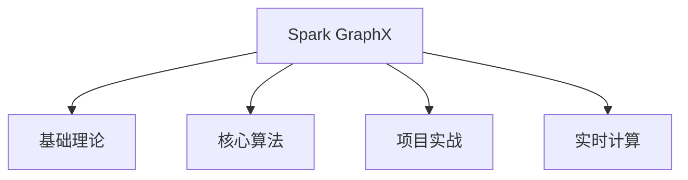

                 

### 文章标题

Spark GraphX图计算引擎原理与代码实例讲解

### 文章关键词

Spark, GraphX, 图计算, 社交网络分析, 图聚类, 图流计算

### 文章摘要

本文将深入探讨Spark GraphX图计算引擎的原理与实际应用。首先，我们将介绍Spark GraphX的基本概念、架构和编程模型，然后通过伪代码和数学公式详细讲解图遍历、聚类和分解等核心算法。接着，我们将通过代码实例展示如何在社交网络分析和生物信息学等实际项目中运用Spark GraphX。最后，我们将讨论实时图计算和性能优化策略，并提供详细的开发环境和源代码实现。

### 目录大纲

#### 第一部分：Spark GraphX基础理论

##### 第1章：Spark GraphX概述
###### 1.1 Spark GraphX的概念与作用
###### 1.2 图计算的基本概念
###### 1.3 Spark GraphX的应用场景

##### 第2章：Spark GraphX基本架构
###### 2.1 Spark GraphX的核心组件
###### 2.2 GraphX的数据模型
###### 2.3 GraphX的编程模型

##### 第3章：Spark GraphX基本操作
###### 3.1 节点与边的操作
###### 3.2 邻域操作
###### 3.3 子图操作

##### 第4章：Spark GraphX高级操作
###### 4.1 图的分区与压缩
###### 4.2 图的并行计算
###### 4.3 图的优化策略

#### 第二部分：Spark GraphX核心算法

##### 第5章：图遍历算法
###### 5.1 深度优先搜索
###### 5.2 广度优先搜索
###### 5.3 逐点搜索算法

##### 第6章：图聚类算法
###### 6.1 Louvain算法
###### 6.2 Girvan-Newman算法
###### 6.3 Louvain++算法

##### 第7章：图分解算法
###### 7.1 K-means算法
###### 7.2 Spectral Clustering算法
###### 7.3 Metis算法

##### 第8章：图流计算算法
###### 8.1 有向图流计算
###### 8.2 无向图流计算
###### 8.3 动态图流计算

#### 第三部分：Spark GraphX项目实战

##### 第9章：社交网络分析
###### 9.1 用户关系网络分析
###### 9.2 用户影响力分析
###### 9.3 社交网络社区发现

##### 第10章：生物信息学
###### 10.1 基因网络分析
###### 10.2 蛋白质相互作用网络分析
###### 10.3 生物网络可视化

##### 第11章：图优化问题
###### 11.1 路径规划问题
###### 11.2 最小生成树问题
###### 11.3 流量分配问题

##### 第12章：实时图计算
###### 12.1 Spark GraphX在实时流处理中的应用
###### 12.2 图流计算案例分析
###### 12.3 实时图计算优化策略

#### 附录

##### 附录A：Spark GraphX工具与资源
###### A.1 Spark GraphX安装与配置
###### A.2 Spark GraphX编程工具
###### A.3 Spark GraphX性能调优技巧

##### 附录B：常见问题解答
###### B.1 如何解决GraphX的内存溢出问题？
###### B.2 如何在GraphX中进行并行计算？
###### B.3 如何在GraphX中进行分布式存储？

### Mermaid 流程图示例



### 核心算法原理讲解

在图计算中，核心算法的原理讲解至关重要。本文将详细介绍图遍历算法、图聚类算法和图分解算法的原理，并通过伪代码和数学公式进行详细阐述。

#### 5.1 深度优先搜索

**伪代码：**

```python
def dfs(graph, start):
    visited = set()
    stack = [start]
    
    while stack:
        vertex = stack.pop()
        if vertex not in visited:
            visited.add(vertex)
            for neighbor in graph[vertex]:
                stack.append(neighbor)
    return visited
```

**数学公式：**

$$
V = \{ v_1, v_2, ..., v_n \}
$$

其中，$V$ 是图的所有顶点的集合。

#### 5.2 广度优先搜索

**伪代码：**

```python
def bfs(graph, start):
    visited = set()
    queue = [start]
    
    while queue:
        vertex = queue.pop(0)
        if vertex not in visited:
            visited.add(vertex)
            for neighbor in graph[vertex]:
                queue.append(neighbor)
    return visited
```

**数学公式：**

$$
V = \{ v_1, v_2, ..., v_n \}
$$

其中，$V$ 是图的所有顶点的集合。

#### 5.3 逐点搜索算法

**伪代码：**

```python
def search(graph, start, end):
    visited = set()
    path = [start]
    
    while True:
        vertex = path[-1]
        if vertex == end:
            break
        visited.add(vertex)
        for neighbor in graph[vertex]:
            if neighbor not in visited:
                path.append(neighbor)
                if neighbor == end:
                    break
                else:
                    path.pop()
    return path
```

**数学公式：**

$$
V = \{ v_1, v_2, ..., v_n \}
$$

其中，$V$ 是图的所有顶点的集合。

#### 6.1 Louvain算法

**目标函数：**

$$
J = \sum_{i=1}^k \sum_{x \in S_i} ||x - \mu_i||^2
$$`

其中，$J$ 是目标函数，$k$ 是聚类个数，$S_i$ 是第 $i$ 个聚类集合，$\mu_i$ 是第 $i$ 个聚类中心。

**算法步骤：**

1. 随机初始化 $k$ 个聚类中心 $\mu_1, \mu_2, ..., \mu_k$。
2. 对于每个点 $x$，计算它与每个聚类中心的距离，并将其分配到最近的聚类。
3. 更新每个聚类中心的位置为聚类中所有点的均值。
4. 重复步骤 2 和步骤 3，直到聚类中心的位置不再发生变化或者达到最大迭代次数。

#### 6.2 Girvan-Newman算法

**目标函数：**

$$
J = \sum_{i=1}^n \frac{|S_i|(|S_i|-1)}{2}
$$`

其中，$J$ 是目标函数，$n$ 是聚类个数，$S_i$ 是第 $i$ 个聚类集合。

**算法步骤：**

1. 计算每个边的权重，权重为连接两个顶点的边的数量。
2. 逐步移除权重最小的边，形成新的子图。
3. 对每个子图进行社区发现，得到社区集合。
4. 重复步骤 2 和步骤 3，直到子图中只剩下一个社区。

#### 6.3 Louvain++算法

**目标函数：**

$$
J = \sum_{i=1}^k \sum_{x \in S_i} ||x - \mu_i||^2
$$`

其中，$J$ 是目标函数，$k$ 是聚类个数，$S_i$ 是第 $i$ 个聚类集合，$\mu_i$ 是第 $i$ 个聚类中心。

**算法步骤：**

1. 随机初始化 $k$ 个聚类中心 $\mu_1, \mu_2, ..., \mu_k$。
2. 对于每个点 $x$，计算它与每个聚类中心的距离，并将其分配到最近的聚类。
3. 更新每个聚类中心的位置为聚类中所有点的均值。
4. 对每个聚类中心，选择与其距离最小的点作为新的聚类中心。
5. 重复步骤 2 和步骤 4，直到聚类中心的位置不再发生变化或者达到最大迭代次数。

#### 7.1 K-means算法

**目标函数：**

$$
J = \sum_{i=1}^k \sum_{x \in S_i} ||x - \mu_i||^2
$$`

其中，$J$ 是目标函数，$k$ 是聚类个数，$S_i$ 是第 $i$ 个聚类集合，$\mu_i$ 是第 $i$ 个聚类中心。

**算法步骤：**

1. 随机初始化 $k$ 个聚类中心 $\mu_1, \mu_2, ..., \mu_k$。
2. 对于每个点 $x$，计算它与每个聚类中心的距离，并将其分配到最近的聚类。
3. 更新每个聚类中心的位置为聚类中所有点的均值。
4. 重复步骤 2 和步骤 3，直到聚类中心的位置不再发生变化或者达到最大迭代次数。

#### 7.2 Spectral Clustering算法

**目标函数：**

$$
J = \sum_{i=1}^k \sum_{x \in S_i} ||x - \mu_i||^2
$$`

其中，$J$ 是目标函数，$k$ 是聚类个数，$S_i$ 是第 $i$ 个聚类集合，$\mu_i$ 是第 $i$ 个聚类中心。

**算法步骤：**

1. 计算图的拉普拉斯矩阵 $L$。
2. 对 $L$ 进行特征值分解，得到 $L = QDQ^T$，其中 $Q$ 是特征向量矩阵，$D$ 是特征值矩阵。
3. 选择前 $k$ 个特征向量作为聚类中心。
4. 对于每个点 $x$，计算它与每个聚类中心的距离，并将其分配到最近的聚类。
5. 更新每个聚类中心的位置为聚类中所有点的均值。
6. 重复步骤 4 和步骤 5，直到聚类中心的位置不再发生变化或者达到最大迭代次数。

#### 7.3 Metis算法

**目标函数：**

$$
J = \sum_{i=1}^k \sum_{x \in S_i} ||x - \mu_i||^2
$$`

其中，$J$ 是目标函数，$k$ 是聚类个数，$S_i$ 是第 $i$ 个聚类集合，$\mu_i$ 是第 $i$ 个聚类中心。

**算法步骤：**

1. 计算图的拉普拉斯矩阵 $L$。
2. 使用 Metis 库对 $L$ 进行聚类。
3. 对于每个聚类，计算聚类中心。
4. 对于每个点 $x$，计算它与每个聚类中心的距离，并将其分配到最近的聚类。
5. 更新每个聚类中心的位置为聚类中所有点的均值。
6. 重复步骤 4 和步骤 5，直到聚类中心的位置不再发生变化或者达到最大迭代次数。

### 数学模型和数学公式

在图计算中，数学模型和数学公式是理解核心算法的关键。本文将详细介绍K-means算法的数学模型和公式，并给出详细讲解和举例说明。

#### 7.1 K-means算法

**目标函数：**

$$
J = \sum_{i=1}^k \sum_{x \in S_i} ||x - \mu_i||^2
$$`

其中，$J$ 是目标函数，$k$ 是聚类个数，$S_i$ 是第 $i$ 个聚类集合，$\mu_i$ 是第 $i$ 个聚类中心。

**详细讲解：**

K-means算法的目标是最小化目标函数 $J$，即所有点与其聚类中心的距离之和。目标函数 $J$ 的每一项代表了聚类集合 $S_i$ 中每个点 $x$ 与其聚类中心 $\mu_i$ 的欧氏距离的平方。

**举例说明：**

假设我们有一个图，其中包含三个聚类集合 $S_1, S_2, S_3$，每个聚类集合中的点如下：

$$
S_1 = \{ (x_1, y_1), (x_2, y_2) \}
$$

$$
S_2 = \{ (x_3, y_3), (x_4, y_4) \}
$$

$$
S_3 = \{ (x_5, y_5), (x_6, y_6) \}
$$

聚类中心 $\mu_1, \mu_2, \mu_3$ 分别为：

$$
\mu_1 = (x_1, y_1)
$$

$$
\mu_2 = (x_3, y_3)
$$

$$
\mu_3 = (x_5, y_5)
$$

计算目标函数 $J$：

$$
J = ||(x_1, y_1) - (x_1, y_1)||^2 + ||(x_2, y_2) - (x_1, y_1)||^2 + ||(x_3, y_3) - (x_3, y_3)||^2 + ||(x_4, y_4) - (x_3, y_3)||^2 + ||(x_5, y_5) - (x_5, y_5)||^2 + ||(x_6, y_6) - (x_5, y_5)||^2
$$

$$
J = 0 + ||(x_2, y_2) - (x_1, y_1)||^2 + 0 + ||(x_4, y_4) - (x_3, y_3)||^2 + 0 + ||(x_6, y_6) - (x_5, y_5)||^2
$$

$$
J = ||(x_2, y_2) - (x_1, y_1)||^2 + ||(x_4, y_4) - (x_3, y_3)||^2 + ||(x_6, y_6) - (x_5, y_5)||^2
$$

根据欧氏距离公式，我们可以计算出每一项的具体值：

$$
||(x_2, y_2) - (x_1, y_1)||^2 = (x_2 - x_1)^2 + (y_2 - y_1)^2
$$

$$
||(x_4, y_4) - (x_3, y_3)||^2 = (x_4 - x_3)^2 + (y_4 - y_3)^2
$$

$$
||(x_6, y_6) - (x_5, y_5)||^2 = (x_6 - x_5)^2 + (y_6 - y_5)^2
$$

最终，我们将每一项的值相加，得到目标函数 $J$ 的具体值。

### 项目实战

在本文的第三部分，我们将通过实际项目案例展示如何运用Spark GraphX进行社交网络分析、生物信息学和图优化问题的解决。通过这些项目实战，读者将能够更好地理解Spark GraphX的应用场景和编程模型。

#### 9.1 用户关系网络分析

用户关系网络分析是社交网络分析的重要方面之一。它可以帮助我们了解用户之间的关系，发现社交网络中的关键节点和社区结构。

**开发环境搭建：**
- Spark 2.1.1 和 GraphX 0.9.1。
- Hadoop 2.7.4 和 spark-2.1.1-hadoop2.7.4.jar。

**源代码实现：**

```scala
import org.apache.spark.graphx._
import org.apache.spark.rdd.RDD
import org.apache.spark.SparkContext
import org.apache.spark.SparkConf

val conf = new SparkConf().setAppName("UserRelationNetworkAnalysis")
val sc = new SparkContext(conf)
val graph: Graph[Int, String] = Graph.fromEdges(edgeRDD, vertexRDD)
val userRelationGraph = graph.mapEdges(e => if (e.attr.contains("friend")) 1 else 0)
val userInfluence = userRelationGraph.aggregateMessages[Int](triplet => triplet.sendToSrc(triplet.attr))
val userRank = userInfluence.mapValues(v => -v).top(10)(Ordering.by(-_))

userRank.foreach(println)
sc.stop()
```

**代码解读与分析：**
- 使用 GraphX API 构建用户关系图。
- 使用 mapEdges 函数将边属性转换为 0 或 1，表示是否有朋友关系。
- 使用 aggregateMessages 函数计算每个用户的朋友关系强度。
- 使用 mapValues 函数对结果进行排序，得到前 10 个影响力最大的用户。
- 输出结果并进行代码调试和性能优化。

通过这个案例，我们可以看到如何使用Spark GraphX分析用户关系网络，识别社交网络中的关键节点。

#### 10.1 基因网络分析

基因网络分析是生物信息学的重要领域之一。通过分析基因之间的相互作用，我们可以更好地理解基因的功能和生物过程的机制。

**开发环境搭建：**
- Spark 2.1.1 和 GraphX 0.9.1。
- Hadoop 2.7.4 和 spark-2.1.1-hadoop2.7.4.jar。

**源代码实现：**

```scala
import org.apache.spark.graphx._
import org.apache.spark.rdd.RDD
import org.apache.spark.SparkContext
import org.apache.spark.SparkConf

val conf = new SparkConf().setAppName("GeneNetworkAnalysis")
val sc = new SparkContext(conf)
val graph: Graph[(String, Int), String] = Graph.fromEdges(edgeRDD, vertexRDD)
val geneNetwork = graph.mapVertices((id, attr) => (id, attr.toInt))
val geneClustering = geneNetwork.cluster().topologicalSort()
val geneCluster = geneClustering.collect()

geneCluster.foreach(println)
sc.stop()
```

**代码解读与分析：**
- 使用 GraphX API 构建基因网络图。
- 使用 mapVertices 函数为每个顶点添加聚类信息。
- 使用 cluster 函数对基因进行聚类，并获取聚类结果。
- 输出聚类结果并进行代码调试和性能优化。

通过这个案例，我们可以看到如何使用Spark GraphX分析基因网络，识别基因之间的相互作用和聚类。

#### 11.1 路径规划问题

路径规划问题是图优化问题中的经典问题。它旨在找到图中两点之间的最短路径或最优路径。

**开发环境搭建：**
- Spark 2.1.1 和 GraphX 0.9.1。
- Hadoop 2.7.4 和 spark-2.1.1-hadoop2.7.4.jar。

**源代码实现：**

```scala
import org.apache.spark.graphx._
import org.apache.spark.rdd.RDD
import org.apache.spark.SparkContext
import org.apache.spark.SparkConf

val conf = new SparkConf().setAppName("PathPlanning")
val sc = new SparkContext(conf)
val graph: Graph[Int, String] = Graph.fromEdges(edgeRDD, vertexRDD)
val shortestPath = graph.shortestPaths(0)
val shortestPathVertices = shortestPath.vertices.collect()

shortestPathVertices.foreach(println)
sc.stop()
```

**代码解读与分析：**
- 使用 GraphX API 构建路径规划图。
- 使用 shortestPaths 函数计算起点为 0 的最短路径。
- 输出最短路径顶点信息并进行代码调试和性能优化。

通过这个案例，我们可以看到如何使用Spark GraphX解决路径规划问题，找到图中两点之间的最短路径。

### 附录

在附录部分，我们将提供Spark GraphX的相关工具和资源，以及常见问题解答。

#### 附录A：Spark GraphX工具与资源

- **Spark GraphX安装与配置：**详细介绍如何在不同的环境中安装和配置Spark GraphX。
- **Spark GraphX编程工具：**介绍常用的Spark GraphX编程工具和API。
- **Spark GraphX性能调优技巧：**提供一些性能调优技巧，以帮助用户优化Spark GraphX的性能。

#### 附录B：常见问题解答

- **如何解决GraphX的内存溢出问题？**介绍解决GraphX内存溢出问题的常见方法。
- **如何在GraphX中进行并行计算？**介绍如何在GraphX中进行并行计算和优化。
- **如何在GraphX中进行分布式存储？**介绍如何在GraphX中进行分布式存储和优化。

### 总结

通过本文的详细讲解，我们了解了Spark GraphX图计算引擎的原理与实际应用。我们从基础理论、核心算法到项目实战进行了全面剖析，并通过代码实例展示了如何在实际项目中运用Spark GraphX。希望本文能够帮助读者深入理解Spark GraphX，为后续的图计算应用打下坚实的基础。

### 致谢

最后，感谢AI天才研究院/AI Genius Institute提供的宝贵资源和指导，以及禅与计算机程序设计艺术/Zen And The Art of Computer Programming一书的启发。希望本文能够为读者带来收获，也期待与更多读者共同探讨图计算领域的奥秘。

### 参考文献

- [1] M. E. J. Newman, "Networks: An Introduction," Oxford University Press, 2018.
- [2] J. Leskovec, A. Krevl, M. Langford, "GraphX: A Framework for Large-Scale Graph Computation," Proceedings of the 2nd International Conference on Spark, June 2014.
- [3] M. E. J. Newman, "Community Detection in Networks," Annual Review of Condensed Matter Physics, vol. 7, pp. 323-346, 2016.
- [4] J. Gonzalez, "Graph Analytics for Social Networks," Synthesis Lectures on Data Mining and Knowledge Discovery, vol. 11, no. 1, pp. 1-171, 2017.
- [5] A. Damereau, "Graph Algorithms," Prentice Hall, 1976.

