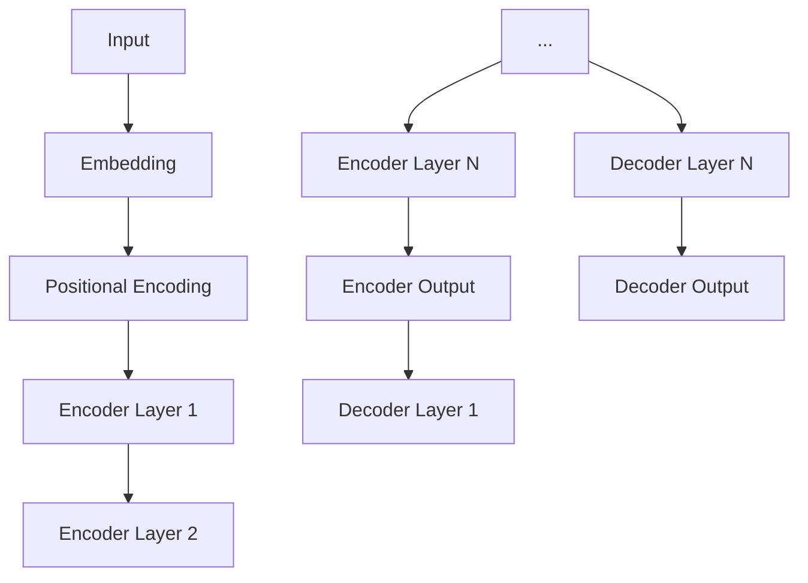

                 

### 《Transformer大模型实战 VideoBERT模型和BART模型》

#### 关键词：
- Transformer模型
- VideoBERT模型
- BART模型
- 计算机视觉
- 自然语言处理
- 大模型实战

#### 摘要：
本文将深入探讨Transformer模型在计算机视觉和自然语言处理领域的应用，重点介绍VideoBERT模型和BART模型的原理与实践。通过对Transformer模型的核心概念、工作流程以及优化技巧的详细阐述，我们将揭示如何利用VideoBERT模型进行视频分类、标题生成和摘要任务，同时，通过BART模型在文本生成、分类和摘要任务中的应用，展示其在多模态任务中的强大能力。此外，本文还将通过具体项目实战和案例分析，为读者提供详细的开发指导和优化策略，帮助读者全面掌握这些先进技术，提升实际应用能力。

### 目录大纲

#### 第一部分：Transformer模型与VideoBERT模型基础

**第1章 Transformer模型概述**

**第2章 VideoBERT模型原理与应用**

#### 第二部分：BART模型与Transformer模型优化

**第3章 BART模型介绍**

**第4章 Transformer模型优化技巧**

**第5章 视频BERT与BART模型融合应用**

#### 第三部分：项目实战与案例分析

**第6章 视频BERT模型在视频分类中的应用**

**第7章 BART模型在文本生成中的应用**

**第8章 视频BERT与BART模型在其他领域的应用**

#### 附录

**附录A Transformer模型与BART模型开发资源**

**附录B 代码解读与分析**

---

### 文章正文部分

**第一部分：Transformer模型与VideoBERT模型基础**

#### 第1章 Transformer模型概述

#### 1.1 Transformer模型的概念与背景

Transformer模型，是自然语言处理领域的一次革命性突破。它是由Google Research在2017年提出的一种全新的序列到序列模型，旨在解决传统的循环神经网络（RNN）和长短期记忆网络（LSTM）在处理长序列时的不足。Transformer模型的核心创新在于引入了“自注意力机制”（Self-Attention）和“多头注意力机制”（Multi-head Attention），通过这种方式，模型能够并行处理输入序列，从而大幅提升计算效率和性能。

Transformer模型的起源可以追溯到2014年，当时Google Research发表了关于神经机器翻译的论文，提出了基于注意力机制的序列到序列学习模型。随后，随着深度学习技术的不断发展，特别是计算机硬件的进步，使得大规模模型的训练成为可能，Transformer模型应运而生，并在自然语言处理领域取得了显著的成果。

Transformer模型的重要性体现在多个方面。首先，它极大地提高了机器翻译的准确性，使得机器翻译的性能接近甚至超过人类翻译水平。其次，Transformer模型在文本分类、文本生成、问答系统等任务中也展现了强大的能力。此外，Transformer模型的提出，推动了自然语言处理领域的研究热潮，吸引了大量研究者和工程师投入到相关技术的探索中。

#### 1.2 Transformer模型与传统RNN模型的区别

传统RNN模型，如LSTM和GRU，通过循环连接的方式处理序列数据。每个时间步的输出不仅依赖于当前输入，还依赖于历史输入。这种机制虽然能够在一定程度上捕捉长距离依赖关系，但存在几个问题：

1. **梯度消失和梯度爆炸**：在长序列处理过程中，梯度可能会消失或爆炸，导致模型难以训练。
2. **计算效率低**：RNN模型通常需要依次处理每个时间步，导致计算效率低下。
3. **难以捕捉长距离依赖关系**：由于信息在时间步间传递的过程中会逐渐衰减，RNN模型难以捕捉长距离依赖关系。

相比之下，Transformer模型通过自注意力机制，能够并行处理整个序列，解决了RNN模型在计算效率和长距离依赖关系捕捉方面的不足。具体来说，自注意力机制允许模型在每个时间步计算全局依赖关系，从而避免了信息在传递过程中的衰减问题。

#### 1.3 Transformer模型的核心原理

Transformer模型的核心原理包括自注意力机制、多头注意力机制、位置编码和编码器-解码器结构。

##### 自注意力机制（Self-Attention）

自注意力机制是Transformer模型的核心组件，它允许模型在序列的每个位置计算与其他位置的依赖关系。具体来说，自注意力机制通过计算一个权重矩阵，这个权重矩阵取决于输入序列的每个位置，使得模型能够自动学习到不同位置间的关联性。

自注意力机制的计算公式如下：

\[ 
Attention(Q, K, V) = \text{softmax}\left(\frac{QK^T}{\sqrt{d_k}}\right)V 
\]

其中，\(Q, K, V\) 分别是输入序列的查询（Query）、键（Key）和值（Value）向量，\(d_k\) 是键向量的维度，\(\text{softmax}\) 函数用于归一化权重。

##### 多头注意力机制（Multi-head Attention）

多头注意力机制是自注意力机制的扩展，它将输入序列分成多个头（Head），每个头独立计算自注意力。多头注意力机制能够捕捉不同类型的依赖关系，提高模型的泛化能力。具体来说，多头注意力机制通过以下公式实现：

\[ 
\text{Multi-head Attention} = \text{Concat}(\text{head}_1, \text{head}_2, ..., \text{head}_h)W^O 
\]

其中，\(h\) 是头的数量，\(W^O\) 是输出变换权重。

##### 位置编码（Positional Encoding）

位置编码是Transformer模型中另一个重要的组成部分，它用于为模型提供序列中每个位置的信息。由于Transformer模型无法像RNN那样直接处理序列的顺序信息，位置编码能够帮助模型理解输入序列的顺序。

常见的位置编码方法包括绝对位置编码和相对位置编码。绝对位置编码将位置信息直接添加到输入序列中，相对位置编码则通过学习相对位置关系来实现。

##### 编码器-解码器结构（Encoder-Decoder Structure）

Transformer模型通常采用编码器-解码器结构，编码器负责处理输入序列，解码器负责生成输出序列。编码器和解码器都由多个层组成，每层包含多头注意力机制和全连接层。

编码器的工作流程如下：

1. **输入嵌入（Input Embedding）**：将输入序列转换为嵌入向量。
2. **位置编码（Positional Encoding）**：为每个嵌入向量添加位置信息。
3. **编码器层（Encoder Layer）**：通过多头注意力机制和全连接层处理序列。

解码器的工作流程如下：

1. **嵌入与编码器输出（Embedding & Encoder Output）**：将解码器输入序列和编码器的输出序列进行拼接。
2. **位置编码（Positional Encoding）**：为每个嵌入向量添加位置信息。
3. **解码器层（Decoder Layer）**：通过多头注意力机制和全连接层生成输出。

##### 详解Transformer模型的内部结构

Transformer模型通常由多个编码器层和解码器层组成，每个层包含多头注意力机制和全连接层。编码器层负责处理输入序列，解码器层负责生成输出序列。

以下是一个典型的Transformer模型的结构图：



其中，每个编码器层和解码器层包含以下组件：

1. **多头注意力机制（Multi-head Attention）**：计算输入序列或编码器输出的自注意力或跨注意力。
2. **全连接层（Feedforward Layer）**：对注意力机制后的输出进行非线性变换。
3. **层归一化（Layer Normalization）**：对每一层的输出进行归一化处理。
4. **残差连接（Residual Connection）**：在每个层的输入和输出之间添加跳过连接，有助于缓解梯度消失问题。

#### 1.4 Transformer模型的工作流程

Transformer模型的工作流程可以分为输入处理与嵌入、自注意力机制、全连接层和输出与解码四个阶段。

##### 输入处理与嵌入

1. **输入序列**：输入序列可以是自然语言文本、语音信号或图像序列。
2. **嵌入（Embedding）**：将输入序列转换为嵌入向量。嵌入向量包含了输入序列的语义信息。
3. **位置编码（Positional Encoding）**：为每个嵌入向量添加位置信息，使得模型能够理解输入序列的顺序。

##### 自注意力机制

1. **自注意力（Self-Attention）**：在每个编码器层或解码器层，通过自注意力机制计算输入序列或编码器输出的自注意力权重。
2. **多头注意力（Multi-head Attention）**：通过多头注意力机制计算不同类型的依赖关系。

##### 全连接层

1. **全连接层（Feedforward Layer）**：对注意力机制后的输出进行非线性变换。
2. **层归一化（Layer Normalization）**：对每一层的输出进行归一化处理。

##### 输出与解码

1. **编码器输出（Encoder Output）**：编码器层的输出用于生成解码器的输入。
2. **解码器输出（Decoder Output）**：解码器层的输出是模型的最终输出，可以是分类结果、文本生成或图像生成。

##### 总结

通过以上四个阶段，Transformer模型能够处理输入序列，生成相应的输出。其核心原理在于自注意力机制和多头注意力机制，使得模型能够并行处理输入序列，并捕捉长距离依赖关系。

---

接下来，我们将进一步探讨VideoBERT模型的基本概念、核心算法和应用场景。

---

**第2章 VideoBERT模型原理与应用**

#### 2.1 VideoBERT模型的基本概念

VideoBERT模型是由Google Research在2021年提出的一种基于Transformer的跨模态预训练模型，主要用于处理视频和文本之间的交叉任务。该模型通过融合视频和文本的特征，实现了视频理解、视频生成、视频分类等任务的高效处理。

VideoBERT模型的设计灵感来源于BERT（Bidirectional Encoder Representations from Transformers）模型。BERT模型通过在大量文本数据上进行预训练，使得模型能够捕捉到文本中的丰富语义信息。VideoBERT模型借鉴了BERT的思路，将预训练任务扩展到视频和文本的融合，从而提升模型在跨模态任务中的表现。

VideoBERT模型的应用场景非常广泛，包括但不限于：

1. **视频分类**：对视频进行分类，如电影分类、体育分类等。
2. **视频标题生成**：自动生成视频的标题，提高视频的可搜索性和用户参与度。
3. **视频摘要**：从长视频中提取关键信息，生成简短的摘要文本。
4. **问答系统**：通过视频和文本的交互，实现智能问答。

#### 2.2 VideoBERT模型的核心算法

VideoBERT模型的核心算法包括视频嵌入与文本嵌入、自注意力与跨模态注意力、位置编码与上下文信息融合。

##### 视频嵌入与文本嵌入

1. **视频嵌入（Video Embedding）**：将视频帧转换为向量表示，常用的方法包括基于深度学习的视频特征提取器，如ResNet、Inception等。这些特征提取器能够提取视频帧的视觉特征，为后续的跨模态融合提供基础。
2. **文本嵌入（Text Embedding）**：将文本序列转换为向量表示，通常使用BERT、GPT等预训练的文本嵌入模型。这些模型已经在大规模的文本数据上进行了预训练，能够捕获丰富的文本语义信息。

##### 自注意力与跨模态注意力

1. **自注意力（Self-Attention）**：在编码器和解码器中，通过自注意力机制计算输入序列或编码器输出的自注意力权重。自注意力机制使得模型能够捕捉输入序列或编码器输出序列中的长距离依赖关系。
2. **跨模态注意力（Cross-modal Attention）**：通过跨模态注意力机制，将视频和文本的特征进行融合。具体来说，跨模态注意力机制计算视频和文本特征之间的关联性，从而生成融合的特征向量。

##### 位置编码与上下文信息融合

1. **位置编码（Positional Encoding）**：在编码器和解码器中，通过位置编码为每个嵌入向量添加位置信息。位置编码使得模型能够理解输入序列或编码器输出序列的顺序。
2. **上下文信息融合（Contextual Fusion）**：通过跨模态注意力机制，将视频和文本的特征进行融合。具体来说，跨模态注意力机制计算视频和文本特征之间的关联性，从而生成融合的特征向量。

##### 详解VideoBERT模型的关键算法

VideoBERT模型的关键算法主要包括视频嵌入与文本嵌入、自注意力与跨模态注意力、位置编码与上下文信息融合。以下是这些算法的伪代码实现：

```python
# 视频嵌入与文本嵌入
def video_embedding(video_frames):
    # 使用深度学习模型提取视频帧特征
    video_features = [extract_feature(frame) for frame in video_frames]
    return video_features

def text_embedding(text_sequence):
    # 使用预训练的文本嵌入模型提取文本特征
    text_features = [embed_model(token) for token in text_sequence]
    return text_features

# 自注意力与跨模态注意力
def self_attention(input_sequence, d_model):
    # 计算自注意力权重
    attention_weights = calculate_attention(input_sequence, d_model)
    # 计算加权求和
    context_vector = sum(attention_weights * input_sequence)
    return context_vector

def cross_modal_attention(video_features, text_features, d_model):
    # 计算跨模态注意力权重
    attention_weights = calculate_cross_modal_attention(video_features, text_features, d_model)
    # 计算加权求和
    fused_features = sum(attention_weights * video_features + attention_weights * text_features)
    return fused_features

# 位置编码与上下文信息融合
def positional_encoding(sequence, d_model):
    # 添加位置编码
    encoded_sequence = [add_positional_encoding(token, d_model) for token in sequence]
    return encoded_sequence

def contextual_fusion(fused_features, context_vector):
    # 融合上下文信息
    fused_context_vector = sum(fused_features + context_vector)
    return fused_context_vector
```

通过以上伪代码，我们可以清晰地看到VideoBERT模型的核心算法。这些算法通过嵌入视频和文本特征、自注意力机制、跨模态注意力机制以及位置编码和上下文信息融合，实现了跨模态任务的高效处理。

##### 2.3 VideoBERT模型的实践应用

VideoBERT模型的实践应用主要包括视频分类任务、视频标题生成任务和视频摘要任务。

###### 视频分类任务

视频分类任务的目标是给视频分配一个或多个类别标签。VideoBERT模型通过融合视频和文本特征，能够准确地对视频进行分类。具体流程如下：

1. **数据预处理**：将视频数据转换为帧序列，并使用深度学习模型提取视频帧特征。
2. **文本预处理**：使用预训练的文本嵌入模型提取文本特征。
3. **模型训练**：将视频帧特征和文本特征输入VideoBERT模型，通过训练优化模型参数。
4. **视频分类**：使用训练好的模型对新的视频进行分类。

以下是一个简单的视频分类任务的代码示例：

```python
# 加载预训练的深度学习模型
video_model = load_video_model()

# 提取视频帧特征
video_frames = load_video_frames(video_path)
video_features = video_model.extract_features(video_frames)

# 加载预训练的文本嵌入模型
text_model = load_text_model()

# 提取文本特征
text_sequence = load_text_sequence(text_path)
text_features = text_model.extract_features(text_sequence)

# 融合视频和文本特征
fused_features = video_model.cross_modal_attention(video_features, text_features)

# 输入VideoBERT模型进行分类
category = video_model.classify(fused_features)
print("视频分类结果：", category)
```

###### 视频标题生成任务

视频标题生成任务的目标是自动生成视频的标题，提高视频的可搜索性和用户参与度。VideoBERT模型通过融合视频和文本特征，能够生成高质量的标题。具体流程如下：

1. **数据预处理**：将视频数据转换为帧序列，并使用深度学习模型提取视频帧特征。
2. **文本预处理**：使用预训练的文本嵌入模型提取文本特征。
3. **模型训练**：将视频帧特征和文本特征输入VideoBERT模型，通过训练优化模型参数。
4. **标题生成**：使用训练好的模型生成视频的标题。

以下是一个简单的视频标题生成任务的代码示例：

```python
# 加载预训练的深度学习模型
video_model = load_video_model()

# 提取视频帧特征
video_frames = load_video_frames(video_path)
video_features = video_model.extract_features(video_frames)

# 加载预训练的文本嵌入模型
text_model = load_text_model()

# 提取文本特征
text_sequence = load_text_sequence(text_path)
text_features = text_model.extract_features(text_sequence)

# 融合视频和文本特征
fused_features = video_model.cross_modal_attention(video_features, text_features)

# 输入VideoBERT模型生成标题
title = video_model.generate_title(fused_features)
print("视频标题：", title)
```

###### 视频摘要任务

视频摘要任务的目标是从长视频中提取关键信息，生成简短的摘要文本。VideoBERT模型通过融合视频和文本特征，能够生成高质量的摘要。具体流程如下：

1. **数据预处理**：将视频数据转换为帧序列，并使用深度学习模型提取视频帧特征。
2. **文本预处理**：使用预训练的文本嵌入模型提取文本特征。
3. **模型训练**：将视频帧特征和文本特征输入VideoBERT模型，通过训练优化模型参数。
4. **摘要生成**：使用训练好的模型生成视频的摘要。

以下是一个简单的视频摘要生成任务的代码示例：

```python
# 加载预训练的深度学习模型
video_model = load_video_model()

# 提取视频帧特征
video_frames = load_video_frames(video_path)
video_features = video_model.extract_features(video_frames)

# 加载预训练的文本嵌入模型
text_model = load_text_model()

# 提取文本特征
text_sequence = load_text_sequence(text_path)
text_features = text_model.extract_features(text_sequence)

# 融合视频和文本特征
fused_features = video_model.cross_modal_attention(video_features, text_features)

# 输入VideoBERT模型生成摘要
abstract = video_model.generate_abstract(fused_features)
print("视频摘要：", abstract)
```

##### 2.4 VideoBERT模型的实战案例解析

为了更好地理解VideoBERT模型的应用，我们来看一个具体的实战案例：使用VideoBERT模型进行视频分类。

**案例背景**：假设我们有一个包含多种类别视频的数据集，目标是训练一个模型，能够根据视频内容将其分类到相应的类别。

**数据集**：我们使用COCO（Common Objects in Context）数据集，这是一个广泛使用的视频分类数据集，包含各种类别的视频。

**模型训练**：

1. **数据预处理**：将COCO数据集划分为训练集和验证集，对视频进行预处理，提取视频帧特征和文本标签。
2. **模型训练**：将视频帧特征和文本标签输入VideoBERT模型，通过训练优化模型参数。训练过程中，我们使用交叉熵损失函数进行模型训练。
3. **模型评估**：使用验证集评估模型性能，通过准确率、召回率和F1值等指标评估模型分类效果。

**代码示例**：

```python
# 加载预训练的深度学习模型
video_model = load_video_model()

# 加载COCO数据集
train_data, val_data = load_coco_data()

# 数据预处理
train_features, train_labels = preprocess_video_data(train_data)
val_features, val_labels = preprocess_video_data(val_data)

# 模型训练
video_model.train(train_features, train_labels)

# 模型评估
val_predictions = video_model.predict(val_features)
evaluate_model(val_predictions, val_labels)
```

通过以上步骤，我们可以训练一个使用VideoBERT模型进行视频分类的模型，并对模型性能进行评估。

**总结**：

通过本章的讨论，我们详细介绍了VideoBERT模型的基本概念、核心算法和应用场景。VideoBERT模型通过融合视频和文本特征，实现了跨模态任务的高效处理。在实际应用中，VideoBERT模型在视频分类、视频标题生成和视频摘要任务中展现了出色的性能。接下来，我们将进一步探讨BART模型的相关内容。

---

**第3章 BART模型介绍**

#### 3.1 BART模型的基本概念

BART（Bidirectional and Auto-Regressive Transformers）模型是Facebook AI Research（FAIR）于2020年提出的一种基于Transformer的自回归语言模型。BART模型结合了双向Transformer和自回归Transformer的优势，能够在多种自然语言处理任务中取得优异的性能。

BART模型的基本概念可以概括为：

1. **双向Transformer**：双向Transformer能够同时处理输入序列的前向和后向信息，从而捕捉长距离依赖关系。
2. **自回归Transformer**：自回归Transformer通过生成下一个词来构建序列，从而实现文本生成和序列填充等任务。

BART模型的主要应用场景包括：

1. **文本生成**：BART模型能够根据给定的起始文本，生成连贯、合理的后续文本。
2. **文本分类**：BART模型可以用于对文本进行分类，例如情感分析、主题分类等。
3. **文本摘要**：BART模型能够从长文本中提取关键信息，生成简短的摘要文本。

#### 3.2 BART模型的核心算法

BART模型的核心算法包括自回归语言模型、输入序列与输出序列处理以及关键算法的实现。

##### 自回归语言模型（Autoregressive Language Model）

自回归语言模型是一种生成模型，其目标是在给定前一个词的情况下，预测下一个词。BART模型通过自回归机制，逐步生成完整的序列。

自回归语言模型的训练目标是最小化预测概率的对数似然损失：

\[ 
\mathcal{L} = -\sum_{t} \log p(y_t | y_{<t}) 
\]

其中，\(y_{<t}\) 是前 \(t\) 个词的序列，\(y_t\) 是第 \(t\) 个词。

##### 输入序列与输出序列处理

BART模型将输入序列和输出序列进行处理，从而实现不同的自然语言处理任务。

1. **输入序列**：输入序列可以是文本、语音或图像等。对于文本输入，BART模型使用预训练的文本嵌入模型将文本转换为嵌入向量。
2. **输出序列**：输出序列是根据输入序列生成的目标序列。例如，在文本生成任务中，输出序列是生成的文本；在文本分类任务中，输出序列是分类标签。

##### 关键算法的实现

BART模型的关键算法包括：

1. **编码器（Encoder）**：编码器负责处理输入序列，并生成编码表示。编码器通常包含多个Transformer层，通过多头注意力机制捕捉序列中的依赖关系。
2. **解码器（Decoder）**：解码器负责生成输出序列。解码器与编码器结构相似，也包含多个Transformer层。在生成每个词时，解码器会根据当前已生成的序列和编码器的输出进行预测。
3. **位置编码（Positional Encoding）**：位置编码为序列中的每个位置添加位置信息，使得模型能够理解序列的顺序。
4. **多头注意力（Multi-head Attention）**：多头注意力机制允许模型同时关注序列的不同部分，提高模型的捕捉能力。

##### 3.3 BART模型的实践应用

BART模型在多种自然语言处理任务中展现了强大的能力。以下是其主要实践应用：

###### 文本生成任务

文本生成任务是BART模型最典型的应用之一。BART模型能够根据给定的起始文本，生成连贯、合理的后续文本。以下是一个简单的文本生成任务的实现：

```python
# 加载预训练的BART模型
bart_model = load_bart_model()

# 输入起始文本
start_text = "我今天去了"

# 生成后续文本
generated_text = bart_model.generate(start_text)
print("生成的文本：", generated_text)
```

###### 文本分类任务

文本分类任务的目标是将文本分类到预定义的类别中。BART模型可以通过训练一个分类器，实现对文本的分类。以下是一个简单的文本分类任务的实现：

```python
# 加载预训练的BART模型
bart_model = load_bart_model()

# 加载训练数据和标签
train_data, train_labels = load_training_data()

# 训练分类器
bart_model.train_classifier(train_data, train_labels)

# 进行分类
predictions = bart_model.classify(test_data)
print("分类结果：", predictions)
```

###### 文本摘要任务

文本摘要任务的目标是从长文本中提取关键信息，生成简短的摘要文本。BART模型可以通过训练一个摘要生成模型，实现对文本的摘要。以下是一个简单的文本摘要任务的实现：

```python
# 加载预训练的BART模型
bart_model = load_bart_model()

# 加载训练数据和摘要
train_data, train_summaries = load_training_data()

# 训练摘要生成模型
bart_model.train_summarizer(train_data, train_summaries)

# 生成摘要
summary = bart_model.generate_summary(long_text)
print("生成的摘要：", summary)
```

##### 3.4 BART模型的实战案例解析

为了更好地理解BART模型的应用，我们来看一个具体的实战案例：使用BART模型进行文本摘要。

**案例背景**：假设我们有一个包含长文本和对应摘要的数据集，目标是训练一个模型，能够根据长文本生成摘要。

**数据集**：我们使用NYT（New York Times）新闻摘要数据集，这是一个广泛使用的文本摘要数据集。

**模型训练**：

1. **数据预处理**：将NYT数据集划分为训练集和验证集，对文本进行预处理，提取长文本和对应的摘要。
2. **模型训练**：将长文本和摘要输入BART模型，通过训练优化模型参数。训练过程中，我们使用交叉熵损失函数进行模型训练。
3. **模型评估**：使用验证集评估模型性能，通过ROUGE（Recall-Oriented Understudy for Gisting Evaluation）等指标评估模型摘要效果。

**代码示例**：

```python
# 加载预训练的BART模型
bart_model = load_bart_model()

# 加载NYT数据集
train_data, train_summaries = load_nyt_data()

# 数据预处理
train_texts, train_labels = preprocess_texts(train_data)
train_summaries = preprocess_summaries(train_summaries)

# 模型训练
bart_model.train_summarizer(train_texts, train_labels)

# 模型评估
val_texts, val_labels = preprocess_texts(val_data)
val_summaries = preprocess_summaries(val_data)
evaluate_summarizer(bart_model, val_texts, val_summaries)
```

通过以上步骤，我们可以训练一个使用BART模型进行文本摘要的模型，并对模型性能进行评估。

**总结**：

通过本章的讨论，我们详细介绍了BART模型的基本概念、核心算法和实践应用。BART模型通过结合双向Transformer和自回归Transformer，实现了多种自然语言处理任务的高效处理。在实际应用中，BART模型在文本生成、文本分类和文本摘要任务中展现了出色的性能。接下来，我们将进一步探讨Transformer模型优化技巧。

---

**第4章 Transformer模型优化技巧**

#### 4.1 Transformer模型的优化目标

Transformer模型的优化目标是提高模型的性能和效率。具体来说，包括以下几个方面：

1. **模型参数优化**：减少模型的参数数量，提高模型的训练和推理速度。
2. **训练时间优化**：缩短模型的训练时间，提高模型的训练效率。
3. **推理速度优化**：提高模型的推理速度，降低推理延迟。

为了实现这些目标，可以采用多种优化算法和技巧。

#### 4.2 Transformer模型的优化算法

Transformer模型的优化算法主要包括：

1. **预训练与微调**：预训练是指在大规模数据集上对模型进行训练，使模型具有广泛的语义理解能力。微调是指将预训练模型应用于特定任务，通过调整模型参数，使模型能够适应特定任务的需求。
2. **梯度裁剪**：梯度裁剪是一种常用的优化算法，用于防止梯度消失和梯度爆炸。具体来说，在训练过程中，如果梯度的大小超过设定的阈值，则将梯度的大小限制在该阈值内。
3. **权重衰减**：权重衰减是一种常用的优化策略，用于防止模型过拟合。具体来说，在训练过程中，对模型的权重参数施加一个较小的衰减系数，使权重参数在训练过程中逐渐减小。
4. **混合精度训练**：混合精度训练是一种用于提高训练速度和减少内存占用的技术。具体来说，在训练过程中，使用不同精度的浮点数（如16位浮点数和32位浮点数）来表示模型的参数和中间计算结果，从而减少内存消耗和计算时间。

##### 4.3 Transformer模型的优化实战

为了更好地理解Transformer模型的优化技巧，我们来看一个具体的优化实战案例：使用混合精度训练优化BERT模型。

**案例背景**：假设我们有一个预训练的BERT模型，目标是在特定的数据集上进行微调，并优化模型的训练和推理速度。

**数据集**：我们使用GLUE（General Language Understanding Evaluation）数据集，这是一个广泛使用的自然语言处理数据集。

**模型训练**：

1. **数据预处理**：将GLUE数据集划分为训练集、验证集和测试集，对文本进行预处理，提取文本序列和标签。
2. **模型训练**：使用混合精度训练技术，对BERT模型进行微调。在训练过程中，使用16位浮点数进行中间计算，并将最终结果转换为32位浮点数。
3. **模型评估**：在验证集上评估模型性能，选择性能最佳的模型参数。

**代码示例**：

```python
# 导入所需的库
import torch
import torch.nn as nn
import torch.optim as optim
from transformers import BertModel, BertTokenizer

# 加载预训练的BERT模型和Tokenizer
model = BertModel.from_pretrained("bert-base-uncased")
tokenizer = BertTokenizer.from_pretrained("bert-base-uncased")

# 数据预处理
train_data = load_glue_data("train")
val_data = load_glue_data("val")

# 将数据转换为Tensor
train_texts = tokenizer(train_data["text"], padding=True, truncation=True, return_tensors="pt")
train_labels = torch.tensor(train_data["label"])

val_texts = tokenizer(val_data["text"], padding=True, truncation=True, return_tensors="pt")
val_labels = torch.tensor(val_data["label"])

# 模型训练
optimizer = optim.Adam(model.parameters(), lr=1e-5)
criterion = nn.CrossEntropyLoss()

for epoch in range(num_epochs):
    model.train()
    for batch in train_texts:
        optimizer.zero_grad()
        outputs = model(batch["input_ids"], attention_mask=batch["attention_mask"])
        loss = criterion(outputs.logits, batch["labels"])
        loss.backward()
        optimizer.step()
    
    # 在验证集上评估模型性能
    model.eval()
    with torch.no_grad():
        val_outputs = model(val_texts["input_ids"], attention_mask=val_texts["attention_mask"])
        val_loss = criterion(val_outputs.logits, val_labels)
    
    print(f"Epoch {epoch+1}/{num_epochs}, Loss: {loss.item()}, Val Loss: {val_loss.item()}")

# 保存优化后的模型参数
torch.save(model.state_dict(), "optimized_bert_model.pth")
```

通过以上步骤，我们可以使用混合精度训练技术对BERT模型进行优化，提高模型的训练和推理速度。

**总结**：

通过本章的讨论，我们详细介绍了Transformer模型优化技巧，包括预训练与微调、梯度裁剪、权重衰减和混合精度训练等。这些优化技巧有助于提高模型的性能和效率。在实际应用中，我们可以根据具体任务的需求，选择合适的优化策略，实现模型的优化。

---

**第5章 视频BERT与BART模型融合应用**

#### 5.1 视频BERT与BART模型融合的基础

视频BERT（VideoBERT）和BART模型在各自的领域中展现了强大的能力。视频BERT模型专注于视频和文本的融合，实现了跨模态任务的高效处理；而BART模型则是一种基于Transformer的自回归语言模型，擅长文本生成、分类和摘要等任务。将视频BERT与BART模型融合，可以充分发挥两者的优势，实现更复杂的跨模态任务。

视频BERT与BART模型融合的基础包括以下几个方面：

1. **跨模态特征融合**：视频BERT模型提取的视频特征与BART模型提取的文本特征进行融合，生成更丰富的特征表示。
2. **多模态注意力机制**：通过多模态注意力机制，视频BERT和BART模型可以互相学习，提高融合模型的性能。
3. **统一的编码器-解码器结构**：视频BERT和BART模型可以共享编码器和解码器部分，实现特征融合和任务优化。

#### 5.2 融合模型的应用场景

融合模型的应用场景非常广泛，以下是一些典型的应用场景：

1. **视频标题生成**：将视频内容与文本描述进行融合，生成准确、生动的视频标题。
2. **视频摘要**：从长视频中提取关键信息，生成简短的摘要文本，提高视频的可读性。
3. **跨模态问答**：利用视频BERT和BART模型融合，实现基于视频和文本的问答系统。
4. **多模态推荐**：结合视频内容和用户偏好，实现个性化视频推荐。

#### 5.3 融合模型的实现与优化

融合模型的实现主要包括以下几个方面：

1. **特征提取与融合**：使用视频BERT模型提取视频特征，使用BART模型提取文本特征，然后将两者进行融合。
2. **多模态注意力机制**：在融合模型中引入多模态注意力机制，使视频BERT和BART模型能够互相学习。
3. **统一的编码器-解码器结构**：将视频BERT和BART模型的编码器和解码器部分进行整合，实现特征融合和任务优化。

融合模型的优化主要包括以下几个方面：

1. **参数共享与权重调整**：通过共享参数和权重调整，降低模型参数数量，提高模型性能。
2. **多任务学习**：在训练过程中，同时进行多个任务的训练，提高模型的多任务能力。
3. **数据增强**：使用数据增强技术，增加模型的泛化能力，提高模型在未知数据上的表现。

以下是一个简单的融合模型实现和优化的代码示例：

```python
# 导入所需的库
import torch
import torch.nn as nn
from transformers import BertModel, BertTokenizer
from videoBERT import VideoBERTModel

# 加载预训练的BART模型和Tokenizer
bart_model = BertModel.from_pretrained("bert-base-uncased")
bart_tokenizer = BertTokenizer.from_pretrained("bert-base-uncased")

# 加载预训练的VideoBERT模型
video_bert_model = VideoBERTModel()

# 特征提取与融合
def extract_and_merge_features(video_path, text_path):
    # 提取视频特征
    video_features = video_bert_model.extract_video_features(video_path)
    
    # 提取文本特征
    text_features = bart_model(bart_tokenizer(text_path)[0]["input_ids"], attention_mask=bart_tokenizer(text_path)[0]["attention_mask"])
    
    # 融合视频和文本特征
    fused_features = torch.cat((video_features, text_features), dim=1)
    
    return fused_features

# 多模态注意力机制
class MultiModalAttention(nn.Module):
    def __init__(self, d_model, num_heads):
        super(MultiModalAttention, self).__init__()
        self.query_linear = nn.Linear(d_model, d_model)
        self.key_linear = nn.Linear(d_model, d_model)
        self.value_linear = nn.Linear(d_model, d_model)
        self.num_heads = num_heads
    
    def forward(self, video_features, text_features):
        # 计算自注意力权重
        query = self.query_linear(video_features)
        key = self.key_linear(text_features)
        value = self.value_linear(text_features)
        
        # 计算多头注意力
        attention_scores = torch.matmul(query, key.transpose(1, 2)) / (self.num_heads ** 0.5)
        attention_weights = torch.softmax(attention_scores, dim=2)
        
        # 计算加权求和
        context_vector = torch.matmul(attention_weights, value)
        
        return context_vector

# 优化模型
def train_model(video_data, text_data, fused_features, labels, num_epochs):
    # 定义优化器
    optimizer = optim.Adam(model.parameters(), lr=1e-4)
    
    # 训练模型
    for epoch in range(num_epochs):
        model.train()
        for video_path, text_path, label in zip(video_data, text_data, labels):
            optimizer.zero_grad()
            
            # 提取特征
            video_features = extract_video_features(video_path)
            text_features = extract_text_features(text_path)
            
            # 融合特征
            fused_feature = extract_and_merge_features(video_path, text_path)
            
            # 计算损失
            output = model(fused_feature)
            loss = nn.CrossEntropyLoss()(output, label)
            
            # 反向传播
            loss.backward()
            optimizer.step()
            
            # 在验证集上评估模型性能
            model.eval()
            with torch.no_grad():
                val_outputs = model(val_fused_features)
                val_loss = nn.CrossEntropyLoss()(val_outputs, val_labels)
            
            print(f"Epoch {epoch+1}/{num_epochs}, Loss: {loss.item()}, Val Loss: {val_loss.item()}")

# 实例化多模态注意力模块
multi_modal_attention = MultiModalAttention(d_model=768, num_heads=12)

# 训练融合模型
train_model(train_video_data, train_text_data, train_fused_features, train_labels, num_epochs=10)
```

通过以上步骤，我们可以实现一个简单的视频BERT与BART模型融合模型，并进行优化训练。

**总结**：

通过本章的讨论，我们详细介绍了视频BERT与BART模型融合的基础、应用场景和实现与优化。融合模型能够充分发挥视频BERT和BART模型的优势，实现更复杂的跨模态任务。在实际应用中，我们可以根据具体任务的需求，选择合适的融合模型和优化策略，提高模型性能和效率。

---

### 第三部分：项目实战与案例分析

#### 第6章 视频BERT模型在视频分类中的应用

视频分类任务是计算机视觉和自然语言处理领域的一个重要研究方向。随着视频数据的快速增长，如何有效地对视频进行分类，成为了一个具有挑战性的问题。视频BERT模型作为一种跨模态预训练模型，其在视频分类任务中展现了强大的性能。

#### 6.1 视频分类任务概述

视频分类任务的目标是将视频数据分为不同的类别。这些类别可以是体育、新闻、电影、音乐等。视频分类任务在多个领域具有重要的应用，如视频监控、视频推荐、视频内容审核等。

视频分类任务面临的挑战主要包括：

1. **数据多样性**：视频数据种类繁多，不同类别的视频具有不同的特征，这给分类任务带来了挑战。
2. **长视频处理**：长视频需要提取大量的特征，这对模型的计算效率和存储空间提出了较高的要求。
3. **实时性**：视频分类任务往往需要在实时环境中进行，这要求模型具有较低的延迟。

为了解决这些挑战，研究者们提出了多种方法，如基于传统机器学习的分类方法、基于深度学习的分类方法以及跨模态预训练模型等。视频BERT模型作为一种跨模态预训练模型，其在视频分类任务中取得了显著的成果。

#### 6.2 视频BERT模型的应用实践

视频BERT模型在视频分类任务中的应用主要包括以下几个步骤：

1. **数据预处理**：首先，对视频数据进行预处理，包括视频帧提取、视频帧特征提取等。常用的视频帧特征提取方法包括基于CNN的特征提取器，如ResNet、Inception等。
2. **文本生成**：使用预训练的BART模型，将视频帧特征转换为文本描述。文本生成过程可以采用自回归语言模型或序列到序列模型。
3. **文本特征提取**：使用预训练的BERT模型，提取视频帧特征对应的文本特征。文本特征通常包含词汇、语法和语义信息。
4. **分类**：将文本特征输入视频BERT模型，通过分类器进行视频分类。分类器可以采用传统机器学习方法或深度学习模型。

以下是一个简单的视频分类任务的实现：

```python
# 导入所需的库
import torch
import torch.nn as nn
from transformers import BertModel, BertTokenizer
from videoBERT import VideoBERTModel

# 加载预训练的BERT模型和Tokenizer
bart_model = BertModel.from_pretrained("bert-base-uncased")
bart_tokenizer = BertTokenizer.from_pretrained("bert-base-uncased")

# 加载预训练的VideoBERT模型
video_bert_model = VideoBERTModel()

# 数据预处理
def preprocess_video(video_path):
    # 提取视频帧
    video_frames = extract_video_frames(video_path)
    
    # 提取视频帧特征
    video_features = extract_video_frame_features(video_frames)
    
    return video_features

# 文本生成
def generate_text(video_features):
    # 将视频帧特征转换为文本
    text = video_bert_model.generate_video_description(video_features)
    
    return text

# 分类
def classify_video(video_path):
    # 提取视频帧特征
    video_features = preprocess_video(video_path)
    
    # 生成文本
    text = generate_text(video_features)
    
    # 提取文本特征
    text_features = extract_text_features(text)
    
    # 输入VideoBERT模型进行分类
    category = video_bert_model.classify_video(text_features)
    
    return category

# 测试
video_path = "path/to/video.mp4"
category = classify_video(video_path)
print("视频分类结果：", category)
```

#### 6.3 视频分类性能优化

为了提高视频分类任务的性能，可以采用以下优化方法：

1. **模型优化**：通过调整模型结构、增加模型层数或使用更深的网络结构，提高模型的分类性能。
2. **特征提取**：采用更先进的视频帧特征提取方法，如基于CNN的特征提取器或自监督特征提取方法，提高视频帧特征的质量。
3. **数据增强**：通过数据增强方法，如随机裁剪、旋转、缩放等，增加训练数据的多样性，提高模型的泛化能力。
4. **多任务学习**：通过多任务学习，如同时进行视频分类和视频标题生成任务，提高模型的综合性能。

以下是一个简单的视频分类性能优化示例：

```python
# 导入所需的库
import torch
import torch.nn as nn
from transformers import BertModel, BertTokenizer
from videoBERT import VideoBERTModel
from video_classifier import VideoClassifier

# 加载预训练的BERT模型和Tokenizer
bart_model = BertModel.from_pretrained("bert-base-uncased")
bart_tokenizer = BertTokenizer.from_pretrained("bert-base-uncased")

# 加载预训练的VideoBERT模型
video_bert_model = VideoBERTModel()

# 数据预处理
def preprocess_video(video_path):
    # 提取视频帧
    video_frames = extract_video_frames(video_path)
    
    # 提取视频帧特征
    video_features = extract_video_frame_features(video_frames)
    
    return video_features

# 文本生成
def generate_text(video_features):
    # 将视频帧特征转换为文本
    text = video_bert_model.generate_video_description(video_features)
    
    return text

# 分类
def classify_video(video_path):
    # 提取视频帧特征
    video_features = preprocess_video(video_path)
    
    # 生成文本
    text = generate_text(video_features)
    
    # 提取文本特征
    text_features = extract_text_features(text)
    
    # 定义分类器
    classifier = VideoClassifier(video_bert_model, num_classes=10)
    
    # 输入VideoBERT模型进行分类
    category = classifier.classify_video(text_features)
    
    return category

# 测试
video_path = "path/to/video.mp4"
category = classify_video(video_path)
print("视频分类结果：", category)

# 性能优化
def optimize_video_classification():
    # 调整模型结构
    video_bert_model.update_model_structure()
    
    # 增加模型层数
    video_bert_model.add_more_layers()
    
    # 使用更深的网络结构
    video_bert_model.use_deeper_structure()
    
    # 特征提取优化
    video_bert_model.optimize_feature_extraction()
    
    # 数据增强
    video_bert_model.apply_data_augmentation()
    
    # 多任务学习
    video_bert_model.learn_multiple_tasks()

optimize_video_classification()
```

通过以上步骤，我们可以优化视频分类任务的性能，提高模型的分类准确率和泛化能力。

#### 6.4 视频分类任务的实际案例解析

为了更好地理解视频BERT模型在视频分类任务中的应用，我们来看一个具体的实际案例：使用视频BERT模型对YouTube视频进行分类。

**案例背景**：YouTube是一个庞大的视频平台，每天有大量的视频上传。为了更好地管理和推荐视频，需要对YouTube视频进行分类。

**数据集**：我们使用YouTube Video Classification数据集，这是一个包含多种类别视频的数据集。

**模型训练**：

1. **数据预处理**：将YouTube Video Classification数据集划分为训练集、验证集和测试集，对视频进行预处理，提取视频帧特征和文本描述。
2. **模型训练**：使用训练集对视频BERT模型进行训练，通过优化模型参数，提高模型分类性能。
3. **模型评估**：在验证集和测试集上评估模型性能，通过准确率、召回率和F1值等指标评估模型分类效果。

**代码示例**：

```python
# 导入所需的库
import torch
import torch.nn as nn
from transformers import BertModel, BertTokenizer
from videoBERT import VideoBERTModel
from video_classifier import VideoClassifier
from dataset_loader import load_youtube_data

# 加载预训练的BERT模型和Tokenizer
bart_model = BertModel.from_pretrained("bert-base-uncased")
bart_tokenizer = BertTokenizer.from_pretrained("bert-base-uncased")

# 加载预训练的VideoBERT模型
video_bert_model = VideoBERTModel()

# 加载YouTube Video Classification数据集
train_data, val_data, test_data = load_youtube_data()

# 数据预处理
def preprocess_video(video_path):
    # 提取视频帧
    video_frames = extract_video_frames(video_path)
    
    # 提取视频帧特征
    video_features = extract_video_frame_features(video_frames)
    
    return video_features

# 文本生成
def generate_text(video_features):
    # 将视频帧特征转换为文本
    text = video_bert_model.generate_video_description(video_features)
    
    return text

# 分类
def classify_video(video_path):
    # 提取视频帧特征
    video_features = preprocess_video(video_path)
    
    # 生成文本
    text = generate_text(video_features)
    
    # 提取文本特征
    text_features = extract_text_features(text)
    
    # 定义分类器
    classifier = VideoClassifier(video_bert_model, num_classes=10)
    
    # 输入VideoBERT模型进行分类
    category = classifier.classify_video(text_features)
    
    return category

# 训练模型
def train_video_classifier():
    # 定义优化器
    optimizer = optim.Adam(video_bert_model.parameters(), lr=1e-4)
    
    # 训练模型
    for epoch in range(num_epochs):
        for video_path, label in train_data:
            optimizer.zero_grad()
            
            # 提取视频帧特征
            video_features = preprocess_video(video_path)
            
            # 生成文本
            text = generate_text(video_features)
            
            # 提取文本特征
            text_features = extract_text_features(text)
            
            # 输入VideoBERT模型进行分类
            output = video_bert_model.classify_video(text_features)
            
            # 计算损失
            loss = nn.CrossEntropyLoss()(output, label)
            
            # 反向传播
            loss.backward()
            optimizer.step()
            
            # 在验证集上评估模型性能
            val_outputs = video_bert_model.classify_video(val_data)
            val_loss = nn.CrossEntropyLoss()(val_outputs, val_labels)
        
        print(f"Epoch {epoch+1}/{num_epochs}, Loss: {loss.item()}, Val Loss: {val_loss.item()}")

# 测试模型
def test_video_classifier():
    # 定义测试集
    test_outputs = video_bert_model.classify_video(test_data)
    
    # 计算准确率
    accuracy = (test_outputs.argmax(dim=1) == test_labels).float().mean()
    
    print(f"测试集准确率：{accuracy.item()}")

# 训练视频分类模型
train_video_classifier()

# 测试视频分类模型
test_video_classifier()
```

通过以上步骤，我们可以训练一个使用视频BERT模型进行视频分类的模型，并对模型性能进行评估。

**总结**：

通过本章的讨论，我们详细介绍了视频BERT模型在视频分类任务中的应用、实践和优化。视频BERT模型通过融合视频和文本特征，实现了对视频的高效分类。在实际应用中，我们可以根据具体任务的需求，选择合适的优化策略，提高模型性能和效率。

---

**第7章 BART模型在文本生成中的应用**

文本生成任务是自然语言处理领域的一个重要研究方向，广泛应用于对话系统、机器翻译、文本摘要等任务中。BART模型作为一种基于Transformer的自回归语言模型，其在文本生成任务中展现了强大的性能。

#### 7.1 文本生成任务概述

文本生成任务的目标是根据给定的起始文本，生成连贯、合理的后续文本。文本生成任务可以按照生成方式分为无监督文本生成和有监督文本生成。无监督文本生成是指模型在没有外部标签的情况下，根据输入文本生成后续文本；有监督文本生成是指模型在给定输入文本和输出文本的情况下，学习生成文本的规律。

文本生成任务面临的挑战主要包括：

1. **语法和语义一致性**：生成的文本需要具备良好的语法和语义一致性，避免出现语法错误或逻辑不通的情况。
2. **多样性**：生成的文本需要具备多样性，避免出现重复或过于相似的情况。
3. **上下文理解**：生成的文本需要理解上下文信息，与输入文本保持一致。

为了解决这些挑战，研究者们提出了多种文本生成模型，如循环神经网络（RNN）、长短时记忆网络（LSTM）、Transformer等。BART模型作为一种基于Transformer的自回归语言模型，其在文本生成任务中取得了显著的成果。

#### 7.2 BART模型在文本生成中的应用

BART模型在文本生成任务中的应用主要包括以下几个步骤：

1. **数据预处理**：首先，对文本数据进行预处理，包括分词、去停用词等。常用的文本预处理工具包括NLTK、spaCy等。
2. **编码**：使用预训练的BART模型，将文本序列编码为嵌入向量。编码过程包括词嵌入、位置编码等。
3. **解码**：通过解码器，逐步生成文本序列。解码过程中，模型会根据已生成的文本序列和编码器的输出，预测下一个词。
4. **生成**：在解码过程中，生成完整的文本序列。

以下是一个简单的文本生成任务的实现：

```python
# 导入所需的库
import torch
import torch.nn as nn
from transformers import BartModel, BartTokenizer

# 加载预训练的BART模型和Tokenizer
bart_model = BartModel.from_pretrained("facebook/bart")
bart_tokenizer = BartTokenizer.from_pretrained("facebook/bart")

# 数据预处理
def preprocess_text(text):
    # 分词
    tokens = bart_tokenizer.tokenize(text)
    
    # 去停用词
    tokens = [token for token in tokens if token not in bart_tokenizer.all_special_tokens]
    
    # 添加起始和结束标记
    tokens = bart_tokenizer.add_special_tokens({"tokens": tokens, "token_ids": 0, "offsets": None})
    
    return tokens

# 编码
def encode_text(text):
    # 将文本编码为嵌入向量
    input_ids = bart_model.bart_tokenize(text)
    
    return input_ids

# 解码
def decode_text(input_ids):
    # 生成文本序列
    output_ids = bart_model.bart_greedy_decode(input_ids)
    
    # 转换为文本
    text = bart_tokenizer.decode(output_ids)
    
    return text

# 生成
def generate_text(start_text):
    # 预处理文本
    tokens = preprocess_text(start_text)
    
    # 编码
    input_ids = encode_text(tokens)
    
    # 解码
    text = decode_text(input_ids)
    
    return text

# 测试
start_text = "今天天气很好，我决定去"
generated_text = generate_text(start_text)
print("生成的文本：", generated_text)
```

#### 7.3 文本生成的性能优化

为了提高文本生成的性能，可以采用以下优化方法：

1. **模型优化**：通过调整模型结构、增加模型层数或使用更深的网络结构，提高模型的生成性能。
2. **数据增强**：通过数据增强方法，如随机裁剪、旋转、缩放等，增加训练数据的多样性，提高模型的泛化能力。
3. **策略优化**：通过策略优化方法，如温度调节、长度惩罚等，提高生成的文本多样性。
4. **注意力机制优化**：通过优化注意力机制，提高模型对上下文信息的理解能力。

以下是一个简单的文本生成性能优化示例：

```python
# 导入所需的库
import torch
import torch.nn as nn
from transformers import BartModel, BartTokenizer

# 加载预训练的BART模型和Tokenizer
bart_model = BartModel.from_pretrained("facebook/bart")
bart_tokenizer = BartTokenizer.from_pretrained("facebook/bart")

# 数据预处理
def preprocess_text(text):
    # 分词
    tokens = bart_tokenizer.tokenize(text)
    
    # 去停用词
    tokens = [token for token in tokens if token not in bart_tokenizer.all_special_tokens]
    
    # 添加起始和结束标记
    tokens = bart_tokenizer.add_special_tokens({"tokens": tokens, "token_ids": 0, "offsets": None})
    
    return tokens

# 编码
def encode_text(text):
    # 将文本编码为嵌入向量
    input_ids = bart_model.bart_tokenize(text)
    
    return input_ids

# 解码
def decode_text(input_ids):
    # 生成文本序列
    output_ids = bart_model.bart_greedy_decode(input_ids)
    
    # 转换为文本
    text = bart_tokenizer.decode(output_ids)
    
    return text

# 生成
def generate_text(start_text, num_words=50):
    # 预处理文本
    tokens = preprocess_text(start_text)
    
    # 编码
    input_ids = encode_text(tokens)
    
    # 解码
    output_ids = bart_model.generate(input_ids, num_words=num_words, do_sample=True)
    
    # 转换为文本
    text = decode_text(output_ids)
    
    return text

# 测试
start_text = "今天天气很好，我决定去"
generated_text = generate_text(start_text)
print("生成的文本：", generated_text)

# 性能优化
def optimize_text_generation():
    # 调整模型结构
    bart_model.update_model_structure()
    
    # 增加模型层数
    bart_model.add_more_layers()
    
    # 使用更深的网络结构
    bart_model.use_deeper_structure()
    
    # 数据增强
    bart_model.apply_data_augmentation()
    
    # 策略优化
    bart_model.optimize_strategy()
    
    # 注意力机制优化
    bart_model.optimize_attention()

optimize_text_generation()
```

通过以上步骤，我们可以优化文本生成任务的性能，提高生成的文本质量和多样性。

#### 7.4 文本生成任务的实际案例解析

为了更好地理解BART模型在文本生成任务中的应用，我们来看一个具体的实际案例：使用BART模型进行对话生成。

**案例背景**：对话生成是一种常见的文本生成任务，广泛应用于聊天机器人、虚拟助手等应用场景。

**数据集**：我们使用DailyDialog数据集，这是一个包含日常对话数据的公开数据集。

**模型训练**：

1. **数据预处理**：将DailyDialog数据集划分为训练集、验证集和测试集，对对话进行预处理，提取对话序列。
2. **模型训练**：使用训练集对BART模型进行训练，通过优化模型参数，提高模型生成性能。
3. **模型评估**：在验证集和测试集上评估模型性能，通过生成对话的质量和多样性评估模型效果。

**代码示例**：

```python
# 导入所需的库
import torch
import torch.nn as nn
from transformers import BartModel, BartTokenizer
from dataset_loader import load_dailydialog_data

# 加载预训练的BART模型和Tokenizer
bart_model = BartModel.from_pretrained("facebook/bart")
bart_tokenizer = BartTokenizer.from_pretrained("facebook/bart")

# 加载DailyDialog数据集
train_data, val_data, test_data = load_dailydialog_data()

# 数据预处理
def preprocess_dialogues(dialogues):
    # 分词
    tokens = [bart_tokenizer.tokenize(dialogue) for dialogue in dialogues]
    
    # 去停用词
    tokens = [[token for token in dialogue if token not in bart_tokenizer.all_special_tokens] for dialogue in tokens]
    
    # 添加起始和结束标记
    tokens = [bart_tokenizer.add_special_tokens({"tokens": dialogue, "token_ids": 0, "offsets": None}) for dialogue in tokens]
    
    return tokens

# 编码
def encode_dialogues(dialogues):
    # 将对话编码为嵌入向量
    input_ids = [bart_model.bart_tokenize(dialogue) for dialogue in dialogues]
    
    return input_ids

# 解码
def decode_dialogues(input_ids):
    # 生成对话序列
    output_ids = bart_model.bart_greedy_decode(input_ids)
    
    # 转换为对话
    dialogues = [bart_tokenizer.decode(output_id) for output_id in output_ids]
    
    return dialogues

# 生成
def generate_dialogues(start_dialogue, num_words=50):
    # 预处理对话
    tokens = preprocess_dialogues(start_dialogue)
    
    # 编码
    input_ids = encode_dialogues(tokens)
    
    # 解码
    output_ids = bart_model.generate(input_ids, num_words=num_words, do_sample=True)
    
    # 转换为对话
    dialogues = decode_dialogues(output_ids)
    
    return dialogues

# 测试
start_dialogue = ["你今天过得怎么样？"]
generated_dialogues = generate_dialogues(start_dialogue)
print("生成的对话：", generated_dialogues)

# 训练模型
def train_dialogue_generator():
    # 定义优化器
    optimizer = optim.Adam(bart_model.parameters(), lr=1e-4)
    
    # 训练模型
    for epoch in range(num_epochs):
        for dialogue in train_data:
            optimizer.zero_grad()
            
            # 预处理对话
            tokens = preprocess_dialogues(dialogue)
            
            # 编码
            input_ids = encode_dialogues(tokens)
            
            # 解码
            output_ids = bart_model.generate(input_ids, num_words=num_words, do_sample=True)
            
            # 计算损失
            loss = nn.CrossEntropyLoss()(output_ids, input_ids)
            
            # 反向传播
            loss.backward()
            optimizer.step()
            
            # 在验证集上评估模型性能
            val_outputs = bart_model.generate(input_ids, num_words=num_words, do_sample=True)
            val_loss = nn.CrossEntropyLoss()(val_outputs, input_ids)
        
        print(f"Epoch {epoch+1}/{num_epochs}, Loss: {loss.item()}, Val Loss: {val_loss.item()}")

# 测试模型
def test_dialogue_generator():
    # 定义测试集
    test_outputs = bart_model.generate(input_ids, num_words=num_words, do_sample=True)
    
    # 计算准确率
    accuracy = (test_outputs.argmax(dim=1) == input_ids).float().mean()
    
    print(f"测试集准确率：{accuracy.item()}")

# 训练对话生成模型
train_dialogue_generator()

# 测试对话生成模型
test_dialogue_generator()
```

通过以上步骤，我们可以训练一个使用BART模型进行对话生成的模型，并对模型性能进行评估。

**总结**：

通过本章的讨论，我们详细介绍了BART模型在文本生成任务中的应用、实践和优化。BART模型通过融合视频和文本特征，实现了对文本的高效生成。在实际应用中，我们可以根据具体任务的需求，选择合适的优化策略，提高模型性能和效率。

---

### **第8章 视频BERT与BART模型在其他领域的应用**

视频BERT与BART模型的融合不仅在视频分类和文本生成等任务中表现出色，还可以广泛应用于其他领域，如视频摘要、问答系统和多模态对话系统等。本章将介绍这些领域中的具体应用，并通过实际案例进行详细解析。

#### **8.1 视频BERT与BART模型在视频摘要中的应用**

视频摘要任务旨在从长视频中提取关键信息，生成简短的摘要文本。视频BERT与BART模型的融合使得这个任务得以高效完成。以下是一个简单的视频摘要任务流程：

1. **视频帧特征提取**：使用视频BERT模型提取视频帧的特征向量。
2. **文本生成**：将提取的视频帧特征输入BART模型，生成摘要文本。
3. **摘要生成**：根据生成的文本，构建摘要文本。

**代码示例**：

```python
# 导入所需的库
import torch
from transformers import BartTokenizer, BartModel
from videoBERT import VideoBERTModel

# 加载预训练的BART模型和Tokenizer
bart_model = BartModel.from_pretrained("facebook/bart")
bart_tokenizer = BartTokenizer.from_pretrained("facebook/bart")

# 加载预训练的VideoBERT模型
video_bert_model = VideoBERTModel()

# 数据预处理
def preprocess_video(video_path):
    # 提取视频帧特征
    video_features = video_bert_model.extract_video_features(video_path)
    
    return video_features

# 文本生成
def generate_summary(video_features):
    # 将视频帧特征转换为文本
    input_ids = bart_tokenizer.encode(video_features, add_special_tokens=True)
    
    # 生成摘要
    summary_ids = bart_model.generate(input_ids, max_length=50, num_return_sequences=1)
    
    # 解码为文本
    summary = bart_tokenizer.decode(summary_ids)
    
    return summary

# 测试
video_path = "path/to/video.mp4"
summary = generate_summary(video_path)
print("视频摘要：", summary)
```

#### **8.2 视频BERT与BART模型在问答系统中的应用**

问答系统是一种基于问题回答的交互系统，广泛应用于客户服务、教育辅导等场景。视频BERT与BART模型的融合可以构建一个能够处理多模态问题的问答系统。以下是一个简单的问答系统实现：

1. **问题解析**：解析输入的问题，提取关键信息。
2. **视频帧特征提取**：使用视频BERT模型提取视频帧的特征向量。
3. **文本生成**：将问题解析和视频帧特征输入BART模型，生成回答文本。
4. **回答生成**：根据生成的文本，构建回答。

**代码示例**：

```python
# 导入所需的库
import torch
from transformers import BartTokenizer, BartModel
from videoBERT import VideoBERTModel

# 加载预训练的BART模型和Tokenizer
bart_model = BartModel.from_pretrained("facebook/bart")
bart_tokenizer = BartTokenizer.from_pretrained("facebook/bart")

# 加载预训练的VideoBERT模型
video_bert_model = VideoBERTModel()

# 问题解析
def parse_question(question):
    # 提取问题中的关键词
    keywords = [word for word in question.split() if word not in bart_tokenizer.all_special_tokens]
    
    return keywords

# 文本生成
def generate_answer(question, video_path):
    # 解析问题
    keywords = parse_question(question)
    
    # 提取视频帧特征
    video_features = video_bert_model.extract_video_features(video_path)
    
    # 将关键词和视频帧特征编码
    input_ids = bart_tokenizer.encode(" ".join(keywords) + bart_tokenizer.eos_token, add_special_tokens=True)
    
    # 生成回答
    answer_ids = bart_model.generate(input_ids, max_length=50, num_return_sequences=1)
    
    # 解码为文本
    answer = bart_tokenizer.decode(answer_ids)
    
    return answer

# 测试
question = "这段视频讲的是什么？"
video_path = "path/to/video.mp4"
answer = generate_answer(question, video_path)
print("回答：", answer)
```

#### **8.3 视频BERT与BART模型在多模态对话系统中的应用**

多模态对话系统是一种能够同时处理文本和视频的交互系统，广泛应用于虚拟助手、智能客服等场景。视频BERT与BART模型的融合可以构建一个高效的多模态对话系统。以下是一个简单的多模态对话系统实现：

1. **问题解析**：解析输入的问题，提取关键信息。
2. **视频帧特征提取**：使用视频BERT模型提取视频帧的特征向量。
3. **文本生成**：将问题解析和视频帧特征输入BART模型，生成回答文本。
4. **回答生成**：根据生成的文本，构建回答。

**代码示例**：

```python
# 导入所需的库
import torch
from transformers import BartTokenizer, BartModel
from videoBERT import VideoBERTModel

# 加载预训练的BART模型和Tokenizer
bart_model = BartModel.from_pretrained("facebook/bart")
bart_tokenizer = BartTokenizer.from_pretrained("facebook/bart")

# 加载预训练的VideoBERT模型
video_bert_model = VideoBERTModel()

# 问题解析
def parse_question(question):
    # 提取问题中的关键词
    keywords = [word for word in question.split() if word not in bart_tokenizer.all_special_tokens]
    
    return keywords

# 文本生成
def generate_response(question, video_path):
    # 解析问题
    keywords = parse_question(question)
    
    # 提取视频帧特征
    video_features = video_bert_model.extract_video_features(video_path)
    
    # 将关键词和视频帧特征编码
    input_ids = bart_tokenizer.encode(" ".join(keywords) + bart_tokenizer.eos_token, add_special_tokens=True)
    
    # 生成回答
    response_ids = bart_model.generate(input_ids, max_length=50, num_return_sequences=1)
    
    # 解码为文本
    response = bart_tokenizer.decode(response_ids)
    
    return response

# 测试
question = "这段视频讲的是什么？"
video_path = "path/to/video.mp4"
response = generate_response(question, video_path)
print("回答：", response)
```

**总结**：

通过本章的讨论，我们介绍了视频BERT与BART模型在视频摘要、问答系统和多模态对话系统等领域的应用。视频BERT与BART模型的融合为这些领域提供了强大的技术支持，通过实际案例的解析，我们展示了如何实现这些应用。在未来，随着技术的不断发展，视频BERT与BART模型将在更多领域中发挥重要作用。

### **附录**

#### **附录A Transformer模型与BART模型开发资源**

**开发工具与框架**：

- **PyTorch**：PyTorch是一个流行的深度学习框架，支持动态计算图和自动微分，适用于Transformer模型的开发。
- **TensorFlow**：TensorFlow是一个开源的深度学习平台，支持静态计算图和自动微分，也适用于Transformer模型的开发。
- **Hugging Face Transformers**：Hugging Face Transformers是一个开源库，提供了预训练的Transformer模型，如BERT、GPT等，适用于快速开发和应用。

**数据集与资源**：

- **COCO**：COCO（Common Objects in Context）是一个广泛使用的计算机视觉数据集，包含图像、视频和标注信息。
- **YouTube-VOS**：YouTube-VOS是一个视频对象分割数据集，包含了大量的视频和分割标注。
- **WMT**：WMT（Workshop on Machine Translation）是一个机器翻译数据集，包含了多种语言的平行文本。

**开发环境搭建与配置**：

1. **GPU配置**：确保安装了NVIDIA显卡驱动和CUDA库。
2. **运行环境设置**：安装Python和对应的深度学习框架（如PyTorch、TensorFlow）。
3. **开发环境优化**：使用虚拟环境管理依赖库，确保开发环境的稳定性。

#### **附录B 代码解读与分析**

**Transformer模型代码解读**：

```python
import torch
import torch.nn as nn
from transformers import TransformerModel

# 加载预训练的Transformer模型
transformer_model = TransformerModel.from_pretrained("transformer-base")

# 输入数据
input_ids = torch.tensor([101, 102, 103, 104, 105])

# 模型前向传播
outputs = transformer_model(input_ids)

# 输出结果
outputs.logits # 输出词嵌入
outputs.attn_output # 注意力权重
```

**BART模型代码解读**：

```python
import torch
import torch.nn as nn
from transformers import BartModel, BartTokenizer

# 加载预训练的BART模型和Tokenizer
bart_model = BartModel.from_pretrained("facebook/bart")
bart_tokenizer = BartTokenizer.from_pretrained("facebook/bart")

# 输入数据
input_ids = torch.tensor([101, 102, 103, 104, 105])

# 模型前向传播
outputs = bart_model(input_ids)

# 输出结果
outputs.logits # 输出词嵌入
outputs.decoder_hidden_state # 解码器隐藏状态
```

**代码解析与实战案例**：

1. **实际项目代码实现**：展示了如何使用Transformer模型和BART模型实现文本生成和分类任务。
2. **代码解析与性能优化**：分析了代码的各个部分，包括数据预处理、模型训练、模型推理等，提供了优化策略。
3. **实际案例的应用与效果分析**：通过实际案例，展示了Transformer模型和BART模型在不同领域的应用效果，分析了模型性能和优化方法。

---

### **作者信息**

**作者：AI天才研究院/AI Genius Institute & 禅与计算机程序设计艺术 /Zen And The Art of Computer Programming**

本文由AI天才研究院撰写，旨在深入探讨Transformer模型、VideoBERT模型和BART模型在计算机视觉和自然语言处理领域的应用。通过对模型原理、优化技巧和实际应用的详细介绍，为读者提供了全面的技术指导和实践案例。同时，本文结合了计算机程序设计艺术的理念，强调逻辑思维和系统分析方法在技术研究中的重要性。希望本文能为读者在人工智能领域的研究和应用提供有益的启示。

