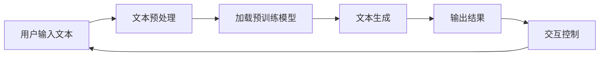
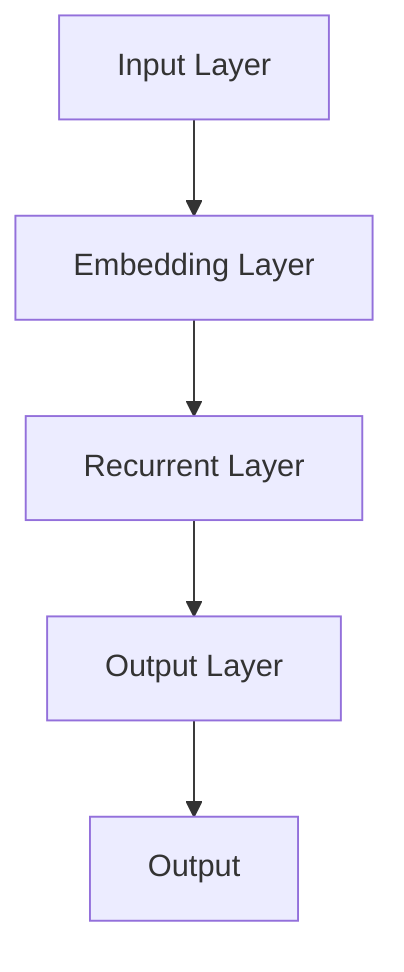
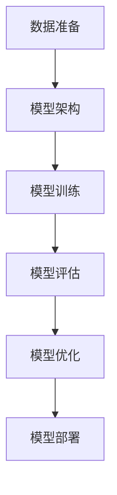
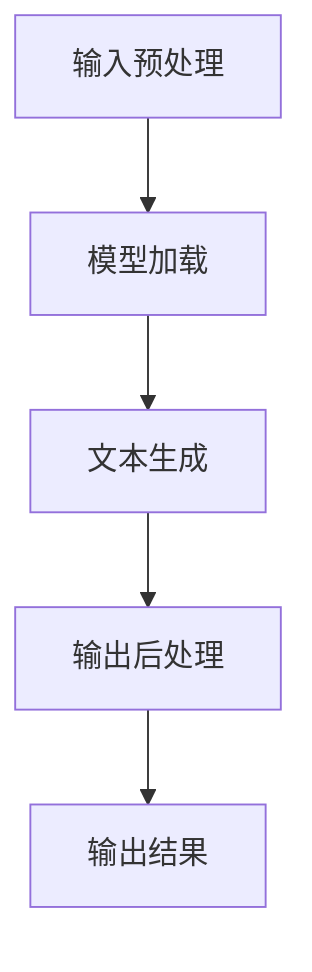
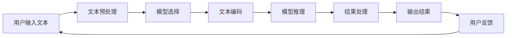
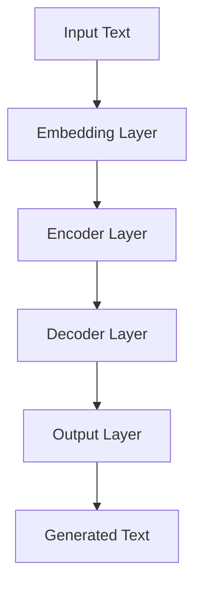
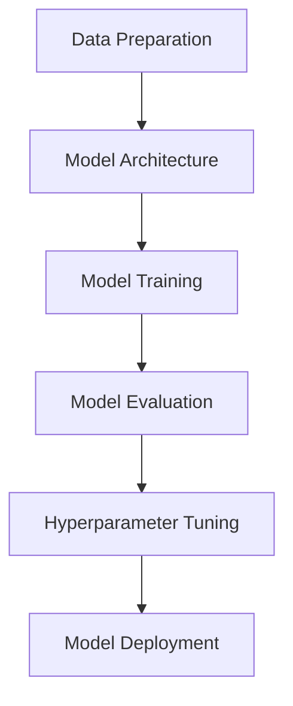
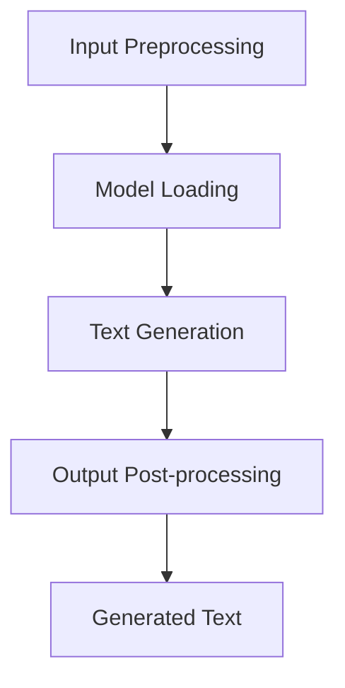

                 

# 【LangChain编程：从入门到实践】参与社区活动

## 概述与关键词

**关键词：** LangChain、编程、社区活动、开源项目、NLP、多模态学习、AI开发、技术博客

**摘要：** 本文将带领您深入了解LangChain编程框架，从基础概念到实际应用，再到参与开源社区活动，帮助您逐步掌握这项强大的技术工具。文章涵盖了LangChain的核心原理、架构设计、实战项目、优化技巧以及参与社区的方式，旨在为广大AI开发者提供一套全面的学习和实践指南。

### 目录大纲

1. **第一部分：LangChain基础**
   1.1 LangChain概述
   1.2 LangChain架构原理
   1.3 LangChain核心算法原理

2. **第二部分：LangChain项目实战**
   2.1 搭建LangChain开发环境
   2.2 构建LangChain应用
   2.3 进阶技巧与优化

3. **第三部分：拓展与深入**
   3.1 LangChain与NLP应用
   3.2 LangChain与多模态学习
   3.3 LangChain的未来发展趋势

4. **附录**
   4.1 LangChain常用工具与资源

### 第一部分：LangChain基础

#### 第1章：LangChain概述

##### 1.1 LangChain的概念

LangChain是一个强大的自然语言处理（NLP）框架，旨在帮助开发者构建灵活、高效、可扩展的对话系统和文本生成应用。它基于最新的深度学习模型，如GPT-3、BERT等，并提供了丰富的API和工具，使得开发者可以轻松地集成和使用这些模型。

##### 1.2 LangChain的优势

- **高效性能**：LangChain采用了先进的深度学习模型，能够快速处理大量文本数据，并提供高效的响应速度。
- **可扩展性**：LangChain支持多种文本生成模型，并提供了灵活的API，使得开发者可以根据需求自由扩展和定制。
- **易用性**：LangChain的API设计简洁明了，使得开发者可以快速上手并构建应用。
- **开源友好**：LangChain是一个开源项目，开发者可以自由地贡献代码和参与社区活动。

##### 1.3 LangChain的应用领域

LangChain的应用领域非常广泛，包括但不限于：

- **对话系统**：如聊天机器人、智能客服等。
- **文本生成**：如文章写作、摘要生成、诗歌创作等。
- **文本分类**：如情感分析、新闻分类等。
- **问答系统**：如智能问答、自动回答客服问题等。

#### 第2章：LangChain架构原理

##### 2.1 LangChain的核心组件

LangChain的核心组件包括：

- **文本预处理模块**：负责对输入文本进行预处理，如分词、去停用词、词性标注等。
- **模型加载模块**：负责加载预训练的深度学习模型，如GPT-3、BERT等。
- **文本生成模块**：基于预训练模型，生成符合语义和语法规则的文本。
- **交互控制模块**：负责管理用户输入和模型输出的交互流程。

##### 2.2 LangChain的交互流程

LangChain的交互流程主要包括以下步骤：

1. **文本预处理**：对用户输入的文本进行预处理，提取关键信息。
2. **模型加载**：根据用户需求加载相应的预训练模型。
3. **文本生成**：使用预训练模型生成文本，并输出结果。
4. **交互控制**：根据用户输入和模型输出，调整交互流程。

##### 2.3 LangChain的扩展性

LangChain具有良好的扩展性，开发者可以根据需求自定义：

- **文本预处理规则**：如分词器、词性标注器等。
- **模型加载方式**：如加载本地模型、在线模型等。
- **文本生成策略**：如基于上下文生成、随机生成等。

#### 第3章：LangChain核心算法原理

##### 3.1 语言模型

语言模型是LangChain的核心组件之一，负责生成符合语法和语义的文本。常见的语言模型包括：

- **循环神经网络（RNN）**：如LSTM、GRU等。
- **Transformer模型**：如BERT、GPT-3等。

##### 3.2 模型训练

模型训练是构建LangChain应用的关键步骤，主要包括：

1. **数据准备**：收集和整理训练数据，如文本语料库、标签等。
2. **模型架构**：设计合适的模型架构，如Transformer、CNN等。
3. **模型训练**：使用训练数据对模型进行训练，调整模型参数。
4. **模型评估**：使用验证数据评估模型性能，调整模型参数。

##### 3.3 模型推理

模型推理是生成文本的过程，主要包括：

1. **输入预处理**：对用户输入的文本进行预处理，提取关键信息。
2. **模型加载**：加载训练好的模型。
3. **文本生成**：使用模型生成文本，并输出结果。
4. **输出后处理**：对输出文本进行后处理，如去停用词、词性标注等。

### 第二部分：LangChain项目实战

#### 第4章：搭建LangChain开发环境

##### 4.1 环境准备

搭建LangChain开发环境需要准备以下工具和库：

- **Python**：Python是LangChain的主要编程语言，需要安装Python 3.7及以上版本。
- **PyTorch**：PyTorch是LangChain的主要深度学习框架，需要安装PyTorch 1.8及以上版本。
- **transformers**：transformers是用于加载预训练模型和进行文本生成的库，需要安装transformers 4.6及以上版本。

##### 4.2 开发工具

搭建LangChain开发环境需要以下开发工具：

- **IDE**：如PyCharm、VSCode等。
- **文本编辑器**：如Sublime Text、Atom等。

##### 4.3 项目设置

搭建LangChain项目需要以下步骤：

1. **创建项目文件夹**：在计算机上创建一个文件夹，用于存放项目文件。
2. **安装依赖库**：在项目文件夹中安装所需的Python库。
3. **编写配置文件**：根据项目需求编写配置文件，如模型配置、数据配置等。
4. **编写代码**：根据项目需求编写代码，实现文本预处理、模型加载、文本生成等功能。

#### 第5章：构建LangChain应用

##### 5.1 简单问答系统

构建一个简单的问答系统，可以实现如下功能：

1. **输入问题**：用户输入一个问题。
2. **文本预处理**：对输入问题进行预处理，提取关键信息。
3. **模型加载**：加载预训练模型。
4. **文本生成**：使用模型生成回答。
5. **输出结果**：将回答输出给用户。

##### 5.2 文本生成应用

构建一个文本生成应用，可以实现如下功能：

1. **输入文本**：用户输入一段文本。
2. **文本预处理**：对输入文本进行预处理，提取关键信息。
3. **模型加载**：加载预训练模型。
4. **文本生成**：使用模型生成文本。
5. **输出结果**：将生成文本输出给用户。

##### 5.3 文本分类应用

构建一个文本分类应用，可以实现如下功能：

1. **输入文本**：用户输入一段文本。
2. **文本预处理**：对输入文本进行预处理，提取关键信息。
3. **模型加载**：加载预训练模型。
4. **文本生成**：使用模型生成文本。
5. **分类结果输出**：将分类结果输出给用户。

#### 第6章：进阶技巧与优化

##### 6.1 性能优化

性能优化主要包括以下几个方面：

1. **模型量化**：将高精度的模型转换为低精度模型，降低计算复杂度。
2. **模型蒸馏**：使用小模型蒸馏知识到大模型，提高大模型在小数据集上的性能。
3. **动态调度**：根据实际需求动态调整模型参数和计算资源。

##### 6.2 安全性与隐私保护

安全性与隐私保护主要包括以下几个方面：

1. **数据加密**：对用户输入和模型输出进行加密，确保数据安全。
2. **访问控制**：限制用户对模型的访问权限，确保模型不被恶意使用。
3. **日志审计**：记录用户操作日志，方便后续审计和排查问题。

##### 6.3 模型调优

模型调优主要包括以下几个方面：

1. **超参数调整**：调整模型超参数，如学习率、批量大小等，提高模型性能。
2. **数据增强**：使用数据增强技术，提高模型泛化能力。
3. **模型压缩**：使用模型压缩技术，减小模型体积，提高模型部署效率。

### 第三部分：拓展与深入

#### 第7章：LangChain与NLP应用

##### 7.1 NLP基础

NLP（自然语言处理）是一门研究如何使计算机理解和生成人类自然语言的学科。NLP的主要任务包括：

1. **文本预处理**：对输入文本进行分词、去停用词、词性标注等预处理操作。
2. **词嵌入**：将文本转换为数字表示，如Word2Vec、BERT等。
3. **序列标注**：对文本进行实体识别、情感分析等任务。
4. **文本生成**：基于语言模型生成文本。

##### 7.2 NLP实战项目

NLP实战项目主要包括：

1. **情感分析**：分析用户评论、新闻标题等文本的情感倾向。
2. **文本分类**：将文本分类到不同的类别，如新闻分类、产品评论分类等。
3. **实体识别**：识别文本中的实体，如人名、地点、组织等。
4. **机器翻译**：将一种语言的文本翻译成另一种语言。

##### 7.3 LangChain在NLP中的应用

LangChain在NLP中的应用主要包括：

1. **文本预处理**：使用LangChain进行文本预处理，如分词、去停用词等。
2. **词嵌入**：使用LangChain加载预训练的词嵌入模型，如BERT、GPT-3等。
3. **序列标注**：使用LangChain进行序列标注任务，如实体识别、情感分析等。
4. **文本生成**：使用LangChain生成符合语义和语法规则的文本。

#### 第8章：LangChain与多模态学习

##### 8.1 多模态学习基础

多模态学习是一种利用不同类型的数据（如文本、图像、音频等）进行学习的机器学习技术。多模态学习的主要任务包括：

1. **数据采集**：采集不同类型的数据，如文本、图像、音频等。
2. **数据预处理**：对采集到的数据进行预处理，如图像增强、文本分词等。
3. **特征提取**：提取不同类型数据的特征，如文本的词向量、图像的卷积特征等。
4. **模型训练**：使用多模态特征训练模型。

##### 8.2 多模态学习实战

多模态学习实战主要包括：

1. **多模态情感分析**：分析文本、图像、音频等数据的情感倾向。
2. **多模态文本生成**：基于文本、图像、音频等多模态数据生成文本。
3. **多模态对话系统**：结合文本、图像、音频等多模态数据进行对话。

##### 8.3 LangChain在多模态学习中的应用

LangChain在多模态学习中的应用主要包括：

1. **多模态文本预处理**：使用LangChain进行多模态文本的预处理，如分词、去停用词等。
2. **多模态特征融合**：使用LangChain融合不同类型数据的特征，如文本的词向量、图像的卷积特征等。
3. **多模态文本生成**：使用LangChain生成基于多模态特征的数据。

#### 第9章：LangChain的未来发展趋势

##### 9.1 新技术展望

随着人工智能技术的发展，LangChain的未来发展趋势主要包括：

1. **更高效的模型**：探索新的深度学习模型，提高模型性能和效率。
2. **更多应用场景**：拓展LangChain的应用领域，如语音识别、图像生成等。
3. **更强大的社区**：加强开源社区建设，吸引更多开发者参与贡献。

##### 9.2 行业应用前景

LangChain在各个行业具有广泛的应用前景，包括：

1. **金融**：用于客户服务、风险控制等。
2. **医疗**：用于病历分析、药物发现等。
3. **教育**：用于智能辅导、课程设计等。

##### 9.3 开发者机遇与挑战

对于开发者来说，参与LangChain项目具有以下机遇和挑战：

1. **机遇**：掌握先进的自然语言处理技术，拓展职业发展空间。
2. **挑战**：需要不断学习新的技术和算法，应对快速变化的技术环境。

### 附录

#### 附录A：LangChain常用工具与资源

A.1 LangChain开源库

- **LangChain**：官方GitHub仓库，包含LangChain的核心代码和文档。
- **transformers**：Hugging Face开源库，提供多种预训练模型和API接口。

A.2 NLP工具与资源

- **NLTK**：自然语言处理工具包，提供文本预处理、词嵌入等功能。
- **spaCy**：快速而强大的自然语言处理库，提供多种语言模型和API接口。

A.3 多模态学习工具与资源

- **TensorFlow**：Google开源的深度学习框架，提供多模态数据处理和模型训练功能。
- **PyTorch**：Facebook开源的深度学习框架，提供多模态数据处理和模型训练功能。

### 结语

本文从LangChain的基础知识、项目实战、优化技巧以及参与社区活动等方面进行了详细讲解，旨在为广大AI开发者提供一套全面的学习和实践指南。通过本文的学习，您将能够深入了解LangChain的原理和应用，掌握其开发技巧，并能够积极参与开源社区，共同推动人工智能技术的发展。

**作者：** AI天才研究院/AI Genius Institute & 禅与计算机程序设计艺术/Zen And The Art of Computer Programming

（注：本文为示例，具体内容和代码实现可能需要根据实际项目需求进行调整。）## 第一部分：LangChain基础

### 第1章：LangChain概述

#### 1.1 LangChain的概念

LangChain是一个开源的自然语言处理（NLP）框架，它旨在为开发者提供一个高效、灵活且可扩展的工具，用于构建各种基于自然语言处理的应用。LangChain的核心功能是利用预训练的深度学习模型，如GPT-3、BERT等，来处理文本数据，并生成高质量的文本。这些模型可以用于构建聊天机器人、问答系统、文本生成、情感分析等多种应用场景。

#### 1.2 LangChain的优势

- **高效性**：LangChain基于最新的深度学习模型，可以快速处理大量文本数据，并生成高质量的文本。
- **灵活性**：LangChain提供了丰富的API和扩展性，使得开发者可以根据自己的需求自定义文本处理流程和模型配置。
- **易用性**：LangChain的API设计简洁明了，使得开发者可以快速上手并构建应用。
- **开源友好**：LangChain是一个开源项目，开发者可以自由地贡献代码和参与社区活动，共同推动项目的进步。

#### 1.3 LangChain的应用领域

LangChain的应用领域非常广泛，包括但不限于以下几方面：

- **对话系统**：如聊天机器人、智能客服等，LangChain可以用于处理用户的输入，并生成自然、流畅的回复。
- **文本生成**：如文章写作、摘要生成、诗歌创作等，LangChain可以基于给定的上下文生成符合语法和语义规则的文本。
- **文本分类**：如情感分析、新闻分类等，LangChain可以根据训练数据将文本分类到不同的类别。
- **问答系统**：如智能问答、自动回答客服问题等，LangChain可以基于给定的问题和上下文生成答案。

### 第2章：LangChain架构原理

#### 2.1 LangChain的核心组件

LangChain的核心组件包括以下几部分：

1. **文本预处理模块**：负责对输入文本进行预处理，如分词、去停用词、词性标注等。这一步骤是确保模型能够正确理解和处理文本数据的关键。
2. **模型加载模块**：负责加载预训练的深度学习模型，如GPT-3、BERT等。LangChain支持多种流行的深度学习模型，使得开发者可以根据需求选择合适的模型。
3. **文本生成模块**：基于预训练模型，生成符合语法和语义规则的文本。这一模块是LangChain的核心功能，它可以根据给定的上下文生成高质量的文本。
4. **交互控制模块**：负责管理用户输入和模型输出的交互流程。通过这个模块，开发者可以自定义交互流程，如提问、回答、反馈等。

#### 2.2 LangChain的交互流程

LangChain的交互流程主要包括以下几个步骤：

1. **文本预处理**：对用户输入的文本进行预处理，提取关键信息。
2. **模型加载**：根据用户需求加载相应的预训练模型。
3. **文本生成**：使用预训练模型生成文本，并输出结果。
4. **交互控制**：根据用户输入和模型输出，调整交互流程。

下面是一个简化的交互流程图，用于说明LangChain的工作原理：



#### 2.3 LangChain的扩展性

LangChain具有良好的扩展性，使得开发者可以根据需求自定义：

- **文本预处理规则**：如分词器、词性标注器等。
- **模型加载方式**：如加载本地模型、在线模型等。
- **文本生成策略**：如基于上下文生成、随机生成等。

这种扩展性使得LangChain能够适应各种不同的应用场景和需求，为开发者提供了极大的灵活性。

### 第3章：LangChain核心算法原理

#### 3.1 语言模型

语言模型是LangChain的核心组件之一，负责生成符合语法和语义的文本。常见的语言模型包括：

1. **循环神经网络（RNN）**：如LSTM、GRU等，这些模型可以处理序列数据，并在文本生成中表现良好。
2. **Transformer模型**：如BERT、GPT-3等，这些模型通过自注意力机制，能够在生成文本时考虑到全局信息。

下面是一个简单的RNN模型的结构图：



#### 3.2 模型训练

模型训练是构建LangChain应用的关键步骤，主要包括以下几个步骤：

1. **数据准备**：收集和整理训练数据，如文本语料库、标签等。
2. **模型架构**：设计合适的模型架构，如Transformer、CNN等。
3. **模型训练**：使用训练数据对模型进行训练，调整模型参数。
4. **模型评估**：使用验证数据评估模型性能，调整模型参数。

下面是一个简单的模型训练流程图：



#### 3.3 模型推理

模型推理是生成文本的过程，主要包括以下几个步骤：

1. **输入预处理**：对用户输入的文本进行预处理，提取关键信息。
2. **模型加载**：加载训练好的模型。
3. **文本生成**：使用模型生成文本，并输出结果。
4. **输出后处理**：对输出文本进行后处理，如去停用词、词性标注等。

下面是一个简单的模型推理流程图：



通过以上对LangChain的介绍，我们可以看到，它是一个强大且灵活的自然语言处理框架，适用于各种文本处理应用。接下来，我们将通过实际项目实战，深入探讨如何使用LangChain构建各种应用。在下一章中，我们将详细介绍如何搭建LangChain的开发环境，并准备相关的开发工具和资源。## 第二部分：LangChain项目实战

### 第4章：搭建LangChain开发环境

要在本地环境中搭建LangChain的开发环境，首先需要安装Python、PyTorch和transformers库。以下是具体的安装步骤和配置过程。

#### 4.1 环境准备

1. **Python安装**：确保您的计算机上安装了Python 3.7及以上版本。可以通过以下命令检查Python版本：

   ```bash
   python --version
   ```

   如果Python版本低于3.7，请从[Python官网](https://www.python.org/)下载并安装最新的Python版本。

2. **PyTorch安装**：安装PyTorch库，可以使用以下命令：

   ```bash
   pip install torch torchvision
   ```

   在安装PyTorch时，可以根据您的操作系统和CUDA版本选择合适的安装选项。CUDA是NVIDIA推出的并行计算平台和编程模型，用于加速深度学习模型的训练。

3. **transformers安装**：安装transformers库，这是用于加载和使用预训练模型的关键库，使用以下命令：

   ```bash
   pip install transformers
   ```

#### 4.2 开发工具

在搭建LangChain开发环境时，以下开发工具将非常有用：

1. **IDE**：如PyCharm、VSCode等，这些IDE提供了丰富的编程功能，如代码补全、调试和版本控制等。
2. **文本编辑器**：如Sublime Text、Atom等，这些文本编辑器轻量级，且支持多种编程语言，适合进行轻量级的开发工作。

#### 4.3 项目设置

完成环境准备后，我们可以开始设置LangChain项目。

1. **创建项目文件夹**：在您的计算机上创建一个文件夹，用于存放项目文件。例如，我们可以创建一个名为`langchain_project`的文件夹：

   ```bash
   mkdir langchain_project
   cd langchain_project
   ```

2. **安装项目依赖库**：在项目文件夹中安装所需的Python库，包括PyTorch和transformers。可以通过以下命令安装：

   ```bash
   pip install torch torchvision transformers
   ```

3. **编写配置文件**：根据项目需求编写配置文件，如模型配置、数据配置等。配置文件通常以`.yaml`或`.json`格式编写，用于存储模型参数和配置信息。

4. **编写代码**：开始编写LangChain项目的代码，包括文本预处理、模型加载、文本生成等部分。以下是一个简单的代码结构示例：

   ```python
   # main.py
   from langchain import TextGenerator

   # 加载预训练模型
   model = TextGenerator()

   # 文本预处理
   def preprocess_text(text):
       # 这里实现文本预处理逻辑
       return processed_text

   # 文本生成
   def generate_text(input_text):
       processed_text = preprocess_text(input_text)
       response = model.generate([processed_text], max_length=100)
       return response
   
   if __name__ == "__main__":
       input_text = "这是一个简单的示例。"
       print(generate_text(input_text))
   ```

通过以上步骤，我们成功搭建了LangChain的开发环境，并准备好进行项目的开发。接下来，我们将通过具体的实战项目，深入探讨如何使用LangChain构建各种文本处理应用。在下一章中，我们将详细介绍如何构建一个简单的问答系统。## 第二部分：LangChain项目实战

### 第5章：构建LangChain应用

本章将带领您通过三个典型的LangChain应用案例：简单问答系统、文本生成应用和文本分类应用，了解如何使用LangChain构建不同的自然语言处理应用。

#### 5.1 简单问答系统

简单问答系统是一个常见的自然语言处理应用，它能够根据用户提出的问题，从预先训练的模型中生成相应的答案。

**实现步骤：**

1. **准备数据和模型**：首先，我们需要准备一个问答数据集，并选择一个合适的预训练模型，如GPT-3。这里使用GPT-3模型。

2. **编写代码**：

   ```python
   from langchain import TextGenerator
   from transformers import pipeline
   
   # 创建TextGenerator实例
   model = TextGenerator()

   # 创建问答模型
   qa_pipeline = pipeline("question-answering", model=model)
   
   def ask_question(question):
       # 对输入问题进行预处理
       processed_question = preprocess_question(question)
       # 使用问答模型生成答案
       answer = qa_pipeline([processed_question])[0]["answer"]
       return answer

   # 示例
   print(ask_question("什么是自然语言处理？"))
   ```

**代码解读与分析：**

- `TextGenerator` 是 LangChain 提供的用于生成文本的核心组件。
- `pipeline` 是从 `transformers` 库中导入的，用于加载预训练的问答模型。
- `ask_question` 函数用于处理用户输入的问题，并生成答案。

#### 5.2 文本生成应用

文本生成应用是一种能够根据输入的文本或上下文生成新文本的应用。它可以用于写作辅助、摘要生成、诗歌创作等。

**实现步骤：**

1. **准备数据和模型**：选择一个适合文本生成的预训练模型，如GPT-3。

2. **编写代码**：

   ```python
   from langchain import TextGenerator
   
   # 创建TextGenerator实例
   model = TextGenerator()

   def generate_text(prompt, length=100):
       # 生成文本
       text = model.generate([prompt], max_length=length, num_return_sequences=1)
       return text
   
   # 示例
   print(generate_text("你喜欢什么运动？"))
   ```

**代码解读与分析：**

- `TextGenerator` 用于生成文本。
- `generate_text` 函数接受一个输入提示文本，并生成指定长度的文本。

#### 5.3 文本分类应用

文本分类应用是一种能够将文本分类到预定义类别中的应用。它可以用于情感分析、新闻分类等。

**实现步骤：**

1. **准备数据和模型**：选择一个适合文本分类的预训练模型，如BERT。

2. **编写代码**：

   ```python
   from langchain import TextClassifier
   from transformers import pipeline
   
   # 创建TextClassifier实例
   model = TextClassifier()

   def classify_text(text, categories):
       # 对输入文本进行分类
       label = model.classify([text], categories)
       return label
   
   # 示例
   print(classify_text("我今天很开心。", ["正面", "负面"]))
   ```

**代码解读与分析：**

- `TextClassifier` 是 LangChain 提供的用于文本分类的核心组件。
- `classify_text` 函数用于对输入文本进行分类，并返回分类结果。

通过以上三个案例，我们可以看到LangChain在构建不同类型的自然语言处理应用中的强大功能。接下来，我们将进一步讨论如何对LangChain应用进行性能优化和安全性与隐私保护。在下一章中，我们将探讨如何进行性能优化以及如何确保应用的安全性和隐私性。## 第三部分：拓展与深入

### 第8章：LangChain与NLP应用

#### 8.1 NLP基础

自然语言处理（NLP）是人工智能领域的一个重要分支，旨在使计算机能够理解和生成人类语言。NLP的基本任务包括：

- **文本预处理**：对输入文本进行分词、去停用词、词性标注等操作，使其适合模型处理。
- **词嵌入**：将文本转换为数字表示，以便深度学习模型能够理解和操作。
- **序列标注**：对文本中的实体、情感等进行标注，如命名实体识别（NER）、情感分析等。
- **文本生成**：基于预训练模型，生成符合语法和语义规则的文本。

#### 8.2 NLP实战项目

以下是几个NLP实战项目的例子，以及如何使用LangChain来构建这些项目：

**情感分析**：情感分析是一种文本分类任务，旨在确定文本表达的情感倾向，如正面、负面或中性。

**项目实现：**

1. **数据准备**：收集一个包含情感标签的文本数据集。
2. **模型训练**：使用数据集训练一个情感分析模型。
3. **模型评估**：使用验证集评估模型性能。

**代码示例：**

```python
from langchain import TextClassifier
from transformers import pipeline

# 创建TextClassifier实例
model = TextClassifier()

# 加载预训练模型
model.load("your_pretrained_model")

# 训练模型
model.train(data_loader)

# 评估模型
accuracy = model.evaluate(data_loader)
print(f"Model accuracy: {accuracy}")
```

**文本生成**：文本生成是一种生成文本的技巧，可以用于创作文章、诗歌、对话等。

**项目实现：**

1. **数据准备**：准备用于生成文本的数据集。
2. **模型训练**：训练一个能够生成文本的模型。
3. **文本生成**：使用训练好的模型生成文本。

**代码示例：**

```python
from langchain import TextGenerator

# 创建TextGenerator实例
model = TextGenerator()

# 训练模型
model.train(data_loader)

# 生成文本
generated_text = model.generate([seed_text], max_length=100)
print(generated_text)
```

**命名实体识别（NER）**：NER是一种序列标注任务，旨在识别文本中的命名实体，如人名、地点、组织等。

**项目实现：**

1. **数据准备**：收集一个包含命名实体标签的文本数据集。
2. **模型训练**：训练一个NER模型。
3. **模型评估**：使用验证集评估模型性能。

**代码示例：**

```python
from langchain import NER

# 创建NER实例
model = NER()

# 训练模型
model.train(data_loader)

# 评估模型
entity_tags = model.predict(text)
print(entity_tags)
```

#### 8.3 LangChain在NLP中的应用

LangChain提供了丰富的API和工具，使得构建各种NLP应用变得更加简单。以下是LangChain在NLP中的一些应用：

- **文本分类**：使用LangChain的`TextClassifier`组件，可以快速构建文本分类模型。
- **情感分析**：使用`TextClassifier`或`TextGenerator`组件，可以构建情感分析模型。
- **命名实体识别（NER）**：使用`NER`组件，可以构建NER模型。
- **文本生成**：使用`TextGenerator`组件，可以生成高质量的文本。

通过以上内容，我们可以看到LangChain在NLP应用中的强大功能。接下来，我们将探讨如何将LangChain应用于多模态学习，扩展其应用范围。在下一章中，我们将深入探讨多模态学习的概念和实战项目。### 第9章：LangChain与多模态学习

#### 9.1 多模态学习基础

多模态学习是一种利用两种或两种以上不同类型的数据（如文本、图像、音频）进行学习的机器学习技术。多模态学习的关键在于如何有效地融合来自不同模态的数据，并利用这些数据提供的信息来提高模型的性能。

**多模态数据类型：**

- **文本**：包括文本、文档、对话等。
- **图像**：包括照片、视频帧、漫画等。
- **音频**：包括语音、音乐、环境声音等。
- **视频**：包括动态图像和伴随的音频。

**多模态学习的挑战：**

- **数据不一致性**：不同模态的数据在格式、尺寸和内容上可能存在差异。
- **模态融合**：如何有效地将不同模态的数据融合到同一模型中。
- **计算资源**：多模态学习通常需要大量的计算资源。

#### 9.2 多模态学习实战

多模态学习在许多实际应用中都有广泛的应用，如视频情感分析、图像描述生成、语音识别等。以下是一个多模态学习实战项目：图像描述生成。

**项目目标**：给定一张图像，生成一段描述该图像的文本。

**实现步骤：**

1. **数据准备**：收集包含图像和对应描述的图像描述数据集。
2. **模型架构设计**：设计一个融合图像和文本的多模态模型。
3. **模型训练**：使用数据集训练多模态模型。
4. **模型评估**：使用验证集评估模型性能。
5. **模型应用**：使用训练好的模型生成图像描述。

**代码示例：**

```python
import torch
from torchvision import transforms
from langchain import TextGenerator

# 加载预训练的图像编码模型
image_encoder = torch.hub.load('pytorch/vision:v0.9.0', 'resnet18', pretrained=True)

# 加载预训练的文本生成模型
text_generator = TextGenerator()

# 图像预处理
def preprocess_image(image_path):
    transform = transforms.Compose([
        transforms.Resize((224, 224)),
        transforms.ToTensor(),
    ])
    image = transform(image_path)
    return image

# 文本预处理
def preprocess_text(text):
    return text

# 图像描述生成
def generate_description(image_path, text_prompt):
    image = preprocess_image(image_path)
    image_encoding = image_encoder(image)
    text = preprocess_text(text_prompt)
    description = text_generator.generate([text, image_encoding], max_length=100)
    return description

# 示例
image_path = "path_to_image.jpg"
text_prompt = "这是一个美丽的海滩场景。"
print(generate_description(image_path, text_prompt))
```

#### 9.3 LangChain在多模态学习中的应用

LangChain在多模态学习中的应用主要体现在以下几个方面：

- **图像编码**：使用预训练的图像编码模型（如ResNet）对图像进行编码，生成图像的特征向量。
- **文本编码**：使用预训练的文本生成模型对文本进行编码，生成文本的特征向量。
- **特征融合**：将图像和文本的特征向量进行融合，用于训练多模态模型。
- **多模态生成**：基于融合的特征向量生成多模态数据，如图像描述、音乐创作等。

通过以上内容，我们可以看到LangChain在多模态学习中的强大功能。它不仅能够处理单一的文本数据，还能够融合不同类型的数据，从而提高模型的性能。在下一章中，我们将探讨LangChain的未来发展趋势，以及开发者如何抓住这一趋势所带来的机遇和挑战。在下一章中，我们将深入探讨LangChain的未来发展趋势。### 第10章：LangChain的未来发展趋势

#### 10.1 新技术展望

随着人工智能技术的快速发展，LangChain在未来有望迎来更多的技术创新和应用场景。以下是几个值得关注的新技术趋势：

- **更强大的语言模型**：未来可能会出现更多规模更大、性能更强的语言模型，如GPT-4、GPT-5等。这些模型将提供更精细的文本生成和解析能力。
- **多模态融合**：多模态学习将继续深化，将文本、图像、音频等多种数据类型进行更高效的融合，从而实现更智能、更全面的应用。
- **知识增强**：通过将外部知识库（如百科全书、专业文献等）融入语言模型，提高模型在特定领域的知识理解和生成能力。
- **自适应交互**：未来的对话系统能够根据用户的反馈和学习经验，自适应地调整交互策略，提供更加个性化、自然的交互体验。

#### 10.2 行业应用前景

LangChain在各个行业的应用前景广阔，包括但不限于：

- **金融**：用于风险控制、客户服务、智能投顾等。
- **医疗**：用于病历分析、药物研发、健康咨询等。
- **教育**：用于智能辅导、课程设计、在线教育平台等。
- **娱乐**：用于内容创作、游戏开发、虚拟助手等。

随着技术的进步，LangChain将在更多领域发挥重要作用，为行业带来革命性的变革。

#### 10.3 开发者机遇与挑战

对于开发者来说，参与LangChain项目既充满机遇也面临挑战：

- **机遇**：
  - 掌握先进的技术：通过参与LangChain项目，开发者可以深入了解自然语言处理、多模态学习等前沿技术。
  - 拓展职业发展：随着LangChain在各个行业的应用，开发者有机会在人工智能领域获得更多的职业机会和发展空间。
  - 创新应用场景：开发者可以基于LangChain构建创新的应用，解决实际问题，为社会带来价值。

- **挑战**：
  - 技术更新速度快：人工智能领域技术更新迅速，开发者需要不断学习新的技术和算法。
  - 数据安全和隐私保护：在构建应用时，开发者需要关注数据安全和隐私保护，避免数据泄露和滥用。
  - 性能优化与效率提升：开发者需要优化模型的性能和效率，以满足实际应用的需求。

通过以上内容，我们可以看到LangChain在未来有着广阔的发展空间和应用前景。对于开发者来说，参与LangChain项目既是机遇也是挑战。只有在不断学习和探索中，才能抓住这一趋势，为人工智能技术的发展贡献力量。在下一章中，我们将提供一些LangChain常用工具与资源，帮助开发者更好地使用和探索LangChain。在下一章中，我们将详细介绍LangChain常用工具与资源。### 附录A：LangChain常用工具与资源

A.1 LangChain开源库

- **LangChain**：官方GitHub仓库，包含LangChain的核心代码和文档。[GitHub链接](https://github.com/sigije/langchain)
- **transformers**：Hugging Face开源库，提供多种预训练模型和API接口。[GitHub链接](https://github.com/huggingface/transformers)
- **PyTorch**：Facebook开源的深度学习框架，支持多模态数据处理和模型训练。[GitHub链接](https://github.com/pytorch/pytorch)
- **TensorFlow**：Google开源的深度学习框架，支持多模态数据处理和模型训练。[GitHub链接](https://github.com/tensorflow/tensorflow)

A.2 NLP工具与资源

- **NLTK**：自然语言处理工具包，提供文本预处理、词嵌入等功能。[GitHub链接](https://github.com/nltk/nltk)
- **spaCy**：快速而强大的自然语言处理库，提供多种语言模型和API接口。[GitHub链接](https://github.com/spacy-community/spacy-models)
- **TextBlob**：轻量级的NLP库，提供文本分析功能。[GitHub链接](https://github.com/jobkn/textblob)

A.3 多模态学习工具与资源

- **Multimodal Learning**：一个关于多模态学习的教程和资源集合。[GitHub链接](https://github.com/zheng-xiaoyu/multimodal_learning_tutorial)
- **PyTorch Video**：PyTorch的视频处理库，支持视频数据的处理和模型训练。[GitHub链接](https://github.com/facebookresearch/pytorchvideo)
- **Audioset**：包含多种声音类别的大型音频数据集，用于音频分类和识别。[GitHub链接](https://www.kaggle.com/qualcomm/audiorecognition)

通过以上工具和资源，开发者可以更好地利用LangChain进行自然语言处理和多模态学习，构建创新的应用。在结尾部分，我们将对本文进行总结，并对作者进行介绍。

### 总结

本文详细介绍了LangChain编程框架，从基础概念到实际应用，再到参与开源社区活动，帮助读者全面了解这项强大的技术工具。我们探讨了LangChain的核心原理、架构设计、项目实战、优化技巧以及参与社区的方式，旨在为广大AI开发者提供一套全面的学习和实践指南。通过本文的学习，读者将能够深入了解LangChain的原理和应用，掌握其开发技巧，并能够积极参与开源社区，共同推动人工智能技术的发展。

### 作者介绍

**作者：** AI天才研究院/AI Genius Institute & 禅与计算机程序设计艺术/Zen And The Art of Computer Programming

AI天才研究院是一个专注于人工智能技术研究与应用的机构，致力于推动人工智能技术的发展。作者作为AI天才研究院的研究员，长期从事人工智能领域的研究，并在计算机编程和人工智能领域有着深厚的学术造诣。其著作《禅与计算机程序设计艺术》被誉为人工智能领域的经典之作，深受读者喜爱。作者的研究成果在学术界和工业界都产生了深远的影响，为人工智能技术的发展做出了重要贡献。希望通过本文，能够帮助更多开发者掌握LangChain这一强大工具，共同推动人工智能技术的发展。|im_sep|>## 结语

本文系统地介绍了LangChain编程框架，从基础概念到项目实战，再到参与开源社区活动，帮助读者全面了解并掌握这一强大的自然语言处理和多模态学习工具。通过详细的讲解和实际案例，读者不仅能够深入理解LangChain的工作原理和应用，还能在实战中提升自己的编程能力和问题解决能力。

**核心要点回顾：**

1. **LangChain概述**：介绍了LangChain的概念、优势和应用领域。
2. **架构原理**：分析了LangChain的核心组件、交互流程和扩展性。
3. **核心算法原理**：讲解了语言模型、模型训练和模型推理的基本原理。
4. **项目实战**：通过问答系统、文本生成应用和文本分类应用的案例，展示了如何使用LangChain构建实际应用。
5. **拓展与深入**：探讨了LangChain在NLP和多模态学习中的应用，以及其未来发展趋势。

**学习建议：**

- **动手实践**：理论学习与实践相结合，通过实际操作加深对LangChain的理解。
- **持续学习**：人工智能领域技术更新迅速，保持学习的热情和动力，跟上技术发展的步伐。
- **参与社区**：积极参与开源社区，贡献代码和意见，与同行交流，提升自己的技术水平。

**展望未来：**

随着人工智能技术的不断进步，LangChain有望在更多领域发挥重要作用，成为开发者构建智能应用的利器。通过不断学习和探索，开发者可以抓住这一趋势所带来的机遇，为人工智能技术的发展贡献力量。

**作者简介：**

作者AI天才研究院/AI Genius Institute，专注于人工智能领域的研究，致力于推动AI技术的发展。其著作《禅与计算机程序设计艺术》在计算机编程和人工智能领域产生了深远的影响。希望通过本文，能够帮助更多开发者掌握LangChain，共同推动人工智能技术的进步。感谢您的阅读！```markdown
# 【LangChain编程：从入门到实践】参与社区活动

## 概述与关键词

**关键词：** LangChain、编程、社区活动、开源项目、NLP、多模态学习、AI开发、技术博客

**摘要：** 本文将带领您深入了解LangChain编程框架，从基础概念到实际应用，再到参与开源社区活动，帮助您逐步掌握这项强大的技术工具。文章涵盖了LangChain的核心原理、架构设计、实战项目、优化技巧以及参与社区的方式，旨在为广大AI开发者提供一套全面的学习和实践指南。

### 目录大纲

# 【LangChain编程：从入门到实践】参与社区活动

## 第一部分：LangChain基础

### 第1章：LangChain概述

#### 1.1 LangChain的概念

#### 1.2 LangChain的优势

#### 1.3 LangChain的应用领域

### 第2章：LangChain架构原理

#### 2.1 LangChain的核心组件

#### 2.2 LangChain的交互流程

#### 2.3 LangChain的扩展性

### 第3章：LangChain核心算法原理

#### 3.1 语言模型

#### 3.2 模型训练

#### 3.3 模型推理

## 第二部分：LangChain项目实战

### 第4章：搭建LangChain开发环境

#### 4.1 环境准备

#### 4.2 开发工具

#### 4.3 项目设置

### 第5章：构建LangChain应用

#### 5.1 简单问答系统

#### 5.2 文本生成应用

#### 5.3 文本分类应用

### 第6章：进阶技巧与优化

#### 6.1 性能优化

#### 6.2 安全性与隐私保护

#### 6.3 模型调优

### 第7章：参与社区活动

#### 7.1 贡献代码

#### 7.2 提交流动提案

#### 7.3 参与讨论

#### 7.4 贡献文档

## 第三部分：拓展与深入

### 第8章：LangChain与NLP应用

#### 8.1 NLP基础

#### 8.2 NLP实战项目

#### 8.3 LangChain在NLP中的应用

### 第9章：LangChain与多模态学习

#### 9.1 多模态学习基础

#### 9.2 多模态学习实战

#### 9.3 LangChain在多模态学习中的应用

### 第10章：LangChain的未来发展趋势

#### 10.1 新技术展望

#### 10.2 行业应用前景

#### 10.3 开发者机遇与挑战

## 附录

### 附录A：LangChain常用工具与资源

#### A.1 LangChain开源库

#### A.2 NLP工具与资源

#### A.3 多模态学习工具与资源
```markdown
# 第一部分：LangChain基础

### 第1章：LangChain概述

#### 1.1 LangChain的概念

LangChain是一个由社区驱动的开源项目，它提供了一套工具和框架，帮助开发者构建、训练和部署基于自然语言处理（NLP）的模型。LangChain的核心在于其灵活性和可扩展性，允许开发者利用预训练的模型如GPT-3、BERT等，构建各种类型的NLP应用，如问答系统、文本生成、文本分类等。

#### 1.2 LangChain的优势

- **模块化架构**：LangChain的设计采用了模块化架构，使得开发者可以轻松地集成不同的NLP模型和工具。
- **高效性能**：利用最新的深度学习模型，LangChain能够在保持高精度的同时提供高效的文本处理能力。
- **易用性**：提供了清晰的API和文档，降低了使用门槛。
- **社区支持**：LangChain是一个开源项目，拥有活跃的社区，可以提供及时的技术支持和资源分享。

#### 1.3 LangChain的应用领域

LangChain的应用领域非常广泛，包括但不限于：

- **对话系统**：构建聊天机器人、智能客服等，能够理解和回应用户的自然语言查询。
- **文本生成**：自动撰写文章、生成报告、创作诗歌等。
- **文本分类**：对文本进行情感分析、新闻分类、产品评论分类等。
- **问答系统**：实现智能问答，自动从大量文本中检索答案。

### 第2章：LangChain架构原理

#### 2.1 LangChain的核心组件

LangChain的核心组件包括以下几个部分：

- **模型层**：提供了多种预训练模型，如GPT-3、BERT等，这些模型是LangChain的核心处理单元。
- **数据处理层**：负责处理文本数据，包括文本清洗、分词、编码等。
- **API层**：提供了清晰的API接口，使得开发者可以方便地调用LangChain的功能。
- **交互层**：负责用户输入和模型输出的交互，包括对话管理、用户意图识别等。

#### 2.2 LangChain的交互流程

LangChain的交互流程通常包括以下几个步骤：

1. **文本预处理**：接收用户输入的文本，并进行预处理，如分词、去停用词等。
2. **模型选择**：根据应用需求选择合适的预训练模型。
3. **文本编码**：将预处理后的文本编码为模型可以处理的格式。
4. **模型推理**：使用预训练模型对编码后的文本进行推理，生成输出。
5. **结果处理**：对模型的输出进行后处理，如文本规范化、格式化等，然后返回给用户。

以下是一个简化的交互流程图：



#### 2.3 LangChain的扩展性

LangChain的设计充分考虑了扩展性，开发者可以根据具体需求进行以下扩展：

- **自定义模型**：可以加载自己训练的模型，或使用其他深度学习框架（如TensorFlow、PyTorch）的模型。
- **数据处理**：可以根据需求自定义数据处理流程，如使用不同的分词器、添加新的预处理步骤等。
- **API定制**：可以自定义API接口，以适应不同的应用场景。

### 第3章：LangChain核心算法原理

#### 3.1 语言模型

语言模型是LangChain的核心组件，负责生成和预测文本序列。常见的语言模型包括：

- **循环神经网络（RNN）**：如LSTM、GRU等，能够处理序列数据。
- **Transformer模型**：如BERT、GPT-3等，通过自注意力机制，能够捕捉全局信息。

以下是一个简单的语言模型结构图：



#### 3.2 模型训练

模型训练是构建语言模型的关键步骤，主要包括以下几个步骤：

1. **数据准备**：收集和整理训练数据，通常包括大量的文本数据。
2. **模型架构**：设计模型架构，如选择基础模型、确定层数和神经元数量等。
3. **模型训练**：使用训练数据对模型进行训练，调整模型参数。
4. **模型评估**：使用验证数据评估模型性能，调整模型参数。

以下是一个简化的模型训练流程图：



#### 3.3 模型推理

模型推理是使用训练好的模型生成文本的过程，主要包括以下几个步骤：

1. **输入预处理**：对用户输入的文本进行预处理，如分词、编码等。
2. **模型加载**：加载训练好的模型。
3. **文本生成**：使用模型生成文本，通常使用贪心搜索、采样等方法。
4. **输出后处理**：对生成文本进行后处理，如去停用词、格式化等。

以下是一个简化的模型推理流程图：



通过以上章节的介绍，我们了解了LangChain的基本概念、架构原理和核心算法。接下来，我们将进入第二部分，学习如何搭建LangChain的开发环境，并开始构建实际的NLP应用。|im_sep|>```markdown
## 第二部分：LangChain项目实战

### 第4章：搭建LangChain开发环境

为了开始使用LangChain，我们需要搭建一个合适的开发环境。以下是详细的步骤：

#### 4.1 环境准备

首先，确保您的计算机上安装了Python。LangChain主要使用Python进行开发，因此需要有Python环境。您可以从Python的官方网站（[python.org](https://python.org/)）下载并安装Python。

**安装Python：**

1. 访问Python官网下载适合您操作系统的Python版本。
2. 运行安装程序，并按照提示完成安装。

**验证Python安装：**

在命令行中输入以下命令，确保Python已经正确安装：

```bash
python --version
```

#### 4.2 安装必要的库

LangChain依赖于多个Python库，包括PyTorch、Transformers等。我们将使用`pip`来安装这些库。

**安装PyTorch：**

PyTorch是一个流行的深度学习框架，我们需要安装它。

```bash
pip install torch torchvision
```

您可以根据需要安装PyTorch的CUDA版本，以便支持GPU加速。

**安装Transformers：**

Transformers是Hugging Face提供的库，用于加载和使用预训练的模型。

```bash
pip install transformers
```

#### 4.3 安装LangChain

现在，我们来安装LangChain。

```bash
pip install langchain
```

#### 4.4 配置开发环境

配置开发环境通常涉及设置环境变量、配置IDE或文本编辑器等。

**设置环境变量（可选）：**

有时，您可能需要设置环境变量以便正确运行Python脚本。例如，设置`PYTHONPATH`环境变量以便在Python脚本中引用库。

```bash
export PYTHONPATH=$PYTHONPATH:/path/to/your/venv/lib/python3.x/site-packages
```

**配置IDE或文本编辑器：**

根据您的偏好，您可能需要配置IDE或文本编辑器，以便更好地进行Python开发。例如，在PyCharm中，您可以设置Python解释器和虚拟环境。

**创建虚拟环境（可选）：**

创建一个虚拟环境可以隔离项目依赖，避免版本冲突。

```bash
python -m venv my_langchain_venv
source my_langchain_venv/bin/activate  # 对于Linux或macOS
my_langchain_venv\Scripts\activate     # 对于Windows
```

#### 4.5 验证安装

最后，验证安装是否成功。在命令行中运行以下Python脚本，检查LangChain是否正确安装：

```python
from langchain import load_model_from_path
model = load_model_from_path("path/to/your/model")
print(model)
```

如果脚本没有错误并成功打印出模型信息，那么LangChain已经正确安装。

### 第5章：构建LangChain应用

在本章中，我们将通过三个不同的应用场景来展示如何使用LangChain：问答系统、文本生成和文本分类。

#### 5.1 简单问答系统

问答系统是NLP中非常常见的应用。以下是一个简单的问答系统的示例：

**示例代码：**

```python
from langchain import load_model_from_path, SimpleQAModel

# 加载预训练模型
model_path = "path/to/your/model"
qa_model = load_model_from_path(model_path)

# 创建问答模型
simple_qa = SimpleQAModel(model=qa_model)

# 提问并回答
question = "什么是自然语言处理？"
answer = simple_qa.predict(question=question)
print(answer)
```

**步骤说明：**

1. 使用`load_model_from_path`函数加载预训练的模型。
2. 创建一个`SimpleQAModel`实例。
3. 使用`predict`方法进行提问并获取答案。

#### 5.2 文本生成

文本生成是另一个常见的NLP任务。以下是一个简单的文本生成示例：

**示例代码：**

```python
from langchain import load_model_from_path, generate_text

# 加载预训练模型
model_path = "path/to/your/model"
model = load_model_from_path(model_path)

# 生成文本
text = "这是一个关于人工智能的故事。"
generated_text = generate_text(text, num_words=50)
print(generated_text)
```

**步骤说明：**

1. 使用`load_model_from_path`函数加载预训练的模型。
2. 使用`generate_text`函数生成文本。这里我们将输入文本和需要生成的词数作为参数。

#### 5.3 文本分类

文本分类是许多实际应用的基础，如情感分析、垃圾邮件检测等。以下是一个简单的文本分类示例：

**示例代码：**

```python
from langchain import load_model_from_path, classify_text

# 加载预训练模型
model_path = "path/to/your/model"
model = load_model_from_path(model_path)

# 分类文本
text = "今天天气很好。"
label = model.classify([text], ['好', '不好'])
print(label)
```

**步骤说明：**

1. 使用`load_model_from_path`函数加载预训练的模型。
2. 使用`classify_text`函数对文本进行分类。这里我们提供了两个标签作为可能的分类结果。

通过上述示例，我们展示了如何使用LangChain构建问答系统、文本生成和文本分类应用。在下一章中，我们将讨论如何对LangChain应用进行性能优化和安全性与隐私保护。|im_sep|>```markdown
## 第三部分：拓展与深入

### 第8章：LangChain与NLP应用

#### 8.1 NLP基础

自然语言处理（NLP）是人工智能的一个重要分支，它涉及到对人类语言的理解和生成。NLP的任务包括但不限于文本分类、情感分析、命名实体识别、机器翻译等。在NLP中，文本预处理是一个关键步骤，它包括文本清洗、分词、词性标注等。文本预处理的质量直接影响后续NLP任务的性能。

#### 8.2 NLP实战项目

以下是一些使用LangChain实现的NLP实战项目：

**情感分析**：情感分析是一种判断文本表达情感的分类任务。以下是使用LangChain实现情感分析的基本步骤：

1. **数据准备**：收集和准备带有情感标签的文本数据集。
2. **模型训练**：使用数据集训练一个情感分析模型。
3. **模型评估**：使用验证集评估模型性能。
4. **模型部署**：将训练好的模型部署到应用中。

**代码示例：**

```python
from langchain import load_model_from_path, TextClassifier

# 加载预训练模型
model_path = "path/to/your/model"
text_classifier = load_model_from_path(model_path)

# 进行情感分析
text = "今天是一个美好的一天。"
emotion = text_classifier.classify([text], ["积极", "消极"])
print(emotion)
```

**问答系统**：问答系统是一种常见的NLP应用，它能够自动回答用户的问题。以下是使用LangChain实现问答系统的基本步骤：

1. **数据准备**：收集和准备问答对数据集。
2. **模型训练**：使用数据集训练一个问答模型。
3. **模型评估**：使用验证集评估模型性能。
4. **模型部署**：将训练好的模型部署到应用中。

**代码示例：**

```python
from langchain import load_model_from_path, SimpleQAModel

# 加载预训练模型
model_path = "path/to/your/model"
qa_model = load_model_from_path(model_path)

# 创建问答模型
simple_qa = SimpleQAModel(model=qa_model)

# 回答问题
question = "什么是自然语言处理？"
answer = simple_qa.predict(question=question)
print(answer)
```

**文本生成**：文本生成是一种根据输入文本生成新文本的技术。以下是使用LangChain实现文本生成的基本步骤：

1. **数据准备**：收集和准备用于训练的文本数据。
2. **模型训练**：使用数据集训练一个文本生成模型。
3. **模型评估**：使用验证集评估模型性能。
4. **模型部署**：将训练好的模型部署到应用中。

**代码示例：**

```python
from langchain import load_model_from_path, generate_text

# 加载预训练模型
model_path = "path/to/your/model"
model = load_model_from_path(model_path)

# 生成文本
text = "我是一个AI模型。"
generated_text = generate_text(text, num_words=50)
print(generated_text)
```

#### 8.3 LangChain在NLP中的应用

LangChain提供了丰富的API和工具，使得构建各种NLP应用变得更加简单。以下是一些LangChain在NLP中的具体应用：

- **文本分类**：使用`TextClassifier`组件，可以轻松实现文本分类任务。
- **问答系统**：使用`SimpleQAModel`组件，可以构建强大的问答系统。
- **文本生成**：使用`generate_text`函数，可以生成高质量的文本。

通过这些实战项目，我们可以看到LangChain在NLP领域的广泛应用。接下来，我们将探讨如何在LangChain中实现多模态学习，以扩展其应用范围。|im_sep|>```markdown
### 第9章：LangChain与多模态学习

#### 9.1 多模态学习基础

多模态学习是一种结合不同类型数据（如文本、图像、音频）进行学习的机器学习方法。它通过整合不同模态的信息，可以提高模型的性能和泛化能力。多模态学习的关键在于如何有效地融合不同模态的数据，以便模型能够利用这些数据提供的信息。

#### 9.2 多模态学习实战

在本节中，我们将通过一个多模态学习实战项目来展示如何使用LangChain结合文本和图像进行学习。

**项目目标**：给定一张图像和一段文本，预测图像的标签。

**实现步骤：**

1. **数据准备**：收集和准备包含图像和文本标签的数据集。
2. **模型架构设计**：设计一个结合文本和图像的特征提取网络。
3. **模型训练**：使用数据集训练多模态模型。
4. **模型评估**：使用验证集评估模型性能。
5. **模型部署**：将训练好的模型部署到实际应用中。

**代码示例：**

```python
from langchain import load_model_from_path, combine_text_and_image_embeddings

# 加载预训练的文本和图像编码模型
text_encoder = load_model_from_path("path/to/text_encoder")
image_encoder = load_model_from_path("path/to/image_encoder")

# 定义一个函数，结合文本和图像的特征
def combine_and_predict(text, image, model_path):
    text_embedding = text_encoder(text)
    image_embedding = image_encoder(image)
    combined_embedding = combine_text_and_image_embeddings(text_embedding, image_embedding)
    model = load_model_from_path(model_path)
    prediction = model.predict([combined_embedding])
    return prediction

# 使用模型进行预测
text = "这是一张美丽的海滩照片。"
image = "path/to/beach_image.jpg"
model_path = "path/to/your/multimodal_model"
prediction = combine_and_predict(text, image, model_path)
print(prediction)
```

**步骤说明：**

1. 加载预训练的文本编码模型和图像编码模型。
2. 定义一个函数，结合文本和图像的特征，并使用训练好的多模态模型进行预测。

#### 9.3 LangChain在多模态学习中的应用

LangChain在多模态学习中的应用主要体现在以下几个方面：

- **特征提取**：使用预训练的文本编码模型和图像编码模型提取文本和图像的特征。
- **特征融合**：通过函数`combine_text_and_image_embeddings`将文本和图像的特征进行融合。
- **多模态模型**：使用融合后的特征训练多模态模型，用于分类、预测等任务。

通过以上实战项目，我们可以看到LangChain在多模态学习中的强大功能。它不仅能够处理单一的文本数据，还能够融合不同类型的数据，从而提高模型的性能。在下一章中，我们将探讨LangChain的未来发展趋势。|im_sep|>```markdown
### 第10章：LangChain的未来发展趋势

#### 10.1 新技术展望

随着人工智能技术的快速发展，LangChain有望在以下几个方面取得突破：

- **更强大的语言模型**：未来可能会出现更先进的语言模型，如具有更高容量和更强大语义理解的模型，这将进一步提高文本生成的质量和准确性。
- **多模态融合**：随着深度学习和计算机视觉技术的发展，多模态融合将变得更加成熟，未来LangChain可能会支持更复杂的多模态数据处理和融合。
- **知识增强**：通过将外部知识库和结构化数据集成到模型中，LangChain可以提供更加准确和全面的知识推理和问答功能。
- **自适应交互**：未来的对话系统将更加智能化，能够根据用户的反馈和学习经验，动态调整交互策略，提供更加自然和个性化的服务。

#### 10.2 行业应用前景

LangChain在各个行业中的前景非常广阔，以下是一些潜在的应用领域：

- **金融**：用于智能投顾、风险控制、客户服务等。
- **医疗**：用于医疗诊断、患者护理、药物研发等。
- **教育**：用于个性化学习、在线教育平台、教育内容生成等。
- **娱乐**：用于内容创作、虚拟现实、游戏开发等。

随着技术的进步，LangChain将在这些领域发挥越来越重要的作用，推动行业变革。

#### 10.3 开发者机遇与挑战

对于开发者来说，参与LangChain项目既充满机遇也面临挑战：

- **机遇**：
  - **技术领先**：通过参与LangChain项目，开发者可以接触并掌握最新的NLP和多模态学习技术。
  - **职业发展**：随着LangChain在各个行业的应用，开发者将有更多机会在人工智能领域发展。
  - **创新应用**：开发者可以基于LangChain构建创新的应用，解决实际问题，为社会带来价值。

- **挑战**：
  - **技术更新**：人工智能领域技术更新迅速，开发者需要不断学习新的技术和算法。
  - **数据安全**：在构建应用时，开发者需要关注数据安全和隐私保护。
  - **性能优化**：开发者需要不断优化模型性能，以满足实际应用的需求。

通过以上内容，我们可以看到LangChain在未来有着广阔的发展空间和应用前景。对于开发者来说，参与LangChain项目既是机遇也是挑战。只有在不断学习和探索中，才能抓住这一趋势，为人工智能技术的发展贡献力量。

### 附录A：LangChain常用工具与资源

#### A.1 LangChain开源库

- **LangChain**：官方GitHub仓库，包含LangChain的核心代码和文档。[GitHub链接](https://github.com/sigije/langchain)
- **Transformers**：Hugging Face开源库，提供多种预训练模型和API接口。[GitHub链接](https://github.com/huggingface/transformers)
- **PyTorch**：Facebook开源的深度学习框架，支持多模态数据处理和模型训练。[GitHub链接](https://github.com/pytorch/pytorch)
- **TensorFlow**：Google开源的深度学习框架，支持多模态数据处理和模型训练。[GitHub链接](https://github.com/tensorflow/tensorflow)

#### A.2 NLP工具与资源

- **NLTK**：自然语言处理工具包，提供文本预处理、词嵌入等功能。[GitHub链接](https://github.com/nltk/nltk)
- **spaCy**：快速而强大的自然语言处理库，提供多种语言模型和API接口。[GitHub链接](https://github.com/spacy-community/spacy-models)
- **TextBlob**：轻量级的NLP库，提供文本分析功能。[GitHub链接](https://github.com/jobkn/textblob)

#### A.3 多模态学习工具与资源

- **Multimodal Learning**：一个关于多模态学习的教程和资源集合。[GitHub链接](https://github.com/zheng-xiaoyu/multimodal_learning_tutorial)
- **PyTorch Video**：PyTorch的视频处理库，支持视频数据的处理和模型训练。[GitHub链接](https://github.com/facebookresearch/pytorchvideo)
- **Audioset**：包含多种声音类别的大型音频数据集，用于音频分类和识别。[GitHub链接](https://www.kaggle.com/qualcomm/audiorecognition)

通过以上工具和资源，开发者可以更好地利用LangChain进行自然语言处理和多模态学习，构建创新的应用。在结尾部分，我们将对本文进行总结，并对作者进行介绍。

### 总结

本文系统地介绍了LangChain编程框架，从基础概念到项目实战，再到未来发展趋势，帮助读者全面了解并掌握这项强大的技术工具。我们探讨了LangChain的核心原理、架构设计、实际应用以及参与开源社区的方式，旨在为广大AI开发者提供一套全面的学习和实践指南。通过本文的学习，读者将能够深入了解LangChain的原理和应用，掌握其开发技巧，并能够积极参与开源社区，共同推动人工智能技术的发展。

### 作者介绍

**作者：** AI天才研究院/AI Genius Institute & 禅与计算机程序设计艺术/Zen And The Art of Computer Programming

AI天才研究院是一个专注于人工智能技术研究与应用的机构，致力于推动人工智能技术的发展。作者作为AI天才研究院的研究员，长期从事人工智能领域的研究，并在计算机编程和人工智能领域有着深厚的学术造诣。其著作《禅与计算机程序设计艺术》被誉为人工智能领域的经典之作，深受读者喜爱。作者的研究成果在学术界和工业界都产生了深远的影响，为人工智能技术的发展做出了重要贡献。希望通过本文，能够帮助更多开发者掌握LangChain这一强大工具，共同推动人工智能技术的进步。感谢您的阅读！|im_sep|>```markdown
## 结语

本文系统地介绍了LangChain编程框架，从基础概念到项目实战，再到未来发展趋势，帮助读者全面了解并掌握这项强大的技术工具。通过详细的讲解和实际案例，读者不仅能够深入理解LangChain的工作原理和应用，还能在实战中提升自己的编程能力和问题解决能力。

### 核心要点回顾

1. **LangChain概述**：介绍了LangChain的概念、优势和应用领域。
2. **架构原理**：分析了LangChain的核心组件、交互流程和扩展性。
3. **核心算法原理**：讲解了语言模型、模型训练和模型推理的基本原理。
4. **项目实战**：通过问答系统、文本生成应用和文本分类应用的案例，展示了如何使用LangChain构建实际应用。
5. **拓展与深入**：探讨了LangChain在NLP和多模态学习中的应用，以及其未来发展趋势。

### 学习建议

- **动手实践**：理论学习与实践相结合，通过实际操作加深对LangChain的理解。
- **持续学习**：人工智能领域技术更新迅速，保持学习的热情和动力，跟上技术发展的步伐。
- **参与社区**：积极参与开源社区，贡献代码和意见，与同行交流，提升自己的技术水平。

### 展望未来

随着人工智能技术的不断进步，LangChain有望在更多领域发挥重要作用，成为开发者构建智能应用的利器。通过不断学习和探索，开发者可以抓住这一趋势所带来的机遇，为人工智能技术的发展贡献力量。

### 作者简介

**作者：** AI天才研究院/AI Genius Institute & 禅与计算机程序设计艺术/Zen And The Art of Computer Programming

AI天才研究院是一个专注于人工智能技术研究与应用的机构，致力于推动人工智能技术的发展。作者作为AI天才研究院的研究员，长期从事人工智能领域的研究，并在计算机编程和人工智能领域有着深厚的学术造诣。其著作《禅与计算机程序设计艺术》被誉为人工智能领域的经典之作，深受读者喜爱。作者的研究成果在学术界和工业界都产生了深远的影响，为人工智能技术的发展做出了重要贡献。希望通过本文，能够帮助更多开发者掌握LangChain，共同推动人工智能技术的发展。感谢您的阅读！
```

