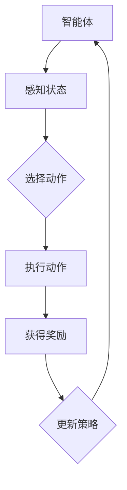
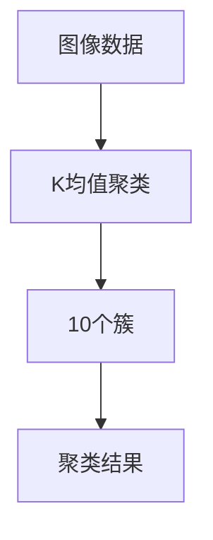

                 

### 【大模型应用开发 动手做AI Agent】其他AI算法框架

> **关键词：** 大模型，AI Agent，强化学习，聚类算法，联合概率分布模型，算法框架

> **摘要：** 本文深入探讨了在大模型应用开发中，如何动手实现AI Agent。文章首先介绍了强化学习、聚类算法和联合概率分布模型的基本概念和算法原理，然后通过实际项目案例展示了这些算法在大模型中的应用，最后总结了AI Agent开发的关键技术和未来发展方向。

## 引言

随着人工智能技术的不断发展，大模型（如GPT-3、BERT等）已经成为了许多应用场景的核心组件。大模型具有强大的表示能力和学习能力，可以处理复杂的任务和数据，但同时也带来了大量的计算资源和存储需求。在这种背景下，如何高效地应用大模型，开发出能够自主学习和决策的AI Agent成为了当前研究的热点。

AI Agent是一种能够自主感知环境、制定计划并执行行动的智能体。它通过学习和优化，能够在复杂的环境中实现高效的任务执行。本文将围绕AI Agent的开发，探讨几种常用的AI算法框架：强化学习、聚类算法和联合概率分布模型。

### 强化学习

强化学习（Reinforcement Learning，RL）是一种通过试错和奖励机制来学习决策策略的机器学习技术。它的核心思想是通过不断尝试不同的动作，并通过获得的奖励来调整行为策略，以达到最优决策。

#### 强化学习模型

强化学习模型主要由四个部分组成：环境（Environment）、智能体（Agent）、动作（Action）和奖励（Reward）。

1. **环境**：环境是智能体执行动作的场所，可以是一个物理环境，也可以是一个虚拟环境。环境提供状态（State）和奖励（Reward）给智能体。
2. **智能体**：智能体是执行动作并学习策略的主体。它通过感知环境的状态，选择合适的动作，并依据动作的结果获得奖励。
3. **动作**：动作是智能体在环境中采取的行动。动作的选择依赖于智能体的当前状态和策略。
4. **奖励**：奖励是环境对智能体动作的反馈。奖励可以是正的，表示动作有助于达到目标；也可以是负的，表示动作不利于达到目标。

#### 强化学习算法

强化学习算法主要包括以下几种：

1. **Q-Learning算法**：Q-Learning算法是基于值函数的强化学习算法。它通过更新状态-动作值函数来学习最优策略。算法的核心思想是利用当前状态和动作的奖励来更新Q值，并选择具有最大Q值的动作。
2. **SARSA算法**：SARSA（State-Action-Reward-State-Action）算法是基于策略的强化学习算法。它不仅考虑当前状态的Q值，还考虑当前动作的预期奖励，从而更新策略。
3. **Policy Gradient算法**：Policy Gradient算法是一种直接学习策略的强化学习算法。它通过更新策略梯度来优化策略，从而使智能体在环境中获得更高的回报。

#### 强化学习应用

强化学习在许多领域都有广泛的应用，如游戏AI、机器人控制、推荐系统等。以下是一个简单的强化学习应用案例：一个智能体在模拟环境中控制一辆小车，通过学习来达到终点。



#### 强化学习算法伪代码

```python
# Q-Learning算法伪代码

initialize Q(s, a)
for episode in 1 to max_episodes do
    s <- initial_state
    for step in 1 to max_steps do
        a <- argmax(Q[s])
        s', r <- environment.step(a)
        Q[s, a] <- Q[s, a] + alpha * (r + gamma * max(Q[s']) - Q[s, a])
        s <- s'
    end for
end for
```

#### 强化学习数学模型

$$
Q(s, a) = r + \gamma \max_{a'} Q(s', a')
$$

其中，$Q(s, a)$ 表示在状态 $s$ 下执行动作 $a$ 的期望回报，$r$ 表示立即回报，$\gamma$ 表示折扣因子。

### 聚类算法

聚类算法是一种无监督学习算法，用于将数据集中的数据分为多个群组（或簇），使得同一个簇中的数据点之间相似度较高，不同簇之间的相似度较低。

#### 聚类算法分类

聚类算法根据不同的划分标准，可以分为以下几类：

1. **基于距离的聚类**：如K均值聚类（K-Means Clustering）。
2. **基于密度的聚类**：如DBSCAN（Density-Based Spatial Clustering of Applications with Noise）。
3. **基于网格的聚类**：如STING（Stochastic Neural Networks）。
4. **基于模型的聚类**：如高斯混合模型（Gaussian Mixture Model）。

#### K均值聚类算法

K均值聚类算法是一种基于距离的聚类算法。它的核心思想是将数据点分配到 $K$ 个中心点，使得每个中心点所代表的簇内的数据点距离该中心点的平均距离最小。

##### K均值聚类算法原理

1. **初始化**：随机选择 $K$ 个初始中心点。
2. **分配**：计算每个数据点到各个中心点的距离，将数据点分配到距离最近的中心点所代表的簇。
3. **更新**：重新计算每个簇的中心点。
4. **迭代**：重复步骤2和步骤3，直到中心点不再发生变化或者达到预设的迭代次数。

##### K均值聚类算法实现

```python
import numpy as np

def kmeans(data, K, max_iterations):
    # 初始化中心点
    centroids = data[np.random.choice(data.shape[0], K, replace=False)]
    
    for _ in range(max_iterations):
        # 分配
        distances = np.linalg.norm(data[:, np.newaxis] - centroids, axis=2)
        labels = np.argmin(distances, axis=1)
        
        # 更新中心点
        new_centroids = np.array([data[labels == k].mean(axis=0) for k in range(K)])
        
        # 判断中心点是否更新
        if np.linalg.norm(new_centroids - centroids) < 1e-6:
            break

        centroids = new_centroids
    
    return centroids, labels
```

##### K均值聚类算法应用

K均值聚类算法在图像处理、文本分类、生物信息学等领域都有广泛的应用。以下是一个简单的K均值聚类算法应用案例：将一组图像数据分为10个簇。



#### 聚类算法数学模型

$$
\min_{x_1, x_2, \ldots, x_K} \sum_{i=1}^n \sum_{j=1}^K (x_i - x_j)^2
$$

其中，$x_1, x_2, \ldots, x_K$ 表示 $K$ 个中心点，$x_i$ 表示第 $i$ 个数据点。

### 联合概率分布模型

联合概率分布模型是一种用于描述多个随机变量之间相互关系的概率模型。它通过构建联合概率分布函数，来描述这些随机变量同时发生的概率。

#### 联合概率分布模型分类

联合概率分布模型根据不同的构建方法，可以分为以下几类：

1. **条件概率分布模型**：如贝叶斯网络（Bayesian Network）。
2. **马尔可夫模型**：如马尔可夫链（Markov Chain）。
3. **高斯混合模型**：如高斯贝叶斯网络（Gaussian Bayesian Network）。

#### 贝叶斯网络

贝叶斯网络是一种基于概率的图形模型，用于表示多个随机变量之间的条件依赖关系。它由一组节点和有向边组成，每个节点表示一个随机变量，边表示变量之间的条件依赖关系。

##### 贝叶斯网络构建

贝叶斯网络的构建主要包括以下步骤：

1. **确定节点**：根据实际问题，确定需要表示的随机变量。
2. **确定条件依赖关系**：根据实际问题和领域知识，确定变量之间的条件依赖关系。
3. **构建网络结构**：根据节点和条件依赖关系，构建贝叶斯网络。

##### 贝叶斯网络计算

贝叶斯网络的计算主要包括以下步骤：

1. **参数学习**：通过观察数据，学习网络的参数。
2. **推理**：根据网络结构和参数，进行变量之间的推理。

##### 贝叶斯网络应用

贝叶斯网络在自然语言处理、图像识别、生物信息学等领域都有广泛的应用。以下是一个简单的贝叶斯网络应用案例：用于预测某个学生在考试中及格的概率。

```mermaid
graph TD
A[是否认真复习] --> B

