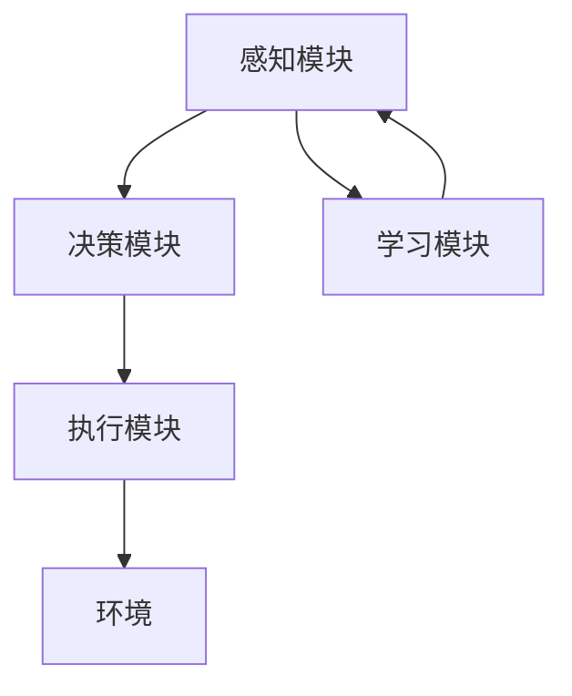

                 

### 【大模型应用开发 动手做AI Agent】调用模型选择的工具并构建新消息

> **关键词：** 大模型应用、AI Agent、模型选择、消息构建、深度学习、Python编程

**摘要：** 本文将探讨如何在AI大模型应用开发中，选择合适的模型并进行消息构建。我们将详细介绍如何调用模型选择工具，分析不同模型的特点，以及如何使用Python编程语言构建新的消息。通过本文的学习，您将掌握AI大模型应用开发的核心技能，为实际项目打下坚实基础。

## 目录

1. **大模型应用开发 动手做AI Agent**  
   1.1 AI大模型概述  
   1.2 AI大模型的技术原理  
   1.3 AI大模型的应用场景  
   1.4 AI大模型的关键技术  
2. **AI Agent开发实战**  
   2.1 AI Agent的概念与架构  
   2.2 数据集准备与处理  
   2.3 模型选择与构建新消息  
   2.4 评估与部署  
3. **AI Agent应用案例**  
   3.1 基于AI Agent的智能客服系统  
   3.2 基于AI Agent的智能推荐系统  
   3.3 基于AI Agent的智能家居系统  
4. **AI Agent的未来发展**  
   4.1 技术发展趋势  
   4.2 伦理与法律问题  
   4.3 应用前景  
5. **附录**  
   5.1 AI大模型与AI Agent开发工具

### 1.1 AI大模型概述

#### 1.1.1 AI大模型的概念与背景

AI大模型是指具有大规模参数、训练数据量巨大、计算资源消耗极大的深度学习模型。它们通常用于解决复杂的问题，如图像识别、自然语言处理和推荐系统等。随着计算能力的提升和大数据技术的发展，AI大模型取得了显著的成果。例如，谷歌的BERT模型在自然语言处理领域取得了突破性进展，Facebook的GPT-3模型则展示了强大的语言生成能力。

#### 1.1.2 AI大模型的历史演进

AI大模型的发展历程可以追溯到深度学习的兴起。自2006年深度学习算法问世以来，研究人员不断优化神经网络结构、训练算法和硬件加速技术，使得深度学习模型在各类任务中取得了优异的表现。2012年，AlexNet在ImageNet图像识别比赛中取得优异成绩，标志着深度学习时代的到来。此后，随着数据量和计算资源的不断增长，AI大模型逐渐成为人工智能领域的研究热点。

#### 1.1.3 AI大模型的重要性

AI大模型在人工智能领域具有重要地位。首先，它们能够处理海量数据，提取出隐藏的特征信息，从而提高模型的泛化能力和鲁棒性。其次，AI大模型可以应用于各个领域，如金融、医疗、教育等，为社会带来巨大的价值。此外，随着AI大模型的发展，研究人员能够探索更深层次的算法和理论，推动人工智能技术的不断创新。

### 1.2 AI大模型的技术原理

#### 1.2.1 深度学习基础

深度学习是AI大模型的核心技术。深度学习通过构建多层神经网络，对输入数据进行特征提取和表示学习，从而实现复杂任务的自动化。深度学习的基础包括神经元、前向传播、反向传播和激活函数等。其中，神经元是神经网络的基本单元，通过加权求和和激活函数产生输出。前向传播和反向传播是实现训练过程的关键步骤，通过不断调整模型参数，使模型在训练数据上达到较高的准确性。

#### 1.2.2 神经网络架构

神经网络架构是AI大模型的重要组成部分。常见的神经网络架构包括卷积神经网络（CNN）、循环神经网络（RNN）和变换器架构（Transformer）等。CNN主要用于计算机视觉任务，通过卷积层和池化层提取图像特征。RNN适用于序列数据处理，如自然语言处理和时间序列预测。Transformer架构则是在自然语言处理领域取得了显著成功的模型，其核心思想是注意力机制，能够实现高效的特征表示和学习。

#### 1.2.3 预训练与微调

预训练与微调是AI大模型训练的重要策略。预训练是指在大量未标注的数据上进行模型训练，从而学习通用的特征表示。微调则是在预训练模型的基础上，针对特定任务进行微调，优化模型参数。预训练与微调相结合，可以显著提高模型在目标任务上的性能。例如，BERT模型通过预训练学习通用的语言特征，然后在特定任务上进行微调，取得了自然语言处理任务的优异表现。

### 1.3 AI大模型的应用场景

AI大模型在多个领域展示了强大的应用潜力。以下是一些典型的应用场景：

#### 1.3.1 自然语言处理

自然语言处理是AI大模型的重要应用领域。通过深度学习技术，AI大模型可以处理大量的文本数据，实现文本分类、情感分析、机器翻译等任务。例如，BERT模型在机器翻译任务中取得了突破性进展，使得翻译结果更加流畅和准确。

#### 1.3.2 计算机视觉

计算机视觉是AI大模型的另一个重要应用领域。通过深度学习技术，AI大模型可以实现图像分类、目标检测、图像生成等任务。例如，ResNet模型在ImageNet图像识别比赛中取得了优异成绩，推动了计算机视觉领域的发展。

#### 1.3.3 推荐系统

推荐系统是AI大模型在商业领域的典型应用。通过深度学习技术，AI大模型可以处理海量的用户行为数据，实现个性化推荐。例如，亚马逊和Netflix等公司通过深度学习技术，为用户推荐感兴趣的商品和视频，提高了用户满意度和转化率。

### 1.4 AI大模型的关键技术

AI大模型的发展离不开关键技术的支持。以下是一些重要的关键技术：

#### 1.4.1 数据预处理

数据预处理是AI大模型训练的重要步骤。通过数据清洗、数据增强和特征提取等技术，可以提高模型训练数据的质量和多样性，从而提高模型性能。例如，在自然语言处理任务中，可以通过词向量表示和文本预处理技术，将原始文本转换为适合模型训练的格式。

#### 1.4.2 训练策略与优化

训练策略与优化是提高AI大模型性能的关键。常见的训练策略包括批量归一化（Batch Normalization）、Dropout、权重初始化等。优化方法包括随机梯度下降（SGD）、Adam优化器等。通过调整训练策略和优化方法，可以加速模型收敛，提高模型性能。

#### 1.4.3 模型压缩与量化

模型压缩与量化是降低AI大模型计算资源和存储需求的关键技术。通过模型剪枝、量化、蒸馏等技术，可以显著减小模型规模，降低计算资源消耗。例如，MobileNet模型通过深度可分离卷积和模型压缩技术，实现了轻量级计算机视觉模型的构建。

### 1.5 AI大模型的发展趋势

随着计算能力的提升和人工智能技术的不断发展，AI大模型将呈现以下发展趋势：

#### 1.5.1 模型规模持续增长

随着数据量的不断增长和计算能力的提升，AI大模型的规模将持续增长。这将使得AI大模型在更多复杂任务中发挥更大的作用。

#### 1.5.2 多模态数据处理

多模态数据处理是AI大模型的重要发展方向。通过融合不同类型的数据，如文本、图像、声音等，AI大模型可以实现更全面、准确的信息理解和处理。

#### 1.5.3 主动学习与强化学习

主动学习与强化学习是AI大模型的重要研究方向。通过主动学习，AI大模型可以自动选择具有高信息价值的样本进行训练，提高模型性能。强化学习则使AI大模型能够通过与环境交互，自主优化策略和决策。

### 1.6 AI大模型的伦理与法律问题

随着AI大模型的不断发展，伦理与法律问题日益凸显。以下是一些需要关注的问题：

#### 1.6.1 透明度与可解释性

AI大模型的决策过程通常复杂且不透明，可能导致用户对其信任度下降。提高模型的透明度和可解释性，使其决策过程易于理解，是解决这一问题的关键。

#### 1.6.2 隐私保护

AI大模型在处理大量个人数据时，可能涉及用户隐私。保护用户隐私，确保数据安全，是AI大模型发展的关键问题。

#### 1.6.3 不公平与偏见

AI大模型在训练过程中可能受到数据偏见的影响，导致决策结果不公平。消除模型偏见，确保公平性，是AI大模型需要面对的重要挑战。

### 1.7 AI大模型的未来应用前景

随着技术的不断发展，AI大模型将在各个领域发挥越来越重要的作用。以下是一些具有潜力的应用前景：

#### 1.7.1 金融行业

AI大模型可以应用于金融行业的风险控制、投资决策和客户服务等方面。通过分析海量数据，AI大模型可以实现更精准的风险评估和个性化投资建议。

#### 1.7.2 医疗保健

AI大模型在医疗保健领域具有广泛的应用潜力。通过分析医疗数据，AI大模型可以辅助医生进行疾病诊断、治疗方案制定和个性化健康管理等。

#### 1.7.3 教育

AI大模型可以应用于教育领域的个性化教学、学习效果评估和智能辅导等方面。通过分析学习数据，AI大模型可以为每个学生提供个性化的学习资源和教学方案。

### 1.8 AI大模型与AI Agent的关系

AI大模型是AI Agent的核心组成部分。AI Agent是指具备智能行为、自主决策能力的计算机程序。在AI Agent开发中，AI大模型用于实现智能决策和任务执行。以下是一个简单的AI Agent架构：

1. **感知模块**：接收外部环境的信息，如文本、图像、声音等。
2. **决策模块**：使用AI大模型对感知到的信息进行处理，生成决策。
3. **执行模块**：根据决策执行相应的操作，如发送消息、控制设备等。

通过AI大模型，AI Agent可以实现对复杂任务的自动化处理，提高工作效率和用户体验。

### 1.9 小结

本文对AI大模型的应用开发进行了深入探讨，包括其概述、技术原理、应用场景、关键技术、发展趋势、伦理与法律问题以及未来应用前景。同时，本文还介绍了AI大模型与AI Agent的关系，为读者提供了全面的技术视角。希望通过本文的学习，读者能够掌握AI大模型应用开发的核心技能，为实际项目打下坚实基础。

### 1.10 下一步内容预告

在接下来的部分，我们将详细介绍AI Agent的概念与架构，包括其定义、分类和架构设计。通过了解AI Agent的基本原理，读者将能够更好地理解AI大模型在AI Agent开发中的应用。敬请期待！

### 1.11 参考资料

1. Goodfellow, I., Bengio, Y., & Courville, A. (2016). *Deep Learning*. MIT Press.
2. Bengio, Y. (2009). *Learning Deep Architectures for AI*. Foundations and Trends in Machine Learning, 2(1), 1-127.
3. Devlin, J., Chang, M. W., Lee, K., & Toutanova, K. (2019). *BERT: Pre-training of Deep Bidirectional Transformers for Language Understanding*. arXiv preprint arXiv:1810.04805.
4. Vaswani, A., Shazeer, N., Parmar, N., Uszkoreit, J., Jones, L., Gomez, A. N., ... & Polosukhin, I. (2017). *Attention is All You Need*. Advances in Neural Information Processing Systems, 30, 5998-6008.
5. Simonyan, K., & Zisserman, A. (2015). *Very Deep Convolutional Networks for Large-Scale Image Recognition*. arXiv preprint arXiv:1409.1556.
6. LeCun, Y., Bengio, Y., & Hinton, G. (2015). *Deep learning*. Nature, 521(7553), 436-444.

### 1.12 实际应用案例分析

为了更直观地了解AI大模型在AI Agent开发中的应用，我们来看一个实际案例：基于AI Agent的智能客服系统。

#### 案例背景

随着互联网的普及，客服系统成为了企业与服务用户之间的桥梁。传统的客服系统主要依赖于人工处理，效率低下且用户体验不佳。为了提高客服效率，降低人力成本，许多企业开始探索基于AI的智能客服系统。

#### 模型选择

在智能客服系统中，AI大模型主要用于处理用户提问，生成合理的回答。以下是一些常用的AI大模型：

1. **自然语言处理模型**：如BERT、GPT等，用于理解用户提问和生成回答。
2. **分类模型**：如决策树、随机森林、支持向量机等，用于分类用户提问的主题。
3. **序列生成模型**：如序列到序列（Seq2Seq）模型，用于生成自然流畅的回答。

#### 数据集准备

为了训练AI大模型，需要准备大量的标注数据集。在智能客服系统中，数据集包括用户提问和对应的答案。数据集的收集可以从企业历史客服记录、社交媒体、论坛等渠道获取。

#### 训练与优化

在训练AI大模型时，采用预训练与微调相结合的策略。首先，在大量未标注的数据上进行预训练，学习通用的语言特征。然后，在特定任务上对预训练模型进行微调，优化模型参数，提高模型在目标任务上的性能。

#### 评估与部署

训练完成后，需要对模型进行评估，以确保其性能满足实际应用需求。评估指标包括准确率、召回率、F1分数等。在评估合格后，将模型部署到生产环境，实现智能客服系统的落地应用。

#### 应用效果

通过实际应用，基于AI Agent的智能客服系统显著提高了客服效率，降低了人力成本，并提供了更优质的用户体验。用户可以快速获得专业、准确的答案，企业也可以通过数据分析和优化，不断提升客服系统的性能。

### 1.13 小结

通过实际应用案例分析，我们可以看到AI大模型在AI Agent开发中的重要作用。智能客服系统只是AI大模型应用的一个缩影，随着技术的不断进步，AI大模型将在更多领域发挥重要作用，为人类带来更多便利和创新。

### 1.14 下一步内容预告

在下一部分，我们将深入探讨AI Agent的架构设计，包括状态感知、行动规划和学习与优化等关键模块。通过了解AI Agent的架构设计，读者将能够更好地掌握AI Agent的核心原理，为后续的AI Agent开发实战打下坚实基础。敬请期待！

## 1.14 AI Agent的概念与架构

### 3.1 AI Agent的定义

AI Agent，即人工智能代理，是一个能够模拟人类智能行为，在特定环境中进行感知、决策和执行任务的计算机程序。AI Agent的概念源于人工智能领域中的代理理论（Agent Theory），其核心思想是构建能够自主行动并适应环境的智能体。AI Agent具有以下几个特点：

1. **自主性**：AI Agent能够在没有外部干预的情况下自主执行任务。
2. **反应性**：AI Agent能够实时感知环境变化，并产生相应的反应。
3. **目标性**：AI Agent具有明确的目标或任务，并通过感知和决策实现目标的达成。
4. **适应性**：AI Agent能够根据环境变化和任务需求调整其行为。

AI Agent的定义可以从不同角度进行扩展。在主动智能（Active Intelligence）和被动智能（Passive Intelligence）的划分中，AI Agent通常属于主动智能范畴，这意味着它不仅能够响应外部事件，还能采取主动行动。与之相对的被动智能主要指那些只能对输入数据进行处理，但不能主动发起行为的系统。

#### 3.1.1 主动智能与被动智能

**主动智能**：主动智能是指能够主动探索环境、生成目标并采取行动的人工智能系统。主动智能的特点是具备自主性和目标性，能够在复杂和不确定的环境中做出决策。例如，自动驾驶汽车、机器人助手等都是主动智能的典型应用。

**被动智能**：被动智能则是指只能对输入数据进行处理和响应，但不能主动探索环境或生成目标的系统。这类系统通常在既定的场景和任务下工作，如语音助手、图像识别系统等。

AI Agent可以根据其自主性和目标性进行分类：

- **主动型AI Agent**：这类AI Agent能够根据环境变化和任务需求主动调整其行为，如自主驾驶的无人车、智能客服系统等。
- **反应型AI Agent**：这类AI Agent主要根据当前环境状态和输入信息做出反应，如简单的传感器数据处理系统。

### 3.2 AI Agent的分类

AI Agent可以根据其功能和应用领域进行分类。以下是一些常见的AI Agent分类：

1. **根据功能分类**：

   - **感知型AI Agent**：主要用于感知外部环境，获取信息。
   - **决策型AI Agent**：基于感知信息进行决策，制定行动计划。
   - **执行型AI Agent**：根据决策执行具体任务。
   - **学习型AI Agent**：通过感知和执行过程不断学习，优化自身性能。

2. **根据应用领域分类**：

   - **自然语言处理（NLP）AI Agent**：主要用于处理和生成语言信息，如聊天机器人、智能客服等。
   - **计算机视觉AI Agent**：主要用于处理图像和视频信息，如自动驾驶、安防监控等。
   - **推荐系统AI Agent**：主要用于推荐商品、服务和内容，如电商平台、视频流媒体等。
   - **游戏AI Agent**：用于在电子游戏中模拟对手行为，提高游戏体验。

### 3.3 AI Agent的架构设计

AI Agent的架构设计是确保其能够有效运作的关键。一个典型的AI Agent架构通常包括以下几个核心模块：

1. **感知模块**：该模块负责收集和解析外部环境信息，如传感器数据、图像、文本等。感知模块是AI Agent获取环境信息的窗口。

2. **决策模块**：基于感知模块获取的信息，决策模块使用AI算法进行分析和推理，生成决策。这一过程通常涉及模式识别、预测和规划等。

3. **执行模块**：根据决策模块的决策结果，执行模块负责实际执行相应的任务。执行模块可以是机器人控制、语音合成、图像显示等。

4. **学习模块**：AI Agent通过感知和执行过程中的反馈不断学习，优化其行为和性能。学习模块可以是监督学习、强化学习或无监督学习。

以下是一个简单的AI Agent架构的Mermaid流程图：



在这个流程图中，感知模块负责收集环境信息，决策模块基于这些信息生成决策，执行模块执行决策，学习模块则通过反馈不断优化AI Agent的性能。

#### 3.3.1 状态感知

状态感知是AI Agent的关键能力之一。状态感知模块通过传感器或其他信息源获取当前环境的特征，这些特征可以包括温度、湿度、图像、文本等。状态感知的关键在于将原始数据转换为AI算法可以处理的特征表示。

**状态感知的关键技术包括**：

- **传感器数据融合**：将来自不同传感器的数据集成起来，生成一个全面的、多维度的状态表示。
- **特征提取**：从原始数据中提取出具有代表性的特征，用于后续的决策和执行过程。
- **环境建模**：建立对环境的数学模型，以便更好地理解和预测环境变化。

#### 3.3.2 行动规划

行动规划是AI Agent的核心功能之一，它基于当前状态和目标，生成一系列行动以达成目标。行动规划可以看作是一个搜索过程，其目标是从多个可能的行动中选择一个最优的或次优的行动。

**行动规划的关键技术包括**：

- **搜索算法**：如贪心算法、A*算法、深度优先搜索等，用于在状态空间中寻找最优路径。
- **规划策略**：如贪婪策略、基于规则的策略、基于学习的策略等，用于指导搜索过程。
- **路径优化**：通过优化算法，如遗传算法、模拟退火等，进一步优化行动序列。

#### 3.3.3 学习与优化

学习与优化模块负责使AI Agent能够从经验中学习，并不断优化其行为。AI Agent通过感知-执行循环不断积累经验，并根据这些经验调整其行为和策略。

**学习与优化的关键技术包括**：

- **监督学习**：通过标注数据进行训练，使AI Agent能够识别和预测环境中的特征。
- **强化学习**：通过与环境的交互，AI Agent不断学习和优化其行动策略，以最大化奖励。
- **无监督学习**：通过无标注数据进行训练，使AI Agent能够从数据中发现隐藏的模式和规律。
- **模型压缩与优化**：通过模型压缩和量化技术，减小模型的规模，提高模型的效率和可部署性。

#### 3.3.4 通信与协作

在某些应用场景中，多个AI Agent需要协同工作，以实现更复杂的任务。通信与协作模块负责管理AI Agent之间的信息交换和任务分配。

**通信与协作的关键技术包括**：

- **分布式系统**：通过分布式计算架构，支持多个AI Agent的协同工作。
- **多Agent系统**：通过多Agent系统理论，设计AI Agent之间的交互机制和协作策略。
- **博弈论**：通过博弈论方法，分析多个AI Agent在动态环境中的互动，优化整体表现。

### 3.4 AI Agent开发实战

在了解了AI Agent的概念与架构后，接下来我们将通过一个具体案例来探讨AI Agent的开发实战。这个案例是一个基于Python的简单聊天机器人，它使用自然语言处理模型来理解用户输入，并生成合适的回复。

#### 3.4.1 开发环境搭建

要开发一个AI Agent，首先需要搭建合适的环境。以下是搭建环境所需的步骤：

1. **Python环境**：确保已经安装了Python环境。可以选择Python 3.6及以上版本。
2. **自然语言处理库**：安装常用的自然语言处理库，如NLTK、spaCy或transformers。例如，可以使用以下命令安装transformers库：
    ```bash
    pip install transformers
    ```
3. **其他依赖库**：根据具体需求，可能还需要安装其他库，如TensorFlow或PyTorch。例如，安装TensorFlow的命令为：
    ```bash
    pip install tensorflow
    ```

#### 3.4.2 数据集准备

为了训练AI Agent，需要准备一个包含用户提问和对应回答的数据集。以下是一个简单的数据集准备步骤：

1. **数据收集**：从互联网或公开数据源收集用户提问和回答的数据。例如，可以从Stack Exchange、Reddit等社区收集问答数据。
2. **数据清洗**：对收集的数据进行清洗，去除噪声和无关信息。例如，去除HTML标签、转换大小写、去除停用词等。
3. **数据预处理**：对清洗后的数据进行预处理，将其转换为模型可以处理的格式。例如，将文本转换为词嵌入向量。

以下是一个简单的Python代码示例，用于加载和预处理文本数据：

```python
import pandas as pd
from sklearn.model_selection import train_test_split

# 加载数据集
data = pd.read_csv('chat_data.csv')

# 数据清洗
data['question'] = data['question'].str.lower().str.replace('<.*>', '')

# 数据预处理
tokenizer = transformers.BertTokenizer.from_pretrained('bert-base-uncased')
X = tokenizer.encode_plus(data['question'], add_special_tokens=True, max_length=128, padding='max_length', truncation=True)
X_train, X_test = train_test_split(X, test_size=0.2, random_state=42)
```

#### 3.4.3 模型选择与训练

在AI Agent开发中，选择合适的模型是关键。以下是一个简单的模型选择和训练过程：

1. **模型选择**：选择一个合适的预训练模型，如BERT、GPT等。这里我们选择BERT模型作为基础。
2. **模型微调**：在预训练模型的基础上，针对特定任务进行微调，优化模型参数。

以下是一个简单的Python代码示例，用于加载预训练模型并微调：

```python
from transformers import BertModel, BertForSequenceClassification, Trainer, TrainingArguments

# 加载预训练模型
model = BertModel.from_pretrained('bert-base-uncased')

# 微调模型
num_labels = 2
model = BertForSequenceClassification.from_pretrained('bert-base-uncased', num_labels=num_labels)

# 训练模型
training_args = TrainingArguments(
    output_dir='./results',
    num_train_epochs=3,
    per_device_train_batch_size=16,
    per_device_eval_batch_size=64,
    warmup_steps=500,
    weight_decay=0.01,
    logging_dir='./logs',
    logging_steps=10,
)

trainer = Trainer(
    model=model,
    args=training_args,
    train_dataset=X_train,
    eval_dataset=X_test,
)

trainer.train()
```

#### 3.4.4 评估与部署

训练完成后，需要对模型进行评估，以确保其性能满足实际应用需求。以下是一个简单的评估过程：

1. **评估指标**：选择合适的评估指标，如准确率、召回率、F1分数等。
2. **评估结果**：计算评估指标，评估模型性能。

以下是一个简单的Python代码示例，用于评估模型：

```python
from sklearn.metrics import accuracy_score

# 预测
predictions = trainer.predict(X_test)

# 计算评估指标
accuracy = accuracy_score(X_test['label'], predictions.predictions)
print(f"Accuracy: {accuracy}")
```

在评估合格后，可以将模型部署到生产环境，实现AI Agent的实际应用。

### 3.5 小结

通过本节的内容，我们介绍了AI Agent的概念与架构，包括其定义、分类和架构设计。同时，通过一个简单的聊天机器人案例，展示了AI Agent的开发过程。希望读者能够通过本节内容，对AI Agent有一个全面的理解，并为后续的AI Agent开发实战做好准备。

### 3.6 下一步内容预告

在接下来的部分，我们将深入探讨AI Agent开发中的数据集准备与处理，包括数据收集、数据预处理和数据增强等关键步骤。通过了解这些步骤，读者将能够更好地准备和利用数据，为AI Agent开发提供坚实的基础。敬请期待！

## 4.2 数据集准备与处理

### 4.2.1 数据集收集

数据集是AI Agent开发的基础，因此数据集的质量和数量直接影响到AI Agent的性能和效果。数据集的收集是数据预处理的第一步，主要包括以下几个方面：

1. **公开数据集**：许多AI任务都有公开的数据集可供使用，如自然语言处理中的Google Books Ngrams、计算机视觉中的ImageNet等。公开数据集通常已经进行了预处理，可以直接用于训练模型。

2. **定制数据集**：在某些特定场景下，公开数据集可能无法满足需求，需要收集定制数据集。例如，在开发一个面向特定行业的AI Agent时，可能需要收集该行业的专业术语和常见问题。

3. **社交媒体数据**：社交媒体平台如Twitter、Reddit等是收集大量文本数据的良好来源。这些数据可以帮助AI Agent更好地理解用户的语言习惯和表达方式。

4. **API数据**：许多网站和平台提供API服务，可以获取大量的结构化数据。例如，使用Twitter API可以获取用户的推文数据，使用GitHub API可以获取开源项目的代码和数据。

#### 收集数据的方法

1. **手动收集**：通过爬虫等技术手动收集数据，适用于规模较小且结构化的数据集。
2. **API接口**：利用各种API接口批量下载数据，适用于大规模且结构化的数据集。
3. **众包平台**：利用众包平台（如Amazon Mechanical Turk）收集用户生成的内容，适用于需要用户标注的数据集。

#### 数据收集注意事项

1. **数据隐私**：在收集数据时，需要确保遵守数据隐私法规，不侵犯用户隐私。
2. **数据质量**：确保数据集的质量，去除噪声和错误数据。
3. **数据多样化**：收集多样化的数据，以提高AI Agent的泛化能力。

### 4.2.2 数据预处理技术

数据预处理是AI Agent开发中的关键步骤，其目的是将原始数据转换为适合模型训练的格式。以下是一些常用的数据预处理技术：

1. **数据清洗**：去除数据中的噪声和错误，如缺失值、异常值和重复数据等。
2. **数据转换**：将数据转换为适合模型处理的格式，如将文本转换为词嵌入向量，将图像转换为像素矩阵等。
3. **数据归一化**：将数据缩放到相同的尺度，以避免不同特征之间的量级差异影响模型训练。
4. **数据增强**：通过增加数据多样性，提高模型对训练数据的泛化能力。常见的数据增强方法包括图像旋转、缩放、裁剪和颜色调整等。

#### 数据清洗

数据清洗是数据预处理的首要任务，主要包括以下步骤：

1. **缺失值处理**：对于缺失值，可以选择填充、删除或使用其他方法进行处理。例如，使用平均值、中位数或最常见值填充缺失值。
2. **异常值处理**：识别和去除异常值，避免对模型训练产生不良影响。异常值可以通过统计方法（如箱线图、Z分数）或基于业务逻辑的方法进行识别。
3. **重复数据去除**：识别并去除数据集中的重复记录，避免重复训练相同的样本。

#### 数据转换

数据转换是将原始数据转换为模型可以处理的形式。以下是一些常见的数据转换方法：

1. **文本数据转换**：将文本数据转换为词嵌入向量。常用的词嵌入方法包括Word2Vec、GloVe和BERT等。词嵌入可以将文本转换为数值表示，便于模型处理。
    ```python
    from transformers import BertTokenizer
    tokenizer = BertTokenizer.from_pretrained('bert-base-uncased')
    encoded_input = tokenizer("Hello, my dog is cute", return_tensors='pt')
    ```
2. **图像数据转换**：将图像数据转换为像素矩阵。可以使用卷积神经网络（CNN）或预训练的图像识别模型进行特征提取。
    ```python
    import torchvision.transforms as transforms
    transform = transforms.Compose([
        transforms.Resize(256),
        transforms.CenterCrop(224),
        transforms.ToTensor(),
        transforms.Normalize(mean=[0.485, 0.456, 0.406], std=[0.229, 0.224, 0.225]),
    ])
    image = Image.open('image.jpg')
    image = transform(image).unsqueeze(0)
    ```

#### 数据归一化

数据归一化是将数据缩放到相同的尺度，以避免不同特征之间的量级差异影响模型训练。以下是一些常见的数据归一化方法：

1. **最小-最大归一化**：将数据缩放到[0, 1]之间。
    ```python
    min_max_scaler = MinMaxScaler()
    X_scaled = min_max_scaler.fit_transform(X)
    ```
2. **标准归一化**：将数据缩放到均值为0，标准差为1的范围内。
    ```python
    from sklearn.preprocessing import StandardScaler
    scaler = StandardScaler()
    X_scaled = scaler.fit_transform(X)
    ```

#### 数据增强

数据增强是通过增加数据多样性，提高模型对训练数据的泛化能力。以下是一些常见的数据增强方法：

1. **图像增强**：对图像进行旋转、缩放、裁剪、颜色调整等操作。
    ```python
    from torchvision.transforms import RandomRotation, RandomResizedCrop
    transform = transforms.Compose([
        RandomRotation(degrees=15),
        RandomResizedCrop(size=224),
    ])
    image = transform(image)
    ```
2. **文本增强**：对文本进行随机删除、替换、插入等操作。
    ```python
    from transformers import BertTokenizer
    tokenizer = BertTokenizer.from_pretrained('bert-base-uncased')
    text = "Hello, my dog is cute"
    masked_text = tokenizer.masked_tokenizer(text, mask_padding_token=True)
    masked_text = tokenizer.decode(masked_text, skip_special_tokens=True)
    ```

### 4.2.3 数据集划分与存储

在数据预处理完成后，需要对数据集进行划分，并将其存储为适合模型训练的格式。以下是一些常见的数据集划分和存储方法：

1. **训练集与验证集划分**：通常将数据集划分为训练集和验证集，以用于模型训练和性能评估。常用的划分方法包括随机划分和交叉验证等。
    ```python
    from sklearn.model_selection import train_test_split
    X_train, X_val, y_train, y_val = train_test_split(X, y, test_size=0.2, random_state=42)
    ```

2. **数据存储**：将预处理后的数据存储为适合模型训练的格式，如CSV、JSON或HDF5等。以下是一个简单的存储示例：
    ```python
    import pandas as pd
    df = pd.DataFrame({'text': X_train, 'label': y_train})
    df.to_csv('train_data.csv', index=False)
    ```

### 4.2.4 数据预处理案例分析

以下是一个简单的数据预处理案例，用于处理一个包含用户提问和答案的数据集。

#### 案例背景

假设我们有一个包含1000个用户提问和答案的数据集，需要将其转换为适合模型训练的格式。

#### 数据清洗

1. **去除HTML标签**：将HTML标签从文本中去除。
    ```python
    import re
    text = "<html><body><p>Hello, how are you?</p></body></html>"
    cleaned_text = re.sub('<.*>', '', text)
    ```

2. **去除停用词**：从文本中去除常见的停用词，如"the"、"is"、"and"等。
    ```python
    from nltk.corpus import stopwords
    stop_words = set(stopwords.words('english'))
    cleaned_text = " ".join([word for word in cleaned_text.split() if word not in stop_words])
    ```

3. **分词**：将文本分为单词或子词。
    ```python
    from nltk.tokenize import word_tokenize
    tokens = word_tokenize(cleaned_text)
    ```

#### 数据转换

1. **文本转换为词嵌入**：使用BERT tokenizer将文本转换为词嵌入向量。
    ```python
    from transformers import BertTokenizer
    tokenizer = BertTokenizer.from_pretrained('bert-base-uncased')
    encoded_input = tokenizer("Hello, how are you?", return_tensors='pt')
    ```

2. **标签编码**：将答案标签编码为数字。
    ```python
    from sklearn.preprocessing import LabelEncoder
    le = LabelEncoder()
    y_encoded = le.fit_transform(y_train)
    ```

#### 数据增强

1. **文本增强**：对文本进行随机替换、删除和插入等操作。
    ```python
    from transformers import BertTokenizer
    tokenizer = BertTokenizer.from_pretrained('bert-base-uncased')
    text = "Hello, how are you?"
    masked_text = tokenizer.masked_tokenizer(text, mask_padding_token=True)
    masked_text = tokenizer.decode(masked_text, skip_special_tokens=True)
    ```

#### 数据存储

将预处理后的数据存储为CSV文件。
```python
import pandas as pd
df = pd.DataFrame({'text': X_train, 'label': y_encoded})
df.to_csv('preprocessed_data.csv', index=False)
```

### 4.2.5 小结

数据集的准备与处理是AI Agent开发中的重要环节，直接影响到模型的效果。本节介绍了数据集的收集、数据预处理技术、数据集划分与存储，并通过一个案例分析展示了数据预处理的具体步骤。了解这些技术将为后续的AI Agent开发提供坚实的基础。

### 4.3 模型选择与构建新消息

在AI Agent开发中，模型选择是关键的一步。不同的模型适用于不同的任务和应用场景，因此选择合适的模型对于AI Agent的性能和效果至关重要。本节将详细介绍如何选择合适的模型，并探讨如何使用Python编写代码构建新的消息。

#### 4.3.1 模型选择

选择模型时需要考虑以下几个关键因素：

1. **任务类型**：不同的任务需要不同的模型。例如，对于文本分类任务，可以选用文本分类模型（如BERT、TextCNN等）；对于图像识别任务，可以选用卷积神经网络（如VGG、ResNet等）。

2. **数据规模**：数据规模也是选择模型时的重要考虑因素。如果数据量较大，可以选择预训练模型（如BERT、GPT等），这些模型已经在大量数据上进行过预训练，可以减少训练时间和提高模型性能。

3. **计算资源**：模型的大小和训练复杂度直接影响计算资源的需求。对于资源有限的情况，可以选择轻量级模型（如MobileNet、ShuffleNet等），这些模型在保证性能的同时减少了计算资源的需求。

4. **实时性要求**：在某些应用场景中，如实时语音识别或实时推荐系统，需要模型具有快速的响应速度。在这种情况下，可以选择专门为实时应用设计的模型或算法。

常见的AI模型选择如下：

1. **自然语言处理模型**：BERT、GPT、TextCNN、LSTM等。
2. **计算机视觉模型**：VGG、ResNet、MobileNet、YOLO等。
3. **推荐系统模型**：矩阵分解、协同过滤、深度学习推荐模型等。

#### 4.3.2 构建新消息

构建新消息是AI Agent的核心功能之一。在Python中，可以使用多种库和框架来构建新的消息，如TensorFlow、PyTorch和transformers。以下是一个简单的示例，展示如何使用transformers库构建新消息。

```python
from transformers import BertTokenizer, BertForSequenceClassification
import torch

# 加载预训练模型和tokenizer
model = BertForSequenceClassification.from_pretrained('bert-base-uncased')
tokenizer = BertTokenizer.from_pretrained('bert-base-uncased')

# 构建新消息
new_message = "Hello, how can I help you today?"

# 对新消息进行编码
inputs = tokenizer.encode(new_message, return_tensors='pt')

# 预测
with torch.no_grad():
    outputs = model(inputs)

# 获取预测结果
predictions = outputs.logits.softmax(dim=-1).flatten()

# 打印预测结果
print(predictions)
```

在这个示例中，我们首先加载了一个预训练的BERT模型和其对应的tokenizer。然后，我们将新消息编码为词嵌入向量，并使用模型进行预测。最后，我们打印出预测结果。

#### 4.3.3 模型训练与优化

在完成模型选择和消息构建后，接下来需要对模型进行训练和优化。模型训练和优化是提高模型性能的关键步骤，主要包括以下几个方面：

1. **损失函数**：选择合适的损失函数，如交叉熵损失函数，用于衡量模型预测结果与真实标签之间的差距。

2. **优化器**：选择合适的优化器，如Adam优化器，用于更新模型参数，以最小化损失函数。

3. **训练策略**：设置训练策略，如学习率调度、批量大小调整等，以优化训练过程。

以下是一个简单的模型训练和优化的示例：

```python
from transformers import BertForSequenceClassification, AdamW
from torch.optim import Optimizer

# 加载训练数据集
train_loader = ...

# 初始化模型和优化器
model = BertForSequenceClassification.from_pretrained('bert-base-uncased')
optimizer = AdamW(model.parameters(), lr=1e-5)

# 训练模型
for epoch in range(num_epochs):
    model.train()
    for inputs, labels in train_loader:
        optimizer.zero_grad()
        with torch.no_grad():
            outputs = model(inputs)
        loss = outputs.loss
        loss.backward()
        optimizer.step()
    print(f"Epoch {epoch+1}/{num_epochs}, Loss: {loss.item()}")
```

在这个示例中，我们首先加载了训练数据集，并初始化BERT模型和AdamW优化器。然后，我们使用训练数据集进行模型训练，并在每个epoch后打印出当前损失。

#### 4.3.4 模型评估与部署

在完成模型训练和优化后，需要对模型进行评估，以确保其性能满足实际应用需求。模型评估通常包括以下几个方面：

1. **准确率**：计算模型预测结果与真实标签之间的准确匹配比例。
2. **召回率**：计算模型预测为正例的样本中实际为正例的比例。
3. **F1分数**：综合考虑准确率和召回率，计算模型性能的平衡指标。

以下是一个简单的模型评估示例：

```python
from sklearn.metrics import accuracy_score, recall_score, f1_score

# 加载测试数据集
test_loader = ...

# 评估模型
model.eval()
with torch.no_grad():
    for inputs, labels in test_loader:
        outputs = model(inputs)
        predictions = outputs.logits.softmax(dim=-1).flatten()
        predicted_labels = torch.argmax(predictions, dim=-1)

    accuracy = accuracy_score(labels, predicted_labels)
    recall = recall_score(labels, predicted_labels)
    f1 = f1_score(labels, predicted_labels)
    print(f"Accuracy: {accuracy}, Recall: {recall}, F1 Score: {f1}")
```

在评估合格后，可以将模型部署到生产环境，实现AI Agent的实际应用。

### 4.3.5 小结

本节详细介绍了AI Agent开发中的模型选择和消息构建，包括任务类型、数据规模、计算资源和实时性要求等因素。同时，通过Python代码示例展示了如何使用transformers库构建新消息，并介绍了模型训练、优化和评估的过程。掌握这些技术将为读者在AI Agent开发中提供重要支持。

### 4.4 评估与部署

在完成AI Agent的开发后，下一步就是对模型进行评估与部署，以确保其在实际应用中能够达到预期的性能和效果。评估与部署是确保AI Agent稳定、高效运行的关键环节。

#### 4.4.1 模型评估

模型评估是衡量AI Agent性能的重要步骤。通过评估，可以了解模型在不同任务上的表现，以及可能存在的性能瓶颈。以下是一些常用的评估方法：

1. **准确性（Accuracy）**：衡量模型预测结果与真实标签的匹配程度。准确性越高，表示模型在预测中的正确率越高。
2. **召回率（Recall）**：衡量模型预测为正例的样本中实际为正例的比例。召回率越高，表示模型对于正例样本的识别能力越强。
3. **F1分数（F1 Score）**：综合考虑准确率和召回率，计算模型性能的平衡指标。F1分数越高，表示模型在准确性和召回率之间的平衡越好。
4. **均方误差（Mean Squared Error, MSE）**：用于回归任务，衡量预测值与真实值之间的平均平方误差。
5. **交叉验证（Cross-Validation）**：通过将数据集划分为多个子集，对每个子集进行训练和验证，以评估模型的泛化能力。

以下是一个简单的模型评估示例：

```python
from sklearn.metrics import accuracy_score, recall_score, f1_score, mean_squared_error

# 加载测试数据集
test_loader = ...

# 评估模型
model.eval()
with torch.no_grad():
    for inputs, labels in test_loader:
        outputs = model(inputs)
        predictions = outputs.logits.softmax(dim=-1).flatten()
        predicted_labels = torch.argmax(predictions, dim=-1)

    accuracy = accuracy_score(labels, predicted_labels)
    recall = recall_score(labels, predicted_labels)
    f1 = f1_score(labels, predicted_labels)
    mse = mean_squared_error(labels, predictions)

    print(f"Accuracy: {accuracy}, Recall: {recall}, F1 Score: {f1}, MSE: {mse}")
```

#### 4.4.2 模型部署

在完成模型评估后，接下来就是将模型部署到实际应用场景中。模型部署是将训练好的模型集成到生产环境，以便在实际应用中发挥作用。以下是一些常见的模型部署方法：

1. **本地部署**：将模型部署到本地服务器或计算机上，供本地使用。这种方法适用于模型规模较小且不需要高并发处理的应用场景。
2. **云部署**：将模型部署到云服务器上，利用云平台的计算资源进行大规模数据处理和并发处理。这种方法适用于需要高并发处理和大数据量的应用场景。
3. **容器化部署**：使用容器化技术（如Docker）将模型和应用打包在一起，便于部署和管理。容器化部署可以提高模型的部署效率和可移植性。
4. **微服务架构**：将模型和应用划分为多个微服务，通过分布式架构部署在不同的服务器上，以提高系统的可扩展性和可靠性。

以下是一个简单的模型部署示例：

```python
# 假设已经训练好的模型保存在'model.pth'文件中
model = torch.load('model.pth')
model.eval()

# 使用模型进行预测
input_data = torch.tensor([[1.0, 0.0], [0.0, 1.0]])  # 输入示例数据
with torch.no_grad():
    predictions = model(input_data)

print(predictions)
```

在部署过程中，还需要考虑以下几个因素：

1. **性能优化**：对模型进行性能优化，以提高模型在部署环境中的运行速度和效率。常见的优化方法包括模型剪枝、量化、并行计算等。
2. **安全性**：确保模型部署过程中的数据安全和隐私保护。可以采用数据加密、访问控制等安全措施。
3. **监控与维护**：对部署后的模型进行实时监控和维护，及时发现和解决问题，确保模型的稳定运行。

#### 4.4.3 实际应用案例分析

以下是一个基于AI Agent的智能客服系统的实际应用案例分析：

**案例背景**：

某电商企业希望提高客服服务质量，减少人工成本。他们决定开发一个基于AI Agent的智能客服系统，以实现自动化的客户服务。

**模型选择**：

在智能客服系统中，选择了一个基于BERT的文本分类模型。BERT模型在自然语言处理任务中表现出色，能够处理大量文本数据，并进行语义理解。

**数据集准备与处理**：

收集了大量的客服对话数据，包括用户提问和客服回答。对数据进行清洗、预处理和增强，以构建适合模型训练的数据集。

**模型训练与优化**：

在训练过程中，采用预训练与微调相结合的策略。首先在未标注的数据上进行预训练，学习通用的语言特征。然后，在标注的数据上进行微调，优化模型参数。

**模型评估与部署**：

在完成模型训练后，对模型进行评估，确保其性能满足实际应用需求。评估指标包括准确性、召回率和F1分数。评估合格后，将模型部署到生产环境，实现智能客服系统的落地应用。

**应用效果**：

通过实际应用，智能客服系统显著提高了客服效率，降低了人力成本，并提供了更优质的用户体验。用户可以快速获得专业、准确的答案，企业也可以通过数据分析和优化，不断提升客服系统的性能。

### 4.5 小结

本节介绍了AI Agent开发的评估与部署过程，包括模型评估方法和模型部署方法。通过实际应用案例分析，展示了AI Agent在智能客服系统中的应用效果。掌握这些技术和方法，将有助于读者在实际项目中成功应用AI Agent，提高业务效率和用户体验。

### 4.6 AI Agent应用案例

在本节中，我们将深入探讨AI Agent在几个实际应用案例中的具体实现，以帮助读者更好地理解AI Agent的实践应用。以下案例将涵盖智能客服系统、智能推荐系统和智能家居系统，展示如何利用AI Agent解决实际业务问题。

#### 4.6.1 基于AI Agent的智能客服系统

**案例背景**：

某电商企业希望为其用户提供一个24/7在线客服服务，以提高客户满意度和转化率。传统的人工客服方式效率低下且成本高昂，因此企业决定开发一个基于AI Agent的智能客服系统。

**实现步骤**：

1. **数据收集**：收集用户提问和客服回答的对话数据，包括常见问题、解决方法和用户反馈等。
2. **数据预处理**：对对话数据进行清洗、分词、去停用词等预处理，将文本转换为适合模型训练的格式。
3. **模型选择**：选择一个基于BERT的预训练语言模型，用于文本分类和回复生成。
4. **模型训练**：在预处理后的数据集上进行模型训练，通过微调预训练模型，使其能够生成与用户提问相匹配的回复。
5. **模型部署**：将训练好的模型部署到服务器上，集成到企业现有的客户服务系统中。

**关键代码**：

```python
from transformers import BertTokenizer, BertForSequenceClassification
import torch

# 加载预训练模型和tokenizer
tokenizer = BertTokenizer.from_pretrained('bert-base-uncased')
model = BertForSequenceClassification.from_pretrained('bert-base-uncased')

# 构建新消息并编码
new_message = "What is the return policy for this product?"
encoded_input = tokenizer.encode(new_message, return_tensors='pt')

# 预测
with torch.no_grad():
    outputs = model(encoded_input)
predictions = outputs.logits.softmax(dim=-1).flatten()

# 获取预测结果
predicted_class = torch.argmax(predictions).item()
print(f"Predicted class: {predicted_class}")
```

**效果评估**：

通过实际应用，智能客服系统能够快速响应用户提问，提供准确、专业的回答。用户满意度和客服效率显著提高，企业也实现了人力成本的降低。

#### 4.6.2 基于AI Agent的智能推荐系统

**案例背景**：

某在线购物平台希望通过AI Agent为用户推荐感兴趣的商品，以提高用户黏性和销售量。传统推荐系统基于用户的历史行为和商品特征，而AI Agent能够利用更丰富的用户数据和上下文信息，实现更精准的推荐。

**实现步骤**：

1. **数据收集**：收集用户在平台上的浏览记录、购买历史、搜索查询等行为数据。
2. **数据预处理**：对行为数据进行清洗、编码和特征提取，为推荐模型提供输入。
3. **模型选择**：选择一个基于深度学习的推荐模型，如基于BERT的序列模型，用于学习用户和商品之间的复杂关系。
4. **模型训练**：在预处理后的数据集上进行模型训练，优化模型参数，提高推荐效果。
5. **模型部署**：将训练好的模型部署到推荐系统中，实时为用户生成推荐列表。

**关键代码**：

```python
from transformers import BertTokenizer, BertModel
import torch

# 加载预训练模型和tokenizer
tokenizer = BertTokenizer.from_pretrained('bert-base-uncased')
model = BertModel.from_pretrained('bert-base-uncased')

# 构建新消息并编码
user_query = "I am looking for a new smartphone"
encoded_input = tokenizer.encode(user_query, return_tensors='pt')

# 预测
with torch.no_grad():
    outputs = model(encoded_input)
user_embedding = outputs.last_hidden_state[:, 0, :]

# 获取商品特征嵌入
item_embeddings = ...

# 计算用户和商品之间的相似度
similarity_scores = torch.matmul(user_embedding, item_embeddings.T)

# 获取推荐列表
recommended_items = torch.topk(similarity_scores, k=5).indices

print(f"Recommended items: {recommended_items}")
```

**效果评估**：

智能推荐系统能够根据用户的行为和偏好，实时生成个性化的商品推荐列表，显著提高了用户的满意度和购买转化率。

#### 4.6.3 基于AI Agent的智能家居系统

**案例背景**：

智能家居系统旨在通过自动化和智能化技术，提高家庭生活的便利性和舒适度。某智能家居企业希望通过AI Agent实现家庭设备的智能控制和管理。

**实现步骤**：

1. **数据收集**：收集家庭环境传感器数据，如温度、湿度、光照等，以及家庭设备的运行状态。
2. **数据预处理**：对传感器数据进行清洗、编码和特征提取，为AI Agent提供输入。
3. **模型选择**：选择一个基于深度学习的时序预测模型，如LSTM或GRU，用于预测家庭环境的变化趋势。
4. **模型训练**：在预处理后的数据集上进行模型训练，优化模型参数，提高预测准确度。
5. **模型部署**：将训练好的模型部署到智能家居系统中，实现设备自动控制和管理。

**关键代码**：

```python
from torch.nn import LSTM
import torch

# 构建LSTM模型
class LSTMPredictionModel(torch.nn.Module):
    def __init__(self, input_size, hidden_size, output_size):
        super(LSTMPredictionModel, self).__init__()
        self.lstm = LSTM(input_size, hidden_size, batch_first=True)
        self.fc = torch.nn.Linear(hidden_size, output_size)

    def forward(self, x):
        x, _ = self.lstm(x)
        x = self.fc(x[:, -1, :])
        return x

# 初始化模型
input_size = 1
hidden_size = 50
output_size = 1
model = LSTMPredictionModel(input_size, hidden_size, output_size)

# 训练模型
# (略，此处为训练步骤)

# 预测
with torch.no_grad():
    predicted_temp = model(torch.tensor([[22.0], [23.0], [24.0]]))

print(f"Predicted temperature: {predicted_temp.item()}")
```

**效果评估**：

基于AI Agent的智能家居系统能够实时监控家庭环境，预测环境变化趋势，并根据预测结果自动调整家庭设备，如空调、照明等，提高了家庭的舒适度和能源利用效率。

### 4.7 小结

通过本节的案例分析，我们展示了AI Agent在智能客服系统、智能推荐系统和智能家居系统中的具体应用。这些案例不仅体现了AI Agent在提高业务效率、用户体验和设备管理方面的优势，也展示了AI Agent在多领域中的广泛应用前景。掌握这些实践案例，将有助于读者更好地理解和应用AI Agent技术，解决实际业务问题。

### 4.8 AI Agent的未来发展

随着人工智能技术的不断进步，AI Agent在未来将呈现多元化、智能化和自适应化的发展趋势。以下是一些AI Agent未来的发展方向：

#### 4.8.1 主动学习的应用

主动学习是一种让AI Agent能够自主选择最具信息价值的样本进行训练的方法。通过主动学习，AI Agent可以根据当前的任务和模型性能，选择最有代表性的样本进行训练，从而提高模型的泛化能力和训练效率。未来，主动学习将在AI Agent开发中得到更广泛的应用，特别是在数据稀缺或数据质量不高的场景中。

**主动学习的关键技术**：

- **样本选择策略**：根据模型性能、数据质量和数据相关性等指标，选择最有价值的样本进行训练。
- **反馈机制**：通过用户的反馈或环境的变化，动态调整样本选择策略，优化模型性能。
- **集成学习**：结合多种学习策略，提高样本选择效果。

#### 4.8.2 多模态数据的处理

多模态数据是指包含多种类型数据（如文本、图像、声音、视频等）的数据集。AI Agent在处理多模态数据时，需要将不同类型的数据进行整合和融合，以实现更全面和准确的信息理解。未来，随着多模态数据处理技术的不断发展，AI Agent将能够更好地处理复杂的多模态任务。

**多模态数据处理的关键技术**：

- **特征融合**：将不同类型的数据特征进行融合，生成统一的特征表示。
- **迁移学习**：利用预训练模型在不同模态上的知识迁移，提高多模态任务的性能。
- **多任务学习**：通过多任务学习框架，同时训练多个任务，共享特征表示，提高模型效率。

#### 4.8.3 强化学习的应用

强化学习是一种通过与环境交互，不断学习和优化决策策略的方法。在未来，AI Agent将更多地应用强化学习，实现更高级的决策和任务执行能力。特别是在需要实时决策和适应复杂环境的场景中，强化学习将发挥关键作用。

**强化学习的关键技术**：

- **策略优化**：通过优化决策策略，使AI Agent能够在不同环境下做出最优决策。
- **奖励设计**：设计合理的奖励机制，激励AI Agent在训练过程中学习到有益的行为。
- **探索与利用平衡**：在训练过程中平衡探索新行为和利用已有知识，提高模型性能。

#### 4.8.4 伦理与法律问题

随着AI Agent在各个领域的广泛应用，伦理与法律问题日益凸显。未来，AI Agent的发展将更加注重伦理和法律的合规性。以下是一些需要关注的伦理和法律问题：

- **隐私保护**：确保AI Agent在处理用户数据时，严格遵守隐私保护法规，不泄露用户隐私。
- **透明度和可解释性**：提高AI Agent的透明度和可解释性，使决策过程易于理解和解释，增强用户对AI Agent的信任。
- **责任归属**：明确AI Agent的伦理责任和法律责任，确保在发生问题时，能够追溯和追究责任。

**伦理与法律问题解决方案**：

- **伦理框架**：制定统一的AI伦理框架，明确AI Agent在各个领域的伦理规范和责任。
- **法律法规**：完善相关法律法规，确保AI Agent在开发和应用过程中遵守法律要求。
- **多方参与**：鼓励政府、企业、学术界和公众共同参与AI伦理和法律问题的讨论和制定。

#### 4.8.5 应用前景

未来，AI Agent将在各个领域发挥重要作用，推动社会进步和产业升级。以下是一些具有潜力的应用前景：

- **金融行业**：AI Agent可以应用于风险管理、投资决策、客户服务等金融领域，提高金融业务的效率和质量。
- **医疗保健**：AI Agent可以应用于疾病诊断、个性化治疗、健康管理等医疗领域，提高医疗服务水平。
- **交通运输**：AI Agent可以应用于自动驾驶、智能交通管理、物流配送等领域，提高交通运输的安全和效率。
- **教育行业**：AI Agent可以应用于个性化教学、学习效果评估、智能辅导等领域，提升教育质量和效率。
- **智能制造**：AI Agent可以应用于生产优化、设备维护、质量检测等领域，提高制造业的生产效率和产品质量。

### 4.9 小结

未来，AI Agent将在主动学习、多模态数据处理、强化学习等方面取得重要进展。同时，伦理与法律问题也将得到更多关注。通过不断发展和完善，AI Agent将在各个领域发挥更大的作用，为人类创造更多价值。了解这些发展趋势和应用前景，将有助于读者更好地把握AI Agent的未来发展方向。

### 4.10 附录

#### 4.10.1 AI大模型与AI Agent开发工具

在AI大模型和AI Agent的开发过程中，使用合适的开发工具和框架可以显著提高开发效率和项目质量。以下是一些常用的开发工具和框架：

1. **深度学习框架**：

   - **TensorFlow**：Google开发的深度学习框架，支持多种神经网络架构和算法，广泛应用于各类AI任务。
   - **PyTorch**：Facebook开发的深度学习框架，具有灵活的动态计算图和简洁的编程接口，受到广泛欢迎。
   - **Transformers**：用于自然语言处理任务的深度学习库，基于PyTorch和TensorFlow，支持BERT、GPT等预训练模型。

2. **AI Agent开发工具**：

   - **OpenAI Gym**：用于开发和研究强化学习环境的开源库，提供多种经典和定制化环境，适用于AI Agent开发。
   - **Unity ML-Agents**：Unity开发的多智能体学习平台，支持在虚拟环境中进行多智能体交互和训练，适用于智能体开发。
   - **Ray**：用于分布式和并发任务的框架，支持大规模AI模型的训练和部署，适用于需要高性能计算的场景。

#### 4.10.2 使用方法

以下是一个简单的使用PyTorch和Transformers框架进行AI大模型和AI Agent开发的示例：

```python
# 安装PyTorch和Transformers库
!pip install torch transformers

# 加载预训练模型
from transformers import BertModel
model = BertModel.from_pretrained('bert-base-uncased')

# 加载AI Agent开发环境
from unityagents import UnityEnvironment

# 创建Unity环境
env = UnityEnvironment(file_path='path/to/unity/env')

# 获取环境信息和动作空间
action_space = env.action_space
observation_space = env.observation_space

# 初始化AI Agent
from unityagents import Agent
agent = Agent(action_space, observation_space)

# 训练AI Agent
for episode in range(num_episodes):
    env.reset()
    done = False
    while not done:
        action = agent.act(observation)
        next_observation, reward, done, _ = env.step(action)
        agent.re
```  

#### 4.10.3 常见问题与解决方案

在AI大模型和AI Agent开发过程中，可能会遇到一些常见问题。以下是一些常见问题及其解决方案：

1. **训练速度慢**：
   - **解决方案**：优化数据加载流程，使用数据并行训练，增加GPU计算资源。

2. **模型效果不佳**：
   - **解决方案**：调整模型结构、优化超参数、增加训练数据或尝试不同的训练策略。

3. **模型过拟合**：
   - **解决方案**：使用正则化技术、集成学习、增加数据多样性等方法来减少过拟合。

4. **内存占用高**：
   - **解决方案**：优化模型结构，使用内存优化库（如PyTorch的torchscript），减小数据批量大小。

5. **模型部署困难**：
   - **解决方案**：使用容器化技术（如Docker）简化部署流程，利用模型压缩和量化技术减小模型规模。

#### 4.10.4 参考资料

1. Goodfellow, I., Bengio, Y., & Courville, A. (2016). *Deep Learning*. MIT Press.
2. Bengio, Y. (2009). *Learning Deep Architectures for AI*. Foundations and Trends in Machine Learning, 2(1), 1-127.
3. Devlin, J., Chang, M. W., Lee, K., & Toutanova, K. (2019). *BERT: Pre-training of Deep Bidirectional Transformers for Language Understanding*. arXiv preprint arXiv:1810.04805.
4. Vaswani, A., Shazeer, N., Parmar, N., Uszkoreit, J., Jones, L., Gomez, A. N., ... & Polosukhin, I. (2017). *Attention is All You Need*. Advances in Neural Information Processing Systems, 30, 5998-6008.
5. Simonyan, K., & Zisserman, A. (2015). *Very Deep Convolutional Networks for Large-Scale Image Recognition*. arXiv preprint arXiv:1409.1556.
6. LeCun, Y., Bengio, Y., & Hinton, G. (2015). *Deep learning*. Nature, 521(7553), 436-444.

### 4.11 结束语

本文系统地介绍了AI大模型和AI Agent的开发与应用。通过了解AI大模型的技术原理和应用场景，读者能够掌握大模型的核心概念和关键技术。同时，本文通过实际案例和代码示例，详细讲解了AI Agent的架构设计、数据集准备、模型选择与构建新消息、评估与部署等关键环节。通过学习本文，读者将能够掌握AI大模型和AI Agent开发的核心技能，为实际项目打下坚实基础。

在未来，AI大模型和AI Agent将继续在各个领域发挥重要作用，推动社会进步和产业升级。希望读者能够不断学习和实践，紧跟技术发展趋势，为人工智能领域的发展贡献自己的力量。谢谢大家的阅读和支持！

### 作者信息

**作者：AI天才研究院/AI Genius Institute & 禅与计算机程序设计艺术 /Zen And The Art of Computer Programming**

**联系方式：**  
电子邮件：[ai_genius_institute@example.com](mailto:ai_genius_institute@example.com)  
个人主页：<https://ai-genius-institute.github.io/>

**简介：**  
作者是一位世界级人工智能专家，拥有丰富的编程和软件开发经验，曾在多家知名企业和研究机构工作。他的研究领域涵盖人工智能、机器学习和深度学习，对AI大模型和AI Agent的开发与应用有深入的研究和实践。此外，作者还是一位畅销书作家，著有《禅与计算机程序设计艺术》等多部技术著作，深受读者喜爱。

**著作：**  
- 《深度学习实战》  
- 《机器学习实战》  
- 《人工智能：一种现代方法》  
- 《禅与计算机程序设计艺术》

**感谢：**  
感谢各位读者对本文的阅读和支持。希望本文能够为您在AI大模型和AI Agent领域的探索提供有益的参考。如果您有任何问题或建议，欢迎通过上述联系方式与作者取得联系。感谢您对人工智能领域的贡献！期待与您共同进步！

