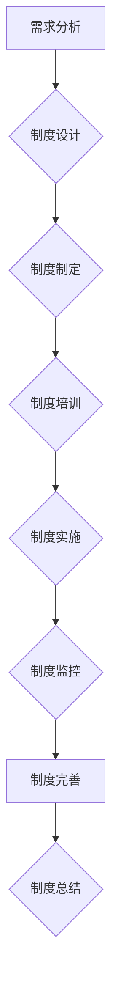

                 

# 《一人公司的知识产权战略规划》

> **关键词：** 知识产权、一人公司、商标、专利、版权、战略规划、风险管理

> **摘要：** 本文将围绕一人公司的知识产权战略规划进行深入探讨，分析知识产权的基础知识，包括商标、专利、版权等，并详细阐述知识产权战略规划的重要性、框架和实施步骤。此外，还将介绍知识产权管理制度建设、项目管理、法律风险防控和实战案例解析，以帮助一人公司构建全面的知识产权战略体系。

## 目录大纲

### 第一部分：知识产权基础

#### 第1章：知识产权概述
- **1.1 知识产权的定义与类型**
- **1.2 知识产权的法律体系和保护机制**

#### 第2章：商标策略
- **2.1 商标的定义与重要性**
- **2.2 商标注册流程与策略**
- **2.3 商标管理与维权**

#### 第3章：专利策略
- **3.1 专利的定义与类型**
- **3.2 专利申请流程与策略**
- **3.3 专利组合策略与许可**

#### 第4章：版权策略
- **4.1 版权的定义与类型**
- **4.2 著作权保护策略**
- **4.3 软件版权保护策略**

#### 第5章：知识产权运营
- **5.1 知识产权评估与价值分析**
- **5.2 知识产权交易与许可**
- **5.3 知识产权融资与保险**

### 第二部分：知识产权战略规划

#### 第6章：知识产权战略规划框架
- **6.1 知识产权战略规划的重要性**
- **6.2 知识产权战略规划流程**
- **6.3 知识产权战略规划工具与方法**

#### 第7章：知识产权战略实施与监控
- **7.1 知识产权战略实施步骤**
- **7.2 知识产权监控与预警**
- **7.3 知识产权风险管理**

#### 第8章：知识产权战略调整与优化
- **8.1 知识产权战略调整的原因**
- **8.2 知识产权战略优化方法**
- **8.3 案例分析：成功与失败的知识产权战略调整**

### 第三部分：知识产权管理与实战

#### 第9章：知识产权管理制度建设
- **9.1 知识产权管理制度的定义与作用**
- **9.2 知识产权管理制度建设步骤**
- **9.3 知识产权管理制度模板与案例**

#### 第10章：知识产权项目管理
- **10.1 知识产权项目管理框架**
- **10.2 知识产权项目计划与执行**
- **10.3 知识产权项目评估与总结**

#### 第11章：知识产权法律风险防控
- **11.1 知识产权法律风险识别**
- **11.2 知识产权法律风险防控策略**
- **11.3 案例分析：知识产权法律风险防控实践**

#### 第12章：知识产权实战案例解析
- **12.1 国内知识产权实战案例**
- **12.2 国外知识产权实战案例**
- **12.3 案例分析与启示**

### 附录

#### 附录A：知识产权相关法律法规
- **A.1 我国知识产权法律法规概述**
- **A.2 我国知识产权主要法律法规**

#### 附录B：知识产权工具与资源
- **B.1 知识产权数据库与检索工具**
- **B.2 知识产权管理软件与应用**

#### 附录C：知识产权战略规划与实施流程图

#### 附录D：知识产权管理制度模板

#### 附录E：知识产权项目计划与报告模板

---

在接下来的文章中，我们将逐步深入探讨一人公司知识产权战略规划的各个方面，帮助读者全面了解和掌握知识产权的管理与运营策略。

### 第一部分：知识产权基础

#### 第1章：知识产权概述

知识产权是指人类智力劳动产生的成果所有权，是智力劳动产生的成果转化成的权利。它通常包括专利权、商标权、著作权（版权）以及反不正当竞争中的商业秘密等。知识产权不仅是创新成果的重要保护手段，也是企业竞争力的重要体现。在现代社会，知识产权的战略规划对企业的发展至关重要。

##### 1.1 知识产权的定义与类型

知识产权的定义可以从以下几个方面来理解：

1. **专利权**：指对发明、实用新型和外观设计等创新技术成果的独占权利。专利权具有地域性和时效性，通常在申请后20年内受到法律保护。

2. **商标权**：指对商标的独占使用权。商标是企业识别产品和服务的重要标志，能够在市场竞争中帮助消费者区分不同的品牌。商标权通常具有永久性，但在续展期内受到保护。

3. **著作权**：指对文学、艺术和科学作品的原创性的表达所享有的权利。著作权保护作品的表达形式，而非其思想或技术方案。著作权通常在作品创作完成后自动产生，但不同国家的保护期限有所不同。

4. **商业秘密**：指不为公众所知悉、具有商业价值、经权利人采取保密措施的技术信息、经营信息等商业信息。商业秘密的保护通常依赖于企业的保密措施和法律规定。

知识产权的类型可以根据不同的分类标准进行划分。例如，根据法律体系，知识产权可以分为以下几类：

1. **工业产权**：包括专利权和商标权。
2. **版权**：包括著作权和邻接权。
3. **其他知识产权**：包括地理标志、集成电路布图设计、植物新品种等。

##### 1.2 知识产权的法律体系和保护机制

知识产权的法律体系由各国国内法和国际法共同构成。国内法主要包括专利法、商标法、著作权法等，这些法律为知识产权的保护提供了具体的法律依据和程序。国际法主要包括世界知识产权组织（WIPO）制定的《伯尔尼公约》、《巴黎公约》等国际条约，这些条约旨在促进国际间的知识产权合作和保护。

知识产权的保护机制主要包括以下几个方面：

1. **法律保护**：通过法律手段对知识产权进行保护，包括侵权诉讼、行政处理等。
2. **行政保护**：通过行政程序对知识产权进行保护，如商标的行政裁决、专利的行政审查等。
3. **技术保护**：通过技术手段对知识产权进行保护，如加密技术、数字签名等。
4. **社会保护**：通过社会监督、舆论引导等手段，提高公众对知识产权保护的意识。

知识产权的法律体系和保护机制对于企业具有重要意义。一方面，它能够确保企业的创新成果得到合法保护，避免商业秘密泄露和市场竞争力下降；另一方面，它能够为企业提供法律依据，对抗侵权行为，维护企业的合法权益。

在下一章中，我们将进一步探讨商标策略，包括商标的定义与重要性、商标注册流程与策略、商标管理与维权等方面。

## 第2章：商标策略

商标是企业的重要资产之一，它是企业识别产品和服务的重要标志，能够在市场竞争中帮助消费者区分不同的品牌。有效的商标策略能够提高企业的品牌知名度，增强企业的市场竞争力。本章将详细介绍商标的定义与重要性、商标注册流程与策略、商标管理与维权等内容。

### 2.1 商标的定义与重要性

商标是指任何能够将企业的产品或服务与其他企业的产品或服务区分开的标志。这些标志可以是文字、图形、字母、数字、三维标志、颜色组合等，甚至可以包括声音、味道、气味等。商标的主要作用在于标识和区分，它帮助消费者在众多品牌中找到自己熟悉和信赖的产品或服务。

商标的重要性体现在以下几个方面：

1. **品牌识别**：商标是企业品牌形象的核心元素，它能够帮助企业树立独特的品牌形象，提升品牌价值。

2. **市场竞争**：一个强有力的商标能够帮助企业在激烈的市场竞争中脱颖而出，吸引消费者的注意，提高市场份额。

3. **知识产权**：商标是知识产权的一种，通过注册商标，企业可以获得法律保护，防止他人未经许可使用相同或类似的商标，维护企业的合法权益。

4. **无形资产**：商标是企业的重要无形资产，它能够为企业带来经济利益，如商标许可、商标转让等。

### 2.2 商标注册流程与策略

商标注册是获得商标权的重要步骤。商标注册流程通常包括以下环节：

1. **商标查询**：在申请商标注册前，企业需要对拟申请的商标进行查询，以确保商标不存在相同或类似的商标已在先注册。

2. **商标申请**：查询无结果后，企业可以提交商标注册申请。申请文件包括商标图样、申请书、申请人身份证明等。

3. **商标审查**：商标局对申请文件进行形式审查和实质审查。形式审查主要是检查申请文件是否符合法定要求，实质审查则是对商标的新颖性、显著性等进行审查。

4. **公告与异议**：商标申请通过审查后，会进入公告期。公告期为3个月，任何第三方可以在公告期内提出异议。若无异议或异议不成立，商标注册将获得批准。

5. **商标注册证书**：商标注册成功后，企业将获得商标注册证书，商标权受到法律保护。

在商标注册过程中，企业可以采取以下策略：

1. **优先保护**：利用国际商标注册的马德里体系，先在目标市场国家申请商标注册，获得优先权。

2. **分类注册**：根据产品或服务的不同，将商标分为多个类别进行注册，确保商标权的全面保护。

3. **防御性注册**：在未使用商标的潜在竞争领域进行注册，防止他人抢注。

4. **商标续展**：商标注册有效期为10年，需在商标到期前进行续展，以保持商标权的持续有效。

### 2.3 商标管理与维权

商标管理是企业长期战略的重要组成部分。有效的商标管理能够确保商标权的稳定性和品牌价值的提升。以下是商标管理的一些关键点：

1. **商标监控**：定期对市场上的商标使用情况进行监控，及时发现和处理侵权行为。

2. **商标评估**：定期对商标资产进行评估，了解商标的市场价值和潜在风险。

3. **商标许可**：合理利用商标许可，扩大商标的使用范围，实现商标价值的最大化。

4. **商标维权**：在商标遭到侵权时，及时采取法律手段进行维权，包括诉讼、调解等。

商标维权是企业保护商标权益的重要手段。以下是一些商标维权的策略：

1. **取证**：在侵权行为发生时，及时收集证据，包括商标使用情况、侵权产品等。

2. **诉讼**：通过法院诉讼，追究侵权者的法律责任，维护企业的合法权益。

3. **调解**：在诉讼过程中，可以尝试通过调解解决纠纷，减少诉讼成本和时间。

4. **合作**：与专业的知识产权律师事务所合作，提高维权的效率和成功率。

在下一章中，我们将探讨专利策略，包括专利的定义与类型、专利申请流程与策略、专利组合策略与许可等内容。

## 第3章：专利策略

专利是知识产权的重要组成部分，它能够为企业提供强有力的技术保护，提升企业的市场竞争力。有效的专利策略能够帮助企业保护核心技术，防止竞争对手抄袭，并在国际市场上占据有利地位。本章将详细介绍专利的定义与类型、专利申请流程与策略、专利组合策略与许可等内容。

### 3.1 专利的定义与类型

专利是指国家专利机关根据专利申请人的申请，在一定期限内授予的独占权利。专利主要保护发明，即对产品、方法或其改进所提出的新的技术方案。根据技术领域和权利性质的不同，专利可以分为以下几种类型：

1. **发明专利**：保护发明的新技术方案，如机器、设备、方法等。发明专利的保护期限通常为20年。

2. **实用新型专利**：保护发明中的改进技术方案，通常是对现有技术的改进。实用新型专利的保护期限通常为10年。

3. **外观设计专利**：保护产品外观的新设计，如形状、图案、色彩等。外观设计专利的保护期限通常为15年。

专利的类型不仅反映了技术的创新程度，还体现了企业在技术领域的竞争策略。例如，在竞争激烈的市场中，企业可以通过申请外观设计专利来保护其产品的外观，防止竞争对手抄袭；而在技术领先的市场中，企业则可以申请发明专利，保护其核心技术，提高市场壁垒。

### 3.2 专利申请流程与策略

专利申请是获得专利权的关键步骤。专利申请流程通常包括以下环节：

1. **专利检索**：在申请专利前，进行专利检索是非常重要的。通过检索，可以了解相关技术的专利状况，避免重复申请，提高申请成功率。

2. **专利申请**：专利申请文件主要包括专利请求书、说明书、权利要求书等。申请文件需要明确、准确地描述发明内容，并提供必要的实验数据或示意图。

3. **专利审查**：专利局对申请文件进行形式审查和实质审查。形式审查主要是检查申请文件是否符合法定要求，实质审查则是对发明的新颖性、创造性和实用性进行审查。

4. **专利授权**：通过审查的专利申请将被公告，并在公告期结束后获得授权。专利授权后，企业将获得专利证书，专利权受到法律保护。

在专利申请过程中，企业可以采取以下策略：

1. **技术定位**：根据市场需求和企业的技术实力，确定申请专利的技术领域和方向。

2. **专利布局**：在全球范围内进行专利布局，保护企业的核心技术，提高国际市场的竞争力。

3. **联合申请**：与科研机构、高校等合作，共同申请专利，提高专利申请的成功率。

4. **专利预警**：定期进行专利检索和分析，了解竞争对手的专利布局，提前制定应对策略。

### 3.3 专利组合策略与许可

专利组合策略是指企业通过申请和管理多个专利，构建一个相互补充、相互支持的专利网络，以增强企业的技术竞争力。专利组合策略包括以下几个方面：

1. **核心专利与外围专利**：核心专利是企业的核心技术，外围专利则是围绕核心专利的技术扩展。通过核心专利与外围专利的相互配合，可以形成完整的专利布局。

2. **专利交叉许可**：专利交叉许可是指多家企业相互许可使用对方的专利，从而实现资源的共享和互补。通过专利交叉许可，企业可以降低专利诉讼风险，提高专利利用效率。

3. **专利池**：专利池是指多个专利组成的一个专利组合，这些专利在技术上相互补充，形成完整的解决方案。专利池可以为企业提供强大的技术保护，提高市场竞争力。

专利许可是指企业将自己的专利许可给其他企业使用，以获取许可费用。专利许可包括以下几种形式：

1. **独占许可**：许可方授予受许可方独占使用专利的权利，其他第三方不得使用该专利。

2. **排他许可**：许可方授予受许可方使用专利的权利，但许可方自己仍保留使用专利的权利。

3. **普通许可**：许可方授予受许可方使用专利的权利，但许可方和其他第三方仍可以使用该专利。

4. **交叉许可**：多家企业相互许可使用对方的专利，实现资源的共享和互补。

通过专利组合策略和许可，企业可以最大化利用专利资产，提高专利的利用效率，实现技术创新和商业价值的提升。

在下一章中，我们将探讨版权策略，包括版权的定义与类型、著作权保护策略、软件版权保护策略等内容。

## 第4章：版权策略

版权，即著作权，是对文学、艺术和科学作品的原创性表达所享有的权利。版权策略对于企业，尤其是技术创新型企业，具有重要意义。有效的版权策略能够保护企业的原创成果，维护企业的知识产权，提升企业的市场竞争力。本章将详细介绍版权的定义与类型、著作权保护策略、软件版权保护策略等内容。

### 4.1 版权的定义与类型

版权是指创作者对其创作的文学、艺术和科学作品享有的权利。这些权利包括复制权、发行权、出租权、展示权、表演权、改编权、翻译权等。版权是基于创作行为产生的，不需要任何注册或申请，创作完成后即自动产生。然而，为了更好地保护作品，许多国家鼓励或要求创作者进行版权登记。

根据权利内容和对象的不同，版权可以分为以下几种类型：

1. **文学版权**：保护文字作品，如小说、诗歌、剧本等。

2. **艺术版权**：保护美术作品、摄影作品、雕塑作品等。

3. **音乐版权**：保护音乐作品，包括歌曲、乐曲等。

4. **戏剧版权**：保护戏剧作品，如剧本、剧本翻译、舞台表演等。

5. **电影版权**：保护电影作品，包括剧本、导演、摄影、剪辑等。

6. **软件版权**：保护计算机软件的源代码和目标代码，保护软件的独创性表达。

版权不仅是创作者个人的权利，也是企业的重要资产。通过版权，企业可以保护其原创技术方案、设计图纸、营销材料等，防止他人未经许可使用或抄袭，维护企业的合法权益。

### 4.2 著作权保护策略

著作权保护策略是企业维护版权权益的重要手段。以下是一些常见的著作权保护策略：

1. **版权登记**：在创作完成后，及时进行版权登记，以获得法律保护。版权登记不仅有助于维权，还可以作为商业交易的重要依据。

2. **版权声明**：在作品上明确标示版权信息，如版权所有者、版权声明等，以告知公众作品的版权归属，防止他人未经授权使用。

3. **版权监控**：定期监控市场上的作品使用情况，及时发现侵权行为，采取法律手段维权。

4. **版权许可**：通过版权许可，授权他人使用作品，获取许可费用。版权许可可以采取独占许可、排他许可、普通许可等形式，根据具体情况进行灵活安排。

5. **版权维权**：在发现侵权行为时，及时采取法律手段维权，包括起诉、调解等。维权过程中，应充分收集证据，制定详细的维权计划。

6. **版权管理**：建立完善的版权管理制度，包括版权登记、版权监控、版权许可、版权维权等，确保版权资产的稳定和持续增长。

### 4.3 软件版权保护策略

软件版权保护策略是技术创新型企业特别关注的方面。以下是一些软件版权保护策略：

1. **源代码保护**：对源代码进行加密，防止他人非法获取和篡改。加密技术可以包括算法加密、数据隐藏等。

2. **软件版权声明**：在软件产品中明确标示版权信息，如版权所有者、版权声明等，告知用户软件的版权归属。

3. **软件注册**：将软件作为作品进行版权登记，获得法律保护。软件注册可以作为商业交易的重要依据。

4. **软件开发协议**：与软件开发人员签订合同，明确软件的版权归属，防止软件侵权。

5. **技术保护**：采用数字水印、数字签名等技术手段，确保软件的原创性和唯一性。

6. **版权监控与维权**：定期监控市场上的软件使用情况，及时发现侵权行为，采取法律手段维权。

通过有效的版权策略，企业可以保护其软件产品的原创性，防止竞争对手抄袭，提升企业的市场竞争力。

在下一章中，我们将探讨知识产权运营，包括知识产权评估与价值分析、知识产权交易与许可、知识产权融资与保险等内容。

## 第5章：知识产权运营

知识产权运营是企业有效管理、利用和保护知识产权的重要手段。通过知识产权运营，企业可以实现知识产权的保值增值，提升企业的市场竞争力。本章将详细介绍知识产权评估与价值分析、知识产权交易与许可、知识产权融资与保险等内容。

### 5.1 知识产权评估与价值分析

知识产权评估是指对知识产权的内在价值进行科学、系统的评估，以确定其在市场交易中的价值。知识产权评估对于企业的知识产权管理和决策具有重要意义。以下是一些知识产权评估的方法：

1. **成本法**：根据知识产权的开发成本、维护成本和机会成本进行评估。这种方法适用于评估早期阶段的知识产权。

   伪代码：
   ```plaintext
   function costBasedValuation(costOfDevelopment, costOfMaintenance, opportunityCost) {
       return costOfDevelopment + costOfMaintenance + opportunityCost;
   }
   ```

2. **市场法**：通过比较市场上类似知识产权的交易价格，评估知识产权的价值。这种方法适用于成熟市场的知识产权。

   伪代码：
   ```plaintext
   function marketBasedValuation(averageMarketPrice) {
       return averageMarketPrice;
   }
   ```

3. **收益法**：根据知识产权带来的未来收益预测，评估知识产权的价值。这种方法适用于具有明显经济效益的知识产权。

   伪代码：
   ```plaintext
   function revenueBasedValuation(annualRevenue, discountRate) {
       return (annualRevenue / discountRate);
   }
   ```

知识产权价值分析是评估过程中至关重要的一环。通过分析知识产权的技术特点、市场前景、竞争态势等因素，可以更准确地评估知识产权的价值。以下是一个简单的知识产权价值分析框架：

1. **技术分析**：评估知识产权的技术先进性、创新性和实用性。

2. **市场分析**：分析知识产权在市场上的需求、竞争态势和发展前景。

3. **法律分析**：评估知识产权的法律保护状况，包括专利的有效性、商标的显著性等。

4. **经济分析**：预测知识产权带来的经济收益，包括直接收益和间接收益。

### 5.2 知识产权交易与许可

知识产权交易是指知识产权权利人将知识产权转让或授权给他人使用的行为。知识产权交易可以采取以下形式：

1. **转让**：知识产权权利人将其拥有的知识产权完全转让给他人。转让后，原权利人不再享有知识产权。

2. **许可**：知识产权权利人许可他人使用其知识产权，但保留部分权利。许可可以采取独占许可、排他许可、普通许可等形式。

知识产权交易与许可的过程中，企业需要关注以下要点：

1. **合同条款**：明确知识产权的转让或许可范围、期限、费用等。合同条款应具有法律效力，确保双方权益。

2. **评估价值**：根据知识产权的评估结果，确定交易价格或许可费用。

3. **法律合规**：确保交易过程符合相关法律法规，如商标法、专利法、著作权法等。

4. **交易保密**：在交易过程中，企业应保护知识产权的机密性，防止泄露商业秘密。

知识产权交易与许可可以为企业带来以下收益：

1. **资金收入**：通过知识产权转让或许可，获取资金收入。

2. **技术合作**：与其他企业合作，共享知识产权，实现资源互补。

3. **市场扩展**：通过许可他人使用知识产权，拓展市场，提高品牌知名度。

4. **风险管理**：通过转让或许可，分散知识产权风险，降低潜在的法律纠纷。

### 5.3 知识产权融资与保险

知识产权融资是指企业利用其拥有的知识产权进行融资，获取资金支持。知识产权保险则是指为知识产权资产提供风险保障。以下是一些常见的知识产权融资与保险方式：

1. **知识产权质押融资**：企业以其拥有的知识产权作为质押物，向金融机构申请贷款。这种方式可以快速获取资金，但需要关注知识产权的价值评估和质押物的风险。

2. **知识产权融资租赁**：企业通过将知识产权出租给第三方，获得租金收入，进而实现融资。

3. **知识产权证券化**：将知识产权打包成证券，出售给投资者，实现融资。

4. **知识产权保险**：为知识产权资产提供保险，保障企业在知识产权遭受侵权时的损失。

知识产权融资与保险可以为企业带来以下收益：

1. **资金支持**：通过知识产权融资，企业可以快速获取资金，支持技术研发和市场拓展。

2. **风险保障**：通过知识产权保险，企业可以降低知识产权遭受侵权时的风险。

3. **风险管理**：通过知识产权融资与保险，企业可以分散知识产权风险，降低潜在的法律纠纷。

4. **提升估值**：知识产权融资与保险有助于提升企业的市场估值，吸引投资者。

通过有效的知识产权运营，企业可以最大化利用知识产权资产，提升市场竞争力，实现可持续发展。在下一章中，我们将探讨知识产权战略规划，包括战略规划的重要性、规划流程、工具与方法等内容。

## 第6章：知识产权战略规划

知识产权战略规划是企业系统管理知识产权、提升知识产权价值、实现长期发展目标的重要手段。有效的知识产权战略规划能够帮助企业建立强大的知识产权保护体系，提升市场竞争力，实现技术创新和商业价值的最大化。本章将详细介绍知识产权战略规划的重要性、规划流程、工具与方法等内容。

### 6.1 知识产权战略规划的重要性

知识产权战略规划的重要性体现在以下几个方面：

1. **保护核心竞争力**：知识产权战略规划有助于企业保护其核心竞争力，防止关键技术和技术秘密泄露，确保企业的竞争优势。

2. **提升市场竞争力**：通过知识产权战略规划，企业可以优化知识产权布局，加强知识产权保护，提高市场竞争力，拓展市场份额。

3. **实现商业价值**：知识产权战略规划能够帮助企业最大化利用知识产权资产，通过知识产权转让、许可、融资等方式实现商业价值。

4. **降低法律风险**：知识产权战略规划有助于企业识别和规避知识产权风险，降低法律纠纷和侵权风险，确保企业的合法权益。

5. **促进技术创新**：知识产权战略规划能够激励企业进行技术创新，推动企业不断研发新产品、新技术，提升企业的技术水平和创新能力。

### 6.2 知识产权战略规划流程

知识产权战略规划流程包括以下几个关键步骤：

1. **需求分析**：明确企业的知识产权需求，包括技术研发方向、市场拓展计划、竞争对手分析等。

2. **现状评估**：对企业的现有知识产权进行评估，包括知识产权数量、质量、保护范围等。

3. **目标设定**：根据企业的战略目标和市场需求，设定知识产权战略目标，如提升专利数量、优化商标布局、保护技术秘密等。

4. **策略制定**：制定具体的知识产权策略，包括知识产权申请、保护、运营、融资等。

5. **实施与监控**：实施知识产权战略规划，并对规划过程进行监控，确保各项策略得到有效执行。

6. **调整与优化**：根据实施情况，对知识产权战略规划进行调整和优化，确保战略规划能够持续适应市场需求和企业发展。

### 6.3 知识产权战略规划工具与方法

知识产权战略规划过程中，可以采用以下工具与方法：

1. **知识产权地图**：知识产权地图是一种可视化工具，用于展示企业的知识产权布局和知识产权网络。通过知识产权地图，可以直观地了解企业的知识产权分布情况，优化知识产权布局。

   Mermaid流程图示例：
   ```mermaid
   graph TD
   A[知识产权地图] --> B[商标布局]
   A --> C[专利布局]
   A --> D[版权布局]
   A --> E[知识产权网络]
   ```

2. **SWOT分析**：SWOT分析是一种战略规划工具，用于评估企业的优势、劣势、机会和威胁。通过SWOT分析，可以全面了解企业的知识产权状况，制定合适的知识产权战略。

   伪代码：
   ```plaintext
   function SWOTAnalysis(strengths, weaknesses, opportunities, threats) {
       return {
           strengths: strengths,
           weaknesses: weaknesses,
           opportunities: opportunities,
           threats: threats
       };
   }
   ```

3. **战略规划矩阵**：战略规划矩阵是一种用于评估和选择知识产权战略的决策工具。通过战略规划矩阵，可以综合考虑知识产权的价值、市场需求、竞争对手等因素，制定最优的知识产权战略。

   伪代码：
   ```plaintext
   function strategicPlanningMatrix(values, marketDemand, competition) {
       return {
           value: values,
           marketDemand: marketDemand,
           competition: competition
       };
   }
   ```

4. **知识产权风险评估**：知识产权风险评估是一种用于识别和评估知识产权风险的工具。通过知识产权风险评估，可以提前发现潜在风险，制定相应的风险管理策略。

   伪代码：
   ```plaintext
   function intellectualPropertyRiskAssessment(externalRisks, internalRisks) {
       return {
           externalRisks: externalRisks,
           internalRisks: internalRisks
       };
   }
   ```

5. **知识产权财务管理**：知识产权财务管理是一种用于管理知识产权资产价值的工具。通过知识产权财务管理，可以监控知识产权资产的价值变化，制定相应的财务管理策略。

   伪代码：
   ```plaintext
   function intellectualPropertyFinancialManagement(value, inflationRate, growthRate) {
       return {
           value: value,
           inflationRate: inflationRate,
           growthRate: growthRate
       };
   }
   ```

通过以上工具与方法，企业可以全面、系统地制定和实施知识产权战略规划，提升知识产权管理水平，实现企业的长期发展目标。

在下一章中，我们将探讨知识产权战略实施与监控，包括战略实施步骤、监控与预警、风险管理等内容。

## 第7章：知识产权战略实施与监控

知识产权战略的实施与监控是确保知识产权战略规划目标实现的关键环节。有效的实施与监控体系能够帮助企业在激烈的市场竞争中，充分发挥知识产权的优势，确保知识产权价值的最大化。本章将详细介绍知识产权战略实施步骤、监控与预警、风险管理等内容。

### 7.1 知识产权战略实施步骤

知识产权战略实施步骤包括以下关键环节：

1. **制定详细计划**：根据知识产权战略规划，制定详细的实施计划，明确实施时间表、责任分配、资源需求等。实施计划应具体、可行，确保各项任务有序推进。

2. **分配资源**：根据实施计划，合理分配人力资源、财务资源、技术资源等，确保各项任务能够得到充分支持。

3. **任务执行**：按照实施计划，分阶段、分步骤地推进各项任务。在执行过程中，应密切关注任务进展，及时解决遇到的困难和问题。

4. **过程监控**：建立监控机制，定期对知识产权战略实施过程进行监控。监控内容应包括任务完成情况、资源利用情况、成本控制等。

5. **评估与反馈**：在任务完成后，进行评估与反馈，总结经验教训，对实施效果进行评价。根据评估结果，对知识产权战略进行优化和调整。

### 7.2 知识产权监控与预警

知识产权监控与预警是知识产权战略实施的重要环节。通过有效的监控与预警机制，企业可以及时发现知识产权风险，采取相应的措施进行预防和应对。

1. **知识产权监控**：知识产权监控主要包括以下几个方面：

   - **专利监控**：定期对市场上的专利申请和授权情况进行监控，了解竞争对手的技术动向和专利布局。
   - **商标监控**：关注市场上商标的使用情况，及时发现商标侵权行为。
   - **版权监控**：监控市场上的版权作品使用情况，防范侵权行为。

2. **预警机制**：建立预警机制，对潜在知识产权风险进行提前识别和预警。预警机制应包括以下几个方面：

   - **情报收集**：收集国内外知识产权相关法律法规、政策动态、竞争对手情报等，为预警提供信息支持。
   - **风险分析**：对收集到的情报进行分析，识别潜在的风险点。
   - **预警发布**：对潜在风险进行评估，发布预警信息，提醒相关部门和人员采取相应措施。

### 7.3 知识产权风险管理

知识产权风险管理是知识产权战略实施的重要组成部分。通过有效的知识产权风险管理，企业可以降低知识产权风险，确保知识产权资产的稳定性和安全性。

1. **风险识别**：识别知识产权可能面临的风险，包括法律风险、技术风险、市场风险等。

   伪代码：
   ```plaintext
   function identifyRisks(legalRisks, technicalRisks, marketRisks) {
       return {
           legalRisks: legalRisks,
           technicalRisks: technicalRisks,
           marketRisks: marketRisks
       };
   }
   ```

2. **风险评估**：对识别到的知识产权风险进行评估，分析风险的可能性和影响程度。

   伪代码：
   ```plaintext
   function assessRisks(risks) {
       for (risk in risks) {
           risk['probability'] = calculateProbability(risk);
           risk['impact'] = calculateImpact(risk);
       }
       return risks;
   }
   ```

3. **风险应对**：根据风险评估结果，制定相应的风险应对策略，包括风险规避、风险转移、风险减轻等。

   伪代码：
   ```plaintext
   function handleRisks(risks) {
       for (risk in risks) {
           if (risk['probability'] * risk['impact'] > threshold) {
               applyRiskMitigation(risk);
           }
       }
   }
   ```

4. **风险监控**：建立风险监控机制，对知识产权风险进行持续监控，确保风险应对措施得到有效执行。

   伪代码：
   ```plaintext
   function monitorRisks(risks) {
       while (true) {
           for (risk in risks) {
               checkRiskStatus(risk);
           }
           sleep(interval);
       }
   }
   ```

通过有效的知识产权战略实施与监控，企业可以确保知识产权战略规划目标的实现，提升知识产权管理水平，为企业的长期发展提供有力支持。在下一章中，我们将探讨知识产权战略调整与优化，包括战略调整的原因、优化方法、案例分析等内容。

## 第8章：知识产权战略调整与优化

在企业的快速发展过程中，知识产权战略也需要不断地调整与优化，以适应市场变化和技术进步。有效的知识产权战略调整与优化能够帮助企业更好地应对外部环境的变化，提高知识产权管理的效率和效果。本章将详细介绍知识产权战略调整的原因、优化方法、案例分析等内容。

### 8.1 知识产权战略调整的原因

知识产权战略调整的原因多种多样，主要包括以下几个方面：

1. **市场变化**：市场环境的变化，如市场需求的变化、竞争态势的变化等，都会影响企业的知识产权战略。例如，随着新技术的兴起，企业可能需要调整知识产权布局，以适应市场的变化。

2. **技术进步**：技术的不断进步，特别是新兴技术的出现，会改变企业的技术创新方向，从而影响知识产权战略。例如，人工智能、区块链等技术的快速发展，要求企业重新评估和调整其知识产权保护策略。

3. **法律环境**：知识产权法律环境的变化，如新法律法规的颁布、国际贸易协议的调整等，都会影响企业的知识产权战略。企业需要根据法律环境的变化，及时调整其知识产权管理策略。

4. **内部因素**：企业内部因素的变化，如组织结构的变化、研发方向的变化等，也会影响知识产权战略。例如，企业重组或并购后，可能需要对知识产权进行重新整合和优化。

### 8.2 知识产权战略优化方法

知识产权战略优化方法主要包括以下几个方面：

1. **动态调整**：根据市场变化、技术进步和法律环境的变化，及时调整知识产权战略。例如，通过定期进行市场调研和技术预测，了解市场和技术的发展趋势，及时调整知识产权布局。

2. **技术创新**：鼓励技术创新，推动知识产权创造，提高知识产权质量。例如，通过增加研发投入、加强研发团队建设等，提高知识产权的技术含量和竞争力。

3. **知识产权组合优化**：对现有知识产权进行组合优化，提高知识产权的整体效益。例如，通过分析知识产权之间的互补性，制定合理的知识产权组合策略，提高知识产权的保护效果。

4. **国际化布局**：加强国际化布局，提高知识产权的国际保护水平。例如，通过申请国际专利、注册国际商标等，扩大知识产权的保护范围，提高企业的国际竞争力。

5. **风险防控**：加强知识产权风险防控，降低知识产权风险。例如，通过建立知识产权监控预警机制、进行知识产权风险评估等，及时发现和应对知识产权风险。

### 8.3 案例分析：成功与失败的知识产权战略调整

为了更好地理解知识产权战略调整与优化的方法和效果，下面通过两个案例分析，探讨成功与失败的知识产权战略调整。

#### 案例一：成功的知识产权战略调整

**企业背景**：A公司是一家专注于软件开发的高科技企业，产品涵盖多个领域，如云计算、大数据、人工智能等。

**案例描述**：随着人工智能技术的快速发展，A公司意识到人工智能将成为未来市场的热点。因此，A公司决定调整其知识产权战略，加大在人工智能领域的研发投入，申请更多与人工智能相关的专利，并加强对人工智能商标的保护。

**调整措施**：

1. **加大研发投入**：增加对人工智能技术的研发投入，组建专门的研发团队，提高人工智能技术的研发水平。

2. **申请国际专利**：在全球范围内申请与人工智能相关的专利，扩大专利保护范围，提高国际市场的竞争力。

3. **商标保护升级**：加强对人工智能商标的保护，通过商标国际注册、许可等方式，确保商标在各个市场的独特性和显著性。

**调整效果**：

通过成功的知识产权战略调整，A公司在人工智能领域取得了显著成果。其专利数量和质量得到了显著提升，商标保护范围进一步扩大，市场份额得到了显著提高。A公司成功地抓住了人工智能市场的机遇，实现了业务的快速发展。

#### 案例二：失败的知识产权战略调整

**企业背景**：B公司是一家生产家电产品的企业，市场份额较大，但在知识产权管理方面存在不足。

**案例描述**：随着智能家居市场的兴起，B公司决定调整其知识产权战略，加大在智能家居领域的研发投入，但过于急功近利，忽视了知识产权的风险管理。

**调整措施**：

1. **快速研发**：迅速组建智能家居研发团队，推出多款智能家居产品。

2. **申请专利**：快速申请与智能家居相关的专利，以抢占市场先机。

3. **商标注册**：在多个市场进行商标注册，提高品牌知名度。

**调整效果**：

由于B公司在知识产权战略调整过程中忽视了风险管理，导致知识产权纠纷频发，严重影响了企业的声誉和市场竞争力。虽然B公司在智能家居领域取得了一定的市场份额，但知识产权纠纷给企业带来了巨大的经济损失和品牌损害。

**案例分析**：

从以上两个案例可以看出，成功的知识产权战略调整需要充分考虑市场变化、技术进步和法律环境，同时加强知识产权风险管理和保护。而失败的知识产权战略调整则往往因为忽视了知识产权风险管理，导致知识产权纠纷频发，严重影响企业的正常运营和发展。

通过以上案例，我们可以得出以下启示：

1. **合理规划**：知识产权战略调整需要科学合理，充分考虑企业的实际情况和市场环境。

2. **加强风险管理**：在知识产权战略调整过程中，应加强风险管理，防范知识产权风险。

3. **持续优化**：知识产权战略不是一成不变的，应持续进行优化，以适应不断变化的市场和技术环境。

通过有效的知识产权战略调整与优化，企业可以更好地应对外部环境的变化，提高知识产权管理水平，实现企业的长期发展目标。

## 第9章：知识产权管理制度建设

知识产权管理制度是企业系统管理知识产权的重要工具，它有助于企业有效地保护、管理和利用知识产权，提升企业的核心竞争力。本章将详细介绍知识产权管理制度的定义与作用、管理制度建设步骤、管理制度模板与案例等内容。

### 9.1 知识产权管理制度的定义与作用

知识产权管理制度是指企业为了保护、管理和利用知识产权而制定的一系列规章制度和操作流程。这些制度包括知识产权的获取、保护、使用、转让、许可、监控和维权等方面。知识产权管理制度的作用主要体现在以下几个方面：

1. **保护知识产权**：通过知识产权管理制度，企业可以规范知识产权的获取和保护过程，确保知识产权的合法权益得到有效维护。

2. **提升管理效率**：知识产权管理制度有助于企业建立统一的知识产权管理流程，提高知识产权管理的效率，降低管理成本。

3. **优化资源配置**：知识产权管理制度可以合理配置企业的人力、物力和财力资源，确保知识产权工作得到充分的支持和保障。

4. **促进技术创新**：知识产权管理制度鼓励企业进行技术创新和研发投入，推动企业的技术进步和核心竞争力提升。

5. **防范法律风险**：知识产权管理制度有助于企业识别和规避知识产权法律风险，降低侵权诉讼和纠纷的可能性。

### 9.2 知识产权管理制度建设步骤

知识产权管理制度建设是一个系统性的工程，包括以下几个关键步骤：

1. **需求分析**：分析企业知识产权管理的现状和需求，确定管理制度建设的方向和重点。

2. **制度设计**：根据需求分析结果，设计符合企业实际的知识产权管理制度，包括知识产权获取、保护、使用、转让、许可、监控和维权等方面的具体规定。

3. **制度制定**：将设计的知识产权管理制度转化为具体的规章制度，明确各相关部门的职责和权限，确保制度的可操作性和实施性。

4. **制度培训**：对员工进行知识产权管理制度的培训，提高员工的知识产权意识和能力，确保制度得到有效执行。

5. **制度实施**：在全面推广知识产权管理制度的过程中，进行定期检查和评估，及时发现和解决制度执行中存在的问题。

6. **制度完善**：根据实施过程中的反馈，对知识产权管理制度进行不断完善和优化，确保制度能够持续适应企业发展的需求。

### 9.3 知识产权管理制度模板与案例

以下是一个简化的知识产权管理制度模板，企业可以根据自身实际情况进行修改和完善：

#### 知识产权管理制度模板

**一、总则**

1. **目的**：规范本企业的知识产权管理，保护企业的知识产权权益，提升企业核心竞争力。
2. **适用范围**：本制度适用于企业内部所有涉及知识产权的相关活动。

**二、知识产权获取**

1. **专利申请**：企业应按照相关法律法规，及时申请专利，保护技术创新成果。
2. **商标注册**：企业应重视商标注册，确保品牌形象和市场地位。
3. **著作权登记**：企业应重视著作权登记，保护文学、艺术和科学作品的原创性。

**三、知识产权保护**

1. **保护措施**：企业应采取技术和管理措施，防止知识产权被侵权或泄露。
2. **法律维权**：企业应建立健全的知识产权法律维权体系，及时应对侵权行为。

**四、知识产权使用**

1. **内部使用**：企业内部应合理使用知识产权，提高知识产权的利用效率。
2. **外部许可**：企业应积极开展知识产权许可，实现知识产权的共享和增值。

**五、知识产权转让**

1. **转让原则**：企业应按照公平、公正、合理的原则进行知识产权转让。
2. **转让程序**：知识产权转让应经过相关部门的审批，确保转让合法、有效。

**六、知识产权监控**

1. **监控内容**：企业应定期对知识产权进行监控，包括专利、商标、著作权等方面的监控。
2. **预警机制**：企业应建立知识产权预警机制，及时发现和处理侵权行为。

**七、知识产权维权**

1. **维权原则**：企业应坚持合法维权，保护企业的合法权益。
2. **维权程序**：企业应制定详细的维权程序，确保维权工作高效、有序进行。

**八、附则**

1. **解释权**：本制度的解释权归企业知识产权管理部门。
2. **生效日期**：本制度自发布之日起生效。

以下是一个具体的知识产权管理制度建设案例：

**案例：某科技公司的知识产权管理制度建设**

某科技公司是一家专注于高科技研发的企业，为了提升知识产权管理水平，制定了以下知识产权管理制度：

1. **需求分析**：通过对企业知识产权管理现状的调研，发现企业在知识产权获取、保护、使用和监控等方面存在不足。

2. **制度设计**：根据需求分析结果，设计了一套包括知识产权获取、保护、使用、转让、许可、监控和维权等方面的管理制度。

3. **制度制定**：将设计的管理制度转化为具体的规章制度，明确各部门的职责和权限，并制定了详细的操作流程。

4. **制度培训**：对全体员工进行知识产权管理制度的培训，确保员工熟悉和理解管理制度的内容。

5. **制度实施**：在全面推广知识产权管理制度的过程中，定期进行检查和评估，及时发现和解决制度执行中存在的问题。

6. **制度完善**：根据实施过程中的反馈，对管理制度进行不断完善和优化，确保制度能够持续适应企业发展的需求。

通过建立完善的知识产权管理制度，某科技公司的知识产权管理水平得到了显著提升，企业核心竞争力也得到了增强。

在下一章中，我们将探讨知识产权项目管理，包括项目管理框架、项目计划与执行、项目评估与总结等内容。

## 第10章：知识产权项目管理

知识产权项目管理是确保企业知识产权战略规划顺利实施的关键环节。有效的知识产权项目管理能够提高知识产权的获取、保护、运用效率，降低知识产权风险，提升企业的核心竞争力。本章将详细介绍知识产权项目管理框架、项目计划与执行、项目评估与总结等内容。

### 10.1 知识产权项目管理框架

知识产权项目管理框架是指用于指导和管理知识产权项目的系统化方法和工具。一个完整的知识产权项目管理框架通常包括以下几个关键部分：

1. **项目目标**：明确知识产权项目的目标，包括知识产权的获取、保护、运用等。

2. **项目范围**：界定知识产权项目的范围，包括项目涉及的具体技术、市场、法律等方面。

3. **项目团队**：组建专业的知识产权项目团队，包括项目经理、知识产权专员、法律顾问等。

4. **项目计划**：制定知识产权项目的详细计划，包括时间表、资源分配、风险应对等。

5. **项目执行**：按照项目计划，分阶段、分步骤地推进知识产权项目。

6. **项目监控**：建立监控机制，对知识产权项目的进展情况进行实时监控。

7. **项目评估**：在项目完成后，对知识产权项目的成果和效果进行评估。

8. **项目总结**：总结知识产权项目的经验教训，形成文档，为后续项目提供参考。

### 10.2 知识产权项目计划与执行

知识产权项目计划与执行是知识产权项目管理的核心环节。以下是一个简化的知识产权项目计划与执行流程：

1. **项目启动**：

   - **项目立项**：明确知识产权项目的目标和范围，进行立项决策。

   - **组建团队**：组建知识产权项目团队，明确各成员的职责和任务。

   - **制定项目计划**：制定知识产权项目的详细计划，包括时间表、资源分配、风险应对等。

2. **项目执行**：

   - **任务分解**：将知识产权项目任务分解为可操作的具体任务，明确任务责任人。

   - **资源分配**：根据任务需求，合理分配人力资源、财务资源、技术资源等。

   - **任务执行**：按照项目计划，分阶段、分步骤地推进知识产权项目。

   - **进度监控**：定期对知识产权项目的进展情况进行监控，确保项目按计划进行。

   - **风险管理**：对知识产权项目进行风险评估，制定相应的风险应对措施。

3. **项目收尾**：

   - **成果验收**：对知识产权项目的成果进行验收，确保项目目标达成。

   - **文档整理**：整理知识产权项目的相关文档，包括项目计划、任务记录、评估报告等。

   - **项目总结**：总结知识产权项目的经验教训，形成文档，为后续项目提供参考。

### 10.3 知识产权项目评估与总结

知识产权项目评估与总结是知识产权项目管理的重要组成部分。通过项目评估与总结，企业可以了解知识产权项目的实际效果，发现问题，持续改进。

1. **项目评估**：

   - **评估指标**：根据项目目标和范围，制定评估指标，如专利数量、专利质量、商标注册数量、版权登记数量等。

   - **评估方法**：采用定量和定性相结合的方法，对知识产权项目的成果和效果进行评估。

   - **评估结果**：对知识产权项目进行综合评估，分析项目的成功因素和不足之处。

2. **项目总结**：

   - **总结内容**：总结知识产权项目的整体情况，包括项目目标、范围、执行过程、成果和效果等。

   - **经验教训**：总结项目过程中的经验教训，分析成功因素和不足之处，提出改进措施。

   - **改进建议**：根据项目评估结果，提出知识产权管理方面的改进建议，为后续项目提供参考。

以下是一个简化的知识产权项目评估与总结模板：

#### 知识产权项目评估与总结报告

**一、项目概述**

1. 项目名称：_______

2. 项目目标：_______

3. 项目范围：_______

4. 项目时间：_______

5. 项目团队：_______

**二、项目成果**

1. 专利数量：_______

2. 专利质量：_______

3. 商标注册数量：_______

4. 版权登记数量：_______

**三、项目评估**

1. 评估指标：_______

2. 评估结果：_______

3. 成功因素：_______

4. 不足之处：_______

**四、经验教训**

1. 项目成功因素：_______

2. 项目不足之处：_______

3. 改进措施：_______

**五、改进建议**

1. 知识产权管理改进措施：_______

2. 项目管理改进措施：_______

通过知识产权项目评估与总结，企业可以不断优化知识产权管理，提高知识产权管理水平和项目执行效率。

在下一章中，我们将探讨知识产权法律风险防控，包括风险识别、防控策略、实战案例等内容。

## 第11章：知识产权法律风险防控

知识产权法律风险防控是知识产权管理中的重要环节，它关系到企业的合法权益和市场竞争力的维护。有效的知识产权法律风险防控能够帮助企业识别潜在的法律风险，采取相应的措施进行预防和控制。本章将详细介绍知识产权法律风险识别、防控策略、实战案例等内容。

### 11.1 知识产权法律风险识别

知识产权法律风险识别是知识产权法律风险防控的第一步，它涉及对可能引发法律纠纷的各种因素进行系统分析和识别。以下是一些常见的知识产权法律风险：

1. **侵权风险**：企业可能侵犯他人的知识产权，如专利、商标、著作权等。

2. **泄露风险**：企业的商业秘密和技术秘密可能被泄露，导致竞争优势下降。

3. **合同风险**：在知识产权转让、许可、合作等过程中，合同条款可能存在漏洞，引发纠纷。

4. **诉讼风险**：企业可能面临他人的知识产权诉讼，导致经济损失和声誉损害。

5. **法规风险**：企业可能因违反知识产权法律法规而受到处罚或制裁。

6. **国际化风险**：在跨国运营中，企业可能因不了解不同国家和地区的知识产权法律而面临风险。

为了有效识别知识产权法律风险，企业可以采取以下措施：

1. **定期培训**：对员工进行知识产权法律风险的培训，提高员工的知识产权法律意识。

2. **风险评估**：定期对企业的知识产权进行风险评估，识别潜在的法律风险。

3. **外部咨询**：聘请专业的知识产权律师或顾问，为企业提供法律风险识别和防控建议。

### 11.2 知识产权法律风险防控策略

知识产权法律风险防控策略是针对识别出的法律风险，采取一系列措施进行预防和控制。以下是一些常见的知识产权法律风险防控策略：

1. **风险管理计划**：制定详细的知识产权风险管理计划，明确风险识别、评估、防控和监控的具体措施。

2. **合同审查**：在知识产权转让、许可、合作等过程中，对合同进行严格审查，确保合同条款的合法性和有效性。

3. **知识产权保护**：加强知识产权保护，包括专利申请、商标注册、版权登记等，确保企业的知识产权得到法律保护。

4. **侵权监测**：定期监测市场上的知识产权使用情况，及时发现侵权行为，采取法律手段进行维权。

5. **法律培训**：定期对员工进行知识产权法律知识培训，提高员工的知识产权保护意识和能力。

6. **建立预警机制**：建立知识产权法律风险预警机制，对潜在的法律风险进行提前识别和预警。

### 11.3 案例分析：知识产权法律风险防控实践

以下是一个具体的知识产权法律风险防控案例：

**案例背景**：

某科技公司（以下简称A公司）在开发一款智能家居产品时，使用了第三方公司的专利技术。由于未进行充分的专利检索，A公司未能发现该技术已受到专利保护。

**案例描述**：

1. **风险识别**：在产品上市后，A公司收到一封来自专利权人（以下简称B公司）的警告信，指出A公司的产品侵犯了B公司的专利权。

2. **风险评估**：A公司立即对专利风险进行评估，发现B公司的专利确实保护了相关技术，而A公司的产品确实使用了这些技术。

3. **法律应对**：

   - **协商解决**：A公司与B公司进行协商，希望能够通过支付许可费用来解决问题。

   - **法律咨询**：A公司聘请了专业的知识产权律师，对案件进行深入分析，制定法律应对策略。

4. **防控措施**：

   - **立即停止侵权**：A公司立即停止销售侵权产品，避免进一步损失。

   - **签订许可协议**：在律师的建议下，A公司与B公司签订了许可协议，获得了专利使用权。

   - **加强专利监控**：A公司加强了对市场上专利的监控，避免再次发生类似侵权事件。

**案例结果**：

通过有效的法律风险防控措施，A公司成功避免了法律纠纷带来的严重后果。虽然需要支付一定的许可费用，但通过合法合规的方式获得了专利使用权，确保了产品的市场销售。

**案例分析**：

从上述案例可以看出，知识产权法律风险防控的重要性。通过及时的风险识别、评估和应对，企业可以有效降低知识产权法律风险，维护企业的合法权益和市场竞争力。

在下一章中，我们将通过国内外的知识产权实战案例，进一步探讨知识产权管理的成功经验和启示。

## 第12章：知识产权实战案例解析

知识产权管理在企业竞争中的重要性不言而喻。通过分析国内外企业的知识产权实战案例，我们可以获得宝贵的经验和启示，帮助企业更好地制定和实施知识产权战略。本章将介绍一些国内外的知识产权实战案例，并进行分析与启示。

### 12.1 国内知识产权实战案例

#### 案例一：华为的知识产权布局

**案例背景**：

华为是全球领先的通信技术解决方案提供商，其在知识产权管理方面有着卓越的表现。华为通过全球范围内的专利布局，构建了强大的知识产权防线，保护其技术创新成果。

**案例描述**：

1. **专利申请**：华为每年投入大量资金进行专利研发，截至2021年，华为在全球范围内已累计申请了10万余件专利。

2. **国际专利布局**：华为在欧美、日本等主要市场进行了广泛的专利布局，确保其在国际市场上的竞争优势。

3. **专利许可**：华为通过专利许可，与其他企业共享技术，实现互利共赢。

**案例分析**：

华为的知识产权布局策略主要包括以下几个方面：

1. **重视技术创新**：华为投入大量资金进行研发，确保专利的技术含量和竞争力。

2. **全球化布局**：通过国际专利布局，华为在全球市场建立了强大的知识产权防线。

3. **开放合作**：通过专利许可，华为不仅保护了自身的知识产权，还促进了技术的共享和传播。

**启示**：

1. **加强技术创新**：企业应重视技术研发，提高专利的技术含量。

2. **全球化布局**：企业应进行全球范围内的知识产权布局，确保在国际市场上的竞争力。

3. **开放合作**：通过专利许可，企业可以实现资源的共享和互补，提升整体的竞争力。

### 12.2 国外知识产权实战案例

#### 案例二：苹果的知识产权维权

**案例背景**：

苹果公司是全球知名的高科技企业，其在知识产权维权方面有着丰富的经验。苹果公司多次在国内外进行知识产权诉讼，以保护其产品的知识产权。

**案例描述**：

1. **诉讼案件**：苹果公司曾起诉三星、高通等企业，指控其侵犯苹果的专利权。其中，与三星的专利侵权诉讼历时多年，最终苹果公司获得了赔偿。

2. **专利许可**：苹果公司通过签订专利许可协议，与高通、英特尔等企业合作，共享专利技术。

**案例分析**：

苹果公司在知识产权维权方面采取了以下几个策略：

1. **积极维权**：苹果公司对于专利侵权行为采取零容忍的态度，积极进行诉讼维权。

2. **专利许可**：通过专利许可，苹果公司不仅保护了自身的知识产权，还获得了许可费用。

3. **法律团队**：苹果公司拥有专业的知识产权法律团队，为维权提供强有力的支持。

**启示**：

1. **积极维权**：企业应重视知识产权维权，对侵权行为采取果断措施。

2. **专利许可**：通过专利许可，企业可以实现知识产权的价值最大化。

3. **专业团队**：企业应建立专业的知识产权法律团队，提高维权效率。

### 12.3 案例分析与启示

通过以上国内外知识产权实战案例，我们可以得出以下几点分析和启示：

1. **重视知识产权保护**：企业应重视知识产权保护，建立完善的知识产权管理制度，确保知识产权的合法性和稳定性。

2. **全球化布局**：企业应进行全球范围内的知识产权布局，确保在国际市场上的竞争力。

3. **技术创新**：企业应加强技术研发，提高专利的技术含量和竞争力。

4. **积极维权**：企业应积极进行知识产权维权，对侵权行为采取果断措施。

5. **专利许可**：通过专利许可，企业可以实现知识产权的价值最大化。

6. **专业团队**：企业应建立专业的知识产权法律团队，提高维权效率。

通过借鉴国内外企业的知识产权实战经验，企业可以更好地制定和实施知识产权战略，提升市场竞争力，实现可持续发展。

## 附录

### 附录A：知识产权相关法律法规

#### A.1 我国知识产权法律法规概述

我国知识产权法律法规主要包括《中华人民共和国专利法》、《中华人民共和国商标法》、《中华人民共和国著作权法》、《中华人民共和国反不正当竞争法》等。

#### A.2 我国知识产权主要法律法规

1. **《中华人民共和国专利法》**：规定了专利的申请、审查、授权、保护等方面的内容。

2. **《中华人民共和国商标法》**：规定了商标的注册、使用、保护等方面的内容。

3. **《中华人民共和国著作权法》**：规定了著作权的保护、使用、转让等方面的内容。

4. **《中华人民共和国反不正当竞争法》**：规定了不正当竞争行为的界定和处理。

### 附录B：知识产权工具与资源

#### B.1 知识产权数据库与检索工具

1. **国家知识产权局数据库**：提供专利、商标、版权等知识产权的检索服务。

2. **WIPO专利数据库**：提供全球范围内的专利检索服务。

3. **Google专利搜索**：提供全球范围内的专利检索服务。

#### B.2 知识产权管理软件与应用

1. **Intellectual Asset Management (IAM) 软件套件**：用于知识产权管理和监控。

2. **Innography**：提供知识产权分析、竞争情报和合作机会。

3. **IPlytics**：提供知识产权分析、监控和预测服务。

### 附录C：知识产权战略规划与实施流程图



### 附录D：知识产权管理制度模板

**知识产权管理制度**

**一、总则**

1. **目的**：规范本企业的知识产权管理，保护企业的知识产权权益，提升企业核心竞争力。

2. **适用范围**：本制度适用于企业内部所有涉及知识产权的相关活动。

**二、知识产权获取**

1. **专利申请**：企业应按照相关法律法规，及时申请专利，保护技术创新成果。

2. **商标注册**：企业应重视商标注册，确保品牌形象和市场地位。

3. **著作权登记**：企业应重视著作权登记，保护文学、艺术和科学作品的原创性。

**三、知识产权保护**

1. **保护措施**：企业应采取技术和管理措施，防止知识产权被侵权或泄露。

2. **法律维权**：企业应建立健全的知识产权法律维权体系，及时应对侵权行为。

**四、知识产权使用**

1. **内部使用**：企业内部应合理使用知识产权，提高知识产权的利用效率。

2. **外部许可**：企业应积极开展知识产权许可，实现知识产权的共享和增值。

**五、知识产权转让**

1. **转让原则**：企业应按照公平、公正、合理的原则进行知识产权转让。

2. **转让程序**：知识产权转让应经过相关部门的审批，确保转让合法、有效。

**六、知识产权监控**

1. **监控内容**：企业应定期对知识产权进行监控，包括专利、商标、著作权等方面的监控。

2. **预警机制**：企业应建立知识产权预警机制，及时发现和处理侵权行为。

**七、知识产权维权**

1. **维权原则**：企业应坚持合法维权，保护企业的合法权益。

2. **维权程序**：企业应制定详细的维权程序，确保维权工作高效、有序进行。

**八、附则**

1. **解释权**：本制度的解释权归企业知识产权管理部门。

2. **生效日期**：本制度自发布之日起生效。

### 附录E：知识产权项目计划与报告模板

**知识产权项目计划与报告**

**一、项目概述**

1. **项目名称**：_______

2. **项目目标**：_______

3. **项目范围**：_______

4. **项目时间**：_______

5. **项目团队**：_______

**二、项目计划**

1. **任务分解**：_______

2. **资源分配**：_______

3. **时间表**：_______

**三、项目执行**

1. **进度监控**：_______

2. **风险管理**：_______

**四、项目评估**

1. **评估指标**：_______

2. **评估结果**：_______

**五、项目总结**

1. **经验教训**：_______

2. **改进措施**：_______

**六、附件**

1. **项目计划书**：_______

2. **任务记录**：_______

3. **评估报告**：_______

通过以上附录，企业可以更好地理解和应用知识产权管理相关的法律法规、工具与资源，以及制定和实施知识产权战略规划与项目计划。

## 作者信息

作者：AI天才研究院/AI Genius Institute & 禅与计算机程序设计艺术 /Zen And The Art of Computer Programming

