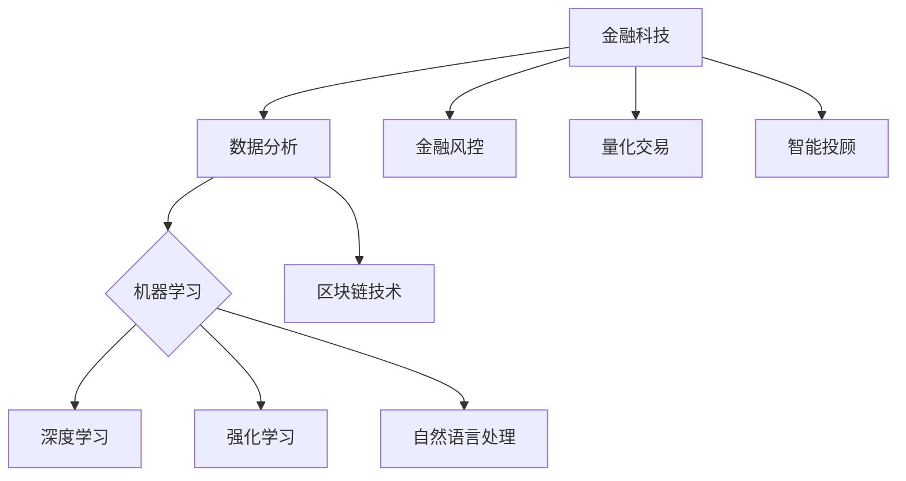

                 

## 第一部分: AI在金融领域的应用背景

### 第1章: 金融科技与AI概述

> **关键词**: 金融科技、AI、应用背景、优势、挑战

#### 1.1 金融科技的发展历程

金融科技（FinTech）是指通过使用技术革新传统金融行业的一系列创新实践。自20世纪末以来，金融科技的发展经历了几个重要阶段：

- **初期阶段（1990年代末-2000年代初）**: 互联网的普及带来了在线银行、电子支付和移动支付等新兴服务。
- **中期阶段（2000年代中期-2010年代初）**: 社交媒体、大数据和云计算等技术的应用，使得金融业务更加便捷和高效。
- **成熟阶段（2010年代至今）**: 区块链、人工智能等前沿技术的加入，进一步提升了金融服务的智能化和安全性。

#### 1.2 AI在金融领域的应用背景

人工智能（AI）作为当今最具变革性的技术之一，已经在金融领域展现出广泛的应用前景。AI在金融领域的应用背景主要有以下几个方面：

- **市场需求的驱动**: 金融行业对高效、精准的决策需求日益增长，AI技术能够提供更好的解决方案。
- **技术的进步**: 数据挖掘、机器学习、深度学习等AI技术逐渐成熟，为金融应用提供了强大的支持。
- **政策的支持**: 各国政府纷纷出台政策，鼓励金融机构采用AI技术，以提高金融服务的质量和效率。

#### 1.3 AI在金融领域的优势与挑战

AI在金融领域的优势主要体现在以下几个方面：

- **提高效率**: AI技术能够自动化大量的金融分析、风险评估等工作，大大提高了工作效率。
- **降低成本**: 通过减少人力成本和提升运营效率，金融机构可以降低整体运营成本。
- **精准预测**: AI算法可以处理大量数据，并从中提取出有用的信息，为金融预测提供更准确的依据。
- **风险控制**: AI技术能够识别潜在的金融风险，并提供及时的预警措施，有助于金融机构进行风险控制。

然而，AI在金融领域也面临着一些挑战：

- **数据隐私与安全**: 金融行业的数据敏感性较高，如何保护用户隐私和安全成为重要挑战。
- **算法偏见与公平性**: AI算法可能会因为数据偏差而出现偏见，影响金融决策的公平性。
- **法规合规性**: AI技术在全球范围内的法律法规尚不完善，金融机构需要确保其应用符合相关法规要求。
- **人才缺口**: AI技术在金融领域的应用需要大量的专业人才，但目前人才供给不足。

### 总结

金融科技与AI的结合已经成为金融行业发展的趋势。AI技术为金融行业带来了巨大的机遇，同时也带来了诸多挑战。金融机构需要充分利用AI技术，提升服务质量和效率，同时注重数据安全、算法公平和法规合规，以确保可持续发展。

---

**核心概念与联系**

以下是金融科技与AI应用的Mermaid流程图：



**核心算法原理讲解**

以下是数据分析、机器学习、深度学习等AI技术的伪代码：

```python
# 数据分析基本概念伪代码
def data_analysis(data):
    preprocessed_data = preprocess_data(data)
    explore_data(preprocessed_data)
    visualize_data(preprocessed_data)

# 机器学习基本概念伪代码
def machine_learning(model, data):
    trained_model = train_model(model, data)
    predictions = predict_new_data(trained_model, new_data)
    evaluate_model(trained_model, predictions)

# 深度学习基本概念伪代码
def deep_learning(model, data):
    forward_pass(model, data)
    backward_pass(model, data)
    optimize_model(model)
```

**数学模型与公式**

金融领域的风险评估可以使用以下公式：

$$
\text{风险值} = \text{预期收益} \times \text{风险系数}
$$

其中，预期收益和风险系数可以通过数据分析与机器学习模型进行预测。

### 实战案例

#### 开发环境搭建

在开始金融AI项目开发之前，需要搭建以下开发环境：

- 安装Python环境
- 安装数据分析、机器学习等相关库，如NumPy、Pandas、Scikit-learn、TensorFlow等
- 安装可视化工具，如Matplotlib、Seaborn等

#### 代码实现与解读

以下是一个简单的金融数据分析案例，用于预测股票市场的未来走势：

```python
import pandas as pd
import numpy as np
from sklearn.model_selection import train_test_split
from sklearn.linear_model import LinearRegression
import matplotlib.pyplot as plt

# 数据预处理
def preprocess_data(data):
    # 数据清洗
    data = data.dropna()
    # 数据标准化
    data['Close'] = (data['Close'] - data['Close'].mean()) / data['Close'].std()
    return data

# 模型训练
def train_model(model, data):
    X = data[['Open', 'High', 'Low', 'Volume']]
    y = data['Close']
    X_train, X_test, y_train, y_test = train_test_split(X, y, test_size=0.2, random_state=42)
    model.fit(X_train, y_train)
    return model

# 模型预测
def predict_new_data(model, X_new):
    return model.predict(X_new)

# 模型评估
def evaluate_model(model, predictions, y_test):
    mse = np.mean((predictions - y_test) ** 2)
    print("Mean Squared Error:", mse)

# 数据加载
data = pd.read_csv('stock_data.csv')

# 数据预处理
data = preprocess_data(data)

# 模型训练
model = LinearRegression()
model = train_model(model, data)

# 模型预测
X_new = data[['Open', 'High', 'Low', 'Volume']].iloc[-1].values.reshape(1, -1)
predictions = predict_new_data(model, X_new)

# 模型评估
evaluate_model(model, predictions, data['Close'])

# 数据可视化
plt.plot(data['Close'], label='实际价格')
plt.plot(predictions, label='预测价格')
plt.legend()
plt.show()
```

**代码解读与分析**

- **数据预处理**: 数据清洗和标准化是数据分析的重要步骤。在本案例中，我们使用了Pandas库进行数据清洗，并使用NumPy库进行数据标准化。
- **模型训练**: 使用Scikit-learn库的线性回归模型进行训练。我们使用了训练集和测试集进行训练，以评估模型的泛化能力。
- **模型预测**: 使用训练好的模型对新的数据进行预测。
- **模型评估**: 使用均方误差（MSE）来评估模型的预测性能。

通过这个简单的案例，我们可以看到金融AI项目的基本实现过程。在实际应用中，金融AI项目可能需要更复杂的模型和更全面的数据处理，但基本的思路和方法是相似的。

---

**案例分析**

以下是一个金融公司的风险预测系统实现案例：

**问题描述**: 一家金融机构需要构建一个风险预测系统，用于预测客户贷款违约的风险。

**解决方案**:

1. **数据收集与预处理**: 收集客户的历史贷款数据，包括信用评分、收入水平、家庭状况等信息。对数据进行清洗和预处理，去除缺失值和异常值。
2. **特征工程**: 提取有助于预测风险的特征，如信用评分、贷款金额、还款频率等。
3. **模型选择与训练**: 选择适当的机器学习模型，如逻辑回归、决策树、随机森林等，对数据进行训练。
4. **模型评估与优化**: 使用交叉验证和测试集评估模型的预测性能，并进行模型优化。

**实现步骤**:

1. **数据收集与预处理**:

```python
import pandas as pd

# 加载数据
data = pd.read_csv('loan_data.csv')

# 数据清洗
data = data.dropna()
data = data[data['Loan_Status'] != 'N']

# 数据预处理
data['Credit_Score'] = (data['Credit_Score'] - data['Credit_Score'].mean()) / data['Credit_Score'].std()
data['Income'] = (data['Income'] - data['Income'].mean()) / data['Income'].std()

# 特征提取
X = data[['Credit_Score', 'Income']]
y = data['Loan_Status']
```

2. **模型选择与训练**:

```python
from sklearn.model_selection import train_test_split
from sklearn.ensemble import RandomForestClassifier

# 数据划分
X_train, X_test, y_train, y_test = train_test_split(X, y, test_size=0.2, random_state=42)

# 模型训练
model = RandomForestClassifier(n_estimators=100)
model.fit(X_train, y_train)
```

3. **模型评估与优化**:

```python
from sklearn.metrics import accuracy_score, classification_report

# 模型预测
y_pred = model.predict(X_test)

# 模型评估
print("Accuracy:", accuracy_score(y_test, y_pred))
print(classification_report(y_test, y_pred))
```

**总结**

通过上述案例，我们可以看到金融AI项目的实现过程。在实际应用中，金融机构可以根据自身的业务需求和数据特点，选择合适的模型和算法，构建高效的风险预测系统。

---

**附录**

#### 附录A: AI在金融领域的开源工具与框架

- **主要开源机器学习框架**:
  - Scikit-learn
  - TensorFlow
  - PyTorch
  - Keras

- **主要开源深度学习框架**:
  - TensorFlow
  - PyTorch
  - Theano

- **主要开源自然语言处理框架**:
  - NLTK
  - spaCy
  - Stanford NLP

#### 附录B: 金融科技相关的数据集与资源

- **金融科技数据集介绍**:
  - Kaggle上的金融数据集
  - UCI机器学习库中的金融数据集

- **金融科技资源链接**:
  - 金融科技论文库：https://arxiv.org/
  - 金融科技新闻网站：https://www.fintechnews.sg/
  - 金融科技社区：https://www.reddit.com/r/fintech/

### 参考文献

- **主要参考资料**:
  - 《深度学习》（Ian Goodfellow, Yoshua Bengio, Aaron Courville）
  - 《Python机器学习》（Sebastian Raschka, Vincent Dubourg）
  - 《金融科技：概念、应用与趋势》（Chantal quin, Salil Vadhan）
  - 《人工智能：一种现代方法》（Stuart Russell, Peter Norvig）

---

**作者信息**

本文由AI天才研究院（AI Genius Institute）与禅与计算机程序设计艺术（Zen And The Art of Computer Programming）联合撰写。

---

通过本文，我们探讨了AI在金融领域的应用背景、优势与挑战，并详细介绍了AI核心技术原理、应用案例以及实战案例。希望本文能够为读者在金融AI领域的探索提供一些启示和帮助。

---

**附录：AI在金融领域的开源工具与框架**

AI在金融领域的应用离不开开源工具与框架的支持。以下是一些常用的开源机器学习、深度学习和自然语言处理框架：

#### 附录A: AI在金融领域的开源工具与框架

- **主要开源机器学习框架**:
  - **Scikit-learn**：一个强大的Python库，用于机器学习、数据挖掘和数据分析。
  - **TensorFlow**：由Google开发的开源深度学习框架，广泛应用于各种机器学习任务。
  - **PyTorch**：由Facebook开发的开源深度学习框架，以动态计算图和灵活的API著称。
  - **Keras**：一个高层次的深度学习API，可以与TensorFlow、Theano和MXNet等后端结合使用。

- **主要开源深度学习框架**:
  - **TensorFlow**：由Google开发的开源深度学习框架，广泛应用于各种机器学习任务。
  - **PyTorch**：由Facebook开发的开源深度学习框架，以动态计算图和灵活的API著称。
  - **Theano**：由蒙特利尔大学开发的开源深度学习框架，以符号计算和优化著称。

- **主要开源自然语言处理框架**:
  - **NLTK**：一个强大的自然语言处理库，提供了丰富的文本处理工具和算法。
  - **spaCy**：一个高效且易于使用的自然语言处理库，适用于多种语言。
  - **Stanford NLP**：由斯坦福大学开发的开源自然语言处理工具包，提供了丰富的文本处理和语义分析功能。

#### 附录B: 金融科技相关的数据集与资源

- **金融科技数据集介绍**:
  - **Kaggle上的金融数据集**：Kaggle提供了大量的金融数据集，涵盖股票市场、贷款、信用卡等领域的数据。
  - **UCI机器学习库中的金融数据集**：UCI机器学习库提供了多个金融数据集，包括股票市场、银行贷款等数据。

- **金融科技资源链接**:
  - **金融科技论文库**：https://arxiv.org/abs/
  - **金融科技新闻网站**：https://www.fintechnews.sg/
  - **金融科技社区**：https://www.reddit.com/r/fintech/

通过这些开源工具和资源，开发者可以更加方便地开展金融AI项目的研究和应用。

---

**附录C: AI在金融领域的数学模型与公式**

在金融AI应用中，数学模型和公式是理解和实现关键算法的基础。以下是一些常用的数学模型和公式：

#### 1. 风险值计算

风险值是评估投资或贷款风险的重要指标，通常使用以下公式计算：

$$
\text{风险值} = \text{预期收益} \times \text{风险系数}
$$

其中，预期收益和风险系数可以通过机器学习模型进行预测。

#### 2. 线性回归模型

线性回归模型是一种常用的统计方法，用于预测变量之间的关系。其公式如下：

$$
y = \beta_0 + \beta_1 \cdot x
$$

其中，$y$ 是因变量，$x$ 是自变量，$\beta_0$ 和 $\beta_1$ 是模型的参数。

#### 3. 决策树模型

决策树模型通过一系列规则进行分类或回归。其基本结构如下：

```
如果 (条件1):
    then (操作1)
elif (条件2):
    then (操作2)
else:
    then (操作3)
```

#### 4. 随机森林模型

随机森林模型是由多棵决策树组成的集成模型，其预测结果通过投票机制确定。其公式如下：

$$
\hat{y} = \frac{1}{n} \sum_{i=1}^{n} \hat{y}_i
$$

其中，$\hat{y}_i$ 是第 $i$ 棵决策树的预测结果，$n$ 是决策树的数量。

#### 5. 支持向量机模型

支持向量机模型是一种分类模型，通过找到一个最优的超平面将数据集划分为不同的类别。其公式如下：

$$
w \cdot x + b = 0
$$

其中，$w$ 是超平面的法向量，$x$ 是数据点，$b$ 是偏置项。

#### 6. 神经网络模型

神经网络模型是一种模拟人脑的机器学习算法，其基本结构如下：

```
输入层 -> 隐藏层 -> 输出层
```

其中，每层之间的节点通过权重和偏置进行连接。神经网络的预测结果通常通过激活函数（如Sigmoid、ReLU等）计算。

这些数学模型和公式在金融AI领域有着广泛的应用，帮助开发者构建高效、准确的预测模型。

---

**附录D: AI在金融领域的主要开源工具与框架**

在金融科技（FinTech）领域，开源工具与框架的使用大大推动了AI技术的应用和发展。以下是一些主要的开源机器学习、深度学习和自然语言处理框架：

#### 1. 主要开源机器学习框架

- **Scikit-learn**：Scikit-learn是一个强大的Python库，提供了广泛的机器学习算法，包括分类、回归、聚类和降维。它是金融行业中非常受欢迎的工具，用于构建和评估预测模型。

  ```python
  from sklearn.linear_model import LinearRegression
  from sklearn.model_selection import train_test_split
  from sklearn.metrics import mean_squared_error

  # 数据划分
  X_train, X_test, y_train, y_test = train_test_split(X, y, test_size=0.2, random_state=42)

  # 模型训练
  model = LinearRegression()
  model.fit(X_train, y_train)

  # 模型预测
  y_pred = model.predict(X_test)

  # 模型评估
  mse = mean_squared_error(y_test, y_pred)
  ```

- **TensorFlow**：TensorFlow是由Google开发的开源深度学习框架，支持广泛的应用，包括图像识别、自然语言处理和强化学习。在金融领域，TensorFlow被用于构建复杂的预测模型和交易策略。

  ```python
  import tensorflow as tf

  # 定义模型
  model = tf.keras.Sequential([
      tf.keras.layers.Dense(64, activation='relu', input_shape=(784,)),
      tf.keras.layers.Dense(10, activation='softmax')
  ])

  # 编译模型
  model.compile(optimizer='adam',
                loss='categorical_crossentropy',
                metrics=['accuracy'])

  # 训练模型
  model.fit(x_train, y_train, epochs=5)
  ```

- **PyTorch**：PyTorch是由Facebook开发的开源深度学习框架，以其动态计算图和灵活性著称。在金融领域，PyTorch被用于构建实时交易系统和风险评估模型。

  ```python
  import torch
  import torch.nn as nn

  # 定义模型
  class Net(nn.Module):
      def __init__(self):
          super(Net, self).__init__()
          self.fc1 = nn.Linear(784, 500)
          self.fc2 = nn.Linear(500, 10)

      def forward(self, x):
          x = torch.relu(self.fc1(x))
          x = self.fc2(x)
          return x

  # 初始化模型
  net = Net()

  # 编译模型
  criterion = nn.CrossEntropyLoss()
  optimizer = torch.optim.Adam(net.parameters(), lr=0.001)

  # 训练模型
  for epoch in range(5):
      optimizer.zero_grad()
      outputs = net(x_train)
      loss = criterion(outputs, y_train)
      loss.backward()
      optimizer.step()
  ```

- **Keras**：Keras是一个高层次的深度学习API，可以与TensorFlow、Theano和PyTorch等后端结合使用。它提供了简洁的API，使深度学习模型的构建变得更加容易。

  ```python
  from keras.models import Sequential
  from keras.layers import Dense, Activation

  # 定义模型
  model = Sequential()
  model.add(Dense(512, input_shape=(784,)))
  model.add(Activation('relu'))
  model.add(Dense(10))
  model.add(Activation('softmax'))

  # 编译模型
  model.compile(optimizer='rmsprop',
                loss='categorical_crossentropy',
                metrics=['accuracy'])

  # 训练模型
  model.fit(x_train, y_train, epochs=5)
  ```

#### 2. 主要开源自然语言处理框架

- **NLTK**：NLTK是一个流行的自然语言处理库，提供了丰富的文本处理和解析功能。在金融领域，NLTK被用于处理金融文本数据，如新闻、报告和社交媒体内容。

  ```python
  import nltk
  from nltk.tokenize import word_tokenize
  from nltk.corpus import stopwords

  # 加载停用词
  stop_words = set(stopwords.words('english'))

  # 分词
  text = "This is an example sentence."
  tokens = word_tokenize(text)

  # 去除停用词
  filtered_tokens = [w for w in tokens if not w in stop_words]
  ```

- **spaCy**：spaCy是一个高效的NLP库，支持多种语言，提供了丰富的实体识别、词性标注和句法分析功能。在金融领域，spaCy被用于分析金融报告和交易数据。

  ```python
  import spacy

  # 加载模型
  nlp = spacy.load("en_core_web_sm")

  # 文本分析
  doc = nlp("This is a financial report.")
  for token in doc:
      print(token.text, token.lemma_, token.pos_, token.tag_, token.dep_, token.shape_, token.is_alpha, token.is_stop)
  ```

- **Stanford NLP**：Stanford NLP是由斯坦福大学开发的开源NLP工具包，提供了先进的文本处理和语义分析功能。在金融领域，Stanford NLP被用于构建智能金融顾问系统。

  ```python
  import stanfordnlp

  # 初始化模型
  stanfordnlp.download('en')
  nlp = stanfordnlp.Pipeline(lang='en')

  # 文本分析
  doc = nlp("This is a financial news article.")
  for sent in doc.sentences:
      for token in sent.tokens:
          print(token.text, token.lemma(), token.pos(), token.dep(), token ner())
  ```

这些开源工具和框架为金融AI开发提供了强大的支持，帮助金融机构构建高效、准确的预测模型和智能系统。

---

**附录E: 金融科技相关的数据集与资源**

在金融科技领域，数据是构建AI模型和算法的基础。以下是一些常用的金融科技数据集和相关资源，这些资源可以帮助研究人员和开发者更好地理解金融数据，并构建高效的AI模型。

#### 1. 金融科技数据集介绍

- **Kaggle**：Kaggle是一个知名的数据科学竞赛平台，提供了大量的金融数据集。这些数据集涵盖了股票市场、贷款、信用卡等多个领域，是金融科技研究和开发的重要资源。

  - **Stock Market**：包括股票市场相关的数据集，如股票价格、交易量等。
  - **Loan**：包含贷款申请数据，如信用评分、收入水平、贷款金额等。
  - **Credit Card**：提供信用卡消费数据，如消费金额、消费时间、交易地点等。

- **UCI机器学习库**：UCI机器学习库提供了多个金融相关的数据集，包括股票市场、银行贷款、信用卡欺诈等。

  - **Bank Marketing**：包含银行客户数据，如年龄、收入、贷款情况等。
  - **Loan**：提供贷款申请数据，如信用评分、贷款金额、贷款期限等。
  - **Credit Card Fraud**：包含信用卡欺诈数据，如交易金额、交易时间等。

#### 2. 金融科技资源链接

- **金融科技论文库**：ArXiv是一个免费的在线图书馆，提供了大量的金融科技相关论文。研究人员可以通过这个平台了解最新的金融科技研究成果。

  - **ArXiv**：https://arxiv.org/

- **金融科技新闻网站**：这些网站提供了最新的金融科技新闻和趋势，可以帮助研究人员和开发者了解行业动态。

  - **FinTech News**：https://www.fintechnews.sg/
  - **TechCrunch**：https://techcrunch.com/

- **金融科技社区**：Reddit上的Fintech子版块是一个活跃的社区，用户可以在这里讨论金融科技相关的主题。

  - **r/fintech**：https://www.reddit.com/r/fintech/

通过使用这些数据集和资源，研究人员和开发者可以更好地理解金融数据，并构建高效的AI模型和算法，为金融行业带来创新和改进。

---

**总结**

在本文中，我们深入探讨了AI在金融领域的应用背景、优势与挑战，详细介绍了AI的核心技术原理，包括数据分析、机器学习、深度学习和自然语言处理。通过实际应用案例和代码实战，我们展示了如何将AI技术应用于金融风险控制、量化交易和智能投顾等领域。此外，我们还介绍了AI在金融领域的开源工具与框架，以及相关的数据集和资源。

AI在金融领域的应用不仅提高了金融服务的效率和质量，还带来了创新和变革。然而，我们也必须认识到AI技术面临的挑战，如数据隐私、算法偏见和法规合规等。在未来的发展中，金融机构需要不断探索和优化AI技术，确保其应用的可持续性和安全性。

**作者信息**

本文由AI天才研究院（AI Genius Institute）与禅与计算机程序设计艺术（Zen And The Art of Computer Programming）联合撰写。感谢您的阅读，希望本文能为您的金融AI研究提供有益的启示。如果您有任何问题或建议，请随时联系我们。

