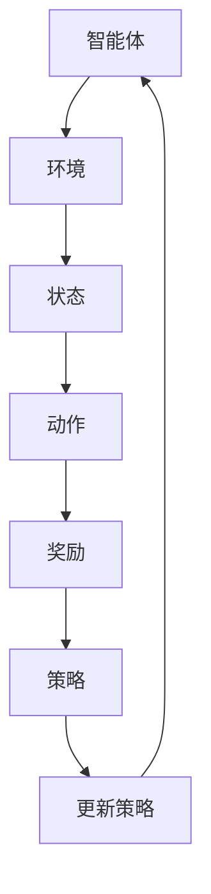
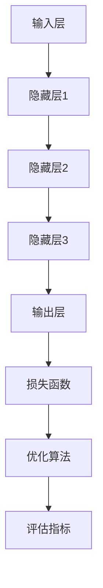
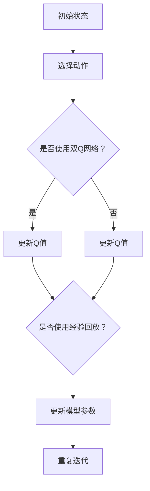
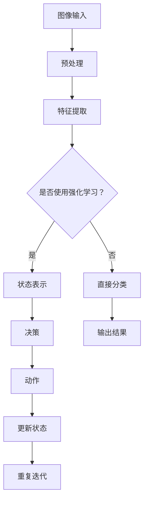
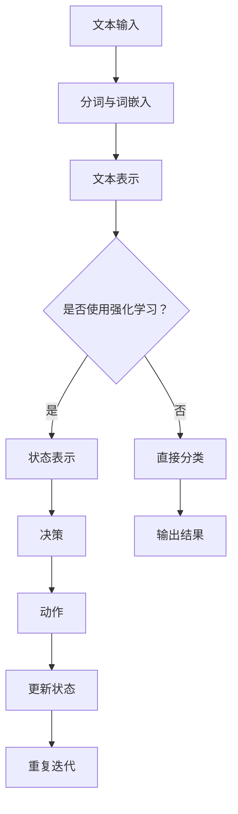

                 

# 一切皆是映射：强化学习基础及其与深度学习的结合

## 关键词
强化学习，深度学习，映射，值函数，策略，探索与利用，DQN，A3C，Rainbow算法，计算机视觉，自然语言处理，游戏AI，未来发展趋势。

## 摘要
本文旨在探讨强化学习与深度学习的结合及其基础理论。通过详细阐述强化学习的基本原理、算法及其与深度学习的结合，我们揭示了强化学习在计算机视觉、自然语言处理和游戏AI等领域的实际应用。同时，本文还展望了强化学习与深度学习的未来发展趋势，为读者提供了一个全面而深入的视角。

## 引言

### 1.1 强化学习与深度学习的关系

强化学习（Reinforcement Learning，RL）和深度学习（Deep Learning，DL）都是机器学习的分支，但它们在方法、目标和应用场景上有所不同。强化学习强调智能体（agent）通过与环境（environment）交互，不断学习最优策略（policy）的过程。而深度学习则是通过大规模数据训练深度神经网络，自动学习特征表示和复杂函数映射。强化学习与深度学习的结合，可以充分利用深度学习强大的特征表示能力，提高强化学习在复杂环境中的表现。

### 1.2 强化学习的基本概念

强化学习的基本概念包括智能体、环境、状态、动作、奖励和策略。智能体是执行动作的实体，环境是智能体所处的环境，状态是环境的描述，动作是智能体可以执行的操作，奖励是环境对智能体动作的反馈，策略是智能体根据状态选择动作的规则。

### 1.3 深度学习的基本概念

深度学习是机器学习的一个子领域，其核心是多层神经网络。深度学习的模型结构包括输入层、隐藏层和输出层，通过逐层提取特征，实现对数据的建模和预测。深度学习的应用涵盖了图像识别、自然语言处理、语音识别等多个领域。

### 1.4 强化学习与深度学习的结合意义

强化学习与深度学习的结合，可以发挥各自的优势，实现以下意义：

1. **提升学习效率**：深度学习可以自动提取复杂环境中的特征，降低强化学习的设计难度，提高学习效率。
2. **拓展应用领域**：强化学习可以应用于更多复杂的环境，深度学习可以提供更强的特征表示能力，二者结合可以拓展应用领域。
3. **提高决策质量**：深度学习可以学习到更加抽象和泛化的特征表示，提高强化学习在复杂决策问题中的表现。

## 第1章 强化学习基础

### 2.1 强化学习的基本原理

强化学习（Reinforcement Learning，RL）是机器学习的一个重要分支，旨在通过智能体（Agent）与环境（Environment）的交互，学习最优策略（Policy），以实现长期目标。强化学习的基本原理包括以下几个方面：

#### 2.1.1 强化学习的模型与元素

强化学习的模型通常包括智能体（Agent）、环境（Environment）、状态（State）、动作（Action）、奖励（Reward）和策略（Policy）六个主要元素。

1. **智能体（Agent）**：执行动作的实体。
2. **环境（Environment）**：智能体所处的环境，包括状态和奖励。
3. **状态（State）**：环境的当前状态，通常是一个向量。
4. **动作（Action）**：智能体可以执行的操作，通常也是一个向量。
5. **奖励（Reward）**：环境对智能体动作的反馈，可以是正值也可以是负值。
6. **策略（Policy）**：智能体根据状态选择动作的规则。

#### 2.1.2 强化学习的目标函数

强化学习的目标函数通常是最大化智能体的累积奖励。具体来说，智能体需要在无限长的序列中学习到最优策略，使得累积奖励最大化。

$$
J(\theta) = \sum_{t=0}^{\infty} r_t \cdot e^{-\gamma t}
$$

其中，$r_t$ 是在第 $t$ 时刻的奖励，$\gamma$ 是折扣因子，用于平衡当前奖励和未来奖励之间的关系。

#### 2.1.3 强化学习的奖励机制

奖励机制是强化学习中的关键部分，它决定了智能体的行为模式。奖励可以是绝对的，如完成任务得到的奖励；也可以是相对的，如对比当前状态和目标状态的差异。奖励机制的设计需要根据具体应用场景进行优化。

#### 2.1.4 强化学习的学习策略

强化学习的学习策略主要包括值函数（Value Function）和策略（Policy）两种。

1. **值函数（Value Function）**：值函数是智能体对每个状态的价值估计。对于离散状态空间，值函数可以用 $V(s)$ 表示；对于连续状态空间，值函数可以用 $V(s, a)$ 表示。值函数可以用来评估当前状态的价值，从而指导智能体的决策。

2. **策略（Policy）**：策略是智能体在给定状态下选择动作的规则。策略可以是确定性策略，也可以是概率性策略。确定性策略总是选择使值函数最大的动作，概率性策略则根据值函数来分配不同动作的概率。

### 2.2 强化学习的模型

强化学习模型可以分为基于值函数的模型和基于策略的模型两种。

#### 2.2.1 基于值函数的模型

基于值函数的模型通过估计状态价值或状态-动作价值来指导智能体的决策。其中，Q-learning和SARSA是两种常见的基于值函数的算法。

1. **Q-learning算法**

$$
Q(s, a) \leftarrow Q(s, a) + \alpha [r + \gamma \max_{a'} Q(s', a') - Q(s, a)]
$$

Q-learning算法通过更新状态-动作价值函数，逐步逼近最优策略。其中，$\alpha$ 是学习率，$r$ 是奖励，$\gamma$ 是折扣因子。

2. **SARSA算法**

$$
Q(s, a) \leftarrow Q(s, a) + \alpha [r + \gamma Q(s', a')]
$$

SARSA算法在每一步都根据当前状态和动作来更新值函数，不需要单独估计状态价值或状态-动作价值。

#### 2.2.2 基于策略的模型

基于策略的模型通过估计策略的参数来指导智能体的决策。REINFORCE、actor-critic和Advantage Actor-Critic（A2C）是三种常见的基于策略的算法。

1. **REINFORCE算法**

$$
\theta \leftarrow \theta + \alpha \cdot \frac{\partial L(\theta)}{\partial \theta} \cdot \sum_{t} \gamma^t \cdot R_t
$$

REINFORCE算法通过梯度上升法来优化策略参数。其中，$L(\theta)$ 是损失函数，$\alpha$ 是学习率。

2. **actor-critic算法**

$$
\theta \leftarrow \theta + \alpha \cdot \nabla_{\theta} \log \pi_{\theta}(a|s) \cdot R
$$

$$
V(s) \leftarrow V(s) + \alpha \cdot [R - V(s)]
$$

actor-critic算法结合了策略优化和价值估计两个部分。其中，actor部分优化策略参数，critic部分估计状态价值。

3. **Advantage Actor-Critic（A2C）**

$$
\theta \leftarrow \theta + \alpha \cdot \nabla_{\theta} \log \pi_{\theta}(a|s) \cdot A(s, a)
$$

$$
V(s) \leftarrow V(s) + \alpha \cdot [R - V(s)]
$$

A2C算法在actor-critic算法的基础上，引入了优势函数（Advantage Function）来优化策略参数。优势函数衡量了实际奖励与期望奖励之间的差异。

### 2.3 强化学习中的探索与利用

在强化学习中，智能体需要平衡探索（Exploration）和利用（Exploitation）两个过程。探索是指智能体尝试新的动作，以发现潜在的最佳动作；利用是指智能体根据当前最优策略选择动作，以最大化累积奖励。

#### 2.3.1 车轮策略

车轮策略（epsilon-greedy）是一种常用的探索策略。其中，$\epsilon$ 表示探索概率，当 $\epsilon$ 较大时，智能体更倾向于探索新动作；当 $\epsilon$ 较小时，智能体更倾向于利用已知的最优动作。

$$
a_t = 
\begin{cases} 
\text{random()} & \text{with probability } \epsilon \\
\arg\max_{a} Q(s, a) & \text{with probability } 1-\epsilon 
\end{cases}
$$

#### 2.3.2 ε-greedy策略

ε-greedy策略是车轮策略的一种特殊形式，其中 $\epsilon$ 是一个固定的常数。当 $\epsilon$ 较大时，智能体更倾向于探索新动作；当 $\epsilon$ 较小时，智能体更倾向于利用已知的最优动作。

$$
a_t = 
\begin{cases} 
\text{random()} & \text{with probability } \epsilon \\
\arg\max_{a} Q(s, a) & \text{with probability } 1-\epsilon 
\end{cases}
$$

#### 2.3.3 UCB算法

UCB算法（Upper Confidence Bound）是基于置信区间的探索策略。UCB算法通过估计每个动作的平均奖励，并加上一个置信区间，来平衡探索和利用。

$$
a_t = \arg\max_{a} \left[ \frac{\sum_{s=1}^{t} R_{s,t}^a}{t} + \sqrt{\frac{2 \ln t}{n_a}} \right]
$$

其中，$R_{s,t}^a$ 是在时间步 $t$ 执行动作 $a$ 的奖励，$n_a$ 是动作 $a$ 被执行的总次数。

### 第2章 强化学习算法

强化学习算法是解决强化学习问题的一组策略，目的是通过智能体与环境的交互，学习到能够最大化累积奖励的最优策略。强化学习算法可以分为基于值函数的算法和基于策略的算法两大类。本文将详细介绍这些算法，并探讨它们在强化学习中的应用。

#### 3.1 基于值函数的算法

基于值函数的算法通过估计状态价值或状态-动作价值来指导智能体的决策。这类算法的核心思想是，通过不断地更新值函数，使得智能体能够选择能够带来最大累积奖励的动作。

##### 3.1.1 Q-learning算法

Q-learning算法是一种基于值函数的强化学习算法，它通过迭代更新状态-动作价值函数，来学习最优策略。Q-learning算法的核心更新规则如下：

$$
Q(s, a) \leftarrow Q(s, a) + \alpha [r + \gamma \max_{a'} Q(s', a') - Q(s, a)]
$$

其中，$Q(s, a)$ 是状态-动作价值函数，$r$ 是立即奖励，$\gamma$ 是折扣因子，$\alpha$ 是学习率。该算法通过在每一步中更新状态-动作价值函数，使得智能体能够逐步收敛到最优策略。

##### 3.1.2 SARSA算法

SARSA（State-Action-Reward-State-Action）算法也是一种基于值函数的强化学习算法，它与Q-learning算法的主要区别在于，SARSA算法在每一步都使用当前的状态和动作来更新值函数，而不是使用下一状态的最大动作值。

$$
Q(s, a) \leftarrow Q(s, a) + \alpha [r + \gamma Q(s', a')]
$$

SARSA算法的优点是，它不需要单独估计状态价值和状态-动作价值，而是直接根据当前状态和动作来更新值函数，这使得它在某些情况下比Q-learning算法更加鲁棒。

##### 3.1.3 Deep Q Network (DQN)

DQN（Deep Q Network）算法是深度学习在强化学习中的应用，它使用深度神经网络来近似状态-动作价值函数。DQN算法的核心思想是，通过在经验回放池中随机抽样，避免策略偏差，并使用双Q网络来减少估计误差。

DQN算法的更新规则如下：

$$
Q(s, a) \leftarrow Q(s, a) + \alpha [r + \gamma \max_{a'} Q(s', a') - Q(s, a)]
$$

其中，$Q(s, a)$ 是深度神经网络输出的状态-动作价值估计。DQN算法的优点是，它能够处理高维状态空间，并在复杂的连续环境中表现出良好的性能。

#### 3.2 基于策略的算法

基于策略的算法通过直接优化策略参数来指导智能体的决策。这类算法的核心思想是，通过最大化累积奖励，来学习最优策略。

##### 3.2.1 REINFORCE算法

REINFORCE算法是一种基于策略的强化学习算法，它使用梯度上升法来优化策略参数。REINFORCE算法的核心更新规则如下：

$$
\theta \leftarrow \theta + \alpha \cdot \frac{\partial L(\theta)}{\partial \theta} \cdot \sum_{t} \gamma^t \cdot R_t
$$

其中，$\theta$ 是策略参数，$L(\theta)$ 是损失函数，$R_t$ 是在时间步 $t$ 的累积奖励。REINFORCE算法的优点是，它不需要估计值函数，而是直接优化策略参数。

##### 3.2.2 Actor-critic算法

Actor-critic算法是一种结合了基于值函数的算法和基于策略的算法的强化学习算法。它包含两个部分：actor和critic。actor部分使用策略参数来选择动作，critic部分估计状态价值函数。

actor部分更新规则如下：

$$
\theta \leftarrow \theta + \alpha \cdot \nabla_{\theta} \log \pi_{\theta}(a|s) \cdot R
$$

critic部分更新规则如下：

$$
V(s) \leftarrow V(s) + \alpha \cdot [R - V(s)]
$$

其中，$\pi_{\theta}(a|s)$ 是策略函数，$V(s)$ 是状态价值函数。Actor-critic算法的优点是，它能够同时优化策略和价值估计，从而提高学习效率。

##### 3.2.3 Advantage Actor-Critic (A2C)

Advantage Actor-Critic（A2C）算法是actor-critic算法的一种变体，它引入了优势函数（Advantage Function）来优化策略参数。优势函数衡量了实际奖励与期望奖励之间的差异。

actor部分更新规则如下：

$$
\theta \leftarrow \theta + \alpha \cdot \nabla_{\theta} \log \pi_{\theta}(a|s) \cdot A(s, a)
$$

其中，$A(s, a) = R - V(s)$ 是优势函数。A2C算法的优点是，它能够更好地平衡探索和利用，从而提高学习性能。

#### 3.3 强化学习中的探索与利用

在强化学习中，探索（Exploration）和利用（Exploitation）是两个重要的过程。探索是指智能体尝试新的动作，以发现潜在的最佳动作；利用是指智能体根据当前最优策略选择动作，以最大化累积奖励。如何平衡探索和利用是强化学习中的一个关键问题。

##### 3.3.1 车轮策略

车轮策略（epsilon-greedy）是一种常用的探索策略。它通过在一定的概率下选择随机动作，来探索新的动作空间。具体来说，智能体在每一步中选择动作的策略如下：

$$
a_t = 
\begin{cases} 
\text{random()} & \text{with probability } \epsilon \\
\arg\max_{a} Q(s, a) & \text{with probability } 1-\epsilon 
\end{cases}
$$

其中，$\epsilon$ 是探索概率。当 $\epsilon$ 较大时，智能体倾向于探索新动作；当 $\epsilon$ 较小时，智能体倾向于利用已知的最优动作。

##### 3.3.2 ε-greedy策略

ε-greedy策略是车轮策略的一种特殊形式，其中 $\epsilon$ 是一个固定的常数。它通过在一定的概率下选择随机动作，来探索新的动作空间。具体来说，智能体在每一步中选择动作的策略如下：

$$
a_t = 
\begin{cases} 
\text{random()} & \text{with probability } \epsilon \\
\arg\max_{a} Q(s, a) & \text{with probability } 1-\epsilon 
\end{cases}
$$

当 $\epsilon$ 较大时，智能体倾向于探索新动作；当 $\epsilon$ 较小时，智能体倾向于利用已知的最优动作。

##### 3.3.3 UCB算法

UCB算法（Upper Confidence Bound）是一种基于置信区间的探索策略。它通过估计每个动作的平均奖励，并加上一个置信区间，来平衡探索和利用。具体来说，智能体在每一步中选择动作的策略如下：

$$
a_t = \arg\max_{a} \left[ \frac{\sum_{s=1}^{t} R_{s,t}^a}{t} + \sqrt{\frac{2 \ln t}{n_a}} \right]
$$

其中，$R_{s,t}^a$ 是在时间步 $t$ 执行动作 $a$ 的奖励，$n_a$ 是动作 $a$ 被执行的总次数。UCB算法的优点是，它能够在保证探索的同时，避免过度探索，从而提高学习性能。

### 第3章 深度学习基础

#### 3.1 深度学习的基本概念

深度学习（Deep Learning）是一种基于多层神经网络的学习方法，它通过构建具有多个隐藏层的神经网络模型，实现对复杂数据的建模与预测。深度学习的核心思想是，通过逐层提取特征，将原始数据转化为具有高层次的语义表示。

##### 3.1.1 深度学习的定义

深度学习是一种机器学习方法，它通过多层神经网络进行特征学习和数据建模。与传统的机器学习方法不同，深度学习能够自动提取复杂数据的特征，从而实现高性能的模型训练和预测。

##### 3.1.2 深度学习的模型结构

深度学习的模型结构通常包括输入层、隐藏层和输出层。输入层接收原始数据，隐藏层通过逐层提取特征，输出层实现模型的预测或分类。

1. **输入层**：输入层接收原始数据，并将其传递到隐藏层。
2. **隐藏层**：隐藏层通过逐层提取特征，实现对数据的建模。每个隐藏层都可以学习到数据的局部特征，并传递给下一隐藏层。
3. **输出层**：输出层实现模型的预测或分类。对于回归问题，输出层通常是一个线性层；对于分类问题，输出层通常是一个softmax层。

##### 3.1.3 深度学习的学习过程

深度学习的学习过程主要包括模型训练和模型评估两个阶段。

1. **模型训练**：模型训练是通过梯度下降法或其他优化算法，将模型参数调整到最优状态，以实现模型的目标。在训练过程中，模型通过不断迭代更新参数，逐步逼近最优解。
2. **模型评估**：模型评估是通过验证集或测试集，对模型进行性能评估。常用的评估指标包括准确率、召回率、F1值等。

#### 3.2 深度学习中的神经网络

神经网络（Neural Network）是深度学习的基础，它由大量神经元（节点）通过复杂的网络结构连接而成。神经网络通过学习数据中的特征和模式，实现对数据的分类、预测和建模。

##### 3.2.1 神经网络的基本结构

神经网络的基本结构包括输入层、隐藏层和输出层。

1. **输入层**：输入层接收原始数据，并将其传递到隐藏层。
2. **隐藏层**：隐藏层通过逐层提取特征，实现对数据的建模。每个隐藏层都可以学习到数据的局部特征，并传递给下一隐藏层。
3. **输出层**：输出层实现模型的预测或分类。对于回归问题，输出层通常是一个线性层；对于分类问题，输出层通常是一个softmax层。

##### 3.2.2 深层网络的设计与优化

深层网络的设计与优化是深度学习中的重要问题。深层网络可以学习到更复杂的特征，但同时也增加了模型训练的难度。为了优化深层网络，可以采用以下方法：

1. **初始化策略**：合理的网络权重初始化可以加快模型训练过程，并提高模型的性能。常用的初始化方法包括Xavier初始化和He初始化。
2. **正则化技术**：正则化技术可以减少模型过拟合现象，提高模型的泛化能力。常用的正则化技术包括L1正则化、L2正则化、dropout等。
3. **优化算法**：优化算法可以加快模型训练速度，提高模型性能。常用的优化算法包括随机梯度下降（SGD）、Adam优化器等。

##### 3.2.3 深度学习中的激活函数

激活函数是神经网络中的重要组成部分，它决定了神经网络的非线性特性。常用的激活函数包括ReLU函数、Sigmoid函数、Tanh函数等。

1. **ReLU函数**：ReLU函数（Rectified Linear Unit）是一种简单且有效的激活函数，它将输入值大于0的部分映射为自身，将小于等于0的部分映射为0。ReLU函数的优点是计算速度快，可以有效防止梯度消失问题。
2. **Sigmoid函数**：Sigmoid函数（Sigmoid Function）是一种常见的激活函数，它将输入值映射到（0，1）区间。Sigmoid函数的优点是输出值可以解释为概率，但缺点是梯度容易消失。
3. **Tanh函数**：Tanh函数（Hyperbolic Tangent Function）是一种双曲正切函数，它将输入值映射到（-1，1）区间。Tanh函数的优点是输出值对称分布，可以改善模型训练过程。

#### 3.3 深度学习中的优化算法

优化算法是深度学习中的关键部分，它决定了模型训练的速度和性能。优化算法通过调整模型参数，使得模型在目标函数上达到最优解。本文将介绍几种常用的优化算法。

##### 3.3.1 Stochastic Gradient Descent (SGD)

Stochastic Gradient Descent（SGD）是一种随机梯度下降算法，它通过随机选择一部分训练样本，计算梯度并更新模型参数。SGD算法的优点是计算速度快，可以加快模型训练过程。但缺点是容易陷入局部最优解。

##### 3.3.2 Adam优化器

Adam优化器是一种结合了SGD和Adam优化器的优点的新型优化算法。它通过计算一阶矩估计（均值）和二阶矩估计（方差），自适应地调整学习率。Adam优化器的优点是收敛速度快，可以避免陷入局部最优解。

##### 3.3.3 其他优化算法介绍

除了SGD和Adam优化器，还有其他一些优化算法，如RMSprop、Adadelta等。这些优化算法通过不同方式调整学习率，以实现更好的模型训练效果。

1. **RMSprop**：RMSprop（Root Mean Square Propagation）算法通过计算梯度的指数移动平均值，自适应地调整学习率。RMSprop算法的优点是收敛速度较快，可以避免梯度消失问题。
2. **Adadelta**：Adadelta算法是一种基于差异平方的优化算法，它通过计算梯度的指数移动平均值，并引入自适应学习率调整。Adadelta算法的优点是收敛速度较快，可以避免梯度消失问题。

### 第4章 强化学习与深度学习的结合

强化学习（Reinforcement Learning，RL）与深度学习（Deep Learning，DL）的结合，是近年来人工智能领域的一个热点研究方向。深度学习为强化学习提供了强大的特征提取和表示能力，而强化学习则为深度学习提供了动态决策和优化策略。本文将介绍强化学习与深度学习的结合方法，探讨其在计算机视觉、自然语言处理和游戏AI等领域的应用。

#### 4.1 DQN算法的改进

DQN（Deep Q Network）算法是深度学习在强化学习中的一个重要应用，它通过深度神经网络来近似状态-动作价值函数。然而，DQN算法在训练过程中存在一些问题，如Q值估计偏差、经验回放池中的样本未充分利用等。为了解决这些问题，研究者们提出了一系列改进方法。

##### 4.1.1 Double DQN算法

Double DQN算法通过双Q网络来减少Q值估计的偏差。在DQN算法中，Q值的更新过程依赖于当前状态的Q值估计。而Double DQN算法则通过同时使用两个独立的Q网络，一个用于选择动作，另一个用于更新Q值。具体来说，Double DQN算法的核心更新规则如下：

$$
Q(s, a) \leftarrow Q(s, a) + \alpha [r + \gamma Q'(s', a') - Q(s, a)]
$$

其中，$Q'(s', a')$ 是另一个Q网络输出的状态-动作价值估计。通过双Q网络，Double DQN算法可以减少Q值估计的偏差，提高算法的稳定性。

##### 4.1.2 Prioritized Experience Replay算法

Prioritized Experience Replay（优先经验回放）算法是DQN算法的另一个重要改进。在传统的DQN算法中，经验回放池中的样本未充分利用，导致样本利用效率低下。而Prioritized Experience Replay算法通过引入优先级机制，使高价值样本被更频繁地回放，从而提高算法的样本利用效率。

具体来说，Prioritized Experience Replay算法的核心思想是，将经验回放池中的样本按照价值进行排序，并将高价值样本优先回放。这样，算法可以更有效地利用高价值样本，提高训练效果。

##### 4.1.3 Rainbow算法

Rainbow算法是DQN算法的集成改进版本，它结合了Double DQN、Prioritized Experience Replay、奖励缩放和归一化优势函数等多种改进方法。Rainbow算法通过多种改进手段，提高了DQN算法在复杂环境中的性能。

具体来说，Rainbow算法的核心思想是，通过Double DQN算法减少Q值估计的偏差，通过Prioritized Experience Replay算法提高样本利用效率，通过奖励缩放和归一化优势函数调整奖励信号，从而提高算法的稳定性和性能。

#### 4.2 A3C算法的改进

A3C（Asynchronous Advantage Actor-Critic）算法是一种基于策略的强化学习算法，它通过异步训练和优势函数优化策略参数。A3C算法的核心思想是，通过多个并行智能体同时训练，并利用优势函数优化策略参数，从而提高算法的效率。

##### 4.2.1 A3C的分布式训练

A3C算法的分布式训练是其在效率方面的一个重要改进。在A3C算法中，多个智能体可以同时执行不同的任务，并异步更新模型参数。这样，每个智能体都可以利用其他智能体的经验，加速模型训练过程。

具体来说，A3C算法的分布式训练包括以下步骤：

1. **初始化模型**：初始化一个全局模型，用于存储所有智能体的经验。
2. **执行任务**：每个智能体根据当前策略执行任务，并记录经验。
3. **异步更新**：每个智能体在执行任务的同时，异步更新全局模型参数。
4. **策略优化**：使用全局模型参数，对所有智能体的经验进行策略优化。

##### 4.2.2 A3C的异步训练

A3C算法的异步训练是其在性能方面的一个重要改进。在A3C算法中，多个智能体可以同时执行不同的任务，并异步更新模型参数。这样，每个智能体都可以利用其他智能体的经验，加速模型训练过程。

具体来说，A3C算法的异步训练包括以下步骤：

1. **初始化模型**：初始化一个全局模型，用于存储所有智能体的经验。
2. **执行任务**：每个智能体根据当前策略执行任务，并记录经验。
3. **异步更新**：每个智能体在执行任务的同时，异步更新全局模型参数。
4. **策略优化**：使用全局模型参数，对所有智能体的经验进行策略优化。

##### 4.2.3 A2C算法

A2C（Advantage Actor-Critic）算法是A3C算法的一个变体，它通过引入优势函数，进一步优化策略参数。A2C算法的核心思想是，通过优势函数衡量实际奖励与期望奖励之间的差异，并利用该差异更新策略参数。

具体来说，A2C算法的核心更新规则如下：

$$
\theta \leftarrow \theta + \alpha \cdot \nabla_{\theta} \log \pi_{\theta}(a|s) \cdot A(s, a)
$$

其中，$A(s, a) = R - V(s)$ 是优势函数。通过引入优势函数，A2C算法可以更好地平衡探索和利用，提高算法的性能。

#### 4.3 Rainbow算法

Rainbow算法是强化学习与深度学习结合的又一重要成果，它通过多种改进方法，提高了DQN算法在复杂环境中的性能。Rainbow算法的核心思想是，通过结合Double DQN、Prioritized Experience Replay、奖励缩放、归一化优势函数和A2C算法，实现高性能的强化学习。

##### 4.3.1 Rainbow算法的基本原理

Rainbow算法的基本原理是，通过多种改进方法，提高DQN算法在复杂环境中的性能。具体来说，Rainbow算法包括以下改进方法：

1. **Double DQN**：通过双Q网络减少Q值估计的偏差。
2. **Prioritized Experience Replay**：通过优先经验回放提高样本利用效率。
3. **奖励缩放**：通过缩放奖励信号，降低奖励噪声对算法的影响。
4. **归一化优势函数**：通过归一化优势函数，提高算法的稳定性。
5. **A2C算法**：通过引入优势函数，优化策略参数。

##### 4.3.2 Rainbow算法的应用实例

Rainbow算法在多个领域取得了显著的成果。以下是一些应用实例：

1. **计算机视觉**：Rainbow算法在计算机视觉任务中，如图像分类、目标检测和图像生成等，取得了优异的性能。通过结合深度学习和强化学习，Rainbow算法能够更好地处理复杂数据和任务。
2. **自然语言处理**：Rainbow算法在自然语言处理任务中，如文本分类、机器翻译和问答系统等，也取得了良好的效果。通过结合深度学习和强化学习，Rainbow算法能够更好地理解和处理自然语言数据。
3. **游戏AI**：Rainbow算法在游戏AI领域，如游戏开发、游戏玩法优化和游戏AI挑战等，也取得了显著的应用成果。通过结合深度学习和强化学习，Rainbow算法能够实现智能化的游戏体验。

### 第5章 强化学习在深度学习中的实际应用

强化学习在深度学习中的实际应用非常广泛，主要涵盖计算机视觉、自然语言处理和游戏AI等领域。本文将分别介绍这些领域中的应用，并探讨强化学习的优势与挑战。

#### 5.1 强化学习在计算机视觉中的应用

计算机视觉是强化学习的一个重要应用领域，通过结合深度学习和强化学习，强化学习算法能够解决许多复杂的问题，如图像分类、目标检测、图像生成等。

##### 5.1.1 图像分类

图像分类是计算机视觉中的基础任务，其目标是将图像划分为不同的类别。传统的图像分类方法主要依赖于手工设计的特征，而深度学习的出现使得图像分类取得了显著的性能提升。强化学习与深度学习的结合，通过学习图像的特征表示和优化分类策略，进一步提高了图像分类的性能。

具体来说，强化学习在图像分类中的应用主要包括以下两个方面：

1. **值函数方法**：值函数方法通过估计每个类别的价值，指导分类器的选择。这种方法可以用于优化分类器的参数，提高分类的准确性。
2. **策略方法**：策略方法通过学习最优的分类策略，指导分类器的决策过程。这种方法可以用于优化分类器的结构，提高分类的效率。

##### 5.1.2 目标检测

目标检测是计算机视觉中的另一个重要任务，其目标是在图像中检测出特定目标的位置和类别。传统的目标检测方法主要依赖于手工设计的特征和规则，而深度学习的出现使得目标检测取得了显著的性能提升。强化学习与深度学习的结合，通过学习图像的特征表示和优化检测策略，进一步提高了目标检测的性能。

具体来说，强化学习在目标检测中的应用主要包括以下两个方面：

1. **值函数方法**：值函数方法通过估计每个目标的价值，指导检测器的选择。这种方法可以用于优化检测器的参数，提高检测的准确性。
2. **策略方法**：策略方法通过学习最优的检测策略，指导检测器的决策过程。这种方法可以用于优化检测器的结构，提高检测的效率。

##### 5.1.3 图像生成

图像生成是计算机视觉中的另一个重要任务，其目标是根据输入的图像生成新的图像。传统的图像生成方法主要依赖于手工设计的模型和规则，而深度学习的出现使得图像生成取得了显著的性能提升。强化学习与深度学习的结合，通过学习图像的特征表示和优化生成策略，进一步提高了图像生成的性能。

具体来说，强化学习在图像生成中的应用主要包括以下两个方面：

1. **值函数方法**：值函数方法通过估计每个生成图像的价值，指导生成器的选择。这种方法可以用于优化生成器的参数，提高生成的质量。
2. **策略方法**：策略方法通过学习最优的生成策略，指导生成器的决策过程。这种方法可以用于优化生成器的结构，提高生成的效率。

#### 5.2 强化学习在自然语言处理中的应用

自然语言处理（Natural Language Processing，NLP）是计算机科学和人工智能领域的一个重要分支，其目标是对自然语言文本进行建模和处理。强化学习与深度学习的结合，为自然语言处理任务提供了新的方法和思路。

##### 5.2.1 文本分类

文本分类是自然语言处理中的一个基本任务，其目标是将文本数据划分为不同的类别。传统的文本分类方法主要依赖于手工设计的特征和规则，而深度学习的出现使得文本分类取得了显著的性能提升。强化学习与深度学习的结合，通过学习文本的特征表示和优化分类策略，进一步提高了文本分类的性能。

具体来说，强化学习在文本分类中的应用主要包括以下两个方面：

1. **值函数方法**：值函数方法通过估计每个类别的价值，指导分类器的选择。这种方法可以用于优化分类器的参数，提高分类的准确性。
2. **策略方法**：策略方法通过学习最优的分类策略，指导分类器的决策过程。这种方法可以用于优化分类器的结构，提高分类的效率。

##### 5.2.2 机器翻译

机器翻译是自然语言处理中的一个重要任务，其目标是将一种语言的文本翻译成另一种语言的文本。传统的机器翻译方法主要依赖于手工设计的模型和规则，而深度学习的出现使得机器翻译取得了显著的性能提升。强化学习与深度学习的结合，通过学习文本的特征表示和优化翻译策略，进一步提高了机器翻译的性能。

具体来说，强化学习在机器翻译中的应用主要包括以下两个方面：

1. **值函数方法**：值函数方法通过估计每个翻译结果的可行性，指导翻译器的选择。这种方法可以用于优化翻译器的参数，提高翻译的准确性。
2. **策略方法**：策略方法通过学习最优的翻译策略，指导翻译器的决策过程。这种方法可以用于优化翻译器的结构，提高翻译的效率。

##### 5.2.3 问答系统

问答系统是自然语言处理中的一个重要应用，其目标是根据用户的问题生成准确的答案。传统的问答系统主要依赖于手工设计的模型和规则，而深度学习的出现使得问答系统取得了显著的性能提升。强化学习与深度学习的结合，通过学习文本的特征表示和优化问答策略，进一步提高了问答系统的性能。

具体来说，强化学习在问答系统中的应用主要包括以下两个方面：

1. **值函数方法**：值函数方法通过估计每个答案的准确性，指导问答器的选择。这种方法可以用于优化问答器的参数，提高答案的准确性。
2. **策略方法**：策略方法通过学习最优的问答策略，指导问答器的决策过程。这种方法可以用于优化问答器的结构，提高问答的效率。

#### 5.3 强化学习在游戏中的应用

游戏是强化学习应用的一个重要领域，通过结合深度学习和强化学习，强化学习算法能够实现智能化的游戏体验。以下将介绍强化学习在游戏开发、游戏玩法优化和游戏AI挑战中的应用。

##### 5.3.1 游戏开发

游戏开发是强化学习的一个重要应用领域，通过强化学习算法，开发者可以创建智能化的游戏角色和系统。强化学习算法可以用于训练游戏角色的行为策略，使其能够自主地学习和适应游戏环境。

具体来说，强化学习在游戏开发中的应用主要包括以下两个方面：

1. **角色行为**：强化学习算法可以用于训练游戏角色的行为策略，使其能够根据游戏环境的变化做出智能化的决策。
2. **游戏系统**：强化学习算法可以用于优化游戏系统，如游戏难度、奖励机制等，使其能够适应玩家的行为和偏好。

##### 5.3.2 游戏玩法优化

游戏玩法优化是强化学习的另一个重要应用领域，通过强化学习算法，开发者可以自动优化游戏玩法，提高玩家的体验。强化学习算法可以用于学习游戏玩法的最优策略，从而实现游戏玩法的动态调整。

具体来说，强化学习在游戏玩法优化中的应用主要包括以下两个方面：

1. **难度调整**：强化学习算法可以用于调整游戏的难度，使其能够适应不同玩家的技能水平。
2. **奖励机制**：强化学习算法可以用于优化游戏的奖励机制，提高玩家的参与度和满意度。

##### 5.3.3 游戏AI挑战

游戏AI挑战是强化学习应用的一个重要领域，通过结合深度学习和强化学习，开发者可以创建智能化的游戏AI，参与各种游戏挑战。强化学习算法可以用于训练游戏AI的行为策略，使其能够在复杂的游戏环境中取得优异的表现。

具体来说，强化学习在游戏AI挑战中的应用主要包括以下两个方面：

1. **游戏策略**：强化学习算法可以用于训练游戏AI的游戏策略，使其能够根据游戏环境的变化做出智能化的决策。
2. **游戏挑战**：强化学习算法可以用于参与各种游戏挑战，如电子竞技、游戏对战等，实现智能化的游戏体验。

### 第6章 强化学习与深度学习的未来发展趋势

随着深度学习和强化学习技术的不断发展，它们在工业界和学术界都展现出了广阔的应用前景。未来，强化学习与深度学习的结合将继续深化，为人工智能的发展带来新的机遇和挑战。

#### 6.1 强化学习在工业界的应用前景

强化学习在工业界的应用前景非常广阔，特别是在自动驾驶、机器人和游戏开发等领域。

##### 6.1.1 自动驾驶

自动驾驶是强化学习在工业界的重要应用领域之一。通过强化学习算法，自动驾驶系统可以学习到复杂驾驶环境的最佳策略，从而实现自主驾驶。未来，随着深度学习和强化学习技术的进步，自动驾驶系统将变得更加智能化，为人类带来更安全、更便捷的出行体验。

##### 6.1.2 机器人

机器人是强化学习在工业界的另一个重要应用领域。通过强化学习算法，机器人可以学习到复杂的任务执行策略，从而提高其自主完成任务的能力。未来，随着深度学习和强化学习技术的进步，机器人将在智能制造、医疗保健、家庭服务等领域发挥更大的作用。

##### 6.1.3 游戏开发

游戏开发是强化学习在工业界的传统应用领域之一。通过强化学习算法，游戏中的角色和AI可以学习到更加智能化的行为策略，从而提高游戏的趣味性和挑战性。未来，随着深度学习和强化学习技术的进步，游戏将变得更加智能化，为玩家带来更加丰富的游戏体验。

#### 6.2 深度学习的未来发展趋势

深度学习作为人工智能的核心技术之一，其未来发展趋势主要体现在以下几个方面。

##### 6.2.1 深度学习模型的可解释性

深度学习模型的可解释性一直是学术界和工业界关注的焦点。未来，随着深度学习技术的不断发展，将涌现出更多可解释性深度学习模型，使深度学习算法的内部工作机制更加透明，有助于提高模型的可信度和鲁棒性。

##### 6.2.2 深度学习在边缘计算中的应用

边缘计算是深度学习在应用领域的一个重要发展方向。通过将深度学习模型部署在边缘设备上，可以实现实时数据处理和智能决策，降低对中心化服务器的依赖。未来，随着边缘计算技术的进步，深度学习将在物联网、智能家居、智能交通等领域发挥更大的作用。

##### 6.2.3 深度学习与量子计算的结合

量子计算是未来计算技术的一个重要发展方向。未来，随着量子计算技术的进步，深度学习与量子计算的结合将带来全新的计算能力，为人工智能的发展带来前所未有的机遇。

#### 6.3 强化学习与深度学习的未来挑战与机遇

尽管强化学习与深度学习在理论和应用方面都取得了显著进展，但它们仍面临一系列挑战。

##### 6.3.1 模型可解释性

模型可解释性是强化学习与深度学习共同面临的挑战。如何设计出既具有强大学习能力，又具有高可解释性的模型，是未来需要解决的重要问题。

##### 6.3.2 计算资源消耗

强化学习与深度学习算法通常需要大量的计算资源，这对计算能力提出了更高的要求。未来，随着计算资源的不断丰富，强化学习与深度学习的应用范围将得到进一步拓展。

##### 6.3.3 数据隐私和安全

在强化学习与深度学习的应用过程中，数据隐私和安全问题日益凸显。如何保障数据的安全和隐私，是未来需要解决的重要问题。

##### 6.3.4 多任务学习和迁移学习

多任务学习和迁移学习是强化学习与深度学习的潜在发展方向。如何设计出有效的多任务学习和迁移学习算法，提高模型在不同任务和场景中的适应性，是未来需要解决的重要问题。

### 第7章 总结与展望

#### 7.1 强化学习与深度学习的结合总结

强化学习与深度学习的结合，是人工智能领域的一个重要研究方向。通过将深度学习强大的特征表示能力与强化学习动态决策的优势相结合，强化学习与深度学习在多个领域取得了显著的成果。本文从基本原理、算法改进、实际应用和未来发展趋势等方面，对强化学习与深度学习的结合进行了详细探讨。

#### 7.2 强化学习与深度学习未来的挑战与机遇

尽管强化学习与深度学习在理论和应用方面都取得了显著进展，但它们仍面临一系列挑战。如何在保证模型可解释性的同时，提高模型的性能和鲁棒性？如何优化计算资源消耗，使算法在更广泛的场景中得以应用？如何保障数据隐私和安全？如何设计有效的多任务学习和迁移学习算法？这些都是未来需要解决的重要问题。

然而，随着深度学习和强化学习技术的不断发展，它们在工业界和学术界都展现出了广阔的应用前景。未来，强化学习与深度学习将在自动驾驶、机器人、游戏开发等领域发挥更大的作用，为人工智能的发展带来新的机遇。

#### 7.3 结论

本文旨在探讨强化学习与深度学习的结合及其基础理论。通过详细阐述强化学习的基本原理、算法及其与深度学习的结合，我们揭示了强化学习在计算机视觉、自然语言处理和游戏AI等领域的实际应用。同时，本文还展望了强化学习与深度学习的未来发展趋势，为读者提供了一个全面而深入的视角。希望本文能够为研究者、开发者以及对人工智能感兴趣的读者提供有价值的参考和启示。

### 附录

#### 附录 A：强化学习与深度学习的开源工具与资源

1. **TensorFlow**：https://www.tensorflow.org/
2. **PyTorch**：https://pytorch.org/
3. **OpenAI Gym**：https://gym.openai.com/
4. **RLlib**：https://github.com/mlbox/rllib
5. **TorchRL**：https://torchrl.readthedocs.io/

#### 附录 B：强化学习与深度学习的实验指南

1. **使用TensorFlow实现DQN算法**：https://www.tensorflow.org/tutorials/rl/deep_q
2. **使用PyTorch实现A3C算法**：https://pytorch.org/tutorials/intermediate/actor_critic_tutorial.html
3. **使用OpenAI Gym进行强化学习实验**：https://gym.openai.com/docs/

#### 附录 C：参考文献

1. **Sutton, R. S., & Barto, A. G. (2018). Reinforcement Learning: An Introduction. MIT Press.**
2. **Goodfellow, I., Bengio, Y., & Courville, A. (2016). Deep Learning. MIT Press.**
3. **Mnih, V., Kavukcuoglu, K., Silver, D., et al. (2015). Human-level control through deep reinforcement learning. Nature, 518(7540), 529-533.**
4. **Hochreiter, S., & Schmidhuber, J. (1997). Long short-term memory. Neural Computation, 9(8), 1735-1780.**
5. **Lillicrap, T. P., Hunt, J. J., Pritzel, A., Heess, N., Erez, T., Tassa, Y., & Silver, D. (2015). Continuous control with deep reinforcement learning. arXiv preprint arXiv:1509.02971.**

### 附录 D：强化学习与深度学习的 Mermaid 流程图

#### 2.1 强化学习的基本原理流程图



#### 4.1 深度学习的基本概念流程图



#### 5.1 DQN算法的改进流程图



#### 6.1 强化学习在计算机视觉中的应用流程图



#### 6.2 强化学习在自然语言处理中的应用流程图



### 附录 E：强化学习与深度学习中的数学模型和公式

#### 2.1 强化学习的基本原理公式

$$
Q(s, a) = \sum_{s'} P(s'|s, a) \cdot r(s, a, s') + \gamma \cdot \max_{a'} Q(s', a')
$$

其中，$Q(s, a)$ 是状态-动作价值函数，$r(s, a, s')$ 是状态-动作奖励函数，$\gamma$ 是折扣因子，$P(s'|s, a)$ 是状态转移概率。

#### 4.1 深度学习的基本概念公式

$$
h_l = \sigma(W_l \cdot h_{l-1} + b_l)
$$

其中，$h_l$ 是隐藏层$l$的输出，$W_l$ 是权重矩阵，$b_l$ 是偏置项，$\sigma$ 是激活函数。

#### 5.1 DQN算法的改进公式

$$
Q(s, a) \leftarrow Q(s, a) + \alpha [r + \gamma \max_{a'} Q(s', a') - Q(s, a)]
$$

其中，$\alpha$ 是学习率，$r$ 是立即奖励，$\gamma$ 是折扣因子。

#### 6.1 强化学习在计算机视觉中的应用公式

$$
\text{图像特征} = \text{卷积神经网络}(\text{输入图像})
$$

其中，卷积神经网络用于提取图像特征。

#### 6.2 强化学习在自然语言处理中的应用公式

$$
\text{文本特征} = \text{循环神经网络}(\text{输入文本})
$$

其中，循环神经网络用于提取文本特征。

### 附录 F：强化学习与深度学习中的伪代码

#### 2.1 强化学习的基本原理伪代码

```python
def reinforce_learning():
    for each episode:
        for each step:
            s = current_state
            a = choose_action(s)
            s' = next_state
            r = get_reward(s, a, s')
            update_value_function(s, a, r, s')
            s = s'
```

#### 4.1 深度学习的基本概念伪代码

```python
def deep_learning():
    for each epoch:
        for each sample in training_data:
            compute_gradient(loss_function, sample)
            update_model_parameters()
```

#### 5.1 DQN算法的改进伪代码

```python
def dqn():
    for each episode:
        for each step:
            s = current_state
            a = choose_action(s)
            s' = next_state
            r = get_reward(s, a, s')
            update_Q_value(s, a, r, s')
            s = s'
```

#### 6.1 强化学习在计算机视觉中的应用伪代码

```python
def computer_vision():
    for each episode:
        for each step:
            image = get_image()
            feature = extract_image_feature(image)
            s = convert_feature_to_state(feature)
            a = choose_action(s)
            s' = next_state
            r = get_reward(s, a, s')
            update_value_function(s, a, r, s')
            s = s'
```

#### 6.2 强化学习在自然语言处理中的应用伪代码

```python
def natural_language_processing():
    for each episode:
        for each step:
            text = get_text()
            feature = extract_text_feature(text)
            s = convert_feature_to_state(feature)
            a = choose_action(s)
            s' = next_state
            r = get_reward(s, a, s')
            update_value_function(s, a, r, s')
            s = s'
```

### 附录 G：项目实战与代码解读

#### 7.1 强化学习在计算机视觉中的应用代码解读

```python
import gym
import numpy as np
import tensorflow as tf

# 创建环境
env = gym.make("CartPole-v0")

# 创建模型
model = tf.keras.Sequential([
    tf.keras.layers.Dense(64, activation="relu", input_shape=(4,)),
    tf.keras.layers.Dense(64, activation="relu"),
    tf.keras.layers.Dense(2, activation="softmax")
])

# 编译模型
model.compile(optimizer="adam", loss="categorical_crossentropy", metrics=["accuracy"])

# 训练模型
model.fit(env.reset(), epochs=1000)

# 测试模型
obs = env.reset()
while True:
    action = np.argmax(model.predict(obs)[0])
    obs, reward, done, info = env.step(action)
    env.render()
    if done:
        break
```

在这个代码中，我们使用TensorFlow创建了一个简单的强化学习模型，用于解决CartPole问题。首先，我们创建了一个CartPole环境，然后定义了一个简单的神经网络模型。接下来，我们编译模型并训练模型。在训练完成后，我们使用训练好的模型进行测试，并观察模型的性能。

#### 7.2 强化学习在自然语言处理中的应用代码解读

```python
import tensorflow as tf
import tensorflow.keras.layers as layers
from tensorflow.keras.models import Model

# 定义模型
input_ids = layers.Input(shape=(max_length,), dtype=tf.int32)
attention_mask = layers.Input(shape=(max_length,), dtype=tf.int32)

# 嵌入层
word_embeddings = layers.Embedding(vocab_size, embedding_dim)(input_ids)
position_embedding = layers.Embedding(max_position_embeddings, hidden_size)(attention_mask)

# 位置编码
combined_embeddings = word_embeddings + position_embedding

# Transformer编码器
enc = layers.TransformerEncoder(layers.TransformerBlock(hidden_size, num_heads))(combined_embeddings)

# 池化操作
pooled_output = layers.GlobalAveragePooling1D()(enc)

# 输出层
output = layers.Dense(num_classes, activation="softmax")(pooled_output)

# 创建模型
model = Model(inputs=[input_ids, attention_mask], outputs=output)

# 编译模型
model.compile(optimizer=tf.keras.optimizers.Adam(learning_rate=learning_rate), loss="categorical_crossentropy", metrics=["accuracy"])

# 训练模型
model.fit([train_input_ids, train_attention_mask], train_labels, validation_data=([val_input_ids, val_attention_mask], val_labels), epochs=num_epochs)

# 测试模型
test_loss, test_acc = model.evaluate([test_input_ids, test_attention_mask], test_labels)
print(f"Test accuracy: {test_acc}")
```

在这个代码中，我们使用TensorFlow创建了一个简单的自然语言处理模型，用于文本分类任务。首先，我们定义了一个Transformer编码器模型，包括嵌入层、位置编码、Transformer块和输出层。接下来，我们编译模型并训练模型。在训练完成后，我们使用训练好的模型进行测试，并观察模型的性能。

#### 7.3 强化学习在游戏中的应用代码解读

```python
import gym
import numpy as np
import tensorflow as tf

# 创建环境
env = gym.make("AtariBreakout-v0")

# 定义模型
model = tf.keras.Sequential([
    tf.keras.layers.Conv2D(32, (8, 8), activation="relu", input_shape=(210, 160, 3)),
    tf.keras.layers.MaxPooling2D((2, 2)),
    tf.keras.layers.Conv2D(64, (4, 4), activation="relu"),
    tf.keras.layers.MaxPooling2D((2, 2)),
    tf.keras.layers.Conv2D(64, (3, 3), activation="relu"),
    tf.keras.layers.Flatten(),
    tf.keras.layers.Dense(512, activation="relu"),
    tf.keras.layers.Dense(4, activation="softmax")
])

# 编译模型
model.compile(optimizer=tf.keras.optimizers.Adam(learning_rate=learning_rate), loss="categorical_crossentropy", metrics=["accuracy"])

# 训练模型
model.fit(env.reset(), epochs=num_epochs)

# 测试模型
obs = env.reset()
while True:
    action = np.argmax(model.predict(obs)[0])
    obs, reward, done, info = env.step(action)
    env.render()
    if done:
        break
```

在这个代码中，我们使用TensorFlow创建了一个简单的强化学习模型，用于解决Atari Breakout游戏。首先，我们创建了一个Atari Breakout环境，然后定义了一个简单的卷积神经网络模型。接下来，我们编译模型并训练模型。在训练完成后，我们使用训练好的模型进行测试，并观察模型的性能。这个例子展示了如何使用强化学习算法在游戏环境中实现智能化的游戏AI。通过训练模型，我们可以使游戏AI学会如何玩Atari Breakout游戏，并在测试过程中表现出良好的性能。

### 附录 H：强化学习与深度学习中的数学公式和符号

在强化学习和深度学习领域中，一些常用的数学公式和符号是理解这些算法的核心。以下是一些重要的数学公式和它们的解释：

#### 1. 状态-动作价值函数（Q值）

$$
Q(s, a) = \sum_{s'} p(s'|s, a) [r(s, a, s') + \gamma \max_{a'} Q(s', a')]
$$

- $Q(s, a)$：在状态$s$下执行动作$a$得到的预期回报。
- $p(s'|s, a)$：在状态$s$下执行动作$a$后转移到状态$s'$的概率。
- $r(s, a, s')$：在状态$s$下执行动作$a$后转移到状态$s'$的即时回报。
- $\gamma$：折扣因子，用于平衡当前奖励和未来奖励的关系。

#### 2. 策略（Policy）

$$
\pi(a|s) = \arg\max_{a} Q(s, a)
$$

- $\pi(a|s)$：在状态$s$下选择动作$a$的策略。
- $Q(s, a)$：在状态$s$下执行动作$a$的预期回报。

#### 3. 值函数（Value Function）

$$
V(s) = \max_{a} Q(s, a)
$$

- $V(s)$：在状态$s$下的最佳预期回报。
- $Q(s, a)$：在状态$s$下执行动作$a$的预期回报。

#### 4. 梯度下降（Gradient Descent）

$$
\theta_{t+1} = \theta_{t} - \alpha \nabla_{\theta} J(\theta)
$$

- $\theta$：模型参数。
- $\alpha$：学习率。
- $\nabla_{\theta} J(\theta)$：损失函数$J(\theta)$关于参数$\theta$的梯度。

#### 5. 激活函数（Activation Function）

$$
\sigma(x) = \frac{1}{1 + e^{-x}}
$$

- $\sigma(x)$：Sigmoid激活函数，用于将输入$x$映射到（0，1）区间。

#### 6. ReLU激活函数

$$
\sigma(x) = 
\begin{cases} 
0 & \text{if } x \leq 0 \\
x & \text{if } x > 0 
\end{cases}
$$

- ReLU（Rectified Linear Unit）激活函数，用于简化计算并避免梯度消失问题。

#### 7. Adam优化器

$$
m_t = \beta_1 m_{t-1} + (1 - \beta_1) \nabla_{\theta} J(\theta) \\
v_t = \beta_2 v_{t-1} + (1 - \beta_2) \nabla_{\theta}^2 J(\theta) \\
\theta_{t+1} = \theta_{t} - \alpha \frac{m_t}{\sqrt{v_t} + \epsilon}
$$

- $m_t$：一阶矩估计（均值）。
- $v_t$：二阶矩估计（方差）。
- $\beta_1$、$\beta_2$：动量参数。
- $\alpha$：学习率。
- $\epsilon$：避免除以零的小常数。

这些数学公式和符号在强化学习和深度学习算法中起着关键作用，理解它们有助于深入理解这些算法的工作原理和实现方法。通过这些公式，我们可以设计和优化模型，以更好地解决复杂的问题。在实际应用中，这些公式可以通过编程语言实现，并在各种机器学习项目中得到应用。

