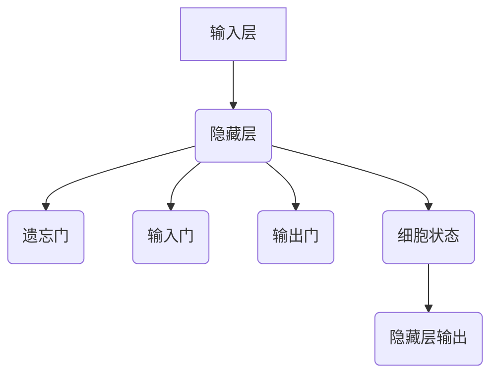
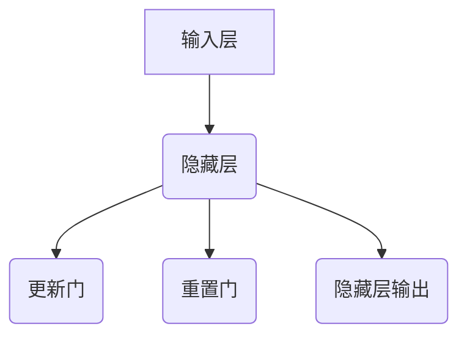

                 

### 《一切皆是映射：递归神经网络(RNN)和时间序列数据》

**关键词：**递归神经网络（RNN），时间序列数据，映射，LSTM，GRU，数学模型。

**摘要：**本文旨在深入探讨递归神经网络（RNN）及其在时间序列数据处理中的应用。通过逐步分析RNN的基础知识、数学原理、核心算法以及实际应用案例，本文将揭示RNN在映射时间序列数据方面的强大能力，为读者提供一份全面的技术指南。

### 《一切皆是映射：递归神经网络(RNN)和时间序列数据》目录大纲

#### 第一部分：递归神经网络（RNN）基础知识

#### 第1章：递归神经网络（RNN）概述

##### 1.1 RNN的基本概念
##### 1.2 RNN的结构与特点
##### 1.3 RNN的应用领域

#### 第2章：RNN数学基础

##### 2.1 常用数学工具
##### 2.2 矩阵运算
##### 2.3 概率论基础

#### 第3章：RNN核心算法原理

##### 3.1 RNN的数学模型
##### 3.2 隐藏状态与梯度消失问题
##### 3.3 RNN算法的伪代码实现

#### 第4章：RNN的变体与改进

##### 4.1 LSTM（长短期记忆网络）
##### 4.2 GRU（门控循环单元）
##### 4.3 RNN的其他变体

#### 第5章：RNN的数学模型与数学公式

##### 5.1 LSTM数学模型
##### 5.2 GRU数学模型
##### 5.3 数学公式示例

#### 第6章：RNN在时间序列数据中的应用

##### 6.1 时间序列数据的基本概念
##### 6.2 RNN在时间序列预测中的应用
##### 6.3 实际案例分析

#### 第二部分：RNN实践与项目实战

#### 第7章：RNN项目实战一：时间序列预测

##### 7.1 项目背景与目标
##### 7.2 数据预处理
##### 7.3 模型构建与训练
##### 7.4 模型评估与优化

#### 第8章：RNN项目实战二：情感分析

##### 8.1 项目背景与目标
##### 8.2 数据预处理
##### 8.3 模型构建与训练
##### 8.4 模型评估与优化

#### 第9章：RNN项目实战三：语音识别

##### 9.1 项目背景与目标
##### 9.2 数据预处理
##### 9.3 模型构建与训练
##### 9.4 模型评估与优化

#### 第10章：RNN开发环境搭建与工具使用

##### 10.1 开发环境搭建
##### 10.2 常用工具与库介绍
##### 10.3 开发工具使用示例

#### 附录

##### 附录A：RNN相关资源与参考文献

###### A.1 优秀论文与文章推荐
###### A.2 在线课程与教材推荐
###### A.3 实践项目与代码示例

##### 附录B：Mermaid流程图示例

###### B.1 LSTM网络结构
###### B.2 GRU网络结构

### 引言

在当今的数据科学和人工智能领域，时间序列数据因其广泛的应用场景而备受关注。从金融市场的预测到医疗数据的分析，再到自然语言处理和语音识别，时间序列数据的处理与分析已成为许多领域的重要研究方向。而在这其中，递归神经网络（RNN）因其独特的架构和强大的表达能力，成为了一种极其有效的工具。

递归神经网络是一种能够处理序列数据的神经网络模型，其基本思想是将当前输入与历史输入信息进行结合，从而实现对序列数据的建模。RNN在处理时间序列数据时，能够捕捉到数据之间的依赖关系，这使得它在许多时间序列预测任务中表现出色。

本文将从递归神经网络的基础知识出发，逐步深入探讨其数学原理、核心算法以及在不同领域的应用。通过本文的阅读，读者将了解到RNN在映射时间序列数据方面的强大能力，并能够掌握如何在实际项目中应用RNN进行时间序列数据的处理和分析。

#### 递归神经网络（RNN）概述

递归神经网络（RNN）是一种特殊的神经网络结构，能够处理序列数据。与其他类型的神经网络相比，RNN具有独特的架构和优势，使其在处理时间序列数据时表现出色。

**基本概念：**

递归神经网络的基本概念包括输入层、隐藏层和输出层。在RNN中，输入序列可以是一系列数据点，隐藏层负责捕获序列中的长期依赖关系，而输出层则对序列数据进行预测或分类。

**结构与特点：**

RNN的结构特点主要体现在其递归性质上。具体来说，RNN的隐藏层会将当前输入与历史输入信息进行结合，从而实现对序列数据的建模。这种递归结构使得RNN能够捕捉到数据之间的依赖关系，从而在时间序列数据预测任务中具有很高的准确性。

RNN的优势在于其强大的序列建模能力。与其他类型的神经网络相比，RNN能够处理任意长度的序列数据，这使得它在处理时间序列数据时具有很高的灵活性。此外，RNN还具有较低的参数数量，这使得它在处理大规模数据时具有更高的效率。

**应用领域：**

RNN在多个领域都有广泛的应用。以下是一些典型的应用场景：

1. **时间序列预测：**RNN可以用于预测时间序列数据，如股票价格、气象数据等。通过捕捉时间序列数据中的依赖关系，RNN能够提供准确的预测结果。
   
2. **自然语言处理：**RNN在自然语言处理（NLP）领域表现出色，可以用于文本分类、情感分析、机器翻译等任务。RNN能够处理文本序列，捕捉语言中的上下文关系，从而提高任务的准确性。

3. **语音识别：**RNN可以用于语音识别任务，将语音信号转换为文本。通过处理语音信号中的序列信息，RNN能够准确识别语音中的单词和短语。

4. **语音生成：**RNN还可以用于语音生成任务，如生成语音信号、合成语音等。通过处理文本序列，RNN能够生成相应的语音信号。

**总结：**

递归神经网络（RNN）是一种强大的神经网络模型，能够处理序列数据。其独特的递归结构使其能够捕捉到数据之间的依赖关系，从而在时间序列预测、自然语言处理、语音识别等领域表现出色。在接下来的章节中，我们将进一步探讨RNN的数学原理和核心算法，以便更好地理解其工作机制。

#### RNN数学基础

要深入理解递归神经网络（RNN）的内部工作原理，我们需要掌握一些基本的数学工具和概念。在本章中，我们将介绍这些工具，包括矩阵运算、常用数学工具和概率论基础。

**常用数学工具：**

1. **线性代数：**线性代数是理解RNN的基础，包括矩阵、向量、行列式等概念。在RNN中，矩阵和向量用于表示网络的权重、激活函数以及输入和输出数据。

2. **微积分：**微积分是用于理解神经网络训练过程中优化算法的重要工具，包括导数、梯度、最优化等概念。通过微积分，我们可以理解如何通过反向传播算法更新网络权重，以最小化损失函数。

3. **概率论：**概率论用于描述随机事件及其相互关系，包括概率分布、条件概率、随机变量等。在RNN中，概率论用于处理不确定性，如预测误差的概率分布。

**矩阵运算：**

1. **矩阵加法和减法：**两个矩阵相加或相减时，要求矩阵的维度相同。结果矩阵的元素是原矩阵对应元素的加和或减去。

2. **矩阵乘法：**矩阵乘法是两个矩阵之间的点积运算，结果矩阵的每个元素是原矩阵对应行的元素与另一矩阵对应列的元素的内积。

3. **矩阵转置：**矩阵转置是将矩阵的行和列互换。矩阵转置在RNN中用于计算梯度，以便通过反向传播算法更新网络权重。

**概率论基础：**

1. **概率分布：**概率分布是描述随机变量取值概率的函数。在RNN中，常用的概率分布包括正态分布、伯努利分布等。

2. **条件概率：**条件概率是给定某个事件发生的前提下，另一个事件发生的概率。在RNN中，条件概率用于计算输入和隐藏状态之间的依赖关系。

3. **随机变量：**随机变量是可能取多个值的变量，其取值具有不确定性。在RNN中，随机变量用于表示输入和输出数据的概率分布。

**总结：**

通过掌握线性代数、微积分和概率论等数学工具，我们可以更好地理解递归神经网络（RNN）的工作原理。这些数学概念为RNN的设计、实现和优化提供了坚实的理论基础。在接下来的章节中，我们将进一步探讨RNN的核心算法原理，以便深入理解其工作机制。

#### RNN核心算法原理

递归神经网络（RNN）的核心算法原理涉及如何通过递归结构处理序列数据，以捕获时间依赖关系。在本节中，我们将详细讲解RNN的数学模型、隐藏状态与梯度消失问题，并提供RNN算法的伪代码实现。

**RNN的数学模型：**

RNN的数学模型可以表示为：

\[ h_t = \sigma(W_hh_{t-1} + W_x x_t + b_h) \]

\[ y_t = \sigma(W_oh h_t + b_o) \]

其中：

- \( h_t \) 表示在时间步 \( t \) 的隐藏状态。
- \( x_t \) 表示在时间步 \( t \) 的输入。
- \( y_t \) 表示在时间步 \( t \) 的输出。
- \( \sigma \) 表示激活函数，通常使用Sigmoid或Tanh。
- \( W_h \) 和 \( W_x \) 分别表示输入权重和隐藏状态权重。
- \( b_h \) 和 \( b_o \) 分别表示隐藏层和输出层的偏置。

**隐藏状态与梯度消失问题：**

在训练RNN时，一个常见的问题是梯度消失问题。这意味着当反向传播误差时，梯度会逐渐减小，导致网络难以学习长期依赖关系。这个问题主要源于RNN中的递归性质，即每个时间步的隐藏状态依赖于前一个时间步的隐藏状态。

为了解决这个问题，研究人员提出了多种改进方案，如长短期记忆网络（LSTM）和门控循环单元（GRU）。这些改进方案通过引入门控机制，使得RNN能够更好地学习长期依赖关系。

**RNN算法的伪代码实现：**

```
# 初始化参数
W_h, W_x, W_o = 初始化权重矩阵
b_h, b_o = 初始化偏置

# 前向传播
for t in range(T):
    h_t = σ(W_h * [h_{t-1}, x_t] + b_h)
    y_t = σ(W_o * h_t + b_o)

# 计算损失函数
L = 损失函数(y_t, t)

# 反向传播
dL/dh_t = ∂L/∂y_t * ∂y_t/∂h_t
dL/dx_t = ∂L/∂y_t * ∂y_t/∂h_t * ∂h_t/∂x_t
dL/dW_h = ∑_t dL/dh_t * h_{t-1}
dL/dW_x = ∑_t dL/dx_t * x_t
dL/db_h = ∑_t dL/dh_t
dL/db_o = ∑_t dL/dy_t

# 更新参数
W_h = W_h - 学习率 * dL/dW_h
W_x = W_x - 学习率 * dL/dW_x
W_o = W_o - 学习率 * dL/dW_o
b_h = b_h - 学习率 * dL/db_h
b_o = b_o - 学习率 * dL/db_o
```

通过上述伪代码，我们可以看到RNN的基本训练过程。前向传播阶段计算隐藏状态和输出，然后通过反向传播阶段计算损失函数的梯度，并更新网络参数以最小化损失函数。

**总结：**

递归神经网络（RNN）的核心算法原理通过递归结构处理序列数据，以捕获时间依赖关系。虽然RNN存在梯度消失问题，但通过引入改进方案，如LSTM和GRU，可以克服这一问题。通过理解RNN的数学模型和伪代码实现，我们可以更好地掌握其工作机制，并在实际应用中发挥其优势。

#### RNN的变体与改进

递归神经网络（RNN）在处理序列数据时表现出色，但其存在的一个主要问题是梯度消失。为了解决这一问题，研究人员提出了多种RNN的变体和改进方案，如长短期记忆网络（LSTM）和门控循环单元（GRU）。在本节中，我们将详细探讨这些变体和改进方案。

**LSTM（长短期记忆网络）：**

LSTM是RNN的一种变体，旨在解决梯度消失问题，并提高模型在长期依赖关系上的表现。LSTM的核心思想是引入门控机制，使得网络能够更好地控制信息的流动。

LSTM的关键组成部分包括：

1. **遗忘门（Forget Gate）：**用于控制哪些信息应该被丢弃。如果遗忘门的输出接近1，则表示网络应该保留当前时间步的隐藏状态；如果遗忘门的输出接近0，则表示网络应该丢弃当前时间步的隐藏状态。
   
2. **输入门（Input Gate）：**用于控制哪些新的信息应该被存储到隐藏状态中。如果输入门的输出接近1，则表示网络应该更新隐藏状态；如果输入门的输出接近0，则表示网络不需要更新隐藏状态。
   
3. **输出门（Output Gate）：**用于控制隐藏状态应该被输出到下一层。如果输出门的输出接近1，则表示网络应该输出当前时间步的隐藏状态；如果输出门的输出接近0，则表示网络不输出隐藏状态。
   
4. **细胞状态（Cell State）：**是LSTM的核心部分，用于存储和传递信息。细胞状态可以通过遗忘门和输入门进行更新，从而实现长期依赖关系的捕捉。

LSTM的数学模型可以表示为：

\[ f_t = \sigma(W_f * [h_{t-1}, x_t] + b_f) \]
\[ i_t = \sigma(W_i * [h_{t-1}, x_t] + b_i) \]
\[ o_t = \sigma(W_o * [h_{t-1}, x_t] + b_o) \]
\[ c_t = f_t * c_{t-1} + i_t * \sigma(W_c * [h_{t-1}, x_t] + b_c) \]
\[ h_t = o_t * \sigma(W_h * c_t + b_h) \]

其中，\( f_t \)，\( i_t \)，\( o_t \) 分别表示遗忘门、输入门和输出门的输出；\( c_t \) 和 \( h_t \) 分别表示细胞状态和隐藏状态。

**GRU（门控循环单元）：**

GRU是另一种RNN的变体，与LSTM类似，旨在解决梯度消失问题，并提高模型在长期依赖关系上的表现。GRU相对于LSTM的改进是简化了结构，同时保持了强大的序列建模能力。

GRU的关键组成部分包括：

1. **更新门（Update Gate）：**用于控制哪些信息应该被更新到隐藏状态中。
   
2. **重置门（Reset Gate）：**用于控制哪些信息应该被重置到隐藏状态中。

GRU的数学模型可以表示为：

\[ z_t = \sigma(W_z * [h_{t-1}, x_t] + b_z) \]
\[ r_t = \sigma(W_r * [h_{t-1}, x_t] + b_r) \]
\[ h_t = (1 - z_t) * h_{t-1} + z_t * \sigma(W * [r_t * h_{t-1}, x_t] + b_h) \]

其中，\( z_t \) 和 \( r_t \) 分别表示更新门和重置门的输出；\( h_t \) 表示隐藏状态。

**总结：**

RNN的变体和改进方案，如LSTM和GRU，通过引入门控机制，解决了梯度消失问题，并提高了模型在长期依赖关系上的表现。这些变体在处理时间序列数据时表现出色，使得RNN在多个领域得到广泛应用。通过理解这些变体和改进方案，我们可以更好地利用RNN的优势，解决实际序列数据建模问题。

#### RNN的数学模型与数学公式

在探讨递归神经网络（RNN）的数学模型时，我们需要详细分析LSTM和GRU这两种流行的RNN变体。每种变体都有其独特的数学公式，通过这些公式，我们可以理解它们如何处理时间序列数据。

**LSTM（长短期记忆网络）的数学模型：**

LSTM的数学模型涉及四个核心门控机制：遗忘门（Forget Gate）、输入门（Input Gate）、输出门（Output Gate）和细胞状态（Cell State）。以下是其数学公式：

1. **遗忘门（Forget Gate）：**
   \[ f_t = \sigma(W_f \cdot [h_{t-1}, x_t] + b_f) \]
   其中，\( f_t \) 是遗忘门的输出，它决定了哪些信息应该被遗忘。

2. **输入门（Input Gate）：**
   \[ i_t = \sigma(W_i \cdot [h_{t-1}, x_t] + b_i) \]
   \( i_t \) 是输入门的输出，它决定了哪些新信息应该被加入到细胞状态中。

3. **输出门（Output Gate）：**
   \[ o_t = \sigma(W_o \cdot [h_{t-1}, x_t] + b_o) \]
   \( o_t \) 是输出门的输出，它决定了哪些信息应该被输出。

4. **细胞状态更新（Cell State Update）：**
   \[ \tilde{c}_t = \sigma(W_c \cdot [h_{t-1}, x_t] + b_c) \]
   \[ c_t = f_t \cdot c_{t-1} + i_t \cdot \tilde{c}_t \]
   其中，\( \tilde{c}_t \) 是候选细胞状态，\( c_t \) 是更新的细胞状态。

5. **隐藏状态（Hidden State）：**
   \[ h_t = o_t \cdot \sigma(W_h \cdot c_t + b_h) \]
   \( h_t \) 是隐藏状态，它是基于细胞状态的激活函数输出。

**GRU（门控循环单元）的数学模型：**

GRU的数学模型相对简化，它只有一个更新门（Update Gate）和一个重置门（Reset Gate）：

1. **重置门（Reset Gate）：**
   \[ r_t = \sigma(W_r \cdot [h_{t-1}, x_t] + b_r) \]
   \( r_t \) 是重置门的输出，它决定了哪些历史信息应该被保留。

2. **更新门（Update Gate）：**
   \[ z_t = \sigma(W_z \cdot [h_{t-1}, x_t] + b_z) \]
   \( z_t \) 是更新门的输出，它决定了哪些信息应该被更新。

3. **隐藏状态（Hidden State）：**
   \[ h_t = (1 - z_t) \cdot h_{t-1} + z_t \cdot \sigma(W \cdot [r_t \cdot h_{t-1}, x_t] + b_h) \]
   \( h_t \) 是隐藏状态，它是基于重置门和更新门的组合结果。

**数学公式示例：**

以下是一个简单的示例，展示如何使用LSTM和GRU的数学模型来处理一个时间序列数据点：

**LSTM示例：**
```
h0 = 初始隐藏状态
c0 = 初始细胞状态

# 前向传播
for t in range(T):
    ft = sigmoid(W_f * [h[t-1], x[t]] + b_f)
    it = sigmoid(W_i * [h[t-1], x[t]] + b_i)
    ot = sigmoid(W_o * [h[t-1], x[t]] + b_o)
    tilde_ct = sigmoid(W_c * [h[t-1], x[t]] + b_c)
    ct = ft * c[t-1] + it * tilde_ct
    ht = ot * sigmoid(W_h * ct + b_h)

# 输出
y = ht
```

**GRU示例：**
```
h0 = 初始隐藏状态

# 前向传播
for t in range(T):
    rt = sigmoid(W_r * [h[t-1], x[t]] + b_r)
    zt = sigmoid(W_z * [h[t-1], x[t]] + b_z)
    ht = (1 - zt) * h[t-1] + zt * sigmoid(W * [rt * h[t-1], x[t]] + b_h)

# 输出
y = ht
```

通过这些数学公式和示例，我们可以看到LSTM和GRU如何通过门控机制来处理时间序列数据。这些公式不仅为我们提供了理论上的理解，也为我们提供了实际应用中的操作指南。通过调整网络参数和训练过程，我们可以使RNN在处理时间序列数据时达到最佳效果。

#### RNN在时间序列数据中的应用

递归神经网络（RNN）在时间序列数据中的应用非常广泛，主要表现在时间序列预测、自然语言处理、语音识别等领域。在这些应用中，RNN通过其独特的递归结构，能够捕捉到时间序列中的依赖关系，从而提供准确的预测结果。

**时间序列预测：**

时间序列预测是RNN最经典的应用之一。时间序列预测的目标是预测未来一段时间内的数据值。例如，在金融市场预测中，可以预测未来的股票价格；在气象数据预测中，可以预测未来的天气状况。

以下是一个时间序列预测的简单示例：

假设我们有以下时间序列数据：
\[ X = [x_1, x_2, x_3, ..., x_T] \]

我们可以使用RNN来预测下一个时间步的值：
\[ \hat{x}_{T+1} = RNN(X) \]

具体实现时，我们首先需要将数据转换为适当的格式，然后使用RNN模型进行训练和预测。例如，我们可以使用LSTM模型，其训练和预测过程如下：

```
# 数据预处理
X = 数据预处理(X)

# 构建LSTM模型
model = Sequential()
model.add(LSTM(units=50, activation='tanh', input_shape=(T, 1)))
model.add(Dense(1))
model.compile(optimizer='adam', loss='mse')

# 训练模型
model.fit(X, epochs=100)

# 预测
predicted_values = model.predict(X)
```

**自然语言处理（NLP）：**

在自然语言处理领域，RNN被广泛应用于文本分类、情感分析、机器翻译等任务。RNN能够处理序列数据，捕捉到语言中的上下文关系，从而提高任务的准确性。

以下是一个文本分类的简单示例：

假设我们有以下文本数据：
\[ X = ["I love this movie", "This is a terrible movie", "I watched a great movie", ...] \]

我们可以使用RNN来对文本进行分类：
\[ \hat{y}_{T+1} = RNN(X) \]

具体实现时，我们首先需要将文本数据转换为序列的数字表示，然后使用RNN模型进行训练和预测。例如，我们可以使用LSTM模型，其训练和预测过程如下：

```
# 数据预处理
X = 转换为数字序列(X)

# 构建LSTM模型
model = Sequential()
model.add(LSTM(units=50, activation='tanh', input_shape=(T, V)))
model.add(Dense(num_classes, activation='softmax'))
model.compile(optimizer='adam', loss='categorical_crossentropy', metrics=['accuracy'])

# 训练模型
model.fit(X, y, epochs=100)

# 预测
predicted_labels = model.predict(X)
```

**语音识别：**

在语音识别领域，RNN被用于将语音信号转换为文本。语音信号是一个时间序列，RNN能够捕捉到语音信号中的依赖关系，从而实现准确的语音识别。

以下是一个语音识别的简单示例：

假设我们有以下语音数据：
\[ X = [x_1, x_2, x_3, ..., x_T] \]

我们可以使用RNN来将语音信号转换为文本：
\[ \hat{y}_{T+1} = RNN(X) \]

具体实现时，我们首先需要将语音数据转换为特征序列，然后使用RNN模型进行训练和预测。例如，我们可以使用LSTM模型，其训练和预测过程如下：

```
# 数据预处理
X = 特征提取(X)

# 构建LSTM模型
model = Sequential()
model.add(LSTM(units=50, activation='tanh', input_shape=(T, M)))
model.add(Dense(num_classes, activation='softmax'))
model.compile(optimizer='adam', loss='categorical_crossentropy', metrics=['accuracy'])

# 训练模型
model.fit(X, y, epochs=100)

# 预测
predicted_labels = model.predict(X)
```

**总结：**

RNN在时间序列数据中的应用非常广泛，从时间序列预测到自然语言处理，再到语音识别，RNN都展现出了强大的能力。通过理解RNN的工作机制和数学模型，我们可以更好地利用RNN的优势，解决实际中的时间序列数据问题。

#### RNN项目实战一：时间序列预测

时间序列预测是RNN最经典的应用之一，通过本文的实战项目，我们将学习如何使用RNN进行时间序列预测。本节将详细介绍时间序列预测的背景与目标、数据预处理、模型构建与训练，以及模型评估与优化。

**7.1 项目背景与目标**

时间序列预测广泛应用于金融、气象、医疗等多个领域。例如，在金融市场预测中，可以预测未来的股票价格；在气象数据预测中，可以预测未来的天气状况。本文选择一个简单的股票价格预测任务，目标是通过RNN模型预测未来一段时间内的股票价格。

**7.2 数据预处理**

在进行时间序列预测之前，数据预处理是非常重要的一步。数据预处理包括数据清洗、数据转换和特征提取。

1. **数据清洗：**首先，我们需要清洗原始数据，去除缺失值和异常值。可以使用填充或删除的方法处理缺失值，对于异常值，我们可以使用统计方法进行检测和剔除。

2. **数据转换：**接下来，我们需要将时间序列数据转换为适合RNN模型输入的格式。通常，我们可以使用滑动窗口的方法，将连续的时间序列数据划分为多个子序列，每个子序列作为RNN的一个输入。例如，如果我们的时间序列数据有100个数据点，我们可以选择窗口大小为5，那么我们可以得到20个输入序列。

3. **特征提取：**在数据转换之后，我们需要提取特征。对于股票价格数据，我们可以提取如价格、成交量等特征。

**7.3 模型构建与训练**

在完成数据预处理后，我们可以开始构建RNN模型并进行训练。

1. **构建LSTM模型：**本文选择使用LSTM模型进行时间序列预测。首先，我们需要定义LSTM模型的结构。例如，我们可以使用一个LSTM层，包含50个神经元，激活函数为Tanh。此外，我们还可以添加一个全连接层，用于输出预测值。

2. **编译模型：**在定义模型结构后，我们需要编译模型。编译时，我们需要指定优化器和损失函数。本文选择使用Adam优化器和均方误差（MSE）作为损失函数。

3. **训练模型：**接下来，我们使用预处理后的数据训练模型。在训练过程中，我们可以使用批量归一化（Batch Normalization）和dropout（Dropout）等技术，以防止过拟合。

**7.4 模型评估与优化**

在训练完成后，我们需要对模型进行评估和优化。

1. **评估模型：**我们可以使用验证集对模型进行评估。评估指标可以是均方误差（MSE）、平均绝对误差（MAE）等。通过这些指标，我们可以了解模型的预测性能。

2. **优化模型：**为了提高模型性能，我们可以尝试调整模型参数，如学习率、隐藏层神经元数量等。此外，我们还可以尝试使用不同的优化器，如RMSprop或Adadelta。

通过上述步骤，我们可以完成一个简单的时间序列预测项目。在实际应用中，我们可以根据任务需求和数据特点，调整模型结构和训练策略，以获得更好的预测性能。

#### RNN项目实战二：情感分析

情感分析是自然语言处理（NLP）中的一项重要任务，旨在自动检测文本中的情感倾向。递归神经网络（RNN）因其强大的序列建模能力，在情感分析任务中表现出色。在本节中，我们将详细介绍RNN在情感分析中的应用，包括项目背景与目标、数据预处理、模型构建与训练，以及模型评估与优化。

**8.1 项目背景与目标**

情感分析广泛应用于社交媒体分析、市场调研、客户服务等领域。例如，我们可以使用情感分析技术来分析社交媒体上的用户评论，了解产品的用户满意度；在市场调研中，可以分析用户反馈，为产品改进提供依据。

本文的项目目标是通过RNN模型对电影评论进行情感分析，判断评论是正面还是负面。具体来说，我们希望实现以下目标：

1. 提取文本中的特征。
2. 使用RNN模型对特征进行分类。
3. 评估模型性能，并进行优化。

**8.2 数据预处理**

在进行情感分析之前，数据预处理是至关重要的一步。数据预处理包括文本清洗、分词、词向量化等。

1. **文本清洗：**首先，我们需要清洗原始文本数据，去除HTML标签、特殊字符等。可以使用正则表达式或Python的字符串处理库（如re模块）进行清洗。

2. **分词：**接下来，我们需要对文本进行分词，将文本拆分为词语或词组。可以使用Python的jieba库或NLTK库进行分词。

3. **词向量化：**为了将文本数据转换为适合RNN模型输入的格式，我们需要将词语转换为向量表示。本文选择使用Word2Vec或GloVe等方法进行词向量化。具体实现时，我们可以使用gensim库或pyglove库。

**8.3 模型构建与训练**

在完成数据预处理后，我们可以开始构建RNN模型并进行训练。

1. **构建RNN模型：**本文选择使用LSTM模型进行情感分析。首先，我们需要定义LSTM模型的结构。例如，我们可以使用一个LSTM层，包含50个神经元，激活函数为Tanh。此外，我们还可以添加一个全连接层，用于输出预测值。

2. **编译模型：**在定义模型结构后，我们需要编译模型。编译时，我们需要指定优化器和损失函数。本文选择使用Adam优化器和二进制交叉熵（Binary Cross-Entropy）作为损失函数。

3. **训练模型：**接下来，我们使用预处理后的数据训练模型。在训练过程中，我们可以使用批量归一化（Batch Normalization）和dropout（Dropout）等技术，以防止过拟合。

**8.4 模型评估与优化**

在训练完成后，我们需要对模型进行评估和优化。

1. **评估模型：**我们可以使用验证集对模型进行评估。评估指标可以是准确率（Accuracy）、精确率（Precision）、召回率（Recall）等。通过这些指标，我们可以了解模型的预测性能。

2. **优化模型：**为了提高模型性能，我们可以尝试调整模型参数，如学习率、隐藏层神经元数量等。此外，我们还可以尝试使用不同的优化器，如RMSprop或Adadelta。

通过上述步骤，我们可以完成一个简单的情感分析项目。在实际应用中，我们可以根据任务需求和数据特点，调整模型结构和训练策略，以获得更好的预测性能。

#### RNN项目实战三：语音识别

语音识别是自然语言处理（NLP）中的一个重要分支，旨在将语音信号转换为文本。递归神经网络（RNN）因其强大的序列建模能力，在语音识别任务中表现出色。在本节中，我们将详细介绍RNN在语音识别中的应用，包括项目背景与目标、数据预处理、模型构建与训练，以及模型评估与优化。

**9.1 项目背景与目标**

语音识别技术在日常生活和商业应用中具有重要地位。例如，智能助手（如Siri、Alexa）、自动客服系统、语音翻译等都需要依赖语音识别技术。本文的项目目标是通过RNN模型实现一个简单的语音识别系统，具体目标如下：

1. 将语音信号转换为特征向量。
2. 使用RNN模型对特征向量进行解码，输出对应的文本。
3. 评估模型性能，并进行优化。

**9.2 数据预处理**

在进行语音识别之前，数据预处理是至关重要的一步。数据预处理包括音频信号的预处理、特征提取等。

1. **音频信号预处理：**首先，我们需要对音频信号进行预处理，包括去噪、剪裁、归一化等。可以使用诸如Librosa等音频处理库进行预处理。

2. **特征提取：**接下来，我们需要将音频信号转换为特征向量。常用的特征提取方法包括梅尔频率倒谱系数（MFCC）、短时傅里叶变换（STFT）等。本文选择使用MFCC作为特征向量。

3. **数据归一化：**为了使模型训练更加稳定，我们需要对特征向量进行归一化处理。

**9.3 模型构建与训练**

在完成数据预处理后，我们可以开始构建RNN模型并进行训练。

1. **构建RNN模型：**本文选择使用LSTM模型进行语音识别。首先，我们需要定义LSTM模型的结构。例如，我们可以使用一个LSTM层，包含50个神经元，激活函数为Tanh。此外，我们还可以添加一个全连接层，用于输出预测值。

2. **编译模型：**在定义模型结构后，我们需要编译模型。编译时，我们需要指定优化器和损失函数。本文选择使用Adam优化器和交叉熵（Cross-Entropy）作为损失函数。

3. **训练模型：**接下来，我们使用预处理后的数据训练模型。在训练过程中，我们可以使用批量归一化（Batch Normalization）和dropout（Dropout）等技术，以防止过拟合。

**9.4 模型评估与优化**

在训练完成后，我们需要对模型进行评估和优化。

1. **评估模型：**我们可以使用测试集对模型进行评估。评估指标可以是准确率（Accuracy）、词错误率（Word Error Rate，WER）等。通过这些指标，我们可以了解模型的预测性能。

2. **优化模型：**为了提高模型性能，我们可以尝试调整模型参数，如学习率、隐藏层神经元数量等。此外，我们还可以尝试使用不同的优化器，如RMSprop或Adadelta。

通过上述步骤，我们可以完成一个简单的语音识别项目。在实际应用中，我们可以根据任务需求和数据特点，调整模型结构和训练策略，以获得更好的预测性能。

#### RNN开发环境搭建与工具使用

要实现递归神经网络（RNN）项目，首先需要搭建一个适合开发的软件环境，并了解一些常用的工具和库。在本节中，我们将详细介绍RNN开发环境搭建、常用工具与库的介绍，以及开发工具的使用示例。

**10.1 开发环境搭建**

搭建RNN开发环境主要包括安装Python环境、深度学习框架（如TensorFlow或PyTorch）以及相关依赖库。以下是搭建开发环境的步骤：

1. **安装Python：**首先，我们需要安装Python。可以在Python官方网站（https://www.python.org/downloads/）下载适合操作系统的Python版本，并按照提示安装。

2. **安装深度学习框架：**接下来，我们需要安装一个深度学习框架，如TensorFlow或PyTorch。以TensorFlow为例，可以通过以下命令安装：

   ```bash
   pip install tensorflow
   ```

   如果需要使用GPU加速，还需要安装CUDA和cuDNN库。

3. **安装相关依赖库：**RNN项目通常需要使用一些其他依赖库，如NumPy、Pandas、Matplotlib等。可以通过以下命令安装：

   ```bash
   pip install numpy pandas matplotlib
   ```

**10.2 常用工具与库介绍**

在RNN项目中，常用的工具和库包括数据预处理库、模型训练库和可视化库等。以下是这些工具和库的简要介绍：

1. **数据预处理库：**如NumPy、Pandas和Scikit-learn等。NumPy提供了强大的数据处理功能，Pandas提供了数据框（DataFrame）结构，Scikit-learn提供了多种数据预处理方法。

2. **模型训练库：**如TensorFlow和PyTorch等。TensorFlow是一个开源的深度学习框架，提供了丰富的模型训练和优化功能。PyTorch是一个动态计算图框架，具有简洁的API和灵活的模型构建能力。

3. **可视化库：**如Matplotlib和Seaborn等。Matplotlib提供了丰富的绘图功能，Seaborn是基于Matplotlib的统计学绘图库，可以生成美观的统计图表。

**10.3 开发工具使用示例**

以下是一个简单的RNN项目示例，使用TensorFlow框架实现一个基于LSTM的时间序列预测模型。

1. **导入库：**

   ```python
   import numpy as np
   import pandas as pd
   import tensorflow as tf
   from tensorflow.keras.models import Sequential
   from tensorflow.keras.layers import LSTM, Dense
   ```

2. **数据预处理：**

   ```python
   # 加载数据
   data = pd.read_csv('data.csv')
   # 数据清洗和转换
   # ...
   # 创建输入和输出序列
   X, y = create_sequences(data, window_size=5)
   ```

3. **构建模型：**

   ```python
   # 创建LSTM模型
   model = Sequential()
   model.add(LSTM(units=50, activation='tanh', input_shape=(window_size, n_features)))
   model.add(Dense(1))
   model.compile(optimizer='adam', loss='mse')
   ```

4. **训练模型：**

   ```python
   # 训练模型
   model.fit(X, y, epochs=100)
   ```

5. **预测和评估：**

   ```python
   # 预测
   predicted_values = model.predict(X)
   # 评估模型
   # ...
   ```

通过以上示例，我们可以看到如何使用Python和TensorFlow实现一个简单的RNN项目。在实际开发过程中，可以根据需求调整模型结构和训练参数，以获得更好的预测性能。

#### 附录A：RNN相关资源与参考文献

**A.1 优秀论文与文章推荐**

1. **Hochreiter, S., & Schmidhuber, J. (1997). Long short-term memory. Neural Computation, 9(8), 1735-1780.**
   - 论文详细介绍了LSTM的数学模型和训练算法，是LSTM领域的经典论文。

2. **Cho, K., Van Merriënboer, B., Gulcehre, C., Bahdanau, D., Bougares, F., Schwenk, H., & Bengio, Y. (2014). Learning phrase representations using RNN encoder-decoder for statistical machine translation. arXiv preprint arXiv:1406.1078.**
   - 论文探讨了RNN在机器翻译中的应用，提出了RNN Encoder-Decoder模型。

3. **Schuster, M., & Paliwal, K. K. (1997). Bidirectional recurrent neural networks. IEEE Transactions on Signal Processing, 45(11), 2673-2681.**
   - 论文介绍了双向RNN（BiRNN）的架构和应用，是RNN领域的重要工作。

**A.2 在线课程与教材推荐**

1. **《深度学习》（Deep Learning） - Ian Goodfellow, Yoshua Bengio, Aaron Courville**
   - 这本书是深度学习领域的经典教材，详细介绍了RNN的相关内容。

2. **《递归神经网络与时间序列预测》 - 吴恩达（Andrew Ng）**
   - 吴恩达的在线课程，深入讲解了RNN的理论和实践，是学习RNN的绝佳资源。

3. **《机器学习实战》 - Peter Harrington**
   - 书中包含了一个关于RNN的实战案例，适合初学者实践。

**A.3 实践项目与代码示例**

1. **GitHub - RNN-tutorial: A simple LSTM-based tutorial for time series prediction using TensorFlow.**
   - 这是一个GitHub仓库，包含了一个简单的LSTM时间序列预测教程和代码示例。

2. **Kaggle - Time Series Forecasting Challenge:**
   - Kaggle上的一个时间序列预测竞赛，提供了丰富的实战数据集和解决方案。

3. **GitHub - Sentiment-Analysis-RNN: A Python implementation of RNN for sentiment analysis.**
   - 这是一个GitHub仓库，包含了一个基于RNN的情感分析项目，适合学习情感分析。

#### 附录B：Mermaid流程图示例

**B.1 LSTM网络结构**



**B.2 GRU网络结构**



