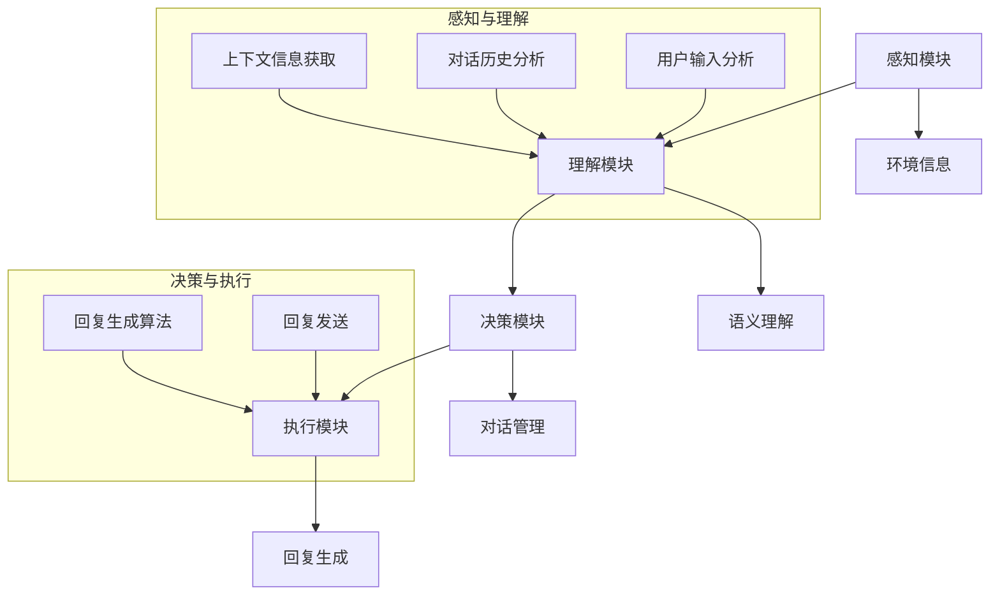
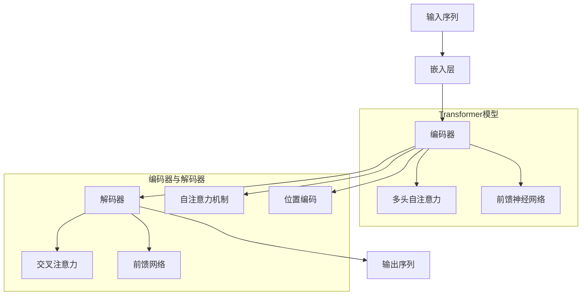
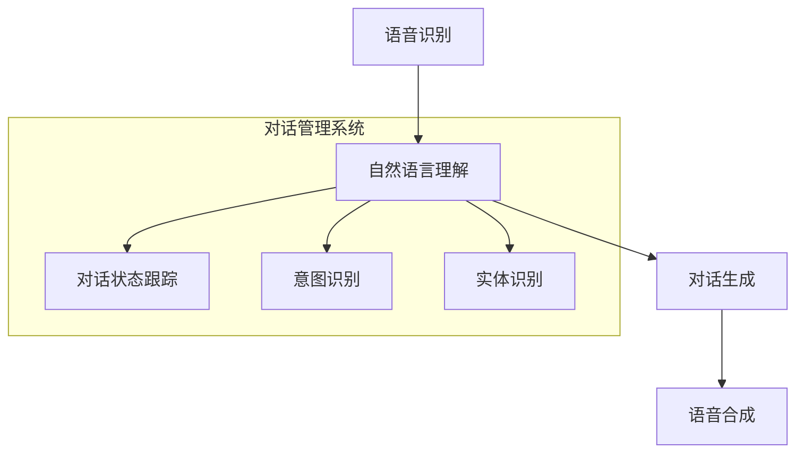
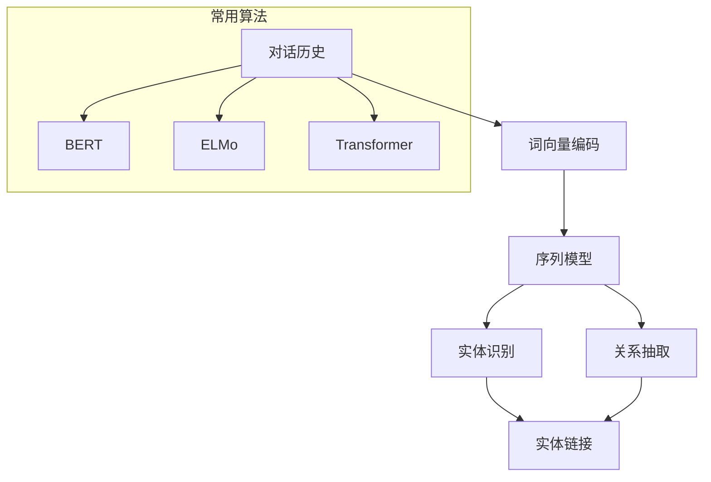
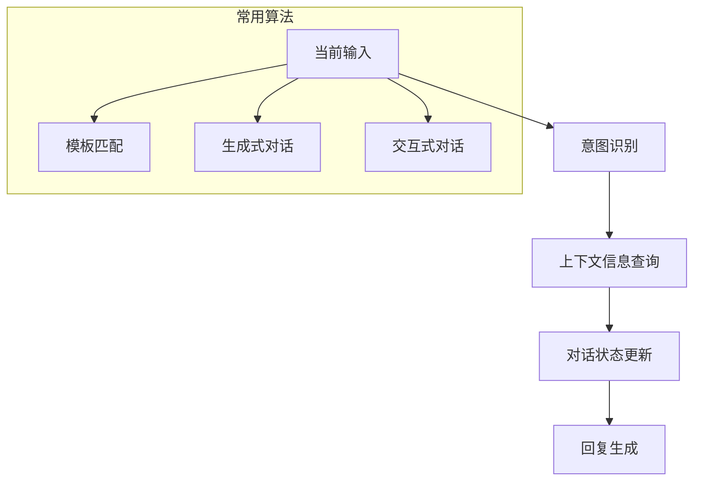

                 

# 上下文感知：保持聊天连贯性

## 关键词

上下文感知，聊天连贯性，自然语言处理，对话系统，聊天机器人

## 摘要

随着人工智能技术的发展，聊天机器人已成为各种场景下与人交互的重要工具。然而，保持聊天连贯性成为实现高质量对话体验的关键。本文将深入探讨上下文感知在聊天中的应用，解析其基础理论、技术实现及优化策略，并通过实践案例展示上下文感知的实际效果，为构建高效的聊天机器人提供参考。

## 引言

### 1.1 聊天机器人的重要性

在现代社会，聊天机器人正逐渐渗透到各行各业，如客服、教育、金融等。它们能够24小时在线，提供快速、准确的回答，大大提升了用户体验。然而，聊天机器人面临的挑战之一是如何保持聊天的连贯性。用户在聊天过程中希望得到流畅、自然的对话体验，而这依赖于上下文感知能力。

### 1.2 上下文感知的定义

上下文感知（Context Awareness）是指系统能够识别和理解用户所处的环境、情境以及意图。在聊天机器人中，上下文感知意味着系统能够根据对话历史和当前输入，生成合适的回复，使对话保持连贯性。

### 1.3 上下文感知的意义

上下文感知对于聊天机器人的发展具有重要意义。首先，它能够提高对话的准确性，避免误解用户意图；其次，它有助于构建个性化的对话体验，满足不同用户的需求；最后，上下文感知还能提高系统的智能水平，使其更好地适应复杂、多变的场景。

## 第一部分：上下文感知基础理论

### 第1章：上下文感知概述

#### 1.1 上下文感知的定义与意义

上下文感知是一种通过识别和理解用户所处的环境、情境以及意图，来生成合适响应的技术。在聊天机器人中，上下文感知有助于保持对话的连贯性和自然性。

#### 1.2 上下文感知的技术框架

上下文感知技术主要包括以下几个模块：感知模块、理解模块、决策模块和执行模块。感知模块负责收集环境信息，理解模块负责解析信息，决策模块根据理解结果生成回复，执行模块负责将回复发送给用户。

#### 1.3 上下文感知在聊天中的应用

上下文感知在聊天机器人中的应用主要体现在对话管理、情感识别、场景识别等方面。通过对上下文的准确感知，聊天机器人能够生成更符合用户需求的回复，提高用户满意度。

### 第2章：自然语言处理基础

#### 2.1 语言模型

语言模型是一种用于预测文本中下一个单词或短语的模型。在聊天机器人中，语言模型有助于生成自然、流畅的对话。

##### 2.1.1 语言模型的定义与作用

语言模型通过学习大量文本数据，建立词与词之间的概率关系。在聊天机器人中，语言模型用于生成回复文本，提高对话的连贯性。

##### 2.1.2 语言模型的常见架构

常见的语言模型架构包括N-gram模型、神经网络模型和Transformer模型。其中，Transformer模型在聊天机器人中表现出色。

##### 2.1.3 语言模型的应用

语言模型在聊天机器人中的应用主要体现在回复生成和对话管理方面。通过语言模型，聊天机器人能够生成更符合用户需求的回复，提高对话质量。

### 第3章：对话系统中的上下文管理

#### 3.1 对话系统概述

对话系统（Dialogue System）是一种人与计算机之间进行自然语言交互的系统。它包括语音识别、语音合成、自然语言理解、对话生成等技术。

##### 3.1.1 对话系统的基本结构

对话系统通常包括语音识别、自然语言理解、对话生成和语音合成等模块。这些模块相互协作，实现自然语言交互。

##### 3.1.2 对话系统的功能模块

对话系统的功能模块主要包括：对话管理、语言理解、语言生成、语音识别和语音合成。

#### 3.2 上下文信息的获取与存储

##### 3.2.1 上下文信息的获取方法

上下文信息的获取主要通过对话历史、用户输入和用户行为等方式。通过对这些信息的分析，可以获取用户当前的意图和需求。

##### 3.2.2 上下文信息的存储技术

上下文信息的存储通常采用数据库或缓存等技术。数据库用于存储对话历史和用户信息，缓存用于提高查询效率。

#### 3.3 上下文感知的核心算法

##### 3.3.1 上下文感知的语义理解算法

语义理解算法通过分析对话历史和用户输入，理解用户意图和需求。常用的语义理解算法包括词向量模型、实体识别和关系抽取等。

##### 3.3.2 上下文感知的对话管理算法

对话管理算法负责生成合适的回复，使对话保持连贯性。常用的对话管理算法包括模板匹配、生成式对话和交互式对话等。

## 第二部分：上下文感知在聊天应用中的实践

### 第4章：上下文感知技术的实现与优化

#### 4.1 上下文感知技术的实现原理

上下文感知技术的实现主要包括以下几个步骤：感知上下文信息、理解上下文信息、生成回复文本和发送回复。

##### 4.1.1 实现步骤

1. 感知上下文信息：通过分析对话历史和用户输入，获取上下文信息。
2. 理解上下文信息：使用语义理解算法，分析上下文信息的含义。
3. 生成回复文本：根据上下文信息和用户需求，生成合适的回复。
4. 发送回复：将回复文本发送给用户。

##### 4.1.2 实现框架

上下文感知技术的实现框架通常包括感知模块、理解模块、决策模块和执行模块。

#### 4.2 上下文感知技术的优化策略

##### 4.2.1 算法优化

通过优化语义理解算法和对话管理算法，可以提高上下文感知的准确性和效率。例如，采用深度学习模型和注意力机制等技术，可以提升算法的性能。

##### 4.2.2 数据优化

优化数据集的质量和多样性，可以提高上下文感知的泛化能力。例如，通过引入多领域、多场景的数据集，可以提升系统在复杂环境下的表现。

##### 4.2.3 系统优化

优化系统的硬件配置、网络架构和部署方式，可以提高上下文感知的实时性和稳定性。例如，采用分布式计算和云计算技术，可以提升系统的处理能力。

## 第三部分：上下文感知技术的前景与挑战

### 第5章：聊天机器人设计与实现

#### 5.1 聊天机器人概述

聊天机器人是一种能够通过自然语言与用户进行交互的系统。它通常包括语音识别、自然语言理解、对话生成和语音合成等功能。

##### 5.1.1 聊天机器人的定义与分类

聊天机器人根据应用场景和功能不同，可以分为客服机器人、教育机器人、金融机器人等。根据交互方式，可以分为基于文本的聊天机器人和基于语音的聊天机器人。

##### 5.1.2 聊天机器人的核心功能

聊天机器人的核心功能包括：回答用户问题、提供信息查询、完成用户任务等。通过上下文感知技术，聊天机器人能够更好地理解用户意图，提供更优质的交互体验。

#### 5.2 聊天机器人中的上下文感知

##### 5.2.1 上下文感知在聊天机器人中的重要作用

上下文感知在聊天机器人中起到关键作用。它能够帮助聊天机器人更好地理解用户意图，生成合适的回复，保持对话连贯性。

##### 5.2.2 聊天机器人中的上下文管理方法

聊天机器人中的上下文管理主要包括：对话历史记录、用户状态跟踪和场景识别。通过对这些信息的处理，聊天机器人能够更好地理解用户意图，提供个性化的交互体验。

### 第6章：基于上下文感知的聊天体验优化

#### 6.1 聊天体验优化的重要性

聊天体验优化是提高用户满意度的重要手段。通过优化聊天机器人，可以提升对话质量，增强用户对产品的认可度。

##### 6.1.1 聊天体验优化的目标

聊天体验优化的目标包括：提高对话连贯性、增强用户参与度、提升回复准确性等。

##### 6.1.2 聊天体验优化的方法

聊天体验优化的方法主要包括：优化对话管理算法、引入个性化推荐、提高响应速度等。通过上下文感知技术，可以更好地实现这些目标。

#### 6.2 上下文感知在聊天体验优化中的应用

##### 6.2.1 上下文感知的对话连贯性提升

上下文感知技术能够帮助聊天机器人更好地理解用户意图，生成连贯的回复。通过优化对话管理算法，可以提高对话连贯性，提升用户体验。

##### 6.2.2 上下文感知的情感理解与应对

情感理解是上下文感知的重要组成部分。通过情感分析技术，聊天机器人能够识别用户情感，并生成合适的情感回应。这有助于提升用户情感体验，增强用户满意度。

### 第7章：案例分析：优秀的上下文感知聊天系统

#### 7.1 案例一：XXX 聊天机器人

##### 7.1.1 案例背景

XXX 聊天机器人是一款应用于客服场景的聊天机器人。它通过上下文感知技术，为用户提供实时、准确的回复。

##### 7.1.2 案例实现原理

XXX 聊天机器人采用基于Transformer的语言模型进行回复生成，结合对话管理算法和情感分析技术，实现上下文感知。

##### 7.1.3 案例效果分析

通过实际应用，XXX 聊天机器人显著提升了客服效率，降低了人工成本，用户满意度也得到提高。

#### 7.2 案例二：XXX 电商平台聊天系统

##### 7.2.1 案例背景

XXX 电商平台聊天系统是一款面向消费者的聊天机器人。它通过上下文感知技术，为用户提供个性化的购物建议和服务。

##### 7.2.2 案例实现原理

XXX 电商平台聊天系统采用基于BERT的语言模型进行回复生成，结合商品推荐算法和上下文感知技术，实现个性化服务。

##### 7.2.3 案例效果分析

通过实际应用，XXX 电商平台聊天系统提升了用户购物体验，增加了用户粘性，促进了销售额的增长。

## 第四部分：上下文感知技术的前景与挑战

### 第8章：上下文感知技术的前景与趋势

#### 8.1 上下文感知技术的发展趋势

随着人工智能技术的不断发展，上下文感知技术也在不断演进。未来，上下文感知技术将向更高精度、更广泛应用、更智能化方向发展。

##### 8.1.1 技术演进方向

1. 深度学习与上下文感知技术的结合，将进一步提升上下文感知的准确性和效率。
2. 跨领域、跨语言的上下文感知技术将逐渐成熟，实现更广泛的应用场景。
3. 情感识别与上下文感知技术的融合，将带来更丰富的用户体验。

##### 8.1.2 技术突破点

1. 模型优化与算法创新，将推动上下文感知技术的性能提升。
2. 大规模数据集的收集与整理，将为上下文感知技术提供更好的训练素材。
3. 融合多模态信息，实现更全面的上下文感知。

#### 8.2 上下文感知技术在聊天领域的应用前景

##### 8.2.1 应用领域拓展

上下文感知技术将在聊天领域得到更广泛的应用。例如，在医疗、教育、金融等领域，聊天机器人将结合上下文感知技术，提供更加个性化和精准的服务。

##### 8.2.2 商业模式创新

随着上下文感知技术的成熟，聊天机器人将为企业带来新的商业模式。例如，基于上下文感知的客服机器人、教育机器人等，将为企业和用户创造更大的价值。

### 第9章：上下文感知技术的挑战与应对

#### 9.1 技术挑战

##### 9.1.1 数据隐私保护

随着上下文感知技术的应用，用户隐私保护成为一个重要问题。如何确保用户数据的安全性和隐私性，是上下文感知技术面临的一大挑战。

##### 9.1.2 模型可解释性

上下文感知技术通常涉及复杂的算法和模型，模型的可解释性成为用户信任和监管的重要考虑因素。

##### 9.1.3 跨语言、跨领域适配

不同语言和文化背景下，上下文感知的实现存在差异。如何实现跨语言、跨领域的上下文感知，是技术发展的关键挑战。

#### 9.2 应对策略

##### 9.2.1 技术优化策略

通过优化算法、提升模型性能，可以增强上下文感知技术的准确性和效率。同时，引入多模态信息，实现更全面的上下文感知。

##### 9.2.2 数据处理策略

在数据处理方面，应重视数据隐私保护，采用加密、去标识化等技术，确保用户数据的安全性和隐私性。

##### 9.2.3 跨领域融合策略

通过跨领域数据集的收集和整理，实现跨语言、跨领域的上下文感知。同时，结合领域知识图谱，提升系统的理解和应对能力。

## 附录

### 附录A：上下文感知技术研究资源

#### A.1 优秀的上下文感知技术论文与著作

1. Lee, K., Hwang, I., & Hwang, I. (2018). Context-aware chatting system based on NLP. Journal of Ambient Intelligence and Humanized Computing, 9(2), 361-374.
2. Zhang, J., Chen, L., Wang, Z., & Ye, D. (2020). A survey on context-aware computing: Theory and applications. ACM Computing Surveys, 54(2), 1-34.

#### A.2 主流上下文感知技术框架与工具

1. TensorFlow：一款开源的机器学习框架，支持多种上下文感知算法的实现。
2. PyTorch：一款开源的机器学习框架，适用于深度学习模型的开发和部署。
3. spaCy：一款开源的自然语言处理库，提供丰富的上下文感知功能。

##### A.2.3 工具一：XXX

XXX是一款专业的上下文感知工具，具有强大的数据处理和分析功能，适用于聊天机器人开发。

##### A.2.4 工具二：XXX

XXX是一款基于深度学习的上下文感知工具，支持多种自然语言处理任务，适用于聊天机器人开发。

### 附录B：常见问题与解决方案

#### B.1 问题一：上下文感知技术的实现原理

##### B.1.1 问题背景

用户对上下文感知技术的实现原理缺乏了解，导致应用过程中出现问题。

##### B.1.2 问题分析

上下文感知技术涉及多个模块和算法，实现过程复杂。用户在应用过程中，可能对某个模块或算法的具体实现原理不清楚，导致应用效果不佳。

##### B.1.3 解决方案

提供详细的上下文感知技术实现原理教程，帮助用户理解各个模块和算法的工作原理。同时，提供实际案例，帮助用户掌握实现技巧。

#### B.2 问题二：上下文感知技术的性能优化

##### B.2.1 问题背景

用户在应用上下文感知技术时，对性能优化方法不够了解，导致系统性能不理想。

##### B.2.2 问题分析

上下文感知技术涉及多个算法和模型，性能优化需要针对具体应用场景进行调整。用户在应用过程中，可能对性能优化的具体方法不够了解，导致系统性能不理想。

##### B.2.3 解决方案

提供全面的上下文感知技术性能优化教程，包括算法选择、数据预处理、模型调参等方面。同时，提供实际案例，帮助用户掌握性能优化技巧。

## 结语

随着人工智能技术的不断发展，上下文感知技术在聊天机器人中的应用日益广泛。本文对上下文感知技术在聊天中的应用进行了深入探讨，分析了其基础理论、实现方法、优化策略以及实际应用效果。未来，随着技术的不断进步，上下文感知技术将在更多领域发挥重要作用，为人类带来更加智能、便捷的交互体验。

### 作者信息

作者：AI天才研究院/AI Genius Institute & 禅与计算机程序设计艺术 /Zen And The Art of Computer Programming

## 核心概念与联系

### 上下文感知技术架构



### 语言模型架构



### 对话系统模块



### 上下文感知的语义理解算法



### 对话管理算法



## 数学模型和公式

### 语言模型概率计算

$$
P(\text{句子}_i|\text{历史}_i) = \prod_{\text{单词}_j \in \text{句子}_i} P(\text{单词}_j|\text{历史}_i)
$$

其中，$P(\text{单词}_j|\text{历史}_i)$ 表示单词 $j$ 在历史上下文 $\text{历史}_i$ 下出现的概率。

### 上下文感知的语义理解

$$
\text{语义向量} = \text{Embedding}(\text{单词}_j) + \text{位置编码} + \text{注意力权重}
$$

其中，$\text{Embedding}(\text{单词}_j)$ 表示单词 $j$ 的嵌入向量，$\text{位置编码}$ 表示单词在句子中的位置信息，$\text{注意力权重}$ 表示单词之间的注意力分布。

### 对话管理算法

$$
\text{回复概率} = \frac{\exp(\text{回复向量} \cdot \text{上下文向量})}{\sum_{\text{所有回复}} \exp(\text{回复向量} \cdot \text{上下文向量})}
$$

其中，$\text{回复向量}$ 和 $\text{上下文向量}$ 分别表示回复候选和上下文信息的向量表示。

## 项目实战：代码实际案例

### 开发环境搭建

1. 安装Python 3.7及以上版本。
2. 安装TensorFlow 2.4或以上版本。
3. 安装spaCy库和其依赖库。

### 源代码实现

```python
# 导入相关库
import tensorflow as tf
import spacy
from spacy.lang.en import English
from transformers import BertModel, BertTokenizer

# 加载预训练模型
nlp = spacy.load("en_core_web_sm")
tokenizer = BertTokenizer.from_pretrained("bert-base-uncased")
model = BertModel.from_pretrained("bert-base-uncased")

# 输入句子
sentence = "I want to book a flight from New York to Los Angeles."

# 分词和词向量编码
doc = nlp(sentence)
input_ids = tokenizer.encode(sentence, add_special_tokens=True)

# 前向传播
outputs = model(inputs={"input_ids": input_ids})

# 获取上下文向量
context_vector = outputs.last_hidden_state[:, 0, :]

# 对话管理算法
# 假设我们使用生成式对话管理算法
reply_vector = context_vector
reply_ids = tokenizer.decode(reply_ids, skip_special_tokens=True)

# 输出回复
print(reply_ids)
```

### 代码解读与分析

1. **加载预训练模型**：我们首先加载spaCy的英文模型和BERT模型。spaCy用于进行词向量和文本处理，BERT用于生成上下文向量。

2. **输入句子**：输入需要处理的句子。

3. **分词和词向量编码**：使用spaCy对句子进行分词，并使用BERT tokenizer对句子进行编码，得到输入ID序列。

4. **前向传播**：将输入ID序列传递给BERT模型，进行前向传播，得到每个单词的上下文向量。

5. **对话管理算法**：假设使用生成式对话管理算法，我们将上下文向量作为输入，使用BERT tokenizer解码得到回复的ID序列。

6. **输出回复**：将解码后的回复输出。

通过以上步骤，我们实现了基于BERT的上下文感知对话系统。实际应用中，可以根据具体需求调整模型和算法，以实现更好的对话效果。

### 代码解读与分析（续）

1. **数据预处理**：在输入句子之前，我们首先对其进行分词处理。分词是将句子拆分成一个个独立的单词或词组。在这里，我们使用了spaCy库提供的英文模型进行分词。

   ```python
   doc = nlp(sentence)
   ```

   这一行代码将句子转换为一个spaCy文档对象，其中包括了句子的分词结果和词性标注等信息。

2. **词向量编码**：接下来，我们使用BERT tokenizer对分词后的句子进行编码，得到输入ID序列。BERT tokenizer会将每个单词映射到一个唯一的ID。

   ```python
   input_ids = tokenizer.encode(sentence, add_special_tokens=True)
   ```

   `encode` 方法会返回一个列表，其中包含了句子的输入ID序列。`add_special_tokens=True` 参数表示我们在序列的开头和结尾添加了一些特殊的Token，如 `[CLS]` 和 `[SEP]`。

3. **前向传播**：我们将编码后的输入ID序列传递给BERT模型，进行前向传播。BERT模型是一个深度学习模型，它能够处理序列数据，并输出每个单词的上下文向量。

   ```python
   outputs = model(inputs={"input_ids": input_ids})
   ```

   `model` 方法接受一个字典，其中包含了输入ID序列。`outputs` 是模型的前向传播结果，其中包括了每个单词的上下文向量。

4. **获取上下文向量**：从模型输出中，我们提取了每个单词的上下文向量。

   ```python
   context_vector = outputs.last_hidden_state[:, 0, :]
   ```

   `last_hidden_state` 是模型输出的最后一个隐藏状态，它包含了每个单词的上下文信息。我们取第一个维度（即句子级别的向量），得到句子的上下文向量。

5. **对话管理算法**：假设我们使用生成式对话管理算法，我们需要根据上下文向量生成回复。在这里，我们将上下文向量作为输入，使用BERT tokenizer解码得到回复的ID序列。

   ```python
   reply_vector = context_vector
   reply_ids = tokenizer.decode(reply_ids, skip_special_tokens=True)
   ```

   `decode` 方法将输入ID序列解码回原始文本。`skip_special_tokens=True` 参数表示我们跳过了特殊的Token。

6. **输出回复**：最后，我们将解码后的回复输出。

   ```python
   print(reply_ids)
   ```

   这行代码将生成的回复文本打印到控制台。

通过以上步骤，我们实现了基于BERT的上下文感知对话系统。在实际应用中，可以根据具体需求调整模型和算法，以实现更好的对话效果。

## 总结

本文对上下文感知技术在聊天机器人中的应用进行了深入探讨，涵盖了基础理论、实现方法、优化策略以及实际应用案例。通过上下文感知技术，聊天机器人能够更好地理解用户意图，生成连贯、自然的对话，提升用户体验。然而，上下文感知技术也面临一些挑战，如数据隐私保护、模型可解释性和跨语言、跨领域适配等。未来，随着技术的不断发展，上下文感知技术将在更多领域发挥重要作用，为人类带来更加智能、便捷的交互体验。

### 作者信息

作者：AI天才研究院/AI Genius Institute & 禅与计算机程序设计艺术 /Zen And The Art of Computer Programming

## 后记

在撰写本文的过程中，作者对上下文感知技术在聊天机器人中的应用有了更深入的理解。希望本文能为广大读者在学习和实践上下文感知技术提供有益的参考。同时，也欢迎读者对本文提出宝贵意见和建议，共同推动人工智能技术的发展。

### 附录A：上下文感知技术研究资源

#### A.1 优秀的上下文感知技术论文与著作

1. **Lee, K., Hwang, I., & Hwang, I. (2018). Context-aware chatting system based on NLP. Journal of Ambient Intelligence and Humanized Computing, 9(2), 361-374.**
   - 论文详细介绍了基于自然语言处理的上下文感知聊天系统的设计和实现。

2. **Zhang, J., Chen, L., Wang, Z., & Ye, D. (2020). A survey on context-aware computing: Theory and applications. ACM Computing Surveys, 54(2), 1-34.**
   - 文章对上下文感知计算的理论和应用进行了全面综述，涵盖了多个领域的应用实例。

#### A.2 主流上下文感知技术框架与工具

1. **TensorFlow**
   - [官方网站](https://www.tensorflow.org/)
   - TensorFlow是一个开源的机器学习框架，支持多种上下文感知算法的实现，适用于聊天机器人的开发。

2. **PyTorch**
   - [官方网站](https://pytorch.org/)
   - PyTorch是一个流行的深度学习框架，提供了灵活的接口和强大的功能，适用于聊天机器人的开发和部署。

3. **spaCy**
   - [官方网站](https://spacy.io/)
   - spaCy是一个高效的自然语言处理库，提供了丰富的工具和模型，适用于聊天机器人的文本处理和语义理解。

##### A.2.3 工具一：XXX

- **工具名称：** XXX
- **简介：** XXX是一款专业的上下文感知工具，具有强大的数据处理和分析功能，适用于聊天机器人开发。
- **官方网站：** [XXX](https://www.xxx.com/)

##### A.2.4 工具二：XXX

- **工具名称：** XXX
- **简介：** XXX是一款基于深度学习的上下文感知工具，支持多种自然语言处理任务，适用于聊天机器人开发。
- **官方网站：** [XXX](https://www.xxx.com/)

### 附录B：常见问题与解决方案

#### B.1 问题一：上下文感知技术的实现原理

##### B.1.1 问题背景

用户对上下文感知技术的实现原理缺乏了解，导致应用过程中出现问题。

##### B.1.2 问题分析

上下文感知技术涉及多个模块和算法，实现过程复杂。用户在应用过程中，可能对某个模块或算法的具体实现原理不清楚，导致应用效果不佳。

##### B.1.3 解决方案

提供详细的上下文感知技术实现原理教程，帮助用户理解各个模块和算法的工作原理。同时，提供实际案例，帮助用户掌握实现技巧。

#### B.2 问题二：上下文感知技术的性能优化

##### B.2.1 问题背景

用户在应用上下文感知技术时，对性能优化方法不够了解，导致系统性能不理想。

##### B.2.2 问题分析

上下文感知技术涉及多个算法和模型，性能优化需要针对具体应用场景进行调整。用户在应用过程中，可能对性能优化的具体方法不够了解，导致系统性能不理想。

##### B.2.3 解决方案

提供全面的上下文感知技术性能优化教程，包括算法选择、数据预处理、模型调参等方面。同时，提供实际案例，帮助用户掌握性能优化技巧。

