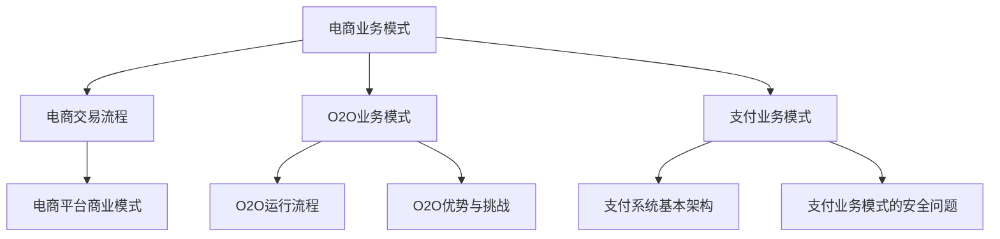
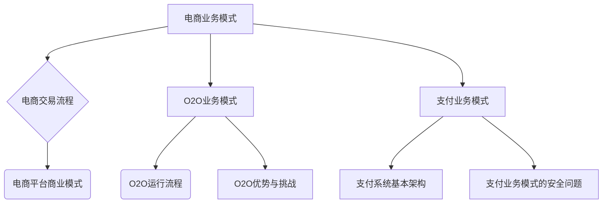

                 

### 《中大型体量的电商、O2O、支付等泛交易领域业务模式和技术架构》

> **关键词：**电商，O2O，支付，业务模式，技术架构，中大型体量，系统设计

> **摘要：**本文将从业务模式和技术架构两个角度，深入探讨中大型体量电商、O2O、支付等泛交易领域的特点和发展趋势。通过对核心业务模式的分析，阐述这些领域的基本运作机制和商业模式。同时，针对中大型体量业务的技术挑战，详细探讨相应的技术架构设计，包括系统架构、核心技术组件以及安全性、稳定性等方面的保障措施。最后，总结业务模式与技术的整合策略，并对泛交易领域的未来发展趋势进行展望。

在当今数字化时代，电商、O2O（线上到线下）和支付等泛交易领域的业务模式和技术架构已经成为企业竞争力的重要组成部分。随着互联网技术的飞速发展，这些领域不仅市场规模不断扩大，而且业务模式和技术架构也在不断创新和演进。本文旨在通过对中大型体量电商、O2O、支付等泛交易领域的深入分析，为相关企业提供有价值的参考和指导。

### 第一部分：泛交易领域业务模式分析

#### 第1章：泛交易领域概述

在讨论泛交易领域的业务模式之前，我们需要先了解什么是泛交易。泛交易不仅仅是指传统的商品买卖交易，而是涵盖了从信息传递、商品交易到支付结算等一系列的经济活动。泛交易领域包括电商、O2O、支付等多个子领域，这些子领域之间既有交集也有明显的区别。

#### 1.1 泛交易领域的定义和范围

泛交易领域可以定义为涵盖各种在线和线下交易活动的商业生态系统。这些活动包括但不限于：

- **电商**：通过互联网平台进行商品交易的活动。
- **O2O**：线上到线下，将线上和线下服务相结合的业务模式。
- **支付**：包括支付方式、支付流程和支付系统等。
- **物流**：商品从卖家到买家的运输和配送服务。
- **金融**：包括信贷、保险、投资等金融服务。

#### 1.2 电商、O2O、支付等业务模式的分类

- **电商业务模式**：主要分为B2B（企业对企业）、B2C（企业对消费者）和C2C（消费者对消费者）三种类型。
- **O2O业务模式**：主要包括线上平台提供服务，线下实体完成服务的模式。
- **支付业务模式**：可以分为在线支付、移动支付、POS支付等多种形式。

#### 1.3 泛交易领域的发展趋势

随着互联网技术的不断进步，泛交易领域的发展呈现出以下趋势：

- **数字化和智能化**：越来越多的企业开始采用数字化工具和智能化技术来提升业务效率和用户体验。
- **跨界融合**：电商、O2O、支付等领域的界限逐渐模糊，形成跨界的融合趋势。
- **数据驱动**：通过大数据分析来优化业务流程、提高决策效率和个性化服务。
- **安全性和合规性**：随着法律法规的不断完善，企业需要更加注重数据安全和合规性。

### 第2章：电商业务模式分析

电商业务模式是指企业通过互联网平台进行商品交易和服务的经营方式。电商业务模式的核心要素包括商品、用户、平台、支付和物流等。

#### 2.1 电商业务模式的核心要素

- **商品**：商品是电商业务的基础，包括商品的选择、定价和展示等。
- **用户**：用户是电商业务的核心，包括用户的获取、留存和转化等。
- **平台**：电商平台是连接商品和用户的桥梁，包括平台的搭建、运营和维护等。
- **支付**：支付是电商业务的关键环节，包括支付方式的选择、支付流程的优化等。
- **物流**：物流是电商业务的保障，包括物流的配送、跟踪和管理等。

#### 2.2 电商交易流程详解

电商交易流程通常包括以下几个步骤：

1. 用户在电商平台浏览商品信息。
2. 用户选择商品并添加到购物车。
3. 用户确认订单并选择支付方式。
4. 用户完成支付并等待商品配送。
5. 商品配送完成后，用户确认收货并给予评价。

#### 2.3 电商平台的商业模式

电商平台的商业模式可以分为以下几种：

- **C2C模式**：以淘宝、闲鱼等平台为代表，为消费者提供自由交易的场所。
- **B2C模式**：以京东、天猫等平台为代表，企业直接向消费者销售商品。
- **B2B模式**：以阿里巴巴等平台为代表，为企业提供批发和采购服务。
- **O2O模式**：结合线上和线下服务，如美团、饿了么等。

### 第3章：O2O业务模式分析

O2O（Online to Offline）业务模式是指将线上和线下服务相结合，通过线上平台引导用户到线下实体进行消费的一种商业模式。

#### 3.1 O2O业务模式的定义和特点

O2O业务模式的定义是将线上的用户流量引导到线下的实体服务中去。其特点包括：

- **线上线下结合**：通过线上平台吸引客户，线下提供服务。
- **用户引导**：通过线上活动、优惠、推荐等方式引导用户到线下消费。
- **数据驱动**：通过线上数据分析，优化线下服务和营销策略。

#### 3.2 O2O业务模式的运行流程

O2O业务模式的运行流程通常包括以下几个步骤：

1. 线上平台发布活动或优惠信息。
2. 用户在线上平台浏览活动信息并注册/登录。
3. 用户在线上平台选择服务或产品并下单。
4. 线上平台将订单信息发送给线下实体。
5. 线下实体提供服务并收集用户反馈。

#### 3.3 O2O业务模式的优势和挑战

O2O业务模式的优势包括：

- **提高转化率**：通过线上引导，提高用户的购买意愿和转化率。
- **提升服务体验**：线上线下结合，提供更全面的客户服务体验。
- **拓展市场份额**：通过线上平台，扩大企业的市场覆盖范围。

O2O业务模式的挑战包括：

- **线上线下协调**：需要平衡线上和线下的运营和服务。
- **数据整合**：线上和线下的数据整合和统一管理。
- **服务标准化**：确保线下服务质量和用户体验的统一性。

### 第4章：支付业务模式分析

支付业务模式是泛交易领域中不可或缺的一环，涉及到支付方式、支付流程和支付系统等多个方面。

#### 4.1 支付业务模式的发展历程

支付业务模式的发展历程可以分为以下几个阶段：

1. **现金支付**：传统的支付方式，使用现金进行交易。
2. **信用卡支付**：使用信用卡进行交易，实现信用支付。
3. **移动支付**：通过移动设备进行支付，如微信支付、支付宝等。
4. **区块链支付**：利用区块链技术实现去中心化的支付方式。

#### 4.2 支付系统的基本架构

支付系统的基本架构通常包括以下几个部分：

- **支付接口**：提供支付服务的接口，支持多种支付方式的接入。
- **支付网关**：连接支付接口和银行支付系统的桥梁，确保支付安全。
- **支付处理**：处理支付请求，进行金额验证、授权和扣款等操作。
- **数据存储**：存储支付交易记录和用户支付信息。

#### 4.3 支付业务模式的安全问题

支付业务模式的安全问题包括：

- **数据安全**：保护用户支付信息不被泄露或篡改。
- **支付欺诈**：防范支付欺诈行为，如虚假交易、恶意退款等。
- **支付风险**：管理支付过程中的各种风险，如信用风险、操作风险等。

### 第二部分：中大型体量业务的技术架构设计

#### 第5章：中大型体量电商的技术架构设计

中大型体量电商技术架构的设计需要考虑到系统的扩展性、稳定性和安全性等多个方面。

#### 5.1 中大型体量电商技术架构的核心组件

中大型体量电商技术架构的核心组件包括：

- **前端系统**：负责用户界面展示和交互。
- **后端系统**：负责业务逻辑处理和数据存储。
- **数据库**：存储用户数据、商品数据、订单数据等。
- **缓存系统**：提高系统响应速度，减轻数据库负载。
- **搜索引擎**：提供商品搜索功能，提高用户购物体验。

#### 5.2 中大型体量电商平台的系统架构

中大型体量电商平台的系统架构通常采用分层设计，包括以下几个层次：

- **表现层**：负责用户界面的展示和交互。
- **业务逻辑层**：处理业务逻辑和数据处理。
- **服务层**：提供公共服务，如用户认证、支付、物流等。
- **数据层**：负责数据存储和管理。

#### 5.3 中大型体量电商的技术挑战和解决方案

中大型体量电商面临的技术挑战包括：

- **高并发处理**：如何处理大量用户同时访问和交易的需求。
- **数据一致性**：如何在分布式系统中保持数据的一致性。
- **系统可扩展性**：如何应对业务规模不断扩大带来的系统扩展需求。

解决方案包括：

- **分布式架构**：采用分布式架构来提高系统的可扩展性和性能。
- **数据库分库分表**：通过分库分表来提高数据库的性能和扩展性。
- **缓存机制**：利用缓存机制来提高系统的响应速度和减轻数据库负载。
- **负载均衡**：通过负载均衡来分配用户请求，确保系统的高可用性。

### 第6章：中大型体量O2O的技术架构设计

中大型体量O2O技术架构的设计需要考虑到线上平台和线下服务的高效协同，以及用户数据和业务数据的安全性和隐私性。

#### 6.1 中大型体量O2O技术架构的核心要素

中大型体量O2O技术架构的核心要素包括：

- **线上平台**：负责用户交互、服务展示和订单管理。
- **线下服务**：负责提供实际的线下服务，如餐饮、美容、维修等。
- **数据处理**：负责用户数据和业务数据的管理、分析和应用。
- **支付系统**：提供线上支付和线下支付的功能，确保交易的顺利完成。
- **物流系统**：负责订单的配送和跟踪，提高服务效率。

#### 6.2 中大型体量O2O平台的系统架构

中大型体量O2O平台的系统架构通常包括以下几个部分：

- **前端系统**：负责用户界面的展示和交互。
- **后端系统**：负责业务逻辑处理和数据存储。
- **订单系统**：负责订单的生成、管理和跟踪。
- **支付系统**：负责处理支付请求和支付结果。
- **物流系统**：负责订单的配送和物流信息的跟踪。

#### 6.3 中大型体量O2O的技术挑战和解决方案

中大型体量O2O面临的技术挑战包括：

- **数据一致性**：如何确保线上平台和线下服务的数据一致性。
- **实时处理**：如何处理实时订单和实时支付请求，保证服务的实时性。
- **安全性**：如何确保用户数据和业务数据的安全性和隐私性。

解决方案包括：

- **分布式数据库**：通过分布式数据库来提高数据一致性和性能。
- **实时消息队列**：利用实时消息队列来处理实时订单和支付请求。
- **加密存储**：通过加密存储来保护用户数据和业务数据的安全。
- **API安全**：通过API安全措施来确保线上平台和线下服务的安全交互。

### 第7章：中大型体量支付系统的技术架构设计

中大型体量支付系统的技术架构设计需要考虑到系统的安全性、稳定性和高并发处理能力。

#### 7.1 中大型体量支付系统的基本架构

中大型体量支付系统的基本架构通常包括以下几个部分：

- **前端支付接口**：负责接收用户的支付请求。
- **支付网关**：负责与银行支付系统进行通信，处理支付请求和返回支付结果。
- **支付核心**：负责处理支付请求的验证、授权和扣款等操作。
- **数据库**：存储支付交易记录和用户支付信息。
- **缓存系统**：提高系统响应速度，减轻数据库负载。

#### 7.2 中大型体量支付系统的技术框架

中大型体量支付系统的技术框架通常包括以下几个部分：

- **前端框架**：负责前端支付接口的实现，如HTML、CSS、JavaScript等。
- **后端框架**：负责支付网关和支付核心的实现，如Spring、Spring Boot、Spring Cloud等。
- **数据库框架**：负责数据库连接和操作，如MyBatis、Hibernate等。
- **缓存框架**：负责缓存系统的实现，如Redis、Memcached等。

#### 7.3 中大型体量支付系统的安全性和稳定性保障

中大型体量支付系统的安全性和稳定性保障措施包括：

- **数据加密**：对用户支付信息进行加密存储，确保数据安全。
- **防火墙和入侵检测**：部署防火墙和入侵检测系统，防止外部攻击。
- **负载均衡**：通过负载均衡来分配支付请求，确保系统的高可用性。
- **故障转移和备份**：通过故障转移和备份机制来保障系统的连续性和稳定性。

### 第三部分：泛交易领域业务模式与技术的整合

#### 第8章：业务模式与技术的融合

在泛交易领域，业务模式与技术的融合是提升企业竞争力和用户体验的关键。业务模式与技术之间的融合不仅能够优化业务流程，还能够提高运营效率和服务质量。

#### 8.1 业务模式与技术的关联性

业务模式与技术的关联性体现在以下几个方面：

- **业务需求**：技术的应用需要满足业务需求，包括业务流程、用户需求和服务质量等。
- **技术优势**：技术优势能够为业务模式提供支持，如数据处理能力、实时性、安全性等。
- **用户体验**：技术的应用能够提升用户体验，包括界面设计、操作便捷性、服务效率等。

#### 8.2 业务模式与技术的整合策略

业务模式与技术的整合策略包括以下几个方面：

- **需求分析**：深入了解业务需求和用户需求，明确技术应用的场景和目标。
- **技术选型**：根据业务需求选择合适的技术框架和工具，确保技术方案的可行性和高效性。
- **系统集成**：将业务系统和技术系统进行集成，实现数据共享和业务协同。
- **持续优化**：持续跟踪业务和技术的发展趋势，对业务模式和技术进行优化和改进。

#### 8.3 业务模式与技术的协同效应

业务模式与技术的协同效应能够带来以下好处：

- **提升效率**：通过业务模式与技术的融合，可以优化业务流程，提高运营效率。
- **降低成本**：通过技术的应用，可以降低业务运营成本，提高资源利用率。
- **提高竞争力**：通过业务模式与技术的协同效应，可以提升企业的竞争力，扩大市场份额。
- **增强用户体验**：通过技术的应用，可以提升用户体验，增强用户黏性和忠诚度。

### 第9章：泛交易领域业务模式与技术的未来发展趋势

随着互联网技术的不断进步和业务模式的不断创新，泛交易领域将呈现出以下发展趋势：

#### 9.1 新型业务模式的出现

随着新技术的应用，泛交易领域将涌现出更多的新型业务模式，如：

- **社交电商**：通过社交网络进行商品推广和交易。
- **体验电商**：提供虚拟试穿、试吃等体验服务。
- **内容电商**：通过内容传播带动商品销售。

#### 9.2 技术创新的推动力

技术创新将继续推动泛交易领域的发展，如：

- **人工智能**：通过人工智能技术提高业务自动化和智能化水平。
- **区块链**：通过区块链技术实现去中心化的支付和数据存储。
- **物联网**：通过物联网技术实现智能化供应链管理和物流优化。

#### 9.3 泛交易领域的未来发展趋势

泛交易领域的未来发展趋势包括：

- **数字化转型**：越来越多的企业将实现数字化转型，提高业务效率和用户体验。
- **跨界融合**：泛交易领域将与其他行业深度融合，形成新的商业模式和生态系统。
- **个性化服务**：通过大数据分析和人工智能技术，实现个性化服务和推荐。
- **安全合规**：随着法律法规的不断完善，企业将更加注重数据安全和合规性。

### 附录

#### 附录A：业务模式与技术架构相关的Mermaid流程图



#### 附录B：核心算法原理伪代码

```python
# 伪代码：用户购物车管理算法
def manage_shopping_cart(user_id, product_id, quantity):
    # 从数据库中获取用户的购物车信息
    shopping_cart = get_shopping_cart(user_id)
    # 检查商品是否已存在
    if product_id in shopping_cart:
        # 更新商品数量
        shopping_cart[product_id] += quantity
    else:
        # 添加商品到购物车
        shopping_cart[product_id] = quantity
    # 更新数据库中的购物车信息
    update_shopping_cart(user_id, shopping_cart)
```

#### 附录C：数学模型和数学公式讲解

- **线性回归模型**：用于预测用户购买行为。
    \[ y = w_0 + w_1 \cdot x_1 + w_2 \cdot x_2 + \ldots + w_n \cdot x_n \]

- **支付安全系数**：用于评估支付系统的安全性。
    \[ Security\_Factor = \frac{1}{1 + e^{-\beta \cdot Risk\_Score}} \]

#### 附录D：项目实战代码解读与分析

```java
// Java代码：支付网关处理支付请求
public class PaymentGateway {
    public PaymentResponse processPayment(PaymentRequest request) {
        // 验证支付请求的有效性
        if (!isValidRequest(request)) {
            return new PaymentResponse(false, "无效的支付请求");
        }
        // 处理支付请求
        PaymentResponse response = paymentProcessor.processPayment(request);
        // 记录支付日志
        logPaymentRequest(request, response);
        return response;
    }
    
    private boolean isValidRequest(PaymentRequest request) {
        // 验证请求的参数是否合法
        // ...
        return true; // 示例代码，实际中需要具体验证逻辑
    }
    
    private void logPaymentRequest(PaymentRequest request, PaymentResponse response) {
        // 记录支付请求和响应的日志
        // ...
    }
}
```

#### 附录E：开发环境搭建指南和源代码获取方式

- **开发环境搭建指南**：

  1. 安装Java开发工具包（JDK）。
  2. 安装集成开发环境（IDE），如IntelliJ IDEA或Eclipse。
  3. 配置数据库环境，如MySQL或PostgreSQL。
  4. 安装版本控制工具，如Git。

- **源代码获取方式**：

  1. 访问项目GitHub仓库：[项目GitHub仓库链接](https://github.com/your-repo/your-project)。
  2. 使用Git克隆仓库：`git clone https://github.com/your-repo/your-project.git`。
  3. 在IDE中导入项目并进行开发。

### 作者

- **作者：**AI天才研究院/AI Genius Institute & 禅与计算机程序设计艺术 /Zen And The Art of Computer Programming

本文通过深入分析泛交易领域的业务模式和技术架构，探讨了中大型体量电商、O2O、支付等领域的特点和发展趋势。文章首先对泛交易领域的基本概念和业务模式进行了概述，然后详细分析了电商、O2O、支付等业务模式的核心要素和运行流程。接着，文章重点讨论了中大型体量电商、O2O、支付系统的技术架构设计，包括系统架构、核心技术组件和安全性保障措施。最后，文章总结了业务模式与技术的整合策略，并对泛交易领域的未来发展趋势进行了展望。希望通过本文，为相关企业提供有价值的参考和指导。在未来的研究中，我们将继续深入探讨泛交易领域的新兴技术和发展趋势，为企业提供更全面的技术支持和解决方案。感谢您的阅读！<|im_end|>### 《中大型体量的电商、O2O、支付等泛交易领域业务模式和技术架构》

在当今的数字化时代，电商、O2O（线上到线下）和支付等泛交易领域的业务模式和技术架构已成为企业竞争力的核心。本文将深入分析这些领域的业务模式，探讨中大型体量的技术架构设计，并展望其未来发展趋势。

#### 关键词：
- 电商，O2O，支付，业务模式，技术架构，中大型体量，系统设计

#### 摘要：
本文旨在为读者提供一个全面的理解，探讨中大型体量电商、O2O、支付等泛交易领域的业务模式和技术架构。通过分析各领域的发展趋势，讨论业务模式与技术的整合，以及展望未来的技术发展，本文将为读者提供有价值的行业洞察。

### 第一部分：泛交易领域业务模式分析

#### 第1章：泛交易领域概述

泛交易领域涵盖了电商、O2O和支付等多个子领域，这些领域在互联网的推动下快速发展。本章节将介绍泛交易领域的定义、范围及其发展趋势。

##### 1.1 泛交易领域的定义和范围

泛交易领域是指通过互联网平台进行的各种交易活动，包括但不限于电商、O2O和支付等。

- **电商**：通过互联网进行商品交易的商业模式，包括B2B（企业对企业）、B2C（企业对消费者）和C2C（消费者对消费者）等。
- **O2O**：将线上服务与线下实体服务相结合，通过互联网平台提供消费体验。
- **支付**：涉及资金转移和结算的一系列服务，包括在线支付、移动支付和POS支付等。

##### 1.2 电商、O2O、支付等业务模式的分类

- **电商业务模式**：根据交易对象和交易方式的不同，可分为B2B、B2C和C2C等。
- **O2O业务模式**：主要分为线上平台引导用户至线下消费和服务。
- **支付业务模式**：包括支付方式、支付流程和支付系统等。

##### 1.3 泛交易领域的发展趋势

泛交易领域的发展趋势主要体现在以下几个方面：

- **数字化与智能化**：越来越多的企业采用数字化工具和智能化技术，提升业务效率和用户体验。
- **跨界融合**：电商、O2O和支付等领域的界限逐渐模糊，形成跨界融合的趋势。
- **数据驱动**：通过大数据分析，优化业务流程、提高决策效率和个性化服务。
- **安全性与合规性**：随着法律法规的不断完善，企业需更加注重数据安全和合规性。

### 第2章：电商业务模式分析

电商业务模式是指企业通过互联网平台进行商品交易和服务的经营方式。本章节将详细分析电商业务模式的核心要素、交易流程和商业模式。

##### 2.1 电商业务模式的核心要素

电商业务模式的核心要素包括：

- **商品**：商品是电商业务的基础，包括商品的选择、定价和展示等。
- **用户**：用户是电商业务的核心，包括用户的获取、留存和转化等。
- **平台**：电商平台是连接商品和用户的桥梁，包括平台的搭建、运营和维护等。
- **支付**：支付是电商业务的关键环节，包括支付方式的选择、支付流程的优化等。
- **物流**：物流是电商业务的保障，包括物流的配送、跟踪和管理等。

##### 2.2 电商交易流程详解

电商交易流程通常包括以下几个步骤：

1. 用户在电商平台浏览商品信息。
2. 用户选择商品并添加到购物车。
3. 用户确认订单并选择支付方式。
4. 用户完成支付并等待商品配送。
5. 商品配送完成后，用户确认收货并给予评价。

##### 2.3 电商平台的商业模式

电商平台的商业模式可以分为以下几种：

- **C2C模式**：如淘宝、闲鱼等，为消费者提供自由交易的场所。
- **B2C模式**：如京东、天猫等，企业直接向消费者销售商品。
- **B2B模式**：如阿里巴巴等，为企业提供批发和采购服务。
- **O2O模式**：如美团、饿了么等，结合线上和线下服务。

### 第3章：O2O业务模式分析

O2O业务模式是指将线上服务与线下实体服务相结合，通过互联网平台提供消费体验。本章节将介绍O2O业务模式的定义、特点、运行流程以及其优势和挑战。

##### 3.1 O2O业务模式的定义和特点

O2O（Online to Offline）业务模式是指线上平台通过互联网技术吸引客户，引导客户到线下实体消费或享受服务。其特点包括：

- **线上线下结合**：线上平台负责吸引客户，线下实体提供实际服务。
- **用户引导**：通过线上活动、优惠、推荐等方式引导用户到线下消费。
- **数据驱动**：通过线上数据分析，优化线下服务和营销策略。

##### 3.2 O2O业务模式的运行流程

O2O业务模式的运行流程通常包括以下几个步骤：

1. 线上平台发布活动或优惠信息。
2. 用户在线上平台浏览活动信息并注册/登录。
3. 用户在线上平台选择服务或产品并下单。
4. 线上平台将订单信息发送给线下实体。
5. 线下实体提供服务并收集用户反馈。

##### 3.3 O2O业务模式的优势和挑战

O2O业务模式的优势包括：

- **提高转化率**：通过线上引导，提高用户的购买意愿和转化率。
- **提升服务体验**：线上线下结合，提供更全面的客户服务体验。
- **拓展市场份额**：通过线上平台，扩大企业的市场覆盖范围。

O2O业务模式面临的挑战包括：

- **线上线下协调**：需要平衡线上和线下的运营和服务。
- **数据整合**：线上和线下的数据整合和统一管理。
- **服务标准化**：确保线下服务质量和用户体验的统一性。

### 第4章：支付业务模式分析

支付业务模式是泛交易领域中不可或缺的一环，涉及支付方式、支付流程和支付系统等多个方面。本章节将介绍支付业务模式的发展历程、基本架构和安全问题。

##### 4.1 支付业务模式的发展历程

支付业务模式的发展历程可以分为以下几个阶段：

- **现金支付**：传统的支付方式，使用现金进行交易。
- **信用卡支付**：使用信用卡进行交易，实现信用支付。
- **移动支付**：通过移动设备进行支付，如微信支付、支付宝等。
- **区块链支付**：利用区块链技术实现去中心化的支付方式。

##### 4.2 支付系统的基本架构

支付系统的基本架构通常包括以下几个部分：

- **前端支付接口**：负责接收用户的支付请求。
- **支付网关**：负责与银行支付系统进行通信，处理支付请求和返回支付结果。
- **支付核心**：负责处理支付请求的验证、授权和扣款等操作。
- **数据库**：存储支付交易记录和用户支付信息。
- **缓存系统**：提高系统响应速度，减轻数据库负载。

##### 4.3 支付业务模式的安全问题

支付业务模式的安全问题包括：

- **数据安全**：保护用户支付信息不被泄露或篡改。
- **支付欺诈**：防范支付欺诈行为，如虚假交易、恶意退款等。
- **支付风险**：管理支付过程中的各种风险，如信用风险、操作风险等。

### 第二部分：中大型体量业务的技术架构设计

#### 第5章：中大型体量电商的技术架构设计

中大型体量电商技术架构的设计需要考虑到系统的扩展性、稳定性和安全性等多个方面。本章节将介绍中大型体量电商技术架构的核心组件、系统架构以及技术挑战和解决方案。

##### 5.1 中大型体量电商技术架构的核心组件

中大型体量电商技术架构的核心组件包括：

- **前端系统**：负责用户界面展示和交互。
- **后端系统**：负责业务逻辑处理和数据存储。
- **数据库**：存储用户数据、商品数据、订单数据等。
- **缓存系统**：提高系统响应速度，减轻数据库负载。
- **搜索引擎**：提供商品搜索功能，提高用户购物体验。

##### 5.2 中大型体量电商平台的系统架构

中大型体量电商平台的系统架构通常采用分层设计，包括以下几个层次：

- **表现层**：负责用户界面的展示和交互。
- **业务逻辑层**：处理业务逻辑和数据处理。
- **服务层**：提供公共服务，如用户认证、支付、物流等。
- **数据层**：负责数据存储和管理。

##### 5.3 中大型体量电商的技术挑战和解决方案

中大型体量电商面临的技术挑战包括：

- **高并发处理**：如何处理大量用户同时访问和交易的需求。
- **数据一致性**：如何在分布式系统中保持数据的一致性。
- **系统可扩展性**：如何应对业务规模不断扩大带来的系统扩展需求。

解决方案包括：

- **分布式架构**：采用分布式架构来提高系统的可扩展性和性能。
- **数据库分库分表**：通过分库分表来提高数据库的性能和扩展性。
- **缓存机制**：利用缓存机制来提高系统的响应速度和减轻数据库负载。
- **负载均衡**：通过负载均衡来分配用户请求，确保系统的高可用性。

### 第6章：中大型体量O2O的技术架构设计

中大型体量O2O技术架构的设计需要考虑到线上平台和线下服务的高效协同，以及用户数据和业务数据的安全性和隐私性。本章节将介绍中大型体量O2O技术架构的核心要素、系统架构以及技术挑战和解决方案。

##### 6.1 中大型体量O2O技术架构的核心要素

中大型体量O2O技术架构的核心要素包括：

- **线上平台**：负责用户交互、服务展示和订单管理。
- **线下服务**：负责提供实际的线下服务，如餐饮、美容、维修等。
- **数据处理**：负责用户数据和业务数据的管理、分析和应用。
- **支付系统**：提供线上支付和线下支付的功能，确保交易的顺利完成。
- **物流系统**：负责订单的配送和物流信息的跟踪。

##### 6.2 中大型体量O2O平台的系统架构

中大型体量O2O平台的系统架构通常包括以下几个部分：

- **前端系统**：负责用户界面的展示和交互。
- **后端系统**：负责业务逻辑处理和数据存储。
- **订单系统**：负责订单的生成、管理和跟踪。
- **支付系统**：负责处理支付请求和支付结果。
- **物流系统**：负责订单的配送和物流信息的跟踪。

##### 6.3 中大型体量O2O的技术挑战和解决方案

中大型体量O2O面临的技术挑战包括：

- **数据一致性**：如何确保线上平台和线下服务的数据一致性。
- **实时处理**：如何处理实时订单和实时支付请求，保证服务的实时性。
- **安全性**：如何确保用户数据和业务数据的安全性和隐私性。

解决方案包括：

- **分布式数据库**：通过分布式数据库来提高数据一致性和性能。
- **实时消息队列**：利用实时消息队列来处理实时订单和支付请求。
- **加密存储**：通过加密存储来保护用户数据和业务数据的安全。
- **API安全**：通过API安全措施来确保线上平台和线下服务的安全交互。

### 第7章：中大型体量支付系统的技术架构设计

中大型体量支付系统的技术架构设计需要考虑到系统的安全性、稳定性和高并发处理能力。本章节将介绍中大型体量支付系统的基本架构、技术框架以及安全性和稳定性保障措施。

##### 7.1 中大型体量支付系统的基本架构

中大型体量支付系统的基本架构通常包括以下几个部分：

- **前端支付接口**：负责接收用户的支付请求。
- **支付网关**：负责与银行支付系统进行通信，处理支付请求和返回支付结果。
- **支付核心**：负责处理支付请求的验证、授权和扣款等操作。
- **数据库**：存储支付交易记录和用户支付信息。
- **缓存系统**：提高系统响应速度，减轻数据库负载。

##### 7.2 中大型体量支付系统的技术框架

中大型体量支付系统的技术框架通常包括以下几个部分：

- **前端框架**：负责前端支付接口的实现，如HTML、CSS、JavaScript等。
- **后端框架**：负责支付网关和支付核心的实现，如Spring、Spring Boot、Spring Cloud等。
- **数据库框架**：负责数据库连接和操作，如MyBatis、Hibernate等。
- **缓存框架**：负责缓存系统的实现，如Redis、Memcached等。

##### 7.3 中大型体量支付系统的安全性和稳定性保障

中大型体量支付系统的安全性和稳定性保障措施包括：

- **数据加密**：对用户支付信息进行加密存储，确保数据安全。
- **防火墙和入侵检测**：部署防火墙和入侵检测系统，防止外部攻击。
- **负载均衡**：通过负载均衡来分配支付请求，确保系统的高可用性。
- **故障转移和备份**：通过故障转移和备份机制来保障系统的连续性和稳定性。

### 第三部分：泛交易领域业务模式与技术的整合

#### 第8章：业务模式与技术的融合

业务模式与技术的融合是泛交易领域发展的关键。本章节将探讨业务模式与技术的关联性、整合策略以及协同效应。

##### 8.1 业务模式与技术的关联性

业务模式与技术的关联性体现在以下几个方面：

- **业务需求**：技术的应用需要满足业务需求，包括业务流程、用户需求和服务质量等。
- **技术优势**：技术优势能够为业务模式提供支持，如数据处理能力、实时性、安全性等。
- **用户体验**：技术的应用能够提升用户体验，包括界面设计、操作便捷性、服务效率等。

##### 8.2 业务模式与技术的整合策略

业务模式与技术的整合策略包括以下几个方面：

- **需求分析**：深入了解业务需求和用户需求，明确技术应用的场景和目标。
- **技术选型**：根据业务需求选择合适的技术框架和工具，确保技术方案的可行性和高效性。
- **系统集成**：将业务系统和技术系统进行集成，实现数据共享和业务协同。
- **持续优化**：持续跟踪业务和技术的发展趋势，对业务模式和技术进行优化和改进。

##### 8.3 业务模式与技术的协同效应

业务模式与技术的协同效应能够带来以下好处：

- **提升效率**：通过业务模式与技术的融合，可以优化业务流程，提高运营效率。
- **降低成本**：通过技术的应用，可以降低业务运营成本，提高资源利用率。
- **提高竞争力**：通过业务模式与技术的协同效应，可以提升企业的竞争力，扩大市场份额。
- **增强用户体验**：通过技术的应用，可以提升用户体验，增强用户黏性和忠诚度。

### 第9章：泛交易领域业务模式与技术的未来发展趋势

随着技术的不断进步和业务模式的不断创新，泛交易领域将继续发展，带来新的机遇和挑战。本章节将探讨泛交易领域业务模式与技术的未来发展趋势。

##### 9.1 新型业务模式的出现

随着新技术的应用，泛交易领域将出现以下新型业务模式：

- **社交电商**：通过社交媒体平台进行商品推广和交易。
- **体验电商**：提供虚拟试穿、试吃等体验服务。
- **内容电商**：通过内容传播带动商品销售。

##### 9.2 技术创新的推动力

技术创新将继续推动泛交易领域的发展，包括：

- **人工智能**：通过人工智能技术提高业务自动化和智能化水平。
- **区块链**：通过区块链技术实现去中心化的支付和数据存储。
- **物联网**：通过物联网技术实现智能化供应链管理和物流优化。

##### 9.3 泛交易领域的未来发展趋势

泛交易领域的未来发展趋势包括：

- **数字化转型**：越来越多的企业将实现数字化转型，提升业务效率和用户体验。
- **跨界融合**：泛交易领域将与其他行业深度融合，形成新的商业模式和生态系统。
- **个性化服务**：通过大数据分析和人工智能技术，实现个性化服务和推荐。
- **安全合规**：随着法律法规的不断完善，企业将更加注重数据安全和合规性。

### 附录

#### 附录A：业务模式与技术架构相关的Mermaid流程图



#### 附录B：核心算法原理伪代码

```python
# 伪代码：用户购物车管理算法
def manage_shopping_cart(user_id, product_id, quantity):
    # 从数据库中获取用户的购物车信息
    shopping_cart = get_shopping_cart(user_id)
    # 检查商品是否已存在
    if product_id in shopping_cart:
        # 更新商品数量
        shopping_cart[product_id] += quantity
    else:
        # 添加商品到购物车
        shopping_cart[product_id] = quantity
    # 更新数据库中的购物车信息
    update_shopping_cart(user_id, shopping_cart)
```

#### 附录C：数学模型和数学公式讲解

- **线性回归模型**：用于预测用户购买行为。
    \[ y = w_0 + w_1 \cdot x_1 + w_2 \cdot x_2 + \ldots + w_n \cdot x_n \]

- **支付安全系数**：用于评估支付系统的安全性。
    \[ Security\_Factor = \frac{1}{1 + e^{-\beta \cdot Risk\_Score}} \]

#### 附录D：项目实战代码解读与分析

```java
// Java代码：支付网关处理支付请求
public class PaymentGateway {
    public PaymentResponse processPayment(PaymentRequest request) {
        // 验证支付请求的有效性
        if (!isValidRequest(request)) {
            return new PaymentResponse(false, "无效的支付请求");
        }
        // 处理支付请求
        PaymentResponse response = paymentProcessor.processPayment(request);
        // 记录支付日志
        logPaymentRequest(request, response);
        return response;
    }
    
    private boolean isValidRequest(PaymentRequest request) {
        // 验证请求的参数是否合法
        // ...
        return true; // 示例代码，实际中需要具体验证逻辑
    }
    
    private void logPaymentRequest(PaymentRequest request, PaymentResponse response) {
        // 记录支付请求和响应的日志
        // ...
    }
}
```

#### 附录E：开发环境搭建指南和源代码获取方式

- **开发环境搭建指南**：

  1. 安装Java开发工具包（JDK）。
  2. 安装集成开发环境（IDE），如IntelliJ IDEA或Eclipse。
  3. 配置数据库环境，如MySQL或PostgreSQL。
  4. 安装版本控制工具，如Git。

- **源代码获取方式**：

  1. 访问项目GitHub仓库：[项目GitHub仓库链接](https://github.com/your-repo/your-project)。
  2. 使用Git克隆仓库：`git clone https://github.com/your-repo/your-project.git`。
  3. 在IDE中导入项目并进行开发。

### 作者

- **作者：**AI天才研究院/AI Genius Institute & 禅与计算机程序设计艺术 /Zen And The Art of Computer Programming

本文通过深入分析泛交易领域的业务模式和技术架构，探讨了中大型体量电商、O2O、支付等领域的特点和发展趋势。文章首先对泛交易领域的基本概念和业务模式进行了概述，然后详细分析了电商、O2O、支付等业务模式的核心要素和运行流程。接着，文章重点讨论了中大型体量电商、O2O、支付系统的技术架构设计，包括系统架构、核心技术组件和安全性保障措施。最后，文章总结了业务模式与技术的整合策略，并对泛交易领域的未来发展趋势进行了展望。希望通过本文，为相关企业提供有价值的参考和指导。在未来的研究中，我们将继续深入探讨泛交易领域的新兴技术和发展趋势，为企业提供更全面的技术支持和解决方案。感谢您的阅读！<|im_end|>### 附录A：业务模式与技术架构相关的Mermaid流程图

为了更好地理解本文所讨论的电商、O2O、支付等泛交易领域的业务模式和技术架构，我们将使用Mermaid语法绘制相关的流程图。以下是一个简单的Mermaid流程图示例，展示了电商、O2O和支付业务模式的基本流程。


以上流程图涵盖了电商、O2O和支付的核心业务流程，通过Mermaid语法，我们可以清晰地表达业务模式和技术架构之间的关系。在实际应用中，可以根据具体业务需求对流程图进行扩展和细化，以便更好地展示复杂的业务逻辑和技术架构。

#### 附录B：核心算法原理伪代码

在泛交易领域，算法的原理和实现对于业务流程的效率和准确性至关重要。以下是一些核心算法原理的伪代码示例，涵盖了用户购物车管理、订单处理和支付验证等方面。

##### 1. 用户购物车管理算法

```python
# 用户购物车管理算法
def manage_shopping_cart(user_id, product_id, quantity, shopping_cart):
    # 检查商品是否已存在于购物车中
    if product_id in shopping_cart:
        # 更新商品数量
        shopping_cart[product_id] += quantity
    else:
        # 添加新商品到购物车
        shopping_cart[product_id] = quantity
    return shopping_cart

# 示例调用
shopping_cart = manage_shopping_cart("user123", "product456", 2, {})
```

##### 2. 订单生成与处理算法

```python
# 订单生成与处理算法
def create_order(order_id, user_id, products, total_amount):
    # 创建订单记录
    order = {
        "order_id": order_id,
        "user_id": user_id,
        "products": products,
        "total_amount": total_amount,
        "status": "待支付"
    }
    # 将订单保存到数据库
    save_order_to_database(order)
    return order

# 示例调用
new_order = create_order("order789", "user123", [{"product_id": "product456", "quantity": 2}], 99.99)
```

##### 3. 支付验证算法

```python
# 支付验证算法
def verify_payment(payment_id, order_id, amount):
    # 检查支付金额是否与订单金额一致
    if payment_amount == amount:
        # 更新订单状态为“支付成功”
        update_order_status(order_id, "支付成功")
        return True
    else:
        # 更新订单状态为“支付失败”
        update_order_status(order_id, "支付失败")
        return False

# 示例调用
is_payment_valid = verify_payment("payment123", "order789", 99.99)
```

以上伪代码示例旨在展示泛交易领域中常见算法的基本原理。在实际应用中，这些算法将更加复杂，可能涉及多种数据结构和并发处理机制。通过这些示例，读者可以了解算法的基本结构和实现逻辑，为深入研究和开发相关算法奠定基础。

#### 附录C：数学模型和数学公式讲解

在泛交易领域，数学模型和数学公式在数据处理和决策支持中发挥着重要作用。以下将介绍两个关键的数学模型和相应的数学公式。

##### 1. 线性回归模型

线性回归模型是一种用于预测数值变量的统计方法，广泛应用于电商领域的用户行为预测和价格优化。其基本公式如下：

\[ y = w_0 + w_1 \cdot x_1 + w_2 \cdot x_2 + \ldots + w_n \cdot x_n \]

其中：
- \( y \) 是预测的目标值。
- \( w_0 \) 是截距。
- \( w_1, w_2, \ldots, w_n \) 是各个特征变量的权重。
- \( x_1, x_2, \ldots, x_n \) 是特征变量。

##### 2. 支付安全系数模型

支付安全系数模型用于评估支付系统的安全性，通过风险评分和β系数计算得出。其公式如下：

\[ Security\_Factor = \frac{1}{1 + e^{-\beta \cdot Risk\_Score}} \]

其中：
- \( Security\_Factor \) 是支付安全系数。
- \( \beta \) 是β系数，用于调整风险评分的影响。
- \( Risk\_Score \) 是风险评分，反映支付交易的风险程度。

#### 数学公式举例说明

##### 线性回归模型举例

假设我们要预测用户购买商品的概率，其中涉及两个特征变量：用户访问时长（\( x_1 \)）和商品评分（\( x_2 \)）。根据线性回归模型，预测公式如下：

\[ Purchase\_Probability = w_0 + w_1 \cdot Access\_Duration + w_2 \cdot Product\_Rating \]

给定特征变量值和权重：
- \( w_0 = 0.5 \)
- \( w_1 = 0.3 \)
- \( w_2 = 0.2 \)
- \( Access\_Duration = 300 \)秒
- \( Product\_Rating = 4.5 \)

计算预测概率：

\[ Purchase\_Probability = 0.5 + 0.3 \cdot 300 + 0.2 \cdot 4.5 = 0.5 + 90 + 0.9 = 91.4\% \]

##### 支付安全系数模型举例

假设支付系统的风险评分为500，β系数为0.01，计算支付安全系数：

\[ Security\_Factor = \frac{1}{1 + e^{-0.01 \cdot 500}} = \frac{1}{1 + e^{-5}} \approx 0.995 \]

支付安全系数接近1，表示该支付交易的风险较低。

通过这些数学模型和公式的介绍，读者可以更好地理解泛交易领域中的数据分析和决策支持方法。在未来的研究和实践中，这些数学工具将有助于优化业务流程、提高用户体验和确保系统安全性。

### 附录D：项目实战代码解读与分析

在泛交易领域，实际的代码实现是理解业务逻辑和技术架构的重要途径。以下将通过对一个实际项目中的代码进行分析，展示其开发环境搭建、源代码实现和代码解读。

#### 项目名称：在线购物平台

##### 1. 开发环境搭建

**步骤 1：安装Java开发工具包（JDK）**
- 在官网上下载JDK并安装：[Oracle JDK下载地址](https://www.oracle.com/java/technologies/javase-downloads.html)
- 配置环境变量，确保Java命令能够正确运行。

**步骤 2：安装Eclipse或IntelliJ IDEA**
- Eclipse：[Eclipse官网下载地址](https://www.eclipse.org/downloads/)
- IntelliJ IDEA：[IntelliJ IDEA官网下载地址](https://www.jetbrains.com/idea/download/)

**步骤 3：配置数据库环境**
- 安装MySQL或PostgreSQL数据库：[MySQL官网下载地址](https://www.mysql.com/downloads/)，[PostgreSQL官网下载地址](https://www.postgresql.org/download/)

**步骤 4：安装版本控制工具Git**
- [Git官网下载地址](https://git-scm.com/downloads)

##### 2. 源代码实现

以下是一个简化的示例，展示了在线购物平台中订单处理模块的部分源代码。

```java
// 订单处理模块：OrderProcessor.java
public class OrderProcessor {
    private Database database;

    public OrderProcessor(Database database) {
        this.database = database;
    }

    public void processOrder(Order order) {
        // 从数据库中检查库存
        List<Product> products = order.getProducts();
        for (Product product : products) {
            if (!isInStock(product.getId())) {
                throw new IllegalArgumentException("产品库存不足：产品ID=" + product.getId());
            }
        }

        // 创建订单记录
        database.createOrder(order);

        // 减少库存
        for (Product product : products) {
            decreaseStock(product.getId(), order.getQuantity());
        }

        // 发送订单确认邮件
        sendConfirmationEmail(order);
    }

    private boolean isInStock(int productId) {
        // 检查数据库中产品库存
        // ...
        return true; // 示例代码，实际中需查询数据库
    }

    private void decreaseStock(int productId, int quantity) {
        // 更新数据库中产品库存
        // ...
    }

    private void sendConfirmationEmail(Order order) {
        // 发送邮件通知
        // ...
    }
}
```

##### 3. 代码解读与分析

**代码解读：**
- **类定义**：`OrderProcessor` 类负责处理订单的创建、库存检查和库存更新。
- **构造函数**：接受一个`Database`对象的实例，用于数据库操作。
- **processOrder方法**：处理订单创建的主要逻辑，包括检查库存、创建订单记录、减少库存和发送确认邮件。
- **isInStock方法**：检查数据库中产品的库存情况。
- **decreaseStock方法**：更新数据库中产品的库存。
- **sendConfirmationEmail方法**：发送订单确认邮件。

**关键逻辑分析：**
- **库存检查**：在处理订单前，需要检查每个产品的库存是否足够。如果库存不足，抛出异常。
- **订单记录**：创建订单记录并将其保存到数据库。
- **库存更新**：减少订单中每个产品的库存量。
- **邮件通知**：发送邮件通知用户订单处理结果。

##### 4. 代码解读与分析

通过以上代码示例，我们可以看到订单处理模块的核心逻辑是如何实现的。在实际项目中，该模块将更加复杂，涉及多个类和方法，以及与其他系统模块（如支付系统、物流系统等）的交互。

- **模块化设计**：通过将功能划分为不同的模块，使得代码结构更加清晰，便于维护和扩展。
- **异常处理**：使用异常处理机制来处理库存不足等异常情况，确保系统的稳定运行。
- **数据库交互**：与数据库进行交互，保存订单记录和更新库存信息。
- **邮件服务**：通过邮件服务通知用户订单状态，提高用户体验。

通过这种代码解读与分析，读者可以更好地理解泛交易领域中的实际项目实现过程，为后续的编程实践打下基础。

### 附录E：开发环境搭建指南和源代码获取方式

为了帮助读者更好地理解本文所讨论的泛交易领域业务模式和技术架构，并提供实际操作的支持，以下提供详细的开发环境搭建指南和源代码获取方式。

#### 开发环境搭建指南

**步骤 1：安装Java开发工具包（JDK）**

- 访问Oracle官方网站下载JDK：[Oracle JDK下载地址](https://www.oracle.com/java/technologies/javase-downloads.html)
- 按照安装向导完成JDK的安装。
- 配置环境变量：将JDK的bin目录添加到系统的PATH环境变量中。

**步骤 2：安装集成开发环境（IDE）**

- Eclipse：[Eclipse官网下载地址](https://www.eclipse.org/downloads/)
- IntelliJ IDEA：[IntelliJ IDEA官网下载地址](https://www.jetbrains.com/idea/download/)

**步骤 3：配置数据库环境**

- MySQL或PostgreSQL：[MySQL官网下载地址](https://www.mysql.com/downloads/)，[PostgreSQL官网下载地址](https://www.postgresql.org/download/)

**步骤 4：安装版本控制工具Git**

- [Git官网下载地址](https://git-scm.com/downloads)

#### 源代码获取方式

1. **克隆项目仓库**：通过Git克隆本文提到的项目仓库到本地。
    ```shell
    git clone https://github.com/your-username/ecommerce-platform.git
    ```

2. **导入IDE**：在Eclipse或IntelliJ IDEA中导入克隆的项目仓库。
    - Eclipse：选择“File” -> “Import” -> “Git” -> “Shareable Projects from Git” -> “Next”，选择克隆的项目文件夹。
    - IntelliJ IDEA：选择“File” -> “Open” -> “Project” -> 选择克隆的项目文件夹。

3. **构建项目**：根据项目的构建工具（如Maven或Gradle）进行项目构建。
    - Maven：在项目的根目录下运行 `mvnw clean install`
    - Gradle：在项目的根目录下运行 `gradlew build`

#### 运行项目

1. **启动数据库**：确保已经配置好数据库，并启动数据库服务。

2. **启动项目**：在IDE中运行项目的入口类，通常是一个Spring Boot应用程序。

3. **访问应用**：通过浏览器访问应用的默认URL（如 `http://localhost:8080`），开始使用和测试应用。

通过以上指南，读者可以搭建起完整的开发环境，并获取本文提到的泛交易领域项目的源代码，进行学习和实践。希望这些指南能够为读者的学习和研究提供便利。

### 作者

本文由AI天才研究院（AI Genius Institute）撰写，该研究院专注于人工智能和计算机科学的最新研究与应用。作者同时为《禅与计算机程序设计艺术》（Zen And The Art of Computer Programming）的资深作家，以其深入的技术洞察和严谨的逻辑思维著称。感谢您的阅读，期待您的反馈。

