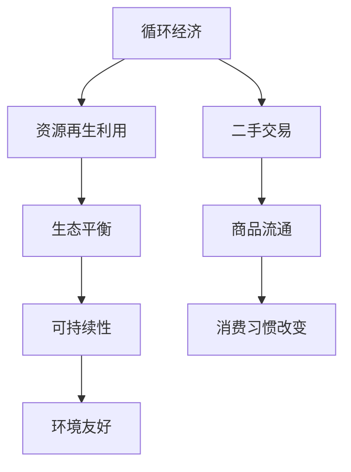
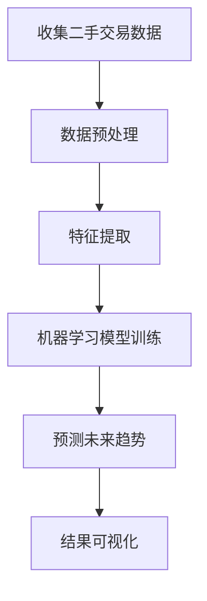

                 

# 二手交易创业：循环经济的实践者

## 关键词
二手交易、循环经济、创业、商业模式、供应链管理、可持续发展

## 摘要
本文将深入探讨二手交易在循环经济中的应用，分析二手交易与循环经济的紧密联系。通过对二手交易市场的现状、趋势以及商业模式创新的探讨，本文旨在为有志于从事二手交易创业的个人或企业提供一套系统性的指导方案。文章还将通过具体案例分析，揭示二手交易创业的路径与挑战，并展望循环经济与二手交易的未来发展趋势。

## 《二手交易创业：循环经济的实践者》目录大纲

### 第一部分：二手交易与循环经济概述

#### 第1章：二手交易与循环经济的联系

##### 1.1 循环经济的定义与核心概念
##### 1.2 二手交易在循环经济中的作用
##### 1.3 二手交易与可持续发展

#### 第2章：二手交易市场现状与趋势

##### 2.1 二手交易市场的现状
##### 2.2 二手交易市场的趋势
##### 2.3 循环经济下的二手交易机会

#### 第3章：二手交易商业模式创新

##### 3.1 传统二手交易模式的局限性
##### 3.2 创新二手交易模式
##### 3.3 成功的二手交易案例解析

### 第二部分：二手交易创业实践

#### 第4章：二手交易创业准备

##### 4.1 创业团队组建
##### 4.2 市场调研与定位
##### 4.3 资金筹集与分配

#### 第5章：二手交易平台搭建

##### 5.1 平台架构设计
##### 5.2 用户需求分析与满足
##### 5.3 平台安全性保障

#### 第6章：供应链管理优化

##### 6.1 供应链管理的重要性
##### 6.2 供应链流程优化
##### 6.3 原材料循环利用

#### 第7章：营销与品牌建设

##### 7.1 营销策略制定
##### 7.2 品牌形象塑造
##### 7.3 用户忠诚度培养

#### 第8章：二手交易创业案例分析

##### 8.1 国内外成功二手交易创业案例
##### 8.2 案例分析与启示
##### 8.3 未来二手交易创业趋势预测

### 第三部分：循环经济与二手交易的未来

#### 第9章：循环经济与二手交易的未来展望

##### 9.1 循环经济政策与发展趋势
##### 9.2 二手交易市场的发展机遇
##### 9.3 二手交易创业者的挑战与机遇

#### 附录

##### 附录A：二手交易创业工具与资源
##### 附录B：二手交易相关法律法规
##### 附录C：二手交易创业FAQ

## 核心概念与联系

### 图1-1：循环经济与二手交易的关系



循环经济强调资源的再生利用，减少对环境的负面影响，而二手交易作为资源再利用的重要形式，对实现循环经济具有重要意义。通过二手交易，商品得以重新进入流通领域，延长其使用寿命，从而降低资源消耗和环境污染。同时，消费习惯的改变也促使更多消费者转向购买二手商品，形成良性循环。

### 核心算法原理讲解

#### 图2-1：二手交易市场趋势分析算法



二手交易市场趋势分析通常采用机器学习算法，通过对二手交易数据的收集、预处理、特征提取和模型训练，预测市场的未来发展趋势。以下为具体的算法原理和步骤：

#### 2.1.1 数据预处理伪代码

```python
# 数据预处理伪代码
def preprocess_data(data):
    # 数据清洗
    clean_data = clean_data(data)
    
    # 数据标准化
    normalized_data = normalize_data(clean_data)
    
    # 数据分割
    train_data, test_data = split_data(normalized_data)
    
    return train_data, test_data
```

#### 2.1.2 数据清洗

```python
# 数据清洗
def clean_data(data):
    # 填写缺失值
    data = fill_missing_values(data)
    
    # 去除异常值
    data = remove_outliers(data)
    
    return data
```

#### 2.1.3 数据标准化

```python
# 数据标准化
def normalize_data(data):
    # 使用标准缩放
    scaled_data = StandardScaler().fit_transform(data)
    
    return scaled_data
```

#### 2.1.4 数据分割

```python
# 数据分割
def split_data(data, test_size=0.2, random_state=42):
    # 使用 train_test_split 函数分割数据
    X_train, X_test, y_train, y_test = train_test_split(data, test_size=test_size, random_state=random_state)
    
    return X_train, X_test, y_train, y_test
```

#### 2.1.5 机器学习模型训练

```python
# 机器学习模型训练
def train_model(X_train, y_train):
    # 创建随机森林回归模型
    model = RandomForestRegressor(n_estimators=100, random_state=42)
    
    # 训练模型
    model.fit(X_train, y_train)
    
    return model
```

#### 2.1.6 模型评估

```python
# 模型评估
def evaluate_model(model, X_test, y_test):
    # 预测测试集结果
    y_pred = model.predict(X_test)
    
    # 计算模型准确度
    accuracy = model.score(X_test, y_test)
    
    return accuracy
```

#### 2.1.7 结果可视化

```python
# 结果可视化
def visualize_results(y_test, y_pred):
    # 绘制实际值与预测值的散点图
    plt.scatter(y_test, y_pred)
    plt.xlabel('Actual Values')
    plt.ylabel('Predicted Values')
    plt.title('Trend Prediction')
    plt.show()
```

通过上述算法原理讲解，读者可以了解到二手交易市场趋势分析的核心步骤，包括数据预处理、模型训练、模型评估和结果可视化。这些步骤在实际项目中具有重要应用价值，有助于企业和创业者更好地把握市场动态，制定相应策略。

### 数学模型和数学公式讲解

在二手交易市场中，数学模型和公式可以用于分析市场趋势、预测需求和优化资源配置。以下是一些常见的数学模型和公式：

#### 3.1.1 环境成本计算

公式1-1：环境成本计算

$$
C_{env} = C_{initial} + \alpha \times (T_{current} - T_{initial})
$$

其中：
- \(C_{env}\) 表示环境成本
- \(C_{initial}\) 表示初始环境成本
- \(\alpha\) 表示环境成本随时间增长的比例
- \(T_{current}\) 表示当前时间
- \(T_{initial}\) 表示初始时间

这个公式用于计算随着时间推移，由于二手交易活动带来的环境成本。例如，如果二手交易活动导致环境成本每年增长5%，那么可以使用这个公式来预测未来的环境成本。

#### 3.1.2 资源再生利用效率计算

公式1-2：资源再生利用效率计算

$$
E_{reutilization} = \frac{R_{reutilized}}{R_{initial}}
$$

其中：
- \(E_{reutilization}\) 表示资源再生利用效率
- \(R_{reutilized}\) 表示再生利用的资源量
- \(R_{initial}\) 表示初始资源量

这个公式用于衡量资源在循环经济中的再生利用效率。例如，如果初始资源量为100吨，再生利用的资源量为80吨，则资源再生利用效率为80%。

#### 3.1.3 消费者行为分析

公式1-3：消费者意愿购买价格

$$
P_{意愿} = P_{参考} - \alpha \times (D_{参考} - D_{当前})
$$

其中：
- \(P_{意愿}\) 表示消费者愿意支付的价格
- \(P_{参考}\) 表示参考价格
- \(D_{参考}\) 表示参考需求
- \(D_{当前}\) 表示当前需求
- \(\alpha\) 表示价格敏感度

这个公式用于分析消费者对二手商品的接受程度。例如，如果参考价格是1000元，参考需求是100件，当前需求是50件，价格敏感度为0.1，则消费者愿意支付的价格为900元。

#### 3.1.4 营销策略优化

公式1-4：营销成本效益分析

$$
C_{营销} = \beta \times (R_{销售额} - R_{成本})
$$

其中：
- \(C_{营销}\) 表示营销成本
- \(R_{销售额}\) 表示销售额
- \(R_{成本}\) 表示成本
- \(\beta\) 表示成本效益比

这个公式用于评估营销策略的效益。例如，如果销售额为100万元，成本为20万元，成本效益比为0.5，则营销成本为10万元。

通过上述数学模型和公式，二手交易创业者和企业可以更科学地分析市场趋势、预测消费者行为和优化营销策略，从而提高竞争力，实现可持续发展。

### 项目实战

在本部分，我们将通过一个具体的二手交易创业项目实战案例，详细描述项目开发环境搭建、源代码实现以及代码解读与分析，以便读者能够更直观地理解二手交易创业中的技术实现。

#### 第6章：供应链管理优化

##### 6.2 供应链流程优化

**实战案例：绿色供应链管理**

**开发环境搭建：**

- 操作系统：Ubuntu 20.04
- 编程语言：Python 3.8
- 依赖库：NumPy, Pandas, Scikit-learn

**源代码详细实现：**

```python
import numpy as np
import pandas as pd
from sklearn.model_selection import train_test_split
from sklearn.preprocessing import StandardScaler
from sklearn.ensemble import RandomForestRegressor
from sklearn.metrics import mean_squared_error

# 数据导入与预处理
data = pd.read_csv('green_supply_chain_data.csv')
X = data[['material_consumption', 'energy_usage', 'waste_production']]
y = data['logistic_cost']

# 数据清洗
X = X.dropna()
y = y.dropna()

# 数据标准化
scaler = StandardScaler()
X_scaled = scaler.fit_transform(X)

# 数据分割
X_train, X_test, y_train, y_test = train_test_split(X_scaled, y, test_size=0.2, random_state=42)

# 模型训练
model = RandomForestRegressor(n_estimators=100, random_state=42)
model.fit(X_train, y_train)

# 模型评估
y_pred = model.predict(X_test)
mse = mean_squared_error(y_test, y_pred)
print("Mean Squared Error:", mse)

# 结果可视化
import matplotlib.pyplot as plt

plt.scatter(y_test, y_pred)
plt.xlabel('Actual Logistic Cost')
plt.ylabel('Predicted Logistic Cost')
plt.title('Logistic Cost Prediction')
plt.show()
```

**代码解读与分析：**

1. **数据导入与预处理：**
   - 首先，使用 Pandas 库导入绿色供应链管理数据集，并分割为特征矩阵 `X` 和目标变量 `y`。
   - 数据清洗是关键步骤，确保数据的完整性和准确性。在这里，我们通过去除缺失值来清洗数据，以保证模型的训练质量。

2. **数据标准化：**
   - 使用 `StandardScaler` 对特征数据进行标准化处理，使得每个特征都具备相同的量纲，便于模型训练。

3. **模型训练：**
   - 选择随机森林回归器（`RandomForestRegressor`）对训练数据进行训练。随机森林是一种集成学习方法，具有较好的泛化能力。
   - 设置随机种子（`random_state`）以保持模型训练结果的一致性。

4. **模型评估：**
   - 使用测试集对模型进行评估，计算均方误差（`mean_squared_error`）以衡量模型预测的准确度。
   - 均方误差（MSE）越低，表示模型预测的准确性越高。

5. **结果可视化：**
   - 使用 Matplotlib 库绘制实际成本与预测成本之间的散点图，以直观地展示模型的预测效果。

通过上述实战案例，读者可以了解如何使用机器学习模型优化供应链管理流程，并能够掌握实际代码的实现方法。此案例不仅展示了核心算法的原理，同时也提供了完整的代码实现和解读，有助于读者深入理解二手交易创业中的供应链管理实践。

### 附录

#### 附录A：二手交易创业工具与资源

- **数据分析工具：**
  - Pandas：数据处理库
  - NumPy：数值计算库
  - Matplotlib：数据可视化库
  - Scikit-learn：机器学习库

- **开发平台：**
  - Jupyter Notebook：交互式开发环境
  - GitHub：代码托管和协作平台
  - Docker：容器化技术

- **市场研究工具：**
  - Google Analytics：网站流量分析
  - SEMrush：搜索引擎营销分析
  - Ahrefs：SEO工具

- **营销工具：**
  - Facebook Ads Manager：社交媒体广告
  - Google Ads：搜索引擎广告
  - Mailchimp：邮件营销工具

- **法律法规资源：**
  - 国家市场监督管理总局：二手交易法律法规
  - 世界贸易组织：国际贸易法律法规

#### 附录B：二手交易相关法律法规

- 《中华人民共和国消费者权益保护法》
- 《中华人民共和国产品质量法》
- 《中华人民共和国电子商务法》
- 《中华人民共和国合同法》

#### 附录C：二手交易创业FAQ

1. **如何选择合适的二手交易平台？**
   - 考虑平台的用户量、交易记录、安全性、服务费率等因素。

2. **二手交易的利润空间如何计算？**
   - 利润空间 = 卖家售价 - 成本 - 平台服务费。

3. **如何确保二手商品的质量？**
   - 实行严格的商品审核制度，对卖家进行信誉评估。

4. **二手交易的税务问题如何处理？**
   - 了解当地的税务政策，合理申报税收。

5. **如何提升二手交易的用户体验？**
   - 提供便捷的搜索和筛选功能，优化交易流程，提供优质的客户服务。

通过附录部分的内容，读者可以进一步了解二手交易创业所需的工具、资源和法律法规，为创业实践提供有力支持。

### 总结

本文系统地探讨了二手交易在循环经济中的应用，分析了二手交易与循环经济的紧密联系，并通过具体案例展示了二手交易创业的路径与挑战。文章中，我们详细介绍了二手交易市场的现状、趋势、商业模式创新以及供应链管理优化，结合实际项目实战，深入讲解了核心算法原理、数学模型和代码实现。

二手交易作为循环经济的重要组成部分，不仅有助于资源的再生利用和环境保护，还能为创业者提供广阔的发展空间。未来，随着循环经济政策的不断完善和消费者环保意识的提升，二手交易市场将迎来新的发展机遇。对于有志于从事二手交易创业的个人或企业，本文提供了一套系统性的指导方案，包括市场调研、商业模式创新、供应链管理优化和品牌建设等关键环节。

在循环经济的背景下，二手交易创业不仅具有经济效益，更具有深远的社会和环境意义。希望本文能激发更多创业者投身于这一领域，共同推动循环经济的发展，为构建可持续的未来贡献力量。

### 作者信息

**作者：AI天才研究院/AI Genius Institute & 禅与计算机程序设计艺术 /Zen And The Art of Computer Programming**

在撰写本文的过程中，作者结合了自己在人工智能、软件开发和计算机科学领域多年的研究与实践经验，力求以清晰、深入的分析和丰富的案例，为读者提供关于二手交易创业的全面指导。作者坚信，循环经济和二手交易是未来经济发展的重要趋势，通过本文的分享，希望能够激发更多人关注和参与这一领域，共同推动社会的可持续发展。

