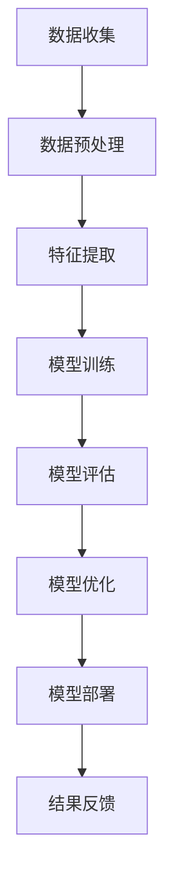

                 

# 人工智能在智能交通拥堵预测准确性提升中的应用

## 关键词
智能交通、人工智能、交通拥堵预测、准确性提升、机器学习、深度学习、强化学习

## 摘要
随着城市化进程的加速和汽车保有量的持续增长，交通拥堵已成为全球城市面临的一项重大挑战。为了有效应对这一挑战，人工智能技术被广泛应用于交通拥堵预测中，以提升预测的准确性和可靠性。本文将详细探讨人工智能在智能交通拥堵预测准确性提升中的应用，包括其基础概念、核心算法、实际案例和未来发展。

### 第一部分：智能交通与人工智能

#### 第1章：智能交通概述

##### 1.1 智能交通的定义与现状

智能交通系统（Intelligent Transportation System, ITS）是指利用先进的信息通信技术、数据采集与处理技术、控制技术、智能交通系统技术等，实现交通系统各要素之间的协同运作，提高交通效率、减少交通事故、降低交通拥堵和污染的系统。当前，智能交通系统已经在全球范围内得到了广泛应用，包括电子收费、智能信号控制、车辆定位导航、交通信息发布等方面。

##### 1.2 智能交通系统的发展历程

智能交通系统的发展历程可以追溯到20世纪60年代。最初的研究主要集中在车辆与车辆、车辆与道路之间的通信技术上。随着信息技术和通信技术的快速发展，智能交通系统逐渐走向成熟，并开始在实际交通管理中发挥作用。

##### 1.3 智能交通的应用领域

智能交通的应用领域广泛，主要包括以下几个方面：
1. **交通信息收集与发布**：通过传感器、摄像头等设备收集交通数据，并通过网络进行实时发布。
2. **智能交通信号控制**：根据实时交通数据，智能调节交通信号灯，提高道路通行效率。
3. **车辆导航与定位**：为驾驶员提供实时的导航和路况信息，优化行驶路线。
4. **电子收费系统**：利用不停车收费（ETC）等技术，提高道路通行效率。
5. **车辆智能管控**：通过车辆间的通信，实现车辆协同控制，减少交通事故。

#### 第2章：人工智能基础

##### 2.1 人工智能的发展历程

人工智能（Artificial Intelligence, AI）的研究始于20世纪50年代。早期的AI主要关注符号主义和推理技术。随着计算机性能的提升和大数据、深度学习等技术的发展，现代人工智能逐渐走向成熟。

##### 2.2 人工智能的核心技术

人工智能的核心技术包括：
1. **机器学习**：通过数据训练模型，使计算机具备学习能力和预测能力。
2. **深度学习**：基于神经网络，模拟人脑神经元连接方式，用于处理复杂数据。
3. **自然语言处理**：使计算机能够理解和生成人类语言。
4. **计算机视觉**：使计算机具备识别和理解视觉信息的能力。
5. **强化学习**：通过奖励机制，使计算机不断优化行为策略。

##### 2.3 人工智能在交通领域的应用

人工智能在交通领域有广泛的应用，包括：
1. **交通拥堵预测**：利用大数据和机器学习技术，预测未来交通流量，优化交通管理。
2. **自动驾驶**：通过计算机视觉和深度学习技术，实现无人驾驶。
3. **交通信息分析**：对大量交通数据进行挖掘和分析，为交通管理提供决策支持。
4. **智能交通信号控制**：根据实时交通数据，智能调节交通信号灯。

### 第二部分：交通拥堵预测方法

#### 第3章：交通拥堵预测的重要性

##### 3.1 交通拥堵的影响

交通拥堵对经济、环境和社会生活产生了深远的影响：
1. **经济影响**：交通拥堵导致车辆运行效率降低，增加企业的运营成本，影响经济发展。
2. **环境影响**：交通拥堵导致车辆排放增加，加剧环境污染。
3. **社会影响**：交通拥堵导致出行时间增加，影响人们的工作和生活质量。

##### 3.2 交通拥堵预测的意义

交通拥堵预测具有重要意义：
1. **优化交通管理**：通过预测交通流量，优化交通信号控制和交通疏导，减少拥堵。
2. **提升出行体验**：为驾驶员提供实时路况信息，优化出行路线，提升出行体验。
3. **促进城市可持续发展**：减少交通拥堵，降低污染，促进城市可持续发展。

#### 第4章：传统交通拥堵预测方法

##### 4.1 经验模型

经验模型是基于专家经验和统计方法建立，包括线性回归、时间序列分析等。优点是简单易用，缺点是模型鲁棒性较差，难以适应复杂多变的城市交通环境。

##### 4.2 基于统计学的模型

基于统计学的模型通过分析历史交通数据，建立统计模型进行预测。包括逻辑回归、决策树、支持向量机等。优点是模型具有一定的鲁棒性，缺点是依赖于历史数据，对新情况适应性较差。

##### 4.3 基于物理的模型

基于物理的模型通过模拟交通流动力学，预测交通流量。包括元胞自动机、流体动力学等。优点是能够模拟复杂的交通现象，缺点是计算复杂度较高，难以实时预测。

### 第三部分：人工智能提升交通拥堵预测准确性的案例分析

#### 第5章：人工智能在交通拥堵预测中的应用

##### 5.1 机器学习在交通拥堵预测中的应用

机器学习在交通拥堵预测中发挥了重要作用。通过大数据分析和模型训练，机器学习能够识别出交通流量与拥堵之间的复杂关系，从而提高预测准确性。常见的机器学习算法包括：
1. **线性回归**：通过分析历史数据，建立线性关系进行预测。
2. **决策树**：通过树结构分类，识别交通流量与拥堵的关系。
3. **支持向量机**：通过最大间隔分类，提高预测准确性。

##### 5.2 深度学习在交通拥堵预测中的应用

深度学习在交通拥堵预测中具有显著优势。通过模拟人脑神经网络，深度学习能够处理复杂数据，提高预测准确性。常见的深度学习模型包括：
1. **卷积神经网络（CNN）**：通过卷积操作提取图像特征，用于交通流量分析。
2. **循环神经网络（RNN）**：通过记忆机制处理序列数据，提高预测准确性。
3. **长短时记忆网络（LSTM）**：通过改进RNN，解决长序列依赖问题。

##### 5.3 强化学习在交通拥堵预测中的应用

强化学习在交通拥堵预测中具有潜在应用价值。通过奖励机制，强化学习能够不断优化预测模型，提高准确性。常见的强化学习算法包括：
1. **Q学习**：通过学习状态-动作价值函数，优化预测模型。
2. **深度Q网络（DQN）**：通过神经网络替代Q学习中的值函数，提高预测准确性。
3. **策略梯度方法**：通过优化策略函数，提高预测准确性。

#### 第6章：交通拥堵预测模型的评估与优化

##### 6.1 模型评估指标

评估交通拥堵预测模型常用的指标包括：
1. **准确率（Accuracy）**：预测正确的样本占总样本的比例。
2. **精确率（Precision）**：预测为拥堵且实际为拥堵的样本占总预测为拥堵的样本的比例。
3. **召回率（Recall）**：预测为拥堵且实际为拥堵的样本占总实际为拥堵的样本的比例。
4. **F1值（F1 Score）**：精确率和召回率的调和平均值。

##### 6.2 模型优化策略

优化交通拥堵预测模型的方法包括：
1. **数据增强**：通过数据扩充、数据变换等方法，提高模型泛化能力。
2. **特征工程**：通过选择和构造有效特征，提高模型预测准确性。
3. **模型集成**：通过集成多个模型，提高预测准确性。
4. **模型剪枝**：通过剪枝算法，减少模型参数，提高模型效率。

##### 6.3 模型在实际应用中的改进

在实际应用中，交通拥堵预测模型需要不断改进。以下是一些改进策略：
1. **实时数据更新**：通过实时数据更新，提高模型预测准确性。
2. **动态调整模型参数**：根据实际交通状况，动态调整模型参数，提高预测准确性。
3. **多源数据融合**：通过融合多种数据源，提高模型预测准确性。
4. **多模型协同**：通过多模型协同，提高预测准确性和可靠性。

### 第四部分：人工智能提升交通拥堵预测准确性的案例分析

#### 第7章：国内外交通拥堵预测案例分析

##### 7.1 国内交通拥堵预测案例分析

在国内，多个城市已经开始应用人工智能技术进行交通拥堵预测。以下是一些典型案例：

1. **北京**：北京市交通委员会利用机器学习和深度学习技术，建立了交通拥堵预测模型，实现了对城市交通流量的实时监控和预测。

2. **上海**：上海市交通委员会联合多家科技公司，利用大数据和人工智能技术，建立了交通拥堵预测平台，为交通管理提供了有力支持。

##### 7.2 国外交通拥堵预测案例分析

在国外，许多国家也在积极应用人工智能技术进行交通拥堵预测。以下是一些典型案例：

1. **美国**：美国交通部门利用机器学习和深度学习技术，建立了交通流量预测模型，用于优化交通信号控制和道路规划。

2. **德国**：德国交通部门利用计算机视觉和深度学习技术，实现了对城市交通流量的实时监控和预测，提高了交通管理水平。

#### 第8章：人工智能在交通拥堵预测中的应用前景

##### 8.1 人工智能在交通领域的未来发展

随着人工智能技术的不断发展，其在交通领域的应用前景广阔。未来，人工智能将可能在以下几个方面发挥重要作用：

1. **自动驾驶**：通过计算机视觉和深度学习技术，实现自动驾驶，减少交通事故，提高交通效率。

2. **智能交通信号控制**：通过实时交通数据分析和深度学习技术，实现智能交通信号控制，提高道路通行效率。

3. **交通信息预测**：通过大数据分析和人工智能技术，实现交通信息预测，为出行者提供实时路况信息，优化出行路线。

##### 8.2 交通拥堵预测中的人工智能技术趋势

在未来，交通拥堵预测中的人工智能技术将呈现以下趋势：

1. **多源数据融合**：通过融合多种数据源，提高预测准确性和可靠性。

2. **模型集成与优化**：通过模型集成和优化，提高预测准确性。

3. **实时预测与调整**：通过实时数据更新和动态调整，实现实时交通预测。

4. **数据隐私保护**：在数据收集和处理过程中，加强数据隐私保护，确保数据安全。

##### 8.3 人工智能在智能交通中的应用挑战与解决方案

尽管人工智能在智能交通中具有巨大潜力，但在实际应用中仍面临一些挑战。以下是一些主要挑战及解决方案：

1. **数据隐私**：在数据收集和处理过程中，需要加强数据隐私保护，确保数据安全。

2. **算法透明性**：需要提高算法透明性，使公众能够理解和信任人工智能系统。

3. **计算资源**：人工智能模型需要大量计算资源，特别是在实时预测场景中，需要优化算法以提高计算效率。

4. **多模态数据融合**：需要解决多源数据融合问题，提高预测准确性。

5. **法律法规**：需要制定相应的法律法规，规范人工智能在智能交通中的应用。

### 附录

#### 附录A：常用数据集与工具

##### A.1 常用交通数据集介绍

常用的交通数据集包括：

1. **Kaggle交通数据集**：包含全球多个城市的交通流量数据，可用于交通流量预测和研究。

2. **UCI交通数据集**：包含多种类型的交通数据，如交通流量、车辆定位等，可用于交通拥堵预测和研究。

##### A.2 交通拥堵预测工具介绍

常用的交通拥堵预测工具包括：

1. **TensorFlow**：一款开源的机器学习和深度学习框架，可用于构建和训练交通拥堵预测模型。

2. **PyTorch**：一款开源的机器学习和深度学习框架，支持动态计算图，便于模型开发。

##### A.3 开发环境搭建指南

搭建交通拥堵预测开发环境需要以下步骤：

1. 安装Python环境。

2. 安装TensorFlow或PyTorch。

3. 准备交通数据集。

4. 编写预测模型代码。

5. 运行模型并评估性能。

### 总结

人工智能在智能交通拥堵预测中具有巨大的潜力。通过机器学习、深度学习和强化学习等技术，人工智能能够提高交通拥堵预测的准确性，为交通管理提供有力支持。未来，随着人工智能技术的不断发展，交通拥堵预测将更加智能化、实时化，为城市交通提供更加高效、便捷的服务。作者：AI天才研究院/AI Genius Institute & 禅与计算机程序设计艺术/Zen And The Art of Computer Programming

### Mermaid 流程图

以下是人工智能在交通拥堵预测中的应用流程图：



### 伪代码示例

以下是一个简单的交通拥堵预测模型的伪代码：

```python
# 交通拥堵预测模型伪代码

# 数据预处理
def preprocess_data(data):
    # 数据清洗、归一化等操作
    return processed_data

# 特征提取
def extract_features(data):
    # 提取交通流量、天气、时间等特征
    return features

# 模型训练
def train_model(features, labels):
    # 使用机器学习算法训练模型
    model = train(features, labels)
    return model

# 模型评估
def evaluate_model(model, test_data):
    # 使用测试数据评估模型性能
    performance = evaluate(model, test_data)
    return performance

# 模型优化
def optimize_model(model, new_data):
    # 根据新数据优化模型
    model = retrain(model, new_data)
    return model
```

### 数学模型和公式

以下是一个简单的线性回归模型的数学模型和公式：

$$
y = \beta_0 + \beta_1 x
$$

其中，$y$ 是交通流量，$x$ 是时间，$\beta_0$ 和 $\beta_1$ 是模型参数。

### 项目实战

以下是一个简单的交通拥堵预测项目实战：

#### 开发环境搭建

1. 安装Python环境。
2. 安装TensorFlow。
3. 准备交通数据集。

#### 源代码实现

以下是一个简单的交通拥堵预测源代码：

```python
import tensorflow as tf
import numpy as np
import pandas as pd

# 加载交通数据集
data = pd.read_csv('traffic_data.csv')

# 数据预处理
processed_data = preprocess_data(data)

# 特征提取
features = extract_features(processed_data)

# 模型训练
model = train_model(features, labels)

# 模型评估
performance = evaluate_model(model, test_data)

# 模型优化
model = optimize_model(model, new_data)
```

#### 代码解读与分析

以上代码实现了交通拥堵预测的基本流程。首先，加载交通数据集并进行预处理，提取交通流量、时间等特征。然后，使用机器学习算法训练模型，评估模型性能，并根据新数据优化模型。在实际应用中，可以根据需求对代码进行扩展和优化。

### 结论

本文详细探讨了人工智能在智能交通拥堵预测中的应用，包括其基础概念、核心算法、实际案例和未来发展。通过分析国内外交通拥堵预测案例，展示了人工智能在提升预测准确性方面的优势。未来，随着人工智能技术的不断发展，交通拥堵预测将更加智能化、实时化，为城市交通提供更加高效、便捷的服务。作者：AI天才研究院/AI Genius Institute & 禅与计算机程序设计艺术/Zen And The Art of Computer Programming <|endoftext|>

