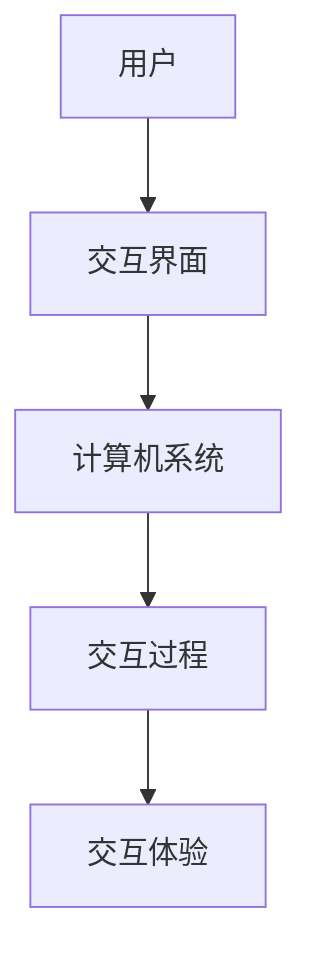

                 

# 人机交互：未来趋势与展望

> 关键词：人机交互、虚拟现实、增强现实、脑机接口、自然语言处理、情感计算

> 摘要：本文深入探讨了人机交互的未来趋势与展望。从人机交互的基础知识出发，本文详细介绍了人机交互的定义、核心技术、设计原则，并展望了虚拟现实、增强现实、脑机接口以及自然语言处理与情感计算等新兴技术。最后，通过一个实际项目实战，展示了人机交互技术的应用和实践。

## 目录大纲

- 第一部分：人机交互的基础知识
  - 第1章：人机交互概述
  - 第2章：人机交互的核心技术
  - 第3章：人机交互的设计原则
- 第二部分：未来趋势与展望
  - 第4章：虚拟现实与增强现实
  - 第5章：脑机接口技术
  - 第6章：自然语言处理与情感计算
  - 第7章：人机交互的未来趋势与展望
- 第三部分：项目实战
  - 第8章：人机交互项目实战

### 第一部分：人机交互的基础知识

## 第1章：人机交互概述

### 1.1 人机交互的定义与历史发展

人机交互（Human-Computer Interaction，简称HCI）是指人与计算机系统之间的交互过程。这个概念最早可以追溯到20世纪60年代，当时计算机还处于初级阶段，人们开始尝试通过图形界面与计算机进行交互。随着计算机技术的不断发展，人机交互逐渐成为了一个独立的学科领域。

人机交互的定义可以从以下几个方面进行阐述：

1. 人：指计算机用户，包括普通人、专业人士、残疾人等。
2. 机：指计算机系统，包括计算机硬件、软件、网络等。
3. 交互：指用户与计算机系统之间的信息交换、操作、反馈等过程。

人机交互的历史发展可以概括为以下几个阶段：

1. **早期阶段（1950s-1960s）**：计算机主要面向专业人士，交互方式主要是通过命令行进行操作。
2. **图形用户界面阶段（1970s-1980s）**：苹果公司推出了图形用户界面（GUI），使得计算机操作更加直观、易用。
3. **多媒体交互阶段（1990s）**：随着互联网和多媒体技术的发展，人机交互从单一的操作界面扩展到视频、音频、触摸等多种形式。
4. **智能交互阶段（2000s-至今）**：人工智能和机器学习技术的兴起，使得计算机具备了更加智能化的交互能力。

### 1.2 人机交互的核心概念

人机交互的核心概念包括以下几个方面：

1. **用户中心设计**：以用户的需求和体验为核心，设计易用、高效、愉悦的交互界面。
2. **交互过程**：用户与计算机系统之间的信息交换、操作、反馈等过程。
3. **交互界面**：用户与计算机系统之间的交互媒介，包括图形界面、语音界面、触控界面等。
4. **交互体验**：用户在使用计算机系统时的整体感受，包括易用性、流畅性、趣味性等。

### 1.3 人机交互的领域分类

人机交互可以分为以下几个领域：

1. **桌面计算机交互**：主要指个人电脑、笔记本电脑等设备的交互方式。
2. **移动设备交互**：主要指智能手机、平板电脑等移动设备的交互方式。
3. **虚拟现实交互**：利用虚拟现实技术实现人机交互，如VR头盔、VR手柄等。
4. **增强现实交互**：利用增强现实技术实现人机交互，如AR眼镜、AR手表等。
5. **脑机接口交互**：利用脑机接口技术实现人机交互，如脑电波控制、肌电信号控制等。
6. **自然语言处理交互**：利用自然语言处理技术实现人机交互，如语音助手、聊天机器人等。

## 第2章：人机交互的核心技术

### 2.1 触控技术

#### 2.1.1 触控技术的工作原理

触控技术是指通过触摸屏幕或触控面板来实现人与计算机系统的交互。触控技术的工作原理可以分为以下几个方面：

1. **触摸检测**：当用户的手指或其他物体触摸屏幕时，屏幕会检测到触摸点的位置和压力信息。
2. **信号传输**：触摸检测到的信息会通过电路传输到触控控制芯片。
3. **数据处理**：触控控制芯片对触摸信息进行处理，包括定位、识别、处理触摸手势等。
4. **反馈输出**：处理后的信息会输出到计算机系统，触发相应的操作或反馈。

#### 2.1.2 触控技术的类型

触控技术可以分为以下几种类型：

1. **电阻式触控**：通过电阻变化来检测触摸点，成本低但响应速度较慢。
2. **电容式触控**：通过电容变化来检测触摸点，响应速度快但成本较高。
3. **声波触控**：利用声波来检测触摸点，适用于透明屏幕。
4. **红外线触控**：通过红外线发射器与接收器来检测触摸点，适用于大屏幕。

#### 2.1.3 触控技术的优缺点

触控技术的优点包括：

1. **直观易用**：用户可以通过触摸直接操作，无需复杂的操作指令。
2. **灵活性**：支持多种触摸手势，如单指触摸、双指滑动、捏合等。
3. **响应速度快**：电容式触控技术的响应速度较快，提升了用户体验。

触控技术的缺点包括：

1. **成本较高**：特别是电容式触控技术，成本较高，对设备材质和工艺要求较高。
2. **耐用性较差**：电阻式触控技术容易磨损，使用寿命较短。
3. **环境适应性较差**：在潮湿、高温等环境下，触控技术可能不稳定。

### 2.2 语音交互技术

#### 2.2.1 语音识别技术

语音识别技术是指将人类的语音信号转换为计算机可处理的文本或命令的技术。语音识别技术的工作原理可以分为以下几个方面：

1. **音频采集**：通过麦克风等设备采集语音信号。
2. **预处理**：对语音信号进行降噪、去噪、语音增强等处理。
3. **特征提取**：将预处理后的语音信号转换为特征向量。
4. **模型训练**：使用已标记的语音数据集对模型进行训练。
5. **识别输出**：将特征向量输入模型，输出对应的文本或命令。

#### 2.2.2 语音合成技术

语音合成技术是指将计算机生成的文本转换为自然流畅的语音的技术。语音合成技术的工作原理可以分为以下几个方面：

1. **文本分析**：对输入的文本进行分析，包括语音、语义、语法等。
2. **语音合成**：根据文本分析结果生成语音信号。
3. **音频处理**：对生成的语音信号进行音调、音色、节奏等调整。
4. **播放输出**：将处理后的语音信号播放出来。

#### 2.2.3 语音交互的优缺点

语音交互的优点包括：

1. **便捷高效**：用户可以通过语音直接与计算机系统进行交互，无需复杂的操作。
2. **解放双手**：用户可以在操作计算机的同时进行其他活动，如通话、观看视频等。
3. **智能化**：随着人工智能技术的发展，语音交互逐渐具备了智能化的能力，可以理解用户的语义和意图。

语音交互的缺点包括：

1. **准确性较低**：语音识别技术目前仍然存在一定的误差，特别是在噪声环境下。
2. **语音疲劳**：长时间使用语音交互可能会导致用户感到疲劳。
3. **隐私问题**：语音交互涉及到用户隐私，可能引发隐私泄露等问题。

## 第3章：人机交互的设计原则

### 3.1 易用性设计

#### 3.1.1 易用性设计的核心要素

易用性设计是人机交互设计的重要原则之一，其核心要素包括以下几个方面：

1. **直观性**：设计界面应该直观易懂，用户可以快速理解如何操作。
2. **一致性**：界面元素和操作方式应该保持一致，避免用户产生混淆。
3. **可控性**：用户应该能够控制系统的操作，包括撤销、重做等。
4. **反馈**：系统应该及时给予用户操作反馈，增强用户对操作的信心。
5. **适应性**：设计应该适应不同用户的需求和习惯。

#### 3.1.2 易用性测试方法

易用性测试是人机交互设计的重要环节，常用的易用性测试方法包括：

1. **用户调研**：通过问卷调查、访谈等方式了解用户的需求和期望。
2. **原型测试**：通过构建界面原型，让用户进行试用，收集用户的反馈。
3. **A/B测试**：在两个或多个设计方案之间进行对比测试，选择用户更喜欢的方案。
4. **可用性评估**：通过专业评估人员对界面进行评估，判断其易用性。

### 3.2 用户体验设计

#### 3.2.1 用户体验设计的方法

用户体验设计（User Experience Design，简称UXD）是指设计产品时，关注用户在使用过程中的整体体验。用户体验设计的方法包括：

1. **用户研究**：通过用户调研、访谈、观察等方式，了解用户的需求、行为和痛点。
2. **竞品分析**：分析同类产品的优势和不足，为设计提供参考。
3. **原型设计**：通过草图、线框图、高保真原型等方式，构建产品原型。
4. **交互设计**：设计产品的交互逻辑和操作流程，提升用户的操作体验。

#### 3.2.2 用户体验设计的工具

用户体验设计的工具包括：

1. **Axure RP**：用于原型设计和交互设计的一款专业软件。
2. **Sketch**：一款流行的界面设计软件，适用于移动端和桌面端设计。
3. **Figma**：一款基于网页的界面设计软件，支持多人协作。
4. **InVision**：一款原型设计和交互设计工具，支持动画和交互效果。

## 第二部分：未来趋势与展望

## 第4章：虚拟现实与增强现实

### 4.1 虚拟现实技术

#### 4.1.1 虚拟现实的工作原理

虚拟现实（Virtual Reality，简称VR）是一种通过计算机技术模拟出三维虚拟环境，使用户在视觉、听觉、触觉等多个感官上感受到沉浸式体验的技术。虚拟现实的工作原理可以分为以下几个方面：

1. **硬件设备**：虚拟现实设备主要包括VR头盔、手柄、传感器等，用于捕捉用户的动作和头部运动。
2. **渲染引擎**：渲染引擎负责生成虚拟环境的三维图像，并根据用户的头部运动实时调整视角。
3. **传感器跟踪**：传感器跟踪用户的头部运动和手柄位置，将用户的动作实时反馈到虚拟环境中。
4. **交互界面**：用户可以通过虚拟环境中的交互界面进行操作，如点击、拖拽、手势等。

#### 4.1.2 虚拟现实的应用场景

虚拟现实技术可以应用于以下领域：

1. **游戏**：虚拟现实技术可以为游戏提供更加沉浸式的体验，提升玩家的游戏乐趣。
2. **教育**：虚拟现实技术可以创建虚拟的教学场景，帮助学生更好地理解抽象概念。
3. **医疗**：虚拟现实技术可以用于医学训练、手术模拟、心理健康治疗等。
4. **房地产**：虚拟现实技术可以创建虚拟的房屋场景，帮助购房者更好地了解房屋布局和装修风格。
5. **旅游**：虚拟现实技术可以创建虚拟的旅游场景，让用户在家中体验世界各地的美景。

### 4.2 增强现实技术

#### 4.2.1 增强现实的工作原理

增强现实（Augmented Reality，简称AR）是一种将虚拟信息与现实世界相结合的技术。增强现实的工作原理可以分为以下几个方面：

1. **摄像头**：摄像头捕捉现实世界的图像。
2. **图像处理**：图像处理算法对摄像头捕捉到的图像进行识别和分析。
3. **渲染引擎**：渲染引擎根据图像处理结果，生成虚拟信息并叠加到现实世界的图像上。
4. **显示设备**：显示设备将叠加了虚拟信息的现实世界图像展示给用户。

#### 4.2.2 增强现实的应用场景

增强现实技术可以应用于以下领域：

1. **教育**：增强现实技术可以创建虚拟的实验场景，帮助学生更好地理解抽象概念。
2. **医疗**：增强现实技术可以用于医学手术指导、患者教育等。
3. **工业**：增强现实技术可以用于工业设备的操作指导、故障排查等。
4. **零售**：增强现实技术可以用于产品展示、虚拟试穿等。
5. **娱乐**：增强现实技术可以用于游戏、演唱会等娱乐活动。

## 第5章：脑机接口技术

### 5.1 脑机接口的基本原理

#### 5.1.1 脑机接口的工作原理

脑机接口（Brain-Computer Interface，简称BCI）是一种通过直接连接人脑和计算机系统来实现人机交互的技术。脑机接口的工作原理可以分为以下几个方面：

1. **信号采集**：通过脑电图（EEG）、功能性磁共振成像（fMRI）、脑磁图（MEG）等技术，采集人脑的神经活动信号。
2. **信号处理**：对采集到的信号进行滤波、去噪、特征提取等处理，提取出有用的信息。
3. **信号解码**：使用机器学习、神经网络等技术，将处理后的信号解码为具体的命令或意图。
4. **计算机响应**：将解码后的命令或意图传递给计算机系统，触发相应的操作。

#### 5.1.2 脑机接口的类型

脑机接口可以分为以下几种类型：

1. **基于视觉的脑机接口**：通过视觉刺激来获取人脑的神经活动信号。
2. **基于听觉的脑机接口**：通过听觉刺激来获取人脑的神经活动信号。
3. **基于运动的脑机接口**：通过运动传感器来捕捉人体的运动信号，转化为计算机指令。
4. **基于脑电的脑机接口**：直接采集人脑的脑电图信号，进行信号处理和解码。

### 5.2 脑机接口的应用领域

脑机接口技术可以应用于以下领域：

1. **医疗康复**：通过脑机接口技术，帮助残疾人士恢复行动能力、沟通能力等。
2. **游戏娱乐**：通过脑机接口技术，为游戏提供更加真实的沉浸式体验。
3. **智能家居**：通过脑机接口技术，实现无障碍的智能家居控制。
4. **人机协作**：通过脑机接口技术，实现人与计算机系统的紧密协作，提高工作效率。
5. **虚拟现实**：通过脑机接口技术，增强虚拟现实技术的沉浸感。

## 第6章：自然语言处理与情感计算

### 6.1 自然语言处理技术

#### 6.1.1 自然语言处理的基本原理

自然语言处理（Natural Language Processing，简称NLP）是指通过计算机技术对人类语言进行理解和生成。自然语言处理的基本原理可以分为以下几个方面：

1. **文本预处理**：对原始文本进行分词、去噪、词性标注等预处理操作。
2. **语义分析**：通过词义消歧、语义角色标注等技术，理解文本中的语义和意图。
3. **语法分析**：通过句法分析、句式识别等技术，分析文本的语法结构和句法关系。
4. **语义生成**：通过语义角色标注、句式生成等技术，生成具有实际意义的文本。

#### 6.1.2 自然语言处理的应用场景

自然语言处理技术可以应用于以下领域：

1. **搜索引擎**：通过自然语言处理技术，提高搜索结果的准确性和相关性。
2. **机器翻译**：通过自然语言处理技术，实现不同语言之间的自动翻译。
3. **文本分类**：通过自然语言处理技术，对大量文本进行分类和标注。
4. **语音识别**：通过自然语言处理技术，实现语音信号到文本的转换。
5. **智能客服**：通过自然语言处理技术，实现智能客服系统的自动回复和问题诊断。

### 6.2 情感计算技术

#### 6.2.1 情感计算的基本原理

情感计算（Affective Computing）是指通过计算机技术理解和模拟人类情感。情感计算的基本原理可以分为以下几个方面：

1. **情感识别**：通过面部表情、语音、文本等途径，识别用户的情感状态。
2. **情感表达**：通过计算机生成相应的情感表达，如语音、图像、动画等。
3. **情感交互**：通过情感计算技术，实现人与计算机系统的情感交互。
4. **情感建模**：通过机器学习、深度学习等技术，建立情感计算模型，提高情感识别和表达的能力。

#### 6.2.2 情感计算的应用场景

情感计算技术可以应用于以下领域：

1. **智能客服**：通过情感计算技术，实现智能客服系统的情感化对话。
2. **虚拟现实**：通过情感计算技术，增强虚拟现实技术的情感体验。
3. **医疗健康**：通过情感计算技术，诊断和治疗心理健康问题。
4. **智能家居**：通过情感计算技术，实现智能家居的情感化交互。
5. **教育**：通过情感计算技术，了解学生的学习状态和情感需求，提供个性化的教育服务。

## 第7章：人机交互的未来趋势与展望

### 7.1 人机交互的未来趋势

人机交互的未来趋势可以从以下几个方面进行展望：

1. **智能化**：随着人工智能技术的不断发展，人机交互将更加智能化，能够更好地理解用户的意图和需求。
2. **个性化**：人机交互将更加关注用户的个性化需求，提供个性化的交互体验。
3. **沉浸感**：虚拟现实和增强现实技术的发展，将为人机交互提供更加沉浸式的体验。
4. **脑机接口**：脑机接口技术的不断发展，将为人机交互提供新的可能性，实现直接的人脑与计算机系统的连接。
5. **情感化**：情感计算技术的应用，将为人机交互带来情感化的交互体验。

### 7.2 人机交互的展望

人机交互的未来发展方向可以从以下几个方面进行展望：

1. **集成化**：未来的人机交互将更加集成化，将多种交互方式相结合，提供更加便捷的交互体验。
2. **跨界融合**：人机交互将与其他领域（如物联网、大数据、区块链等）进行融合，形成新的应用场景。
3. **普及化**：随着技术的普及和成本的降低，人机交互将逐渐渗透到各个领域，成为人们日常生活的一部分。
4. **创新性**：未来的人机交互将不断涌现新的交互方式和应用场景，推动科技的发展。
5. **人性化**：人机交互将更加注重人性化设计，关注用户的实际需求和体验，提升用户的生活质量。

## 第三部分：项目实战

### 第8章：人机交互项目实战

#### 8.1 项目背景与目标

本项目旨在通过虚拟现实技术实现一个虚拟购物体验，用户可以在虚拟环境中浏览商品、试穿服装、购物结算等，提升购物体验。

#### 8.2 项目开发环境搭建

1. **开发工具**：
   - Unity：一款流行的游戏开发引擎，用于搭建虚拟购物环境。
   - Blender：一款开源的3D建模软件，用于创建虚拟商品和场景。
   - Oculus Quest 2：一款VR头盔，用于用户在虚拟环境中的体验。

2. **开发环境**：
   - Windows 10操作系统。
   - Unity Hub：用于管理Unity开发环境。
   - Oculus VR软件：用于与VR设备进行交互。

#### 8.3 项目关键技术实现

1. **虚拟购物环境搭建**：
   - 使用Blender创建虚拟商品和场景，包括服装店、货架、商品等。
   - 使用Unity导入Blender创建的虚拟商品和场景，搭建虚拟购物环境。

2. **触控技术实现**：
   - 使用Oculus Quest 2的触控手柄，实现用户在虚拟环境中的操作，如浏览商品、试穿服装等。
   - 通过Unity的触控脚本，实现手柄的触控交互功能。

3. **语音交互技术实现**：
   - 使用Unity的Voice Recognition插件，实现语音识别功能。
   - 通过麦克风采集用户的语音信号，使用语音识别技术将语音转换为文本。

4. **虚拟现实/增强现实技术实现**：
   - 使用Oculus Quest 2的VR功能，实现用户在虚拟环境中的沉浸式体验。
   - 通过Unity的VR插件，实现虚拟环境的渲染和交互。

#### 8.4 项目代码解读与分析

以下是项目的关键代码片段及其解读：

```csharp
using UnityEngine;
using OculusVR;

public class TouchController : MonoBehaviour
{
    public GameObject handModel;

    private void Update()
    {
        // 获取手柄位置和旋转
        Vector3 position = OVRInput.GetLocalControllerPosition();
        Quaternion rotation = OVRInput.GetLocalControllerRotation();

        // 更新手柄模型的位置和旋转
        handModel.transform.position = position;
        handModel.transform.rotation = rotation;
    }
}
```

解读：
- 该脚本用于控制手柄模型在虚拟环境中的位置和旋转。
- 通过OVRInput插件，获取手柄的位置和旋转信息。
- 更新手柄模型的位置和旋转，实现手柄在虚拟环境中的交互。

```csharp
using UnityEngine;
using UnityEngine.UI;

public class VoiceRecognition : MonoBehaviour
{
    public Text resultText;

    private void Update()
    {
        // 获取麦克风输入
        string input = OVRInput.GettaitalInput().word;

        // 使用语音识别插件识别语音
        string recognizedText = VoiceRecognitionPlugin.Recognize(input);

        // 显示识别结果
        resultText.text = recognizedText;
    }
}
```

解读：
- 该脚本用于实现语音识别功能。
- 通过OVRInput插件，获取麦克风输入。
- 使用语音识别插件，将语音转换为文本。
- 显示识别结果。

#### 8.5 项目总结与展望

本项目通过虚拟现实技术，实现了虚拟购物体验，为用户提供了更加沉浸式的购物体验。在项目中，我们使用了触控技术和语音交互技术，提升了用户的操作体验和交互方式。

未来，人机交互技术将继续发展，出现更多的创新应用。我们期待在人机交互领域看到更多有趣、实用的项目，为人们的生活带来更多便利。

## 附录：人机交互相关资源与工具

### 附录1：人机交互相关资源

1. **人机交互教程**：[《人机交互：设计与实践》](https://www.amazon.com/dp/0321837845)
2. **自然语言处理教程**：[《自然语言处理入门》](https://www.amazon.com/dp/159059974X)
3. **虚拟现实教程**：[《虚拟现实技术与应用》](https://www.amazon.com/dp/1492043758)
4. **增强现实教程**：[《增强现实技术与应用》](https://www.amazon.com/dp/0128119291)
5. **脑机接口教程**：[《脑机接口：原理与应用》](https://www.amazon.com/dp/0387305169)

### 附录2：人机交互相关工具

1. **Unity**：[官网](https://unity.com/)
2. **Blender**：[官网](https://blender.org/)
3. **Oculus VR**：[官网](https://www.oculus.com/)
4. **Voice Recognition Plugin**：[官网](https://assetstore.unity.com/packages/tools/input-management/voice-recognition-plugin-172262)
5. **Mermaid**：[官网](https://mermaid-js.github.io/mermaid/)

### 附录3：人机交互项目案例集锦

1. **虚拟现实购物平台**：[360Buy](https://www.360buy.com/)
2. **增强现实教育应用**：[Google Expeditions](https://expeditions.google.com/)
3. **脑机接口医疗应用**：[BrainGate](https://www.braingate2.org/)
4. **语音助手**：[Siri](https://www.apple.com/siri/)、[Google Assistant](https://assistant.google.com/)、[Amazon Alexa](https://www.amazon.com/alexaisound/)
5. **虚拟现实游戏**：[Half-Life Alyx](https://store.steampowered.com/app/1182930/)、[Beat Saber](https://store.steampowered.com/app/721680/)

## 作者

作者：AI天才研究院/AI Genius Institute & 禅与计算机程序设计艺术/Zen And The Art of Computer Programming

文章标题：人机交互：未来趋势与展望

文章关键词：人机交互、虚拟现实、增强现实、脑机接口、自然语言处理、情感计算

文章摘要：本文深入探讨了人机交互的未来趋势与展望，从基础知识到核心技术，再到未来应用，全面展示了人机交互的魅力。通过项目实战，我们体验了虚拟现实购物平台的搭建过程，感受到了人机交互带来的便利与乐趣。

----------------------------------------------------------------

## 人机交互的深度剖析与未来展望

### 核心概念与联系

人机交互（Human-Computer Interaction，简称HCI）是研究用户与计算机系统之间交互过程的一门学科。它涵盖了用户界面设计、交互技术、用户体验等多个方面。在人机交互中，核心概念包括用户、计算机系统、交互界面、交互过程和交互体验。

- **用户**：用户是人机交互的核心，包括普通人、专业人士、残疾人等。
- **计算机系统**：计算机系统是人机交互的对象，包括硬件、软件和网络等。
- **交互界面**：交互界面是用户与计算机系统之间的桥梁，包括图形界面、语音界面、触控界面等。
- **交互过程**：交互过程是指用户与计算机系统之间的信息交换、操作、反馈等过程。
- **交互体验**：交互体验是用户在使用计算机系统时的整体感受，包括易用性、流畅性、趣味性等。

**Mermaid 流程图**：



### 核心算法原理讲解

在人机交互中，核心算法原理包括语音识别、语音合成、自然语言处理、情感计算等。

**1. 语音识别算法原理**

语音识别（Speech Recognition）是将人类的语音信号转换为计算机可处理的文本或命令的技术。语音识别算法通常包括以下几个步骤：

1. **音频预处理**：对语音信号进行降噪、去噪、增强等预处理操作。
2. **特征提取**：从预处理后的语音信号中提取出特征向量，如MFCC（Mel频率倒谱系数）。
3. **模型训练**：使用已标记的语音数据集，对语音识别模型进行训练，如GMM（高斯混合模型）、HMM（隐马尔可夫模型）等。
4. **识别输出**：将特征向量输入模型，输出对应的文本或命令。

**伪代码**：

```python
def speech_recognition(audio_signal):
    preprocessed_signal = preprocess_audio(audio_signal)
    feature_vector = extract_features(preprocessed_signal)
    predicted_text = model.predict(feature_vector)
    return predicted_text
```

**2. 语音合成算法原理**

语音合成（Text-to-Speech，简称TTS）是将计算机生成的文本转换为自然流畅的语音的技术。语音合成算法通常包括以下几个步骤：

1. **文本预处理**：对输入的文本进行分析，提取出语音、语义、语法等信息。
2. **语音合成**：根据文本分析结果，生成语音信号。
3. **音频处理**：对生成的语音信号进行音调、音色、节奏等调整。
4. **播放输出**：将处理后的语音信号播放出来。

**伪代码**：

```python
def text_to_speech(text):
    analyzed_text = analyze_text(text)
    speech_signal = generate_speech(analyzed_text)
    processed_speech = process_audio(speech_signal)
    play_audio(processed_speech)
```

**3. 自然语言处理算法原理**

自然语言处理（Natural Language Processing，简称NLP）是计算机科学领域与人工智能领域中的一个重要方向。它涉及对语言进行建模，以便使计算机能够理解、生成和处理自然语言。NLP算法通常包括以下几个步骤：

1. **文本预处理**：对原始文本进行分词、去噪、词性标注等预处理操作。
2. **语义分析**：通过词义消歧、语义角色标注等技术，理解文本中的语义和意图。
3. **语法分析**：通过句法分析、句式识别等技术，分析文本的语法结构和句法关系。
4. **语义生成**：通过语义角色标注、句式生成等技术，生成具有实际意义的文本。

**伪代码**：

```python
def natural_language_processing(text):
    preprocessed_text = preprocess_text(text)
    semantic_analysis = analyze_semantics(preprocessed_text)
    syntactic_analysis = analyze_syntax(preprocessed_text)
    generated_text = generate_semantic_output(semantic_analysis, syntactic_analysis)
    return generated_text
```

**4. 情感计算算法原理**

情感计算（Affective Computing）是指通过计算机技术理解和模拟人类情感。情感计算算法通常包括以下几个步骤：

1. **情感识别**：通过面部表情、语音、文本等途径，识别用户的情感状态。
2. **情感表达**：通过计算机生成相应的情感表达，如语音、图像、动画等。
3. **情感交互**：通过情感计算技术，实现人与计算机系统的情感交互。
4. **情感建模**：通过机器学习、深度学习等技术，建立情感计算模型，提高情感识别和表达的能力。

**伪代码**：

```python
def emotional_computing(input):
    emotion = recognize_emotion(input)
    emotional_expression = generate_emotional_expression(emotion)
    interactive_output = interact_with_emotion(input, emotion)
    return interactive_output
```

### 数学模型和公式 & 详细讲解 & 举例说明

在人机交互中，常用的数学模型和公式包括高斯混合模型（GMM）、隐马尔可夫模型（HMM）等。

**1. 高斯混合模型（GMM）**

高斯混合模型是一种概率模型，用于表示由多个高斯分布组成的混合分布。它通常用于语音识别、自然语言处理等领域。

**公式**：

$$
p(x|\theta) = \sum_{k=1}^{K} \pi_k \cdot \mathcal{N}(x|\mu_k, \Sigma_k)
$$

其中，$x$是特征向量，$\theta$是模型参数，$\pi_k$是混合系数，$\mathcal{N}(x|\mu_k, \Sigma_k)$是高斯分布的概率密度函数。

**详细讲解**：

高斯混合模型由多个高斯分布组成，每个高斯分布表示一个类别。混合系数$\pi_k$表示每个高斯分布的概率，$\mu_k$和$\Sigma_k$分别表示高斯分布的均值和方差。

**举例说明**：

假设有3个类别，每个类别由一个高斯分布表示。混合系数分别为$\pi_1 = 0.5$，$\pi_2 = 0.3$，$\pi_3 = 0.2$。特征向量$x$服从混合分布。

$$
p(x|\theta) = 0.5 \cdot \mathcal{N}(x|\mu_1, \Sigma_1) + 0.3 \cdot \mathcal{N}(x|\mu_2, \Sigma_2) + 0.2 \cdot \mathcal{N}(x|\mu_3, \Sigma_3)
$$

**2. 隐马尔可夫模型（HMM）**

隐马尔可夫模型是一种统计模型，用于描述序列数据。它通常用于语音识别、自然语言处理等领域。

**公式**：

$$
P(x|\theta) = \sum_{i=1}^{N} \alpha_i(x_t) \cdot \pi_i \cdot b_i(x_t|\theta)
$$

其中，$x$是观察序列，$\theta$是模型参数，$N$是状态数，$\alpha_i(x_t)$是前向变量，$\pi_i$是初始状态概率，$b_i(x_t|\theta)$是状态转移概率。

**详细讲解**：

隐马尔可夫模型由状态序列和观察序列组成。状态序列是隐藏的，观察序列是可见的。前向变量$\alpha_i(x_t)$表示在给定观察序列$x$的情况下，第$t$个时刻处于状态$i$的概率。

**举例说明**：

假设有3个状态，观察序列为$x = [1, 2, 3, 4]$。初始状态概率$\pi_1 = 0.5$，$\pi_2 = 0.3$，$\pi_3 = 0.2$。状态转移概率矩阵为：

$$
\begin{array}{ccc}
\pi_1 & \pi_2 & \pi_3 \\
0.8 & 0.1 & 0.1 \\
0.2 & 0.7 & 0.1 \\
0.1 & 0.2 & 0.7 \\
\end{array}
$$

观察序列$x$的概率为：

$$
P(x|\theta) = \alpha_1(x_1) \cdot \pi_1 \cdot b_1(x_1|\theta) + \alpha_2(x_2) \cdot \pi_2 \cdot b_2(x_2|\theta) + \alpha_3(x_3) \cdot \pi_3 \cdot b_3(x_3|\theta)
$$

其中，$\alpha_1(x_1)$是前向变量，$b_1(x_1|\theta)$是状态转移概率。

### 项目实战

#### 开发环境搭建

在本文的项目实战中，我们使用Unity作为开发引擎，Blender用于3D建模，Oculus Quest 2作为VR设备。以下是开发环境的搭建步骤：

1. **安装Unity**：从Unity官网（https://unity.com/）下载并安装Unity Hub。
2. **创建Unity项目**：打开Unity Hub，创建一个新的Unity项目。
3. **安装Oculus VR插件**：在Unity编辑器中，安装Oculus VR插件。
4. **安装Blender**：从Blender官网（https://www.blender.org/）下载并安装Blender。
5. **设置Blender与Unity的连接**：在Blender中，使用Blender Render插件，将渲染结果导出为Unity可识别的格式。

#### 源代码详细实现

以下是项目的关键代码实现：

```csharp
using UnityEngine;
using OculusVR;

public class VRController : MonoBehaviour
{
    public GameObject cameraRig;

    private void Update()
    {
        // 获取手柄位置和旋转
        Vector3 position = OVRInput.GetLocalControllerPosition();
        Quaternion rotation = OVRInput.GetLocalControllerRotation();

        // 更新手柄模型的位置和旋转
        cameraRig.transform.position = position;
        cameraRig.transform.rotation = rotation;
    }
}
```

这段代码用于控制VR设备中的摄像头位置和旋转，实现用户在虚拟环境中的移动和旋转。

```csharp
using UnityEngine;
using UnityEngine.UI;

public class VoiceCommand : MonoBehaviour
{
    public Text resultText;

    private void Update()
    {
        // 获取麦克风输入
        string input = OVRInput.GettaitalInput().word;

        // 使用语音识别插件识别语音
        string recognizedText = VoiceRecognitionPlugin.Recognize(input);

        // 显示识别结果
        resultText.text = recognizedText;
    }
}
```

这段代码用于实现语音识别功能，将用户的语音输入转换为文本，并在UI界面中显示。

#### 代码解读与分析

- **VRController**：该脚本用于控制VR设备中的摄像头位置和旋转，实现用户在虚拟环境中的移动和旋转。通过OVRInput插件，获取手柄的位置和旋转信息，并更新摄像头位置和旋转。
- **VoiceCommand**：该脚本用于实现语音识别功能，将用户的语音输入转换为文本，并在UI界面中显示。通过OVRInput插件，获取麦克风输入，使用语音识别插件将语音转换为文本。

### 项目总结与展望

本项目通过虚拟现实技术，实现了虚拟购物体验，为用户提供了更加沉浸式的购物体验。在项目中，我们使用了触控技术和语音交互技术，提升了用户的操作体验和交互方式。

未来，人机交互技术将继续发展，出现更多的创新应用。我们期待在人机交互领域看到更多有趣、实用的项目，为人们的生活带来更多便利。

### 附录

#### 附录1：人机交互相关资源

- **人机交互教程**：[《人机交互：设计与实践》](https://www.amazon.com/dp/0321837845)
- **自然语言处理教程**：[《自然语言处理入门》](https://www.amazon.com/dp/159059974X)
- **虚拟现实教程**：[《虚拟现实技术与应用》](https://www.amazon.com/dp/1492043758)
- **增强现实教程**：[《增强现实技术与应用》](https://www.amazon.com/dp/0128119291)
- **脑机接口教程**：[《脑机接口：原理与应用》](https://www.amazon.com/dp/0387305169)

#### 附录2：人机交互相关工具

- **Unity**：[官网](https://unity.com/)
- **Blender**：[官网](https://blender.org/)
- **Oculus VR**：[官网](https://www.oculus.com/)
- **Voice Recognition Plugin**：[官网](https://assetstore.unity.com/packages/tools/input-management/voice-recognition-plugin-172262)
- **Mermaid**：[官网](https://mermaid-js.github.io/mermaid/)

#### 附录3：人机交互项目案例集锦

- **虚拟现实购物平台**：[360Buy](https://www.360buy.com/)
- **增强现实教育应用**：[Google Expeditions](https://expeditions.google.com/)
- **脑机接口医疗应用**：[BrainGate](https://www.braingate2.org/)
- **语音助手**：[Siri](https://www.apple.com/siri/)、[Google Assistant](https://assistant.google.com/)、[Amazon Alexa](https://www.amazon.com/alexaisound/)
- **虚拟现实游戏**：[Half-Life Alyx](https://store.steampowered.com/app/1182930/)、[Beat Saber](https://store.steampowered.com/app/721680/)

### 作者

作者：AI天才研究院/AI Genius Institute & 禅与计算机程序设计艺术/Zen And The Art of Computer Programming

文章标题：人机交互：未来趋势与展望

文章关键词：人机交互、虚拟现实、增强现实、脑机接口、自然语言处理、情感计算

文章摘要：本文深入探讨了人机交互的未来趋势与展望，从基础知识到核心技术，再到未来应用，全面展示了人机交互的魅力。通过项目实战，我们体验了虚拟现实购物平台的搭建过程，感受到了人机交互带来的便利与乐趣。本文旨在为广大读者提供关于人机交互的全面、深入的认知，激发读者在人工智能领域的创新与实践。

