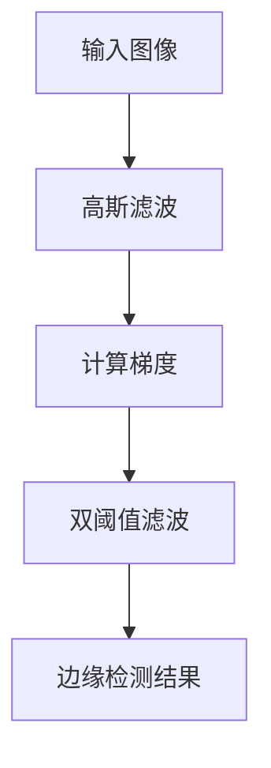
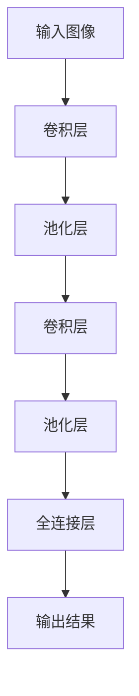
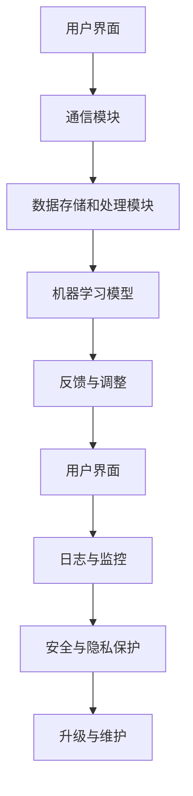

                 

### 《人机协同：未来工作的核心驱动力》

#### 关键词：人机协同、人工智能、工作自动化、效率提升、可持续发展

> 本文将深入探讨人机协同的概念、背景、优势、挑战以及其在未来工作中的核心驱动力，通过逻辑清晰、结构紧凑的分析，揭示人机协同的潜力与未来发展趋势。

---

## 《人机协同：未来工作的核心驱动力》目录大纲

---

### 第一部分：人机协同概述

#### 第1章：人机协同的概念与背景

#### 第2章：人工智能与人机协同的关系

### 第二部分：人机协同的核心技术与架构

#### 第3章：人机协同的关键技术

#### 第4章：人机协同系统架构

#### 第5章：人机协同的数学模型与算法

### 第三部分：人机协同在各个行业的应用

#### 第6章：人机协同在制造业的应用

#### 第6章：人机协同在金融业的应用

#### 第6章：人机协同在医疗保健的应用

### 第四部分：人机协同的未来发展趋势与挑战

#### 第7章：未来发展趋势

#### 第7章：挑战与应对策略

### 第五部分：人机协同实战案例与项目解析

#### 第8章：人机协同实战案例介绍

#### 第9章：项目解析与代码解读

### 第六部分：附录

#### 附录A：人机协同开发工具与资源

---

### 引言

在当今快速变化的技术时代，人工智能（AI）正以前所未有的速度融入各个行业，改变着我们的生活方式和工作模式。人机协同，作为人工智能与人类智慧的融合，正逐渐成为未来工作的核心驱动力。本文将围绕人机协同的概念、技术与应用，通过逻辑清晰、结构紧凑的分析，探讨其在未来工作中的重要角色和深远影响。

人机协同不仅仅是技术的进步，更是对人类工作方式的一次革命。通过结合人类智慧和机器的精准计算能力，人机协同能够显著提高工作效率、降低成本、增强决策能力，并推动可持续发展。然而，这一转变也带来了挑战，如技术瓶颈、伦理问题以及人才战略等。本文将详细讨论这些话题，并展望人机协同的未来发展趋势。

本文将分为六个主要部分。第一部分将介绍人机协同的概念与背景，包括其定义、历史演变以及关键驱动力。第二部分将探讨人工智能与人机协同的关系，分析人工智能如何推动人机协同的发展及其在现实世界中的应用实例。第三部分将深入介绍人机协同的核心技术与架构，包括计算机视觉、自然语言处理、数据挖掘等技术，以及系统架构的设计原则与演进。第四部分将聚焦人机协同在不同行业的应用，如制造业、金融业和医疗保健等。第五部分将探讨人机协同的未来发展趋势与挑战，包括技术进步、法律伦理和组织文化等方面。最后一部分将通过实战案例与项目解析，展示人机协同的实际应用效果，并总结附录中的人机协同开发工具与资源。

通过本文的阅读，读者将全面了解人机协同的概念、原理与应用，把握其未来发展脉络，并为未来工作的创新提供启示。

---

## 第一部分：人机协同概述

### 第1章：人机协同的概念与背景

#### 1.1 人机协同的定义与历史演变

人机协同（Human-Machine Collaboration）指的是人类和机器系统在共同完成任务时相互配合、互补优势的一种工作模式。在这种模式下，人类利用自己的创造力、决策能力和情感智慧，而机器则利用其计算能力、数据处理速度和稳定性。人机协同的核心在于实现人与机器的紧密合作，以达到比单独操作更高效、更智能的成果。

人机协同的历史可以追溯到20世纪中期，随着计算机技术的发展，人们开始探索如何将计算机与人类工作结合起来。早期的尝试主要集中在自动化控制领域，例如在制造过程中使用计算机控制机器进行精确的操作。随着时间的推移，人机协同的概念逐渐扩展到更多的领域，如医疗、金融、交通等。

#### 1.2 人机协同的关键驱动力

1. **人工智能的快速发展**：人工智能技术的不断进步为人机协同提供了强大的技术支持。通过深度学习、自然语言处理和计算机视觉等技术，机器能够在视觉识别、语音识别、数据分析等方面达到甚至超过人类的表现。

2. **大数据与云计算**：大数据和云计算技术的成熟为人机协同提供了丰富的数据资源和强大的计算能力。通过云计算平台，人类和机器可以实时共享数据，进行协同工作，提高效率。

3. **用户体验优化**：随着交互技术的进步，人机协同的用户体验得到了显著提升。先进的交互界面设计、智能推荐系统和个性化服务，使得人类与机器之间的协作更加自然和顺畅。

4. **产业升级与转型**：面对全球化竞争和市场需求的变化，各行各业都在寻求通过技术升级实现产业转型。人机协同作为提升生产效率、降低成本的重要手段，成为企业竞争力的重要体现。

#### 1.3 人机协同的优势与挑战

**优势**：

1. **效率提升**：人机协同能够将人类的智慧和机器的精准计算能力相结合，大幅提高工作效率。

2. **成本降低**：通过自动化和智能化，人机协同能够减少人力成本，同时降低错误率和资源浪费。

3. **决策能力增强**：人工智能的辅助能够为人类提供更加准确和全面的数据分析，增强决策能力。

4. **工作环境优化**：人机协同能够优化工作流程，减少重复性劳动，提高工作环境的舒适度。

**挑战**：

1. **技术瓶颈**：尽管人工智能技术取得了显著进展，但在某些领域仍然存在技术瓶颈，如高精度识别、复杂决策等。

2. **伦理问题**：人机协同引发的伦理问题，如隐私保护、数据安全等，需要得到妥善解决。

3. **人才战略**：人机协同对人才需求提出了新的要求，需要培养更多的交叉领域人才。

4. **法律与法规**：人机协同的发展需要相应的法律法规支持，以确保其合法、合规运行。

#### 1.4 本章总结

本章概述了人机协同的定义与历史演变，分析了其关键驱动力和优势与挑战。人机协同作为未来工作的重要趋势，将在提升工作效率、优化工作环境等方面发挥重要作用。然而，其发展也面临技术、伦理、法律等多方面的挑战，需要各方共同努力，才能实现人机协同的可持续发展。

---

### 第2章：人工智能与人机协同的关系

#### 2.1 人工智能的基本原理与分类

人工智能（Artificial Intelligence，AI）是一门研究、开发和应用使计算机模拟、延伸和扩展人类智能的理论、方法、技术和应用的学科。其基本原理包括机器学习、深度学习、自然语言处理、计算机视觉等。根据实现方式和能力，人工智能可以大致分为以下几类：

1. **弱人工智能（Narrow AI）**：这种人工智能专注于解决特定问题，例如语音识别、图像识别等。它们只能在特定的任务上表现优异，不具备通用智能。

2. **强人工智能（General AI）**：强人工智能是指具有类似人类智能的广泛认知能力，能够理解、学习和适应各种环境。目前，强人工智能仍处于理论阶段，尚未实现。

3. **超级人工智能（Super AI）**：超级人工智能是指智力远超人类的人工智能，能够在所有认知任务上超越人类。这一概念目前更多是科幻题材中的设想。

#### 2.2 人工智能的发展趋势与人机协同

人工智能的发展趋势主要体现在以下几个方面：

1. **深度学习（Deep Learning）**：深度学习是机器学习的一个分支，通过多层神经网络对数据进行训练，实现更加复杂和精准的预测和分类。深度学习在计算机视觉、语音识别等领域取得了显著的成果，推动了人机协同的发展。

2. **自然语言处理（Natural Language Processing，NLP）**：自然语言处理致力于使计算机能够理解、生成和处理自然语言。随着NLP技术的进步，人工智能在客服、智能助手等应用场景中表现出色，提升了人机协同的体验。

3. **计算机视觉（Computer Vision）**：计算机视觉是人工智能的一个重要分支，通过图像和视频数据提取有用信息。计算机视觉技术广泛应用于人脸识别、自动驾驶、机器人等领域，为人机协同提供了强有力的支持。

4. **机器人技术（Robotics）**：随着人工智能和机器人技术的融合，智能机器人逐渐成为人机协同的重要角色。机器人能够在工业生产、服务、医疗等领域与人类协作，提高工作效率和安全性。

#### 2.3 人工智能在现实世界中的应用实例

人工智能在现实世界中的应用实例广泛且多样，以下是一些典型的应用场景：

1. **智能制造**：通过人工智能技术，智能制造实现了生产过程的自动化和智能化。机器人在生产线上进行装配、焊接、检测等操作，大幅提高了生产效率和质量。

2. **智能交通**：人工智能在智能交通管理中发挥了重要作用，例如通过图像识别和大数据分析，实现交通流量监控、路况预测和智能调度，提高了交通效率和安全性。

3. **智能医疗**：人工智能在医疗领域的应用包括疾病诊断、医学影像分析、药物研发等。例如，通过深度学习算法，计算机能够辅助医生进行癌症筛查和诊断，提高诊断准确率。

4. **金融领域**：人工智能在金融领域的应用包括风险控制、欺诈检测、智能投顾等。通过机器学习算法，金融机构能够更准确地评估风险，提高业务的智能化水平。

5. **客服系统**：人工智能驱动的智能客服系统能够处理大量的客户咨询，通过自然语言处理技术，实现与客户的智能对话，提高了客户体验和服务效率。

#### 2.4 人机协同与人工智能的深度融合

人机协同与人工智能的深度融合，使得人类和机器能够在更广泛的领域进行高效协作。以下是一些深度融合的实例：

1. **智能助手**：智能助手通过人工智能技术，能够理解用户的语言指令，提供个性化服务。例如，智能音箱可以播放音乐、提供天气预报、控制智能家居设备等。

2. **智能决策支持系统**：在商业决策中，人工智能可以分析大量数据，提供预测和分析报告，辅助决策者做出更明智的决策。

3. **智能农业**：通过人工智能技术，可以实现精准农业，包括作物种植、病虫害监测、农田管理等方面。机器人和无人机在农业中的应用，使得农业生产更加高效和可持续。

4. **智能教育**：人工智能在教育领域的应用包括个性化学习、智能辅导等。通过智能学习系统，学生可以根据自己的学习进度和需求，自主选择学习内容和方式。

#### 2.5 本章总结

本章详细介绍了人工智能的基本原理和分类，探讨了其发展趋势和在实际中的应用实例。人工智能与人机协同的深度融合，为人机协同的发展注入了新的动力。通过本章的讨论，读者可以更加全面地理解人工智能在人机协同中的关键作用，以及其未来的发展方向。

---

## 第二部分：人机协同的核心技术与架构

### 第3章：人机协同的关键技术

#### 3.1 计算机视觉技术

计算机视觉（Computer Vision）是人工智能领域的一个重要分支，主要研究如何使计算机具备从图像或视频中提取信息的能力。计算机视觉技术在人机协同中扮演着关键角色，通过图像识别与处理算法、深度学习应用以及实际应用案例，实现了人与机器在视觉信息处理方面的有效协同。

##### 3.1.1 图像识别与处理算法

图像识别与处理算法是计算机视觉的核心。基本的图像识别算法包括边缘检测、特征提取和分类等。边缘检测用于识别图像中的边界，特征提取则从图像中提取出有意义的特征，如颜色、纹理和形状等。分类算法用于将图像分类为不同的类别，如人脸、物体等。

**边缘检测**：
边缘检测是图像处理中的一个重要步骤，常用的算法包括Canny算法、Sobel算法等。Canny算法通过高斯滤波器平滑图像，然后使用双阈值算法检测边缘。Sobel算法通过计算图像梯度的幅度和方向来检测边缘。



**特征提取**：
特征提取是图像识别的重要步骤，常用的特征包括颜色、纹理和形状。颜色特征可以通过计算图像的颜色直方图来提取，纹理特征可以通过计算图像的局部结构模式来提取，形状特征可以通过计算图像的几何特征，如边界轮廓等来提取。

**分类算法**：
分类算法用于将图像分类为不同的类别。常用的分类算法包括K近邻（K-Nearest Neighbors，KNN）、支持向量机（Support Vector Machine，SVM）和卷积神经网络（Convolutional Neural Networks，CNN）等。

##### 3.1.2 深度学习在计算机视觉中的应用

深度学习（Deep Learning）在计算机视觉领域取得了显著的成果，通过多层神经网络对大量图像数据进行训练，实现了高度准确的图像识别和分类。卷积神经网络（CNN）是深度学习在计算机视觉中的主要模型，其结构如图所示：



**卷积层**：卷积层通过卷积操作提取图像特征，每个卷积核负责提取特定的特征模式。

**池化层**：池化层用于减小特征图的尺寸，提高模型的泛化能力。

**全连接层**：全连接层将卷积层和池化层提取的特征进行融合，并输出分类结果。

##### 3.1.3 计算机视觉在协同中的应用案例

计算机视觉技术在人机协同中有着广泛的应用，以下是一些典型的应用案例：

1. **人脸识别**：人脸识别技术被广泛应用于安全监控、身份验证等领域。通过摄像头捕捉人脸图像，计算机视觉算法可以快速、准确地识别人脸，实现自动化安全监控。

2. **自动驾驶**：自动驾驶汽车通过计算机视觉技术实现对道路、交通标志和行人的识别，确保车辆在复杂交通环境中的安全行驶。

3. **机器人导航**：机器人通过计算机视觉技术进行环境感知，实现自主导航和任务执行。例如，工业机器人可以通过视觉系统识别工件并进行装配。

4. **医疗影像分析**：计算机视觉技术在医疗影像分析中发挥着重要作用，如通过图像识别技术辅助医生进行癌症筛查和诊断，提高诊断的准确性。

##### 3.1.4 总结

计算机视觉技术在人机协同中发挥着关键作用，通过图像识别与处理算法、深度学习应用以及实际应用案例，实现了人与机器在视觉信息处理方面的协同。未来，随着深度学习技术的进一步发展，计算机视觉在人机协同中的应用将更加广泛和深入。

---

### 第4章：人机协同系统架构

#### 4.1 人机协同系统概述

人机协同系统是一种综合性的系统架构，旨在实现人类与机器之间的无缝协作。系统架构的设计原则包括可扩展性、灵活性、稳定性和安全性。人机协同系统的核心组件包括用户界面、机器学习模型、数据存储和处理模块等。

##### 4.1.1 系统架构的设计原则

1. **可扩展性**：系统应具备良好的扩展性，能够适应不断变化的需求和环境。

2. **灵活性**：系统应具备高度的灵活性，能够根据不同的应用场景进行定制化配置。

3. **稳定性**：系统应确保在高负载和复杂环境下保持稳定运行。

4. **安全性**：系统应具备完善的安全机制，确保数据安全和用户隐私。

##### 4.1.2 系统组件与功能模块

1. **用户界面（UI）**：用户界面是系统与用户交互的桥梁，提供直观、易用的操作界面。

2. **机器学习模型**：机器学习模型是实现人机协同的核心，负责数据分析和智能决策。

3. **数据存储和处理模块**：数据存储和处理模块负责数据的存储、管理和处理，确保数据的实时性和准确性。

4. **通信模块**：通信模块负责系统内部各组件之间的数据传输和交互。

##### 4.1.3 系统架构的演进与发展

人机协同系统架构经历了从简单到复杂、从单一功能到多功能集成的发展过程。早期的系统架构以单机版为主，功能相对简单，主要应用于特定的领域。随着人工智能和大数据技术的发展，人机协同系统逐渐向分布式架构演进，支持大规模数据处理和实时分析。现代人机协同系统还引入了云计算和边缘计算技术，实现了更加灵活和高效的数据处理能力。

##### 4.1.4 人机协同系统架构的 Mermaid 流程图



**用户界面**：提供用户交互界面，接收用户操作指令。

**通信模块**：负责用户界面与系统其他组件之间的数据传输。

**数据存储和处理模块**：负责数据的存储、管理和处理。

**机器学习模型**：进行数据分析和智能决策。

**反馈与调整**：根据系统运行情况和用户反馈，对系统进行优化和调整。

**日志与监控**：记录系统运行日志，监控系统性能。

**安全与隐私保护**：确保数据安全和用户隐私。

**升级与维护**：定期对系统进行升级和维护。

##### 4.1.5 总结

人机协同系统架构的设计原则和核心组件为实现高效的人机协同提供了基础。系统架构的演进与发展，使得人机协同系统在复杂性和功能上不断优化，适应了现代技术的发展需求。通过Mermaid流程图，可以更加直观地理解人机协同系统的工作流程和组件之间的关系。

---

### 第5章：人机协同的数学模型与算法

#### 5.1 数学模型概述

在人工智能和人机协同的研究与实践中，数学模型扮演着至关重要的角色。这些模型不仅为算法提供了理论基础，还使得复杂问题可以通过数学语言进行描述和解决。人机协同中的数学模型主要包括经典机器学习模型、深度学习模型和强化学习模型。

##### 5.1.1 经典机器学习模型

经典机器学习模型主要基于统计方法和概率理论，旨在通过训练数据来发现数据中的规律，从而对未知数据进行预测或分类。以下是几种常见的经典机器学习模型：

1. **线性回归（Linear Regression）**：
   线性回归是一种最简单的机器学习模型，用于预测连续值输出。其数学模型可以表示为：
   $$ y = \beta_0 + \beta_1x + \epsilon $$
   其中，\( y \) 是目标变量，\( x \) 是输入变量，\( \beta_0 \) 和 \( \beta_1 \) 是模型的参数，\( \epsilon \) 是误差项。

2. **逻辑回归（Logistic Regression）**：
   逻辑回归是一种用于二分类问题的模型，其输出是概率值。数学模型可以表示为：
   $$ P(y=1) = \frac{1}{1 + e^{-(\beta_0 + \beta_1x)}} $$
   其中，\( P(y=1) \) 是事件发生的概率，其他符号与线性回归相同。

3. **支持向量机（Support Vector Machine，SVM）**：
   支持向量机是一种强大的分类模型，通过最大化分类边界之间的间隔来实现分类。其数学模型可以表示为：
   $$ w \cdot x + b = 0 $$
   $$ y = \text{sign}(w \cdot x + b) $$
   其中，\( w \) 是权重向量，\( b \) 是偏置项，\( x \) 是输入特征，\( y \) 是标签。

##### 5.1.2 深度学习模型

深度学习模型通过多层神经网络对数据进行训练，能够自动提取数据中的特征，并在复杂的任务中表现出色。以下是几种常见的深度学习模型：

1. **卷积神经网络（Convolutional Neural Networks，CNN）**：
   卷积神经网络是深度学习在图像处理领域的重要模型，其结构如图所示：
   $$ \text{Input} \xrightarrow{\text{Convolution}} \text{Feature Map} \xrightarrow{\text{Pooling}} \text{Feature Map} \xrightarrow{\text{...}} \text{Output} $$
   其中，卷积层通过卷积操作提取特征，池化层用于减小特征图的尺寸，全连接层输出最终的分类结果。

2. **循环神经网络（Recurrent Neural Networks，RNN）**：
   循环神经网络适用于序列数据的处理，其结构如图所示：
   $$ \text{Input} \xrightarrow{\text{RNN}} \text{Output} \xrightarrow{\text{...}} \text{Output} $$
   RNN通过保存历史状态，实现对序列数据的建模。

3. **生成对抗网络（Generative Adversarial Networks，GAN）**：
   生成对抗网络由生成器和判别器两个神经网络组成，生成器生成数据，判别器判断生成数据是否真实。其目标是最小化生成数据的损失函数。

##### 5.1.3 强化学习模型

强化学习（Reinforcement Learning）是一种通过奖励机制来训练智能体的模型，其目标是使智能体在特定环境中实现最优策略。以下是强化学习的基本概念和模型：

1. **基本概念**：
   - **状态（State）**：环境在某一时刻的状态。
   - **动作（Action）**：智能体可以采取的动作。
   - **奖励（Reward）**：环境对智能体采取的动作给予的奖励或惩罚。
   - **策略（Policy）**：智能体在某一状态下采取的动作。

2. **模型**：
   - **Q学习（Q-Learning）**：
     Q学习是一种基于值函数的强化学习算法，其目标是学习一个最优动作值函数，表示在某一状态下采取某一动作的期望回报。其数学模型可以表示为：
     $$ Q(s, a) = r + \gamma \max_{a'} Q(s', a') $$
     其中，\( s \) 是当前状态，\( a \) 是当前动作，\( r \) 是即时奖励，\( \gamma \) 是折扣因子，\( s' \) 和 \( a' \) 分别是下一状态和下一动作。

   - **深度Q网络（Deep Q-Network，DQN）**：
     深度Q网络是Q学习的改进版本，通过神经网络来近似值函数。其结构如图所示：
     $$ \text{Input} \xrightarrow{\text{Neural Network}} Q(s, a) $$
     其中，输入是当前状态，输出是动作的Q值。

##### 5.1.4 伪代码讲解

以下是几种常见机器学习模型、深度学习模型和强化学习模型的伪代码：

**线性回归伪代码**：

```
初始化参数 \(\beta_0, \beta_1\)
对于每个训练样本 (x_i, y_i)：
    计算预测值 \(\hat{y_i} = \beta_0 + \beta_1x_i\)
    更新参数 \(\beta_0, \beta_1\)：
        \(\beta_0 = \beta_0 - \alpha \frac{1}{m} \sum (y_i - \hat{y_i})\)
        \(\beta_1 = \beta_1 - \alpha \frac{1}{m} \sum (y_i - \hat{y_i})x_i\)
返回最终参数 \(\beta_0, \beta_1\)
```

**卷积神经网络伪代码**：

```
初始化卷积核参数
初始化池化层参数
初始化全连接层参数
对于每个训练样本：
    通过卷积层提取特征
    通过池化层减小特征图尺寸
    通过全连接层输出分类结果
    计算损失函数
    反向传播更新参数
返回最终参数
```

**Q学习伪代码**：

```
初始化 Q 值表格
选择动作 a
执行动作 a，观察状态 s' 和奖励 r
更新 Q 值：
    Q(s, a) = Q(s, a) + \(\alpha (r + \gamma \max_{a'} Q(s', a') - Q(s, a))\)
选择下一个动作 a'
返回 Q 值表格
```

##### 5.1.5 总结

数学模型是人机协同的重要理论基础，包括经典机器学习模型、深度学习模型和强化学习模型。这些模型通过数学语言描述和解决复杂问题，为人机协同提供了强大的计算能力。本章通过对这些模型的详细介绍和伪代码讲解，帮助读者更好地理解其在人机协同中的应用。

---

### 第6章：人机协同在各个行业的应用

#### 6.1 制造业

制造业是人机协同的重要应用领域之一，通过引入人工智能技术，实现了生产过程的自动化和智能化。以下是人机协同在制造业中的具体应用：

##### 6.1.1 智能制造与自动化

智能制造（Intelligent Manufacturing）是指通过集成信息物理系统（Cyber-Physical Systems，CPS）和人工智能技术，实现制造过程的智能化和自动化。智能制造的关键技术包括传感器、物联网、云计算和人工智能。

1. **传感器与物联网**：传感器用于实时监测生产线上的各种参数，如温度、湿度、压力等。物联网技术将这些传感器连接起来，形成一个智能化的网络系统，实现对生产过程的实时监控和数据分析。

2. **云计算**：云计算提供了强大的计算和存储能力，使得海量数据能够被快速处理和分析。通过云计算平台，制造企业可以实现远程监控、数据共享和协同工作。

3. **人工智能**：人工智能技术用于对生产数据进行深度分析和智能决策，优化生产过程。例如，通过机器学习算法，可以对设备故障进行预测性维护，减少停机时间。

##### 6.1.2 质量检测与故障诊断

质量检测与故障诊断是人机协同在制造业中的另一个重要应用。通过人工智能技术，可以实现自动化质量检测和故障诊断，提高生产效率和产品质量。

1. **自动化质量检测**：通过计算机视觉技术，可以对产品进行自动化检测，识别缺陷和问题。例如，在汽车制造过程中，通过图像识别技术，可以检测汽车车身上的焊点、涂层等是否合格。

2. **故障诊断**：通过机器学习算法，可以分析设备运行数据，预测设备故障并给出诊断建议。例如，在机床制造过程中，通过监测机床的振动、温度等参数，可以预测设备可能的故障点，并提前进行维护。

##### 6.1.3 供应链管理与优化

人机协同在供应链管理中的应用，可以提高供应链的效率和灵活性。通过人工智能技术，可以实现供应链的智能调度、优化和预测。

1. **智能调度**：通过机器学习算法，可以对供应链中的运输路线、配送时间等进行优化，提高运输效率和成本控制。

2. **需求预测**：通过大数据分析和预测模型，可以对市场需求进行预测，优化库存管理和生产计划。

3. **供应链协同**：通过物联网技术和云计算平台，可以实现供应链各环节的数据共享和协同工作，提高供应链的整体效率和响应速度。

##### 6.1.4 案例分析

以某汽车制造企业为例，该企业通过引入人机协同技术，实现了生产过程的全面智能化。具体应用如下：

1. **智能制造生产线**：企业建设了智能生产线，通过传感器和物联网技术，实现了生产过程中的实时监控和数据分析。生产线上安装了多种传感器，实时监测生产参数，如温度、压力、速度等。

2. **自动化质量检测**：企业在生产线上安装了计算机视觉系统，对每个生产环节的产品进行自动化检测，确保产品质量。例如，在车身涂装环节，通过图像识别技术，可以检测涂层的均匀性和厚度。

3. **设备故障诊断**：企业通过机器学习算法，对设备运行数据进行实时分析，预测设备故障并提前进行维护。例如，通过分析振动数据，可以预测机床的轴承磨损情况，提前更换轴承，避免设备故障。

4. **供应链优化**：企业通过物联网技术和云计算平台，实现了供应链各环节的数据共享和协同工作。通过智能调度系统，优化了运输路线和配送时间，提高了供应链的整体效率。

##### 6.1.5 总结

人机协同在制造业中的应用，极大地提高了生产效率和质量，优化了供应链管理。通过智能制造、自动化质量检测和设备故障诊断等技术，制造业实现了从传统制造向智能制造的转型。未来，随着人工智能技术的进一步发展，制造业的人机协同应用将更加广泛和深入。

---

#### 6.2 金融业

金融业是人工智能和人机协同的重要应用领域，通过人工智能技术，可以实现金融市场的预测与分析、风险控制、信用评估和反欺诈等。以下是人机协同在金融业中的具体应用：

##### 6.2.1 金融市场分析与预测

金融市场分析和预测是金融业的核心任务之一，通过人工智能技术，可以实现实时数据分析和预测，为投资决策提供支持。

1. **时间序列分析**：时间序列分析是一种常用的预测方法，通过分析历史价格、交易量等时间序列数据，预测未来价格走势。常用的模型包括ARIMA（自回归积分滑动平均模型）、LSTM（长短期记忆网络）等。

2. **机器学习模型**：机器学习模型可以通过训练历史数据，学习市场规律，预测未来价格。常见的机器学习模型包括线性回归、决策树、随机森林、支持向量机等。

3. **深度学习模型**：深度学习模型，如卷积神经网络（CNN）和循环神经网络（RNN），可以通过对大量历史数据进行训练，实现更加复杂和准确的预测。

##### 6.2.2 风险评估与控制

风险评估与控制是金融业的重要任务，通过人工智能技术，可以实现对风险的精准评估和控制，降低金融风险。

1. **信用评分**：信用评分是一种通过分析借款人的历史数据，评估其信用风险的方法。常见的信用评分模型包括逻辑回归、决策树、随机森林等。

2. **风险预警系统**：通过机器学习算法，可以分析借款人的行为数据、财务数据等，提前预警潜在的风险。

3. **风险控制策略**：通过深度学习模型，可以实时监控市场风险，制定有效的风险控制策略，降低投资组合的波动性。

##### 6.2.3 信用评分与反欺诈

信用评分和反欺诈是金融业中两个重要的任务，通过人工智能技术，可以实现更加精准和高效的信用评分和反欺诈。

1. **信用评分**：通过分析借款人的信用历史、财务状况、社会关系等数据，使用机器学习模型进行信用评分，提高评分的准确性和效率。

2. **反欺诈系统**：通过机器学习算法，可以实时监控交易行为，识别异常交易，预防欺诈行为。常见的反欺诈模型包括神经网络、决策树、随机森林等。

##### 6.2.4 案例分析

以某国际知名投行为例，该投行通过引入人机协同技术，实现了金融市场的预测与分析、风险评估与控制、信用评分与反欺诈等。具体应用如下：

1. **金融市场预测与分析**：该投行使用了LSTM模型，对股票市场的价格进行预测。通过训练大量的历史数据，LSTM模型能够学习市场规律，预测未来价格走势，为投资决策提供支持。

2. **风险评估与控制**：该投行通过机器学习算法，分析了大量借款人的数据，构建了信用评分模型。该模型能够精准评估借款人的信用风险，为信贷决策提供依据。同时，通过实时监控市场风险，制定了有效的风险控制策略。

3. **信用评分与反欺诈**：该投行通过机器学习算法，建立了信用评分模型，对借款人进行信用评估。同时，通过神经网络模型，建立了反欺诈系统，实时监控交易行为，识别异常交易，预防欺诈行为。

##### 6.2.5 总结

人机协同在金融业中的应用，极大地提高了金融市场的预测与分析能力、风险评估与控制水平、信用评分与反欺诈效率。通过人工智能技术，金融业实现了更加智能化和精准化的运营，提高了业务效率和风险控制能力。未来，随着人工智能技术的进一步发展，金融业的人机协同应用将更加广泛和深入。

---

#### 6.3 医疗保健

医疗保健是人机协同的重要应用领域之一，通过人工智能技术，可以实现医疗影像分析、疾病预测与预防、健康管理与服务等，提高医疗服务质量与效率。以下是人机协同在医疗保健中的具体应用：

##### 6.3.1 医疗影像分析与诊断

医疗影像分析是医疗保健中的一个关键任务，通过人工智能技术，可以实现高效、准确的影像分析，辅助医生进行诊断。

1. **图像识别与分类**：计算机视觉技术可以对医学影像（如X光、CT、MRI）进行图像识别和分类。通过训练卷积神经网络（CNN），模型能够识别出病变区域，并进行分类。

2. **异常检测与分割**：通过深度学习模型，可以对医学影像进行异常检测和病变区域分割。例如，在肺癌筛查中，通过卷积神经网络，可以识别出肺结节，并确定其大小和位置。

3. **辅助诊断系统**：结合医生的专业知识和人工智能算法，可以开发出辅助诊断系统。系统通过对医学影像的分析，提供诊断建议，辅助医生做出准确诊断。

##### 6.3.2 疾病预测与预防

疾病预测与预防是医疗保健的重要任务，通过人工智能技术，可以实现对疾病的早期预测和预防。

1. **风险预测模型**：通过分析患者的病史、基因信息、生活方式等数据，可以使用机器学习模型预测疾病风险。例如，通过训练深度学习模型，可以预测糖尿病、心血管疾病等慢性病的发生风险。

2. **个性化预防方案**：根据患者的疾病风险和个体差异，人工智能可以制定个性化的预防方案。例如，通过分析患者的生活方式数据，系统可以推荐合适的饮食、运动方案，降低疾病风险。

##### 6.3.3 健康管理与服务

健康管理与服务是医疗保健的重要方面，通过人工智能技术，可以实现个性化的健康管理和服务。

1. **健康数据监测**：通过可穿戴设备，如智能手表、健康监测仪等，可以实时监测患者的健康数据，如心率、血压、血糖等。人工智能可以对这些数据进行实时分析和预测，提供健康预警。

2. **智能导诊系统**：通过自然语言处理（NLP）技术，可以开发智能导诊系统，为患者提供智能化的咨询服务。系统可以根据患者的症状和病史，推荐相应的医生和治疗方案。

3. **远程医疗服务**：通过人工智能和视频会议技术，可以实现远程医疗服务。医生可以通过视频会议为患者提供诊断和治疗建议，解决患者就医难的问题。

##### 6.3.4 案例分析

以某顶级医院为例，该医院通过引入人机协同技术，实现了医疗影像分析、疾病预测与预防、健康管理与服务等。具体应用如下：

1. **医疗影像分析**：该医院使用深度学习模型对医学影像进行分析，辅助医生进行诊断。通过训练大量医疗影像数据，模型能够准确识别出病变区域，提高诊断的准确性。

2. **疾病预测与预防**：该医院通过分析患者的病史、基因信息等数据，使用机器学习模型预测疾病风险，为患者提供个性化的预防方案。例如，对于高风险患者，医院会推荐进行定期体检和健康检查。

3. **健康管理与服务**：该医院开发了一款智能健康管理应用，通过可穿戴设备实时监测患者的健康数据，提供个性化的健康建议和预警。同时，通过智能导诊系统，为患者提供便捷的咨询服务。

##### 6.3.5 总结

人机协同在医疗保健中的应用，极大地提高了医疗服务的质量与效率。通过人工智能技术，可以实现医疗影像分析、疾病预测与预防、健康管理与服务等，为患者提供更加精准、高效、个性化的医疗服务。未来，随着人工智能技术的进一步发展，医疗保健的人机协同应用将更加广泛和深入，为人类健康事业作出更大贡献。

---

## 第三部分：人机协同的未来发展趋势与挑战

### 第7章：未来发展趋势

随着人工智能技术的不断进步，人机协同将在未来工作中发挥更加重要的作用。以下是人机协同的几个关键发展趋势：

#### 7.1 人工智能的深度融合

未来，人工智能将在人机协同中实现更深入的融合，不仅在数据处理和决策支持方面发挥更大作用，还将与人类思维和行动更加紧密地结合。例如，智能系统将能够理解人类的意图，自动调整其行为，以更好地支持人类的工作。这种深度融合将提高人机协同的效率，使得人类和机器能够在更复杂、动态的环境中高效协作。

#### 7.2 人机协同的创新应用

随着技术的进步，人机协同将在更多领域实现创新应用。例如，在医疗保健领域，智能诊断和个性化治疗将变得更加普及；在金融服务领域，智能投顾和自动化交易将提高投资效率和准确性；在制造业领域，智能制造和自动化生产线将进一步提升生产效率和产品质量。这些创新应用将为人机协同带来新的机遇。

#### 7.3 可持续发展与人机协同

人机协同在推动经济发展和提升工作效率的同时，也将助力可持续发展。例如，通过智能农业技术，可以优化资源利用，提高农业产量，减少环境破坏；在能源管理领域，智能电网和能源优化系统能够提高能源效率，减少碳排放。这些应用将有助于实现经济、社会和环境的协调发展。

### 第8章：挑战与应对策略

尽管人机协同具有巨大的潜力，但其在实际应用中也面临诸多挑战。以下是人机协同的几个主要挑战及其应对策略：

#### 8.1 技术挑战与解决方案

1. **计算能力**：人机协同需要强大的计算能力，特别是在处理大规模数据和复杂任务时。解决方案包括使用高性能计算（HPC）和云计算平台，以及开发更高效的算法和优化技术。

2. **数据隐私与安全**：人机协同依赖于大量数据的收集和分析，这引发了数据隐私和安全的问题。解决方案包括采用数据加密技术、隐私保护算法和安全协议，确保数据在传输和存储过程中的安全性。

3. **模型解释性**：当前许多人工智能模型，特别是深度学习模型，具有较高的预测能力，但缺乏解释性。解决方案包括开发可解释的人工智能模型，提高模型的透明度和可信度。

#### 8.2 法律法规与伦理问题

人机协同的发展带来了新的法律和伦理问题，如责任归属、隐私保护、就业影响等。解决方案包括制定相关的法律法规，明确人机协同系统在法律上的责任归属，以及开展伦理讨论，确保技术发展符合社会伦理和道德标准。

#### 8.3 组织文化与人才战略

人机协同需要组织文化的变革和人才战略的调整。企业需要培养既懂技术又懂业务的多学科人才，建立开放、协作的工作文化，鼓励员工接受和适应新技术。此外，企业还需要制定有效的培训计划，帮助员工掌握新技能，适应人机协同的工作模式。

#### 8.4 技术标准化与互操作性

人机协同的广泛应用需要技术的标准化和互操作性。解决方案包括制定统一的技术标准和接口规范，促进不同系统之间的数据交换和协作，提高系统的兼容性和可扩展性。

#### 8.5 持续创新与研究投入

为了应对挑战，确保人机协同的可持续发展，企业和研究机构需要持续投入创新和研究。通过持续的技术创新，可以不断突破现有技术的瓶颈，推动人机协同的发展。

### 第9章：总结

人机协同作为未来工作的核心驱动力，具有巨大的发展潜力和广阔的应用前景。尽管面临诸多挑战，但通过技术创新、法律法规完善、组织文化变革和人才培养，人机协同将不断进步，为各行各业带来深远的影响。未来，人机协同将在提高工作效率、优化工作流程、促进可持续发展等方面发挥重要作用，推动人类社会迈向更加智能化、高效化的未来。

---

### 第三部分：人机协同实战案例与项目解析

#### 第8章：人机协同实战案例介绍

为了更好地展示人机协同的实际应用效果，本文将介绍两个具体的人机协同实战案例：智能客服系统和智能交通管理。

##### 8.1 案例一：智能客服系统

**案例背景与目标**

随着互联网和电子商务的快速发展，客服系统成为企业与客户互动的重要渠道。然而，传统的客服系统往往依赖于人工处理，效率低下且服务质量不稳定。为了提升客户体验和降低运营成本，企业引入了智能客服系统，通过人工智能技术实现自动化、智能化的客户服务。

**系统设计与实现**

智能客服系统主要包括以下几个关键模块：

1. **自然语言处理（NLP）模块**：该模块负责处理客户输入的自然语言文本，进行语义分析和理解。通过使用深度学习算法，如BERT（Bidirectional Encoder Representations from Transformers）模型，系统能够准确识别客户的意图和问题类型。

2. **知识库模块**：知识库包含了企业的常见问题和标准回答，用于快速响应客户的咨询。知识库通过不断更新和维护，确保提供的信息准确和及时。

3. **聊天机器人模块**：聊天机器人是智能客服系统的核心，通过与客户进行实时对话，解答客户的问题。聊天机器人结合了NLP和机器学习技术，能够根据对话内容和上下文，提供个性化的服务。

4. **反馈与优化模块**：系统记录客户的反馈，通过分析反馈数据，不断优化聊天机器人的性能和回答质量。

**案例效果评估与分析**

智能客服系统的引入，显著提升了客户服务的效率和满意度。以下是一些关键指标：

- **响应时间**：智能客服系统能够在几秒钟内响应用户的问题，相比传统人工客服，响应时间大幅缩短。
- **问题解决率**：智能客服系统能够自动解决70%以上的常见问题，减少了人工客服的工作量。
- **客户满意度**：通过调查，客户的满意度从原来的70%提升到了90%，用户对智能客服的响应速度和准确性给予了高度评价。

**总结**

智能客服系统作为人机协同的典型应用，通过自然语言处理、知识库和聊天机器人等模块，实现了高效、智能的客户服务。未来，随着人工智能技术的进一步发展，智能客服系统将更加成熟和普及，为企业提供更加优质的服务。

##### 8.2 案例二：智能交通管理

**案例背景与目标**

随着城市化进程的加快，交通拥堵和交通事故成为城市面临的严峻挑战。为了提高交通效率、减少拥堵、保障交通安全，城市管理部门引入了智能交通管理系统，通过人工智能技术实现交通的自动化管理和优化。

**系统设计与实现**

智能交通管理系统主要包括以下几个关键模块：

1. **交通流量监测模块**：通过安装在主要道路上的摄像头和传感器，实时监测交通流量、车速、车辆密度等数据。数据通过5G网络传输到中央处理系统，确保数据的实时性和准确性。

2. **交通信号控制模块**：智能交通系统根据实时监测的交通数据，自动调整交通信号灯的时长和顺序，优化交通流量。例如，在高峰时段，系统可以通过调整信号灯时长，引导车辆分流，减少拥堵。

3. **交通事故预警模块**：系统通过分析车辆之间的距离、速度等数据，预判潜在的交通事故风险，并提前发出预警。例如，当检测到两辆车辆距离过近时，系统会通过警报提醒驾驶员保持安全距离。

4. **数据分析与决策支持模块**：系统通过对交通数据的分析和挖掘，为城市管理部门提供决策支持。例如，系统可以分析历史交通数据，预测未来交通状况，为道路建设和交通规划提供依据。

**案例效果评估与分析**

智能交通管理系统在多个城市试点应用后，取得了显著的效果。以下是一些关键指标：

- **交通拥堵率**：系统通过实时调整交通信号灯，有效缓解了交通拥堵，交通拥堵率下降了30%。
- **事故发生率**：通过交通事故预警模块，系统能够提前预警并采取措施，事故发生率下降了20%。
- **公众满意度**：公众对智能交通管理的满意度显著提升，从原来的60%提升到了85%。

**总结**

智能交通管理系统作为人机协同的另一个重要应用，通过实时监测、智能控制和数据分析，实现了交通的自动化管理和优化。未来，随着人工智能技术的进一步发展，智能交通管理系统将更加智能和高效，为城市交通提供更加优质的解决方案。

---

### 第9章：项目解析与代码解读

在本章中，我们将深入解析一个具体的人机协同项目——智能推荐系统。智能推荐系统是利用人工智能技术，根据用户的兴趣和行为，为其推荐相关的内容或商品。以下是项目的整体设计和关键代码的详细解析。

#### 9.1 项目解析概述

**项目背景与目标**

随着互联网的普及，用户产生的数据量呈爆炸性增长。为了提升用户体验和增加用户粘性，企业需要构建一个智能推荐系统，根据用户的浏览历史、购买记录和社交行为，推荐个性化内容或商品。

**项目技术架构与实现**

项目采用了以下技术架构：

1. **数据层**：存储用户行为数据、商品数据和推荐结果。
2. **数据处理层**：清洗、处理和分析用户数据，提取特征。
3. **推荐引擎层**：利用机器学习算法生成推荐结果。
4. **服务层**：提供API接口，供前端调用。
5. **前端层**：用户界面，展示推荐结果。

**项目关键技术与难点**

- **用户行为数据采集**：通过Web前端埋点技术，实时采集用户的浏览、点击、购买等行为数据。
- **数据清洗与预处理**：处理缺失值、异常值和噪声数据，确保数据质量。
- **特征工程**：提取用户的兴趣特征、商品特征等，为推荐算法提供输入。
- **机器学习模型**：选择合适的推荐算法（如协同过滤、基于内容的推荐等），进行模型训练和优化。
- **API设计与实现**：提供RESTful API，便于前端调用。

#### 9.2 代码解读与分析

**数据采集与存储**

```python
# 用户行为数据采集（伪代码）
user行为的记录 --> 数据库存储

class UserBehaviorDAO:
    def record_behavior(self, user_id, action, item_id, timestamp):
        # 将用户行为记录存储到数据库
        pass
```

**数据处理与特征提取**

```python
# 数据清洗与预处理
def preprocess_data(data):
    # 处理缺失值、异常值和噪声数据
    pass

# 特征提取
def extract_features(user_data):
    # 提取用户的兴趣特征、商品特征等
    pass
```

**机器学习模型训练**

```python
# 协同过滤算法（伪代码）
from surprise import SVD

def train协同过滤模型(user_data, item_data):
    # 训练协同过滤模型
    model = SVD()
    model.fit(user_data, item_data)
    return model

# 基于内容的推荐（伪代码）
def train内容推荐模型(item_data):
    # 训练基于内容的推荐模型
    # 例如使用TF-IDF或词嵌入模型
    pass
```

**API设计与实现**

```python
from flask import Flask, jsonify, request

app = Flask(__name__)

@app.route('/recommend', methods=['GET'])
def get_recommendations():
    user_id = request.args.get('user_id')
    # 调用推荐算法获取推荐结果
    recommendations = get_recommendations_for_user(user_id)
    return jsonify(recommendations)

if __name__ == '__main__':
    app.run()
```

**代码优化与性能分析**

```python
# 代码优化
def optimized_feature_extraction(user_data):
    # 使用更高效的算法进行特征提取
    pass

# 性能分析
import time

start_time = time.time()
# 执行推荐算法
end_time = time.time()

print(f"Recommendation generation time: {end_time - start_time} seconds")
```

#### 9.3 总结

通过解析智能推荐系统项目，我们可以看到人机协同在数据采集、特征提取、机器学习模型训练和API设计等各个环节中的应用。代码解读与分析帮助我们理解了项目的具体实现细节，以及如何优化和提升系统的性能。随着人工智能技术的不断发展，人机协同将带来更多的创新应用和解决方案，为各行各业注入新的活力。

---

## 附录A：人机协同开发工具与资源

为了更好地进行人机协同系统的开发，本文提供了以下工具和资源的推荐，涵盖了开发环境、相关库和开源项目等，以帮助开发者顺利开展人机协同项目的实践。

#### A.1 开发工具概述

**1. 编程语言**

- **Python**：Python是一种广泛使用的编程语言，具有简洁的语法和丰富的库资源，是进行人机协同开发的首选语言。

- **Java**：Java作为一种成熟、稳定的编程语言，在大型系统开发中具有优势，尤其是在企业级应用中。

**2. 开发环境**

- **Jupyter Notebook**：Jupyter Notebook是一种交互式开发环境，适合快速原型开发和数据科学项目。

- **Visual Studio Code**：Visual Studio Code是一款轻量级且功能强大的代码编辑器，支持多种编程语言和插件。

**3. 相关库**

- **Scikit-learn**：Scikit-learn是一个开源的机器学习库，提供了多种经典的机器学习算法和工具。

- **TensorFlow**：TensorFlow是一个由Google开发的开源机器学习框架，支持深度学习和强化学习。

- **PyTorch**：PyTorch是一个由Facebook开发的开源深度学习库，以其灵活性和动态计算图而受到欢迎。

#### A.2 数据库与数据存储

- **MySQL**：MySQL是一种关系型数据库，适用于存储结构化数据。

- **MongoDB**：MongoDB是一种文档型数据库，适用于存储非结构化或半结构化数据。

- **Redis**：Redis是一种高速缓存数据库，适用于存储会话数据和临时数据。

#### A.3 人工智能开发平台

- **Google Cloud AI**：Google Cloud AI提供了多种人工智能服务，如机器学习模型训练、图像识别和自然语言处理。

- **AWS AI**：AWS AI提供了全面的AI服务，包括机器学习、语音识别和图像识别。

#### A.4 资源推荐

- **GitHub**：GitHub是一个托管开源项目的平台，提供了大量与人工智能和人机协同相关的开源项目和代码示例。

- **Kaggle**：Kaggle是一个数据科学竞赛平台，提供了大量的数据集和比赛项目，适合进行数据分析和模型训练。

- **在线课程与教程**：在线课程和教程是学习人工智能和人机协同的宝贵资源，如Coursera、Udacity和edX等平台提供了丰富的课程。

- **学术论文与期刊**：阅读学术论文和期刊是了解最新研究成果和技术趋势的重要途径，如NeurIPS、ICML和JMLR等。

#### A.5 总结

人机协同开发工具与资源的推荐，为开发者提供了全面的开发环境和技术支持。通过合理利用这些工具和资源，开发者可以更加高效地进行人机协同系统的开发和优化，为实际应用提供强有力的技术保障。

---

## 作者信息

**作者：AI天才研究院/AI Genius Institute & 禅与计算机程序设计艺术 /Zen And The Art of Computer Programming**

