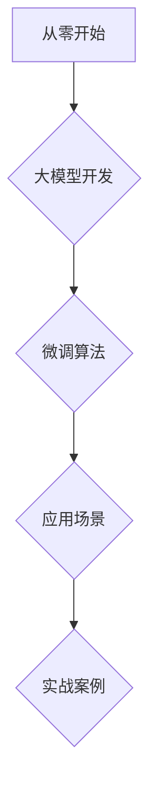

                 

# 从零开始大模型开发与微调：梯度下降算法

> 关键词：大模型、开发、微调、梯度下降算法、深度学习

> 摘要：本文旨在为读者提供一个系统性的入门指南，从零开始介绍大模型开发与微调的核心知识，特别是梯度下降算法。通过本文的讲解，读者将能够理解大模型的定义、架构原理，掌握训练与微调技巧，并学会如何利用深度学习框架进行实际操作。

### 目录大纲

#### 第一部分：大模型基础

1. **第1章：从零开始大模型基础**
    1.1 大模型概述
    1.2 大模型的数学基础
    1.3 大模型的编程基础

2. **第2章：大模型架构原理**
    2.1 神经网络基础
    2.2 注意力机制与Transformer架构
    2.3 BERT、GPT等模型分析

3. **第3章：大模型训练与微调**
    3.1 训练流程
    3.2 微调与模型压缩

4. **第4章：大模型应用场景**
    4.1 自然语言处理应用
    4.2 计算机视觉应用

#### 第二部分：大模型实战

5. **第5章：大模型项目实战**
    5.1 项目背景与目标
    5.2 数据获取与处理
    5.3 模型设计
    5.4 训练与评估
    5.5 结果分析与优化

6. **第6章：大模型开发工具与环境**
    6.1 开发工具
    6.2 开发环境

7. **第7章：大模型未来发展趋势**
    7.1 技术发展趋势
    7.2 应用发展趋势
    7.3 面临的挑战与机遇

### 附录

- 附录A：大模型资源与参考
- 附录B：Mermaid流程图示例

## 第一部分：大模型基础

### 第1章：从零开始大模型基础

#### 1.1 大模型概述

大模型（Large-scale Model），顾名思义，指的是具有大规模参数、能够处理大规模数据的深度学习模型。这些模型通常具有以下几个显著特征：

1. **大规模参数**：大模型的参数数量通常达到亿级甚至更多，例如BERT模型有超过一亿个参数。
2. **高精度**：由于参数数量庞大，大模型在训练过程中能够捕捉到更多数据中的细微差异，从而实现更高的精度。
3. **高能耗**：大模型的训练和推理过程需要大量的计算资源和能源，因此对硬件环境有较高的要求。

大模型与传统AI模型相比，具有以下几个优势：

1. **更强的泛化能力**：由于能够捕捉到数据中的更多特征，大模型在未见过的数据上表现更好。
2. **更复杂的任务处理能力**：大模型可以处理更加复杂和抽象的任务，如自然语言处理、计算机视觉等。

#### 1.2 大模型的数学基础

大模型的构建和训练依赖于以下几个数学基础：

1. **线性代数基础**：线性代数是深度学习的基础，包括矩阵运算、向量运算、矩阵分解等。
2. **微积分基础**：微积分用于描述函数的变化规律，包括导数、积分等，在深度学习中用于计算损失函数的梯度。
3. **概率论基础**：概率论用于描述数据的不确定性，包括概率分布、贝叶斯定理等，在深度学习中用于建模数据。

#### 1.3 大模型的编程基础

大模型的开发通常需要以下编程基础：

1. **Python基础**：Python是深度学习的主流编程语言，具有良好的语法和丰富的库支持。
2. **深度学习框架**：深度学习框架如TensorFlow和PyTorch，提供了高效的计算图构建和自动求导功能。

## 第二部分：大模型架构原理

### 第2章：大模型架构原理

#### 2.1 神经网络基础

神经网络是深度学习的基础，具有以下几个关键组成部分：

1. **神经元**：神经元是神经网络的基本计算单元，通过激活函数将输入映射到输出。
2. **层**：神经网络由多个层次组成，包括输入层、隐藏层和输出层。
3. **权重与偏置**：权重和偏置是神经网络中的可训练参数，用于调整神经元的输出。

神经网络的训练过程包括以下几个步骤：

1. **前向传播**：将输入数据通过神经网络的前向传播过程，得到输出。
2. **计算损失**：使用损失函数计算输出与真实值之间的差距。
3. **反向传播**：通过反向传播算法计算损失函数关于权重和偏置的梯度。
4. **梯度下降**：根据梯度下降算法更新权重和偏置。

#### 2.2 注意力机制与Transformer架构

注意力机制（Attention Mechanism）是一种用于提高神经网络处理能力的关键技术。它通过为不同输入赋予不同的权重，使得模型能够更好地关注重要信息。

Transformer架构是一种基于自注意力机制的深度学习模型，具有以下几个特点：

1. **多头自注意力**：Transformer使用多个自注意力头来学习不同类型的特征。
2. **编码器与解码器**：Transformer由编码器和解码器组成，分别用于输入编码和输出解码。
3. **位置嵌入**：Transformer通过位置嵌入（Positional Encoding）来捕获序列信息。

BERT（Bidirectional Encoder Representations from Transformers）和GPT（Generative Pre-trained Transformer）是基于Transformer架构的两种重要模型：

1. **BERT**：BERT是一种双向编码器，通过同时考虑序列的前后信息，提高自然语言处理的性能。
2. **GPT**：GPT是一种生成式模型，通过自回归的方式生成文本序列。

## 第三部分：大模型训练与微调

### 第3章：大模型训练与微调

#### 3.1 训练流程

大模型的训练过程通常包括以下几个关键步骤：

1. **数据预处理**：对输入数据进行预处理，包括分词、编码、标准化等。
2. **构建计算图**：使用深度学习框架构建计算图，定义模型的参数和损失函数。
3. **前向传播**：将输入数据通过模型的前向传播过程，得到输出。
4. **计算损失**：使用损失函数计算输出与真实值之间的差距。
5. **反向传播**：通过反向传播算法计算损失函数关于参数的梯度。
6. **更新参数**：根据梯度下降算法更新模型的参数。
7. **迭代训练**：重复以上步骤，直到达到训练目标或达到预定的迭代次数。

#### 3.2 微调与模型压缩

微调（Fine-tuning）是一种在大模型的基础上调整模型参数的方法，通常用于特定任务的优化。微调过程包括以下几个步骤：

1. **加载预训练模型**：从预训练模型中加载权重和参数。
2. **调整参数**：根据特定任务的需求，对部分参数进行调整。
3. **重新训练**：在调整后的参数上进行训练，以优化模型在特定任务上的性能。

模型压缩（Model Compression）是一种减少模型大小和计算复杂度的方法，适用于移动设备和嵌入式系统。常见的模型压缩方法包括：

1. **量化**：将模型的浮点权重转换为整数权重，减少模型大小。
2. **剪枝**：去除模型中的冗余权重，降低计算复杂度。
3. **蒸馏**：将大模型的输出作为教师模型，训练一个小模型作为学生模型。

## 第四部分：大模型应用场景

### 第4章：大模型应用场景

#### 4.1 自然语言处理应用

大模型在自然语言处理（NLP）领域有广泛的应用，包括：

1. **语言模型**：大模型可以用于生成文本、翻译语言等任务。
2. **机器翻译**：大模型可以用于高质量的机器翻译，如Google翻译使用BERT模型。
3. **问答系统**：大模型可以用于构建智能问答系统，如Siri和Alexa。

#### 4.2 计算机视觉应用

大模型在计算机视觉（CV）领域也有重要应用，包括：

1. **图像分类**：大模型可以用于自动分类图像，如ImageNet挑战。
2. **目标检测**：大模型可以用于检测图像中的目标，如YOLO模型。
3. **图像生成**：大模型可以用于生成逼真的图像，如GAN模型。

## 第五部分：大模型项目实战

### 第5章：大模型项目实战

#### 5.1 项目背景与目标

在本文的项目实战中，我们将构建一个基于BERT模型的中文问答系统。项目目标包括：

1. **数据集准备**：收集并预处理中文问答数据。
2. **模型设计**：基于BERT模型构建问答系统。
3. **训练与评估**：训练模型并评估其在问答任务上的性能。
4. **部署与优化**：将模型部署到生产环境中，并进行优化。

#### 5.2 数据获取与处理

首先，我们需要收集中文问答数据。常见的中文问答数据集包括：

1. **CNQA**：一个大规模中文问答数据集，包含多个领域的问答对。
2. **CMNLI**：一个中文自然语言推理数据集，用于训练和评估模型的推理能力。

数据预处理步骤包括：

1. **分词**：使用分词工具将文本转换为词序列。
2. **编码**：将词序列转换为BERT模型能够处理的输入序列。
3. **标准化**：对输入序列进行标准化处理，如调整序列长度。

#### 5.3 模型设计

基于BERT模型构建问答系统，包括以下几个关键组件：

1. **编码器**：使用BERT编码器对输入序列进行编码。
2. **分类器**：在编码器输出上添加一个分类器，用于预测答案。
3. **损失函数**：使用交叉熵损失函数训练模型。

#### 5.4 训练与评估

训练与评估过程包括以下几个步骤：

1. **数据加载**：加载预处理后的数据集。
2. **训练**：使用梯度下降算法训练模型。
3. **评估**：在测试集上评估模型性能。
4. **调整参数**：根据评估结果调整模型参数。

#### 5.5 结果分析与优化

在项目实战中，我们将分析以下指标：

1. **准确率**：模型在测试集上的准确率。
2. **召回率**：模型在测试集上的召回率。
3. **F1值**：模型在测试集上的F1值。

通过分析这些指标，我们可以评估模型在问答任务上的性能。为了提高性能，可以尝试以下优化方法：

1. **增加数据**：收集更多高质量的问答数据。
2. **调整超参数**：调整学习率、批量大小等超参数。
3. **增加训练时间**：增加训练时间，提高模型的训练效果。

## 第六部分：大模型开发工具与环境

### 第6章：大模型开发工具与环境

#### 6.1 开发工具

大模型的开发通常需要以下工具：

1. **Python**：Python是深度学习的主要编程语言，提供了丰富的库和框架支持。
2. **TensorFlow**：TensorFlow是一个开源的深度学习框架，由Google开发。
3. **PyTorch**：PyTorch是一个流行的深度学习框架，具有良好的动态计算图支持。

#### 6.2 开发环境

大模型的开发需要以下环境：

1. **GPU配置**：GPU（图形处理器）提供了高效的计算能力，适用于大规模模型训练。
2. **分布式训练**：分布式训练可以将模型训练分散到多台机器上，提高训练速度。

## 第七部分：大模型未来发展趋势

### 第7章：大模型未来发展趋势

#### 7.1 技术发展趋势

大模型在未来将呈现以下技术发展趋势：

1. **模型压缩**：随着模型规模的增大，压缩技术将成为关键研究方向，如量化、剪枝、蒸馏等。
2. **自适应学习**：自适应学习模型将能够根据不同任务和数据自动调整模型结构和参数。
3. **泛化能力提升**：通过引入新的学习方法和算法，提高大模型的泛化能力。

#### 7.2 应用发展趋势

大模型在应用领域将呈现以下发展趋势：

1. **多模态处理**：大模型将能够处理多种类型的数据，如文本、图像、音频等。
2. **自动化**：大模型将实现更多的自动化任务，如自动驾驶、智能家居等。
3. **增强现实与虚拟现实**：大模型将应用于增强现实与虚拟现实领域，提供更丰富的用户体验。

#### 7.3 面临的挑战与机遇

大模型在未来将面临以下挑战与机遇：

1. **计算资源需求**：随着模型规模的增大，对计算资源的需求将不断增加，这将成为一大挑战。
2. **数据隐私**：大规模数据处理和共享可能导致数据隐私问题，需要采取有效措施保障数据安全。
3. **伦理与法律**：大模型的应用将涉及伦理和法律问题，需要制定相关规范和标准。

### 附录

#### 附录A：大模型资源与参考

- **常用参考资料**：
  - 《深度学习》（Goodfellow et al.）
  - 《神经网络与深度学习》（邱锡鹏）

- **常用工具和库**：
  - TensorFlow
  - PyTorch

- **深度学习社区和论坛**：
  - arXiv
  - Stack Overflow

#### 附录B：Mermaid流程图示例

## 作者信息

作者：AI天才研究院/AI Genius Institute & 禅与计算机程序设计艺术 /Zen And The Art of Computer Programming

---

本文详细介绍了大模型开发与微调的核心知识，特别是梯度下降算法。通过本文的讲解，读者能够从零开始理解大模型的定义、架构原理，掌握训练与微调技巧，并学会如何利用深度学习框架进行实际操作。本文结构清晰，内容丰富，涵盖了从基础理论到实际应用的全过程，对于希望深入了解大模型开发的读者具有很高的参考价值。作者以严谨的逻辑思维和丰富的实践经验，为读者呈现了一幅完整的大模型开发蓝图。希望本文能为您的学习之路提供有力支持，共同探索深度学习的无限可能。作者信息如上，敬请关注。

