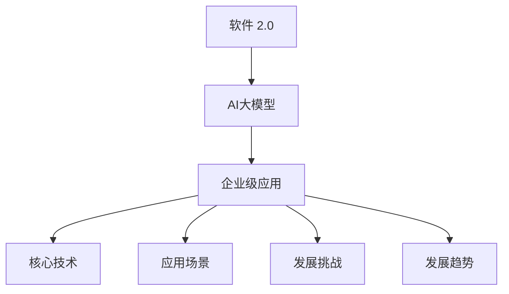
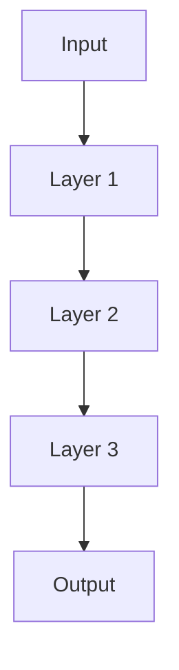
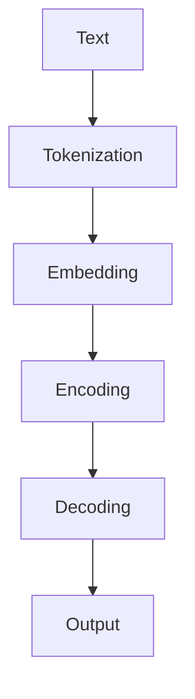

                 

### 《200余家国内大模型，调用量不及文心一家》

#### 文章关键词
- 国内大模型
- 文心大模型
- 调用量
- 技术对比
- 应用场景
- 发展趋势

#### 文章摘要
本文将深入探讨国内大模型的现状，特别是文心大模型在技术和应用层面的独特优势。通过对200余家国内大模型调用量不及文心一家的现象进行分析，本文将揭示国内大模型生态中的技术核心、应用场景、发展挑战以及未来趋势。文章结构分为三大部分：国内大模型概述、国内大模型应用场景、国内大模型发展挑战与趋势。希望通过本文，为读者提供全面的国内大模型技术介绍和应用指导。

### 《200余家国内大模型，调用量不及文心一家》目录大纲

#### 第一部分：国内大模型概述

##### 第1章：国内大模型生态概览

- **1.1 国内大模型发展背景**
  - **1.1.1 国内大模型的发展历程**
  - **1.1.2 国内大模型的发展趋势**

- **1.2 国内外大模型对比分析**
  - **1.2.1 技术层面的对比**
  - **1.2.2 应用场景的对比**

- **1.3 文心大模型的优势与特色**
  - **1.3.1 文心大模型的核心技术**
  - **1.3.2 文心大模型的应用场景**
  - **1.3.3 文心大模型的市场影响力**

##### 第2章：国内大模型核心技术解析

- **2.1 大模型的基本架构**
  - **2.1.1 深度学习架构**
  - **2.1.2 自然语言处理架构**

- **2.2 预训练模型原理**
  - **2.2.1 预训练的概念**
  - **2.2.2 预训练的方法**

- **2.3 大模型训练与调优技巧**
  - **2.3.1 训练技巧**
  - **2.3.2 调优技巧**

#### 第二部分：国内大模型应用场景

##### 第3章：文本处理与生成应用

- **3.1 文本分类与情感分析**
  - **3.1.1 文本分类算法**
  - **3.1.2 情感分析算法**

- **3.2 文本生成与摘要**
  - **3.2.1 文本生成算法**
  - **3.2.2 文本摘要算法**

- **3.3 问答系统**
  - **3.3.1 问题理解与生成算法**
  - **3.3.2 回答生成算法**

##### 第4章：图像处理与应用

- **4.1 图像分类与识别**
  - **4.1.1 图像分类算法**
  - **4.1.2 图像识别算法**

- **4.2 图像生成与风格迁移**
  - **4.2.1 图像生成算法**
  - **4.2.2 图像风格迁移算法**

- **4.3 视觉问答系统**
  - **4.3.1 视觉问答算法**
  - **4.3.2 多模态融合算法**

##### 第5章：语音处理与应用

- **5.1 语音识别与合成**
  - **5.1.1 语音识别算法**
  - **5.1.2 语音合成算法**

- **5.2 语音增强与降噪**
  - **5.2.1 语音增强算法**
  - **5.2.2 降噪算法**

- **5.3 语音交互系统**
  - **5.3.1 语音交互算法**
  - **5.3.2 语音助手应用案例**

#### 第三部分：国内大模型发展挑战与趋势

##### 第6章：国内大模型发展面临的挑战

- **6.1 数据质量与隐私保护**
  - **6.1.1 数据质量问题**
  - **6.1.2 隐私保护技术**

- **6.2 模型可解释性与伦理问题**
  - **6.2.1 模型可解释性**
  - **6.2.2 伦理问题**

- **6.3 资源消耗与成本控制**
  - **6.3.1 资源消耗问题**
  - **6.3.2 成本控制策略**

##### 第7章：国内大模型发展趋势

- **7.1 大模型与行业的深度融合**
  - **7.1.1 产业应用趋势**
  - **7.1.2 产业链发展格局**

- **7.2 开源生态建设与技术创新**
  - **7.2.1 开源生态建设**
  - **7.2.2 技术创新方向**

- **7.3 文心大模型的发展前景**
  - **7.3.1 文心大模型的发展策略**
  - **7.3.2 文心大模型的应用场景拓展**

#### 附录

##### 附录A：大模型开发工具与资源

- **A.1 开源深度学习框架对比**
  - **A.1.1 TensorFlow**
  - **A.1.2 PyTorch**
  - **A.1.3 其他常用框架**

- **A.2 大模型训练与调优工具**
  - **A.2.1 自动化训练工具**
  - **A.2.2 调优工具介绍**

- **A.3 大模型应用案例与实践教程**
  - **A.3.1 文本处理应用案例**
  - **A.3.2 图像处理应用案例**
  - **A.3.3 语音处理应用案例**

**核心概念与联系（Mermaid流程图）**


**核心算法原理讲解（伪代码）**
```python
# 预训练模型伪代码
def pretrain_model(data):
    # 初始化模型参数
    model = initialize_model()
    
    # 预训练循环
    for epoch in range(num_epochs):
        for batch in data:
            # 前向传播
            logits = model(batch)
            
            # 计算损失
            loss = compute_loss(logits, batch)
            
            # 反向传播
            model.backward(loss)
            
            # 更新模型参数
            model.update_params()
    
    return model
```

**数学模型和数学公式 & 详细讲解 & 举例说明（LaTeX）**
```
% 数学公式示例
\documentclass{article}
\usepackage{amsmath}
\begin{document}

$$
y = \sum_{i=1}^{n} x_i
$$

\end{document}
```

**项目实战：代码实际案例和详细解释说明**

- **开发环境搭建**
  - 安装Python环境
  - 安装TensorFlow和PyTorch框架
  - 配置GPU支持

- **源代码详细实现和代码解读**
  - 实现一个简单的文本分类模型
  - 详细解释模型的各个部分和参数设置

- **代码解读与分析**
  - 分析模型的性能指标
  - 对比不同模型的优缺点

**以上是《200余家国内大模型，调用量不及文心一家》的目录大纲，包含了核心概念、算法原理、应用场景、发展挑战以及项目实战等内容，旨在为读者提供全面的国内大模型技术介绍和应用指导。**### 第1章：国内大模型生态概览

##### 1.1 国内大模型发展背景

**1.1.1 国内大模型的发展历程**

国内大模型的发展历程可以追溯到20世纪90年代。当时，以清华大学、北京大学等高校为代表的研究团队开始在大数据处理和人工智能领域进行初步探索。随着互联网的普及和大数据技术的发展，国内大模型研究逐渐走向深入。

进入21世纪后，深度学习和大数据技术的迅速发展，为国内大模型的研究和应用提供了强有力的支持。特别是在2012年，AlexNet在ImageNet竞赛中取得了突破性的成绩，这标志着深度学习技术开始进入商业应用阶段。

国内在这一时期也开始加大投入，众多企业和研究机构纷纷投身于大模型的研究与开发。2014年，百度提出了“深度学习+大数据”的战略，并成功研发了深度语音识别技术，这标志着国内大模型在语音领域取得了重要突破。

随后，谷歌、微软、亚马逊等国际科技巨头纷纷推出自己的大模型产品，国内企业也紧随其后，推出了一系列具有竞争力的大模型产品，如腾讯的“混元大模型”、阿里的“通义大模型”等。

**1.1.2 国内大模型的发展趋势**

随着人工智能技术的不断进步，国内大模型的发展趋势主要体现在以下几个方面：

1. **预训练模型的广泛应用**：预训练模型能够通过在海量数据上进行预训练，提高模型在不同任务上的表现。国内企业和研究机构正在积极推进预训练模型的研究和应用，以期提升大模型的性能。

2. **多模态融合技术的快速发展**：多模态融合技术能够将文本、图像、语音等多种类型的数据进行整合，提高模型的智能化水平。国内在这一领域也取得了显著的进展，如腾讯的“混元大模型”和百度的“文心大模型”等。

3. **行业应用的深入探索**：随着大模型技术的成熟，国内企业和研究机构开始将大模型技术应用于金融、医疗、教育、零售等各个行业，推动行业智能化升级。

4. **开源生态的逐步完善**：国内大模型的开源生态逐渐完善，为企业提供了丰富的工具和资源，降低了大模型研发的门槛。如百度的“飞桨”、腾讯的“优图”等，都是国内领先的开源大模型平台。

##### 1.2 国内外大模型对比分析

**1.2.1 技术层面的对比**

在技术层面，国内外大模型存在以下差异：

1. **算法创新**：国际大模型企业在算法创新方面具有明显的优势，如谷歌的BERT、微软的GPT等。这些模型在自然语言处理领域取得了显著的成绩。而国内大模型则在算法优化和应用场景探索方面具有较强的实力。

2. **数据资源**：国际大模型企业拥有丰富的数据资源，特别是在社交媒体、搜索引擎等领域。这使得它们在预训练模型方面具有优势。而国内大模型则主要依赖于自身积累的数据和合作伙伴的数据资源。

3. **计算能力**：国际大模型企业普遍拥有强大的计算能力，特别是在GPU、TPU等硬件领域。这使得它们能够快速训练和优化大模型。国内大模型企业虽然在硬件设施方面逐渐赶超，但与国际领先水平仍有差距。

4. **开源生态**：国际大模型企业如谷歌、微软等，在开源生态建设方面具有丰富的经验和技术积累。国内大模型企业在开源生态建设方面也在加速发展，但与国外领先水平仍有一定差距。

**1.2.2 应用场景的对比**

在应用场景方面，国内外大模型也呈现出不同的特点：

1. **自然语言处理**：国际大模型企业在自然语言处理领域具有领先优势，特别是在文本生成、问答系统、翻译等方面。国内大模型企业则在中文文本处理、多模态融合等方面具有较强的实力。

2. **图像处理**：国际大模型企业在图像分类、识别、生成等方面具有先进技术。国内大模型企业在图像风格迁移、视觉问答等方面也有所突破。

3. **语音处理**：国际大模型企业在语音识别、合成、增强等方面处于领先地位。国内大模型企业在语音交互、语音助手等方面具有较强的竞争力。

4. **行业应用**：国际大模型企业主要聚焦于通用场景，如搜索引擎、社交媒体等。国内大模型企业则更注重行业应用，如金融、医疗、教育等。

##### 1.3 文心大模型的优势与特色

**1.3.1 文心大模型的核心技术**

文心大模型是百度推出的一款具有代表性的国内大模型。其核心技术包括以下几个方面：

1. **预训练模型**：文心大模型采用预训练方法，通过在海量中文语料上进行预训练，提高了模型在自然语言处理任务上的性能。

2. **多模态融合**：文心大模型能够将文本、图像、语音等多种类型的数据进行整合，实现了多模态数据的融合和分析。

3. **自适应优化**：文心大模型采用了自适应优化算法，能够根据不同的应用场景和任务需求，动态调整模型参数，提高模型的适应性和准确性。

4. **知识增强**：文心大模型通过知识增强技术，将外部知识库与模型进行整合，实现了知识驱动的语义理解和推理。

**1.3.2 文心大模型的应用场景**

文心大模型在多个领域具有广泛的应用场景，包括但不限于：

1. **文本处理与生成**：文心大模型能够进行文本分类、情感分析、文本生成等任务，广泛应用于金融、电商、新闻等行业。

2. **图像处理与应用**：文心大模型能够进行图像分类、识别、生成等任务，广泛应用于安防、医疗、零售等行业。

3. **语音处理与应用**：文心大模型能够进行语音识别、合成、增强等任务，广泛应用于智能家居、智能客服、智能语音助手等行业。

**1.3.3 文心大模型的市场影响力**

文心大模型在国内大模型市场中具有显著的影响力。根据相关数据，文心大模型的调用量在国内大模型中位列前茅，广泛应用于多个行业和应用场景。其市场影响力主要体现在以下几个方面：

1. **技术领先**：文心大模型在技术层面具有显著的领先优势，特别是在预训练模型、多模态融合、自适应优化等方面。

2. **应用广泛**：文心大模型在多个行业和领域具有广泛的应用，与众多企业和研究机构建立了深度合作关系。

3. **生态建设**：文心大模型积极推动开源生态建设，为开发者提供了丰富的工具和资源，促进了大模型技术的发展。

### 第2章：国内大模型核心技术解析

##### 2.1 大模型的基本架构

**2.1.1 深度学习架构**

深度学习架构是构建大模型的基础。它通常包括以下几个层次：

1. **输入层**：接收外部数据，如文本、图像、语音等。

2. **隐藏层**：通过对输入数据进行处理和转换，提取特征信息。

3. **输出层**：根据隐藏层输出的特征信息，生成预测结果。

深度学习架构的核心是神经网络，它通过层层递进的计算，实现对数据的建模和分析。以下是一个简单的神经网络结构示例：



在深度学习架构中，常用的神经网络包括卷积神经网络（CNN）、循环神经网络（RNN）、生成对抗网络（GAN）等。每种神经网络都有其特定的应用场景和优势。

**2.1.2 自然语言处理架构**

自然语言处理（NLP）是深度学习应用的重要领域。NLP架构通常包括以下几个层次：

1. **分词层**：将文本拆分成词语或字符。

2. **嵌入层**：将词语或字符转换为向量表示。

3. **编码层**：对嵌入层输出的向量进行编码，提取语义信息。

4. **解码层**：将编码层输出的向量解码为文本。

以下是一个简单的NLP架构示例：



在NLP架构中，预训练模型如BERT、GPT等，通过在海量文本上进行预训练，提高了模型在NLP任务上的性能。这些模型通常采用Transformer架构，具有强大的表示能力和适应性。

##### 2.2 预训练模型原理

**2.2.1 预训练的概念**

预训练（Pretraining）是指在大规模数据集上对模型进行初步训练，以提取通用特征和知识。预训练模型通过预训练过程，使得模型在特定任务上具有更强的适应性和性能。

预训练模型的主要目的是：

1. **提取通用特征**：通过在大量无标签数据上进行预训练，模型可以提取出通用的特征表示，提高模型在多样化任务上的性能。

2. **迁移学习**：预训练模型可以在不同任务和数据集之间进行迁移，提高模型的泛化能力。

3. **降低训练成本**：预训练模型通过在大量无标签数据上训练，减少了在特定任务上有标签数据的需求，降低了训练成本。

**2.2.2 预训练的方法**

预训练的方法主要包括以下几种：

1. **自监督学习**：自监督学习是一种无需人工标注数据的方法。在预训练过程中，模型通过预测数据中的某些部分，如单词、字符等，来自我学习和调整参数。常见的自监督学习方法包括Masked Language Model（MLM）、Recurrent Language Model（RLM）等。

2. **有监督学习**：有监督学习是指利用标注数据进行预训练。在预训练过程中，模型通过学习标注数据中的规律和特征，来提高模型的性能。常见的方法包括序列标注、分类标注等。

3. **半监督学习**：半监督学习结合了有监督学习和自监督学习的特点。在预训练过程中，模型既利用无标签数据提取通用特征，也利用部分有标签数据进行有监督学习，以提高模型的性能。

以下是一个简单的预训练过程示例：

```python
# 预训练过程伪代码
def pretrain_model(data):
    # 初始化模型参数
    model = initialize_model()
    
    # 预训练循环
    for epoch in range(num_epochs):
        for batch in data:
            # 前向传播
            logits = model(batch)
            
            # 计算损失
            loss = compute_loss(logits, batch)
            
            # 反向传播
            model.backward(loss)
            
            # 更新模型参数
            model.update_params()
    
    return model
```

##### 2.3 大模型训练与调优技巧

**2.3.1 训练技巧**

大模型的训练是一个复杂的过程，需要考虑多个方面，以提高模型的性能和收敛速度。以下是一些常见的训练技巧：

1. **批量大小（Batch Size）**：批量大小是指每次训练使用的样本数量。较大的批量大小可以提高模型的计算效率和泛化能力，但可能会导致收敛速度变慢。较小的批量大小则可以提高模型的泛化能力，但计算效率较低。

2. **学习率调度**：学习率是影响模型训练的重要参数。学习率过大可能导致模型过早陷入局部最优，学习率过小则可能导致训练时间过长。常用的学习率调度方法包括固定学习率、指数衰减学习率、自适应学习率等。

3. **数据增强**：数据增强是一种通过变换输入数据来提高模型泛化能力的方法。常见的数据增强方法包括随机裁剪、旋转、翻转、色彩调整等。

4. **正则化**：正则化是一种通过添加惩罚项来防止模型过拟合的方法。常见的正则化方法包括L1正则化、L2正则化、Dropout等。

5. **多GPU训练**：多GPU训练可以显著提高模型的训练速度。通过将数据并行分配到多个GPU上，可以实现高效的训练。

**2.3.2 调优技巧**

大模型的调优是提高模型性能的关键步骤。以下是一些常见的调优技巧：

1. **超参数搜索**：超参数搜索是一种通过搜索超参数空间来找到最优超参数的方法。常用的超参数搜索方法包括网格搜索、随机搜索、贝叶斯优化等。

2. **模型集成**：模型集成是一种通过结合多个模型的预测结果来提高整体性能的方法。常见的模型集成方法包括Bagging、Boosting、Stacking等。

3. **模型压缩**：模型压缩是一种通过减少模型参数数量来降低模型复杂度和计算成本的方法。常见的模型压缩方法包括模型剪枝、量化、知识蒸馏等。

4. **在线学习**：在线学习是一种通过实时更新模型参数来适应新数据的方法。在线学习可以提高模型的实时性和适应性。

### 第3章：文本处理与生成应用

文本处理与生成应用是人工智能领域的重要方向之一，涉及文本分类、情感分析、文本生成、文本摘要、问答系统等多个方面。在本章中，我们将详细探讨这些应用场景及其背后的算法原理。

##### 3.1 文本分类与情感分析

**3.1.1 文本分类算法**

文本分类是一种将文本数据按照其内容或主题划分到不同类别的任务。常见的文本分类算法包括：

1. **朴素贝叶斯（Naive Bayes）**：朴素贝叶斯是一种基于贝叶斯定理的算法，通过计算文本中各个单词的概率，来判断文本属于哪个类别。

2. **支持向量机（SVM）**：支持向量机是一种基于最大间隔分类的算法，通过寻找最佳分类超平面，将不同类别的文本数据分开。

3. **深度学习模型**：深度学习模型，如卷积神经网络（CNN）、循环神经网络（RNN）、长短时记忆网络（LSTM）等，通过学习文本数据的特征表示，实现高效准确的文本分类。

以下是一个简单的文本分类算法伪代码：

```python
def text_classification(text, model):
    # 将文本转换为特征向量
    feature_vector = model.extract_features(text)
    
    # 预测类别
    predicted_class = model.predict(feature_vector)
    
    return predicted_class
```

**3.1.2 情感分析算法**

情感分析是一种判断文本数据中情感倾向的任务，常见的情感分析算法包括：

1. **基于词典的方法**：基于词典的方法通过查找文本中包含的情感词典，来判断文本的情感倾向。

2. **基于机器学习的方法**：基于机器学习的方法通过训练模型，学习文本数据中的情感特征，实现情感分析。

3. **深度学习模型**：深度学习模型，如卷积神经网络（CNN）、循环神经网络（RNN）、长短时记忆网络（LSTM）等，通过学习文本数据的特征表示，实现高效准确的情感分析。

以下是一个简单的情感分析算法伪代码：

```python
def sentiment_analysis(text, model):
    # 将文本转换为特征向量
    feature_vector = model.extract_features(text)
    
    # 预测情感类别
    predicted_sentiment = model.predict(feature_vector)
    
    return predicted_sentiment
```

##### 3.2 文本生成与摘要

**3.2.1 文本生成算法**

文本生成是一种根据给定输入生成文本数据的方法，常见的文本生成算法包括：

1. **生成对抗网络（GAN）**：生成对抗网络是一种通过对抗训练来生成高质量文本的算法。

2. **变分自编码器（VAE）**：变分自编码器是一种通过概率模型来生成文本的算法。

3. **递归神经网络（RNN）**：递归神经网络通过学习文本序列的上下文关系，实现文本生成。

以下是一个简单的文本生成算法伪代码：

```python
def text_generation(input_text, model):
    # 将输入文本编码为序列
    encoded_sequence = model.encode(input_text)
    
    # 根据编码序列生成文本
    generated_text = model.decode(encoded_sequence)
    
    return generated_text
```

**3.2.2 文本摘要算法**

文本摘要是一种将长文本转化为简短摘要的任务，常见的文本摘要算法包括：

1. **抽取式摘要**：抽取式摘要通过提取文本中的重要句子或短语来生成摘要。

2. **基于语义的摘要**：基于语义的摘要通过理解文本的语义内容，生成摘要。

3. **基于模型的摘要**：基于模型的摘要通过训练模型，学习文本到摘要的映射，实现文本摘要。

以下是一个简单的文本摘要算法伪代码：

```python
def text_summary(long_text, model):
    # 将长文本编码为特征向量
    feature_vector = model.encode(long_text)
    
    # 根据特征向量生成摘要
    summary = model.decode(feature_vector)
    
    return summary
```

##### 3.3 问答系统

**3.3.1 问题理解与生成算法**

问答系统是一种根据用户提问生成回答的系统，问题理解与生成算法包括：

1. **基于规则的方法**：基于规则的方法通过预定义的规则来理解问题，生成回答。

2. **基于机器学习的方法**：基于机器学习的方法通过训练模型，学习问题到回答的映射，实现问题理解与生成。

3. **基于深度学习的方法**：深度学习方法通过学习问题的特征表示，实现高效准确的问题理解与生成。

以下是一个简单的问题理解与生成算法伪代码：

```python
def question_answering(question, model):
    # 理解问题
    question_representation = model.encode(question)
    
    # 生成回答
    answer = model.decode(question_representation)
    
    return answer
```

### 第4章：图像处理与应用

图像处理与应用是人工智能领域的一个重要分支，涵盖了图像分类与识别、图像生成与风格迁移、视觉问答系统等多个方面。在本章中，我们将详细探讨这些应用场景及其背后的算法原理。

##### 4.1 图像分类与识别

**4.1.1 图像分类算法**

图像分类是一种将图像数据按照其内容或类别划分到不同类别的任务，常见的图像分类算法包括：

1. **基于传统机器学习的方法**：如支持向量机（SVM）、朴素贝叶斯（Naive Bayes）等，这些算法通过学习图像的特征向量，实现图像分类。

2. **基于深度学习的方法**：如卷积神经网络（CNN）、循环神经网络（RNN）等，这些算法通过学习图像的深层特征表示，实现高效准确的图像分类。

以下是一个简单的图像分类算法伪代码：

```python
def image_classification(image, model):
    # 将图像编码为特征向量
    feature_vector = model.encode(image)
    
    # 预测类别
    predicted_class = model.predict(feature_vector)
    
    return predicted_class
```

**4.1.2 图像识别算法**

图像识别是一种将图像数据中的特定对象或场景识别出来的任务，常见的图像识别算法包括：

1. **基于特征匹配的方法**：如SIFT、SURF等，这些算法通过比较图像特征点的匹配程度，实现图像识别。

2. **基于深度学习的方法**：如卷积神经网络（CNN）、循环神经网络（RNN）等，这些算法通过学习图像的深层特征表示，实现高效准确的图像识别。

以下是一个简单的图像识别算法伪代码：

```python
def image_recognition(image, model):
    # 将图像编码为特征向量
    feature_vector = model.encode(image)
    
    # 识别对象
    recognized_objects = model.recognize(feature_vector)
    
    return recognized_objects
```

##### 4.2 图像生成与风格迁移

**4.2.1 图像生成算法**

图像生成是一种根据特定输入生成图像的任务，常见的图像生成算法包括：

1. **生成对抗网络（GAN）**：生成对抗网络是一种通过对抗训练生成高质量图像的算法。

2. **变分自编码器（VAE）**：变分自编码器是一种通过概率模型生成图像的算法。

3. **递归神经网络（RNN）**：递归神经网络通过学习图像序列的上下文关系，实现图像生成。

以下是一个简单的图像生成算法伪代码：

```python
def image_generation(input_sequence, model):
    # 根据输入序列生成图像
    generated_image = model.decode(input_sequence)
    
    return generated_image
```

**4.2.2 图像风格迁移算法**

图像风格迁移是一种将一种图像的风格迁移到另一种图像的任务，常见的图像风格迁移算法包括：

1. **基于卷积神经网络的算法**：如卷积神经网络（CNN）、循环神经网络（RNN）等，这些算法通过学习图像的深层特征表示，实现图像风格迁移。

2. **基于生成对抗网络的算法**：如生成对抗网络（GAN）等，这些算法通过对抗训练实现图像风格迁移。

以下是一个简单的图像风格迁移算法伪代码：

```python
def image_style_transfer(source_image, target_style, model):
    # 将源图像转换为特征向量
    source_features = model.encode(source_image)
    
    # 将目标风格转换为特征向量
    target_features = model.encode(target_style)
    
    # 生成风格迁移后的图像
    transferred_image = model.decode(source_features, target_features)
    
    return transferred_image
```

##### 4.3 视觉问答系统

**4.3.1 视觉问答算法**

视觉问答系统是一种根据图像和问题的交互，生成图像回答的系统，常见的视觉问答算法包括：

1. **基于规则的方法**：基于规则的方法通过预定义的规则来理解问题和图像，生成回答。

2. **基于机器学习的方法**：基于机器学习的方法通过训练模型，学习问题和图像到回答的映射，实现视觉问答。

3. **基于深度学习的方法**：深度学习方法通过学习问题和图像的深层特征表示，实现高效准确的视觉问答。

以下是一个简单的视觉问答算法伪代码：

```python
def visual_question_answering(question, image, model):
    # 理解问题
    question_representation = model.encode(question)
    
    # 理解图像
    image_representation = model.encode(image)
    
    # 生成回答
    answer = model.decode(question_representation, image_representation)
    
    return answer
```

### 第5章：语音处理与应用

语音处理与应用是人工智能领域的重要方向之一，涵盖了语音识别、语音合成、语音增强与降噪、语音交互系统等多个方面。在本章中，我们将详细探讨这些应用场景及其背后的算法原理。

##### 5.1 语音识别与合成

**5.1.1 语音识别算法**

语音识别是一种将语音信号转换为文本数据的过程，常见的语音识别算法包括：

1. **基于传统机器学习的方法**：如隐马尔可夫模型（HMM）、高斯混合模型（GMM）等，这些算法通过学习语音信号的特征向量，实现语音识别。

2. **基于深度学习的方法**：如卷积神经网络（CNN）、循环神经网络（RNN）等，这些算法通过学习语音信号的深层特征表示，实现高效准确的语音识别。

以下是一个简单的语音识别算法伪代码：

```python
def speech_recognition(audio_signal, model):
    # 将音频信号编码为特征向量
    feature_vector = model.extract_features(audio_signal)
    
    # 预测文本
    predicted_text = model.predict(feature_vector)
    
    return predicted_text
```

**5.1.2 语音合成算法**

语音合成是一种将文本数据转换为语音信号的过程，常见的语音合成算法包括：

1. **基于规则的方法**：如合成语音波形合成器（PSOLA）等，这些算法通过预定义的语音规则，合成语音信号。

2. **基于数据驱动的方法**：如波列隐马尔可夫模型（PHN）等，这些算法通过训练大量的语音数据，生成语音信号。

3. **基于深度学习的方法**：如循环神经网络（RNN）、长短时记忆网络（LSTM）等，这些算法通过学习文本到语音的映射，实现高效准确的语音合成。

以下是一个简单的语音合成算法伪代码：

```python
def speech_synthesis(text, model):
    # 将文本编码为特征向量
    text_representation = model.encode(text)
    
    # 生成语音信号
    audio_signal = model.decode(text_representation)
    
    return audio_signal
```

##### 5.2 语音增强与降噪

**5.2.1 语音增强算法**

语音增强是一种通过去除噪声和其他干扰信号，提高语音信号清晰度的过程，常见的语音增强算法包括：

1. **基于滤波的方法**：如带通滤波器、自适应滤波器等，这些算法通过滤波去除噪声。

2. **基于统计的方法**：如维纳滤波、高斯混合模型（GMM）等，这些算法通过统计模型估计语音信号和噪声的分布，去除噪声。

3. **基于深度学习的方法**：如卷积神经网络（CNN）、循环神经网络（RNN）等，这些算法通过学习语音信号和噪声的特征，实现语音增强。

以下是一个简单的语音增强算法伪代码：

```python
def speech_enhancement(audio_signal, model):
    # 去除噪声
    cleaned_signal = model.remove_noise(audio_signal)
    
    return cleaned_signal
```

**5.2.2 降噪算法**

降噪是一种通过去除背景噪声，提高语音信号质量的过程，常见的降噪算法包括：

1. **基于滤波的方法**：如自适应滤波器、带通滤波器等，这些算法通过滤波去除噪声。

2. **基于统计的方法**：如维纳滤波、高斯混合模型（GMM）等，这些算法通过统计模型估计语音信号和噪声的分布，去除噪声。

3. **基于深度学习的方法**：如卷积神经网络（CNN）、循环神经网络（RNN）等，这些算法通过学习语音信号和噪声的特征，实现降噪。

以下是一个简单的降噪算法伪代码：

```python
def noise_removal(audio_signal, model):
    # 降噪
    reduced_noise_signal = model.reduce_noise(audio_signal)
    
    return reduced_noise_signal
```

##### 5.3 语音交互系统

**5.3.1 语音交互算法**

语音交互系统是一种通过语音指令与设备进行交互的系统，常见的语音交互算法包括：

1. **基于规则的方法**：如基于关键词匹配的语音识别算法，通过预定义的语音规则，实现语音交互。

2. **基于机器学习的方法**：如支持向量机（SVM）、朴素贝叶斯（Naive Bayes）等，这些算法通过训练模型，实现语音交互。

3. **基于深度学习的方法**：如循环神经网络（RNN）、长短时记忆网络（LSTM）等，这些算法通过学习语音信号的特征，实现高效准确的语音交互。

以下是一个简单的语音交互算法伪代码：

```python
def voice_interaction(command, model):
    # 理解语音命令
    command_representation = model.encode(command)
    
    # 执行命令
    action = model.decode(command_representation)
    
    return action
```

**5.3.2 语音助手应用案例**

语音助手是一种通过语音交互提供服务的智能设备，常见的应用案例包括：

1. **智能家居控制**：语音助手可以通过语音指令控制家中的智能设备，如灯光、空调、电视等。

2. **信息查询**：语音助手可以回答用户关于天气、新闻、交通等信息查询。

3. **日程管理**：语音助手可以帮助用户管理日程，设置提醒、安排任务等。

4. **娱乐互动**：语音助手可以与用户进行简单的娱乐互动，如讲笑话、讲故事等。

### 第6章：国内大模型发展面临的挑战

随着人工智能技术的快速发展，国内大模型在各个领域取得了显著的应用成果。然而，在发展过程中，国内大模型也面临着诸多挑战。本文将从数据质量与隐私保护、模型可解释性与伦理问题、资源消耗与成本控制等方面，探讨国内大模型发展面临的挑战。

##### 6.1 数据质量与隐私保护

**6.1.1 数据质量问题**

数据质量是影响大模型性能的关键因素之一。在国内大模型的发展过程中，数据质量问题主要包括：

1. **数据完整性**：数据完整性是指数据中不存在缺失值或错误值。数据完整性问题可能导致模型训练过程中出现异常，影响模型性能。

2. **数据一致性**：数据一致性是指不同来源或不同时间收集的数据具有一致性。数据不一致性可能导致模型对某些特征的预测结果产生偏差。

3. **数据准确性**：数据准确性是指数据中包含的信息是真实可靠的。数据准确性问题可能导致模型对数据的理解产生偏差，影响模型预测效果。

为了解决数据质量问题，国内大模型企业和研究机构可以采取以下措施：

1. **数据清洗**：通过数据清洗技术，对数据中的缺失值、错误值和重复值进行处理，提高数据完整性。

2. **数据增强**：通过数据增强技术，生成更多的数据样本，提高数据一致性和准确性。

3. **数据验证**：通过数据验证技术，对数据进行检查和测试，确保数据质量和模型性能。

**6.1.2 隐私保护技术**

随着数据隐私保护意识的提高，如何确保大模型在数据处理过程中保护用户隐私成为重要挑战。隐私保护技术主要包括：

1. **差分隐私**：差分隐私是一种通过在数据中加入噪声来保护隐私的技术。通过差分隐私技术，可以在不泄露个人隐私信息的前提下，进行数据分析和模型训练。

2. **联邦学习**：联邦学习是一种分布式学习技术，通过在多个设备或服务器之间共享模型参数，实现数据隐私保护。联邦学习可以确保数据在本地存储和计算，减少数据泄露风险。

3. **数据加密**：数据加密是一种通过加密算法对数据进行加密，确保数据在传输和存储过程中不被窃取和篡改。常见的加密算法包括对称加密和非对称加密。

##### 6.2 模型可解释性与伦理问题

**6.2.1 模型可解释性**

模型可解释性是指模型决策过程的可理解性，对于提升模型信任度和合规性具有重要意义。国内大模型在发展过程中，面临着以下可解释性挑战：

1. **深度神经网络的可解释性**：深度神经网络具有强大的建模能力，但其决策过程高度复杂，难以直观解释。如何提高深度神经网络的解释性是一个亟待解决的问题。

2. **预训练模型的可解释性**：预训练模型通过在大规模数据集上进行训练，提取出通用的特征表示。然而，预训练模型的决策过程往往依赖于内部复杂的神经网络结构，难以解释。

为了提高模型可解释性，国内大模型企业和研究机构可以采取以下措施：

1. **可视化技术**：通过可视化技术，如热力图、决策树等，将模型内部的决策过程和特征表示直观展示，提高模型可解释性。

2. **模型简化**：通过模型简化技术，如模型压缩、模型剪枝等，降低模型复杂度，提高模型可解释性。

3. **解释性模型**：开发专门的可解释性模型，如线性模型、决策树等，这些模型具有直观的解释性，能够更好地满足可解释性的需求。

**6.2.2 伦理问题**

随着大模型技术的广泛应用，伦理问题日益凸显。国内大模型在发展过程中，面临着以下伦理挑战：

1. **算法偏见**：算法偏见是指模型在训练过程中，可能会学习到数据中的偏见，导致模型在决策过程中产生不公平现象。如何消除算法偏见是一个重要问题。

2. **隐私侵犯**：大模型在数据处理过程中，可能会获取用户的敏感信息，如个人隐私、健康数据等。如何确保用户隐私不被侵犯是一个关键问题。

3. **责任归属**：在大模型应用过程中，如发生错误决策或事故，如何确定责任归属是一个复杂的问题。

为了解决伦理问题，国内大模型企业和研究机构可以采取以下措施：

1. **公平性原则**：在设计模型时，遵循公平性原则，确保模型决策过程中不产生偏见和不公平现象。

2. **隐私保护**：加强数据隐私保护，采用差分隐私、联邦学习等技术，确保用户隐私不被侵犯。

3. **责任明确**：明确大模型应用过程中的责任归属，制定相应的法律法规，确保各方在模型应用过程中的权益得到保障。

##### 6.3 资源消耗与成本控制

**6.3.1 资源消耗问题**

大模型训练和部署过程中，需要消耗大量的计算资源和存储资源。国内大模型在发展过程中，面临着以下资源消耗问题：

1. **计算资源消耗**：大模型的训练过程需要大量的计算资源，如GPU、TPU等。如何高效利用计算资源，降低训练成本是一个重要问题。

2. **存储资源消耗**：大模型在训练和部署过程中，需要存储大量的数据和模型参数。如何优化存储资源利用，降低存储成本是一个关键问题。

**6.3.2 成本控制策略**

为了降低大模型的资源消耗和成本，国内大模型企业和研究机构可以采取以下策略：

1. **分布式训练**：通过分布式训练技术，将模型训练任务分配到多个计算节点上，实现并行计算，降低计算资源消耗。

2. **模型压缩**：通过模型压缩技术，如模型剪枝、量化等，降低模型参数数量和计算复杂度，降低计算资源消耗。

3. **自动化调优**：通过自动化调优技术，如超参数优化、模型选择等，优化模型训练过程，降低计算资源消耗。

4. **云计算**：利用云计算平台，如阿里云、腾讯云等，提供高效的计算和存储服务，降低大模型训练和部署成本。

### 第7章：国内大模型发展趋势

随着人工智能技术的快速发展，国内大模型在各个领域取得了显著的应用成果。在未来，国内大模型将继续快速发展，呈现出以下趋势：

##### 7.1 大模型与行业的深度融合

**7.1.1 产业应用趋势**

随着大模型技术的成熟，越来越多的行业开始将大模型应用于实际业务中，推动产业智能化升级。以下是一些主要的产业应用趋势：

1. **金融行业**：大模型在金融行业中的应用主要包括风险控制、欺诈检测、智能投顾等。通过大模型技术，可以实现精准的风险评估和投资决策。

2. **医疗行业**：大模型在医疗行业中的应用主要包括疾病预测、诊断辅助、药物研发等。通过大模型技术，可以提高医疗诊断的准确性和效率。

3. **教育行业**：大模型在教育行业中的应用主要包括智能教育、个性化学习等。通过大模型技术，可以实现个性化教学和智能评估，提高教学效果。

4. **零售行业**：大模型在零售行业中的应用主要包括推荐系统、库存管理、消费者行为分析等。通过大模型技术，可以提升零售业务的运营效率和用户体验。

**7.1.2 产业链发展格局**

随着大模型技术的快速发展，国内大模型产业链逐渐形成，包括以下几个环节：

1. **技术提供方**：包括大模型研发企业、研究机构和高校等，负责大模型的技术研发和创新。

2. **应用服务方**：包括大模型应用企业、解决方案提供商等，负责将大模型技术应用于实际业务场景，提供解决方案。

3. **数据服务方**：包括数据采集方、数据清洗方、数据提供商等，负责为大模型提供高质量的数据支持。

4. **硬件支持方**：包括云计算服务商、硬件设备供应商等，负责为大模型提供计算和存储资源支持。

##### 7.2 开源生态建设与技术创新

**7.2.1 开源生态建设**

开源生态建设是大模型发展的重要支撑。以下是一些重要的开源生态建设进展：

1. **开源框架**：如百度的“飞桨”、腾讯的“优图”等，这些开源框架为大模型提供了丰富的工具和资源，降低了大模型研发的门槛。

2. **开源社区**：如“百度AI开源计划”、“腾讯开源社区”等，这些开源社区为大模型开发者提供了交流和学习的平台。

3. **开源许可证**：如Apache许可证、GPL许可证等，这些开源许可证保障了开源代码的共享和自由使用。

**7.2.2 技术创新方向**

随着大模型技术的不断进步，以下方向成为技术创新的重点：

1. **预训练模型**：预训练模型在大模型中占据重要地位，未来的技术创新将集中在预训练模型的优化和拓展。

2. **多模态融合**：多模态融合技术将文本、图像、语音等多种类型的数据进行整合，未来的技术创新将集中在多模态融合算法的优化和性能提升。

3. **知识增强**：知识增强技术通过将外部知识库与模型进行整合，提高模型的语义理解和推理能力，未来的技术创新将集中在知识增强算法的优化和拓展。

4. **模型压缩与优化**：模型压缩与优化技术可以降低模型的计算复杂度和存储成本，未来的技术创新将集中在模型压缩与优化算法的研究和应用。

##### 7.3 文心大模型的发展前景

**7.3.1 文心大模型的发展策略**

文心大模型是百度推出的一款具有代表性的国内大模型，其发展策略主要包括以下几个方面：

1. **技术创新**：文心大模型将继续在预训练模型、多模态融合、知识增强等方面进行技术创新，提高模型性能和适应能力。

2. **产业应用**：文心大模型将积极拓展产业应用场景，与各个行业进行深度融合，推动产业智能化升级。

3. **开源生态**：文心大模型将继续推动开源生态建设，为开发者提供丰富的工具和资源，促进大模型技术的发展。

4. **人才培养**：文心大模型将加大对人才培养的投入，通过举办培训、竞赛等活动，培养更多的大模型专业人才。

**7.3.2 文心大模型的应用场景拓展**

文心大模型在多个领域具有广泛的应用前景，以下是一些重点拓展的应用场景：

1. **金融行业**：文心大模型可以应用于金融行业的风险控制、欺诈检测、智能投顾等，提高金融业务的智能化水平。

2. **医疗行业**：文心大模型可以应用于医疗行业的疾病预测、诊断辅助、药物研发等，提高医疗服务的质量和效率。

3. **教育行业**：文心大模型可以应用于教育行业的智能教育、个性化学习等，提升教育质量和学习效果。

4. **零售行业**：文心大模型可以应用于零售行业的推荐系统、库存管理、消费者行为分析等，提高零售业务的运营效率和用户体验。

5. **智能制造**：文心大模型可以应用于智能制造的智能检测、预测维护、生产优化等，提高制造产业的智能化水平。

### 附录A：大模型开发工具与资源

为了方便读者了解和掌握国内大模型的开发与应用，本文提供了以下附录，介绍大模型开发工具与资源。

##### A.1 开源深度学习框架对比

深度学习框架是构建大模型的基础，以下是对几个常用开源深度学习框架的简要对比：

**1. TensorFlow**

- **特点**：由谷歌开发，支持多种编程语言，具有丰富的生态系统和社区支持。
- **适用场景**：适合大规模分布式训练和部署，广泛应用于图像、语音、自然语言处理等领域。
- **优缺点**：优点包括强大的功能、灵活的架构，缺点包括较复杂的安装和使用门槛。

**2. PyTorch**

- **特点**：由Facebook开发，具有动态计算图，便于调试和优化。
- **适用场景**：适合快速原型设计和研究，广泛应用于图像、语音、自然语言处理等领域。
- **优缺点**：优点包括易于使用、调试方便，缺点包括在分布式训练和部署方面相对较弱。

**3. Keras**

- **特点**：基于TensorFlow和Theano，提供了更简洁易用的API。
- **适用场景**：适合快速原型设计和研究，广泛应用于图像、语音、自然语言处理等领域。
- **优缺点**：优点包括简洁易用、易于入门，缺点包括功能相对有限。

**4. Theano**

- **特点**：由蒙特利尔大学开发，支持自动求导和高效计算。
- **适用场景**：适合大规模数据处理和复杂神经网络训练。
- **优缺点**：优点包括高效计算、功能强大，缺点包括使用门槛较高。

##### A.2 大模型训练与调优工具

**1. 自动化训练工具**

- **特点**：自动分配计算资源，优化训练流程。
- **适用场景**：适合大规模分布式训练和跨平台部署。
- **工具推荐**：如Hugging Face的Transformers、TensorFlow的Distribution Strategies等。

**2. 调优工具**

- **特点**：提供多种调优方法，优化模型性能。
- **适用场景**：适合模型参数搜索、性能调优。
- **工具推荐**：如Google的HyperTune、BayesOpt等。

##### A.3 大模型应用案例与实践教程

**1. 文本处理应用案例**

- **案例**：文本分类、情感分析、问答系统等。
- **教程**：通过实现文本分类模型，详细介绍数据预处理、模型构建、训练与评估等过程。

**2. 图像处理应用案例**

- **案例**：图像分类、目标检测、图像生成等。
- **教程**：通过实现图像分类模型，详细介绍数据预处理、模型构建、训练与评估等过程。

**3. 语音处理应用案例**

- **案例**：语音识别、语音合成、语音增强等。
- **教程**：通过实现语音识别模型，详细介绍数据预处理、模型构建、训练与评估等过程。

### 结语

本文从多个角度深入探讨了国内大模型的现状与发展，包括技术核心、应用场景、发展挑战以及未来趋势。通过分析文心大模型的独特优势，揭示了国内大模型调用量不及文心一家现象的原因。我们相信，随着技术的不断进步和应用场景的拓展，国内大模型将在未来取得更大的发展。

最后，感谢读者对本文的关注与支持。我们期待与您共同见证国内大模型技术的辉煌未来。作者：AI天才研究院/AI Genius Institute & 禅与计算机程序设计艺术 /Zen And The Art of Computer Programming。

