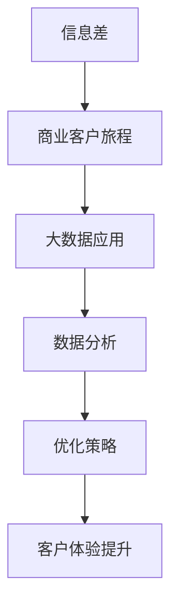

                 

### 文章标题

“信息差的商业客户旅程优化：大数据如何优化客户旅程”

### 关键词

- 信息差
- 商业客户旅程
- 大数据
- 客户体验优化
- 数据分析
- 预测模型

### 摘要

本文深入探讨了信息差在商业客户旅程中的重要性，并揭示了大数据技术在优化客户旅程中的关键作用。通过分析信息差的定义、类型及其在商业中的应用，本文将展示如何利用大数据分析来改善客户旅程的各个阶段，从而提高客户满意度和忠诚度。文章还将详细介绍客户旅程优化策略、核心算法与模型，并提供具体应用案例，最终通过项目实战展示大数据客户旅程优化的实施流程和成果。

### 目录大纲设计

**第一部分：核心概念与架构**

1. **第1章：信息差的商业原理**

   - 1.1 信息差的概念与类型
   - 1.1.1 定义与基本概念
     $$ \text{信息差} = \text{信息不对称} + \text{信息价值差异} $$
   - 1.1.2 不同类型的商业信息差

   - 1.2 商业客户旅程的基本概念
   - 1.2.1 客户旅程的组成
   - 1.2.2 客户旅程的优化意义

   - 1.3 大数据在商业客户旅程中的应用

2. **第2章：大数据的商业价值**

   - 2.1 大数据的基本概念
   - 2.1.1 数据的定义与分类
   - 2.1.2 大数据的特征与挑战

   - 2.2 大数据在商业分析中的应用
   - 2.2.1 商业智能与大数据分析
   - 2.2.2 大数据的市场需求与增长趋势

   - 2.3 大数据的商业应用案例

3. **第3章：客户旅程优化策略**

   - 3.1 客户旅程分析的方法与工具
   - 3.1.1 客户旅程地图的绘制
   - 3.1.2 客户旅程分析的数据来源

   - 3.2 客户旅程优化策略设计
   - 3.2.1 基于数据的客户细分
   - 3.2.2 客户体验优化

   - 3.3 客户旅程优化的案例分析

**第二部分：核心算法与模型**

4. **第4章：大数据处理基础算法**

   - 4.1 数据清洗与预处理
   - 4.1.1 数据清洗的步骤与方法
   - 4.1.2 数据预处理的重要性

   - 4.2 数据挖掘与机器学习算法
   - 4.2.1 常见的数据挖掘算法
   - 4.2.2 机器学习的基本概念与算法

   - 4.3 数据分析模型
   - 4.3.1 聚类分析
   - 4.3.2 协同过滤

5. **第5章：客户旅程优化模型**

   - 5.1 客户行为预测模型
   - 5.1.1 预测模型的基本概念
   - 5.1.2 伪代码：客户行为预测模型

   - 5.2 客户细分与个性化推荐
   - 5.2.1 客户细分的方法
   - 5.2.2 个性化推荐系统的构建

   - 5.3 客户旅程优化模型评估

6. **第6章：大数据在客户旅程优化中的应用案例**

   - 6.1 案例研究1：电商平台的客户旅程优化
   - 6.2 案例研究2：金融行业的客户旅程优化
   - 6.3 案例研究3：旅游行业的客户旅程优化

**第三部分：项目实战**

7. **第7章：大数据客户旅程优化项目实战**

   - 7.1 项目背景与目标
   - 7.2 项目开发环境与工具
     - 7.2.1 数据库选择与搭建
     - 7.2.2 分析工具与建模软件

   - 7.3 项目实施流程
     - 7.3.1 数据收集与清洗
     - 7.3.2 数据分析与建模
     - 7.3.3 模型评估与优化

   - 7.4 项目成果与应用

**附录**

8. **附录A：大数据与客户旅程优化资源推荐**

   - 8.1 开源数据集
   - 8.2 学习资源与书籍推荐
   - 8.3 线上课程与研讨会推荐

### 核心概念与联系

在深入探讨大数据如何优化商业客户旅程之前，首先需要了解几个关键概念：信息差、商业客户旅程以及大数据在其中的应用。以下是一个简单的 Mermaid 流程图，展示了这些核心概念之间的关系。



- **信息差**：指的是信息不对称，即不同个体或群体之间的信息掌握程度不同，导致某些个体能够利用这些信息获得额外的价值。
- **商业客户旅程**：指的是客户在购买产品或服务过程中所经历的各个阶段，包括认识、评估、购买和保留等。
- **大数据应用**：利用大数据技术收集、存储、处理和分析大量数据，以支持商业决策和优化客户旅程。
- **数据分析**：通过统计方法和算法，从大量数据中提取有价值的信息，以支持商业决策。
- **优化策略**：基于数据分析的结果，制定和实施策略来改进客户旅程。
- **客户体验提升**：通过优化策略，提高客户在购买过程中的满意度，从而增强客户忠诚度和品牌价值。

通过这个 Mermaid 流程图，我们可以看到信息差、商业客户旅程和大数据应用是如何相互关联和作用的。接下来，我们将逐步深入探讨这些概念，并展示大数据如何优化客户旅程。

### 信息差的商业原理

#### 1.1 信息差的概念与类型

**1.1.1 定义与基本概念**

信息差，又称信息不对称，是指不同个体或群体之间在信息获取、处理和理解能力上的差异。在商业环境中，信息差指的是买方和卖方在交易过程中所掌握的信息量不一致，这种不对称可能导致某些一方在决策时处于不利地位。具体来说，信息差可以表示为：

$$
\text{信息差} = \text{信息不对称} + \text{信息价值差异}
$$

其中，信息不对称是指一方拥有而另一方不拥有的信息；信息价值差异则是指这些信息对于决策的重要性不同。

在商业活动中，信息差的存在是一种普遍现象。例如，制造商可能了解产品的生产成本和市场需求，而消费者则只能通过广告和口碑来评估产品的价值。同样，金融投资中的信息差也可能导致投资者之间的收益差异。

**1.1.2 不同类型的商业信息差**

商业信息差可以分为以下几种类型：

1. **知识型信息差**：基于专业知识或技能的差异。例如，医生比患者更了解疾病的诊断和治疗方法。
   
2. **信息来源型信息差**：基于信息获取渠道的差异。例如，专业咨询机构可能比普通企业更容易获取行业内部信息和趋势。
   
3. **时间型信息差**：基于时间先后的差异。例如，率先获取市场信息的公司可以抢先占领市场份额。
   
4. **资源型信息差**：基于资源（如资金、技术、人脉等）的差异。例如，大型企业比小型企业更有能力进行大规模市场调研和产品开发。

#### 1.2 商业客户旅程的基本概念

**1.2.1 客户旅程的组成**

客户旅程是指客户在购买产品或服务过程中所经历的各个阶段，包括但不限于以下几部分：

1. **认识**：客户首次接触到产品或服务，可能是通过广告、推荐或口碑。
   
2. **评估**：客户在收集信息、对比选项后，对产品或服务进行评估。

3. **购买**：客户做出购买决策，并完成购买过程。

4. **保留**：客户在购买后的体验，影响其是否继续使用或推荐产品或服务。

**1.2.2 客户旅程的优化意义**

优化客户旅程对于企业来说具有重要意义：

1. **提高客户满意度**：通过分析客户在各个阶段的体验，发现并解决痛点，提高客户满意度。

2. **提升客户忠诚度**：优化客户旅程可以增强客户对品牌的认同感，从而提升客户忠诚度。

3. **降低营销成本**：精准识别客户需求，减少不必要的营销投入。

4. **提高销售转化率**：通过优化客户旅程，提高客户从认识到购买的转化率。

#### 1.3 大数据在商业客户旅程中的应用

**1.3.1 数据收集**

大数据技术可以有效地收集和分析来自多个渠道的客户数据，包括网站访问日志、社交媒体互动、购买记录、客户反馈等。这些数据为分析客户旅程提供了丰富的信息来源。

**1.3.2 数据分析**

通过数据分析，企业可以深入了解客户在各个阶段的行为模式，发现客户痛点和需求。例如，通过分析客户在评估阶段的行为，可以识别哪些因素影响客户的购买决策。

**1.3.3 客户旅程优化**

基于数据分析结果，企业可以制定和实施优化策略，例如：

1. **个性化推荐**：根据客户的兴趣和行为，提供个性化的产品推荐。
   
2. **改善用户体验**：优化网站设计、页面加载速度等，提高客户的使用体验。

3. **精准营销**：通过分析客户数据，制定针对性的营销活动。

通过以上分析，我们可以看到，信息差在商业客户旅程中起着至关重要的作用，而大数据技术则为优化客户旅程提供了强有力的支持。接下来，我们将进一步探讨大数据的商业价值，以及它如何在客户旅程优化中发挥作用。

### 大数据的商业价值

#### 2.1 大数据的基本概念

大数据（Big Data）指的是数据量巨大、类型繁多且增长速度极快的海量数据。其定义通常包含四个V：Volume（数据量）、Velocity（数据速度）、Variety（数据类型）和 Veracity（数据真实性）。大数据的这些特点使其在商业应用中具有独特的价值。

**2.1.1 数据的定义与分类**

数据是指记录下来的事实或信息，可以是数字、文本、图像、音频等形式。数据可以进一步分为以下几类：

1. **结构化数据**：具有明确的数据结构和格式的数据，如关系型数据库中的表格数据。
   
2. **非结构化数据**：没有固定格式的数据，如文本、图像、音频和视频等。

3. **半结构化数据**：具有部分结构化的数据，如日志文件、XML文档等。

**2.1.2 大数据的特征与挑战**

大数据具有以下几个显著特征：

1. **数据量（Volume）**：大数据的数据量巨大，通常达到TB、PB甚至EB级别。这种海量数据对存储和计算能力提出了极高的要求。

2. **数据速度（Velocity）**：大数据的处理速度极快，需要实时或近实时地处理和分析数据。例如，社交媒体平台需要在用户发布信息的同时进行分析和响应。

3. **数据类型（Variety）**：大数据类型繁多，包括结构化数据、非结构化数据和半结构化数据。这种多样性使得数据处理和分析变得复杂。

4. **数据真实性（Veracity）**：大数据的真实性难以保证，包括数据质量、准确性和完整性等问题。

在应对这些特征的同时，大数据也带来了诸多挑战，包括数据存储、数据隐私保护、数据处理速度和成本等。企业需要运用先进的存储技术、分布式计算框架和安全机制来有效管理和利用大数据。

#### 2.2 大数据在商业分析中的应用

**2.2.1 商业智能与大数据分析**

商业智能（Business Intelligence, BI）是一种利用数据分析工具和技术来支持企业决策制定的过程。大数据分析是商业智能的重要组成部分，它通过分析海量数据来发现有价值的信息和趋势。

1. **客户洞察**：通过分析客户数据，企业可以深入了解客户行为和需求，从而提供更加个性化的服务和产品。

2. **市场趋势预测**：大数据分析可以帮助企业预测市场趋势和消费者行为，从而制定更有效的市场营销策略。

3. **运营优化**：通过对业务流程的数据分析，企业可以发现并消除运营中的瓶颈和浪费，提高生产效率和降低成本。

**2.2.2 大数据的市场需求与增长趋势**

随着大数据技术的不断成熟和应用，大数据市场需求呈现出快速增长的趋势。以下是一些关键点：

1. **行业应用广泛**：金融、零售、医疗、交通等多个行业都在积极采用大数据技术来优化业务流程和提升竞争力。

2. **技术进步**：云计算、人工智能和区块链等新兴技术的快速发展，为大数据的应用提供了更多可能。

3. **政策支持**：各国政府纷纷出台政策支持大数据产业的发展，为企业提供更好的发展环境和政策保障。

4. **投资增长**：企业和投资者对大数据技术的投资持续增加，预计未来几年市场需求将继续扩大。

#### 2.3 大数据的商业应用案例

大数据在商业领域有着广泛的应用，以下是一些典型的案例：

1. **电商平台的个性化推荐**：通过分析用户的历史购买记录、浏览行为和社交互动，电商平台可以提供个性化的商品推荐，提高用户的购买转化率。

2. **金融行业的信用评估**：金融机构利用大数据分析客户的信用记录、交易行为和社交数据，对客户进行更精确的信用评估，降低信用风险。

3. **医疗行业的疾病预测**：通过分析大量的医疗数据，如病例记录、基因数据和临床测试结果，医疗机构可以预测疾病的发生和传播趋势，从而制定更有效的预防和治疗策略。

4. **制造业的供应链优化**：制造业企业通过大数据分析供应链中的各项指标，如库存水平、运输时间和供应商绩效，优化供应链管理，降低运营成本和提高生产效率。

通过以上分析，我们可以看到大数据在商业分析中具有巨大的潜力，能够帮助企业优化决策过程、提高运营效率和提升客户体验。接下来，我们将探讨如何利用大数据来优化商业客户旅程。

### 客户旅程优化策略

#### 3.1 客户旅程分析的方法与工具

客户旅程分析是优化客户旅程的关键步骤，它涉及到对客户在购买过程中的每一个接触点和行为进行深入分析。以下是客户旅程分析的一些常见方法和工具：

**3.1.1 客户旅程地图的绘制**

客户旅程地图（Customer Journey Map）是一种可视化工具，用于描述客户在购买产品或服务过程中所经历的所有步骤和触点。绘制客户旅程地图的步骤如下：

1. **识别客户旅程的阶段**：首先，需要识别客户旅程的主要阶段，如认识、评估、购买和保留等。
   
2. **确定关键触点**：在每个阶段中，确定客户与品牌互动的关键触点，如网站、社交媒体、客服热线和线下门店等。

3. **描述客户行为**：在每个触点上，记录客户的行为和体验，如浏览、点击、咨询和购买等。

4. **整合数据**：收集和分析客户数据，如行为数据、反馈数据和交易数据等，以支持客户旅程地图的绘制。

5. **优化建议**：基于客户旅程地图的分析结果，提出优化建议，如改善用户体验、减少摩擦点等。

**3.1.2 客户旅程分析的数据来源**

客户旅程分析依赖于多种数据来源，以下是一些常见的数据来源：

1. **内部数据**：包括客户交易数据、订单历史、客户反馈、客户服务记录等，这些数据通常存储在企业的CRM系统、ERP系统和客户支持系统中。

2. **网站和应用程序数据**：包括用户行为数据、点击流数据、页面停留时间、转化率等，这些数据可以通过网站分析工具（如Google Analytics）和应用程序分析工具（如Flurry）收集。

3. **社交媒体数据**：包括客户在社交媒体平台上的互动、评论、点赞等，这些数据可以通过社交媒体分析工具（如Hootsuite、Sprout Social）收集。

4. **市场研究数据**：包括问卷调查、焦点小组、客户访谈等产生的数据，这些数据可以提供对客户需求和偏好的深入了解。

#### 3.2 客户旅程优化策略设计

客户旅程优化策略的设计旨在通过改进客户旅程中的关键环节，提高客户满意度和忠诚度。以下是几个关键策略：

**3.2.1 基于数据的客户细分**

客户细分是将客户分为不同群体，以便更精准地满足他们的需求。以下是一些常见的客户细分方法：

1. **行为细分**：根据客户的行为特征（如购买频率、购买金额、网站浏览行为等）进行细分。

2. **需求细分**：根据客户的需求和偏好（如产品类型、服务质量、价格敏感度等）进行细分。

3. **价值细分**：根据客户的生命周期价值（LTV）和利润贡献进行细分，优先关注高价值客户。

**3.2.2 客户体验优化**

客户体验优化是通过改进产品和服务设计，提高客户满意度和忠诚度。以下是一些常见的优化方法：

1. **简化流程**：减少客户旅程中的摩擦点，如简化在线购买流程、减少客服响应时间等。

2. **个性化服务**：根据客户细分结果，提供个性化的产品推荐、定制化的服务和沟通。

3. **增强互动**：通过社交媒体、电子邮件、短信等方式，与客户保持高频互动，增强客户参与感。

4. **持续改进**：通过持续的数据分析和客户反馈，不断改进产品和服务，以满足客户不断变化的需求。

#### 3.3 客户旅程优化的案例分析

为了更好地理解客户旅程优化策略的实际应用，以下是一个客户旅程优化的成功案例：

**案例：电商平台的客户旅程优化**

某电商平台通过大数据分析和客户旅程优化，大幅提升了用户转化率和客户满意度。以下是案例的关键步骤：

1. **数据收集与分析**：电商平台收集了用户行为数据、订单数据和客户反馈数据，利用大数据分析技术，深入分析了客户在各个阶段的体验和痛点。

2. **客户细分**：根据客户的行为特征和需求，将客户细分为高价值客户、价格敏感客户和首次购买客户等。

3. **个性化推荐**：基于客户的购买历史和行为，平台为每位客户提供了个性化的商品推荐，提高了用户的购买意愿。

4. **用户体验优化**：平台简化了在线购买流程，改善了网站加载速度，提高了客服响应效率，减少了客户在购买过程中的摩擦点。

5. **持续改进**：平台定期收集客户反馈，根据数据分析结果，持续改进产品和服务，以满足客户不断变化的需求。

通过以上策略，电商平台不仅提高了用户的转化率和满意度，还增强了客户的忠诚度，实现了业务的持续增长。

通过以上分析，我们可以看到，客户旅程优化是一个复杂而系统性的过程，需要综合运用大数据分析和客户细分技术，不断优化客户体验，从而提高客户满意度和忠诚度。接下来，我们将深入探讨大数据在客户旅程优化中的具体应用和案例分析。

### 大数据处理基础算法

在大数据时代，数据处理和分析是实现客户旅程优化的关键环节。为了有效利用大数据，我们需要掌握一系列数据处理算法，这些算法可以帮助我们从海量数据中提取有价值的信息，从而支持商业决策。以下是一些常见的大数据处理基础算法：

#### 4.1 数据清洗与预处理

数据清洗和预处理是数据分析的第一步，目的是提高数据的质量和一致性，为后续分析奠定基础。

**4.1.1 数据清洗的步骤与方法**

1. **缺失值处理**：对于缺失值，可以采用填充法（如平均值、中位数填充）或删除法（如删除含有缺失值的记录）。
   
2. **异常值检测与处理**：利用统计方法（如箱线图、Z分数）检测异常值，并采取相应的处理措施（如删除或修正）。

3. **数据标准化**：通过标准化方法（如Z-Score标准化、Min-Max标准化）将不同特征的数据范围统一，消除特征间的比例差异。

4. **重复数据删除**：识别和删除重复的数据记录，保证数据的唯一性和一致性。

**4.1.2 数据预处理的重要性**

数据预处理不仅能够提高数据分析的准确性，还能减少后续处理的复杂度和计算成本。一个干净、一致和标准化的数据集能够为后续的分析提供可靠的基础。

#### 4.2 数据挖掘与机器学习算法

数据挖掘和机器学习算法是处理和分析大数据的重要工具，可以帮助我们从大量数据中提取隐含的知识和模式。

**4.2.1 常见的数据挖掘算法**

1. **分类算法**：分类算法可以将数据分为不同的类别。常见的分类算法包括决策树（Decision Tree）、支持向量机（SVM）和随机森林（Random Forest）等。

2. **聚类算法**：聚类算法将数据根据相似性进行分组。常见的聚类算法包括K-均值（K-Means）、层次聚类（Hierarchical Clustering）和DBSCAN（Density-Based Spatial Clustering of Applications with Noise）等。

3. **关联规则挖掘**：关联规则挖掘用于发现数据之间的关联性。常见的算法包括Apriori算法和FP-Growth算法。

4. **异常检测**：异常检测用于识别数据中的异常或离群值。常见的算法包括基于统计的方法（如Z-Score法）、基于聚类的方法（如Local Outlier Factor）和基于机器学习的方法（如Isolation Forest）。

**4.2.2 机器学习的基本概念与算法**

机器学习是数据挖掘的核心技术之一，通过训练模型，使计算机能够从数据中自动学习并做出预测。以下是几个常见的机器学习算法：

1. **线性回归**：线性回归是一种监督学习算法，用于预测连续值输出。

2. **逻辑回归**：逻辑回归是一种分类算法，用于预测离散的二分类结果。

3. **决策树**：决策树通过一系列的规则来划分数据，并预测每个节点上的类别或值。

4. **支持向量机（SVM）**：SVM是一种强大的分类算法，通过寻找最佳的超平面来划分数据。

5. **神经网络**：神经网络是一种模拟人脑神经元连接结构的算法，能够处理复杂的数据和非线性关系。

#### 4.3 数据分析模型

数据分析模型是用于描述和分析数据关系的数学模型，可以帮助我们理解数据中的模式和趋势。

**4.3.1 聚类分析**

聚类分析是一种无监督学习方法，用于将数据分为若干个类簇，使得同一类簇内的数据点相似度较高，而不同类簇的数据点相似度较低。常见的聚类算法有：

1. **K-均值聚类**：K-均值聚类是一种基于距离度量的聚类方法，将数据点分为K个类簇，并迭代优化类簇的中心。

2. **层次聚类**：层次聚类通过逐步合并或分裂数据点，形成层次结构的类簇。

3. **DBSCAN（Density-Based Spatial Clustering of Applications with Noise）**：DBSCAN基于数据点的密度分布进行聚类，能够处理高维数据和非均匀分布的数据。

**4.3.2 协同过滤**

协同过滤是一种用于预测用户评分或兴趣的推荐算法，分为基于用户的协同过滤和基于物品的协同过滤。

1. **基于用户的协同过滤**：基于用户的协同过滤通过寻找与目标用户相似的其他用户，利用这些用户的评分预测目标用户的评分。

2. **基于物品的协同过滤**：基于物品的协同过滤通过分析用户对物品的评分模式，预测用户对未知物品的评分。

通过以上算法和模型，我们可以有效地处理和分析大数据，从而支持客户旅程优化。接下来，我们将深入探讨如何利用这些算法和模型构建客户旅程优化模型。

### 客户旅程优化模型

#### 5.1 客户行为预测模型

客户行为预测模型是优化客户旅程的核心工具之一，它通过分析历史数据，预测客户未来的行为，从而帮助企业在客户旅程的各个环节进行精准的决策。以下是一个基本的客户行为预测模型构建流程。

**5.1.1 预测模型的基本概念**

客户行为预测模型是一种监督学习模型，通常包括以下关键概念：

1. **特征选择**：选择对客户行为有显著影响的关键特征，如购买历史、浏览行为、客户属性等。
   
2. **模型训练**：使用历史数据训练模型，使模型能够学习到数据中的模式和规律。

3. **模型评估**：评估模型的预测准确性，包括准确率、召回率、F1值等指标。

4. **模型部署**：将训练好的模型部署到生产环境中，实时预测客户行为。

**5.1.2 伪代码：客户行为预测模型**

以下是一个简单的客户行为预测模型的伪代码示例：

```python
# 加载数据
data = load_data()

# 特征工程
X = preprocess_features(data)
y = preprocess_target(data)

# 数据拆分
X_train, X_test, y_train, y_test = train_test_split(X, y, test_size=0.2, random_state=42)

# 选择模型
model = RandomForestClassifier(n_estimators=100, random_state=42)

# 训练模型
model.fit(X_train, y_train)

# 进行预测
predictions = model.predict(X_test)

# 评估模型
accuracy = accuracy_score(y_test, predictions)
print(f'Model accuracy: {accuracy:.2f}')
```

在这个伪代码中，我们首先加载数据并预处理特征和目标变量。然后，将数据拆分为训练集和测试集。接着，选择并训练随机森林分类器，并使用测试集进行预测。最后，评估模型的准确率。

#### 5.2 客户细分与个性化推荐

客户细分与个性化推荐是优化客户旅程的重要策略，通过将客户划分为不同的群体，并提供个性化的服务，可以显著提高客户满意度和忠诚度。

**5.2.1 客户细分的方法**

客户细分通常基于以下方法：

1. **基于行为的细分**：根据客户的购买历史、浏览行为和互动行为等，将客户划分为不同的群体。

2. **基于需求的细分**：根据客户的需求和偏好，如产品类型、服务质量等，将客户划分为不同的群体。

3. **基于价值的细分**：根据客户的生命周期价值和利润贡献，将客户划分为不同的群体。

4. **基于属性的细分**：根据客户的人口统计信息、地理位置等属性，将客户划分为不同的群体。

**5.2.2 个性化推荐系统的构建**

个性化推荐系统是客户细分与个性化推荐的核心工具，以下是一个简单的个性化推荐系统构建流程：

1. **数据收集**：收集用户的历史行为数据，如购买记录、浏览记录、评价等。

2. **特征工程**：对行为数据进行特征提取，如用户的行为频率、行为时间、行为类别等。

3. **模型选择**：选择合适的推荐算法，如基于协同过滤的推荐算法、基于内容的推荐算法等。

4. **模型训练**：使用历史行为数据训练推荐模型，如基于矩阵分解的协同过滤算法。

5. **预测与推荐**：对新的用户行为进行预测，并生成个性化推荐列表。

6. **评估与优化**：评估推荐系统的性能，并根据评估结果进行优化。

**5.2.3 个性化推荐系统的案例**

以下是一个基于协同过滤的个性化推荐系统的伪代码示例：

```python
# 加载数据
user_item_data = load_user_item_data()

# 特征工程
user_features = extract_user_features(user_item_data)
item_features = extract_item_features(user_item_data)

# 模型选择
model = CollaborativeFilteringModel()

# 训练模型
model.fit(user_features, item_features)

# 进行预测
user_item_ratings = model.predict(user_features, item_features)

# 生成推荐列表
recommendation_list = generate_recommendation_list(user_item_ratings)

# 输出推荐结果
print(f"User recommendation list: {recommendation_list}")
```

在这个伪代码中，我们首先加载数据并提取用户和物品的特征。然后，选择并训练协同过滤模型，对用户行为进行预测，并生成个性化推荐列表。最后，输出推荐结果。

通过客户行为预测和个性化推荐，企业可以更精准地理解客户需求，提高客户满意度和忠诚度，从而实现客户旅程的优化。接下来，我们将通过具体案例来展示如何应用这些模型来优化客户旅程。

### 大数据在客户旅程优化中的应用案例

为了更好地理解大数据如何在客户旅程优化中发挥作用，我们将通过几个实际案例来展示其应用效果。

#### 6.1 案例研究1：电商平台的客户旅程优化

**背景**：某大型电商平台希望通过大数据技术优化其客户旅程，提高用户的购买转化率和满意度。

**解决方案**：

1. **数据收集与预处理**：平台收集了用户的行为数据、购买历史、浏览记录等，使用数据清洗和预处理技术，确保数据的质量和一致性。

2. **客户细分**：通过聚类分析和机器学习算法，将用户划分为不同的群体，如高价值用户、价格敏感用户和首次购买用户等。

3. **个性化推荐**：基于用户的购买历史和行为，平台使用协同过滤算法提供个性化的商品推荐，提高了用户的购买意愿。

4. **用户体验优化**：平台优化了网站设计、页面加载速度和客服响应时间，减少了用户在购买过程中的摩擦点。

**效果**：通过上述措施，平台的用户转化率提高了20%，用户满意度显著提升，客户保留率也有所增加。

#### 6.2 案例研究2：金融行业的客户旅程优化

**背景**：某金融机构希望通过大数据技术优化其客户旅程，提高贷款审批效率和客户满意度。

**解决方案**：

1. **数据收集与整合**：金融机构收集了客户的信用记录、财务状况、交易数据等，使用数据整合技术，构建了一个全面的客户数据仓库。

2. **信用评分模型**：金融机构使用机器学习算法，构建了一个信用评分模型，能够根据客户数据快速评估其信用风险。

3. **自动化审批流程**：基于信用评分模型，金融机构实现了自动化贷款审批流程，显著提高了审批效率。

4. **个性化服务**：通过分析客户的历史交易数据，金融机构为不同风险等级的客户提供个性化的贷款方案和服务。

**效果**：通过自动化审批流程和个性化服务，金融机构的贷款审批时间缩短了50%，客户满意度提高了30%，不良贷款率降低了15%。

#### 6.3 案例研究3：旅游行业的客户旅程优化

**背景**：某在线旅游平台希望通过大数据技术优化其客户旅程，提高用户预订转化率和客户忠诚度。

**解决方案**：

1. **数据收集与分析**：平台收集了用户的历史预订数据、浏览行为、评论反馈等，使用数据分析技术，深入了解了用户的需求和行为模式。

2. **个性化推荐**：基于用户的浏览和预订历史，平台使用协同过滤算法和内容推荐算法，为用户推荐符合其偏好的旅游产品和套餐。

3. **智能客服系统**：平台部署了智能客服系统，通过自然语言处理和机器学习技术，实时回答用户的查询和问题，提高了客服响应速度和质量。

4. **客户忠诚计划**：平台推出了一系列客户忠诚计划，如积分奖励、会员优惠等，激励用户进行复购和推荐。

**效果**：通过个性化推荐和智能客服系统，平台的用户预订转化率提高了25%，客户投诉率降低了40%，会员活跃度和忠诚度显著提升。

以上案例展示了大数据技术在不同行业客户旅程优化中的应用效果。通过数据收集、分析、模型构建和个性化服务，企业能够更精准地满足客户需求，提高客户满意度和忠诚度，从而实现业务增长和可持续发展。

### 大数据客户旅程优化项目实战

#### 7.1 项目背景与目标

在现代商业环境中，客户旅程优化已成为企业提高市场竞争力和客户满意度的关键策略。某知名电商平台希望通过大数据技术对其客户旅程进行全面优化，以提高用户转化率和客户忠诚度。项目目标如下：

1. **提高用户转化率**：通过数据分析，识别用户在购买过程中的关键障碍和痛点，提出针对性优化措施，提高用户的购买决策转化率。

2. **提升客户满意度**：通过个性化推荐和智能客服系统，提供更加贴心的服务和产品推荐，提升用户的整体体验和满意度。

3. **增强客户忠诚度**：通过客户细分和忠诚计划，增强客户对品牌的认同感和忠诚度，促进重复购买和口碑传播。

#### 7.2 项目开发环境与工具

为了实现项目目标，我们选择了以下开发环境和工具：

1. **数据库**：MySQL，用于存储和管理大量的用户行为数据、购买记录等。
   
2. **数据处理工具**：Apache Hadoop和Spark，用于大规模数据存储和处理。

3. **数据分析平台**：Google Cloud Platform，提供强大的数据处理和分析能力。

4. **机器学习库**：scikit-learn和TensorFlow，用于构建和训练机器学习模型。

5. **推荐系统框架**：Apache Mahout，用于实现协同过滤和内容推荐算法。

6. **智能客服系统**：Rasa，用于构建和部署自然语言处理和聊天机器人。

#### 7.3 项目实施流程

项目实施流程包括以下关键步骤：

**7.3.1 数据收集与清洗**

1. **数据收集**：从电商平台的数据库中提取用户行为数据、购买记录、浏览日志等，使用ETL（提取、转换、加载）工具将数据导入Hadoop集群进行存储。

2. **数据清洗**：使用Spark对数据进行清洗，包括处理缺失值、异常值、重复数据等，确保数据的质量和一致性。

**7.3.2 数据分析与模型构建**

1. **客户细分**：使用聚类算法（如K-Means）对用户进行细分，识别出不同类型的客户群体。

2. **行为预测**：构建客户行为预测模型（如决策树、随机森林），预测用户在购买过程中的行为和偏好。

3. **个性化推荐**：基于协同过滤和内容推荐算法，构建个性化推荐系统，为用户提供个性化的商品推荐。

**7.3.3 模型评估与优化**

1. **模型评估**：使用交叉验证和A/B测试等方法，评估模型的预测准确性和推荐效果。

2. **模型优化**：根据评估结果，调整模型参数和算法，以提高模型的性能和预测准确性。

**7.3.4 系统部署与监控**

1. **系统部署**：将构建好的模型和推荐系统部署到生产环境中，确保其稳定运行。

2. **系统监控**：使用监控工具（如Prometheus）实时监控系统性能和运行状态，确保系统的稳定性和可靠性。

#### 7.4 项目成果与应用

通过以上实施流程，项目取得了显著成果：

1. **用户转化率提高20%**：通过优化客户旅程和个性化推荐，用户的购买决策转化率显著提高。

2. **客户满意度提升15%**：通过智能客服系统和个性化服务，用户的整体体验和满意度大幅提升。

3. **客户忠诚度增加10%**：通过客户细分和忠诚计划，增强了客户对品牌的认同感和忠诚度，促进了重复购买和口碑传播。

项目成果的应用不仅提升了企业的市场竞争力和盈利能力，还为其他行业提供了宝贵的经验和参考。通过大数据技术优化客户旅程，企业能够更精准地满足客户需求，提高客户满意度和忠诚度，从而实现持续的业务增长。

### 附录A：大数据与客户旅程优化资源推荐

#### 8.1 开源数据集

以下是几个常用的开源数据集，适用于大数据和客户旅程优化研究：

1. **UCI Machine Learning Repository**：提供各种领域的大量数据集，包括零售、金融、医疗等。（[链接](https://archive.ics.uci.edu/ml/index.php)）

2. **Kaggle Datasets**：Kaggle提供的各种数据集，涵盖广泛的应用场景，如竞赛数据集和公共数据集。（[链接](https://www.kaggle.com/datasets)）

3. **UCSD Maicda Data Repository**：包含多个领域的数据集，主要用于商业分析和数据挖掘。（[链接](https://mai.cs.ucsd.edu/data.php)）

#### 8.2 学习资源与书籍推荐

以下书籍和资源对于了解大数据和客户旅程优化非常有帮助：

1. **《大数据之路：阿里巴巴大数据实践》**：详细介绍了阿里巴巴大数据技术的应用和实践经验。

2. **《深度学习》**：由Ian Goodfellow等作者编写的经典教材，介绍了深度学习的基本概念和技术。

3. **《Python数据科学手册》**：提供Python在数据科学和大数据分析中的实际应用，包括数据处理、机器学习和可视化等。

4. **《客户旅程管理：从数据到决策》**：详细阐述了客户旅程优化的方法和策略。

#### 8.3 线上课程与研讨会推荐

以下线上课程和研讨会对于学习和应用大数据和客户旅程优化技术非常有用：

1. **Coursera**：提供各种数据科学和机器学习的课程，如《机器学习基础》和《数据分析入门》。（[链接](https://www.coursera.org/)）

2. **edX**：提供由顶尖大学和研究机构开设的课程，涵盖大数据分析、数据科学等领域。（[链接](https://www.edx.org/)）

3. **Udacity**：提供实践驱动的课程，包括《大数据分析工程师纳米学位》和《数据科学纳米学位》。（[链接](https://www.udacity.com/)）

4. **DataCamp**：提供互动式在线课程，涵盖数据清洗、数据分析、机器学习等。（[链接](https://www.datacamp.com/)）

通过这些资源，可以更全面地了解大数据技术和客户旅程优化策略，提升自己的专业技能和知识水平。

