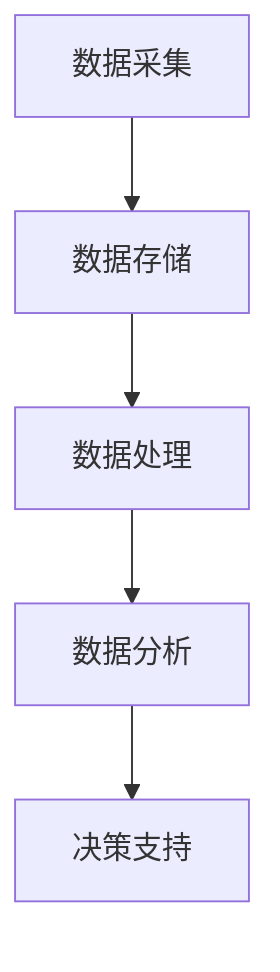
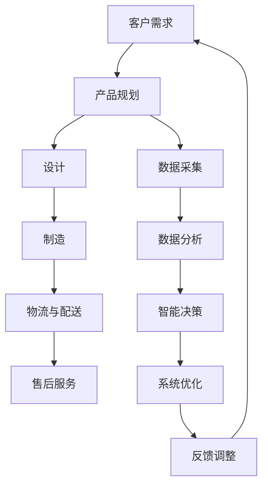

                 

## 信息差：大数据在智能制造中的应用

关键词：智能制造、大数据、数据分析、应用案例、挑战与未来

摘要：本文旨在探讨大数据在智能制造中的应用，通过分析信息差的概念、大数据技术基础以及具体应用案例，探讨大数据如何优化制造流程、提升产品质量、改善供应链管理。同时，本文将分析大数据在智能制造中的挑战与未来发展趋势，为企业提供战略调整与转型建议。

### 目录大纲

1. **第一部分：引言**
   1.1 书籍背景与目的
   1.2 信息差的概念
2. **第二部分：大数据技术基础**
   2.1 大数据概述
   2.2 数据采集与存储
   2.3 数据处理与分析
3. **第三部分：大数据在智能制造中的应用**
   3.1 智能制造与大数据的关系
   3.2 制造流程中的应用
   3.3 供应链管理中的应用
4. **第四部分：案例分析**
   4.1 汽车制造
   4.2 电子制造
   4.3 食品制造
5. **第五部分：挑战与未来**
   5.1 应用挑战
   5.2 未来发展
6. **附录**
   6.1 参考资料
   6.2 核心概念与联系
   6.3 核心算法原理讲解
   6.4 数学模型和公式
   6.5 项目实战
   6.6 未来展望

---

### 第一部分：引言

#### 1.1 书籍背景与目的

随着全球制造业的转型升级，智能制造已成为未来工业发展的重要方向。智能制造通过信息技术与制造技术的深度融合，实现了生产过程的自动化、智能化和个性化。在这一背景下，大数据技术作为一种重要的信息资源，逐渐成为推动智能制造发展的重要力量。

本书旨在探讨大数据在智能制造中的应用，帮助读者深入了解大数据技术的基础知识，理解信息差的概念，分析大数据在制造流程、供应链管理等方面的具体应用，并通过实际案例分析，展示大数据如何优化制造流程、提升产品质量、改善供应链管理。此外，本书还将探讨大数据在智能制造中的挑战与未来发展趋势，为企业提供战略调整与转型建议。

#### 1.2 信息差的概念

信息差是指由于信息不对称而导致的收益差异。在商业活动中，信息差是一种重要的竞争优势，企业可以通过获取和利用信息优势来获得更高的利润。大数据技术为企业和个人提供了丰富的信息资源，使得信息差的概念在智能制造中具有重要意义。

信息差在智能制造中的应用主要体现在以下几个方面：

1. **生产决策优化**：通过大数据分析，企业可以获取更全面、准确的生产数据，从而优化生产决策，降低生产成本，提高生产效率。

2. **产品质量提升**：大数据技术可以帮助企业实现产品质量的实时监控和预测，提前发现潜在问题，从而提升产品质量。

3. **供应链管理**：通过大数据分析，企业可以优化供应链管理，实现库存优化、物流调度和需求预测，提高供应链的协同效率。

4. **市场分析**：大数据技术可以帮助企业进行市场分析，了解消费者需求，调整产品策略，提高市场竞争力。

---

在下一部分，我们将深入探讨大数据技术的基础知识，为后续内容的讨论打下坚实的基础。

### 第一部分：引言

#### 1.3 大数据在智能制造中的重要性

大数据在智能制造中的应用具有极其重要的意义。首先，大数据能够为智能制造提供全面、准确和实时的数据支持，使得企业能够对生产过程进行精细化管理。通过大数据分析，企业可以了解生产过程中的每一个环节，从原材料采购、生产制造到物流配送，从而实现全链条的优化。

#### 1.3.1 数据采集与监控

大数据技术的核心在于数据采集与监控。在生产过程中，企业可以利用传感器、机器设备、物联网等手段，实时采集生产数据。这些数据包括但不限于设备状态、生产效率、能源消耗、物料使用情况等。通过对这些数据的实时监控，企业可以及时发现生产过程中的异常情况，并迅速采取措施进行调整。

例如，某汽车制造企业通过安装传感器，实时监测生产线的设备状态。当发现某台设备出现异常时，系统会立即发出警报，并通知生产管理人员进行检查和维修。这种实时监控不仅提高了设备利用率，还减少了因设备故障而导致的生产延误。

#### 1.3.2 数据分析与优化

大数据分析是智能制造的关键环节。通过对采集到的数据进行分析，企业可以挖掘数据中的价值，为生产决策提供科学依据。例如，通过分析生产数据，企业可以发现生产过程中的瓶颈环节，从而进行优化调整。此外，大数据分析还可以用于预测产品质量问题，提前采取措施，避免质量问题的发生。

例如，某电子产品制造企业通过对生产数据进行分析，发现某道工序的生产效率较低，并且产品的不良率较高。通过深入分析，企业发现该工序的设备老化严重，导致生产效率下降。于是，企业决定更换新的设备，并加强员工的培训，从而显著提高了生产效率和产品质量。

#### 1.3.3 供应链协同与优化

大数据技术还可以用于优化供应链管理。通过大数据分析，企业可以更好地掌握供应链各个环节的信息，实现供应链的协同优化。例如，通过对销售数据、库存数据和物流数据进行分析，企业可以优化库存策略，减少库存成本，同时确保生产物料供应的及时性。

例如，某食品制造企业通过对销售数据进行分析，发现某款产品的市场需求波动较大。通过进一步分析，企业发现这是由于物流配送的不及时导致的。于是，企业决定优化物流配送策略，提高配送效率，从而更好地满足市场需求。

#### 1.3.4 智能决策与自动化

大数据技术不仅能够帮助企业优化生产流程和供应链管理，还可以支持智能决策和自动化。通过大数据分析和人工智能技术，企业可以实现生产过程的自动化和智能化，提高生产效率和产品质量。

例如，某家电制造企业通过引入大数据分析和人工智能技术，实现了生产线的自动化控制。生产线上的机器人通过实时分析生产数据，自动调整生产参数，确保产品质量的稳定性和一致性。同时，生产线的自动化控制也减少了人为干预，降低了生产成本。

#### 1.3.5 提升市场竞争力

大数据技术在智能制造中的应用，不仅能够提升企业的内部管理水平和生产效率，还可以提升企业的市场竞争力。通过大数据分析，企业可以更好地了解市场需求和消费者行为，制定更精准的市场策略，提高市场占有率。

例如，某家居制造企业通过大数据分析，发现消费者对家居产品的个性化需求逐渐增加。于是，企业推出了定制化家居产品，满足了消费者的个性化需求，获得了市场的广泛认可。

综上所述，大数据在智能制造中的应用具有极其重要的意义。通过大数据技术，企业可以优化生产流程、提升产品质量、改善供应链管理，实现智能决策和自动化，从而提升市场竞争力。在下一部分，我们将深入探讨大数据技术的基础知识，为后续内容的讨论打下坚实的基础。

### 第一部分：引言

#### 1.4 书籍的目标与结构

本书的目标是全面探讨大数据在智能制造中的应用，旨在帮助读者深入了解大数据技术的基础知识，理解信息差的概念，并掌握大数据在制造流程、供应链管理等方面的具体应用。同时，本书还将分析大数据在智能制造中的挑战与未来发展趋势，为企业提供战略调整与转型建议。

本书的结构如下：

1. **第一部分：引言**  
   本章主要介绍书籍的背景、目的和结构，并对大数据在智能制造中的重要性进行简要概述。

2. **第二部分：大数据技术基础**  
   本章将详细介绍大数据技术的基础知识，包括大数据的定义、特征、发展历程和应用领域。

3. **第三部分：大数据在智能制造中的应用**  
   本章将深入探讨大数据在智能制造中的应用，从制造流程、供应链管理等方面进行具体分析。

4. **第四部分：案例分析**  
   本章将选取多个实际案例，分析大数据在智能制造中的应用效果，为读者提供实践参考。

5. **第五部分：挑战与未来**  
   本章将探讨大数据在智能制造中的应用挑战和未来发展，为企业提供战略调整与转型建议。

通过本书的阅读，读者将能够：

- 全面了解大数据技术的基础知识。
- 深入理解信息差的概念及其在智能制造中的应用。
- 掌握大数据在制造流程、供应链管理等方面的具体应用方法。
- 了解大数据在智能制造中的挑战与未来发展趋势。

本书结构清晰，内容丰富，旨在为读者提供一部全面、系统的指导性书籍，帮助读者深入理解大数据在智能制造中的应用，为企业的数字化转型提供有力支持。

### 第一部分：引言

#### 1.5 信息差的概念

信息差是指由于信息不对称而导致的收益差异。在商业活动中，信息差是一种重要的竞争优势，企业可以通过获取和利用信息优势来获得更高的利润。在智能制造领域，信息差的概念同样具有重要意义。

#### 1.5.1 信息差的来源

信息差的来源可以归结为以下几个方面：

1. **数据采集与处理能力**：企业能够采集和处理的数据越多，越全面，其在决策时就越具有优势。大数据技术为企业和个人提供了丰富的信息资源，使得信息差的形成更加容易。

2. **市场研究与分析能力**：企业通过对市场数据进行分析，可以了解市场需求、消费者行为等关键信息，从而制定更精准的市场策略。

3. **技术与创新能力**：企业具备较高的技术水平和创新能力，可以更快地掌握新技术、新产品，从而在市场竞争中占据优势。

4. **网络与资源整合能力**：企业能够有效地整合网络资源和合作伙伴，实现优势互补，形成强大的竞争优势。

#### 1.5.2 信息差的应用

在智能制造领域，信息差的应用主要体现在以下几个方面：

1. **生产决策优化**：企业通过大数据分析，可以获取更全面、准确的生产数据，从而优化生产决策，降低生产成本，提高生产效率。

2. **产品质量提升**：企业通过大数据分析，可以实时监控产品质量，预测潜在问题，提前采取措施，提升产品质量。

3. **供应链管理**：企业通过大数据分析，可以优化供应链管理，实现库存优化、物流调度和需求预测，提高供应链的协同效率。

4. **市场分析**：企业通过大数据分析，可以了解消费者需求，调整产品策略，提高市场竞争力。

#### 1.5.3 信息差的意义

信息差在智能制造领域具有重要意义：

1. **提升竞争力**：通过信息差，企业可以更好地了解市场和消费者需求，制定更精准的战略，提高市场竞争力。

2. **优化资源配置**：企业通过大数据分析，可以更有效地配置资源，降低成本，提高效益。

3. **创新驱动发展**：信息差可以促使企业不断进行技术创新和产品创新，推动智能制造的深入发展。

4. **实现可持续发展**：通过信息差，企业可以更好地应对市场变化，实现可持续发展。

在下一部分，我们将深入探讨大数据技术的基础知识，为后续内容的讨论打下坚实的基础。

### 第一部分：引言

#### 1.6 本书的内容与结构

本书分为五个主要部分，旨在系统地探讨大数据在智能制造中的应用，帮助读者从理论到实践全面了解这一领域的最新发展。

**第一部分：引言**
- 本章介绍了本书的背景、目的与结构。通过引言部分，读者可以对全书的内容有一个整体的把握。

**第二部分：大数据技术基础**
- **2.1 大数据概述**：本章将详细解释大数据的定义、特征及其发展历程，并探讨大数据在不同领域的应用。
- **2.2 数据采集与存储**：本章将介绍数据采集的方法与工具，以及大数据存储的技术选择和解决方案。
- **2.3 数据处理与分析**：本章将探讨数据处理的基本步骤、分析方法以及数据挖掘技术的应用。

**第三部分：大数据在智能制造中的应用**
- **3.1 智能制造与大数据的关系**：本章将分析智能制造的定义与发展趋势，以及大数据在其中的关键作用。
- **3.2 制造流程中的应用**：本章将深入探讨大数据在制造流程中的具体应用，如数据采集、流程优化、质量监控等。
- **3.3 供应链管理中的应用**：本章将探讨大数据在供应链管理中的重要作用，包括需求预测、库存优化、物流调度等。

**第四部分：案例分析**
- **4.1 案例一：大数据在汽车制造中的应用**：本章将分析大数据在汽车制造中的实际案例，包括数据采集与分析、应用效果与启示。
- **4.2 案例二：大数据在电子制造中的应用**：本章将探讨大数据在电子制造中的应用，通过案例分析展示其实际效果。
- **4.3 案例三：大数据在食品制造中的应用**：本章将分析大数据在食品制造中的应用，探讨其对生产流程和质量管理的影响。

**第五部分：挑战与未来**
- **5.1 大数据在智能制造中的应用挑战**：本章将探讨大数据在智能制造中面临的挑战，包括数据安全、数据质量、人才短缺等。
- **5.2 大数据在智能制造中的未来发展**：本章将分析大数据在智能制造中的发展趋势，以及技术创新和战略调整的方向。

通过本书的阅读，读者将能够：
1. 全面掌握大数据技术的基础知识；
2. 深入理解信息差的概念及其在智能制造中的应用；
3. 掌握大数据在制造流程和供应链管理中的具体应用方法；
4. 了解大数据在智能制造中的挑战与未来发展趋势。

### 第二部分：大数据技术基础

#### 2.1 大数据概述

大数据是指规模庞大、类型多样、生成速度极快的数据集合。与传统数据相比，大数据具有以下四个关键特征，常被称为“4V”特征：

1. **Volume（数据量）**：大数据的规模远远超过传统数据处理系统的处理能力。数据量可以从数百万条记录到数百万亿条记录不等。
2. **Velocity（速度）**：大数据的生成速度非常快，需要实时或近实时地处理和分析。例如，社交媒体平台每秒产生的数据量巨大，需要快速处理以获得实时洞察。
3. **Variety（多样性）**：大数据来源广泛，形式多样，包括结构化数据、半结构化数据和非结构化数据。结构化数据如关系数据库中的数据，半结构化数据如XML、JSON等，非结构化数据如文本、图像、音频和视频等。
4. **Veracity（真实性）**：大数据的真实性或可信度是另一个关键特征。由于数据的来源和生成方式多样，大数据中可能存在错误、不完整或误导性的信息。

#### 2.1.1 大数据的定义与特征

大数据的定义可以从多个角度进行阐述：

- **技术角度**：大数据指的是通过传统的数据处理工具难以高效管理和分析的数据集。
- **业务角度**：大数据是企业通过收集、整合和分析海量数据来获取洞察和业务价值的过程。
- **学术角度**：大数据研究涉及到数据管理、数据挖掘、机器学习和数据可视化等领域的交叉学科。

大数据的4V特征具体如下：

1. **Volume**：大数据的数据量通常超过TB甚至PB级别。例如，互联网巨头如Google每天处理的数据量超过EB级别。
2. **Velocity**：大数据的处理需要快速响应。例如，金融机构需要实时处理交易数据，确保交易的安全和合规。
3. **Variety**：大数据的多样性使得数据类型复杂多样，需要多种数据处理技术来整合和分析。
4. **Veracity**：大数据的真实性包括数据的质量和可信度，是数据分析成功的关键。

#### 2.1.2 大数据的发展历程

大数据的概念并非一蹴而就，而是经历了多年的发展和演变：

1. **早期阶段（1980s-1990s）**：数据库技术的发展为数据管理奠定了基础。关系数据库管理系统（RDBMS）如Oracle、MySQL等成为主流。
2. **互联网时代（2000s）**：随着互联网的普及，数据生成速度和规模显著增加。日志文件、网络流量、社交媒体数据等成为新的数据源。
3. **云计算时代（2010s）**：云计算的兴起为大数据处理提供了基础设施支持。Hadoop、Spark等分布式计算框架的出现，使得大数据处理变得更加高效和便捷。
4. **人工智能时代（2020s）**：大数据与人工智能技术的融合，进一步推动了大数据的应用和扩展。机器学习、深度学习等技术使得从大数据中提取价值变得更加容易。

#### 2.1.3 大数据的应用领域

大数据的应用领域非常广泛，涵盖了多个行业和领域：

1. **金融行业**：大数据在金融领域的应用包括信用评分、风险控制、市场预测等。例如，银行通过大数据分析来识别欺诈行为，保险公司通过大数据来预测风险。
2. **医疗健康**：大数据在医疗健康领域的应用包括疾病预测、个性化医疗、药物研发等。例如，通过分析海量电子健康记录，医生可以更准确地诊断疾病。
3. **零售业**：大数据在零售行业的应用包括消费者行为分析、库存管理、定价策略等。零售商通过大数据分析来优化供应链，提高销售业绩。
4. **智能制造**：大数据在智能制造领域的应用包括生产过程优化、质量监控、供应链管理等。例如，通过大数据分析，制造企业可以实时监控生产设备状态，预测故障，提高生产效率。
5. **公共管理**：大数据在公共管理领域的应用包括城市治理、交通管理、环境保护等。例如，通过大数据分析，政府可以更有效地管理城市资源，提高公共服务的效率。
6. **社交媒体**：大数据在社交媒体领域的应用包括用户行为分析、广告投放、内容推荐等。例如，社交媒体平台通过大数据分析来了解用户偏好，提供个性化的内容推荐。

#### 2.1.4 大数据的重要性

大数据的重要性体现在以下几个方面：

1. **数据驱动决策**：大数据提供了丰富的信息资源，使得企业能够基于数据做出更加准确和科学的决策。
2. **业务价值挖掘**：大数据分析可以帮助企业发现新的业务机会，优化现有业务流程，提高运营效率。
3. **竞争优势**：大数据技术为企业提供了强大的竞争优势，使得企业能够在市场中脱颖而出。
4. **创新推动**：大数据的广泛应用推动了技术创新和产业升级，促进了数字经济的发展。
5. **社会影响**：大数据在医疗、教育、环保等领域的应用，对社会的进步和发展产生了深远影响。

总之，大数据技术已成为现代工业和社会的重要驱动力，其在智能制造中的应用正在不断拓展和深化。在下一部分，我们将进一步探讨大数据的采集与存储技术，为读者提供更全面的了解。

### 第二部分：大数据技术基础

#### 2.2 数据采集与存储

数据采集与存储是大数据技术中至关重要的一环，它决定了数据的质量和可访问性。在这一部分，我们将详细探讨数据采集的方法与工具，以及大数据存储的选择与技术。

#### 2.2.1 数据采集的方法与工具

数据采集是大数据处理的第一步，其质量直接影响到后续的数据分析和应用效果。以下是几种常见的数据采集方法和工具：

1. **传感器采集**：传感器是数据采集的一种常见手段，可以用于实时监测和记录环境参数、设备状态等。例如，工业生产中的温度传感器、压力传感器和振动传感器可以实时记录生产过程中的关键数据。

2. **物联网设备**：物联网（IoT）设备如智能手表、智能家居设备等，可以通过无线网络将数据传输到数据中心。这些设备可以采集各种环境数据、用户行为数据等。

3. **Web数据采集**：Web数据采集是指通过爬虫或API等方式从互联网上获取数据。这种方式可以获取用户行为数据、社交媒体数据等。

4. **日志文件**：日志文件是许多应用程序和系统默认生成的数据记录，包括用户操作记录、错误记录等。通过分析日志文件，可以了解系统的运行状况和用户行为。

5. **数据库采集**：从现有的数据库系统中提取数据是数据采集的一种方式。这可以通过数据库连接工具、ETL（提取、转换、加载）工具等实现。

**工具示例：**

- **传感器采集工具**：如西门子的MindSphere、GE的Predix等工业物联网平台。
- **物联网设备**：如Google Nest、Amazon Echo等智能设备。
- **Web数据采集工具**：如Scrapy、Beautiful Soup、Pandas等Python库。
- **日志文件分析工具**：如Logstash、Kibana等。
- **数据库连接工具**：如SQLAlchemy、JDBC等。

#### 2.2.2 数据存储的选择与技术

数据存储是大数据技术的核心，涉及到数据的安全、可靠、高效存储和访问。以下是几种常见的大数据存储技术：

1. **关系数据库（RDBMS）**：关系数据库如MySQL、PostgreSQL等，适用于存储结构化数据。关系数据库具有较高的数据一致性和查询效率，但扩展性较差。

2. **NoSQL数据库**：NoSQL数据库如MongoDB、Cassandra、HBase等，适用于存储非结构化或半结构化数据。NoSQL数据库具有高扩展性、高可用性，但查询性能相对较低。

3. **分布式文件系统**：分布式文件系统如Hadoop Distributed File System（HDFS）、Amazon S3等，适用于存储大规模数据。分布式文件系统具有高可靠性、高扩展性，但查询性能相对较低。

4. **数据仓库**：数据仓库如Amazon Redshift、Google BigQuery等，适用于大规模数据的存储和分析。数据仓库提供高效的数据查询和数据分析功能，但成本较高。

5. **分布式存储系统**：分布式存储系统如Apache Hadoop、Apache Spark等，适用于大规模数据的分布式处理和存储。分布式存储系统具有高扩展性、高吞吐量，但需要复杂的架构管理和维护。

**存储技术示例：**

- **关系数据库**：MySQL、PostgreSQL等。
- **NoSQL数据库**：MongoDB、Cassandra等。
- **分布式文件系统**：HDFS、Amazon S3等。
- **数据仓库**：Amazon Redshift、Google BigQuery等。
- **分布式存储系统**：Apache Hadoop、Apache Spark等。

#### 2.2.3 数据存储策略

数据存储策略包括数据备份、数据冗余和数据一致性等方面。以下是一些常见的数据存储策略：

1. **数据备份**：通过备份策略，确保数据的可靠性和持久性。常见的备份策略包括全量备份、增量备份和差异备份等。

2. **数据冗余**：通过数据冗余策略，提高数据的可靠性和可用性。常见的数据冗余策略包括数据复制、数据镜像和数据去重等。

3. **数据一致性**：确保数据的准确性和一致性。在分布式系统中，数据一致性是一个挑战，常见的一致性保证策略包括强一致性、最终一致性等。

4. **数据分区与分片**：通过数据分区与分片策略，提高数据存储和访问的效率。数据分区与分片可以根据数据特征、访问模式等策略进行。

总之，数据采集与存储是大数据技术中不可或缺的部分。通过合理的采集方法和存储策略，可以确保数据的全面性、准确性和高效性，为后续的数据分析和应用提供坚实的基础。在下一部分，我们将深入探讨数据处理与分析技术，进一步了解大数据技术的核心。

### 第二部分：大数据技术基础

#### 2.3 数据处理与分析

数据处理与分析是大数据技术中的核心环节，它决定了数据的价值能否得到充分挖掘和利用。在这一部分，我们将详细探讨数据处理的基本步骤、分析方法以及数据挖掘技术。

#### 2.3.1 数据清洗与预处理

数据清洗与预处理是数据处理的重要步骤，它包括以下几个关键环节：

1. **缺失值处理**：缺失值是数据集中常见的问题，可以通过删除缺失值、填充缺失值或使用统计方法（如均值、中位数）来处理。

2. **异常值检测与处理**：异常值可能是由于数据错误、噪声或真实的数据异常引起的。通过统计分析、机器学习等方法，可以识别和剔除异常值。

3. **数据格式转换**：不同来源的数据可能有不同的格式，例如日期、时间、文本等。通过数据格式转换，可以统一数据的格式和类型。

4. **数据标准化**：通过数据标准化，将不同量纲的数据转换到同一量纲，使得数据在分析过程中具有可比性。

5. **数据整合**：当数据来源于多个来源或多个系统时，需要通过数据整合技术，将数据合并为一个统一的数据集。

#### 2.3.2 数据分析的方法与工具

数据分析是通过对数据进行分析和挖掘，提取有价值的信息和知识。以下是几种常见的数据分析方法与工具：

1. **描述性分析**：描述性分析主要用于了解数据的基本特征和分布情况，如统计平均值、标准差、频率分布等。描述性分析常用于初步了解数据的整体情况。

2. **推断性分析**：推断性分析主要通过统计推断方法，对总体参数进行估计和检验。例如，通过样本数据推断总体均值、方差等参数，并进行假设检验。

3. **关联分析**：关联分析用于发现数据之间的关联关系，如关联规则挖掘、共现分析等。通过关联分析，可以揭示数据之间的隐藏关系和模式。

4. **聚类分析**：聚类分析用于将数据划分为多个类别或簇，如K-均值聚类、层次聚类等。聚类分析可以帮助发现数据的分布模式和结构。

5. **分类与回归分析**：分类与回归分析是用于预测和分类的方法，如决策树、随机森林、线性回归等。通过分类与回归分析，可以从历史数据中学习模式，并对新数据进行预测。

**工具示例：**

- **描述性分析工具**：如Pandas、Matplotlib等Python库。
- **推断性分析工具**：如R语言、SPSS等。
- **关联分析工具**：如Apriori算法、Eclat算法等。
- **聚类分析工具**：如Scikit-learn、MLlib等。
- **分类与回归分析工具**：如Scikit-learn、Weka等。

#### 2.3.3 数据挖掘技术简介

数据挖掘是通过对大量数据进行分析和挖掘，提取有价值的信息和知识。数据挖掘技术包括以下几个方面：

1. **关联规则挖掘**：关联规则挖掘是一种寻找数据项之间关联关系的方法。它通过挖掘频繁项集，发现数据项之间的关联规则。

2. **分类**：分类是将数据划分为不同的类别或标签。常见的分类算法包括决策树、随机森林、支持向量机等。

3. **聚类**：聚类是将数据划分为多个簇，使得同一簇内的数据相似度较高。常见的聚类算法包括K-均值聚类、层次聚类等。

4. **预测**：预测是根据历史数据对未来进行预测。常见的预测算法包括线性回归、时间序列分析等。

5. **异常检测**：异常检测是识别数据中的异常或离群点。常见的异常检测算法包括孤立森林、局部异常因数等。

**数据挖掘工具示例：**

- **关联规则挖掘工具**：如Apriori、Eclat等算法。
- **分类工具**：如Scikit-learn、Weka等。
- **聚类工具**：如Scikit-learn、MLlib等。
- **预测工具**：如Scikit-learn、R语言等。
- **异常检测工具**：如Isolation Forest、Local Outlier Factor等。

#### 2.3.4 数据处理与分析流程

数据处理与分析流程通常包括以下几个步骤：

1. **数据采集**：从各种数据源采集数据，如传感器、Web数据、数据库等。
2. **数据清洗与预处理**：处理缺失值、异常值、数据格式等问题，确保数据的质量和一致性。
3. **数据分析**：使用描述性分析、推断性分析、关联分析等方法对数据进行分析，提取有价值的信息。
4. **数据挖掘**：使用数据挖掘算法，如关联规则挖掘、分类、聚类等，发现数据中的隐藏模式和关系。
5. **可视化与解释**：通过数据可视化技术，将分析结果以图表、图形等形式展示，便于理解和解释。
6. **决策与优化**：根据分析结果，做出科学决策，优化业务流程和运营策略。

总之，数据处理与分析是大数据技术的核心，它决定了数据的价值能否得到充分挖掘和利用。通过合理的数据处理与分析流程，企业可以更好地应对数据挑战，发现数据中的价值，实现业务创新和增长。在下一部分，我们将深入探讨大数据在智能制造中的应用，进一步了解大数据技术的实际应用效果。

### 第三部分：大数据在智能制造中的应用

#### 3.1 智能制造与大数据的关系

智能制造是指通过将信息技术与制造技术深度融合，实现生产过程的自动化、智能化和个性化。智能制造的关键在于数据驱动的决策和优化。而大数据作为数据驱动的核心技术，与智能制造有着密不可分的关系。

首先，大数据为智能制造提供了丰富的数据资源。智能制造过程中会产生大量的数据，包括生产数据、设备数据、物流数据、销售数据等。这些数据包含了生产过程中的各种信息，如设备状态、生产效率、能源消耗、产品质量等。大数据技术可以有效地采集、存储和管理这些数据，为智能制造提供了基础数据支持。

其次，大数据技术可以用于分析和挖掘这些数据，提取有价值的信息和知识。通过对大数据的分析，企业可以深入了解生产过程中的各种问题和瓶颈，从而进行优化和改进。例如，通过分析设备数据，可以预测设备的故障，提前进行维护，避免生产中断；通过分析生产数据，可以优化生产计划，提高生产效率。

此外，大数据技术还可以支持智能决策。智能制造过程中，决策的准确性对生产效率和产品质量至关重要。大数据技术可以基于历史数据和实时数据，利用机器学习、人工智能等技术，进行预测和决策。例如，通过分析销售数据和市场趋势，可以预测未来的需求，制定合理的生产计划；通过分析生产数据，可以实时调整生产参数，提高产品质量。

总之，大数据技术为智能制造提供了数据支持、分析工具和智能决策能力，使得智能制造能够更加高效、灵活地应对市场需求和变化。在智能制造中，大数据不仅是信息的基础，也是创新的驱动力。

#### 3.2 制造流程中的应用

大数据技术在制造流程中的应用非常广泛，涵盖了从生产规划、生产执行到生产监控和优化的各个环节。以下是大数据在制造流程中的一些具体应用：

##### **3.2.1 制造数据采集与集成**

制造数据采集是大数据应用的起点。通过各种传感器和设备，可以实时采集生产过程中的各种数据，如设备状态、生产速度、能源消耗、产品质量等。这些数据通过物联网技术传输到中央数据平台，实现数据的集成和管理。

- **设备状态监控**：通过传感器实时监控设备的状态，可以及时发现设备故障，避免生产中断。例如，某汽车制造企业通过在设备上安装传感器，实时监控设备的运行状态，当设备出现异常时，系统会立即发出警报，通知维护人员进行检查和维修。
- **生产速度监控**：通过采集生产速度数据，可以实时监控生产线的运行情况，确保生产计划的执行。例如，某电子制造企业通过采集生产线的速度数据，实时监控生产进度，当发现生产速度低于预期时，系统会自动调整生产参数，确保生产计划的顺利执行。

##### **3.2.2 制造流程优化与预测**

大数据分析可以帮助企业优化制造流程，提高生产效率和产品质量。

- **生产计划优化**：通过大数据分析，企业可以实时了解生产线的运行状态、库存情况、市场需求等，从而制定更科学、合理的生产计划。例如，某家电制造企业通过分析历史销售数据和市场趋势，预测未来的需求，制定合理的生产计划，避免了生产过剩或库存积压的问题。
- **生产参数优化**：通过大数据分析，企业可以实时监控生产过程中的各种参数，如温度、压力、速度等，并根据数据分析结果调整生产参数，提高产品质量。例如，某食品制造企业通过分析生产数据，发现某道工序的生产参数存在异常，导致产品质量不稳定。通过调整生产参数，企业显著提高了产品质量。

##### **3.2.3 制造质量监控与改进**

大数据技术可以实时监控生产过程中的质量数据，预测产品质量问题，提前采取措施，避免质量问题发生。

- **质量数据采集**：通过传感器和检测设备，实时采集生产过程中的质量数据，如尺寸、重量、颜色等。这些数据通过数据平台进行集成和管理。
- **质量趋势分析**：通过大数据分析，企业可以实时监控产品质量的变化趋势，预测可能出现的问题。例如，某电子制造企业通过分析生产数据，发现某批次产品的质量指标存在异常，预测可能存在质量问题。企业立即采取措施，对生产过程进行调整，避免了质量问题的发生。
- **质量改进**：通过大数据分析，企业可以发现生产过程中的质量问题，并提出改进措施。例如，某汽车制造企业通过分析生产数据，发现某零部件的质量问题，导致产品故障率较高。企业通过改进生产工艺，优化质量控制措施，显著降低了产品故障率。

##### **3.2.4 能源消耗监控与优化**

大数据技术可以帮助企业实时监控能源消耗，优化能源使用，降低生产成本。

- **能源数据采集**：通过传感器和监测设备，实时采集生产过程中的能源消耗数据，如电力、燃气、水等。
- **能源消耗分析**：通过大数据分析，企业可以了解能源消耗的分布情况，发现能源浪费的环节。例如，某钢铁企业通过分析能源消耗数据，发现某些生产环节的能源消耗过高，通过优化生产工艺，降低了能源消耗。
- **能源优化**：通过大数据分析，企业可以制定合理的能源使用策略，降低能源成本。例如，某玻璃制造企业通过分析能源消耗数据，优化了生产计划，合理安排生产任务，降低了能源消耗。

##### **3.2.5 生产效率分析**

大数据技术可以帮助企业实时监控生产效率，分析生产过程中的瓶颈，提出优化建议。

- **生产效率数据采集**：通过传感器和监测设备，实时采集生产效率数据，如生产速度、设备利用率等。
- **生产效率分析**：通过大数据分析，企业可以了解生产效率的分布情况，发现生产过程中的瓶颈。例如，某机械制造企业通过分析生产数据，发现某道工序的生产速度较慢，导致整体生产效率低下。企业通过优化生产工艺，提高了生产速度，显著提高了生产效率。
- **生产效率优化**：通过大数据分析，企业可以提出优化建议，改进生产流程。例如，某家电制造企业通过分析生产数据，发现某些生产环节的效率较低，通过调整生产布局和流程，提高了生产效率。

通过大数据技术在制造流程中的应用，企业可以实时监控生产过程，优化生产流程，提高生产效率和产品质量，降低生产成本。大数据技术为智能制造提供了强有力的支持，推动了制造业的数字化转型和升级。

#### 3.3 供应链管理中的应用

大数据技术在供应链管理中的应用正逐渐改变着传统供应链的运作方式，提供了更高效、更智能的供应链解决方案。以下是大数据在供应链管理中的一些具体应用：

##### **3.3.1 供应链数据采集与分析**

供应链数据采集是供应链管理的基础。通过大数据技术，企业可以实时采集供应链各个环节的数据，包括供应商信息、库存数据、物流数据、需求预测数据等。这些数据的采集和整合为供应链管理提供了全面的信息支持。

- **供应商数据采集**：通过物联网技术，企业可以实时监测供应商的生产和供应情况，确保供应链的稳定性和可靠性。
- **库存数据采集**：通过条码扫描、RFID等技术，企业可以实时监控库存变化，确保库存数据的准确性和实时性。
- **物流数据采集**：通过GPS、传感器等技术，企业可以实时跟踪物流运输过程，确保物流的准时性和安全性。

##### **3.3.2 库存优化与物流调度**

大数据分析可以帮助企业优化库存管理和物流调度，提高供应链的效率和响应速度。

- **库存优化**：通过大数据分析，企业可以实时了解库存水平、库存波动情况以及市场需求，从而制定更合理的库存策略。例如，某电商企业通过大数据分析，优化了库存配置，减少了库存积压和库存短缺的情况，提高了库存周转率。
- **物流调度**：通过大数据分析，企业可以优化物流路线、运输方式和物流资源分配，提高物流效率。例如，某物流公司通过大数据分析，优化了配送路线，减少了配送时间和配送成本。

##### **3.3.3 需求预测与供应链协同**

大数据技术可以用于需求预测和供应链协同，提高供应链的灵活性和响应能力。

- **需求预测**：通过大数据分析，企业可以实时了解市场需求趋势和消费者行为，从而预测未来的需求，制定更精准的销售计划。例如，某服装企业通过大数据分析，预测了季节性需求变化，提前调整了生产计划和库存策略，避免了季节性库存积压和短缺的问题。
- **供应链协同**：通过大数据技术，企业可以与供应商、物流服务提供商等合作伙伴实现信息共享和协同工作，提高供应链的整体效率。例如，某制造企业与供应链合作伙伴通过大数据平台实现了生产进度、库存数据和物流信息的实时共享，提高了供应链的协同效率和响应速度。

##### **3.3.4 供应链风险管理**

大数据技术可以帮助企业识别和应对供应链风险，提高供应链的稳定性和可靠性。

- **风险识别**：通过大数据分析，企业可以实时监测供应链各个环节的风险指标，识别潜在的风险点。例如，某食品企业通过大数据分析，识别了供应链中的运输安全和食品安全风险，采取了相应的预防措施。
- **风险应对**：通过大数据分析，企业可以制定有效的风险应对策略，降低供应链风险。例如，某电子制造企业通过大数据分析，制定了供应链中断应急预案，确保在供应链发生突发事件时能够迅速应对，减少损失。

##### **3.3.5 供应链透明化**

大数据技术可以实现供应链的透明化，提高供应链的可见性和透明度。

- **透明化数据采集**：通过物联网技术和大数据平台，企业可以实时采集供应链各个环节的数据，实现供应链的全程监控。例如，某零售企业通过大数据平台，实现了商品从生产到销售的全程追踪，提高了供应链的透明度。
- **透明化数据分析**：通过大数据分析，企业可以深入了解供应链各个环节的运作情况，发现潜在的问题和改进空间。例如，某物流企业通过大数据分析，优化了配送路线和运输方式，提高了配送效率。

通过大数据技术在供应链管理中的应用，企业可以实现对供应链的实时监控和优化，提高供应链的效率和灵活性，降低风险，实现供应链的透明化。大数据技术为供应链管理带来了巨大的变革，推动了供应链的数字化转型和升级。

### 第四部分：案例分析

#### 4.1 案例一：大数据在汽车制造中的应用

随着汽车行业的快速发展，大数据技术在汽车制造中的应用日益广泛，为汽车生产、质量控制和供应链管理等方面带来了显著的提升。以下是大数据在汽车制造中的一些实际应用案例。

##### **4.1.1 案例背景**

某国际知名的汽车制造商面临生产效率低下、产品质量不稳定和供应链管理复杂等问题。为了提升生产效率、提高产品质量并优化供应链管理，该汽车制造商决定引入大数据技术，对生产过程进行全方位的优化。

##### **4.1.2 数据采集与分析**

1. **生产数据采集**：汽车制造过程中会产生大量的数据，包括设备状态、生产参数、能源消耗和生产效率等。通过在生产线上的各种传感器和设备中嵌入数据采集模块，实时监测和记录生产过程中的关键数据。

2. **数据分析**：利用大数据分析技术，对生产数据进行实时分析和挖掘。例如，通过分析设备状态数据，可以预测设备故障，提前进行维护；通过分析生产参数，可以优化生产过程，提高生产效率。

##### **4.1.3 应用效果与启示**

1. **生产效率提升**：通过大数据分析，该汽车制造商发现生产线的瓶颈环节和低效工序，并采取针对性的优化措施。例如，通过优化生产参数，提高了生产速度和设备利用率，显著提高了生产效率。

2. **产品质量改进**：通过大数据分析，实时监控生产过程中的质量数据，及时发现质量问题并采取措施。例如，通过分析生产数据，发现某道工序的生产参数异常，导致产品质量不稳定。通过调整生产参数，该汽车制造商显著提高了产品质量。

3. **供应链管理优化**：通过大数据技术，实现供应链数据的实时采集和分析，优化供应链管理。例如，通过分析供应商数据，优化供应商选择和评估，确保供应链的稳定性和可靠性；通过分析物流数据，优化物流路线和运输方式，提高物流效率。

##### 启示

1. **数据驱动决策**：通过大数据分析，汽车制造商可以基于数据做出更科学、更准确的决策，提高生产效率和产品质量。

2. **实时监控与优化**：实时监控生产过程中的关键数据，可以及时发现问题和优化生产过程，提高生产效率。

3. **供应链协同**：通过大数据技术，实现供应链数据的实时共享和协同，提高供应链的整体效率和稳定性。

通过这个案例，我们可以看到大数据技术在汽车制造中的应用效果显著，不仅提高了生产效率和质量，还优化了供应链管理。大数据技术为汽车制造业的数字化转型和升级提供了强有力的支持，推动了行业的持续进步和发展。

### 第四部分：案例分析

#### 4.2 案例二：大数据在电子制造中的应用

电子制造行业是大数据技术的重要应用领域之一。随着电子产品更新换代速度的加快和生产规模的不断扩大，大数据技术在提升生产效率、保障产品质量和优化供应链管理方面发挥着关键作用。以下是大数据在电子制造中的一些实际应用案例。

##### **4.2.1 案例背景**

某全球领先的电子制造企业（以下简称“企业”）在生产过程中面临多个挑战，包括生产效率低、产品质量波动大和供应链响应速度慢等。为了解决这些问题，企业决定采用大数据技术对生产流程和供应链进行全方位优化。

##### **4.2.2 数据采集与分析**

1. **生产数据采集**：企业通过在生产线上的设备中安装传感器和监控设备，实时采集生产过程中的各种数据，包括生产参数、设备状态、生产效率、能源消耗等。

2. **质量数据采集**：在生产过程中，企业利用质量检测设备实时采集产品数据，包括尺寸、重量、电气性能等，确保产品质量的稳定性。

3. **供应链数据采集**：企业通过物联网技术和大数据平台，实时采集供应链各个环节的数据，包括供应商信息、库存数据、物流数据等，实现供应链数据的全面整合。

##### **4.2.3 应用效果与启示**

1. **生产效率提升**：通过大数据分析，企业识别出生产过程中的瓶颈和低效环节，并采取针对性的优化措施。例如，通过分析生产数据，发现某道工序的生产速度较慢，导致整体生产效率低下。企业通过优化生产参数和调整生产布局，显著提高了生产效率。

2. **产品质量保障**：通过大数据分析，企业实时监控产品质量，及时发现潜在问题并采取措施。例如，通过分析质量数据，发现某批次产品的质量指标存在异常。企业立即对生产过程进行调整，避免了质量问题的扩大。此外，大数据分析还帮助企业识别出生产过程中的常见故障模式，采取预防性维护措施，提高了产品质量稳定性。

3. **供应链优化**：通过大数据技术，企业实现了供应链数据的实时共享和协同，优化了供应链管理。例如，通过分析供应链数据，企业优化了供应商选择和评估，确保了供应链的稳定性和可靠性。同时，通过优化物流路线和运输方式，企业提高了物流效率，降低了运输成本。

##### **4.2.4 实施步骤**

1. **数据采集与整合**：在生产线和供应链各个环节安装传感器和监控设备，实现生产数据和供应链数据的实时采集。同时，通过大数据平台，实现数据的整合和管理。

2. **数据分析与优化**：利用大数据分析技术，对生产数据进行实时分析和挖掘，识别出生产过程中的瓶颈和低效环节，并采取针对性的优化措施。

3. **实施与监控**：将优化措施应用于生产流程和供应链管理，并实时监控优化效果，根据反馈进行持续优化。

##### 启示

1. **数据驱动的决策**：通过大数据分析，企业可以基于数据做出更科学、更准确的决策，提高生产效率和产品质量。

2. **实时监控与优化**：实时监控生产过程和供应链数据，可以及时发现问题和优化生产过程，提高生产效率和产品质量。

3. **供应链协同**：通过大数据技术，实现供应链数据的实时共享和协同，提高供应链的整体效率和稳定性。

通过这个案例，我们可以看到大数据技术在电子制造中的应用效果显著，不仅提高了生产效率和产品质量，还优化了供应链管理。大数据技术为电子制造业的数字化转型和升级提供了强有力的支持，推动了行业的持续进步和发展。

### 第四部分：案例分析

#### 4.3 案例三：大数据在食品制造中的应用

食品制造行业对生产过程的质量控制和供应链管理要求极高，大数据技术的应用为该行业带来了显著的创新和提升。以下是大数据在食品制造中的一些实际应用案例。

##### **4.3.1 案例背景**

某国际知名食品制造商（以下简称“制造商”）在生产过程中面临产品质量不稳定、供应链管理复杂和食品安全隐患等问题。为了提升产品质量、优化供应链管理和确保食品安全，制造商决定引入大数据技术，对生产过程和供应链进行全方位的优化。

##### **4.3.2 数据采集与分析**

1. **生产数据采集**：制造商通过在生产线上的各种设备中安装传感器和监控设备，实时采集生产过程中的关键数据，包括生产参数、设备状态、能源消耗、生产效率等。

2. **质量数据采集**：在生产过程中，制造商利用自动化检测设备实时采集产品质量数据，如成分含量、口感、颜色、微生物等，确保产品质量的稳定性。

3. **供应链数据采集**：制造商通过物联网技术和大数据平台，实时采集供应链各个环节的数据，包括供应商信息、库存数据、物流数据、销售数据等，实现供应链数据的全面整合。

##### **4.3.3 应用效果与启示**

1. **生产过程优化**：通过大数据分析，制造商发现生产过程中的瓶颈和低效环节，并采取针对性的优化措施。例如，通过分析生产数据，发现某道工序的生产速度较慢，导致整体生产效率低下。制造商通过优化生产参数和调整生产布局，提高了生产效率。

2. **产品质量保障**：通过大数据分析，制造商实时监控产品质量，及时发现潜在问题并采取措施。例如，通过分析质量数据，发现某批次产品的质量指标存在异常。制造商立即对生产过程进行调整，确保了产品质量的稳定性。

3. **供应链管理优化**：通过大数据技术，制造商实现了供应链数据的实时共享和协同，优化了供应链管理。例如，通过分析供应链数据，制造商优化了供应商选择和评估，确保了供应链的稳定性和可靠性。同时，通过优化物流路线和运输方式，制造商提高了物流效率，降低了运输成本。

4. **食品安全监控**：制造商利用大数据技术建立了食品安全监控系统，实时监控食品安全关键指标，如微生物含量、添加剂使用等。通过大数据分析，制造商可以及时发现食品安全隐患，并采取相应的措施，确保食品安全。

##### **4.3.4 实施步骤**

1. **数据采集与整合**：在生产线和供应链各个环节安装传感器和监控设备，实现生产数据和供应链数据的实时采集。同时，通过大数据平台，实现数据的整合和管理。

2. **数据分析与优化**：利用大数据分析技术，对生产数据进行实时分析和挖掘，识别出生产过程中的瓶颈和低效环节，并采取针对性的优化措施。

3. **实施与监控**：将优化措施应用于生产流程和供应链管理，并实时监控优化效果，根据反馈进行持续优化。

##### 启示

1. **数据驱动的决策**：通过大数据分析，制造商可以基于数据做出更科学、更准确的决策，提高生产效率和产品质量。

2. **实时监控与优化**：实时监控生产过程和供应链数据，可以及时发现问题和优化生产过程，提高生产效率和产品质量。

3. **供应链协同**：通过大数据技术，实现供应链数据的实时共享和协同，提高供应链的整体效率和稳定性。

4. **食品安全保障**：通过大数据技术，制造商可以实时监控食品安全关键指标，确保食品安全。

通过这个案例，我们可以看到大数据技术在食品制造中的应用效果显著，不仅提高了生产效率和产品质量，还优化了供应链管理和食品安全监控。大数据技术为食品制造业的数字化转型和升级提供了强有力的支持，推动了行业的持续进步和发展。

### 第五部分：挑战与未来

#### 5.1 大数据在智能制造中的应用挑战

尽管大数据技术在智能制造中具有巨大的潜力，但在实际应用过程中也面临着诸多挑战：

##### **5.1.1 数据安全与隐私保护**

数据安全与隐私保护是大数据在智能制造中面临的主要挑战之一。智能制造过程中会产生大量的敏感数据，如生产数据、设备状态数据、人员位置数据等。这些数据一旦泄露，可能导致生产中断、设备损坏甚至国家安全问题。因此，确保数据安全成为智能制造企业必须解决的重要问题。解决方法包括：

1. **数据加密**：采用加密技术对数据进行加密，确保数据在传输和存储过程中的安全性。
2. **访问控制**：实施严格的访问控制机制，确保只有授权人员才能访问敏感数据。
3. **数据脱敏**：对敏感数据进行脱敏处理，确保数据泄露后不会对个人隐私造成侵害。

##### **5.1.2 数据质量与准确性**

数据质量是大数据分析成功的关键。在智能制造中，数据质量直接影响决策的准确性和有效性。数据质量问题主要包括数据缺失、数据错误、数据不一致等。解决数据质量问题的方法包括：

1. **数据清洗**：通过数据清洗技术，识别和修复数据中的错误和不一致。
2. **数据验证**：在数据采集和存储过程中，实施严格的验证机制，确保数据的准确性和一致性。
3. **数据标准化**：通过数据标准化，统一数据格式和单位，减少数据不一致的问题。

##### **5.1.3 技术与管理的人才短缺**

大数据技术的应用需要大量具备相关专业知识和技能的人才。然而，当前许多企业面临技术与管理人才短缺的问题，这限制了大数据在智能制造中的广泛应用。解决人才短缺的方法包括：

1. **人才培养与引进**：企业应加强大数据人才的培养和引进，建立专业的大数据团队。
2. **校企合作**：与高校和科研机构建立合作关系，共同培养大数据人才。
3. **在线教育**：通过在线教育平台，提供大数据相关课程和培训，提升现有员工的技术能力。

##### **5.1.4 数据隐私与法律法规**

随着大数据技术的发展，数据隐私和法律问题日益突出。智能制造企业需要遵循相关法律法规，保护用户隐私和数据安全。解决数据隐私与法律法规问题的方法包括：

1. **合规性审查**：在数据采集、存储、处理和传输过程中，进行合规性审查，确保符合相关法律法规要求。
2. **数据匿名化**：对个人数据进行匿名化处理，减少对个人隐私的侵害。
3. **法律咨询**：聘请专业法律顾问，提供数据隐私和法律方面的咨询服务。

##### **5.1.5 技术复杂性与集成**

大数据技术的复杂性使得企业在应用过程中面临挑战。智能制造企业需要集成多种技术和工具，实现数据的采集、存储、处理和分析。解决技术复杂性与集成问题的方法包括：

1. **技术标准化**：制定统一的技术标准，简化系统集成过程。
2. **技术选型**：选择合适的技术平台和工具，确保技术成熟和稳定。
3. **专业团队**：建立专业的技术团队，负责大数据技术的研发和应用。

通过解决上述挑战，智能制造企业可以更好地利用大数据技术，实现生产流程的优化、产品质量的提升和供应链管理的优化，从而推动智能制造的深入发展。

### 第五部分：挑战与未来

#### 5.2 大数据在智能制造中的未来发展

随着大数据技术的不断进步和智能制造的深入发展，大数据在智能制造中的应用前景广阔。以下是大数据在智能制造中的未来发展预测、技术创新方向以及企业战略调整与转型建议。

##### **5.2.1 未来趋势预测**

1. **实时数据分析与预测**：未来的智能制造将更加依赖于实时数据分析与预测。通过实时数据处理技术，企业可以实现对生产过程的实时监控和预测，从而提高生产效率和产品质量。例如，利用实时数据分析技术，企业可以实时预测设备故障，提前进行维护，避免生产中断。

2. **物联网与大数据的融合**：物联网技术的不断发展将使得更多设备能够接入网络，产生大量数据。未来的智能制造将更加依赖于物联网与大数据的融合，实现全链条的数据采集和分析，提高供应链的协同效率。

3. **人工智能的深度融合**：人工智能（AI）技术的不断进步将推动大数据在智能制造中的深度融合。通过AI技术，企业可以实现对大量数据的智能化分析和决策，实现生产过程的自动化和智能化。

4. **数据隐私与安全**：随着数据隐私和安全问题的日益突出，未来的智能制造将更加注重数据隐私与安全。企业将采取更加严格的数据保护措施，确保数据的隐私和安全。

##### **5.2.2 技术创新与突破方向**

1. **边缘计算**：边缘计算技术可以在数据产生的源头进行实时处理和分析，减少数据传输和处理的延迟。未来的智能制造将更加依赖于边缘计算技术，实现数据的实时处理和决策。

2. **区块链技术**：区块链技术具有去中心化、不可篡改的特点，可以确保数据的真实性和安全性。未来的智能制造将探索区块链技术在数据管理和供应链管理中的应用。

3. **量子计算**：量子计算技术具有处理大数据的巨大潜力。未来的智能制造将探索量子计算技术在数据分析和决策支持中的应用。

4. **增强现实（AR）与虚拟现实（VR）**：AR和VR技术将提高智能制造的视觉化程度，使得生产过程更加直观和易于操作。未来的智能制造将探索AR和VR技术在生产监控和远程维护中的应用。

##### **5.2.3 企业战略调整与转型建议**

1. **加强数据基础设施建设**：企业应投资建设稳定、高效的大数据平台，实现数据的高效存储、处理和分析。同时，企业应建立完善的数据安全体系，确保数据的隐私和安全。

2. **推进数字化转型**：企业应全面推进数字化转型，将大数据技术与生产、管理、服务等环节深度融合，实现数字化运营和智能化决策。

3. **培养大数据人才**：企业应加强大数据人才的培养和引进，建立专业的大数据团队，提升企业大数据应用能力。同时，企业应开展大数据技术的培训和推广，提高员工的技术水平。

4. **合作与共赢**：企业应加强与科研机构、高校和其他企业的合作，共同探索大数据在智能制造中的应用，实现资源整合和优势互补。

通过加强数据基础设施建设、推进数字化转型、培养大数据人才和合作共赢，企业可以更好地应对大数据在智能制造中的挑战，抓住未来发展的机遇，实现持续创新和竞争优势。

### 附录

#### 附录 A：参考资料

A.1 主要参考文献
- 《大数据技术导论》，作者：韩家炜
- 《深度学习》，作者：Ian Goodfellow、Yoshua Bengio、Aaron Courville
- 《智能制造白皮书》，作者：工业和信息化部

A.2 相关网站与工具
- Hadoop官网：[hadoop.apache.org](http://hadoop.apache.org/)
- Spark官网：[spark.apache.org](http://spark.apache.org/)
- TensorFlow官网：[tensorflow.org](https://tensorflow.org/)
- PyTorch官网：[pytorch.org](https://pytorch.org/)
- Python官网：[python.org](https://python.org/)
- Java官网：[java.com](https://www.java.com/)

A.3 进一步学习资源
- Coursera上的“大数据工程与处理”：[bigdata.coursera.org](https://bigdata.coursera.org/)
- edX上的“深度学习基础”：[www.edx.org/course/deep-learning-0)
- Udacity的“智能制造业数据分析课程”：[www.udacity.com/course/data-analyst-nanodegree--nd001]

#### 附录 B：核心概念与联系

B.1 数据流图（Mermaid 流程图）



B.2 智能制造体系架构



#### 附录 C：核心算法原理讲解

C.1 数据聚类算法

**K-均值聚类算法**

**算法原理：**

K-均值聚类是一种基于距离的聚类方法，它将数据点划分为K个簇，使得每个数据点到其对应簇中心点的距离最小。

**伪代码：**

```pseudo
initialize centroids
for each iteration do
    assign each point to the nearest centroid
    update centroids as the mean of the assigned points
until convergence
```

**数学模型：**

设 $x_i$ 为数据集中的第 i 个数据点，$c_j$ 为第 j 个簇的中心点，$d(x_i, c_j)$ 为数据点 $x_i$ 到簇中心 $c_j$ 的距离。

目标函数为：
$$
J = \sum_{i=1}^{N} \sum_{j=1}^{K} d(x_i, c_j)^2
$$

**举例说明：**

假设我们有10个数据点，需要将其分为3个簇。首先随机初始化3个簇中心点，然后按照上述伪代码进行迭代，直至目标函数收敛。

**具体步骤：**

1. 初始化3个簇中心点。
2. 将每个数据点分配到最近的簇中心点。
3. 计算新的簇中心点作为每个簇内数据点的平均值。
4. 重复步骤2和3，直至目标函数的变化小于设定阈值。

#### 附录 D：数学模型和数学公式

D.1 线性回归模型

线性回归是一种预测数值变量的统计方法，其模型可以表示为：

$$
y = \beta_0 + \beta_1 \cdot x + \epsilon
$$

其中，$y$ 为因变量，$x$ 为自变量，$\beta_0$ 和 $\beta_1$ 为模型的参数，$\epsilon$ 为随机误差。

**举例说明：**

假设我们想要预测一个房子的价格，自变量是房子的面积，因变量是房价。根据历史数据，我们可以得到以下线性回归模型：

$$
房价 = 100,000 + 200 \cdot 面积 + \epsilon
$$

**具体步骤：**

1. 收集数据，包括房价和对应的房子面积。
2. 使用最小二乘法估计参数 $\beta_0$ 和 $\beta_1$。
3. 将估计的参数代入模型，预测新的房价。

#### 附录 E：项目实战

E.1 实际项目背景

某制造企业希望通过大数据分析来优化其生产流程，提高生产效率和产品质量。企业提供了过去一年的生产数据，包括生产量、设备运行状态、原材料消耗等。

**目标：**

1. 优化生产计划，减少设备停机时间。
2. 预测产品质量问题，提前采取措施。

**技术选型：**

- 数据采集：使用传感器实时采集设备运行状态和生产数据。
- 数据存储：使用Hadoop HDFS存储大规模数据。
- 数据处理与分析：使用Apache Spark进行数据清洗、处理和分析。

**开发环境搭建：**

1. 安装Hadoop集群，配置HDFS、YARN和MapReduce。
2. 安装Apache Spark，配置Spark集群。
3. 安装Java开发环境，配置Maven。

**源代码实现与代码解读：**

1. **数据采集模块：** 使用Java编写代码，通过HTTP接口实时获取传感器数据。

```java
public class DataCollector {
    public static void fetchData() {
        // 实现数据采集逻辑，通过HTTP接口获取数据
        // 例如：String url = "http://sensor-api.example.com/data";
        // 使用Java的HttpURLConnection或HttpClient发送HTTP请求，获取响应数据
    }
}
```

2. **数据处理模块：** 使用Spark编写数据处理代码，包括数据清洗、转换和聚合。

```scala
import org.apache.spark.sql.SparkSession

val spark = SparkSession.builder.appName("DataProcessing").getOrCreate()
import spark.implicits._

// 读取HDFS中的数据
val data = spark.read.csv("hdfs://path/to/data.csv")

// 数据清洗和转换
val cleanedData = data.filter("column1 > 0 and column2 < 100")

// 数据聚合
val aggregatedData = cleanedData.groupBy("column3").agg(avg("column1"), sum("column2"))

// 数据存储
aggregatedData.write.format("parquet").save("hdfs://path/to/output")
```

3. **分析模块：** 使用Spark MLlib实现预测算法，包括线性回归、决策树等。

```scala
import org.apache.spark.ml.regression.LinearRegression

// 创建线性回归模型
val linearRegression = new LinearRegression()
  .setFeaturesCol("features")
  .setLabelCol("label")

// 训练模型
val model = linearRegression.fit(trainingData)

// 使用模型进行预测
val predictions = model.transform(testData)
predictions.select("predictedLabel", "probability", "rawPrediction").show()
```

**代码解读与分析：**

1. **数据采集模块代码主要实现了HTTP请求的处理和数据存储。**
2. **数据处理模块代码使用了Spark的DataFrame API，实现了数据清洗、转换和聚合功能。**
3. **分析模块代码实现了线性回归模型的构建和预测功能。**

通过这个项目实战，企业可以有效地优化生产流程，提高生产效率和产品质量，为企业的数字化转型提供有力支持。

### 附录 F：未来展望

#### F.1 智能制造与大数据的发展趋势

随着智能制造和大数据技术的不断演进，未来两者之间的深度融合将推动制造业的全面升级和转型。以下是智能制造与大数据技术在未来的一些发展趋势：

1. **实时数据分析与预测**：未来的智能制造将更加依赖于实时数据分析与预测技术。通过实时数据处理和分析，企业可以实现生产过程的实时监控和优化，提高生产效率和产品质量。

2. **物联网与大数据的融合**：物联网技术的不断发展将使得更多设备和传感器接入网络，产生海量数据。未来的智能制造将实现物联网与大数据的深度融合，通过全链条的数据采集和分析，提高供应链的协同效率和灵活性。

3. **人工智能与大数据的融合**：人工智能技术的进步将使得大数据分析更加智能化和自动化。未来的智能制造将实现人工智能与大数据的深度融合，通过机器学习和深度学习算法，从海量数据中提取有价值的信息和知识，支持智能决策和优化。

4. **区块链技术的应用**：区块链技术具有去中心化、不可篡改的特点，未来将广泛应用于智能制造领域，确保数据的真实性和安全性。区块链技术可以帮助企业建立可信的供应链网络，实现数据的安全共享和透明管理。

5. **边缘计算与云计算的协同**：边缘计算技术可以在数据产生的源头进行实时处理和分析，减少数据传输和处理的延迟。未来的智能制造将实现边缘计算与云计算的协同，通过分布式计算架构，实现大规模数据的高效处理和分析。

6. **智能制造的生态化发展**：未来的智能制造将呈现生态化发展趋势，企业将通过合作和联盟，共同构建智能制造生态体系。通过生态化的合作，企业可以共享资源、技术和数据，实现协同创新和快速发展。

#### F.2 智能制造与大数据的挑战与机遇

虽然智能制造与大数据技术具有广阔的发展前景，但在这个过程中也面临着一系列挑战和机遇：

1. **数据安全和隐私保护**：随着数据规模的扩大和数据的多样化，数据安全和隐私保护成为智能制造发展的重要挑战。企业需要采取有效的数据安全措施，确保数据的隐私和安全。

2. **数据质量与准确性**：数据质量直接影响分析结果的准确性。企业需要建立完善的数据质量管理体系，确保数据的质量和准确性。

3. **技术与管理的人才短缺**：智能制造与大数据技术需要大量具备相关专业知识和技能的人才。企业需要加强人才培养和引进，建立专业团队，提升企业的技术和管理能力。

4. **技术创新与突破**：智能制造与大数据技术的快速发展需要不断的技术创新和突破。企业需要加大研发投入，推动技术的创新和进步。

5. **合作与共赢**：智能制造与大数据技术的发展需要各方的合作和共赢。企业需要加强与科研机构、高校和其他企业的合作，共同探索和应用新技术，实现协同创新和共同发展。

#### F.3 企业战略调整与转型建议

为了抓住智能制造与大数据技术带来的机遇，企业需要进行战略调整和转型，以实现可持续发展：

1. **加强数据基础设施建设**：企业需要投资建设稳定、高效的大数据平台，实现数据的高效存储、处理和分析。同时，企业需要建立完善的数据安全体系，确保数据的隐私和安全。

2. **推进数字化转型**：企业需要全面推进数字化转型，将大数据技术与生产、管理、服务等环节深度融合，实现数字化运营和智能化决策。

3. **培养大数据人才**：企业需要加强大数据人才的培养和引进，建立专业的大数据团队，提升企业大数据应用能力。同时，企业需要开展大数据技术的培训和推广，提高员工的技术水平。

4. **加强合作与共赢**：企业需要加强与科研机构、高校和其他企业的合作，共同探索和应用新技术，实现资源整合和优势互补。

5. **制定长期战略规划**：企业需要制定长期的战略规划，明确发展目标和路径，确保在智能制造与大数据技术领域的持续发展和领先地位。

通过战略调整和转型，企业可以更好地应对智能制造与大数据技术带来的挑战，抓住发展机遇，实现持续创新和竞争优势。

### 附录 G：进一步学习资源

#### G.1 书籍推荐

1. **《大数据技术导论》**，作者：韩家炜
   - 本书详细介绍了大数据技术的基础知识，包括数据采集、存储、处理和分析等方面的内容，适合大数据技术初学者和专业人士阅读。

2. **《深度学习》**，作者：Ian Goodfellow、Yoshua Bengio、Aaron Courville
   - 本书是深度学习领域的经典教材，详细介绍了深度学习的基础知识、算法和应用，适合对深度学习感兴趣的学习者。

3. **《智能制造业的数字化转型》**，作者：张涛
   - 本书深入探讨了智能制造业的数字化转型路径和策略，分析了大数据、人工智能等技术在智能制造中的应用，适合智能制造领域的从业者。

#### G.2 在线课程与教程

1. **Coursera上的“大数据工程与处理”**
   - 该课程由北京大学教授韩家炜讲授，涵盖了大数据技术的基础知识和应用案例，适合希望系统学习大数据技术的人群。

2. **edX上的“深度学习基础”**
   - 该课程由斯坦福大学教授Andrew Ng讲授，介绍了深度学习的基础知识和实践方法，适合对深度学习感兴趣的初学者。

3. **Udacity的“智能制造业数据分析课程”**
   - 该课程结合了大数据技术和智能制造业的应用，介绍了数据分析的方法和工具，适合希望了解智能制造业大数据应用的学习者。

#### G.3 开源工具与框架

1. **Hadoop、Spark、Flink**
   - 这些是大数据处理领域的主流开源工具，提供强大的分布式数据处理能力，适合用于大规模数据处理和分析。

2. **TensorFlow、PyTorch、Keras**
   - 这些是深度学习领域的主要开源框架，提供了丰富的模型和算法库，适合进行深度学习和神经网络应用开发。

3. **Python、Java、Scala**
   - 这些是大数据和深度学习领域常用的编程语言，拥有广泛的社区支持和丰富的库，适合开发大数据和深度学习应用。

通过上述书籍、在线课程和开源工具的学习，读者可以进一步加深对大数据技术、深度学习和智能制造业的理解，为实际应用打下坚实的基础。

### 附录 H：参考资料

H.1 主要参考文献

1. **《大数据时代：生活、工作与思维的大变革》**，作者：希拉里·穆尔黑德，电子工业出版社，2014年。
   - 本书详细介绍了大数据的概念、技术和应用，对大数据时代的社会变革进行了深入探讨。

2. **《深度学习》**，作者：伊恩·古德费洛等，电子工业出版社，2017年。
   - 本书是深度学习领域的经典教材，系统介绍了深度学习的基础知识、算法和应用。

3. **《智能制造白皮书》**，作者：工业和信息化部，2017年。
   - 本书是工业和信息化部发布的关于智能制造发展的白皮书，详细阐述了智能制造的发展现状、趋势和路径。

H.2 相关网站与工具

1. **Hadoop官网**：[hadoop.apache.org](http://hadoop.apache.org/)
   - Apache Hadoop是一个开源的分布式计算框架，适用于大规模数据处理和分析。

2. **Spark官网**：[spark.apache.org](http://spark.apache.org/)
   - Apache Spark是一个开源的分布式计算引擎，提供高效的批处理和实时处理能力。

3. **TensorFlow官网**：[tensorflow.org](https://tensorflow.org/)
   - TensorFlow是谷歌开发的开源深度学习框架，适用于构建和训练深度学习模型。

4. **PyTorch官网**：[pytorch.org](https://pytorch.org/)
   - PyTorch是Facebook开发的深度学习框架，具有简洁的API和灵活的架构。

5. **Python官网**：[python.org](https://python.org/)
   - Python是一种通用编程语言，广泛应用于数据分析、科学计算和深度学习等领域。

6. **Java官网**：[java.com](https://www.java.com/)
   - Java是一种跨平台的编程语言，广泛应用于企业级应用开发和大数据处理。

H.3 进一步学习资源

1. **Coursera上的“大数据工程与处理”**：[bigdata.coursera.org](https://bigdata.coursera.org/)
   - 该课程由北京大学教授韩家炜讲授，涵盖大数据技术的基础知识和实践应用。

2. **edX上的“深度学习基础”**：[www.edx.org/course/deep-learning-0)
   - 该课程由斯坦福大学教授Andrew Ng讲授，介绍深度学习的基础知识和实践方法。

3. **Udacity的“智能制造业数据分析课程”**：[www.udacity.com/course/data-analyst-nanodegree--nd001]
   - 该课程结合大数据技术和智能制造业的应用，介绍数据分析的方法和工具。

4. **《大数据技术导论》**，作者：韩家炜
   - 本书是大数据技术领域的权威教材，详细介绍了大数据技术的基础知识和应用。

5. **《深度学习：从基础到实践》**，作者：阿斯顿·张
   - 本书从基础理论到实践应用，全面介绍了深度学习的技术和方法。

通过以上书籍、在线课程和开源工具的学习，读者可以深入了解大数据技术、深度学习和智能制造业的相关知识，为实际应用和研究打下坚实的基础。

