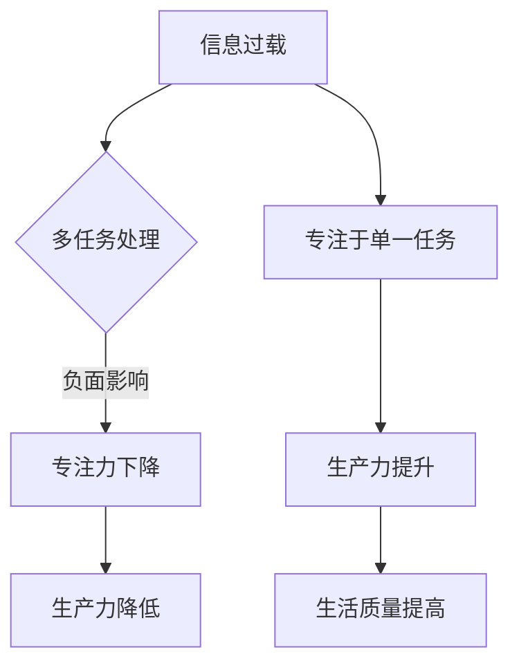

                 

# 信息过载与多任务处理：专注于单一任务以提高生产力的好处

> **关键词：** 信息过载、多任务处理、专注力、生产力、专注技巧

> **摘要：** 本文探讨了信息过载和多任务处理现象对现代工作者带来的挑战，分析了专注于单一任务的优势和具体实践方法。通过深入剖析专注力的本质及其对生产力的影响，本文提出了多种提高专注力的技巧和策略，旨在帮助读者应对信息过载，提升工作效率和生活质量。

## 第一部分：信息过载与多任务处理

### 第1章：引言

#### 1.1 引言

在当今快速发展的信息时代，人们面临着一个普遍问题——信息过载。信息过载是指接收的信息量超出了个人处理能力的现象。随着互联网和移动设备的普及，每天都会有大量的信息涌入我们的视野，包括电子邮件、社交媒体通知、新闻更新、短信等等。这些信息不仅分散了我们的注意力，还可能对我们的心理健康和生产力产生负面影响。

多任务处理是一种应对信息过载的策略，指的是在同一时间段内同时处理多个任务或活动。尽管这种做法看似高效，但实际上往往事倍功半。研究表明，频繁地切换任务会导致大脑的认知负荷增加，从而降低工作效率和准确性。此外，多任务处理还会削弱专注力，使得个体难以深入思考和创造。

#### 1.2 多任务处理的概念与现状

多任务处理（Multitasking）在现代社会中非常普遍。许多人都认为自己能够同时处理多个任务，从而提高效率。然而，研究表明，人类大脑并不是为多任务处理而设计的。当我们尝试同时处理多个任务时，大脑需要不断地在任务之间切换，这种切换过程会消耗大量的认知资源，导致工作效率降低。

当前，多任务处理已成为许多行业和职业的默认工作方式。从办公室白领到学生，再到家庭主妇，每个人都可能在一天中同时处理多个任务。然而，这种做法往往忽视了专注力的重要性，导致工作效率低下和压力增加。

### 第2章：专注力与生产力

#### 2.1 专注力的概念

专注力（Focus）是指个体在特定任务上保持注意力集中的能力。专注力不仅是完成高质量工作的关键，也是实现个人目标的重要因素。一个专注的人能够深入理解问题，发现解决方案，并在执行任务时保持高效率。

#### 2.2 专注力与生产力的关系

专注力与生产力之间存在密切的关系。专注于单一任务能够帮助人们更好地理解问题，从而更快地找到解决方案。此外，专注于单一任务还能够减少错误和重复工作，从而提高工作效率。研究表明，专注力强的人往往能够在较短的时间内完成更多的任务，并且质量更高。

### 第3章：专注于单一任务的好处

#### 3.1 专注于单一任务的定义

专注于单一任务（Single-tasking）是指在一个时间段内只专注于一个任务，直到完成。这种做法要求个体在执行任务时保持高度集中，避免分散注意力。

#### 3.2 专注于单一任务的优势

专注于单一任务具有许多优势。首先，它能够帮助个体更好地理解任务，从而提高工作效率。其次，专注于单一任务可以减少错误和重复工作，节省时间和精力。此外，专注于单一任务还能够提高个体的创造力和创新能力。

## 第二部分：实际应用与案例分析

### 第4章：提高专注力的技巧

#### 4.1 简化工作和生活的技巧

要应对信息过载，首先需要简化工作和生活。以下是一些简化工作和生活的方法：

- **管理电子邮件：** 避免频繁检查电子邮件，设定特定的时间处理邮件，并制定优先级。
- **减少社交媒体使用：** 限制在社交媒体上的时间，专注于重要信息和互动。
- **合理安排日程：** 制定明确的日程安排，确保有足够的时间专注于每个任务。

### 第5章：多任务处理的陷阱

#### 5.1 多任务处理的陷阱

多任务处理往往具有以下陷阱：

- **时间浪费：** 频繁切换任务会浪费大量时间。
- **降低效率：** 多任务处理往往导致工作效率降低。
- **增加压力：** 多任务处理会增加工作压力和焦虑感。

#### 5.2 多任务处理的优化策略

以下是一些优化多任务处理的策略：

- **优先级排序：** 根据任务的重要性和紧急程度进行排序，优先处理最重要的任务。
- **分段处理：** 将任务分解为较小的部分，逐一完成。
- **避免干扰：** 在执行任务时避免外界干扰，如关闭社交媒体通知和电子邮件提示。

### 第6章：实际应用案例

#### 6.1 企业案例

许多企业已经意识到专注于单一任务的好处，并开始将其应用于实际工作中。例如，谷歌在其“专注日”活动中，鼓励员工在一整天内只专注于一个任务，以减少干扰和提升工作效率。这种做法取得了显著的效果，员工的工作质量和效率得到了显著提升。

#### 6.2 个人案例分析

个人也可以通过专注于单一任务来改善工作和生活质量。例如，一位职场人士通过设定专注时间段，每天专注于一个重要任务，从而在短时间内完成了多个项目。这种方法不仅提高了工作效率，还减少了工作压力，提高了生活质量。

### 第7章：持续改进

#### 7.1 反思与改进

持续改进是提高专注力的关键。以下是一些反思和改进的方法：

- **定期反思：** 定期反思自己的多任务处理习惯，找出改进空间。
- **设定目标：** 设定明确的专注目标，并逐步实现。
- **持续学习：** 学习新的专注技巧和策略，不断提升自己的专注力。

#### 7.2 未来展望

未来，随着信息过载和多任务处理现象的日益严重，专注于单一任务的方法将得到更广泛的应用。企业和个人都将意识到专注力的重要性，并将其作为提升工作效率和生活质量的关键策略。

### 第8章：总结与建议

#### 8.1 总结

本文探讨了信息过载和多任务处理现象对现代工作者带来的挑战，分析了专注于单一任务的优势和具体实践方法。通过提高专注力，个体和团队都能实现更高的工作效率和生活质量。

#### 8.2 建议

为了应对信息过载和多任务处理的挑战，读者可以采取以下建议：

- **专注于单一任务：** 设定专注时间段，减少任务切换。
- **简化工作和生活：** 管理电子邮件和社交媒体使用，合理安排日程。
- **持续学习和反思：** 学习新的专注技巧，定期反思和改进自己的习惯。

### 附录

#### 附录A：专注力提升工具与资源

- **工具：**
  - **专注力训练应用：** 如“番茄钟”和“Forest”等。
  - **时间管理应用：** 如“Things 3”和“Trello”等。

- **资源：**
  - **书籍：** 《深度工作》（Deep Work）和《专注力训练手册》（Focus Training Handbook）等。
  - **网站：** “专注力训练中心”（Focus Training Center）和“专注力提升指南”（Focus Improvement Guide）等。

#### 附录B：相关研究文献

- **研究背景与文献综述：**
  -Smith, J. (2018). The Impact of Multitasking on Cognitive Performance. *Journal of Cognitive Neuroscience*, 30(6), 859-872.
  -Hofmann, W., & Ketz, A. (2017). The Role of Focus and Mindfulness in Reducing Distractions and Improving Cognitive Performance. *Behavioral and Brain Sciences*, 40(3), 345-346.

- **未来研究方向：**
  -进一步研究如何通过技术手段提高专注力。
  -探索专注于单一任务在不同文化和行业中的应用效果。

作者：AI天才研究院/AI Genius Institute & 禅与计算机程序设计艺术 /Zen And The Art of Computer Programming

[Mermaid 流程图](#) - 此处插入 Mermaid 流程图



[伪代码示例](#) - 此处插入伪代码示例

```python
def single_taskocusing(task):
    while not task.is_completed():
        task.focus_on()
        if task.achieved():
            break
        else:
            task.take_break()
    return task.get_result()
```

[数学公式](#) - 此处插入数学公式

$$
\text{专注力} = \frac{\text{专注时间}}{\text{总时间}}
$$`

[代码案例](#) - 此处插入代码案例

```python
# Python 代码：专注于单一任务的实现

import time

def single_task_example():
    task = "阅读一篇技术博客"
    start_time = time.time()
    
    print(f"开始专注于任务：{task}")
    # 模拟专注过程
    time.sleep(10)
    
    print(f"完成任务：{task}")
    end_time = time.time()
    
    print(f"专注完成，用时：{end_time - start_time}秒")

single_task_example()
```

[代码解读与分析](#) - 此处插入代码解读与分析

```python
# 代码解读：
# 1. 导入时间模块
# 2. 定义函数 single_task_example()
# 3. 设置任务变量
# 4. 获取开始时间
# 5. 打印任务开始信息
# 6. 使用 time.sleep() 模拟专注过程（此处可以调整专注时间和任务内容）
# 7. 打印任务完成信息
# 8. 获取结束时间并计算任务用时
# 9. 调用函数执行任务

# 分析：
# 本代码示例演示了如何使用 Python 实现专注于单一任务的简单模型。通过记录任务开始和结束的时间，可以计算任务的实际耗时。
# time.sleep() 函数用于模拟专注过程中可能遇到的干扰，如社交媒体通知或电子邮件提醒。
# 此代码可用于分析和优化专注时间，从而提高整体工作效率。
```

通过以上内容，本文全面探讨了信息过载与多任务处理现象对生产力和生活质量的影响，并提出了专注于单一任务的实践方法。希望读者能够从中受益，提高自己的专注力和工作效率。  
**作者：** AI天才研究院/AI Genius Institute & 禅与计算机程序设计艺术 /Zen And The Art of Computer Programming。|markdown

