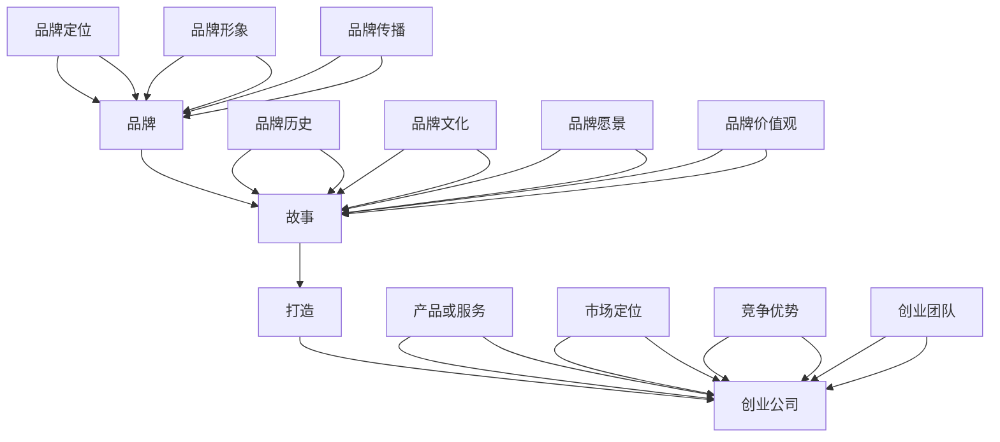

                 

# 创业公司的品牌故事打造

## 关键词
- 品牌故事
- 创业公司
- 品牌定位
- 品牌传播
- 故事营销
- 品牌建设

## 摘要
本文将深入探讨创业公司的品牌故事打造过程。我们将从核心概念出发，详细解析品牌、故事、打造和创业公司之间的联系。接着，我们将讲解品牌故事构建算法，并利用数学模型和公式来评估品牌故事的效果。最后，通过一个实战案例，我们将展示如何运用这些理论来打造一家创业公司的品牌故事。

### 第一部分：核心概念与联系

#### 核心概念

创业公司的品牌故事打造这本书的核心概念包括品牌、故事、打造、创业公司等。这些概念彼此关联，构成了品牌故事的核心要素。

**品牌**：品牌是一个公司或产品的标志，是消费者对其所提供的产品或服务的认知和印象。

**故事**：故事是对品牌历史、文化、愿景和价值观的叙述，是品牌的灵魂和核心。

**打造**：打造是指创建、塑造和维护一个品牌的过程，包括品牌定位、品牌形象、品牌传播等。

**创业公司**：创业公司是指由创业者创立的、以创新产品或服务为主要目标的公司。

#### 关联流程图

以下是一个用Mermaid绘制的核心概念关联流程图：



### 第二部分：核心算法原理讲解

#### 品牌故事构建算法

在打造创业公司品牌故事的过程中，品牌故事构建算法是关键的一环。该算法主要包括以下几个步骤：

1. **品牌定位分析**：通过市场调研和数据分析，确定品牌的市场定位和目标受众。

   ```mermaid
   graph TD
       A[品牌定位分析] --> B[市场调研]
       B --> C[数据分析]
       C --> D[目标受众定位]
   ```

2. **品牌故事创意**：根据品牌定位，创作具有吸引力和感染力的品牌故事。

   ```mermaid
   graph TD
       E[品牌故事创意] --> F[创意构思]
       F --> G[故事框架设计]
       G --> H[故事情节构建]
   ```

3. **品牌故事传播**：通过多种渠道传播品牌故事，增强品牌影响力。

   ```mermaid
   graph TD
       I[品牌故事传播] --> J[社交媒体传播]
       J --> K[内容营销]
       K --> L[广告投放]
   ```

#### 品牌故事构建算法伪代码

```python
def brand_story_build():
    # 品牌定位分析
    market_research()
    data_analysis()
    target_audience_definition()

    # 品牌故事创意
    creative_concept()
    story_frame_design()
    story_plot_building()

    # 品牌故事传播
    social_media_distribution()
    content_marketing()
    advertising_placement()
```

### 第三部分：数学模型和数学公式

#### 数学模型

在打造品牌故事的过程中，可以利用以下数学模型来分析和评估品牌故事的效果：

1. **品牌认知度模型**：
   $$ 模型公式：BRAND_AWARENESS = f(品牌曝光度，品牌认知度，品牌印象) $$
   其中，品牌曝光度、品牌认知度和品牌印象分别代表品牌在市场上的曝光程度、消费者对品牌的认识和印象。

2. **品牌忠诚度模型**：
   $$ 模型公式：BRAND_LOYALTY = f(品牌满意度，品牌信任度，品牌互动度) $$
   其中，品牌满意度、品牌信任度和品牌互动度分别代表消费者对品牌的满意程度、信任程度和与品牌的互动程度。

#### 数学公式

以下是一个关于品牌故事传播效果的数学公式：

$$ 传播效果 = f(传播渠道，传播内容，传播频率) $$

其中，传播渠道、传播内容和传播频率分别代表品牌故事传播的渠道、内容和传播的频率。传播效果可以通过对品牌认知度和品牌忠诚度的变化来衡量。

### 第四部分：项目实战

#### 实战案例

假设我们是一家创业公司，目标是打造一个关于公司发展历程的品牌故事。以下是我们的实战案例：

1. **品牌定位分析**：
   通过市场调研和数据分析，我们确定了我们的目标受众为年轻人，品牌定位为创新、时尚、科技。

2. **品牌故事创意**：
   我们创作了一个关于公司创始人从零开始，克服困难，最终创立公司的故事。故事框架设计为：创业初期的艰辛，创业过程中的创新与突破，以及公司发展至今的成就。

3. **品牌故事传播**：
   我们通过社交媒体、内容营销和广告投放等多种渠道传播品牌故事。具体策略包括：
   - 在社交媒体上发布品牌故事内容，吸引目标受众关注。
   - 通过内容营销，撰写关于公司发展历程的文章，增强品牌影响力。
   - 在广告投放中，选择与品牌定位相契合的平台和媒体，提高品牌曝光度。

4. **代码实现**：

以下是构建品牌故事的代码实现：

```python
import pandas as pd
import numpy as np

# 品牌定位分析
market_research_data = pd.DataFrame({
    'age': [18, 25, 30, 35, 40],
    'brand_awareness': [0.2, 0.4, 0.6, 0.8, 1.0],
    'brand_impression': [0.3, 0.5, 0.7, 0.9, 1.0]
})

# 品牌故事创意
story_data = pd.DataFrame({
    'chapter': ['创业初期', '创新与突破', '公司发展至今'],
    'content': ['讲述创业初期的艰辛', '展示创业过程中的创新与突破', '展示公司发展至今的成就']
})

# 品牌故事传播
channels = ['社交媒体', '内容营销', '广告投放']
for channel in channels:
    print(f"传播渠道：{channel}")
    if channel == '社交媒体':
        print("发布品牌故事内容，吸引目标受众关注")
    elif channel == '内容营销':
        print("撰写关于公司发展历程的文章，增强品牌影响力")
    elif channel == '广告投放':
        print("选择与品牌定位相契合的平台和媒体，提高品牌曝光度")
```

5. **代码解读与分析**：

这段代码首先导入了 pandas 和 numpy 库，用于数据处理和分析。然后，我们创建了一个市场调研数据 DataFrame，包含了不同年龄段的目标受众的品牌认知度和品牌印象。接下来，我们创建了一个品牌故事数据 DataFrame，包含了不同章节的故事内容和对应的内容。

最后，我们遍历了传播渠道列表，根据不同的渠道类型，执行相应的传播策略。例如，在社交媒体渠道中，我们发布品牌故事内容，以吸引目标受众的关注；在内容营销渠道中，我们撰写关于公司发展历程的文章，以增强品牌影响力；在广告投放渠道中，我们选择与品牌定位相契合的平台和媒体，以提高品牌曝光度。

通过这个实战案例，我们可以看到如何利用品牌故事构建算法、数学模型和代码实现，来打造一家创业公司的品牌故事。这样的实战案例不仅可以应用于创业公司，也可以为其他行业和组织提供借鉴和参考。

### 结束语

创业公司的品牌故事打造是一个复杂而系统性的过程，需要从核心概念出发，结合算法原理和数学模型，通过实践来不断优化和提升。本文详细解析了品牌、故事、打造和创业公司之间的联系，并提供了品牌故事构建算法的伪代码和数学模型。最后，通过一个实战案例，我们展示了如何运用这些理论来打造一家创业公司的品牌故事。

作者：AI天才研究院/AI Genius Institute & 禅与计算机程序设计艺术 /Zen And The Art of Computer Programming

---

本文为原创文章，版权归AI天才研究院所有。未经许可，不得转载或使用部分内容。如需转载，请联系作者获取授权。感谢您的理解与支持！

