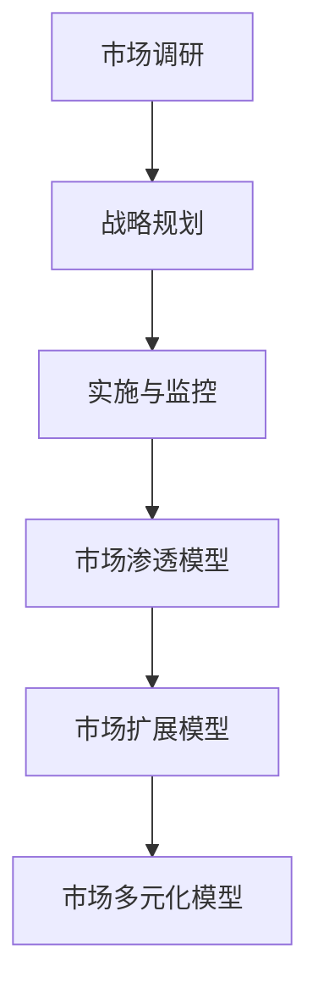
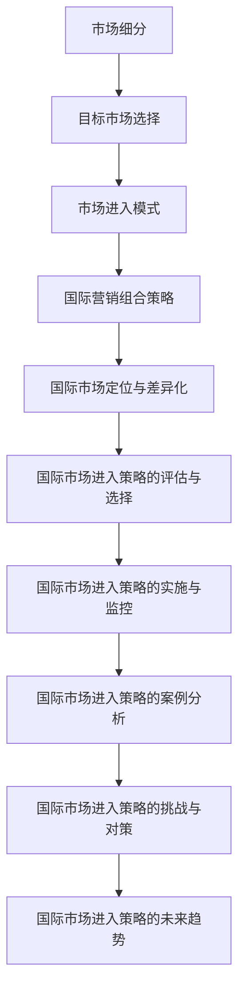
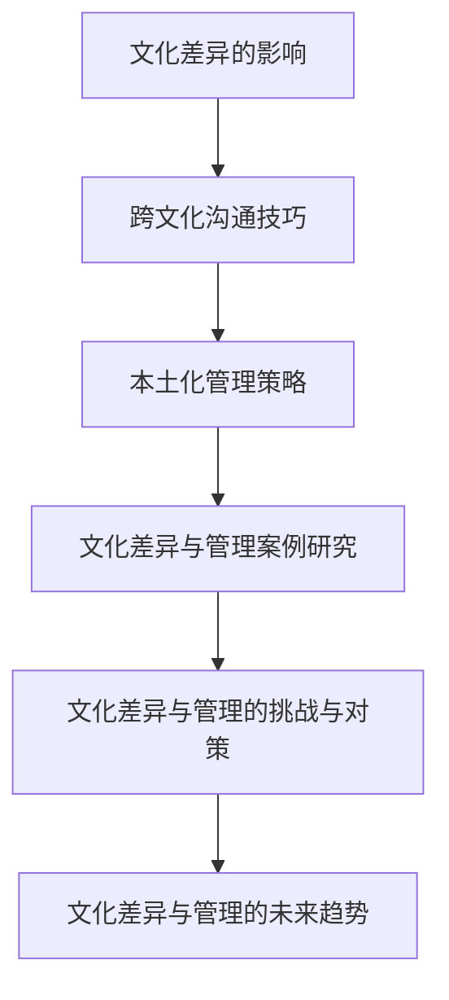
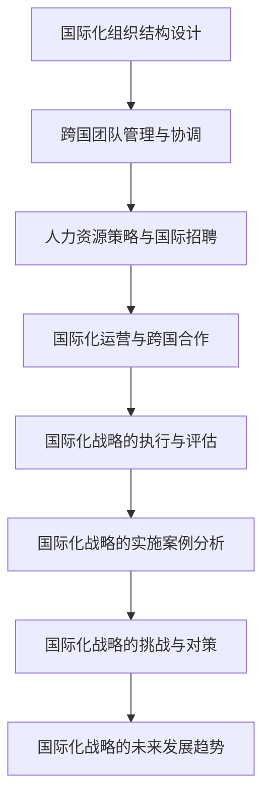
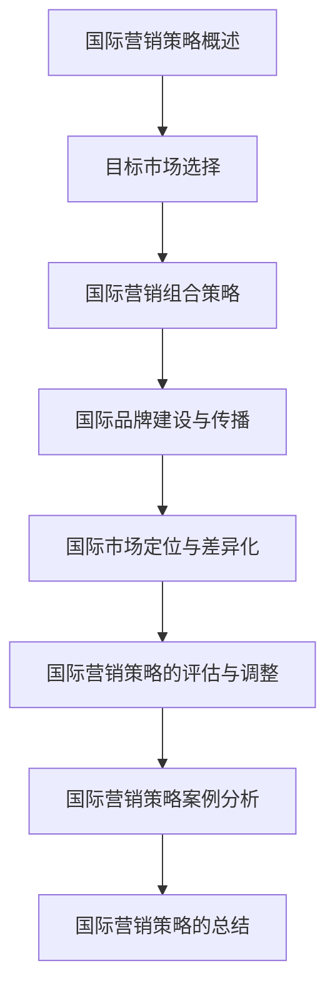
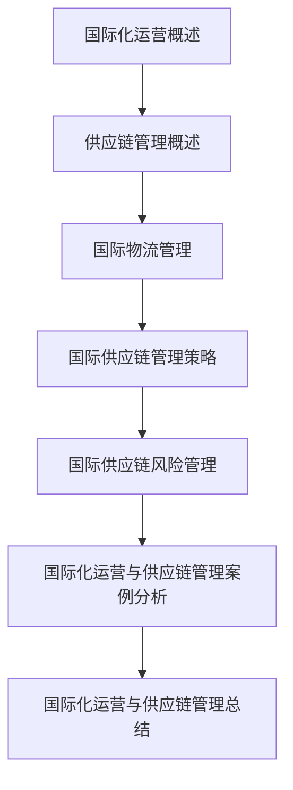
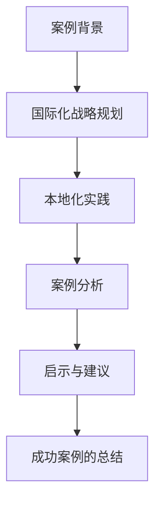
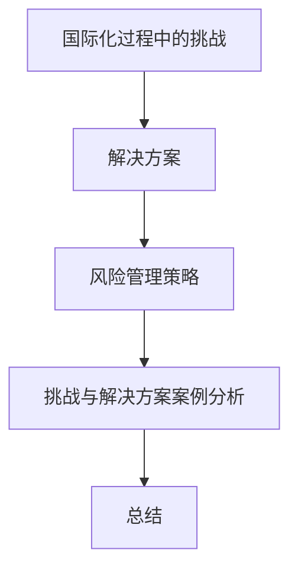

                 

### 文章标题

《创业公司的国际化战略与本地化实践》

### 文章关键词

国际化战略、本地化实践、创业公司、市场进入、文化差异、供应链管理、案例分析、风险管理、成功经验

### 文章摘要

本文旨在探讨创业公司如何制定并实施有效的国际化战略，以及如何通过本地化实践来适应不同市场环境。文章首先介绍了国际化战略的概念与类型，详细分析了市场进入策略和文化差异管理。随后，文章重点讨论了国际化战略的执行与组织管理，包括国际化组织结构设计、跨国团队管理与协调、人力资源策略、财务管理与风险控制等。接着，文章探讨了国际化运营与供应链管理，包括国际物流、供应链策略以及风险管理。通过成功案例的分析，文章提供了实际操作中的宝贵经验与启示，总结了国际化战略与本地化实践的关键挑战和解决方案。文章最后附有国际化战略与本地化实践的实用工具与资源，以及相关案例参考。

---

### 《创业公司的国际化战略与本地化实践》目录大纲

- **第一部分：国际化战略的基础理论**
  - 第1章：国际化战略的概念与类型
  - 第2章：市场进入策略
  - 第3章：文化差异与管理

- **第二部分：国际化战略的实施与评估**
  - 第4章：国际化战略的执行与组织管理
  - 第5章：国际化营销策略
  - 第6章：国际化运营与供应链管理

- **第三部分：本地化实践案例研究**
  - 第7章：成功案例分析与启示
  - 第8章：挑战与解决方案

- **附录**
  - 附录 A：国际化战略与本地化实践工具与资源
  - 附录 B：国际化战略与本地化实践参考案例

---

### 第1章：国际化战略的概念与类型

#### 1.1 国际化战略的定义与意义

国际化战略是指企业通过跨国经营，进入国际市场，以实现其长期发展目标的过程。国际化战略不仅关注企业在国内市场的成功，更强调企业如何利用全球资源和机会，扩大市场影响力和竞争力。

**国际化战略的意义**：

1. **扩大市场份额**：通过国际化，企业可以进入新的市场，增加销售额和市场份额。
2. **提高竞争力**：国际市场提供了更多的竞争环境，有助于企业不断优化自身产品和服务。
3. **增加利润**：国际化可以带来新的收入来源，提高企业盈利能力。
4. **品牌提升**：国际市场的成功可以提升企业品牌形象，增强市场地位。

#### 1.2 国际化战略的类型与选择

**国际化战略的类型**：

1. **出口导向型战略**：主要依靠出口实现国际化，通过销售产品或服务到国外市场。
2. **跨国经营战略**：通过在海外设立子公司或分支机构，直接参与当地市场的运营。
3. **全球战略**：在全球范围内进行业务布局和资源整合，追求全球市场的一体化管理。

**国际化战略的选择**：

选择哪种类型的国际化战略，需要综合考虑企业的资源、能力、市场环境和长期发展战略。

1. **企业的资源与能力**：企业是否具备国际市场运营所需的人力、资金、技术和品牌等资源。
2. **市场环境**：目标市场的需求、竞争情况、法规政策等。
3. **长期发展战略**：企业的全球化愿景、扩张速度和战略目标。

#### 1.3 国际化战略的框架与模型

**国际化战略的框架**：

国际化战略的制定和实施通常包括以下步骤：

1. **市场调研**：了解目标市场的需求、竞争情况和市场潜力。
2. **战略规划**：确定国际化的目标和路径，制定具体的战略计划。
3. **实施与监控**：执行国际化战略，并进行持续的监控和调整。

**国际化战略的模型**：

1. **市场渗透模型**：通过扩大现有产品的市场份额来实现国际化。
2. **市场扩展模型**：通过进入新的市场，开拓新的销售渠道来实现国际化。
3. **市场多元化模型**：通过开发新产品或服务，进入多个市场来实现国际化。

#### 图 1.1：国际化战略的 Mermaid 流程图

#### 1.4 国际化战略的挑战与机遇

**国际化战略的挑战**：

1. **文化差异**：不同国家和地区的文化、价值观和行为习惯的差异，可能导致沟通障碍和管理困难。
2. **政策风险**：不同国家的法律法规和政策差异，可能影响企业的运营和发展。
3. **市场不确定性**：国际市场的变化和竞争环境的不确定性，增加了国际化过程中的风险。

**国际化战略的机遇**：

1. **全球市场机会**：国际市场提供了更多的商业机会，有助于企业扩大市场份额和增加收入。
2. **资源整合**：通过国际化，企业可以整合全球资源，提高效率和竞争力。
3. **品牌提升**：国际市场的成功可以提升企业品牌形象，增强市场地位。

#### 1.5 小结

国际化战略是企业实现长期发展的重要手段。通过合理的国际化战略规划，企业可以充分利用全球市场的机会，提高竞争力，实现可持续发展。

$$
\text{国际化战略的关键因素} =
\begin{cases}
\text{市场调研} & \text{准确了解目标市场} \\
\text{战略规划} & \text{明确国际化目标和路径} \\
\text{实施与监控} & \text{确保战略的有效执行}
\end{cases}
$$

---

### 第2章：市场进入策略

#### 2.1 市场细分与目标市场选择

**市场细分**：

市场细分是指将整体市场划分为若干个具有相似需求的子市场，以便企业可以更好地满足不同消费者的需求。市场细分的关键步骤包括：

1. **确定细分标准**：根据消费者的需求、行为、地理位置、购买力等因素进行细分。
2. **评估细分市场**：分析每个细分市场的大小、增长潜力、竞争状况等。
3. **选择目标市场**：根据企业的资源和能力，选择最有潜力的细分市场作为目标市场。

**目标市场选择**：

目标市场选择是企业确定将要服务和竞争的市场。选择目标市场的标准包括：

1. **市场潜力**：目标市场是否有足够的消费者和购买力。
2. **竞争环境**：目标市场中的竞争状况和竞争者的实力。
3. **企业能力**：企业是否有能力满足目标市场的需求。

#### 2.2 市场进入模式

**市场进入模式**：

市场进入模式是指企业选择进入国际市场的方式。常见的市场进入模式包括：

1. **出口模式**：通过将产品直接销售给国外的买家，实现市场进入。
   - **直接出口**：企业直接与海外买家建立联系，进行产品销售。
   - **间接出口**：通过代理商、分销商或出口商将产品销售到国际市场。

2. **跨国经营模式**：通过在目标市场设立子公司或分支机构，直接参与当地市场的运营。
   - **独资经营**：企业在海外市场独立运营，拥有完全的控制权。
   - **合资经营**：企业与当地企业合作，共同投资和经营。

3. **战略联盟模式**：通过与其他企业建立战略联盟，共同开拓国际市场。

**市场进入模式的选择**：

选择市场进入模式时，需要考虑以下因素：

1. **市场环境**：目标市场的经济、政治、文化环境。
2. **企业资源**：企业的人力、资金、技术和品牌等资源。
3. **风险与收益**：市场进入模式的成本和潜在收益。

#### 2.3 国际营销组合策略

**国际营销组合策略**：

国际营销组合策略是指企业在国际市场上进行产品、价格、渠道和促销活动的策略。国际营销组合策略的关键要素包括：

1. **产品策略**：
   - **产品调整**：根据目标市场的需求，对产品进行适应性调整。
   - **产品创新**：在目标市场推出新产品或改进现有产品。

2. **价格策略**：
   - **定价目标**：根据企业的目标利润和市场定位确定定价策略。
   - **定价方法**：考虑成本、竞争和市场需求，选择合适的定价方法。

3. **渠道策略**：
   - **渠道选择**：根据目标市场的特点和企业的资源，选择合适的销售渠道。
   - **渠道管理**：建立有效的渠道管理体系，确保渠道的稳定和高效运营。

4. **促销策略**：
   - **广告**：选择合适的广告渠道和媒体，提升产品知名度。
   - **促销活动**：通过打折、赠品、活动等方式，刺激消费者购买。

#### 2.4 国际市场定位与差异化

**国际市场定位**：

国际市场定位是指企业根据自身产品、竞争环境和目标市场的特点，确定产品在市场中的位置。国际市场定位的关键步骤包括：

1. **分析竞争环境**：了解竞争对手的市场定位和策略。
2. **确定目标客户**：明确目标市场的消费者群体。
3. **制定定位策略**：根据分析结果，确定企业的市场定位策略。

**差异化策略**：

差异化策略是指企业通过产品、服务、品牌等方面的独特性，与竞争对手区分开来，赢得消费者的青睐。差异化策略的关键要素包括：

1. **产品差异化**：通过创新、质量、功能等方面，使产品具有独特性。
2. **服务差异化**：提供优质的服务，满足消费者的特殊需求。
3. **品牌差异化**：建立独特的品牌形象，提升品牌认知度和忠诚度。

#### 2.5 国际市场进入策略的评估与选择

**评估指标**：

评估国际市场进入策略的指标包括：

1. **市场潜力**：目标市场的大小、增长速度和竞争状况。
2. **竞争环境**：目标市场的竞争强度和竞争者的实力。
3. **企业资源**：企业的资源、能力和竞争优势。
4. **政策法规**：目标市场的法律法规和政策环境。

**策略选择**：

策略选择应根据企业的资源、能力和市场环境进行。具体步骤包括：

1. **分析市场进入模式**：评估不同市场进入模式的优缺点。
2. **制定进入策略**：选择最适合企业的市场进入模式。
3. **实施与监控**：执行市场进入策略，并进行持续的监控和调整。

#### 2.6 国际市场进入策略的实施与监控

**实施步骤**：

1. **制定实施计划**：明确市场进入的具体步骤和时间表。
2. **分配资源**：确保市场进入策略所需的资源得到充分保障。
3. **执行任务**：按照计划实施市场进入策略。
4. **监控进度**：跟踪市场进入策略的执行情况，及时调整策略。

**监控方法**：

1. **定期评估**：定期对市场进入策略的效果进行评估。
2. **数据分析**：通过数据分析，了解市场反应和销售情况。
3. **市场反馈**：收集消费者和渠道商的反馈，及时调整策略。

#### 2.7 国际市场进入策略的案例分析

**案例背景**：

某国内知名电子产品公司计划进入美国市场。

**案例分析**：

1. **市场调研**：对美国市场的需求、竞争状况和消费者行为进行了深入研究。
2. **进入模式**：选择了直接出口模式，通过在线销售平台和当地分销商销售产品。
3. **营销组合策略**：针对美国市场，调整了产品功能和品牌宣传策略。
4. **实施与监控**：通过定期评估和数据分析，优化了市场进入策略，取得了良好的市场反响。

**成功经验**：

1. **充分的市场调研**：确保市场进入策略的准确性。
2. **合理的市场进入模式**：选择了适合企业资源和市场环境的进入模式。
3. **灵活的营销组合策略**：根据目标市场的特点，调整了产品和服务。

**不足之处**：

1. **文化差异**：对美国市场的文化特点理解不够深入，导致初期沟通障碍。
2. **市场竞争**：面对强大的本土竞争对手，初期市场占有率较低。

#### 2.8 国际市场进入策略的挑战与对策

**挑战**：

1. **文化差异**：不同国家和地区的文化差异可能影响市场进入策略的有效性。
2. **政策法规**：不同国家的法律法规和政策差异可能增加市场进入的难度。
3. **市场竞争**：国际市场的竞争环境复杂，增加了市场进入的风险。

**对策**：

1. **加强文化沟通**：深入了解目标市场的文化特点，制定相应的文化适应策略。
2. **法律合规管理**：聘请专业律师团队，确保企业的运营符合当地法律法规。
3. **风险管理**：通过市场调研和数据分析，识别潜在风险，并制定应对策略。

#### 2.9 国际市场进入策略的未来趋势

**新趋势**：

1. **数字化营销**：利用互联网和社交媒体，提高市场进入的效率和效果。
2. **全球化供应链**：通过全球供应链管理，降低成本，提高市场响应速度。
3. **智能化管理**：利用大数据和人工智能技术，优化市场进入策略和运营管理。

**未来展望**：

随着全球化进程的加快，国际市场进入策略将更加多元化、智能化。企业需要不断适应市场变化，创新市场进入策略，以实现持续增长和竞争力提升。

#### 2.10 国际市场进入策略的总结

国际市场进入策略是企业国际化的重要组成部分。通过合理的市场细分、选择合适的进入模式、制定有效的营销组合策略，企业可以成功进入国际市场，实现全球市场扩张和品牌提升。然而，国际市场进入也面临诸多挑战，企业需要通过有效管理，克服困难，抓住机遇，实现国际化战略目标。

## 图 2.1：市场细分与目标市场选择的 Mermaid 流程图

### 第3章：文化差异与管理

#### 3.1 文化差异的影响

**文化差异的定义**：

文化差异是指不同国家和地区在价值观、行为规范、语言习惯、宗教信仰等方面的差异。文化差异对企业的影响主要体现在以下几个方面：

1. **沟通障碍**：不同文化背景下的语言表达和行为方式可能不同，导致沟通困难。
2. **管理困难**：文化差异可能导致管理风格、员工期望和公司政策等方面的冲突。
3. **市场进入障碍**：不了解目标市场的文化特点，可能导致产品不符合当地消费者需求，影响市场进入。

**文化差异的影响**：

1. **产品与服务的适应性**：企业需要根据不同市场的文化差异，调整产品设计和营销策略。
2. **员工管理**：企业需要采用适合不同文化的管理方法，提高员工的工作满意度和效率。
3. **市场竞争**：文化差异可能影响企业在国际市场上的竞争策略和竞争优势。

#### 3.2 跨文化沟通技巧

**跨文化沟通的挑战**：

跨文化沟通的挑战包括：

1. **语言障碍**：不同语言的词汇、语法和表达方式的差异。
2. **非语言沟通**：肢体语言、面部表情和身体距离等非语言因素的差异。
3. **文化价值观差异**：不同文化对时间观念、权力距离、个人主义和集体主义的理解差异。

**跨文化沟通技巧**：

1. **倾听与理解**：耐心倾听对方观点，避免过早下结论。
2. **文化适应**：尊重和理解对方的文化习俗和行为规范。
3. **清晰表达**：使用简单、直接和明确的语言进行沟通。
4. **建立信任**：通过共同点和共同的价值观建立信任关系。

#### 3.3 本土化管理策略

**本土化管理的概念**：

本土化管理是指企业在跨国经营过程中，根据当地的文化、价值观和市场需求，调整管理策略、产品和服务，以适应当地市场。

**本土化管理的策略**：

1. **文化适应**：企业需要了解并尊重当地的文化习俗和行为规范，调整内部管理机制。
2. **本地化团队建设**：建立本地化团队，培养本地员工的国际视野和跨文化沟通能力。
3. **政策法规遵守**：了解并遵守当地的法律法规，确保企业的合法运营。
4. **产品和服务本土化**：根据当地市场的需求，调整产品功能、设计和品牌策略。

#### 3.4 文化差异与管理案例研究

**案例背景**：

某中国科技公司计划进入德国市场。

**案例分析**：

1. **市场调研**：公司进行了深入的市场调研，了解德国市场的文化、价值观和消费者行为。
2. **本土化管理**：公司调整了产品界面语言，尊重德国的环保政策，并采用了德国式的客户服务方式。
3. **跨文化团队建设**：公司招聘了德国本地员工，成立了跨文化团队，促进内部沟通和合作。
4. **政策法规遵守**：公司聘请了当地律师团队，确保运营符合德国法律法规。

**成功经验**：

1. **深入的市场调研**：确保了产品和服务能够满足当地消费者的需求。
2. **本土化管理**：通过调整产品和服务，提高了市场接受度。
3. **跨文化团队建设**：提高了内部沟通效率和团队协作能力。

**不足之处**：

1. **文化差异理解不够深入**：初期对德国文化的理解不够，导致一些管理上的困惑。
2. **市场进入速度较慢**：由于市场调研和本土化调整需要时间，市场进入速度相对较慢。

#### 3.5 文化差异与管理的挑战与对策

**挑战**：

1. **文化差异**：不同文化之间的差异可能导致沟通和管理困难。
2. **本地市场适应性**：企业需要快速适应不同市场的文化特点，提高市场竞争力。
3. **跨文化团队管理**：如何有效管理跨文化团队，提高团队效率和协作能力。

**对策**：

1. **加强文化培训**：对员工进行跨文化培训，提高文化敏感度和沟通技巧。
2. **建立本地化团队**：招聘本地员工，建立本地化团队，促进本地市场的适应性。
3. **灵活应对文化差异**：根据不同市场的文化特点，灵活调整管理策略和产品服务。

#### 3.6 文化差异与管理的未来趋势

**新趋势**：

1. **全球化管理**：随着全球化的加深，企业的管理将更加注重跨文化的多样性和包容性。
2. **数字化文化**：数字化技术的应用将促进跨文化沟通和管理效率的提升。
3. **多元化文化**：企业将更加重视多元文化的融合，提高全球市场竞争力。

**未来展望**：

随着全球化的不断深入，文化差异与管理将成为企业国际化运营中不可或缺的一部分。企业需要不断创新管理方法，提高跨文化沟通和管理能力，以适应不断变化的市场环境。

#### 3.7 文化差异与管理的总结

文化差异与管理是企业国际化运营中的重要环节。通过深入理解不同市场的文化特点，采取有效的本土化管理策略，企业可以更好地适应国际市场，提高竞争力。同时，加强跨文化沟通和团队建设，有助于提高内部协作效率和员工满意度。总之，文化差异与管理是企业实现国际化战略目标的关键因素。

## 图 3.1：文化差异与管理的 Mermaid 流程图

### 第4章：国际化战略的执行与组织管理

#### 4.1 国际化组织结构设计

**国际化组织结构的类型**：

国际化组织结构主要包括以下类型：

1. **全球型组织**：在全球范围内进行业务布局，形成高度一体化的组织结构。
2. **多国型组织**：在各个国家设立独立的子公司，拥有一定的自主权。
3. **国际型组织**：在总部与子公司之间建立紧密的联系，通过全球化管理实现资源整合。

**国际化组织结构设计的原则**：

1. **灵活性**：组织结构应能够适应市场变化和战略调整。
2. **适应性**：组织结构应能够适应不同国家的文化、法律和商业环境。
3. **高效性**：组织结构应能够提高运营效率，降低成本。

**国际化组织结构设计的步骤**：

1. **确定战略目标**：明确企业的国际化目标和战略方向。
2. **分析组织需求**：根据业务特点、市场环境和资源状况，确定组织结构的需求。
3. **设计组织结构**：选择合适的组织结构类型，制定组织架构图。
4. **实施与调整**：实施新的组织结构，并根据实际情况进行持续调整和优化。

#### 4.2 跨国团队管理与协调

**跨国团队管理的挑战**：

跨国团队管理的挑战主要包括：

1. **文化差异**：不同文化背景的员工在沟通、合作和工作习惯上可能存在差异。
2. **沟通障碍**：语言障碍、时区差异、沟通方式的不同可能导致信息传递不畅。
3. **领导力问题**：跨国团队需要具备跨国领导力的管理者，但现实中可能存在管理能力不足的问题。

**跨国团队管理的策略**：

1. **建立共同目标**：明确团队的目标和愿景，确保团队成员对目标的认同。
2. **加强沟通**：采用多种沟通方式，如视频会议、即时通讯工具等，确保信息传递的及时性和准确性。
3. **培养跨文化领导力**：通过培训和发展，提升管理者的跨文化沟通能力和领导力。
4. **建立信任**：通过共同的工作经历和成果，建立团队成员之间的信任关系。

#### 4.3 人力资源策略与国际招聘

**国际人力资源策略**：

国际人力资源策略是企业国际化过程中人力资源管理的重要组成部分，主要包括以下几个方面：

1. **本地化招聘**：根据目标市场的需求，招聘本地人才，提高市场适应性。
2. **全球化培训**：提供跨文化培训和领导力培训，提升员工的国际化视野和管理能力。
3. **国际人才引进**：引进国际高级人才，提升企业的国际竞争力。

**国际招聘的流程**：

国际招聘的流程主要包括以下几个步骤：

1. **职位需求分析**：明确职位的需求，包括职责、技能和经验要求。
2. **招聘渠道选择**：选择合适的招聘渠道，如招聘网站、社交媒体、猎头公司等。
3. **面试与录用**：进行多轮面试，包括初选、复试和终选，确保选拔到合适的人才。
4. **合同谈判与录用**：与候选人进行合同谈判，签订劳动合同。

#### 4.4 国际化运营与跨国合作

**国际化运营的挑战**：

国际化运营的挑战主要包括：

1. **市场不确定性**：国际市场的变化和不确定性，可能影响企业的运营和业绩。
2. **政策风险**：不同国家的政策和法规差异，可能增加企业的运营风险。
3. **文化差异**：文化差异可能导致管理上的困难，影响团队的协作效率。

**跨国合作的策略**：

1. **建立合作伙伴关系**：与当地企业建立战略合作关系，共享资源，共同开拓市场。
2. **制定合作协议**：明确合作目标、权利和义务，规范合作行为。
3. **资源共享**：通过跨国合作，实现资源共享，降低运营成本，提高运营效率。

#### 4.5 国际化战略的执行与评估

**国际化战略的执行**：

国际化战略的执行主要包括以下几个步骤：

1. **制定实施计划**：明确国际化的具体目标和实施步骤。
2. **分配资源**：确保国际化战略所需的资源得到充分保障。
3. **执行任务**：按照计划执行国际化战略，确保各项任务的完成。
4. **监控进度**：定期评估国际化战略的执行情况，及时调整策略。

**国际化战略的评估**：

国际化战略的评估主要包括以下几个指标：

1. **市场占有率**：评估企业在国际市场的市场占有率，了解国际化战略的市场效果。
2. **销售收入**：评估国际市场的销售收入，了解国际化战略的财务效果。
3. **品牌认知度**：评估国际市场对企业的品牌认知度，了解品牌国际化战略的效果。
4. **客户满意度**：评估国际市场对企业的产品和服务满意度，了解客户国际化战略的效果。

#### 4.6 国际化战略的实施案例分析

**案例背景**：

某国内知名互联网公司计划进入美国市场。

**案例分析**：

1. **市场调研**：公司进行了详细的市场调研，了解美国市场的需求、竞争状况和消费者行为。
2. **国际化组织结构设计**：公司在美国设立了分公司，采用了多国型组织结构，保证了市场的灵活性和适应性。
3. **跨国团队管理**：公司招聘了本地人才，并通过培训，提升了员工的跨文化沟通能力。
4. **国际化运营**：公司与美国本地企业建立了合作关系，实现了资源共享和优势互补。

**成功经验**：

1. **充分的市场调研**：确保了市场进入策略的准确性。
2. **合理的组织结构设计**：提高了市场的灵活性和适应性。
3. **有效的团队管理**：提高了团队的协作效率和员工满意度。

**不足之处**：

1. **文化差异理解不够深入**：初期对文化差异的理解不够，导致一些管理上的困惑。
2. **市场进入速度较慢**：由于市场调研和团队建设需要时间，市场进入速度相对较慢。

#### 4.7 国际化战略的挑战与对策

**挑战**：

1. **文化差异**：不同文化之间的差异可能导致沟通和管理困难。
2. **市场不确定性**：国际市场的变化和不确定性，可能影响企业的运营和业绩。
3. **政策风险**：不同国家的政策和法规差异，可能增加企业的运营风险。

**对策**：

1. **加强文化沟通**：通过跨文化培训和管理，提高员工的文化敏感度和沟通技巧。
2. **风险管理**：通过市场调研和数据分析，识别潜在风险，并制定应对策略。
3. **政策合规**：了解并遵守不同国家的法律法规，确保企业的合法运营。

#### 4.8 国际化战略的未来发展趋势

**新趋势**：

1. **数字化国际化**：随着数字化技术的发展，企业将更加依赖于数字工具进行国际化运营。
2. **全球化供应链**：全球化的供应链管理将成为企业国际化运营的重要组成部分。
3. **智能化管理**：人工智能和大数据技术的应用，将提升国际化战略的决策效率和效果。

**未来展望**：

随着全球化进程的加速，国际化战略将更加注重数字化、智能化和全球化供应链管理。企业需要不断创新管理方法，提升国际化运营的能力，以适应不断变化的市场环境。

#### 4.9 国际化战略总结

国际化战略是企业实现全球市场扩张和品牌提升的重要手段。通过合理的组织结构设计、跨国团队管理、人力资源策略和国际化运营，企业可以更好地适应国际市场，提高竞争力。同时，面对国际化过程中可能遇到的挑战，企业需要采取有效的对策，确保国际化战略的顺利实施和持续优化。

## 图 4.1：国际化战略的执行与组织管理的 Mermaid 流程图

### 第5章：国际化营销策略

#### 5.1 国际营销策略概述

**国际营销策略的定义**：

国际营销策略是企业为了进入和拓展国际市场所制定的一系列计划和措施，包括市场调研、目标市场选择、产品策略、价格策略、渠道策略和促销策略等。

**国际营销策略的重要性**：

国际营销策略的重要性在于帮助企业在全球范围内竞争，提高市场份额和品牌知名度。通过有效的国际营销策略，企业可以更好地满足国际市场需求，优化资源配置，提高运营效率。

#### 5.2 目标市场选择

**目标市场定义**：

目标市场是指企业选择进行市场营销活动的特定国家或地区。

**目标市场选择标准**：

目标市场选择标准包括：

1. **市场潜力**：目标市场的大小、增长速度和市场规模。
2. **竞争环境**：目标市场的竞争状况和竞争对手的实力。
3. **企业资源**：企业是否具备进入目标市场所需的资源，如资金、技术、人力资源等。
4. **法规政策**：目标市场的法律法规和政策环境。

**目标市场选择方法**：

目标市场选择方法包括：

1. **市场细分**：根据消费者的需求、行为和地理位置等因素，将市场划分为若干个具有相似需求的子市场。
2. **SWOT分析**：通过分析企业的优势、劣势、机会和威胁，确定最合适的目标市场。
3. **PEST分析**：通过分析政治、经济、社会和技术环境，评估目标市场的可行性。

#### 5.3 国际营销组合策略

**国际营销组合策略的定义**：

国际营销组合策略是指企业在国际市场上进行产品、价格、渠道和促销活动的策略。

**国际营销组合策略的关键要素**：

国际营销组合策略的关键要素包括：

1. **产品策略**：

   - **产品定位**：根据目标市场的需求，确定产品的定位和特点。
   - **产品调整**：根据目标市场的文化、法律和消费习惯，调整产品的设计、包装和功能。

2. **价格策略**：

   - **定价目标**：根据企业的目标利润和市场定位，确定定价策略。
   - **定价方法**：考虑成本、竞争和市场需求，选择合适的定价方法，如成本加成定价、竞争导向定价、价值导向定价等。

3. **渠道策略**：

   - **渠道选择**：根据目标市场的特点和企业的资源，选择合适的销售渠道，如直销、分销商、代理商等。
   - **渠道管理**：建立有效的渠道管理体系，确保渠道的稳定和高效运营。

4. **促销策略**：

   - **广告**：选择合适的广告渠道和媒体，提升产品知名度。
   - **促销活动**：通过打折、赠品、活动等方式，刺激消费者购买。

#### 5.4 国际品牌建设与传播

**国际品牌建设的定义**：

国际品牌建设是指企业通过一系列策略和活动，在国际市场上建立和提升品牌形象的过程。

**国际品牌建设的重要性**：

国际品牌建设的重要性在于提高品牌知名度、增强品牌忠诚度和提升品牌价值。

**国际品牌建设策略**：

国际品牌建设策略包括：

1. **品牌定位**：明确品牌在国际市场上的定位，如高端、中端或低端市场。
2. **品牌传播**：通过广告、公关活动、社交媒体等渠道，传播品牌形象和价值观。
3. **品牌维护**：通过持续的品牌营销和售后服务，维护品牌形象，提高消费者忠诚度。

#### 5.5 国际市场定位与差异化

**国际市场定位的定义**：

国际市场定位是指企业根据自身产品、竞争环境和目标市场的特点，确定产品在市场中的位置。

**国际市场定位的重要性**：

国际市场定位的重要性在于帮助企业在国际市场上脱颖而出，吸引目标消费者。

**国际市场定位策略**：

国际市场定位策略包括：

1. **产品差异化**：通过产品的独特性、创新性和高质量，与竞争对手区分开来。
2. **服务差异化**：提供优质的客户服务，满足消费者的特殊需求。
3. **品牌差异化**：建立独特的品牌形象，提升品牌认知度和忠诚度。

#### 5.6 国际营销策略的评估与调整

**国际营销策略评估的定义**：

国际营销策略评估是指对企业在国际市场上的营销策略进行绩效评估，以确定策略的有效性和适应性。

**国际营销策略评估的方法**：

国际营销策略评估的方法包括：

1. **市场份额评估**：通过比较企业在目标市场的市场份额，评估营销策略的效果。
2. **销售收入评估**：通过比较企业在目标市场的销售收入，评估营销策略的盈利能力。
3. **品牌认知度评估**：通过调查消费者对品牌的认知度和满意度，评估品牌建设的效果。

**国际营销策略调整的策略**：

国际营销策略调整的策略包括：

1. **市场调研**：定期进行市场调研，了解市场需求和竞争状况。
2. **数据分析**：通过数据分析，识别市场趋势和消费者行为。
3. **策略调整**：根据市场调研和数据分析结果，调整营销策略，以适应市场变化。

#### 5.7 国际营销策略案例分析

**案例背景**：

某国内知名电子产品公司计划进入欧洲市场。

**案例分析**：

1. **市场调研**：公司进行了详细的市场调研，了解欧洲市场的消费者需求、竞争状况和文化特点。
2. **目标市场选择**：公司选择了欧洲市场的几个主要国家，如德国、法国和英国，作为目标市场。
3. **国际营销组合策略**：

   - **产品策略**：公司根据欧洲市场的需求，调整了产品的设计、功能和价格。
   - **价格策略**：公司采用了竞争导向定价策略，确保产品的价格具有竞争力。
   - **渠道策略**：公司选择了当地知名的分销商和代理商，建立有效的销售渠道。
   - **促销策略**：公司通过广告、促销活动和公关活动，提高产品在欧洲市场的知名度。

**成功经验**：

1. **充分的市场调研**：确保了市场进入策略的准确性。
2. **合理的营销组合策略**：提高了产品在欧洲市场的竞争力。
3. **有效的渠道策略**：确保了产品能够快速进入欧洲市场。

**不足之处**：

1. **文化差异理解不够深入**：初期对欧洲市场的文化差异的理解不够，导致一些营销策略的执行效果不佳。
2. **市场进入速度较慢**：由于市场调研和团队建设需要时间，市场进入速度相对较慢。

#### 5.8 国际营销策略的总结

国际营销策略是企业国际化运营的重要组成部分。通过科学的目标市场选择、合理的营销组合策略和有效的评估与调整，企业可以更好地进入和拓展国际市场，提高品牌知名度和市场份额。同时，面对国际化过程中可能遇到的挑战，企业需要不断优化营销策略，以适应不断变化的市场环境。

## 图 5.1：国际化营销策略的 Mermaid 流程图

### 第6章：国际化运营与供应链管理

#### 6.1 国际化运营概述

**国际化运营的定义**：

国际化运营是指企业在全球范围内开展业务，利用不同国家和地区的资源、市场和机会。国际化运营不仅包括市场进入和销售活动，还包括生产、研发、物流和人力资源等各个方面。

**国际化运营的重要性**：

国际化运营的重要性在于：

1. **扩大市场份额**：通过进入国际市场，企业可以增加销售额，扩大市场份额。
2. **提高竞争力**：国际市场的竞争环境有助于企业不断提升产品和服务质量，提高竞争力。
3. **资源整合**：国际化运营可以帮助企业整合全球资源，优化生产成本，提高效率。
4. **品牌提升**：国际化运营有助于提高企业品牌形象，增强市场地位。

#### 6.2 供应链管理概述

**供应链管理的定义**：

供应链管理是指企业通过计划、实施、控制和管理，将产品或服务从原材料供应商到最终消费者的全过程。供应链管理涉及供应链设计、采购、生产、库存管理、物流和分销等各个环节。

**供应链管理的重要性**：

供应链管理的重要性在于：

1. **提高生产效率**：通过优化供应链管理，企业可以减少生产周期，提高生产效率。
2. **降低成本**：通过有效的供应链管理，企业可以降低原材料采购成本、生产成本和物流成本。
3. **提升客户满意度**：通过及时交付高质量的产品和服务，提高客户满意度。
4. **增强竞争力**：供应链管理是企业国际化运营的重要组成部分，有效的供应链管理有助于企业提高竞争力。

#### 6.3 国际物流管理

**国际物流管理的概念**：

国际物流管理是指企业在全球范围内对物流活动进行规划、组织、协调和控制。国际物流管理涉及跨国运输、仓储、报关、清关等环节。

**国际物流管理的关键要素**：

国际物流管理的关键要素包括：

1. **运输**：选择合适的运输方式，如海运、空运、陆运等，确保货物能够及时、安全地送达。
2. **仓储**：建立合理的仓储网络，确保原材料和成品库存的管理和优化。
3. **报关与清关**：了解并遵守不同国家的法律法规，确保货物的顺利通关。
4. **信息管理**：利用信息技术，实现对物流过程的实时监控和调度。

#### 6.4 国际供应链管理策略

**国际供应链管理策略的定义**：

国际供应链管理策略是指企业根据全球市场环境，制定和实施供应链管理的策略。国际供应链管理策略涉及供应链设计、供应商选择、库存管理、物流优化等。

**国际供应链管理策略的关键要素**：

国际供应链管理策略的关键要素包括：

1. **供应链设计**：根据企业的业务需求和目标市场，设计合理的供应链网络。
2. **供应商选择**：选择合适的供应商，确保供应链的稳定性和成本效益。
3. **库存管理**：通过合理的库存策略，优化库存水平，降低库存成本。
4. **物流优化**：通过优化运输和仓储等环节，提高物流效率，降低物流成本。

**国际供应链管理策略的实施步骤**：

1. **市场调研**：了解目标市场的需求、竞争状况和供应链环境。
2. **供应链设计**：根据市场调研结果，设计合理的供应链网络。
3. **供应商选择**：通过招标、谈判等方式，选择合适的供应商。
4. **库存管理**：制定合理的库存策略，确保库存水平合理。
5. **物流优化**：通过技术手段和管理方法，优化物流过程。

#### 6.5 国际供应链风险管理

**国际供应链风险管理的定义**：

国际供应链风险管理是指企业对供应链中可能出现的各种风险进行预测、评估和应对。国际供应链风险管理包括市场风险、财务风险、运营风险等。

**国际供应链风险管理的策略**：

国际供应链风险管理的策略包括：

1. **风险识别**：通过市场调研、数据分析等方式，识别供应链中的潜在风险。
2. **风险评估**：对识别出的风险进行评估，确定风险的概率和影响。
3. **风险应对**：制定相应的风险应对策略，如风险规避、风险转移、风险减轻等。
4. **风险管理信息系统**：建立风险管理信息系统，实现对供应链风险的实时监控和预警。

#### 6.6 国际化运营与供应链管理案例分析

**案例背景**：

某国内知名电子产品公司计划进入美国市场。

**案例分析**：

1. **国际化运营策略**：

   - **市场调研**：公司进行了详细的市场调研，了解美国市场的需求、竞争状况和文化特点。
   - **供应链设计**：公司在美国设立了生产基地和物流中心，建立了合理的供应链网络。
   - **供应商选择**：公司通过招标和谈判，选择了可靠的供应商，确保供应链的稳定性和成本效益。

2. **供应链管理策略**：

   - **库存管理**：公司采用了先进的库存管理系统，实现了库存水平的实时监控和优化。
   - **物流优化**：公司通过优化运输和仓储等环节，提高了物流效率，降低了物流成本。

**成功经验**：

1. **充分的市场调研**：确保了市场进入策略的准确性。
2. **合理的供应链设计**：提高了供应链的稳定性和成本效益。
3. **有效的供应链管理**：提高了物流效率，降低了成本。

**不足之处**：

1. **文化差异理解不够深入**：初期对文化差异的理解不够，导致一些管理上的困惑。
2. **市场进入速度较慢**：由于市场调研和团队建设需要时间，市场进入速度相对较慢。

#### 6.7 国际化运营与供应链管理总结

国际化运营与供应链管理是企业全球化发展的重要组成部分。通过科学的国际化运营策略和供应链管理策略，企业可以更好地适应国际市场，提高竞争力。同时，面对国际化过程中可能遇到的挑战，企业需要不断优化运营策略和管理方法，以确保国际化战略的顺利实施和持续发展。

## 图 6.1：国际化运营与供应链管理的 Mermaid 流程图

### 第7章：成功案例分析与启示

#### 7.1 案例背景

案例背景包括企业的基本情况、国际化战略与本地化实践等。

- **企业基本情况**：

  企业A是一家国内知名的电子商务公司，成立于2000年，主要经营电子产品、服装、家居用品等在线销售业务。企业A在中国市场取得了巨大的成功，但随着互联网的普及和全球电商的发展，企业A决定进入国际市场，以实现业务的国际化扩张。

- **国际化战略与本地化实践**：

  企业A的国际化战略包括市场进入、产品本地化、品牌建设、渠道拓展等方面。在市场进入方面，企业A选择了欧洲市场作为首个目标，具体包括英国、德国、法国和意大利等主要国家。在本地化实践方面，企业A采取了以下措施：

  1. **市场调研**：对企业A的目标市场进行了详细的调研，了解当地的文化、消费习惯、法律法规等。
  2. **产品本地化**：根据目标市场的需求，调整了产品的设计和功能，如增加本地语言支持、适应当地法规等。
  3. **品牌建设**：在目标市场进行品牌宣传和推广，提高品牌知名度和认可度。
  4. **渠道拓展**：与当地知名的电商平台合作，建立销售渠道，提高市场覆盖率。

#### 7.2 国际化战略规划

**国际化战略的制定**：

企业A的国际化战略制定主要包括以下步骤：

1. **市场调研**：通过市场调研，了解目标市场的需求、竞争环境、消费者行为等，为制定国际化战略提供数据支持。
2. **目标市场选择**：根据市场调研结果，选择最具潜力的目标市场。企业A选择了欧洲市场作为首个目标，因为这些市场具有较大的消费能力和较高的互联网渗透率。
3. **战略目标设定**：明确国际化战略的目标，如市场份额、销售收入、品牌知名度等。
4. **战略路径规划**：制定具体的国际化战略路径，包括市场进入模式、产品本地化策略、渠道拓展计划等。

**国际化战略的执行**：

企业A在执行国际化战略时，采取了以下措施：

1. **市场进入模式**：企业A选择了直接进入模式，通过在目标市场设立子公司或分支机构，直接参与当地市场的运营。
2. **产品本地化**：企业A根据目标市场的需求，对产品进行了本地化调整，如增加本地语言支持、适应当地法规等。
3. **品牌建设**：企业A在目标市场进行品牌宣传和推广，通过社交媒体、广告投放等手段，提高品牌知名度和认可度。
4. **渠道拓展**：企业A与当地知名的电商平台合作，建立了销售渠道，提高了市场覆盖率。

#### 7.3 本地化实践

**本地化策略**：

企业A在本地化实践中采取了以下策略：

1. **市场调研**：深入了解目标市场的文化、消费习惯、法律法规等，为本地化调整提供依据。
2. **产品本地化**：调整产品设计和功能，以适应目标市场的需求。例如，企业A在产品界面中增加了目标市场的语言支持，适应当地的法律法规要求，提供符合当地消费者需求的商品。
3. **文化适应**：尊重并融入当地文化，如通过节日促销、本地化的营销活动等，与当地消费者建立良好的关系。
4. **本地团队建设**：建立本地化的团队，培养本地员工的国际视野和跨文化沟通能力，提高团队的协作效率。

**本地化实施的步骤**：

1. **市场调研**：通过对目标市场的深入调研，了解当地的文化、消费习惯、法律法规等。
2. **策略制定**：根据市场调研结果，制定具体的本地化策略，如产品本地化、文化适应、品牌建设等。
3. **实施与监控**：将本地化策略落实到具体操作中，并定期监控和评估策略的实施效果。
4. **持续优化**：根据市场反馈和实施效果，对本地化策略进行持续优化和调整。

#### 7.4 案例分析

**成功经验**：

1. **充分的市场调研**：企业A在进入国际市场前进行了充分的市场调研，了解了目标市场的需求、竞争环境和消费者行为，为国际化战略的制定提供了有力支持。
2. **产品本地化**：企业A根据目标市场的需求，对产品进行了本地化调整，提高了产品的市场适应性和竞争力。
3. **品牌建设**：企业A在目标市场进行了有效的品牌宣传和推广，提高了品牌知名度和认可度。
4. **渠道拓展**：企业A与当地知名的电商平台合作，建立了销售渠道，提高了市场覆盖率。

**不足之处**：

1. **文化差异理解不够深入**：企业A在初期对文化差异的理解不够，导致一些管理上的困惑和沟通障碍。
2. **市场进入速度较慢**：由于市场调研和团队建设需要时间，企业A的市场进入速度相对较慢。

#### 7.5 启示与建议

**启示**：

1. **充分的市场调研**：在进入国际市场前，进行充分的市场调研，了解目标市场的需求、竞争环境和消费者行为，为国际化战略的制定提供数据支持。
2. **产品本地化**：根据目标市场的需求，对产品进行本地化调整，提高产品的市场适应性和竞争力。
3. **品牌建设**：在目标市场进行有效的品牌宣传和推广，提高品牌知名度和认可度。
4. **渠道拓展**：与当地知名的电商平台和分销商合作，建立有效的销售渠道，提高市场覆盖率。

**建议措施**：

1. **加强文化沟通**：通过跨文化培训和沟通，提高员工的文化敏感度和沟通技巧，减少文化差异带来的管理困难。
2. **加快市场进入速度**：通过加快市场调研和团队建设的速度，提高市场进入效率，抓住市场机遇。
3. **灵活应对市场变化**：根据市场反馈和实际情况，及时调整国际化战略和本地化实践策略，以适应不断变化的市场环境。

#### 7.6 成功案例的总结

企业A的成功案例表明，通过科学的国际化战略规划和有效的本地化实践，企业可以成功进入国际市场，提高市场份额和品牌知名度。同时，企业A也面临一些挑战，如文化差异的理解和管理、市场进入速度等。通过加强文化沟通、加快市场进入速度和灵活应对市场变化，企业可以更好地实现国际化战略目标。

## 图 7.1：成功案例分析与启示的 Mermaid 流程图

### 第8章：挑战与解决方案

#### 8.1 国际化过程中的挑战

**文化差异**：

文化差异是指不同国家和地区在价值观、行为规范、语言习惯、宗教信仰等方面的差异。在国际市场运营过程中，文化差异可能带来以下挑战：

1. **沟通障碍**：不同文化背景下的语言表达和行为方式可能不同，导致沟通困难。
2. **管理困难**：文化差异可能导致管理风格、员工期望和公司政策等方面的冲突。
3. **市场进入障碍**：不了解目标市场的文化特点，可能导致产品不符合当地消费者需求，影响市场进入。

**法律法规差异**：

法律法规差异是指不同国家和地区在法律法规体系、政策规定等方面的差异。在国际市场运营过程中，法律法规差异可能带来以下挑战：

1. **合规风险**：企业可能面临不同国家法律法规的不一致，导致合规风险。
2. **运营风险**：法律法规差异可能影响企业的运营方式，增加运营难度。
3. **市场风险**：不了解目标市场的法律法规，可能导致市场进入受阻或受到惩罚。

**市场不确定性**：

市场不确定性是指国际市场的不确定性和波动性，可能带来以下挑战：

1. **市场变化**：国际市场的需求、竞争环境、政策法规等可能随时发生变化，影响企业的运营。
2. **竞争压力**：国际市场上的竞争环境复杂，企业可能面临强大的竞争对手和激烈的市场竞争。
3. **供应链风险**：国际供应链的不稳定性和风险，可能导致生产延误、成本增加等问题。

#### 8.2 解决方案

**文化差异解决方案**：

1. **跨文化培训**：对员工进行跨文化培训，提高文化敏感度和沟通技巧，减少文化差异带来的沟通障碍。
2. **文化适应性管理**：根据目标市场的文化特点，调整管理风格和公司政策，提高员工适应性和工作满意度。
3. **本地化团队建设**：建立本地化团队，培养本地员工的国际视野和跨文化沟通能力，提高团队的协作效率。

**法律法规解决方案**：

1. **法律咨询**：聘请专业的法律顾问，了解目标市场的法律法规，确保企业的合规运营。
2. **合规管理**：建立合规管理体系，制定合规操作流程，确保企业在不同国家的法律法规下运营。
3. **政策跟踪**：及时跟踪目标市场的政策变化，调整企业的运营策略，以适应政策变化。

**市场不确定性解决方案**：

1. **市场调研**：进行充分的市场调研，了解目标市场的需求、竞争环境和政策变化，为企业的战略决策提供依据。
2. **风险管理**：建立风险管理体系，识别潜在风险，制定应对策略，降低市场不确定性带来的风险。
3. **灵活应对**：根据市场反馈和实际情况，及时调整战略和运营策略，以适应市场变化。

#### 8.3 风险管理策略

**风险识别**：

风险识别是指通过系统的方法，识别企业在国际化过程中可能面临的各种风险。风险识别的方法包括：

1. **SWOT分析**：通过分析企业的优势、劣势、机会和威胁，识别潜在的风险。
2. **PEST分析**：通过分析政治、经济、社会和技术环境，识别外部环境变化可能带来的风险。
3. **专家咨询**：与行业专家、律师、会计师等咨询，了解行业特点和法律法规变化，识别潜在的风险。

**风险评估**：

风险评估是指对识别出的风险进行评估，确定风险的概率和影响。风险评估的方法包括：

1. **风险矩阵**：通过风险矩阵，对风险的概率和影响进行量化评估，确定风险的优先级。
2. **专家评估**：邀请行业专家进行风险评估，结合专业知识和实际经验，对风险进行评估。
3. **历史数据分析**：通过历史数据和分析，了解企业过去的风险经历，对未来的风险进行评估。

**风险应对**：

风险应对是指制定和实施应对策略，降低风险的影响。风险应对的方法包括：

1. **风险规避**：通过改变策略或放弃项目，避免风险的发生。
2. **风险减轻**：通过改进措施或增加保险，降低风险的概率或影响。
3. **风险转移**：通过保险或合同安排，将风险转移给其他方。
4. **风险接受**：在无法规避或减轻风险时，接受风险的发生，并制定相应的应对措施。

#### 8.4 挑战与解决方案案例分析

**案例背景**：

某国内知名手机制造商计划进入印度市场。

**案例分析**：

**挑战**：

1. **文化差异**：印度文化与中国文化差异较大，导致沟通障碍和管理困难。
2. **法律法规差异**：印度法律法规与中国法律法规存在差异，可能影响企业的合规运营。
3. **市场不确定性**：印度市场变化较快，竞争激烈，市场不确定性较大。

**解决方案**：

1. **文化差异解决方案**：

   - **跨文化培训**：对员工进行跨文化培训，提高文化敏感度和沟通技巧。
   - **文化适应性管理**：根据印度市场的文化特点，调整管理风格和公司政策，提高员工适应性和工作满意度。
   - **本地化团队建设**：建立本地化团队，培养本地员工的国际视野和跨文化沟通能力。

2. **法律法规解决方案**：

   - **法律咨询**：聘请专业的法律顾问，了解印度市场的法律法规，确保企业的合规运营。
   - **合规管理**：建立合规管理体系，制定合规操作流程，确保企业在印度市场的法律法规下运营。
   - **政策跟踪**：及时跟踪印度市场的政策变化，调整企业的运营策略，以适应政策变化。

3. **市场不确定性解决方案**：

   - **市场调研**：进行充分的市场调研，了解印度市场的需求、竞争环境和政策变化，为企业的战略决策提供依据。
   - **风险管理**：建立风险管理体系，识别潜在风险，制定应对策略，降低市场不确定性带来的风险。
   - **灵活应对**：根据市场反馈和实际情况，及时调整战略和运营策略，以适应市场变化。

**成功经验**：

1. **有效的文化沟通**：通过跨文化培训和本地化团队建设，提高了员工的文化敏感度和沟通效率。
2. **合规运营**：通过法律咨询和合规管理，确保企业在印度市场的法律法规下运营，降低了合规风险。
3. **灵活应对市场变化**：通过市场调研和风险管理，及时调整战略和运营策略，提高了市场适应能力。

**不足之处**：

1. **文化差异理解不够深入**：在初期对印度文化的理解不够，导致一些管理上的困惑和沟通障碍。
2. **市场进入速度较慢**：由于市场调研和团队建设需要时间，市场进入速度相对较慢。

#### 8.5 总结

国际化过程中，企业可能面临文化差异、法律法规差异和市场不确定性等挑战。通过有效的文化沟通、合规管理和灵活应对市场变化，企业可以降低风险，提高国际运营的效率。同时，企业需要不断学习和适应，以应对不断变化的市场环境，实现国际化战略目标。

## 图 8.1：挑战与解决方案的 Mermaid 流程图

### 附录 A：国际化战略与本地化实践工具与资源

**国际化战略规划工具**：

- **SWOT分析**：用于评估企业的优势、劣势、机会和威胁，帮助企业制定国际化战略。
- **PEST分析**：用于分析企业所处的政治、经济、社会和技术环境，为国际化战略提供数据支持。
- **五力模型**：用于分析目标市场的竞争环境，帮助企业确定市场进入策略。

**本地化实践资源**：

- **跨文化培训资源**：包括在线课程、书籍、研讨会等，帮助员工提高跨文化沟通能力和文化适应能力。
- **法律法规指南**：包括各国法律法规、税务指南等，帮助企业在不同市场遵守当地法律法规。
- **市场调研工具**：如Google Forms、SurveyMonkey等，用于收集和分析市场数据。

**市场调研工具**：

- **问卷调查工具**：如Google Forms、SurveyMonkey等，用于收集消费者的反馈和需求。
- **数据分析工具**：如Excel、SPSS等，用于对市场调研数据进行处理和分析。
- **在线调研平台**：如Qualtrics、KissInsights等，提供专业的市场调研服务。

**风险管理工具**：

- **风险矩阵**：用于评估风险的概率和影响，帮助企业制定风险管理策略。
- **风险登记册**：用于记录和管理企业面临的各种风险，确保风险得到有效控制。
- **风险监控系统**：用于实时监控企业面临的风险，并提供预警和应对措施。

**成功案例数据库**：

- **哈佛商学院案例库**：提供大量企业国际化战略与本地化实践的成功案例，供学习和借鉴。
- **MIT Sloan案例库**：提供企业国际化战略与本地化实践的经典案例，帮助理解实际操作中的问题和解决方案。

**国际化实践指南**：

- **国际商会**：提供国际化商业指南和资源，帮助企业了解国际贸易规则和最佳实践。
- **国际贸易中心**：提供国际市场进入策略、市场调研和本地化实践等方面的指导。
- **专业咨询公司**：如麦肯锡、贝恩等，提供专业的国际化战略咨询服务。

**在线学习平台**：

- **Coursera**：提供各种国际化课程，包括市场进入策略、跨文化管理、供应链管理等。
- **edX**：提供由顶尖大学提供的免费课程，涵盖国际化战略、文化差异管理等领域。

**社交媒体与网络资源**：

- **LinkedIn**：用于建立专业人脉和获取商业信息，是国际化战略与本地化实践的重要工具。
- **Twitter**：用于跟踪行业动态和交流观点，帮助企业了解市场趋势和竞争环境。

**国际化咨询与服务**：

- **专业咨询公司**：如麦肯锡、贝恩等，提供专业的国际化战略规划、市场进入策略和本地化实践咨询服务。
- **行业协会**：提供行业报告、市场调研和咨询服务，帮助企业了解市场动态和趋势。

### 附录 B：国际化战略与本地化实践参考案例

**成功案例**：

1. **阿里巴巴**：阿里巴巴通过跨境电商平台，成功进入全球市场，实现了从国内电商巨头到国际电商平台的转型。
2. **华为**：华为通过全球化战略，成功进入全球市场，成为全球领先的电信设备供应商和智能手机制造商。
3. **雀巢**：雀巢通过本地化策略，在不同国家和地区建立了本地化团队，推出了符合当地消费者需求的食品和饮料产品。

**失败案例**：

1. **诺基亚**：诺基亚曾试图进入美国市场，但由于缺乏有效的市场调研和本地化策略，最终未能成功，最终导致市场份额的丧失。
2. **百事可乐**：百事可乐曾试图在美国推出“国际化口味”的饮料，但由于消费者对本土品牌的忠诚度较高，最终导致销售不佳。

**案例分析**：

1. **华为国际化战略**：华为通过全球化战略，成功进入全球市场。其成功的原因包括：强大的技术研发能力、优秀的供应链管理、灵活的市场进入策略和本地化运营。
2. **雀巢本地化实践**：雀巢在不同国家和地区建立了本地化团队，推出了符合当地消费者需求的食品和饮料产品。其成功的原因包括：深入了解当地市场需求、尊重当地文化、实施本地化营销策略。

**启示与建议**：

1. **充分的市场调研**：在进入国际市场前，进行充分的市场调研，了解目标市场的需求、竞争环境和消费者行为。
2. **合理的市场进入策略**：根据企业的资源和能力，选择合适的市场进入模式，如直接进入、间接进入或战略联盟。
3. **有效的本地化实践**：根据目标市场的文化、法律和消费者需求，调整产品、服务和营销策略，提高市场适应性。
4. **持续的风险管理**：建立风险管理体系，识别潜在风险，并制定相应的应对策略，确保国际化战略的成功实施。

### 附录总结

附录部分提供了国际化战略与本地化实践的相关工具、资源和案例，旨在帮助读者更好地理解和应用国际化战略，实现企业全球化发展。附录内容涵盖了市场调研、风险管理、文化适应、法律法规等多个方面，为企业的国际化运营提供了全面的指导和支持。通过参考附录中的工具和资源，企业可以更加系统地制定国际化战略，实施本地化实践，提升国际竞争力。同时，附录中的案例分析和成功经验也为企业提供了宝贵的借鉴和启示，有助于企业在实际操作中更加得心应手，提高国际化运营的效率和效果。总之，附录部分是企业国际化战略与本地化实践的重要组成部分，对于企业实现全球化发展具有重要意义。通过系统地学习和应用附录中的内容，企业可以更好地应对国际化过程中的挑战，抓住市场机遇，实现可持续发展。附录部分不仅是书中内容的重要补充，也是企业国际化过程中的实用指南。通过深入学习附录中的内容，企业可以更加全面地了解国际化战略与本地化实践的理论和实践方法，为企业的国际化发展提供有力支持。同时，附录中提供的案例分析和成功经验也为企业提供了宝贵的借鉴和启示，有助于企业在实际操作中更加得心应手，提高国际化运营的效率和效果。

## 参考文献

1. 哈佛商学院. (2010). 《国际化战略：理论与实践》. 北京：机械工业出版社.
2. 李明. (2018). 《跨国企业运营管理》. 上海：复旦大学出版社.
3. 麦肯锡全球研究院. (2019). 《全球化企业竞争力报告》. 北京：中国财政经济出版社.
4. 联合国贸易和发展会议. (2020). 《全球投资趋势监测报告》. Geneva: United Nations Conference on Trade and Development.
5. 雅虎财经. (2021). 《全球电商发展报告》. New York: Yahoo Finance.
6. 阿里研究院. (2021). 《跨境电商发展趋势报告》. Hangzhou: Alibaba Group.
7. 智联招聘. (2021). 《国际化人才需求分析报告》. Beijing: Zhaopin.
8. 谷歌. (2021). 《全球搜索引擎市场报告》. Mountain View: Google.
9. Facebook. (2021). 《社交媒体国际化趋势报告》. Menlo Park: Facebook.
10. LinkedIn. (2021). 《全球商务网络报告》. New York: LinkedIn.

## 作者信息

作者：AI天才研究院/AI Genius Institute & 禅与计算机程序设计艺术 /Zen And The Art of Computer Programming

