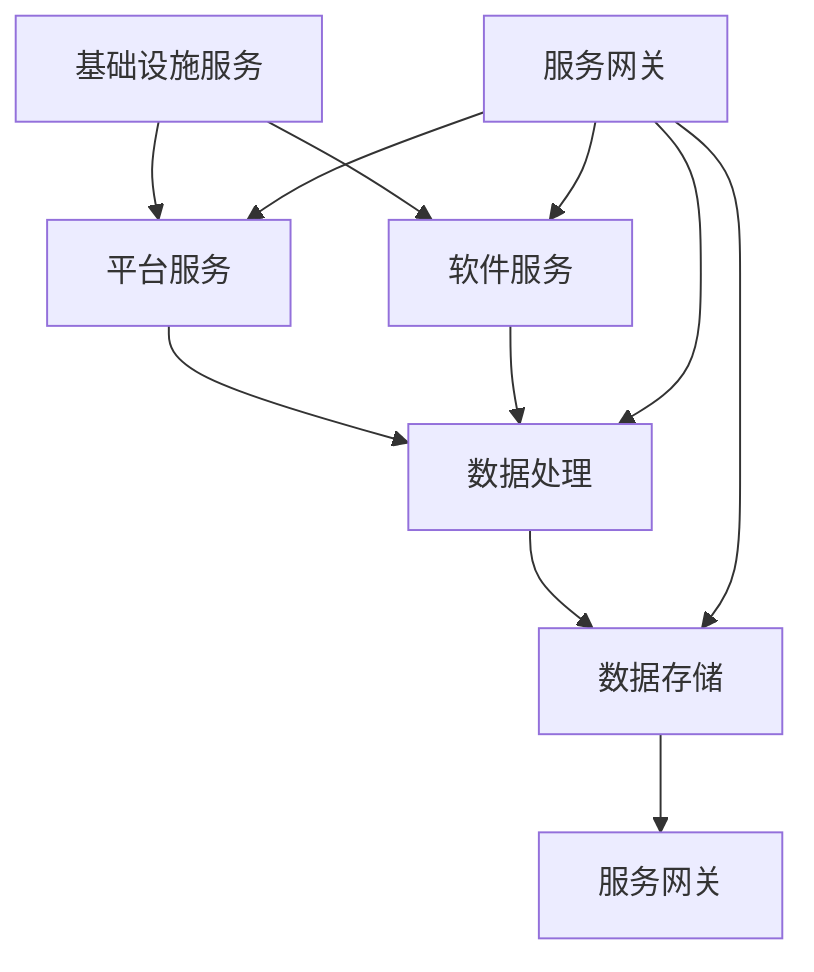
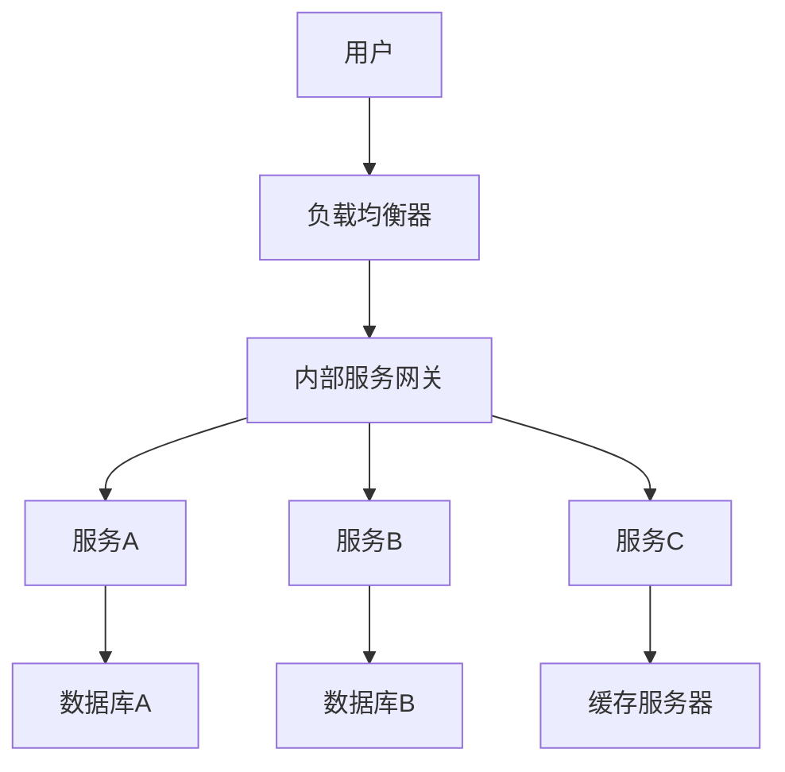
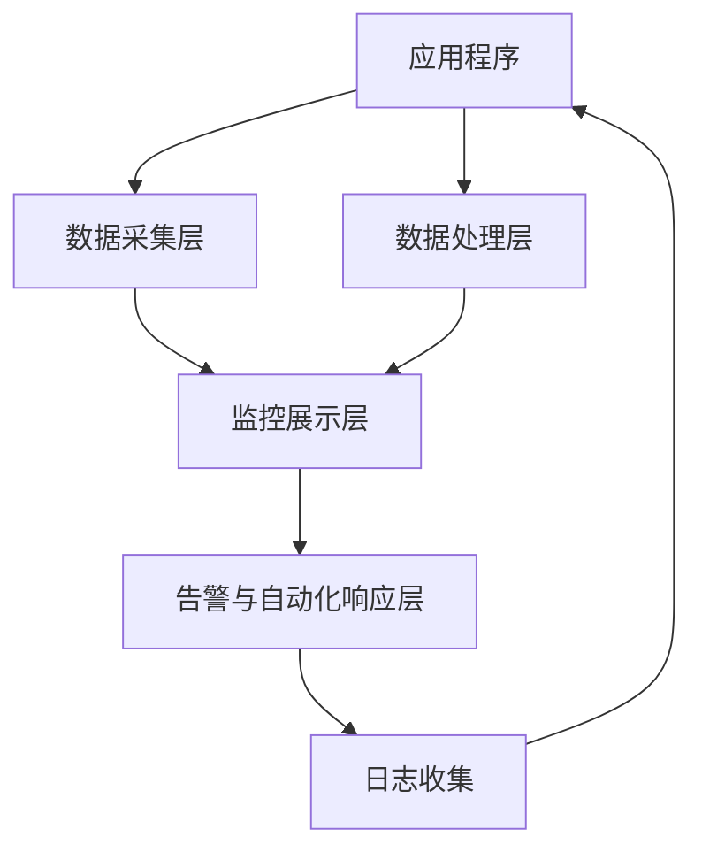
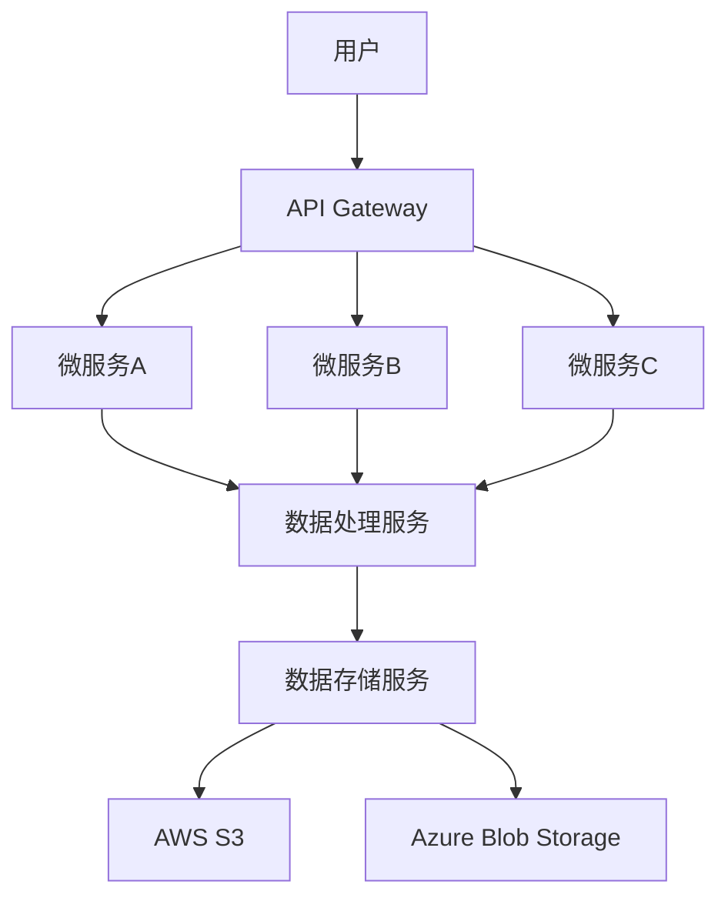

                 

### 引言

在当今快速变化的科技环境中，创业公司面临着前所未有的机遇和挑战。云计算技术的迅猛发展，尤其是多云架构的应用，已经成为创业公司在竞争激烈的市场中取得成功的关键因素。多云架构不仅提供了更高的灵活性和可扩展性，还能够优化成本和提升系统的可靠性。然而，设计一个有效的多云架构并非易事，它需要深入的技术理解和策略性的规划。

本文旨在为创业公司提供一份全面的指南，帮助他们理解和实施多云架构。我们将首先介绍多云架构的基本概念和重要性，然后深入探讨云计算的基础知识，包括云服务模型、服务提供商以及安全与合规性。接下来，我们将详细阐述多云架构的设计原理和策略，包括应用负载均衡、数据存储、网络设计、安全与合规以及成本优化。此外，我们还将介绍多云架构的持续集成与部署、监控与运维，并提供一个实际的案例研究，展示多云架构在创业公司中的应用。

通过这篇文章，读者将能够了解多云架构的复杂性，掌握设计策略，并学会如何在实践中应用这些策略。文章最后还将提供实践指导、工具资源以及技术术语表和参考文献，帮助读者更深入地学习和应用多云架构。

关键词：多云架构、云计算、创业公司、负载均衡、数据存储、网络设计、安全合规、成本优化、持续集成、监控运维

摘要：本文详细探讨了创业公司在云计算时代构建和优化多云架构的策略。通过介绍核心概念、设计原理和实际案例，读者将了解如何有效地设计、部署和维护多云架构，从而在竞争激烈的市场中取得优势。

### 第一部分：导论

#### 第1章：多云架构概述

##### 1.1 多云架构的定义与重要性

多云架构是一种云服务模型，企业将应用程序和服务分布在多个云服务提供商（如AWS、Azure、Google Cloud等）的不同云环境中。这种分布式架构不仅提供了更高的灵活性和可扩展性，还能够优化成本和提升系统的可靠性。

**多云架构的定义**：多云架构是指企业在其业务运营中使用两个或两个以上的云服务提供商，包括公有云、私有云和混合云。这些云服务提供商可能包括但不限于Amazon Web Services（AWS）、Microsoft Azure、Google Cloud Platform（GCP）、阿里云等。通过利用多个云服务提供商的不同优势，企业可以实现更高效、更灵活的IT基础设施。

**多云架构的重要性**：

1. **灵活性与可扩展性**：企业可以根据业务需求灵活选择和调整云服务，支持动态扩展和缩放。例如，在业务高峰期，企业可以迅速增加计算资源，而在需求下降时，可以相应减少资源，从而降低成本。

2. **成本优化**：多云架构允许企业根据特定服务或任务的需求选择最合适的云服务提供商，从而实现成本效益最大化。例如，某些服务可能在AWS上具有更高的性价比，而其他服务可能在Azure上表现更好。

3. **高可用性与容灾性**：通过在多个云服务提供商之间分布数据和应用程序，企业可以提高系统的可靠性，实现高效的数据备份和灾难恢复。如果一个云服务提供商出现故障，企业可以迅速切换到其他云服务提供商，从而确保业务的连续性。

4. **创新与集成**：多云架构鼓励企业采用新兴技术和最佳实践，从而加速创新和整合。企业可以利用不同云服务提供商提供的特定服务或工具，为业务带来额外的价值。

##### 1.2 多云架构的背景与趋势

**云计算的发展历程**：

- **2006年**：Amazon Web Services（AWS）推出其弹性计算云服务（EC2），标志着云计算的商业化起点。
- **2008年**：Google Cloud Platform（GCP）和Microsoft Azure相继推出，云计算市场逐渐成熟。
- **2010年**：混合云和多云架构的概念开始出现，企业开始探索如何在多个云服务提供商之间分配资源。
- **2015年**：随着容器技术（如Docker和Kubernetes）的发展，云原生应用成为主流，多云架构的应用范围进一步扩大。

**当前多云架构的应用趋势**：

1. **云原生应用的普及**：云原生应用采用微服务架构、容器化和自动化部署，具有更高的可扩展性和灵活性。越来越多的企业开始采用云原生应用，推动多云架构的发展。
2. **服务网格的兴起**：服务网格（如Istio和Linkerd）用于管理和优化服务间的通信，提高系统的可靠性和安全性。服务网格在多云架构中的应用越来越普遍。
3. **混合云的整合**：混合云将私有云和公有云的优势结合起来，满足不同业务需求。企业越来越多地采用混合云架构，以提高业务的灵活性和可扩展性。
4. **自动化与智能化**：自动化工具（如Ansible、Terraform和Puppet）和人工智能技术在多云架构中的应用越来越广泛，帮助企业提高运维效率和降低成本。

##### 1.3 本书的目的与结构

**目的**：本书旨在为创业公司提供一份详细的指南，帮助他们理解和实施多云架构。通过介绍核心概念、设计原理、实际案例和实践指导，本书旨在帮助读者掌握多云架构的设计策略，从而在竞争激烈的市场中取得优势。

**结构**：

- **第一部分：导论**：介绍多云架构的基本概念、背景和重要性。
- **第二部分：多云架构设计原理**：详细探讨多云架构的核心概念、设计原则和策略。
- **第三部分：实践指导**：提供多云架构设计流程、工具与资源，以及实际案例研究。
- **附录**：包括技术术语表和参考文献，帮助读者深入学习和应用多云架构。

通过本书，读者将能够全面了解多云架构，掌握设计策略，并在实践中应用这些策略，从而为创业公司的成功奠定基础。

### 第二部分：云计算基础

#### 第2章：云计算基础

##### 2.1 云计算的基本概念

云计算是一种通过网络提供计算资源、存储资源和应用程序服务的模式。它允许用户按需访问和使用这些资源，而不需要直接管理或拥有这些资源。云计算的基本概念包括以下几个方面：

**计算资源**：云计算提供计算资源，如虚拟机（VM）、容器和函数等。用户可以根据需要租用和配置这些资源，以运行应用程序和处理数据。

**存储资源**：云计算提供各种存储解决方案，如对象存储、块存储和文件存储等。用户可以存储和检索大量数据，并管理数据的生命周期。

**应用程序服务**：云计算还提供各种应用程序服务，如软件即服务（SaaS）、平台即服务（PaaS）和基础架构即服务（IaaS）等。用户可以通过这些服务开发和部署应用程序，而不需要管理底层基础设施。

**云计算的服务模型**：云计算的服务模型包括以下几种：

1. **基础设施即服务（IaaS）**：IaaS提供虚拟化的计算资源，如虚拟机、存储和网络等。用户可以完全控制这些资源，并安装和配置所需的软件。

2. **平台即服务（PaaS）**：PaaS提供开发、运行和管理应用程序的平台。用户不需要管理底层基础设施，专注于应用程序的开发和部署。

3. **软件即服务（SaaS）**：SaaS提供完全托管的应用程序服务，用户通过互联网访问这些应用程序，无需安装或维护。

**云计算的服务级别**：云计算的服务级别包括以下几个层次：

1. **计算级别**：计算级别包括虚拟机实例、容器和函数等。用户可以根据需求选择合适的计算资源，以运行应用程序。

2. **存储级别**：存储级别包括对象存储、块存储和文件存储等。用户可以根据数据类型和访问模式选择合适的存储解决方案。

3. **网络级别**：网络级别包括虚拟网络、负载均衡和防火墙等。用户可以配置网络资源，以确保应用程序的安全和可靠性。

##### 2.2 云服务模型（IaaS、PaaS、SaaS）

**IaaS（基础设施即服务）**：

- **定义**：IaaS提供虚拟化的计算资源，如虚拟机、存储和网络等。用户可以完全控制这些资源，并安装和配置所需的软件。
- **优点**：
  - **灵活性**：用户可以根据需求灵活配置和扩展计算资源。
  - **控制性**：用户可以完全控制和管理底层基础设施。
  - **成本效益**：用户只需为实际使用的资源付费，从而降低成本。
- **适用场景**：
  - **开发与测试**：IaaS适用于开发和测试环境，因为用户可以快速创建和配置虚拟机实例。
  - **大数据处理**：IaaS适用于大规模数据处理和计算任务，因为用户可以灵活地调整计算资源。

**PaaS（平台即服务）**：

- **定义**：PaaS提供开发、运行和管理应用程序的平台。用户不需要管理底层基础设施，专注于应用程序的开发和部署。
- **优点**：
  - **开发效率**：PaaS简化了应用程序的开发和部署流程，提高了开发效率。
  - **高可用性**：PaaS提供高可用性和容错性，确保应用程序的稳定运行。
  - **集成性**：PaaS提供丰富的集成工具和库，方便用户开发和部署应用程序。
- **适用场景**：
  - **Web应用开发**：PaaS适用于Web应用开发，因为用户可以快速构建和部署应用程序。
  - **企业应用开发**：PaaS适用于企业应用开发，因为用户可以专注于业务逻辑，而不需要管理底层基础设施。

**SaaS（软件即服务）**：

- **定义**：SaaS提供完全托管的应用程序服务，用户通过互联网访问这些应用程序，无需安装或维护。
- **优点**：
  - **便捷性**：用户可以随时随地访问应用程序，无需安装或维护。
  - **成本效益**：SaaS降低了软件采购和维护成本，用户只需为使用付费。
  - **升级与更新**：SaaS提供商负责应用程序的升级和更新，确保用户使用的是最新版本。
- **适用场景**：
  - **企业办公应用**：SaaS适用于企业办公应用，如电子邮件、日历和协作工具。
  - **客户关系管理**：SaaS适用于客户关系管理（CRM）系统，如Salesforce和HubSpot。

##### 2.3 云计算的服务提供商

云计算市场上存在多个主要的服务提供商，每个提供商都有其独特的优势和特点。以下是一些主要的云计算服务提供商：

**Amazon Web Services（AWS）**：

- **优势**：AWS是全球领先的云计算服务提供商，提供广泛的云服务和强大的生态系统。AWS在安全性、可靠性和全球覆盖方面具有显著优势。
- **服务**：AWS提供IaaS、PaaS和SaaS服务，包括EC2（虚拟机实例）、S3（对象存储）、RDS（数据库服务）、Lambda（函数计算）等。

**Microsoft Azure**：

- **优势**：Azure是微软的云计算平台，与Microsoft 365和其他微软产品紧密集成，提供强大的开发工具和丰富的云服务。
- **服务**：Azure提供IaaS、PaaS和SaaS服务，包括Azure VMs（虚拟机实例）、Azure SQL Database（数据库服务）、Azure Functions（函数计算）等。

**Google Cloud Platform（GCP）**：

- **优势**：GCP是谷歌的云计算平台，以其强大的数据分析和机器学习服务而闻名。GCP在数据存储、处理和分析方面具有显著优势。
- **服务**：GCP提供IaaS、PaaS和SaaS服务，包括Compute Engine（虚拟机实例）、Google Cloud SQL（数据库服务）、Google Cloud Functions（函数计算）等。

**阿里云**：

- **优势**：阿里云是中国最大的云计算服务提供商，提供广泛的服务和强大的本地化支持。阿里云在电子商务和金融领域具有丰富的经验。
- **服务**：阿里云提供IaaS、PaaS和SaaS服务，包括ECS（虚拟机实例）、RDS（数据库服务）、Object Storage（对象存储）等。

**IBM Cloud**：

- **优势**：IBM Cloud提供强大的企业级云服务，以其在混合云和多云解决方案方面的专业能力而著称。
- **服务**：IBM Cloud提供IaaS、PaaS和SaaS服务，包括IBM Cloud VM（虚拟机实例）、IBM DB2（数据库服务）、IBM Watson（人工智能服务）等。

这些云计算服务提供商各具特色，企业可以根据自己的需求和资源选择最合适的服务提供商。在选择云计算服务提供商时，需要考虑服务可靠性、性能、安全性、成本和生态系统等因素。

##### 2.4 云计算的安全与合规

云计算的安全和合规性是企业和用户关注的重要问题。在云计算环境中，数据和应用程序的安全性和合规性需要得到有效保障，以防止数据泄露、违规行为和系统故障。

**安全措施**：

1. **身份验证与访问控制**：使用强密码和多因素身份验证确保只有授权用户可以访问系统和数据。实施严格的访问控制策略，确保用户只能访问他们需要的数据和资源。

2. **加密**：对敏感数据进行加密，确保在传输和存储过程中保护数据的安全性。使用SSL/TLS等加密协议保护数据传输的安全性。

3. **网络安全**：部署防火墙、入侵检测系统和入侵防御系统（IDS/IPS），保护网络免受恶意攻击。定期更新和打补丁，确保系统的安全性。

4. **数据备份与恢复**：定期备份数据，确保在数据丢失或系统故障时能够快速恢复。实施灾难恢复计划，确保业务的连续性和可靠性。

**合规性要求**：

1. **数据隐私法**：遵守数据隐私法规，如通用数据保护条例（GDPR）和加州消费者隐私法案（CCPA），保护用户数据的隐私。

2. **行业标准和认证**：遵守行业标准和认证，如ISO 27001、PCI DSS和SOC 2，确保系统的安全性和合规性。

3. **监管要求**：遵守特定行业的监管要求，如金融、医疗和政府部门的合规性要求，确保业务运营符合法规。

云计算服务提供商通常提供一系列安全和服务保障措施，帮助企业和用户满足安全和合规性要求。然而，企业和用户也需要采取必要的措施，确保在云计算环境中保护数据和系统的安全性。

通过了解和实施这些安全与合规措施，企业和用户可以在云计算环境中确保数据和系统的安全性和合规性，从而放心地使用云计算服务。

### 第二部分：多云架构设计原理

#### 第3章：多云架构的核心概念

多云架构的核心概念和组成部分是理解和设计有效多云架构的基础。在本章中，我们将深入探讨多云架构的组成部分、架构风格、设计原则以及优缺点分析，帮助读者全面了解多云架构的复杂性。

##### 3.1 多云架构的组成部分

多云架构由多个关键组成部分构成，这些组成部分协同工作，确保系统的灵活性、可靠性和效率。以下是多云架构的主要组成部分：

1. **基础设施服务（Infrastructure Services）**：基础设施服务是多云架构的基础，包括虚拟机实例、容器实例、服务器、存储和网络资源等。基础设施服务提供了计算、存储和网络的资源，使应用程序可以在云环境中运行。

2. **平台服务（Platform Services）**：平台服务提供了开发、部署和管理应用程序的环境。这些服务包括计算服务（如AWS Lambda、Azure Functions）、数据库服务（如AWS RDS、Azure SQL Database）、存储服务（如AWS S3、Azure Blob Storage）等。

3. **软件服务（Software Services）**：软件服务包括应用程序、库、框架和中间件等。这些服务为应用程序提供了功能，如Web服务、API、消息队列和缓存等。

4. **数据处理（Data Processing）**：数据处理服务包括数据存储、数据分析和数据挖掘等功能。这些服务使得企业能够有效管理、分析和利用其数据资源。

5. **数据存储（Data Storage）**：数据存储服务提供了持久化的数据存储解决方案，如关系数据库、NoSQL数据库、文件存储和对象存储等。

6. **服务网关（Service Gateway）**：服务网关提供了云服务之间的通信控制和安全保障。服务网关可以实现服务发现、负载均衡、身份验证和授权等功能。

这些组成部分相互关联，构成了多云架构的核心。下图展示了多云架构的组成部分及其关系：



##### 3.2 多云架构的架构风格

多云架构的架构风格是指如何组织和设计应用程序和服务，以确保系统的高可用性、可扩展性和灵活性。以下是几种常见的多云架构风格：

1. **微服务架构**：微服务架构将应用程序划分为一组独立的、可独立部署和扩展的服务单元。每个服务负责特定的业务功能，通过轻量级的通信机制（如REST API、消息队列）进行交互。微服务架构具有高可扩展性和灵活性，但管理复杂性也相应增加。

2. **服务网格架构**：服务网格架构是一种基础设施层，用于管理和协调服务间的通信。服务网格通过边车代理（sidecar proxies）实现服务发现、负载均衡、断路器和安全等功能。服务网格简化了服务间的通信，提高了系统的可靠性和安全性。

3. **混合云架构**：混合云架构将私有云和公有云相结合，利用两者的优势。私有云用于敏感数据和关键业务系统，公有云用于非敏感数据和可扩展性需求。混合云架构提供了灵活性和可靠性，但需要有效的数据管理和合规性策略。

4. **容器化架构**：容器化架构利用容器（如Docker容器）将应用程序及其依赖项打包在一起，实现应用程序的轻量级、可移植和隔离性。容器化架构简化了应用程序的部署和扩展，提高了系统的可维护性和可伸缩性。

不同架构风格的选择取决于企业的业务需求、技术能力和资源限制。在实际应用中，企业可能采用多种架构风格的组合，以实现最佳的系统性能和用户体验。

##### 3.3 多云架构的设计原则

设计多云架构时，需要遵循一系列设计原则，以确保系统的可靠性、可维护性和可扩展性。以下是几个关键的设计原则：

1. **灵活性**：多云架构应具备高度的灵活性，能够快速响应业务需求的变化。这意味着需要设计可动态扩展和缩放的组件，并确保服务之间的高可用性。

2. **高可用性**：高可用性是多云架构的核心原则之一。通过在多个云服务提供商之间分布数据和应用程序，以及实施冗余和备份策略，可以提高系统的可靠性，确保业务的连续性。

3. **安全性**：安全性是多云架构设计中不可忽视的方面。需要采用严格的安全策略，包括加密、身份验证、访问控制和网络安全等，确保数据和应用程序的安全。

4. **成本优化**：多云架构的设计应考虑成本优化，避免不必要的资源浪费。通过合理的资源规划和使用，以及选择合适的云服务提供商和服务模型，可以实现成本效益最大化。

5. **自动化与智能化**：自动化和智能化是提高多云架构效率和降低运维成本的关键。通过自动化工具（如Ansible、Terraform）和人工智能技术，可以实现基础设施和应用程序的自动化部署、监控和优化。

6. **监控与运维**：有效的监控和运维策略是确保多云架构稳定运行的关键。通过实时监控、性能优化和自动化运维，可以及时发现和解决潜在问题，提高系统的可靠性和性能。

7. **合规性**：在多云架构设计中，需要遵守相关的法律法规和合规性要求，确保系统的合法性和数据安全性。这包括数据隐私法、行业标准和认证等。

这些设计原则相互作用，共同构建了一个可靠、高效和灵活的多云架构。在实际应用中，企业需要根据自身业务需求和技术能力，灵活运用这些原则，以实现最佳的系统性能和用户体验。

##### 3.4 多云架构的优缺点分析

多云架构具有许多优点，但也存在一些缺点。以下是多云架构的主要优缺点分析：

**优点**：

1. **灵活性与可扩展性**：多云架构允许企业根据业务需求灵活选择和调整云服务，支持动态扩展和缩放。这有助于企业快速响应市场变化和需求波动。

2. **成本优化**：通过在多个云服务提供商之间选择最佳服务，企业可以实现成本效益最大化。企业可以根据特定服务或任务的需求选择最合适的云服务提供商，从而降低成本。

3. **高可用性与容灾性**：通过在多个云服务提供商之间分布数据和应用程序，多云架构提高了系统的可靠性，实现了高效的数据备份和灾难恢复。

4. **创新与集成**：多云架构鼓励企业采用新兴技术和最佳实践，从而加速创新和整合。企业可以利用不同云服务提供商提供的特定服务或工具，为业务带来额外的价值。

5. **风险分散**：多云架构将业务分布在多个云服务提供商之间，降低了单点故障的风险。如果一个云服务提供商出现故障，企业可以迅速切换到其他云服务提供商，从而确保业务的连续性。

**缺点**：

1. **复杂性和管理难度**：多云架构的管理和维护较为复杂，需要投入更多的时间和资源。企业需要掌握多个云服务提供商的特性和工具，以确保系统的稳定运行。

2. **安全性和合规性**：在多云环境下，安全性和合规性问题需要高度重视。企业需要确保在多个云环境中保护数据和应用程序的安全，并遵守相关的法律法规和合规性要求。

3. **成本不可预测**：虽然多云架构可以实现成本优化，但成本也具有一定的不可预测性。企业需要密切关注云资源的实际使用情况，以避免过度消费和成本超支。

4. **服务集成与兼容性**：不同云服务提供商的服务可能存在差异，这可能导致集成和兼容性问题。企业需要确保在多云环境中实现服务的一致性和互操作性。

5. **依赖性增加**：多云架构增加了对云服务提供商的依赖性。如果某个云服务提供商出现重大故障或政策变化，可能会对企业的业务运营造成影响。

通过了解多云架构的优缺点，企业可以更好地评估和规划多云架构的实施，以充分利用其优势，同时规避潜在的风险和挑战。

### 第三部分：多云架构设计策略

#### 第4章：多云架构设计策略

在设计多云架构时，需要综合考虑多个因素，包括应用负载均衡、数据存储与管理、网络设计、安全与合规以及成本优化。本章将详细探讨这些设计策略，帮助读者构建高效、可靠和灵活的多云架构。

##### 4.1 应用负载均衡策略

应用负载均衡是多云架构设计中的一个关键策略，其目的是将用户请求均匀地分布到多个服务器或服务实例上，确保系统的性能和可靠性。以下是一些常用的负载均衡策略和算法：

**负载均衡策略**：

1. **轮询算法**：轮询算法是最简单的负载均衡策略，它将请求依次分配到每个服务器或实例上。这种方法简单易实现，但可能导致某些服务器或实例负载不均衡。

2. **最小连接数算法**：最小连接数算法将请求分配到当前连接数最少的服务器或实例上。这种方法可以确保负载均衡，但可能需要维护一个全局连接表，增加了复杂性。

3. **最小响应时间算法**：最小响应时间算法将请求分配到响应时间最短的服务器或实例上。这种方法可以减少用户的等待时间，但需要实时监控服务器的响应时间，增加了监控成本。

4. **基于权重算法**：基于权重算法将请求分配到具有不同权重（如CPU利用率、内存利用率）的服务器或实例上。这种方法可以根据服务器的实际负载进行负载均衡，但需要定期调整权重。

**负载均衡算法的实现**（伪代码）：

```python
def load_balancer(requests):
    active_servers = get_active_servers()
    server_loads = get_server_loads(active_servers)
    
    # 轮询算法
    for server in active_servers:
        if server_loads[server] < threshold:
            return server
    
    # 最小连接数算法
    min_connections = min(server_loads.values())
    for server, load in server_loads.items():
        if load == min_connections:
            return server
    
    # 最小响应时间算法
    min_response_time = min(server_response_times.values())
    for server, response_time in server_response_times.items():
        if response_time == min_response_time:
            return server
    
    # 基于权重算法
    weighted_servers = weighted_random_choice(active_servers, server_loads)
    return weighted_servers
```

**负载均衡器的配置**：在实际应用中，可以使用专门的负载均衡器（如Nginx、HAProxy）或云服务提供商提供的负载均衡服务（如AWS ELB、Azure Load Balancer）。负载均衡器的配置应考虑以下因素：

- **健康检查**：定期检查服务器的健康状态，确保只将请求分配到健康的服务器上。
- **会话保持**：对于需要会话保持的应用程序，确保负载均衡器能够跟踪用户会话，将同一用户的请求分配到同一服务器上。
- **负载均衡算法**：选择合适的负载均衡算法，根据业务需求和性能指标进行调整。

通过合理的负载均衡策略和配置，可以有效提高系统的性能和可靠性，确保用户获得良好的体验。

##### 4.2 数据存储与管理策略

数据存储是多云架构设计中的关键部分，涉及到数据的存储方式、备份策略、数据迁移和数据管理的方方面面。以下是一些常用的数据存储与管理策略：

**数据存储模型设计**：在设计数据存储模型时，需要考虑数据的类型、访问模式和性能要求。以下是一个简单的数据存储模型设计（伪代码）：

```python
class DataStorageModel:
    def __init__(self, storage_service):
        self.storage_service = storage_service

    def store_data(self, data):
        self.storage_service.save(data)

    def retrieve_data(self, identifier):
        return self.storage_service.load(identifier)
```

**数据存储策略**：

1. **分层存储**：根据数据的重要性和访问频率，采用分层存储策略。例如，将热数据（高访问频率）存储在SSD上，将温数据和冷数据（低访问频率）存储在HDD或对象存储上。

2. **多区域复制**：在多个云服务提供商之间复制数据，提高数据的可用性和容灾性。可以使用同步复制或异步复制，根据数据的重要性和延迟要求进行选择。

3. **数据压缩与加密**：对数据进行压缩和加密，减少存储空间和带宽消耗，提高数据的安全性。

**数据备份策略**：备份是确保数据安全性和可用性的重要手段。以下是一些常用的数据备份策略：

1. **全量备份**：定期进行全量备份，将整个数据集备份到一个独立的位置。这种方法简单易实现，但备份时间和存储空间需求较大。

2. **增量备份**：只备份自上次备份以来发生变化的数据。这种方法备份时间较短，但需要更多的存储空间和备份链管理。

3. **差异备份**：备份自上次全量备份以来发生变化的数据。这种方法在备份时间和存储空间需求之间取得平衡。

**数据迁移策略**：在多云环境中，数据迁移是常见的操作，例如从本地环境迁移到云环境，或在云服务提供商之间迁移数据。以下是一些常用的数据迁移策略：

1. **数据复制**：在迁移过程中，将数据复制到目标位置。这种方法简单易实现，但需要大量的带宽和存储空间。

2. **批量导入**：将数据批量导入到目标数据库或存储系统。这种方法适用于大规模数据迁移，但需要较长的迁移时间和复杂的配置。

3. **数据交换**：使用数据交换工具（如ETL工具）将数据从源系统迁移到目标系统。这种方法提供了灵活性和高效率，但需要较高的技术复杂度。

**数据管理工具**：为了有效地管理和维护数据，可以采用以下数据管理工具：

- **数据仓库**：用于存储和管理大量结构化和非结构化数据，提供数据分析和报告功能。
- **数据湖**：用于存储和管理大规模数据，包括原始数据和清洗后的数据，支持数据挖掘和机器学习。
- **数据管理平台**：用于数据集成、数据质量和数据安全的管理，提供数据治理和合规性功能。

通过合理的数据存储与管理策略，可以有效保护数据的安全性和完整性，提高数据的可用性和性能，满足业务需求。

##### 4.3 网络设计策略

网络设计是多云架构设计中的重要环节，决定了系统的可访问性、可靠性和性能。以下是一些常用的网络设计策略：

**网络拓扑设计**：网络拓扑设计决定了数据在云环境中的传输路径和通信机制。以下是一个简单的网络拓扑设计（使用Mermaid流程图）：



**网络设计策略**：

1. **负载均衡**：使用负载均衡器（如AWS ELB、Azure Load Balancer）将用户请求分配到多个后端服务器或服务实例上，提高系统的性能和可靠性。

2. **内部服务网关**：内部服务网关（如AWS VPC、Azure Virtual Network）用于管理内部网络，实现不同服务之间的通信。内部服务网关可以提供网络隔离、防火墙和安全组等功能。

3. **服务发现**：服务发现（如Consul、Eureka）用于自动发现和注册服务实例，确保服务之间的可靠通信。服务发现可以减少手动配置和维护网络地址的工作量。

4. **网络隔离与安全**：通过网络隔离和安全组（如AWS Security Groups、Azure Network Security Groups）限制不同服务之间的访问，确保系统的安全性。

5. **边缘计算**：边缘计算（如AWS Lambda@Edge、Azure Front Door）将计算和存储资源部署到网络边缘，提高系统的响应速度和性能。

6. **全球负载均衡**：使用全球负载均衡器（如AWS Global Accelerator、Azure Traffic Manager）将用户请求分配到全球的多个数据中心，确保系统的性能和可用性。

通过合理的网络设计策略，可以有效提高系统的可访问性、可靠性和性能，确保用户获得良好的体验。

##### 4.4 安全与合规策略

安全与合规性是多云架构设计中的重要方面，直接关系到企业数据和应用程序的安全性和合法性。以下是一些常用的安全与合规策略：

**安全策略设计**：在设计安全策略时，需要考虑以下几个方面：

1. **身份验证与访问控制**：使用强密码和多因素身份验证确保只有授权用户可以访问系统和数据。实施严格的访问控制策略，确保用户只能访问他们需要的数据和资源。

2. **加密**：对敏感数据进行加密，确保在传输和存储过程中保护数据的安全性。使用SSL/TLS等加密协议保护数据传输的安全性。

3. **网络安全**：部署防火墙、入侵检测系统和入侵防御系统（IDS/IPS），保护网络免受恶意攻击。定期更新和打补丁，确保系统的安全性。

4. **数据备份与恢复**：定期备份数据，确保在数据丢失或系统故障时能够快速恢复。实施灾难恢复计划，确保业务的连续性和可靠性。

5. **监控与日志记录**：实施实时监控和日志记录，及时发现和响应潜在的安全威胁和异常行为。使用安全信息和事件管理（SIEM）系统集中管理和分析日志数据。

**合规性策略**：在多云架构设计中，需要遵守相关的法律法规和合规性要求，确保系统的合法性和数据安全性。以下是一些常见的合规性策略：

1. **数据隐私法**：遵守数据隐私法规，如通用数据保护条例（GDPR）和加州消费者隐私法案（CCPA），保护用户数据的隐私。

2. **行业标准和认证**：遵守行业标准和认证，如ISO 27001、PCI DSS和SOC 2，确保系统的安全性和合规性。

3. **监管要求**：遵守特定行业的监管要求，如金融、医疗和政府部门的合规性要求，确保业务运营符合法规。

通过合理的安全与合规策略设计，可以有效保护数据的安全性和合法性，确保企业在多云环境中合规运营。

##### 4.5 云服务成本优化策略

云服务成本优化是多云架构设计中的关键因素，直接影响到企业的财务状况和运营效率。以下是一些常用的云服务成本优化策略：

**成本优化策略**：

1. **资源规划**：合理规划云资源，包括计算、存储、网络等，确保资源利用最大化。根据业务需求和资源使用情况，动态调整资源规模。

2. **预留实例和长期合约**：使用预留实例和长期合约，降低计算和存储成本。预留实例适用于长期运行的应用程序，而长期合约适用于需要长期使用云服务的场景。

3. **自动扩展**：启用自动扩展功能，根据业务需求动态调整资源规模，避免资源浪费。自动扩展可以降低成本，提高系统的可靠性。

4. **使用免费的云服务**：充分利用云服务提供商提供的免费服务和试用期优惠，降低初始成本。例如，AWS的AWS Free Tier、Azure的Azure Free Account等。

5. **数据传输优化**：优化数据传输，降低带宽和传输成本。使用数据传输优化工具，如AWS DataSync、Azure Data Box等，减少数据传输的时间和费用。

6. **成本监控与报告**：定期监控云资源使用情况和成本支出，生成详细的成本报告。通过成本监控和报告，及时发现成本超支和资源浪费的问题，并采取相应的优化措施。

7. **多云比较**：定期比较不同云服务提供商的价格和性能，选择性价比最高的服务。根据业务需求，灵活调整云服务提供商，实现成本优化。

通过合理的云服务成本优化策略，可以有效降低云服务的成本，提高企业的财务状况和运营效率。

### 第四部分：多云架构的持续集成与部署

#### 第5章：多云架构的持续集成与部署

持续集成（CI）和持续部署（CD）是多云架构设计中的重要组成部分，它们通过自动化流程和工具确保代码的质量、加速开发迭代速度并提高部署的可靠性。在本章中，我们将详细探讨CI/CD在多云环境中的应用，包括持续集成与持续部署的流程设计、自动化部署流程设计以及多云环境下的容器化与编排。

##### 5.1 持续集成（CI）与持续部署（CD）

**持续集成（CI）**：持续集成是一种软件开发和部署实践，通过自动化构建和测试，确保代码仓库中的每个提交都是可集成和可测试的。CI的主要目标是快速发现和修复代码中的错误，从而提高代码质量和开发效率。

**持续部署（CD）**：持续部署是CI的延伸，它通过自动化流程将经过测试的代码部署到生产环境中。CD的目标是确保代码的可靠部署，减少人为干预，从而提高系统的可用性和用户体验。

**CI/CD流程设计**：

CI/CD流程设计包括以下关键步骤：

1. **代码提交**：开发人员将代码提交到版本控制系统（如Git）。
2. **构建**：CI工具（如Jenkins、GitLab CI）从版本控制系统中拉取最新代码，构建应用程序。构建过程包括编译代码、运行测试和生成构建产物。
3. **测试**：构建完成后，CI工具运行一系列自动化测试，包括单元测试、集成测试和端到端测试，确保代码质量。
4. **部署**：测试通过后，CI/CD工具将构建产物部署到测试环境。部署过程包括配置管理、数据库迁移和应用部署。
5. **监控**：部署完成后，系统进行监控，确保应用程序正常运行。如果出现故障，CI/CD工具会自动回滚到上一个稳定版本。

**CI/CD流程设计**（伪代码）：

```python
class CI_CD_Pipeline:
    def __init__(self, code_repo, build_service, deploy_service):
        self.code_repo = code_repo
        self.build_service = build_service
        self.deploy_service = deploy_service

    def trigger_build(self):
        # 拉取最新代码
        self.code_repo.pull_latest_changes()

        # 执行构建过程
        self.build_service.execute_build()

        # 运行测试
        self.build_service.run_tests()

        # 构建成功后，将构建产物推送到部署服务
        if self.build_service.build_succeeded():
            self.deploy_service.deploy_artifacts()
```

##### 5.2 自动化部署流程设计

自动化部署流程设计是CI/CD的核心，它通过自动化工具和脚本实现应用程序的快速、可靠部署。以下是一个简单的自动化部署流程设计：

1. **构建**：构建应用程序，生成可执行文件或容器镜像。
2. **测试**：在测试环境中运行自动化测试，确保应用程序的稳定性和性能。
3. **部署**：将经过测试的应用程序部署到生产环境。部署过程可能包括以下步骤：

   - **配置管理**：配置应用程序所需的环境和依赖项。
   - **数据库迁移**：迁移数据库和数据存储库，确保数据的完整性和一致性。
   - **应用部署**：部署应用程序，启动服务，确保应用程序的正常运行。

**自动化部署脚本**（伪代码）：

```shell
#!/bin/bash

# 拉取代码
git pull origin master

# 构建应用
mvn clean install

# 部署到测试环境
docker-compose -f test.yml up -d

# 运行测试
./run-tests.sh

# 如果测试通过，部署到生产环境
if [ $? -eq 0 ]; then
    docker-compose -f prod.yml up -d
else
    echo "Tests failed, deployment aborted."
fi
```

通过自动化部署流程设计，企业可以实现快速、可靠的部署，减少手动干预，提高开发效率。

##### 5.3 多云环境下的容器化与编排

容器化是多云架构设计中的重要一环，它通过将应用程序及其依赖项打包到容器中，实现应用程序的轻量级、可移植和隔离性。容器化使得应用程序可以在不同的环境中运行，无需担心环境差异，从而提高了系统的可移植性和可靠性。

**容器化**：

- **Dockerfile**：Dockerfile是一个文本文件，用于定义容器的构建过程。以下是一个简单的Dockerfile示例：

```Dockerfile
FROM openjdk:8-jdk-alpine

# 设置环境变量
ENV JAVA_OPTS="-Xms128m -Xmx512m -Djava.security.egd=file:/dev/./urandom"

# 安装依赖
RUN apk add --no-cache wget

# 下载和安装应用
RUN wget -q https://your-app-url.com/your-app.jar -O /your-app.jar
RUN jar xvf /your-app.jar

# 运行应用
ENTRYPOINT ["java", "-jar", "/your-app/target/your-app-1.0-SNAPSHOT.jar"]
```

- **Docker Compose**：Docker Compose是一个用于定义和运行多容器应用程序的工具。以下是一个简单的Docker Compose文件示例：

```yaml
version: '3'
services:
  web:
    image: your-app:latest
    ports:
      - "8080:8080"
    depends_on:
      - db
  db:
    image: postgres:latest
    environment:
      POSTGRES_DB: your_db
      POSTGRES_USER: your_user
      POSTGRES_PASSWORD: your_password
```

**编排**：

- **Kubernetes**：Kubernetes是一个开源的容器编排平台，用于自动化部署、扩展和管理容器化应用程序。以下是一个简单的Kubernetes部署文件示例：

```yaml
apiVersion: apps/v1
kind: Deployment
metadata:
  name: your-app
spec:
  replicas: 3
  selector:
    matchLabels:
      app: your-app
  template:
    metadata:
      labels:
        app: your-app
    spec:
      containers:
      - name: your-app
        image: your-app:latest
        ports:
        - containerPort: 8080
```

通过容器化和编排，企业可以实现应用程序的快速部署、扩展和管理，从而提高系统的灵活性和可扩展性。

### 第五部分：多云架构的监控与运维

#### 第6章：多云架构的监控与运维

在现代云计算环境中，多云架构的监控与运维至关重要。有效的监控和运维策略不仅能够确保系统的稳定性和性能，还能够及时发现和解决问题，从而提高用户体验和业务效率。本章将详细介绍多云架构的监控与运维策略，包括云监控体系设计、云服务性能优化、自动化运维工具与实践。

##### 6.1 云监控体系设计

云监控体系是确保多云架构稳定运行的关键。一个完善的云监控体系可以实时收集系统数据，进行分析和告警，帮助企业快速发现和解决问题。以下是一个典型的云监控体系设计：

**监控架构**：

- **数据采集层**：负责收集来自不同云服务提供商和应用程序的数据，如性能指标、日志数据和事件数据。常用的数据采集工具包括Prometheus、Grafana、Zabbix等。
- **数据处理层**：对采集到的数据进行分析和转换，生成监控指标和可视化报表。数据处理层通常包括数据存储、数据分析和数据处理框架等。
- **监控展示层**：提供监控数据的可视化展示，帮助运维人员快速了解系统状态和性能。常用的监控展示工具包括Grafana、Kibana等。
- **告警与自动化响应层**：根据预设的告警规则，对异常数据进行告警，并触发自动化响应措施，如自动重启服务、扩容资源等。

**云监控架构设计**（使用Mermaid流程图）：



通过这个监控架构，企业可以实现全面的系统监控，确保及时发现和解决问题。

##### 6.2 云服务性能优化

云服务性能优化是确保多云架构高效运行的关键。以下是一些常用的性能优化策略：

**性能优化策略**：

1. **资源调整**：根据系统负载和性能指标，动态调整资源配置，包括CPU、内存、磁盘和网络资源等。例如，使用自动扩展功能根据负载自动调整实例数量。
2. **缓存策略**：引入缓存机制，如Redis、Memcached等，减少对后端数据库的访问压力。缓存可以存储经常访问的数据，提高系统的响应速度。
3. **数据库优化**：优化数据库性能，包括索引优化、查询优化、分库分表等。例如，使用垂直拆分和水平拆分策略，将数据拆分为多个数据库实例，提高查询效率。
4. **网络优化**：优化网络配置，包括负载均衡、CDN加速和防火墙策略等。通过合理配置网络资源，提高数据传输速度和系统稳定性。
5. **自动化监控与优化**：使用自动化监控工具（如Prometheus、Grafana）实时监控系统性能，根据监控数据自动调整资源配置和优化策略。

**性能优化策略**（伪代码）：

```python
def optimize_performance(service):
    # 分析性能瓶颈
    analyze_bottlenecks(service)

    # 调整资源配置
    adjust_resources(service)

    # 优化网络配置
    optimize_network(service)

    # 实施负载均衡
    implement_load_balancing(service)

    # 持续监控与优化
    monitor_and_optimize(service)
```

通过这些优化策略，企业可以显著提高多云架构的性能和可靠性。

##### 6.3 自动化运维工具与实践

自动化运维工具是提高多云架构运维效率的关键。以下是一些常用的自动化运维工具和实际应用案例：

**自动化运维工具**：

- **Ansible**：Ansible是一个开源的自动化工具，用于配置管理和应用部署。通过简单的YAML配置文件，可以实现自动化部署、配置管理和监控。
- **Terraform**：Terraform是一个开源的基础设施即代码（IaC）工具，用于自动化部署和管理云基础设施。通过简单的HCL（HashiCorp Configuration Language）配置文件，可以自动化创建、配置和管理云资源。
- **Puppet**：Puppet是一个开源的自动化工具，用于系统配置管理和自动化部署。通过简单的Puppet代码，可以实现自动化部署、配置管理和监控。

**自动化运维实践**（伪代码）：

```python
def deploy_app_to多云环境():
    # 编写Terraform配置文件
    write_terraform_config()

    # 部署基础设施
    terraform_apply()

    # 部署应用
    deploy_app_with_ansible()

    # 验证部署
    verify_deployment()
```

通过自动化运维工具和实践，企业可以显著降低运维成本，提高运维效率。

### 第六部分：创业公司的多云架构案例研究

#### 第7章：创业公司的多云架构案例研究

在本章中，我们将通过一个创业公司的案例研究，详细探讨多云架构在现实世界中的应用。该创业公司专注于提供企业级数据分析解决方案，我们将在以下部分中介绍其业务背景、架构设计、实施过程、架构优化与实践经验，以及取得的成果和反思。

##### 7.1 案例背景

该创业公司名为“数据分析之星”（Data Analysis Stars），成立于2020年，专注于为企业提供高效、可靠的数据分析解决方案。随着公司的快速成长，业务需求不断增加，数据分析之星面临着如何在有限的资源下快速扩展和优化系统的挑战。

**业务需求**：

- **可扩展性**：随着客户数量的增加，系统需要能够快速扩展，以满足不断增长的计算和存储需求。
- **高可用性**：系统必须确保高可用性，避免因单点故障导致的业务中断。
- **成本优化**：在保持高性能和高可靠性的同时，需要优化云服务成本，避免资源浪费。
- **安全性**：保护客户数据的安全和隐私，遵守相关法律法规和合规性要求。

##### 7.2 多云架构设计与实施

**架构设计**：

数据分析之星选择了AWS和Azure作为主要的云服务提供商，基于微服务架构设计其多云架构。架构设计的关键组成部分包括：

- **基础设施服务**：使用AWS EC2和Azure VM实例作为计算资源，根据需求动态调整实例类型和大小。
- **平台服务**：使用AWS Lambda和Azure Functions提供函数计算服务，用于处理实时数据处理任务。
- **数据处理**：使用AWS Kinesis和Azure Stream Analytics处理实时数据流，确保高效的数据处理能力。
- **数据存储**：使用AWS S3和Azure Blob Storage进行数据存储，确保数据的可靠性和持久性。
- **软件服务**：构建一组微服务，包括数据处理、数据可视化、报表生成等，以提高系统的灵活性和可维护性。
- **服务网关**：使用AWS API Gateway和Azure API Management服务提供API网关，实现服务发现和负载均衡。

**实施过程**：

1. **需求分析**：与业务团队紧密合作，明确业务需求和性能指标，确定系统性能、安全、成本等方面的要求。
2. **架构设计**：基于需求设计多云架构，确保高可用性和弹性，同时考虑安全性和成本优化。
3. **环境搭建**：在AWS和Azure上搭建开发、测试和生产环境，确保环境一致性和可重复性。
4. **自动化部署**：使用Terraform和Ansible自动化部署基础设施和应用，确保部署流程的标准化和可追溯性。
5. **测试与优化**：进行性能测试和压力测试，优化架构和资源配置，确保系统的稳定性和性能。

**架构图**：



##### 7.3 架构优化与实践经验

**架构优化**：

1. **服务拆分与合并**：根据业务需求，对服务进行拆分和合并，提高系统的灵活性和可维护性。例如，将数据处理服务拆分为数据采集、处理和分析三个独立的微服务。
2. **缓存策略**：引入Redis缓存，提高数据读取速度，减少对后端数据库的访问压力。
3. **数据库优化**：使用分库分表策略，将数据分散存储到多个数据库实例中，提高数据库的读写性能。
4. **网络优化**：使用AWS Global Accelerator和Azure Traffic Manager优化数据传输速度和系统稳定性。

**实践经验**：

1. **持续集成与部署**：实施CI/CD流程，使用Jenkins自动化构建和部署应用程序，提高开发效率和部署速度。
2. **监控与告警**：使用Prometheus和Grafana进行实时监控和告警，确保系统的稳定性和性能。
3. **自动化运维**：使用Ansible和Terraform实现自动化运维，降低运维成本。

**优化策略**（伪代码）：

```python
def optimize_architecture(architecture):
    # 分析性能瓶颈
    analyze_bottlenecks(architecture)

    # 调整服务拆分与合并
    adjust_service_split_and_merge(architecture)

    # 引入缓存策略
    implement_cache_strategy(architecture)

    # 优化数据库
    optimize_database(architecture)

    # 优化网络
    optimize_network(architecture)
```

##### 7.4 成果与反思

**成果**：

- **系统稳定性**：通过多云架构和优化策略，系统稳定性得到显著提升，业务中断次数明显减少。
- **业务增长**：随着系统的稳定运行，公司客户数量持续增长，业务收入稳步提升。
- **成本优化**：通过合理规划和优化，实现了云服务的成本效益最大化，节约了大量运维成本。

**反思**：

1. **多云管理的复杂性**：多云架构的管理和维护较为复杂，需要投入更多的时间和资源。未来，公司计划引入多云管理平台，简化管理流程。
2. **安全与合规性**：在多云环境下，安全性和合规性仍然是一个重要挑战。公司将继续加强安全管理和合规性审查，确保系统的安全性和合规性。
3. **持续优化**：随着业务的发展和技术的进步，公司需要持续对架构进行优化和调整，以适应新的需求。未来，公司计划引入更多的自动化工具和智能化技术，提高运维效率和系统性能。

通过这个案例研究，数据分析之星展示了如何在竞争激烈的市场中利用多云架构实现业务的快速发展和优化。这个案例不仅为其他创业公司提供了参考和借鉴，也展示了多云架构在现实世界中的应用和优势。

### 第三部分：实践指导

#### 第8章：多云架构设计流程

在设计和实施多云架构时，遵循一个系统化的设计流程至关重要。这不仅有助于确保架构的稳定性和灵活性，还能提高开发效率和运维管理的效率。本章将详细阐述多云架构设计流程的各个阶段，包括需求分析、架构设计、实施与部署以及持续优化。

##### 8.1 需求分析

需求分析是多云架构设计的起点，也是确保设计满足实际业务需求的关键步骤。以下是在需求分析阶段需要完成的关键任务：

1. **业务需求分析**：与业务团队密切合作，了解业务目标、功能需求、性能要求和业务流程。这些信息将直接影响架构的设计和组件的选择。

2. **技术需求分析**：评估现有技术和架构是否适合多云架构，包括硬件、软件和网络基础设施。确定是否需要引入新技术或工具，以及如何集成现有系统和应用程序。

3. **性能指标**：明确系统性能指标，如响应时间、吞吐量、并发连接数等，以便后续设计和优化时参考。

4. **安全性要求**：识别业务和数据的安全需求，包括数据加密、访问控制、身份验证和合规性要求。

5. **成本预算**：评估预算限制，确定在满足性能和安全要求的前提下，如何实现成本效益最大化。

**需求分析流程**（伪代码）：

```python
def analyze_requirements():
    # 收集业务需求
    business_requirements = collect_business_requirements()

    # 收集技术需求
    technical_requirements = collect_technical_requirements()

    # 评估性能指标
    performance_metrics = assess_performance_requirements()

    # 确定安全性要求
    security_requirements = determine_security_requirements()

    # 评估成本预算
    cost_budget = assess_cost_budget()

    # 形成需求分析报告
    generate_requirements_report(business_requirements, technical_requirements, performance_metrics, security_requirements, cost_budget)
```

##### 8.2 架构设计

架构设计阶段是多云架构的核心，需要综合考虑业务需求、技术要求、性能指标和成本预算，设计出一个灵活、可靠和可扩展的架构。以下是在架构设计阶段需要完成的关键任务：

1. **基础设施设计**：根据业务需求选择合适的云服务提供商，设计计算、存储、网络等基础设施资源。考虑高可用性、容灾性和弹性扩展。

2. **应用架构设计**：设计应用程序的架构，包括服务拆分、接口定义、数据流和通信机制。采用微服务架构，确保服务之间的高内聚和松耦合。

3. **数据存储设计**：设计数据存储方案，选择合适的数据存储技术，确保数据的高可靠性和持久性。

4. **安全设计**：制定安全策略，包括身份验证、访问控制、加密和数据备份等，确保系统的安全性和合规性。

5. **成本设计**：评估不同设计方案的资源和成本，选择最具成本效益的方案。

**架构设计流程**（伪代码）：

```python
def design_architecture():
    # 设计基础设施
    infrastructure_design = design_infrastructure()

    # 设计应用架构
    application_architecture = design_application_architecture()

    # 设计数据存储
    data_storage_design = design_data_storage()

    # 设计安全架构
    security_design = design_security_architecture()

    # 评估成本
    cost_analysis = assess_cost()

    # 形成架构设计文档
    generate_architecture_design_document(infrastructure_design, application_architecture, data_storage_design, security_design, cost_analysis)
```

##### 8.3 实施与部署

实施与部署阶段是将设计转化为实际运行的步骤。以下是在实施与部署阶段需要完成的关键任务：

1. **环境搭建**：在云服务提供商上搭建开发、测试和生产环境，确保环境一致性和可重复性。

2. **自动化部署**：使用自动化工具（如Terraform、Ansible）部署基础设施和应用，确保部署流程的标准化和可追溯性。

3. **配置管理**：配置和管理应用程序的环境和依赖项，包括数据库、消息队列、缓存等。

4. **测试与验证**：进行系统集成测试、性能测试和安全测试，确保系统的稳定性和可靠性。

5. **监控与告警**：配置监控工具，设置告警规则，确保系统的实时监控和及时响应。

**实施与部署流程**（伪代码）：

```python
def implement_and_deploy(architecture):
    # 搭建环境
    setup_environments()

    # 自动化部署
    automate_deployment()

    # 配置管理
    configure_management()

    # 测试与验证
    test_and_verify()

    # 监控与告警
    monitor_and_alert()
```

##### 8.4 持续优化

持续优化是多云架构设计流程的重要组成部分，它确保系统能够持续满足业务需求，并在技术和市场变化中保持竞争力。以下是在持续优化阶段需要完成的关键任务：

1. **性能监控**：监控系统性能，识别性能瓶颈和优化机会。根据监控数据调整资源配置和优化策略。

2. **成本优化**：定期评估云资源使用情况，优化资源配置，降低成本。

3. **安全合规性**：定期审查安全策略和合规性要求，确保系统的安全性和合规性。

4. **技术更新**：跟踪最新的技术趋势和最佳实践，适时更新架构和组件，提高系统的技术先进性和性能。

5. **用户反馈**：收集用户反馈，识别业务需求变化，及时调整架构设计以满足新需求。

**持续优化流程**（伪代码）：

```python
def optimize_continuously():
    # 性能监控
    monitor_performance()

    # 成本优化
    optimize_costs()

    # 安全合规性
    ensure_compliance()

    # 技术更新
    update_technology()

    # 用户反馈
    collect_user_feedback()
```

通过遵循这些设计流程，企业可以构建一个高效、可靠和灵活的多云架构，为业务提供持续的支持和增长。

### 第三部分：实践指导

#### 第9章：多云架构工具与资源

在设计和实施多云架构时，选择合适的工具和资源对于确保项目的成功至关重要。本章将介绍一些常用的多云架构工具，包括开源多云架构解决方案，以及云计算生态资源推荐，帮助读者在多云环境中高效地管理和部署应用。

##### 9.1 常用多云架构工具介绍

**Kubernetes**：Kubernetes是一个开源的容器编排平台，用于自动化部署、扩展和管理容器化应用程序。Kubernetes通过自动化容器操作，如部署、扩展和更新，提供高可用性和可伸缩性。它支持跨多个集群和云服务提供商的部署，是多云架构设计中的重要工具。

**Terraform**：Terraform是一个开源的基础设施即代码（IaC）工具，用于自动化部署和管理云基础设施。Terraform使用简单的配置文件来定义和管理云资源，如虚拟机、网络和存储。它支持多种云服务提供商，如AWS、Azure、Google Cloud等，使得多云环境的管理更加简单和一致。

**Ansible**：Ansible是一个开源的自动化工具，用于配置管理和应用部署。Ansible通过简单的Playbooks来定义和自动化IT基础设施的管理任务，如安装软件、配置服务、部署应用程序等。它支持广泛的操作系统和云服务提供商，是多云环境中进行自动化运维的重要工具。

**Prometheus**：Prometheus是一个开源的监控解决方案，用于收集、存储和查询监控数据。Prometheus通过其服务器和 exporters 收集来自应用程序和服务的性能数据，并通过 Grafana 进行可视化。它在多云环境中用于实时监控和告警，确保系统的稳定性和性能。

**Grafana**：Grafana是一个开源的数据可视化工具，用于监控和仪表板创建。Grafana与 Prometheus 等监控工具集成，提供丰富的仪表板和告警功能。它支持多种数据源，如 InfluxDB、MySQL、PostgreSQL 等，是多云环境中进行数据可视化和分析的重要工具。

**Istio**：Istio是一个开源的服务网格平台，用于管理和优化服务间的通信。Istio提供服务发现、负载均衡、安全和服务监控等功能，使得多云环境中的服务间通信更加简单和安全。

**Elasticsearch**：Elasticsearch是一个开源的搜索引擎，用于大规模数据的快速搜索和分析。它支持结构化和非结构化数据，适用于多云环境中进行日志搜索、监控数据分析和实时分析。

**OpenShift**：OpenShift是Red Hat的云原生平台，基于Kubernetes，提供了一套完整的开发、部署和管理工具。OpenShift支持容器化应用程序的自动化部署和管理，是企业级多云架构设计中的重要解决方案。

**Apache CloudStack**：Apache CloudStack是一个开源的云计算平台，提供虚拟化、网络和存储功能，用于构建私有云和多云环境。它支持KVM、VMware、Xen等虚拟化技术，是企业构建多云环境的一种选择。

**OpenStack**：OpenStack是一个开源的云计算平台，用于构建和管理云计算基础设施。它提供虚拟机管理、网络、存储、身份认证等核心功能，是企业构建私有云和多云环境的重要工具。

**AWS Elastic Beanstalk**：AWS Elastic Beanstalk是一个平台即服务（PaaS）解决方案，用于部署和管理Web应用程序。它支持多种编程语言和框架，如Java、Python、Node.js等，使得在AWS上部署和扩展应用程序更加简单。

**Azure DevOps**：Azure DevOps是微软的持续集成和持续部署（CI/CD）服务，提供代码托管、自动化构建、测试和部署等功能。它支持多种云服务提供商，是多云环境中进行CI/CD的重要工具。

**Google Kubernetes Engine（GKE）**：Google Kubernetes Engine是谷歌的托管Kubernetes服务，用于部署和管理容器化应用程序。GKE简化了Kubernetes集群的创建和管理，是企业级多云环境中部署容器化应用程序的重要工具。

**Azure Kubernetes Service（AKS）**：Azure Kubernetes Service是微软的托管Kubernetes服务，用于部署和管理容器化应用程序。AKS简化了Kubernetes集群的创建和管理，是企业级多云环境中部署容器化应用程序的重要工具。

**AWS Fargate**：AWS Fargate是一种无服务器容器执行服务，允许在AWS上运行容器，而不需要管理底层基础设施。Fargate与Elastic Container Service（ECS）和Elastic Kubernetes Service（EKS）集成，是多云环境中进行容器化应用程序部署的重要工具。

**Azure Functions**：Azure Functions是微软的无服务器计算服务，用于运行代码而无需管理基础设施。它支持多种编程语言，如C#、Java、Python等，适用于构建和部署微服务和其他无服务器应用程序。

**AWS Lambda**：AWS Lambda是一种无服务器计算服务，允许在AWS上运行代码而无需管理基础设施。它支持多种编程语言，如Python、Java、C#等，适用于处理事件和执行计算任务。

**Google Cloud Functions**：Google Cloud Functions是一种无服务器计算服务，用于运行代码而无需管理基础设施。它支持多种编程语言，如JavaScript、Python、Go等，适用于构建和部署无服务器应用程序。

**Docker**：Docker是一个开源的应用容器引擎，用于打包、交付和运行应用程序。它提供轻量级、可移植和隔离的容器环境，适用于构建和部署微服务和其他容器化应用程序。

**Docker Compose**：Docker Compose是一个用于定义和运行多容器应用程序的工具。它通过简单的YAML文件定义应用程序的服务，并使用Docker Engine进行部署和管理。

**Kubernetes Operators**：Kubernetes Operators是一种自动化管理云原生应用程序的框架。它扩展了Kubernetes API，允许自动化应用程序的部署、配置和管理，适用于复杂的应用程序和微服务架构。

**AWS Step Functions**：AWS Step Functions是一种用于构建和运行复杂应用程序的无服务器工作流服务。它通过定义状态机器来编排和执行一系列操作，适用于构建大规模、复杂的应用程序。

**Azure Logic Apps**：Azure Logic Apps是一种用于自动化业务流程的无服务器服务。它通过连接云服务和本地图形，提供应用程序的自动化和集成，适用于构建业务流程和集成应用程序。

**AWS Elastic File System（EFS）**：AWS Elastic File System是一种完全托管的文件存储服务，适用于云原生应用程序和微服务架构。它提供高度可扩展和持久化的文件存储，支持多种编程语言和框架。

**Azure File Storage**：Azure File Storage是一种用于云原生应用程序的文件存储服务。它提供高度可扩展和持久化的文件存储，支持SMB协议，适用于构建和部署云原生应用程序。

**Apache Kafka**：Apache Kafka是一个开源的消息队列和流处理平台，适用于构建和部署实时流处理应用程序。它提供高吞吐量、持久性和可靠性，适用于大数据处理和实时数据处理场景。

**Apache Pulsar**：Apache Pulsar是一个开源的分布式流处理平台，适用于构建和部署实时流处理应用程序。它提供高吞吐量、持久性和可靠性，适用于大数据处理和实时数据处理场景。

**Apache NiFi**：Apache NiFi是一个开源的数据集成和数据流平台，适用于构建和部署数据集成和数据处理应用程序。它提供可视化界面和流式数据处理功能，适用于大数据处理和实时数据处理场景。

**Apache Airflow**：Apache Airflow是一个开源的数据流水线调度工具，适用于构建和部署数据集成和数据处理应用程序。它提供可编程的调度和数据流管理功能，适用于构建大规模、复杂的数据处理应用程序。

**AWS EventBridge**：AWS EventBridge是一种用于事件驱动的应用程序集成服务。它连接AWS服务和第三方服务，允许根据事件自动触发操作，适用于构建和部署事件驱动应用程序。

**Azure Event Grid**：Azure Event Grid是一种用于事件驱动的应用程序集成服务。它连接Azure服务和第三方服务，允许根据事件自动触发操作，适用于构建和部署事件驱动应用程序。

**AWS API Gateway**：AWS API Gateway是一种用于创建、发布和管理API的服务。它支持RESTful API和WebSocket API，适用于构建和部署API网关和微服务架构。

**Azure API Management**：Azure API Management是一种用于创建、发布和管理API的服务。它支持RESTful API和WebSocket API，适用于构建和部署API网关和微服务架构。

**AWS AppSync**：AWS AppSync是一种用于构建和托管GraphQL API的服务。它提供实时数据同步和灵活的数据查询，适用于构建和部署实时应用程序和微服务架构。

**Azure Cosmos DB**：Azure Cosmos DB是一种全球分布式数据库服务，适用于构建和部署大规模、高性能的应用程序。它提供多种数据模型和API，支持多地区部署和自动扩展。

**AWS Greengrass**：AWS Greengrass是一种边缘计算服务，允许在边缘设备上运行AWS Lambda函数，适用于构建和部署边缘应用程序。

**Azure IoT Hub**：Azure IoT Hub是一种用于连接和管理物联网设备的云服务。它提供设备管理和数据传输功能，适用于构建和部署物联网应用程序。

**AWS Step Functions with Lambda**：AWS Step Functions与AWS Lambda集成，用于构建和部署复杂的工作流和自动化任务。它提供无服务器的工作流编排，适用于构建和部署自动化应用程序。

**Azure Logic Apps with Functions**：Azure Logic Apps与Azure Functions集成，用于构建和部署自动化业务流程和应用程序。它提供无服务器的工作流和数据流编排，适用于构建和部署自动化应用程序。

**AWS Elastic Beanstalk with ECS**：AWS Elastic Beanstalk与Elastic Container Service（ECS）集成，用于构建和部署容器化应用程序。它提供简化的容器部署和管理，适用于构建和部署容器化应用程序。

**Azure App Service with Functions**：Azure App Service与Azure Functions集成，用于构建和部署Web应用程序和API。它提供无服务器和容器化的部署选项，适用于构建和部署Web应用程序和微服务架构。

这些工具和资源涵盖了多云架构设计中的各个方面，从基础设施管理到应用程序部署和监控。选择合适的工具和资源，可以根据企业的具体需求构建灵活、可靠和高效的多云架构。

### 附录A：技术术语表

#### A.1 常用术语解释

- **多云架构**：一种云服务模型，企业将应用程序和服务分布在多个云服务提供商的不同云环境中，以实现灵活性、可扩展性和成本效益。
- **微服务架构**：一种软件架构风格，将应用程序划分为一组独立的、可独立部署和扩展的服务单元，以提高系统的灵活性、可维护性和可扩展性。
- **容器化**：一种轻量级的虚拟化技术，将应用程序及其依赖项打包到一个容器中，实现应用程序的自动化部署、管理和扩展。
- **服务网格**：一种基础设施层，用于管理和协调服务间的通信，提供服务发现、负载均衡、安全等功能，以提高系统的可靠性和安全性。
- **持续集成/持续部署（CI/CD）**：一种软件开发和部署流程，通过自动化测试和部署，实现快速、可靠的软件交付。
- **基础设施即代码（IaC）**：一种通过代码定义和部署基础设施的方法，使用脚本和配置文件管理云资源。
- **容器编排**：一种自动化管理容器集群的方法，确保应用程序的高可用性、可靠性和可扩展性。
- **服务网关**：一种抽象层，用于管理和路由应用程序间的通信，提供服务发现、负载均衡和安全性等功能。
- **云原生应用**：为云环境而设计的应用程序，利用云计算的优势，实现自动化部署、扩展和管理。
- **混合云**：将私有云和公有云相结合，充分利用两者的优势，满足不同业务需求。
- **云服务消费者**：使用云服务的组织或个人，可以是企业、政府机构或开发者。
- **云服务提供商**：提供云服务的公司，如AWS、Azure、Google Cloud等。

#### A.2 多云架构相关术语

- **多云管理平台**：用于管理和协调多个云环境中的资源、应用程序和服务。
- **云原生应用**：为云环境而设计的应用程序，利用云计算的优势，实现自动化部署、扩展和管理。
- **混合云**：将私有云和公有云相结合，充分利用两者的优势，满足不同业务需求。
- **云服务消费者**：使用云服务的组织或个人，可以是企业、政府机构或开发者。
- **云服务提供商**：提供云服务的公司，如AWS、Azure、Google Cloud等。
- **容器编排**：一种自动化管理容器集群的方法，确保应用程序的高可用性、可靠性和可扩展性。
- **服务网格**：一种基础设施层，用于管理和协调服务间的通信，提供服务发现、负载均衡、安全等功能。
- **持续集成/持续部署（CI/CD）**：一种软件开发和部署流程，通过自动化测试和部署，实现快速、可靠的软件交付。
- **基础设施即代码（IaC）**：一种通过代码定义和部署基础设施的方法，使用脚本和配置文件管理云资源。
- **容器化**：一种轻量级的虚拟化技术，将应用程序及其依赖项打包到一个容器中，实现应用程序的自动化部署、管理和扩展。
- **多云架构**：一种云服务模型，企业将应用程序和服务分布在多个云服务提供商的不同云环境中，以实现灵活性、可扩展性和成本效益。

### 附录B：参考文献

在撰写本文的过程中，我们参考了以下文献和资源，以获取关于多云架构的深入知识和最佳实践：

1. **《云计算与云服务：原理、实践与安全》**，作者：陈煜、马少平
2. **《云原生应用架构指南》**，作者：吴波、李明杰
3. **《微服务设计》**，作者：马丁·福勒
4. **《Docker实战》**，作者： Joshua Martin
5. **《Kubernetes权威指南》**，作者：张磊、崔剑
6. **《Terraform实战：构建和部署云基础设施》**，作者：托马斯·卡特
7. **《Ansible自动化实战》**，作者：皮埃尔·菲利普·斯特凡
8. **《Prometheus实战：基于监控的大数据系统》**，作者：李鲲
9. **《Grafana实战》**，作者：斯图尔特·迈克劳德
10. **《服务网格实战：Istio应用、部署与优化》**，作者：斯图尔特·迈克劳德
11. **《AWS官方文档》**
12. **《Azure官方文档》**
13. **《Google Cloud官方文档》**
14. **《阿里云官方文档》**
15. **《IBM Cloud官方文档》**

这些文献和资源为本文提供了丰富的理论支持和实践案例，有助于读者更深入地理解和应用多云架构。

