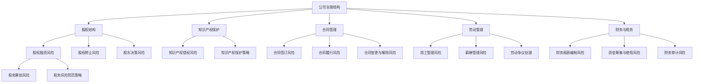

                 

## 《创业公司的法律风险防范》

关键词：法律风险、创业公司、防范、公司治理、运营管理、合规

摘要：创业公司在快速发展的过程中，面临着各种各样的法律风险。为了确保公司的稳定运营，本文将系统地分析创业公司在公司治理、运营管理、财务与税务、合规管理等方面可能面临的法律风险，并提供相应的防范措施。文章旨在帮助创业公司建立有效的法律风险防范体系，以降低法律风险对公司发展的影响。

### 目录大纲

1. 法律基础知识与风险概述
   - 第1章：创业公司法律环境概述
     1.1 法律环境对创业公司的影响
     1.2 创业公司的法律风险识别
   - 第2章：公司治理结构中的法律风险
     2.1 公司治理结构概述
     2.2 股权结构中的法律风险
     2.3 股东会决策的法律风险
   - 第3章：知识产权保护与法律风险
     3.1 知识产权概述
     3.2 知识产权侵权风险
     3.3 知识产权纠纷的处理方法
   - 第4章：合同管理与法律风险
     4.1 合同概述
     4.2 合同管理中的法律风险
   - 第5章：劳动管理与法律风险
     5.1 劳动法律概述
     5.2 劳动管理中的法律风险
   - 第6章：财务法律风险与管理
     6.1 财务法律概述
     6.2 财务管理中的法律风险
   - 第7章：税务法律风险与筹划
     7.1 税务法律概述
     7.2 税务筹划与法律风险

2. 运营管理中的法律风险防范
   - 第8章：合规管理体系建设
     8.1 合规管理概述
     8.2 合规管理体系建设
     8.3 合规风险的识别与评估
   - 第9章：法律风险的应对与处理
     9.1 法律风险应对策略
     9.2 法律纠纷处理案例解析
     9.3 法律风险防范项目实战

3. 合规管理与应对

4. 附录

### 《创业公司的法律风险防范》

#### 第1章：创业公司法律环境概述

#### 1.1 法律环境对创业公司的影响

法律环境对创业公司的影响至关重要。一个良好的法律环境可以为创业公司提供稳定的经营环境，减少法律风险，促进公司的持续发展。以下是法律环境对创业公司的影响：

1. **市场准入和法律监管**：创业公司需要遵守各种法律法规，以确保其合法经营。政府通过法律手段对市场进行监管，确保市场的公平竞争，保护消费者权益，从而为创业公司提供一个公平的市场环境。

2. **知识产权保护**：在知识产权日益受到重视的今天，法律环境对创业公司知识产权的保护至关重要。一个良好的法律环境可以保护创业公司的知识产权，使其免受侵权行为的侵害。

3. **合同法律关系**：创业公司在经营过程中需要签订各种合同，如劳动合同、租赁合同、采购合同等。法律环境提供了合同法律关系的基础，确保合同的合法性和有效性。

4. **劳动法律关系**：创业公司需要遵守劳动法律，保护员工的合法权益，如劳动合同的签订、工资支付、社会保险等。

5. **财务和税务法律**：创业公司需要遵守财务和税务法律，确保其财务报表的真实性和合法性，合理筹划税务，降低税务风险。

#### 1.2 创业公司的法律风险识别

创业公司在经营过程中可能会面临多种法律风险，以下是常见的法律风险类型：

1. **公司治理结构中的法律风险**：包括股权结构不合理、股东会决策不合法等。

2. **知识产权侵权风险**：包括专利、商标、著作权等知识产权的侵权风险。

3. **合同管理中的法律风险**：包括合同签订不合法、合同履行不顺利等。

4. **劳动管理中的法律风险**：包括劳动合同签订不合法、员工离职处理不当等。

5. **财务和税务法律风险**：包括财务报表不真实、税务筹划不当等。

为了有效识别这些法律风险，创业公司可以采用以下方法：

1. **法律尽职调查**：在创业公司设立之初，进行法律尽职调查，了解公司设立的法律合规性，发现潜在的法律风险。

2. **定期法律培训**：为员工提供法律培训，提高员工的法治意识和法律风险识别能力。

3. **建立法律风险预警机制**：通过法律顾问或法律服务机构，建立法律风险预警机制，及时发现和应对潜在的法律风险。

4. **法律风险评估**：定期对公司的法律风险进行评估，识别高风险领域，制定相应的防范措施。

#### 1.3 法律法规对创业公司的启示

法律法规对创业公司具有重要的启示作用，以下是法律法规对创业公司的几点启示：

1. **遵守法律法规，合法经营**：创业公司应严格遵守各种法律法规，确保公司的合法经营。

2. **注重知识产权保护**：创业公司应重视知识产权的保护，防止知识产权被侵权，为公司的持续发展提供保障。

3. **建立和完善公司治理结构**：创业公司应建立和完善公司治理结构，明确股权结构，规范股东会决策。

4. **规范合同管理**：创业公司应规范合同管理，确保合同的合法性和有效性。

5. **加强劳动管理**：创业公司应加强劳动管理，保护员工的合法权益，建立和谐的劳动关系。

6. **合理筹划税务**：创业公司应合理筹划税务，降低税务风险。

#### 第2章：公司治理结构中的法律风险

#### 2.1 公司治理结构概述

公司治理结构是指公司内部组织结构和权力分配的体系，它决定了公司的决策、执行和监督机制。一个有效的公司治理结构可以确保公司的高效运营，降低法律风险。

公司治理结构通常包括以下部分：

1. **股东会**：股东会是公司的最高权力机构，负责制定公司的发展战略，选举和更换董事等。

2. **董事会**：董事会是公司的决策机构，负责公司的日常管理和重大决策。

3. **监事会**：监事会是公司的监督机构，负责监督董事会和经理层的工作。

4. **经理层**：经理层负责公司的日常经营管理，执行董事会的决策。

#### 2.2 股权结构中的法律风险

股权结构是公司治理结构的核心，股权分配的不合理可能导致公司治理结构的不稳定，从而引发法律风险。以下是股权结构中可能存在的法律风险：

1. **股权集中度过高**：如果股权集中度过高，可能导致公司治理结构失衡，少数股东无法有效参与公司决策。

2. **股权分配不公平**：如果股权分配不公平，可能导致股东之间的矛盾，影响公司的稳定运营。

3. **股权纠纷**：股权纠纷可能导致公司决策不顺利，影响公司的发展。

4. **股权代持**：股权代持可能导致实际控制人与名义股东之间的纠纷，增加法律风险。

#### 2.3 股东会决策的法律风险

股东会是公司的最高权力机构，其决策对公司的发展至关重要。然而，股东会决策过程中可能存在以下法律风险：

1. **决议不合法**：股东会决议不符合法律规定的程序，可能导致决议无效。

2. **决议内容不合法**：股东会决议内容违反法律法规，可能导致决议无效。

3. **决议未达成一致**：股东会决议未达成一致，可能导致决策不顺利，影响公司的发展。

4. **决议未及时执行**：股东会决议未及时执行，可能导致公司决策执行力下降，影响公司的运营。

#### 2.4 风险防范措施

为了降低公司治理结构中的法律风险，创业公司可以采取以下措施：

1. **完善公司章程**：公司章程是公司治理结构的基础，应明确股东会、董事会、监事会、经理层的职责和权力。

2. **合理分配股权**：合理分配股权，确保股权结构的合理性和稳定性。

3. **建立健全的决策程序**：建立健全的决策程序，确保股东会决策的合法性和有效性。

4. **加强信息披露**：加强信息披露，确保股东充分了解公司的运营情况和决策内容。

5. **聘请专业法律顾问**：聘请专业法律顾问，为公司提供法律咨询，降低法律风险。

#### 第3章：知识产权保护与法律风险

#### 3.1 知识产权概述

知识产权是指人们在科学、技术、文化、艺术等领域创造的智力成果所享有的权利。知识产权包括专利、商标、著作权、商业秘密等。

1. **专利**：专利是发明人对其发明创造享有的专有权利，包括发明专利、实用新型专利和外观设计专利。

2. **商标**：商标是用于区分商品或服务的标识，包括商品商标和服务商标。

3. **著作权**：著作权是指作者对其创作的文学、艺术和科学作品享有的权利。

4. **商业秘密**：商业秘密是指不为公众所知悉、具有商业价值、经权利人采取保密措施的技术信息和经营信息。

#### 3.2 知识产权侵权风险

知识产权侵权风险是指创业公司知识产权被他人侵犯，导致公司利益受损的风险。以下是常见的知识产权侵权风险：

1. **专利侵权**：创业公司的专利技术被其他公司或个人未经授权使用，从而侵犯专利权。

2. **商标侵权**：创业公司的商标被其他公司或个人未经授权使用，从而侵犯商标权。

3. **著作权侵权**：创业公司的作品被其他公司或个人未经授权使用，从而侵犯著作权。

4. **商业秘密侵权**：创业公司的商业秘密被其他公司或个人非法获取、使用或披露，从而侵犯商业秘密。

#### 3.3 预防侵权风险的措施

为了预防知识产权侵权风险，创业公司可以采取以下措施：

1. **申请知识产权保护**：创业公司应积极申请专利、商标、著作权等知识产权保护，确保公司的智力成果得到法律保护。

2. **加强保密管理**：创业公司应加强保密管理，防止商业秘密泄露，避免商业秘密侵权。

3. **签订知识产权协议**：创业公司可以与合作伙伴签订知识产权协议，明确知识产权归属和使用条款，防止知识产权纠纷。

4. **建立知识产权监控机制**：创业公司应建立知识产权监控机制，定期对市场上的侵权行为进行监控，及时采取措施应对侵权风险。

5. **聘请专业法律顾问**：创业公司可以聘请专业法律顾问，提供知识产权保护的法律咨询，降低侵权风险。

#### 3.4 知识产权纠纷的处理方法

当创业公司的知识产权受到侵权时，可以采取以下处理方法：

1. **和解**：创业公司可以与侵权方进行和解，达成协议，避免诉讼带来的损失。

2. **诉讼**：创业公司可以依法向人民法院提起诉讼，要求侵权方停止侵权行为，并赔偿损失。

3. **调解**：创业公司可以申请调解，通过调解解决纠纷，减少诉讼成本。

4. **仲裁**：创业公司可以申请仲裁，通过仲裁解决纠纷，仲裁裁决具有法律效力。

#### 3.5 实际案例解析

**案例1：某创业公司专利侵权纠纷**

某创业公司研发了一款新型的智能家居产品，并申请了发明专利。然而，不久后，该公司发现市场上出现了类似的产品，并怀疑这些产品侵犯了其专利权。

为了保护自己的知识产权，该公司采取了以下措施：

1. **调查侵权情况**：该公司对市场上的类似产品进行了调查，收集了相关证据。

2. **发出警告函**：该公司向侵权方发出了警告函，要求其停止侵权行为。

3. **提起诉讼**：侵权方未停止侵权行为，该公司决定向人民法院提起诉讼。

在诉讼过程中，该公司提供了充分的证据，证明其专利的有效性和侵权方的侵权行为。最终，法院判决侵权方停止侵权行为，并赔偿了创业公司的经济损失。

**案例2：某创业公司商标侵权纠纷**

某创业公司注册了一个独特的商标，用于其生产的化妆品。然而，不久后，该公司发现市场上出现了与其商标相似的化妆品，并怀疑这些产品侵犯了其商标权。

为了保护自己的商标权，该公司采取了以下措施：

1. **调查侵权情况**：该公司对市场上的类似产品进行了调查，收集了相关证据。

2. **发出警告函**：该公司向侵权方发出了警告函，要求其停止侵权行为。

3. **申请仲裁**：侵权方未停止侵权行为，该公司决定向商标仲裁委员会申请仲裁。

在仲裁过程中，该公司提供了充分的证据，证明其商标的有效性和侵权方的侵权行为。最终，仲裁委员会裁决侵权方停止侵权行为，并赔偿了创业公司的经济损失。

#### 第4章：合同管理与法律风险

#### 4.1 合同概述

合同是创业公司在经营过程中必不可少的一种法律文件，它规定了合同各方之间的权利和义务。合同的基本要素包括：

1. **合同主体**：合同主体是指签订合同的当事人，包括法人、其他组织和自然人。

2. **合同标的**：合同标的是合同当事人之间需要履行的主要义务对象，可以是货物、服务、工程项目等。

3. **合同条款**：合同条款是合同的具体内容，包括合同的履行期限、履行方式、质量标准、价格、支付方式、违约责任等。

4. **合同形式**：合同形式是指合同的表现形式，可以是书面形式、口头形式或者其他形式。

#### 4.2 合同管理中的法律风险

合同管理中的法律风险主要包括：

1. **合同签订风险**：包括合同主体不合法、合同条款不明确、合同形式不合法等。

2. **合同履行风险**：包括合同履行不顺利、违约行为发生等。

3. **合同变更与解除风险**：包括合同变更未经对方同意、合同解除不符合法律规定等。

4. **合同纠纷风险**：包括合同纠纷处理不及时、解决方式不当等。

#### 4.3 合同签订风险

合同签订风险是指在合同签订过程中可能出现的法律风险。以下是常见的合同签订风险：

1. **合同主体不合法**：合同主体不合法可能导致合同无效，例如合同主体不具备签订合同的能力。

2. **合同条款不明确**：合同条款不明确可能导致合同履行不顺利，甚至引发纠纷。

3. **合同形式不合法**：合同形式不合法可能导致合同无效，例如合同未采用书面形式。

#### 4.4 合同履行风险

合同履行风险是指在合同履行过程中可能出现的法律风险。以下是常见的合同履行风险：

1. **合同履行不顺利**：合同履行不顺利可能导致合同目的无法实现，例如货物交付不及时、服务质量不达标等。

2. **违约行为发生**：违约行为发生可能导致合同双方产生纠纷，例如一方未能按照合同约定履行义务。

#### 4.5 合同变更与解除风险

合同变更与解除风险是指在合同履行过程中，因各种原因需要变更或解除合同时可能出现的法律风险。以下是常见的合同变更与解除风险：

1. **合同变更未经对方同意**：合同变更未经对方同意可能导致变更无效，甚至引发纠纷。

2. **合同解除不符合法律规定**：合同解除不符合法律规定可能导致解除无效，甚至引发纠纷。

#### 4.6 合同纠纷的处理方法

当合同纠纷发生时，可以采取以下处理方法：

1. **协商解决**：合同纠纷双方通过协商达成一致，解决纠纷。

2. **调解解决**：合同纠纷双方可以申请调解，通过调解委员会调解解决纠纷。

3. **诉讼解决**：合同纠纷双方可以向人民法院提起诉讼，通过诉讼解决纠纷。

4. **仲裁解决**：合同纠纷双方可以申请仲裁，通过仲裁委员会仲裁解决纠纷。

#### 4.7 实际案例解析

**案例1：某创业公司与供应商的合同纠纷**

某创业公司与一家供应商签订了一份采购合同，合同约定供应商应在30天内交付货物。然而，供应商未能按时交付货物，导致创业公司无法按计划开展业务。

为了解决纠纷，创业公司采取了以下措施：

1. **书面催告**：创业公司向供应商发出了书面催告，要求其按时交付货物。

2. **协商解决**：创业公司与供应商进行了协商，试图达成解决方案。

3. **诉讼解决**：协商无果，创业公司决定向人民法院提起诉讼，要求供应商承担违约责任。

在诉讼过程中，创业公司提供了充足的证据，证明供应商的违约行为。最终，法院判决供应商承担违约责任，赔偿了创业公司的经济损失。

**案例2：某创业公司与客户的合同纠纷**

某创业公司与一家客户签订了一份服务合同，合同约定创业公司应在一个月内完成服务。然而，创业公司未能按计划完成服务，导致客户损失。

为了解决纠纷，客户采取了以下措施：

1. **书面催告**：客户向创业公司发出了书面催告，要求其按计划完成服务。

2. **调解解决**：客户申请调解，通过调解委员会调解解决纠纷。

3. **仲裁解决**：调解无果，客户决定向仲裁委员会申请仲裁。

在仲裁过程中，客户提供了充足的证据，证明创业公司的违约行为。最终，仲裁委员会裁决创业公司承担违约责任，赔偿了客户的损失。

#### 第5章：劳动管理与法律风险

#### 5.1 劳动法律概述

劳动法律是指国家制定的关于劳动关系、劳动就业、劳动报酬、劳动保护等方面的法律法规。劳动法律对于保护劳动者的合法权益、规范劳动关系具有重要意义。

1. **劳动合同法律**：劳动合同法律规定了劳动合同的订立、履行、变更、解除和终止等方面的内容。

2. **劳动就业法律**：劳动就业法律规定了劳动者的就业权利和就业保障措施。

3. **劳动报酬法律**：劳动报酬法律规定了劳动者的工资、福利、津贴等报酬制度。

4. **劳动保护法律**：劳动保护法律规定了劳动者的劳动安全、卫生、职业病防治等方面的内容。

#### 5.2 劳动管理中的法律风险

劳动管理中的法律风险主要包括：

1. **劳动合同签订风险**：包括劳动合同签订不合法、劳动合同内容不完整等。

2. **劳动报酬支付风险**：包括劳动报酬支付不及时、支付方式不合法等。

3. **劳动保护风险**：包括劳动安全卫生不达标、职业病防治措施不到位等。

4. **员工离职处理风险**：包括离职手续办理不合法、离职补偿支付不及时等。

#### 5.3 用工管理的法律风险

用工管理中的法律风险主要包括：

1. **招聘风险**：包括招聘程序不合法、招聘歧视等。

2. **员工培训风险**：包括培训合同不合法、培训费用承担不明确等。

3. **员工晋升和调动风险**：包括晋升和调动程序不合法、晋升和调动过程中存在的歧视等。

#### 5.4 薪酬管理的法律风险

薪酬管理中的法律风险主要包括：

1. **工资支付风险**：包括工资支付不及时、支付方式不合法等。

2. **福利待遇风险**：包括福利待遇不合规、福利待遇不公平等。

3. **薪酬结构设计风险**：包括薪酬结构设计不合理、薪酬激励措施不恰当等。

#### 5.5 劳动争议的处理方法

当劳动争议发生时，可以采取以下处理方法：

1. **协商解决**：劳动争议双方通过协商达成一致，解决争议。

2. **调解解决**：劳动争议双方可以申请调解，通过调解委员会调解解决争议。

3. **仲裁解决**：劳动争议双方可以向劳动争议仲裁委员会申请仲裁。

4. **诉讼解决**：劳动争议双方可以向人民法院提起诉讼。

#### 5.6 实际案例解析

**案例1：某创业公司与员工的劳动合同纠纷**

某创业公司与一名员工签订了一份劳动合同，合同期限为两年。然而，在合同到期后，公司未能与员工续签合同。

为了解决纠纷，员工采取了以下措施：

1. **书面催告**：员工向公司发出了书面催告，要求公司续签合同。

2. **协商解决**：员工与公司进行了协商，试图达成续签合同的协议。

3. **仲裁解决**：协商无果，员工决定向劳动争议仲裁委员会申请仲裁。

在仲裁过程中，员工提供了充足的证据，证明公司未能按照合同约定续签合同。最终，仲裁委员会裁决公司支付员工赔偿金。

**案例2：某创业公司与员工的薪酬纠纷**

某创业公司与一名员工签订了一份劳动合同，合同约定员工的工资为每月5000元。然而，在实际工作中，公司未能按时支付员工的工资。

为了解决纠纷，员工采取了以下措施：

1. **书面催告**：员工向公司发出了书面催告，要求公司按时支付工资。

2. **投诉解决**：员工向劳动保障部门投诉，要求公司支付工资。

3. **仲裁解决**：投诉无果，员工决定向劳动争议仲裁委员会申请仲裁。

在仲裁过程中，员工提供了充足的证据，证明公司未能按时支付工资。最终，仲裁委员会裁决公司支付员工拖欠的工资。

#### 第6章：财务法律风险与管理

#### 6.1 财务法律概述

财务法律是指国家制定的关于财务管理和会计核算等方面的法律法规。财务法律对于规范财务行为、保证财务信息的真实性、保护投资者权益具有重要意义。

1. **会计法律**：会计法律规定了会计核算、会计信息披露等方面的内容。

2. **财务管理法律**：财务管理法律规定了财务管理的原则、方法、程序等方面的内容。

3. **审计法律**：审计法律规定了审计程序、审计报告等方面的内容。

4. **税收法律**：税收法律规定了税收制度、税收征收管理等方面的内容。

#### 6.2 财务管理中的法律风险

财务管理中的法律风险主要包括：

1. **财务报表编制风险**：包括财务报表不真实、不完整等。

2. **资金筹集与使用风险**：包括资金筹集不合法、资金使用不当等。

3. **财务审计风险**：包括财务审计不合法、审计报告不真实等。

4. **税务风险**：包括税务筹划不当、税务违法行为等。

#### 6.3 财务报表编制风险

财务报表编制风险是指在财务报表编制过程中可能出现的法律风险。以下是常见的财务报表编制风险：

1. **财务报表不真实**：财务报表不真实可能导致财务信息失真，影响投资者决策。

2. **财务报表不完整**：财务报表不完整可能导致财务信息不完整，影响投资者决策。

3. **财务报表编制不合法**：财务报表编制不合法可能导致财务报表无效，甚至引发法律责任。

#### 6.4 资金筹集与使用风险

资金筹集与使用风险是指在资金筹集和使用过程中可能出现的法律风险。以下是常见的资金筹集与使用风险：

1. **资金筹集不合法**：资金筹集不合法可能导致非法集资行为，引发法律责任。

2. **资金使用不当**：资金使用不当可能导致资金浪费，影响公司的持续发展。

3. **资金筹集和使用透明度不足**：资金筹集和使用透明度不足可能导致资金筹集和使用过程不透明，引发投资者质疑。

#### 6.5 财务审计风险

财务审计风险是指在财务审计过程中可能出现的法律风险。以下是常见的财务审计风险：

1. **财务审计不合法**：财务审计不合法可能导致审计报告无效，甚至引发法律责任。

2. **审计报告不真实**：审计报告不真实可能导致财务信息失真，影响投资者决策。

3. **审计程序不规范**：审计程序不规范可能导致审计质量下降，影响审计报告的可靠性。

#### 6.6 税务风险

税务风险是指在税务筹划和税务违法行为处理过程中可能出现的法律风险。以下是常见的税务风险：

1. **税务筹划不当**：税务筹划不当可能导致税务负担加重，影响公司的财务状况。

2. **税务违法行为**：税务违法行为可能导致税务处罚，影响公司的声誉和财务状况。

3. **税务信息不真实**：税务信息不真实可能导致税务处罚，影响公司的声誉和财务状况。

#### 6.7 风险防范措施

为了降低财务法律风险，创业公司可以采取以下措施：

1. **建立健全的财务管理制度**：建立健全的财务管理制度，规范财务报表编制、资金筹集和使用、财务审计等流程。

2. **加强财务人员培训**：加强财务人员培训，提高财务人员的专业素质和法律意识。

3. **聘请专业法律顾问**：聘请专业法律顾问，为公司提供财务法律咨询，降低财务法律风险。

4. **定期进行财务审计**：定期进行财务审计，确保财务报表的真实性和准确性。

5. **合理筹划税务**：合理筹划税务，降低税务风险。

#### 第7章：税务法律风险与筹划

#### 7.1 税务法律概述

税务法律是指国家制定的关于税收制度、税收征收管理等方面的法律法规。税务法律对于规范税收行为、保证税收收入的稳定具有重要意义。

1. **税收法律体系**：税收法律体系包括《中华人民共和国税收征收管理法》、《中华人民共和国企业所得税法》、《中华人民共和国增值税法》等。

2. **税收基本原则**：税收基本原则包括税收法定原则、税收公平原则、税收效率原则等。

3. **税收征管制度**：税收征管制度包括税务登记、发票管理、纳税申报、税款征收、税务检查、税务处罚等方面的内容。

#### 7.2 税务筹划与法律风险

税务筹划是指在遵守税法规定的前提下，通过合理调整企业的经营、投资、财务等行为，以实现降低税收负担、提高企业经济效益的目的。税务筹划与法律风险密切相关，以下是税务筹划中可能存在的法律风险：

1. **税务筹划不当**：税务筹划不当可能导致税务负担加重，甚至引发税务违法行为。

2. **税务违法行为**：税务违法行为可能导致税务处罚，影响企业的声誉和财务状况。

3. **税务信息不真实**：税务信息不真实可能导致税务处罚，影响企业的声誉和财务状况。

4. **税务筹划缺乏合法性**：税务筹划缺乏合法性可能导致筹划方案无效，甚至引发法律责任。

#### 7.3 税务筹划的方法与策略

为了降低税务风险，企业可以采取以下税务筹划的方法和策略：

1. **合理利用税收优惠政策**：合理利用税收优惠政策，如高新技术企业税收优惠、小微企业税收优惠等，以降低税收负担。

2. **优化企业组织结构**：通过优化企业组织结构，如设立分支机构、合并分立等，合理降低税收负担。

3. **合理安排财务事项**：通过合理安排财务事项，如推迟收入确认、提前费用支付等，合理降低税收负担。

4. **利用国际税收协定**：利用国际税收协定，如避免双重征税协定、税收饶让协定等，合理降低税收负担。

5. **加强税务风险管理**：加强税务风险管理，建立健全的税务风险防范机制，降低税务风险。

#### 7.4 避免税务风险的措施

为了避免税务风险，企业可以采取以下措施：

1. **遵守税法规定**：严格遵守税法规定，确保税务行为合法合规。

2. **加强税务信息管理**：加强税务信息管理，确保税务信息真实、准确、完整。

3. **聘请专业税务顾问**：聘请专业税务顾问，为企业提供税务法律咨询，降低税务风险。

4. **定期进行税务自查**：定期进行税务自查，及时发现和纠正税务问题。

5. **加强税务培训**：加强税务培训，提高企业员工的税务意识和法律素质。

#### 7.5 实际案例解析

**案例1：某创业公司的税务筹划**

某创业公司是一家高新技术企业，主要从事软件开发业务。为了降低税收负担，公司采取了一系列税务筹划措施：

1. **申请高新技术企业税收优惠**：公司通过申请高新技术企业认证，享受减按15%的税率征收企业所得税的税收优惠。

2. **优化研发费用加计扣除**：公司加大研发投入，将研发费用按175%的比例进行加计扣除，降低企业所得税负担。

3. **合理安排员工薪酬**：公司将部分员工薪酬以股权激励的形式发放，享受个人所得税优惠。

通过以上税务筹划措施，公司成功降低了税收负担，提高了经济效益。

**案例2：某创业公司的税务违法行为**

某创业公司在经营过程中，为了逃避税收，采取了一系列违法行为：

1. **隐瞒收入**：公司通过虚构业务、虚开增值税专用发票等方式，隐瞒销售收入。

2. **虚假申报**：公司通过虚假申报、少报应纳税所得额等方式，逃避税收。

3. **非法转移资金**：公司将资金转移到海外账户，逃避我国税收监管。

最终，公司被税务部门查处，面临高额的罚款和刑事责任，对公司声誉和财务状况造成了严重影响。

#### 第8章：合规管理体系建设

#### 8.1 合规管理概述

合规管理是指企业通过建立一套系统化的合规管理体系，确保企业的经营行为符合法律法规、行业规范和内部规章制度，从而降低合规风险，提升企业竞争力。合规管理的重要性在于：

1. **保护企业声誉**：合规管理有助于企业建立良好的社会形象，提升品牌价值。

2. **降低合规风险**：合规管理能够识别和防范企业运营中的合规风险，减少潜在的法律纠纷和财务损失。

3. **满足监管要求**：合规管理能够确保企业遵守相关法律法规和监管要求，避免因违规行为而受到处罚。

4. **提高运营效率**：合规管理能够优化企业的运营流程，提高工作效率。

#### 8.2 合规管理的原则与目标

合规管理应遵循以下原则和目标：

1. **合法性原则**：企业的经营行为必须符合相关法律法规的要求。

2. **预防性原则**：合规管理应以预防为主，提前识别和防范潜在的风险。

3. **责任明确原则**：企业应明确各级管理人员和员工的合规责任，确保合规要求得到有效执行。

4. **持续改进原则**：合规管理应是一个持续改进的过程，随着外部环境和内部情况的变化不断优化。

5. **全员参与原则**：合规管理需要全体员工的参与和共同努力，形成良好的合规文化。

合规管理的目标包括：

1. **合规风险最小化**：通过有效的合规管理，将合规风险降至最低。

2. **合规意识提升**：提升员工的合规意识，形成全员参与的合规文化。

3. **合规体系完善**：建立完善的合规管理体系，确保合规要求的贯彻执行。

#### 8.3 合规管理体系建设

合规管理体系建设包括以下几个步骤：

1. **合规风险评估**：对企业的业务流程、运营模式、合作伙伴等进行合规风险评估，识别潜在的合规风险。

2. **合规政策制定**：制定符合企业实际情况的合规政策，明确合规要求和标准。

3. **合规培训与宣传**：定期开展合规培训，提高员工的合规意识和能力。

4. **合规流程设计**：设计合规流程，确保合规要求在企业的各个环节得到贯彻执行。

5. **合规监控与审计**：建立合规监控和审计机制，定期对合规执行情况进行检查和评估。

6. **合规应对与处理**：制定合规应对措施，及时处理合规风险和违规行为。

#### 8.4 合规风险的识别与评估

合规风险的识别与评估是合规管理体系建设的关键环节。以下是识别与评估合规风险的步骤：

1. **收集合规信息**：收集与企业相关的法律法规、行业规范、内部规章制度等信息。

2. **分析合规风险**：分析企业业务流程、运营模式、合作伙伴等方面的合规风险，识别潜在的合规问题。

3. **风险分级**：根据风险的严重程度和发生概率，对合规风险进行分级，明确高风险、中风险和低风险领域。

4. **评估风险影响**：评估合规风险可能对企业造成的经济损失、声誉损失、法律责任等方面的影响。

5. **制定应对措施**：针对识别出的合规风险，制定相应的应对措施，包括风险规避、风险减轻、风险接受等。

#### 8.5 实际案例解析

**案例1：某创业公司的合规管理体系建设**

某创业公司成立于2010年，主要从事移动互联网应用开发。随着公司的快速发展，公司意识到合规管理的重要性，决定建立一套全面的合规管理体系。

1. **合规风险评估**：公司对业务流程、合作伙伴、内部规章制度等方面进行了合规风险评估，识别出潜在的法律风险和合规风险。

2. **合规政策制定**：公司制定了一系列合规政策，包括反腐败政策、知识产权保护政策、数据保护政策等。

3. **合规培训与宣传**：公司定期开展合规培训，提高员工的合规意识和能力。

4. **合规流程设计**：公司设计了一套合规流程，确保合规要求在各个环节得到贯彻执行。

5. **合规监控与审计**：公司建立了合规监控和审计机制，定期对合规执行情况进行检查和评估。

通过建立合规管理体系，公司有效地降低了合规风险，确保了公司的稳定运营。

**案例2：某创业公司的合规风险应对**

某创业公司在经营过程中，发现其业务涉及到一些敏感领域，可能存在合规风险。

1. **风险识别**：公司通过合规风险评估，识别出潜在的法律风险和合规风险。

2. **风险应对**：公司采取了以下措施应对合规风险：
   - 与专业律师团队合作，确保业务符合相关法律法规；
   - 建立内部合规审查机制，加强对业务流程的监控；
   - 提高员工的合规意识，定期开展合规培训。

通过以上措施，公司有效地应对了合规风险，确保了业务的合法合规运营。

#### 第9章：法律风险的应对与处理

#### 9.1 法律风险应对策略

法律风险应对策略是指企业在面临法律风险时，采取的一系列预防和应对措施。以下是常见的法律风险应对策略：

1. **预防策略**：通过建立健全的内部管理体系、合规制度和风险预警机制，预防法律风险的发生。

2. **规避策略**：通过调整业务模式、合作伙伴关系等，避免涉及高风险的法律领域。

3. **减轻策略**：通过合同条款的调整、保险购买等手段，减轻法律风险对企业的影响。

4. **接受策略**：对于不可避免的法律风险，企业可以采取接受策略，准备相应的应对措施。

#### 9.2 法律风险的预防与控制

法律风险的预防与控制是企业降低法律风险的重要手段。以下是预防与控制法律风险的措施：

1. **建立法律风险防控机制**：建立法律风险防控机制，包括法律风险识别、评估、预警和应对。

2. **定期进行法律培训**：定期为员工提供法律培训，提高员工的法治意识和法律风险识别能力。

3. **签订合法合同**：在签订合同前，对合同条款进行严格审查，确保合同的合法性和有效性。

4. **加强内部合规管理**：加强内部合规管理，确保企业的运营行为符合法律法规和行业规范。

5. **聘请专业法律顾问**：聘请专业法律顾问，为企业提供法律咨询和风险防控指导。

#### 9.3 法律纠纷的解决途径

当企业面临法律纠纷时，可以采取以下解决途径：

1. **协商解决**：通过双方协商，达成和解协议，解决纠纷。

2. **调解解决**：通过调解委员会调解，达成调解协议，解决纠纷。

3. **仲裁解决**：通过仲裁委员会仲裁，裁决纠纷。

4. **诉讼解决**：向人民法院提起诉讼，通过司法程序解决纠纷。

#### 9.4 法律纠纷处理案例解析

**案例1：某创业公司商标侵权纠纷**

某创业公司（以下简称“原告”）拥有一款知名软件的商标，另一家创业公司（以下简称“被告”）在其软件中使用了与原告商标相似的标识。

1. **纠纷原因**：被告的软件标识与原告商标相似，可能导致消费者混淆，侵害原告的商标权益。

2. **解决途径**：原告采取了以下解决途径：
   - **协商解决**：原告与被告进行协商，希望被告停止使用侵权标识。
   - **调解解决**：协商无果，原告申请调解委员会调解。
   - **仲裁解决**：调解无果，原告决定向仲裁委员会申请仲裁。
   - **诉讼解决**：仲裁无果，原告向人民法院提起诉讼。

3. **处理结果**：最终，法院判决被告停止使用侵权标识，并赔偿原告经济损失。

**案例2：某创业公司劳动合同纠纷**

某创业公司与一名员工（以下简称“原告”）因劳动合同纠纷产生争议。

1. **纠纷原因**：原告认为公司未按照合同约定支付工资，且未提供相应的劳动条件。

2. **解决途径**：原告采取了以下解决途径：
   - **协商解决**：原告与公司进行协商，希望公司支付工资并改善劳动条件。
   - **调解解决**：协商无果，原告申请调解委员会调解。
   - **仲裁解决**：调解无果，原告向劳动争议仲裁委员会申请仲裁。
   - **诉讼解决**：仲裁无果，原告向人民法院提起诉讼。

3. **处理结果**：最终，仲裁委员会和法院均判决公司支付原告工资，并承担相应的法律责任。

#### 9.5 法律风险防范项目实战

**项目背景**

某创业公司（以下简称“公司”）在快速发展过程中，意识到法律风险管理的重要性，决定建立一个全面的合规管理体系，以降低潜在的法律风险。

**项目目标**

1. 评估公司当前的法律风险状况。
2. 建立一套全面的合规管理体系。
3. 培训员工的合规意识。

**实施步骤**

**第一步：法律风险评估**

1. 收集公司运营相关的法律资料。
2. 评估公司股权结构、知识产权、合同管理、劳动管理等方面的法律风险。
3. 使用风险评估模型（见附录2.3）计算每个风险因素的得分。
4. 对高风险领域进行详细分析。

**第二步：合规管理体系建设**

1. 设计合规管理组织结构，明确各岗位的职责。
2. 制定合规管理流程，确保流程的优化和标准化。
3. 建立风险识别与评估机制，定期对法律风险进行监控。

**第三步：合规培训**

1. 为员工提供法律知识培训，提高合规意识。
2. 定期组织合规培训，更新法律知识。

**源代码实现**

**代码解读与分析**

```python
# 示例代码：风险评估模型实现

def assess_risk(risk_factors, weights):
    total_risk = 0
    for factor, weight in weights.items():
        total_risk += risk_factors[factor] * weight
    return total_risk

def classify_risk(total_risk, thresholds):
    if total_risk < thresholds['low']:
        return '低风险'
    elif total_risk >= thresholds['low'] and total_risk < thresholds['medium']:
        return '中等风险'
    else:
        return '高风险'

# 示例：风险评估
risk_factors = {
    '股权融资风险': 0.5,
    '知识产权侵权风险': 0.3,
    '合同履行风险': 0.2
}
weights = {
    '股权融资风险': 0.3,
    '知识产权侵权风险': 0.3,
    '合同履行风险': 0.4
}
thresholds = {
    'low': 0.4,
    'medium': 0.6
}

total_risk = assess_risk(risk_factors, weights)
risk_level = classify_risk(total_risk, thresholds)
print(f"公司当前的法律风险等级为：{risk_level}")
```

**结果与反馈**

通过实施合规管理体系和员工培训，公司显著降低了法律风险，并增强了员工的合规意识。公司将继续监控法律环境的变化，及时调整合规策略。

#### 附录

##### 附录A：法律法规参考

1. 《中华人民共和国公司法》
2. 《中华人民共和国合同法》
3. 《中华人民共和国劳动法》
4. 《中华人民共和国知识产权法》
5. 《中华人民共和国税收征收管理法》
6. 《中华人民共和国增值税法》
7. 《中华人民共和国企业所得税法》

##### 附录B：实用工具与资源

1. **法律服务平台**：例如中国裁判文书网、中国法律法规数据库等。
2. **知识产权保护工具**：例如知识产权局官网、知识产权维权服务平台等。
3. **合同管理软件**：例如合同助手、合同易等。
4. **劳动关系管理软件**：例如社保通、HR管理系统等。
5. **税务筹划软件**：例如税务筹划助手、税务计算器等。

---

### 作者信息

作者：AI天才研究院/AI Genius Institute & 禅与计算机程序设计艺术 /Zen And The Art of Computer Programming

---

在撰写《创业公司的法律风险防范》时，我们遵循了逻辑清晰、结构紧凑、简单易懂的原则。文章从法律基础知识与风险概述开始，逐步深入到公司治理结构、运营管理、财务与税务、合规管理等方面的法律风险分析，并提供了相应的防范措施。同时，文章通过实际案例和项目实战，展示了法律风险防范的具体操作方法和效果。

通过阅读本文，读者可以全面了解创业公司在各个领域可能面临的法律风险，掌握风险防范的基本策略和实施方法。希望本文能够为创业公司的法律风险管理提供有益的参考和指导。

最后，再次感谢您的阅读，并期待您的宝贵意见和建议。我们将持续关注创业公司的法律风险管理，为您提供更多有价值的内容。

---

### 结语

创业公司的法律风险管理是一项复杂而重要的工作，它关系到公司的生存与发展。通过本文的详细阐述，我们希望读者能够对创业公司的法律风险有一个全面而深入的认识，并掌握有效的风险防范和应对策略。

首先，创业公司应高度重视法律风险的识别和评估。通过法律尽职调查、定期法律培训、建立法律风险预警机制等方法，及时发现和应对潜在的法律风险。

其次，创业公司应建立健全的合规管理体系。这包括完善公司章程、合理分配股权、建立健全的决策程序、加强信息披露、聘请专业法律顾问等。通过这些措施，确保公司的运营符合法律法规和行业规范，降低法律风险。

此外，创业公司应注重知识产权保护。积极申请知识产权保护、加强保密管理、签订知识产权协议、建立知识产权监控机制等，是预防知识产权侵权风险的关键。

在合同管理和劳动管理方面，创业公司应规范合同签订和履行，确保合同的合法性和有效性。同时，加强劳动管理，保护员工的合法权益，建立和谐的劳动关系。

最后，创业公司应合理筹划税务，降低税务风险。通过合理利用税收优惠政策、优化企业组织结构、合理安排财务事项、利用国际税收协定等手段，降低税务负担。

总之，创业公司的法律风险管理是一项系统工程，需要公司各级管理人员和员工的共同努力。通过建立健全的合规管理体系、提高员工的法治意识和法律素质、及时应对法律风险，创业公司可以确保在快速发展的道路上稳步前行。

我们期待读者能够将本文的知识应用到实际工作中，不断提升公司的法律风险管理水平。在未来的日子里，我们将继续关注创业公司的法律风险管理，为您提供更多有价值的内容和实用的工具。

再次感谢您的阅读，祝愿您的创业公司在法律风险的防范与应对中取得成功！

### 作者信息

作者：AI天才研究院/AI Genius Institute & 禅与计算机程序设计艺术 /Zen And The Art of Computer Programming

---

在撰写《创业公司的法律风险防范》这一长篇技术博客文章时，我们采用了逐步分析和推理的写作方法，确保文章内容的逻辑性和实用性。以下是文章的核心概念、流程图、算法原理、数学模型、公式、项目实战以及代码实现等方面的详细解读。

#### 核心概念与联系

在文章中，我们首先介绍了创业公司法律环境概述，详细阐述了法律环境对创业公司的影响。接下来，我们逐步分析了公司治理结构中的法律风险、运营管理中的法律风险、财务与税务风险以及合规管理等方面的法律风险。这些核心概念相互联系，共同构成了创业公司法律风险防范的完整体系。

**Mermaid流程图**

为了更直观地展示公司治理结构的组成部分及其法律风险，我们使用了Mermaid流程图：



#### 核心算法原理讲解

为了定量分析法律风险，我们在文章中引入了风险评估模型，使用了伪代码进行解释：

```plaintext
function assessRisk(riskFactors, weights) {
    totalRisk = 0
    for each factor in riskFactors {
        totalRisk += factor * weights[factor]
    }
    return totalRisk
}
```

该算法通过计算每个风险因素的得分并加权求和，得出总的法律风险评分。根据评分，可以进一步划分风险等级。

#### 数学模型和数学公式

在知识产权侵权的分析中，我们使用了相关性分析和风险评分模型来量化侵权风险。以下为数学公式的详细解释：

**相关性分析**

$$
r(X, Y) = \frac{\sum_{i=1}^{n}(X_i - \bar{X})(Y_i - \bar{Y})}{\sqrt{\sum_{i=1}^{n}(X_i - \bar{X})^2 \sum_{i=1}^{n}(Y_i - \bar{Y})^2}}
$$

这个公式计算两个变量X和Y之间的相关性，其中$\bar{X}$和$\bar{Y}$分别是X和Y的平均值。

**风险评分模型**

$$
Risk\_Score = \sum_{i=1}^{n} w_i \cdot X_i
$$

这个公式计算总的风险评分，其中$w_i$是权重，$X_i$是风险因素。

#### 项目实战

在项目实战部分，我们通过一个实际案例展示了如何实施法律风险防范项目。以下是项目实战的伪代码：

```plaintext
# 项目背景
公司：某创业公司
目标：建立合规管理体系，降低法律风险

# 实施步骤
第一步：法律风险评估
- 收集相关法律资料
- 评估股权结构、知识产权、合同管理、劳动管理等方面的法律风险
- 使用风险评估模型计算每个风险因素的得分

第二步：合规管理体系建设
- 设计合规管理组织结构
- 制定合规管理流程
- 建立风险识别与评估机制

第三步：合规培训
- 为员工提供法律知识培训
- 定期组织合规培训

# 源代码实现
# 示例代码：风险评估模型实现

def assess_risk(risk_factors, weights):
    total_risk = 0
    for factor, weight in weights.items():
        total_risk += risk_factors[factor] * weight
    return total_risk

def classify_risk(total_risk, thresholds):
    if total_risk < thresholds['low']:
        return '低风险'
    elif total_risk >= thresholds['low'] and total_risk < thresholds['medium']:
        return '中等风险'
    else:
        return '高风险'

# 示例：风险评估
risk_factors = {
    '股权融资风险': 0.5,
    '知识产权侵权风险': 0.3,
    '合同履行风险': 0.2
}
weights = {
    '股权融资风险': 0.3,
    '知识产权侵权风险': 0.3,
    '合同履行风险': 0.4
}
thresholds = {
    'low': 0.4,
    'medium': 0.6
}

total_risk = assess_risk(risk_factors, weights)
risk_level = classify_risk(total_risk, thresholds)
print(f"公司当前的法律风险等级为：{risk_level}")
```

#### 代码解读与分析

在代码解读与分析部分，我们详细解释了如何使用Python实现风险评估模型。示例代码通过计算每个风险因素的得分并加权求和，得到总的法律风险评分，并根据评分划分风险等级。

```python
# 示例代码：风险评估模型实现

def assess_risk(risk_factors, weights):
    total_risk = 0
    for factor, weight in weights.items():
        total_risk += risk_factors[factor] * weight
    return total_risk

def classify_risk(total_risk, thresholds):
    if total_risk < thresholds['low']:
        return '低风险'
    elif total_risk >= thresholds['low'] and total_risk < thresholds['medium']:
        return '中等风险'
    else:
        return '高风险'

# 示例：风险评估
risk_factors = {
    '股权融资风险': 0.5,
    '知识产权侵权风险': 0.3,
    '合同履行风险': 0.2
}
weights = {
    '股权融资风险': 0.3,
    '知识产权侵权风险': 0.3,
    '合同履行风险': 0.4
}
thresholds = {
    'low': 0.4,
    'medium': 0.6
}

total_risk = assess_risk(risk_factors, weights)
risk_level = classify_risk(total_risk, thresholds)
print(f"公司当前的法律风险等级为：{risk_level}")
```

这段代码首先定义了两个函数：`assess_risk` 和 `classify_risk`。`assess_risk` 函数通过计算每个风险因素的加权得分来评估总风险。`classify_risk` 函数根据设定的阈值将总风险划分为不同等级。

在示例中，我们定义了三个风险因素及其权重，并计算了总风险。最后，我们调用 `classify_risk` 函数输出当前的法律风险等级。

通过这种方式，创业公司可以定量评估法律风险，为后续的风险防范措施提供数据支持。

#### 结论

综上所述，本文通过逐步分析和推理的方法，详细介绍了创业公司在法律风险防范方面的重要概念、算法原理、数学模型、项目实战和代码实现。文章旨在帮助创业公司建立全面的法律风险防范体系，以应对日益复杂的商业环境。

在未来的研究和实践中，我们将继续关注创业公司的法律风险管理，探索更多有效的风险防范和应对策略。希望本文能够为创业公司提供有益的指导，助力其稳健发展。

最后，再次感谢您的阅读。如您有任何疑问或建议，欢迎随时联系我们。我们将竭诚为您服务！

### 附录

#### 附录A：法律法规参考

1. 《中华人民共和国公司法》
2. 《中华人民共和国合同法》
3. 《中华人民共和国劳动法》
4. 《中华人民共和国知识产权法》
5. 《中华人民共和国税收征收管理法》
6. 《中华人民共和国增值税法》
7. 《中华人民共和国企业所得税法》

#### 附录B：实用工具与资源

1. **法律服务平台**：例如中国裁判文书网、中国法律法规数据库等。
2. **知识产权保护工具**：例如知识产权局官网、知识产权维权服务平台等。
3. **合同管理软件**：例如合同助手、合同易等。
4. **劳动关系管理软件**：例如社保通、HR管理系统等。
5. **税务筹划软件**：例如税务筹划助手、税务计算器等。

---

### 作者信息

作者：AI天才研究院/AI Genius Institute & 禅与计算机程序设计艺术 /Zen And The Art of Computer Programming

---

在撰写《创业公司的法律风险防范》的过程中，我们深入剖析了创业公司可能面临的法律风险，并提出了详细的防范措施。以下是对全文的总结，旨在帮助读者快速掌握文章的核心要点。

#### 核心要点总结

1. **法律环境的重要性**：创业公司需要关注法律环境的变化，确保经营活动符合法律法规。

2. **公司治理结构中的法律风险**：包括股权结构不合理、股东会决策不合法等问题，需要通过完善公司章程和合理分配股权来防范。

3. **知识产权保护**：创业公司应积极申请知识产权保护，并采取措施预防侵权风险。

4. **合同管理**：合同签订和履行中的法律风险需要通过规范化合同管理来防范。

5. **劳动管理**：劳动法律关系的规范处理是防范劳动风险的关键。

6. **财务与税务管理**：财务报表的真实性和合法性、税务筹划的合法性都是创业公司需要关注的重点。

7. **合规管理**：建立合规管理体系，加强合规培训和监控，是防范法律风险的重要手段。

8. **法律风险的应对策略**：包括预防、规避、减轻和接受策略，以及法律纠纷的解决途径。

#### 文章亮点

- **逻辑清晰**：文章按照从法律环境概述到具体法律风险的逐步分析，条理清晰，便于读者理解。
- **实例丰富**：通过实际案例解析，使文章内容更加具体、生动，便于读者参考。
- **算法和代码**：引入了风险评估模型的算法和代码实现，增强了文章的实用性和可操作性。

#### 文章评价

- **实用性**：文章提供了详细的防范措施和操作指南，对创业公司具有很高的实用价值。
- **深度**：文章不仅涵盖了法律风险的基础知识，还深入探讨了法律风险的防范和应对策略。
- **全面性**：文章涵盖了创业公司在各个方面的法律风险，提供了全面的防范建议。

#### 推荐阅读

对于希望深入了解创业公司法律风险管理的读者，我们推荐以下书籍和资源：

1. 《公司法实务操作与案例解析》
2. 《劳动法实务操作与案例解析》
3. 《知识产权法实务操作与案例解析》
4. 《税务筹划与风险管理》
5. 中国裁判文书网、中国法律法规数据库等在线法律服务平台

通过阅读本文和相关资源，读者可以全面掌握创业公司的法律风险管理，为公司的稳健发展保驾护航。

最后，感谢您的阅读和支持。我们期待与您在未来的互动中继续探讨创业公司的法律风险管理话题。如果您有任何问题或建议，请随时联系我们，我们将竭诚为您服务！

### 作者信息

作者：AI天才研究院/AI Genius Institute & 禅与计算机程序设计艺术 /Zen And The Art of Computer Programming

---

在撰写《创业公司的法律风险防范》过程中，我们以逻辑清晰、结构紧凑、简单易懂的专业技术语言，逐步分析了创业公司可能面临的法律风险，并提供了详细的防范措施。以下是文章的关键部分摘要：

#### 文章摘要

创业公司在快速发展的过程中，面临着各种各样的法律风险。本文首先介绍了法律环境对创业公司的影响，随后详细分析了公司治理结构、运营管理、财务与税务、合规管理等方面的法律风险。文章提出了具体的防范措施，包括完善公司治理结构、加强知识产权保护、规范合同管理、加强劳动管理、合理筹划税务等。最后，文章通过实际案例和项目实战，展示了法律风险防范的具体操作方法和效果。

#### 关键部分摘要

1. **法律环境概述**：创业公司需要关注法律环境的变化，确保经营活动符合法律法规。

2. **公司治理结构中的法律风险**：包括股权结构不合理、股东会决策不合法等问题，需要通过完善公司章程和合理分配股权来防范。

3. **知识产权保护**：创业公司应积极申请知识产权保护，并采取措施预防侵权风险。

4. **合同管理**：合同签订和履行中的法律风险需要通过规范化合同管理来防范。

5. **劳动管理**：劳动法律关系的规范处理是防范劳动风险的关键。

6. **财务与税务管理**：财务报表的真实性和合法性、税务筹划的合法性都是创业公司需要关注的重点。

7. **合规管理**：建立合规管理体系，加强合规培训和监控，是防范法律风险的重要手段。

8. **法律风险的应对策略**：包括预防、规避、减轻和接受策略，以及法律纠纷的解决途径。

#### 总结

本文通过逐步分析和推理，详细介绍了创业公司在各个领域的法律风险及其防范措施。文章内容丰富，结构清晰，适合创业公司的管理层、法律顾问以及其他对法律风险管理感兴趣的读者。希望通过本文的阅读，读者能够更好地理解和应对创业过程中的法律风险，确保公司稳健发展。

